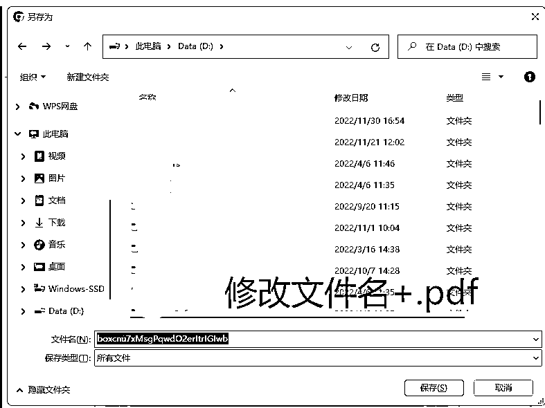

# 5.2 如何调教 ChatGPT 建立自己的模型？

OpenAI 官方和吴恩达联手推出了一门面向开发者的技术教程：[《ChatGPT 提示工程》](https://learn.deeplearning.ai/)。

该教程总共分为 9 个章节，总一个多小时，里面主要涵盖：提示词最佳实践、评论情感分类、文本总结、邮件撰写、文本翻译、快速搭建一个聊天机器人等等。

除了能在这个教程里面学到如何使用 Prompt，你还能学到 GPT 接口调用开发知识。有需要的话，你甚至能在这个教程之上去延伸扩展，搭建出一款令人惊艳的应用。

不过当下这个教程只有英文版，如果大家有兴趣，也可以到 B 站上找到 UP 主翻译的中文字幕的视频进行学习。

•中文视频：[01。 课程介绍（吴恩达 x Open AI ChatGPT 提示工程教程）_ 哔哩哔哩 _bilibili](https://www.bilibili.com/video/BV1s24y1F7eq/)

•英文视频：[`learn.deeplearning.ai/`](https://learn.deeplearning.ai/)

另外，ChatGPT 风向标的星球中，也有贴心的圈友分享了关于建立模型的经验分享，附在这里供大家参考：

[ChatGPT 之训练自己的模型.pdf](https://search01.shengcaiyoushu.com/upload/doc/NuuKd7IKyoWKRnxXY08cirwzncd/Rp0mbzmzSoygfaxqdN1co43ynJh)

注：如果下载后无法打开，或文件名为乱码，请自己修改文件名，并添加后缀「。pdf」，并将「保存类型」选择为「所有文件」:

圈友 @常常也分享了一个丰富的 ChatGPT 资料库，有近百个基于 ChatGPT API，且允许配置自己的 API key 的工具和应用的精选列表，可以当做是一个小型的 AI 项目库进行参考：《 ChatGPT 资料库分享》。

