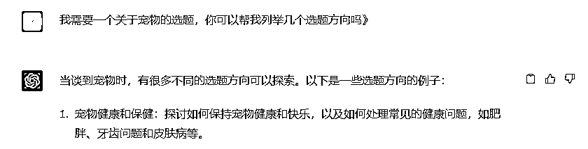
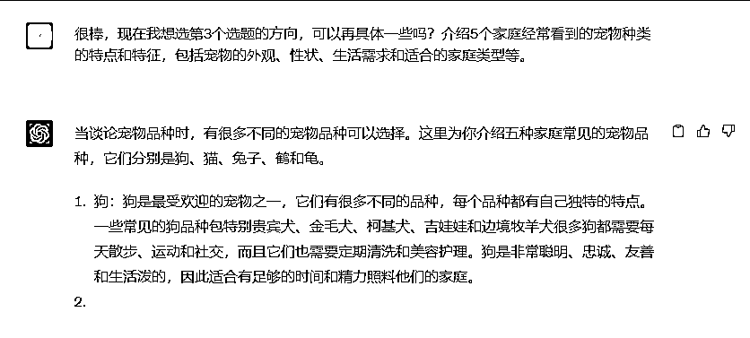

# 6.2 通过简单的方向提示引出选题

以下是一些使用 ChatGPT 生成文章选题的具体步骤：

1\. 输入一个简单的提示或问题，例如“健康饮食的话题”或“如何提示写作技巧”等。

2\. 选择一个合适的模型和参数，根据你的文章类型和预期读者群体选择不同的模型或参数。

3\. 点击生成按钮，ChatGPT 将自动生成一些与提示或问题相关的文章选题。你可以在生成的结果中选择一个或多个选题，或者将其作为起点产生更多的选题。

在 ChatGPT 帮助你生成一些文章选题后，你可以使用关键词和主题词来扩展，进一步挖掘文章的深度和广度。以下是一些具体的方法：

1\. 使用关键词生成工具或搜索引擎来寻找与选题相关的关键词和短语。例如，如果你正好在写一篇关于健康饮食的文章，可以输入“健康饮食”或“饮食习惯”等关键词，以寻找与之相关的更多关键词和短句。

2\. 使用主题词表或分类系统来扩展选题。例如，如果你正在写一篇关于科技趋势的文章，可以使用“科技”、“趋势”等主题词来扩展主题。

3\. 借助 ChatGPT 的文本生成能力，使用关键词和主题词来自动生成更多的文章内容，以帮助您更深入地探索选题。

以上内容来自 ChatGPT 。

我们来举一个简单的案例：

首先，我们需要确定一个想要创作的大方向，如：“宠物”、“美食”、“汽车”等等，让 ChatGPT 提供几个选题方向。你可以决定选题方向的数量，也可以让它自由发挥。

如果这些选题方向你都不满意，给它更多你想要的选题的特点信息，请他继续提供新选题。

如果它给到的选题中，有你觉得不错的方向，那么可以进行下一步，让他提供该选题更细节的内容。

