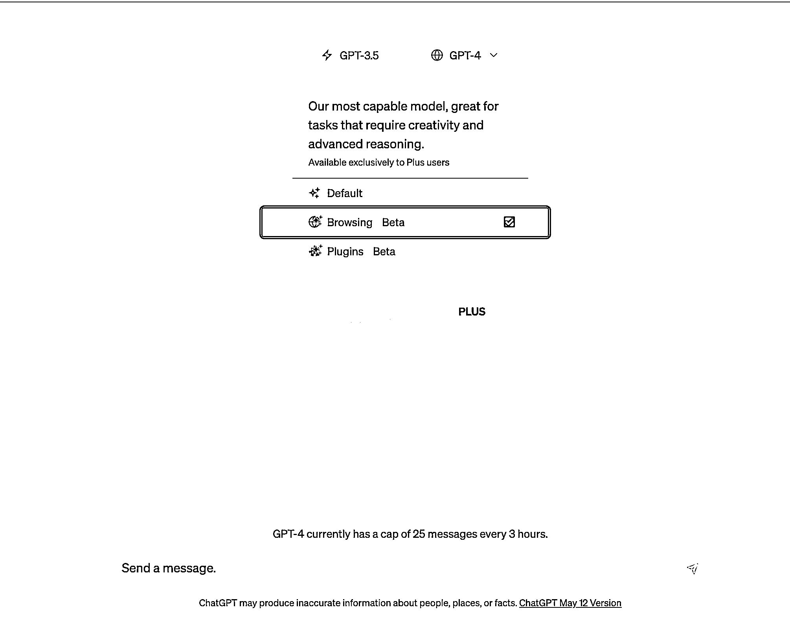

# 6.3 根据社交媒体、网站上的相关信息挖掘选题

联合网站和社交媒体是获取选题的另一种好方法。这些网站和平台经常会联合大量用户产品的内容和话题，因此可以通过浏览和分析这些内容和话题来获取更多的选题。以下是一些具体的方法：

1.使用 Reddit、Quora、知乎等问题回答社区来寻找与选题相关的问题和回答。这些社区经常有大量的用户参与，可以提供丰富的内容和理解。

2.使用 Twitter、Facebook、Instagram 等社交媒体平台来寻找与选题相关的话题和趋势。这些平台常会聚集大量的用户生成的内容，包括文章、图片、视频等。

3.使用谷歌新闻、Feedly 等联合网站来获取与选题相关的最新新闻和文章。这些网站经常会联合来自不同来源的新闻和文章，提供了多种化的内容和观点。

以上是一些使用聚合网站和社交媒体发掘灵感和主题的方法。通过综合运用这些方法，可以帮助你更好地生成和扩展文章主题，从而提升你的自媒体创作水平。

以上内容来自 ChatGPT 。

需要注意的是，目前免费版 ChatGPT 没有办法联网，它无法自主阅读网站上的最新内容。需要我们把相关的信息以文字形式提供给它学习。

ChatGPT Plus 版已支持联网，如果你的是 ChatGPT Plus 版，可以选择 ChatGPT 4.0 - 联网功能，就可以联网，让他查找并且提炼出你想要的信息。

当确定一个具体的选题之后，我们就可以根据这个选题，进行具体的内容创作了。

