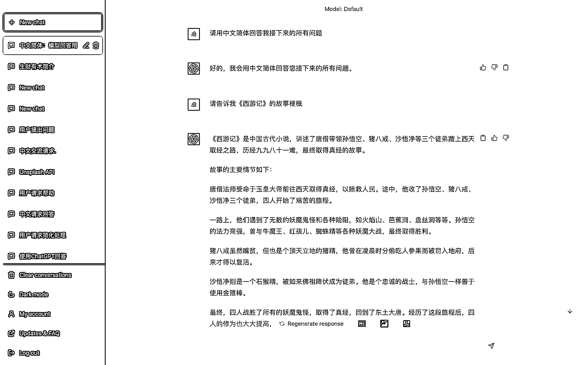
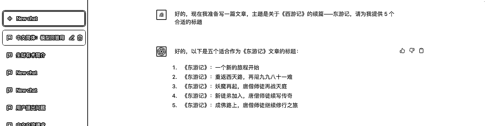
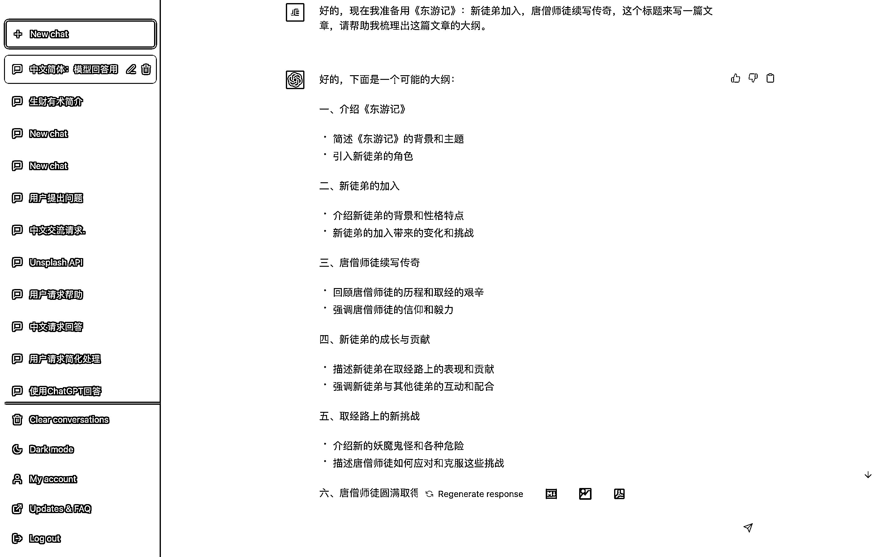
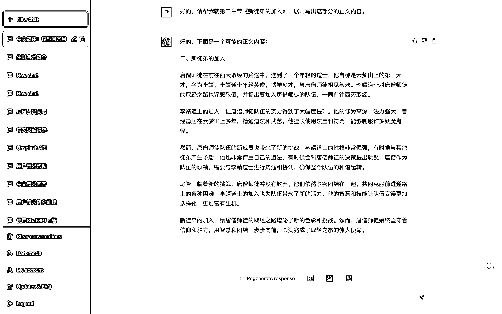

# 7.1.1.1 方式一：无中生有，让 ChatGPT 自己创造内容

ChatGPT 无法创作长文，但是可以借助他可以理解上下文的能力，通过引导，使得他一步步创造出内容。

下文以《西游记》的续篇——《东游记》为例，向你展示如何引导 ChatGPT 一步步写出完整的文案。

第一步：先做好前置对话，确保 ChatGPT 正确理解我们要表达的意思

第二步：再给到主题，让 ChatGPT 生成文章标题

第三步：让 ChatGPT 围绕标题给出文章大纲

第四步：让 ChatGPT 逐步展开大纲里的小节内容

后面的步骤就是重复第三步，让 ChatGPT 对照着大纲展开写出内容即可。

以上是一个标准的文案创作步骤，总结下流程：

•前置对话

•生产标题

•生产大纲

•生产正文

前置对话非常重要，直接决定了 ChatGPT 后续生产的内容是否满足你的需求。

需要注意的是：

如果你想要 ChatGPT 对文章内容进一步润色的话，建议将想要修改的内容粘贴至另一处 Chat 对话，让其专门为你润色内容，而不是在原 Chat 里进行修改，避免因为大量的文本内容输入，使得 ChatGPT 理解错意思。