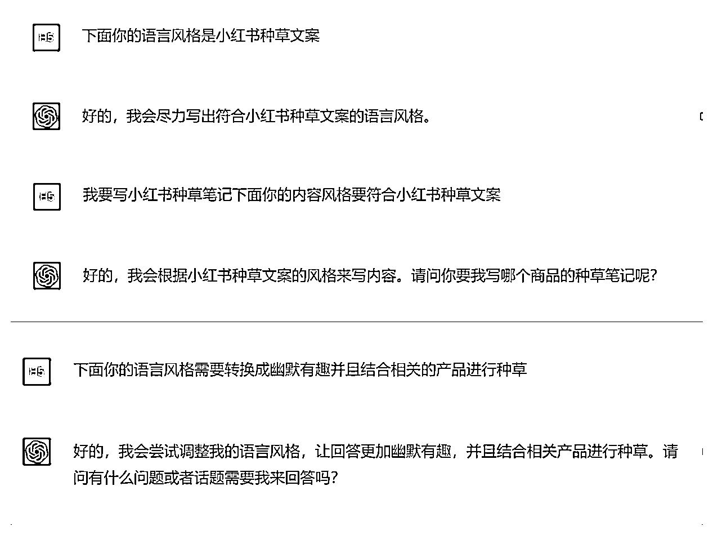
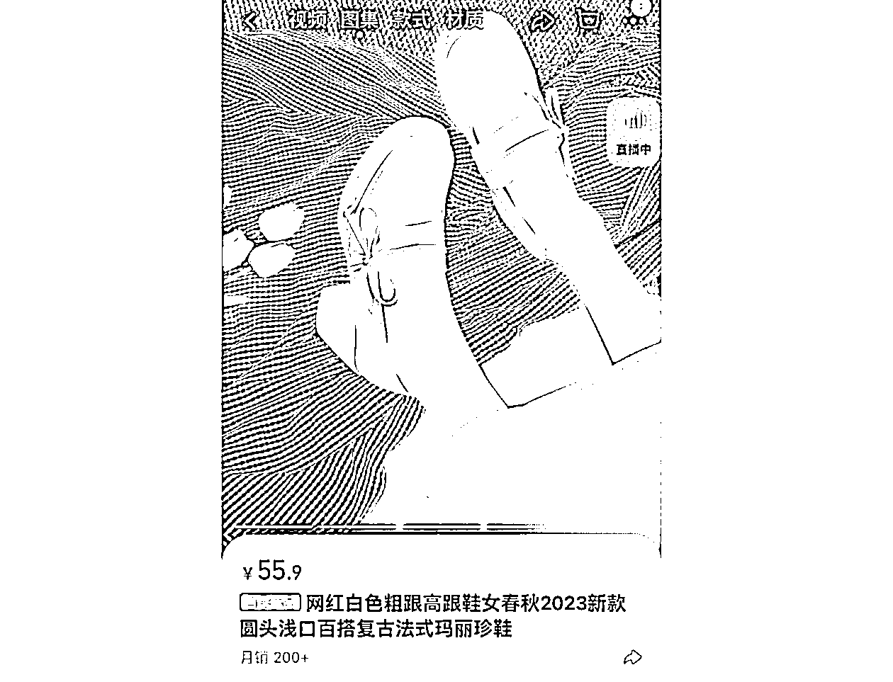
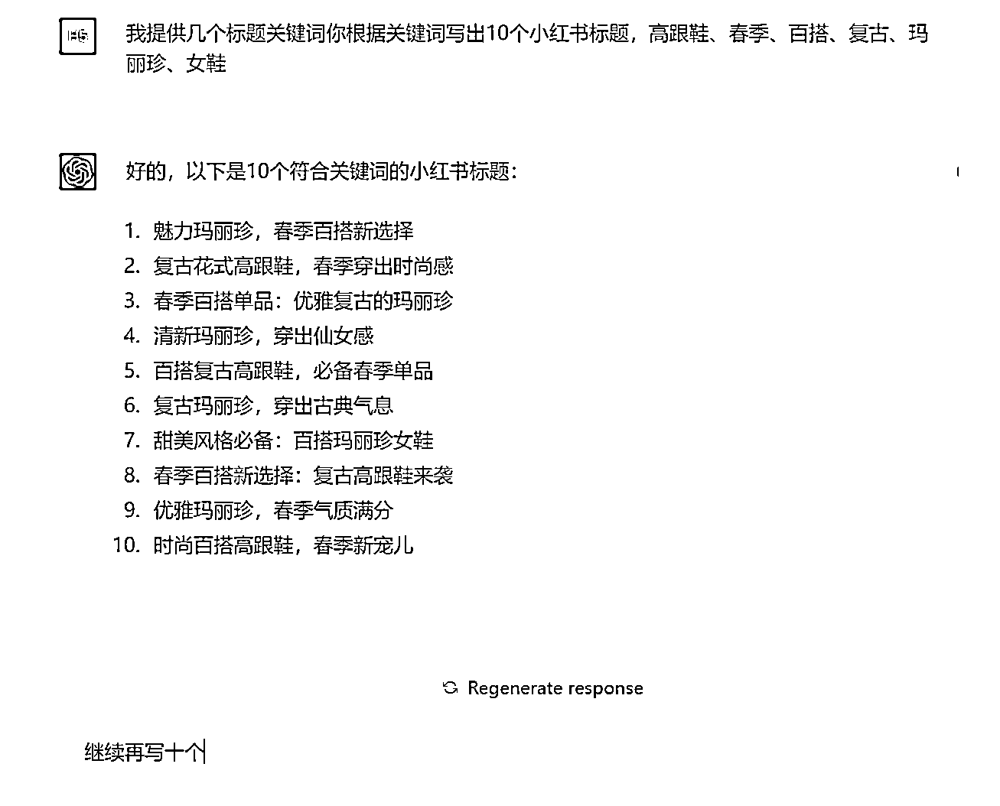
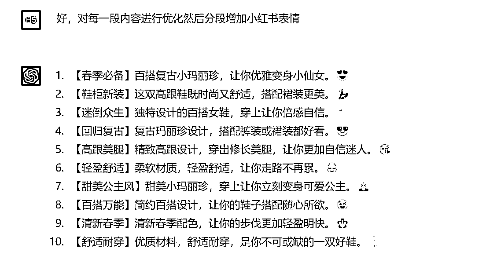
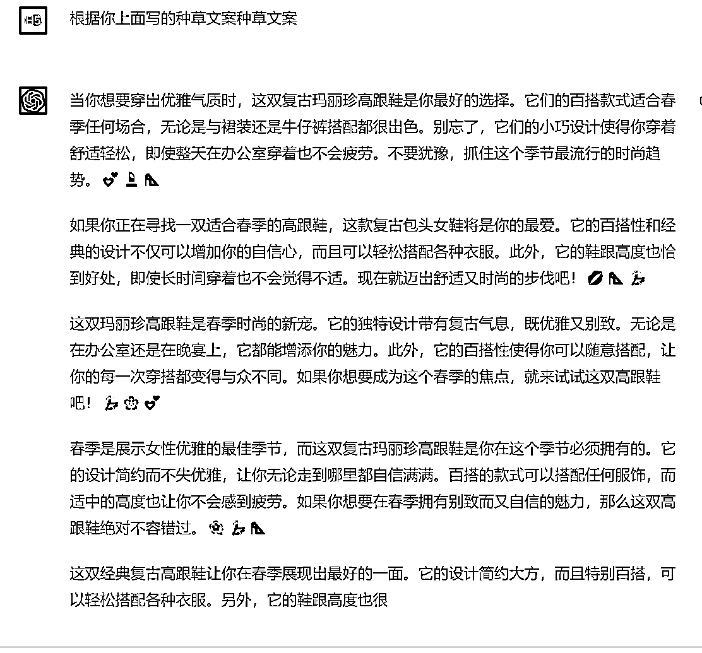
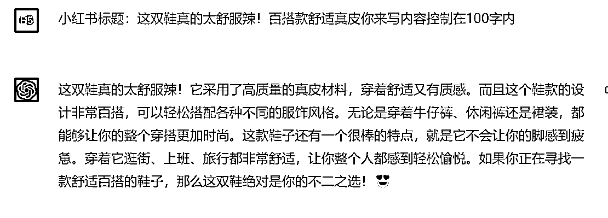
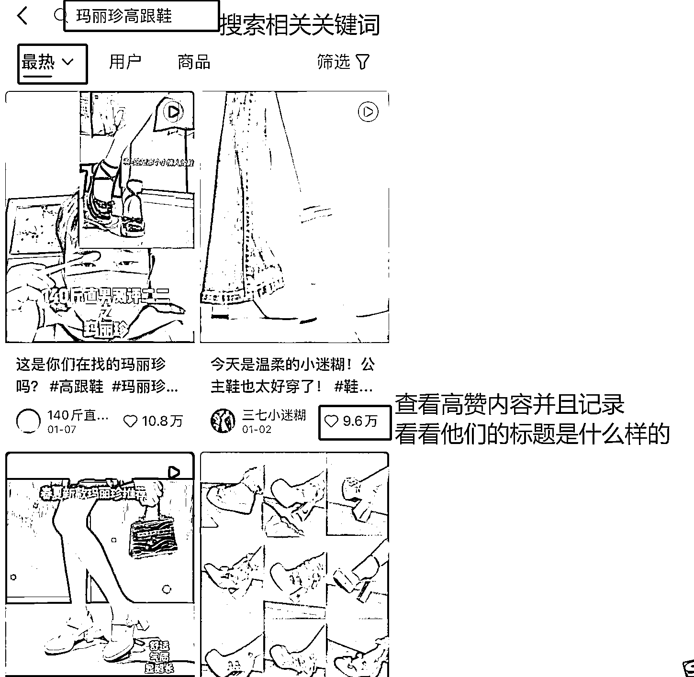
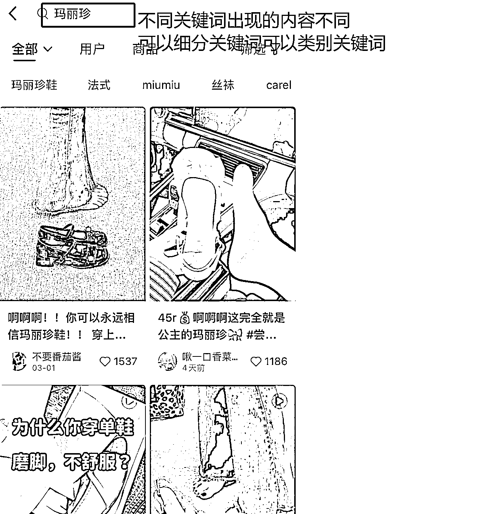

# 7.1.2.1 带货类内容 @曜文

带货类的内容中，最核心的就是对产品的介绍，以及突出描述卖点，因此在做这类内容时，我们需要引导 ChatGPT 了解你的带货产品，并且让他可以通过你想要的风格写一篇推荐内容，并且突出卖点。

第一步：设定身份

首先 ChatGPT 的回答很官方，类似你在百度上面搜相关的内容的百科回答，所以，你需要在让 AI 帮助你创作内容的时候，让他改变一下语言风格，写出来的内容会更接地气。

例如：

当然，你可以根据你的产品或者你想生产哪种风格的文案对他进行调试。比如，你想要写点干货，或者写热点，你尽管把你的要求告诉它，让它按照你的想法来生成内容。这里以小红书种草内容为例。

延伸：比如微博、知乎、得物，同理也可以让他调整，最后再结合对应的平台进行优化让内容符合平台属性实现流量的倍增。

第二步：产出标题和内容

拿小红书举例，我想要做一款女鞋

如图：

我们先把这款鞋子的关键词提取出来，例如：高跟鞋、春季、百搭、复古、玛丽珍、女鞋。让 AI 生产给出明确指令：

如果不满意还可以让他进行二次优化。

此步骤你可以生成 10 条 20 条甚至是 50 条，以便于让自己有更多的灵感。

下面让它根据生产的标题来写内容：

你还可以让它单独为一个标题写内容：

OK，此步骤你如果已经产出了 10 条内容，那么把内容记录下来并且保存到文档。

第三步：优化内容

优化内容前我们需要做一个准备，那就是查找小红书近期的热搜词和关键词。

然后把上面 AI 生产的内容优化后的标题和找到的爆款标题结合优化一下，不出 3 分钟你就会得到一组更符合小红书风格的标题。也可以把找到的爆款标题喂给 ChatGPT ，让它学习并生成更符合的标题。

1.粗跟玛丽珍，春季百搭又甜又欲 2.复古玛丽珍高跟鞋，穿上直接一米八 3.百搭单品超优雅，姐妹快来夸爆它！4.男票说这双鞋直接穿出仙女感 5.任何人没有这双百搭复古高跟鞋，我都会伤心 6.复古玛丽珍，穿出古典气息 7.超甜美风格不允许你没有这双百搭玛丽珍女鞋 8.复古高跟鞋来袭春季百搭太爱了 9.优雅迷人玛丽珍，闺蜜说气质满分 10.这双玛丽珍！时尚百搭春季再也不怕不会搭衣服

接下来我们可以用同样的方法优化笔记内容，我总结了一个优化公式：生产内容-生硬词+语气助词+高赞参考=新的原创内容。

1.姐妹们优雅气质肯定少不了这双复古玛丽珍高跟鞋百搭款式适合春季任何场合无论是与裙装还是牛仔裤搭配都很出色小巧设计使得你穿着舒适轻松，即使整天在办公室穿着也不会疲劳不要犹豫，抓住这个季节最流行的时尚趋势。💕💄👠
2.如果你正在寻找一双适合春季的高跟鞋这款复古玛丽珍将是你的最爱百搭性和经典的设计不仅可以增加自信心而且可以轻松搭配各种衣服鞋跟高度也恰到好处，即使长时间穿着也不会觉得不适左下角赶紧冲！到了就迈出舒适又时尚的步伐！💋👠💃
3.春季时尚的新宠！！！设计自带复古气息，既优雅又别致无论是在办公室还是晚宴都能增添魅力超百搭可以随意搭配让你的每一次穿搭都变得与众不同如果你想要成为这个春季的焦点，就来试试这双高跟鞋吧！💃🌸💕
4.展示女性优雅的最佳季节这双复古玛丽珍高跟鞋这个季节必须拥有设计简约而不失优雅，无论走到哪里都自信满满百搭的款式可以搭配任何服饰，而适中的高度也让你不会感到疲劳让姐妹们在春季拥有别致而又自信的魅力🌺💃👠

优化后，读起来是不是顺畅许多了，把 AI 生成的一些停顿词去掉，带入点种草风格，不到 10 分钟就能完成 10 篇内容。

内容来源：《如何用 chatGPT 批量生产小红书爆款内容》

