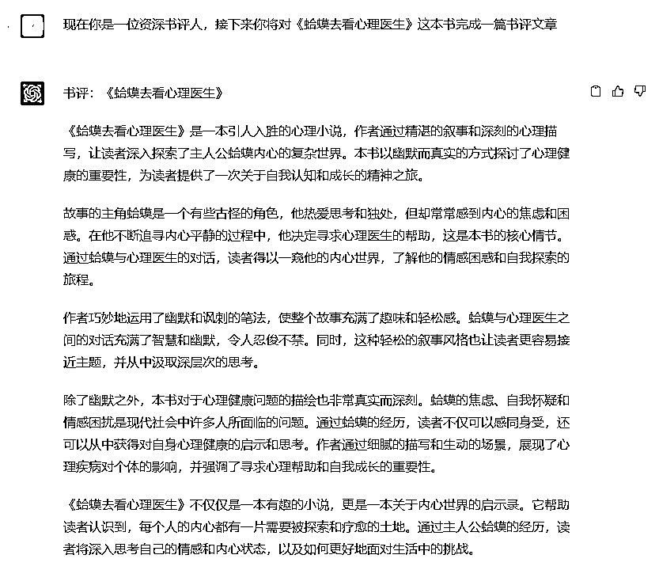
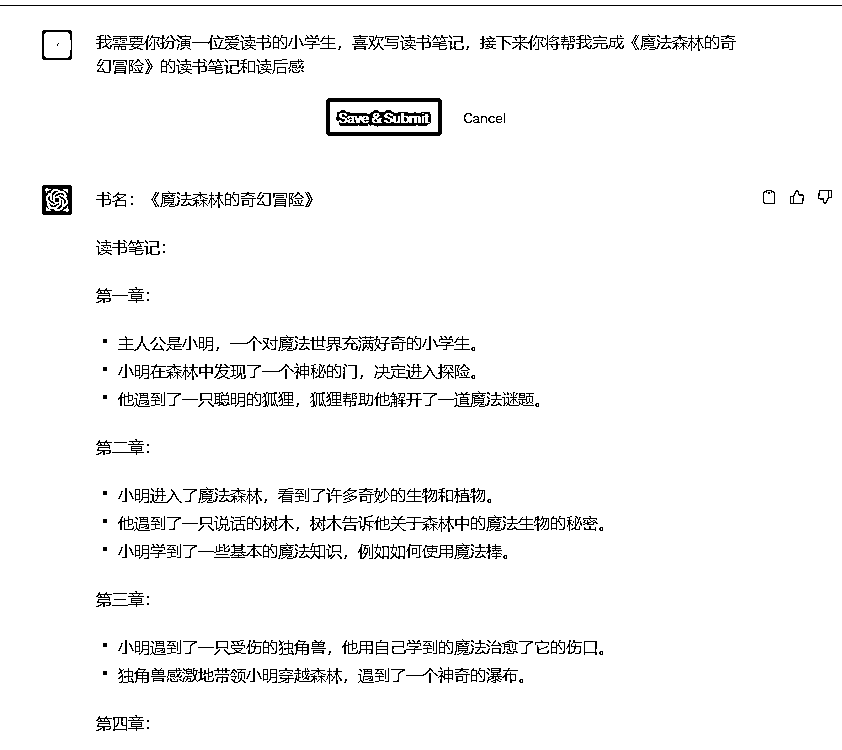
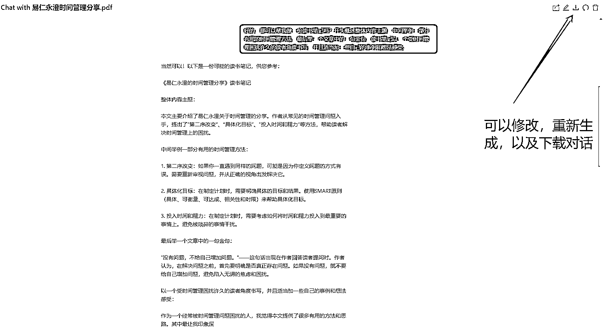
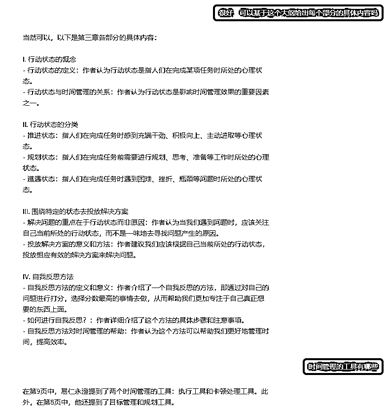
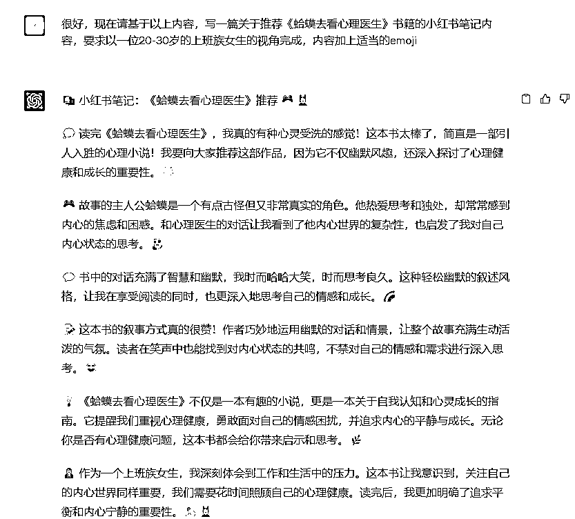
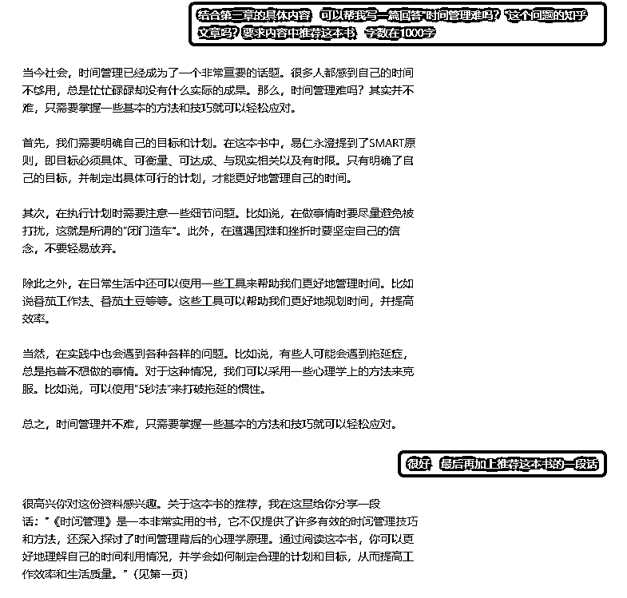

# 7.1.2.2 读书笔记类内容 @肉松

读书笔记类的内容，一般是基于一本书或是一篇文章的内容，文章比较长，我们无法将内容详细的列出来喂给 ChatGPT 。所以我们可以有两种办法获得相关读书笔记或者书评。

方法一：直接让 ChatGPT 做某本书的整体书评

首先，我们需要设定身份，我们可以根据目标用户，来确定对应合适的身份，以下是可以参考的设定身份提示词：

•现在你是一位资深书评人，接下来你将对这本《XXX》完成一篇书评文章

•我需要你扮演一位爱读书的小学生，喜欢写读书笔记，接下来你将帮我完成《XXX》的读书笔记和读后感

方法二：使用 [ChatPDF](https://www.chatpdf.com/) 这个内容分析工具

但以上的方法只能获得一篇基于整本书的读书笔记，如果想要获取某个章节的相关内容，你也可以将书籍变成 PDF 文档，上传到 [ChatPDF](https://www.chatpdf.com/) 这个工具进行使用。（相同功能的国内平替工具：[Chat2Doc](https://chat2doc.cn/?pid=112561171&trade_no=2023033015001878865&out_trade_no=f32e5260698445109e72e5235238b4ee&type=alipay&name=Chat2Doc%E9%AB%98%E7%BA%A7%E7%89%88&money=5.00&trade_status=TRADE_SUCCESS&sign=0aa327762697ca54bf22e0507d139c85&sign_type=MD5)）

[ChatPDF](https://www.chatpdf.com/) 是基于 ChatGPT API 的 PDF 内容分析工具。上传 PDF 文件后，可以对它提问任何关于这份 PDF 的问题，适合快速提取各种 paper 论文的摘要，支持中文输出。免费版每天可以上传 3 份 PDF。

如果想提问的内容不在 ChatGPT 的资料库中，也可以通过 [ChatPDF](https://www.chatpdf.com/) 完成笔记相关内容。然后将获取到的内容在 ChatGPT 上进行改写。

当我们拿到想要的内容后，就可以根据我们要使用的场景进行内容的改写啦。说明内容风格、篇幅、人设等要求，让 ChatGPT 给出更符合我们期待的内容。

例如我们想写一篇小红书笔记，提示词可以是：

请基于以上内容，写一篇关于推荐 XXX 书籍的小红书笔记内容，要求以一位 20 - 30 岁的上班族女生的视角完成，内容加上适当的 emoji。

如果想写一篇知乎文章，提示词可以是：

结合 XX 内容，写一篇回答某一个知乎问题的文章，要求内容中推荐这本书，字数在 XX 字。

需要注意的是，现在图文类的平台对 ChatGPT 直接生成的文章会做识别，并且有一定限流，因此大家需要对文章进行润色，然后再进行发布。

一个更好的使用 ChatGPT 的建议：由于 ChatGPT 可以根据上下文的内容来理解你提的问题，所以尽量不要一个 Chat 内进行多主题的提问，一个 Chat 对应一个主题。因此我们可以用一个 Chat 专门产出读书笔记和书评内容，把需要用到的内容放到另一个 Chat 中专门调整内容风格。

