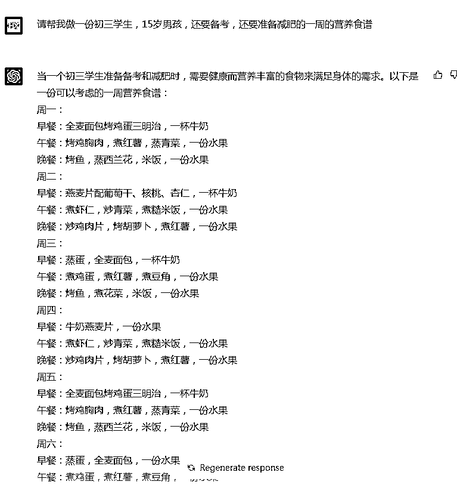
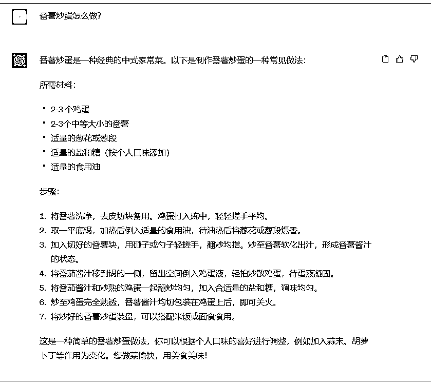
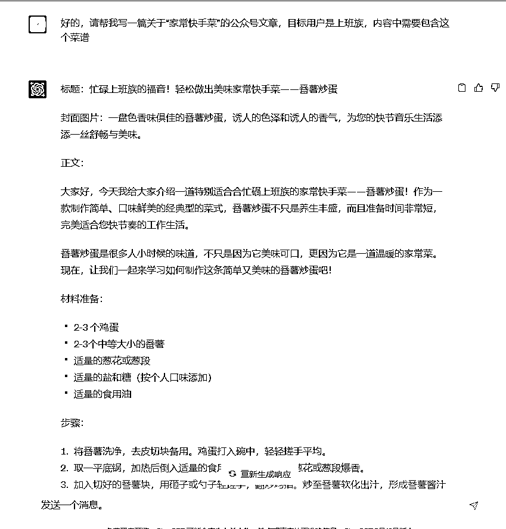
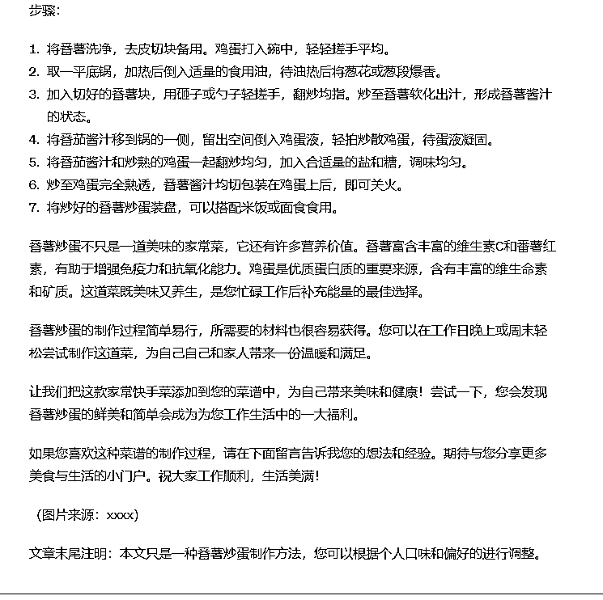
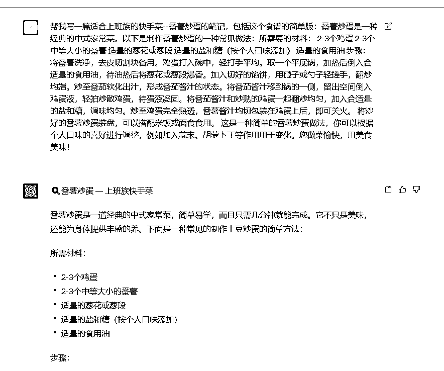
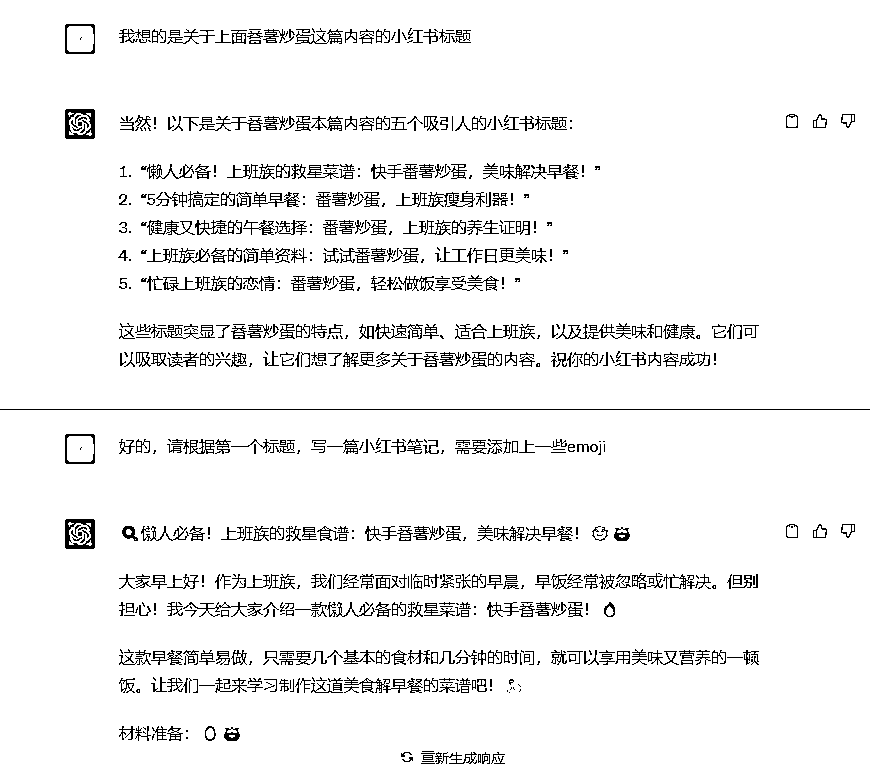

# 7.1.2.3 科普类内容 @肉松 @石头

科普类内容是指通过文字或图片、视频等方式分享某一领域的专业性知识的内容，主要的选题方向有：

•科学原理：例如物理学、化学、生物学等的基本原理和实际应用。

•科技发展：例如新科技的出现和发展，比如人工智能、区块链等。

•健康生活：例如饮食健康、运动健身、心理健康等方面的科学知识。

•自然环境：例如气候变化、生物多样性、资源保护等方面的科学知识。

•生活小常识：例如生活中的科学小知识、生活技巧等。

在使用 ChatGPT 之前，我们需要自己搜索相关资料，并且完成内容撰写，现在我们可以用 ChatGPT 完成专业性内容的整理，并且完成初步的内容，可以大大的节省产出内容的时间。这里以一个简单的饮食菜谱相关内容作为例子。

提示词：

•安排每日食谱：请帮我做一份初三学生，15 岁男孩，还要备考，还要准备减肥的一周的营养食谱•具体一道菜的做法：XXX 怎么做？

当拿到我们想要的专业性内容后，开始修改风格和增加其他上下文内容，例如我想要写一篇给上班族看的快手菜文章，就可以基于上面的番茄炒蛋菜谱继续往下，或者把这个菜谱内容放到另一个 Chat 中调整内容风格，提示词可以是：

请帮我写一篇关于“XXX 主题”的 XXX 文章，目标用户是 XXX，内容中需要包含这个菜谱。

请帮我写一篇关于“家常快手菜”的公众号文章，目标用户是上班族，内容中需要包含这个菜谱

也可以在另一个 Chat 中完成内容和标题，多次优化后，就可以获得比较合适的内容了。我们只要进行微调，就可以发布这篇笔记内容了。

利用 ChatGPT 完成科普类内容，可以帮我们省略查找资料，拼接等等步骤，加快了产出内容的速度。不过做这类自媒体会对内容的准确度，真实性有要求，即使现在 ChatGPT Plus 版已经可以联网，但避免 ChatGPT 的回答不准确，我们自己还是需要对这些内容有一定的了解，方便辨别生成内容的真实性。

内容来源：《针对要中考、高考学生定制营养食谱课程》

