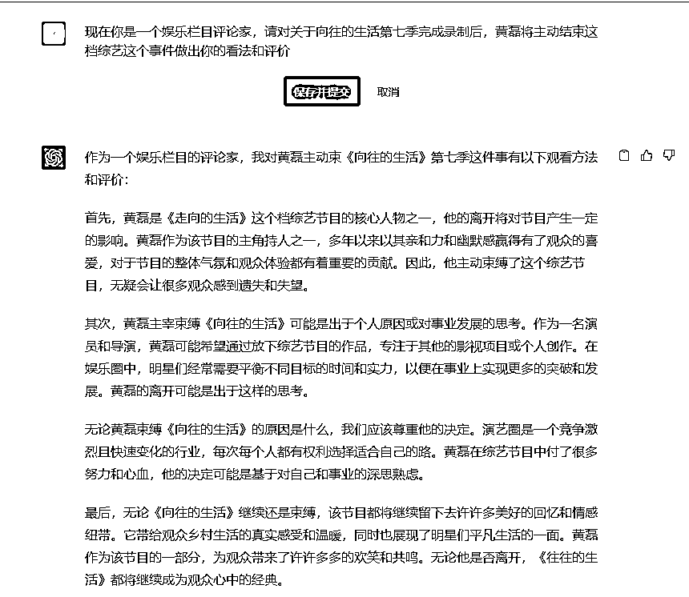

# 7.1.2.4 时事新闻 @肉松

如果你想要写一篇关于时事新闻的报道，以下是您需要提供给 ChatGPT 以及它可能需要了解的信息：

1.新闻主题和标题：请告诉我您想要报道的主题或事件，并提供一个标题。

2.事件的背景信息：这将帮助我更好地了解新闻事件的历史和现状。例如，如果新闻涉足政治、经济或社会问题，您可以提供相关的历史信息、数据或背景知识。

3.相关人物或机构：如果新闻触及到相关人物或机构，例如政府官员、公司领导、专家学者或民间组织等，请提供他们的姓名、职务或其他重要的身份信息。

4.新的进展或影响：如果新闻是一个正在发展的事件，请提供最新的信息和进展，并尽可能详细地描述这些进展对相关人群和社会的影响。如果可能的话，您还可以提供一些专家或权威人士的评论或者分析，以帮助阅读者更好地理解事件。

5.资料来源：为了保证文章的准确性和可信度，请提供一些可靠的资料来源，例如新闻报道、研究报告或专家访问等。如如果您自己是该事件的直接参与者或见证人，也可以提供您的亲身经历和观察。

根据这些提供的信息，ChatGPT 可以帮助你写一篇准确、客户意见和有价值的时事新闻公众号内容，以方便你足够向读者传播相关信息并引起他们的注意和思考。

以上内容来自 ChatGPT。

这里以一个简单的时事 “《向往的生活》综艺栏目第七期后不再录制” 为例。

你可以这么向 ChatGPT 提问：

现在你是一个娱乐栏目评论家，请对关于向往的生活第七季完成录制后，黄磊将主动结束这档综艺这个事件做出你的看法和评价

如果需要更多细节描述，我们就需要提供更多的相关信息给 ChatGPT，让它继续优化，再根据不同平台的风格进行改写，这样就可以产出一篇百家号文章 / 公众号文章 / 娱乐视频文案等符合自媒体账号要求的内容，甚至可以进行多个平台分发运营。

