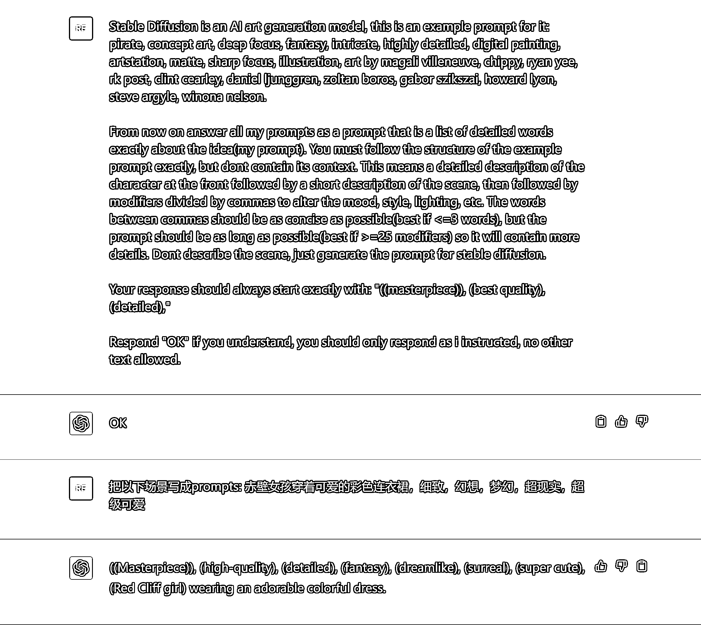

# 7.2.2.1 用 ChatGPT 获得提示词

在 ChatGPT 中输入 Prompt 如下，其中【Prompt：2】中的场景，可以根据自己的需求进行修改。

【Prompt: 1】

Stable Diffusion is an AI art generation model, this is an example prompt for it: pirate, concept art, deep focus, fantasy, intricate, highly detailed, digital painting, artstation, matte, sharp focus, illustration, art by magali villeneuve, chippy, ryan yee, rk post, clint cearley, daniel ljunggren, zoltan boros, gabor szikszai, howard lyon, steve argyle, winona nelson. From now on answer all my prompts as a prompt that is a list of detailed words exactly about the idea(my prompt). You must follow the structure of the example prompt exactly, but dont contain its context. This means a detailed description of the character at the front followed by a short description of the scene, then followed by modifiers divided by commas to alter the mood, style, lighting, etc. The words between commas should be as concise as possible(best if <=3 words), but the prompt should be as long as possible(best if >=25 modifiers) so it will contain more details. Dont describe the scene, just generate the prompt for stable diffusion. Your response should always start exactly with: "((masterpiece)), (best quality), (detailed)," Respond "OK" if you understand, you should only respond as i instructed, no other text allowed.

【Prompt：2】把以下场景写成 prompts: 赤壁女孩穿着可爱的彩色连衣裙，细致，幻想，梦幻，超现实，超级可爱

•从 ChatGPT 中获得的正提示词是这样的：

正提示词：（（Masterpiece））， （high-quality）， （detailed）， （fantasy）， （dreamlike）， （surreal）， （super cute）， （Red Cliff girl） wearing an adorable colorful dress。<lora:japaneseDollLikeness_v10:0.3>, <lora:koreanDollLikeness_v15:0.3>, <lora:taiwanDollLikeness_v10:0.2>, <lora:cuterichstyleLora300_cuterichstyleLora300:1>

• Stable Diffusion 中，还需要再输入一些负提示词，告诉它你不想要什么。以下的负提示词整理的相对全面，你可以直接取用。

负提示词：（worst quality:2）， （low quality:2）， （normal quality:2）， lowres， normal quality， （（monochrome））， （（grayscale））， skin spots， acnes， skin blemishes， age spot， backlight，（ugly:1.331）， （duplicate:1.331）， （morbid:1.21）， （mutilated:1.21）， （tranny:1.331）， deformed eyes， deformed lips， mutated hands， （poorly drawn hands:1.331）， blurry， （bad anatomy:1.21）， （bad proportions:1.331）， three arms， extra limbs， extra legs， extra arms， extra hands， （more than 2 nipples:1.331）， （missing arms:1.331）， （extra legs:1.331）， （fused fingers:1.61051）， （too many fingers:1.61051）， （unclear eyes:1.331）， bad hands， missing fingers， extra digit， （futa:1.1）， bad body， pubic hair， glans， easynegative， three feet， four feet， nsfw， naked， nude， unequal eyes， （close up:2）， untracked eyes， crossed eyes， （（（toothy）））， bra， （（（large breast）））