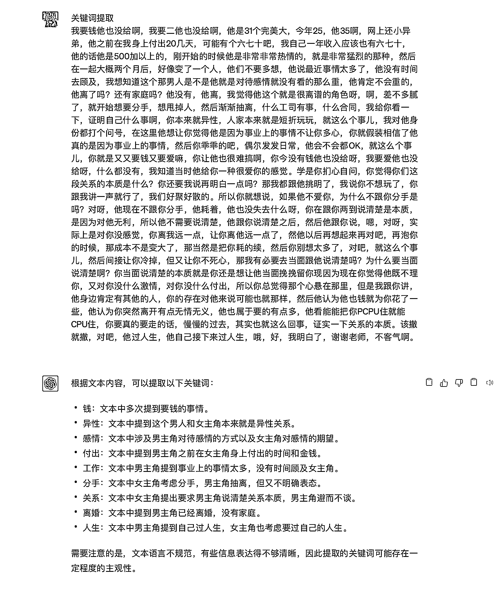
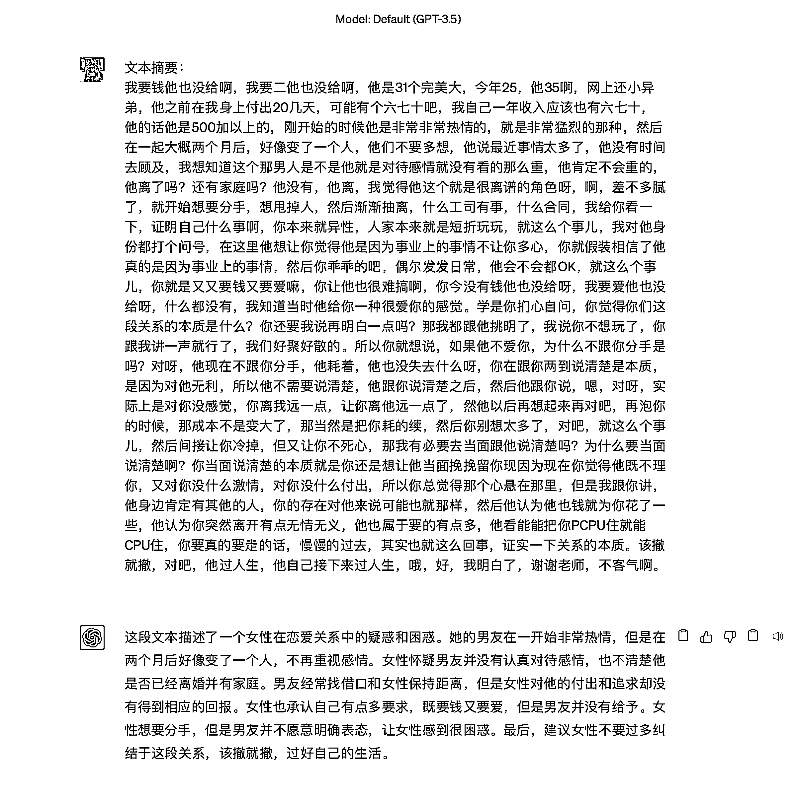
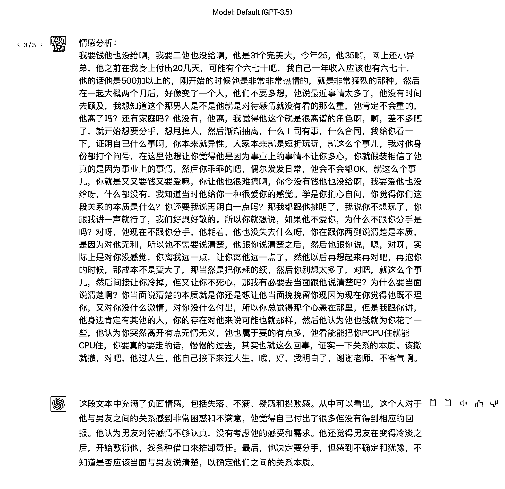

# 7.3.1 视频创作所用功能 @陈思成

•文本生成：ChatGPT 可以生成连贯、符合语法规则的文本。你可以利用 ChatGPT 生成抖音脚本、文章、对话等内容。

•关键词提取：ChatGPT 能够从输入的文本中提取关键词，有助于你了解抖音热门话题和趋势。

•文本摘要：ChatGPT 可以为较长的文本生成简洁的摘要，帮助你快速了解主要信息。

•情感分析：ChatGPT 可以分析文本中的情感倾向，从而帮助你了解观众对某个话题的喜好。

