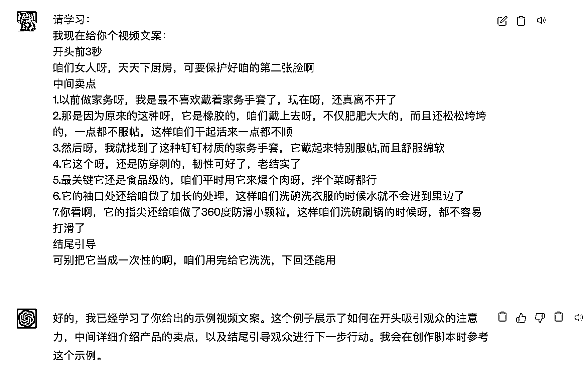
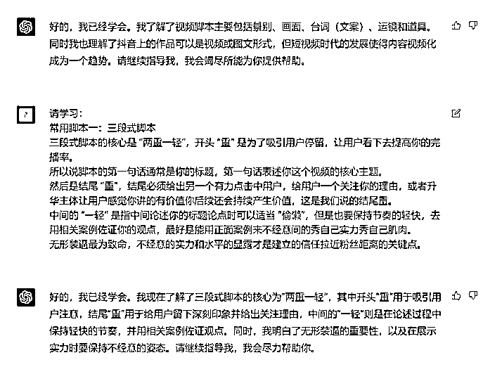
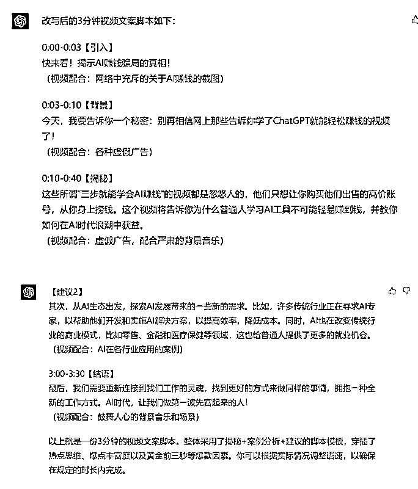

# 7.3.2.2 第二步：给 ChatGPT 输入相关案例进行学习

当你准备好使用 ChatGPT 生成与抖音风格相符的创意脚本时，可以给它更多符合你所需风格的抖音文案进行学习：

•整理素材

利用 ChatGPT 生成创意灵感。搜集与目标受众相关的话题、兴趣、趋势等信息。将这些素材输入给 ChatGPT ，帮助 ChatGPT 生成更符合抖音风格的一些新颖的创意和故事情节等脚本。

除了给 ChatGPT 提供具体的案例，你还可以结合一些相关课程资料分段提供给 ChatGPT，让它掌握更多相关技巧。

当它完成学习之后，再让它输出脚本，会更符合我们的要求。例如：

输入：

你的学习能力太棒了！请根据你学到的常用脚本模板和爆款因素，选择你认为合适的脚本模板，并由选择性地穿插爆款因素，将下面这段内容改写，形成一份 3 分钟的视频文案脚本，需要包含时长、并建议配合怎么样的视频素材。不必担心文字太长超时，我可以加快我的语速：
不要再相信网上那些告诉你学了 ChatGPT 就能赚钱的视频了，那些所谓三步就能学会 AI 赚钱的视频都是忽悠人的，他们只是希望你去购买他们售卖的高价账号，然后从你身上赚钱。

输出：

内容来源：《如何用 ChatGPT 无脑复制抖音热门口播视频》

