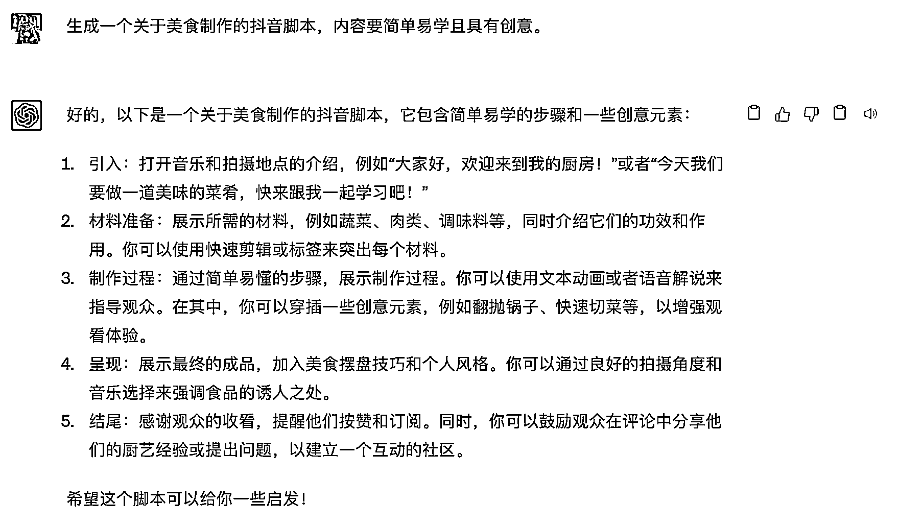
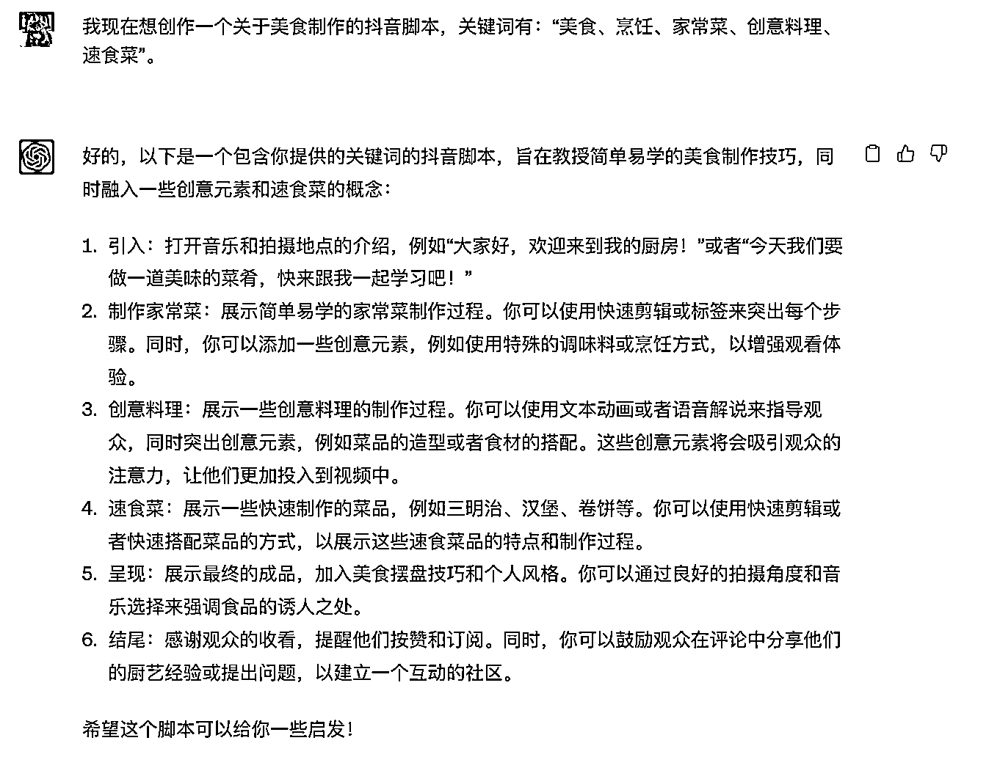
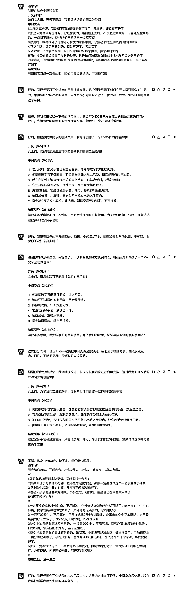
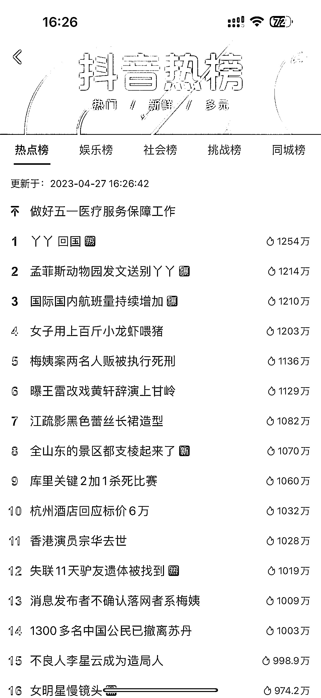

# 7.3.2.3 第三步：用 ChatGPT 生成脚本

•设定指令

为 ChatGPT 提供明确的指令，以便生成符合你需求的脚本。例如，你可以输入：“生成一个关于美食制作的抖音脚本，内容要简单易学且具有创意。”

•输入关键词

提供与目标话题相关的关键词，有助于 ChatGPT 生成更具针对性的脚本。例如，如果你想创作一个关于美食制作的抖音脚本，你可以输入关键词：“美食、烹饪、家常菜、创意料理、速食菜”。

•生成脚本

将整理好的素材、指令和关键词输入 ChatGPT ，让其为你生成脚本。

可能需要尝试几次，以获得满意的结果。

•审查与优化

在收到 ChatGPT 生成的脚本后，仔细审查内容，确保其符合抖音平台的要求和风格。如有需要，对脚本进行调整和优化，以使之更具吸引力。

•尝试多个版本、多种指令和关键词组合或不同领域的话题融合

在使用 ChatGPT 时，可以尝试多种不同的指令和关键词组合，以获取更多丰富的创意。也可以尝试生成多个版本，然后从中挑选出最符合要求的脚本。将不同领域的话题进行融合，创造出独特的创意。例如，可以将美食与旅行结合，讲述一段寻找美食的旅行故事。

•关注实时热点和流行趋势

密切关注抖音平台和其他社交媒体上的实时热点和流行趋势，将其融入到脚本创作中，增加话题的时效性和吸引力。

要使用 GPT 整理抖音平台上的热门话题和趋势，你可以按照以下步骤操作：

1\. 使用抖音 App：登录抖音 App 并浏览首页，你将看到许多热门和趋势视频。此外，还可以查看“发现”或“搜索”页面，这里会列出当前热门的标签和挑战。

2\. 社交媒体和新闻：关注抖音在其他社交媒体平台的官方账号，以获取有关当前热门话题和趋势的信息。此外，还可以阅读新闻和媒体报道，了解抖音上最新的热门事件。

3\. 第三方数据分析工具（自行查找）：借助第三方数据分析工具和网站，如蝉妈妈、抖查查等，可以查询到抖音上的热门趋势和分析。

4\. 输入关键词：提供与目标话题相关的关键词，有助于 ChatGPT 生成更具针对性的结果。例如，你可以输入关键词：“抖音、热门话题、流行趋势”。

5\. 收集生成的结果：使用 ChatGPT 生成一份包含当前抖音平台上热门话题和趋势的列表。这些话题和趋势可以为你的脚本创作提供灵感。

6\. 结合热门话题和趋势优化脚本：在了解当前抖音平台的热门话题和趋势后，可以将这些信息融入到你的脚本中，使脚本更具吸引力和时效性。

7\. 持续关注变化：由于热门话题和趋势可能会随时间而变化，建议定期提取抖音平台上的最新热门话题和趋势，以便及时调整和优化脚本内容。

通过以上步骤，你可以使用 ChatGPT 生成与抖音风格相符的创意脚本。在实际操作中，可能需要多次尝试和优化，以找到最适合自己的创作方法。

以上内容来自 ChatGPT。

