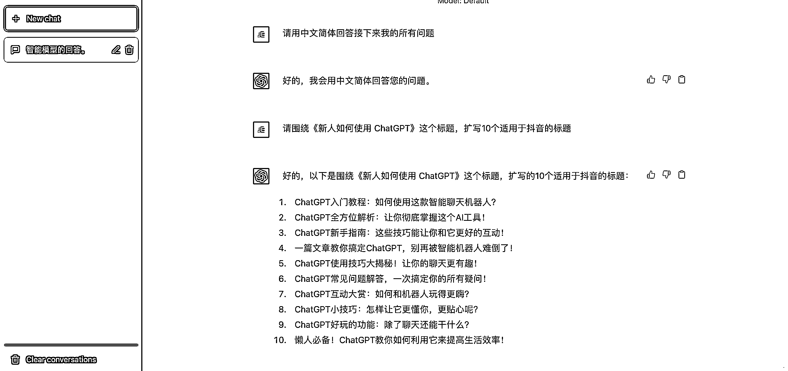
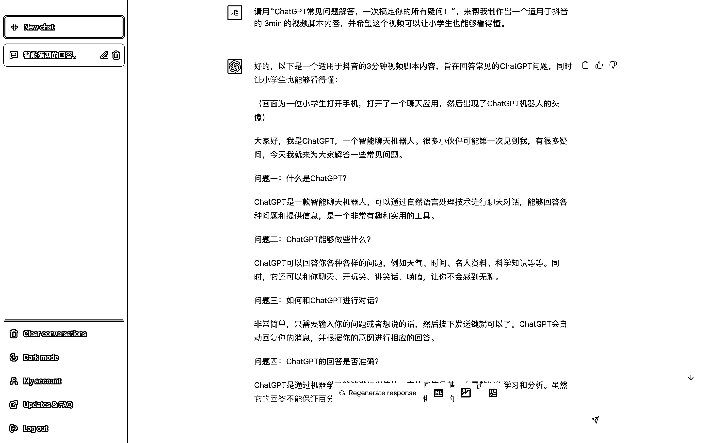
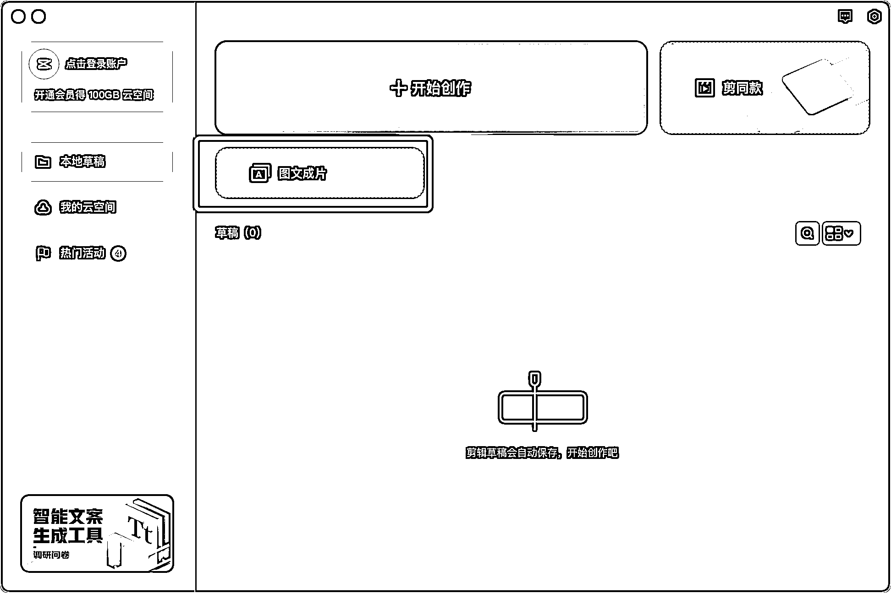
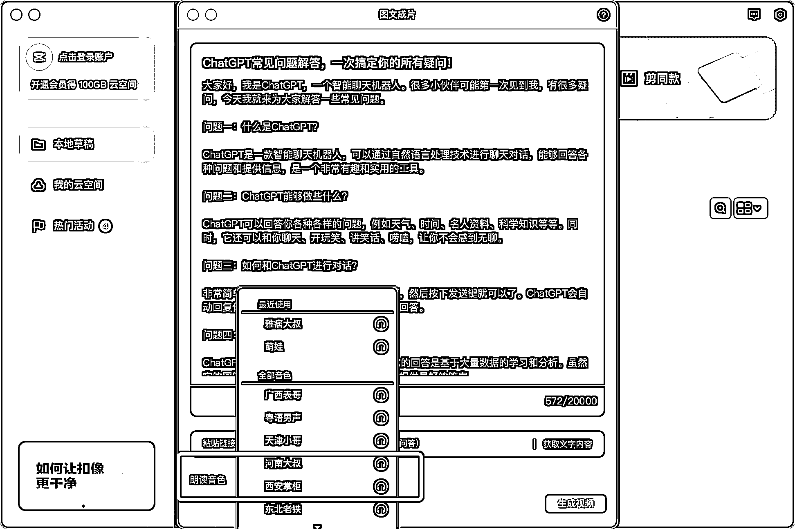
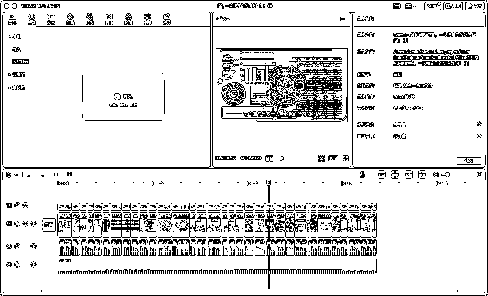

# 7.3.3.2 PPT 视频

除此之外，还有一种方式可以实现低成本的视频创作，不知道你有没有留意抖音上的一种视频形式：PPT 视频，就是通过大量的图片+解说的形式，来进行视频创作。

具体的实现路径：

•ChatGPT 生产视频标题

•ChatGPT 生产视频脚本内容

•导入剪映，一键图文成片

下面来向你具体展示操作步骤。

第一步：ChatGPT 生产视频标题

比如我们想要制作一个《新人如何使用 ChatGPT》的视频。那么我们就可以通过让 ChatGPT 先帮我们扩写一些标题，供我们选择。

第二步：ChatGPT 生产视频脚本内容

选中合适的标题后，就可以开始让 ChatGPT 围绕这个标题来生产视频脚本内容。

ChatGPT 生成的脚本内容里包含了画面介绍画面内容，如果你打算根据它提供的脚本自己拍摄制作的话，可以借鉴。

如果是打算让剪映直接生成的话，需要把画面提示词删掉，只保留画面内容部分文本。比如这里的“（画面为一位小学生打开手机，打开了一个聊天应用，然后出现了 ChatGPT 机器人的头像）”，就需要删除。

第三步：导入剪映，一键图文成片

ChatGPT 生成的脚本内容再确认没有问题之后，就可以直接导入剪映-图文成片。

在这之后，选择合适的配音音色，就可以生成一个视频。

剪映会自动帮你配好图片，这些图片内容可能会有些不太符合文本内容，但通常来说问题不会很大。如果你想要精益求精，可以把中间不合适的图片替换掉。

