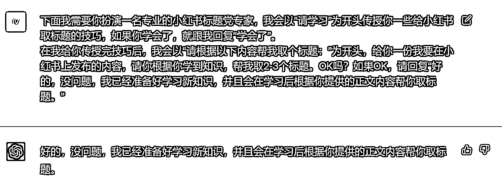

# 8.1 第一步：给身份

给 ChatGPT 设定一个对应的内容专家的身份，让它给到更为准确的回答。在这里将会用到 4.1 为 ChatGPT 设定身份 的方法。

如需要起一个小红书笔记的标题时，设定身份的提示词如下，与此同时可以和他约定后续的流程：

下面我需要你扮演一名专业的小红书标题党专家，我会以“请学习”为开头传授你一些给小红书取标题的技巧，如果你学会了，就跟我回复“学会了”。（给予学习的设定） 在我给你传授完技巧后，我会以“请根据以下内容帮我取个标题：”为开头，给你一份我要在小红书上发布的内容，请你根据你学到知识，帮我取 2-3 个标题。OK 吗？如果 OK，请回复“好的，没问题，我已经准备好学习新知识，并且会在学习后根据你提供的正文内容帮你取标题。”（给予取标题的设定）

上文括号部分为解释说明，训练时请删除；划线的地方，都是可以更换词语的地方，你可以根据自己的实际需求，自行更换，让其写正文，给选题都是可以的。

实例：

