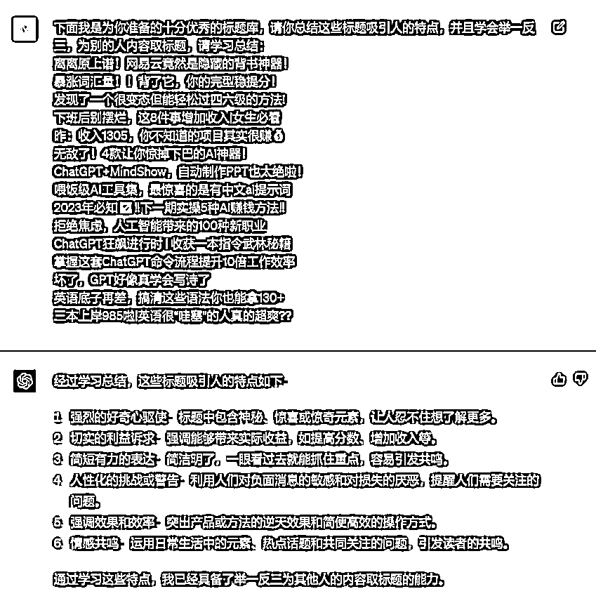
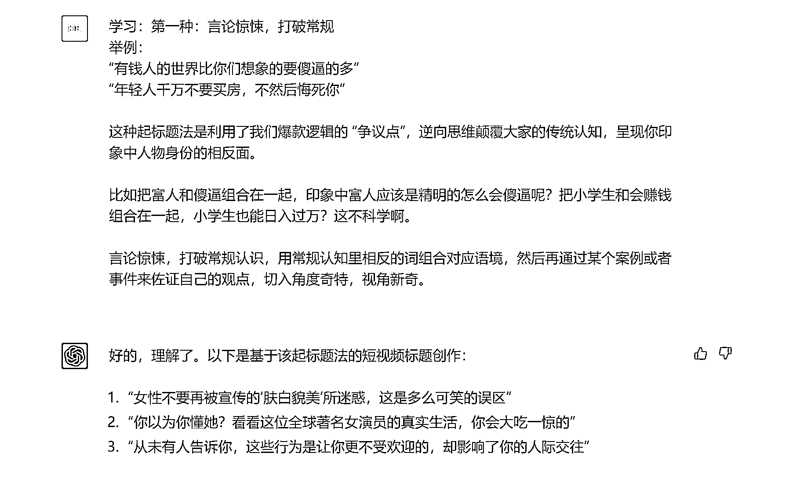
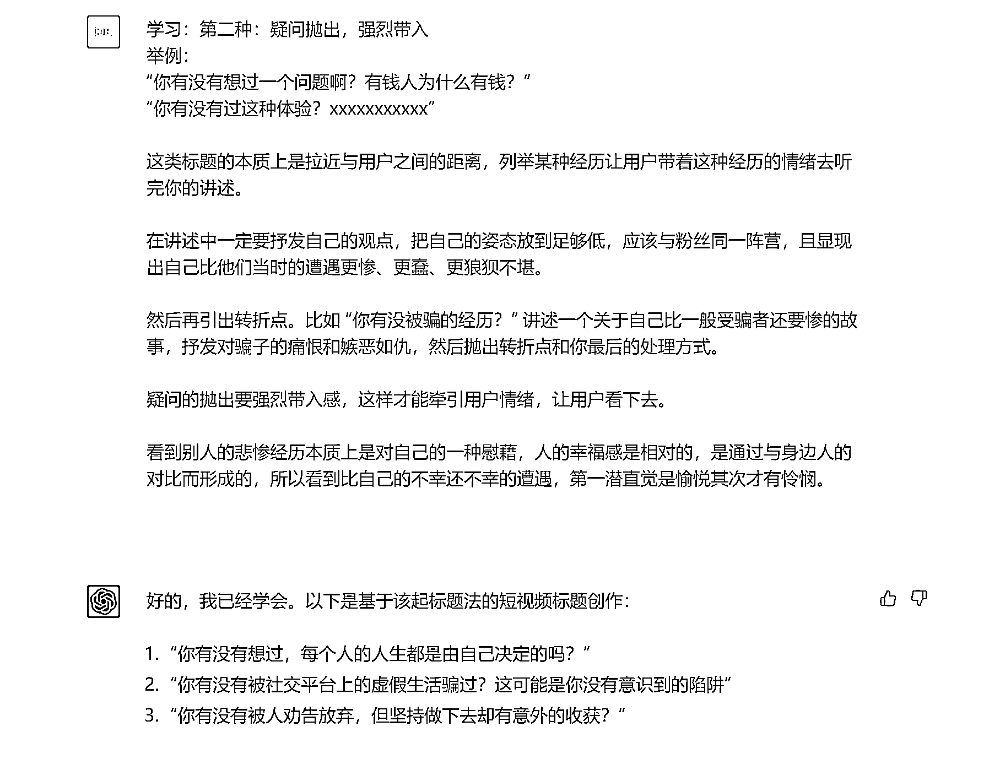
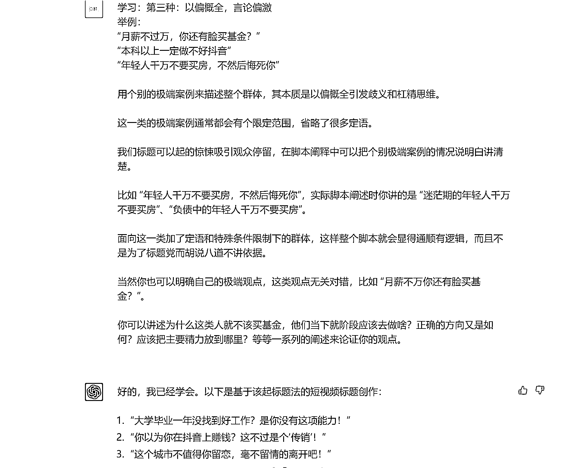
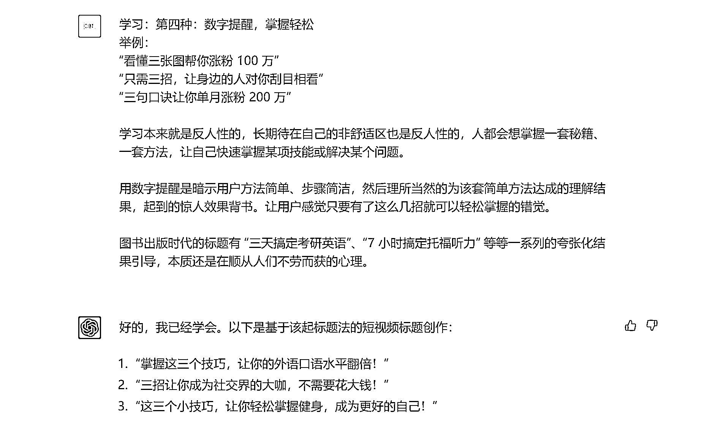
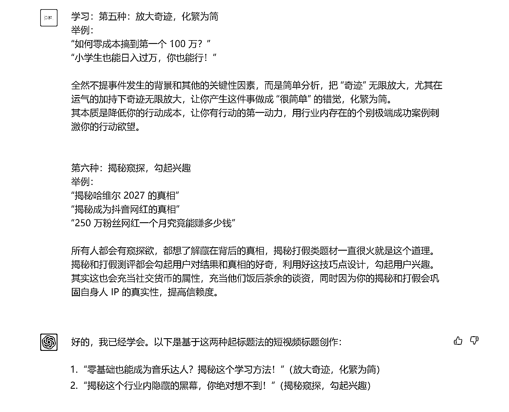
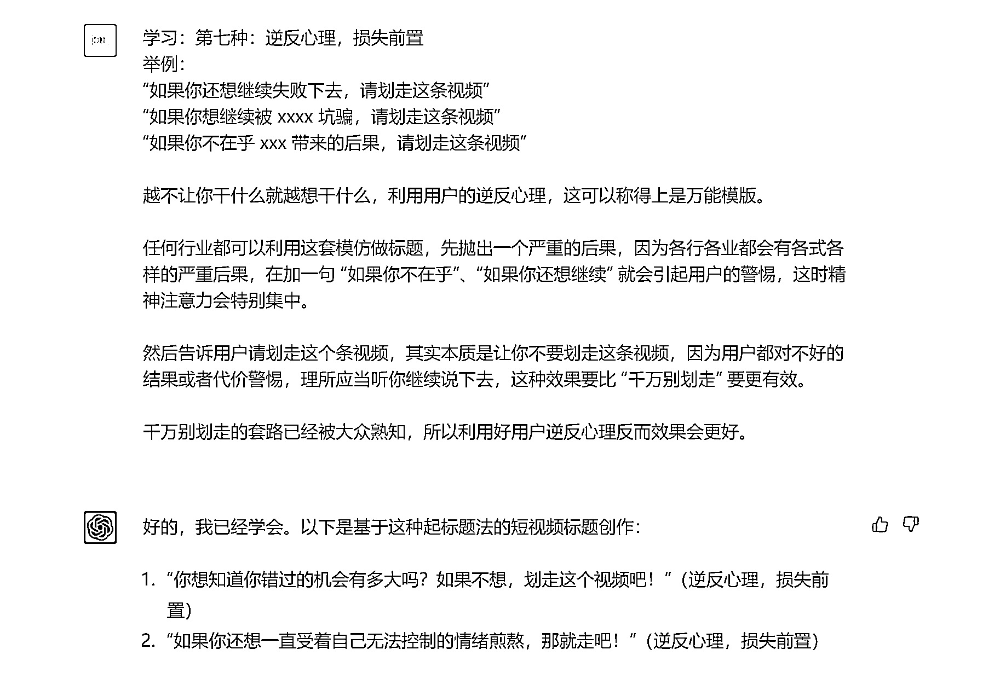

# 8.3 第三步：给案例

只是给到方法可能还不够精准，方法的表述是比较概括的，所以我们可以进一步收集一些同行的比较好的标题，给 ChatGPT 分析和学习。

提示词：

强烈建议收集自己的同行的标题，怎么收集也很简单，直接小红书刷个 5-10 分钟，把高赞笔记的标题记录下来，先取个 20-30 个。然后再选 10 个左右，你自己看到都忍不住想点开的标题。（其他平台同理）

下面我是为你准备的十分优秀的标题库，请你总结这些标题吸引人的特点，并且学会举一反三，为别的内容取标题，请学习总结： •离离原上谱！网易云竟然是隐藏的背书神器！•暴涨词汇量！！背了它，你的完型稳提分！•发现了一个很变态但能轻松过四六级的方法！•下班后别摆烂，这 8 件事增加收入|女生必看•昨天收入 1305，你不知道的项目其实很赚💰•无敌了！4 款让你惊掉下巴的 AI 神器！•ChatGPT+MindShow，自动制作 PPT 也太绝啦！•喂饭级 AI 工具集，最惊喜的是有中文 ai 提示词•2023 年必知✅‼下一期实操 5 种 AI 赚钱方法‼•拒绝焦虑，人工智能带来的 100 种新职业•ChatGPT 狂飙进行时 | 收获一本指令武林秘籍•掌握这套 ChatGPT 命令流程提升 10 倍工作效率•坏了，GPT 好像真学会写诗了•英语底子再差，搞清这些语法你也能拿 130+•三本上岸 985 啦|英语很“哇塞”的人真的超爽？？

实例：

当然，第二步和第三步，是可以融合在一起给到 ChatGPT 学习的，参考案例如下：

输入：

您是一名非常厉害的短视频博主，接下来请您担任我短视频标题制作的顾问。我会跟您分享一些参考的脚本框架。每当我以“学习”为开头输入内容时，请您认真学习并在掌握后回复“好的，我已经学会”。在我分享一系列技巧后，我以“XX+XX+XX”为开头，提供短视频标题的内容，您将根据我所分享的技巧为我创作相应的视频标题。如果您理解我的意思，请回复：“好的，李可，理解了”

注：以下所有调教内容，来自生财有术抖音 IP 1.0 大航海手册

看的出来，当把这些标题创作的脚本给到 ChatGPT 的时候，它自己创作的标题也是非常惊艳的。

到这一步，基本上就可以开始输出标题了。

