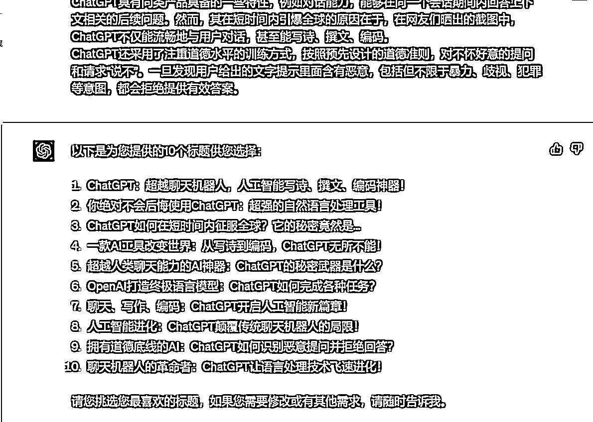

# 8.4 第四步：输出标题

这里举个例子，从百度百科复制个 GPT 的介绍，看看 GPT 能不能写出让人欲罢不能的标题来。

提示词：

你的学习能力超级棒，总结非常得到位，下面请利用你从这三块知识：1）二极管标题法；2）优秀标题库里面学到知识，给下面这段文字取 3-5 个标题供我选择： ChatGPT 是美国人工智能研究实验室 OpenAI 新推出的一种人工智能技术驱动的自然语言处理工具，使用了 Transformer 神经网络架构，也是 GPT-3.5 架构，这是一种用于处理序列数据的模型，拥有语言理解和文本生成能力，尤其是它会通过连接大量的语料库来训练模型，这些语料库包含了真实世界中的对话，使得 ChatGPT 具备上知天文下知地理，还能根据聊天的上下文进行互动的能力，做到与真正人类几乎无异的聊天场景进行交流。ChatGPT 不单是聊天机器人，还能进行撰写邮件、视频脚本、文案、翻译、代码等任务。 在 OpenAI 的官网上，ChatGPT 被描述为优化对话的语言模型，是 GPT-3.5 架构的主力模型。 ChatGPT 具有同类产品具备的一些特性，例如对话能力，能够在同一个会话期间内回答上下文相关的后续问题。然而，其在短时间内引爆全球的原因在于，在网友们晒出的截图中，ChatGPT 不仅能流畅地与用户对话，甚至能写诗、撰文、编码。 ChatGPT 还采用了注重道德水平的训练方式，按照预先设计的道德准则，对不怀好意的提问和请求“说不”。一旦发现用户给出的文字提示里面含有恶意，包括但不限于暴力、歧视、犯罪等意图，都会拒绝提供有效答案。

案例：

