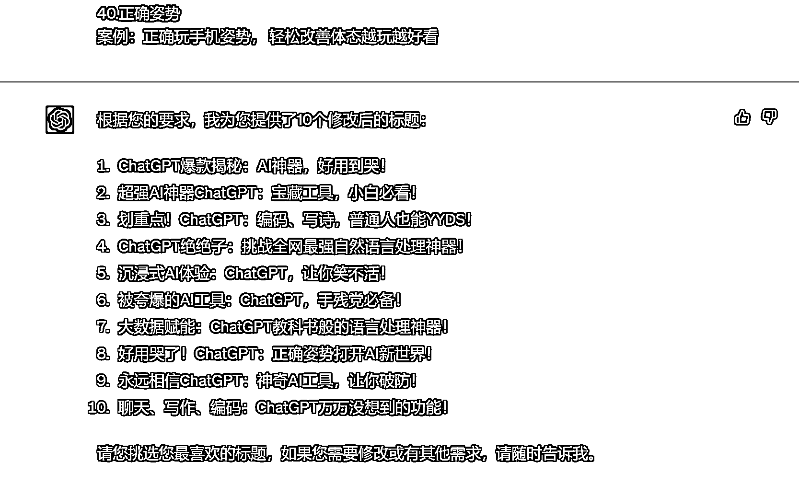

# 8.5 第五步：关键词修正

因为每个平台有独属于自己的调性，所以在每个平台都会有独属于相应的平台的爆款关键词，所以在这里，我们需要用爆款关键词来对取的标题进行修正：

提示词：

你写得很不错，但有几点要求需要给你做到补充，请按照下面的要求修改： 第一、控制字数在 20 字以内，更简短 第二、选取下面的爆款关键词中的 1-2 个，穿插到标题之中。 1.好用到哭 案例：好用到哭， 6 个舍不得卸载的黑科技 APP 2。大数据 案例：大数据请帮我推荐给想变白的人 3。教科书般 案例：堪称教科书般的虐退教程，不怕你不来 4。小白必看 案例：小白必看， 化妆步骤大全赶紧学起来 5。宝藏 案例：力荐 36 位宝藏博主，卷王必看，狠狠逆袭 6。绝绝子 这个 INS 发光真的绝绝子啊，赶快试试吧！

案例：

PS. 另外还有 30+标题爆款关键词可以到圈友@AI 训练师小凡分享的《胎教级标题党培训手册——4 步让 GPT 成为小红书标题大师》中查看。

内容来源：《胎教级标题党培训手册——4 步让 GPT 成为小红书标题大师》、《用生财大航海手册调教 ChatGPT 从 0-1 生成短视频文案》

