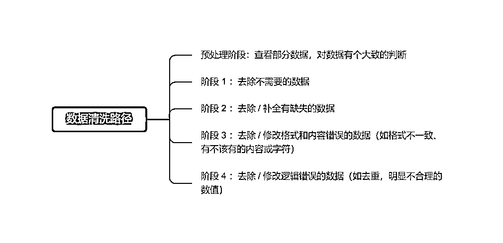

# 9.1 第一步：准备好需要分析的数据表

这里所说的需要进行分析的数据表，是指对数据原表进行过数据清洗，已经根据自己的需要保留必要数据后的表格。清洗数据的这步，单独使用 ChatGPT 是无法做到的，还是需要我们手动完成。

如果数据量非常大，可以考虑利用 python / SQL / 市面上数据清洗工具等进行清洗。

数据清洗后，将数据保留到 Excel 中，准备进行分析使用。这里以统计局统计年鉴 1949 年至 2021 年的人口普查数据表为例：

