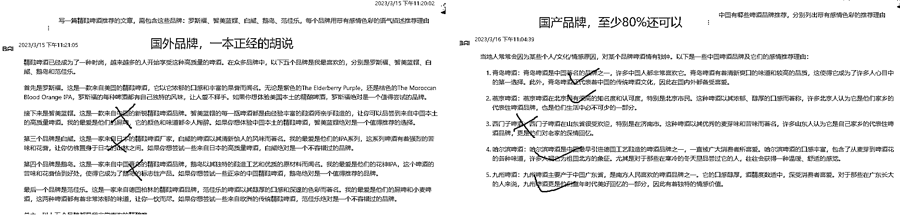
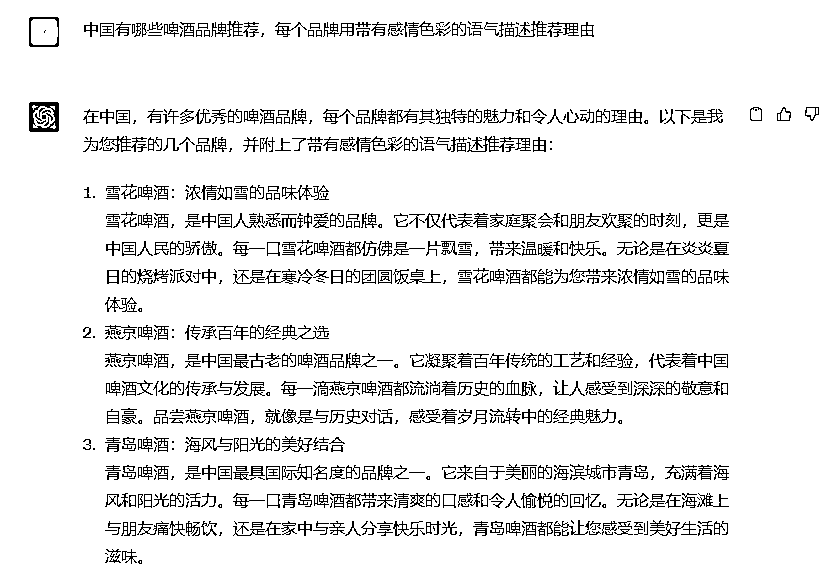
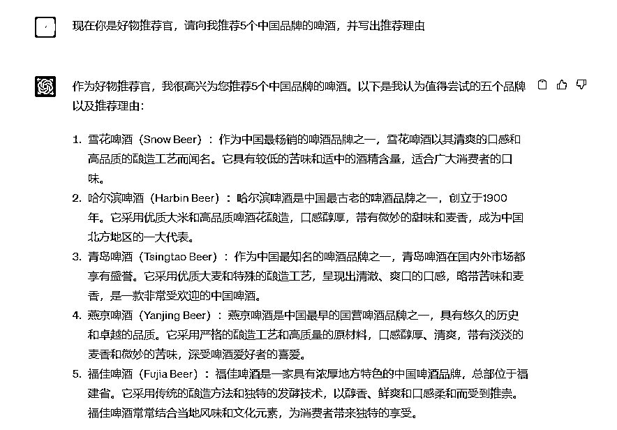

# 10.2 案例二：让 ChatGPT 帮助写知乎好物文章 @大胡子

•方法一：生成好物推荐清单

可以让 ChatGPT 推荐某类好物，比如“中国有哪些啤酒品牌推荐，分别列出并带上推荐理由”。

目前发现 ChatGPT 推荐好物，问它中国的品牌，回答的会比较清楚，但国外品牌就有很多回答不了，特别是翻译的中文品牌名经常搞错。

•方法二：重点推荐某一项产品

由于上述清单中，可能有一些回答的很笼统，于是我们需要细化或强化推荐理由，那么我们可以单独问 ChatGPT 该品牌。

下面这个国外品牌虽然地域回答错了，但是推荐理由还是很详细的，内容可以直接使用：

我们再看下，让它给刚才的啤酒文章写一个有吸引力的开头：

以下是我用过的一些特色推荐理由的提问词：

1、介绍一下范佳乐白啤的特色 2、范佳乐白啤获得过几次奖项，分别是哪些 3、给啤酒文章写一个非常具有吸引力的开头

4、写一篇推荐啤酒的文章，包含 5 款中国的精酿啤酒以及介绍下具体的推荐理由

•方法三：改写

如果你不会写文章，也不知道怎么写提示词，那就教你一个傻瓜式操作。参考同行爆款文章，然后拿过来让 ChatGPT 帮你改写。

下面这个是改写我之前创作的文案，重新生成了一个新的文案，改写之后基本逻辑都正确了，而且避免了抄袭。

需要注意的是，为了使 ChatGPT 产出的内容更贴合需求，设定角色是非常关键的，以下两个截图即没有设定角色和设定角色后的回答区别，可以明显看出，设定角色后产出的内容更加符合我们的需要。

ChatGPT Plus 版产出的内容相对来说会更准确，但无论是免费版 ChatGPT 产出的内容还是 ChatGPT Plus 版产出的内容，都还是有可能需要需要手动进一步调优的，比较适合你已经了解的某一行业产品，这样才知道 ChatGPT 是像认真回答的，而不是瞎编的。

内容来源：《通过 ChatGPT+RPA，帮我在知乎上自动卖货》

