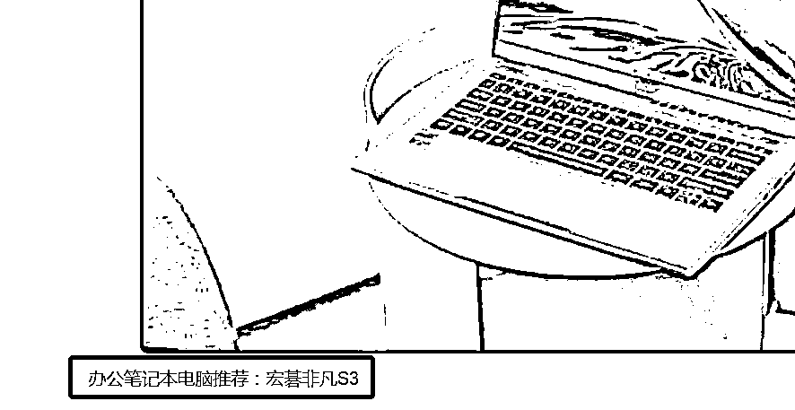

# 10.3 案例三：用 ChatGPT 完成百家号带货文章 @刘伟

这里主要和大家分享一下确定文章选题之后，如何利用 ChatGPT 完成文章具体内容。以办公室电脑推荐的选题为例，文章标题为《办公笔记本电脑推荐：适合办公用的笔记本电脑推荐》或者《办公笔记本电脑推荐：办公笔记本电脑哪个品牌好》。

写文章的时候要牢记：最好多次出现“办公笔记本电脑推荐”和“适合办公用的笔记本电脑推荐”这两个关键词，文章篇幅推荐在 1000-1400 字，关键词出现的次数尽量保持 8-12 次。

怎么写呢，就是找 3-5 篇相同选题的文章，让 ChatGPT 来帮你改写。

对着 ChatGPT 输入：

用中文改写下面这段话：xxxxxxxxx 你搜索出来的文章片段 xxxxxxxxx

这块需要你按照关键词在其他平台上搜索 3-5 篇文章，对部分段落让 ChatGPT 进行改写，文章的基本框架是这样的：

第一部分：总述，比如现在移动办公场景越来越多。

第二部分：描述一下挑选适合办公用的笔记本，需要注意哪几点。

第三部分：产品推荐，介绍 3-4 款产品即可

•办公笔记本电脑推荐之一：联想 XXXX（注意，这次出现了一次关键词“办公笔记本电脑推荐”） + 配图 A（配图可以增加文字说明，可以写关键词）

•办公笔记本电脑推荐之二：华为 XXXX + 配图 B•办公笔记本电脑推荐之三：惠普 XXXX + 配图 C

第四部分：总结一下，比如以上就是推荐的几款适合办公用的笔记本，希望可以帮助到大家云云。

在发表之前，通过网上的原创评估工具，看看文章能否通过原创审核。通常 1500 字的文章，原创检测出来的严重的重复次数小于 10 次，都没有问题。

内容来源：《对于零基础新手最友好的副业之一——百家号图文带货》

