# 产品变现** **合集

程序员/产品人如何挖掘需求、开发产品，以及推广变现

整理日期：**230714**

 

 

生财风向标系列单独用在线文档分享，地址见专属群q群消息。

一些帖子跳转飞书查阅，如需破解复制权限，见这篇文章：

解除复制限制！

往期的生财周报合集（含在线版和离线版），见专属群Q群文件和群公告。

希望大家有收获~

标题加了(精华)的表示精华贴，前面为截至今日的点赞数。

 

 

以下是目录，内容有些多。大家可以挑兴趣的内容阅读。

 

# 【目录】

产品变现** **合集

【目录】

【认知篇】**6**篇

(精华帖)(327赞)作为普通人，我们该如何挖掘商机？

(精华帖)(263赞)数据是需求的抽象化  帮你快速找到 100 个赚钱思路写书的时候，第一件要做的事就是到书店去，观察书的摆放方式，  看各种排行榜，进而了解目前热卖的是什么书，分析图书市场需求。

（下面两个横线间的内容，是个整体。）

从而获得收益。

产品能否打动用户，关键就看在这 5 点上，你下的功夫有多足。

但还是那句话，创业是概率事件，我们能做的，就是分析用户属性，根据公开信息，增大成功概率。

所以，这个帖子的「相关数据」（点赞、评论、浏览），就是这个需求的抽象化表现形式。

看这个

(精华帖)(216赞)写给独立开发者：如何快速做出产品 MVP

(精华帖)(208赞)用逆向思维收集大量被忽略的「声音」

(54赞)新人首贴：普通人和程序员，分别该如何利用「代码杠杆」来撬动赚钱效率？

(44赞)跳出程序员思维：如何应对上手英文工具站的几点误区

【实操篇】**6**篇

(精华帖)(738赞)我通过流量主每月被动收入超5W的历程分享

(精华帖)(543赞)我是如何从零开始，挖掘到蓝海小众需求，半年赚到40万的(精华帖)(293赞)电子书产品变现百万 + 的完整经历复盘

 

 

(精华帖)(110赞)程序员的视角看问题：想把视频转成文字，用代码来解决，最终实现问题的解决 + 收益

(精华帖)(93赞)独立开发者如何快速找到并实现属于自己的“躺赚”小工具 MVP(精华帖)(78赞)为景区搭建语音导览系统，实现被动月收入 2W+

【需求挖掘】**3**篇

(精华帖)(309赞)如何获得产品 idea

(精华帖)(95赞)小众产品的起点——需求挖掘（进阶篇）

(精华帖)(66赞)如何挖掘小众产品的需求（入门级）

【关键词挖掘】**2**篇

(精华帖)(109赞)以 TikTok 举例，如何发现海外产品的生财机会  ？

(精华帖)(105赞)聊一聊 Google 关键词挖掘需求的方法

【**ChatGPT **借力】**2**篇

(精华帖)(499赞)利用 GPT4 迅速将想法落地，让创意在半天时间内变成 MVP！

(精华帖)(194赞)新手怎样通过ChatGPT编程落地工具站产品

【插件开发】**3**篇

(45赞)Chrome 插件开发之旅：从 0-1 开发浏览器扩展

(30赞)Chrome PDF 插件从0到1的试错经验与踩坑复盘

【小程序变现】**2**篇

(22赞)又写了个为我提供咖啡的浏览器插件

(104赞)小程序流量主高效变现，你不得不知的七大招

(精华帖)(94赞)我是如何通过小程序，每年躺赚 X 万的？

# 【认知篇】**6**篇

# **# ****(**精华帖**)(327**赞**)**作为普通人，我们该如何挖

# 掘商机？

 

 

作者：  沐风

日期：2023-06-15

大家好，我是沐风，今天我想跟大家分享一下：作为普通人，我们该如何挖掘商机？

通过生财，大家已经见识到了各种各样的赚钱项目，但实际上，我们也知道，任何一个项目的底层逻辑基本上都可以概括为：

需求**-**产品**/**服务**-**流量**-**转化**-**交付**-**变现。

也就是说，需求其实是一切商业活动的起点。那么，如果我们能围绕着某类目标人群挖掘出一些需求，去针对性的提供一些差异化的产品或服务，并以此为卖点去获取流量，然后做好转化和交付，那么，变现就是水到渠成的事情了。

只不过，对于我们大多数普通人来讲，在资源和精力有限的情况下，我们可能无法兼顾所有环节，这个时候，我们只需要做好其中的某几个环节，然后把剩余的环节交给其他更专业的人去完成，我们一样可以实现变现。

比如，对于大多数做无货源电商的同学来讲，我们只需要做好选品，然后围绕着产品去创作一些内容（这里主要指的是兴趣电商），比如图文或者短视频，进而获取流量，完成转化，赚取收益，而真正的交付，我们其实是交给我们的上家来完成的。

又比如，对于大多数做自媒体的同学来讲，我们只需要在某一个领域做好选题，然后根据选题去创作内容，并获取流量，以公众号为例，如果我们开通了流量主收益，那么此时，我们相当于把我们获取的一部分流量打包出售给广告主，从而赚取收益，而真正的转化和交付则是由广告主来完成的。或者，我们也可以去分销一些商品来获取佣金，这种情况下，相当于我们又多了一步转化，而真正的交付则是由商家来完成的。

 

 

而无论是选品还是选题，归根到底都是为了满足用户的某些需求，要么是生理上的，要么是精神上的，或者兼而有之。因此，我们不难得出，我们选品或者选题的过程，本质上就是在挖掘需求，而需求挖掘的越精准，我们成功的概率也就越大。

那么，我们该如何高效的挖掘需求呢？为了阅读体验，请大家移步飞书：

https://rlp3cigezs.feishu.cn/docx/CWTGdnwBZoreawxpweSc128UnPe评论区：

亻吕゜ : 有启发[强]

沐琳 : 思路瞬间打开了！谢谢分享

沐风 : [爱心]

沐风 : [爱心]

希声 : 非常棒的文章。国内的话可能因为关键词类关键词工具不太完善，可以用这种手动的方式挖掘出大量的词。如果是做国外，则有非常多很棒的关键词工具可以直接导出，然后做个筛选。

沐风 : 感谢认可～

奇艺 : 感谢分享[嘿哈]

🌸*....璇千金🌸 : 宝藏男孩还得是你[机智] 一切从需求出发，甚至直接挖掘到具体商品，链路流畅一气呵成。学到了学到了~感谢分享

# **# ****(**精华帖**)(263**赞**)**数据是需求的抽象化** **帮你快

# 速找到** 100 **个赚钱思路

 

 

作者：  明白（晚9点半睡觉）

日期：2019-10-15

《数据是需求的抽象化 | 帮你快速找到 100 个赚钱思路  》

▌1 如何利用自己的技能去发掘副业？

前段时间，有个做游戏运维的朋友向亦仁提问，如何利用自己的技能去发掘副业？

亦仁给的建议是，围绕“游戏”这个词，写 50 个相关的点子，然后去各大平台搜索，  找到相关的内容，然后调研，从其中选出适合自己的事情。（原帖链接：  ）

亦仁的建议很详细，具体到了步骤，如果按照帖子思路做，一定能找到适合自己的赚钱思路。

这个属于从 0 到 1 分析市场，挖掘需求，我对这块也有一些研究，所以在亦仁内容的基础上，做一些拓展，希望对大家有帮助。

▌2 为什么要做市场分析？

（1）PMF

《增长黑客》里面有一个 PMF(Product-Market Fit)，就是找到产品和市场的最佳契合点。

说白了，就是分析你做的事情，用户是否真的有需求，是不是愿意付费？

如果你有个想法，不做市场分析，一拍脑袋就开始干，可能最后会发现，没有用户，  或者没人愿意付费，白白浪费了时间，精力，甚至金钱。

（2）更深入的了解用户

有朋友问我，“明白，我想全网抓一下 XX 相关的信息，该怎么做？”

我一听「全网」2 个字，头就大。

我问他，你抓这些信息要做什么？

他说，我想看看有多少人对这个感兴趣。

然后，我给他发了百度指数、微信指数、XX 指数的链接，说，你用这个就能解决问题。

他很满意，因为结果更准确，而且不用花钱。

这里想说的是，用户表达的信息，有时候和真实目的会不一样。

 

 

但他并不知道，所以需要做产品的人更深的挖掘一层，想到用户前面。

类似的事情还有很多 ——

明白，帮我抓下 XX。

哦，你要做什么？

我要用这个 XX，

哦，这个不需要爬虫，你去用 XX。

哇，太棒了。

产品一定是给人用的，所以，我们需要了解用户的真实想法 ——

用户想要什么功能？

用来做什么事情？

他们现在是怎么解决这个问题的？

他们是否愿意付费？（先收定金，完成 MVP）

能不能作为种子用户，邀请来做内测？

这些事情，我们都可以在市场分析阶段，在开发产品之前，全部搞清楚。

（3）为产品营销推广做准备

在知识星球，经常看到有人问，我做了个产品，该怎么推广？

其实产品推广这个动作，可以在做产品之前规划好。

你可能会疑惑，产品还没做，怎么就能想清楚如何推广？

一句话：想不清楚如何推广的产品，没必要做。

我们做一个产品，在市场分析阶段，不仅仅要分析产品是否符合用户需求，还要想清楚，

目标用户在哪里？

我该如何触达他们？

我用什么理由说动用户付费？

这点和上面第 2 点类似，后面介绍如何做市场分析时，会具体介绍。

▌3 如何做市场分析？

 

 

前几天我看书，里面有个图书出版的案例 ——

在书店里，我们可以看到摆放着很多书本。但是，每家店中，竖着插进书架里的书和  平放在书架上的书是不一样的。这是因为，店员会将热卖、好卖、想卖  的书平放在醒目的位置上。

# **# **写书的时候，第一件要做的事就是到书店去，

# 观察书的摆放方式，** **看各种排行榜，进而了解

# 目前热卖的是什么书，分析图书市场需求。

这是不是和我们做产品，挖掘市场需求看起来很像？

而且互联网有一个好处，每个人都可以接触到海量信息，用一些方法，我们就能在产品开发前，搞清楚一个需求是否合理，有多大市场。

核心就一句话：数据是需求的抽象化。

这是我在十胖哥的第一桶金群里学到的，下面详细介绍。

▌一、为什么用户调研不靠谱？

假设你现在有一个思路，计划做成一个课程、或者工具、或者其他形式，下一步你会做什么？

你会去问朋友，我想做个 XX，提供 XX 功能，你们觉得怎么样？

或者在微信群，

或者发个朋友圈，

或者到知识星球发个帖子。

然后，你可能会得到 3 种回复。

1 肯定。

2 否定。

3 建议。

 

 

然而这些回复，你也不知道哪个对，哪个不对。

只能凭感觉，说肯定的人多一些，你觉得这个能做。

说否定的人多一些，你觉得，算了，不做了。

精细一些，你会统计一下肯定和否定的数量，做个比较，哪个占比多，这个意见就对。

再精细一点，对于专业人士的回复，你会给一些较高的权重，他们一个人的意见，顶  3 个其他人的意见，或者更多。

我们不妨停下来，思考一下，上面的步骤，是在做什么？

在做用户调研

在小范围做用户调研

在用户没有相关知识、没有需求的场景下做调研

这种情况下，得到的答案不靠谱，原因有 2 ——

1 因为用户群体相似，所以思维方式趋同

同一个微信群的用户，大体都有相同的兴趣，或者价值观。

同一个人的好友，也是经过筛选的。

同一个知识星球的用户，也有相似的思维习惯。

当你提出这个问题时，看到这个问题的用户，他就不再是真正的用户。

他们在回答问题的那一瞬间，会不自觉进入你的角色。

他们从某种程度上，站在了你的角度看问题。

他们在用「专家」的角度，回答是否需要这个产品。

你做调研的目的，是为了找到真实用户对这个产品的想法。

而这些人都不是真正的用户。

因此，这种调研不靠谱。

（当然，这不是绝对。如果调研的用户中，有一个人，他有超强的用户视角，那么你向他调研，得到的结果，会和你向「大量正态分布的真实用户」调研的统计结果大体一致。）

2 因为用户没有经过思考（也没有义务），所以得到的是「冲动」型答案。

 

 

这个世界上，大家都只关心自己的事情。

回想一下，你在朋友圈看到一个人问，「我想做一个 XX，大家觉得怎么样？」。

你当时大脑是怎么想的？

（1）这是啥东西？看起来不错，点个赞吧。

（2）做这个呀？好像不错，支持。

（3）看不懂。真是自嗨！

（4）能帮忙做 XX 功能吗？

在这个问题上，你最多思考 3 秒，甚至就是随手点个赞了事。

因为这和你无关。

因此，这属于「冲动型」答案，不靠谱。

当然，这里不是说所有人的回复都不靠谱。

而是在这个场景下，大部分用户面对一个和他们没有关系的问题时（至少在刷朋友圈的时候，他们没有精力、没有意识、没有义务去思考这个问题和他们有啥关系），回答「好」或者「不好」这个动作太容易：不需要学习新知识，不需要深入思考，不需要承担责任。

因此，这里的回复大部分都是感性冲动，所以不靠谱。

当然例外还是有的，和第一点一样，如果有一个人，他有超强的用户视角，有丰富的经验，那回答这个问题所需要的知识，所需要的深入思考，做错需要承担的后果，他都经历过。

那他的回复，就是客观真实的。

但前提是，你知道他是「那样的人」。

但往往问出这个问题的人，是看不出这个回复是对的。

根据上面分析，我们可以得出结论，类似「我想做一个 XX，大家觉得怎么样」的用户调研，绝大多数不靠谱。

▌二、当我们做需求分析时，我们到底应该做什么？

上面我们已经分析过，用户调研不靠谱，原因是 2 点。

 

 

（1）在小范围做用户调研 ——用户群体相似

（2）在用户没有相关知识、需求的场景下做调研 —— 用户冲动回答

查理·芒格曾经说过一句话：如果我知道我会死在哪里，那我永远都不会去那个地方。

同理，我们已经知道上面的调研方式不靠谱，而且知道造成缺陷的原因。

我们就可以主动做一些操作，避免、或者减少这些缺陷造成的影响。

具体来说，就是 ——

将上面的「小范围」扩大。

将用户的「冲动型」变为思考型。

或许你会说，这怎么可能？

怎么会有「大范围」的很多人帮你做调研？

而且他们还会花时间思考？

还真有。

首先，我们需要了解一个事实 ——

我们或者灵机一动、或者冥思苦想、或者跨界创新得出来的点子、思路或者模式，「一定」有人已经讨论过、或者做过、或者思考过，只是你还不知道。

我用了「一定」，但加了引号。

因为它确实存在，但它的「表现形式」可能和你想的不一样，因此你发现不了它。你即使看到，也会觉得和自己无关。

听起来很玄乎？

看个例子就明白了。

比如，你要做一个「搜索」相关的课程，你可能会去搜索「搜索」这个词，研究和它相关的信息。

得到的结果可能是——

（1）有人做过同类型的课，作者很厉害，课程也把搜索相关的内容讲的很全面。

（2）网上有很多免费文字教程。

（3）用户对这类教程并没有表现出很强的付费意愿。

 

 

于是，你可能就会按照当前整理的信息开发课程，或者选择放弃，因为看起来不好卖。

到这里，没啥问题，符合正常的思考路径。

但是，你看到的可能只是冰山一角。

# **# **（下面两个横线间的内容，是个整体。）

不妨停下来，仔细思考一下，当我们研究「搜索」这个词，以及和它相关的信息时，我们到底是做什么？

我们是在找对「搜索」有需求的人，

这类人「知道搜索能帮他们解决问题」。

如果知道他们对于「搜索」的想法，

就可以根据这些开发课程，

满足他们的需求，

# **# **从而获得收益。

（上面两个横线间的内容，是个整体。）

（如果觉得有点绕，

可以多看几遍。）

但是，

但是，

但是 ——

除了这部分用户，这部分你根据「搜索」关键词找到的用户，

还有很大一批也对「搜索」有需求的人，他们也在互联网上留下过信息，但他们用的不是「搜索」这个词，更大的可能是，他们不知道他们的问题，可以用「搜索」来解决。

 

 

你是不是心里想，这怎么可能？

怎么会有人不知道自己的问题，该用什么方法解决？

还记得帖子开头，有朋友找我，明白，帮我抓下全网的 XX。

我问了他真实目的后，告诉他一个更简单的方法。

他很满意。

他知道他要达到什么目的。

但他不知道该如何做？

假如这时候，我向他收费呢？

如果我这个例子还不能说明问题，换个你自己的。

回忆一下，你是否有过这种经历 ——

你遇到一个难题，在朋友圈求助。

有个朋友说，用 XX 就能做呀。

你一试，果然成功了。

竟然这么容易。

朋友说，这个很简单啊，你竟然连这个都不知道……

还是上面的问题，我们再做个假设 ——

如果这个朋友没有直接告诉你答案，

而是说，他有个工具，要付 9.9 元，1 分钟帮你解决问题。

你会付费吗？

你应该心里有答案了。

你（用户）遇到一个难题，很想解决。

但你（用户）不知道，如何解决。

回到上面的搜索例子，

如果你能找到那些对「搜索」有需求的用户，

但他们表达的信息中没有「搜索」这个词语（他们不知道他们的问题能用「搜索」解决），

这意味着什么？

 

 

意味着你能用更简单的方式（搜索）解决他们的问题，

意味着你找到了一个「一定可以」打动（这部分）用户的卖点，

意味着你的产品可以满足用户的购买理由，

意味着你已经知道如何宣传自己的产品。

嘿嘿嘿，心动吗？

▌三、我有个思路，如何知道它真的有需求，并且找到能打动用户的卖点？

接着上面的「搜索」例子。

除了一部分「显性」用户，他们会在互联网上留下他们对于「搜索」的想法、态度、技巧等等。

还有另一部分「隐性」用户，他们遇到的问题，能用「搜索」解决，但他们不知道。

因为不知道，所以他们所表达的信息中，没有「搜索」这个词语。

我们现在要找到这些「用户」。

这里说的「找到」，不是要找到他们这个人，不是要加他们微信（如果能加到也不错），而是要找到他们在互联网留下的「隐性」信息。

我们从这些信息中，能找到他们想要解决的问题。

这些问题，就是真正的用户痛点。

如何做？（划重点）

（1）头脑风暴

作为专业人员，这个思路的作者，你应该知道，搜索能用来做什么？

先列出一些和「搜索」关联的词语：信息、搜集、资料、效率、赚钱……等等。（这里的关联词我只是举例，你要根据具体情况，自己思考）

这些词语，都是用搜索能直接或者间接解决的问题，是用户想用「搜索」达成的目的。

（2）从源头拓展

如果你实在想不到相关词，就搜索原始词，也就是「搜索」这个词。

你得到的信息（文章、帖子）里，一定会讲到他们用「搜索」来做什么，达成什么目的？

 

 

这些词语，都是用搜索能直接或者间接解决的问题，是用户想用「搜索」达成的目的。

这 2 步，是为了找到真实用户对于这个需求的最终「目标词」，作为分析需求的「冷启动」。

（3）统计数据

整理好这些相关「目标词」后，我们开始搜索这些词语，统计相关的帖子、文章、问答……的数据。

统计哪些指标 ——

阅读数

点赞数

评论数

关注数

付费人数

不同平台的指标，会有所不同，具体看情况而定。

记住一句话：数据就是需求的抽象化。

举例，如果你在知乎搜索「资料」，看到很多帖子，其中某一（n）个帖子点赞数比较多。

说明这个帖子的内容，很受用户喜欢。

说明用户对于「资料整理」或者「资料收集」这个需求很在意。

（4）研究数据结果（划重点）

接下来，针对这个点赞多的帖子，你需要深入研究。

看它是如何描述「资料收集」这个点，（划重点）

要具体到某句话，某个词，某个场景、某个故事。（划重点）

经常有人说，我产品不错，但是不会营销，所以卖不出去。

现在，一个「经过真实用户调研」的优秀案例摆在面前。

你要做的，就是研究它如何营销这个帖子。

文案怎么写，某个功能怎么描述。

 

 

然后模仿它，改进，或者直接套用。

这个就是你用来说动用户的卖点。

如果这个帖子有评论，也需要重视。

你想，能看完一个长文，还有耐心发帖的人，这才是是真正有真实需求的用户。

他对什么有疑问？

他想达到什么目标？

他抱怨什么？

他是否留下联系方式？

这些全部挨个记录下来。

用户关心的，就是你要重点关注的。

（5）汇总，筛选。

依次将你在（1）（2）点找到的各个「痛点词」，按照（3）（4）点操作。

然后汇总。

最后，再次分析这些用户关注的信息，剔除那些明显不合理的误导信息。

选出最能打动用户的 1（n）  个点，按照这几个点，开发产品。（划重点，不是先开发产品，然后找卖点。）

# **# **产品能否打动用户，关键就看在这** 5 **点上，你

# 下的功夫有多足。

▌四、数据就是需求的抽象化

我来解释一下，上面的 5 点到底做了什么？

以及为什么这样做能行？

1 用户调研的反向操作

在开头第  二  点，我们分析了，「朋友圈」用户调研不靠谱，原因 ——

（1）在小范围做用户调研 ——用户群体相似

（2）在用户没有相关知识、需求的场景下做调研 —— 用户冲动回答

 

 

所以，我们可以做一些操作，减少这些影响，具体有 2 点 ——

（1）将上面的「小范围」扩大。

（2）将用户的「冲动型」变为思考型。

现在，我们看看第  三  点的 5 个步骤，是否满足这 2 个条件。

（1）用户范围变大了吗？

我们举的例子，是在「知乎」搜索。

知乎是啥？

一个UGC（User-generated Content，用户生产内容）平台。

这里的用户，

不是同一个微信群，

不是同一个朋友圈，

不是同一个知识星球。

知乎用户有 2 亿+，相对微信的 5000 来说，数量级大了很多，用户类型也很分散。

对于一个帖子，用户会不会点赞，取决于用户是否同意这个观点，也就是代表着用户的态度。用户出于「交情」的点赞几率，比微信要小很多。

当然，也可能因为知乎的推荐机制，看到这个帖子的人，都是对某个领域感兴趣。

或者有的帖子刷赞。

这些都是存在，无法避免的情况。

但相对我们的单个微信好友数，知乎亿量级用户数，帖子数来说，这些都是正常的容错范围。

而且，创业本来就是一件拼概率的事情，而不是确定性事件。

分析用户需求也一样，我们只能在能力范围内，根据一些公开数据，提高成功概率。

（2）用户经过思考了吗？

先问一个问题，你在什么情况下会上知乎？

有问题，上知乎！

 

 

用户在大众认知眼里，是这么一个地方：我生活、工作中遇到了问题，去知乎搜索一下，看看有没有解决方案。

也就是说，用户是带着明确的想解决问题的意图上知乎的。

这和我们刷朋友圈，看到好友说「我想做一个 XX，大家觉得怎么样」做出的回复，完全不一样。

而且，知乎的问答，相对朋友圈，一般都是长文，会有逻辑结构，案例等等。

能看完这个长帖，而且点赞的用户。

说明他是经过思考，具备一些相应的「知识」。

如果答案他不满意，

他大概率是不会点赞的。

所以这不是「冲动型」的点赞。

所以，相对于之前第  二  点讲的「朋友圈用户调研」，这种「调研」，用户是经过思考，理性的投票，具有一定客观公正的价值。

当然，也可能有的帖子里，有的用户是冲动投票。

# **# **但还是那句话，创业是概率事件，我们能做

# 的，就是分析用户属性，根据公开信息，增大成

# 功概率。

根据上面 2 点，我们可以得出结论。

知乎用户对于一个帖子的点赞数据，

就代表了他们对于一个帖子的态度。

我们把视角放大，把数据量放大。

这就代表了某类用户群体，对「某个需求」的强烈程度。

 

 

# **# **所以，这个帖子的「相关数据」（点赞、评

# 论、浏览），就是这个需求的抽象化表现形式。

还没完。

案例中，我们要做的是「搜索」课，我们除了挖掘「搜索」这类显性需求，还找到了对「搜索」有需求的隐性用户。

我们是从「信息」「搜集」「效率」「资料」这些「搜索」能达成的「效果」角度，  分析用户的真实数据，

这些数据表明了用户对这些「效果」的喜好程度。

然后从「效果」角度，开发产品，满足这个「效果」。

因为从数据上分析，用户对这个「效果」需求很强烈。

所以，如果你的产品能满足这个「效果」，

用户大概率会买你的产品。

如果你看过华与华的书，应该熟悉，这是书里讲的「先创意购买理由，再开发产品」。

当然，你选择某个「效果」作为卖点，开发产品就一定要满足这个「效果」。

如果你没有能力满足这个「效果」，就放弃这个卖点。

这也是在「需求倒逼产品」，逼你成长。

▌五、有数据的地方，就有需求

案例中我们谈到的平台是知乎，如果能多一些这类平台，我们就多一些数据参考维度，这样就能更大的提高准确度。

还有哪些平台也可以？

一句话：所有 UGC（User-generated Content，用户生产内容）平台都可以做类似需求分析。

原因上面分析了。

下面一些数据指标，可以帮我们大体判断一个需求是否合理。数据量越大，说明需求越强烈。

阅读数

 

 

评论数

点赞数

付费人数

关注数

平台 ——

（1）内容平台

知乎

豆瓣

贴吧

简书

头条

公众号

抖音/快手/B站

……

如果你已经有一些思路，可以去这些平台搜索关键词，然后看相关帖子、公众号、专栏、视频，根据上面的指标，看多少人对这个感兴趣，也能说明这个需求是否强烈。

如果你没思路，平台的这些位置你可以留意一下：首页、精选、推荐、排行榜。

这些位置流量最大，一个平台肯花大资源推广的产品，一定是精心挑选过，受众比较大，也就说明这方面需求比较强烈。以这个为原始需求词。

这个过程，其实也是在分析该如何推广产品，你看内容的时候，需要留意用户关心什么，担心什么，这些都是你未来产品定位，营销的方向。

如果有可能的话，你可以直接联系潜在用户，说你能提供这个服务，聚集种子用户。

更进一步，你可以收取定金，验证市场。

（2）知识付费平台

千聊

荔枝微课

 

 

有讲

维库

网易云课堂

腾讯课堂

得到

混沌大学

喜马拉雅

十点课程

凯叔讲故事

小鹅通

樊登读书

现阶段，用户已经有了付费意识，如果你有一技之长，可以考虑做个课程。

如果你不知道如何下手，就可以在上面的平台搜索关键字，一定有其他人做过这类课程，看看他是怎么设计课程，怎么开发课程，怎么说服别人买他的课，后续服务怎么样？总体的商业模式什么样？

可以听一个，也可以多听几个。

付费也没关系，这点钱换一个清晰的服务流程，值得。

所有的课程，大体框架都相似。

在这个基础上，你再分析自己的优势，增加一些服务、或者能减轻用户疑虑的信息。

没事也可以多看看知识付费平台的排行榜，你会惊讶的发现，这东西都可以做教程啊。

如果一个课程付费用户很多，那说明这个需求很强。

你试着看能不能从其他角度拓展一下，前人总结、用户付费验证过的需求，一定是准  确的。

（3）电商平台

淘宝

京东

 

 

咸鱼

1688

速卖通

亚马逊

拼多多

小红书

……

提到淘宝、咸鱼，你不要只想到手机、衣服、书。

淘宝不仅卖实体商品，还卖虚拟商品、服务。

你在上面 2 个平台搜索的关键词，都可以到淘宝重新搜索一遍，或许会有惊喜。

电商平台是实打实的付费数据，也可以从其中看到一些用户需求。

电商平台可以参考的数据 ——

月销量

评论数

价格

……

▌六、如何拓展出 100 个赚钱思路？

前面的所有信息，都是在讲如何通过数据分析市场，挖掘用户需求。

案例讲的是做课程。

做其他产品也一样。

比如，你做跨境电商要选品。

怎么选出一个用户喜欢的产品？

用户在看到产品，勾起下单欲望的时候，他喜欢的不是这个产品，而是产品描述带给他们的美好感受。

 

 

所以，你可以研究已经爆火的产品，它们是如何描述产品的，记录下一些关键词。

然后去国外常用 UGC 平台，挨个通过数据研究这些关键词，看哪个帖子点赞、评论多，说明这个帖子的描述是用户喜欢的，你可以模仿这些描述，或者套用。

用数据作为标准来判断需求，比空想的成功概率要大很多。

回顾一下这篇文章：

同理，做工具、做网站、写文章选题，都可以通过这种方式，判断需求大小。

当你已经找到一个方向，确定这个需求有效，还可以继续思考 ——

**1. ** 用户是否可以拓展？

**2. ** 场景是否可以拓展？

**3. ** 需求是否可以拓展？

# **# **看这个

最后总结一下：

1、做产品前，先做市场分析，成功概率更大

2、「朋友圈用户调研」不靠谱

3、从「原始词」开始，去 UGC 平台（和其他），找出「效果词」，根据数据，挖掘用户喜好

4、在挖掘过程中，关注用户喜欢的功能、词语、故事等，（划重点）这是真实用户的感受

5、根据研究出来的「效果」点，开发产品

6、拓展场景、用户、需求，做其他产品

 

 

所有能让用户眼前一亮的产品，都是经过大量的用户研究。

没有积累的灵感，大多数情况下都是自嗨。

所以说，做产品，本质上是个体力活。

比如，在不同平台整理数据的时候，比如你搜索某个关键词，出来很多帖子，有时候数据并不是按序排列，你就需要全部整理下来。而且你搜索某个关键词的时候，可能会挖掘到另一个关键词，这样可能会多次搜索，多次整理。

信息越多，你就越清楚，

什么功能用户最喜欢。

哪个词语最能打动用户。

哪种形式的文章最能说动用户。

你还可以用一些信息搜集工具，比如八爪鱼、火车头、后羿采集器等，或者我的课程，整理数据信息就会更容易一些。

想象一下，同样一个关键词，

如果有 1000 条数据，别人整理需要 1 小时，你只需要 1 分钟。

如果是 10000 条数据，别人需要 10 小时，你只需要 1 分钟。

你获得数据的速度比别人快、

信息会比别人多。

你就更懂用户，

产品就会更受用户喜欢。

也自然能赚更多钱。

（完）

https://t.zsxq.com/7YfQfyj https://mp.weixin.qq.com/s/0cWrxYamykTzP2his87k7w https://mp.weixin.qq.com/s/119PotnvIrkE-icPZhue1w评论区：

乔里奥 : 献上我的膝盖

啦啦猫 : 献上我的膝盖

苏笙爱摸鱼🐶 : 献上我的膝盖

白杨SEO : 献上我的双手

贤庭 : [强][强][强]

Dancer : 研究了准备做个教程课，连续准备测试了两三个月，但是就是没看数据，没搜 

 

需求，经过自己成长学习的过程发现这个行业的痛点，所以做这个解决痛点的事，不知道是不是自嗨，准备参加创业大赛，然后拿融资[囧]，后面再从各个平台上收集一些数据和问答

V先生 : 献上我的膝盖

未央 : 献上我的膝盖

# **# ****(**精华帖**)(216**赞**)**写给独立开发者：如何快速

# 做出产品** MVP**

作者：  刘小排

日期：2023-02-09

这是一篇面向独立开发者的文章，整理自12月我在生财有术海外工具小航海里的分享。

两个月前，我在生财有术分享了《如何获得产品idea》。下一步，就是把idea变成MVP。

今天我们聊聊，如何快速做出MVP。

一、为什么需要快速做出产品**MVP**？

 

 

因为新产品的失败率太高了。

为了提高整体成功率，我们只能增加数量。  我们只能不断地尝试新的idea，这是所有创新者共同的宿命。

在这样的比赛中，每年能发布12个MVP产品的你，比每年只能发布3个MVP的对手，多了四倍的优势。

著名独立开发者Peter Levels，在今年10月，新发布了一款产品  avatarai.me  。在上线第一天就入账1万美元。  上线十天，总共入账10万美元。

厉害吧？

他成功的秘诀是什么呢？

是“多”。

在过去十年左右的时间中，他一共做过70个产品，其中只有4个成功了。成功率只有5% —— 注意，他是全世界最厉害的独立开发者之一，成功率才仅仅5%，  何况是我们呢？

 

 

既然这样，那我们最好的选择就是：

1.去做你能想到每一个idea

 

 

2.用最省事的方式、最快的速度把它做出来，上线。比如：一个周末。

3.上线后，看用户数据。让市场告诉你，你是否应该继续投入。

那么，如何在一个周末就做出产品MVP呢？

这就是本文的重点了。

二、产品**MVP**应该是什么形态的？

我的核心思路包括两点：

1.永远从海外网站开始。

2.想清楚需要验证的内容。

先说第1点。为什么需要从海外网站开始呢？

因为做海外网站，最快。比做其他形态的产品，要快出很多。

 

 

做iOS、Android的App很慢。首先，它们编码过程比做网页复杂，编码能力要求也更高；其次，上线还需要打包、提交审核，审核还可能不通过，时间成本很高。  如果你做的是国内App，那就更慢了，你还需要花3个月的时间拿到软件著作权证书，才能够上架国内的应用商店。  更讨厌的是，当你想修复小bug，你不得不重新发版，用户还得升级安装的App才能使用，这会严重拖累你发布bugfix的效率。

做国内网站，也很慢，你需要域名备案。域名备案，周期大约是1~3周。如果你是在一些要求特别严格的城市比如北京，备案还经常被打回。

做微信小程序，比上面两个略好，但也慢。  它的问题是：微信小程序开源生态不够大，有很多轮子需要我们自己造，难以直接引入开源代码加速我们的编码过程。

做海外网站是最快的。它不需要软件著作权证书、不需要域名备案、不需要应用商店审核、软件有更新的时候用户不需要重新下载App。代码放到Github仓库里，通过Github Action做CI/CD，实现一提交代码就立即自动上线的效果，开发体验倍爽。

需要指出的是，“从网站开始”，不意味着你的产品永远都是一个网站。  只不过MVP阶段是网站而已，当你接受到足够多的用户数据反馈之后，你再去为它做微信小程序、iOS App，永远都不迟。

再说第2点。关于MVP功能的取舍。

如何取舍呢？  提前想好需要验证的内容是什么，然后，只围绕它来做开发。  和它无关的，完全不做。

 

 

如果你想验证 “我发明的某个牛x功能，是否有人使用”，那你根本不需要做用户注册、用户登录、用户支付，  只做那个功能就行了。  然后你观察的核心数据应该是“回头客比例”，如果你流量占比中回头客比例不错，说明用户使用它，是因为你的产品真的有用、而不是随便看看。

如果你想验证“我的某个产品，是否有人愿意购买”，那你连功能都不用做。把卖点列出来、放上付款链接（甚至只放一个收集邮箱的输入框也行），然后去买搜索关键词广告，测试付费转化率。  对，你观察的核心数据是付费转化率，当付费转化率大于30%时，你再考虑把它从MVP变成真正的产品。

注：搜索关键词广告，是最精准的广告，所以此处要求的付费转化率门槛特别高。如果流量来自其他渠道，可以放低要求，但也不建议低于5%。

三、你有案例吗？

有的。

我在机器人创业公司工作，平时挺忙的，基本上是996，只有周末有点自由时间。  到了周末，我手痒，就从自己的笔记本里翻出一个曾经的idea，快速实现它。

 

 

实际上，在9月的“海外工具小航海”期间，我一共做了两个MVP，每个耗时都在两天内（周末）。

第一个MVP产品，耗时一个周末。记得那是9月最后一个周末，做完后就放假了。运气很好，起飞了。我这里暂时不分享细节，因为我打算认真做它，不想过早引入竞争。

第二个产品MVP，是刚刚发布的，还没完全起飞，但是也许有一点点希望。正好，它的制作过程完全符合本次本文所述的主题，  我决定分享出来。

产品地址：  https://keywordsea.com

产品功能：关键词分析。用户输入一个关键词，我从搜索引擎里抓取数据，告诉用户数百个相关搜索词。

开发时间：11月5日下午 + 11月6日晚上，一共大约11小时左右。

上线时间：11月8日。

上线首日数据： 962名访客。ProductHunt带来了200多的流量，其他700多为用户自传播。

 

 

用户反馈：  出乎我意料之外，竟然还不错。甚至有点像水军的评论。  有人还说，想发条twitter帮我宣传同时圈我，但是没找到我的twitter账号  （当然没有啊，这是mvp，哈哈哈）。

见下图。

 

 

 

 

 

接下来怎么办：  不怎么办，就放着。  静静地等两周。如果在未来两周，它的自然流量都维持在每日1000用户甚至更多，我再考虑认真做它。

成本如此低的MVP，取得这样的数据和用户反馈，还不错吧？

我是怎么做的呢？

四、如何两天内做出产品**MVP**？

刚才已经讨论过了，要快速做产品MVP，产品形态需要是一个海外网站的形式。

作为一个海外工具网站产品的MVP，只有两点是重要的

1\. 界面要漂亮，看上去就很贵很专业。

2.核心的功能，要可用

根据这两点，我们的解决方案呼之欲出。

首先，界面如何漂亮呢？ —— 花钱买个模板！

我买的是这一款  https://tailwindui.com/templates/salient。

 

 

你可以和我刚刚提到的https://keywordsea.com  对比一下，是不是感觉，一毛一样？

不过，这款挺贵的。我更建议你到themeforest.net  去看看，选择更多，便宜。一般大约10美元到50美元不等。

然后，核心功能，如何完成呢？ —— 方法是：只写一个函数！

对，只写一个，这个函数，就是你的主功能。  其他函数一概不写。

任何一个函数，我不太相信一个合格的程序员、在开源社区的帮助下， 8个小时内写不出来。

比如，你想做一款“下载Youtube视频”的工具，  你先定义好输入和输出（输入：URL；输出：

视频文件），然后去Github找代码，稍微改一改，  全程不会超过1小时。

总结起来，

买模板： 1小时

买域名：1小时

写文案：1小时

改模板：2小时

 

 

主函数：8小时 (往往更少)

部署上线：2小时

两天时间，绰绰有余了。

上线后，把链接发到一些Startup社区，比如Product Hunt。  然后就可以静静地等待数据了。

观察什么数据好呢？  如果是免费产品，请重点关注自然流量的增长，因为它们代表用户在自传播。  自然流量包括：社交网络流量、搜索流量、外链流量。

五、如何半天内做出产品**MVP**？

敏锐的你可能已经注意到，在上述过程中，最消耗时间的是写主函数，其次消耗时间的是前端界面（买模板+改模板），它们占整个MVP时间的70%以上。

如果这两项功能都不做，岂不是可以进一步缩短做MVP的时间？

没错，还真可以。

尤其是对于付费产品而言，你完全可以不做主功能。因为你只需要验证“付费意愿”即可。

“验证付费意愿”的最好办法，就是“预售”，AKA“卖空气”！

 

 

具体步骤

1.写产品预售的营销文案，尤其是列出你要解决的问题、你的3个卖点。

2.用工具生成Landing Page。推荐工具carrd.co、Webflow、Framer，把你的文案填进去3.用Typeform接入Stripe支付功能。

4.购买Google关键词搜索广告，关注转化率数据。

carrd.co和typeform的产品体验很好，它们具体怎么使用，我就不手把手教了。

在carrd.co里制作landing page的界面，如图所示

在Framer里制作Landing Page页面，如图所示

 

 

在typeform里添加收款功能的界面，如图所示

再来几个例子。

下面两个产品的landing page，都是用carrd.co生成出来的，不需要写代码。

 

 

而这个链接，是Typeform + Stripe，实现了“带有支付功能的调查问卷”。同样也不需要写代  码。

把这个链接放到landing page上，你的MVP就算是完成了，可以开始测试转化率  了。大家可以点开链接，感受一下。

https://template.typeform.com/to/zDzdJ3Me

 

 

六、我做了好几个产品，一直失败，怎么办？

答案是：挺好的，你需要提高失败的速度，然后，继续尝试。

我很喜欢玩德州扑克。

最早的时候，我认为它是个数学游戏，它的获胜诀窍是“计算概率，只在赔率合适的时候下重注”。

 

 

一年后，我发现计算概率只是基础入门，大家都会算，我开始认为它的获胜诀窍是“meta game”。通过察言观色等方式，发现隐秘的线索，从而精准读取对手的牌。

https://www.thepokerbank.com/strategy/psychology/metagame/  再过了两年，我才意识到，它的获胜诀窍是“Mental Game”。  在长时间内保持情绪稳定，才是最重要的。

https://howtoplaypokerinfo.com/poker-mental-game/而要做到情绪稳定，你需要“打无记忆的牌”。

有人因为连续输了几把冤家牌，就变得情绪急躁。还有人以为连续赢了几把，手变得松，不把筹码当成筹码了，这都是业余玩家最常见的错误。

你改变不了已经发生过的事，无论是好是坏。你也改变不了这一次你拿到的手牌，无论是好是坏。我们唯一能决定的，就是把忘记过去，不怨天尤人，把当前这手牌打到最好。

这和做产品的过程是何其相似啊！

有人因为做成功了一些产品，就变得飘了。这很常见 —— 你能说出几个，连续做了多个产品、连续获得多次成功的人的名字呢？不多吧？  就像某些rapper，还不出名的时候，能写出很好的作品。等他们成名了，换了大房子，就再也写不出来好作品了。

还有人因为连续做失败了一些项目，对自己的评价就变了，甚至还抑郁了。  这也很常见，生财有术里不少圈友就是这样。

他们都没有做到“打无记忆的牌”。

 

 

所以，如果你连续做了好几个产品、好几个项目，都失败了，你应该怎么办呢？  你应该从失败中学习，然后继续尝试，就像Peter Levels一样，就像职业德州扑克选手一样。

七、其他建议

别抠门，免费的东西是最贵的，收费的东西是最便宜的。

时间和精力，才是你最宝贵的资源。

我从十年前开始，就每个月强制留出自己收入的10%，用做“科研经费”，去购买能够提升我生产效率的工具、服务、体验、课程。  你也可以试试，投资自己，是最好的投资。

模板怎么来？ → 花钱，一般的模板才几十美元而已。  我买了Tailwind官方的模板，也才299美元。买一个漂亮的模板，不仅能够提升你产品的颜值和用户体验，还可以为你节省数十小时的时间。  程序员是国内平均薪资最高的行业，算算看你自己的时薪， 50美元省50小时，不香吗？

Typeform 要29美元，有没有免费的？ → 有，但是不如Typeform好用。  建议你用最好用的。

我们正在研究的话题是“如何快速做出产品MVP”，而不是“如何最省钱(但是降低品质、降低效率)做出MVP”。

 

 

Stripe账号怎么来？→ 花钱，使用Stripe官方的服务Stripe Atlas，注册美国公司，才500美元。

如果你决心要做海外工具，这500美元很可能是你最划算的投资之一，可以在未来很多年持续为你节省关于海外收款的时间和精力。

八、其他案例分享

Making an app in 3h and getting the first sale! – Jeannen一个外国小伙子，3小时做出了MVP，然后当天就获得了付费客户。

他的思路，和我们上面讨论的内容，如出一辙。而他的产品功能，是生财有术很多人都熟悉的——老照片上色。

 

 

欢迎与我交流。

评论区：

三林 : 常读常新，感谢小排老师分享

Nommy : 小排老师，理论指导实践，很棒

BigSmile : 常读常新，多用多学习，感谢小排老师

vice : 感谢分享，请问您除了在Product hunt ，还有在哪里推广呢，GP上了几个应用，一点自然流量都没有

刘小排 : 流量是另外的话题了，几句话讲不完，以后再分享。  如果非要一句话讲完，那就是：花钱买流量，是最便宜也最精准的流量。

聪聪8.0@益生菌 : 厉害，刘先生方便价格好友吗

刘小排 : liuxiaopai

阿黎 : 这篇帖子的思路，让我受启发了，谢谢！

1、对于我卖课，卖服务，我也不需要完全做出来，先根据IDEA做几个海报测试付费意愿

2、你需要“打无记忆的牌”——不以物喜不以己悲，平常心，专注当下

3、每个月强制留出“科研经费”，去购买能够提升我生产效率的工具、服务、体验、课程——这个定向定量的探索思路，对我帮助很大，感谢！

# **# ****(**精华帖**)(208**赞**)**用逆向思维收集大量被忽略

# 的「声音」

作者：  小曾

日期：2020-10-27

大家好，我是小曾！

陆陆续续花了十几天的空闲时间整理了这篇上万字文章。

在公众号作为付费文章，星球里应该有点贡献，因此免费分享给大家！

 

 

培训这个事吧，我不太在行，如果有好的形式我也会拿出来跟大家交流，之所以在公众号推出付费文章：

我是觉得有价值的东西，还是要有点门槛比较好。

这是公众号原文链接，可以先看一下：

这是给星球的朋友看的文档链接：

文末赠送了搜狗最新全网词库，希望有能力执行的朋友有用。

PS：避免贩卖传播和复制抄袭，文章里随机加了点水印，不影响观看

期待宝贵的意见！

https://mp.weixin.qq.com/s/H9AlHdLFTxqezMEjVKSIhQ https://shimo.im/docs/r693xchr9Jj8YHQt/

评论区：

北魏 : 大佬微信jia yi x q

新江 : 太强了[强]

成义 : 先赏后看！曾总出品，必属精品

小曾 : 非常感谢 [强][强]

小曾 : 啥😳

+龙 : 感谢大佬分享

allen : 我在公众号先看到了，然后果断付费了[捂脸]

小曾 : 着急了😂

# **# ****(54**赞**)**新人首贴：普通人和程序员，分别该如

# 何利用「代码杠杆」来撬动赚钱效率？

作者： Jimmy Chen

 

 

日期：2022-12-23

《新人首贴：普通人和程序员，分别该如何利用「代码杠杆」来撬动赚钱效率?》各位生财圈友，大家好呀，我是禾急。

第一次在生财露面，还是和七小哥一起肝到凌晨三点，写ChatGPT的商拆文。

链接：

最近我在刷精华文的过程中，以及在参加大航海的过程中，我发现大家对于利用工具来帮助自己提供做项目有着极高的热情，有很多人或许也在很多的广告推送中，看到了自动化，编程的广告就觉得对于我们自己很有用处，希望能解放双手地去做事情。

作为一个对技术感兴趣的物理系学生，我翻了很多资料，写了这篇文章，希望可以帮助大家开拓思路，解决解决普通人和程序员，分别如何利用代码杠杆来撬动赚钱效率的问题。

新人首帖，希望大家多多支持~

目录如下：

一、自我介绍

二、普通圈友如何运用「代码」杠杆？

1）初遇编程

2）到底学还是不学编程？

三、程序员圈友如何运用「代码」这一杠杆呢？

1）编程技能可以在哪些地方发挥作用？

2）程序员如何识别需求，并针对需求设计出好产品？

正文移步飞书：https://voe5smm5ts.feishu.cn/docx/FHLsdBXHYoF4QhxgpXZcPTUynBe

 

 

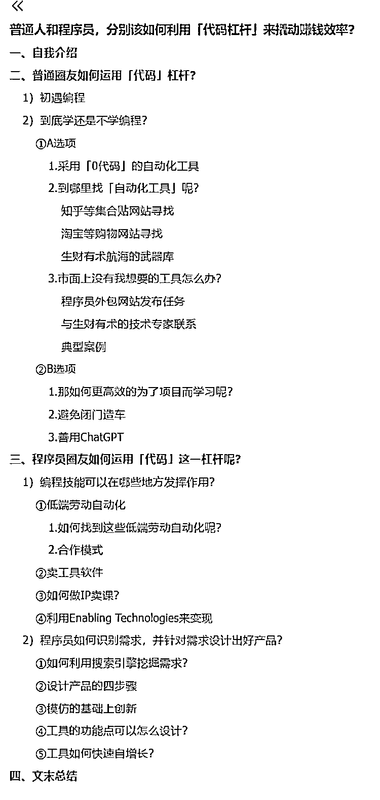

 

 

评论区：

七小 : 小兄弟很稳🐮

凡灵逸尘 : 新秀

炮爷（不睡觉） : 禾急，稳的，😄

花天卓 : 两年的老朋友表示新朋友很厉害，谢谢你的分享。

AUDI : 很棒，里面的一些场景我都想到了还做了个工具出来上线了，但是你列举的更多，

晨曦 : 04年双鱼，广州靓仔18岁，真是厉害

# **# ****(44**赞**)**跳出程序员思维：如何应对上手英文工

# 具站的几点误区

作者：  子木（二哥）

日期：2022-12-22

大家好，我是子木。

这次给大家带来程序员如何应对上手英文工具站的  几点误区，帮助大家跳出程序员思维，一起出海生财有术 ~

----- 小小分割线 -----

误区一：以为参加了这一次航海，就可以赚到美刀。这样想，往往很难达到预期。

 

 

我的看法：

参加航海，对于新人来说只是开始，永远不是开始盈利。

保持长期主义，保持复利，保证这个赛道值得的心态。

你可以想想，谷歌 SEO 都没有见效这么快，何况生财航海，何况还是英文工具站这个项目。

----- 小小分割线 -----

误区二：没有技术的人，不需要技术就能挣钱。有技术的人，往往觉得技术能改变一切，这容易产生错觉

我的看法：

商业项目中，技术虽然很重要，但并不绝对。

比如我们这次英文工具站，技术只是实现网站的一种方式和工具。

没有技术的人，可以找外包去做，也可以找一个成型的系统（WordPress 等）去搭建。

所以技术只是在这个项目中重要的一环，但不是所有的闭环。

 

 

----- 小小分割线 -----

误区三：大部分时间花在做网站上，而不是花在研究怎么卖网站上。大家可能想说没做出来怎么卖？其实这是不对的。

我的看法：

如果都没想过或者研究过怎么卖？或者没尝试去卖过，比如直接做一个落地页，去卖卖看，然后看数据做决策，而不是盲目的先去做。

最好的** MVP **应该是像生财有术说过的卖空气，我理解为是最快完成商业闭环的验证。

然后根据数据去决策是否要做这个“空气”，拿英文工具站来说，基本上做的东西没有多少技术含金量。

它也不像做一个 Open AI 这种高含金量的技术实现。顶多是接入API接口，封装一层做一些结构化或场景化的功能。

所以，还是跟之前跟大家分享的一样，大家多花点时间在研究怎么卖上。

这里还是再分享下之前在群里面看法哈：

 

 

我发现大家基本都是工程师，爱搞钱的工程师，这就是工程师中的爱折腾 20% 了。这已经很不错了

但看大家的打卡，普遍的关注点在技术实现，在说如何实现这个东西碰到具体的问题。

而没有花很多时间研究这个东西，是不是用户想要的，是不是 GTM（Go To Market）的。

同样，也没有花很多时间研究流量，包括冷启动方式、持续获取流量的方式、流量的竞争度等等。

比如假设你已经做出了这个东西，而且跟竞品差不多质量情况下，下一步怎么办？下一步如何获客 & 赚到第一块钱...

所以建议小伙伴们，二八原则：

**1. ** 没开始做的小伙伴：**80% **精力多多研究，要做的** IT **对应的是否** GTM **和** **流量维度的竞争

**2. ** 正在做的小伙伴：**20% **精力也多多研究如上所述

----- 小小分割线 -----

误区四：自身的需求一定是好需求吗？不一定

我的看法：

 

 

首先自身的需求一定是好需求吗？得看怎么界定这个好。按照商业来说，最终的目的是盈利。那么程序员用户相关的需求，不一定是好需求。

因为程序员相关的流量其变现难度很大，最好的程序员变现的方式，就是卖课。

之前做过海外程序员相关的网站，最多就是挂程序员相关课程的返佣链接。

但不可否认自身的需求，也有好的点。其就是你是用户，你更懂用户需求的差异化和创新点等。

但这只是产品价值维度的考虑，其产品商业维度呢，也需要更多考虑考虑下。

----- 小小分割线 -----

误区五：一定要全部调研完，才开始做？一定要看完生财有术相关文章，才开始做？这肯定不对

我的看法：

我之前也存在这个问题，所以分享给大家。

这可能也是普遍程序员存在的特性，因为程序员比较完美主义，注重细节把握。

 

 

Hope for the best

所以会针对项目或参加这一次英文工具站航海，就想要先把东西看完学完，才开始动手，导致迟迟不能动手，其实是不对。

举个例子，比如挖掘到一个很好的蓝海词，然后进行很细节很丰富很全的调研，导致越调研越没有信心。

我认为蓝海有很多纬度，比如流量维度，比如产品维度。蓝海，其实讲的是竞争度。

流量上，也分很多渠道。只要你抓住某些或某个渠道，你能竞争到获取流量，那也就行了。

产品上，只要能实现或者达到竞品差不多的质量。甚至有些维度好一点，那也就行了。

变现上，不用说了，最简单的方式就是广告，其他参考竞品即可。

综上所述，准备到什么时候才开始动手。每个人都有每个人的度。

这里提醒大家，实践才是最好的老师或者最好的教训。

别想着第一次去做，就会成功。这样打击会更大，应该是降低预期，不断试错。这样会更好：

记住马浚伟的这三句短语

 

 

Prepare for the worst

Expect Noting

抱最大的希望，

做最坏的打算，

尽最大的努力。

----- 小小分割线 -----

误区六：别人改改就能上线的网站，我做了就能比他好？凭啥能行呢？我得继续找找更蓝海的需求。

我的看法：

这有点好高骛远，请记住：你永远不可能是第一个吃螃蟹的人。

因此基本上你要做的网站，都会有竞品。实在没有很对标的竞品，也会有差不多的类竞品存在。

实在真的没有的话，那应该是一个很创新，很罕见的新产品，但记住我们自己是普通人，不是“乔布斯”这种神一样的人。同样，我不建议你做这个独特的产品。

所以挖掘蓝海需求，有个前提：挖掘到有对应竞品的蓝海需求

 

 

面对需求，可以按照几个维度去考虑做不做：

**1. ** 价值侧：提供的是内容价值还是工具价值，该价值是否长期能给用户带来**2. ** 流量侧：至少一种获客渠道，成本或者竞争度低的。比如谷歌** SEO****3. ** 产品侧：技术实现成本低

这样满足的话，做出来快，验证周期短。边验证这个项目，也不忘记继续找找更蓝海的需求。

----- 小小分割线 -----

误区七：心态容易炸，尤其是程序员，看不起用户，用户不会使用功能，就 MN（骂娘）

我的看法：

首先针对这个误区。我先讲一下程序员最好的职业发展路径，这个路径肯定是成为一个优秀的 CTO。

但一个合格的 CTO ，起码以下三个点能力：技术能力、产品能力和管理能力。

其产品能力，包括产品的商业化，也包括产品对用户的价值输出。价值输出，包含了产品的体验、产品的交互设计等等

如果大家既想要做好产品，又想要有更好的职业发展。首先要让自己慢慢的向优秀的产品经理靠近，而不是成为被老生常谈的月经帖中跟产品经理对着干的程序员。

 

 

用户不单单只是为功能买单，还会为界面的好看程度，产品体验的好与坏，网站的打开速度等等维度。

从进入到产品（包括产品的打开速度、注册步骤多少），到完成你产品真正价值体验结束。

整个旅途，方方面面的因素都会影响用户决策买单。

所以做出一个产品的时候，一方面多多参考优秀的竞品，另一方面多多把自己当成新用户，从注册开始。体验自己的产品。

评论区：

暂无评论

# 【实操篇】**6**篇

# **# ****(**精华帖**)(738**赞**)**我通过流量主每月被动收入

# 超**5W**的历程分享

作者：  程序员田同学

 

 

日期：2023-06-20

大家好，我是程序员田同学，一个在小程序行业沉淀了五年，在老年私域粉+公众号\小程序流量主赛道专研三年的玩家。

三年前，我大四实习工资一月3000，经过这几年的探索，现在在不影响我本职工作和个人IP业务的前提下，兼职运营数十个公众号和小程序。

下图是我今年二月上线的小程序，目前像这样在盈利的老年小程序有十二个。

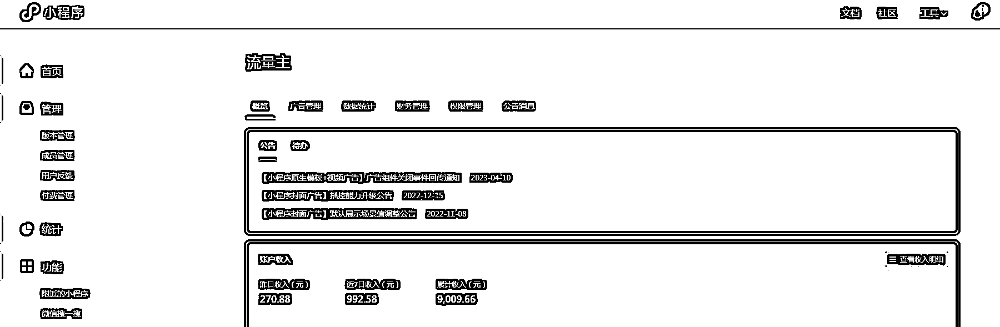

下图是我今年新开的一个老年公众号的收益，这样的公众号目前有十五个。

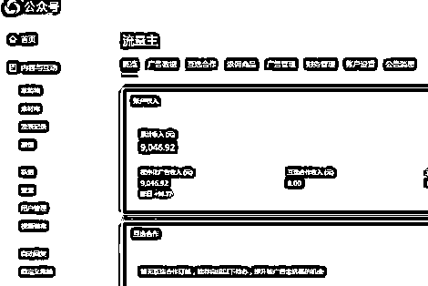

 

 

这样的成绩在大佬云集的生财里可能不值一提，但它对于我这样的普通人来说，在当下的人生阶段还是挺满意的。

这篇文章就和大家详细分享一下——我是从何从迷茫的状态->再到找到赚钱方向->最后再到老年私域粉的引流和变现的具体玩法。

详情请移步：

https://q2srbwoeiz.feishu.cn/docx/N147dCBZJoN4sxxAprMcVZZHnWf最后特别感谢涛哥对文章的悉心指导。大家如果有什么需要，也欢迎和我交流。

评论区：

展扬 : 先点赞后观看

程序员田同学 : [抱拳][抱拳][抱拳]

张集慧 : 把抖音，视频号火过的养生类视频和这类小程序结合起来，不知道效果怎样  程序员田同学 : 内容从来不是最重要的，老年粉喜欢军事

而且养生类是不能上架小程序的

张集慧 : 懂了

小王子 : 大哥牛逼

云桃桃 : 厉害！

猴大 : 多个公众号，在一个ip下有影响么？

# **# ****(**精华帖**)(543**赞**)**我是如何从零开始，挖掘到

# 蓝海小众需求，半年赚到**40**万的

 

 

作者：  陈予希_

日期：2023-06-09

《  我是如何从零开始，挖掘到蓝海小众需求，半年赚到40万的？  》

去年 7 月，我通过挖掘出一个不起眼的小众需求，一步一步打造成全自动赚钱机器，公众号精准吸粉 6w，半年变现了 40W 利润。

今天，将这个项目从发现需求、挣到第1块钱，再放大到六位数的全过程，以及我的思考、实操细节，真诚、毫无保留地分享给大家，也是我对这个项目的一次全面复盘。

前辈们好，我是陈予希_：生财第七期新人，02年，目前在长沙。

初入生财，受益良多，这是我在生财发布的第一篇长文，有幸给大家分享一点浅薄经验，感恩遇见。

...

为了更好的阅读体验，请移步飞书：

https://c6ti72phuk.feishu.cn/docx/MBm6dkcOQoEHHLx5u6ecHpaTngu评论区：

小马哥xy50 : 这细节满满，自动化搞得真不错，可以搞起合作了

闲富（软件定制） : 用易语言写ChatGPT注册的大叔路过...给小兄弟点赞  从前有座山 : 像读了一篇小说，代入感很强[呲牙]

林中灰兔 : 厉害，竟然把sp注册充值搞成了自动化操作

kihyo : 执行很棒，产品的思维很不错呀

NickW : 真的干货！从发现需求到落地赚到钱，项目拆解能力太强了！全文看下来一气呵成很舒服

小武武 : 干货，细节满满

肖奈何 : 厉害👍

# **# ****(**精华帖**)(293**赞**)**电子书产品变现百万** + **的完

# 整经历复盘

 

 

作者：  胡不归

日期：2023-02-10

赚钱有多种，我简单分了两类。

手停口停型，搞的时候可能一天上千上万，一旦停下来就收入大降甚至归零，比如主业工资。

睡后收入型，一次集中投入（培育一头现金奶牛），即便放着不管也可以带来长久的收益，比如出版一本书，或者上架几款iOS APP。

2015年移动互联网正在爆发期，公司业务从PC全面转向移动。在给公司注册企业iOS开发者账号时，出于探索和测试自己也顺便搞了一个个人账号。

快速看了一遍简单教程（方便工作中跟工程师沟通），觉得做个APP好像也并不复杂。

说干就干，在一个周末捣鼓出了第一个APP “XX图集”。

起初一周仅靠自然搜索流量每天都有一百来个下载，在把免费下载切换成6元付费下载后（只需在苹果后台点几下鼠标），每天仍然有5-10个，由此跑通从0到1的过程。

而 iOS APP 70%的用户都来源于搜索，只要能满足需求自然流量是很丰富的，加上付费机制完整，不依赖于个人服务器，于是在知道电子书网站变现可观的信息后，做了60+电子书 APP矩阵，完成了我从1到N的积累过程（睡后收入够养家糊口的状态）。

今天跟大伙儿聊聊我通过iOS APP赚到百万+睡后收入的一段经历，希望对各位能有所启发  💡

 

 

我是胡不归，生财首期圈友，从业十多年的前互联网产品和运营负责人。

数月前从北京来到苏州，目前是一枚“在家待业”的全职奶爸，欢迎各位大佬来撩 :)文章略长，脉络如下：

**1. ** 为什么选睡后收入型的副业？

**2. ** iOS APP入坑，以及从0到1的过程

**3. ** 从1 到 N 的体力活

**4. ** 原来还可以从 N 到 N*N？

**5. ** 一夜间从 N 归零

**6. ** 一些复盘和反思

**7. ** 目前还有没有机会？

**8. ** Q&A

老规矩先上图，这是其中一个admob广告账户，每月23日左右发放收益，至今累计已有9万多美刀。苹果付费下载和内购收入是每月25日到账，再加上主业工资基本每个月领三次薪水  😀。

 

 

# **1.**为什么选睡后收入型的副业？

赚钱有多种，简单分两类。

（1）手停口停型，搞的时候可能一天上千上万，一旦停下来就收入大降甚至归零，比如主业工资。

（2）睡后收入型，一次集中投入（培育一头现金奶牛），即便放着不管也可以带来长久的收益，比如出版一本书，或者上架几款iOS APP。

 

 

我此前是一家创业公司创始成员，初期9116是家常便饭，跟老婆领证前一晚还加班到凌晨两点。平常没时间折腾，只在周末能有几个小时搞搞副业，非常适合睡后收入型。

另外最初也没想着赚大钱，主要是想在主业之外多个技能傍身，也多个收入来源缓解焦虑（互联网从业者懂的都懂  😂），一来二去就入了iOS APP的坑。

# **2.**为什么是**iOS APP**？以及从**0**到**1**

2015年移动互联网正在爆发期，公司业务从PC全面转向移动。在给公司注册企业iOS开发者账号时，出于探索和测试自己也顺便搞了一个个人账号。

快速看了一遍简单教程（方便工作中跟工程师沟通），觉得做个APP好像也并不复杂。

 

 

iOS的开发工具是Xcode，有不少“所见即所得”的模块，拖拖拽拽不用写代码也能做出简单功能。

说干就干，在一个周末捣鼓出了第一个APP “XX图集”。功能极其简单，把某个领域的图片收集起来，分门别类一张张拖到Xcode里，起个好听的名字，列出100个字的关键词，按流程打包发布，居然很快就通过审核上架了。

起初一周仅靠自然搜索流量每天都有一百来个下载，在把免费下载切换成6元付费下载后（只需在苹果后台点几下鼠标），每天仍然有5-10个。着实小兴奋了几天，有种当年做个人网站收到第一笔广告费的感觉  😀

**iOS APP**有几点关键优势：

**1.  70%**的用户下载来源于搜索， 自然流量丰富。

**1. ** 自带两套简单且完整的变现机制：付费下载、免费下载后在应用内再付费。

 

 

**1.  APP**可以 不依赖个人服务器，所有资源全部打包上传给苹果做下载分发，免费、稳定、不限量。

# **3.**从**1**到**N**的过程

初尝甜头之后，开始每个周末都花半天时间去咖啡馆重复这套流程：

**1. ** 搜集图片资料

**2. ** 把图片拖到**Xcode**里生成**APP**

**3. ** 制作**APP**图标（比较简朴，有些甚至就是**XX**图集几个大字）

**4. ** 参照其它**APP**起名字和编写关键词

**5. ** 打包上传等待苹果审核

**6. ** 把免费下载改为付费下载

 

 

几个月枯燥的重复，我手上有了十几个各种图集APP。每月睡后收入也来到了2000左右，刚够每日早餐和通勤费用。

期间遇到的问题：

**1. ** 苹果审核不通过，应用过于简单或者判定抄袭

**2. ** 没有下载量，每天个位数下载甚至每周个位数

**3. ** 免费时有人下载，转付费后归零

**4. ** 资源和灵感枯竭，简单好做的好像已经全搞完了

似乎刚起步就到了瓶颈期。

有一天跟朋友闲聊，提到一个电子书网站收入还不错，但是被举报丢了网站备案。

 

 

说者无心听者有意，这可能又是一个从PC到移动的机会，毕竟彼时APP还没有备案一说。

16年前后，App Store上的免费电子书APP已经是一抓一大把。

先做了个简单调研，得到的声音都说电子书已经没搞头了，cocoachina论坛（曾经的老牌iOS开发者论坛）里也没人看好这个领域。原因无非有二：竞争已经饱和，版权风险日益升高。

我不认同的原因有三

**1. ** 竞争激烈只是表象，**app**数量虽多但还 远没有到饱和的程度。尤其已有的**APP**质量大多不高，且内容相对陈旧。

 

 

**1. ** 电子书**APP**一抓一大把，恰恰说明版权仍处于灰色地带， 风险仍然可控。

**1. ** 大部分人一致认同的观点，往往都是错的。

想明白了那就继续搞，电子书APP的开发难度可不像简单的图片拼凑，已经远超我的开发能力。

还没赚钱就找外包开发显然不明智，这时候了解到一个神奇的网站  github.com，全球开发者的源码分享平台。

在平台上搜到一套可以加载epub电子书的源码，开发者的使用说明写的非常详细完整，按照说明将源码顺利编译打包成功！

问题来了

 

 

源码开发者貌似是巴西人，只适配了英文和一些小语种，把中文epub电子书文件拖进去后经常会报错和程序崩溃（中文epub文件在制作时很多并没有按行业规范）。

通过邮箱找到开发者，当然先是赞扬这套源码超级无敌好用，顺便提出中文适配的小问题，再发几套有问题的中文版epub文件供他调试，最后通过paypal转账20美金以示鼓励。

巴西小哥估计很少被打赏，这一套流程下来那是相当热情，不到一个礼拜就解决了适配问题（这些年在业务中合作过的程序员有大几十个，这么热情主动的真不多见）。

更重要的是跟开发者建立了沟通渠道，相当于几乎免费获得了一个技术合伙人。当然后来有了收入，又陆续转了更多美金作为感谢，真诚的。

接下来的事情就简单了，把XX图集的模式搬到电子书APP上，并且做了升级迭代。

电子书需求挖掘

一类是经典图书，诸如世界名著系列、鲁迅文集等，特点是热度一般但需求稳定，作为整个APP矩阵的基本盘。

另一类是跟随和预判热点趋势，典型的是热播影视剧原著小说系列，盗墓笔记、亲爱的翻译官诸如此类。各大平台和电视台都有年度播出计划表，可以据此进行精确计划，提前一两个月布局上架APP。

 

 

特点是开播时的下载量会暴涨，播完后会逐渐归于平静，大概留有半年的长尾期另外，这类型的竞品app也会多一些，不过大多都在热播后才上架。

由于提前布局抢得先发优势，我的APP在热门影视剧的搜索结果前五名里，基本都能占有一席之地。

**1. ** APP打包发布

APP名称依然简单粗暴，“XX原著小说”。APP图标做了几套固定模板，如纯色背景+“XX原著”字样、角色海报+“原著”两字、书籍图标加上书名文字等。

一个APP只打包一本电子书，大概率不会过审，可以多放几本书进来做成一个系列。如言情系列、武侠系列，一方面更易过审，另外也能提高用户的打开频次和活跃度。

APP的UI设计也搞了几套不同的风格，基本都是用创客贴(chuangkit.com)和阿里的设计图标库(iconfont.cn)做简单堆砌。

作为内容核心的epub电子书文件，早期在百度上搜索到的文件质量参差不齐，有些版本满篇错别字还自带广告。后期基本泡在几个电子书论坛和通过淘宝付费购买，拿到了不少第一手精校版的epub文件。

**1. ** APP矩阵互推

经过一段时间折腾，开发者账号下有了60+成功上架的电子书APP。这些APP用户的调性相同，都是爱阅读的好孩子。

 

 

终于在一个国庆长假，下定决心把大部分流量还不错的APP集中做了一次发版更新（纯纯的体力活）。统一悄悄加入了一个互推模块，让下载了A应用的用户，还可以下载到B、C、D...应用，形成一个小小的闭环。

悄悄，是因为苹果官方其实并不允许把APP推荐作为功能，但管理并不严格。

另外你也能发现，直到这时候我仍然没有搞自己的服务器，所有APP全部都是静态本地的，美其名曰“支持离线功能”，但是想更新任何一个小功能甚至是改一个字都必须重新打包发布。

直到后来看到了友盟umeng.com的在线参数功能，相当于不用发版就可以在线热更新，捣鼓了一阵后就派上了用场。

之后在每个新APP上架完成时，通过设置在线参数让矩阵里的所有APP都推荐这个新APP，相当于0成本就完成了新APP的冷启动，效果非常好。

**1. ** 引入广告变现和内购模式

 

 

通过付费下载的方式来变现电子书APP，经验证此路不通，且版权风险最高，相当于直接交易。

接入了google admob的广告平台（同样的，接入说明写的非常详细，有中文技术人员支持，早期可直接访问目前需梯子），用户阅读时会在APP里显示横幅广告，每次点击都有收益。

在用户阅读累计XX页或者累计阅读XX分钟时，也可以直接弹窗插页广告，顺带温馨提醒用户注意休息，广告变现的路径很流畅。

目前admob仍是为数不多的接受个人开发者的广告平台，国内广点通等大平台都需要企业资质。

对于高质量用户，通过苹果的内购功能，提供6元、12元永久去广告功能。内购功能也是github上的一套现成源码，自己只要复制粘贴几行代码就能搞定。

 

 

广告收入和内购收入比例大致在2：1。期间很明显能看到，选择内购去广告的用户比例在逐渐增加，说明用户为内容付费的习惯也在逐渐养成。

与此同时每月的睡后收入也迈过了10000、20000... ...，养家糊口靠副业基本足够，主业工资可以直接攒起来啦。

# **4.**从** N **到** N*N**？

APP矩阵规模上来后，开始感到了来自竞争者的压力。

一个APP爆火，一周之内肯定会有竞品模仿跟进。

 

 

正常竞争倒无所谓，有一些是对我的APP直接破解，原封不动拿走其中的epub文件包（iOS资源包几分钟就可以被破解），甚至连UI设计资源都照搬（这么渣也抄...）应对措施

**1. ** 多注册几个开发者账号，同一套内容微调后打包成不同的**APP**，自己和自己竞争。既覆盖了更多的关键词，也营造出竞争已经饱和的氛围。

**1. ** 使用**calibre**工具，对上千个**epub**文件进行批量二次编辑，一方面打上水印减少被搬运风险，另外也是重新规范**epub**文件格式，提高用户体验降低崩溃频率（电脑：活久见啊**... **跑**calibre**也能连续跑十几个小时）。

**1. ** 对恶意抄袭太过分的竞对进行投诉反击，有一些效果但不明显，但埋下了巨大的隐患。

完成N*N后，副业进入了大约两年的平稳期，每月只要花几个小时，收入也能基本维持在3万~5万。

主业虽然依旧艰辛，但由于有了这笔副业收入，心理上倒也没有太大负担和焦虑。

在此期间经历了孩子出生、公司险被收购、受Google邀请去中关村总部做客、有人上门谈收购、有知名媒体想要采访（当然是拒绝了）、自己也生了场病做了个不大不小的手术。

周末仍然会去咖啡馆里坐一坐，一番操作之后顺利成为了该咖啡馆的资深会员（嗯？） 

 

最终手上沉淀下来3个开发者账号和1个备用账号，矩阵内同时在线的APP数量也超过了200个，每天纯自然流量下载5000+，累计下载量500万+，日活用户2万+，日启动次数20万+，这个数据超过了一些互联网公司的用户规模。

几件趣事

**1. ** 作为马甲备胎的**APP**设计包装和关键词设置上通常不太走心，只要能上架就可，但经常会出现下载量比主账号还高的情况，世界果然是量子的，充满了不

确定性。

**1. ** 由于提前布局和闭环互推，常会出现某个热门关键词的搜索结果前**5**名中，有**3**个都落在我的矩阵里。

**1. ** 每位用户有一次机会，只要给应用五星好评就能免除一段时间广告，借此积攒了大量好评。但其实**iOS**根本追踪不到用户的评价行为，点按钮跳到评价页后直接关掉甚至给差评效果也一样。

**1.  “**吞鲲**”**广告大伙还有印象么，这个团队投了巨额营销费用做推广，好巧不巧跟我一个**APP**关键词撞车，结果那个**APP**单天下载量直接坐火箭破万，一天收入暴涨几千。当时我正在公司带一个项目，这笔不义之财全被拿来发了团队红包** **

😅。

**1. ** 用**admob**平台收到的是美金，相当于为国家赚外汇，大额结汇后经常接到银行监管的盘问电话。每人每年有**5**万刀的外汇额度，后来用家人身份又多开了几个广告账户。

# **5.**一夜间从** N **归零

 

 

、

前面提到我发起的竞对投诉，没想到结果竟是掀起了一场战争，为我国的版权合规化事业做出了突出贡献  😂。

此前但凡收到版权方反馈，无论多火爆我都会直接下架APP，一方面规避风险，另外也算是互联网人的基本操守。

但混战开始之后，似乎人人都成了版权方，一个月收到几十封侵权投诉，真假难辨。

混战开始

混战始于一些玩家的无差别砸盘，各种阴招损招让人大开眼界。

诸如注册大量苹果小号投诉侵权、恶意刷差评、恶意给我刷量然后举报、付费后秒申请退款、伪造官方邮箱给苹果发函投诉（比如阅文集团yuewen@vip.XX.COM）、伪造律师函（照搬网上模板）、伪造版权证明、伪造身份引战嫁祸给其它开发者...

 

 

作为十几年的互联网老boy，我也一时没把持住火力全开加入战斗，导弹核弹一起招呼...过程就不表了，结果是惊动了苹果官方和一些大版权方，在18年底19年初，App Store大量电子书APP集体消失不见，我的主力开发者账号和200多个APP也在一夜间被彻底封禁下架，并且X年内不得申请开发者账号，睡后收入大跌90%。

福兮祸所依，祸兮福所伏，混战结束后不久看到一则新闻。

有位开发者因开办电子书网站涉嫌侵权被正式起诉且实刑判决，这在我国司法实践中是很罕见的，毕竟互联网有避风港原则，某度文库都大摇大摆的存活且商业化了这么多年。

APP相对于网站来说还是新事物，对新事物的司法实践一般都会谨慎且滞后，但显然也是给掘金者们敲响了警钟。

# **6.**复盘和反思

 

 

**1. ** 反思1：风控能力就是止损能力

虽然搭建了多账号矩阵，但没有对高低风险APP进行分开管理。

诸如XX图集、世界名著等的风险并不高，作为基本盘每月也能贡献30%+的收入。但是随着账号整体被端，这部分收入也随之东去，甚是可惜。

**1. ** 反思2：选对竞争对手

不要跟没有下限的对手去拼下限。

不要贪一时之快，能跟对手做朋友者，可拜上将军。

**1. ** 反思3：私域运营要有执行力

 

 

从16年起私域运营的概念已经逐渐成熟和体系化，在企业微信全面替代wetool之后更是迎来了合规经营的爆发期。

虽然在公司里我也带着小朋友们搭建私域，但始终把自己搞的APP矩阵当做一个小副业，从心底没有打算投入更多的资源和精力。

否则日活2万+的垂类读书群体如果沉淀到微信，将是一个非常可观的数字，也将给变现带来更多的想象空间。于后来涌现出来的书单号而言，简直就是出生在罗马。

**1. ** 反思4：该退出时就退出

其实在完成N*N打造后，我的个人能力和精力就已经陷入了严重瓶颈。在APP打磨、变现效率、用户运营上都暴露了明显不足。比如大部分APP，直到下架时都还没有顾上配置push推送这个最基本的运营功能。

期间也有做流量生意的团队主动找上门来，显然对我的模式是做过仔细研究的，出价百万想买断这套APP矩阵，当时觉得交接过程太麻烦会影响工作也没认真搭理（实话）。

现在想来买家其实很可能就是某个竞争对手，买断止战其实不失为一条双赢的良策。

我工作的行业是互联网出境旅游，从BAT出来后一直在这家公司，和一群志同道合的伙伴一起做了很多年，一度能瞥见IPO的曙光。期间自己也婉拒过各路猎头邀约，确实是当成了事业在做。

随着口罩的到来，转瞬之间整个行业都消失了。手上据说价值八位数的期权股份也随之东去，一朝梦醒。

 

 

# **7.**现在还有没有机会？以及简单的开局思路探讨

**iOS APP**现在还有搞头么？

在我看来当然有，并且竞争烈度可能只有X宝、X音、XX号的十分之一，尚有不少蓝海等待挖掘。

之前的老照片修复项目不少朋友应该还有印象。当时凑热闹跟朋友一起做了个APP，至今两年没有更新维护，每月仍然有大几百的收入。

 

 

再看看前一阵突然爆火的电子木鱼APP，最高的一天躺赚五万块。目前每天依然能稳稳纯收入500+，这还仅计算了内购的部分。

你至少需要拥有一台苹果手机和苹果电脑才能成为开发者，且需要能把APP搞上架才有可能赚钱，这些都是天然门槛，保证了竞争者不会太多。有句话说的好，你遇到的所有困难都将成为竞争者的门槛，而没有门槛的事情都不长久。

一套简单的开局思路探讨

【发现需求】

**H5**

最近刷抖音的时候刷到几个做道家知识的小V，数据还不错。在百度指数

index.baidu.com上搜索道教、道家、道德经、道藏等关键词，发现近几年的搜索需求很稳定且有上涨趋势。

【分析市场和竞品】

**H5**

验证需求后，在七麦数据  qimai.cn  上看看市场情况。

 

 

以“道藏”这个词为例，搜索指数为4601说明至少有用户会进行日常搜索。

搜索结果排名第一的是《诸夏道家古籍》，作者是个人开发者，APP在图书类免费榜排名能进前500，预估每日下载为100~200，上架6个月当前评分为1颗星。

当然也可拓展关键词进行分析，如“炁体源流”、“道德真经”、“三洞真经”等，分析越充分成功率越高。

 

 

把相关且有下载量的APP从Appstore下载把玩一番。以《诸夏道家古籍》为例，发现十分简陋粗糙。左侧导航条点击无反应，正文的翻译按钮点击后报错，确实只值一颗星。

**1. ** 衡量自己的开发能力（包括个人开发能力、资料搜集整合能力、从**github**上拷贝代码的能力、寻找技术合伙人的能力等），感觉能比他做的更好。

 

 

 

 

**  **【搜集资料制作**APP**】

**H5**

根据源码支持的文件类型，在百度（淘宝效率更高）上搜索“道藏 epub”、“道藏 pdf”、“道藏 txt”，下载对应格式的内容文件生成APP。

epub源码参考：https://github.com/FolioReader/FolioReaderKitpdf源码参考：https://github.com/Alua-Kinzhebayeva/iOS-PDF-Readertxt源码参考：https://github.com/coyingcat/TxtReader注：每吃透一套源码，就相当于多开辟了一条赛道。

【**APP**发布上架】

**H5**

你需要准备APP的名称（建议23字以内）、副标题（建议15字以内）、APP搜索关键词（100个字），这三项是搜索自然流量的主要来源，可参考市场同类APP进行调整优化。

此外需要准备APP的图标（可用图怪兽或者PS简单制作）、APP的展示视频或截图（Xcode开发工具自带模拟器，可直接录屏和截图）、APP的介绍描述，这三项决定用户在搜索之后，是否会下载你的APP。

按流程提交上架审核后，新手往往会遇到一些问题，善用网络搜索，逐一解决击破即可。

 

 

APP上架常见问题：https://blog.csdn.net/suifengpiaoluo/article/details/124847124**  **【流量优化】

**H5**

诸如此类蓝海小众APP，除非遇到热点，否则日均下载量基本在几十到几百。但是用户群精准，遇到能满足刚需的功能时付费意愿也更强。

除了继续优化标题、副标题、关键词、APP截图、APP描述之外，还可以有意识的引导用户给APP进行好评。如果手上有现成资源，也可以利用已有流量对APP进行冷启动，比如下载APP并截图，返现返积分等。

更复杂的玩法涉及刷评、刷榜、刷购买量等操作，对于ARPU值未经验证的APP不建议使用。

【商业化变现】

最简单：直接设置付费X元才能下载。用户没有试错机会，适用于刚需且小众的APP类型。

付费下载APP排行榜可参见：

https://www.qimai.cn/rank/index/brand/paid/device/iphone/country/cn/genre/5000 

 

最普适：接入谷歌旗下的admob广告（apps.admob.com），无需企业资质，每月汇入美金（最低100美金起付），支持横幅、插页、开屏、激励等广告类型。变现效率尚可，接入文档详细，有技术人员支持。

多维度：有一些偏高端的用户付费习惯已经养成，不喜欢看广告，喜欢简单粗暴的拥有全功能。

考虑接入苹果的内购功能组件（iAP in-APP-Purchase)，允许用户在应用内购买以免除广告或解锁功能。如免费阅读时常驻显示横幅广告，且每10页弹出一次插页广告，且用户只能免费阅读前100页等，付费后可解除以上限制。

内购功能可以单独使用，也可跟广告搭配使用。

更大的变现空间：把APP矩阵作为精准用户的引流途径，沉淀到私域进行长期转化。据说（未证实），运营还不错的道家知识V信号，平均每一位好友年变现能力超过200元，且毛利率80%以上。

# **8.**你可能还想了解的问题

 

 

**Q**：搞**iOS APP**必须是程序员么？

A：否，我自己也不是程序员，但至少要完整的看一遍iOS开发教程，同时有快速学习和解决问题的能力。反而很多程序员并不适合做。

我接触过不少程序员，太过专注于代码或者眼高手低，编程上的优势往往弥补不了在需求洞察和营销推广上的短板。当然你也可以找个程序员当技术合伙人，各取所长赚钱了一起分。

**Q**：电子书**APP**还能做么？

A：目前依然有在做的。一部分是经典图书如世界名著系列，流量很稳不过竞争趋于饱和，做的话需要有差异化。另外也有愿意承担风险赚超额收益的，比如披着各种马甲的笔趣阁APP。

**Q**：哪些类目的**APP**可以搞？

A：发挥你的想象，多用七麦网站（qimai.cn）看看市场情况。在各大平台火热的内容，问问自己在未来几年内是否会有用户持续搜索。

 

 

比如最近大家在聊的行业资料库、中医养生知识、世界货币知识... 电子木鱼火了之后，我们看到同一个开发者又接着搞了电子转经筒、赛博佛珠等，功能都极其简单，流量也还不错。

 

 

 

 

 

 

 

 

 

 

 

 

**Q**：为啥不搞安卓，只做**iOS**？

A：我的精力实在有限只做了iOS，安卓用户体量更大，确实可能大有可为。

不过有几点要注意：安卓自然搜索下载的比例远低于iOS、安卓上架前需要注册申请软著权、需要自己搞定资金账户和开发内购功能、admob在国内安卓基本不可用需要有企业资质来对接广点通等广告平台。

同样的，如果你能解决这些问题，这些都将成为你的竞争壁垒，安卓当然可以搞啦。

**Q**：为啥不搞小程序要搞**APP**？

A：站在公司角度我也常说，不要APP要搞小程序，因为私域运营已被验证有巨大价值。

但从个人副业来看，综合衡量运营能力、竞争烈度、审核推荐机制、商业变现的路径... 小程序和APP各有所长，并非是同一个赛道。至少小程序总包大小不能超过20M就已经限制了很多奇思妙想，当然如果有成功案例也欢迎分享探讨  😀

以上，一点点过往的经验分享，希望对大伙能有一丝丝启发  💡

我是胡不归，身居苏州的一枚85后全职奶爸，欢迎各位大佬来撩，以及推荐工作。

评论区：

 

 

肖江波 : 快速看了一遍简单教程，感觉也不是很难[心碎][心碎][心碎] Summer : 几年之前我们干过这行，刷榜撸广告费，同行内卷太残忍相互恶意点击更是家常便饭，一天几十万广告费撸的心惊胆战的

苏玲 : 认真看完，花了整整一个小时[强]感谢分享

亦仁 : 感谢分享，已加精华。

时兴淘太狼 : 思路打开了，感谢

陈真 : 脑子：这个我也会，

手：这都什么玩意，这么难？

代码君 : iOS最难的不是项目，是上架，经常被拒，不然光卖马甲包就年入百万  乔 : 安卓的也能做吗？

# **# ****(**精华帖**)(110**赞**)**程序员的视角看问题：想把

# 视频转成文字，用代码来解决，最终实现问题的

# 解决** + **收益

作者：  佳恺

日期：2022-10-24

大家好，我是佳恺，微信昵称北极，是一名爱折腾的野生程序员。

因为我平时会报一些网课，在学习视频课程的过程中，需要做笔记，方便复习。但是边看视频边记笔记，遇到讲的快的地方，速度跟不上，反复拉进度条回看，很麻烦，效率也低，我就会想有没有可以直接把视频转成文字的工具呢？

今天跟大家分享我是如何通过制作一款小工具实现视频转文字自动化，解决了自己的需求，之后验证他人的需求存在，完成推广变现的过程。

 

 

这个项目现在的情况是，小程序累计用户 12w，日IP 1.5k左右，2个公众号粉丝 2.7w，微信好友 2k。（数据截图我在文末附上）

变现的话，确实比较少，1个月只有4-5k。不过这个项目算是完成了从需求-产品-流量再到变现的一个全过程，希望对新手同学有帮助。

文章内容大概分为三个部分进行：

第一个部分讲的是从我遇到的一个问题发现的小机会，这部分想说明我们可以多从平时所遇到的问题去发现机会挖掘需求，因为是自己亲身经历过的，更深刻，也更能从用户角度去思考，做成的信心也越大。

第二个部分分成4个小节，第1小节是需求调研，我在这部分介绍怎么通过百度指数，去验证别人是不是也有这个需求，只有验证需求后，我们才能判断这个需求有多大，竞争有多大，值不值得我们花时间和精力去做这个项目。

第2小节，工具开发这部分没有讲技术、代码上的东西，主要是想说做项目最好是快速建立mvp，然后优化迭代，这样才能快速上线获得反馈。

第3小节，运营推广这部分主要介绍我通过微信公众号seo获取流量的过程，我认为微信公众号seo截流是也一种快速获取稳定被动流量的方式，而且从我的推广过程来看，比百度seo要简单不少，重点就是取一个包含关键词的公众号名称。

第4小节，迭代变现这部分介绍我根据用户反馈优化工具，从这些反馈中挖掘更深层次的需求来变现的过程，其实只要解决了用户的问题，变现只是顺带的事儿。

 

 

第三个部分，是我在这个项目中的几点思考分享。

一、从自己遇到的问题发现需求

可能生财有术的圈友对商业、产品、项目、副业都比较感兴趣，了解的需求挖掘方法都比较多，之前很多高手也分享过：

https://shengcaiyoushu01.feishu.cn/docs/doccnBEA2JShVYfOzBuhiu6Rdxe#joU9zQ  然后，我自己做过一些项目，也用过一些挖掘方法，但是大部分还是从自己遇到的问题或者感兴趣领域来挖掘需求。特别是自己遇到的问题，解决这个问题的方法、经验、产品，很可能也是别人遇到这问题所需要的。

这个视频转文字工具的由来，是因为我平时会报一些网课，在学习视频课程的过程中，需要做笔记，方便复习。

之前是边看视频边记笔记，遇到讲的快的地方，速度跟不上，就只有反复拉进度条回看，这种记笔记的方式效率很低。多两次后，就感觉太麻烦了，我就想，有没有可以直接把视频转成文字的工具呢。

然后去百度搜索，发现百度首页除了广告好像还没有能直接转视频的工具，有的是介绍怎么用ffmpeg然后结合调用百度接口转换，另外是有开发者做的一款小程序，在知乎里推广。

 

 

不过这两种，前者对于普通用户来说，命令行操作很麻烦，而且很多人看到电脑黑框就怕。小程序也不太适合转网课这种大文件做笔记。

我隐隐感觉这是个小机会，可以做成小工具，既能解决自己的问题，说不定还能帮助到其他人，顺便卖出去赚点儿小钱。

二、项目全过程

**1. **需求调研，通过百度指数，验证需求是否存在

当然，如果只是解决自己的问题，直接干就是。因为我已经有了做工具的念头，所以还有一步是必要的，验证别人是不是也有这个需求。

平时我验证需求主要还是查各大平台的指数，百度指数、微信指数，5118之类的。因为如果关键词有指数，说明极大概率别人也在搜索这个词。

当时去百度指数查询了“视频转文字”这个关键词。写这个分享的时候我查了下，这个词显示未收录。不过当时这个词的指数在200~300这样，说明其他人对视频转文字也有需求，而且指数比较低，竞争肯定相对语音识别小很多，推广起来要容易些。

关于指数的查看方法，先进入百度指数官网 index.baidu.com，在输入框里输入想要查询的关键词，点开始探索，我当时查的是“视频转文字”，现在没了，我们随便输入一个“小罐茶”，可以发现平均有1000的指数。

 

 

但是我们怎么去判断这个词需求到底大不大呢，这时我们可以输入一个熟悉的一看用户就很多的词，比如“王者荣耀”，这个词指数是5w多，这样对比能大概看出自己关键词在什么量级上。

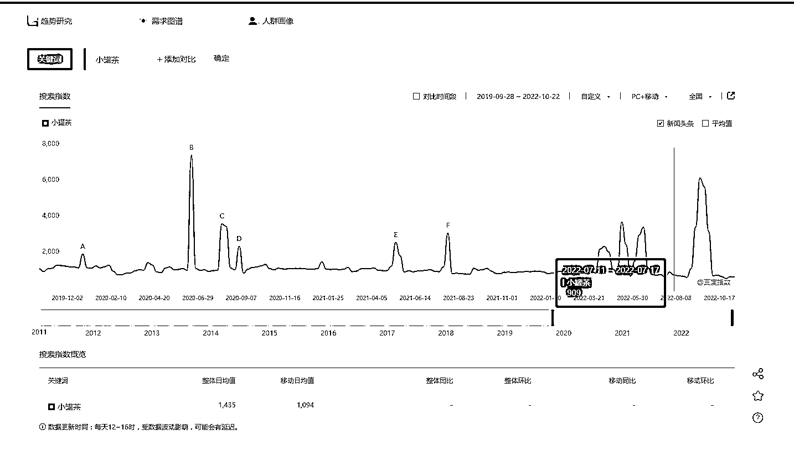

其实除了用百度指数查，我更推荐5118这样的关键词分析工具，它的数据比较全面，使用方法类似，我用5118查出来的“视频转文字”的数据。

 

 

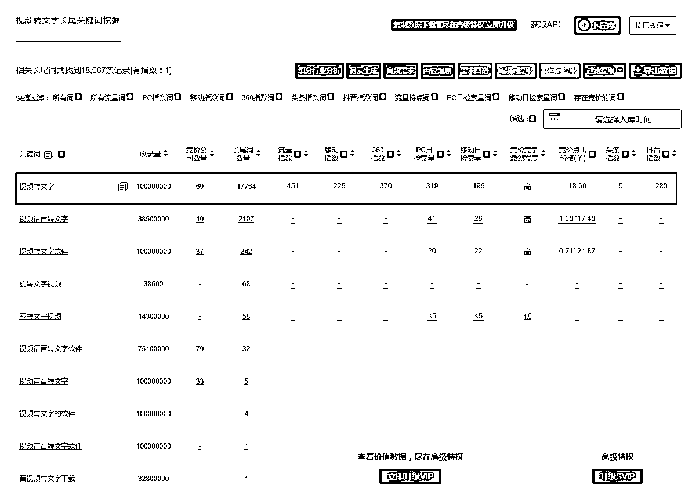

**2. **工具开发，先完成，再优化

确定好需求后就是工具的开发，然后我个人的理解是，作为个人或者小团队在最初开发产品的时候，最好是把精力集中在满足用户最核心需求上，先完成，跑通流程，再优化。

就像这个视频转文字工具，虽然前后开发了三个版本：电脑版、小程序版、网页版，中间经历了很多次升级优化。

但是最初，我只写了一个很粗糙的电脑版，推广出去，有了用户之后，再根据用户提出的问题和建议，优化迭代出小程序和网页版。

 

 

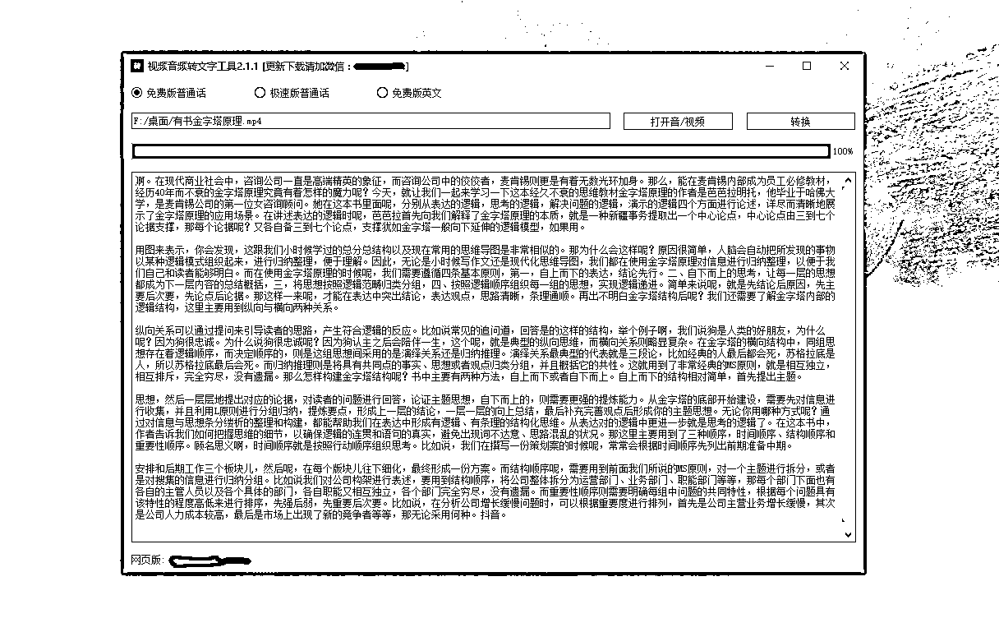

**3. **推广运营，我采用的被动获取流量的方式

工具完成后，接下来就是怎么推广了，推广方式很多，我还是更喜欢seo。

我理解的seo不只是百度或者google，只要是通过搜索引擎获取流量应该都算是seo，比如抖音、知乎、微信、b站都有搜索功能，有搜索的地方就可以seo，对吧。

**① **通过**seo**获取被动流量

因为不太喜欢到处发广告，希望最好是用户有这个需求，然后通过搜索找过来这样，也不会打扰到不需要的人。所以选择了seo被动获取流量。

我开始用wordpress搭了个博客，设置好网站标题，写了几篇标题和内容包含“视频转文字”、“视频转文字工具”介绍软件和使用方法的文章。

 

 

不过百度seo周期很长，一会儿也看不到效果，所以就在想有没有其他的推广方式。刚好那段时间在生财有术看到了公众号seo截流的文章，也是可以获取被动流量的，就按照文章里面的内容操作起来了。

先在微信指数上面查看“视频转文字”的指数，发现没收录（现在有了）。但是，我想，百度有人搜索，微信这么大的用户量，也一定有人搜（还好当时百度有百度指数），可能是没人提交，管他的，先试一试。

我把公众号名称设置成“视频转文字工具”，然后把简介设置成视频转文字、视频转文字软件之类的，菜单也设置成关键词，又写了几篇标题包含这些关键词的文章介绍工具使用方法。

公众号seo起效果比百度快太多了，没过几天，就开始有关注了，刚开始每天只有几个，然后涨到10来个。

前面说到想卖给其他人赚点儿小钱，这时我在生财有术看到包括亦仁大大在内的好几个大佬都提到利他、长期主义这两个词，深受启发。

想到接口费用一年也用不到多少钱，决定干脆就直接免费，赚个人气，人气起来了，后面应该有变现的机会，不着急。

所以在简介和文章上都用上“免费”的字样。慢慢的公众号排到了首页，每天稳定有40、50个关注。

 

 

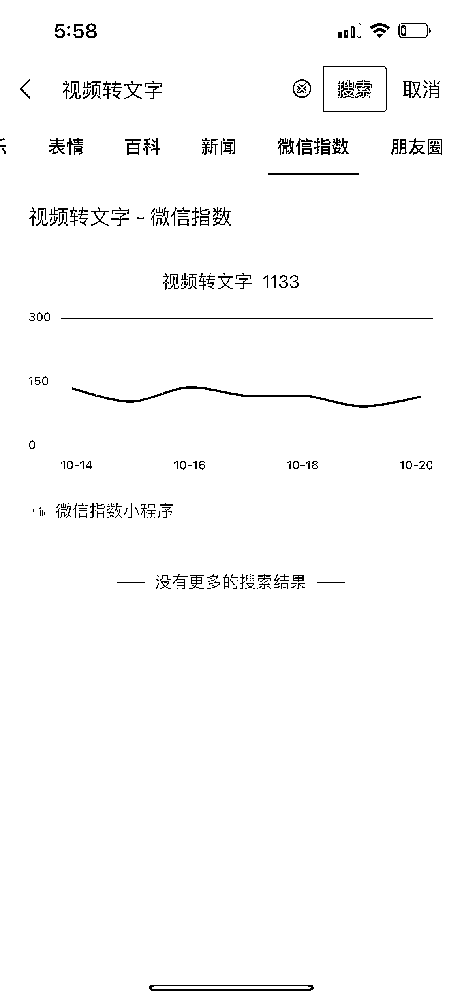

 

 

 

 

 

 

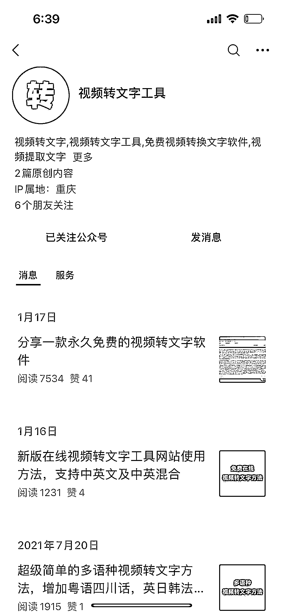

 

 

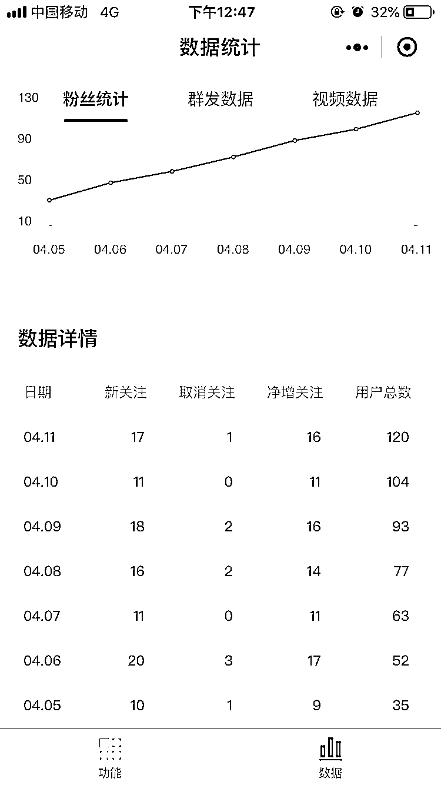

 

 

 

 

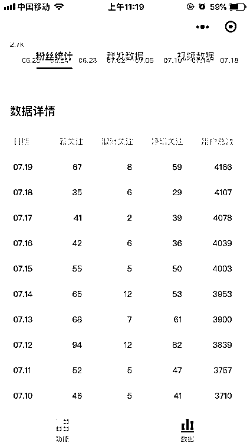

 

 

这个量，持续了很久，直到公众号差不多有1.3w粉丝，突然某一天粉丝没有新增了。查看排名发现微信调整排名规则，把服务搜索和认证公众号排到前面去了。

没办法，只有换个服务号，申请服务搜索，重新操作了一遍，到现在，新号1.4w粉丝，每天有150左右的新增关注。

**② **软件留的小尾巴

另外块流量倒是让我挺惊喜的，就是开发电脑版的时候，为了方便后续进群更新，在软件上留了微信号，说可以加微信进群获取更新。

加微信的用户居然有2000了。这些好友，有少部分是公众号下载软件后加来的，还有部分是有的博主分享后加来的，还有一部分是有人拿这个工具去卖钱，购买软件的用户加过来找售后，这确实是我万万没想到的。

**4. **迭代及变现：围绕用户需求优化迭代

一款软件、一个项目，不可能一上来就非常完善，或多或少都会经历版本迭代和优化，慢慢让流程更标准，用户体验更好，这款很简单的工具也不例外。

 

 

比如语音识别准确率低的问题，刚开始用某厂的语音识别接口，有不少人提出准确率好像比较低的问题，开始我就觉得是因为发音不够标准，声音不够清晰导致的识别率低。

后来我对比了几家云服务商发现，同样的一段录音结果，识别率确实是不一样的，自己对比下来是腾讯的稍微好一点儿，所以把接口换成了腾讯的。

后来又有用户提出，电脑版虽然转文字性能更好，但是需要下载，换一台电脑又得重新下，不能随时随地使用，不是很方便。

确实，看起来还是网页和小程序方便一些。特别是小程序，只要有微信就能用，现在谁手机里没个微信呢？使用和传播都很方便。然后我又花了一周时间，开发了网页版（免费网页版因为用的人少后来被废弃了）和小程序。

小程序和网页版上线后，在公众号做好跳转链接。小程序用的和公众号一样的套路，使用包含“视频转文字”关键词的名称和简介，配合服务搜索，流量也慢慢积累起来了。

 

 

 

 

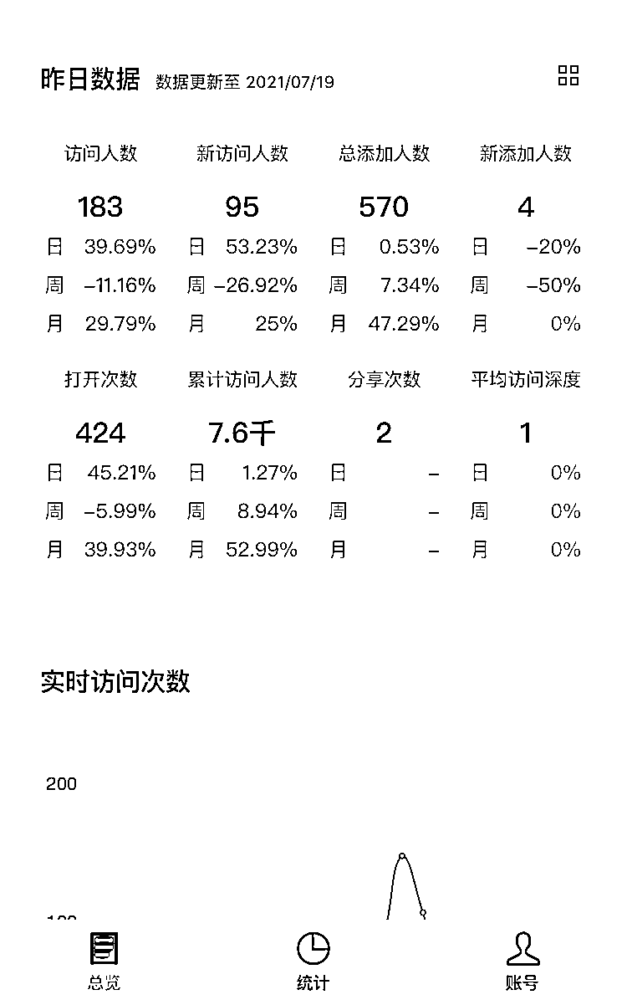

 

 

 

 

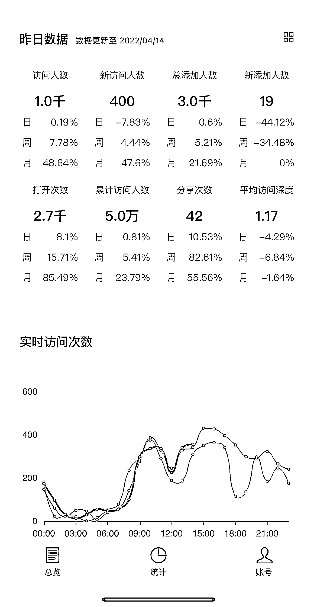

随着流量稳定，也没什么事干，就想着能不能在此基础上做一些变现。开始选择挂微信广告，结果每天只有几毛钱，放弃。

然后就想能不能用在生财有术被提过多次三级火箭的理论做变现。免费用户里，确实还有没被满足的需求，比如其他语种或者方言，需要说话标注时间等等。

根据这些需求我模仿着前文提到在知乎里做推广的那个小程序开发了付费功能。刚上线付费功能也没什么人用，我想的是等他慢慢积累，虽然转化率低，用户基数大了，付费用户就多了。

慢慢的小程序也有了付费用户，然后又有更多的优化建议提出来，比如1gb以上的大文件小程序比较吃力，需要批量上传，大文件需要断点续传，需要区分人说话等等，我又对之前的免费版进行改造做成了现在的付费网页版。

经过10多个版本的迭代，用户在使用中经常碰到的问题，我都一一进行了优化，目前小程序和网页版都比较稳定了，也有一点稳定的被动收入了。

目前收入有三个部分，小程序充值 1k出头，网页版扫码支付 500，另外就是直接找我买卡密的大概一个月有3k。

 

 

 

 

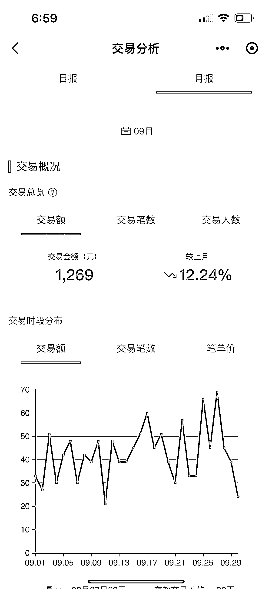

 

 

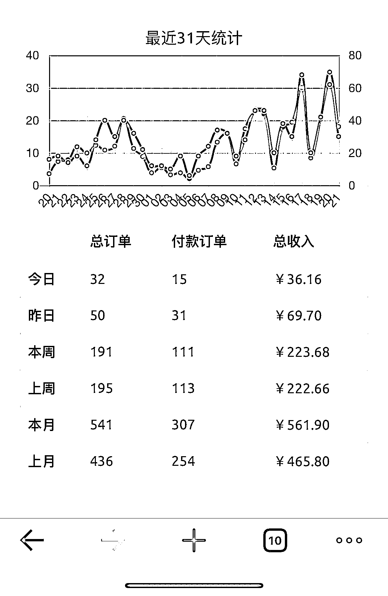

 

 

 

 

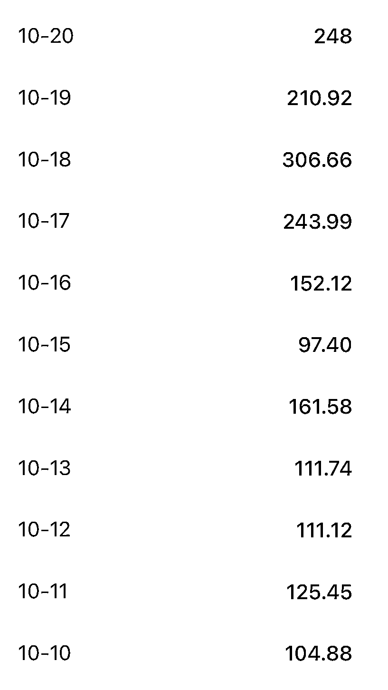

三、我在这个项目中的几点思考

以上就是这个视频转文字工具从需求-产品-流量再到变现的一个完整过程了。最后再说说，我在这个过程中的几点思考。

第一个是做产品或者项目，如果从满足需求和解决问题出发来构建，做成的概率会更大一些的，并且验证需求最好是落实到数据上。

第二个是做项目可以从细分需求切入，这样用户量可能少一些，但是竞争小运营推广更容易，可以等细分做起来之后，再回头覆盖大的需求也不迟。

第三个是我感觉是微信seo见效很快，做项目的同学真的可以尝试一下。

最后一个是关于编程和ai，编程和ai确实是很好的杠杆，它们能代替我们做一些重复繁琐的工作，提高效率的同时解放我们的双手。

懂技术的同学可以很好的利用它们，解决问题，实现流程自动化，降低边际成本，打造被动收入。那不懂技术的同学呢?这不有懂技术的同学嘛。

 

 

最后的最后，附上这个项目的数据情况截图，供有需要的同学参考，我们一起“生财有术”！

 

 

 

 

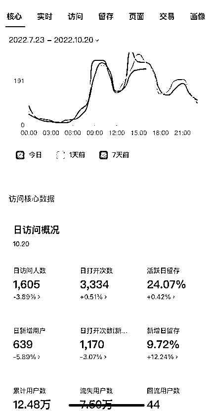

 

 

 

 

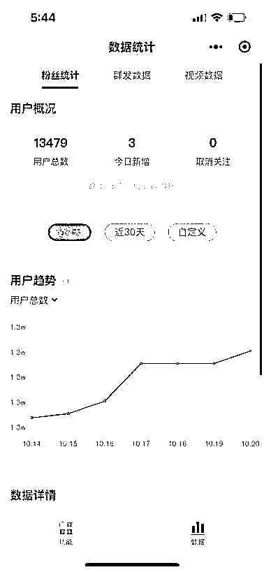

 

 

 

 

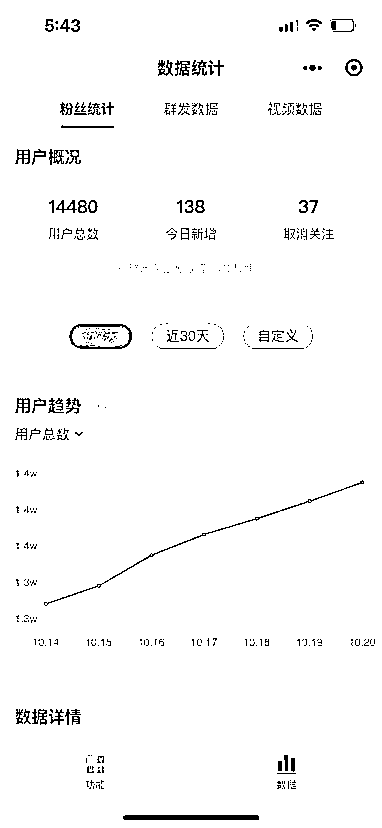

 

 

 

 

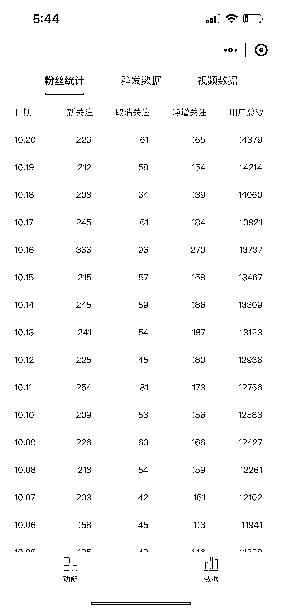

 

 

 

 

 

 

 

 

评论区：

Fus : 请问小程序收款是直接到企业公户，那这一块还得跟税务有关系，有其它解决方案不？

佳恺 : 我自己是对公的哈，你看下xorpay之类的，能解决你的问题不  Fus : 那个就是微信小微支付，到个人卡的，费率比较高，市场服务商要收2% 码叔编程 : 小微商户默认是0.38%，找服务商申请还可以更低

iMairy : 我也是类似的业务模式，目前采用的是企业微信收款到个人帐户，手动后台给用户升级

vice : 大佬厉害，网页扫码支付，卡密是有三方的可以用吗，还是都是自己写的啊  阿虎 : 完整项目操作流程，可复制，精华文

佳恺 : 卡密没走第三方哈，主要是方便量大的用户和代理定制使用

# **# ****(**精华帖**)(93**赞**)**独立开发者如何快速找到并实

# 现属于自己的**“**躺赚**”**小工具** MVP**

作者：  吴大白

日期：2023-04-14

大家好，我是吴大白，曾经是一名程序员，后面成为了一名带有程序员标签的创业者。

目前从事跨境电商，公司主营亚马逊和独立站业务。

很荣幸被生财邀请担任此次英文工具站小航海的教练之一，这是我在小航海中的一次分享，这篇内容比较适合想通过工具产品赚钱的圈友，希望能给到大家一些新的启发，接下来主要从以下几个方面来给大家分享。

 

 

**1**、需求是如何被发现的？

**2**、为什么我会觉得它是一个可以让人付费的需求？

**3**、如何快速基于需求找到自身最适合的开发模型？

**4**、如何用最小** MVP **模型找到第一个用户？

**5**、如何让工具类产品自发运转，从而让我们实现**“**躺赚**”**？

**1**、需求是如何被发现的？

我们先来说一说第一个点，我是如何发现这两个小需求的。

需求** 1**（快递状态查询）：去年有一次公司开月度会议的时候我发现一个有趣的事情，我们公司每个月都要发出很多快递，但是这些国际物流快递时间都很长。

所以难免会出现妥投失败或者其他情况（如果妥投失败物流商是需要赔付的），基于这个需求，就需要有一个工具去批量查询监控这些快递状态（这个情况几乎所有做独立站的公司都会有）。

目前我们行业有两个比较知名的查快递的公司（类似于国内的快递 100），其中一家叫  17track，大家可以去查下，他们的明面上的盈利模式非常简单（背后的模式就多了，比如数据...），就是查一个快递几厘钱到几分钱，之前我们每个月都要花大几千在这上面（高峰期上万），以前我没注意这块，直到那天会议跟仓储物流在复盘的时候关注到了这个（以前是习惯性忽略了，觉得这是正常开支）。

 

 

其实他的原理很简单，就是整合了市面上所有比较知名的快递公司的接口，然后统一对外查询并做一些基础的数据分析，比如统计半个月未签收的，比如所有妥投失败的快递（运营可以追踪到相应产品和销售渠道）等，而这些开发超级容易的功能却成为了我们这行业事半功倍的利器。

需求** 2**（**shopify **站点分析）：这个需求非常具有代表性的就是 Commerce Inspector 这个工具了，我相信只要做过 shopify 的对这个插件都不陌生，至于其需求的来源很简单，每个只要做独立站的都需要分析竞争对手的网站，而能快速收录和监控非常多的独立站对于这类用户来说就是刚需产品，类似现在抖音的抖查查一样。

大家可以去看一下这个站（shopgram.io ），他最开始是一个免费站点，收集了上百万  shopify 的站点和商品，然后分文别类让用户查询，从去年开始就已经收费了，并且收费还不低。

 

 

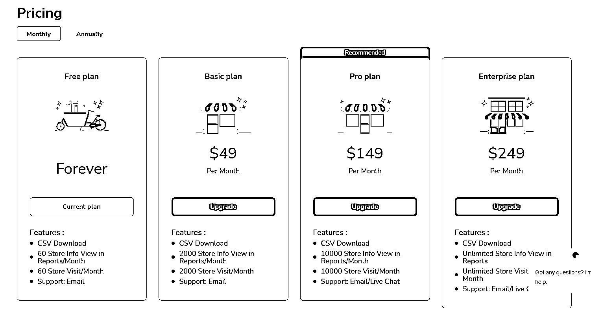

**2**、为什么我会觉得它是一个可以让人付费的需求？

大家有没有发现一个细节，上述两个需求的产生都是在独立站这个细分领域里面能助人提效的，并且站在客户角度上面还是不能被忽略的两个需求。

就像第一个快递查询的，当公司每天几百几千订单发出去的时候能快速监控和分析到快递状态是必备的，如果仅靠人工去和快递公司核对，那可能头都会大，况且有时候发的还不止一个快递公司，我们公司在这上面每个月大几千的费用是真金白银花了的，直到后面我发现这个之后才让公司技术整合了我们常用的几个快递公司接口，做了一个内部版本来使用，现在还打算开放给身边几个关系比较好的同行使用，一起分担点技术维护和服务器费用。但站在很多跨境公司来说是不存在这种技术思维和开发能力的，所以只能找外面成熟的方案，这也就延伸出了上面类似公司的存在。

还有类似第二个需求，作为选品和竞品分析这是必不可少的，就像做抖音如果不用西瓜数据和抖查查类似工具就有点瞎子摸象的感觉，当然可能大家会问了，这类数据工具开发和维护成本太高了，不适合个人玩家搞，那下面在第三点我给大家一个解决方案再下决定。

 

 

**3**、如何快速基于需求找到自身最适合的开发模型？

需求可能大家已经发现了，并且也知道这个需求能赚钱了，但是大多人就毁在这一步了。

比如我应该买什么样的服务器，用什么样的域名，甚至于用什么样的技术栈，如果更加“极端”一点的都会纠结在起什么名字上面，人一旦开始纠结，接下来就不用想事了，相信我，时间会磨灭你所有的激情。

出来混，先出来才能继续混，就像上面的快递状态查询，那就开始列一份大纲，比如找几个常用快递（最好身边有做跨境的推荐），然后再其官网注册账号申请 API（一般都是开放的），然后先整合两三个 API 做一个基础的 MVP 出来跑跑，或者更简单一点的话就直接用 17track 这种工具的 API 重新封装一下对外（只是在数据分析功能上面比它做得稍微好一点点就行），然后再想办法去找到一个客户就行。

还有 shopify 站点分析这个工具，无非就是数据的来源，因为 shopify 站点只要有一个网址就可以获取到里面所有信息，比如商品 SKU、所有页面、所有分类等，至于如何获取网址我给大家提供两个方式:

一个就是在现有工具上直接爬取就行（效率最高）。

二个就是在 Google 上面直接用【site：shopify.com】可以获取到 N 个 shopify 的网站。

这里我顺便再提供一下几个常见的 shopify 站内容获取的接口吧：

 

 

获取产品接口：{自己的域名}/products.json?limit={数量}&page={页数}获取页面接口：{自己的域名}/pages.json?limit={数量}&page={页数}获取分类接口：{自己的域名}/collections.json?limit={数量}&page={页数}通过下面代码就可以检测网站是否为** shopify**，同样原理（获取页面源码，然后通过正则匹配相应字符）也可以检测出 shopify 相应模板。

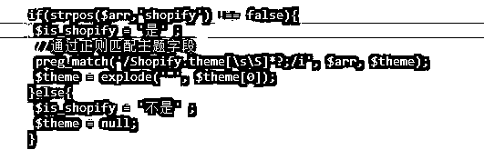

还有更多的大家自己去组合应用吧，有了这几个上面那个工具开发出来几乎没啥技术难度了。

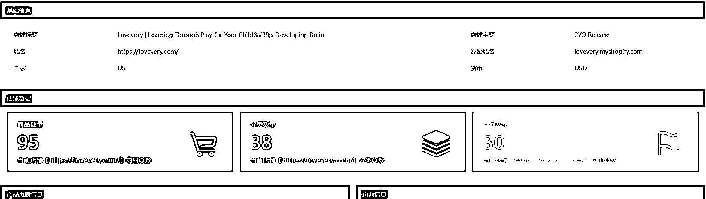

 

 

至于技术栈的话，大家熟悉什么就用什么，不用太纠结，不管白猫黑猫能抓到老鼠的都是好猫，还有其它域名服务器的就更不用纠结了，把注意力放在最值钱最快达到目的的事上是绝对没错的。

**4**、如何用最小** MVP **模型找到第一个用户？

如何找到第一个用户可能是很多朋友觉得最难的事情，但是在我看来这是整个过程中最容易的事情。

下面告诉你几个小技巧，如果你还找不到第一个客户，那你来找我吧，我来当你第一个客户也行，哈哈。

a、熟人介绍，每个人身边总有那么几个朋友是跟你产品目标人群相关的，就像上述两个产品，难道你朋友圈找不到几个跟跨境圈重合的人吗，实在不行你先免费让别人用呗，好用别人自然会付费（主要是你会有真正的用户反馈了），这世界真正能做到心甘情愿白嫖的人已经不多了（如果真被你碰到了那只能算你很幸运了），只要你能勇敢的站出来推销自己的作品，我相信你的朋友都会为你“指路”。

b、基于工具功能写一封很好的销售信，然后在朋友圈发布，如果可以的话让朋友帮忙转发一下，还有一个很好的渠道就是行业社群和网站（如生财有术、行业 QQ 群等），只要产品和销售信足够真诚，总会遇到很多对的人（我之前很多工具的启动用户就是这么来的）。

c、为工具录一个好的宣发演示视频，然后在抖音类似渠道发布，如果有条件的话可以投点小广告，你的曝光量足够了，再加上产品确实能解决需求，还怕找不到第一个用户吗？

 

 

**5**、如何让工具类产品自发运转，从而让我们实现**“**躺赚**”**？

作为个人开发者最希望的就是能让自己的作品能自发运转帮我们实现躺赚，但这个确实还是有些难度的，除了工具上面的运维迭代之外，营销是需要贯穿始终的，但今天还是跟大家分享一下我所认为能做到的基于这种垂直于行业细分人群的小工具如何帮我们实现最大程度上面的“躺赚”。

a、学会分销（最好利用卡密或者工具内部邀请链接实现自动化），我觉得有个最牛叉的模式就是微商模式，层层分销，每个人都是利益体，但我们不需要做到层层分销，但可以设置一下推荐奖励，不仅仅只是钱，也可以是别的（如垂直行业资源，如工具使用权等）。

b、学会建立“护城河”，这个在商业领域是一个常用词，但在工具营销里面为什么会用到这个呢，比如给做 shopify 分析的定期开一个建站训练公开课，比如给快递查询的提供价格更低的物流渠道等，这些“护城河”不仅能增加盈利方式，更能拉进与客户之间的黏性，从而提高转介绍。

c、基于工具目标人群的利基市场开发出更多符合其需求的延伸工具，也就是大家常见的“工具矩阵”，这样也可以实现一种另类形式的“躺赚”，因为流量是共享的。

d、还有最最重要的一点就是，工具一定要保持质量（可以通过不同方式引导用户提出新的建议和需求然后再优化迭代），营销可以交给客户，但工具是根本，我们一定要做好维护迭代，这是所有“躺赚”实现的基础。

好吧，今天就分享到这里，上述两个工具我们这边都已经有了内部使用版本，因为一直没有对外，但这两个需求的开发实现成本和收益回报之间相差都很大，所以跟大家分享一下，有兴趣的可以去研究一下，中途有啥问题也可以找我一起唠唠，如能帮得上，也很荣幸。

 

 

景区里不难发现有很多电子版的导览，扫码就可以听关于景点的介绍，非常方便。

你是否有想过，关于景区导览，有你没想到的机会。

评论区：

郑鹏鑫 : 今年的教教嘛，  我一直在等航海，大佬航海前，我需要准备  哪些工作呢？  准备一个域名，一台服务器  配一个 wordpress 请大佬指教一下[呲牙] 吴大白 : 看你的需求是啥，做web类产品的话域名和服务器是刚需，至于WordPress或者其它开源程序就看你具体想做什么了。

郑鹏鑫 : 因为刚出海，今年就整一个想搞一个博客  配合 adsense 增加收益，博客的领悟  内容  还没确定好[偷笑]

张静伟@生财有术 : 可以先看看英文工具站航海的手册

郑鹏鑫 : 好的感谢老大[呲牙]

风轻云淡 : 现在的程序员向曾经的程序员[握手]

希声 : 学习了

财女小马达 : 谢谢分享

# **# ****(**精华帖**)(78**赞**)**为景区搭建语音导览系统，实

# 现被动月收入** 2W+**

作者：  雨辰

日期：2022-01-25

生财有术的朋友们大家好，我是雨辰，90 后创业者，主要做 H5 营销 SAAS 工具。2019 的时候，我做了一个景区语音导览系统，实现了被动月收入 2W+ 。这个项目门槛较低，前期只需要制作音频、程序开发、服务器三个部分花费成本，后期可以源源不断地获得被动收入。今天，我想把自己做这个项目的经验分享出来，希望能给看到的你带来 

 

目录：

1\. 如何找到市场需求？

2\. 如何引流推广？

3\. 如何变现？

4\. 总结

启发。

**—01—**

如何找到市场需求

2019 年 12 月，去厦门鼓浪屿旅游的时候关注了鼓浪屿的官方公众号，看到公众号有做景区的语音导览。整个使用流程很不方便，每次听完一个景点后，需要退出来查询下一个景点的编码，然后再到公众号回复编码，再点击进入听下一个景点。这流程基本上没有游客能耐心听完所有景点的讲解。

 

 

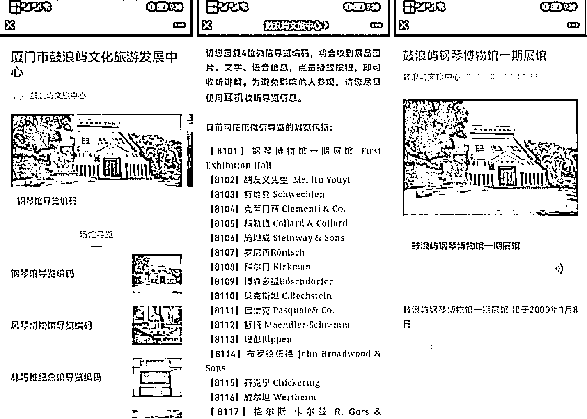

游客到景区旅游肯定会有听讲解的需求，但找真人导游费用不低，电子导游是个不错的选择。

电子讲解可以理解为和知识付费的音频课一样。这些讲解内容是现成的，把内容收集起来，做一个简单易懂的语音导览页面，游客是否愿意为之付费呢？

旅游回来后，我就关注了上百个景区公众号，研究这块是不是已经有人在做了。

果然，这一块已经是很红的红海了，基本上稍微大一点的 4A、5A 景区都有自己的导览，一小部分是自己开发的系统，但界面和可操作性还是差强人意；大部分用的第三方导览系统，有几个平台做得还是挺不错的，比如：携程、金牌讲解、三毛游、古猫等，功能都特别强大，而且付费购买的销量都还挺高，每个景区付费区间在 5~20 元左右，可以大概估算出每个景区的收入情况，大一点的平台合作的景区都是几百上千个，累计 

 

在一起对平台来说是一笔可观的收入。平台只需要前期投入音频的录制和系统搭建，上线后基本不用维护，是个一本万利躺赚的生意。

既然鼓浪屿这种 5A 景区有这种简陋的导览，那么一些小景区可能连语音导览都还没有。当天我就在网上找了个类似业务逻辑的源码框架，用了大概一周时间开发出来一个  MVP，核心功能就是：付费听音频** + **分销赚佣金。

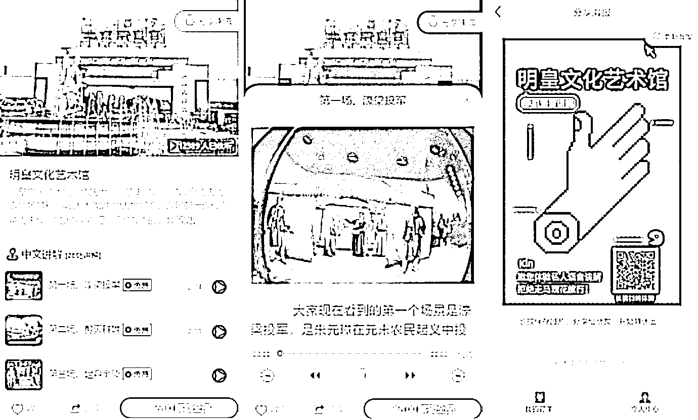

整个系统搭建好后，接下来开始搜集资料、制作宣传 PPT、注册公众号、买域名、搭建官网（就是个静态单页 + 表单收集意向客户）、注册商标，一切准备就绪，开始正式推广。

前期我们合作的模式是：景区不用花一分钱，只需要提供讲解稿 + 景点图片给我们，我们负责录音 + 系统搭建 + 设计好展牌二维码，景区自己印刷出来投放景区，游客扫码付费听解说，所得收入五五分。

 

 

**—02—**

如何引流推广

**1**、基于原有客户定向推荐

我们本来就是给小 B 商家提供营销活动制作的 saas 平台，已经有几万的注册客户，我们基于已有的客户群体筛查他们以往做过的活动，发现有一些是景区、博物馆的主办方做的活动，基于之前已有的合作前提，很顺利就联系到这些景区。

回访下来还真有收获，虽然有的景区已经做了或暂时不需要，但有几个景区本来一直想做但一直没有执行，因为我们给的模式是免费的，对于景区来说没有成本，还能为景区额外创收，所以这部分景区很顺利就确定下来，签署了合同和景区授权书。

拿到了每个景区的解说词后，开始在淘宝找真人配音主播，配音价格基本在 20 元/百字左右，量大可以谈下来 10 元/百字，这个价位的主播对于景区讲解来说够用了。但问题也有，就是这种价位的主播因为经验相对欠缺，经常读错一些字音，得来回多改几次。

音频都录制好以后，将文字、图片、讲解音频内容填充到系统，发给景区测试没问题后，我们设计景区二维码展牌让景区自己印刷出来，将展牌投放到景区里各个比较显眼的位置。

游客扫码进入导览，可以免费试听前面几个景点的讲解，如果需要听该景区所有景点的讲解，则需要支付 5～10 元钱。

 

 

**2**、招代理合作

在前面回访的客户中，有的主办方并不是直接的景区方，只是景区之前委托他们做活动。他们手里也有一些景区的资源，这种情况就让他们代理我们系统。如果代理商去谈成合作的景区，我们会将收入让出一些比例给到代理商，只要景区有收入，代理商这个收入也是一直都有的。

截止目前，我们有一半的景区合作都是代理商谈成的。

**3**、知乎问答推广

 

 

除了前面对已有客户的回访，站外主要做的是百度知道和知乎问答推广。将关于景区导览的所有问题链接采集起来，编写好每个问题的回答文案，找人代回答，然后自己将回答排名做到前三。

现在主动来咨询的都是通过知乎来的，目前总共收到 52 份留资的合作申请。

**4**、百度** SEM **推广（暂未成交）

我们在百度、360 都开了竞价账户，上线计划跑了大概一个月，基本没有转化，所以就下掉了。因为点击来的大都是 C 端游客需要找某某景区的导览，这种用户对于我们来说价值太低了。印象中景区管理方的用户通过 SEM 来咨询的就 2 个，还没有成交。当然这也可能和我们自己不擅长 SEM 有关。

**—03—**

如何变现

**1**、游客付费听导览的收入

直接合作的景区我们有 50% 的收入，代理商谈成合作的景区我们有 25% 的收入；因为景区分淡旺季，在节假日一天的流水能有大几千，平时淡季每天几百块。这块的收入占了总收入的 70% 左右。

**2**、公众号变现

 

 

游客听导览是关注我们的公众号，粉丝沉淀到了我们这里，可以通过公众号卖出或者接广告变现。目前只有几万粉丝，还没有针对粉丝这块做变现。

**3**、为景区定制开发

有的景区想做导览，但不想让游客付费，所以给景区按年付费，根据景区景点数量，我们现有合作的价格在 5 千～2 万一年，这块收入占了总收入 30 % 左右。

**—04—**

总结

这个项目的门槛很低，前期的成本包含制作音频、程序开发、服务器三个部分。只要有景区、博物馆、游乐园、展厅这方面的资源，把他们搞定，后面就是一笔稳定的固定收入。你合作的景区越来越多，这个固定收入也会水涨船高。

评论区：

禹 : 如何防止别人复制你的资源呢。毕竟文案、音频都是公开的。

雨辰 : 可以在音频里加上水印，文案没法避免被抄袭，除非申请著作权。

禹 : 只能加快自己覆盖范围，然后通过大量用户来降低成本。使得别人无法进入。

雨辰 : 这是最理想状态，但是这个门槛比较低，技术上任何人都能实现，主要是拼手里的独家资源。

Hugo@墨西哥拉美 : 挺有意思的项目。  商务推进和独家资源是核心

亦仁 : 感谢分享，已加精华。

我的执着 : 有一个朋友覆盖了很多景区  五年前就开始做了

雨辰 : 那入局挺早，现在多少合作景点？收益怎么样？

 

 

# 【需求挖掘】**3**篇

# **# ****(**精华帖**)(309**赞**)**如何获得产品** idea**

作者：  刘小排

日期：2022-11-10

大家好，我是刘小排，好久不见。

我是一名机器人从业者，在一家头部的服务机器人创业公司担任产品总监。同时，周末的时候，我偶尔会手痒，会变身独立开发者，折腾一些小产品。

这是一篇写给独立开发者、创业者的文章。

在我看来，一个高成功率的产品idea，需要满足三个条件。

1.有真实需求存在

2.你是这个领域的专家，即便是直面竞争，你也能比对手做得好

3.你能坚持下去，尤其是早期缺乏正反馈的时候

我们按照这三个条件，来构思寻找产品idea的方法。

我一共总结了五种常见的方法，他们的成功概率递减。（我的个人观点）

 

 

1.原生idea ★★★★★

2.抄成功竞品，然后做出差异化的价值点  ★★★★

3.分析搜索关键词，找到尚未被满足的需求  ★★★

4.有人愿意预付费找你定制某个需求，然后你将它产品化  ★★★

5.生造的idea ★

它们分别是

展开讲讲。

一、原生**idea**

英文原名“organic idea”。这是硅谷创业界最推崇的方式，被众多科技界创投界大佬认可。

“organic idea”的意思是—— 解决你自己遇到的问题，你自己就是它的用户，你会每天使用自己的产品。

这个词似乎最早出现在硅谷创业教父Paul Graham的文章中。

他说，

构思产品idea的动词，应该是“注意到”，而不是“想到”。

 

 

The verb you want to be using with respect to startup ideas is not "think up" but"notice." At YC we call ideas that grow naturally out of the founders' ownexperiences "organic" startup ideas. The most successful startups almost all beginthis way.

“我注意到，有这么一个问题，可以这么来解决” 而不是 “我想到了一个创业idea”。

原文链接  http://paulgraham.com/startupideas.html  其他版本的表述还包括——

硅谷科技创业圈最著名的话：eat your own dog food，  吃自己的狗粮。（意思是，你需要是你自己产品的用户）。这句话在过去50年的时间内，被无数公司无数大牛引用。

世界最顶尖的独立开发者Peter Levels 在自己的著作《Make》中说：The most important thing is to find ideas from solving your own problems . 在书中，他还建议大家每天记录3个自己遇到的问题，这样的话，一周以后，你就有21个产品idea了。

世界上有很多创业成功的公司，是这套方法论的产物。

苹果公司，起家于组装个人电脑，给谁用？给自己用。这是沃兹的个人爱好。

Facebook，最初是小扎自己想用的一个小网站，给学校女生打分的用的，产品名叫"hot-or-not"

 

 

AirBnB，最初是创始人没钱交房租，开始做租床位的生意，提供租空气床垫(Air Bed)和早餐(Breakfast)的服务，这也是AirBnB名字的由来 —— Air Bed and BreakfastBuiltWith，对，就是最近挺火、全公司只有1个人、每年收入1400万美元那个产品。最初也是来自于创始人自己的需求。创始人经常看到别人的产品，想知道这个产品是用什么技术栈做出来的，然后就自己做了个产品来解决这个问题。

说一个更近的。生财有术，最初是亦仁想找一个供创业者交流的社区，发现并不存在这样的社区，于是自己建了一个。

再说一个接地气的，nomadlist.com  ，Peter Levels自己是个数字游民，想知道全世界有哪些城市适合数字游民居住，所以自己做了一个Excel表格。Peter偶尔发现，自己的表格被有很多人传阅，才决定把它产品化。  后来，世界上出现了无数创业公司，拿着更多的钱、更多的资源、更多的人，想要山寨它，但都没有人能打败它。  因为 Peter 本人才是最懂数字游民需求的人，这个产品，解决的是他自己的需求。

这套方法论为什么成功率会高呢？因为它完全符合我们刚才说的三个条件

1.有真实需求存在。这个需求，它就是来自于你自己。

2.你是这个领域的专家。你自己有痛点，花了很多时间去研究，发现市面上其他方案都不能满足你，你最懂你需要什么。  如果有一天，别人觊觎你的成功，想要山寨你，你作为专家，你也并不怕。

3.你能坚持下去。  为什么能坚持？因为你自己就是它的用户，你自己由衷地希望把它变得更好。

 

 

当然，这套方法论也有问题。它最大的问题是：  你怎么知道，你自己的需求，别人也需要呢？

这个问题是无解的，并不存在成功率为100%的创业方法。  我们只能说，用这个方法，创业成功率会别其他方法高一些。

二、抄成功竞品，然后做出差异化的价值点

对于大部分生财有术圈友来说，这是我最推荐的方法。

它的优势在于：  成功的竞品，已经帮你验证过，市场一定存在、这条路一定能走通。

生财有术是一个创业案例宝库，其中有大量的实操经验，大家都完全可以从模仿开始，然后不断去优化、去做出差异点。

“抄”，听上去好像不怎么高端。不高端又怎么样，实用就行。

我们举一些成功公司的案例。

Google怎么来的？Google是世界上第11个搜索引擎，它先抄了别的搜索引擎，然后引入了PageRank算法，让搜索结果排序更加合理，从而提供了差异化的价值。

 

 

百度是怎么来的？抄的Google，然后做出了差异化的价值，比如最早百度主打的是“更懂中文”。

腾讯怎么来的？它抄了一款在当时颇为成功的聊天软件ICQ，改名叫做OICQ（再后来改名为QQ）。QQ比ICQ提供的差异化的价值，那可多了去了，产品体验比原版ICQ好很多，大家可以自行搜索。  后来，腾讯又做了微信，嗯，大家应该知道，微信这个idea，也并不是原创的。

再比如，优酷、滴滴、微博、淘宝、抖音……他们都是从“抄”开始、再做出差异化的价值，进而获得成功。例子太多了，不一而足。

这套方法论的优势非常明显。

它的劣势也很明显，至少包括以下两点，请大家注意

1.你的差异化价值是什么？ (这是最容易被忽略的部分）

2.你抄原版，你能否比原版更懂用户需求呢？你能像QQ一样，做出来比原版ICQ更好的用户体验和流量渠道吗？

三、分析搜索关键词，找到尚未被满足的需求

排名第三的方法，是分析搜索关键词，找到尚未被满足的需求。

这个世界上，每天有30亿次搜索，其中，20%的搜索词组，是昨天没有出现过的。

 

 

那就意味着，每天都有新的机会。就看你能不能发现了。

通过分析搜索关键词发现需求，这套方法生财有术的三林老师有详细分享，我就不再赘述了。

原文  https://t.zsxq.com/07kJf0JJ2

使用这套方法论的成功公司包括Veed.io  ，他的创始人有一个金句“Make something people search for”。

Veed.io的确也是这么实践的，它每月网站流量有2100万，其中63%都是来自于搜索引擎。

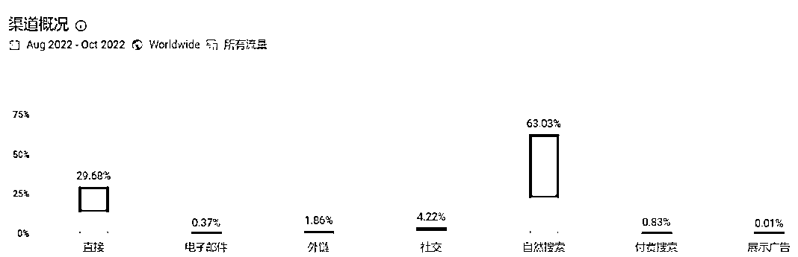

我自己也是这套方法论的实践者。

在生财有术今年9月的海外工具小航海中，我偶然发现了一个不错的关键词，用了一个周末（准确地说是半个周末，一天）的时间做了个简简单单的MVP，目前每天已经可以躺赚50美元的广告费收入了。

 

 

而这仅仅只是开始，因为我可能会花更多时间，把MVP产品变成一个更好的产品，变现方式也将从广告变成付费。平时我太忙了，没时间搞，现在我怀着激动的心情再等待下一个周末的来临。

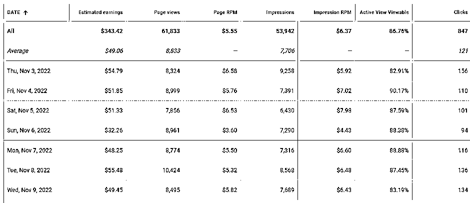

这套方法论的问题是：词，可真不好找。

怎么办呢？只能多去尝试。试的时候，降低试错门槛。如果你总能以每天1个MVP的速度来试，那一个月就能试30个产品idea，到时候看数据，哪个MVP的数据好、就再次投入做哪个。

（关于怎么用一天时间做出MVP，下周我会分享，并拆解一个我真实的案例。）四、有人愿意预付费找你定制某个需求，然后你将它产品化

这是非常好的模式。

 

 

码叔在生财有术做过分享，这正是他的方法。  他从6月自学Google插件开发以来，半年时间已经变现了好几十万，他的方法可以复制。他总是从定制需求开始，从来不自己生造一个idea。

某人有个需求，知道码叔会编程，就付费让码叔定制开发。然后，码叔就想办法把它产品化，卖给更多的人。

十年前，我在一家软件外包公司工作。这家公司主业是接欧美软件外包，但是高明的老板，从一早就意识到了这套思路。既然有客户愿意花钱让我们做，那我们何不试试把它标准化，卖给其他客户呢？  他们也时不时推出一些小型的SaaS产品，有些也取得了小成。

（这家公司叫重庆诺怀软件科技有限公司，到今天也还在运转，我是它的一个小股东）国际上更著名的案例是Typeform和Basecamp，他们最初都是软件外包公司，然后从客户的需求中，找到了共性需求，再将之产品化。以下是创始人的原话。

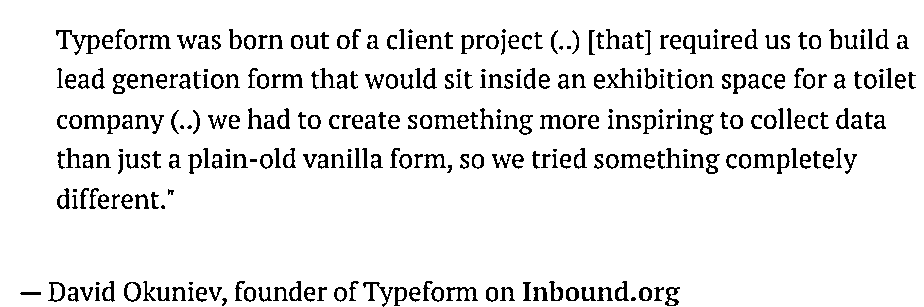

 

 

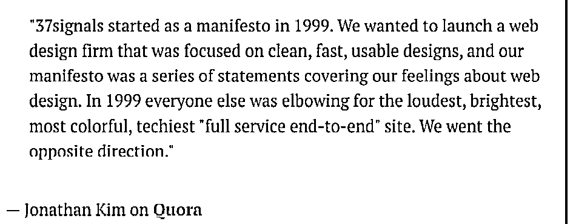

生财有术有很多独立开发者，经常会接到付费定制开发的需求。  大家完全可以组织起来，去发掘其中产品化的机会。

五、生造的**idea**

这不是一个好的方法论，通过生造idea获得成功的公司，屈指可数。

把它列到这里，是希望跟大家提个醒。

下次，当你脑海里冒出一个天外飞仙的想法“我想到一个绝妙的点子”的时候，多问问自己，用户在哪里？谁愿意付费？

最好骗的人，是你自己。我们很容易被自己的生造idea搞得很嗨。千万别轻易爱上自己的想法。

 

 

六、整体建议

1\. 想做出长期价值，请总是优先考虑原生idea，它的成功率最高，你做的时候，也会更有激情。甚至，还会产生一种使命感。

2\. 如果短期内想快速出成果，考虑第2种方法，先取得正反馈。它是见效最快、弯路最少的方法。生财有术的圈友要尤其重视这套方法，不要坐拥金山却浑然不觉。

3\. 第三种和第四种方法，你需要的是一套“系统”。如何构造一套系统，让你快速找到关键词、快速找到MVP？  如何构建一套系统，让你能持续接到有人愿意付费定制的需求？

欢迎大家与我讨论。

评论区：

新页 : 是期待下周的分享

林深 : 小排出品，必属精品

三林 : 先赞后读的，赞赏少了🤣。  需求从自身出发这个太重要了

海鸟 : 又见小排！🌅

珠海左三 : 心中隐约有这些想法，看着小排的总结与步骤真是享受。

凡灵逸尘 : 我可又等到小排老师发文了

半生少年 : 凌晨刷到小排老师，脑子立马清醒了！

詹伟平 : 很系统的商业方法论

 

 

# **# ****(**精华帖**)(95**赞**)**小众产品的起点**——**需求挖掘

# （进阶篇）

作者：  壹树

日期：2022-06-17

痛点、需求、问题、竞品、用户、数据、产品等名词一般都会在产品经理脑海中来回浮现，如何把这些东西串联起来，才是我们需求的最终答案，也就是可能在我们手中诞生的产品。

每个人都有自己的问题解题思路，常言道：条条大路通罗马。选择一条自己熟悉的道路会让自己的工作事半功倍。

道路千万条，套路第一条！下面尝试把我的套路走一遍，有可能对你们来说是弯路，但目前对我来说是最习惯的路子，因为思考方式已经养成了，会在好奇心的推动下不停地探索。

套路逻辑顺序

套路的逻辑顺序是这样的：平台** → **用户** → **问题** → **需求** →  **竞品** →  **数据** → **决策** → **产品。

以上的顺序是本人做浏览器扩展程序小产品的套路，其他，如：IOS、安卓可以参考然后自我调整。

**1**、平台

很多时候，我们在互联网冲浪是漫无目的的，很容易迷失。我们需要把自己限定在某个区域，为我们最终的产品选择一个起点。

 

 

首先选择一个平台，这个平台不是随便盲目去选择，我们应该是选择一个有足够多用户的平台，例如：选择全球排名 200 的网站，或者选择某个垂直领域排名前 10 的网站。

因为当平台有足够多的用户，即使我们只解决了当前平台的 1% 用户的某个问题，依然有足够多用户，而且我们在后期做投放推广的时候，也有一个固定用户群体标签。

**2**、用户

选择了平台后，我们去注册这个平台，然后以用户的身份进行体验，把明显的按钮都点击一轮，这样一轮下来，把常用的功能流程都体验几把，平台的基础功能应该得到了解。在这体验过程，你有可能很幸运地发现一些问题。

我们常说同理心是产品经理必须具备，但对于新的平台，是比较难产生共鸣的，更多的是体验产品流程，尽可能思考产品解决了那些核心问题。

**3**、问题

平台体验过后，不一定能找到使用上的问题，那么就尝试其他途径，如下：

1\. 带着半个问题去搜索

2\. 带着 26 个字母去搜索

3\. 带着好奇心与工具去产生问题

在这个过程我们需要对问题进行记录，把一些感兴趣的问题与一些数据突出的问题记录下来。这个过程可能会感觉有点漫无目的，因为一般会从一个问题延伸出 4~5 个问题，浏览器开了无数个网页标签，但请记得，不要偏离我们的平台，就算真的发现其他平台的有趣问题，请先记录下来，不要跳出我们当初选定的平台。

 

 

**4**、需求

在寻找问题的过程中，肯定能发现一些用户已经给出可行的答案，这些答案大多数都是一些成型的产品（看人家如何推广的，软文总是要发一下的，引流不容易的），不要吝啬自己的点击，爽快进入产品官网，看看这些产品的资料介绍。

1\. 主要解决用户那些问题

2\. 主要功能模块，那些是收费的，那些是免费的

3\. 产品定价策略

4\. 官网的访问量（使用工具：SimilarWeb）

**5**、竞品

到这里基本上已经搜到不少的相关竞品资料了，有些功能强大，有些功能单一，各有各的核心价值。在竞品分析过程中，我一般归类为：通用免费功能与差异收费功能，为什么这样做？

1\. 通用免费功能，这部分若所有产品的功能重叠性大，一般是解决用户的不同不痒的问题，只作为引流或者象征性的作用。

2\. 差异收费功能，这部分会明显体现在价格上，价格落差作为产品价格的侧面参考，往往有可能

我们只做一个差异化的功能来解决用户的某一个点，就能形成一个小产品，并能在当前用户群体种分一杯羹。

**6**、数据

 

 

在寻找答案的过程，除了工具数据记录下来外，还要记下一些容易被忽略的数据，如在一些问答的网站或个人网站，Quora、Reddit、Youtube、Medium 等，里面会有回复总数，点赞数，浏览量，用户评论数等等，这些数字都可以能作为关键参考数据，因为能从侧面反映出用户群体是否足够大。

对于在 Quora、Reddit、Medium 上的长回复，尽量细看，因为对于目前的竞品，有其他用户会提出意见（带着 Product Name + Reiview 去找），这些意见有可能是我们将来改进的方向。对于一个产品，有用户反馈说明这个这个产品依然存在不足或者可以再上一层楼。

**7**、决策

通常会把 1 ~ 6 的步骤遍历数遍，甚至十几遍，次数越多，需要决策的选项就越多，摆在自己面前的选项就会越多。

看下方表格，这是搜索关于 instagram 相关需求的数据得出的评分表，这个表可能不一定具有很大实际意义，因为是都是主观的评分，更多的是直觉，经验。

当我不知道如何开始时候，就交给这个表去决定，遵循自己定规则。

表单地址：

https://docs.google.com/spreadsheets/d/1fw6106Zh4IH4duvrKoh0MWQXeEIMDHa78RwFbmdSby0/edit?usp=sharing

需求方向：扩展程序需要解决用户什么问题。

开发评分：开发越容易，评分越高。

 

 

运营评分：是否需要精细运营，instagram dm 因为我看到 Google 排名前三的结果，就打了个低分了。

竞争可能：通过 Google 搜到的排名第一页的竞争排名的访问量参考，Chrome Store 的竞争对手的用户量与评星，然后得出一个评分。

搜索评分：就是通过搜索数据工具得出的总分，然后再评一个分数。

价格分数：产品定价的自由度，一般从竞品中做参考，igdm 是安装软件这个报价可以很高。

兴趣评分：被我删去了这个评分，很多时候我都感兴趣，没太大区分度，:P。

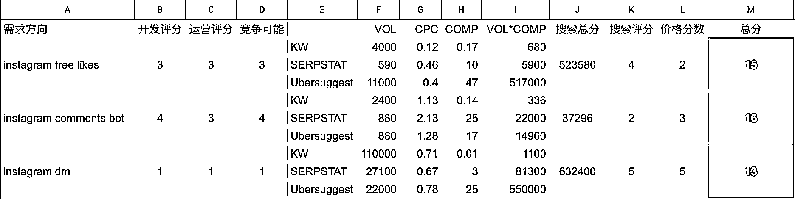

注：评分最高分为 5 分，最低为 0 分。

当这个表格填完以后，就会选择总分最高的需求方向进行产品化。

最后形成的决策表并不是只使用一次，若这个产品的用户量一旦上来了，会有助于后面的产品矩阵打造。因为用户都是来之同一个平台，更多方面满足用户的需求，用户就更依赖你。

**8**、产品

决策过后，就会进入产品设计的环节，这环节最重要的是做减法。

 

 

我相信，对于任何产品，人人都能说出个所以然，人人都是产品经理已经说了那么多年，但不要激动，先克制，翻出最小可用产品（MVP）的设计理念进行思考。

例如：

1\. 你要做一个自动化的工具，先不要考虑给用户各种设置，只需要给一个  开始  和  结束  按钮就够了。

2\. 你要做一个电商店铺分析工具，先不要给用户各种过滤条件，把店家  最关注的数据  先呈现出来就行了。

减法，持续做减法，减到用户可以不用去思考如何使用你的产品！

 

 

总结

上面提到的 8 个环节，需要先对每个环节进行单独的理解，理解背后的意义，最后才能把各环节串连起来。这不是一时半刻就可以形成习惯，但我鼓励读者按上面的环节多做练习，把好奇心调动起来，习惯后你会发现很多之前没发现的问题。

入门篇移步这里：https://articles.zsxq.com/id_5n39xwuf7b8o.html备注：里面提到的搜索方法可以看这里（第七章）：

https://docs.qq.com/doc/DVkpNanBSQkxYckZR?u=5f10639b05044d3086bcdef7e7f9e631

评论区：

老彭 : 有初阶篇吗[流泪]

壹树 : 文末有入门篇

jenny 胥 : 请问是只有做插件的才能用吗

壹树 : 只是思路，任意产品都行

亦仁 : 感谢分享，已加精华。

饼公子 : 思路很棒！学习了！！！

小白脸 : 总结用户需求，分析竞品，分析竞品数据，给产品打分，创造产品（用减法，我认为是抓住产品核心）

# **# ****(**精华帖**)(66**赞**)**如何挖掘小众产品的需求（入

# 门级）

作者：  壹树

 

 

日期：2020-10-19

#小众产品 #独立开发 #浏览器插件 #需求挖掘

大家好，我是壹树，一个人在海外浏览器插件这个不起眼的小众市场深耕了将近 4 年，今年 5 月决定不再上班做产品汪，把这个“小”从副业变成了主业，目前专注小众领域的软件（插件）产品变现。

长话短说，今天跟大家分享一套入门级别的需求挖掘方法：

从大关键词中找大产品，将大产品中进行功能拆解，从功能中发现长尾关键字，通过长尾关键字数据反推小产品的可能性。

这套方法用到了以下的浏览器插件工具（需梯子进行安装）

Keywords Everywhere - Keyword Tool （付费的，充值 10$ 有 10000 点数，够用好久了）

https://chrome.google.com/webstore/detail/keywords-everywhere-keywo/hbapdpeemoojbophdfndmlgdhppljgmp

对于小众产品，工具类是一个基本面，之所以“小”，是因为解决的是用户的一个“点”，这个点就是产品的原点。当然我们不可能漫无目的地进行，可以选用比较常见的“视频”，“图片”，“社交”，“电商”等的领域。

下面会一步一步描述如何进行发掘的，我们选用 Facebook tools 这个大关键字开始。点击搜索后，插件直接在页面显示了很多的相关数据，例如：**Volume****, CPC,** **Competition****, Trend**，都是搜索的关键指标，这些指标仅提供了参考价值，因为如若切换到其他类似工具，数据会有差异，但也很好地提供了价值。

 

 

简单解释一下这些关键指标：

Volume：每月搜索量

CPC：单次点击成本

Competition：竞争难度，0 ~ 1 难度依次递增。

Trend：趋势，搜索量的趋势

通常是将前三个指标混合一起对比的，这三者关系一定要保持敏感，不然会错过很多机会。

**1. ** 搜索量大，CPC 低，Comp 又低，那么就是一个好的关键词。

**2. ** 搜索量小，CPC 高，Comp 接近 1 ，那么就代表厮杀尸行遍野了。

 

 

但对于小众产品来说，这个大关键字意义不大，虽然搜索量很大，如果现在去抢这个词，那么大概率就是炮灰，而且对于用户来说，这个词的需求不够直观，没法直达用户的“点”。

这里你发现了一个广告，不要忽略这个广告，点进去。然后浏览此网站的功能介绍页面与价格页面，因为这个 2 个页面有我们需要的信息。

功能介绍页：

功能介绍页面包含了那些功能，为用户带来什么，可以大概了解工具的功能范围，一般用于评估技术实现难度。

产品价格页：

价格页面通常会详细地将功能点列出来，然后用户可以进行对比。如：Automated post shceduling（定时发帖），Key performace metrics (关键性能指标），Custom analytics（用户分析），Exportable reports（导出数据报告）。这些都是我们对工具的一些直观理解，也是相对直观告知用户的一个“点”。

 

 

通过上面页面大概可以知道一些关键字如：automated, scheduling, export report, analytics，这些都是产品的“点”。可以串起来：facebook + 关键词，然后继续搜。你会发现很多平时发现不了的小点。

那么再从旁边的 Related Keywords 与 People Also Search For 的面板上去找。一般情况下，总会看到一些更细关键词，通常表现为英语动词，如：Facebook tools liker，Facebook tools unfriend, FB tools download。

 

 

 

 

分别点进去后你就会发现新大陆了，如：Facebook tools liker。

我们再点一个：Facebook auto liker，看看这些网站的，这些产品可不是用爱发电的，都是能捞钱的货。

 

 

然后你就发现有 Facebook auto poster, Facebook auto friend request 等的关键词，这些就是一个小众产品的“点”。

到这一步，你应该可以发现各式各样的小产品，只要把 Facebook 换成 Instagram, Youtube, Amazon, Shopify, Ebay, 等等，实在是太多了。

当你发现这个“点”后，如何用数据拍板这个“点”是否应该去产品化？

这里总结一下我的插件经验数据，虽然不一定具备确定性，但可以参考：

如果是社交类， Volume 大于 2000 ，Comp 小于 0.25 就可以上，通常 CPC 不会很高，订阅流失率比较高。

如果是电商类， Volume 大于 500 ，Comp 小于 0.2 就可以上，通常 CPC 会比较高的，这类小产品的订阅流失率是比较低的，变现比较持久。

 

 

如果是 toB 类， Volumn 大于 1000, Comp 小于 0.2 就可以上，这类的流失率比电商类高一点。

个人建议从自己熟悉的技术平台入手，每上一个产品后都要进行复盘，复盘的过程就是提升下一个产品成功率的过程，非常重要。

当你习惯了这种搜索方式以后，你会发现很多工具类都是相似的，只是换了个平台，或者换了个使用载体，从 PC 变成了手机，从手机变成了平板，从 exe 变成了浏览器插件。每次切换都将用户重新洗牌，若你发现了某个“点”的搜索数据很好，赶紧上产品，变现其实没那么难的。因为这些都是已经在其他平台或载体上验证过的产品。

相关工具推荐：

https://neilpatel.com/ubersuggest/

https://serpstat.com/

下次会填一下海外小众产品收款渠道的那些坑，因为 8 月我的 Paypal 与 Stripe 相继被冻结了，因为疫情期间付费用户涨了，争议率高了，被银行风控了，结果是，我的所有插件的付费订阅用户都没法自动续费了，然后我通过一个月的时间挽回了将近 50%的付费用户，:P。

若对小众产品感兴趣的，可以加V交流：shuhankuang

插一条信息：G Suite 改名为 Google Workspace 了， Google Workspace 有 20 亿用户，而且这帮用户都是 toB 企业用户为主，然后里面也有个插件市场，你懂的。:P评论区：

 

 

Blanke : 付费课程完成了没[撇嘴]

infinity : 感谢分享！你的 Stripe 是在香港开的吗？

壹树 : 香港和美国都开了

壹树 : [尴尬]，已太监快一年了。哈哈哈

黑豹 : 很不错

哈哈 : 这工具一个月可以搞多少米

亦仁 : 感谢分享，已加精华。

任知行 : 我也是码农，也写过浏览器插件，感谢分享

# 【关键词挖掘】**2**篇

# **# ****(**精华帖**)(109**赞**)**以** TikTok **举例，如何发现海

# 外产品的生财机会** **？

作者：  三林

日期：2022-04-11

本文关键词：Google 流量研究、关键词挖掘、TikTok、SEO；文章 3000 字，读完只需 8 分钟~

你好，我是三林，互联网产品人。上一篇文章聊到一个资源套利的下载站：通过 SEO 获客并导向公众号实现广告变现。其抓住了国内用户需要谷歌浏览器插件但又下载不易的需求。那回归到需求出发，我们该怎么发现类似的创业/生财机会呢？今天围绕此，深入聊聊。

我选择的研究对象是「TikTok」，出海产品的当红炸子鸡，且不少圈友正在该赛道做点事情。

 

 

核心思路是通过基于** TikTok **的关键词研究，以 Google 的搜索量为依据：哪些词搜索量大且稳定，又有哪些产品或服务来满足了这样的需求。  因为用户主动搜索的内容，往往是其真实的需求。从大数据中，发现产品机会、找准需求。

本文目录

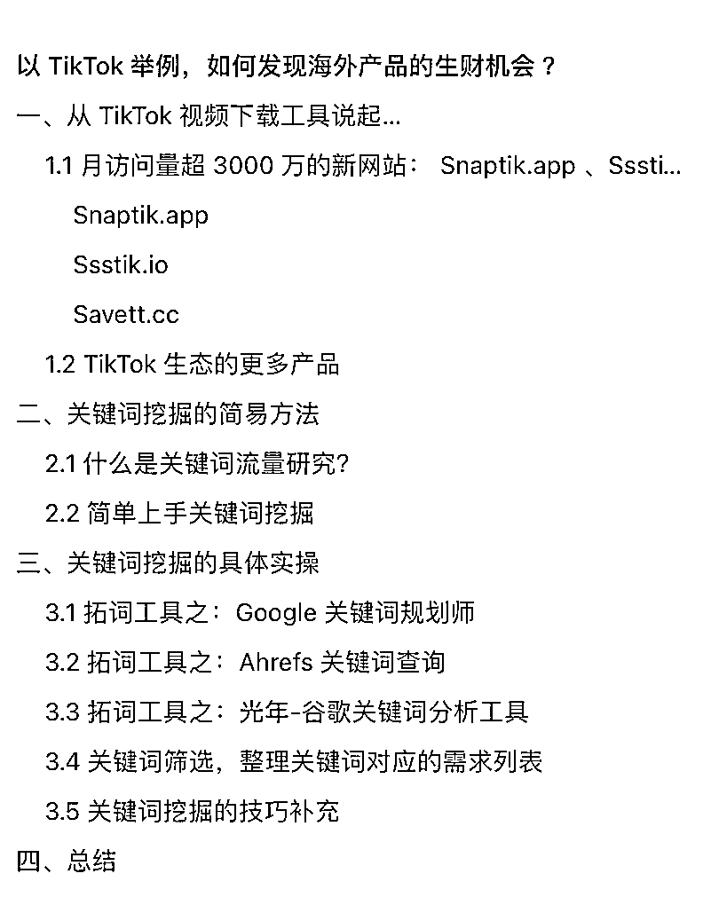

** **一、从** TikTok **视频下载工具说起**… **

 

 

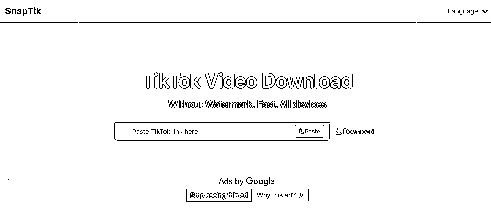

首先，从查询到的关键词搜索量数据，很容易发现的产品类型：  **TikTok **视频下载网站（**Web **工具）！  我统计了 TikTok 第三方视频下载工具一系列网站（后附），只取前  10 的站点，其整体的流量超过 8000 万次访问/月！（数据参考的 SimilarWeb），其中有两个网站表现超常，下面会详细说一下。

 

 

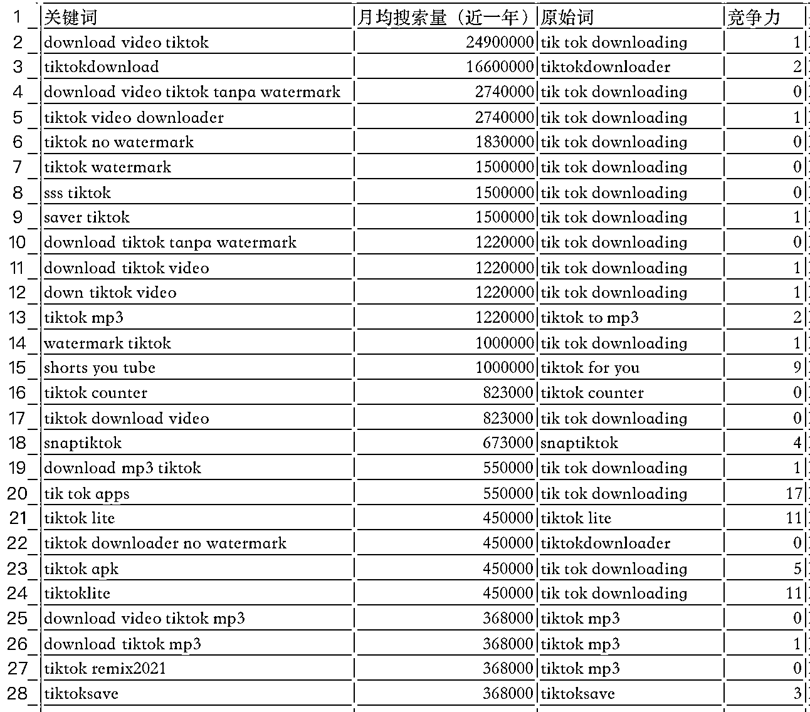

这些网站匹配了一系列的  「tiktok video download」关键词，由上图我们可以看到「download video tiktok」这个词，近一年里月均搜索量高达 2490 万次。

**1.1 **月访问量超** 3000 **万的新网站：** Snaptik.app **、**Ssstik.io ****Snaptik.app **

Snaptik 提供了 TikTok 去水印视频下载功能，宣传的核心卖点：无水印、快速、全平台支持。

据 Similarweb 的数据显示，该站点上月访问次数为 3100 万！（PC 网站和手机网页的访问总量），  全球排名 2000 左右。

 

 

**46.7% **的流量来自搜索，等同于每个月超过** 1400 **万次访问是来自搜索引擎的。

**50.5% **的流量来自直接访问。平均访问时长约** 1 **分钟。

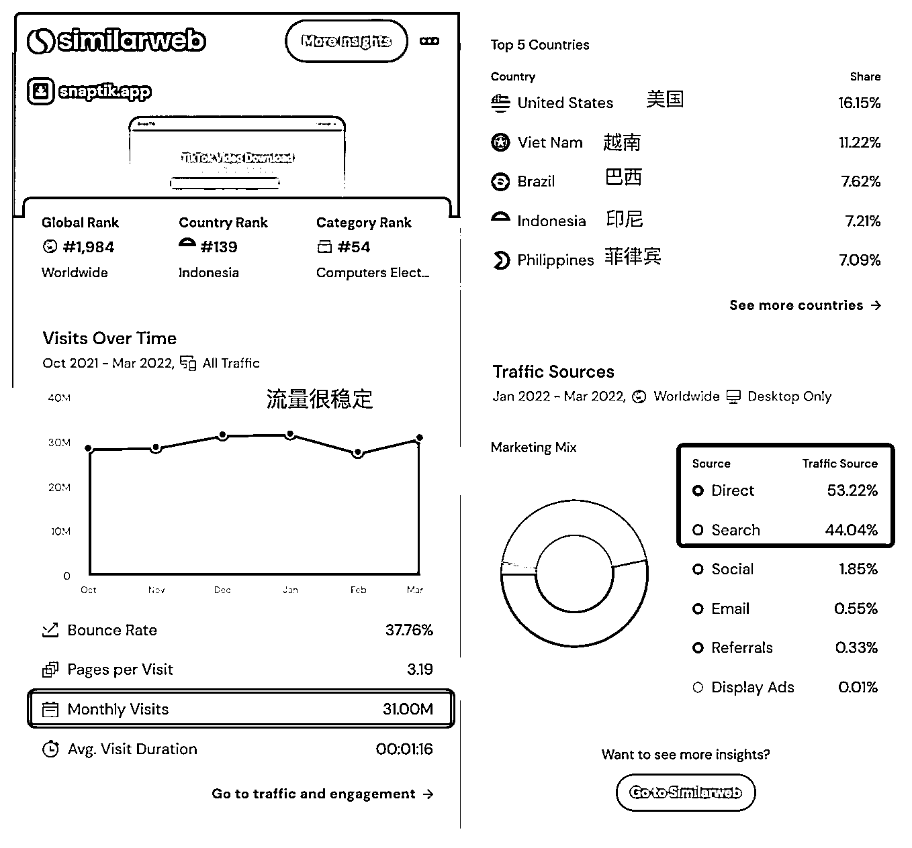

**Ssstik.io **

和 Snaptik 一样的产品定位、功能服务。据专业 SEO 网站 ahrefs.com 的数据显示，仅用时一年半的时间，就从 0 做到了每月 3100 万次访问量。而 SEO 方面居功至伟，覆盖了  5.8 万个关键词，自然搜索带来了每个月 2400 万次访问（免费获取的哦，以 ahrefs 的流量估计，该部分直接价值 8.1 万美金/月）。

Ssstik 的第一大市场是印尼，其覆盖了 1.1 万个关键词和覆盖 1300 万次的月访问量。

 

 

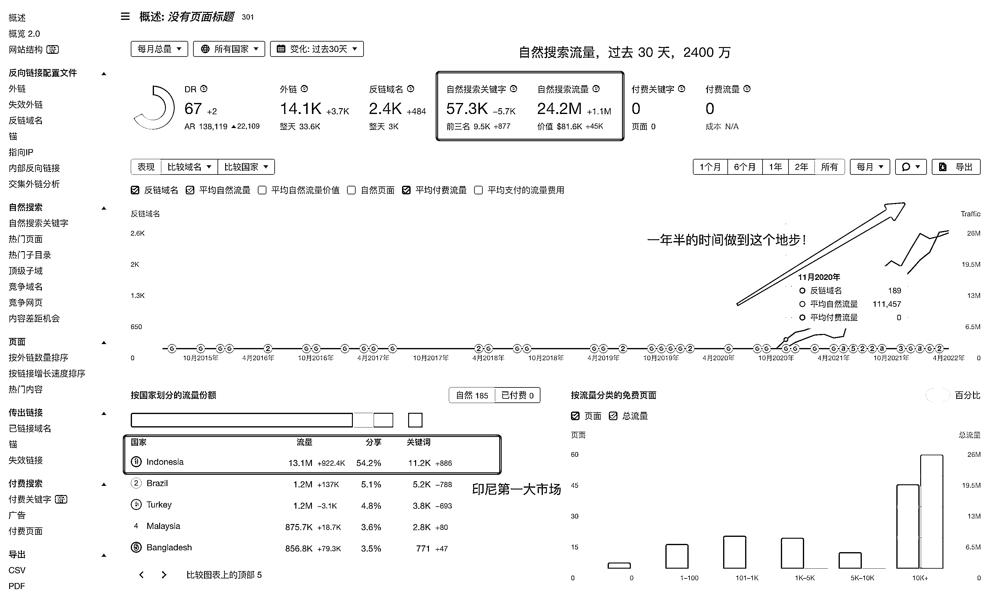

**Savett.cc **

还是 Tiktok 视频下载的在线工具，再提到这个后起之秀的独立站。去年 10 月上线的，短短半年时间，从 0 做到了 300 万的月访问量。其搜索流量占比 68.7%，Ahrefs 的数据预估其 90%来自免费的自然搜索流量。

 

 

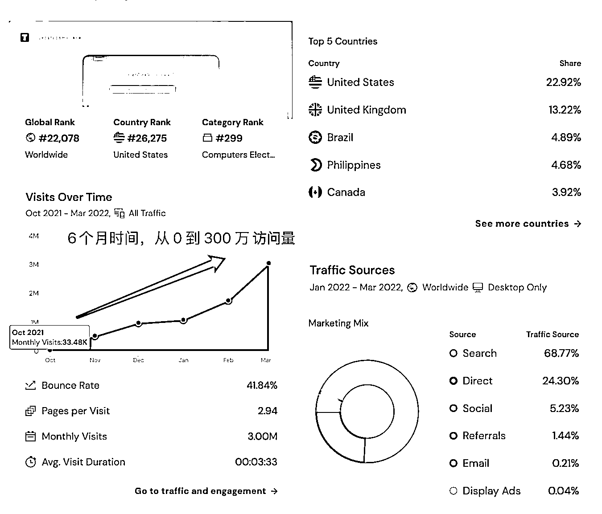

除了上述三家网站之外，还有超过 10 家网站在专门做这个服务，且流量都不低。整理如下：

（此飞书链接也可以看到）https://py64k0scfh.feishu.cn/sheets/shtcndvM7W7voqAaJVuu06zNPCh 

 

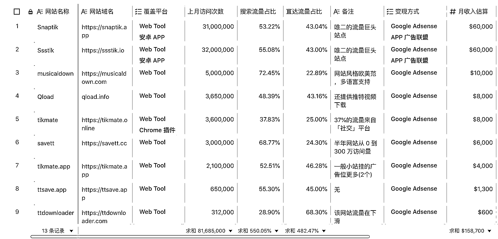

有流量，那么赚钱吗？** **不能小瞧。  以 Snaptik、Ssstik 两个为首的站点，每个月能够做到 3000 万次访问。这种在线工具，单页网站，很简单直接。产品设计及其克制，就挂载了一到两个广告位，按千次展现 2 美金估算，月收入预估在 6 万美金/月，年收入人民币 500 万（非利润），一年一套房的水平。

还不止，还有这两家均推出了去水印视频下载的 APP，在 Google Play 的下载量均超过了 100万，APP 的广告收益并未统计在内。

这是一种背靠大平台的用户需求，提供易用直接的产品功能，借助** SEO **超级凶残的流量增长并直接赚钱的模式。

**1.2 TikTok **生态的更多产品** **

于 Tiktok C 端需求，基于 Google 的搜索数据，去水印下载的需求比「tiktok 18、tiktok pron」等性相关需求强烈的多  ：） —— 当然了，Tiktok 也并不直接等同于 sex 内容平台。

 

 

我们再来看下，其他 TikTok 生态产品，简单概述：

**1. tokcount.com **一个实时观测** tiktok kol **粉丝的网站。每月访客** 180 **万** UV**、平均停留时长** 7 **分钟。就这么一个直观展示一个博主粉丝量（刷新）的网站，居然也有人看？** **这个网站就只瞄准了一个关键词：**Tiktok counter **。这个词，每月在** Google **有** 82.3 **万次搜索。

**2. ** 关键词：tiktok to mp3、mp4，把** TikTok **的视频转成** mp3**、**mp4 **格式的需求，**mp4 **容易理解，**mp3 **呢？都** 2022 **年了，还有人需要** mp3 **格式吗？有，需求大量存在。**YouTube **平台上相关产品的流量更猛。

**3. ** 关键词：TikTok view、followers、likes** **等，对应数个买播放量、买粉、买赞的网站。** **这些站点尽管有自带搜索流量，但竞争之下，也在** Google **投放了相关关键词广告。

**4. ** 关键词：Tiktok fans，对应一个** APP **产品：**TikFans - get tik tock followers + tik ****likes**，做任务互粉的需求，其下载量超过了** 100**万，主要是近** 5 **星好评** **的**11 **万评价数，还是规模不小的。

…… 等等，这些我都是只用了一招发现的产品 —— 关键词流量查询。

二、关键词挖掘的简易方法** **

**2.1 **什么是关键词流量研究？** **

从上述关键词的流量部分，这些工具型的网页产品，你也看到了，极其重视搜索引擎增长、通过 SEO 去获取流量。

我一直记得亦仁在 2017 年写的经典文章《通过 Google 挖掘细分市场的一个案例》，在第一步即是围绕巨头平台去进行搜索发现，探寻其中的商业机会。当我们搜索一个词，搜索输入框的联想推荐和其他人也在搜索的词，能无门槛的发现需求，简单、快速，但缺点在于：去搜什么词往往不知道如何入手，以及搜索的词可能不够全面、不具备代表性。

 

 

在 SEO 的领域，对于「关键词」研究，称之为：关键词挖掘。「关键词挖掘」是个系统性工程，对于一个行业要挖掘出数百万个带搜索量的词，才算合格，而用时往往要一个月左右。

不过，我们可以通过相关工具先简单、快速上手。

**2.2 **简单上手关键词挖掘** **

给圈友分享我的经验。第一步：框定母词。首先我们要基于研究的对象：TikTok ，还是 YouTube，抑或 Tesla 等，确定一系列的母词，比如 tiktok，我会选用：tiktok video、tiktok live、tiktok shop、tiktok fans 等圈定大范围。

接着

第二步：拓词！通『  谷歌关键词规划师』等第三方工具，发现相关搜索词。

第三步：清洗，再度拓词。再度查询关键词流量。

第四步：对搜索结果二次分组，统计具体哪些「关键词」的流量具备代表性。

第五步：筛选有价值的关键词，并定向研究具体的产品/服务承接。收录到自己的「项目库」或「需求池」。充分的调研、评估过后，再决定如何「杀」进去。这里先不展开了。

三、关键词挖掘的具体实操 ** **

**3.1 **拓词工具之：**Google **关键词规划师** **

这是 Google Ads 谷歌广告平台的后台功能，使用前提是一个商业账号，开户是一个小门槛，可以找国内的谷歌广告代理商开户，并不难解决。

 

 

进入「关键词规划师」，两个功能入口：一个偏「拓词」发现新词。一个偏「查词」查询流量的。

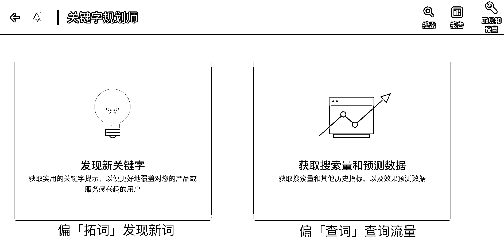

在「发现新关键词」栏目，搜索一个「关键词」便可产出更多的相关词，以及每个词的每月搜索量、广告点击出价预估等。（此功能最终还是服务广告投放的，但不妨我们用于需求挖掘的调研），如下图所示：

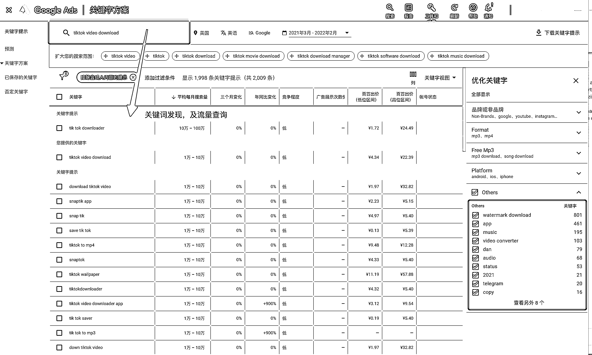

 

 

这就是「拓词」。初筛后，再次拓词，所谓「二阶拓词」，往往一个母词，可以拓词出一千左右的词，  一两千的核心母词，可以扩展出百万的带搜索量的词也并不少见。

**3.2 **拓词工具之：**Ahrefs **关键词查询** **

Ahrefs 在海外站点的 SEO 方面很专业。Ahrefs 也有关键词发现（keyword explorer）栏目，但不同于 Google 关键词规划师，其更多的是精准匹配的定向研究某个具体的关键词，数据颗粒度很细，比如 tiktok video downloader 这单一关键词的数据概述：

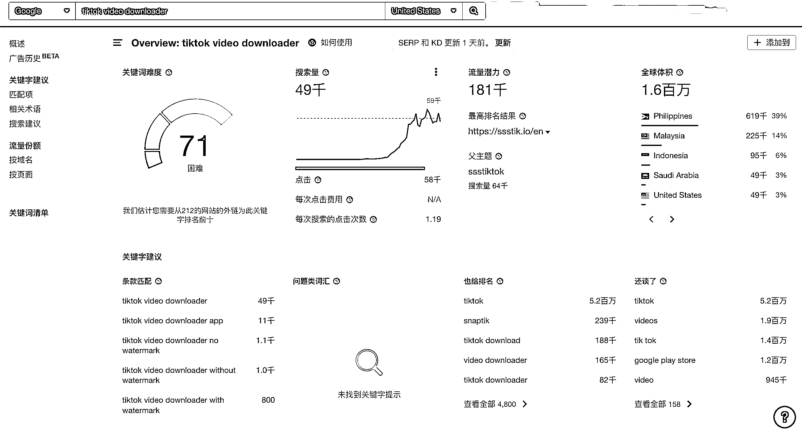

「直接匹配」了哪些相关词：

 

 

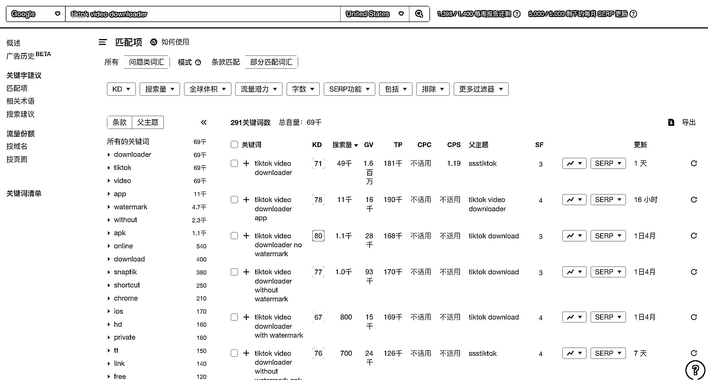

其他相关词建议：同样需求的词，可以下载导出作为「关键词」再次拓词。

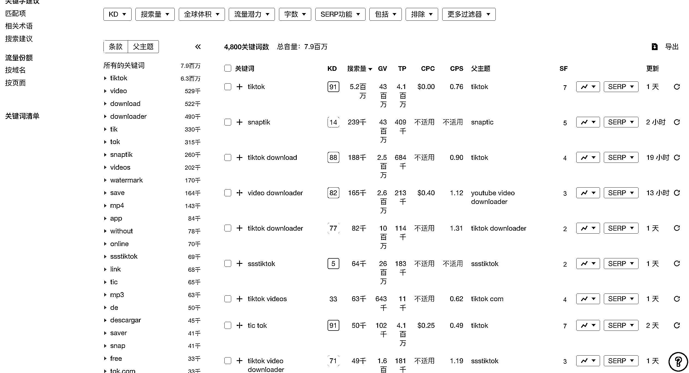

Ahrefs 很好用很专业，去某淘租一个共享账号玩玩。快速上手体验。

 

 

另外一个 SEO 工具「similarweb」也有关键词分析板块，但我认为其数据量不够多，并不好用，但查一个网站的访问量，similarweb 是比 ahrefs 更准确的。

**3.3 **拓词工具之：光年**-**谷歌关键词分析工具** **

此工具由国内做流量增长的咨询公司「光年实验室」出品，亮点在于：批量查询和多维度数据导出，如果数据量很大，光靠网页版是不够用的，得申请谷歌关键词 API。（同根同源，数据同样是来自谷歌关键词规划师）。

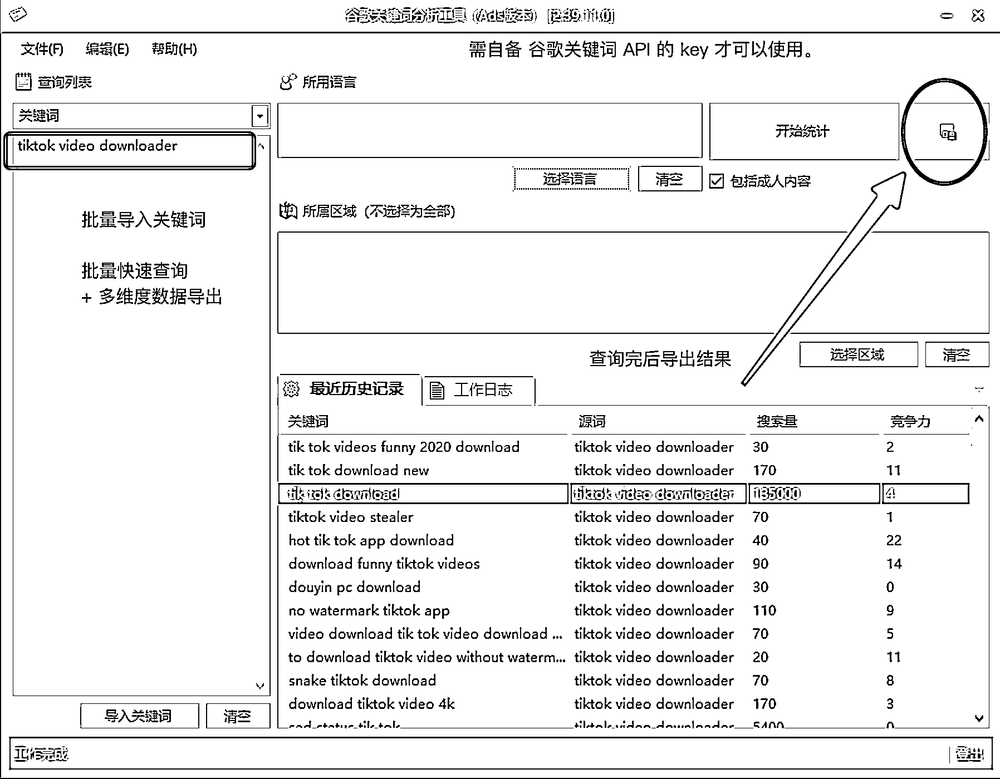

**3.4 **关键词筛选，整理关键词对应的需求列表** **

通过不断的拓词、搜索词的流量，已经得到了一份数据。接下来该如何做？

 

 

往往是这样的一份关键词表：

我们按月均搜索量降序排列，一一查看（逐个看，没有捷径），重点关注月均搜索量大于 10000 的词。

整理类似如下的清单，列举了一些，这些 tiktok 相关词有着对应的网站或产品。（已排除性相关的需求词）

 

 

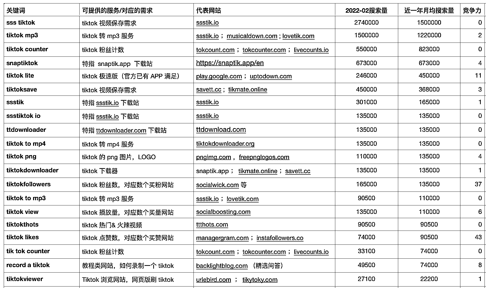

这样看，是不是一目了然。其实还有很多需求点并没有得到充分满足……此为举例，更深入下去，看到文章的你说不定有新的发现，欢迎交流，我也知无不言言无不尽。

**3.5 **关键词挖掘的技巧补充** **

关于母词，要多且准。母词的数量建议在「四位数」，数千个母词，可以拓词出数十万到百万的词。  而精准很关键，否则容易拓词出不相干的结果，筛选成本变高了。比如「Tiktok」容易拓词出一些大网红的名字，这些词在拓词时要先删掉。

那我们可以从哪里找母词？分享三点：

**1. ** 从目标网站挖掘：比如网站首页、关于我们等页面提取关键词，比如** slogan**、描述、**Metawords**、底部导航菜单命名。** **描述业务的词，越全越好。

**2. ** 找母词的角度：自己所处行业，那就头脑风暴开始。包括不局限于：直接相关词、行业相关词、人均相关词。

**3. ** 从广告投放词来用作关键词母词，也是特别好的。** Ahrefs **上了一个新功能「付费关键词」，即可以查询一个网站所投放的关键词，这个太强了。你想啊，人

 

 

家愿意按点击付费购买的关键词，能不精准吗**~ **下图以** Shein **举例：**Ahrefs **共收录了**7.4 **万个关键词，可过滤导出进一步筛选。

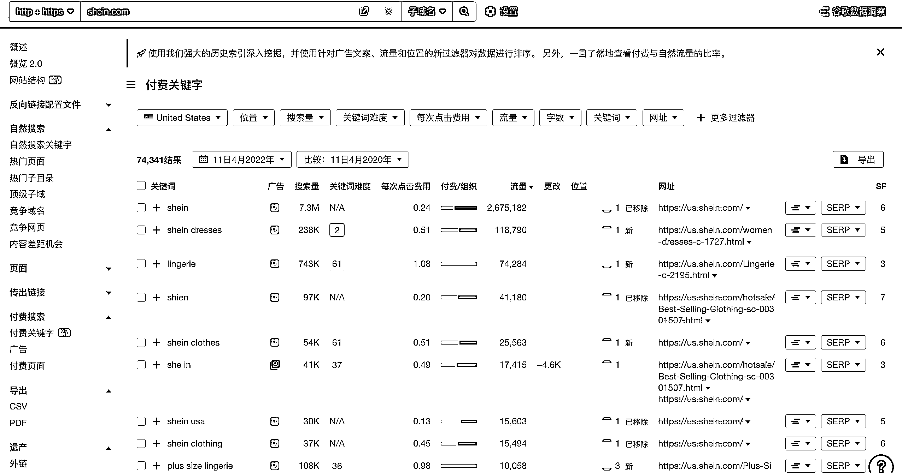

四、总结：** **

通过 Google 的搜索大数据，直接反映用户真正的需求。关键词研究若对一个行业需要更全面、耐心的挖词、选词。我介绍的是通过工具快速上手的方式。围绕 Tiktok 是如此，试试其他产品方向呢？比如据说最新估值 1000 亿美金的 Shein ，又有哪些周边机会可以做呢。

平台在变，可用户的需求具备延续性，若能在新兴平台提前布局相关服务，不失为分到一杯羹。比如 Instagram/YouTube 下载站的经验，在 Tiktok 上再来一遍。

通过 Google 搜索平台关键词研究，发现用户需求/产品机会，我称之为「生财机会」。

关键词研究很有意思，你会发现：居然人们在这样搜索一个词；当你去搜索这些词，惊奇：我靠，居然还能这么做。关键词研究的运用场景很多，不止是用在需求发现和 SEO/SEM，还可以用于内容生产维度参考、信息流投放、舆情监控、KOL挖掘等。

 

 

试试看，期待你的「我靠，绝了！」。当你哪怕找准了一个好的关键词，我想，这一定是个伟大事业的开端。

评论区：

三林 : 我靠，绝了[偷笑]。第一楼归我

闲富（软件定制） : 嗯，最近搞了一个国外tk刷粉的网站

颜周 : 去水印的网站真的直接把国内玩过的搬出去了。

三林 : 说不定是国外先做，这帮站点好几个来自印尼人搞得。还有国内的低调大佬也有做类似网站

三林 : 赞啊，期待后续分享心得

闲富（软件定制） : 目前市场已经起来，做工会的羡招募主播居多。找主播类工具比较好

Sunwei : 先赞后收藏，个别思路思考或实操过，感谢系统分享，私信加个V X好友[握手] 三林 : 文章没法加超链接的，补充亦仁的经典文章  时间快五年过去了，有些事情经得起时间考验https://mp.weixin.qq.com/s/cXa6Rwiet5gN8bSe-h4QNw**# ****(**精华帖**)(105**赞**)**聊一聊** Google **关键词挖掘需

# 求的方法

作者：  三林

日期：2022-10-21

分享原创文章《聊一聊Google关键词挖掘需求的方法》。于上周在英文工具站小航海的社群分享。

在产品出海，面对着「做什么」的方向选择时，我们可以通过对特定领域或平台的关键词挖掘和数值验证，洞察出一些产品机会。Make Something People Search For…当然关键词研究只是开始，附上 Ahrefs博客的观点。（图2）

 

 

经反馈说还是有不少收获，“学习到通过关键词找需求，感觉就赚翻了！”欢迎交流探讨，一起进步。

具体可以看飞书文档

https://t88igkhvrr.feishu.cn/docx/doxcnrJry2EmhMT562lM9wEob6d

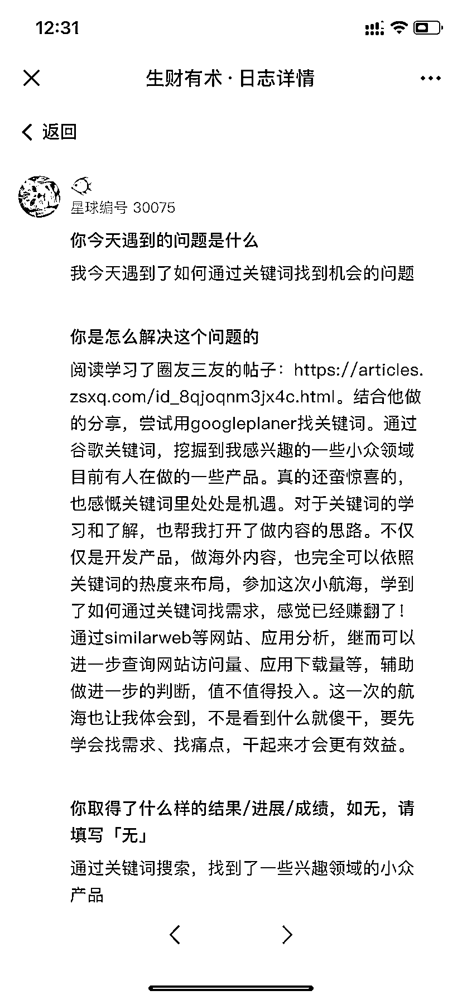

 

 

 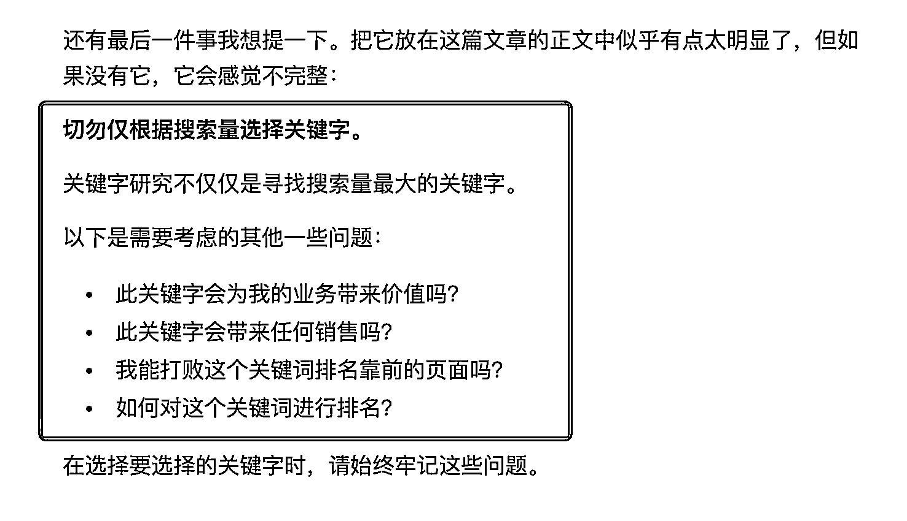

评论区：

 

 

do小鱼 : 哎呀  被三林老师翻牌子了！  特别不好意思  还把三林老师的名字打错了  但是作业过了好像不能改了 [囧]

三林 : 哈哈  我懂的[偷笑]

向上的塔皮 : 三林老师速度好快，我今天还在学习你的前面的精华贴：，马上今天又有升级版的，太棒了，学起来~https://t.zsxq.com/07RJqnyJE  三林 : 嗯嗯  希望有所收获哈

林锅 : 亚马逊产品开发表示也是通过关键词来确定开发方向[呲牙]

三林 : 对哦！  亚马逊站内搜索量很有价值

地铁馒头 : 提个问题，关于工具站都是在讲国外，为什么很少提到做国内工具站呢？

三林 : 那国内还是有不是工具产品的，产品形态app为主，网页版在海外更多的受众。海外的工具产品尤其是web tool/saas 百花齐放，一个细分的领域都能够收益相当，国内追求的是大而全。

# 【**ChatGPT **借力】**2**篇

# **# ****(**精华帖**)(499**赞**)**利用** GPT4 **迅速将想法落地，

# 让创意在半天时间内变成** MVP**！

作者： do小鱼

日期：2023-03-20

上周五在风向标看到一位圈友发布的消息，通过GPT可以完成创业想法的落地执行。

看完以后立即行动，利用GPT4迅速将想法落地，让创意在半天时间内变成MVP！

更多细节，欢迎阅读我的复盘文章  👇

《如何通过风向标发掘机会，靠GPT辅助实现MVP最小可行性产品》

我是如何通过风向标拆解机遇，诞生产品想法

如何利用GPT来执行落地，将想法变成MVP

 

 

实操后感受：如何基于GPT，开发更多的能力

图文较多，详情请移步飞书阅读  👉

https://u0ry0qxjdd.feishu.cn/docx/Zl9zdlsffoXMOIxIk9Ac0sIenje评论区：

上杉砍柴… : 优秀啊

茄子 : 沙发

高杰 : 执行力超强[强][强]

A潘典  君和联行 : 非常棒的想法和执行力！

茄子 : 前面的挖掘风向标机遇，拆解风向标，串联风向标跟我目前的操作好像，感谢给出了范例，后面还有利用chatgpt做出产品MVP超精细化落地记录，给力  希声 : 厉害厉害 

芷蓝 : 这等于是帮创业者细化了每一个步骤的执行颗粒度，太牛了

清梦 : 厉害 

# **# ****(**精华帖**)(194**赞**)**新手怎样通过**ChatGPT**编程

# 落地工具站产品

作者：  易焘

日期：2023-06-21

大家好，我是易焘，一个稍微懂一些技术和产品，并不算编程 0 基础，但也算不上专业的技术人员。

今天来和大家分享一下，一个工具站新手是怎样通过 ChatGPT 编写和上线一个工具站产品的。

目前我的插件已经上线和更新了4个版本，这其中少不了 ChatGPT 的帮忙。而这也意味着，我们这些没有深厚开发功力，或不具备基本开发能力的新手，也能通过 ChatGPT 来辅助编程，甚至落地英文工具站产品。

我们能和ChatGPT一起创造什么样的未来呢？它能带给我们怎样的机会呢？...... 

 

全文请下载下面小懒给大家整理的pdf查看：

https://lazymans.lanzoub.com/iylOI12ahj9e评论区：

朱较瘦 : 感谢分享，

胖大魔 : 以前看小说看的——愿天下人人如龙

波本零 : 写得太牛了

双平 : 阳神-洪易

胖大魔 : 哈哈哈，老书友

亦仁 : 感谢分享，已加精华。

向温暖 : 真的太牛了！！！

Alex : 精华一定要认真看[调皮]

# 【插件开发】**3**篇

# **# ****(45**赞**)Chrome **插件开发之旅：从** 0-1 **开发浏

# 览器扩展

作者：  阿帆

日期：2022-07-18

大家好呀，我是帆，本职前端开发，也是本次 Google 插件大航海船员～大航海挺多优秀的圈友都上线插件了（我也上啦），在群里我比较活跃（话痨）一点，这次应阿蓝的邀请，整理分享一下自己在挖掘需求的过程和插件上线后的一些想法。

 

 

今天分享的内容，主要围绕在：方向选择和需求挖掘。另外附带一些开发上线的细节，以及插件上线后挖掘新需求的想法。全文大约 5000 字，阅读大约需要 10 分钟。

那这里就开始吧～

一、确定方向及需求挖掘

这次航海，我学会的最大的一个认知就是：想要做好一件事情，开发其实是最简单的一环。

决定是否能盈利、用户是否买账的核心，是功能是否满足了用户的需求，而不是你的代码写的有多好，功能有多少。在开始一个项目之前，我们最需要做的是反复确认一个需求是否可行。

为什么用户愿意给一个简单的东西付费：

Google 插件有一个要求，也就是：插件应该是单一功能的（Single Purpose）简而言之就是：

这个插件应该只为了做好一件事情，而且要易于理解，过于复杂的功能审核是不会给通过的。

在这个前提下，你要制作的插件就应该是一个用于辅助用户的工具，例如我们挖掘需求会用到的 Keywords Everywhere、亚马逊卖家常用的 Keepa 都是属于这种工具。

工具帮用户节省了时间，用户就愿意支付这样的一笔费用。而且这类工具的用户，大多都是为了赚到更多的钱，那付费就更爽快了。

 

 

从零挖掘需求，建议从大平台的周边挖起：

虽然是明确是要做一个辅助类的工具，但我还是不建议从这种工具类做起。我认为：自己的第一个插件应该要尽可能的简单，让自己能快速的了解开发流程，明确开发的大体内容（如何开发、如何上架、上架需要准备什么、流量怎么来）。

所以我航海时的计划就是：做一个简单的免费插件，跑一遍这些流程，这样在开发付费插件的时候心里才有底，不至于抹黑乱跑。

挖掘需求，建议充分阅读：航海实战｜Google | 付费插件｜实战手册，航海手册里对于常用的方法及各方面的细节，都有非常详细的讲解，有不明确的地方，来回翻阅几遍加上实操基本就清晰了。

一开始建议遵从手册上面的方向挖掘需求，也就是：Facebook、Instagram、Youtube 这些平台。因为这些平台的用户量巨大，再小的一个需求，哪怕能满足 0.001% 的用户，也是最少五位数的体量，而且需求好调研（Google 搜索）、SEO 也方便。

 

 

想挑战一下自己，第一个插件就开始盈利，建议从：Amazon、Ebay、Etsy、Shopify 这些电商平台开始。

除了用来熟悉开发，熟悉流程的第一个插件，其他插件在开发之前最好是反复确认，做好调研。

壹树说过一句话：找到一个需求后，不要急着着手开发，一个礼拜后再回来看，如果觉得这个需求还是不错，那就一个月后再来确定。这句话一定要牢记的，因为开发是需要时间投入的，最好在开始前反复确认，这个需求是一个有潜力的需求，不然时间成本太大了（开发的投入、审核上线的时间、Bug的修复和编辑的审核时间、SEO 推广，以及开发完成后的倦怠期）使用工具挖掘需求的市场和竞争强度：

在航海群里，问一个需求能不能做，最大的可能是收获到壹树哥的一句：问搜索引擎，搜索引擎比我们靠谱多了。

一个需求能不能做，答案全在搜索引擎的数据里，我们通过搜索+工具可以得到：

**1. ** 关键词和相关词的月搜索量、广告费用

**2. ** 需求的竞争对手有多少

**3. ** 相关的长尾词都有哪些

**4. ** 每个月通过这个词进入目标网站的流量，以及网站的月总流量

 

 

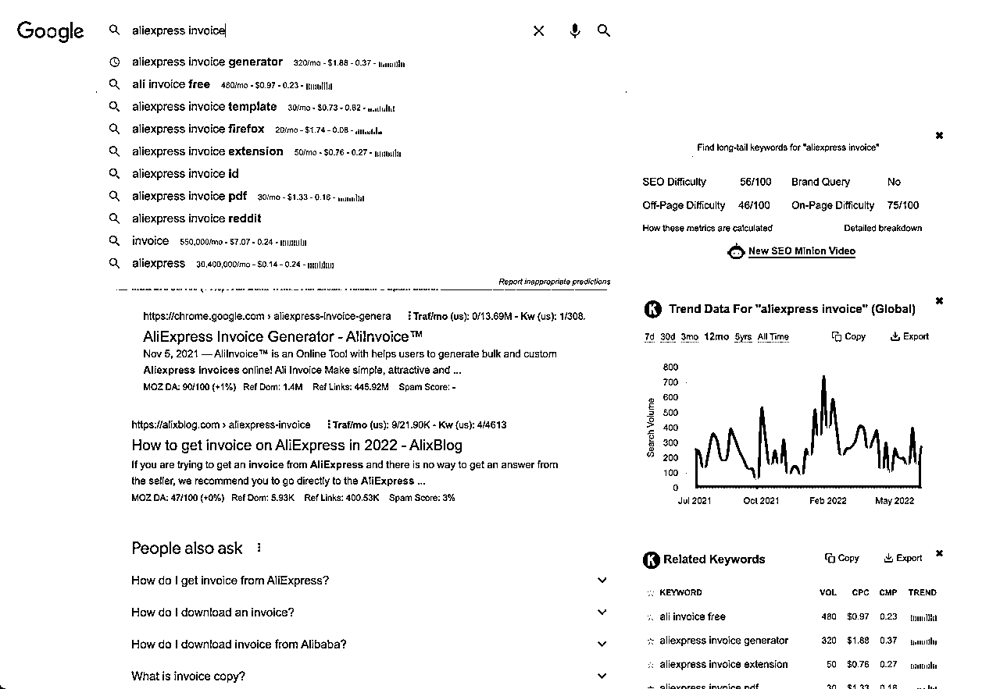

流量（Traf/mo）是预估的。关键词搜索量、费用、竞争强度等数据，经过调研来源于 Google 关键词规划师（比较准）

这里使用到了 Keywords Everywhere 这个扩展，使用到的功能是：搜索关键词，获取关键词以及相关词的搜索量、通过关键词进入网站的流量。主要用于分析需求量及竞争强度。

使用工具挖掘需求：

上面提到 Keywords Everywhere 这个工具，可以查询到关键词以及相关词的市场容量、竞争难度。那我们也可以倒推过来，使用它去做需求的挖掘。在航海手册里，有提到一个方法。使用关键词 + a-z 去检索需求：

 

 

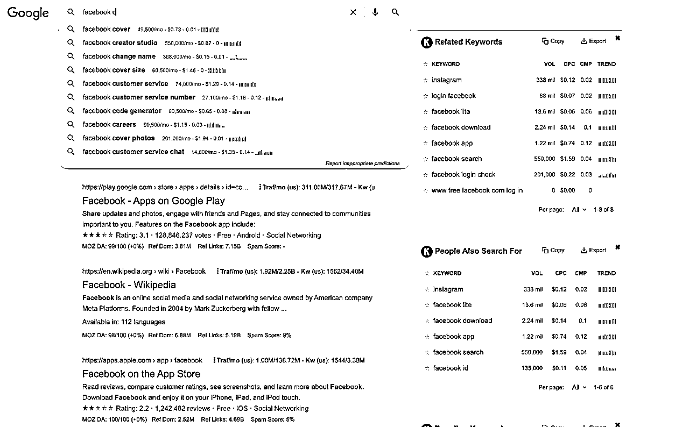

A-Z 这样走一遍，就能筛选出大多数平台的高流量搜索词。英文好的圈友，大概第一眼就能看得出搜索出来的下拉词是什么，英文不好的，可以点进去看看结果，评估一下内容和搜索量，就可以考虑进一步研究（深挖）啦。

基本上就是按照选定的方向，例如 Facebook、Amazon、Gmail、Ebay 这些词去做 a-z 搜索。

找的方向以后，就去引擎上找长尾词，看看当前的解决方案，例如：how to xxxx in xxxx。一般这种词最能显示出需求量。

 

 

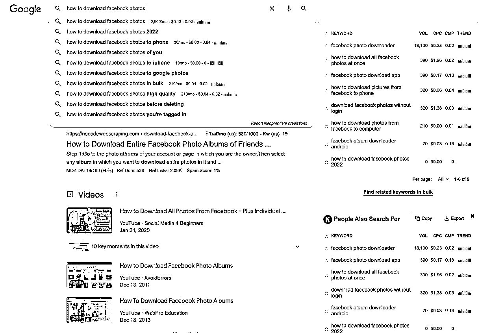

模仿竞品开发插件：

除了通过搜索关键词去挖掘需求，另一个方法就是模仿竞品，这个方式应该是见效最快的方式了。这里需要这一份圈友分享的商店扩展列表：Google 插件市场 15w 条完整数据 | 圈友基于此做的筛选工具

使用这份数据表，可以根据插件评分，用户量进行初步筛选，再人工过滤一遍结果，选择出近一两个月有新评价，但是评分比较低的产品，使用上面提到的 Keywords Everywhere 做长尾词调研。

 

 

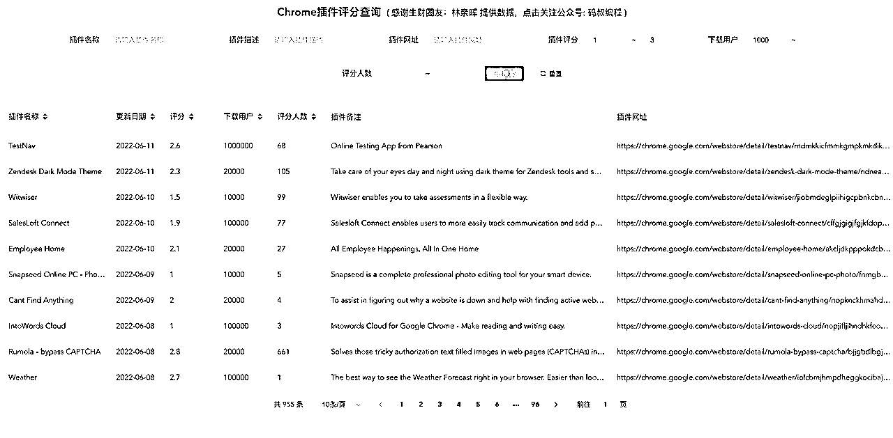

这种方式搜索出来的内容，基本都是有需求的（近 1 个月有评价）使用工具去研究长尾词，主要是为了分析需求和市场大小，竞争情况如何。

例如这个插件：Ali Invoice，就是使用这个方法在数据库里挖出来的。

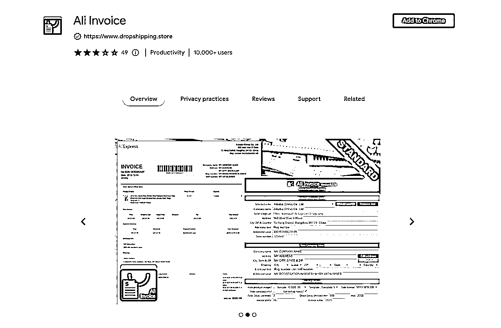

 

 

插件功能很简单，就是获取速卖通的订单信息，生成一份可打印的发票文件（PDF）。功能实现起来不复杂，基础班的价格是 20 美金…目前插件已经很久没有人在维护了，看了一下 Rate 里的大部分的竞品，评论也很多是 not working（说明有需求，但是没法解决，直接对标开发  1 比 1 复制，很容易推广的）。

这个需求属于比较小众吧（问了一下做速卖通的朋友，说是没这个需求），所以这个方向，我没有深入下去调研，感觉这种就挺适合新入手开发插件的圈友练练手。

关于免费插件如何盈利：

在挖掘需求的时候，一定会注意到有很多插件是免费的。不用猜它们怎么盈利，这些插件大部分就是为爱发电的（作者的爱好、炫技或者是看不上这点微薄收入……这也是为什么商店里有很多不再维护的插件……）

当然，也不是说免费插件就没法盈利，只是方式更复杂一些：

**1. ** 带流量给自己的网站，再通过其他产品转化（有一家开发商，专门开发免费的插件，导流给自己的小游戏）。

**2. ** 引流售卖商品（Tabby Cat，一个宠物标签页，通过独立站售卖周边贴纸盈利）**3. ** 增值服务（插件获取到的数据云同步功能）

**4. ** 通过联盟链接赚分佣（挖需求发现有一款免费插件，评论区都在说会自动打开天猫超市……作者大概是淘客吧）

**5. ** 引导点击广告（这种插件一般都会挨骂………………）

做好心理预期：

刚开始做插件的圈友一定要做好心理准备，你的第一个插件可能会：因为各种奇怪的问题审核被拒、开发完发现版本不能上架（MV2 版本不能上架了）、遇到问题在网上搜索到了解决方案却没效果，上线了却没有用户等等。

 

 

这也是为什么我建议先开发一个简单的免费插件，体验一遍完整的流程。不过遇到了也不要气馁，事后做好复盘，争取下一次更好，这种事情就像是亚马逊刷单被抓，Facebook 广告账户被封一样……没有经历过也不算一个真正的插件掘金人吧～

二、摆脱技术依赖、快速开发** MVP **产品

开发插件，主要是为了帮用户解决问题，怎么解决不重要。在需求挖掘的时候，我习惯在确定一个需求可行的时候，先去简单研究一下实现。也就是看有没有可以直接拿来用的库，如果没有的话，评估一下自己去实现复不复杂。

比如这个插件：

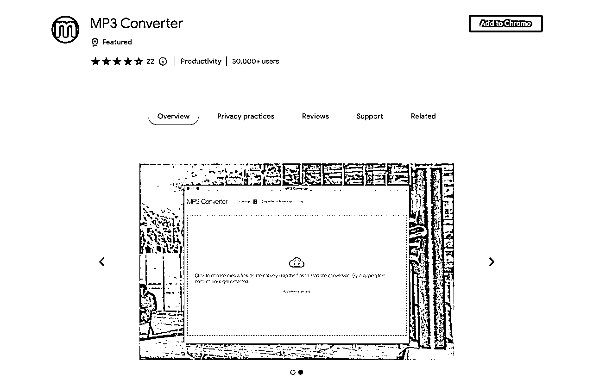

看到这个插件的第一反应，就是可以用库（FFMPEG）实现一个一模一样，甚至更好的工具（比如我叫他 Media Converter，音频、视频、图片都能转…………甚至视频抽帧、图片转视频，都很简单），自己只要做一个界面，预置好转码的参数就可以直接上架了……

 

 

开发之前，建议整理一个 todo list，把需要开发的功能一项一项的列出来，然后一行一行的删除掉，只留下最核心的功能，先完成一个 mvp 版本，让自己有个东西去做推广，表现不错再做细致的补充。

补充一点：不用太在意使用什么技术去做插件，插件是最简单的网页程序

（HTML+JS+CSS）。会开发用自己熟悉的技术栈，不会开发可以和圈友一起合作生财。打算自己研究开发，简单学习一下前端三剑客就可以直接上手了。

三、上线扩展

开发完成，上线扩展第一个面临的问题就是开发者账户。

直接注册账户，绑定信用卡，支付费用，你很大可能会遇到支付失败的问题。这个大概是  Google 内部的问题，在绑定支付卡以后，关闭并重新打开页面，这个问题就解决了（当时查了一下，没有查到任何说是银行拒绝了交易，大部分都是重进页面就能解决，我也是按照这个方式，绑好卡以后，关闭重开就能支付了）

实在解决不了，可以在万能的某宝多花点钱解决～

之后可能会遇到的第二个问题就是：插件版本不对。

Google 扩展分为 v2 版本和 v3 版本，目前商店已经是不允许 v2 版本上线了，然后网上有很多教程都是 v2 版本…… 这次航海就有圈友踩到了这个小坑。

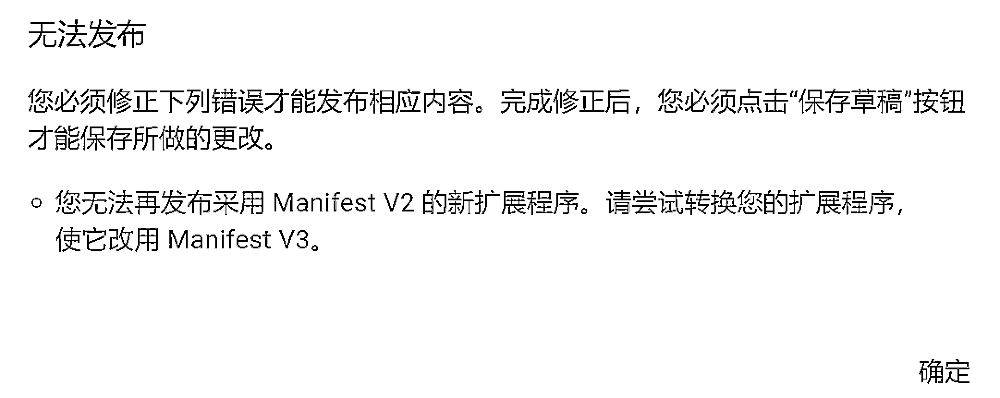

因为版本问题被拒绝

 

 

遇到版本错误无法发布不用太紧张。升级版本并不复杂，只要没有使用到被取消的功能（引用外部JS），基本也没有多大的问题。

上线扩展的最后一项就是审核，审核需要描述大致的程序功能（也就是前面提到的单一功能），为什么需要使用到某些权限（每一项权限都要做出单独的说明），如果需要收集用户数据，还需要提供隐私声明。申请了权限没有使用，需要但是没有提供某些内容，都是会被拒绝掉的。

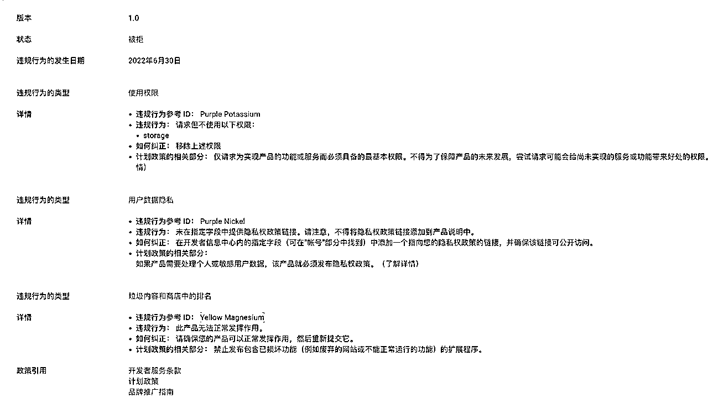

圈友插件因为权限问题被拒绝

插件的审核时间大约是 2-3 天吧，中途不能撤销（插件上新、插件编辑都是这个时长，哪怕是编辑了一个字…………）所以在开发完成以后，一定要检查一遍，是否申请了多余的权限，有没有影响功能的 BUG，免得因为这些问题影响上线，或者上线后收到不必要的差评。

四、扩展推广

插件上线以后，只靠自然流量获取用户还是比较慢的，现在我的插件上线半个月了才 100+ 的用户  🤣

 

 

如果你的扩展是修复了某个失效的竞品，可以在它的 review 里留言，引导用户去自己的扩展页面下载扩展。很多失效插件下面有模版，保存几个随时用就好了。再就是去搜索相关长尾词和关键词，在相关的帖子里留一下自己扩展（或者官网）的地址。

获取免费流量，最后一个就是制作视频发布到 Youtube 上，标题名称用相关长尾词的名称，还是很容易跑到 Google 搜索结果的前面的（可以认为是大站点有加权）。付费流量就是  Facebook 广告、Youtube 广告了，这一块展开又是一个超级大的板块……不过还是建议免费流量开始吧。

插件上线后开始有用户了，可以使用 Vercel 搭一个小站点，用来承接各个渠道带来的流量，顺便赚点广告费，以及做插件优化，提供一份使用指南～

五、做自己喜欢的事情

亦仁有一段话我觉得非常好：如果总开心指数是正的，那就值得做，总开心指数是负的，那就不值得做。也就是做自己喜欢做的事情。

今年应该是我加入生财的第四年了，期间加入过多个航海，尝试过各种副业：视频号、抖音、TK、好物、小红书。这种 UGC 平台，每次内容发布出去，自己都会陷入各种自我怀疑。这次尝试了开发这一个方向，却觉得一切都很自然和舒适。

之前尝试的副业，虽然一些收获，可总是坚持不下去。现在琢磨过来，大概是因为：尝试那些副业，都是为了赚到钱，每次输出却没有结果，都在一点点的消耗行动力。但是做自己喜欢的事情，每天都能保持一个行动力满满的状态。

现在上线的第一个插件目前用户 100+ 啦，每天都有自然增加（计划做 SEO 但是一直没落实😂）。虽然用户不多，但还是很开心。

 

 

最后在补一张壹树大佬最常发的一张图

感谢各位圈友阅读完这篇分享，在这里祝各位圈友在插件出海的路上披巾斩棘，做到人生中的第一个** $10K MRR**

评论区：

金社长 : 厉害

凡灵逸尘 : 大佬，能不能加个微信

向上的塔皮 : 谢谢你的分享，非常接地气，也是我现在在做工具的疑问

 

 

# **# ****(30**赞**)Chrome PDF **插件从**0**到**1**的试错经验与

# 踩坑复盘

作者：  颜过

日期：2021-08-11

Chrome插件从0到1的试错经验

PS：之前这篇所有内容只在内部小圈子分享过，最近一次分享在帅张张哥的群里。之前了解我的财友，最大的标签是跨境电商，但今天不聊跨境，聊聊试错出海小工具。

作为程序员的朋友，可能大家关注点基本都在技术精进上，其它可能很少关注，今天的分享内容主要是围绕着技术之外的一些东西分享，不足之处，后面应该还会有迭代的，到时候再跟大家来分享。

一，选哪个主战场

主战场，主要还是先从开发难度还有开发时间两个维度来说的。

给个参考排序：电脑PC端>=手机端Apps>Web端SAAS或网站>插件（电商类Apps，例如Shopify Apps，Chrome 插件，wordpress+WooCommerce等周边插件<即wp+woo>）。

因为过往的跨境电商经验，优选电商类小工具，那就是shopify apps或wp+woo，但前者上架其实难度大很多，后者相对成熟一些，需要也多，例如很多shopify apps的需求都可以直接搬运到wp+woo上来实现。但时间卡在那里，另外还有一个点，就是快速反馈原则，即快速从0到0.5的原则，最终锁定了chrome插件这个小赛道，基本只需要javasrcip+css一些前端知识+服务器的知识（其实真做起来，还是有很多盲区），就能做 

 

出来一个产品。另外这种小产品，一般只专注解决一个小需求即可。同时审核也快（差不多12个小时才审核上线，之前看一些资料，审核很快的）。

二，选细分市场或需求

选哪个细分市场或需求，其实跟跨境选品一样，往往新人觉得是玄学，其实你真动手做了第1个小产品，然后慢慢就会有感觉，但是你整天想这想那，那很大概率，就没有然后的然后了。

其实这次小工具选品，也还是走了一些固有的思维的弯路，例如最早有两条大路，电商类小工具，或wp+woo小工具，但其实等于没有，因为没有办法立马就干，还有开发人员的选择（在这里浪费了很多时间......后面再讲）。最后，是一美国的做物流的朋友，她有个小需求，即pdf相关的需求，最后付费这里也是（半买半送，后面相关的pdf需求PDFXYZ（暂时隐去插件名字，后面有公开，因为上架有一段时间），都会免费送给她一整套小插件使用）。付了两笔49.99美金（钱不多，但至少有个正向反馈，这个最重要）。

 

 

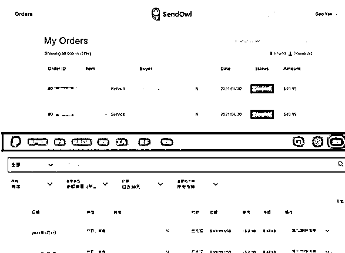

最终选PDFXYZ这个细分需求，还有几个原因，你可以细品一下，尤其是想做一个新市场，找个细分点，快速试一下，小成本跑通整个流程，即完成大于完美。当然还有deadline的作用（这个对于小众产品或市场，太重要了，开发进度一拖，各种成本就上来了）。

另外这个PDF需求，在github找到相关的实现源码（虽然是其它语言的，但对于chrome插件也是可以复用的），即可以借前人的轮子来用，加快整个进度。

PDF各种需求，在国外市场是巨大的，直接Google一下，居然有250多亿的搜索结果。因为软件是边际效应的，你开发出来，其实后面的维护成本很低的。另外这个需求，也是为了先试chrome插件市场，还有积累原始的pdf需求的第1批种子用户。因为周边需求的拓展太多了。每个子功能，都是可以做成一个小工具的，即形成了小工具矩阵（是不是有点跨境的多账号味道了）。

 

 

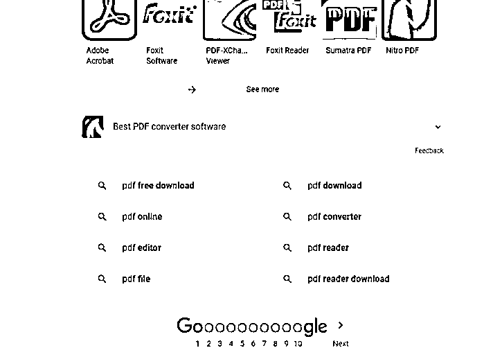

三，想与做的各种坑

**3.1 **招人坑

这里浪费了好多时间，一是具体需求没有太多确定，就去招人，而且还是在国外平台上，一是fiverr，二是upwork等freelancer平台。

有些事，只有你真正做过了，才知道这里的坑有多少。就像这个Chrome插件PDFXYZ，看似简单，里面还有几个难点需要一定经验，或者是主动解决问题能力的程序员才能搞定。

 

 

而找老外做开发，你得1，2，3，4，5........把实现细节拆分才行。要不然，加上时差，还有技术框架不熟悉（我的那些编程语言，算法套路基本都交还给大学老师了），这一来一回，更是难上加难了。

如果你要找老外做开发，一定得先列好细的需求，直接让他实现code就好了。要不然开发时间和进度会拖死你。最重要的是，多找几个来对比，多磨合几轮，才能找到合适自己的。

最后找了两个朋友（朋友L，一直有帮我处理程序上一些事，全栈能力有，但需求时间来实现；朋友Y，是另外一个朋友介绍的，大公司的前端大牛）来做两个版本，同样的需求。为什么要这样做呢？因为我不只做这一个插件或小工具，后面还会有N多（如果你有程序员朋友想变现，也可以推荐给我），前面已经多次提到，开发时间对于小工具来说是个大坑，如果托得时间越久，那成本只增不减。也是相互一个磨合过程，开发这个活，还是技术优势来主导的，差一点，就真的需要时间去打磨，别无他法。

**3.2 **业务流程坑

做小众市场先行原则：找别人已经赚了钱的需求，再深挖（最直接的是找差评，看看能不能解决这些问题），你离变现不会太远。

有句话叫，你想学会游泳，你至少得下一次水吧，要不然动作再漂亮也没有什么用。先行原则，前面已经提到过了，即pdf这个大工具，周边其实是有很多需求的，用户基数也足够大，先积累种子用户，能收到第1块的用户那更好。再去拓展其它需求，赚钱是迟早的事。先下水，那就直接先模仿，把核心需求实现，尤其是支付环节实现（chrome插件之前还有google pay的支付，现在没有官方支付支持了，但是能接第3方，这里支付坑再展开讲一下）。

 

 

讲一下PDFXYZ这个小工具，核心需求，朋友L是用中间服务器来实现的，PDF文件基本无损来承现了（即文件清晰度，因为pdf文档，要么是文字，要么是图片，还有其它格式合成的），即能满足客户真实需求，但这里面还有服务器上传下载的问题，还有文件大小的门槛（文件大，下载时间就长）。文件大了，插件的体验就极差了，因为会卡在那里，半天动不了，只有限制其大小，设置为10M。

朋友Y，是直接用js api来实现，但是文件下载下来就模糊（客户的核心需求实现还差一些），另外同样的，也是文件上传下载的问题，这种文件大小限制就大一些，为30M。

**3.3 **支付坑（大坑）

国外的工具或一些需求，或产品，除了广告变现以外（Google Adsense）；常用的变现方式：捐赠（paypal）；还有通过分享产品等知识，用affiliate模式（分销赚佣金）来实现；那最直接的方式，就是直接收费。

chrome插件大多数情况下，只能选择捐赠，或直接收费的方式。结果现在的Paypal账号是不支持国内账号的捐赠。

直接收费方式，因为google pay官方支付停止，但接受第3方支付。你可能直觉是Paypal，但不好意思，虚拟产品，Paypal不支持（应该大型软件会有收款白名单）。还有其他选择：stripe等（但现在申请，又是门槛N高，申请下来，也会被封号的风险）。

现在收款，是先试的是Sendowl（可以再转Paypal，现在测试的结果，几十美金，通过sendowl付款链接，Paypal是直接到帐的）（这个工具是壹树老板（插件大佬，公众号：

树下随想）推荐，尤其是支付这个环节，帮了老忙了）。这里壹树老板也趟了无数的坑（如果你想问，请付费，真的绝对超值）。

 

 

因为sendowl是web端网页支付，插件端要有个支付回传（webhooks），确认用户已经支付成功。熊（全栈大牛，大学同学，之前的公众号有介绍过）+壹树老板的综合建议：

不做登录就可以整个本地的唯一标识Key，当用户付款了，就生成一个标识Key，保存到数据里（或者用户本地电脑缓存）；另外最好手动或自动再发一下支付邮箱一封邮件，把其Key发给用户。如果用户卸载了，就可以用这个Key来识别。

另外插件内是不支持回传确认的，如下图，即卡死在那里，因为没有回传确认是否支付成功。朋友Y是直接用的单独新开浏览器标签页，让付款用户直接通过sendowl网页链接付款。

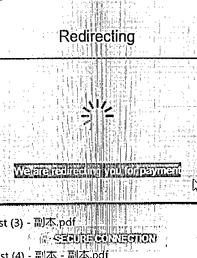

 

 

**3.4 **图标图像坑

这个坑，估计大多数独立开发者，只有真的有一款小工具跑出来后才会意识到，但往往这个时候，估计你的款都有可能被扣光，如果造成侵权的话。

前文有提到是PDF的需求，图标，朋友Y就直接用了Adobe pdf的图标，虽然辨识度极度，但这个潜在的小隐患，可能让你全盘皆输。

也许你没有碰到过，所以，看到这个坑，会不会有夸大的嫌疑。真没有，想起N前年，第1次私模，做硅胶材质的汉堡制作工具，因为一家加拿大公司把这个细分类的常用词都注册成商标了，导致当时在亚马逊仓库的货、在途的、工厂生产的，都得换包装（还是彩盒），产品上的LOGO产品词得去掉，这样一处理，小几十万没有了。。。。。。

**3.5 **插件上架坑

（细节见最后的第四大部分内容：运营推广复盘）力求真实最好。

**3.6 **推广坑

（详情如上<3.5>，因为是虚拟产品，直接chrome插件网页地址是可以投google的搜索广告，但是联盟广告是不行的，需要另外做网站，但PDF这个需求，其实投联盟广告是极好的，尤其是定点投放相关网站）。另外有尝试native ads(zeropark, propellerads)，google ads（直接chrome插件网页可投google 搜索+智能广告），bing ads被否，quora ads被否。

 

 

暂时算是盲测阶段，没有安装统计代码（因为插件不同于网页，具体可参考

https://developer.chrome.com/docs/extensions/mv2/tut_analytics/），google ads也只是做了简单优化：需求地点（直接定位到城市）、设备（排除掉非电脑PC端）、keywords直接上精确匹配.......

简单优化的数据，表现最好的区域为新加坡，0.5-0.7美金一个安装，精细化优化，成本至少可以降一半以上。30%的卸载（数据量基数不大），另外同类产品功能差不多的情况下，是免费的，PDFXYZ这个小工具性能也要再优化。安装率45%，即差不多2个人看，有1个安装，即需求还是有的，流量也算精准。

下面的20年国外的一份统计表，值得你在chrome插件，初始预算要花到多少钱。到了1000的用户数，你基本算是脱颖而出，当然，现在21年，用户基数的标准提高了。如果按照前面的简单优化的单个安装成本0.5-0.7美金，你推广试错成本至少得你准备500美金，是不是突然发现这个事可以干那么一下子了。

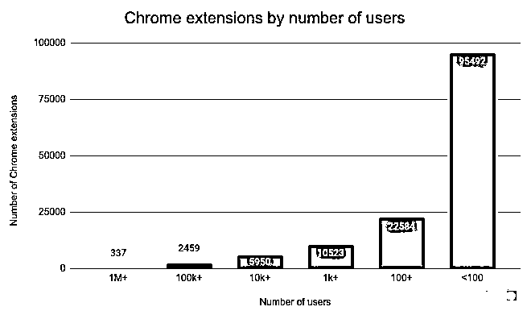

**3.7 **营销坑

 

 

（这里主要是插件定价，还有后面的插件体系布局的事，即形成老用户闭环，积累可触达的可营销的客户邮箱列表，你前面的推广成本才被摊薄。具体内容详见<3.5>）评论区：

暂无评论

# 【小程序变现】**2**篇

# **# ****(22**赞**)**又写了个为我提供咖啡的浏览器插件

作者：  壹树

日期：2019-01-29

接上次 2 个被封的插件，我又写了个很小的浏览器插件，把过程记录了一下，感兴趣的同学可以交流一下。[呲牙]

PS.今年开始写个公众号，希望能坚持，起码是个好的开始。

https://mp.weixin.qq.com/s/g7b6LSdTuSzgM8Ar-iePNg评论区：

飞鱼船长 : 有点意思，探索过程保持好奇心和联想

不许变懒的猫 : 深有感触，对找这类软件的人来说1美元和4美元基本没啥区别，而且这种低频软件，应该对应高客单价，9.9、19.9美元都不过分，只要体验稳定。

边城浪子 : 这种小插件做好了现金流很稳定吧，按月付费

好像适合技术来做，比拍短视频更适合程序员一点吧

壹树 : 会相对稳，主打技术服务，用户需求满足就会有固定一批忠实用户。

 

 

# **# ****(104**赞**)**小程序流量主高效变现，你不得不知

# 的七大招

作者：  三林

日期：2021-05-14

大家好，我叫陈康，也可以叫我三林，互联网产品人，关注直播短视频、内容电商，互联网广告等。今天和大家分享下，我对微信流量主广告产品的一些经验和研究。希望有助于少踩坑，多赚钱。在咱们生财有术，不只是聊怎么赚，也要聊如何赚更多。

是这样的，我经历过一个流量黑天鹅事件：单日小程序流量主收益超 3万，但又感觉亏了20万……曾经所经手的一个微信小程序在短视频渠道单日新增了数十万用户的访问，彼时小程序仅是做配套产品，并未直接商业化，流量主也没接入进来。想着今天流量很大，且有持续火热的状态，于是急急忙忙的临时增加流量主广告组件，次日出报表时，好家伙！仅仅放了 1 个插屏广告、1 个 Banner广告，就获得了单小程序单日超过 3 万元的收益。如果以现在的角度去看，通过更合理的配置广告和内部优化，完全可做到** 10 **倍的提升。

 

 

可惜时光不可逆啊… 所谓厚积薄发，当有一些幸运来临时，最好别说自己还没有准备好。另外，做好内部优化很重要，要想赚到钱，往往向内求比向外求来得更直接、可控。这是我要分享的第一个观点。

背景** **

在微信生态里，多数小游戏，诸多的内容型与工具型小程序是有通过微信流量主来创收的。这是一个不容小觑的生财之道。微信流量主有着接入简单、灵活控制，见效迅速的特点。  如果你有一定日活的小程序，试试流量主说不定很有惊喜。当然，一个产品的定位，往往有着与之匹配的变现方式。广告呢仅是一种变现手段，流量主是微信广告的代表。

 

 

我主要围绕小程序流量主探讨，以工具小程序和内容小程序为主，附带小游戏相关，而不包含电商类小程序（卖货才是正经事）。您可能会问，公众号也有流量主呀？公众号的变现，头部和垂类账号创收还是接品牌/付费广告效率更高，流量主收益相对而言低的多，且因位置和展现机制有限，优化空间小。小程序/小游戏可不一样，因广告形式多样化和可灵活配置，可以玩的出色得多。

好了，我们开整，Enjoy~

文章目录：

**1. ** 微信广告「流量主」是什么？

**2. ** 现状与趋势：流量主的前景如何？

**3. ** 如何开通小程序流量主？

**4. ** 案例分享：工具类、内容类、小游戏

**5. ** 流量主的广告形式与对比分析

**6. ** 小程序流量主  广告优化策略

**7. ** 流量主收入公式

**8. ** 流量主产品内部优化策略（七大方向）

**9. ** 因地制宜：选择合适广告位与控制

**10. ** 提渗透率：提高广告被看到的次数

**11. ** 提曝光率：位置前移便可轻松提高

**12. ** 提点击率：激励广告前的文案提示

**13. ** 升级形式：原生模板广告可更融合

**14. ** 技术调优：预加载与定时自动刷新

**15. ** 切忌滥用：下线收益能力低的广告

**16. ** 关于流量主变现其他需了解的

**17. ** 玩转流量主的相关工具与服务

**18. ** 总结与致谢

 

 

首先为流量主新手圈友简单做个科普，老玩家请随意~

一、微信广告「流量主」是什么？

微信广告是微信指定的广告平台（官网 ad.weixin.qq.com），品牌方在『广告主』后台投放广告，流量主在微信公众平台后台『流量主』栏目可开通流量主和设置、查看报表收益。

流量主可轻松实现流量变现，持续获取收入，依托于高价值的内容，实现品牌塑造和内容变现的双赢。

微信系统会根据广告素材的定向和阅读文章或使用小程序/小游戏的用户画像，匹配当前状态下最适合展示给用户的广告，流量主无需额外操作。

**1**、现状与趋势：流量主的前景如何？

记得 @条形马  老哥在今年4月生财全国网友见面会的分享：选择一个赛道时，得了解下「大基本面」如何。这里我找了两方面数据：

首先，根据 2020 年 9 月的微信广告流量主大会的报告显示，截至 2020 年上半年，月活跃流量主数量是** 85 **万**+**。2020 年 1 月-2020 年 7 月，流量主累计分成** 31 **亿**+**，月入** 10 **万以上的流量主有** 1000+**；而小游戏更猛了，截至 2020 年 7 月，小游戏整体流量同比增长 80%，月广告分成超过百万的游戏达** 39 **款。

 

 

而根据腾讯 2020 年度财报，其中网络广告收入 822.7 亿元，同比增长 20%，占总收入的 17%。2020年，每天有超过 1.2 亿用户在朋友圈发表内容，3.6 亿用户阅读公众号文章，4 亿用户使用小程序。

有这么多的活跃用户，微信负责招商，创业者负责做产品与内容吸纳流量，通过流量主变现，这路子行得通~ 但也要了解微信已上线 100万+ 小程序，说明机遇和挑战并存。

**2**、如何开通小程序**/**公众号流量主？

随着微信公众平台的发展，从早期内测期到现在，开通门槛逐渐降低。当前的要求是：

微信小程序 1000 用户（访客），公众号 500 关注（粉丝），且无严重违规记录，即可开通流量主（微信公众后台-流量主）。

无论主体是个人，还是企业（包括个体工商户），均可以开通。区别是结算时，企业需要开具增值税专用发票给腾讯（注意是专票，需要纸质的发票邮寄）。个人是微信代扣税（增值税、附加税、个人所得税）。综合从费率上来说，企业主体的更好。

业界也有代开通流量主的（就是刷量达到开通门槛），这个见仁见智，我个人不建议去代开。正如王兴说「做投资的前提是先有钱」，赚流量主钱的前提是先得搞流量。

 

 

二、典型流量主产品应用案例

来通过一些线上小程序案例更直观了解，我尽量选择大家耳熟能详的产品做介绍：

**1**、工具型小程序** **举例：** **

**1.1 **营销工具：抽奖** **小程序

图**1**：抽奖助手** - **小程序启动时的 「封面广告」

 

 

抽奖助手的商业变现是工具类小程序长期商业变现的典范。很多产品的商业变现很粗暴，抽奖助手的商业变现很克制，很有艺术，很多元，很稳健。

图**2**：抽奖助手** - **首页平台赞助的活动商品，可通过观看 「激励视频」广告来参与抽奖。

图**3**：抽奖助手** - **在抽奖详情页底部、抽奖参与人明细页的** ** 「banner 广告」。

此处以『抽奖助手』小程序举例几个广告类型（产品里不止这些），其在广告上面的应用很克制，基本不影响用户的操作。没有加入「插屏广告」和稍显阔躁的「视频广告」。

抽奖助手帮助品牌做营销，广告植入比较少且巧妙。用生财有术团队的 @茄子  的话来说：

**1.2 **实用工具：去水印** - **短视频去水印** **工具

去水印功能免费，广告来创收。这种植入就显得「粗暴」了，画风就变很多了。映入眼帘的是置顶的视频广告或banner广告。进入各页面时的插屏广告。

 

 

以及通常会在解析视频成功后，点击「下载视频」时再弹出一个插屏广告，或者「激励视频」广告。为啥这个时候弹出呢？用户已经到最后一步了，利用了「厌恶放弃」的心理，此时的忍受力度更高。

**1.3 **生活服务：充电租赁** **小程序

 

 

共享充电产品用户扫码借还，服务承接以小程序为主（微信和支付宝）。当我们在线下扫码借充电宝，首先启动时展示「封面广告」，接着进入首页弹出来的是一个「插屏广告」。即一次扫码行为是两次广告的曝光。

怪兽充电** - **首页弹窗** - ** 插屏广告  **- **流量主广告

怪兽充电** - **个人中心** - **自定义弹窗，非流量主广告

怪兽充电** - **个人中心** - ** 流量主原生模板广告** - **视频广告

这里以「怪兽充电」举例，怪兽充电已是美股上市公司，据其招股书介绍，虽然广告收益只占其收入模式里的 2%左右（90%以上的收益来自充电宝租赁），主要的广告收益即来自小程序流量主，可以说就这么简单的几个广告位，一年的收益也超千万人民币。

当然，前提是日活百万，广告收入是顺带的，流量主简单，架不住躺赚。

 

 

在此场景下，用户的目标是确定的：「手机快没电啦，要借一个充电宝！」，弹一个广告并不中断影响他后续操作。所以用户体验并未受到多少干扰，也想必对租赁充电宝订单的影响是微弱的。

**2**、内容型小程序** **举例：** **

2.1 图文类 - 资讯/小说  为代表

免费小说阅读小程序，靠「流量主」广告变现，一般在在文章中间和尾部设置广告位，比如进入新一章节时的横屏广告（比常规的Banner的样式更大），进入新一章时弹出来「插屏广告」等。微信搜一搜-「小说」可查看一系列的小说小程序。附图：

 

 

免费小说** - **阅读完一个章节时，用户稍有停顿，此处植入了一个横屏广告。

免费小说** - **在每个页面的左下角，均植入了一个小浮窗广告，这个是「原生广告模板」的一种，效果一般，但抱着是能多一点收益是一点的想法，悬浮藏在了

图上这个位置。

免费小说** - **在打开下一个章节时，注意是切换页面时，可展示新的广告位或直接弹出「插屏广告」。

猜猜看，国内打着「免费小说」的流量产品，比如七猫小说，其营收结构里，多少是由广告来创收的呢？

 

 

2.2 视频类 - 视频信息流小程序

这类产品也很常见，再举一个「10万+人最近使用」的小程序『糖豆视频』。在小程序首页就直接展示视频广告，以及在信息流中插入更多广告位。

你说一线互联网产品会接流量主来做变现吗？答案是会的。网易新闻小程序的图文和视频信息流均植入了广告。微博小程序，也在默默收割吃瓜群众的注意力流量。

 

 

3、小游戏产品  举例：

流量主的应用，往往小游戏比小程序做的好。同时，小游戏通过「广告主」买量异常凶猛的，小游戏的竞争激烈程度要远高于常规的小程序。坊间不少公司研发了矩阵小游戏产品，通过流量主广告变现。

如下图所示一个机甲类型的小游戏，在「游戏特权」的运用上，可通过「激励视频广告」，来解锁双倍金币奖励、免费补给、免费获取道具。「激励视频广告」，必须看完，才可赢得「奖励」。小游戏里往往给到用户选择，你可选择看视频拿奖励，或者跳过（放弃奖励），继续游戏。

 

 

原本做页游的产品或者那些经典小游戏，复刻成微信小游戏版本比比皆是。而这些轻度游戏的生命周期比较短，对流量获取能力其实要求更高。  微信为了鼓励更优质的小游戏产品上线，特推出了「创意」认证小游戏，游戏公司需要申请，微信会经过严格的评审团制度来确定名单，并公示。「创意」类游戏品质好，变现效率高。那有什么好处呢？免费测量，分成比例比普通小游戏的上限更高。

三、流量主的广告形式与对比分析

通过上面的案例，提到的广告形式有：「封面广告」、「激励视频广告」、「Banner广告」、「插屏广告」、「原生模板广告」、「视频广告」，在不同产品流程、界面，灵活运用了不同的广告形式。

上图来自微信小程序流量主训练营课件

 

 

请问您平常有留心在小程序里出现的广告不？  一个对自己很「新鲜」的广告，是选择忽视，还是点过去看看「是什么样的人在投放广告呢？」，他们在卖什么产品？我一直记得 @黄亮  老哥的海参案例分享（精华帖在本生财社区），通过广告去追溯背后的商业模式，一个基本原则是人家愿意投放广告买量，固有所图。

关于小程序里的流量主广告形式，下图是我的一个总结，未必正确，分享给各位，一图以蔽之：

注：关于推荐指数的星级，没有不好的广告形态，只有不好的运用场景。这个星级是反映适用面和收益的综合考虑。

四、小程序流量主** **广告优化策略

接着我们聊聊，当你已经有一个线上稳定运行的小程序产品，并且也接入了流量主广告。那么如何提高广告收益呢？这也是本文的重点。

 

 

**1 **、流量主收入公式

首先，我们来看流量主的收入公式：单个广告位的收入** = **广告曝光量** / 1000 * eCPM **曝光量** = **看到广告的人次** x **看到广告的次数。

eCPM **=**  广告千次曝光收益。

简单来说，广告的曝光越多，收益就越高。而 eCPM 是动态变化的，跟当前的广告主出价（竞价投放或CPM投放的影响）、竞争激烈程度和用户的行为有关系（有效点击）。

从广告的曝光量来说，两个指标：看到广告的人次和看到广告的次数。这么说，宏观层面，提升广告收益的根本是提高日活、停留时长和留存。微观层面，则必须修好内功。

**2**、流量主产品内部优化策略** **

根据上述的流量主收入公式，曝光量的提升，可以从曝光率和曝光次数来提升。也看如何提高 eCPM。以下分为七个方向，来针对性介绍，该如何修理内功：

**2.1 **因地制宜：选择合适广告位与控制

看完《微信广告-流量主成长营》的系列课程，摘录了这个笔记：

内容类型用户流程拆解，注意对视频类型可接入视频广告和视频前贴广告，若有精品内容，可通过设置激励式广告代替付费购买，观看视频而解锁内容阅览权限。

 

 

工具类型用户流程拆解，注意激励视频广告的解锁方式，与在流程结束页的插屏广告植入。以及接入内容频道可提高停留时长，内容通过微信「搜一搜」可获得被动流量引入（需后续更新文章详细说说，先挖坑）。

**Q**：选择** Banner **还是视频广告？

 

 

A：Banner 尺寸小巧精悍，视频广告占地面积大，Banner的应用面更广。更关键的是：

如果该页面用户的停留时间短，视频广告无法得到完播，eCPM 也就不高。即用户停留时间短的页面不适合放视频广告。反而是 Banner 广告的收益更高。

**Q**：选择「格子广告」如何，怎么用？

A：考虑你的用户受众了，「格子广告」只服务小游戏，点击跳转的均是小游戏。  如果你的用户与游戏人群画像不符，格子广告的点击率可想而知，点击少，eCPM就偏少。收益不高。

**Q**：插屏广告如何利用？

A：插屏广告适合在用户体验流程结束或切换时插入，减少对用户体验流程的打断。最直接的是进入「首页」就展现，这是曝光最大化。考虑到用户干扰，可以设定规则，比如时间控制（一个小时内首页只展现一次插屏），身份控制（VIP用户免广告），还有新老用户差异对待，新用户暂时免广告？若次日留存低于10%，一次性用户居多的话，那就还是想想提升留存吧。

**Q**：激励视频怎么加？

A：激励视频可以通过解锁主流程内容、让权益奖励加倍、设立用户分级激励体系等丰富激励场景，鼓励用户解锁这个奖励；无论是虚拟的会员奖励，还是实物电商，只要广告收益（eCPM 60左右）与投入的比较可控，这不失为一个促进用户活跃还能创造收益的好方法。

 

 

**2.2 **提渗透率：提高广告被看到的次数** **

提升广告在产品里的渗透率，就是加广告位 :) ，这个道理很浅显，但却有效。难点在于平衡用户体验和商业价值。Banner和视频广告需考虑现有产品的设计空间，得留出广告位置；而插屏广告的弹窗接入灵活，但用户的注意力影响较高；激励视频，则往往入口比较深，需要按钮或场景触发。另外，平台做了限制，一种广告类型只能出现在一个页面。但可以多种广告类型的组合呈现。

怎么加，方法不局限如下：

**1. ** 开启「封面广告」：封面广告，是**2020**年**12**月上线的，在** **小程序后台**-**流量主** **开起来试试？体验或效果不好，次日看到收益，一键可即时关闭，这个试错成本

是极低的。

**2. ** 创造「激励视频」：激励视频广告的收益最高** yyds**，常规工具和内容型产品可接入任务系统，创造激励视频的场景来提高收益。

**3. ** H5页面小程序化：如果你的小程序有内嵌**H5**的页面，此页面的访问量较高，则适合改成小程序原生页面，才可以有增加广告位的可能性**~**

**4. ** 完成页与弹窗优化：以工具型产品为例，一个任务的进程完成时，往往有一个完成页，该页面很适合植入广告。同理，「小游戏」游戏过关提示弹窗，作为一

个停顿场景，弹窗的底部往往加入一个** banner **或格子广告位。据微信小游戏自称，大量游戏接入** Banner **组件后，利用率和收入有明显提升** 20%+**。

……

**2.3 **提曝光率：位置前移便可轻松提高

曝光量的另外一个角度表述是，曝光率 = 广告拉取量 x 广告曝光率。若一个广告位，低于50%的曝光率，则要考虑如何提升。

 

 

广告拉取是指符合当前用户能够有资格拉取到广告，但因为广告位的限制，不一定有曝光。（比如一个页面加载完毕，虽然广告拉取了，但 banner广告在页面底部，用户没有滑到底部看，也就没有曝光）。

把广告位位置稍微前移，即可有效提升。能在第一屏，就不在第二屏，用户是懒的，未必能够滑到底部查看广告。 —— 比如上述案例里，「糖豆视频」小程序在首屏就植入了一个广告。

**2.4 **提点击率：激励广告前的文案提示

这个微操细节，能够让转化更好。把这个单独拿出来讲，因为激励视频的奖励是需要完整看完视频才能发放，激励视频在 15s -60s 之间（后台可以选择两个时间段，15s - 30s 与 30s - 60s ），若用户未完整播放，那么曝光量也就下来了。

常规的是在 UI上增加  视频图标，让用户感知到这里是一个「视频内容」。可进一步让用户有耐心看完、提升完播率也即提升曝光量，增加弹窗文案提醒极有必要。

 

 

尽管多一个弹窗确认，但有理由说服用户来完播却是值得的。有人做产品是粗狂的，可细节的优化才是见产品真功夫。

**2.5 **升级形式：原生模板广告可更融合

这里先补充介绍下：原生模板广告。2020年7月，微信广告上线「小程序原生模板广告组件」。

 

 

微信广告为流量主们提供了 12 款基础模板，覆盖全屏、横竖版卡片、横幅及格子等 5 种类型场景。流量主可对模板中展示的素材类型、边距、颜色及圆角等进行自定义编辑，实现广告组件与场景高度的自然融合，提升用户体验与广告转化

效果。

比如『下厨房』小程序，首页的信息流里植入的就是原生模板广告的竖版卡片：

 

 

那我们来对比，常规Banner和横版、横幅广告的差别：

**Banner**是通栏，单图。** **横幅广告是组合式内容，图片**/**视频**+**标题**+**来源**+**行动按钮。横幅比**Banner**的尺寸高度更窄一些。

原生模板的横版广告高度更高，可通栏或设置边距，更适合信息流内容型小程

序，工具型小程序放这个会显得比较占地方，干扰性高。

 

 

在小程序环境下，支持通过调用 wx.preloadAd 接口，提前加载广告数据，再后续创建对应广告标签ad,ad-custom 时，会自动使用预加载的广告数据，省去创建广告标签时再次拉取广告的耗时。

开发者可以在创建广告位时传入 ad-intervals 参数实现广告的定时刷新，ad-intervals 参数为数字类型，单位为秒。注意：自动刷新的间隔不能低于30秒，因此ad-intervals 的参数值必须大于或等于30。

原生广告模板的上线，让小程序广告的样式更加丰富，若把原有在页面里的常规Banner或者视频广告，升级为原生模板，用户体验得到提升，因为和内容的融合度更高，点击率可得到相应提升，收益也就提升了（这不绝对，我们有的工具型小程序换成原生模板后，eCPM不升反降  😭），原生广告模板更适合内容型小程序。

原生模板广告组件若之前已经接入，在小程序后台再次编辑后不需要重新发版，编辑更新后，新的广告位样式在十分钟左右可线上生效；线上调整样式很方便，很适合做 A/B Test 去检验广告设计的效果。

**2.6 **技术调优：预加载与定时自动刷新

在技术上可让前端同学来操作这两点：

广告预加载：省去创建广告标签时再次拉取广告的耗时，页面打开速度更快。

广告定时刷新：多一次刷新，则多一次曝光。让用户看到不同的广告，这点很

重要。

**2.7 **切忌滥用：下线收益能力低的广告

 

 

流量主每次广告曝光带来的收入与广告平台的 eCPM 正相关。

宏观层面：优化用户结构，但产品固有定位，这个不是想优化就能优化的。** **

**eCPM**与广告转化率正相关。

微观层面：保证广告位整体转化率，不能滥用广告组件，影响广告整体效果。

转化率在后台的数据反馈是「点击率」，若广告位加过多，曝光量是上来了，可点击率仍然很惨（比如低于1%），应当关闭收益能力低的广告位。

以上，暂时写到这七点，后续还可以迭代更新。比如微信广告在后台为小程序/小游戏流量主提供了一个很丰富的数据洞察工具，而这个页面能够利用的起来的人很少。你不会用的话，我免费教你呀~

五、关于流量主变现其他需了解的

**Q**：我有流量，可以不接流量主，而自己展示广告吗？

A：可以的，虽然在微信里不能接入其他广告联盟。但也可以接第三方广告，协商价格（按点击或授权收费，需单独拉报表），不用流量主，则要求第三方广告的收益更高对吧。这种合作往往建立在小程序受众相仿，流量更精准，想卖出更好的价格。可这种第三方广告得专有渠道，对接合作也需要人力投入。  可以说，流量主广告的优势就明显了，这可以提供保底收入、且运维省心的。

**Q**：小程序的广告位设计是开发者可控，若违规审核拒绝了会怎么样？

 

 

A：每次小程序审核，广告位均需要审核，并且广告位审核被拒的影响不小 —— 如果小程序的广告位审核被拒绝，那么直到下一个版本的广告位审核通过之前，线上小程序将全部不展现广告。  也就是说，万一审核拒绝了，当下广告位即看不到了，需要重新提审一次小程序，并等待广告位审核通过后才能继续正常展现广告。

**Q**：常见的广告位驳回的原因有哪些？

A：接入广告位时，主流机型的适配是简单的，就是别耍小聪明：通过文案引导或故意使得按钮遮挡广告位，使得用户点击或误触Banner广告。或者修改Banner组件的样式，来进行一些欺骗诱导点击。这是常见的广告位被驳回的场景。  另外诱导升级VIP会员可以免广告，也是不允许的~

**Q**：什么样的广告会出现在「我的小程序」？

答：通过广告主端的创建广告 - 选择推广目标，我们可知目前微信广告提供 8 种推广目标，分别为：推广品牌活动、推广我的门店、推广我的应用、推广我的商品、推广我的公众号、派发优惠券、收集销售线索、推广我的小游戏。

小程序里出现最多的广告类型是标黄底色的这几个：品牌活动、应用（尤其是安卓端）、商品、公众号、小游戏。

同时，一个必要的操作，作为流量主需要屏蔽竞品的公众号和可选屏蔽行业。

 

 

六、玩转流量主的相关工具与服务

聊到现在，优化实操以及常见问题的部分讲完啦。再补充点相关资源，为大家整理了官方出品的工具与资源：

**1**、**#**小程序：流量主服务助手  随时随地查看每日流量主收益数据，可进行分广告位的查阅近30天、近7天数据。比电脑端方便。

**2**、**#**公众号：微信广告助手  接收「流量主数据日报」和流量主违规通知（重要）。第一时间收获微信广告相关政策情报，若想了解某个具体的细节内容，可以定向在微信广告助手的公众号定向搜索关键词找找看。

**3**、**#**小程序：微信广告助手  为小程序/小游戏买量，转变下身份为广告主，站在广告主的投放视角，能够更好的理解流量主。

 

 

**4**、微信广告官网帮助中心  https://ad.weixin.qq.com/guide**5**、课程《微信流量主成长营》，作为流量主的必读资料，共有3个方面：小程序、小游戏、公众号。这门课程也让我收获很多。（关注公众号微信广告助手，底部菜单可进入）

七、总结与致谢

本次分享的出发点聚焦在小程序变现之流量主如何提升内功，通过产品内的优化来提高变现效率。还是要强调的是，从根本上，提升流量主收入更应提升DAU、停留时长与留存。思考产品流程中的巧妙植入，为扩大收益可增加更多产品能力，平衡商业收益和用户体验，不断提升流量主的变现效率。也许你的产品有会员、课程、社群等其他更高效率的变现方式，可流量主是可以作为一个保底收入的，行动起来，期待圈友你的反馈~

借用微信广告的 Slogan：广告，也可以是生活的一部分。广告行业很有意思，我算是一个新人，仿佛耳边传来了一句声音「这里水太深，康子你把握不住……」，如果这篇文章能为您带来对微信流量主有一些了解或启发，那就不虚此番码字了。也非常欢迎在做这块的朋友一起交流更多，咱评论区聊起来~

起初我通过搜索工具搜咱生财有术星球的帖子，暂无相关分享。我认定这个话题有价值，就一定要赶出来这篇文章，虽然花了蛮多时间，甚至一度怀疑自己丧失了写长文的能力。。正如生财有术社区的理念之一：越输出则越收获，越分享则越进步。感谢 @亦仁  老板及团队营造的生财社群氛围，感谢  @茄子  对文章的点评交流。感谢  @杨涛  涛哥的贴心行文指导（太棒了）。  感谢阅读到这里的您。下一篇我们再见。

 

 

文/三林

2021.05 生财有术@知识星球社群

评论区：

风帆 : 感谢分享[抱拳]

三林 : 谢谢  有收获就好

Apple熊 : 这个牛啊，讲得很清楚了

诗与远方 : 🐮，老板下波分享下公众号流量主好货，好不[呲牙]

三林 : 可以的  公众号空间有限，但也有坊间的一些骚操作，我得整理整理… 兰菇凉 : 我能不能问个小问题，你的文章中是如何插入图片的？

三林 : 是需要在知识星球网页版 - 发布文章。  另外。不能直接从其他文档全文复制图片进来，此时图片会丢失，是需要重新一张张图片插入… 别问我怎么知道[流泪] 华龙 : 底裤都被扒了，牛气

# **# ****(**精华帖**)(94**赞**)**我是如何通过小程序，每年躺

# 赚** X **万的？

作者：  一米七大个

日期：2023-03-21

复盘：我是如何通过小程序，每年躺赚x（x是个位数，哈哈）万的？

本文主要是复盘如何通过小程序实现躺赚，慢慢的赚钱，目的希望能给各位圈友带来一些思路与启发！谢谢~

详见飞书文档  https://uijqsqplvs.feishu.cn/docx/L8sxdC6wYorZO1xVgNbc39L4nvf评论区：

 

 

喇叭声 : 没基础，从哪约呀[呲牙]

一米七大个 : 建议B站[得意]

白欣刚 : 又干又接地气，最重要的是真的躺赚[强]

重生Break : 从零开始学这套技术开发，20小时哪够啊。。。

郑鹏鑫 : 哎  我开发了好几个小程序  抖音壁纸  微信猜成语，推广直接劝退  思路搞错了[大哭]

一米七大个 : 当然不是完全从零开始，最起码有开发经验

ss : 哪里错了？

书情小跟班 : 厉害了，这真是躺赚了[社会社会]

 

 