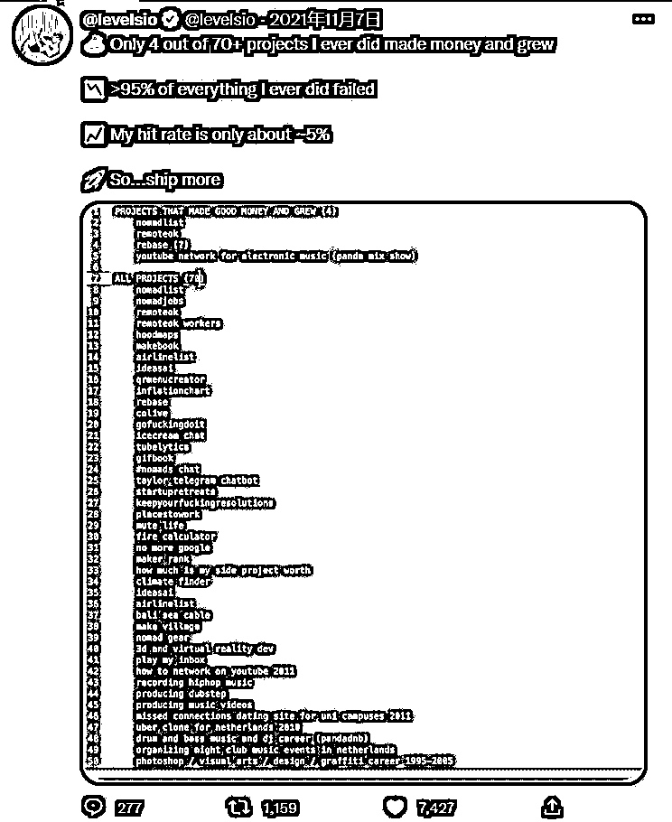
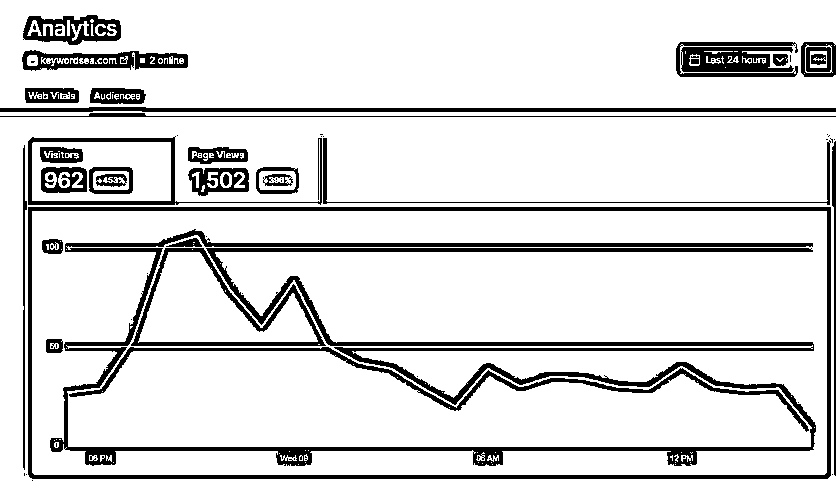
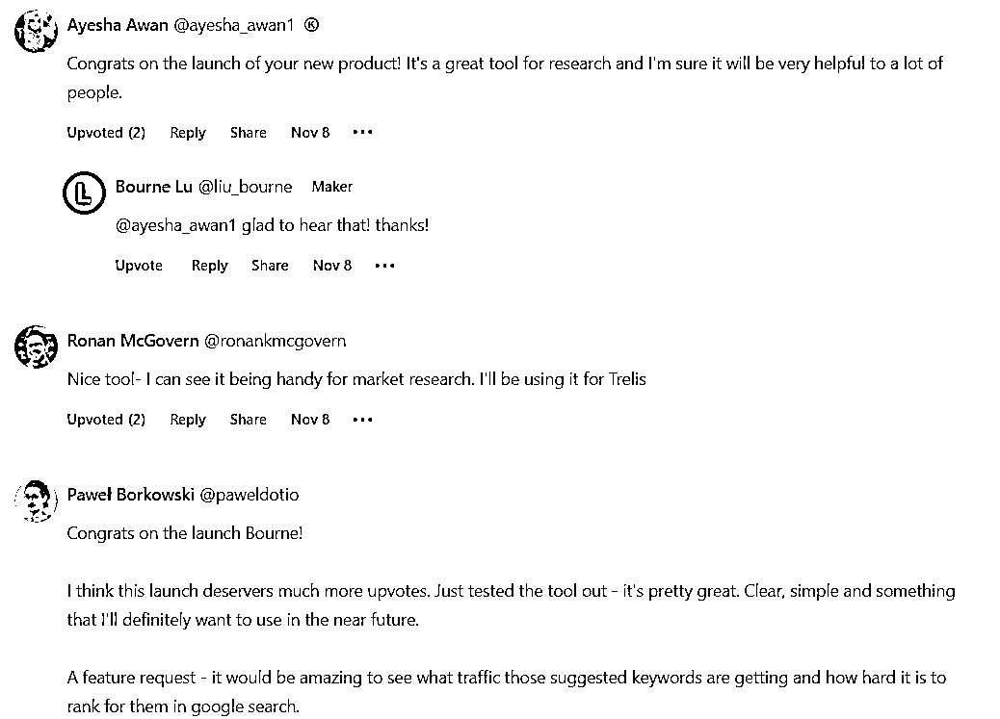
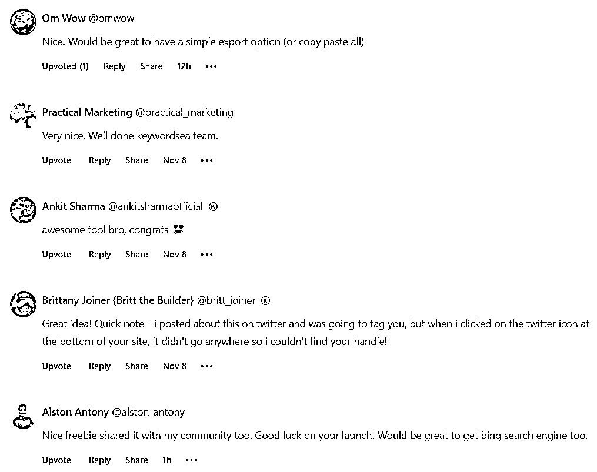
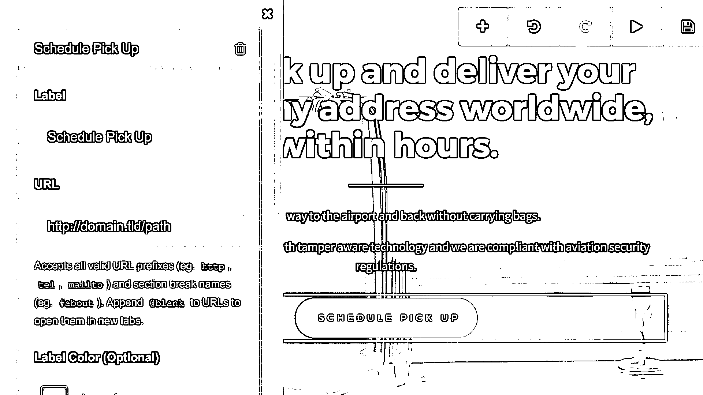
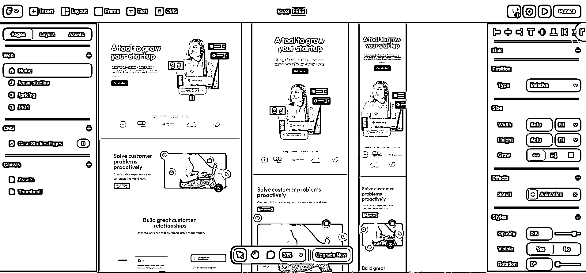
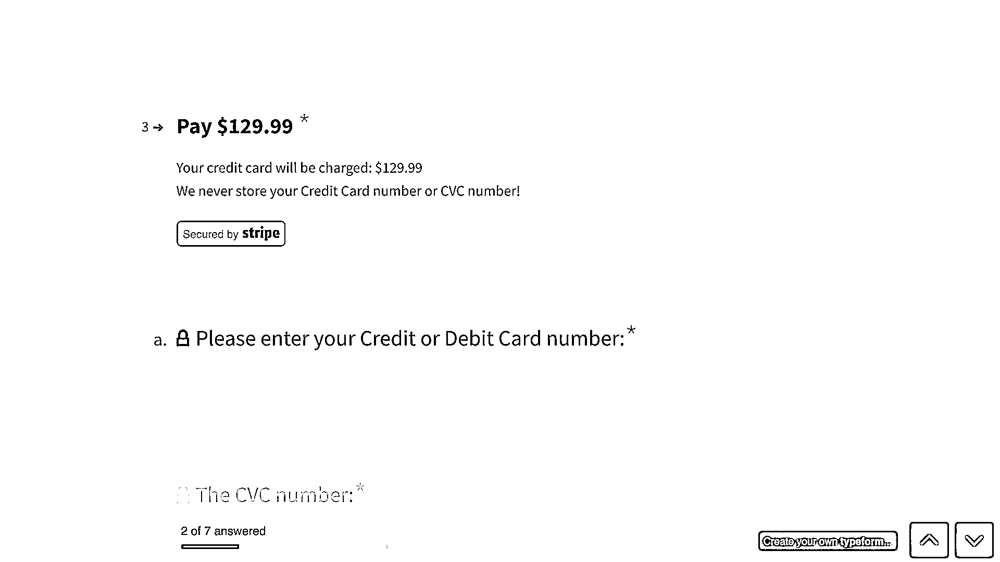
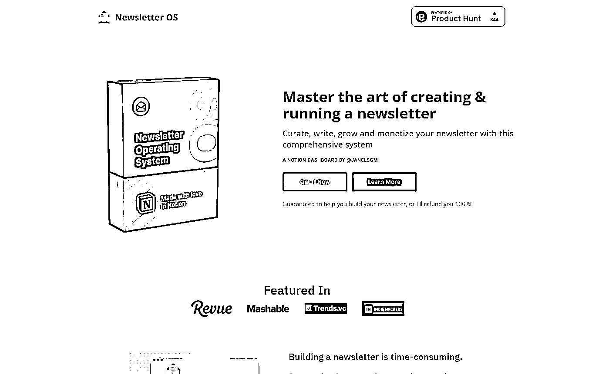
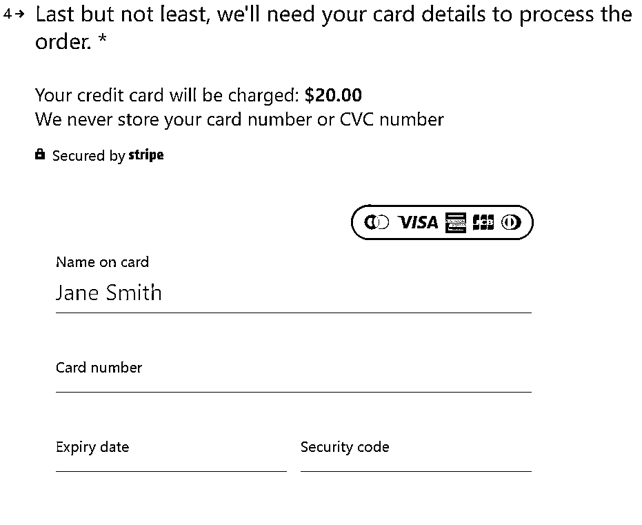
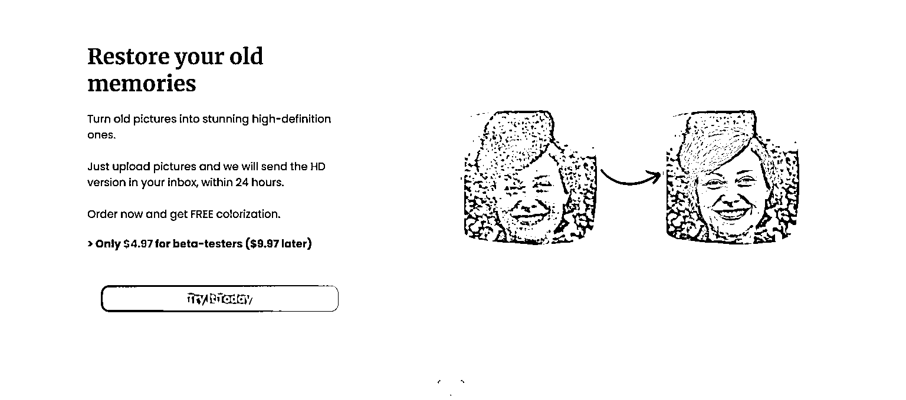

# (精华帖)(216 赞)写给独立开发者：如何快速做出产品 MVP

作者：  刘小排

日期：2023-02-09

这是一篇面向独立开发者的文章，整理自 12 月我在生财有术海外工具小航海里的分享。

两个月前，我在生财有术分享了《如何获得产品 idea》。下一步，就是把 idea 变成 MVP。

今天我们聊聊，如何快速做出 MVP。

一、为什么需要快速做出产品**MVP**？

 

 

因为新产品的失败率太高了。

为了提高整体成功率，我们只能增加数量。  我们只能不断地尝试新的 idea，这是所有创新者共同的宿命。

在这样的比赛中，每年能发布 12 个 MVP 产品的你，比每年只能发布 3 个 MVP 的对手，多了四倍的优势。

著名独立开发者 Peter Levels，在今年 10 月，新发布了一款产品  avatarai.me  。在上线第一天就入账 1 万美元。  上线十天，总共入账 10 万美元。

厉害吧？

他成功的秘诀是什么呢？

是“多”。

在过去十年左右的时间中，他一共做过 70 个产品，其中只有 4 个成功了。成功率只有 5% —— 注意，他是全世界最厉害的独立开发者之一，成功率才仅仅 5%，  何况是我们呢？

 

 

既然这样，那我们最好的选择就是：

1.去做你能想到每一个 idea

 

 

2.用最省事的方式、最快的速度把它做出来，上线。比如：一个周末。

3.上线后，看用户数据。让市场告诉你，你是否应该继续投入。

那么，如何在一个周末就做出产品 MVP 呢？

这就是本文的重点了。

二、产品**MVP**应该是什么形态的？

我的核心思路包括两点：

1.永远从海外网站开始。

2.想清楚需要验证的内容。

先说第 1 点。为什么需要从海外网站开始呢？

因为做海外网站，最快。比做其他形态的产品，要快出很多。

 

 

做 iOS、Android 的 App 很慢。首先，它们编码过程比做网页复杂，编码能力要求也更高；其次，上线还需要打包、提交审核，审核还可能不通过，时间成本很高。  如果你做的是国内 App，那就更慢了，你还需要花 3 个月的时间拿到软件著作权证书，才能够上架国内的应用商店。  更讨厌的是，当你想修复小 bug，你不得不重新发版，用户还得升级安装的 App 才能使用，这会严重拖累你发布 bugfix 的效率。

做国内网站，也很慢，你需要域名备案。域名备案，周期大约是 1~3 周。如果你是在一些要求特别严格的城市比如北京，备案还经常被打回。

做微信小程序，比上面两个略好，但也慢。  它的问题是：微信小程序开源生态不够大，有很多轮子需要我们自己造，难以直接引入开源代码加速我们的编码过程。

做海外网站是最快的。它不需要软件著作权证书、不需要域名备案、不需要应用商店审核、软件有更新的时候用户不需要重新下载 App。代码放到 Github 仓库里，通过 Github Action 做 CI/CD，实现一提交代码就立即自动上线的效果，开发体验倍爽。

需要指出的是，“从网站开始”，不意味着你的产品永远都是一个网站。  只不过 MVP 阶段是网站而已，当你接受到足够多的用户数据反馈之后，你再去为它做微信小程序、iOS App，永远都不迟。

再说第 2 点。关于 MVP 功能的取舍。

如何取舍呢？  提前想好需要验证的内容是什么，然后，只围绕它来做开发。  和它无关的，完全不做。

 

 

如果你想验证 “我发明的某个牛 x 功能，是否有人使用”，那你根本不需要做用户注册、用户登录、用户支付，  只做那个功能就行了。  然后你观察的核心数据应该是“回头客比例”，如果你流量占比中回头客比例不错，说明用户使用它，是因为你的产品真的有用、而不是随便看看。

如果你想验证“我的某个产品，是否有人愿意购买”，那你连功能都不用做。把卖点列出来、放上付款链接（甚至只放一个收集邮箱的输入框也行），然后去买搜索关键词广告，测试付费转化率。  对，你观察的核心数据是付费转化率，当付费转化率大于 30%时，你再考虑把它从 MVP 变成真正的产品。

注：搜索关键词广告，是最精准的广告，所以此处要求的付费转化率门槛特别高。如果流量来自其他渠道，可以放低要求，但也不建议低于 5%。

三、你有案例吗？

有的。

我在机器人创业公司工作，平时挺忙的，基本上是 996，只有周末有点自由时间。  到了周末，我手痒，就从自己的笔记本里翻出一个曾经的 idea，快速实现它。

 

 

实际上，在 9 月的“海外工具小航海”期间，我一共做了两个 MVP，每个耗时都在两天内（周末）。

第一个 MVP 产品，耗时一个周末。记得那是 9 月最后一个周末，做完后就放假了。运气很好，起飞了。我这里暂时不分享细节，因为我打算认真做它，不想过早引入竞争。

第二个产品 MVP，是刚刚发布的，还没完全起飞，但是也许有一点点希望。正好，它的制作过程完全符合本次本文所述的主题，  我决定分享出来。

产品地址：  https://keywordsea.com

产品功能：关键词分析。用户输入一个关键词，我从搜索引擎里抓取数据，告诉用户数百个相关搜索词。

开发时间：11 月 5 日下午 + 11 月 6 日晚上，一共大约 11 小时左右。

上线时间：11 月 8 日。

上线首日数据： 962 名访客。ProductHunt 带来了 200 多的流量，其他 700 多为用户自传播。

 

 

用户反馈：  出乎我意料之外，竟然还不错。甚至有点像水军的评论。  有人还说，想发条 twitter 帮我宣传同时圈我，但是没找到我的 twitter 账号  （当然没有啊，这是 mvp，哈哈哈）。

见下图。

 

 

 

 

 

接下来怎么办：  不怎么办，就放着。  静静地等两周。如果在未来两周，它的自然流量都维持在每日 1000 用户甚至更多，我再考虑认真做它。

成本如此低的 MVP，取得这样的数据和用户反馈，还不错吧？

我是怎么做的呢？

四、如何两天内做出产品**MVP**？

刚才已经讨论过了，要快速做产品 MVP，产品形态需要是一个海外网站的形式。

作为一个海外工具网站产品的 MVP，只有两点是重要的

1\. 界面要漂亮，看上去就很贵很专业。

2.核心的功能，要可用

根据这两点，我们的解决方案呼之欲出。

首先，界面如何漂亮呢？ —— 花钱买个模板！

我买的是这一款  https://tailwindui.com/templates/salient。

 

 

你可以和我刚刚提到的 https://keywordsea.com  对比一下，是不是感觉，一毛一样？

不过，这款挺贵的。我更建议你到 themeforest.net  去看看，选择更多，便宜。一般大约 10 美元到 50 美元不等。

然后，核心功能，如何完成呢？ —— 方法是：只写一个函数！

对，只写一个，这个函数，就是你的主功能。  其他函数一概不写。

任何一个函数，我不太相信一个合格的程序员、在开源社区的帮助下， 8 个小时内写不出来。

比如，你想做一款“下载 Youtube 视频”的工具，  你先定义好输入和输出（输入：URL；输出：

视频文件），然后去 Github 找代码，稍微改一改，  全程不会超过 1 小时。

总结起来，

买模板： 1 小时

买域名：1 小时

写文案：1 小时

改模板：2 小时

 

 

主函数：8 小时 (往往更少)

部署上线：2 小时

两天时间，绰绰有余了。

上线后，把链接发到一些 Startup 社区，比如 Product Hunt。  然后就可以静静地等待数据了。

观察什么数据好呢？  如果是免费产品，请重点关注自然流量的增长，因为它们代表用户在自传播。  自然流量包括：社交网络流量、搜索流量、外链流量。

五、如何半天内做出产品**MVP**？

敏锐的你可能已经注意到，在上述过程中，最消耗时间的是写主函数，其次消耗时间的是前端界面（买模板+改模板），它们占整个 MVP 时间的 70%以上。

如果这两项功能都不做，岂不是可以进一步缩短做 MVP 的时间？

没错，还真可以。

尤其是对于付费产品而言，你完全可以不做主功能。因为你只需要验证“付费意愿”即可。

“验证付费意愿”的最好办法，就是“预售”，AKA“卖空气”！

 

 

具体步骤

1.写产品预售的营销文案，尤其是列出你要解决的问题、你的 3 个卖点。

2.用工具生成 Landing Page。推荐工具 carrd.co、Webflow、Framer，把你的文案填进去 3.用 Typeform 接入 Stripe 支付功能。

4.购买 Google 关键词搜索广告，关注转化率数据。

carrd.co 和 typeform 的产品体验很好，它们具体怎么使用，我就不手把手教了。

在 carrd.co 里制作 landing page 的界面，如图所示

在 Framer 里制作 Landing Page 页面，如图所示

 

 

在 typeform 里添加收款功能的界面，如图所示

再来几个例子。

下面两个产品的 landing page，都是用 carrd.co 生成出来的，不需要写代码。

 

 

而这个链接，是 Typeform + Stripe，实现了“带有支付功能的调查问卷”。同样也不需要写代  码。

把这个链接放到 landing page 上，你的 MVP 就算是完成了，可以开始测试转化率  了。大家可以点开链接，感受一下。

https://template.typeform.com/to/zDzdJ3Me

 

 

六、我做了好几个产品，一直失败，怎么办？

答案是：挺好的，你需要提高失败的速度，然后，继续尝试。

我很喜欢玩德州扑克。

最早的时候，我认为它是个数学游戏，它的获胜诀窍是“计算概率，只在赔率合适的时候下重注”。

 

 

一年后，我发现计算概率只是基础入门，大家都会算，我开始认为它的获胜诀窍是“meta game”。通过察言观色等方式，发现隐秘的线索，从而精准读取对手的牌。

https://www.thepokerbank.com/strategy/psychology/metagame/  再过了两年，我才意识到，它的获胜诀窍是“Mental Game”。  在长时间内保持情绪稳定，才是最重要的。

https://howtoplaypokerinfo.com/poker-mental-game/而要做到情绪稳定，你需要“打无记忆的牌”。

有人因为连续输了几把冤家牌，就变得情绪急躁。还有人以为连续赢了几把，手变得松，不把筹码当成筹码了，这都是业余玩家最常见的错误。

你改变不了已经发生过的事，无论是好是坏。你也改变不了这一次你拿到的手牌，无论是好是坏。我们唯一能决定的，就是把忘记过去，不怨天尤人，把当前这手牌打到最好。

这和做产品的过程是何其相似啊！

有人因为做成功了一些产品，就变得飘了。这很常见 —— 你能说出几个，连续做了多个产品、连续获得多次成功的人的名字呢？不多吧？  就像某些 rapper，还不出名的时候，能写出很好的作品。等他们成名了，换了大房子，就再也写不出来好作品了。

还有人因为连续做失败了一些项目，对自己的评价就变了，甚至还抑郁了。  这也很常见，生财有术里不少圈友就是这样。

他们都没有做到“打无记忆的牌”。

 

 

所以，如果你连续做了好几个产品、好几个项目，都失败了，你应该怎么办呢？  你应该从失败中学习，然后继续尝试，就像 Peter Levels 一样，就像职业德州扑克选手一样。

七、其他建议

别抠门，免费的东西是最贵的，收费的东西是最便宜的。

时间和精力，才是你最宝贵的资源。

我从十年前开始，就每个月强制留出自己收入的 10%，用做“科研经费”，去购买能够提升我生产效率的工具、服务、体验、课程。  你也可以试试，投资自己，是最好的投资。

模板怎么来？ → 花钱，一般的模板才几十美元而已。  我买了 Tailwind 官方的模板，也才 299 美元。买一个漂亮的模板，不仅能够提升你产品的颜值和用户体验，还可以为你节省数十小时的时间。  程序员是国内平均薪资最高的行业，算算看你自己的时薪， 50 美元省 50 小时，不香吗？

Typeform 要 29 美元，有没有免费的？ → 有，但是不如 Typeform 好用。  建议你用最好用的。

我们正在研究的话题是“如何快速做出产品 MVP”，而不是“如何最省钱(但是降低品质、降低效率)做出 MVP”。

 

 

Stripe 账号怎么来？→ 花钱，使用 Stripe 官方的服务 Stripe Atlas，注册美国公司，才 500 美元。

如果你决心要做海外工具，这 500 美元很可能是你最划算的投资之一，可以在未来很多年持续为你节省关于海外收款的时间和精力。

八、其他案例分享

Making an app in 3h and getting the first sale! – Jeannen 一个外国小伙子，3 小时做出了 MVP，然后当天就获得了付费客户。

他的思路，和我们上面讨论的内容，如出一辙。而他的产品功能，是生财有术很多人都熟悉的——老照片上色。

 

 

欢迎与我交流。

评论区：

三林 : 常读常新，感谢小排老师分享

Nommy : 小排老师，理论指导实践，很棒

BigSmile : 常读常新，多用多学习，感谢小排老师

vice : 感谢分享，请问您除了在 Product hunt ，还有在哪里推广呢，GP 上了几个应用，一点自然流量都没有

刘小排 : 流量是另外的话题了，几句话讲不完，以后再分享。  如果非要一句话讲完，那就是：花钱买流量，是最便宜也最精准的流量。

聪聪 8.0@益生菌 : 厉害，刘先生方便价格好友吗

刘小排 : liuxiaopai

阿黎 : 这篇帖子的思路，让我受启发了，谢谢！

1、对于我卖课，卖服务，我也不需要完全做出来，先根据 IDEA 做几个海报测试付费意愿

2、你需要“打无记忆的牌”——不以物喜不以己悲，平常心，专注当下

3、每个月强制留出“科研经费”，去购买能够提升我生产效率的工具、服务、体验、课程——这个定向定量的探索思路，对我帮助很大，感谢！
