# (精华帖)(293 赞)电子书产品变现百万 + 的完整经历复盘

 

 

作者：  胡不归

日期：2023-02-10

赚钱有多种，我简单分了两类。

手停口停型，搞的时候可能一天上千上万，一旦停下来就收入大降甚至归零，比如主业工资。

睡后收入型，一次集中投入（培育一头现金奶牛），即便放着不管也可以带来长久的收益，比如出版一本书，或者上架几款 iOS APP。

2015 年移动互联网正在爆发期，公司业务从 PC 全面转向移动。在给公司注册企业 iOS 开发者账号时，出于探索和测试自己也顺便搞了一个个人账号。

快速看了一遍简单教程（方便工作中跟工程师沟通），觉得做个 APP 好像也并不复杂。

说干就干，在一个周末捣鼓出了第一个 APP “XX 图集”。

起初一周仅靠自然搜索流量每天都有一百来个下载，在把免费下载切换成 6 元付费下载后（只需在苹果后台点几下鼠标），每天仍然有 5-10 个，由此跑通从 0 到 1 的过程。

而 iOS APP 70%的用户都来源于搜索，只要能满足需求自然流量是很丰富的，加上付费机制完整，不依赖于个人服务器，于是在知道电子书网站变现可观的信息后，做了 60+电子书 APP 矩阵，完成了我从 1 到 N 的积累过程（睡后收入够养家糊口的状态）。

今天跟大伙儿聊聊我通过 iOS APP 赚到百万+睡后收入的一段经历，希望对各位能有所启发  💡

 

 

我是胡不归，生财首期圈友，从业十多年的前互联网产品和运营负责人。

数月前从北京来到苏州，目前是一枚“在家待业”的全职奶爸，欢迎各位大佬来撩 :)文章略长，脉络如下：

**1. ** 为什么选睡后收入型的副业？

**2. ** iOS APP 入坑，以及从 0 到 1 的过程

**3. ** 从 1 到 N 的体力活

**4. ** 原来还可以从 N 到 N*N？

**5. ** 一夜间从 N 归零

**6. ** 一些复盘和反思

**7. ** 目前还有没有机会？

**8. ** Q&A

老规矩先上图，这是其中一个 admob 广告账户，每月 23 日左右发放收益，至今累计已有 9 万多美刀。苹果付费下载和内购收入是每月 25 日到账，再加上主业工资基本每个月领三次薪水  😀。

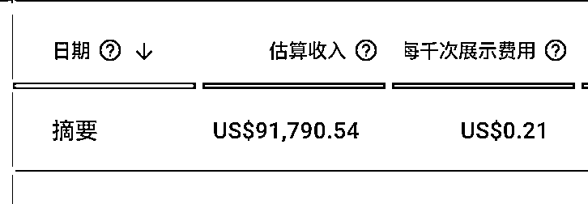

 

 

**1.为什么选睡后收入型的副业？**

赚钱有多种，简单分两类。

（1）手停口停型，搞的时候可能一天上千上万，一旦停下来就收入大降甚至归零，比如主业工资。

（2）睡后收入型，一次集中投入（培育一头现金奶牛），即便放着不管也可以带来长久的收益，比如出版一本书，或者上架几款 iOS APP。

 

 

我此前是一家创业公司创始成员，初期 9116 是家常便饭，跟老婆领证前一晚还加班到凌晨两点。平常没时间折腾，只在周末能有几个小时搞搞副业，非常适合睡后收入型。

另外最初也没想着赚大钱，主要是想在主业之外多个技能傍身，也多个收入来源缓解焦虑（互联网从业者懂的都懂  😂），一来二去就入了 iOS APP 的坑。

**2.为什么是 iOS APP？以及从 0 到 1**

2015 年移动互联网正在爆发期，公司业务从 PC 全面转向移动。在给公司注册企业 iOS 开发者账号时，出于探索和测试自己也顺便搞了一个个人账号。

快速看了一遍简单教程（方便工作中跟工程师沟通），觉得做个 APP 好像也并不复杂。

 

 

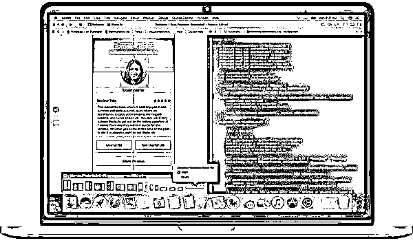

iOS 的开发工具是 Xcode，有不少“所见即所得”的模块，拖拖拽拽不用写代码也能做出简单功能。

说干就干，在一个周末捣鼓出了第一个 APP “XX 图集”。功能极其简单，把某个领域的图片收集起来，分门别类一张张拖到 Xcode 里，起个好听的名字，列出 100 个字的关键词，按流程打包发布，居然很快就通过审核上架了。

起初一周仅靠自然搜索流量每天都有一百来个下载，在把免费下载切换成 6 元付费下载后（只需在苹果后台点几下鼠标），每天仍然有 5-10 个。着实小兴奋了几天，有种当年做个人网站收到第一笔广告费的感觉  😀

**iOS APP**有几点关键优势：

**1.  70%**的用户下载来源于搜索， 自然流量丰富。

**1. ** 自带两套简单且完整的变现机制：付费下载、免费下载后在应用内再付费。

 

 

**1.  APP**可以 不依赖个人服务器，所有资源全部打包上传给苹果做下载分发，免费、稳定、不限量。

**3.从 1 到 N 的过程**

初尝甜头之后，开始每个周末都花半天时间去咖啡馆重复这套流程：

**1. ** 搜集图片资料

**2. ** 把图片拖到**Xcode**里生成**APP**

**3. ** 制作**APP**图标（比较简朴，有些甚至就是**XX**图集几个大字）

**4. ** 参照其它**APP**起名字和编写关键词

**5. ** 打包上传等待苹果审核

**6. ** 把免费下载改为付费下载

 

 

几个月枯燥的重复，我手上有了十几个各种图集 APP。每月睡后收入也来到了 2000 左右，刚够每日早餐和通勤费用。

期间遇到的问题：

**1. ** 苹果审核不通过，应用过于简单或者判定抄袭

**2. ** 没有下载量，每天个位数下载甚至每周个位数

**3. ** 免费时有人下载，转付费后归零

**4. ** 资源和灵感枯竭，简单好做的好像已经全搞完了

似乎刚起步就到了瓶颈期。

有一天跟朋友闲聊，提到一个电子书网站收入还不错，但是被举报丢了网站备案。

 

 

说者无心听者有意，这可能又是一个从 PC 到移动的机会，毕竟彼时 APP 还没有备案一说。

16 年前后，App Store 上的免费电子书 APP 已经是一抓一大把。

先做了个简单调研，得到的声音都说电子书已经没搞头了，cocoachina 论坛（曾经的老牌 iOS 开发者论坛）里也没人看好这个领域。原因无非有二：竞争已经饱和，版权风险日益升高。

我不认同的原因有三

**1. ** 竞争激烈只是表象，**app**数量虽多但还 远没有到饱和的程度。尤其已有的**APP**质量大多不高，且内容相对陈旧。

 

 

**1. ** 电子书**APP**一抓一大把，恰恰说明版权仍处于灰色地带， 风险仍然可控。

**1. ** 大部分人一致认同的观点，往往都是错的。

想明白了那就继续搞，电子书 APP 的开发难度可不像简单的图片拼凑，已经远超我的开发能力。

还没赚钱就找外包开发显然不明智，这时候了解到一个神奇的网站  github.com，全球开发者的源码分享平台。

在平台上搜到一套可以加载 epub 电子书的源码，开发者的使用说明写的非常详细完整，按照说明将源码顺利编译打包成功！

问题来了

 

 

源码开发者貌似是巴西人，只适配了英文和一些小语种，把中文 epub 电子书文件拖进去后经常会报错和程序崩溃（中文 epub 文件在制作时很多并没有按行业规范）。

通过邮箱找到开发者，当然先是赞扬这套源码超级无敌好用，顺便提出中文适配的小问题，再发几套有问题的中文版 epub 文件供他调试，最后通过 paypal 转账 20 美金以示鼓励。

巴西小哥估计很少被打赏，这一套流程下来那是相当热情，不到一个礼拜就解决了适配问题（这些年在业务中合作过的程序员有大几十个，这么热情主动的真不多见）。

更重要的是跟开发者建立了沟通渠道，相当于几乎免费获得了一个技术合伙人。当然后来有了收入，又陆续转了更多美金作为感谢，真诚的。

接下来的事情就简单了，把 XX 图集的模式搬到电子书 APP 上，并且做了升级迭代。

电子书需求挖掘

一类是经典图书，诸如世界名著系列、鲁迅文集等，特点是热度一般但需求稳定，作为整个 APP 矩阵的基本盘。

另一类是跟随和预判热点趋势，典型的是热播影视剧原著小说系列，盗墓笔记、亲爱的翻译官诸如此类。各大平台和电视台都有年度播出计划表，可以据此进行精确计划，提前一两个月布局上架 APP。

 

 

特点是开播时的下载量会暴涨，播完后会逐渐归于平静，大概留有半年的长尾期另外，这类型的竞品 app 也会多一些，不过大多都在热播后才上架。

由于提前布局抢得先发优势，我的 APP 在热门影视剧的搜索结果前五名里，基本都能占有一席之地。

**1. ** APP 打包发布

APP 名称依然简单粗暴，“XX 原著小说”。APP 图标做了几套固定模板，如纯色背景+“XX 原著”字样、角色海报+“原著”两字、书籍图标加上书名文字等。

一个 APP 只打包一本电子书，大概率不会过审，可以多放几本书进来做成一个系列。如言情系列、武侠系列，一方面更易过审，另外也能提高用户的打开频次和活跃度。

APP 的 UI 设计也搞了几套不同的风格，基本都是用创客贴(chuangkit.com)和阿里的设计图标库(iconfont.cn)做简单堆砌。

作为内容核心的 epub 电子书文件，早期在百度上搜索到的文件质量参差不齐，有些版本满篇错别字还自带广告。后期基本泡在几个电子书论坛和通过淘宝付费购买，拿到了不少第一手精校版的 epub 文件。

**1. ** APP 矩阵互推

经过一段时间折腾，开发者账号下有了 60+成功上架的电子书 APP。这些 APP 用户的调性相同，都是爱阅读的好孩子。

 

 

终于在一个国庆长假，下定决心把大部分流量还不错的 APP 集中做了一次发版更新（纯纯的体力活）。统一悄悄加入了一个互推模块，让下载了 A 应用的用户，还可以下载到 B、C、D...应用，形成一个小小的闭环。

悄悄，是因为苹果官方其实并不允许把 APP 推荐作为功能，但管理并不严格。

另外你也能发现，直到这时候我仍然没有搞自己的服务器，所有 APP 全部都是静态本地的，美其名曰“支持离线功能”，但是想更新任何一个小功能甚至是改一个字都必须重新打包发布。

直到后来看到了友盟 umeng.com 的在线参数功能，相当于不用发版就可以在线热更新，捣鼓了一阵后就派上了用场。

之后在每个新 APP 上架完成时，通过设置在线参数让矩阵里的所有 APP 都推荐这个新 APP，相当于 0 成本就完成了新 APP 的冷启动，效果非常好。

**1. ** 引入广告变现和内购模式

 

 

通过付费下载的方式来变现电子书 APP，经验证此路不通，且版权风险最高，相当于直接交易。

接入了 google admob 的广告平台（同样的，接入说明写的非常详细，有中文技术人员支持，早期可直接访问目前需梯子），用户阅读时会在 APP 里显示横幅广告，每次点击都有收益。

在用户阅读累计 XX 页或者累计阅读 XX 分钟时，也可以直接弹窗插页广告，顺带温馨提醒用户注意休息，广告变现的路径很流畅。

目前 admob 仍是为数不多的接受个人开发者的广告平台，国内广点通等大平台都需要企业资质。

对于高质量用户，通过苹果的内购功能，提供 6 元、12 元永久去广告功能。内购功能也是 github 上的一套现成源码，自己只要复制粘贴几行代码就能搞定。

 

 

广告收入和内购收入比例大致在 2：1。期间很明显能看到，选择内购去广告的用户比例在逐渐增加，说明用户为内容付费的习惯也在逐渐养成。

与此同时每月的睡后收入也迈过了 10000、20000... ...，养家糊口靠副业基本足够，主业工资可以直接攒起来啦。

**4.从 N 到 N*N？**

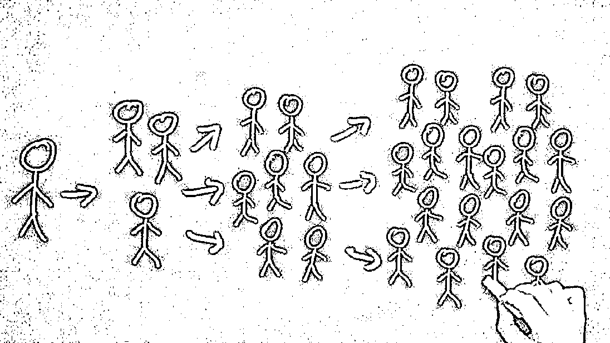

APP 矩阵规模上来后，开始感到了来自竞争者的压力。

一个 APP 爆火，一周之内肯定会有竞品模仿跟进。

 

 

正常竞争倒无所谓，有一些是对我的 APP 直接破解，原封不动拿走其中的 epub 文件包（iOS 资源包几分钟就可以被破解），甚至连 UI 设计资源都照搬（这么渣也抄...）应对措施

**1. ** 多注册几个开发者账号，同一套内容微调后打包成不同的**APP**，自己和自己竞争。既覆盖了更多的关键词，也营造出竞争已经饱和的氛围。

**1. ** 使用**calibre**工具，对上千个**epub**文件进行批量二次编辑，一方面打上水印减少被搬运风险，另外也是重新规范**epub**文件格式，提高用户体验降低崩溃频率（电脑：活久见啊**... **跑**calibre**也能连续跑十几个小时）。

**1. ** 对恶意抄袭太过分的竞对进行投诉反击，有一些效果但不明显，但埋下了巨大的隐患。

完成 N*N 后，副业进入了大约两年的平稳期，每月只要花几个小时，收入也能基本维持在 3 万~5 万。

主业虽然依旧艰辛，但由于有了这笔副业收入，心理上倒也没有太大负担和焦虑。

在此期间经历了孩子出生、公司险被收购、受 Google 邀请去中关村总部做客、有人上门谈收购、有知名媒体想要采访（当然是拒绝了）、自己也生了场病做了个不大不小的手术。

周末仍然会去咖啡馆里坐一坐，一番操作之后顺利成为了该咖啡馆的资深会员（嗯？） 

 

最终手上沉淀下来 3 个开发者账号和 1 个备用账号，矩阵内同时在线的 APP 数量也超过了 200 个，每天纯自然流量下载 5000+，累计下载量 500 万+，日活用户 2 万+，日启动次数 20 万+，这个数据超过了一些互联网公司的用户规模。

几件趣事

**1. ** 作为马甲备胎的**APP**设计包装和关键词设置上通常不太走心，只要能上架就可，但经常会出现下载量比主账号还高的情况，世界果然是量子的，充满了不

确定性。

**1. ** 由于提前布局和闭环互推，常会出现某个热门关键词的搜索结果前**5**名中，有**3**个都落在我的矩阵里。

**1. ** 每位用户有一次机会，只要给应用五星好评就能免除一段时间广告，借此积攒了大量好评。但其实**iOS**根本追踪不到用户的评价行为，点按钮跳到评价页后直接关掉甚至给差评效果也一样。

**1.  “**吞鲲**”**广告大伙还有印象么，这个团队投了巨额营销费用做推广，好巧不巧跟我一个**APP**关键词撞车，结果那个**APP**单天下载量直接坐火箭破万，一天收入暴涨几千。当时我正在公司带一个项目，这笔不义之财全被拿来发了团队红包****

😅。

**1. ** 用**admob**平台收到的是美金，相当于为国家赚外汇，大额结汇后经常接到银行监管的盘问电话。每人每年有**5**万刀的外汇额度，后来用家人身份又多开了几个广告账户。

**5.一夜间从 N 归零**

 

 

、

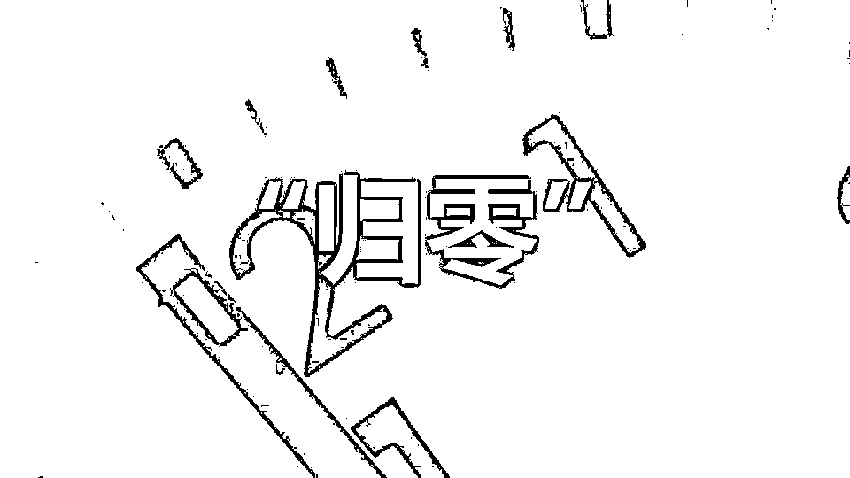

前面提到我发起的竞对投诉，没想到结果竟是掀起了一场战争，为我国的版权合规化事业做出了突出贡献  😂。

此前但凡收到版权方反馈，无论多火爆我都会直接下架 APP，一方面规避风险，另外也算是互联网人的基本操守。

但混战开始之后，似乎人人都成了版权方，一个月收到几十封侵权投诉，真假难辨。

混战开始

混战始于一些玩家的无差别砸盘，各种阴招损招让人大开眼界。

诸如注册大量苹果小号投诉侵权、恶意刷差评、恶意给我刷量然后举报、付费后秒申请退款、伪造官方邮箱给苹果发函投诉（比如阅文集团 yuewen@vip.XX.COM）、伪造律师函（照搬网上模板）、伪造版权证明、伪造身份引战嫁祸给其它开发者...

 

 

作为十几年的互联网老 boy，我也一时没把持住火力全开加入战斗，导弹核弹一起招呼...过程就不表了，结果是惊动了苹果官方和一些大版权方，在 18 年底 19 年初，App Store 大量电子书 APP 集体消失不见，我的主力开发者账号和 200 多个 APP 也在一夜间被彻底封禁下架，并且 X 年内不得申请开发者账号，睡后收入大跌 90%。

福兮祸所依，祸兮福所伏，混战结束后不久看到一则新闻。

有位开发者因开办电子书网站涉嫌侵权被正式起诉且实刑判决，这在我国司法实践中是很罕见的，毕竟互联网有避风港原则，某度文库都大摇大摆的存活且商业化了这么多年。

APP 相对于网站来说还是新事物，对新事物的司法实践一般都会谨慎且滞后，但显然也是给掘金者们敲响了警钟。

**6.复盘和反思**

 

 

**1. ** 反思 1：风控能力就是止损能力

虽然搭建了多账号矩阵，但没有对高低风险 APP 进行分开管理。

诸如 XX 图集、世界名著等的风险并不高，作为基本盘每月也能贡献 30%+的收入。但是随着账号整体被端，这部分收入也随之东去，甚是可惜。

**1. ** 反思 2：选对竞争对手

不要跟没有下限的对手去拼下限。

不要贪一时之快，能跟对手做朋友者，可拜上将军。

**1. ** 反思 3：私域运营要有执行力

 

 

从 16 年起私域运营的概念已经逐渐成熟和体系化，在企业微信全面替代 wetool 之后更是迎来了合规经营的爆发期。

虽然在公司里我也带着小朋友们搭建私域，但始终把自己搞的 APP 矩阵当做一个小副业，从心底没有打算投入更多的资源和精力。

否则日活 2 万+的垂类读书群体如果沉淀到微信，将是一个非常可观的数字，也将给变现带来更多的想象空间。于后来涌现出来的书单号而言，简直就是出生在罗马。

**1. ** 反思 4：该退出时就退出

其实在完成 N*N 打造后，我的个人能力和精力就已经陷入了严重瓶颈。在 APP 打磨、变现效率、用户运营上都暴露了明显不足。比如大部分 APP，直到下架时都还没有顾上配置 push 推送这个最基本的运营功能。

期间也有做流量生意的团队主动找上门来，显然对我的模式是做过仔细研究的，出价百万想买断这套 APP 矩阵，当时觉得交接过程太麻烦会影响工作也没认真搭理（实话）。

现在想来买家其实很可能就是某个竞争对手，买断止战其实不失为一条双赢的良策。

我工作的行业是互联网出境旅游，从 BAT 出来后一直在这家公司，和一群志同道合的伙伴一起做了很多年，一度能瞥见 IPO 的曙光。期间自己也婉拒过各路猎头邀约，确实是当成了事业在做。

随着口罩的到来，转瞬之间整个行业都消失了。手上据说价值八位数的期权股份也随之东去，一朝梦醒。

 

 

**7.现在还有没有机会？以及简单的开局思路探讨**

**iOS APP**现在还有搞头么？

在我看来当然有，并且竞争烈度可能只有 X 宝、X 音、XX 号的十分之一，尚有不少蓝海等待挖掘。

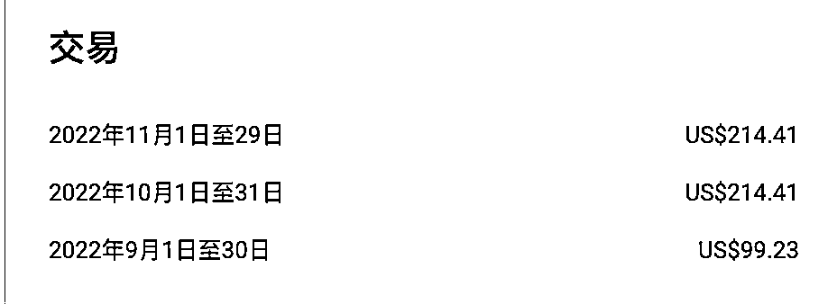

之前的老照片修复项目不少朋友应该还有印象。当时凑热闹跟朋友一起做了个 APP，至今两年没有更新维护，每月仍然有大几百的收入。

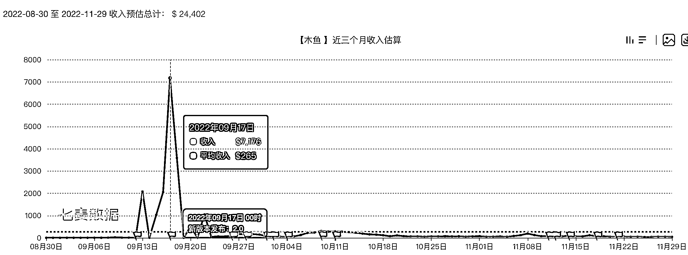

 

 

再看看前一阵突然爆火的电子木鱼 APP，最高的一天躺赚五万块。目前每天依然能稳稳纯收入 500+，这还仅计算了内购的部分。

你至少需要拥有一台苹果手机和苹果电脑才能成为开发者，且需要能把 APP 搞上架才有可能赚钱，这些都是天然门槛，保证了竞争者不会太多。有句话说的好，你遇到的所有困难都将成为竞争者的门槛，而没有门槛的事情都不长久。

一套简单的开局思路探讨

【发现需求】

**H5**

最近刷抖音的时候刷到几个做道家知识的小 V，数据还不错。在百度指数

index.baidu.com 上搜索道教、道家、道德经、道藏等关键词，发现近几年的搜索需求很稳定且有上涨趋势。

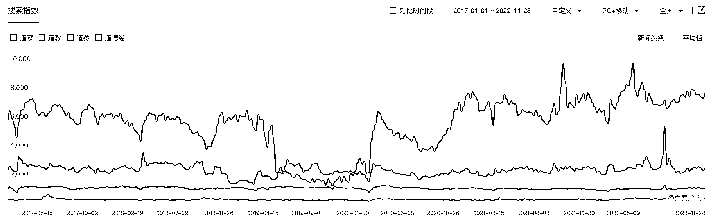

【分析市场和竞品】

**H5**

验证需求后，在七麦数据  qimai.cn  上看看市场情况。

 

 

以“道藏”这个词为例，搜索指数为 4601 说明至少有用户会进行日常搜索。

搜索结果排名第一的是《诸夏道家古籍》，作者是个人开发者，APP 在图书类免费榜排名能进前 500，预估每日下载为 100~200，上架 6 个月当前评分为 1 颗星。

当然也可拓展关键词进行分析，如“炁体源流”、“道德真经”、“三洞真经”等，分析越充分成功率越高。

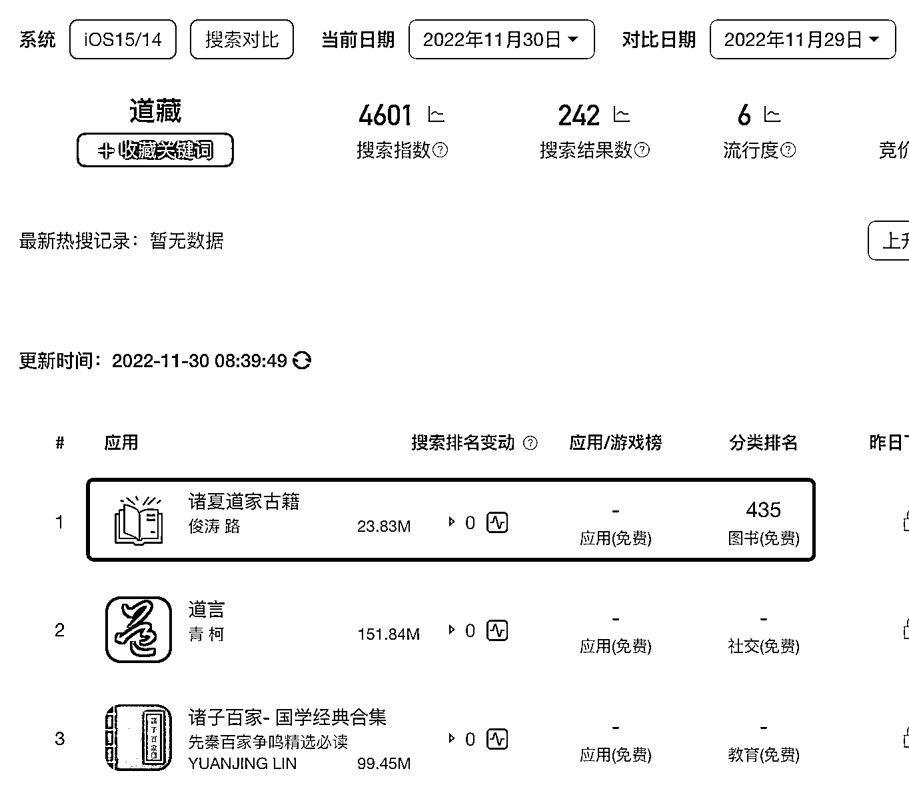

 

 

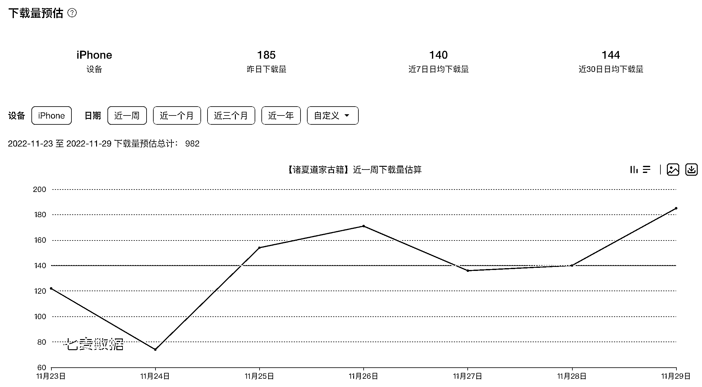

把相关且有下载量的 APP 从 Appstore 下载把玩一番。以《诸夏道家古籍》为例，发现十分简陋粗糙。左侧导航条点击无反应，正文的翻译按钮点击后报错，确实只值一颗星。

**1. ** 衡量自己的开发能力（包括个人开发能力、资料搜集整合能力、从**github**上拷贝代码的能力、寻找技术合伙人的能力等），感觉能比他做的更好。

 

 

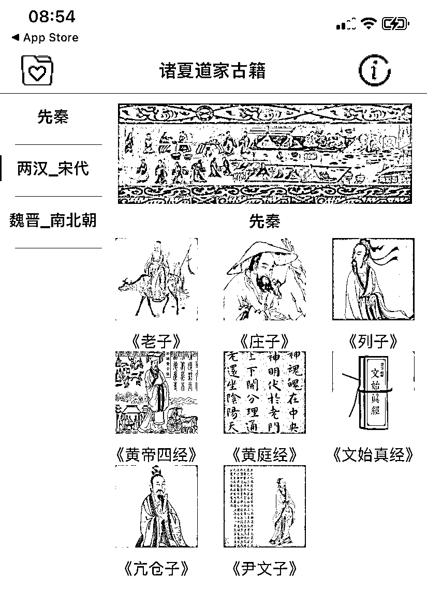

 

 

**  **【搜集资料制作**APP**】

**H5**

根据源码支持的文件类型，在百度（淘宝效率更高）上搜索“道藏 epub”、“道藏 pdf”、“道藏 txt”，下载对应格式的内容文件生成 APP。

epub 源码参考：https://github.com/FolioReader/FolioReaderKitpdf 源码参考：https://github.com/Alua-Kinzhebayeva/iOS-PDF-Readertxt 源码参考：https://github.com/coyingcat/TxtReader 注：每吃透一套源码，就相当于多开辟了一条赛道。

【**APP**发布上架】

**H5**

你需要准备 APP 的名称（建议 23 字以内）、副标题（建议 15 字以内）、APP 搜索关键词（100 个字），这三项是搜索自然流量的主要来源，可参考市场同类 APP 进行调整优化。

此外需要准备 APP 的图标（可用图怪兽或者 PS 简单制作）、APP 的展示视频或截图（Xcode 开发工具自带模拟器，可直接录屏和截图）、APP 的介绍描述，这三项决定用户在搜索之后，是否会下载你的 APP。

按流程提交上架审核后，新手往往会遇到一些问题，善用网络搜索，逐一解决击破即可。

 

 

APP 上架常见问题：https://blog.csdn.net/suifengpiaoluo/article/details/124847124**  **【流量优化】

**H5**

诸如此类蓝海小众 APP，除非遇到热点，否则日均下载量基本在几十到几百。但是用户群精准，遇到能满足刚需的功能时付费意愿也更强。

除了继续优化标题、副标题、关键词、APP 截图、APP 描述之外，还可以有意识的引导用户给 APP 进行好评。如果手上有现成资源，也可以利用已有流量对 APP 进行冷启动，比如下载 APP 并截图，返现返积分等。

更复杂的玩法涉及刷评、刷榜、刷购买量等操作，对于 ARPU 值未经验证的 APP 不建议使用。

【商业化变现】

最简单：直接设置付费 X 元才能下载。用户没有试错机会，适用于刚需且小众的 APP 类型。

付费下载 APP 排行榜可参见：

https://www.qimai.cn/rank/index/brand/paid/device/iphone/country/cn/genre/5000 

 

最普适：接入谷歌旗下的 admob 广告（apps.admob.com），无需企业资质，每月汇入美金（最低 100 美金起付），支持横幅、插页、开屏、激励等广告类型。变现效率尚可，接入文档详细，有技术人员支持。

多维度：有一些偏高端的用户付费习惯已经养成，不喜欢看广告，喜欢简单粗暴的拥有全功能。

考虑接入苹果的内购功能组件（iAP in-APP-Purchase)，允许用户在应用内购买以免除广告或解锁功能。如免费阅读时常驻显示横幅广告，且每 10 页弹出一次插页广告，且用户只能免费阅读前 100 页等，付费后可解除以上限制。

内购功能可以单独使用，也可跟广告搭配使用。

更大的变现空间：把 APP 矩阵作为精准用户的引流途径，沉淀到私域进行长期转化。据说（未证实），运营还不错的道家知识 V 信号，平均每一位好友年变现能力超过 200 元，且毛利率 80%以上。

**8.你可能还想了解的问题**

 

 

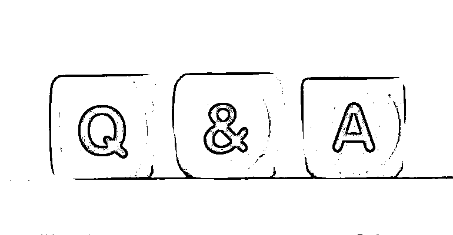

**Q**：搞**iOS APP**必须是程序员么？

A：否，我自己也不是程序员，但至少要完整的看一遍 iOS 开发教程，同时有快速学习和解决问题的能力。反而很多程序员并不适合做。

我接触过不少程序员，太过专注于代码或者眼高手低，编程上的优势往往弥补不了在需求洞察和营销推广上的短板。当然你也可以找个程序员当技术合伙人，各取所长赚钱了一起分。

**Q**：电子书**APP**还能做么？

A：目前依然有在做的。一部分是经典图书如世界名著系列，流量很稳不过竞争趋于饱和，做的话需要有差异化。另外也有愿意承担风险赚超额收益的，比如披着各种马甲的笔趣阁 APP。

**Q**：哪些类目的**APP**可以搞？

A：发挥你的想象，多用七麦网站（qimai.cn）看看市场情况。在各大平台火热的内容，问问自己在未来几年内是否会有用户持续搜索。

 

 

比如最近大家在聊的行业资料库、中医养生知识、世界货币知识... 电子木鱼火了之后，我们看到同一个开发者又接着搞了电子转经筒、赛博佛珠等，功能都极其简单，流量也还不错。

 

 

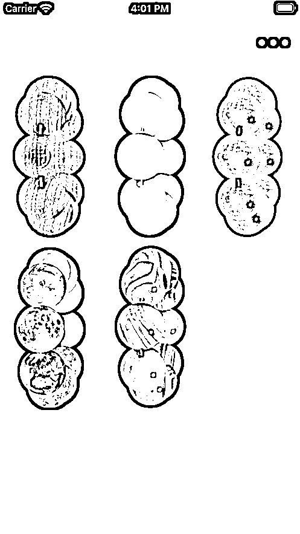

 

 

 

 

 

 

 

 

 

 

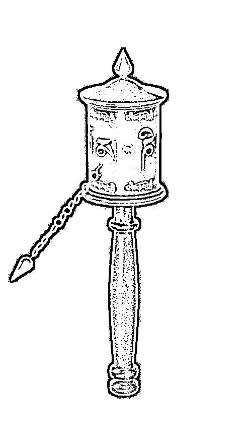

**Q**：为啥不搞安卓，只做**iOS**？

A：我的精力实在有限只做了 iOS，安卓用户体量更大，确实可能大有可为。

不过有几点要注意：安卓自然搜索下载的比例远低于 iOS、安卓上架前需要注册申请软著权、需要自己搞定资金账户和开发内购功能、admob 在国内安卓基本不可用需要有企业资质来对接广点通等广告平台。

同样的，如果你能解决这些问题，这些都将成为你的竞争壁垒，安卓当然可以搞啦。

**Q**：为啥不搞小程序要搞**APP**？

A：站在公司角度我也常说，不要 APP 要搞小程序，因为私域运营已被验证有巨大价值。

但从个人副业来看，综合衡量运营能力、竞争烈度、审核推荐机制、商业变现的路径... 小程序和 APP 各有所长，并非是同一个赛道。至少小程序总包大小不能超过 20M 就已经限制了很多奇思妙想，当然如果有成功案例也欢迎分享探讨  😀

以上，一点点过往的经验分享，希望对大伙能有一丝丝启发  💡

我是胡不归，身居苏州的一枚 85 后全职奶爸，欢迎各位大佬来撩，以及推荐工作。

评论区：

 

 

肖江波 : 快速看了一遍简单教程，感觉也不是很难[心碎][心碎][心碎] Summer : 几年之前我们干过这行，刷榜撸广告费，同行内卷太残忍相互恶意点击更是家常便饭，一天几十万广告费撸的心惊胆战的

苏玲 : 认真看完，花了整整一个小时[强]感谢分享

亦仁 : 感谢分享，已加精华。

时兴淘太狼 : 思路打开了，感谢

陈真 : 脑子：这个我也会，

手：这都什么玩意，这么难？

代码君 : iOS 最难的不是项目，是上架，经常被拒，不然光卖马甲包就年入百万  乔 : 安卓的也能做吗？
