# (104 赞)小程序流量主高效变现，你不得不知的七大招

作者：  三林

日期：2021-05-14

大家好，我叫陈康，也可以叫我三林，互联网产品人，关注直播短视频、内容电商，互联网广告等。今天和大家分享下，我对微信流量主广告产品的一些经验和研究。希望有助于少踩坑，多赚钱。在咱们生财有术，不只是聊怎么赚，也要聊如何赚更多。

是这样的，我经历过一个流量黑天鹅事件：单日小程序流量主收益超 3 万，但又感觉亏了 20 万……曾经所经手的一个微信小程序在短视频渠道单日新增了数十万用户的访问，彼时小程序仅是做配套产品，并未直接商业化，流量主也没接入进来。想着今天流量很大，且有持续火热的状态，于是急急忙忙的临时增加流量主广告组件，次日出报表时，好家伙！仅仅放了 1 个插屏广告、1 个 Banner 广告，就获得了单小程序单日超过 3 万元的收益。如果以现在的角度去看，通过更合理的配置广告和内部优化，完全可做到** 10 **倍的提升。

 

 

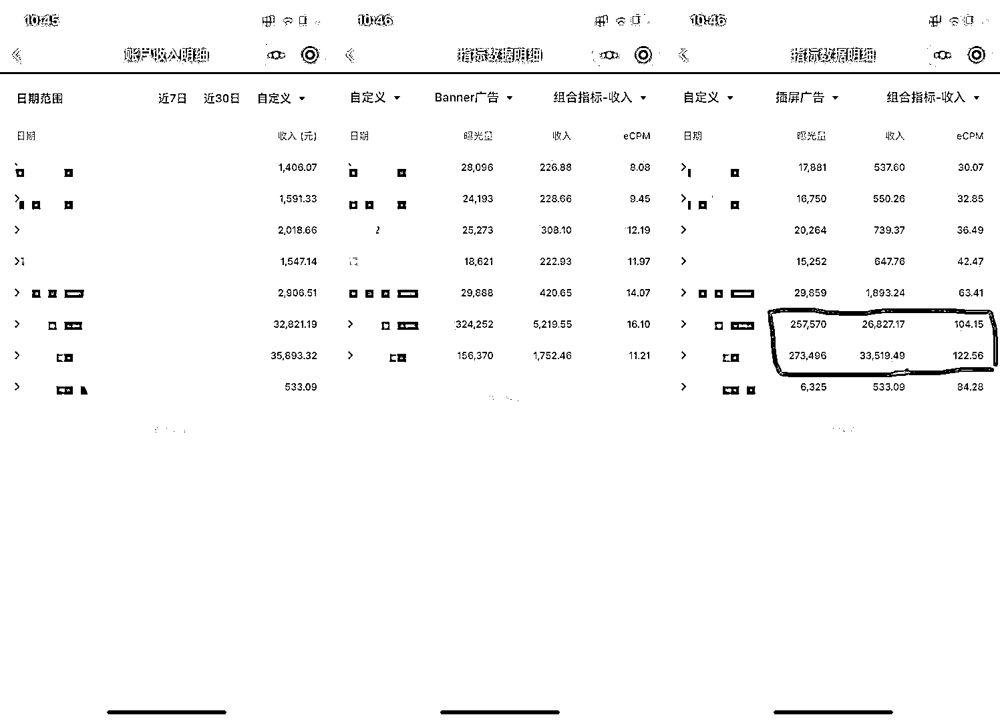

可惜时光不可逆啊… 所谓厚积薄发，当有一些幸运来临时，最好别说自己还没有准备好。另外，做好内部优化很重要，要想赚到钱，往往向内求比向外求来得更直接、可控。这是我要分享的第一个观点。

背景** **

在微信生态里，多数小游戏，诸多的内容型与工具型小程序是有通过微信流量主来创收的。这是一个不容小觑的生财之道。微信流量主有着接入简单、灵活控制，见效迅速的特点。  如果你有一定日活的小程序，试试流量主说不定很有惊喜。当然，一个产品的定位，往往有着与之匹配的变现方式。广告呢仅是一种变现手段，流量主是微信广告的代表。

 

 

我主要围绕小程序流量主探讨，以工具小程序和内容小程序为主，附带小游戏相关，而不包含电商类小程序（卖货才是正经事）。您可能会问，公众号也有流量主呀？公众号的变现，头部和垂类账号创收还是接品牌/付费广告效率更高，流量主收益相对而言低的多，且因位置和展现机制有限，优化空间小。小程序/小游戏可不一样，因广告形式多样化和可灵活配置，可以玩的出色得多。

好了，我们开整，Enjoy~

文章目录：

**1. ** 微信广告「流量主」是什么？

**2. ** 现状与趋势：流量主的前景如何？

**3. ** 如何开通小程序流量主？

**4. ** 案例分享：工具类、内容类、小游戏

**5. ** 流量主的广告形式与对比分析

**6. ** 小程序流量主  广告优化策略

**7. ** 流量主收入公式

**8. ** 流量主产品内部优化策略（七大方向）

**9. ** 因地制宜：选择合适广告位与控制

**10. ** 提渗透率：提高广告被看到的次数

**11. ** 提曝光率：位置前移便可轻松提高

**12. ** 提点击率：激励广告前的文案提示

**13. ** 升级形式：原生模板广告可更融合

**14. ** 技术调优：预加载与定时自动刷新

**15. ** 切忌滥用：下线收益能力低的广告

**16. ** 关于流量主变现其他需了解的

**17. ** 玩转流量主的相关工具与服务

**18. ** 总结与致谢

 

 

首先为流量主新手圈友简单做个科普，老玩家请随意~

一、微信广告「流量主」是什么？

微信广告是微信指定的广告平台（官网 ad.weixin.qq.com），品牌方在『广告主』后台投放广告，流量主在微信公众平台后台『流量主』栏目可开通流量主和设置、查看报表收益。

流量主可轻松实现流量变现，持续获取收入，依托于高价值的内容，实现品牌塑造和内容变现的双赢。

微信系统会根据广告素材的定向和阅读文章或使用小程序/小游戏的用户画像，匹配当前状态下最适合展示给用户的广告，流量主无需额外操作。

**1**、现状与趋势：流量主的前景如何？

记得 @条形马  老哥在今年 4 月生财全国网友见面会的分享：选择一个赛道时，得了解下「大基本面」如何。这里我找了两方面数据：

首先，根据 2020 年 9 月的微信广告流量主大会的报告显示，截至 2020 年上半年，月活跃流量主数量是** 85 **万**+**。2020 年 1 月-2020 年 7 月，流量主累计分成** 31 **亿**+**，月入** 10 **万以上的流量主有** 1000+**；而小游戏更猛了，截至 2020 年 7 月，小游戏整体流量同比增长 80%，月广告分成超过百万的游戏达** 39 **款。

 

 

而根据腾讯 2020 年度财报，其中网络广告收入 822.7 亿元，同比增长 20%，占总收入的 17%。2020 年，每天有超过 1.2 亿用户在朋友圈发表内容，3.6 亿用户阅读公众号文章，4 亿用户使用小程序。

有这么多的活跃用户，微信负责招商，创业者负责做产品与内容吸纳流量，通过流量主变现，这路子行得通~ 但也要了解微信已上线 100 万+ 小程序，说明机遇和挑战并存。

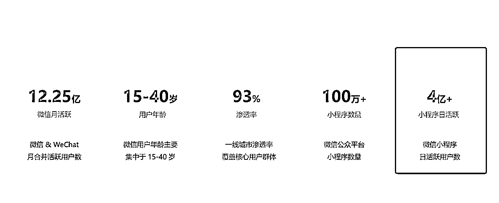

**2**、如何开通小程序**/**公众号流量主？

随着微信公众平台的发展，从早期内测期到现在，开通门槛逐渐降低。当前的要求是：

微信小程序 1000 用户（访客），公众号 500 关注（粉丝），且无严重违规记录，即可开通流量主（微信公众后台-流量主）。

无论主体是个人，还是企业（包括个体工商户），均可以开通。区别是结算时，企业需要开具增值税专用发票给腾讯（注意是专票，需要纸质的发票邮寄）。个人是微信代扣税（增值税、附加税、个人所得税）。综合从费率上来说，企业主体的更好。

业界也有代开通流量主的（就是刷量达到开通门槛），这个见仁见智，我个人不建议去代开。正如王兴说「做投资的前提是先有钱」，赚流量主钱的前提是先得搞流量。

 

 

二、典型流量主产品应用案例

来通过一些线上小程序案例更直观了解，我尽量选择大家耳熟能详的产品做介绍：

**1**、工具型小程序** **举例：****

**1.1 **营销工具：抽奖** **小程序

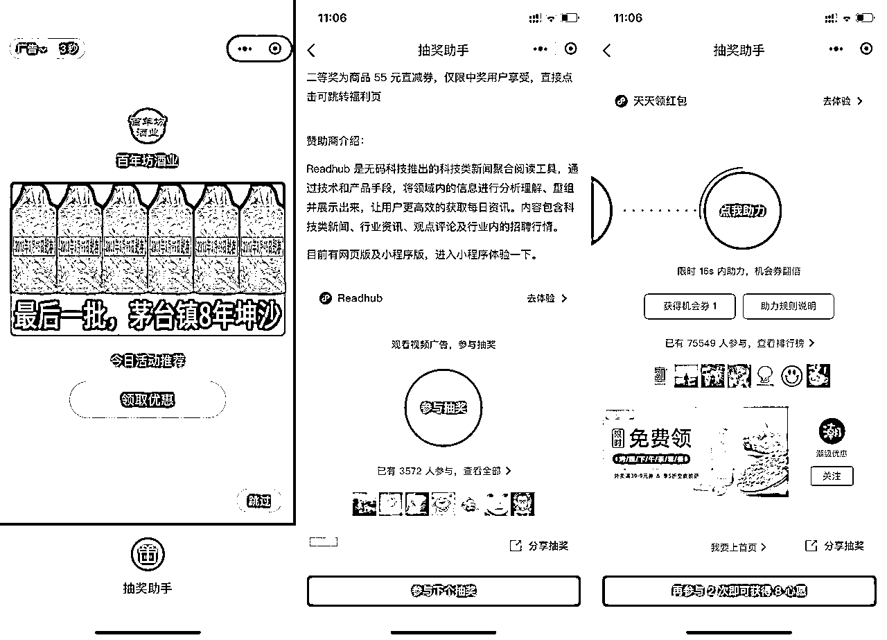

图**1**：抽奖助手** - **小程序启动时的 「封面广告」

 

 

抽奖助手的商业变现是工具类小程序长期商业变现的典范。很多产品的商业变现很粗暴，抽奖助手的商业变现很克制，很有艺术，很多元，很稳健。

图**2**：抽奖助手** - **首页平台赞助的活动商品，可通过观看 「激励视频」广告来参与抽奖。

图**3**：抽奖助手** - **在抽奖详情页底部、抽奖参与人明细页的** ** 「banner 广告」。

此处以『抽奖助手』小程序举例几个广告类型（产品里不止这些），其在广告上面的应用很克制，基本不影响用户的操作。没有加入「插屏广告」和稍显阔躁的「视频广告」。

抽奖助手帮助品牌做营销，广告植入比较少且巧妙。用生财有术团队的 @茄子  的话来说：

**1.2 **实用工具：去水印** - **短视频去水印** **工具

去水印功能免费，广告来创收。这种植入就显得「粗暴」了，画风就变很多了。映入眼帘的是置顶的视频广告或 banner 广告。进入各页面时的插屏广告。

 

 

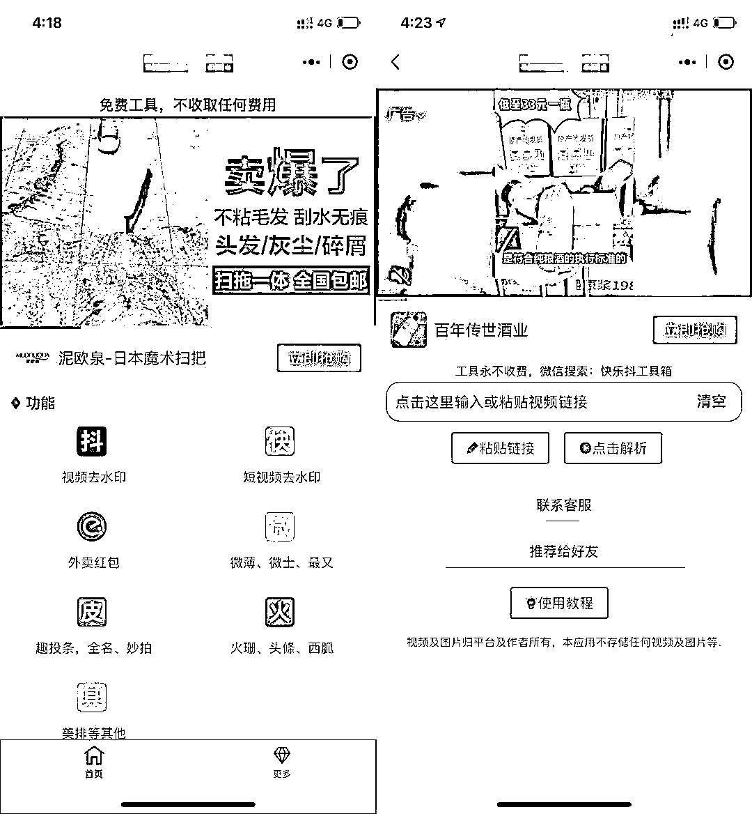

以及通常会在解析视频成功后，点击「下载视频」时再弹出一个插屏广告，或者「激励视频」广告。为啥这个时候弹出呢？用户已经到最后一步了，利用了「厌恶放弃」的心理，此时的忍受力度更高。

**1.3 **生活服务：充电租赁** **小程序

 

 

共享充电产品用户扫码借还，服务承接以小程序为主（微信和支付宝）。当我们在线下扫码借充电宝，首先启动时展示「封面广告」，接着进入首页弹出来的是一个「插屏广告」。即一次扫码行为是两次广告的曝光。

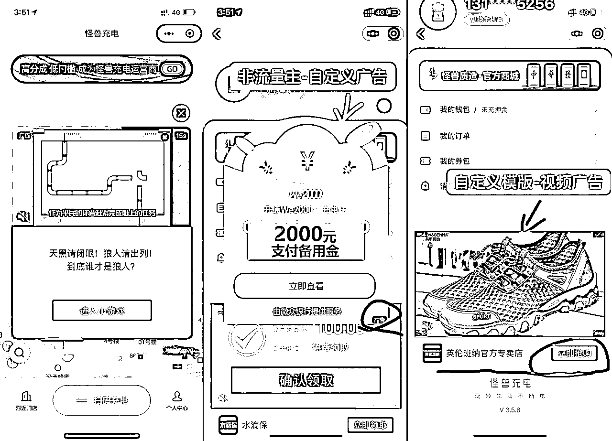

怪兽充电** - **首页弹窗** - ** 插屏广告  **- **流量主广告

怪兽充电** - **个人中心** - **自定义弹窗，非流量主广告

怪兽充电** - **个人中心** - ** 流量主原生模板广告** - **视频广告

这里以「怪兽充电」举例，怪兽充电已是美股上市公司，据其招股书介绍，虽然广告收益只占其收入模式里的 2%左右（90%以上的收益来自充电宝租赁），主要的广告收益即来自小程序流量主，可以说就这么简单的几个广告位，一年的收益也超千万人民币。

当然，前提是日活百万，广告收入是顺带的，流量主简单，架不住躺赚。

 

 

在此场景下，用户的目标是确定的：「手机快没电啦，要借一个充电宝！」，弹一个广告并不中断影响他后续操作。所以用户体验并未受到多少干扰，也想必对租赁充电宝订单的影响是微弱的。

**2**、内容型小程序** **举例：****

2.1 图文类 - 资讯/小说  为代表

免费小说阅读小程序，靠「流量主」广告变现，一般在在文章中间和尾部设置广告位，比如进入新一章节时的横屏广告（比常规的 Banner 的样式更大），进入新一章时弹出来「插屏广告」等。微信搜一搜-「小说」可查看一系列的小说小程序。附图：

 

 

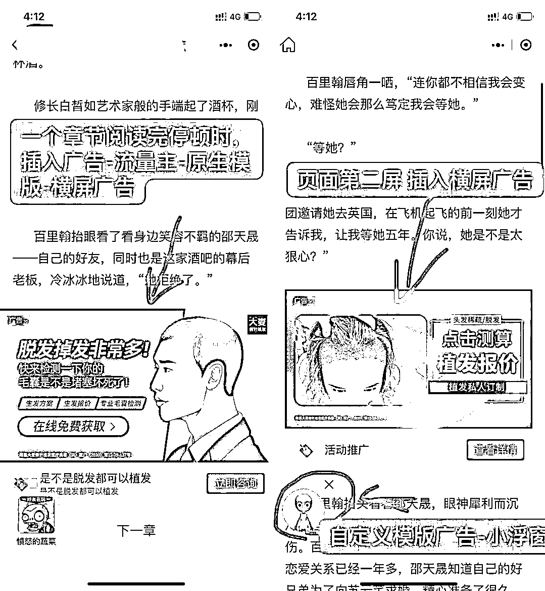

免费小说** - **阅读完一个章节时，用户稍有停顿，此处植入了一个横屏广告。

免费小说** - **在每个页面的左下角，均植入了一个小浮窗广告，这个是「原生广告模板」的一种，效果一般，但抱着是能多一点收益是一点的想法，悬浮藏在了

图上这个位置。

免费小说** - **在打开下一个章节时，注意是切换页面时，可展示新的广告位或直接弹出「插屏广告」。

猜猜看，国内打着「免费小说」的流量产品，比如七猫小说，其营收结构里，多少是由广告来创收的呢？

 

 

2.2 视频类 - 视频信息流小程序

这类产品也很常见，再举一个「10 万+人最近使用」的小程序『糖豆视频』。在小程序首页就直接展示视频广告，以及在信息流中插入更多广告位。

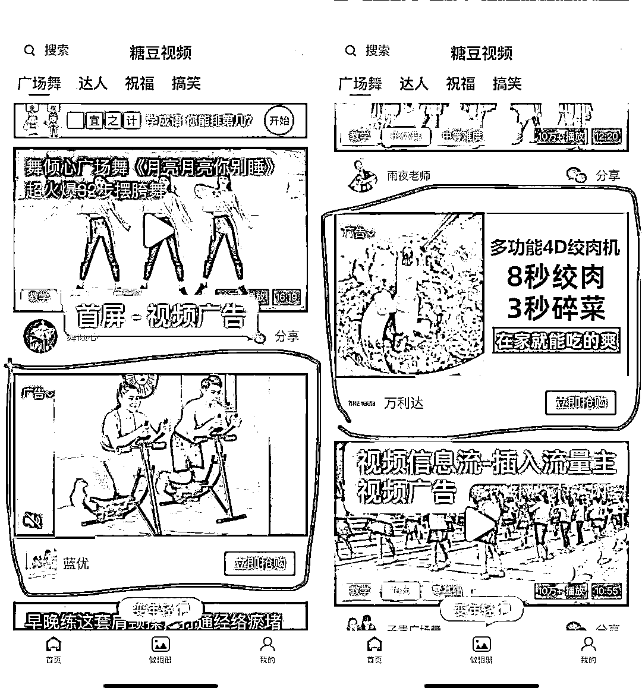

你说一线互联网产品会接流量主来做变现吗？答案是会的。网易新闻小程序的图文和视频信息流均植入了广告。微博小程序，也在默默收割吃瓜群众的注意力流量。

 

 

3、小游戏产品  举例：

流量主的应用，往往小游戏比小程序做的好。同时，小游戏通过「广告主」买量异常凶猛的，小游戏的竞争激烈程度要远高于常规的小程序。坊间不少公司研发了矩阵小游戏产品，通过流量主广告变现。

如下图所示一个机甲类型的小游戏，在「游戏特权」的运用上，可通过「激励视频广告」，来解锁双倍金币奖励、免费补给、免费获取道具。「激励视频广告」，必须看完，才可赢得「奖励」。小游戏里往往给到用户选择，你可选择看视频拿奖励，或者跳过（放弃奖励），继续游戏。

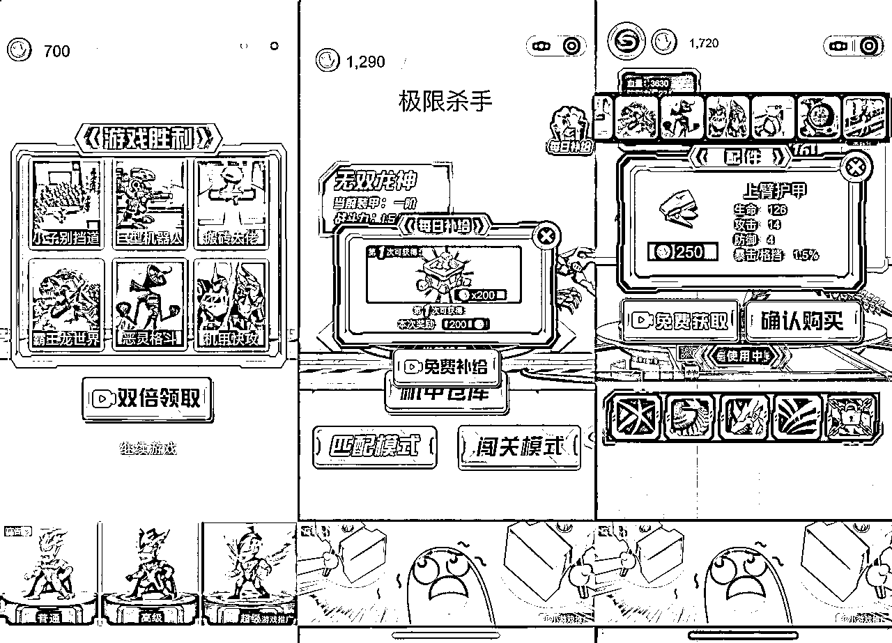

 

 

原本做页游的产品或者那些经典小游戏，复刻成微信小游戏版本比比皆是。而这些轻度游戏的生命周期比较短，对流量获取能力其实要求更高。  微信为了鼓励更优质的小游戏产品上线，特推出了「创意」认证小游戏，游戏公司需要申请，微信会经过严格的评审团制度来确定名单，并公示。「创意」类游戏品质好，变现效率高。那有什么好处呢？免费测量，分成比例比普通小游戏的上限更高。

三、流量主的广告形式与对比分析

通过上面的案例，提到的广告形式有：「封面广告」、「激励视频广告」、「Banner 广告」、「插屏广告」、「原生模板广告」、「视频广告」，在不同产品流程、界面，灵活运用了不同的广告形式。

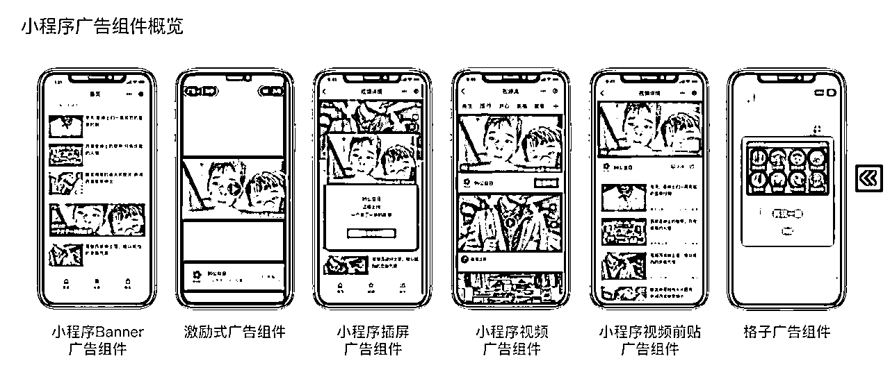

上图来自微信小程序流量主训练营课件

 

 

请问您平常有留心在小程序里出现的广告不？  一个对自己很「新鲜」的广告，是选择忽视，还是点过去看看「是什么样的人在投放广告呢？」，他们在卖什么产品？我一直记得 @黄亮  老哥的海参案例分享（精华帖在本生财社区），通过广告去追溯背后的商业模式，一个基本原则是人家愿意投放广告买量，固有所图。

关于小程序里的流量主广告形式，下图是我的一个总结，未必正确，分享给各位，一图以蔽之：

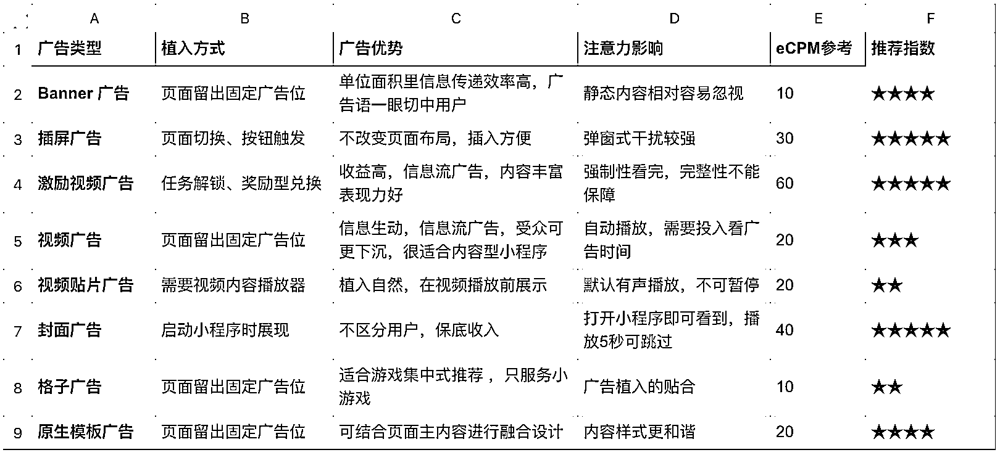

注：关于推荐指数的星级，没有不好的广告形态，只有不好的运用场景。这个星级是反映适用面和收益的综合考虑。

四、小程序流量主** **广告优化策略

接着我们聊聊，当你已经有一个线上稳定运行的小程序产品，并且也接入了流量主广告。那么如何提高广告收益呢？这也是本文的重点。

 

 

**1 **、流量主收入公式

首先，我们来看流量主的收入公式：单个广告位的收入** = **广告曝光量** / 1000 * eCPM **曝光量** = **看到广告的人次** x **看到广告的次数。

eCPM **=**  广告千次曝光收益。

简单来说，广告的曝光越多，收益就越高。而 eCPM 是动态变化的，跟当前的广告主出价（竞价投放或 CPM 投放的影响）、竞争激烈程度和用户的行为有关系（有效点击）。

从广告的曝光量来说，两个指标：看到广告的人次和看到广告的次数。这么说，宏观层面，提升广告收益的根本是提高日活、停留时长和留存。微观层面，则必须修好内功。

**2**、流量主产品内部优化策略****

根据上述的流量主收入公式，曝光量的提升，可以从曝光率和曝光次数来提升。也看如何提高 eCPM。以下分为七个方向，来针对性介绍，该如何修理内功：

**2.1 **因地制宜：选择合适广告位与控制

看完《微信广告-流量主成长营》的系列课程，摘录了这个笔记：

内容类型用户流程拆解，注意对视频类型可接入视频广告和视频前贴广告，若有精品内容，可通过设置激励式广告代替付费购买，观看视频而解锁内容阅览权限。

 

 

工具类型用户流程拆解，注意激励视频广告的解锁方式，与在流程结束页的插屏广告植入。以及接入内容频道可提高停留时长，内容通过微信「搜一搜」可获得被动流量引入（需后续更新文章详细说说，先挖坑）。

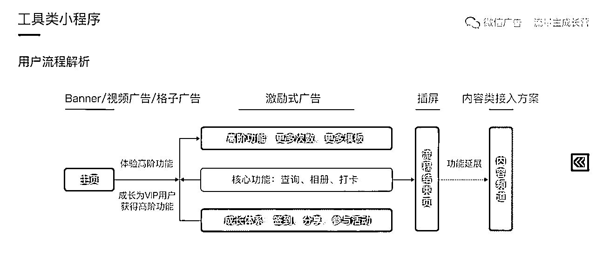

**Q**：选择** Banner **还是视频广告？

 

 

A：Banner 尺寸小巧精悍，视频广告占地面积大，Banner 的应用面更广。更关键的是：

如果该页面用户的停留时间短，视频广告无法得到完播，eCPM 也就不高。即用户停留时间短的页面不适合放视频广告。反而是 Banner 广告的收益更高。

**Q**：选择「格子广告」如何，怎么用？

A：考虑你的用户受众了，「格子广告」只服务小游戏，点击跳转的均是小游戏。  如果你的用户与游戏人群画像不符，格子广告的点击率可想而知，点击少，eCPM 就偏少。收益不高。

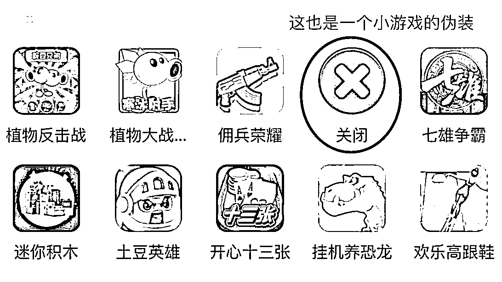

**Q**：插屏广告如何利用？

A：插屏广告适合在用户体验流程结束或切换时插入，减少对用户体验流程的打断。最直接的是进入「首页」就展现，这是曝光最大化。考虑到用户干扰，可以设定规则，比如时间控制（一个小时内首页只展现一次插屏），身份控制（VIP 用户免广告），还有新老用户差异对待，新用户暂时免广告？若次日留存低于 10%，一次性用户居多的话，那就还是想想提升留存吧。

**Q**：激励视频怎么加？

A：激励视频可以通过解锁主流程内容、让权益奖励加倍、设立用户分级激励体系等丰富激励场景，鼓励用户解锁这个奖励；无论是虚拟的会员奖励，还是实物电商，只要广告收益（eCPM 60 左右）与投入的比较可控，这不失为一个促进用户活跃还能创造收益的好方法。

 

 

**2.2 **提渗透率：提高广告被看到的次数****

提升广告在产品里的渗透率，就是加广告位 :) ，这个道理很浅显，但却有效。难点在于平衡用户体验和商业价值。Banner 和视频广告需考虑现有产品的设计空间，得留出广告位置；而插屏广告的弹窗接入灵活，但用户的注意力影响较高；激励视频，则往往入口比较深，需要按钮或场景触发。另外，平台做了限制，一种广告类型只能出现在一个页面。但可以多种广告类型的组合呈现。

怎么加，方法不局限如下：

**1. ** 开启「封面广告」：封面广告，是**2020**年**12**月上线的，在** **小程序后台**-**流量主** **开起来试试？体验或效果不好，次日看到收益，一键可即时关闭，这个试错成本

是极低的。

**2. ** 创造「激励视频」：激励视频广告的收益最高** yyds**，常规工具和内容型产品可接入任务系统，创造激励视频的场景来提高收益。

**3. ** H5 页面小程序化：如果你的小程序有内嵌**H5**的页面，此页面的访问量较高，则适合改成小程序原生页面，才可以有增加广告位的可能性**~**

**4. ** 完成页与弹窗优化：以工具型产品为例，一个任务的进程完成时，往往有一个完成页，该页面很适合植入广告。同理，「小游戏」游戏过关提示弹窗，作为一

个停顿场景，弹窗的底部往往加入一个** banner **或格子广告位。据微信小游戏自称，大量游戏接入** Banner **组件后，利用率和收入有明显提升** 20%+**。

……

**2.3 **提曝光率：位置前移便可轻松提高

曝光量的另外一个角度表述是，曝光率 = 广告拉取量 x 广告曝光率。若一个广告位，低于 50%的曝光率，则要考虑如何提升。

 

 

广告拉取是指符合当前用户能够有资格拉取到广告，但因为广告位的限制，不一定有曝光。（比如一个页面加载完毕，虽然广告拉取了，但 banner 广告在页面底部，用户没有滑到底部看，也就没有曝光）。

把广告位位置稍微前移，即可有效提升。能在第一屏，就不在第二屏，用户是懒的，未必能够滑到底部查看广告。 —— 比如上述案例里，「糖豆视频」小程序在首屏就植入了一个广告。

**2.4 **提点击率：激励广告前的文案提示

这个微操细节，能够让转化更好。把这个单独拿出来讲，因为激励视频的奖励是需要完整看完视频才能发放，激励视频在 15s -60s 之间（后台可以选择两个时间段，15s - 30s 与 30s - 60s ），若用户未完整播放，那么曝光量也就下来了。

常规的是在 UI 上增加  视频图标，让用户感知到这里是一个「视频内容」。可进一步让用户有耐心看完、提升完播率也即提升曝光量，增加弹窗文案提醒极有必要。

 

 

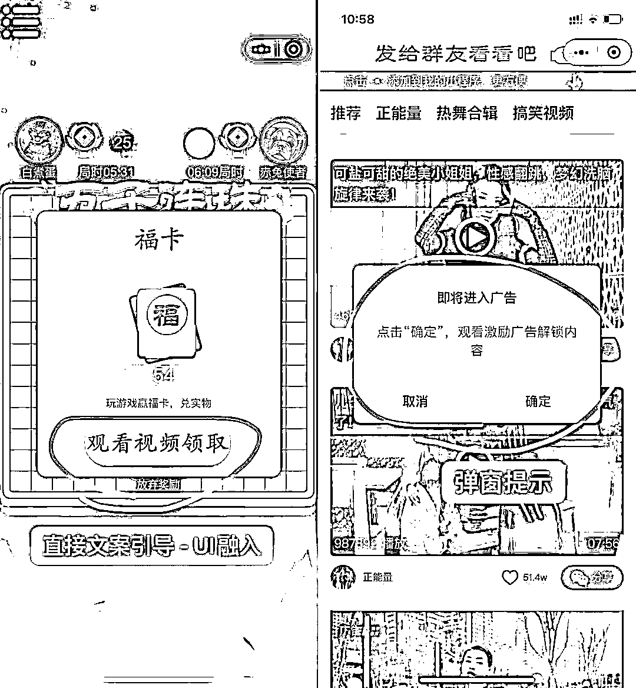

尽管多一个弹窗确认，但有理由说服用户来完播却是值得的。有人做产品是粗狂的，可细节的优化才是见产品真功夫。

**2.5 **升级形式：原生模板广告可更融合

这里先补充介绍下：原生模板广告。2020 年 7 月，微信广告上线「小程序原生模板广告组件」。

 

 

微信广告为流量主们提供了 12 款基础模板，覆盖全屏、横竖版卡片、横幅及格子等 5 种类型场景。流量主可对模板中展示的素材类型、边距、颜色及圆角等进行自定义编辑，实现广告组件与场景高度的自然融合，提升用户体验与广告转化

效果。

比如『下厨房』小程序，首页的信息流里植入的就是原生模板广告的竖版卡片：

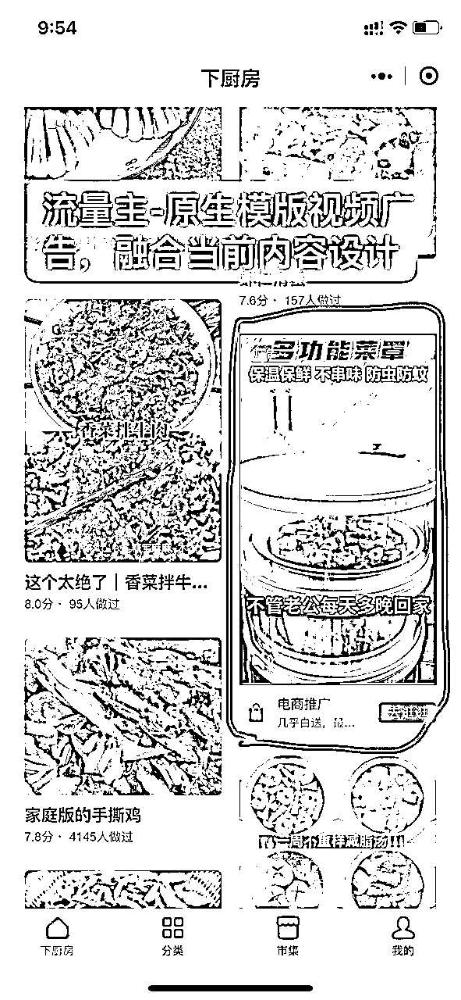

 

 

那我们来对比，常规 Banner 和横版、横幅广告的差别：

**Banner**是通栏，单图。** **横幅广告是组合式内容，图片**/**视频**+**标题**+**来源**+**行动按钮。横幅比**Banner**的尺寸高度更窄一些。

原生模板的横版广告高度更高，可通栏或设置边距，更适合信息流内容型小程

序，工具型小程序放这个会显得比较占地方，干扰性高。

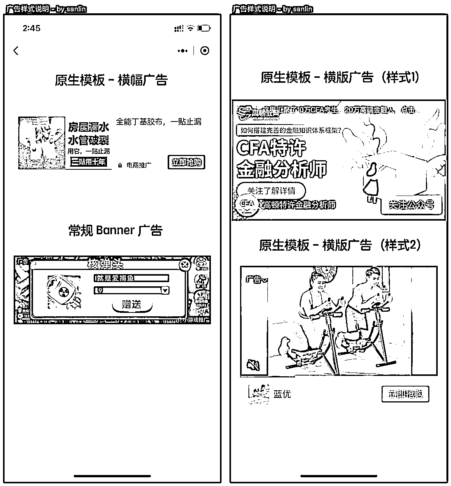

 

 

在小程序环境下，支持通过调用 wx.preloadAd 接口，提前加载广告数据，再后续创建对应广告标签 ad,ad-custom 时，会自动使用预加载的广告数据，省去创建广告标签时再次拉取广告的耗时。

开发者可以在创建广告位时传入 ad-intervals 参数实现广告的定时刷新，ad-intervals 参数为数字类型，单位为秒。注意：自动刷新的间隔不能低于 30 秒，因此 ad-intervals 的参数值必须大于或等于 30。

原生广告模板的上线，让小程序广告的样式更加丰富，若把原有在页面里的常规 Banner 或者视频广告，升级为原生模板，用户体验得到提升，因为和内容的融合度更高，点击率可得到相应提升，收益也就提升了（这不绝对，我们有的工具型小程序换成原生模板后，eCPM 不升反降  😭），原生广告模板更适合内容型小程序。

原生模板广告组件若之前已经接入，在小程序后台再次编辑后不需要重新发版，编辑更新后，新的广告位样式在十分钟左右可线上生效；线上调整样式很方便，很适合做 A/B Test 去检验广告设计的效果。

**2.6 **技术调优：预加载与定时自动刷新

在技术上可让前端同学来操作这两点：

广告预加载：省去创建广告标签时再次拉取广告的耗时，页面打开速度更快。

广告定时刷新：多一次刷新，则多一次曝光。让用户看到不同的广告，这点很

重要。

**2.7 **切忌滥用：下线收益能力低的广告

 

 

流量主每次广告曝光带来的收入与广告平台的 eCPM 正相关。

宏观层面：优化用户结构，但产品固有定位，这个不是想优化就能优化的。** **

**eCPM**与广告转化率正相关。

微观层面：保证广告位整体转化率，不能滥用广告组件，影响广告整体效果。

转化率在后台的数据反馈是「点击率」，若广告位加过多，曝光量是上来了，可点击率仍然很惨（比如低于 1%），应当关闭收益能力低的广告位。

以上，暂时写到这七点，后续还可以迭代更新。比如微信广告在后台为小程序/小游戏流量主提供了一个很丰富的数据洞察工具，而这个页面能够利用的起来的人很少。你不会用的话，我免费教你呀~

五、关于流量主变现其他需了解的

**Q**：我有流量，可以不接流量主，而自己展示广告吗？

A：可以的，虽然在微信里不能接入其他广告联盟。但也可以接第三方广告，协商价格（按点击或授权收费，需单独拉报表），不用流量主，则要求第三方广告的收益更高对吧。这种合作往往建立在小程序受众相仿，流量更精准，想卖出更好的价格。可这种第三方广告得专有渠道，对接合作也需要人力投入。  可以说，流量主广告的优势就明显了，这可以提供保底收入、且运维省心的。

**Q**：小程序的广告位设计是开发者可控，若违规审核拒绝了会怎么样？

 

 

A：每次小程序审核，广告位均需要审核，并且广告位审核被拒的影响不小 —— 如果小程序的广告位审核被拒绝，那么直到下一个版本的广告位审核通过之前，线上小程序将全部不展现广告。  也就是说，万一审核拒绝了，当下广告位即看不到了，需要重新提审一次小程序，并等待广告位审核通过后才能继续正常展现广告。

**Q**：常见的广告位驳回的原因有哪些？

A：接入广告位时，主流机型的适配是简单的，就是别耍小聪明：通过文案引导或故意使得按钮遮挡广告位，使得用户点击或误触 Banner 广告。或者修改 Banner 组件的样式，来进行一些欺骗诱导点击。这是常见的广告位被驳回的场景。  另外诱导升级 VIP 会员可以免广告，也是不允许的~

**Q**：什么样的广告会出现在「我的小程序」？

答：通过广告主端的创建广告 - 选择推广目标，我们可知目前微信广告提供 8 种推广目标，分别为：推广品牌活动、推广我的门店、推广我的应用、推广我的商品、推广我的公众号、派发优惠券、收集销售线索、推广我的小游戏。

小程序里出现最多的广告类型是标黄底色的这几个：品牌活动、应用（尤其是安卓端）、商品、公众号、小游戏。

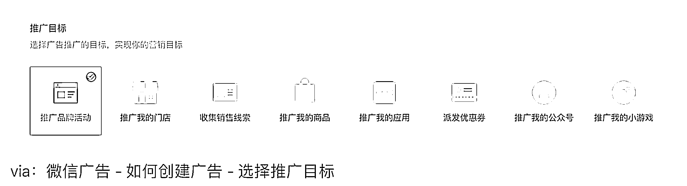

同时，一个必要的操作，作为流量主需要屏蔽竞品的公众号和可选屏蔽行业。

 

 

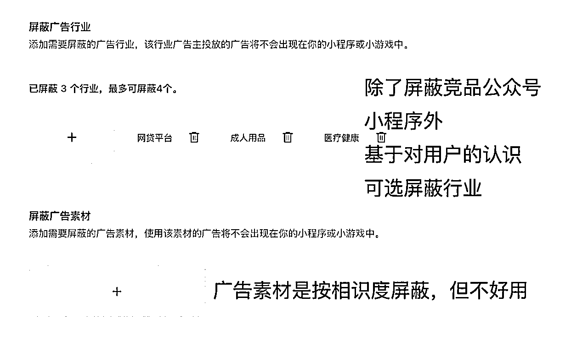

六、玩转流量主的相关工具与服务

聊到现在，优化实操以及常见问题的部分讲完啦。再补充点相关资源，为大家整理了官方出品的工具与资源：

**1**、**#**小程序：流量主服务助手  随时随地查看每日流量主收益数据，可进行分广告位的查阅近 30 天、近 7 天数据。比电脑端方便。

**2**、**#**公众号：微信广告助手  接收「流量主数据日报」和流量主违规通知（重要）。第一时间收获微信广告相关政策情报，若想了解某个具体的细节内容，可以定向在微信广告助手的公众号定向搜索关键词找找看。

**3**、**#**小程序：微信广告助手  为小程序/小游戏买量，转变下身份为广告主，站在广告主的投放视角，能够更好的理解流量主。

 

 

**4**、微信广告官网帮助中心  https://ad.weixin.qq.com/guide**5**、课程《微信流量主成长营》，作为流量主的必读资料，共有 3 个方面：小程序、小游戏、公众号。这门课程也让我收获很多。（关注公众号微信广告助手，底部菜单可进入）

七、总结与致谢

本次分享的出发点聚焦在小程序变现之流量主如何提升内功，通过产品内的优化来提高变现效率。还是要强调的是，从根本上，提升流量主收入更应提升 DAU、停留时长与留存。思考产品流程中的巧妙植入，为扩大收益可增加更多产品能力，平衡商业收益和用户体验，不断提升流量主的变现效率。也许你的产品有会员、课程、社群等其他更高效率的变现方式，可流量主是可以作为一个保底收入的，行动起来，期待圈友你的反馈~

借用微信广告的 Slogan：广告，也可以是生活的一部分。广告行业很有意思，我算是一个新人，仿佛耳边传来了一句声音「这里水太深，康子你把握不住……」，如果这篇文章能为您带来对微信流量主有一些了解或启发，那就不虚此番码字了。也非常欢迎在做这块的朋友一起交流更多，咱评论区聊起来~

起初我通过搜索工具搜咱生财有术星球的帖子，暂无相关分享。我认定这个话题有价值，就一定要赶出来这篇文章，虽然花了蛮多时间，甚至一度怀疑自己丧失了写长文的能力。。正如生财有术社区的理念之一：越输出则越收获，越分享则越进步。感谢 @亦仁  老板及团队营造的生财社群氛围，感谢  @茄子  对文章的点评交流。感谢  @杨涛  涛哥的贴心行文指导（太棒了）。  感谢阅读到这里的您。下一篇我们再见。

 

 

文/三林

2021.05 生财有术@知识星球社群

评论区：

风帆 : 感谢分享[抱拳]

三林 : 谢谢  有收获就好

Apple 熊 : 这个牛啊，讲得很清楚了

诗与远方 : 🐮，老板下波分享下公众号流量主好货，好不[呲牙]

三林 : 可以的  公众号空间有限，但也有坊间的一些骚操作，我得整理整理… 兰菇凉 : 我能不能问个小问题，你的文章中是如何插入图片的？

三林 : 是需要在知识星球网页版 - 发布文章。  另外。不能直接从其他文档全文复制图片进来，此时图片会丢失，是需要重新一张张图片插入… 别问我怎么知道[流泪] 华龙 : 底裤都被扒了，牛气
