# 产品出海** **合集

产品出海都有哪些玩法？

整理日期：**230907**

 

 全部合集见群消息~

生财风向标和周报系列另外用文档分享，地址见专属群q群消息。

往期的生财周报合集（含在线版和离线版），见专属群Q群文件和群公告。

希望大家有收获~

标题加了(精华)的表示精华贴，前面为截至今日的点赞数。

以下是目录，内容有些多。大家可以挑兴趣的内容阅读。

 

 

 

# **# **目录

产品出海** **合集

目录

【商业认知】**6**篇

(精华帖)(522赞)亦仁：如何用流量思维赚钱？怎样才能获得水下流量？

(精华帖)(120赞)做了近30年生意的拉美人，如何从0到1白手起家

(精华帖)(102赞)关于出海工具产品营销推广，我的几点经验分享

(精华帖)(78赞)出海工具类产品如何玩？

(精华帖)(77赞)两印地区应用商店运营者，告诉你真实的印度互联网

(50赞)2023年东南亚的跨境电商，一个出海的时代序幕正在进行

【商业模式】**4**篇

(精华帖)(277赞)信息整合：一个可复用，低门槛的成熟商业模式

到底是谁？还不清楚，这需要产品、运营、营销、以及对行业的判断。

有人抱怨的地方，就可能做出这么一个产品。

同上。

（4）培训

(精华帖)(162赞)独创：必胜法之四步打造一个百万爆款

(精华帖)(57赞)我和订阅二三事（上）

(54赞)聊一聊海外私域的事儿

【亚马逊】**9**篇

(185赞)8个月，亚马逊从0到月利润6w+的复盘

(精华帖)(153赞)亚马逊从 0 到盈利 1w+ 这 125 天，我的鲁莽代价和快速成长(精华帖)(152赞)真正的跨境运营和营销绝不是简单的筛选产品上架促销这么简单(精华帖)(133赞)让大家认识一个真实的出口跨境电商世界

(精华帖)(123赞)电商小白实操从 0 到 0.1 跑通 Amazon 闭环并赚到一块钱，我是如何做到的

(精华帖)(109赞)利用生财有术的知识：1 年内在亚马逊上实现月销百万，月盈利十万

(精华帖)(92赞)创业分享：从玩转海外流量，到亚马逊金牌卖家，再到为跨境电商服务商

(92赞)月入三万单品历程分享  亚马逊初创业的成长及我与生财的故事

 

 

(精华帖)(49赞)不同类型卖家在亚马逊打造品牌，铺货、精铺或者精品模式的避坑经验分享

【**TikTok**】**8**篇

(精华帖)(625赞)关于 TikTok，你必须知道的 20 件事

(精华帖)(308赞)我是如何在生财有术赚到第一桶金的

(精华帖)(152赞)TikTok 小黄车，作为官方的带货链接

(精华帖)(143赞)TikTok 欧美地区直播带货项目，我的操盘与踩坑经验分享(精华帖)(120赞)以 TikTok 举例，如何发现海外产品的生财机会  ？

(精华帖)(89赞)TikTok 红人营销需求痛点，通过达人裂变，付费 7000 给 APP 产品新增 15W 用户的经验分享

(58赞)我是如何在 TikTok 小航海的 30 天里，成功变现 3000 美元的？

(53赞)TikTok上卖Excel课的案例拆解

【**Facebook**】**3**篇

(110赞)自媒体人通过 40 分钟视频课程卖出 170 多万份

(精华帖)(112赞)跨境私域电商的具体操作-FB篇

(精华帖)(41赞)如何薅facebook和Google羊毛

【**YouTube**】**2**篇

(127赞)YouTube名人名言AI制作保姆级教程

(精华帖)(50赞)YouTube生财之术（20-100）

【选品方法**8**篇】

(精华帖)(419赞)跨境龙头创始人教会我价值百万的选品方式

(精华帖)(139赞)在疫情期间找准用户需求，半年打造月销千万的品牌独立站(精华帖)(113赞)聊一聊 Google 关键词挖掘需求的方法

(精华帖)(99赞)从「上帝视角」寻找Niche

(精华帖)(94赞)规避难中难，寻找蓝中蓝：蓝海小语种市场（日本）中的蓝海信息差品类的套利机会

(45赞)Chrome 插件开发之旅：从 0-1 开发浏览器扩展

(41赞)为什么疫情期间美国比基尼单品超级旺销？出海品牌搞懂海外用户消费场景有多重要？

(19赞)难度更低的海外“内容工具“站或许也是出海一种不错的选择

【工具推荐】**5**篇

(88赞)非技术背景出海产品必备工具：AI SQL Editor

(69赞)一个神器帮你快速查询域名组合取名

(67赞)ChatGPT 应用生态之浏览器插件观察

 

 

(42赞)亚马逊+Midjourney=新机遇？

(38赞)结合 AI 绘画和按需印刷开发一些产品出海

【广告投放】**1**篇

(精华帖)(45赞)高效使用广告聚合 & 优化竞价策略，让海外应用广告收入提升 30%【赚钱案例】**8**篇

(精华帖)(508赞)利用 GPT4 迅速将想法落地，让创意在半天时间内变成 MVP！

(精华帖)(411赞)失去 5 个月销 700 万级的大站后，我如何用 120 天的时间再造一个月销 1500 万级的新站

(281赞)通过 Wise 的推荐项目，每天躺赚一万英镑+

(精华帖)(204赞)3 个单人就能做的赚钱案例，告诉你怎么通过互联网在海外淘金？

(101赞)25 天成交一个海外独立站 B2B 客户，入账$4551.7美金，我做对了什么？

(77赞)个人开发者的成功案例：一个函数的产品带来稳定收入

(31赞)如何在24小时内让一款超休闲游戏霸榜全球100+国家

【踩坑经验】**5**篇

(精华帖)(261赞)从做谷歌销售到创业，10多年跨境出海，赚到千万级美金(精华帖)(162赞)自学SEO副业研究各类玩法，做海外移动互联网广告赚到500万美金

(精华帖)(133赞)国人如何抓住商机，在非洲做外贸生意？

(精华帖)(69赞)网红 Tufting 店如何长期盈利及复制开店？

(精华帖)(45赞)靠苹果AppStore和Googleplay的官方推荐获取流量的案例【商业认知】**6**篇

# **# ****(**精华帖**)(522**赞**)**亦仁：如何用流量思维赚

# 钱？怎样才能获得水下流量？

作者：  亦仁

 

 

日期：2020-05-27

如何用流量思维赚钱？怎样才能获得水下流量？如何最大化流量的价值？

很多靠流量赚钱的人，对这些问题应该都很关心，今天是周三，  专栏更新的日期，我邀请了一位海外流量高手，《李自然说》主理人  ，来给大家带来一期关于流量的分享。

李自然老板要求介绍低调点，我就不过多介绍了，有兴趣的圈友可以去搜索下，很厉害的人物，列于我的佩服人物清单。

以下，请大家欢迎  老板  👏

———

大家好，我是李自然。做过的事很多很杂，硬件软件互联网，中国美国东南亚。赚过一点钱，拿过几次融资，目前还在奋斗路上。有个自媒体叫《李自然说》，分享些个人的想法。

亦仁喊我来生财有术做个分享。我觉得，在当前的大环境，做一个务实赚钱的生意，和前些年相比，要重要的多。

我在出海圈有一点微不足道的名气，对很多流量型的玩法也很熟悉。今天就和大家聊聊，如何用流量思维赚钱？

水下流量才是制胜关键

很多成功的产品的背后，往往都有着不为人知的流量手段。

比如Airbnb在初期的发展，关键原因就是在Craigslist薅了大量的免费流量，这个案例在互联网圈也广为人知。

但是，在更多的时候，类似的手段会被隐藏在水下，绝口不提。所以，媒体文章所讲的成功故事，通常是一个优秀的团队，努力拼搏，最终打造出了能让用户兴奋的产品。受这种思潮的影响，很多创业者都会把“做一个更好的产品”作为思考创业的起点。

然而，残酷的事实是，绝大多数的创业者并不是产品天才。

在他们的预想中，他们可以把一个充满缺陷的，不及格的产品，提高到95分以上，从而赢得市场。然而现实的情况往往是，他们眼中充满缺陷的产品其实也没有那么不堪，他们所说的痛点也是不痛不痒，他们能做的也就是把一个70分的产品提高到80分。

 

 

把一个70分，但是具有多年积累，建立了用户使用习惯和品牌知名度的产品，提高到80分，其实完全没法动摇前者的地位。这也成为了很多创业失败的原因。

所以，在很多情况下，我都建议大家从流量开始考虑问题。先有流量再有生意，而不是先去搞一个产品，然后才头疼怎么打开市场。所以我问创业者的第一个问题往往是：

你的流量从哪里来？

大概一个月之前，有VC朋友问我，为什么某音频平台能够做到第一名？他们的策略、运营，和竞品有什么区别？

我说，没任何区别。他们能做起来是因为他们找到了App Store的一个漏洞，可以在其他几个语种的App Store疯狂堆关键词并影响中文App Store的搜索结果。于是，在App Store搜任何的关键词，甚至搜支付宝、搜微信，他们的产品都能跳出来。

前天也有一个创业者和我交流，说他们想模仿某知名产品的运营模式。我问，你是否知道他们怎么获得的用户？

他回答了他的一些观察，我说，你说的都不对。他们能做起来，是因为当年的微博有机可乘，他们用程序生成了海量的微博账号，搞了很多免费流量到他们平台，他们才能起来。

这样的例子不胜枚举。这些水下的流量手段，往往才是项目初期的那个成功关键因素。

所以，

怎样才能获得这样的关键流量？

我给大家提供几个思考的模式：

**1. ** 紧盯正在崛起的大平台

我们细数现在已成为巨头的这些平台，在他们的成长期都释放过大量的流量红利。

比如Facebook，在刚开放广告平台的时候，可以以非常低的价格买到优质的用户，中国互联网出海圈的很多产品，都是借这波机会起来。

后来买量成本上去了，但平台的算法还不完善，就有很多人钻平台的漏洞搞流量，比如用一些非洲兄弟的身份开账户，搞封号了就换一个非洲兄弟。

 

 

比如Apple，前面也讲了一个音频项目利用漏洞做ASO的案例。比如Amazon，也有过很好的流量红利。

比如Google，这家公司甚至给过好几波巨大的红利，SEO一波，Adwords一波，YouTube一波，Google Play一波。

当年Adwords的行情就是捡钱。在Adwords卖虚拟商品，设置成来一个订单电脑就会响一声，每一个响一声就是几十美金，睡觉都不把声音关上，半夜还要爬起来看看电脑里面多少钱了。

作为一个特别讨厌噪音的人，我连续一个多礼拜听着叮叮当当的声音睡觉，后来才把声音关掉。

我们看回国内，国内早在邮箱时代就有流量机会，当时群发邮件几乎没有成本，开着电脑就可以一直发，发出去的邮件也不会进垃圾箱，基本上开着电脑等着收订单就可以。

后来百度起来，搞SEO富了好多人，大家的黑话就叫强X百度。后面竞价排名出来，初期的时候1块人民币就能买到一个想开加盟店的用户，想想看。

阿里、腾讯也都给过机会，无论是开个店还是写几个公众号，做的早，踏实一点，也是妥妥发财了。

小巨头们也是一样。头条就不必多说。拼多多，我曾经在《李自然说》里面说过一个案例，早期在拼多多一个身份证可以开很多店，开店后就靠接住拼多多的自然搜索量，后面对接一个店铺代运营，一个月都躺赚几十万了。

美团点评，有很多店铺就是靠重视的早，把店铺轻松搞到好评第一，接到了大量的互联网流量，依靠这一点就能把店做起来。

我们回过头去看，这种机会历史上每一两年就会出现一次。需要的就是速度和执行力。

要趁早。

**2. ** 挖掘小平台

我们从新闻上，以及应用商店排行榜上，经常可以看到一些迅速升起的产品，短时间内也会有相当可观的流量涌入到这些小平台去。

这些小平台，因为刚刚兴起，十有八九都是资源有限，系统漏洞多、技术对抗能力弱。

很多大平台在比较小的时候也被薅过羊毛。

 

 

当年国外的Pinterest，Slideshare等等，早期都很容易薅。国内也有几个红过的，有社交属性的产品，对发站内私信是不设防，用户数据也可以根据递增的ID号爬出来。就不太方便说太多。

**3. ** 培养敏锐的嗅觉

真正的高手，可以化腐朽为神奇，把一些毫不相干的东西，拼装成一把流量匕首。

美国的平邮特别便宜，但是送的很慢。美国有些商品，男人和男孩都很喜欢，但是很贵，比如星球大战里面的激光剑。但是中国生产的激光剑就很便宜。

就有人用平邮往美国的千家万户派发激光剑。反正也不是用户主动下单的，就不用在乎送货的快慢。

很多人收到东西懒得退货。白嫖又良心不安。再加上激光剑玩起来也挺炫酷的，东西品质确实还可以，价格对比当地商店又便宜很多，也就付款了。

但这个东西的毛利之大，大到一般人想象不到。就么说吧，就是精品手办和义务小商品的价格区别。几个人里面只要有一个人付款，公司就赚翻了。

这家公司怕同行学会，也怕员工跳槽说出他们的套路。干脆把公司开到了一个西部很偏远的城市，让北上广深的大神们鞭长莫及。

类似的案例其实也不少，这些人真的是把流量思维用到了极致。出海圈有很多公司，闷声发财，都是流量型的打法。有些简直脑洞大开，但极其有效，知道的人也少。

用心学习，才是制胜的关键

世面上有一种论调，就是真正赚钱的方法别人不会教给你。这句话也对也不对。

很多年前就有很多网赚高手，在一套赚钱方法用到过时之后，会把这套方法写成电子书最后再赚一笔。

虽然这些方法已经不能再用，但这些方法本身，却是实实在在赚过钱的干货。我当时花钱买了不少。

想直接照抄就能赚钱，确实没有这样便宜的事。但是去分析这些过去的案例，找到高手思维方式的蛛丝马迹，就能从中提炼出做流量的思维方式，最终再结合实践，形成自己的流派。

 

 

就像我的这篇文章，虽然也不能直接用来赚钱，但介绍了流量派的思维模式，也留下了很多线索可以顺藤摸瓜。接下来就看大家怎么实践了。

学习的方法还有一种，就是多找高手交流。

这种交流，一定不是求别人教给你。想获得别人的秘笈，要用你自己的秘笈去换。或者找到互惠互利的，基于商业价值的交换。

如果不想这么麻烦，倒是有一种简便的方法。加入一个有分享氛围，并且质量足够高的社区，比如《生财有术》。

最后，聊一个高级一点的话题，

如何最大化流量的价值？

第一层  空手套白狼

很多流量高手，流量能力极强，但产品能力却几乎等于零。只能卖别人的产品，或者纯营销导向的商品，类似减肥产品这样。

任何的招式都会用老，任何的红利都会退潮。等潮水退去，会猛然发现，其实没留下什么东西。

我有几个朋友，曾经都是非常知名的流量高手。但后来，方法过时了，公司开始亏钱，换方向，折腾，亏更多钱。最后非常落寞，我还接济过他们。

所以，要想开。如果没有能沉淀用户的产品，所有的流量都是快钱。如果有一天赚不下去了，最好的策略其实是放弃抵抗，欣然认命，拿钱走人。

第二层  平台上的稳健生意

如果有产品能承载住用户，那就是更高一级的打法了。这里要注意的是，能否和平台保持一致的价值观。

有些产品，钻平台的空子搞到流量。天天担心平台反过来搞他们。

这样的创始人我也认识几个，出去旅游也不停的在刷手机，看流量是不是还在，看账号有没有异常。天天担惊受怕，把平台的政策研究的很透。

其实不用去抠那些平台政策的字眼。那些不是法律，商业公司也不讲理。

 

 

道理很简单，调换一下屁股的位置，站在平台方的角度想，平台方会不会长期欢迎你的做法？

如果不欢迎，其实你是在赚快钱，上面说了，赚到就撤，就可以了。

如果欢迎，那就可以寄生在这个平台，成为一个稳健的生意。

第三层  伟大的公司

如果再上一个层次，产品和团队更强悍了，这时候的打法就变为，把流量薅过来，安到自己的平台上。

自己的平台不受流量方控制，流量方只是助力方，如果有一天失去了流量方，也可以凭借更常规的手段，以及良好的产品口碑获客。这样就可以造就非常伟大的公司，比如文章开头提到的Airbnb。

流量是前面的那个1。产品能力和团队的综合实力，决定后面能添几个0。

希望今天的分享能够给大家带来一点启发。谢谢。

https://c.m.163.com/news/a/EKP0OE8P05506O99.html?referFrom=&spss=adap_dy&spssid=21d537ef8aa630f3cf3171f9284ba819&spsw=1&from=groupmessage&isappinstalled=0#adaptation=pc&isFromH5Share=article评论区：

F先生 : 抢沙发，盯热点。

三丰 : 感谢分享

龙咖 : 要是有些细节的方法论就好了

豆豆逗 : 感谢分享。流量思维，对抗，闷声发大财，心态。

永江 : 受益匪浅[强][强][强]

王家威 : 水下玩法果然不可说

韩葛Han : 学习了[强]

暮子风 : 可以的

# **# ****(**精华帖**)(120**赞**)**做了近**30**年生意的拉美人，

# 如何从**0**到**1**白手起家

 

 

作者：  范米索

日期：2020-08-24

第一桶金  范米索

你好，我是米索，这是我的“思维认知如何撬动赚钱能力？”系列二。

很多人都知道其实我更多专注于写思维认知方向内容，但两者是可以有效结合的。在我看来，赚钱这件事是“道”与“术”的并行。所以两者都非常的重要，缺一不可。“君子爱财，取之有道”这同样是生财的价值观，

这一篇主要围绕一个做了近30年生意的拉美人如何从0到1白手起家的故事。

故事主人公是一个跟中国从事贸易往来近三十年，并将自己品牌做到本国婴幼儿产品市场的巨头，因此这个故事我觉得具有一定的参考性，或许对各位有启发。

我从中已经提炼出了时间线，关键节点，选择，以及总结了一些底层方法。文章末尾是我自己对于这些看似经验主义，但实则背后有据可循可模仿的事业，又进行了我视角的解读，也欢迎你们提供更多的思路和思考。

这篇文章字数为12000字，文章从采访到完成基本花费了我15小时的时间，也希望带给大家更好的阅读体验。

关于“思维”和“赚钱”系列我只会在自己星球和生财进行免费提供。

微信付费108元原文：

《思维认知如何撬动赚钱能力？拉美人的掘金之路》，可复制链接后用石墨文档 App 或小程序打开https://mp.weixin.qq.com/s/Q-

GZ1kh31VaGWBEJ1y3jKg https://shimo.im/docs/kT8KDY9PjpdkTyrh/评论区：

无双 : 很赞同阴阳论：付出＞回报  信任为阳（正），付出＜回报  信任为阴（负）  Chelsea : 仔仔细细看完了

白一喵 : 好评。信息采编一把好手～

男宾 : 好奇米索，是如何记下如此详细的故事细节和自己的观察体会，是有借助录像录音，还是纯靠脑子回忆复盘，一点一点写下？

范米索 : 对话的时候会拿着电脑记录关键的信息，中途我会用我自己的思考去发问对 

 

方，然后让对方给我回复后，再继续下一块。采访过程中，我其实脑子里会有一个很明确的时间线，对方每个事件决策发生，我都会问一遍是什么时间，当时的背景是什么。

也就是说跟人对话脑子里自动就形成了一个框架，然后通过提问引导对方顺着我的思路走

范米索 : 想想我以前的背景……只要我想，没有都要变出来！叫我情报搜集小达人[害羞] 白一喵 : 米索是一个很好的商业采访者和细节记录者

Oasis : 听了『空无一物』，被米索小姐姐圈粉！声音太好听了又很有逻辑  张弛有度～看你的分享的内容，满脑子都是你的声音

# **# ****(**精华帖**)(102**赞**)**关于出海工具产品营销推

# 广，我的几点经验分享

作者：  非洲水手

日期：2023-03-30

大家好，我是非洲水手，19年加入生财有术，见证了一大批大佬们在生财发现了新机会，挖掘出了第一桶金并不断放大。作为出海8年的老兵，一直深耕工具和游戏产品的买量，目前在一家头部Web3负责海外用户增长。因为一直在移动互联网出海营销圈，接下来的分享会主要以App为主，过程中也希望能给大家带来一些不一样的思维碰撞。

今天我的分享将会分成两大块：第一部分是中国工具出海的时间线及1月非游榜单产品方向发现，第二部分是一个App工具产品投放流程和数据分析方向。

恰逢看过吴晓波的《激荡四十年》有感而发，今天在这里想先和大家复习下中国工具出海的时间线，这激荡二十年也大致可以分为4个时期：萌芽期，起始期，扩张期，转型期。

 

 

首先是萌芽期，1998-2007的中国互联网发展早期，在那个还是Copy to China的时代，在中国工具出海第一人周奕的带领下，以MP3 CD Maker为开始，中国互联网出海迎来第一波曙光。

也是在这个时候大家开始意识到，工具出海是可以抹平中西方文化差异的。随着2007年iPhone初代及Apple App Store的发布，移动互联网时代开启，中国工具出海进入了起始期，久邦、百度、360、UC、金山等国内玩家开始在海外“低调地”攻城略地，闷声发大财。

接着到了2011-2016年，移动互联网出海正式进入扩张期，工具出海渐渐形成细分领域：手机管理类，如Clean Master；相机图片类，如美图秀秀；桌面类，如Solo Launcher、Go Launcher；浏览器类，如UC、海豚浏览器等。不到0.01美金的买量成本，动辄数亿数十亿的安装量，迎来了出海资本的明媚春天。

这个时代也催生了众多广告代理公司，如Yeahmobi、Mobvista、Avazu等，或自己开辟了广告代理业务，如猎豹CM。很幸运我也是在这个时代入的行，服务过很多当时的明星产品，有幸见证了出海行业的辉煌时代。

 

 

好巧不巧，时间很快来到2017年，工具出海经过了几年的黄金窗口，增长方式越来越多元，变现方式越来越成（kua）熟（zhang）。与之同时的是海外人口红利越来越少，产品同质化越来越严重，平台规则（主要指Facebook和Google）越来越收紧。

 

 

久邦股价腰斩而退市，Google、 Facebook相继禁止锁屏广告，Facebook更是暂停了中国区工具广告主的广告投放，Google相继下架了iHandy、猎豹等开发者的总计几百款工具产品，看空工具出海的声音不绝于耳，利益空间不断被压缩，工具出海行业被迫转型。

难道中国工具出海要止步于此？

时至今日，工具产品受到的冲击仍未停止，抖音快手头条等内容平台开始崛起，挤占了工具用户的大量屏幕时间，部分国家政府出于各种原因封杀中国开发者App，东方力量遭受了不公正的对待。于是经过几年的蛰伏，中国工具出海带着成长的阵痛，开始深挖海外用户硬刚需。

那就让我们通过这份AppAnnie 2023年一月份的非游收入榜，我们来看看有哪些有意思的产品方向发现：

 

 

 

 

 

 

海外主流的数字营销方式包括但不限于以下几种：

当然还有一些更适合Web3产品的营销手段在此就不做列出。营销方式虽然很多，但一定要找到合适自己产品方向的营销手段。

对想要做长期品牌建设的玩家来说，可以多手一起抓，官网SEO和SEM保证关键词流量牢牢把握在自己手里，红人和社群运营加深用户的品牌认知，视情况可以考虑效果广告以获得更多的商品出单，各种组合拳来慢慢磨合出最适合自己的媒体营销矩阵。

但实际上对大部分中小开发者来说，最直接有效的营销途径其实还是打效果广告，主要指SEM和社媒广告，如果商业模式成立，通过买量迅速放大。

 

 

国内常见的渠道有百度系、腾讯系和头条系，咱们做出海的，一般需要接触到的都是一些全球性的流量渠道，大媒体主要指的就是Google 和Meta (Facebook)，现在TikTok 也通常被认为是新的大媒体渠道了，此外还有一些Twitter、Reddit等的海外常用媒体流量渠道，那就需要具体根据你的产品类型来做流量匹配了。

当然你最好可以准备一些广告名词扫盲：

认准了产品方向，又假设你有了一个完成度80%以上的产品，那我们就进入下一个环节——买量：一个App工具产品的投放流程（以Facebook为例）。

首先是开户问题，如果你身处大陆就不要想用个人户跑了，100%只有挫折。

有营业执照的话，Facebook的大陆账户开户是有返点的，能拿百分之几看你的商务能力。

Google大陆户返点现在几乎是没有了，但是海外户还能拿到10～20的返点（FB也有），能找到少部分源头25+也不是没有可能emmm...

TikTok的大陆户返点政策会少一些，但是最近也有海外户开始往外放了，返点比例可以做到全球统一。这部分可以扩展的太多，有机会的下次再聊。

因为Google没有给我们提供一些用户属性之类的选项，更多的是依靠Google的算法来做智能投放（UAC）。而Facebook就给我们提供了很多定位和尝试的可能性，这个教程也会主要分享下Facebook投放的基础流程。

在Facebook投放之前，，如果你是通过代理商开下来的账户而非个人户，那这4个东西你一定已经有了：

提醒一下：现在的新账户切忌挂羊头卖狗肉，即拿A产品开的户去跑B产品，这个是Facebook严厉禁止的，有一些2017年之前的老账户还是没问题的，但是这么宝贵的账户资源就是行业熊猫，用一个少一个。

 

 

 

下面就开始正式进入投放流程，一起来傻瓜式操作~

 

 

 

 

 

 

 

  

 

 

广告投出去之后当然数据也很重要，我主要会看两个部分，一个投放监控，一个竞品分析。

先说下平常不太看但需要关注的几个指标：

 

 

 

再说下广告日常监控，主要指标是花费Costs、主要App Events以及收入（计算ROAS），可以通过MMP（Appsflyer等）、广告平台直接拉、自己创建BI等方式获取，但收入这东西比较敏感，你可能不放心传给MMP，那就自建个BI来看数据吧（听我的，代码交给ChatGPT，可以吗？）。

 

 

如果还是觉得麻烦也可以直接用Google Data Studio，因为可以自定义数据源，所以这个面板不仅适用于查看广告数据，SEO、产品用户漏斗等都可以通过DS来实现。

至于如何做竞品分析，其实星球里已经有很多帖子了，我也就不做太多介绍了，我今天还是只想推荐一个最原始但最有效的办法：亲自刷广告。

 

 

不要吐槽刷广告的效率，市面上最贵的广告Spy工具，相信我都没有你手动刷出来的Facebook广告实时，特别是那种多赞多评论的广告，留个心眼，务必一键三连，该赞就赞，该评就评，该收藏就收藏，顺手再加个购物车，下次人家投LAL的时候说不定就把预算花在你身上了呢～

所以从今天开始，准备好一个干净手机，挂好干净节点，装上Facebook、Instagram、TikTok，再GP免费榜上下载几个评论说全是广告劝人不要下载的“垃圾app”，这就是你的最强Spy工具！

最后，感谢各位教练以及各位志愿者的答疑指导和耐心帮助，我这里也简单分享几个小福利给大家：

如果你想要查询你的竞品工具的话，航海期间，我可以帮你免费做代查询（因为账号比较金贵，不能多点登陆），我查询好后会以图片或pdf格式反馈给大家。

以上就是我今天的分享啦，谢谢各位！

评论区：

财神 : 非常好，感谢分享

双平 : 这是真正的大佬，向大佬学习[抱拳]

开发买量澳洲 : 一看到appannie pro，顿时觉得水手大佬好牛逼，求好友位代查，v: arkilis

动次打次🙈🙈 : 您好  请问还可以帮忙代查询吗？

亦仁 : 感谢分享，已加精华。

大龙哥 : tiktok剪辑视频软件有哪几个？AL验证这个怎么解决的呢  非洲水手 : AL 验证您是指什么呢

大龙哥 : 人脸验证啊，二次验证

# **# ****(**精华帖**)(78**赞**)**出海工具类产品如何玩？

 

 

作者：  亦仁

日期：2020-04-14

工具类出海产品怎么玩？

随着手机系统越来越完善，工具的机会越来越小，但那是对于大玩家而言。实际上，对于小玩家，其实仍然有非常多流量与变现的机会。

有个圈友，他操盘的某款工具类产品，一年收益在 1 个亿以上。

不过，今天的  ，我不是请的这位圈友来分享，而是另外一个同样对于出海工具经验丰富的圈友  来聊聊出海工具怎么玩。

特别提醒，参加 TikTok 大航海的圈友，和有开发产品能力的圈友，建议本文仔细看，文中有一个很好的案例。

——

各位圈友，大家好！

首先非常感谢亦仁大大的邀请，一直在生财有术当着小透明，围观各种大神各种生财有术的idea，没有想到有天能被邀请来分享，实在是受宠若惊。

我今天要分享的主题是，出海工具类产品如何玩？

首先简单自我介绍下，我叫Alice，作为工具类出海行业从业者，亲身经历过工具类出海公司那段黄金时期，在短时间通过流量变现野蛮扩张，风光无限，也经历过一夜之间Google play/FB平台政策调整，所有的收入几乎一夜归零的冲击，后帮助公司商业模式战略转型，成功突围活下去了，收入巅峰时期能进入行业全球TOP前列。

最近一篇傅盛专访文章，诉说出海之不易，被平台打压，传遍业内朋友圈，后刘鹏老师发公众号发文章怼（曹大也转发过），又火遍同行朋友圈。其实即使是外行的之人，只要有心去仔细研读，大概就能勾画出这些年出海工具类的起起伏伏之路。（有兴趣可以搜搜看）

现在进入正题，来浅谈下出海公司工具类普通套路/玩法，我认为核心是用户增长+流量变现，归纳公式为：

利润规模=（单用户LTV-单用户CPA）新增量级精准选品*产品矩阵数量。

 

 

这个公式意味着，选品正确，有足够低的获客成本，高于获客成本的商业化变现能力，配合规模化获取用户和生产产品数量，利润增长飞轮就可以搭起。

接下来对这几个关键指标拆解开来讲一讲：

1、用户LTV，既评估用户生命周期价值。

早期工具类纯广告变现，目前逐步转向广告+付费订阅变现模式。

① 纯广告变现：

由于工具品类的特殊性，用户使用次数和停留时长远不上泛娱乐类产品，在早期Google play平台政策未调整的时候，纯工具类的变现基本上就是"饱和式变现"（借用刘鹏老师公众号提到的名词，我觉得是高度概括了），既除在应用内要给用户每一步操作都精妙地设计广告场景之外，还高度依赖进程活跃，主动创造"用户使用场景"，让用户不用打开APP，让用户被动使用产品功能+广告，增大广告曝光频率。

典型的场景有：锁屏场景（用户充电的时候、用户正常锁屏的时候弹出广告），应用锁场景（主动引导用户设置常用应用打开密码，用户只要打开应用，就会弹出密码键盘+广告），通话场景（用户正常拨接电话的时候弹出）等等。

如此暴力的变现方式，对于纯工具类出海公司而言，随着18年Google play的政策逐渐缩紧开始，一去不复返了，多家出海公司还因为被Google play下架产品，这里提一句，如果被Google play下架产品，Android基本上很小几率能在海外翻盘，因为Google play技术，能甄别出开发者试图搞成马甲包卷土重来的账户，然后以"账户关联到触犯Google play政策的账户"为由，封停开发者账户下架产品，而一旦产品被下架，主流的海外广告平台（admob/Facebook等），均不会再返回广告，收入几乎可以一夜归零。

所以很多出海公司，在国外折戟后，在19年年初纷纷回国，将海外这套打法全盘复制到国内，由于缺少了像Google play这样子的平台监管，于是也一样行得通，混得风生水起。

（国内就是另一个话题了，最近我也在研究国内市场，有同行欢迎交流心得~）② 广告+付费订阅变现模式：

随着Google play政策的收紧，广告+付费订阅慢慢在全球范围内，开始成为趋势，这块亦仁大大也有邀请过大神Benjamin分享过，大家可以去翻翻看，我这里就再班门弄虎浅谈一下，我认为其核心本质就是找到那批愿意付费的用户，让他们掏钱付费，让不愿意付费的用户看广告。

 

 

如果早期没有用户画像，不知道什么类型的用户才乐意付费，就粗暴点让所有用户都走一遍付费流程，拒绝付费的用户再走一遍广告流程，当然这会在一定程度上伤害用户体验，再通过ABtest测试不断调优，最终达到LTV最大值。

广告方面，可以通过使用聚合工具找到最合适的广告来源来进行广告调优。

聚合的作用是把最高的收益的广告挑选出来推送给用户，为每次的展示选择最优eCPM，以此来增加广告填充，获取更高的广告收益。

付费订阅方面，其LTV=新增用户数订阅率支付率*续费次数。

其实无论Google play还是appstore在很早之前就一直鼓励开发者用这个模式，但是也是在这一两年，我才感觉到这个模式对中国的出海开发者才开始热起来，我建议工具类的产品，尝试订阅，由于以下两个原因：

第一，有免费试用周期，降低用户的使用门槛，让用户享受产品服务，最终锁定更多的高价值用户。

第二，对比单次购买的模式，降低了单次支付的金额，但是后续订阅有自动续费功能，主动帮用户续费，最终整体LTV会比单次收费来得高很多。

2、用户CPA，既获取单个用户的成本。

关于如何获取用户：当前花钱的主流投放平台有

Google/Facebook/unity/ironsource/applovin等等，iOS的话还会有Apple search，其实全球获取用户在如今已经非常容易，如果自己不会投，市面上也有非常多的代理公司可以帮忙代投。

不花钱的玩法，这块涉猎不多，有这块经验的圈友，欢迎来沟通交流。

那么，如果是花钱来获取用户，如何让钱花得值？这年头，不计成本来烧钱采买流量，对于工具类是不现实的，只有当CPA<LTV，ROI打正，增长飞轮才能开始滚动起来，这意味需要精细化采买流量，让花出去的每一笔钱都是确定能挣的。

这里就会涉及到要搭建用户收益评估模型，能跟踪到不同渠道、甚至不同投放素材的来的用户LTV。

很多没有成规模的出海创业团队或者个人开发者都会忽略掉这点，而在我个人观点和过往经验里，认为这是出海第一步也是最重要的一步，只有这样子才能把整个增长闭环打通，实现质的飞越。

 

 

关于如何搭建用户收益模型？

1、广告收益模型搭建：通过广告平台数据和客户端收集到的用户行为数据做一个模型，其中不同广告平台计算广告收益的算法都存在差异，Facebook大多以CPM计价，Google多以CPC计价，而视频渠道更多是以CPI计价，需要通过广告主端不同的出价模式，反过来拆分数据，推算出每一个广告平台带来的收益。

2、用户收益模型判断：支付订阅收益模型搭建方面，这个相对简单点，直接通过Android ID/IDFA来追踪用户收益情况，如果用订阅模式，唯一要注意的是要准确的预判用户的续费率，通过实际的续费率不断地调整算法模型。

3、用户量级：这个不用详细说了，一旦CPA<LTV，在这个大前提下，能采买多少量就买多少量，稳赚不亏。

4、精准选品：找到CPA<LTV的产品，且具备一定的市场需求。

①发现市场：善用第三方工具，比如APPAnnie/sensor Tower等，通过下载量/下载排名来分析当前用户喜欢用什么，圈定入局品类。

②找到希望入局的品类之后，分析用户怎么来？

*是否通过投放平台花钱买用户：通过第三方广告数据监测品台，商务打探，了解其投放规模/投放素材/投放成本（CPA）

*是否通过其他非买量途径获取：比如ASO/用户主动传播/网红推荐等等。（这块涉及不  多，有经验的圈友欢迎交流沟通）

③知道用户如何来之后，拆解产品漏斗，体验产品功能，拆解其商业模式，估算用户LTV，综合评估是否入局尝试。

我个人感受/经验而言，其实对于工具类，国内外差异没有大家想象中那么大的，国外火的需求，搬到国内一样能火，比如以猎豹这批为代表的工具类公司，以清理类产品出名，在国内一样推得风声水起。

再比如大家国内熟知的各种XX任务赚钱的APP，搬到国外一样能火，大家有条件科学上网的，可以去Google play搜下lucky money这种关键词，就会发现一堆类似的APP，大家常识里会觉得这种赚钱的APP只会在比较穷的国家火，比如中国下沉市场，东南亚地区，但你一搜就会发现这种在欧美一样能火，因为人性都是一样的，不分国界。

顺带题外话一句，最近生财圈搞哥伦布tiktok航海计划，我是非常看好的，也非常有幸能参加（真的非常开心能入围100位船员之一！

 

 

无论最后能不能达成1W粉丝目标，重点是在这个过程中能不断地探索tiktok运营/商业化变现模式），为什么呢？

除了有各种数据报道，比如tiktok 2019年的下载量超过7.38亿次，超过 Facebook 和  Messenger，成为仅次于 WhatsApp 的全球下载量第二大的应用，全球营收达到约1.77亿美元，是2018年收入的五倍多，2020年预期也会继续增长等等。

我还发现个非常有趣的现象，在美区最近有两款iOS APP内购收入增长很快，tiktok分析工具，分析tiktok账户情况，比如免费分析你有多少粉丝啊多少赞啊，付费让你的tiktok视频获得赞和粉丝，付费教你如何发能火的tiktok视频。

第三方数据监测平台显示，这两款APP，1W下载能有$1.4W收入，这意味着LTV可能远大于$1.4，再去分析了它用户获客渠道，没有找到其在投放广告，但是在appstore搜tiktok，第1位是tiktok本身，第2/3位就是这两款APP，猜测极大可能是ASO来量（大家有兴趣可以搜一下）。

到这里，大家对这个套路是不是有点熟悉？

关键是在海外，以前这种分析类的APP头部都是像FB、ins分析类的，现在tiktok能冲到那么前，从一定层面上说明有极大的用户需求在，那大家现在再认真想想，tiktok有没有几率媲美FB和ins、甚至超过FB和ins呢？Tiktok航海计划是不是非常有先见之前？

5、产品矩阵：工具类，由于开发成本不高，市场规模有限，一般出海公司会选择批量生产APP，或者做相近功能的APP，构成产品矩阵。

这样子做有一定的好处，比如平均下来CPA会相对低，总用户量级更大。但是呢，我还是建议开发者能花更多的时间，打造有用户体验和价值的APP，而不是做流水线生成APP。

因为appstore对马甲包打击极其严，2020年又升级了政策，极其容易以4.3抄袭名义下架APP。Google play虽然对马甲包打击没有像appstore那么严格，但其有账户关联风险，也就是一个账户下APP违反政策被封停了账户，其余马甲包所在的账户，一般情况下，都会全军覆没。（参考猎豹的live.me和游戏被工具类APP违规牵连，导致全军覆没）好啦，今天关于工具类出海如何玩，也就是这个公式，利润规模=（单用户LTV-单用户CPA）新增量级精准选品*产品矩阵数量，就分享完毕啦，我知道圈内也有很多同行在，班门弄虎一下，还望见笑。

 

 

最后，我是Alice，热衷于探索各种商业化变现模式，不想也不愿仅局限于出海工具类，这也是我加入生财有术的目的，欢迎各位圈友，我微信ID：Lling9309，一起交流探讨~评论区：

Sky🏹（表哥） : 学习了学习了

九日论道 : 被Cue到了～

财貌双全 : 板凳学习

王路飞 : 文中提到3-4次以ASO的形式（偏向野路子）在此也打个广告，通过aso当时的玩法，确实已经有很多团队私下转到单月收入几百万，到几千万的收入情况，而我正是服务过些许团队的玩法方，如果有想通过aso去做尝试回收，不妨加我微信聊聊：

yunfei2710

咸鱼不咸 : 大佬好

咸鱼不咸 : 围绕fb/ins/tiktok等等一系列的视频下载工具很火  shine_fore* : 要画重点的好多！

罗玲(:D)┓ : 膜拜大神[害羞]我是你的公众号粉丝，从第一篇文章就开始跟，学习颇多！！

# **# ****(**精华帖**)(77**赞**)**两印地区应用商店运营者，告

# 诉你真实的印度互联网

作者：  亦仁

日期：2019-08-28

预告主题128赞达成，有请今日  分享圈友  。

有人说，印度是十年前的中国，机会遍地都是，于是很多人蜂拥出海到印度互联网市场去创业，但是

印度互联网大环境真的如预期吗？

印度的4G网络其实只是3.5G？

在印度买量arpu和roi是多少？

印度是英语的世界？有一半印度人是文盲？

 

 

抄一个在中国火的产品到印度会同样火？

印度是IT大国所以招一个印度人在印度工作更高效？

。。。

以上种种问题，今天这位生财合伙人，两印地区应用商店运营者，用最真实的视角，以自己的亲身经历，告诉你答案是什么，告诉你真实的印度互联网。

欢迎  出场👏

大家好，我是星火。

感谢亦仁邀请，先简单自我介绍一下，我是肖翔峰，网名星火。7年产品人，长居北京，目前专注做海外市场，主要做两印地区的应用商店，因此对于市场整体也有一些观察和思考。

现在出海很火，所以亦仁给了我这个主题。下面我给大家主要分享下印度出海的情况和自己做印度市场的一些小经验，给对印度出海感兴趣的同学一些预防针。

说明下，关于印度市场，目前网上已经有很多分享和材料，很多常识性知识或容易找到的，我就不展开或简单带过了。

大环境

印度为什么很火，因为印度也有13亿人口，但移动互联网人口才5亿，还有巨大增量空间。加上16年 Jio 推出免费模式把4G的价格大幅降了下来，仅一年时间就增加了1亿4G用户，鲶鱼效应促使市场整体4G覆盖迅速，预计2020年底印度4G用户将超过4亿。与此同时，中国的移动互联网渗透率已经超过了60％，于是资本找到了增长的新故事：十年前的中国市场。

看到这里，故事很美好对不对？

这里说两个主要的大坑：

1、印度有13亿人口，但没有13亿人的统一市场，世界上不存在第二个13亿人的统一市场了。印度有100多个民族，除印地语和英语外，还通行24种语言，我们以为印度人都会讲英语，但印度英语的普及度只有15%，剩下41% 印地语、8%孟加拉语等等。印度有的是数个亿级市场联合的13亿市场，也很大，但和13亿人的中国统一市场不在一个商业价值量级。

2、印度的经济能否像十年前的中国发展，需要打一个大问号。

我们可能看到很多文章说，印度是中国十年前的中国，可是十年期中国人均GDP就是印度的3倍了，现在是4倍，差距不是在缩小，而是不断拉大。

 

 

如果说人均GDP只是表象，中印内里的差距和不同是什么呢？下面举一些基础建设的例子，来看在印度开展互联网业务会遇到的问题。

（1）印度的4G，其实是3.5G，速度慢、信号覆盖差，在德里这种大城市，移动过程中弱网、断网是常态。但印度的数据套餐非常便宜，所以用户不会在意流量。

（2）中国铁路12万公里，印度是6万公里，看上去好像相差不大，但德里与泰姬陵之间的高速铁路，目前印度最骄傲的 Gatimaan Express，时速也就120公里，也就是中国T字头水平；还有德里与泰姬陵（阿格拉）之间的高速公路，是印度第一条高速公路，也是目前为止第一条。你在德里、孟买市区，汽车开着开着突然走上土路，也是不奇怪的。

你觉得，十年前中国虽然比这好，但中国也有这个时候，没关系，拆迁建设很快的。但印度本地是私有的，怎么拆？成本不在一个量级。

截止Q2，根据CBInsights的数据，印度金融科技的融资数量已经超过中国了。

为什么印度还是什么火？资本都不知道这些吗？因为印度市场没那么好，但也没有比他更好的市场了：大、增速快、行业暂未形成本地寡头。

上面讲了大环境，接下来分享一下实际落地的小经验。

ROI

前几年印度买量成本很低、下载量增长飞速，于是大家蜂拥进印度。水涨船高，这个成本现在已经不低了。虽然说，相对于中美，这个绝对价格还是超低。但是在ARPU 0.005美元（概念、非实际值）的变现能力上，ROI很难打正，印度互联网就变成了占用户、拼长期的事情了。

多元文化

刚刚前面已经讲到了印度有很多种语言，并不存在统一语言的统一市场，这里再展开一下：这里的语言是真正的语言，并不是粤语方言与普通话的方言区别，而且，即使你在孟买，打车司机不会英语也是很正常的事情。

一般出海印度市场的公司，除非只面向上流阶级，至少会支持印地语，标配是支持上表  Top6 的本地语。

但这里有一个误区，印度人会这个语言不等于会书写这个语言，印度的实际文盲率超过50%。

不同语言的背后，意味着不同的文化。我们在印度运营的时候，经常会遇到的一个问题是，我们的中国员工有运营的能力与经验，但没有对用户的sense，本地员工有sense，但没有这个运营的意识与能力，这里面的沟通／协作，存在巨大的鸿沟。

 

 

所以，在印度做业务，首先一定要破除的认知泡沫是：印度是英语的世界。

印度版XXX

去印度做什么，做一个印度版的XXX吧，早期中国互联网不都是这样起来的嘛。放心，大家都是聪明人，你如果真这么想，你可能并不聪明。

举个例子，因为字节很火，目前全世界包括印度，都有很多所谓的XX版今日头条。可是印度人，没有中国人那么爱看新闻啊，因为不管英语、还是印地语能看懂的都没那么多（更不用提内容版权成本和本地传媒的强势），反而短视频、图片更适合普罗大众。

实际上，印度用户消费的前几类产品类型和中国有明显差异，不可简单认为中国的大品类、印度一定也是大品类。

这里也体现一个出海误区，或者说，创新窘境：目前在印度，更多的是中美两国的产品直接复制，全盘照抄，还没有出现多少典型的针对印度用户、文化的本地创新产品。所以不要再想复制一个中国产品了，不提是否有效，也已经有一堆人干过了。真正 Local 接地气的产品，是在印度市场的突破点。

消费习惯

影响用户消费习惯的因素有：设备环境、网络环境、文化、生存环境，所有的行为最后都可以倒推到这些底层因素。

比如，因为4G的信号不稳定和印度手机普遍配置低，印度的工具类产品和休闲游戏（尤其非联网小游戏）需求非常旺盛。

所以，虽然流媒体消费不断增长，但印度的音乐消费还以本地播放为主，通过快传类产品的视频播放，也是占据相当大的消费比例。

虽然4G信号不稳定，印度的套餐价格非常便宜，近乎人人可以消费，这就带来一个与中国明显的不同，印度的联网方式中，4G占比90%，Wi-Fi低于5%。所以，在印度，流媒体类消费大幅增长，产品设计时也不需要考虑用户的流量问题，随便跑。

欧美影响

虽然印度的智能手机市场已经被中国厂商占领了，但是整体的互联网生态，还是由美国主导。

 

 

这个主导体现在三个方面：

1、操作系统：印度Android系统是非阉割版，任何厂商手机都包含完整的Google全家桶，所以Google 搜索、Google Play 应用商店是最大的应用分发渠道，Youtube是最大的视频产品。

2、媒体（流量）：印度的社交市场完全由FB垄断，WhatsApp、Facebook、Instagram 占据了印度的主流社交市场

3、广告网络（预算）：FAN 和 Google Admob 垄断了印度的主要广告预算所以，在印度的互联网出海大环境其实和欧美是一样的，上架Google Play，在FAN和Google Admob上买量和变现。当然，以中国为代表的手机厂商，也逐渐构建起了一些类似国内的闭环流量，但占比还太小。

包括印度用户的APP使用习惯，也和美国高度相似，喜欢简洁、清晰的欧美产品设计。

所以典型的中国APP产品的信息层级与界面设计并不受印度用户的喜爱，他们审美更倾向于欧美。

人力

最后，再来讲讲人力的误区。

我们一直有个概念，印度是IT大国，硅谷印度人如何牛的新闻大家也都看过不少。但是，真实的情况下，印度是IT外包大国，并不是IT研发大国。一词之差，千差万别。

换句话说，印度本地的IT人才，并不具备互联网研发的能力的，更多的是在传统IT外包公司工作。

这个差距，更多的体现在印度本地的产品经理、运营、市场人才供给上。印度非常缺本土的有产品能力、运营能力的人才，前些年，大家觉得印度人肯定更懂印度，费用成本也很低，又是IT大国对吧，于是大肆招揽建设本地运营、产品和研发团队。最后发现，同等薪资下印度人的能力与中国人差距太大了，1个中国运营能顶印度3个人。而且，管理成本更大，因为用工环境上都在和美国靠齐，比如工会、8小时工作制、福利等，另外文化差异带来的员工思维也不同。

但很多老板觉得，那我更不懂印度啊，所以还是要招本地团队，又因为合格的人少，于是高薪狂挖竞品员工。这就造成了，本就薄弱的本地人力市场非常浮躁，你今天在A公司做过半年产品经理（实际就是打杂），半年后就可以2倍工资甚至3倍，跳到B公司巨额投资孵化的印度新业务。

中国资本直接让印度的互联网用工成本飙升了，现在印度人都知道，中国公司人傻钱多，我不喊Double，那是瞧不起你。

 

 

当然，并不是说不应该建立本地团队，本地团队对于弥补认知鸿沟还是有巨大帮助的。

但是，怎么用、如何管理，需要理性思考；能产生多大价值，需要合理预期。

以上就是今天的分享，主要还是印度市场环境和落地的一些点，给不了解印度的朋友快速建立一个真实的基础概念。

我主业还是做产品经理，有机会再和大家交流。目前个人也在思考创业，准备先做副业，更深入交流和合作欢迎加微信（286741343），备注生财有术。

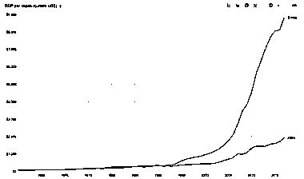 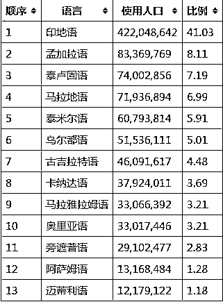

评论区：

 

 

亦仁 : 这篇文章纠正了我很多对于印度互联网的认知偏差，虽然只是星火几千字的文字分享，但背后可能是几百万、几千万买来的经验和教训。

Jimi : 务实接地气

不许变懒的猫 : 感谢分享，原来是这样的“印度”，文盲率居然高达50%，而且还多语言。

确实不能和中国比。

济颠 : 修复很多认知

此岸 : 是不是可以谨慎得出这个结论：印度移动互联网唯一变现的模式就是广告，做订阅变现几乎不可能只少非常困难

星火 : 可以针对极少部分高端人群做，这部分人与欧美直接对标

方波妮 : 居然有这么多种语言！！而且不是中国方言这种。。

阿枫 : 这才是真实的印度市场，与我们映像中的印度市场相去甚远

# **# ****(50**赞**)2023**年东南亚的跨境电商，一个出海

# 的时代序幕正在进行

作者：  夏冰雹

日期：2023-07-25

大家好，我是夏冰雹，一个做东南亚跨境电商的卖家。

作为早期分享东南亚电商创业经历和资讯的一员，在持续深耕东南亚电商行业3年之后，希望通过自己的2篇演讲分享内容，给生财的伙伴，带来出海尤其是东南亚电商出海的一些信息更新。

(因为个人时间的原因，并未将其进行重新整编，还请谅解。)

以下内容我将其更新为2部分：

 

 

在上半部分，《穿越寒冬，东南亚卖家的增长困局与自我跃迁》中，我将为大家分享，在东南亚红利期的电商平台下，我因为选取模式的不同，所遭遇的困境与突破方向。

在下半部分，《拥抱变革：东南亚卖家的持续增长与创新之路》中，  我将通过跨境电商底层的变化和卖家的成长之路，分享【卖货人】需要跨过的几个门槛。

其中，我认为对生财圈友有核心价值的是：

**1.**在国内增速滞缓的情况下，在中国跨越中等规模陷阱的过程中，势必会带来大量就业的不饱和，中国人会越来越多的往外走，东南亚是必争之地， 早出海，早吃肉。

2.在东南亚地区，中国对印度尼西亚、菲律宾、越南，这三个人口过亿且发展落后、具备产业转移潜力的国家，有巨大的时光机效应，仍是未来3-5年的出海热地，要出海，先去这三地。

3.在东南亚地区，虽然电商已经不像前几年拥有大量小白玩家可以入场捞金的机会，但另一种本地化的机遇也在出现。

以下正文。

# **# **** **

# **# **上半部分：《穿越寒冬，东南亚卖家的增长困

# 局与自我跃迁》

 

 

（2022年11月26日）

大家好，作为一个暂时还没有被市场卷死掉的小卖家。

站在这里，是希望跟大家探讨，一个不能够完全称之为寒冬，

却也是陷入在增长困境的泥潭中的我，

为什么会这样，应该怎么办，将来往哪去 的思考。

我们先来看一组媒体的数据：

shopee在2021全年的订单增长是116%，这意味着，只要在2021年初，卖家在shopee上开店，就有机会吃到年增速116%的“平台红利”。

也是在去年，我看到太多“几个人”的团队，在半年到1年的时间，在东南亚的任意一个市场，迅速做起来一个月营几百万的项目，

包括我们自己的团队。

而在2022年，纵观全年，我无法给大家一个确切的数字，但我们自己的团队体感是0-20%。增长很慢甚至没有增长，但却也没有死掉。

所以，不能够称之为寒冬，因为没有发生大范围的卖家死掉，相比于亚马逊2021的大规模封店潮与限制库容，相比于国内的电商卖家几个月都发不出货。东南亚的卖家，只能说是陷入了增长的困境。

增长的困境来源于哪里？

我们先看整体的市场空间，我们首先得承认的是：

 

 

第一个，东南亚相对于欧美、中国，整体的市场空间有限，尤其是单个市场，体量更小。整个东南亚市场前三名（印尼+泰国+菲律宾）的GDP加起来，堪堪够我们一个广东省。

第二名泰国，还没有我们湖南省GDP高。

我曾在群里看过这样一则对话：什么？你在做印度尼西亚的电商？

那地方的交易量还没坂田多！

话粗理不糙，其实东南亚尤其是单个市场的天花板，是非常有限的。

在有限的市场空间里，大多数会且只会出现一种结局：

强者越强，弱者越弱。最终，赢家通吃。

我们再看电商市场，2014年、15年，在移动互联网的浪潮下，lazada、shopee在东南亚的市场快速兴起。

 

 

直到疫情开始，线下交易接近冻结，以shopee为核心的平台电商，在疫情下快速发展，提高了东南亚电商市场占零售总市场的份额。

所谓的东南亚的市场红利，其实是线上电商对传统线下零售的侵蚀。

2022年上半年，东南亚多国宣布疫情全面结束，线下零售全面恢复，线上的发展进入相对瓶颈，电商的机会也减缓了。

与此同时，Shopee股价开始大跌，很难以高市值向市场拿钱。

在线下市场恢复，平台电商减少砸钱买量之时，电商份额的增长不再由平台电商驱动，以TIKTOK Shop的内容电商成为新的领头羊。

**“**红利期**”**电商平台的势能开始转变。

第三，Shopee正式进入成熟期，具体的表现是，

在东南亚市场，产品的供给开始大于用户需求，在大多数的**“**关键词**”**下，都有超过几十甚至几百上千的产品。

卖家亦然，从疫情下，卖家可以通过更低价格、更快时效的本土模式（物流省下的成本），享受市场和平台的双重红利。

到疫情后全面放开，市场红利消失，需求红利消失。

 

 

潮水退去，我们在裸泳。这个时候拼的不是谁游的快，而是谁更有肌肉，谁更有性价比。既然大家产品大差不差，只要你价格更低，你就可以获得用户。

东南亚市场，已经全面进入了本土供应链的竞争态势。

在市场空间有限、平台增速有限、市场内卷严重的三重大前提下，

我们卖家怎么办？

必须要正视自己的是：过去的发展，好像也不全是自己的实力，更多就是时代的运气。

潮水褪去之后，发现自己只有：

1.称不上正规军的团队：内部团队并不够专业化，人才稀缺，且运营上也十分粗犷。典型shopee卖家特征是，老板作为一头牛，干全公司40%、50%、60%的业绩，拉着公司一起跑。

**2. **算不上有竞争力的供应链：Shopee的客单价大多在30-50块钱，这个客单的产品，大多数都是1688采购的，能便宜几块钱？很难与竞争对手拉开明显的竞争优势。

3\. 不够性感的投资回报和躺在仓库的一堆死货，除中国台湾外，东南亚卖家的订单利润率其实很高，但是客单价和周转率非常低。

4.以及面对未来增长的深深的无力感。

我们卖家怎么办？

我想讲一个我们自己的故事。

 

 

我是一个本土精铺型卖家。什么叫做精铺，就是在2021年，精选产品，挑一挑，然后本土备货过去。在市场和模式的双重红利下，在shopee的任何一个站点，都有30%利润以上的产品，都卖得好，都好卖。

于是，今年上半年，我干shopee一年半，团队选了超过3000个品。

好消息是，陆陆续续淘汰了1000个。

坏消息是，还有1500个不动销，不动销的品，剩几个、十几个、二十几个，不算不知道，一算吓一跳。

感觉自己赚钱了， 结果钱都在货里，货不卖了、成了**“**死货**”**。

不仅如此，随着不断增加的SKU，每周还在产生新的选品，总要人来管吧？于是团队不断加人，利润一算，全发工资了。

人效失衡开始成为严重的问题。平台没有增长，内部管不过来，销量不增反降，利润持续走低。

我在想公司是不是要倒闭了。

**1.**定方向：得转型做精品

 

 

作为卖家，我们不是来东南亚市场扶贫的，如果有朴素的使命，就是赚钱，朴素的愿景，就是在东南亚电商里赚到1个亿，朴素的价值观，只要赚到钱就是好猫。

但实际上，原有的商业模式已经支持不了我们赚钱了。

必须转型，不能只卖货，要做精品，要搞品牌。怎么搞？

目前，shopee80%的卖家都在朴素的抄作业，包括我自己。只有极少数的卖家在搞开发。这些卖家辛辛苦苦搞的开发，自己还没赚几天钱，马上又被跟卖的盯上了。

我这里不是在讲开发和跟卖的区别，我是在讲我的做法：

在电商市场的产品，都是有生命周期的，我把所有在衰退期、没有利润的产品全部砍掉，全场7折。（当然，部分有供应链资源的伙伴，可以从工厂端再次降低成本，继续内卷。）

我把所有在饱和期的产品，让我的小伙伴全面开启价格战，你降一块，我就降2块，直到没有利润就砍掉。

 

 

在成长期的产品怎么办呢？他是我们的宝贝，我把他从我剩下的500个sku里找出来，未来1到3个月，70%的利润都是这些宝贝们贡献的。

我尤其重视，在我聚焦的方向上，引入东南亚市场中，还没有的**20%**的产品，把他做起来。他们能支持我们未来6个月甚至1年的利润。

既然，平台上绝大多数的卖家在偷懒，在轻而易举的跟卖，而不是往重了做分析，理解用户，挖掘和打造属于这个市场的产品，我们得做做产品开发了。

这就来到了第二个环节：算账。

**2.**算清帐，把有限的资源集中到最有产出的事情上

这里的帐，指的不是财务的帐，是业务的帐。

每个企业的资源都是有限的，你的精力是，你的员工的精力是，你的资金也是，包括平台的资源包、你的广告预算也是，

要把最好的资源放到最好的产品上，不能分散。

所以，你看你的项目，投资回报比怎么样？（要不要做东南亚电商？）

你看你的市场，那个市场的资金周转率更高？（选择哪个站点？）

你看你的产品，那个产品比较好，比较有潜力，比较能帮你赚钱？（怎么挑选类目和产品？）

也就是在算完账之后，我暂时性放弃了印尼，全面主攻泰国。

 

 

也是在算完账之后，才能快刀斩乱麻的把那些产品都清掉。

**3.**理库存：进行产品分级，加快库存周转

这里的库存，不是那堆死货的库存，东南亚本身就是全球清货的市场。

我指的是，那些要聚焦的品类，那些很有潜力的新品，应该怎么补货备货呢？

我们团队内部有一个共识：如果这个品，没有把握做起来，就不要做。既然要做，就要做**TOP**。

我们把产品分为ABCD4个等级，重点在2个环节去动态调整产品的评级。第一个是市场调研阶段，这个产品在市场中，处于什么样的周期？这个产品目前的TOP10的月销在多少？目前的销售趋势是持续上升还是已经进入饱和？

在这个阶段，我们会进行第一次产品评级。

按照A、B、C、D四个等级，进行产品的第一次备货，就应该瞄着TOP打，不成功便成仁。

但是，有没有可能分析不够到位，盲目判断了？

 

 

所以我们要在第一次测试的时候，根据我们的干预手段+流量释放，进行第二次的产品评级，点击、加购、转化率有没有达到TOP产品的指标？（调整评级排序，再次分配倾斜资源。）

每个类目每个产品的情况都一样，不可能每个产品都能上TOP的。

只不过在你有限的资源里，给ABCD的产品，不同的备货和运营资源罢了。

最后一块，是共成长。

你的方向在哪里？你想做一个什么事情？

你想做精品？你就需要往供应链去挖。

你想做品牌？你就需要内容方面的人才。

你想简简单单赚点钱，你就应该把能开掉的人都开掉，能省出来的钱都省出来。

你要想管理省事，你就必须搭建从运营助理到运营到运营组长的SOP。（可以加我微信获取：xiabingbaol）

你想要业务流畅，你就必须搭建从定市场、品类，再到选品及产品运营的精细化运营链路。

也就是在这一系列的动作之后，我们团队实现了连续4个月12-15%的订单与利润双增长。

 

 

2022年，我和很多的卖家交流，因为我有做一个卖家俱乐部，叫做起航俱乐部，大家在一起交流，逐步得到的共识是，

卖家在东南亚的未来机会点有且只有：

追蓝海的快：挖掘短时间信息差的蓝海类目和产品。一些玩蓝海的卖家跟我说，只要shopee不倒台，消费者的需求就是在拓展和迭代，只要我软件扒的够快，蓝海产品永远在！

做内卷的王：给平台用户带来更具**“**性价比**”**的产品，还有一群玩家，拼命搞内卷，我都不爱跟他们玩，局外人会说东南亚市场真的卷啊，卖这么便宜怎么赚钱啊？

造品牌的梦：建立品牌对用户心智占领以带来客单溢价和多渠道销售，最后，也是我最敬佩的一群的人，他们通过

 

 

提前布局，在TIKTOK内容成本低廉的时候，快速的把市场认知打出来，初步的构建了品牌模型。

我放到最后讲。

我们先聊聊精品卖家。

为什么不聊蓝海？shopee的蓝海机会太小了，一个月可以做几万、十几万的利润空间，但是最终，还是得回到内卷的赛道上来。

在我们今年举办的广州、深圳、厦门的线下聚会上，我发现了一个很有趣的现象：

今年还能够跑赢大盘，拥有月20%增速的卖家，是精品型卖家。

我仔仔细细分析了他们核心的能力，

一是在于他们敢，在绝大多数人都在跟卖的时候，敢根据用户需求做“东南亚市场上”没有的新产品，去享受完整产品生命周期的产品红利。

二是在于他们准**,**总能抓住市场量大，用户刚需的产品。

三是在于他们狠**,**为了最大化的享受产品红利，去玩命的扩大产品规模效应，降低边际成本。坚信利润是优化出来的，完全抛弃小农的高毛利思维，做TOP Seller，做霸屏式的TOP Seller，挤死对手，赢者通吃。

 

 

跨境电商，80%的卖家都是贸易商，贸易商的核心竞争力，就是性价比。就是让消费者，用更低的价格，买到更好的产品。

**“**敢、准、狠**”**。背后的核心逻辑，性价比的核心逻辑，

就是因为他们洞穿了卖家的增长飞轮：

只有通过市场上的新的品类和产品，找到那些更有差异化、更有性价比的产品，才能给平台的消费者带来更好的用户体验，

获得平台更多的流量资源。

只有获得平台TOP的位置，才能有相对稳定且量大的销量，才能优化整个供应链的成本结构。

才能带来更强的**“**性价比**”**产品和市场竞争力。

只有拥有更强的性价比产品，才能通过多平台多渠道的销售，扩大自己的规模效应，获得所有卖家都想拥有的壁垒：

总成本相对优势。

在这其中，要特别重视平台的运营：

 

 

**   1. **整体上拥抱**mall**店；核心原因就是，第一，在shopee的手机端，有专门的Mall店入口，有更好的流量位置，和产品排名。第二，**Mall**拥有专属的经理，意味着更优质活动位置、资源包、以及资源包带来的广告返佣。

**2.**虽然**Shopee**是一个重价格，轻运营的平台，运营技术大家很难拉开明显的差距。

但是，强化自己团队在平台获取流量的能力，把产品运营上TOP的能力，在一些基础细节，如标题的关键词布局、图片视频及评论，把各个环节的细节优化一点，就可以积累差距优势。

**3.**多平台运营的能力，千万不要吊死在一棵树上，比如做shopee的，不应该放过lazada。起航俱乐部从去年年底，就号召做shopee的卖家拓展lazada渠道，目前绝大多数shopee卖家，都获得了**lazada**新渠道带来的**20%-50%**的订单利润增长。

除此之外，在飞轮的增长中：

你可以通过以下四个方面，通过规模效应，放大成本优势，盈余**20%**左右的成本空间** -**卷死大部分对手。

 

 

如果说，这是可以通过团队的努力可以实现的增长飞轮，你抓住品类机会（抓**tiktok**的品类机会），抓住产品生命周期的红利，抓住机会上**TOP**获得销量，放大规模优势，从而稳定库存，形成多渠道销售网**-**提高周转。

你就有可能，在典型的价格敏感、产品差异化小的东南亚市场，构建起自己的初步核心壁垒：成本优势。

再次强调，作为贸易型卖家的核心，

**“**就是不断优化整个（供应链**+**营销链）链条的成本，给消费者创造更低价格、更多选择、更好产品的**[**需求解决方案**]  ”**。

除此之外，我提一个特点：

以更加精准的用户人群为画像的风格店模式，开始成为中小卖家的高客单高转化的新出路。比如luolita、比如大码女装。

在shopee的中国台湾站点，是风格化趋势，表现最为突出的站点。

而东南亚的任何一种风格化模式，都可以在淘宝找到对标。

 

 

何为自我跃迁？跃是一种姿态，迁是一种转移。

大家都玩过跳一跳吧？

作为平台的电商卖家，实际上就是站在跳一跳的台子上：

当你在思考跃迁，你是需要“减负”、需要“助推器”，需要拼全部的力量，并且找准落脚点，才有机会够得着的。

我们先聊聊转移。

跃迁一：从平台电商到内容电商的迁移

在电商的层面上，平台电商和内容电商，获取流量的方式完全不一样。

平台电商的三要素：流量点击转化率。是根据用户的需求，去选品，去做图片价格，去搞评价提升转化率。你是在平台1.0的规则下，满足用户已有的需求。

而内容电商是，是通过视频， 通过所见即所得，通过更真实的人货场，激发、创造用户的需求。

还记得开局的那张图吗？

后疫情时代，以TIKTOK为核心的内容电商，将再次拉高电商的市场份额。

而最核心的，就是内容能力。

 

 

绝大多数的平台卖家，是具备内容能力的。

我们有文字的能力，每个产品的标题，也就是关键词，是我们获取平台能力的密码。我们有图片的能力，为了吸引消费者的注意力，我们恨不得在主图上玩出花来。

但从视频开始，我们就开始失去主动权了。

视频的生产成本更高，从脚本到演员“产品”，再到服化道以及场景，从拍摄到剪辑成品，在专业的MCN机构里，平均一个视频的生产成本都在**500-1000**块钱。

而直播，就更不具备了，除了马来，其他东南亚国家基本上都是自有语种国家。直播的成本更加高昂。国内的一个成熟的直播团队，基本上是需要3-5W的固定人工成本的。

但是，东南亚不用。如果你选择自营电商。

在印度尼西亚，一个主播的成本是1000-1500人民币一个月。也就是，2W人民币你可以请10多个主播，去给你全职直播，创造你的产品的直播内容。与此相似的还有菲律宾市场。

 

 

这也催生很多的市场**“**利润**”**，有些朋友有机会，直接在当地搭建直播基地，获取红利。

目前，起航群内自营Tiktok的月销天花板是近150W人民币/月。还在高速增长。这都是我们俱乐部真实的案例。

如果你在当地拥有比较充足的货源，你也不想自营直播，或者感觉还没到时候，可以考虑达人分销，这个是只要你的产品有竞争力，合适的价格和分佣比例，就可以躺着出单的机会。

因为，东南亚目前不缺MCN，不缺机构和达人，缺的是优质的供应链货盘。

俱乐部的梁总，提了一个很有意思的**“**达人分销**”**玩法，叫做**TK**渣男论：

抛出诱饵，广泛撒网，重点捕捞，长期维护。

（抛出样品的诱饵，有针对性的撒网捞出达人，针对表现力好的达人长期建联，长期合作。）

就可以享受达人分销带来的躺赚。

如果还想更省事一点，就直接外包给MCN吧。目前**Tiktok**已经证明了他的卖货能力。

这是在这场迁移中，卖家不应该错过的机会。

我们在聊聊“跳跃”。

二、卖货到卖品牌的思维之跃

在东南亚，Tiktok正在或已经成为最大的内容平台。

在这样一个东南亚极具影响力的内容平台中，未来的十年，是属于中国卖家根据本土人群的需要，创造品牌的最好机会。

怎么让自己，从卖货的，变成卖品牌的货？怎么跳上这样一个台阶？

首先，我认为此刻**Tiktok**的流量，

 

 

一定是未来十年中最便宜的**“**内容**”**流量。

这一点很多的卖家已经给我们证明了，在中国，做一个消费品牌的投入是3000W或者更多，而在东南亚，在Tiktok，做品牌的投入可能低至300W或者更低。

核心，就是**Tiktok**目前仍然十分低廉的流量成本。

你（或达人）生产的视频，有机会被百万次、千万次传播；

你（或达人）生产的视频，有机会带动新的用户继续模仿；

然后深深的植入消费者心智，完成种草。

未来，品牌的品，是产品，品牌的牌，是内容。

内容需要极具影响力的平台，内容需要被重复的传播和种草。

Tiktok天然具备这样的属性。

我们了解过很多的概念，比如私域，比如品牌，比如兴趣电商，核心都是内容。

从这个阶梯的卖货郎，到下个阶梯的卖货郎，核心就是创造内容。

卖家的自我跃迁，就是把依靠市场的红利，平台的黑科技，供应链的成本优势，抱着**“**自己**”**跳到内容电商的船上。

最后，希望大家，有资本就贪婪，没资本就稳住。

只要公司不做大，你就很难死。

活着，就有机会实现自我跃迁！

# **# **下半部分：《拥抱变革：东南亚卖家的持续增

# 长与创新之路》

 

 

（2023年6月30日）

过去半年，一个非常核心的问题一直在困扰我，

作为东南亚卖家，在未来的**3-5**年，应该走向一条什么样子的发展道路？

因为起航俱乐部的原因，我有幸和非常多的千万级、亿级卖家学习交流，

在这种深度交流的过程中，我得出了一些思考，在今天分享给大家。

这次的分享，会分为**4**个部分，约**7000**字，阅读时间**10-15min**：

我认为，东南亚电商由开荒的浅海红利已经进入深海搏杀阶段，在这个阶段中，东南亚卖家呈现了典型的K线分野。

一半是海水，一半是火焰。

很大比例的卖家在黯然退场，仍在昂扬前行的是精品型卖家，我会分享他们能够获得持续增长的精品五维模型，以及在未来的东南亚市场中，能够给卖家带来十倍速增长的创新机会点。

每个创业者，都要走自己的路。

 

 

首先，我们先来看看一些个人的论断性见解。

2021年，我从欧美亚马逊，转赛道进入东南亚，是因为我非常确信在未来的10年发展中，东南亚地区的经济发展趋势，一定是一股非常强劲增长力量。

2年前，我认为以中国为核心的周边经济新秩序在建立。

周边最核心的一站，是东南亚。

2年后，我的理解更深一层，在这种经济新秩序在形成的过程中，在未来的10年发展中，中国对东南亚的经济发展趋势，是中国优秀的企业家们，通过资金、人才、技术、管理，把中国的优质产品供应链，带给东南亚。

中国在区域型经济体中逐渐获得统治地位，会形成新的区域经济秩序和经济格局，在这个过程中，会有3个具体表现：

**1.  **中国供应链的性价比输出与劳动力，向更低成本地区迁移。

 

 

**2.  **中国优秀的企业家和资本、管理、技术等向东南亚输出。

**3.  **中国品牌占领东南亚。

这个过程不是现在才开始的，早在几十年前，

东南亚的各个国家，都有我们的华侨、华人，去到当地。

而在这个阶段，在当地耕耘沉淀了多年的华侨华人与国人的碰撞合作，国内创业者与东南亚本土的融合，出现了“井喷”式的力量，击穿了那个量变到质变的点。

中国加速崛起的浪潮中，很多事情正在自然的发生：

中国供应链正在向劳动力更低成本地区迁移。

在电商市场中，中国的产品由自生产、直发贸易，开始过渡到当地组装流通，并朝着终局走去：

中国输出技术、管理、资本，东南亚国家进行生产流通销售的贸易体系。

 

 

在这个过程中，我们会发现3个劳动力机会市场：

印尼、菲律宾、越南。

他们拥有相对庞大的人口数量，开始获得部分的人口红利，并享受由中国溢出的产品供应链，以加速本国的经济发展和人民的幸福生活的机会。

在大势能、大趋势的引领下，我们回归电商，同样大体经历了这么几个发展历程：

**1.0**阶段，供给小于需求，消费者、市场、平台都缺货，只要上架就能出单，造就了店群的盛况。

**2.0**阶段，供需关系开始趋向平衡，产品丰富度极大提升，大量低质低价的产品出现内卷，性价比成为该阶段的关键。

**3.0**阶段，供给大于需求，产品同质化和内卷成为市场的主旋律，差异化的新产品，升级产品、组合产品、本土化产品，成为增长新机会。

**4.0**阶段，品牌从单纯的**“**产品**”**角度杀出，不在局限于平台及线上渠道，而是打造产品，通过产品与达人，不断生产内容，激活用户认知，达成认知-信任-复购的品牌循环。

 

 

（在商业世界中，这都是并行发展交织的，而不是前一个阶段的结束才是下一个阶段的开始。）

最终，走向企业深耕、产品本地、渠道多元的生产**-**销售的全链路。

2023年，Shopee，Lazada，Tokipdia这样的货架电商，都面临同样的问题：

在从100%甚至200%的高速增长增长中陡然失速，进入两位数、个位数甚至负增长的周期。

由平台传导至卖家的，真正的核心问题是：

Shopee、Lazada进入了成熟期之后，卖家如何应对从增量市场向存量市场经营转变。

 

 

我们可以很清晰的看到，Lazada、Tiktok包括Shopee跟进了全托管战略。

平台一样在求变。

本质上，平台推出全托管，是一场平台内部商品生态的，

效率变革，是对经济型供应链的重塑。

经济型供应链，是指那一些在市场需求长期处于易预测的状态，供应稳定性也因此易容易满足，所以供应链以最大限度压低成本为优先的产品。

这一类型的，大量客单集中在5美金左右及以下的产品，

没有比平台自己下场干，更能压缩成本的模式了。

平台没增长，自己还要下场，革经济型供应链的命，平台生态里的卖家会怎样？

我认为，2023年，将成为东南亚电商一个重大的分水岭，

曾经源源不断的新手卖家，构成的电商平台的金字塔基底，正在快速的退场、死亡、消失。

一场底层的，结构型的演化发生了。

 

 

未来的**3-5**年，东南亚卖家格局会呈金字塔向纺锤形的变化。

在这个演化的阶段，会有几个显著的特征：

1**. **行业上腰部分的大卖，将在产品选择（SKU）、产品性价比、供应链渠道等获得长期积累的优势，通过规模效应滚大雪球，逐渐占据市场的主导地位。开启向品牌化、产品力、多元本土渠道发展。

**2. **行业中腰部分的卖家，将面临相对激烈的市场动荡，在中等规模陷阱中，理智派保留利润，缩小团队规模持续赚钱，激进派融钱扩量抓住仍有机会的向上渠道，深耕供应链与多平台运营。

**3. **行业尾部和底部小卖家，将感受商业市场生态中，纯粹的赤裸裸的恶意，在竞争压力和高门槛中，努力求活或者退场。而这一批人是最多的。同时，小白和新手卖家进入数量将大幅减少，成长难度将被快速拉高。

4\. 专业化的工厂型、工贸一体型、品牌型玩家将择机入局，进一步推动生态的完善和升级。

 

 

至此，东南亚卖家市场，在从金字塔走向纺锥形的卖家生态变化中，将呈现典型的卖家**k**型发展战略路线爬坡。

第一层阶梯是技术：从小白到个人卖家，能够收获月5000-1W的利润，核心是运营技术的从0到1，如选品、运营、广告等。

第二层阶梯是团队：从月利润1W到月利润5W到10W的突破，核心是自己的能力能否被团队所复制，更重要的是团队的组建与配合。

第三层阶梯是供应链：在产品上能够根据品类与工厂进行合作，在物流上完成散货到整柜的突破，获得整体供应链的利润优化空间，是决定月利润20W以上乃至更高的可能性。

第四层阶梯是产品：在完成团队1到10的复制，供应链品类的1到10的复制，核心是能否根据东南亚的市场，完成自我精品运营模型的打造。

在卖家的K型发展图中，有两条很重要的曲线。

一条是底部逆向的，没有任何趋势、市场红利助力的，只能逆向爬坡的，成长之路。

 

 

今年在很多的东南亚电商群，看到部分卖家，在清货离场，连着项目以及本土团队，一同打包售卖。

原因多种多样，但本质上是对东南亚市场的了解不够，对东南亚的信心不足，以及错过红利期后，自身商业模式与能力的问题。

非常核心的一点是：

在性价比的竞争里，大部分卖家无法做到产品价格、供应链成本、海外仓成本的压缩。

2023年了，供应链已经是生存的根基，而不再是高纬度的优势。

比如说印尼的物流，散货与整柜仍有300-500每立方的价差，而这样的供应链机会，也仅仅只剩下1年甚至半年的时间。

 

 

时机一过，供应链的优势差就会被全部抹平。

有，你能活，没有，你会被洗出去。

另一条是顶部顺向的，击穿供应链的卖家，

他们在快速的进行，供应链的复制、团队的复制、产品的创新，和下半区截然不同的是，他们反而获得了更加高速的发展。

这也是今年和年营5000万甚至几个亿的卖家，深度交流的体感。

越是头部卖家，增长越是迅猛。

在商业的世界里，大鱼吃小鱼，从来如此。

 

 

为什么，凭什么？

时间线拨回2021年，东南亚电商的发展进程，因疫情这一特殊时刻获得爆发式增长。但是在2021到2023年，这近**3**年的发展过程中，同样的入局者，甚至同样的入场资金，最终却产生了天差地别的发展阶梯。

在我大量的与卖家深入交流，并复盘过去2年，我的抉择的优与劣中，越发感慨，选择大于努力，连续做对选择远远大于努力。

第一个是平台的选择，shopee的机会与成长天花板，远大于lazada，从数据看是4倍。

第二个是模式的选择，一是跨境与本土形成了泾渭分明的鸿沟，二是铺货、精铺、精品的先易后难与先难后易，决定了2023年谁还能活下去。

第三个是市场的选择，不同站点的资金周转率与市场空间，又产生了规模几何倍数的差距。

第四个是品类的选择，竞争度大、更有门槛、更有供应链优化空间、更有产品差异化创新的品类，产生了营业额4-6倍的差别。

第五个是产品的选择，跟卖市场与根据市场开发不同的选品模式，决定了产品是3-6个月的生命周期还是2-3年的生命周期。

多重选择的叠加，在市场增速滞缓的阶段，产生了一条近乎无法逾越的鸿沟。

背后是年营规模的、规模下月营利润的、利润下的团队组织架构的、是否深耕产品供应链的，层层【阶梯】。

 

 

我们先来聊聊模式，2020年前，市场最赚钱的卖家，是铺货店群型卖家，

2021年，本土精铺型卖家快速走向上升期，2022年，本土精铺型卖家陷入增长困境，精品和品牌型卖家开始快速增长。

选择什么样的模式，并是否能够根据市场变化进行模式升级，决定了**2023**年，牌桌上还能剩下谁。

我们再来聊聊市场。

前段时间，有朋友问我，我准备做母婴品类，是先做菲律宾还是先做印尼。

母婴这个品类非常有意思，它和当地国家的人口出生率非常相关。

2022年，新加坡每年新增的人口数约5W左右，而印尼是550W，是新加坡的**100**倍。

看到这个数据，不用思考，一定要去做印尼。

 

 

我们接着聊聊品类赛道。

目前，除美妆外，在东南亚，小家电赛道已经出现了一些品牌。

也是更受资本市场关注的一个赛道之一。

小家电品牌Simplus创始人Jack曾说过：“东南亚市场超6亿人口，其中50%以上都是30岁以下的年轻人，随着在国际供应链中的地位不断提升，整体东南亚市场特别是年轻人的消费市场，也迎来快速增长和消费品质升级的时代。”

背后实际上是JACK对小家电赛道的洞察，用户刚需，增速迅猛，发展空间极其广阔。

小池子养不出大鱼，如果想成为大鱼，

就应该去海里。

 

 

最后，我们聊聊产品型卖家和供应链型卖家。

**3C**美妆本质上是属于产品型的品类，款式迭代速度极快，每年都有非常多的新品出现，也因为产品体积小，没有太大的供应链优化空间，只能专注于产品迭代。

家居尤其是家具产品则恰恰相反，属于款式迭代速度较慢的品类，也因为产品重量体积大，在目前的东南亚市场，仍有较大的供应链优化空间，同时也可以根据市场特性去进行微创新。

以上，让我不得不感慨的是，选择大于努力，选择远远大于努力。

只有连续做对选择的卖家，才能活下来。

 

 

在去年的分享中，我带来了卖家的增长飞轮。

非常核心的点是，卖家需要抓好新的品类、产品的机会，去给市场带来差异化的新品与更具性价比的产品。

只有2条腿走路，同时抓住差异化和性价比，才能加速飞轮转动越来越快。

我们看看精品型卖家，推动飞轮高效增长的五维模型：

产品** X **供应链** X **渠道** X **财务能力** X **组织能力。

 

 

在产品端，基于运营部门的数据和需求反馈，通过爆款逻辑，主动的进行产品开发方向和路径选择，有效挖掘和赋能供应链。

同时与工厂包括上游原材料等进行深度合作，进行产品设计与功能的差异化创新。

在供应链端，基于工厂的深度合作有价格优势，通过整柜运输及自报关获得物流优化，通过自营海外仓或深度第三方合作，获得海外仓效率的提升，通过产品的合规进行出口退税，达成整个链条的成本优化。

在渠道端，一方面在Shopee、Lazada这样的货架电商平台获得TOP链接甚至霸榜式的**TOP**链接矩阵，另一方面也在通过平台的小**B**打通线下的批发渠道，包括自建/合作的线下销售代理等，同时在Tiktok等新渠道获得新增量。

而在产品X供应链X渠道的3维链通背后，是基于企业的财务模型和商业模式，投多少钱能在多少时间赚多少钱的确定性下，可以略微激进的撬动杠杆或多赢合作的资源配称。

 

 

另一方面是组织能力的建设，我有见过精品型卖家，10个人的团队能够干5000-8000W的年销售额。

但在今年1.5亿-2亿的战略目标下，同样需要完成组织架构的调整，一是组织架构从扁平化向层级化转型，二是组织文化从业务中心向使命愿景价值观的变化，三是管理团队的选用育留与业务模型的适配。

2023年，同样是东南亚精品卖家补课的一年，精品的五维模型缺一不可，缺哪补哪。才能去完成【财务支撑】**X**【团队复制】**X**【品类深耕】**X**【供应链优化】**X**【渠道站点多元化】的五维精品运营模型构建。

结硬寨，打呆仗，最后拼的都是综合实力。

最后一part，我们聊聊增长的核心，创新。

机会一：产品创新。

在这里，我想分享一下，跨境一哥安克创新的阳萌，在很多场合讲过的一个故事：

 

 

**2013**年，欧美市场原装电池售价在**80-100**美元之间，在亚马逊上的评分大约是**4.5**星。而出口卖家在亚马逊上销售的电池价格约为**25**美元，但评分只有**3**星或**3.5**星。

我认为这里一定存在机会，即在**40**到**50**美元的价格范围内提供**4**星到**4.5**星的产品。

我相信在场的东南亚卖家，一定会对这段话，有非常强烈的感受。

这是多么beautiful、Amazing的一段话。

我认为，在东南亚市场，大量的品类有大量的，普货低价产品（**10-30**）**rmb**与品牌产品（**100**）**rmb**之间，存在大量的稀缺性的价格断档空间，这就是机会。（不同品类的价格档不同，请勿套用）

不仅如此，由于大量低价产品同质化，在中高端价位，都有非常多的产品组合+产品升级的款式需求，卖家应该把所有的重点关注在当地市场没有的新品上。去做产品创新。

机会二：供应链的转移与承接

 

 

2022-2023年，随着TikTok Shop的发展，新入场的玩家，会发现一个非常神奇的现象，东南亚居然还在缺货，缺的是好货、高性价比的货、拥有差异化的新奇特货。

本地的生产能力实在太差了，而中国过去，却有超长的海运和清关时效。

在这个过程中，由于卖家买家双旺需求与当地供应链的生产能力不足产生的需求与供给矛盾，结合供应链的转移浪潮，我们会发现这其中有非常多的机会点。

比如说货盘，印尼缺的不是MCN和达人，是优质货盘。

比如说仓库，在东南亚不稳定的市场条件下，是否有稳定的仓库、发货能力。

比如说给投资出海的中国创业者，提供旅游、游学、当地工厂合作、签证及房地产置业等等一系列的需求。

比如说资源整合，中国的创业者的资金、供应链、管理技术与当地创业者的土地、人力、资源的合作。

这中间存在旺盛的，巨大的空间和机会。

机会三、四：**TIKTOK**渠道增量与品牌

在去年的4月份到6月份，我曾写过2篇文章，一是TIKTOK是卖家的渠道增量，而是TIKTOK做为内容的传播工具，将极大催发新品牌的建立。

目前，如果我们单从渠道增量来说，部分月销500万-1000万的卖家，TikTok每月销量占比贡献超过40%，还在快速增加中。

2022-2023，从TTS店群、短视频二剪、无人直播到TTS精品店本土直播，沉淀出来的三大主流卖家派别，本土自播、联盟达人分销、短视频投流。

 

 

我们认为本土直播能力是卖家利用渠道增量，能够带来长期效益的核心能力。

而从另一方面来讲，TIKTOK作为巨大的内容池、流量池和传播工具，目前的流量成本极低，正如我之前所说，当传播工具的费用被降到足够低，很多人都可以试一试拼一拼时，一个旺盛的，品牌爆发东南亚的时代即将来临。

未来的东南亚，一定是中国品牌群星璀璨的时代。

机会五：服务带来的长期私域机会

最后，想聊聊服务。

我在一位在国内做电商的朋友社群里学习。（感兴趣可以关注他的公众号：刘玮冬创业手记）社群发生过一次对话，有人问电商的服务是什么？

他的核心表达是**:**

1\. 我有运费险，你没有，我就比你服务好；

2\. 你7天无理由退货  我们是14天无理由退货，顾客14天来找我们，说不好意思最近出差了，衣服没来得及退，我们也给退；

 

 

3\. 保价，我们30天保价，很多店铺不保价  甚至保价7天、15天，一个月内买贵我们随时退差价；

4\. 所有问题，我们全解决，你洗了，说掉色，说就是不满意，吊盘剪了，说穿了不满意  那我也给退。退完差价  我们会强调一句  ，我们家绝对不会让顾客吃亏。

而这一切，当消费者被其他的商家欺负了，就如同她有一个非常好的男朋友，虽然天天关心她，但很平淡，她感觉不出来，但她有一天被渣男欺负的时候，她就会怀念起这个好男友。

而一切的服务好，并不是凭空来的，都是产品和服务赚出来溢价，来支撑的。

而在东南亚，这一切的一切，在大家卷低质量的价格战的时候，我们卖家关心的是退货率、是怎么少赔点，服务，好像和东南亚的消费者没有关系。

真的没有关系吗？

当你确定了，未来的3年5年还是专注于这个市场，还是这样的一群消费者，服务真的没有关系吗？这些一点一滴积累的优势、好评、消费者心目中的口碑，很大概率上，将成为你**3-5**年后的胜局的有力支撑。

 

 

只有扎根下去，深入本土化，深入产品供应链，你才有机会看到更长期的确定性。

从未来5-10年的角度来说，我们都要面对供应链产业转移+中国的资金人才供应链出海的巨大挑战，这个过程几乎是不可逆的。

我们能做的是，你要努力的成为一个跨国企业，并努力成为一个跨国企业集团。

以上。

评论区：

谦墨 : 写的很细[强]

夏冰雹 : 线下大会的演讲稿，然后整理的文字稿，还是比较细的~~谢谢阅读~ edo : 快来我们虾皮，让我们业务好起来，我就不用担心天天被裁员了[呲牙] 夏冰雹 : 哈哈哈哈哈哈哈你快招商

巧巧 : 怎么联系

 

 

# 【商业模式】**4**篇

# **# ****(**精华帖**)(277**赞**)**信息整合：一个可复用，低

# 门槛的成熟商业模式

作者：  明白（晚9点半睡觉）

日期：2019-07-15

《信息整合：一个可复用，低门槛的成熟商业模式》

任何一个行业，发展到某个阶段，一定会出现一种商业模式：信息整合。

一句话总结：将散落在互联网上，杂乱无章，需要花时间才能看到的信息，整理到一起，提供给用户。

这个帖子分享一下这个商业模式，以及我们该如何切入。

1 what？（是什么）

只说信息整合，太抽象，大家看例子。

（1）hao123

这个网站，大家应该都用过，中国早期的互联网入口，站长李兴平，后来千万卖给百度。

这是一个信息导航网站，将大家常用、但是记不住的网址，整合记录在一起。

后来创办的 4399：，也是导航网站，据说年盈利过亿。

（2）菜鸟教程

网站提供计算机编程的基础教程。

 

 

全球排名600+，国内排名前100，行业top3，中国500万+程序员，大多数用过他的网站服务，当然都是免费。

更厉害的是，整个网站从0到1到100，从研发到运营，都只有站长一个人。

现在每月也赚不少钱。

这 2 个虽然很厉害，但看起来好像离我们比较远，下面看几个比较近的。

（3）新榜

因为公众号兴起，大家不知道去哪里找这些公众号，所以这时候，出现一个类似排行榜的产品，将这些信息整合，大家需要查找时，直接到新榜就能看到几乎所有内容。

后来也有小程序，排行榜，也做培训，广告资源对接，知识付费服务等。听说很赚钱。

（4）阿拉丁

因为小程序星球，所有也需要有产品，将小程序的信息整合，于是有了阿拉丁。

后来也发展出小程序，阿拉丁指数，广告平台等业务，获得解决一个亿融

资，俨然是小程序的行业巨头了。

上面 2 个公司，已经体量很大，听起来离我们好像还是很远。

再近一点。

（5）短视频

最近 1 年，因为短视频火了，所以基于短视频的信息整合平台，必然会出现。

下面 2 个产品，成立时间都不长，作者也都在星球里。

抖大大：

toobigdata：

毫无疑问，根据历史推演未来，5G 来临，短视频会火，所以短视频的信息整合平台，也必然会出现一个类似新榜、阿拉丁的产品。

 

 

# **# **到底是谁？还不清楚，这需要产品、运营、营

# 销、以及对行业的判断。

还是没有感觉？

继续看。

（6）币乎榜

币乎：一个区块链内容平台。

写文章就能赚币，听说就是钱。（我也不懂）

因为币乎火了，很多人在上面发文章，这些文章，哪些点赞多，哪些受欢迎，就需要一个直观的信息整合平台。

于是，就有人做了币乎榜，抓取币乎的文章，然后做排名。日 pv 10w。

（7）捷径

因为苹果手机出了新功能捷径，于是有人整理了很多捷径列表，大家需要哪个功能，直接到网站上就能找到。

捷径社区：

捷径盒：

（8）  热点榜

每个平台都有热搜榜，那全部整理起来，一起看，是不是更方便一点？

今日热榜：

热搜榜单：

（9）小程序商店

除了阿拉丁，还有一些关于小程序的产品。

大梦想商店：  大梦想小程序商店为你提供热门、实用的微信小程序,帮你发现更多好玩、好看、好用的小程序。

 

 

知晓程序：：知晓程序,让你更知微信小程序。我们提供微信小程序开发资讯,解读微信小程序开发文档,制作微信小程序开发教程

（10）工具网站

新媒体领域有哪些工具，可以提高效率，来个网站整合一下。

考拉新媒体导航：

广告人导航网址：

（11）跨境电商

跨境电商里有哪些好用的网站、工具，整合一下吧。

（12）知识星球精选站

有哪些优质知识星球，整合一下吧。

（13）webscraper

webscraper 里有哪些好用的模板，可以让我直接拿来用，我来做一个吧。

（14）其他

2 why?（为什么这个模式能成立？）

上面列举了一些信息整合的例子。

可能听到之后，你会惊讶：什么？把一堆乱七八糟的信息，堆到一起，这东西竟然有商业价值？还能赚钱？

是。

信息整合，本身就是一件有价值的事情。

因为它节省了用户的时间，节省了时间，用户就愿意用，甚至愿意付费。

特别是在知识付费时期，就更容易了。

 

 

3 how？（我们该如何切入？）

上面的例子，有的离我们比较远，比如 hao123。

有的离我们比较近，知识星球精选站，捷径导航网站。

你可能会说，这些别人都做了，我已经晚了。

不，这类需求很多，只有有信息沉淀的地方，都可能做出一个信息整合的产品。

这个需求可以很小，小到什么程度。

（1）微信群有分享，你把分享内容整理一下，大家是不是会感谢你？群主会不会给你发红包？

（2）生财有术的精华帖，你整理一下，亦仁会不会给你来一个满格赞赏？

（3）前几天有人整理了 50 个公众号文章，朋友圈卖 50 块钱

（4）以前星球有人问，谁有裂变海报？然后大发哥做了一个小程序，将这些海报整理起来，限量查看 XX 张，付费查看更多。

# **# **有人抱怨的地方，就可能做出这么一个产品。

还有哪些方向？

（1）围绕大体量产品

微信：新榜

小程序：阿拉丁

还有没有什么需求呢？

微博：可不可能针对某个领域，将一些大 V 的帖子精华帖整理一下。

博客：各大平台的头部大 V，整理一下。

头条：

抖音：

快手：

知乎：

 

 

（2）围绕行业

知识付费领域是不是缺个导航

程序员有没有什么需求，缺个导航

运营除了工具，还有哪些需求？

产品

营销

……

不同行业的资料包？

围绕自己的工作领域，看看自己平时需求搜集什么信息，这可能就是一个需求。

（3）从知乎找需求

在知乎搜索“哪”、“哪些”，“哪些XX”，你会看到大量这些问答，然后从里面的高赞回答挖掘需求。

（4）从百度知道找需求

# **# **同上。

一定要做网站，懂技术吗？

不一定，

公众号

小程序

知识星球

甚至个人号

或者一篇文章

不要局限

如何变现？

 

 

参照上面的例子，他们怎么变现，就模仿。

（1）广告

广告联盟

品牌广告

（2）分销

（3）付费服务

# **# **（**4**）培训

这可能是一个慢活，不一定很快就能赚到钱。

但能让你从 0 到 1，走完一个产品的全流程，如何挖掘需求、验证真伪、如何推广、如何变现，都能大大提高你的能力。

总结一下：

1 任何行业，都需要一个信息整合的产品

2 信息整合，能帮助用户节省时间，提供了价值，用户就愿意付费

3 从身边的需求、大体量产品、知乎、百度知道找类似需求

---------------------------------

https://www.hao123.com/ http://www.4399.com/ https://www.runoob.com/ https://www.newrank.cn/ https://aldwx.com/index https://www.doudada.com/ https://toobigdata.com/ http://bihubang.com/ https://sharecuts.cn/ https://jiejinghe.com/ https://tophub.today http://www.bjsoubang.com https://www.damengxiang.me/ https://minapp.com/miniapp/ https://www.kaolamedia.com/ http://www.addog.vip/ http://www.amz123.com/ https://www.amz520.com/ http://www.zsxq100.com/ http://www.iwebscraper.com/评论区：

 

 

Auroraaa : 这个，厉害！

浴火之凤凰 : 明白大佬总结的好！最近在做这一块

明白（晚9点半睡觉） : 优秀呀，可以交流一下，我也有研究，或许可以给一点不成熟的建议

浴火之凤凰 : 使劲的点头

姬丽佳 : 搜榜top 这个全网热搜榜单聚合平台，五月底立项，六月份开始开发，七月正式发布，服务器目前扩了两次，做这个项目就是一顿饭后，就下定决心一定要做，它来了。  感兴趣的朋友可以拉你进产品讨论群，帮忙改进。感谢明白[爱心]

青木 : 去年的时候试图做过一个信息整合的平台，起步定在了APP，然后开始商议（团队内部）如何推广、如何吸量、如何变现，结果越考虑问题越多，APP写了个开头最后头脑抽筋一般的听停止了。  看到您这个，又有点冲动，同时也豁然开朗，何不从一篇文章开始呢！  感谢分享。

明白（晚9点半睡觉） : 优秀！

布衣 : 这个厉害

# **# ****(**精华帖**)(162**赞**)**独创：必胜法之四步打造一

# 个百万爆款

作者：  跨境杨少

日期：2023-01-29

——新手别着急上架铺货，先变专业一点才是捷径

1.我怎么看亚马逊、独立站、Tiktok、速卖通、Etsy、Ozon、Shopee、煤炉2.第一步【找蓝海】：蓝海市场、蓝海平台、蓝海产品方向

 

 

3.第二步【走捷径】：流量捷径、转化捷径

4.第三步【加光环】：快速获得品牌力、溢价、复购

5.第四步【微创新】：获得更长的红利期

正文：

大家好，我是跨境杨少，13年跨境电商老卖家，独创《选品四层方法论》，跨行业多项目连续创业者，90%以上的项目年变现百万级别，因为我是蓝海偏执狂。

很多朋友对我的《选品四层方法论》感兴趣，本文是这个方法论的微缩版(完整版是付费课程)，我将选品从底层往上分为四层：

1.套利

2.流量&转化

3.模式

4.品&品类。

其中，

1即低成本、信息差和确定性 ——控制风险

2即每一份钱和时间的花费都必须解决流量&转化两者或其一 ——杜绝自嗨

3即选品应进化为选模式 ——长红利期

4即要有自己的“选品字典” ——规模复制

这些在我以前的精华文中，有过一些解说，本文通过描述一个四步选品范式，来带大家感受一下这个4层结构是如何被满足的。文章标题一如既往耸动，竟然大言不惭说是必胜法，但一年多来，我不止一次分享此文，有作为亚马逊官方活动嘉宾的，也有在其他一些线下大会上分享，听众中不乏大卖、大v、大服务商、大外贸厂老板，基本上大家都承 

 

认，他们的成功大多没有脱离这4步所在的范畴，其中有一些是做国内电商的朋友，也觉得有启发，有的还真的按这个思路选出了可以在淘宝卖的蓝海产品，有的客单净利高达200-400，并且红利期还比较长。所以本文正标题就没有再强调跨境电商四个字了。

生财有很多大咖大v，本质是非常成功的流量团队，流量做的好当然就可以成功，甚至一夜暴富，但总有昙花一现的焦虑，最近看到盗坤公众号po文反思自己因为没有一个长期可做的好产品，而常常有在打游击之感，这是事实（很欣赏盗坤的自我迭代能力）。生财当然也有做产品水平很顶的大v，比如seven，但他的产品大多做白帽流量，相对很多流量团队的打法来说，有点偏冷启动的感觉。试想强流量与强产品如果能合璧，岂不是一个赢面非常大的长期主义的生意。

讨论怎么做产品是很复杂的，有钱的打法有各种各样，说起怎么做差异化来，也许三天三夜也讲不完，本文试图从没钱的角度来讨论，做产品到底有没有什么成功率比较高的套路和规律，也希望能抛砖引玉，炸出更多的产品达人来分享自己的经验。

# **# ****1.**我怎么看亚马逊、独立站、**Tiktok**、速卖

# 通、**Etsy**、**Ozon**、**Shopee**、煤炉

会选品的人，在选平台的时候就能看出来，那些选了1.小语种发达国家，2.人口大于一个亿，3.有本地入驻门槛的头部平台，是不是听上去就比不分青红皂白去做的人赚钱更轻松一点呢

先记住上面3点。

 

 

# **a)**亚马逊

亚马逊怎么样，这问题没办法回答(专业的人容易较真，见谅)，因为亚马逊有欧洲、北美、拉美、日本、澳洲、印度、中东等，都好做吗，那肯定不是，比如澳洲是发达国家呀，客单也高呀竞争也少呀，但人口才两千万，亚马逊市占率甚至还低于ebay，同样的功夫花下去，出不了几单。

我认为欧亚、美亚、日亚还是可以做一做，但也仅限于蓝海选品。

美亚现在风评很不好，似乎很多新手亏了不少钱。但同一套蓝海打法，跑到虾皮毛利润没有，在亚马逊仍然可以客单净利100人民+。

新手不懂蓝海，抓不到亚马逊的利基市场，不仅铺货还乱压fba，一亏十万起，谁的问题。

fba好还是fbm好，判断标准四个字：客户体验。fba物流时效快，客户体验更好，产品有竞争的话，客户体验更好的人出单。如果真的抓到蓝海独家产品，只能找你买，你发货慢他也只能等，fbm也一样出单，所以蓝海选品完全可以fbm测品，减小成本风险。

我听过很多跨境主播的直播间，几乎没人把客户体验以及分产品这个判断依据讲出来。

所以，新手面对1.亚马逊好不好做 2.fba还是fbm，听谁的?听自己的!你要先懂!要知其所以然。讲不出所以然的，大概率镰刀，然后镰刀还告诉你，说可以fbm的都是割的不要问为什么，听我的就行，包你赚钱——嗯镰刀的第二个特征就是承诺可以发财。

# **b)**独立站

 

 

过去三年我对接服务过1000多个独立站(有的老板是站群)，有些品类我一看基本就知道有没有戏，比如两三年前大部分独立站是杂货铺，确实有老板可以一个月赚100万，但近两年都死光了，因为杂货铺基本都是靠fb测爆款模式，本质上是铺货思维，没有选品，只是铺货形式展现为去fb铺广告组了(独立站站内铺货没意义因为没有自然流量)。

现在还活着的是品牌出海站、垂直站、定制站。

两三年前顾小北强烈推荐的fb+shopify模式，现在也只能偃旗息鼓。

所以现在很多人说，独立站不好做了，不行了，这部分人基本都是掉过fb测爆款的坑的。

上一篇文章我谈到流量分两种，人找货和货找人，fb流量就属于货找人，现在由于模式信息差没了，测的人多，甚至还有很多不发货不对版的，roi早崩了。

但是独立站也有“人找货“这种购物平台式流量来源，这就是seo（见效慢不推荐）、搜索广告和google shopping广告，如果再加上会蓝海选品，这部分独立站玩家目前是容易赚钱的。

但目前世面独立站相关课程大多还是fb+shopify这个模式的，模式早崩了，就是顾小北亲自来教你，也没用。

所以说好做，说不好做都对，听谁的?听自己的!自己要懂底层判断依据:1.流量 2.转化。

让自己稍微多懂一点，专业一点，不是那么难的，不专业咋赚钱呢。

# **c)tiktok**

又是个跟fb一样“货找人“的流量性质，算了，洗洗睡吧

tk是个娱乐平台，你卖货就要拍产品的视频，产品的短视频咋娱乐别人? 平台为什么要给你这种视频流量?

tk又分好多国家的，你选的好吗，不会又选到东南亚去了吧，oh my god。

 

 

大力出奇迹，每天上100个视频，我要all in~~你的时间不值钱?你all in一个月好好打工一万块赚不到?你这样做tk跟赌有啥区别?

我上一篇文章谈到90%新手做tk是两条腿断的在走路，一条就是流量，一条就是选品。

另外是不懂得用付费广告解决流量跑的出去和通过投放标签选择相对精准的人群。但目前结合tk广告一级代理商的数据来看，tk广告投放的roi极不稳定，即使付费玩家盈利的也不多，何况喜欢蹭蹭就好的玩家呢

tk让人心痒的地方就在于，每天都有人自然流量爆单，但让人心碎的是每天爆的都不是你。

成功老板都是抓确定性，只有韭菜财迷爱抓彩票，我接触的大卖，没有一个主战场在tk。

# **d)**速卖通** **虾皮

低价平台。

这两个平台的卖家，都比我厉害，因为我算来算去他们都是亏的，我是真的算不出他们怎么赚钱，那价格真的我只能说word妈，我认输，我太菜，我看不懂，再见。

我在速卖通曾有过短暂的成功，大概两年不到，因为我做了一个在国内抢注成功的品牌的山寨，类似的打法还有抢注国外三线商标到手表之类的上面，然后上速卖通，因为速卖通只要有国内商标注册证就合规就可以卖，老外分不清这些，可以蹭流量，高客单高转化。

虾皮有一部分赚钱的店群卖家，产品或多或少还是跟侵权沾边，虾皮的现状是仿牌都卖亏本价，这让我们做蓝海选品的怎么玩，虾皮的入驻广告铺天盖地，跨境电商界坑宝妈和副业人群最多的就是虾皮。

Temu也是低价平台，也不建议新手入。前两年fanno出来的时候，跨境界一片欢欣鼓舞，当时我接受一个财经媒体采访，我说不看好，因为1.低价平台，2.作为字节亲儿子，tiktok却不导流，底层上流量和转化这两点都是存疑的，半年后果然崩了。

 

 

# **e)etsy**和**ozon**

相对新兴平台，有一定铺货红利期，估计也快结束了，ozon也是个低价平台，意思不大。

俄罗斯现在把西方大牌赶走了，将平行进口合法化，因此在ozon上卖仿牌有一定红利期窗口，只要你票据全，你懂的，中国卖家这些都能搞定。

etsy有很多设计师产品，在手工艺品这个类目上，迭代的比亚马逊快，跟亚马逊之间有平台搬运红利，有助于亚马逊蓝海选品参考。

# **f)**煤炉** fb**商城**c2c**

这两个几乎都是店群或者批量账号卖仿牌的，不多讨论了。

# **# ****2.**第一步【找蓝海】：蓝海市场、蓝海平台、

# 蓝海产品方向

 

 

我将蓝海市场蓝海平台做如下分类：

最蓝的（第一类蓝海）：1.小语种发达国家，2.人口大于一个亿，3.有本地入驻门槛的头部平台  ，比如日本乐天

次蓝的（第二类蓝海）：1.发到国家，2.人口大于一个亿，3.平台仍然有蓝海选品空间，  比如亚马逊欧美日

微蓝的（第三类蓝海）：1.新上线的平台  ，2.刚开始开放中国卖家入驻的平台  ，即使是低价平台也有一点铺货红利期

不蓝的：所有低价平台

只要你有选蓝海市场蓝海平台的意识，你就已经超过了90%跨境小白和新手。

然后寻找这个市场的蓝海方向，比如日本我们找到真皮这个方向，美国我们找到户外防风防水科技材料这个方向，有没有一定的方法可以按图索骥的发现这些方向？“海关壁垒”算一个，还有“平台搬运”、“材质升级”等等，更多方法和怎么具体落地在我的付费课程《选品四层方法论》里面。

真皮这个方向属于海关壁垒，详细文章见我第一篇精华帖，里面有详细的筛选过程、落地案例和细节。

简单来说就是，我们通过筛选日本海关关税信息，发现真皮制品在日本的关税非常高，导致真皮制品在日本这个市场的价格长期处于高位，没有被传统外贸倾销过，价格体系没有被打破过，比如真皮的靴子，日本人普遍认为应该卖到100多美元以上，而中国工厂出厂价格有的仅有几十人民币。这就是一片广阔的蓝海选品大方向。

蓝海方向不是蓝海品类，真皮或者科技材料，可以做的品类有好几个，比如真皮我们重点选择了鞋类，科技材料我们即做了鞋类也做了服装类。

 

 

蓝海方向虽然有了，但还是很宽泛的，距离落实具体选品，虽然还有一些距离，但这一步，我们已经开始解决精准流量了，因为真皮就是一个相对垂直的关键词，对应的就是对产品有一定要求，并有一定消费力的人群，同样高科技材料也是一样，有自己的搜索量。

到了这一步，你已经实现了蓝中蓝，基本告别了难中难（比如虾皮），可以说超越了99%刚入门的小白和新手。

# **# ****3.**第二步【走捷径】：流量捷径、转化捷径

“七分选品，三分运营”？

我们认为选品就是运营，运营要解决的问题主要就是两个：流量，转化。

好的选品，在确定具体产品的时候，就已经确定引流方法，和转化方法（卖点）。

即好的选品模式，必须把流量和转化，解决一个，或者两个都解决。

我们举一个两个都解决的选品模式的案例：

合规山寨

很多朋友分不清山寨和仿牌，仿牌是违法的，山寨虽然确实是有一些产品是侵权的，比如侵犯商标权，专利权（外观专利  设计专利  知识产权专利等），但也有大量的山寨产品可以做到合规，为了区分，这类合规产品我们不使用山寨二字，而使用“平替”二字，即：

合规平替

 

 

合规平替不仅可以平替具体明星产品，也可以平替高端材质，这两种做产品的方向都是自带流量的，因为明星产品和高端材质，是有相应的搜索流量的，这也是我们可以布局的精准流量，只要产品合规，有自己的品牌，在亚马逊是可以大胆投放竞品品牌的关键词广告的，包括了很多知名大牌，除了品牌词，还有产品系列词等等，都是好用便宜的精准流量词，既可以直接投放付费广告，也可以做关键词优化自然流量。在我们的课程里，这部分提供了4个具体的寻找精准词的引流方法，另外还包括平替如何实现合规。

在真皮鞋类，我们给一个合规平替的案例如下图产品

其实这个平替产品选择的很一般，因为背后的明星产品的原价并不是很高，品牌也不是奢侈品品牌，这个带来的影响就是，转化率不太行。之所以举这个例子，是因为这个产品在第四步差异化上我们给他增加了一些确定性热点元素，做出了高客单高利润的产品。

好的平替，可以打原价的十分之一的价格，净利润还有200人民币以上。

 

 

这就是为什么我们说这个选品模式把转化也解决的很多，因为它提供了极致性价比。在发达国家市场，平替切忌做低客单的烂货，一则赚不到钱，二则退货会非常多，甚至会倒亏钱。具体标准就是要能达到原产品的客户体验的90%，但是价格只有五分之一甚至更少。

材质平替的案例我们看这个产品：

 

 

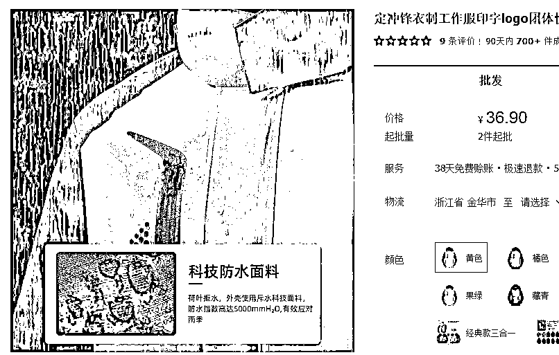

这个产品可以蹭到的流量是冲锋衣+goretex这个长尾精准流量。

转化优势上，由于它只有goretex的成品价格的五分之一，所以具备性价比转化优势。

这两个例子我们看到：选品的同时，流量方案和转化方案也是同时就确定了的，留给运营的任务只是一些具体的上架，设置广告等事情，这就对运营的专业度要求要小了不少，甚至实习生也可以做，另外这种选品是有固定参考来源的，本文不详细说，结果就是可以形成查字典一样选品输出，这对负责选品的运营的要求又低了很多，实习生也可以完成，就算0起步的一人创业，也可以一个人完全胜任所有选品和运营的工作，因为，套路很固定。

合规平替是一个适用绝大部分类目的宝藏选品方向，因为它既有流量捷径，也有转化捷径。

大多数卖家到这一步，已经获得1-3年的蓝海选品产品库，已经够用，如果小语种发达国家，红利期会更长一点。

 

 

# **# ****4.**第三步【加光环】：快速获得品牌力、溢

# 价、复购

十年前，我们发现，JEEP、骆驼、CAT的鞋服，实际上跟美国JEEP越野车、骆驼香烟、CAT重型机械没啥关系，这三个鞋服品牌在国内最早是由中国老板成功抢注下来的。虽然十年后这三个品牌都不同程度的与美国品牌方达成和解或者授权，普通卖家已经不能随便去卖，但是这个骚操作，是值得我们借鉴的。

十年前，我们发现日本市场乐天平台和亚马逊平台，对这三个品牌的鞋服都不要求授权备案，也不进行审查，因为这三个品牌的鞋服其实在国外并不存在，由于是知名品牌，也没办法在日本抢注到鞋服类目上。所以对我们中小卖家形成一个几年的搬运倒卖的窗口期。这正是我们第二桶金的来源，我们在日本长期垄断了这三个品牌鞋服的销售，我们还给他们起了个名字，叫做空壳品牌。这也是一种选品模式，虽然只有特定的窗口期。

这个模式到今天仍然是具备可复制性的，例如上文提到的我们在速卖通能做到客单净利润100+的产品，就是这个模式出来的。而且空壳品牌在速卖通有独有的合规优势，上文已经解释。

我们把空壳品牌按占便宜程度/境外合规风险程度，分为如下几类：

1.抢注国外品牌，并复制它的全系产品（例如koolaburra 已被ugg收购）2.抢注国外品牌，并跨类目做新类目产品（速卖通常见套利玩法）

3.在国外注册品牌，策划国外的品牌故事和品牌形象（国内电商常见品牌捷径）在不同时期，以上3种打法均在亚马逊有过窗口期，目前还可以继续做的是第三类。

 

 

很多老板做品牌出海，或者美亚，老老实实的用自己的中国品牌形象，不是不行，但是更好的方案一定是策划一个空壳品牌，比如我们在日本做一个德国品牌，在东欧做一个日本品牌，在美国做一个欧洲或者日本品牌，这都是可行的，本土客户查不到，故事随便你说。

这个打法在淘宝也有非常大的红利，某做渔具的淘系卖家，就把它的渔具包装成日本品牌，做日本独立站官网，反向营销到国内市场，因为日本渔具比较有口碑，直接带来的就是远高于淘宝渔具正常利润的高溢价空间，和复购。

按我们的经验来看，成功的空壳品牌，可以做到10%的复购，可以带来的净利提升最多可以达到30%，这不仅是一个增加转化的方法，有时候甚至可以单独演变成一个选品模式，低成本、搬运式输出成功产品去跨境市场，这个由于信息差比较大，以后有机会再介绍。

# **# ****5.**第四步【微创新】：获得更长的红利期

前三步基本上都是可以工具化实现，要么花点钱实现，第四步主要是做产品的差异化，这个对人的要求高一些，如果做成功，对应的护城河更深，产品红利期也是更长的。

微创新其实就是不创新。

我们比较推荐新手去做的微创新差异化套路是：材质套利，是上文材质平替的一个延申。

 

 

新手做差异化，不要去考虑原创设计，痛点迭代，这些方向没有专业积淀，很难拿到成功确定性，新手适合基于大标品，去做升级式的和热点嫁接式的差异化产品。

首先，大标品不愁卖，也不需要买选品软件去分析大标品，但是大标品往往很多是低级材质，或者价格战重灾区，客单非常低，没有利润空间，大多数新手也喜欢一上来就干这个，跨境直播间凡是讲亚马逊热卖产品的，都不乏人气，这在我看来跟路边看人吵架没啥区别，没有任何意义。

其次，真正的高端货，中国卖家向来也不去挑战，也挑战不了，那么中端性价比市场就相对空白，我们找出高端材质这个方向，找到可以还原90%体验的低成本平替材质，去做这个稍稍消费升级的人群，将规避掉大量的竞争，获得长期的蓝海空间，上文的平替的案例可以看到，1688已经有现成的供应商，甚至投入就在几千块的水平就可以做出差异化产品，这个非常适合新手。

我们来看下材质平替套利差异化后的产品在亚马逊的案例：

直接搜索冲锋衣，美亚首页产品是

 

 

最低的十几美金，例如

 

 

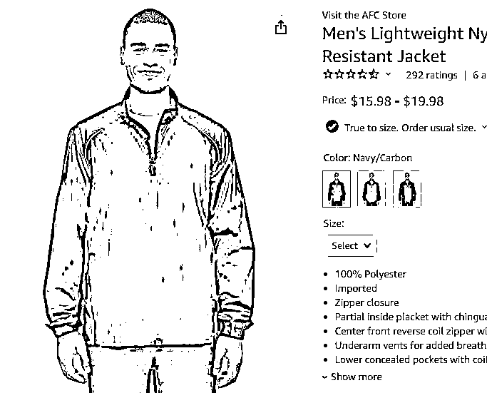

而搜索冲锋衣+goretex 首页产品为

 

 

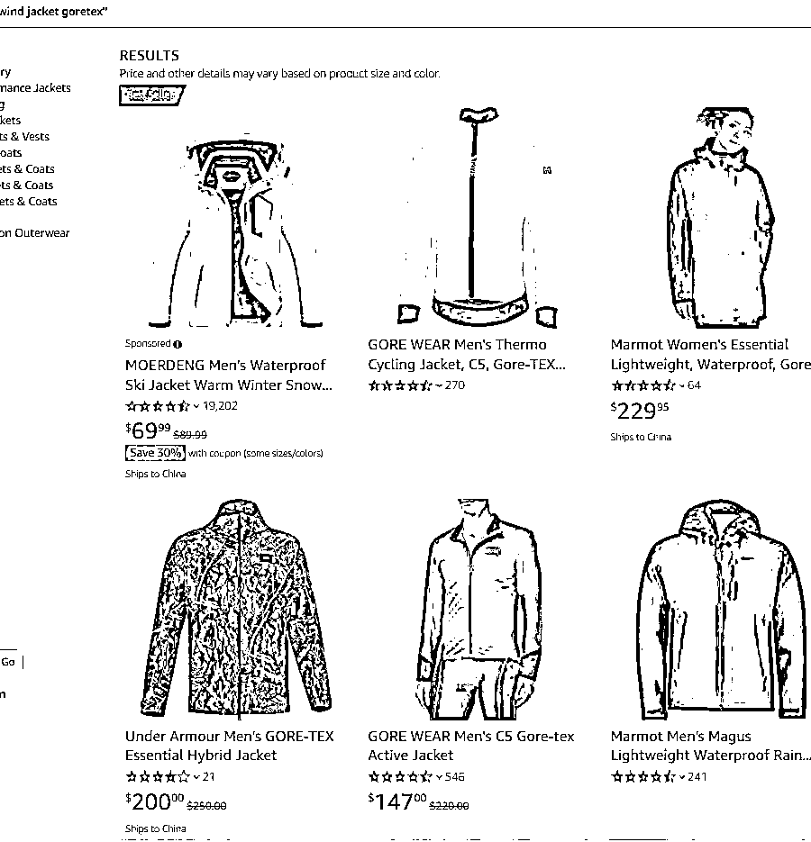

客单已经100多200多美金，在这个首页我们也看到有这个产品：

 

 

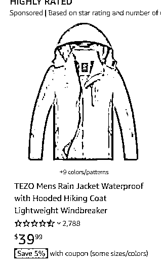

销量非常好，在100-200多的众多sku中，39.99的它鹤立鸡群，这就是我们说的将比价劣势转化为比价优势，它虽然不是goretex的，但是搜索goretex它会展示，它功能相同，它足够便宜。

但是如果把它放到与10几20几的冲锋衣一起展示，它就无法展现它差异化的卖点也没有价格优势，所以这个sku干脆放弃标品词，只做长尾词，这样才能获得流量优势，转化优势。这就是差异化产品的优势。

刚才是材质升级、平替套利的差异化。

下面我们看一个材质升级+平替套利+热点嫁接的差异化：

 

 

材质升级：帆布升级到真皮

平替套利：头层皮换成二层皮，成本下降三分之二

热点嫁接：厚底、边扣

精准流量词：真皮、厚底、边扣、某品牌、高跟、增高、女式板鞋、侧拉链等等转化点：厚底、经典平替、极致性价比等

所以这个鞋子跟普通帆布鞋板鞋标品比，实际上有4个差异化点1.真皮 2.边扣 3.厚底 4.平替

每一个点都对应一个精准引流点，精准流量的转化率是远远高于大词标品词的，还便宜，因为竞价的人少。

达到这个差异化水准的产品，70人民币跨境卖70美金，老外仍然觉得性价比爆棚，1688仍然有做好的现货，新手发现不了这样的供应商是因为认知不够关注不到。

这样的产品配合小语种发达国家门槛，类似的产品我们已经实现了7-8年的垄断红利期。

为什么不怕被跟卖，因为这种差异化产品出单量不大，所以选品软件抓不到，但是净利润很高，一个这样的产品一年完全可以贡献100万左右的净利润。所以我经常说跨境电商下一个十年要逐步放弃爆款思维，就是这个原因，因为做爆款在我看来是自杀行为。

好的选品，亚马逊/独立站/TK都可以做，享受长的红利期，稳定的利润，不昙花一现。

 

 

评论区：

亦仁 : 付费课程链接有么，贴一个

跨境杨少 : 这篇是上次捐献一小时活动希望分享给圈友的，后来觉得还是写成帖子比较清晰，但也很抱歉今天才写出来，这个文章本身就是一个很完整的做产品的方法论，架构比较完整，信息差也很多，可参考的也不限于跨境电商。

跨境杨少 : 感谢亦仁。刚才发的可能被星球自动屏蔽了，没事，感兴趣的圈友可以直接私信

亦仁 : 再发一遍？我也想看看学一下

跨境杨少 : [害羞][害羞]dou音搜索“跨境杨少”，置顶视频中有链接，明天上班我让助理发个券码给你[呲牙]

无尘 : 说的很好，赞一个，感谢大佬分享

亦仁 : 感谢分享，已加精华。

跨境杨少 : 感谢亦仁

# **# ****(**精华帖**)(57**赞**)**我和订阅二三事（上）

作者：  南璋

日期：2021-12-17

目录

1\. 对订阅付费看法的转变

2\. iOS调研流程

3\. 我们在订阅上的具体玩法

 

 

---正文---

本文是一个订阅产品 2 年级生的自白，和大家分享一些做订阅的坑和经验。

本文涉及到的知识点，都是对亦仁老师、九日论道老师知识体系的拙劣模仿，九日论道老师乃订阅届当之无愧天花板，Respect 。

我最早接触到** APP **订阅是在** 17 **年，在一款叫 SleepCycle 的睡眠类 APP ，完成了首次订阅体验。

这产品现在还活的很好，单月营收在 $100W 上下，背后是一家 21 年 6 月上市的瑞典公司，可追溯的团队成员 37 人，按人民币估算，人均产值 ¥200W 。

 

 

 

 

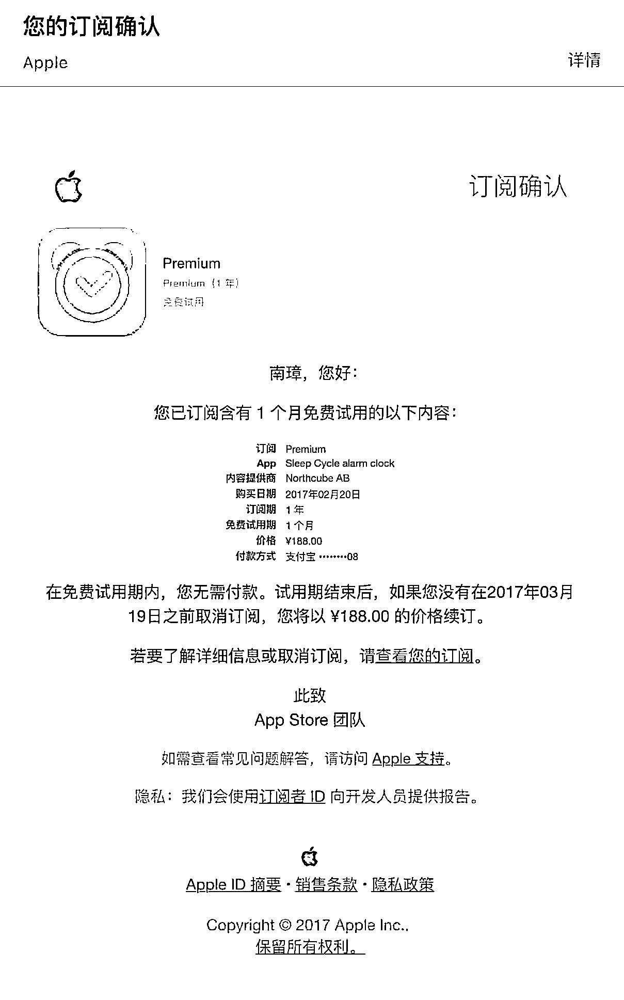

**-01-**

对订阅付费看法的转变

由于当时的工作和认知所限，我对订阅付费的原始看法是：

**1.**  订阅产品制作精良

**2. **订阅产品价格高昂

**3. **订阅试用期可白嫖

**4. **订阅适合内容付费

时间来到 18 年，笔者转职成为一名小程序产品经理，在设计工具小程序变现的时候，再次留意到订阅。

此时对订阅的看法是：

**1. **订阅能够提升低频产品的**LTV**

**2. **订阅是低价高频的终身买断制

**3. **订阅是高价低频的按次购买制

**4. **订阅是开发者和消费者的对赌

在微信小程序阶段，没有进行真正自动续期订阅的实践。

 

 

但是关于套餐包的设计，有了一些新的认知。

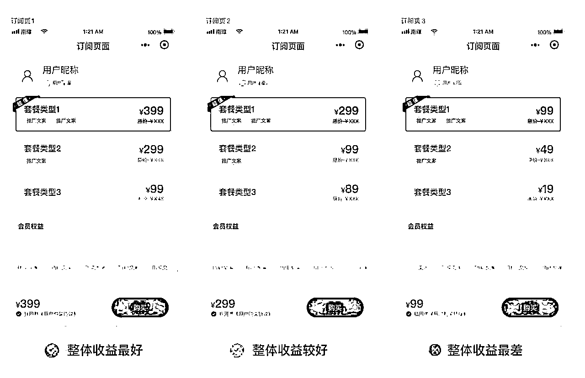

我发现，

**1. **相同产品，定价高更赚钱。

在相同产品体验条件下，套餐组合定价更高的产品，整体收益更高。

具体例子：

在低频工具+不能自动续费的条件下，按月或者按季度的效果都不如我们按年来的好。

同样的套餐，定价 299 就是比 99 更赚钱  ，价格翻倍，付费转化率不会腰斩，至多下滑  40% 。

**2. **营销活动，降价不如加送。

 

 

原理同上。

**3. **买断用户，使用频次最少。

购买终身用户的使用频率远低于年用户。

大部分用户对自己的需求会错判，用户会因为定价魔法，去买更高客单价的产品。

**4. **自发复购，首年复购率**5%**。

即使不是自动续期，依然会有用户自发复购，首年复购率在 5% 上下。

随后进入 19 年，正式入坑 APP 订阅（此处感谢建青大佬帮助）

当时是拿到了某月 Appannie iOS 收入 TOP 3000 名的表格，里面的字段包含了最重要的下载和收入数据。

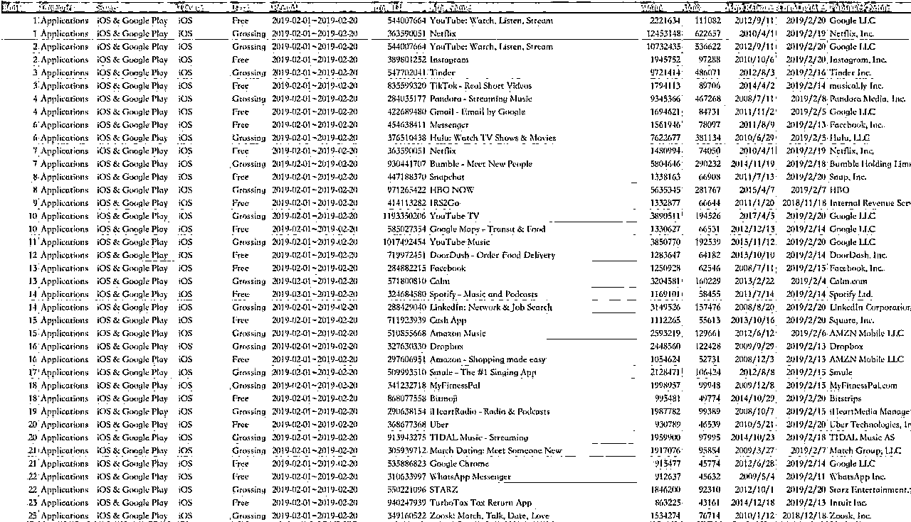

 

 

看完这 2000 个项目后，我对订阅看法变成：

**1. **任何产品加订阅付费都能赚钱

**2. **订阅产品设计对收入影响巨大

基于 1 ，我们当时评估了收益可能和团队能力，我们在新奇特和效率工具两个方向里面挑选入手项目。

基于 2 ，我们开始了对优秀订阅页的收集和探索。

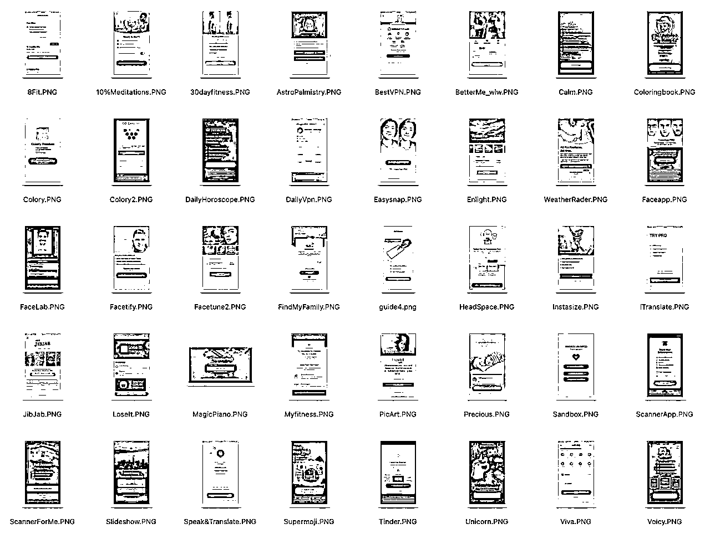

**-02-**

 

 

**iOS**调研流程

在具体产品的调研中，我们将 iOS 调研流程拆解为流量、转化率、产品、变现、关联** **5 个环节。

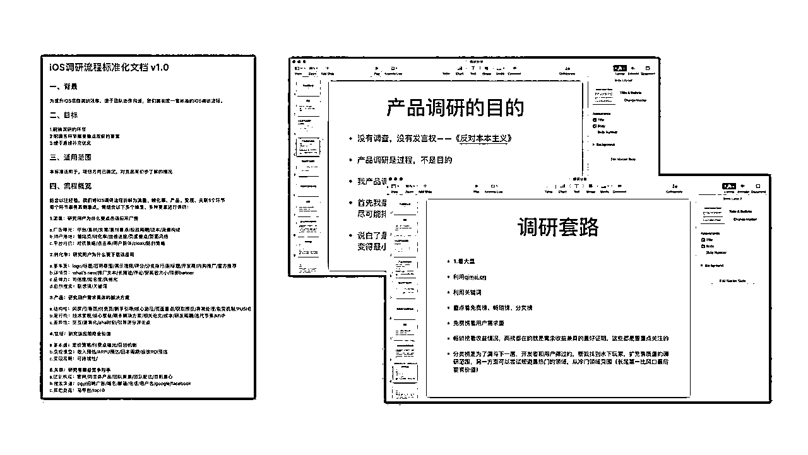

每个环节都有其侧重点，需结合以下多个维度、多种要素进行调研：

**1. **流量：研究用户为什么会点击该应用广告

a. 广告曝光：平台/素材/文案/素材重点/投放周期/成本/流量构成

b. 用户落地：着陆页/转化率/加载速度/页面重点/页面风格

c. 平台对抗：对抗策略/点击率/用户群体/cloak/防封策略

**2. **转化率：研究用户为什么会下载该应用

 

 

a. 基本面：logo/标题/应用截图/演示视频/评分/分类排行/副标题/开发商/内购推广/官方推荐

b. 详情页：what's new/推广文本/长描述/评论/安装包大小/顶部bannerc. 品牌力：可信度/知名度/风格化

d.自然搜索：联想词/关键词

**3. **产品：研究用户需求具体的解决方案

a. 结构性：闪屏/引导页/付费页/新手引导/核心路径/页面重点/获取授权/异常处理/裂变机制/PUSH

b. 易行性：技术实现/核心壁垒/商业解决方案/相关论文/成本/研发周期/迭代节奏/MVPc. 差异性：交互/差异化/aha时刻/引导评分评论点

**4. **变现：研究该应用商业价值

a. 基本面：定价策略/付费点曝光/召回机制

b. 变现模型：收入预估/ARPU预估/回本周期/投放 ROI 预估

c. 变现周期：可持续性

**5. **关联：研究有哪些竞争对手

a. 团队构成：官网/同主体产品/团队背景/团队配比/目前重心

b. 搜索渠道：pgy/招聘广告/域名/邮箱/电话/用户名/google/facebookc. 其他竞品：马甲包/Top10

**-03-**

 

 

我们在订阅上的具体玩法

调研后的流程按下不表，直接看看我们在订阅上的具体玩法吧。

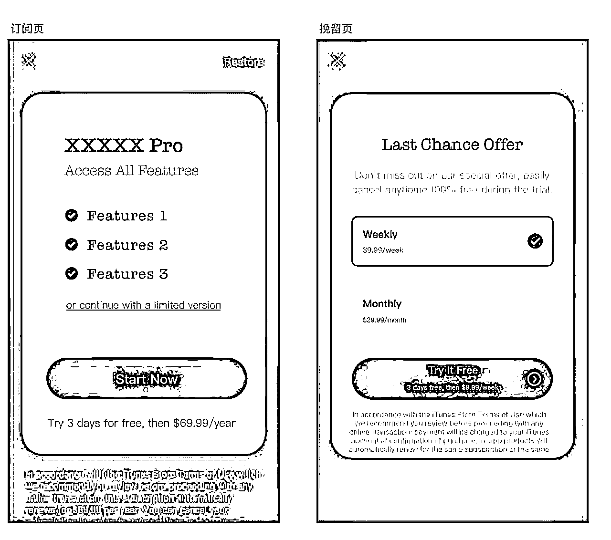

**## **核心公式

**LTV**估算**=**客单价*****订阅率*****（**1-**取消率）*****扣费成功率*****续期次数*****苹果稅单一套餐包订阅率在** 5%-8% **，取消率** 50-60% **，扣费成功率** 30-40% ****## **定价策略

 

 

订阅页  单一套餐包

$69.99/年+3 天试用

挽留页  套餐二选一

$9.99/周+3 天试用

$29.99/月+3 天试用

**## **触发逻辑

1\. 用户首次打开（AARRR->ARARR，转化前置）

2\. 免费次数用完（快速引导用户体验核心流程，流程结束后，下次体验提供等待或订阅选项）

3\. 部分功能上锁（订阅页 banner和功能一一对应）

4\. 多次未付挽留（多次访问=转化可能高，主动挽留并降低支付门槛）

**## **交互设计

1\. 关闭按钮改为-> Continue with a limited version2\. 购买按钮文案Start Now

很可惜，19 年的订阅探索，最后以产品下架告终。

回顾这段旅程，发现有三个坑是出乎意料的。

**1. **真续费率

用户即便在试用期间不取消订阅，到期能续上费的人数仅为30%。

 

 

**2. **审核难度

苹果审核标准和时长难以预料，对项目节奏影响巨大，卡审核一个月都有发生  。

**3. **额外费用

语料训练，素材制作，投放测试，数据归因，都要花钱。

许多没料到的成本在不断上涨，反之团队耐心则被不断压缩，跑正 ROI 的难度不断攀升。

因为出海的失利，团队士气大受打击，回顾半年没管的小程序，发现不仅没有凉，反而流量有了自然增长。

于是乎重回小程序，同时我们把这半年在 App 订阅页上研习的套路，还有在 App 上无法实现的运营套路，一股脑的加在了小程序上。

话不多说，直接上结论：

**1. **微信体系免费试用加订阅**=**血本无归

**2. **让用户看到不让用户带走**=**转化利器

20 年经过疫情和团队变动，我又贼心不死的盯上了订阅项目。

我想再来一次的话，我肯定能在订阅上赚到钱。

下一回给大家带来，21 年我在订阅上的实践。

 

 

下期预告

1\. 火过的一定会再火，赚过的一定能再赚（调研）

2\. 试用 or not 试用, this is a question（定价）3\. 订阅产品通用原型（交互）

4\. Tiktok-Admob套利模型（新机会）

5\. 订阅负面消息汇总（避坑）

评论区：

大周 : 这个内容不会太机密吗？看完对ios订阅这一块的业务有了比较深的了解。回想起之前下载了扫描全能王，一个三天免费试用然后交了大几百的年费，是不是也是这样的套路

南璋 : 现在iOS订阅比较规范了，对于免费试用类型的订阅，苹果会多次邮件提醒用户，即使不小心被扣费，退款也是比较容易的。另外苹果近年对违规订阅产品整治力度开始加大，不仅会下架、封号、暂停付款，甚至会没收开发者收入。

hank : 同是做iOS订阅类项目的，非常认同你的观点，受益匪浅

有个地方想提问下

LTV估算=客单价订阅率（1-取消率）扣费成功率续期次数苹果稅

这里是不是应该是

LTV估算=客单价订阅率（1-取消率）扣费成功率续期次数[1-苹果稅%(15%~30%)]?因为你是得扣除苹果税以后剩下的收入才算利润

南璋 : 感谢提醒，此处应是（1-苹果税），我改正一下。这里更加严谨的表达，还需要把未满一年（30%）和满一年的区分开来（15%）。

hank : 是啊，还要看是否申请了Small Business Program，有机会一起交流下  亦仁 : 感谢分享，已加精华。

施霖终生学习者-链接 : 好精彩，期待下期更精彩，

陈怀哲 : 好熟悉的名字，我好像几年前加过你，有印象吗

# **# ****(54**赞**)**聊一聊海外私域的事儿

 

 

作者：  菇亮

日期：2020-12-21

一起赚美元  前段时间收到鱼丸的私信，发现自己之前的帖子居然被龙珠加精，很开心，再来一篇，希望能被亦仁老板翻牌子，再来颗龙珠~

私域这个词儿在国内已经火了至少2年了，目前市面上对私域的各种方法论和研究大多聚焦于国内市场，其实海外市场同样面临着流量成本持续走高的问题，结合自己之前的一些测试经历，聊下海外私域的事儿~

私域是个很大的概念，简单拆成下面几个部分来说，

一、海外私域落地的鱼塘

二、海外市场从公域到私域的转化路径

三、海外私域的持续运营

一、海外私域落地的鱼塘

私域这个词虽然是在国内火起来的，但我始终觉得海外市场是公域到私域流量玩法的鼻祖。

基本上每年都会有一些行业热词冒出来，比如从一开始的增长黑客，到社交电商，再到国内这两年非常火的私域流量的玩法，所以说会给大家一些想象空间，海外是不是也可以这样来玩儿？

我的看法是海外私域玩法其实是鼻祖，甚至有更大的空间让大家来发挥。从海外用户尤其是欧美用户的购物习惯上来看，  在美国哪怕亚马逊再火爆，充其量也只能占到线上购物的50%，而剩下的用户线上的购买渠道当属独立站，甚至对品牌的独立站有天然的信任度，而独立站恰恰是品牌天然的私域平台。海外D2C品牌的发展史，说白了就是海外私域运营的发展史。从时间溯源上来讲，可能海外一开始没有冒出来私域这个词，  但是在流量玩法上，  其实海外市场真的是走在了国内电商的前面的。

无论是依托独立站的各种MarTech技术的运用，还是基于特定人群的再营销进行流量供给，和国内电商相比，海外私域运营有了更大的自由。国内私域最大的问题在于受制于平台，一旦触及平台红线就是封群、封号，让风控成为私域裂变中的重要的一环；海外则不是，用户标签、个性化推送、自动化流程，这些已经是运营中老生常谈的标配，更赞的是一众广告平台的再营销套路，让和你的私域产生触点的用户逃无可逃，跳出私域范畴依然可以做再触达，形成源源不断的流量补充。

 

 

私域流量的特点在于品牌私有、  免费触达以及反复使用。结合私域流量的特征，来看下一些常见的海外平台是否算私域。

首先是 Facebook Page。一般品牌出海的时候，都会建一个 Facebook Page。做出海的人，  经常会听到老板给你下类似这种 KPI，比如需要你 1 年 Facebook Page 涨 5万粉。

再比如，现在大火的Tiktok，  拿到一个 TikTok 账号之后，优先考虑的依然是我这个  TikTok 账户一个月内是否会做到 1 万粉，那么这些 subscriber 是不是可以算作你的私域流量呢？

如果我们去结合私域的几个特点去看，  你会发现其实 Facebook Page 或者是 TikTok，它的 subscriber 并不算是你的私域。因为你在 Facebook 上去推送一条 post 时，大概率只会产生 2%到 6%的 organic reach，也就是说在一个10万粉丝的Facebook Page里面发送一条帖子，只有2k-6k的人能收到这条帖子，并非是Page里面所有的subscriber都能收到这条消息（从这个角度来看，FB比微信要黑多了，至少微信公众号发一篇消息可以做到90%以上的触达，作为运营只需要关心如何提高打开率），如果希望更高的触达，那就广告加推呗。同样的，  对于 TikTok 来说，大家都已经很清楚，头条系搞得就是公域流量内的赛马机制，你发的每一条新的视频都是需要放到公域的流量池子里面接收大众审美和品位的检验，以此来判断是否推送到更高一级的流量池。虽然Tiktok的具体organic比例不详，但参考抖音的比率，你在一个账户上发一条视频的时候，实际上只有 3%会  reach 到你账户里面的 subscriber。所以说像 Facebook Page 2%到6%，TikTok 概率上只有 3%左右 reach 到你的 subscriber 的时候，我们其实很难把这两类常见平台看作是你的私域。

那么可以承接作为私域鱼塘的，建议将流量落在下面几个平台。叨姐曾经将流量分成存量、半存量和增量三大类，配合每一类流量，独立APP可以作为存量的私域平台，这也是最稳妥的私域鱼塘；一些海外的实时通讯工具，比如Messenger可以作为半存量的鱼塘，它的玩法和国内微信类似，最大的好处在于可以实现和用户一对一的私密沟通，当然平台风控依然要考虑；而Facebook Group和Email List可以作为承接增量的私域鱼塘来配置。额外提一句，很多人都说Facebook page像微信公众号，我到觉得Facebook Group更像一些，至少在触达方面，只要用户不禁用消息通知，大概率发条帖子过去组里面的人还是能收到的。

在这一节的最后，还是想做一个澄清，我一直没觉得公域和私域有孰优孰劣之分（反倒感觉是这两年大家对私域的鼓吹太过火），更多的应该去看品牌的阶段诉求是什么样，以及现阶段想要切的点在哪里。

 

 

比如我去发起一个 campaign 之后，从公域拿流量进行放量，是最快的路径，能够非常快的帮助品牌实现曝光。而私域关注的是一个用户长期的生命价值，要引流量到鱼塘里来，  之后去养这个鱼塘，  希望通过它的积累形成品牌资产和转化，  其实是一个长期的价值。当然这里面也和产品相关，比如那些复购率比较强的产品，养私域还是比较有价值的。  但是如果说本身这个产品复购率就不是很高的话，其实从公域直接拉流量，  然后快速进行转化也没有什么问题。毕竟所有流量都不是平台无故长出来的，公域的大盘子依然是流量的起点。

二、海外市场从公域到私域的转化路径

转化路径蛮多，简单介绍两个，1\. 基于Giveaway进行公域到私域的流量转化；2\. 基于Messenger进行公域到私域的流量转化

从公域到私域转化的任何一种路径，都会包含四个最核心的元素。第一个是内容建设，也就是说基于什么来发起这个内容？第二个是流量工具，因为私域除了基于私域自己去做裂变之外，大概率的情况下，我们其实是要做一个持续从公域往私域引的过程。那么公域我从哪里去抓流量，这个其实是流量工具需要解决的问题。  第三个关键点是用户，我会把它理解成用户触手，也就是说你私域沉淀到底是沉淀到哪里？第四个环节是销售转化，也就是说要设置什么样的路径将流量与销售结合。

以 giveaway 为例，首先，我要发起一个什么样的噱头来去做 giveaway，  这个其实是属于内容建设的部分。能够发起giveaway的点很多，无论是平台促销也好，产品上新也好，或者说是像是圣诞节这些比较热点话题都可以。其次是，基于 giveaway 要从哪里去抓流量，这里面会分为定向投放和非定向投放。非定向投放的话，现在有很多的giveaway group 或者giveaway website，去吸引一些泛粉作为潜在用户；而定向投放，侧重垂类资源。在用户触手方面，通常 giveaway会比较喜欢用 email list来沉淀，当然也可以通过路径引导，把流量沉淀到Facebook group 里面，或者通过路径引导到官网里面，前提是官网配备相应的沉淀窗口，比如 service窗口，可供抓取到用户的信息。那么无论是基于 email list 还是基于 group，在最后的销售促转化的环节，都可以持续的进行链接推送和促转化。详细路径可参考图1.

目前giveaway活动大多喜欢通过Gleam来操作，类似的工具也有很多，这类工具的核心都是可以通过活动实现对用户数据（如email list）的抓取（配套站内的automation进行承接），通过一些游戏化的手段激发用户与品牌SNS平台互动，同时，比较难得的是，工具平台会匹配一些支持裂变的功能，在传播上更进一步。

第二条可以尝试的路径是基于 Messenger Bot进行公域到私域的导流。

 

 

首先，为什么要做Messenger Bot？

也许大家会忽视，Messenger全球用户的体量是非常非常大的，在欧美国家的app排行榜中经常处于前列。而且还有更重要的一点，既然page 上的 subscriber不能算是私域流量，那么如何才能更有效的将消息触达到 subscriber呢？这时可以考虑把它转化到Messenger 里面，通过 bot 把它转化成Messenger 的 subscriber，这样才能够实现一个更有效的触达。

其次，为什么要把 page 上的流量转化到 subscriber？

因为目前大部分的 Messenger Bot 都会支持一些基于用户的 CRM 功能。比如说可以给用户去打标签，给同类用户进行分组，再根据分组来自定义推送。不能说是千人千面，但一定程度上相当于去建一个基于Facebook Page用户的CRM 系统，这里面可操作的点就会提供很大的想象空间。

同时，在 page 上去推一条 post，和在 messenger 上与用户私密的一对一的沟通，对于用户的感受是不一样的，他会感受到一种尊贵的 VIP，那么他对信息的接受度其实是会更高，愿意转化或者成为付费用户的可能性也更高一些。

再看 Messenger Bot 在路径上的 4 个关键点（可以参考图2）。

首先内容建设上来说，通过 bot 能够推送的消息比较多。无论是品牌信息，还是一些user benefit，这些都可以来玩，当然考虑到FB平台风控，不建议做太赤裸的促销推送，至少要包装一下。然后再来看流量工具，  我们是从哪里去抓用户流量并进一步转化到  Messenger 里面。这个其实很简单， Facebook 上的广告投放工具就支持 click to messager或者其他for engagement的目标。第三，在用户触手方面，messenger就是一个不错的承接，Group也可以配合进行路径引导。  最后，在销售转化上，  整个  Facebook 已经是比较完整的生态，配套Facebook Shop、Instagram shop，同时在Messenger 里面就支持 pay 的功能，当然也可以把用户引导到站外，比如独立站，  跨境平台或者是 local 的本地平台都可以。

在Messenger Bot方面，目前用的比较多应该是MANYCHAT。可以打标签，  包括设置automation flow。其实 bot 最大的一个好处就是可以将一对一的沟通变成一个流水线，自定义沟通流程线路。  通过 flow 的设置，通过一些 auto-reply，同时配合 broadcasting等功能实现对Messenger subscriber的触达。

三、海外私域的持续运营

 

 

关于私域的持续运营，从运营角度来看，国内市场和海外市场的逻辑应该是一致的，它的核心其实是用户运营和内容运营。

做公域到私域转化过程中，可能会遇到几个阶段。  第一个阶段会觉得既然私域这个东西真好，那我就疯狂的拉流量到私域就好了。比如把email list 做到 10 万或者说 20 万，但后来才想明白，如果没有配套品牌调性和内核的内容生产能力，没有团队来去支撑这件事情的话，天天发促销，最后email也会沦为垃圾邮件  。

第二个常见的坑就是在拉流量的时候也许会喜欢找一些比较大的头部公域，或者说是大牌公域。  但实际上从公域拉过来的流量，前提是它一定是要跟品牌有互动的情况下才能够形成路径。参考图3，其实2019 年，包括 IG，Facebook、twitter 还有 YouTube 上，越大的网红的互动率Engagement Rate 是越低的。另外一个道听途说的例子来佐证，据说口碑营销带来的GMV在环球、棒谷的总营收中占有非常大的比例，而这些真正带货的网红中大部分都是些小网红。

最后，个人认为也别对私域用户的忠诚度期望过高，拉过来就想转化。这些人并不是像你想象的那么忠诚。还是回归到开篇提到的，拉过来的流量，其实是会分级的。根据级别的不同和对品牌的粘性也不同。对于增量，刚刚接触品牌的用户，拉进来了之后还是需要进一步沉淀成半存量，再转化成存量。毕竟，无论在哪里养私域都是一个持续运营的过程。

完~

感谢看到最后的老板们，额外再发条资源合作贴，有下面相关资源的老板们，欢迎加V（candicewj93）来撩，

**1. ** 数码3C、智能家居、Gaming领域Youtuber/Instagram博主资源，想找性价比、engagement rate不错的带货咖；

**2. ** 数码3C、智能家居、Gaming领域社群资源（包括但不限于Facebook，VK, Telegram群组，数码3C forum），非deals资源，想找可以发帖的垂类社区资源；

**3. ** Tech Media/Gaming Media PR资源（英语系），侧重头部PR资源评论区：

 

 

自从26岁时碰到贵人，27岁朋友帮我创办公司时起，我心里就抱有了强烈的“感谢”之情。

我没有经营经验，一无所有。但为了帮助我成立公司，有人愿意借给我所有积蓄，有人甚至要抵押自己的房产，我必须不辜负他们的期望。就是从这一个心念出发，我拼命工作。在这过程中，感谢之情又不断地从心底涌出。

幸运的是，创业不久经营就走上了正轨，偿还借款已不成问题，当然经济上还算不上充裕。那时候，整天工作，对着一个个产品百般上心，有时候在仓库打包到半夜，在一次次更改页面时红了眼眶，真是日夜兼程，努力再努力。

菇亮 : 图1

菇亮 : 图2

菇亮 : 图3

琢磨 : 之前就在小北的公众号里听过manychat的应用，真厉害

老佟 : 海外用户的习惯，最大的私域不是edm吗

书情小跟班 : 学习了，非常有收获

# 【亚马逊】**9**篇

# **# ****(185**赞**)8**个月，亚马逊从**0**到月利润**6w+**的复

# 盘

作者：  郑小焦

日期：2021-07-14

#复盘# #案例分享# #小焦亚马逊修bug系列#

以上『我和稻盛和夫的一点点相似经历』

 

 

6月份在惊心动魄中度过，相比于9年前的高考，这次转折点更为重要。

喜人的成绩终于分发，不太敢着急分享。直到昨晚@一条枸杞  给我发了下边这张图还夸了我一句，我才意识到，很长时间没写一篇系统的文章。

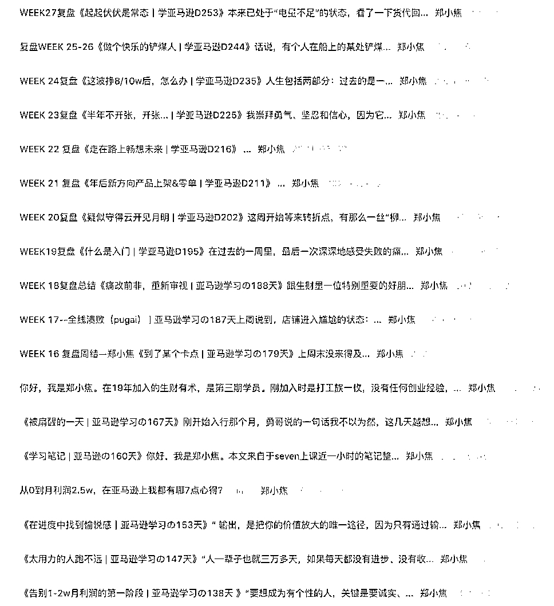

刚好新节点到来，更新给大家，谢谢大家一直以来的关注和鼓励！

 

 

也借此机会冒个泡，复盘8个月以来的主干线和这4个月沉寂之后的心得，证明我还活着，也希望能给一些像我一样的初期创业者一点启发。

全文主要7个点。文章不长，言简意赅，与诸位共勉。

一、机会降临--我如何做出重大选择

二、指导方针--切入点决定成功概率

三、起步阶段--要数量还是追求质量

四、挫折困难--没有解决不了的问题

五、主要转折--定能守得云开见月明

六、全新心得--在实践中验证猜和想

七、定义目标--我该定什么样的目标

关于亚马逊系列早前写过两篇，有幸都被列为精华：

2021-02-28的文章：

https://t.zsxq.com/IAYrrvf  亚马逊从0到盈利1w+，这125天我是如何快速成长的（生财帮我更改优化的标题）

2021-03-31的文章：

https://t.zsxq.com/fAIQvbm  从0到月利润2.5w，在亚马逊上我都有哪7点心得？（同上，改得不错~）

2021-7-14的文章：（现在开始）

 

 

一、机会降临**--**我如何做出重大选择

20年9月份，有幸得到几个就业机会，当时很难在一时之间做出抉择，也请教了很多生财的前辈和我的兄长。最后决定亚马逊这条道路，现在回想起当时的过程：面临好几个势均力敌的选择，如何做出一个不后悔的决定？有几点抉择因素分享:

1\. 了解收集尽可能多的信息（每个选择相关的所有信息）；

2\. 让外部因素来帮忙决定（请教不同领域的前辈，听取和收集意见）；

3\. 假设时间限定法（假设只有一天的考虑时间，最后一个小时必须做出决定，哪个会更令你舍不得舍弃？）；

4\. 计划三五年后的模样（每个选择对应的负责人，哪个是你希望三五年后的生活状态？）事实证明，直到今天，虽然经历过比较多挫败的时期，从没后悔过这个决定。

二、指导方针**--**切入点决定成功概率

小众产品、垂直人群、蓝海打法。

这是我们的指导方针，做的是美国站点。

要求：

1\. 选品尽量找美国本土卖家；

2\. 对手三家以内，有信心能做出胜过所有市面上竞品的方案；

3\. 价值超越过他们，价格低过他们

 

 

准确的切入点能提高成功概率，何谓成功？能分得对手的五分之一到三分之一的单量算是不错，能夺得第一名的位置就是成功。

三、起步阶段**--**要数量还是追求质量

10月26日，从零开始，一顿操作猛如虎，直接怼了10+链接（10款产品），超过15个sku（15个产品，其中一些款式一样只是颜色/文案不同）。效果不是很理想，但还算有两三个差强人意的产品，那一刻我知道自己十分鲁莽。

在数量和质量面前，从0接触电商，没有任何“品感、经验、触觉”的我毫不犹豫选择了数量，增强成功率。直至今日，我仍然会选择这条路。如果只做一个，在没有把握的情况下，一条链接周期4个月以上，我需要花费两年多以上的时间测试10个产品，但执行力爆棚如我，选择在两三个月内完成。

如今，在挣钱的链接有五个，（如果不是上周被服务商坑死了一个，总共有六个）每个利润1w+，我觉得当下才是进行从数量到质量的过渡好时机，因为逐渐积累了经验。

四、挫折困难**--**没有解决不了的问题

Lissa Tam小姐姐提出关于创业和打工者的对比，如下。前两个月我也偶尔会想起这个事情，觉得特别有趣。最终我们还是选择：自己更喜欢的那条路，不是吗？今天的我们，是由过去无数个选择一步步走过来的。

 

 

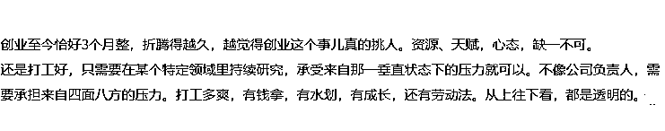

创业阶段，不仅有无穷无尽的问题需要亲自一个个解决（辛辛苦苦花费四个月做起来的链接，被对手一个起诉，甚至问不清楚侵权点在哪里，整个链接就挂掉了，剩下几百个库存只能销毁，血本无归；等待一款需要塑胶开模的产品，不敢往死里催供应商货期，在五六次更改调模之后，整整六个月才看到大货那一刻的心酸等等），还有解决这些事情时、解决之后的心态要调整。

如果在这过程中能如玩游戏的心境“过五关斩六将”是最好不过了，但这种心境不是谁都有的，特别是我本人，离开五年的熟悉传统销售职位，转到完全不知道是什么东西的跨境电商担任一只产品狗；从每个月等着发工资、住房和三餐都由公司包办妥帖、甚至床单都能由宿管清洗的无忧状态，嗖的一声转到每个月要付办公室租金、仓库租金、房租和上个月开始请一个助理的工资；从焦躁不安都随时绷紧神经等着炸弹被引爆，到现在可以接受一切的意外降临，这个过程，我称之为“修心”。

要相信，没有解决不了的问题。除了亲友离开带来的痛苦，所有的情绪都是由我们的观念造成的。

五、主要转折**--**定能守得云开见月明

2020年12月，产品陆续发出大货，静候佳音。那时候，还不敢想象“出一单”是什么感觉。

 

 

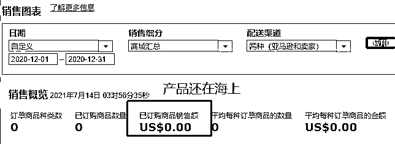

2021年1月，开始售卖第一二款产品。

2月，感觉一切还不错的样子。

 

 

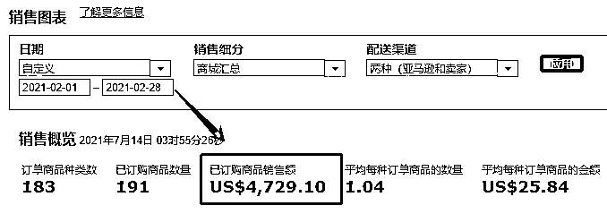

3月，产品到货上线越多，感受的失望越大，新品表现陆续“扑街”。

开始调整方向，舍弃之前10+款产品的思路，做全新的产品。

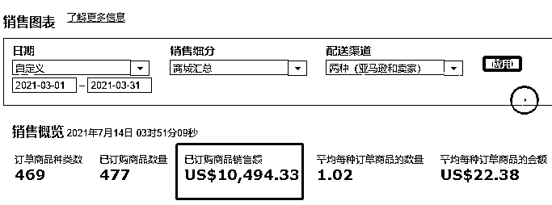

4月，稍微卖得不错的产品开始断货，收入为零。

滞销产品开始降价、清货。月底，新方向的6款产品发出海运。

 

 

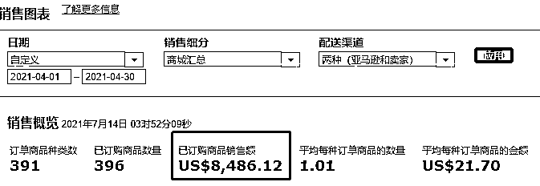

5月，全线溃败。本来有一些盈利的产品，在断货一个月后补上，市场已经不同，降价、打广告都没办法夺回之前的销量和排名，也陷入滞销状态。

店铺一度处于亏损状态，心情只剩下灰色。不过，依然不断做新产品，6个款新产品还在海上，未到货；继续发出7款新产品。

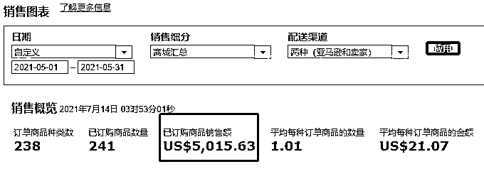

**6**月，主要转折点。新方向的6款产品上线，在改了一个星期的主图、标题、五点描述之后，销量逐步上升。

就这样，迎来了利润6w+的一个月（按照销售额的25%-40%的毛利润，比较保守估计得出）。

 

 

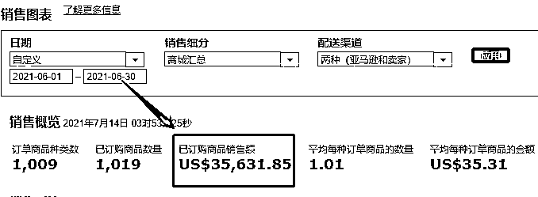

再次证明了，s先生给我指的新方向，没有错，而我在当时决定调整方向和执行时，确实没有任何迟疑。亚马逊做一个FBA卖家，会有这几个大的版块需要完成：

1\. 选品--

2\. 调研--

3\. 供应链--

4\. listing页面--

5\. 运营

我结合了自己的长处——供应链，选择了这个新方向，做符合以下性质的产品：

1\. 容易找需求人群。用亚马逊后台汇总的买家搜索汇总表可以快速找到（上一篇文章我有分享过，以下简称为热词表）需求量确定的产品

2\. 能够快速进行精准调研。在亚马逊平台上，搜索某关键词，结果页面的前一两页就是权重最高的产品，十分具备参考意义

3\. 顺滑打通供应链。这一块是我的强项，做起来不但毫不费力，还很有干劲，跟很多供应商成为朋友。产品能满足：做货周期不长，部分定制不难。做好产品质量，保证货期。

 

 

4\. listing能借鉴学习优秀对手，轻易到达及格线。目前我的这六款新产品，都是60分左右，总体合格的水平带来每条10,000元以上的利润，接下来就是跟同办公室的另一个圈友学习，以她为榜样，把一条链接做到80分。

一个80分胜过六个60分。

5\. 运营知识为0，目前产品基本靠自然搜索流量出单。如果能学习打广告，让ACOS维持在比较漂亮的范围内，估计能带来成倍销量。

可以知道，到此刻为主，我并没有获得胜利，只是刚好走了一条适合自己的路，没那么费劲。

距离真正做一款“价值超越”的产品，还需要半年以上的沉淀。

六、全新心得**--**在实践中验证猜和想

1\. 执行力永远排在首位

如果我在首批产品中获得两三个盈利的产品后，松懈下来，现在的情况应该是全面清货。完全不同的局面可能是：准备放弃亚马逊这条道理，再找新方向，或者回去酒店上班。

2\. 方案行还是不行，拿出市场数据

不要自己瞎想，不用自己觉得，没有数据的支撑，一切方案都是空谈。我的第一批产品里，有太多的愚蠢和“自以为是”，只想到最好的可能，却没想过最坏的结果。最可怕的是，最后只能承受最坏的结果。

3\. 创业者需要具备什么基本能力

 

 

前几天让助手做页面，我跟他说：我们既要在打包时做得又快又好；在出货时勇猛速度；又要在做页面描述时心细如发、耐心专注；在跟供应商合作时拿得出威严、给得起糖果。但最重要的是，一个解决问题的心态。

4\. 多个脚塌不下来墙

说起同办公室的圈友，确实佩服她的魄力，一条链接做得非常稳。如果是我，按照这一个多月的观察，五个产品的表现用“此起彼伏”来描述太恰当不过了，今天A有十单，但B只有三四单，C只有一两单，DE基本每单；明天风水轮流转，但无论怎么此消彼长，整体的销售额基本能维持在一个水平线上。深知自己没有那种能耐，如果再给我一次机会选择，我还是要做六条链接。

5\. 专注于自己的目标，只为目标奋斗

有自己的节奏，不会轻易被外界影响。像我这种天生爱广交朋友的人，一狠心下来自己都怕。

这几个月来，几乎屏蔽所有外界链接，白天、黑夜、梦里都只有亚马逊这一件事。很多次生财见面会，我稍微想了一下，还是继续搬手上滚烫的砖。

6\. 塑造放弃性人格

不重要的事情，不要执着。重要的事情，努力之后没有得到对应回报，不要心疼自己的付出，该放弃时就放弃。要衡量，孰轻孰重。如果一定要会，就好好学。

7\. 不要过度用力

太用力，会让前进的每一步都有很强的负重，没必要给自己增加很多疲劳感。有时候我们会给自己加很多戏，认为自己已经很努力很费劲了，其实并没有。稳定很持续的付出，才能走得更好。

七、定义目标**--**我该定什么样的目标

 

 

之前，我给自己定了不切实际的目标，一上来就要干100万。后来，在离目标越来越远，远到完全看不到的四五月份，我终于在痛苦中醒悟：我只是一个普通人。于是把目标定为：比几个月前在酒店上班时综合收入多一倍。

后来感觉如释重负，现在已经达成目标。不止6月份，在接下来的任何一个月份，都能保证最低收入是达成目标的，我感到很踏实。

这个目标之后，s先生和我给自己定下来新的小目标：

1\. 再做10+条垂直人群的链接齐头并进

2\. 养三个账号，每个账号保底$1000+的单日销售额，毛利润为销售额的30%以上3\. 积累经验和技能，到2022年开始做单品利润5w+的产品2条

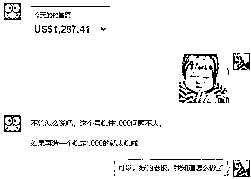

其实1和2是相辅相成的关系，目前只有一个账号能做到单日销售额$800+，对未来的小目标感到欣喜，又想马上执行力爆棚哐哐哐加快进度，又想慢慢来好好打磨。眼下，质量为重。

 

 

每半个月从账号提出来的钱，又作为补货的款项投进去。还有三个月迎来旺季，眼下正想办法贷款筹钱。多大的能力，办多大的事，这一波不能错过，能争取多两三倍销量，也好啊。

————

后记

你说神奇不神奇？去年现在，我还在酒店加班，下班之余倒腾副业，忙到凌晨两三点，没有任何起色，一边丧一边努力，还是愿意相信会有出路；带着老妈每周赶往医院复诊。现在，我拿到比当时多3-5倍的收入，租了一个像家一般温馨的大房子，等待早已恢复健康的老爸老妈搬来广州一起住，对将来的日子充满了想象和期待。

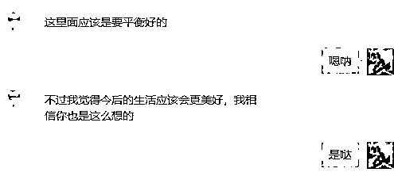

越对未来有信心，越对当下有耐心。

耐心点，一起加油。（谢谢看到这里，喜欢的话点个赞再走啊，祝老板發财~）评论区：

 

 

蕣 : 先赞后看

陈智豪 : 优秀

盗坤 : 给小焦点个赞

小蚁 : 小焦优秀[强][强][强]

蕣 : 有条不絮，目标明确，计划清晰，知行合一，必成大器！值得深入学习！里面说到一点，非常受用，毕竟亚马逊对于新手确实有一定门槛，所以“不要太用力”确实很在理！像小焦学习，先开始，再调整，耐心等待好的结果

郑小焦 : 一年前，一边丧，一边找

郑小焦 : 来来来前面几位朋友，私聊一下我领“直评”红包~

张小建@助你脱单 : 好棒的小焦，成长飞快！[强][强][强]

还记得去年10月底第一次在杭州龙珠见面会的你（可能你不太记得我）和龙珠老友的分享时身上的满满自信和亲切笑容，我要多跟你聊天，向你看齐！[嘿哈][嘿哈]**# ****(**精华帖**)(153**赞**)**亚马逊从** 0 **到盈利** 1w+ **这** **

# **125 **天，我的鲁莽代价和快速成长

作者：  郑小焦

日期：2021-02-28

一起赚美元  复盘  小焦亚马逊修bug系列

大家好，我是郑小焦。

加入生财一年半，从打工者转为自由职业者，4个月一晃而过，第一站到了，把我的复盘成长分享出来，共勉。

https://shimo.im/docs/Kdk9xJtpjkxVtrXj评论区：

 

 

小蚁 : 火箭般成长速度，小焦牛逼！

创业是个长跑过程，注意身体，记得运动。💪

志豪 : 感谢分享，已加收藏！

阿佐 : 感谢小焦的万字长文干货分享～[爱心]

颜过 : 优秀如你[机智]

Winter.校长 : 感谢分享，小焦

古辛 : 小焦牛逼，学习的榜样

老黄牛 : 这种成长式的复盘对于新手很有价值，不亚于已经成功赚钱的大佬们的分享。

成功的过程往往不像新手们想象中的平坦，而是在不断自我否定→迭代→失败→听取意见→修正。。。的过程。

请继续坚持做这种“踩坑、爬坑”的分享，给小白多了解这个行业。

家蒙 : 好真诚的分享，多看评论区，这个方法真好。

小焦加油💪，坚持赛道，多运动啊

# **# ****(**精华帖**)(152**赞**)**真正的跨境运营和营销绝不

# 是简单的筛选产品上架促销这么简单

作者：  鱼丸|亦仁助理

日期：2022-01-12

大家做跨境，通常的运营手段都是筛选产品上架促销，但这样的方式，很快就会遇到瓶颈。本期「生财合伙人」，@拓跋勇老师，一个出海十年的卖家，就来跟我们分享一下他不同的看法。

本篇内容将以七部分展开叙述：

1\. 精准出海的第一步，是锚定你的用户群体

从十万个普通用户中挖掘需要我们产品的特定用户，还是从五千个特定用户中寻找愿意使用我们产品和服务的三百个用户？

 

 

2\. 正确的产品观念是为了解决特定用户的特定问题，然后悄然发展

机会越大往往意味着竞争越多，一款产品满足了所有的市场需求，看似很美好，但却最容易被快速淘汰。

3\. 没有优质的内容生产能力，找一个靠谱的合作者比埋头苦干更好

一个新的出海企业或者团队其实是不具备内容制作能力的，但是这并不意味着我们要放弃，恰恰这是我们跟其他人能够拉开差距的很好的一点。

4\. 一定要建立属于自己的品牌

品牌的核心在于加深用户的记忆，这样才能发展的更持久。

5\. 先要让尽可能多的目标客户看到我们，然后让有意向的客户进入我们的页面视觉既包括你要销售的产品，同时也包含你的商品页面，网站形象和网店形象设计，这几个缺一不可。但大多数的中国出海企业只完成了第一部分，缺少对第二部分的补充。

6\. 先抓专业用户产生口碑，由专业用户向普通用户做波次扩散

很多人把推广简单的理解为促销或者带货，即使是找渠道带货也是采取促销的方式，但是这样的方式换来的并不是忠诚的用户，甚至不是真实的用户。

7\. 站在中间做腰部企业，保持好的产品质量，做用户能够消费的起的产品

并不是说我们随意创建一个品牌搞一款产品就能够实现成功，真正能够让我们发展的更健康的是我们做这件事儿能够弥补用户的某种需求缺失。

 

 

最后，他还会以 Savior Equipment ，不到 10 人的公司，却创造了一年 4000 万利润的户外品牌为例，验证上述论点的有效性，建议你可以花费 5 分钟快速阅读。

目录

一、用户

二、产品

三、内容

四、品牌

五、视觉

六、传播

七、价值

---正文---

非常感谢生财有术团队的朋友邀请我分享自己对于出海互联网品牌产品营销方面的一点浅见。说实话，作为一个在跨境电商行业十年的老油条，可以说是全程经历了这个行业的变化，看着中国卖家想尽一切努力进入海外平台，到平台张开怀抱接纳这个群体，一起快速发展，又调整规则和风控筛选掉一大批靠灰色手段成长起来的卖家，如今有人依旧热情高涨地涌向亚马逊、Ebay，有人却只能抱憾离场，开始追逐独立网站的新风口，真可谓：有人星夜赴考场，有人辞官归故里，少年不知愁滋味，老来方知行路难。

 

 

事实上绝大多数的出海企业之所以出现失误，在我看来是因为没有抓住问题的核心，用一句话来概况，出海品牌应该做的事儿是寻找有规模的用户群体，用好的品牌和产品视觉把正确的产品传递给精准的用户。如果一定要提关键词的话，我把它整理成了：用户、产品、内容、品牌、视觉、传播、价值。

**-01-**

用户

不管是平台类运营还是品牌的运营，首先要想清楚的一个问题就是我们未来服务的用户是谁。这个问题几乎可以决定我们后续发展的一切可能性，但是中国企业比较奇怪，绝大多数的公司都是先从产品出发，绕了一个弯子之后才想起来去思考用户的问题，我们都知道互联网的流量成本是在飞速提高的，如果你没有确立好要服务的用户群体而贸然开启一门生意，后果就是你后边做的绝大多数的推广工作都是无效的。

有精准的目标用户群体有助于我们向下去挖掘流量和内容的渠道，相比较而言，从十万个普通用户中挖掘需要我们产品的特定用户和从五千个特定用户中寻找愿意使用我们产品和服务的三百个用户，工作量和成果是完全不一样的。

经过这十年的磨练，我的体会就是不管你从事什么行业，确立用户都是第一位的，它会让我们的目标和方向感更为清晰。

拿出海零售行业为例，早几年大家吃的都是流量红利，因为卖家数量少，同类产品少，只要你在产品上稍微下点功夫，很容易能够借助低廉的流量成本快速起来。

 

 

但是到了当下，绝大多数产品背后的流量成本已经可以说是惊人了，如果你还是盲目地去搞，有非常大的概率是会失败的，并且出海行业跟国内零售业最大的不同在于，我们作为货物和商品的所有人，却无法完全自主地处理自己的产品，一旦出现滞销的情况，大概率这些商品库存的价值会直接变零，所以不管你要做什么，请先瞄定你要服务的用户群体。

**-02-**

产品

一般人对于产品的理解都是赶热点，有八九成以上的企业习惯性地把扒数据称之为选品，事实上这只是产品的一个维度，并且还是比较浅显的一个维度，正确的产品观念是为了解决特定用户的特定问题的。

举个例子：2019 年爆发的新冠疫情让很多人不得不放慢节奏，尽量在家，所以居家消费品的销量是在持续增长的，人在室内环境下一长会感觉到非常无聊和焦虑，于是很多行业的产品都可以换一种思维做下改造。

拿我熟悉的北美狩猎射击行业来说，以往大家都是习惯于室外射击场训练或者户外狩猎，疫情一来，都只能乖乖待在家里，所以我们就开发了一款可以居家室内练习射击的产品，并且开发了一套完整的练习教程和测试方案，这样以来不管是重度用户，还是新用户都可以通过我们的产品排解无聊的情绪并且提高自己的技能，这在我看来就是为特定的用户提供特定的产品解决他们的实际问题。

如果你的产品对于用户来说替代性太强或者可有可无，那么很有可能是没有什么发展机会的，最可怕的是一款产品满足了所有的市场需求，这种愿望看起来非常美好，实际的情况却是如果有巨头盯上了你的领域，大概率你是会被快速淘汰的。

 

 

我们都知道手机上即时通讯工具的发明人并不是腾讯，也不是 FB 这样的公司，但是到最后能够收割市场的却是他们，原因就在于此，机会越大往往意味着竞争越多。就算零售行业，也是存在这样的现象。比方说个人护理行业，几乎是每个人都需要的，只有做过的人才知道，你想冲出来有多难，要么是被巨头收购，要么是被巨头弄死，完全没有第三种结局。

所以开发产品一定要针对特定群体，解决特定问题，然后悄然发展，用句电影的台词：

悄悄的进村，打枪的不要。

**-03-**

内容

我一直以来都保持的一个观点就是中国企业是能够做出好的产品的，但是能够做出好的内容的团队确实比较少。

绝大部分的出海企业都面临的一个共同问题就是有产品没内容，事实上一个产品的设计和改造是相对不那么复杂的，这就像一道数学题一样，掌握了正确的算法，得出的答案基本都是一致的。

但是内容就没那么简单了，大家现在都还处在强行启动的阶段，产品推出之后一通推广组合拳下来，要么生，要么死。但是硬广的转化往往比较悲惨，如果没有掌握内容的生产和输出，我们会在推广阶段浪费不少的资源。

去年海外短视频平台上挂起了一阵风，**TIKTok Leggings **在各个电商平台上的销量用疯狂都不足以形容了，其实在我看来，一般的团队和品牌是非常难做到这一点的，这里边的核心就是没有大规模的内容生产和输出导致的。

 

 

一个新的出海企业或者团队其实是不具备内容制作能力的，但是这并不意味着我们要放弃，恰恰这是我们跟其他人能够拉开差距很好的一点。

举个例子：我们所处的行业，有几个美国的公司，背后其实就是海外华人，但是他们利用自己的地域和语言优势，在当地找了一些内容制作公司来帮助他们建立相关的东西，从产品的图片、视频、乃至一些对外发布的博客文章、新闻通稿、网站软文，社交媒体的贴文素材。

有了这些内容的帮助，人家虽然在产品方面并不比我们做的好，但是有优质的内容来吸引目标客户，最终实现的销售成绩明显比我们突出。我在给我们的同行朋友分享时多次提到的一个品牌 Savior Equipment 就是如此，当然了，他们产品本身做了也非常好，但是如果没有优质的内容做铺垫，并不会有太多人关注到这个品牌。

 

 

 

 

这里需要强调的一个点就是，绝大多数的行业都是讲究分工的，一个公司，一个团队并不能解决所有的问题，这就好比你是一个做产品的，但是内容方面可能是个小白，为了能够完成这件事儿，需要的不是建立自己的内容团队或者从零去学习如何生产内容，最有效的方式恰恰是找到一个靠谱的合作者，然后制定合理的方案，循序渐进的实施计划。

 

 

我建议同样在做出海的伙伴，可以在内部设置一个岗位负责协调本土的资源，这会大大地加快我们的工作效率，并且成果一定是要比我们自己埋起头苦干好得多的。

**-04-**

品牌

在拥有了特定的目标群体，有了产品和内容之后，一定要建立属于自己的品牌。事实上，从严格意义上算，品牌要排在内容之前，品牌的核心在于加深用户的记忆。

我们就曾经碰到过这样一个问题，在我们发展过程中曾经开发过一款产品非常受用户的欢迎，几乎没有一个差评，但是当时我们推广的时候只是一味地强调自己的产品有多好，以至于不少客户知道了产品，不知道背后的品牌，因为那个时候我们完全没有品牌概念。

一年以后，市面上出现了一模一样的产品，连包装都模仿我们，价格却连我们的一半都不到，于是尴尬的情况出现了，原本属于我们的客户群体，纷纷转头把钱投给了跟我们销售同样商品的卖家，我们作为这个产品的开发者，只能干瞪眼，如果一早就有品牌的概念，有知识产权的概念，我想这一切都不会发生了。

经过这件事儿之后，我们痛定思痛地决定不论如何都要建立属于自己的品牌，只有这样我们才能发展的更持久。一个品牌绝不仅仅是商标那么简单，背后有大量的工作需要完成，首要的就是品牌故事，要告诉别人我们是做什么的，为什么要做这件事儿以及我们的品牌能够帮助客户解决什么样的问题。

 

 

 

 

这些信息在我们后续跟渠道的合作中非常重要，也是品牌重要的组成部分，不仅仅如此，一个品牌还要有自己的 VI 系统，要有自己的核心卖点，最重要的是要让自己能够被用户记忆。这里边的 VI 系统包括：品牌 LOGO 、品牌色彩、品牌字体、品牌包装、品牌的基础 Banner 以及品牌 Slogan ，还要有自己的品牌官网做形象的展示。

**-05-**

视觉

说到视觉就不得不回头看下内容部分，因为视觉属于内容的一项工作，也是在我看来比较难的一项工作。

我们国内的企业习惯了国内的审美风格，不管是什么网站和平台，尽可能做的就是色彩的堆砌，老外跟我们存在着根本性的差异，大多数的网站和平台都力求简约干净，所以你会发现像亚马逊这种电子商务巨头，他们的产品图片用国内的眼光看简直是 LOW ，但是老外就是认这么一套，他们感觉能够一眼识别产品的本来面貌是件非常重要的事 

 

儿。

但是单纯是在电商平台陈列商品是这样，做推广可就不是这么回事儿了。有相当一部分人存在的一个误区就是懒，懒得为同样一款产品建立多个视觉表现形式，事实上我们看一些优秀的品牌，他们把产品的视觉部分通常分为三个模块：自有渠道、平台要求、宣发渠道。

在自己的官网和电商平台使用的图片存在一定的差异，在一些媒体网站、内容渠道恰恰是另外一套体系，这是因为平台的作用是为了方便用户识别和结算的，但是宣传渠道的作用是为了吸引目标用户的关注形成转化的。在平台你当然可以白底图，但是在渠道里，最佳的方式是融合场景之后的图片，这样更能够打动消费者。

 

 

 

 

如果你是一个内容网站的编辑，你会选择哪个配图，正确的答案恰恰是两个都要，因为场景图可以做 Banner ，也可以描述产品，但是单纯的商品图可以让访客更直观的知道你要介绍的东西，两者缺一不可。而实际的情况是，大多数的中国出海企业只完成了第一部分，缺少对第二部分的补充。

在我看来，视觉既包括你要销售的产品，同时也包含你的商品页面，网站形象和网店形象设计，这几个缺一不可，因为我们捕获客户的过程就如同一个漏斗一样，先要让尽可能多的目标客户看到我们，然后让有意向的客户进入我们的页面，最后让那些有购买意向的客户下定决心购买我们的产品，所以每一个环节应用到的视觉元素是不一样的，不能一概而论。

**-06-**

传播

 

 

像我说的中国企业不擅长做内容、品牌和视觉一样，传播更是几乎九成以上公司的短板。有很多人把推广简单的理解为促销或者带货，即使是找渠道带货也是采取促销的方式，但是这样的方式换来的并不是忠诚的用户，甚至不是真实的用户，不信你可以看看自己的产品，有多少是因为低价或者折扣进来的，真正想要做好营销工作，就要先搞清楚一个信息是如何传播的。

我之前曾经总结过零售行业的一个营销窍门：先抓专业用户产生口碑，由专业用户向普通用户做波次扩散。大多数普通人或者叫普通消费者存在一个羊群效应，他们总是喜欢跟从头羊到一个地方，也就是俗称的跟风。

我们会看到一些有影响力的媒体网站或者网红往往具备着很大的号召力，这种号召力是自上而下的，所以一些聪明的品牌或者企业，非常善于抓住机会，先从这些具备影响力的专业用户入手，让他们先体验我们的产品，然后利用他们的影响力来实现我们的转化目标。拿我们这个行业的领头羊 Anker 为例，他们在去年的年中曾经跟消费电子测评领域的大牛  **nbox Therapy **作的一期视频

 

 

该视频到目前的播放量差不多一百一十万了，这等同于一个什么概念呢，如果按照流量来计算，我们可能在电商平台想要达到这样的流量需要花费的是巨额的资金，按照最低  1美金的成本计算的话也要人民币近 700 万的成本。

当然了，这是视频平台的数据，跟真正的电商平台的流量是有差异的，但是当你的品牌和产品在短期内获得有效用户的有效曝光接触之后，会在不少人的心中留下印象，有部分的浏览者会在看到视频的同时选择下单购买视频中推荐的产品，还有一部分当时没有购买商品但是已经记住了这个品牌和他们大致的商品解决什么样的问题，这就在用户心目中树立了一个正确瞄点，一旦他们某天有相关的需求，一定会相切这个品牌，并且有较大概率选择这个品牌的商品。

 

 

同样的，一些用户特征非常清晰的内容网站，新闻媒体，网红达人，测评机构都是我们做营销过程中非常好的传播渠道，我们只要是做运营，就离不开这些渠道，除非你愿意一辈子只走促销这一条路。

通常越是特征清晰的用户群体，它的传播渠道也会非常有限和清晰，我们需要做的工作就是在你树立正确的目标用户群体之后花费精力把它给梳理出来，然后打通这些环节，我称之为搭建我们和用户之间的桥梁。

而这个工作很重要的一点就是正确识别这些渠道并且用合理的话术开发它们，这里我给大家一个小的建议，一旦你的品牌、产品定下来后，找专业的写手帮你去整理出来不同的话术，比方说邮件模板，电话沟通话术，拿到足够的资源渠道会帮助我们尽可能的减少失败的概率。

**-07-**

价值

很少有朋友会思考价值的问题，但是这个认知层面的东西往往决定了一件事儿能够做多久，一条路能够走多远。

并不是说我们随意创建一个品牌搞一款产品就能够实现成功，真正能够让我们发展的更健康的是我们做这件事儿能够弥补用户的某种需求缺失，就如同我一开始看到我们行业的现状，头部的品牌享受着高溢价，但是对于普通消费者而言完全负担不起，底层的卖家靠着低价收割用户，但是产品并不能达到合格商品的要求，所以我们选择站在中间做腰部企业，保持好的产品质量，做用户能够消费的起的产品。

 

 

如果你所在的行业不存在这样的机会，强烈建议你要慎重，因为没有一个人一个企业能够从现有的秩序中快速成为头部的，如果你做的事儿跟底层竞争者没有任何区别，那么市场可能不那么需要你。

为了能够让大家看到上述论点的有效性，我跟大家拆解一下我在上边提到的一个户外品牌 Savior Equipment 的成长路径。

**Savior Equipment **一个专业从事射击周边产品的品牌，通俗一点说是一个枪包支架的品牌，该品牌诞生自 2017 年的下半年，我们可以简单的看下它的商标注册情况。

 

 

事实上这间公司最初并不是销售该类产品的，并且他们最初的团队规模非常小，之所以知道他们是因为他们公司刚好在我一个美国朋友家的附近，公司是由三个华人小伙儿创建的，他们因为身处美国，发现市面上没有质量非常过硬的步枪枪包，但是美国本身又是一个合法拥枪的国家，拥有庞大的持枪群体，于是这几个小伙一合计，注册了一个商标然后做起了枪包的生意。

 

 

我在谷歌上查询这个品牌的时候发现第一次出现是一个射击论坛里，当时他们自己注册的账号发帖介绍自己的产品，结果下边的评论清一色的都是说产品看着不咋地，是不是垃圾的中国货之类的言论，后边让他们发生巨大转折恰恰是我那位美国朋友，因为他本身是美国步枪协会认证的射击教练，加上距离比较近，于是他们经常一块儿沟通如何改进枪包让它变的更好用，最后搞出来的第一款正式意义上的产品如下图：

这个产品是 2017 年 11 月 17 号正式在电商平台发售的，因为产品的开发阶段有行业的重度用户参与设计和改进，一经发售轰动整个射击圈子。当然，因为有人指导，他们产品发售前基本上是把宣传工作做到了极致，不信你可以往下看。

首先他们找了在射击行业小有名气的一个内容制作公司  **offensivegroup **助他们完成产品拍摄、视频拍摄和社交媒体内容制作和内容托管等等工作，不从事这个行业的人并不清楚这是一家什么公司，所以我连带给大家看下他们的业务。

 

 

这个公司名气并不大，但是他们给不少的户外战术装备公司做内容方面的服务，其中最具代表性的就数5.11这个战术服饰品牌。

 

 

于此同时，这个当初名不经传的小品牌找到了另外一个公司 leviathangroupllc 跟他们合作，这个公司同样也没什么名气，但是他们却是一家在射击领域拥有上百位 Youtube网红合约的公司。

 

 

 

 

于是在好产品+好的制作团队+好的传播团队的强强组合下，该品牌很快就在专业领域内刮起了一阵风，但凡有一点影响力的网红和教练几乎人手一个他们家的枪包，并且更有意思的是，在这样的传播效率下，他们开始对专业领域内的媒体，网站，论坛进行大量的内容铺设，如果你感兴趣的话，可以到谷歌上搜索 avior Equipment forum ，你会发现这样的结果。

 

 

有大量的论坛在持续不断的发酵关于这个品牌的内容，要知道用户的关注度就是品牌的影响力，而这种持续的影响力会转化成源源不断的购买力，结果就是，他们的产品在亚马逊上上架三个月后站到了品类的第一名，并且从 18 年一直保持到现在从来没有其他品牌打破这个记录，他们的产品售价也要比同类型的其他产品高出不少，但是依然架不住用户的热情，理由其实也非常简单：

**1**、产品设计、功能、质量、确实好；

**2**、**savior equipment**有完整的品牌概念；

**3**、在专业领域内的口碑超级好；

**4**、产品信息覆盖的面非常广。

结果是什么呢，一年以后，他们上新了相同系列的不同产品，依然快速卖爆，两年之后他们从步枪枪包拓展到手枪枪包依然卖爆，2019 年他们进一步拓展步枪支架，无一例外的爆，2021 年，他们拓展了手枪支架，还是卖爆了。

与此同时，他们的销售渠道不断地拓宽，从最初的亚马逊平台，到后来自己的品牌官网，再到后来他们在线下超过 30 家经销商销售该品牌的产品，如果你现在去查询，你会发现亚马逊、沃尔玛、eBay、好市多、连新蛋都在销售他们的产品，而这一切恰恰就遵从了我上边分享的理念。

在一个特定行业寻找特定受众，用优质产品+好的品牌形象+优质内容+强有力的传播方式深耕，我们最终都能够找到适合自己长期发展的方向。

 

 

2020 年的时候，我曾经问过我那美国朋友，他说他们这个公司在 19 年的时候也就不到十个人，一年创造 4000 多万的利润。

更有意思的是，去年为了研究好这个品牌，我托朋友帮忙在美国买了他们的产品并且空运了回来，比较搞笑的是，我在深挖他们背后的供应链时发现他们合作的工厂就在广州，当我真正拿到的他们产品的时候，我才切身体会到为什么用户对他们那么狂热了，产品的功能设计非常合理，用料也非常扎实，最关键的是细节的地方他们都做的非常到位，举个例子：他们把产品的包装盒内侧设计成了靶纸的图案，每个客户收到产品之后，包装可以直接拆开当作靶纸来使用，丝毫没有多余的东西。

现在看来不管是偶然还是必然，他们选择了一个中国多数企业都不太了解的领域，但是他们具备天然的优势，并且这个领域的用户群体非常清晰，资源渠道也非常清晰。最关键的是他们深知自己的不足，所以懂得借势，寻求专业领域人士的帮助，这才有了后来的发展，坚持服务好一类用户，坚持做好的产品，坚持做品牌，懂得做传播，这就是他们的成功经验。

事实上有很多行业都值得这么走一遍，比如母婴领域、垂钓设备领域、骑行野营领域、宠物用品领域、甚至是游戏办公领域，因为存在太多特定场景下的特定用户需求了，我们需要做的不过是确定好要服务的用户群体、确定好行业、深挖用户需求、内容制作资源和传播渠道，以品牌的方式完成每个步骤的链接，如果你还是不懂，强烈建议你去认真挖掘一下** BarkBox **这个宠物用品领域的案例，你就会发现真正的运营和营销绝不是简单的筛选产品上架促销这么简单了。

除此之外，品牌出海行业还存在着大量的问题和机会，比如如何保持足够的优势，如何改造自己的产品，如何形成有效的产品线以及如何保持健康的发展态势，介于内容过多，我就不再一一赘述，如果你感兴趣，欢迎点赞评论，如果点赞数量超过 188 ，我再来跟大家分享别的内容~

 

 

最后再次感谢生财团队的盛情邀请，我是拓跋勇，一个在跨境行业混迹十载的电商从业者。

P.S. 如果你也想在生财有术专栏分享你的经验和认知，请点击链接

http://form.shengcaiyoushu.com/f/HA1G1g  填写表单，我们会陆续邀请有赚钱相关经验和案例的嘉宾做分享。如已填写表单请忽略。

评论区：

鱼丸|亦仁助理 : 感谢  老师的分享，大家如果有什么问题。可以在评论区留言~ 拓跋勇 : 感谢生财团队的邀请，大家有什么问题可以评论区互动，不方便公开交流的可以添加微信tuobayong跟我交流

草木青 : 先赞再看

M_Alex : 写的真的是很好，提供了不少新的思考角度。

Act-炼 : 像艺术品一样jing mei q

唐杰(Jason) : 有高度，有洞见

超云 : 打开世界的新视觉，非常感谢分享，收获极大

郑小焦 : 太精彩了，谢谢  老师分享~~ 一直听说老师在推广这一块很强，看来研究非常深刻、透彻。刚入行一年的萌新学习了[抱拳]

# **# ****(**精华帖**)(133**赞**)**让大家认识一个真实的出口

# 跨境电商世界

作者： Moss

日期：2019-04-16

之前受亦仁兄弟邀约，做过一期生财合伙人的分享，讲了我的一些创业故事和经历。但是一直没有分享与我专业相关的干货内容，觉得还是不太好，之前由于时间有限，今天难得空闲，便来还债了。

 

 

关于我的自我介绍就不写了，节约一下篇幅。想要了解的可以看看之前亦仁发过生财合伙人的介绍帖子，也可以看看这篇知识星球官方发的介绍：  算是对我有一个初步了解吧，也想和大家多交朋友，看看有没有沟通合作的点。

下面直接上干货，因为我从事的是跨境电商领域，想必很多做国内电商的朋友以及对跨境感兴趣的朋友应该都想了解这一块，今天写这个内容目的就是让大家认识一个真实的出口跨境电商世界。

如果大家对跨境电商大盘还不够了解，可以看看图1关于海外各个国家线上销售的体量以及中国出口跨境的一个量级，目前还在高速增长之中，尤其是在传统外贸B2B逐年下降的情况下，跨境电商业务逆势上扬说明还是一个相当不错的赛道，但是蓝海早就谈不上了，竞争已经日趋白热化了，不过机会还是有的，相比于国内电商层级固化来说。

1 亚马逊渠道

按照数据来说，差不多亚马逊卖家快占了整体跨境电商从业者的四成左右，也是当之无愧的巨无霸，图2是亚马逊在各个国家的流量情况，发出来供大家参考。很多人把亚马逊类比为中国的天猫淘宝或者京东，其实不然，亚马逊更像是“网易严选”，以算法规则代替传统的buyer，挖到供应链最末端的优质工厂，重产品而轻店铺，所以平台永远不会阶级固化，新卖家永远都有机会，平台喜欢越新，越低价，越优质的产品，图3的一个飞轮理论就很好的阐述了亚马逊平台算法的本质，这也是和淘宝天猫最大的区别。

而且亚马逊比较适合打造单品爆款，而不是追求海量SKU铺货强调动销率的传统玩法，比较适合一些sku少的国内大型外贸工厂和一线品牌。所以说现在很多大型工厂和国内一线品牌纷纷入驻亚马逊，亚马逊也是做海外创牌的首选，比如大家熟知的Anker,科沃斯都是靠亚马逊在海外创牌成功的。

但是呢，亚马逊如今的流量成本已经很贵了，简单说一下差不多站内广告CPC平均都在1个美金以上，一些非常红海的词汇比如：Bluetooth headphones 已经飙到了5-7个美金一次点击。另外亚马逊体系下FBA压货模式导致你做的越大，库存压力就越大，赚的钱都变成了库存，我之前有写过一篇文章，放在下面了，大家可以看看，应该能够认识到真实的亚马逊所存在的问题：

总结来说，亚马逊仍然是品牌出海，跨境电商的首选，操作简单而且流量获取相对容易，产品如果足够优质运营的压力其实会小很多，不需要很会玩电商玩流量。  但是亚马逊早就不是蓝海了，还是多方考证和谨慎调研，贸然进入一定会死的很惨！

2 其他跨境电商平台渠道：

 

 

除了亚马逊这个巨无霸以外，还有很多跨境电商的平台，老牌的诸如：

EBAY,ALIEXPRESS, WISH 等，新兴的诸如：vova, joom, shoppe, Lazada, jumia等等。除了欧美以外，这些平台能够覆盖中东，东欧，东南亚等屌丝国家。

这些小平台比较适合多平台海量SKU铺货的卖家，以及做drop-shipping的卖家。但是不要指望靠其中某一个平台就能做到很大的体量，基本上每个平台的体量都是有上限的，某小平台撑死了一个月也就100W美金的销量，这种铺货模式就得多平台上，其中选品的工作和铺货的供应链就很重要了。还得需要雇一票人帮忙打包。

当然，国外也有很多这种类型的公司，比如软件channel advisor就是适合多平台多渠道分发的，但是我国劳动力价格比较低廉，所以基本上都是靠人上货，这种工具基本没有市场，之前去过这些铺货为主的跨境电商公司，基本上和富士康差不多。

这种模式的好处在于资金链非常健康，因为不需要压货，但是对于打造品牌，以及客户沉淀，突破销售瓶颈来说，还是比不上亚马逊的。另外如果是做海运抛货重货大货的卖家，这类小平台是不合适的，亚马逊更适合。

3 跨境电商独立站渠道

基于跨境电商的独立站来说目前最流行的方式就是：Shopify+Facebook模式了，这种相较于之前的模式来说更加省事，基本上十分钟建一个站也不为过。然后引流的方式基本上是靠Facebook了，Google这一块基本上很少涉及到。主要也是因为FB目前流量成本还算便宜，而且shopify把建站成本极大的降低了。

这种模式就难度而言其实比做平台要难很多，因为平台是自带流量，你就算铺货也是有流量的，但是独立站是需要你自己引流，不引流就没有流量，某种意义上来说没有自然流量的说法，基本上都是需要付费的，这样就非常考验投放了，难度还是挺大的。特别是一些平台卖家转型，开始玩独立站，大几率非常不适应，会死的很难看。

而且在这种模式下，产品需要有style，有调性的产品，比如像指尖陀螺这种新奇特产品，Facebook带货才能带的出去。如果是普货快销品的话，Facebook是带不动的，你抖音上微信上刷到一个充电宝或者耳机你会买吗？普货还是建议做平台为好吧。

参考学习网站：www.soulfeel.com

4 COD渠道

 

 

COD中文的意思就是货到付款，一些发展中国家由于基础设施不完善，比如东南亚一些国家，很多老百姓连信用卡和智能手机都没有，货到付款满足了他们网上购物的需求。

比如印度亚马逊COD的比例甚至超过一半。

另外在一些发展中国家，还没有像亚马逊那样的巨头，所以基本上是无法进行比价的，一些cod的产品可以卖出比正常价值高3-5倍的价格。再加上这种模式就是主打新奇特产品，尽一切的可能性去激发你的购物欲望，主打冲动型购买，价格标的非常高也就能够让人理解了。

当然COD暴利的同时，坑也是最多的，很多人尸骨无存，希望大家谨慎尝试。一方面是因为COD会存在拒收的问题，当你的签收率低于50以下，就算三五倍的售价，基本上挣钱就很难了。只有做到60%以上的签收，才有利润可言。COD的物流体系非常复杂，需要和当地建仓配合，而且还涉及到当地物流体系配合。简单举个例子，如果有人买了你的产品，想退货但是无法退货，他一般就会报警，当地的邮局就会遭殃，这种事情出多了人家就不和你合作了。再比如有些邮局不配合，懒得送货直接给你打上拒收的标，你也毫无办法，签收率一下子就下来了，那些东南亚国家的人说实话有职业素养的比较少。而且所谓的COD专线基本上也是伪命题，很容易一个老鼠屎坏了一锅粥，除非是自己的体系。

另一方面COD的选品，拍图，以及Facebook广告投放都有很多技巧，毕竟冲动性购买激发可不是一般人玩得转的，不是投放老鸟一般是搞不定的，选品拍图也是门大学问。有空我可以和大家多分享这一块的内容。另外COD模式你很难计算你的利润情况，就算你日出千单，你也不知道到底签收率如何，说不定爆单结果是血亏，利润反馈通常2-3个月才能知道。当然如果拿COD去割韭菜，玩hei wu lei的除外，不过这种最好不要了。

今天就简单说到这里了，关于跨境电商和海外流量的话题，欢迎与我交流。更多跨境电商干货内容，也可以关注我的微信公众号：Moss的精神家园

https://mp.weixin.qq.com/s/ddOk5QrmFVhKZv4TtOcsZw https://mp.weixin.qq.com/s/vH_V3RWz2kiUQDslLrEnwA

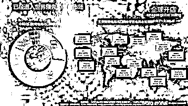

 

 

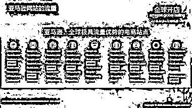 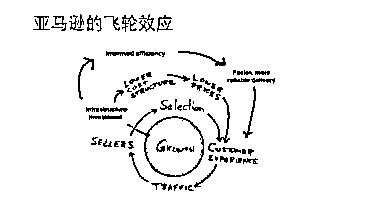

评论区：

不许变懒的猫 : 非常有收获，近期正打算进军亚马逊，向大佬学习[强]

亦仁 : 感谢分享，很好的科普

1亿美金站长阿发 : 多谢大佬，对大格局有了更深的认识

VV : 那个…………图在哪里？？？

阿斌 : 没看到图

白杨SEO : 上面分享的cod类是国内现在的二类电商，我在国内前十的一个做二类电商平台运营与推广。其实国内何尝不是红海，很多货也是压在库存上，还有签收率问题，这是不可避免的，核心在于如何做好产品服务。天天追爆品类的，当然一般大的代运营平台方赚钱哈哈哈

Moss : 有图了

阿斌 : 嗯，看到了

 

 

# **# ****(**精华帖**)(123**赞**)**电商小白实操从** 0 **到** 0.1 **跑通** **

# **Amazon **闭环并赚到一块钱，我是如何做到的

作者：  家永

日期：2021-06-25

复盘  案例分享  亚马逊电商

《电商小白实操从0到0.1跑通Amazon闭环并赚到一块钱，我是如何做到的》大家好，我是家永，喜欢实操作各种赚钱的项目，今天给家分享一个我在实操的项目，对新手友好，手把手教你以最低的资金快速跑通亚马逊的流程，全文加入两篇文章共1万+字，把我所有实操流程及注册店铺踩的坑毫无保留分享给你。希望对你有用。

这篇文章主要给跟我一样的小白看，大佬、大卖请略过，望海涵！

全文加起来1万多字，为了更好的阅读体验，以下是石墨文档链接：

《电商小白实操从0到0.1跑通Amazon闭环并赚到一块钱，我是如何做到的》https://shimo.im/docs/JRryrXcRYkWy3gX9/评论区：

漆菲特 : 家永哥真厉害，总是那个执行力最强的

大脸狗 : 感谢分享！！想问一个问题:运作亚马逊店铺，英文基础比较差怎么解决？

家永 : 英文不是问题，谷歌翻译就够用了。

张静伟@生财有术 : 永哥NB，

大咪 : 感谢分享，我也在做OA[偷笑]帮助很大！等我跑通也来分享

清蒸鱼 : 第二期oa在报名了[偷笑]

seven : 很强悍，加油啊

天添乐 : 可以报名了吗？

# **# ****(**精华帖**)(109**赞**)**利用生财有术的知识：**1 **年内

# 在亚马逊上实现月销百万，月盈利十万

 

 

作者： Feynman

日期：2022-10-27

利用生财有术的知识：1年内在亚马逊上实现月销百万，月盈利十万。

哈喽大家好，我是Feynman，在开始这段亚马逊的创业前，我原来主要从事独立站相关的工作，完全没有亚马逊经验，也没有选品的经验，在接手这摊子业务前，我是两眼一抹黑不知道怎么开始，好在那会加入了生财有术，从里面将所有相关的内容都看了一遍，整理成框架和SOP，差不多用了近1年的时间，和团队3个小伙伴一起做了2个亚马逊店铺，  在第8个月实现盈亏平衡，目前每月销售百万人民币，盈利十万左右，算是将模型跑通；不得不感慨生财有术内容的强大，很庆幸加入了这里。

先感谢下Seven、Lissa Tam、刘小排、Lenry、盗坤等各位大佬的无私分享，正是因为有了这么多大神无私的分享，我们才能在最短的时间找到正确的路。

整个选品逻辑和运营逻辑都取自生财有术的第五期知识库，在准备开始前，花费约2周左右的时间看完了跨境选品和亚马逊运营、亚马逊模型相关的帖子后，将开店和选品的逻辑细化成标准SOP，根据各个帖子里面的教程我们严格执行。

三流的执行人好过一流的空想家。

更多内容请移步飞书：

https://hs88nuws9z.feishu.cn/docx/doxcnZhpLJgEAHIbNsawquq2p4c评论区：

草木青 : 厉害，

蕣 : 太强啦，思路清晰，执行力超棒！

三林 : 很干！  亚马逊选一个上升期的市场的策略很棒

凯 : 牛

胡三 : 真的超棒

Feynman : 用什么方法收集小类增速大于大类产品的数据？可以这样做，先爬取大类亚马逊排行榜榜单前300名产品，然后每个产品通过卖家精灵或者Keepa这种工具去拿这个产品过去12个月的销售数据，再按照我表里那些维度去进行统计：过去12个月里有哪些是新进入的，哪些是后进入的，这样就能基本可以拿到大类的数据了。小类同理是一样的操作方法，但有时候小类会被归到大类的排行榜里去，这样的话就需要用小类产品的 

 

主要搜索关键词去爬取该关键词下前300-400的产品，将重复与不相关的产品去掉后就可以得到小类的数据了。最后再做比对即可。

然后看一下小类的品牌数量和销售额的情况占比大类的是不是一直在增长，这样就说明用户的需求在发生变化。

很累，也很无聊，但是做一些别人不愿意做的事情，可能就更容易获得别人得不到的东西。

亦仁 : 感谢分享，已加精华。

求学之路长漫漫 : 受教了。感谢分享

# **# ****(**精华帖**)(92**赞**)**创业分享：从玩转海外流量，

# 到亚马逊金牌卖家，再到为跨境电商服务商

作者：  亦仁

日期：2018-12-12

每周三，带你认识一位新的生财合伙人。

前几天  发了一条朋友圈：每一个成功人士的背后，必定曾经做出过勇敢而又孤独的决定。

这一条，让很多人，包括我，心有戚戚。

我与大多数生财合伙人聊，发现即使他们这样的创业老司机，面对未知，都有很多彷徨的时刻，甚至充满恐惧的时刻，彻夜不眠，压力巨大，几个月熬白了头。

但，想想都是问题，干了才有办法，若因恐惧不前，什么事情都做不了。

创业，必须学会克服恐惧，带着恐惧前行。

今天的这位生财合伙人，就是一个不断克服内心的恐惧，做出一个又一个勇敢而又孤独的决定的人，虽不说人生巅峰，也在自己专注的领域有所成就。

 

 

作为海外流量玩家的他，一个niche站月入五万美元；

作为Amazon卖家的他，旺季月销售额破五百万美金；

作为资源整合者的他，成立了亚马逊最大的刷Review公司，日刷万单；

作为新媒体创业者，他如何从一个流量玩家变成一个媒体玩家？

欢迎侃侃网创始人  ！

以下为本次专访内容， Enjoy。

各位生财有术的圈友，大家好，我是侃侃网Moss。

今天有幸受到亦仁兄邀请，来和大家聊聊我的事业聊聊我的生活。先简单介绍一下我的经历吧：我在新西兰和澳洲完成了本科和硕士的学业，专业是电子商务和计算机科学。

毕业后，我独自去美国创业寻找机会，小有所成以后又回国继续创业，目前来说仍在路上。

回国这几年，一直辗转在合肥，杭州，重庆和深圳这几个城市。目前公司在重庆和深圳，所以今年一直来往于两地。有机会的话，可以和这两个地方的朋友好好聚一聚。

说实话，如果像自传式的记录我这些年的经历，未免太过于冗长，而且大家也不一定会感兴趣。在我的世界观里面，一个人的一生严格来说是由不同的阶段组成的，这个阶段可以是事业上的阶段，当然也可以是情感上的阶段，也可以是生理的阶段。因为小密圈的主题是生财有术，而不是情感频道，也不是人生哲学。所以，今天主要和大家聊一聊我的事业上的阶段。

作为连续的创业者，我在每一个创业阶段都获得了某种意义上的成功，这种成功主要是体现在财务上的。准确来说，我所有的创业项目其实都是基于一个大行业下的，跳脱的并不是很大。而且，每一个创业项目和经历都颇有所得，收获巨大，积累的经验和人脉都会对我们下一个项目都会起到非常大的促进作用。某种意义上来说其实是承前启后的。上一个项目都是为下一个项目做铺垫，而且下一个项目开展过程中，上一个项目还能够在不耗费太多精力的情况下，提供大量的现金流支持新项目的前期运转。所以，严格来说，我算是一个幸运儿了，也是一个谨慎的创业者。

下面我会以四个创业的阶段作为划分，给大家讲一讲我这些年的创业故事。希望能够给大家带来一些启发，也欢迎共同交流，学习讨论。

第一个阶段：  海外流量玩家

 

 

因为大学时代，有学过一门课，大致的内容就是讲social media，SEO以及SNS这方面的内容。当然并不是很深入，是非常偏介绍性的。但是老师真的不错，给了我很大的启发。我就从这里开始入了海外流量玩家的坑。也算我的半个启蒙了。

刚开始玩的时候，那时还是学生，其实都不太懂，就一阵子瞎捣鼓。靠着自己建站，主要是一些产品测评网站，把亚马逊的review拿过来改写一下，然后对接Google adsense，想要通过流量变现赚钱。结果可想而知，站点虽然是有模有样，但是基本上流量屈指可数，很快就以失败告终。

我一直是一个坚韧的人，当然不会轻易言败。一直在不断地学习不断地找原因。其中有几件事情对我影响很大：第一件事情看了两本书，一本书是长尾理论，另一本是Zac的SEO实战密码，对我有非常大的启发。一方面，受Zac启蒙，给我塑造了一个完整的SEO思路和大体框架。另一方面，受长尾理论这本书的影响，我放弃了之前专门做一到两个大站的想法，后续慢慢开始玩长尾站群的模式，开始玩niche 站点了，而且流量变现的方向从之前CPM模式的adsense，转向了CPA模式的亚马逊联盟，也就是amazon affiliate。

第二件事情就是加了很多黑客群，SEO群，认识一帮莆田大神，很有意思的是当时机缘巧合，找了一个高中生，也是莆田人，在百度和Google上面玩黑五类玩的是风生水起。

我当时咬了咬牙，花了一万块钱拜师学艺，他答应给我线上授课，几个月间教会了我很多黑帽作弊玩法，比如流量点击的脚本制作，流量劫持，抓rj等等。因为本来计算机就是我的专业，这些东西只要给我一个大致的方向，我差不多自己钻研下就能够融会贯通了。所以说，有时候有人带路比自身努力还要重要。

经过一段时间学习以后，就非常顺风顺水了。当时最巅峰的时候，一个人有150个niche站点，其中最大一个niche站点月收入超过5W美金。那个时候我还是一个学生。

第二个阶段：跨境电商亚马逊卖家

后面快毕业了，当时觉得这个事情毕竟不能长久，想换一个更稳定的创业方向，或者说一个可以作为事业去做的事情。主要是因为当时黑科技作弊玩的有点猛，后面还碰了黑五类，暴利的同时风险也是巨大的，被谷歌K掉了不少站，收入受到了大幅度的影响。

当时由于一直在做amazon affiliate，  我在想我通过联盟都能赚那么多钱，要是直接去亚马逊卖货的话，是不是能赚更多的钱。但是，这一块的确算是陌生的领域，而且当时亚马逊还没有全球开店的业务，中国团队还没开始建立。要开店也只能借助目的国的公司或者个人身份。我思来想去，后来就决定毕业以后去美国找找机会，看看能不能抓住这个红利。

 

 

当时申请了一个美国公司找了一个有身份的华人合伙人就开始搞了，货源的话也很简单，直接通过速卖通去做dropshipping，那时候亚马逊FBA还不流行，基本都是FBM自发货为主。其实做亚马逊真的是踩中风口了。那个时候亚马逊上面基本上鬼佬卖家比较多，流量成本非常非常便宜，而且对于刷单几乎是没有打击。

所以，当时直接用虚拟机开镜像配V-P-N 的模式，养了1000+亚马逊买家账户，产品上架以后就开刷，广告也不做，同时通过直评的模式，一个listing一上架就刷大几百review，然后关键词刷到首页，就可以收割了。基本上刷一款产品爆一款产品。后面量太大，速卖通dropshipping已经扛不住了，直接用阿里巴巴国际站开始B2B采购了。巅峰的时候是黑五旺季差不多一个月销售额破了五百万美金。

开始很美好，但是后面还很严峻。因为对物流供应链这一块没有没有主动权，而且说实话也不太懂，毕竟我是玩流量出身的，对产品这一块比较欠缺。导致后面大量发货延迟，包括退货，直接导致亚马逊账户被亚马逊给关停了，损失惨重。不过，我依然很看好亚马逊这个行业，因为跨境电商是国家外贸出口的一个全新的方向，外贸又是拉动经济增长的三驾马车之一，中国又严重依赖外贸出口。所以，我判断，亚马逊这个事情其实是可以当做长久发展的事业来做的，而且供应链在中国，还是得回去才有更好的出路。

第三个阶段：  亚马逊最大的刷单公司

回国以后整合供应链资源，也谈了很多家工厂。亚马逊卖货的生意一直在做，后面还开展了跨境电商独立站的业务，主要是shopify+Facebook这种模式的，还根据情况承接了一部分代运营业务，整个卖家的体量维持在一个不大不小的规模。最高峰应该是2016年差不多销售额有1.5个亿。

但是随着中国卖家越来越多，竞争压力越来越大，而且亚马逊FBA需要提前压货到美国，导致整体资金链非常不健康，所有的利润都滚进库存了，完全见不到现金，而且一旦被封号，之前的利润可能就都没了。  所以，我也需要寻找新的现金流业务。正好，16年年底亚马逊出了一个政策就是禁止激励性评价，review的获取变成了一个巨大的难题。我们就开始抓住这个点，开始筹建刷单团队。

当时分为几个方向来走： 1 通过美国线下拉人头派单的模式，主要是华人。 2 Facebook 广告外加Facebook群控去拉人头，最终落地到Facebook私密group上面派单。

3 通过短信和邮件的轰炸去拉人头。4 通过WhatsApp群控买数据去加人，拉人头 5 与北美机房合作，外加家庭IP渠道，自养账号刷单，这一部分自养机器账号刷单是在系统里面全自动完成的。

 

 

因为亚马逊卖家为了拿评价，基本上产品都是白送的，只要留评就行，所以还是很有诱惑力的。很快的速度就拉起来一支庞大的刷单团队。以自然人作为刷单主力，机器号作为补充，很快成为亚马逊行业数一数二的刷单公司。

但是，这个事情只能补充现金流，毕竟拿不上台面，而且随着后面亚马逊打击力度越来越大，，过来黄金收割期，这个业务也开始走下坡路了。

第四个阶段：跨境电商新媒体一站式服务平台

我们看准的下一个风口是在于跨境电商行业的新媒体平台，也是目前我们公司正在从事的事业。因为B2B外贸出口逐年下跌，跨境电商异军突起，现在这一块已经成为外贸出口出的一个新起之秀。政府越来越重视，慢慢国内大型外贸工厂，传统品牌商都纷纷进场。品牌出海越来越热！

准确来说我们应该是今年年初起步的，第一步就是尽可能的把流量做到最大，我们平台名字叫跨境电商侃侃网，花了不到一年的时间，已经做到了整个跨境电商行业流量最大的媒体平台。半年之内，通过社群玩法，分销裂变等玩法，三个微信公众号粉丝数量均已破五万，其中最大一个公众号Moss的精神家园已经破10W粉丝，同时有2000+的微信社群，覆盖整体跨境电商卖家从业者达二十万左右，付费会员人数破万。这个规模一般行业可能不算什么，但是在我们这个在垂直行业的新媒体已经算是很大的量级了。我们前期的重心在布局我们侃侃网的公众号和微信社群矩阵，重点在微信这一块。后面的目标就是尽可能把侃侃网这个网站的流量做大，形成网站论坛，媒体资讯，视频直播，小程序，APP，微信公众号，以及微信社群，相结合的一个完整的跨境电商新媒体生态链。

除了做大线上流量这块以外，线下这一块也取得了不错的成绩，半年内举办了一次大型的千人跨境电商选品大会，五场千人跨境电商干货交流分享会。同时，模仿樊登读书会模式，在全国五个主要跨境电商主要城市都有侃侃网的线下社群，定期聚会，交流学习。最终，形成了线上流量与线下流量相结合，互相引流的良性循环。

当然可能很多朋友疑惑，我们为啥短时间之内起来比较快：一方面是因为我们本身在跨境电商行业浸淫已久，目前现有的卖家代运营等业务还在继续，能够提供足够的运营选品干货内容，以及绝对第一手的跨境电商资讯，在内容上面有巨大的优势。另一方面，我们用了很多裂变玩法和社群玩法，也就是用增长黑客的模式代替了传统的投放广告增长的模式。这里就不多说了，感兴趣的朋友可以私下交流。

 

 

而且，我们成功把之前玩海外流量的套路思维模式以及方法论，和国内新媒体流量玩法做了一个无缝的连接，这也是我们起步很快的原因。另外，刚进入新媒体行业的时候，流量池这本书对我启发很大，推荐各位可以去看一看。

所以，我目前的侃侃网是一个跨境电商一站式新媒体服务平台，助力中国品牌出海。为跨境电商卖家，以及出海品牌提供最新的资讯信息，货真价实的运营实操干货内容，各种信息咨询服务，各种推广代运营落地服务，以及帮助品牌出海工厂转型的一整套方案落地等等方面。如果各位想要出海的国内品牌，想要转型跨境电商的传统B2B外贸工厂和国内电商卖家，欢迎和我联系！欢迎沟通交流！

 

评论区：

 

 

stormzhang : 开头被点名，以为这期是我，一想不对啊，我特么没跟亦仁聊过啊。。。

正明Jimmy : 大佬怎么加微信  正好有开亚马逊难题需把脉。

亦仁 : 图中二维码是Moss的微信

正明Jimmy : [OK][嘿哈]

Steven : 这一期评论有点少

# **# ****(92**赞**)**月入三万单品历程分享** **亚马逊初创业的

# 成长及我与生财的故事

作者：  良辰美

日期：2021-04-18

#亚马逊#龙珠修行

大家好我是良辰美，梦想是做一个扬帆出海功成名就的中国实体品牌。

活到老写到老是我的终身梦想，公众号日更是我的人生原则，真诚利他是我的为人准则。

有近半年没在生财输出活跃了，在生财即将纳新之际，眼看各位龙珠大佬真诚输出干货，我读完后受益匪浅，遂写了两万字总结这半年的历程，分享一下最近的收获。

文章目录包括：

01 有单品月入三万也有产品亏掉清库存

02 生财一年来带给我的转变

03 学习@seven的选品方法论和实操心得

目前蓝海产品还在陆续出产做货中，做亚马逊是一个很慢的事业，下单发货短择一周长则两个月。

创业炼心，上山修心。

成绩很小，前路漫长。

坚定抱住生财，看多龙珠。

 

 

欢迎圈友拍砖交流，有机会一起在白云山上畅谈，早期健走锻炼身体。

《月入三万单品历程分享 | 亚马逊初创业的成长及我与生财的故事》，可复制链接后用石墨文档 App 或小程序打开

蹭住418最后几个小时，响应亦仁的号召哈哈，

https://shimo.im/docs/KWXpHPVvKrhK3hy3/

 

 

 

   

 

 

 

 

 

 

 

 

评论区：

Gemini : 一如既往的🐂🍺

宋大刀 : 美哥  优秀

707 : 太强了，自愧不如

天行 : 心之向往

罗杰 : 优秀

王红星 : NB！

caozhao : 拜读完分享，必须收藏着

一盘唐僧肉 : 我与生财的那段，wc，你是不是在我身边安装监控

# **# ****(**精华帖**)(49**赞**)**不同类型卖家在亚马逊打造品

# 牌，铺货、精铺或者精品模式的避坑经验分享

作者：  胖海豚-Arron

日期：2022-11-30

 

 

大家好，我是胖海豚Arron，创业第八年，营收做到了过亿，自认为也赚了一些小钱，也有一些做跨境电商的心得体会，但这绝不是我能斗胆分享的原因，这点自知之明我还是有的。

为什么写这篇分享？正所谓成功的经验各不同，失败的教训多相似。我自认为如果能把实实在在花钱踩过的坑分享出来还是挺有意义的一件事儿。

我是本科国际贸易专业出身，毕业后到一家上市公司做了北美区销售经理，工作几年之后再看看周围同事的工作和生活状态，我意识到如果继续待下去我已经看到了自己的未来，索性找了个借口离职。

当然我也非常感恩有这段宝贵的工作机会，让我在职业生涯起步阶段就能有很多国外出差的经历、同世界知名的客户谈判、合作等，同时我也明白我只是有个很好的舞台刚好站上去可以跳舞、发光而已。

辞职之后进入跨境电商行业，也是偶然中的必然，如果有机会再聊这个话题。

我更愿意把自己定义为一个在路上的创业者，因为在我的意识里赋予了“创业者”很多标签。

比如持续学习、积极分享、经常面对各种挑战和起伏高低、时常会体验到喜悦、欢笑、希望、无奈、泪水……是的，这种体验跟你我的人生没有太多的差别。

今天我分享的框架如下：

一、有哪些跨境平台可以选择？

二、亚马逊平台的现状，是否还有机会入局？

 

 

三、入局亚马逊平台选择什么模式以及对应的坑在哪里？

四、亚马逊平台经验分享

五、品牌出海

# 一、跨境平台的选择

其实我们团队创业至今也就做过 Aliexpress, Lazada, eBay, Newegg, Mercadolibre, Walmart和Amazon 这几个平台。

大家想要了解全球知名的跨境电商平台可以在网上看看（  https://www.amz123.com/中的“平台大全”栏目），超过100个不同的平台，哪个平台都有做得好的人，也都能做出结果，跟平台没有太大的关系，跟“你”有关系。

平台没有绝对的优劣，关键是你手中有什么牌可以选择从哪个平台入手！做过这么多平台，我选择用脚投票——用资金和人才投入来选择亚马逊。

在我的理解里，亚马逊是一个容纳不同类型卖家的平台，不管是个人卖家、小团队还是高举高打的成熟团队，都可以根据自身的目的来经营，比如卖货赚钱、打造品牌、做值钱的团队等。

 

 

个人卖家可以从一个产品入手、也可以从一个站点开始，从0开始做到有不错的营收。

小团队，如果有过结果甚至有团队的复制能力，做起来相对比较容易。

成熟团队，如果有外部资金的支持或者供应商的深度合作关系也适合。

# 二、亚马逊平台的现状，是否还有机会

# 入局？

经历了几年的野蛮生长，尤其是2021年大规模封号事件后，个人认为是当下就是介入亚马逊的好时机，好时机的意思是在风险可控的情况下可以达成属于“你”的结果，这个结果可能是赚钱、可能是做品牌积累的一个窗口、也可能是磨练团队的试金石。

想要达成属于自己的结果，需要看看你的目标是什么、你手里有什么牌可以打、你需要通过亚马逊平台实现什么属于你的价值。把这些先确定，再加上有了足够的意愿，自然会去找各种方法去实现。

如何评估你手上有什么牌？

 

 

大多数人总是喜欢讲别人的故事，市面上大卖的发家史和故事如数家珍，其实你知道再多也没用，跟你没关系，重要的是你要进入这个行业、实实在在做的话，你要评估你手上有什么牌可以实现属于“你”的目标。

我认为大概率成事的三张牌是资金、团队和资源，通俗点说就是钱、人才（团队）和方向，前两点好理解，我把资源约等于方向。

在亚马逊上生存模式无外乎三种，铺货、精铺和精品模式，手中的牌就决定了选择什么模式，如果都没有，还是不要介入为好。

**1**）铺货模式

顾名思义就是多产品、多店铺、多平台，把相同的产品以最快的速度上架到不同的平台和国家去销售。

这种模式基本不需要懂太深入的产品知识、取胜关键是会用各种软件获取当下最热卖或者最有竞争力的产品信息、通过ERP软件快速上架，出单后有足够的能力把多SKU的订单采购回来再顺利发出去直到回款，这是一个大致的闭环流程。

这种模式对资金和资源的要求不太高，比如不太需要足够的人手来操作采集产品信息、备货包货发货等，等有了订单后再按需配备人手，适合低风险的从零起步的创业者，属于轻资产创业里面较好的一个模式。

**2**）精铺模式

 

 

是对比“铺货模式”的一种叫法。

精铺属于SKU（可以理解为产品数量）相对较多，但远比铺货模式的SKU少，平台类型或账号不需要太多，比如可以专注在某一个平台通过少量精品SKU经营，也可以把自己有优势的一些品类在某一两个品类经营。

对于资金和人才的要求相对高，相较于铺货模式，起码需要知道平台的流量分发和转化逻辑，后端的供应链也需要非常配合，比如品质和发货时效的保证。

这种模式的难点在于要不停的淘汰和寻找下一个新产品，人才培养和梯队复制能力也尤为重要。

精铺模式我举一个我们自己的案例吧，我们是2014年开始做跨境电商，起步阶段我们涉足的平台就只有Aliexpress，大概半年之后，我们就涉足Lazada, 再过了半年之后，我们涉足了eBay，这对当时经验不足的我们来说确实是个挑战。

因为这种模式其实就是属于铺货模式了，多平台多SKU，我们当时又没什么经验，加上各种平台又不是很完善，幺蛾子又多，总是疲于奔命，这样的状态持续了很短时间，有个契机是我了解到几个熟悉的卖家朋友开始砍掉eBay团队转战亚马逊。

当时我们团队和业绩都很小，所以选择相信他们的判断，毕竟他们的经验更足，对市场和平台的感知力更强，我们马上处理掉仓库的库存，关停这些平台，转战亚马逊。

初入亚马逊时，当时我们也是一头雾水，不知道开发什么产品，就秉承做熟不做生的思路，从做过的品类入手，只是升级了产品质量标准，毕竟之前平台的目标客户多是新兴市场或者低收入人群，在亚马逊上的客户人群基本都是属于中产，他们对产品的品质要求更高。

 

 

直到现在，八年过去了，我依然认为我们公司是属于精铺模式的团队，只是选择了专注在亚马逊平台上精铺，基本思路就是多店铺多站点多品类。

我们选择亚马逊的原因是我们认为亚马逊目前为止还是平台电商中最好的，平台操作简单、相对公平、客户人群的购买力强、平台流量相对更大，在一个足够大的“蛋糕”上去想办法分一点市场份额也更有可能性。

我个人认为这个模式比较难的资金、人才和资源都需要很充足才能做好，但是如果不经过“精铺模式”的磨练，又很难直接从“铺货模式”转变到下面要讲的“精品模式”。

可以说“精铺模式”是一个练兵场，从产品开发到运营、品控和供应链管理、从单兵作战到团队搭建和管理，每个模块从做到能满足业务要求到精细化运营都需要时间来打磨，同时也不可避免的需要付出一些代价来踩坑。

那么如何能节省时间和避免踩坑呢？我的观点很明确：找到有结果有经验的人加入团队！

至于怎么找到这样的人，就属于另外的一个范畴了。如果不沿着这个路径去做，也不是没有成事的概率，无非是花一些时间去摸索、多花一些钱去付出代价而已。

如果摸索的时间太长，也可能错过时间窗口，有时时间会更重要。

如果是个人创业者从零开始，没有很多预算，避免不了学习和摸索的过程，可能走得会相对难一点，也有很大的可能性做好。

 

 

**3**）精品模式

SKU少，账号相对需要最少。

对于人才和产品的要求最高。我熟识的做得非常好的精品卖家，大部分是两种类型：单店铺死磕少SKU和多店铺打造少SKU，这两种模式对人的要求非常高，基本上没有在这种模式上拿到过结果对人是很难打造爆款的。

当然，能够选择这种模式去玩的产品，一定要在销售前做足功课，大概率的能经受住市场的考验和消费者的挑剔。

其次，精品模式，非常考验的人的宏观把控能力和应变能力，比如对库存周转的计划、销售计划的调整、对推广的把控等。

从结果来看，我身边熟悉的一些年销售额在5-10亿这个规模的卖家，没有人直接做亚马逊就是做精品开始，也没有人从零开始几何倍数的增长到几个亿的规模，大概率至少要尝试过铺货模式或者精铺模式，然后再转型做精品模式。

那么，新入局者是否有机会呢？

很宏观的评估，我的观点是：如果有资金在手，人和方向的问题可以用钱来解决，接下来就是打造一个适合团队的模式即可；

如果是没有资金加持，团队和方向选择就尤为重要，先评估下自身适合什么模式冷启动，低风险创业，边做边学习。

 

 

# 三、入局亚马逊平台选择什么模式以及

# 对应的坑在哪里？

**1**）铺货模式

最大的坑是多站点多品类，多点开花。

人的精力都是有限的，做到面面俱到真的很难。人都是愿意看到自己想看到的结果，每一个平台每一种模式都有做得很好的卖家，当人只看到这一面的时候，就特别容易盲目自信，想到别人能做到的我也能做到，从而消耗心力，疲于应付，可能最后哪个平台都没有做好。

除此之外，在下场走铺货模式这条路之前，就会产生很多隐形但必须花销的成本，这是很多创业者或者小卖家难以承受的，但又是必须花大量精力去准备的。

举个例子，计划在亚马逊上做50个店铺，如果是用正规的公司去注册，一年维护50家公司的费用就至少15万了，加上可能产生的ERP（管理订单、进销存、核算利润等的系统）年费、选品软件、目标市场（英国、欧洲国家）税号注册费和申报费、网络费、各种产品合规费用，至少要20万的开支，然而这时都还没有开始销售。

 

 

如果是去购买店铺，单单50个北美店铺都要15万，其他该花的成本也差不多，但是潜在的风险更大，比如亚马逊的二次审核或者产品链接遭遇审核但无法申诉回来造成的连带损失。

当下场开始实际运营之后，最大的成本就是决策成本了，即选择什么品类、订多少货、谁来销售、订单产生之后多久开始交付、走什么渠道的物流等，每一个环节都重要，任何决策失误都会到来连锁反应，最后可能危及到店铺关闭这个最基本的但是又至关重要的资源。

这种模式对创业者的要求非常高，整个链条的各个环节都是紧密关联，非常考验综合素质，链条的一个“卡扣”产生风险点可能导致崩盘，所以不太建议无经验的创业者涉足。

**2**）精铺模式

没有想清楚自己能在市场上胜出的关键是什么，追求完美是大忌。

精铺会遇到测款，多SKU的问题，当每个SKU每个站点都备库存后，又想着节省运费从而走长周期的普船，这时一旦外部市场变化或者平台推广受阻，在库存多、仓租压力以及回款慢的重压下，可能导致崩盘。

同时，这种模式也有个天然的优点就是试错成本低或者说可以快速试错，控制好单个SKU的备货量，风险就骤降很多。

 

 

我们公司也在这条路上煎熬过，犯过最大的失误就是在SKU很多的情况下备货太猛，很多货在还没有拿到手的情况下在意念中已经卖掉了，当市场环境变化的时候，就会冲击到公司的现金流，导致给供应商和物流商的回款速度偏慢，同时这也会反过来影响到备货的时效性，恶性循环。

好消息是，这条路不太需要创始人的各种能力都很强，只要发挥自己某一方面的优势，都有很大的概率成事，比如供应链优势、产品开发的预测和分析能力强、遇到水平很不错的运营、财务在备货发货上的把控能力强等。

**3**）精品模式

这是一条很难的路，不仅仅是喊个口号“我要做精品”或者我意念中在做精品，但是实际模式又不是精品。

如果没有找到有结果的人来操盘，很难有好的结果，这就好比你要爬珠峰，但带领你上山的人都没有到达过珠峰，成功的概率必然不大。

我身边几个操盘手都是走这条路线的，坦白来讲，我自己都觉得难以复制，因为我自己知道但做不到。

这种模式跟前两种最大的不同是非常考验领头羊的全局思维能力甚至体力，比如确定做一个产品之前需要经过大量的数据调研，订好要把产品做到什么排名、需要备多少货、这些货细致到每周通过什么渠道发多少、预演整个产品生命周期中可能存在的亏损、盈利时间节点等等。

 

 

# 四、亚马逊平台经验分享

**1**）跳出平台看平台：这个平台的属性和政策导向决定了我们的未来在哪里。

个人认为亚马逊是一个很包容的平台  ，你可以选择卖货赚钱、可以选择以推广品牌为目的（是否能赚钱另当别论）、可以做销售流水加持公司增值等等，先弄清楚“你”的目的和目标，找准对标店铺或者同行，先模仿再超越。

**2**）想明白在亚马逊平台最大的成本是什么。

我个人认为是时间成本和决策失误的成本。没有想清楚目标就直接下场，陷在细节里面从而忘了初心，失去了最宝贵的时间得不偿失；决策的失误，可能导致整个盘子崩掉，这里的决策包括选择的模式、备货的方式、选品、团队的搭建等。

**3**）找钱、找人、找方向，顺序不能错。

有了资金，后面的团队和方向可以轻松解决。资金直接决定了选择的平台模式。

**4**）保持初心，不忘目标。

如果想长期经营，一定要做好护城河，这些在产品投向市场之前，甚至开店前就要做好，比如域名、品牌、专利等花钱不多但是长期值钱的资产。如果选择快速试错的方式，就不要计较一时得失，快速试错再转换。

 

 

**5**）找准头部行业标杆公司学习，以结果为导向分析他们如何控制风险、稳步增长并且长期在市场中不掉队。

**6**）重视HR和财务部门。HR是打开公司人才流量的入口，让财务参与公司决策，用数据来指导销售。

# 五、品牌出海

能在亚马逊上做成一个知名的品牌出来是很多人的梦想，一如亚马逊官方在各种场合明示或者暗示的那样：亚马逊平台是可以助力到各类商家品牌出海的。

我在创业之前也经历过实实在在的品牌出海，当时的老东家选择了五个国家建立分公司，派遣我们这批总部sales常驻到当地国家，帮助客户做本土化的渠道销售建设，包括赋能经销商开拓代理、本土化的社媒广播电视传播等，几年下来每个国家的分公司都花销了千万级的费用，最终还是铩羽而归。

当前Tiktok、facebook等短视频和社媒平台的迅猛发展，加速了亚马逊商家品牌出海的一种可能性和速度，但是在我看来一定要先赚到钱，再用利润的一部分来投入到品牌建设中，不然在不赚钱的状态下持续投入会消耗掉团队的信心和心力。

 

 

因为品牌建设是一条长期的路并且短时间内很难看到效果，它需要持续的投入和一颗坚定不移的信心。

以上是我的一些拙见！

这是我第一次公开分享，欢迎评论区交流~

评论区：

飞奔的白羊古城 : 大佬[强]方便留微信吗

胖海豚-Arron : arronwongchina

安吉 : 我看过之后我觉得这不仅仅是亚马逊一个平台的一个模式  反而是所有大多数跨境平台  或者电商平台要经历的过程  和走势  很赞

亦仁 : 感谢分享，已加精华。

# 【**TikTok**】**8**篇

# **# ****(**精华帖**)(625**赞**)**关于** TikTok**，你必须知道的** **

# **20 **件事

作者： TikTok Gia*

日期：2021-04-19

全球广告收入巨头（字节为2021年目标：2600亿人民币，约400亿美金） 

 

**1. **随着周受资加入，字节跳动离**IPO**越来越近。张一鸣会成为**80**后白手起家首富。

大胆预测，**83**出生的「一鸣同学」超越钟睒睒、黄铮和二马，成为亚洲首富，可能性极大。市值成长想象空间，主要靠**TikTok**。毕竟国内抖音今年目标只增长不到**1**亿日活，快手短期也干不掉，海外才是更广阔天地。

**2. **未来**3**年，**TikTok**能孵化出很多类似国内抖音的赛道。所有在抖音赚钱套路，不管是白的黑的灰的，各种五花八门玩法，都能在**TikTok**上复刻一遍。所以，乐观点看，**TikTok**是互联网历史上参照系最明显的赚钱平台。抖音整体领先**TikTok**大概**2**年，除了美国是**1**年左右。大家都从**Copy from US**，改成了**Copy ****from China**。尤其是中国人强大的精细化运营能力，全世界难以望其项背。

**3. **未来**3**年，**TikTok**每日活跃用户（简称日活）天花板是**18-20**亿，再往后就要看**5G+**智能机演进的新趋势。由于各个国家人均**GDP**、智能机使用习惯等差异，按照保守预估，**TikTok**整体变现潜力水平，也是国内抖音**3**倍以上。**TikTok**是泛娱乐互联网产品未来**3**年最大风口，没有之一。

**4. TikTok**在美国**GooglePlay**和**AppStore**榜单上，过去**1**年就没有跌出过前**10**，大部分情况下是前**3**，这种稳如狗的表现，比国内抖音还优秀。**TikTok**去年**8**月把川普**ZF**告到法院时提到美国月活跃用户超过**1**亿。之后欧洲负责人也对外公布欧洲（不含东欧）月活过亿。所以，中国互联网历史上每日活跃用户最高的产品，

不是微信**+Wechat**，而是抖音**+TikTok**，新王已经诞生！

**5. TikTok**前期依赖抖音哺育，整体投入超过百亿美金，在**B**端内容创作者和**C**端用户口碑心智，护城河明显，**Facebook**无论用**Lasso**，**Instagram**的**Reels**去阻击，都没办法成功，因为类似体验下，用户认知付出的迁移成本，至少是**3**倍以上，那就是**500**亿美金**+**，约为**Facebook**半年收入，扎克伯格大概率没这个魄力，股东也不允许。** **就像当年**Google**想要阻击**Facebook**，只能徒呼奈何。

**6. TikTok**被川普搞是意料之中。川普对**TikTok**还起到推波助澜作用，每当他**Twitter**说要**Ban TikTok**，活跃度就涨一大截，不愧宇宙第一推手和带货能力。

其实川普下台后，看**Twitter**财报，活跃度明显也是要下滑。在互联网上，负面消息比正面消息传播速度快**10**倍，所以，借势很重要。但玩过了也容易擦枪走火。拜登上台后，整体口径偏模糊，但估计下半年会有动作。

**7. TikTok**本质是抖音文化输出，高维打低维，举个例子，美国短视频内容能供给全体英语国家，甚至好莱坞**/**迪士尼等影视音明星向全球文化输出，美国**TikTok**内容能覆盖全球绝大部分地区。就产生了一处水源供给全球的规模效应。中东

搞定沙特和阿联酋，基本搞定所有阿拉伯语国家。韩国**BTS**男团进驻**TikTok**，东南亚部分国家新增和活跃涨幅明显。

**8. **根据文化辐射理论，有一系列高杠杆策略。举个例子，内容套利空间：用北非（埃及摩洛哥）内容来供给中东，用东欧（乌克兰、白俄罗斯）内容来供给欧

美**……**成本低，回报高。** **这里的「内容」定义可以泛化，包括短视频、也包括直播（主播工会）

 

 

**9. TikTok**能赚到钱吗？大家看下**SnapChat**，再往前是**Facebook**，这三代社交霸主，都是从十几岁出头小孩子或者大学生出发，再逐渐渗透到**24**～**30**岁、**30**岁**+**人群，等这波核心用户成长，大概需要**5-7**年以上。即**25**岁以上人群能覆盖到**50%**以上，那就是商业化腾飞时刻。

**10. **疫情极大催化加速了**TikTok30**岁以上用户崛起，大家在家里学习工作生活**1**年，**Z**世代和哥哥姐姐、父母长辈们拍摄了大量居家短视频，促进了高龄用户转化，也天然丰富了适合高龄用户消费内容库。之前正是缺少这部分内容，父母和爷

爷奶奶辈们才不愿意下载。反过来想，适合高龄消费内容依然是平台缺乏的，

所以针对做号的朋友，迎合高龄用户更容易获得平台冷启动推荐流量。

**11. **正是由于年龄结构的演进，**TikTok**大航海，需坚持长期主义，守正出奇。如果笃定赛道，不能轻易跟着对手做墙头草，要有自我的节奏和定力。至于有哪些

赛道更容易发财，生财社群里讨论足够充分，我就不展开。因为相信，所以看

见，只要项目和团队能力匹配，就应该持之以恒，守得云开见月明，把竞争对

手熬死，往往才是成功人士最重要的策略。

**12. **剪映海外版**CapCut**，最近几个月增速非常明显，有很多红利空间。**CapCut**的野心可不止于做一个视频剪辑工具，亦或成为抖音**/TikTok**附属品，剪映天花板是**Adobe**，后者市值**2500**亿美金。小**Tips**：同样是做视频剪辑，你用**CapCut**水印输出，在**TikTok**机审时，会有**buff**加成。

**13. TikTok**在部分欧美发达国家，基本达到了抖音**2019**年底的状态，随着品牌美誉度提高，有许多用户靠口碑相传进来。行话叫自然流量过了增长飞轮拐点。

**TikTok**现阶段内容生态的多样性更为重要。赚钱路径启发：给**TikTok**持续输出泛化创作者，不能千篇一律，要从小众垂类切入。比如前几年抖音每隔几个月

内容运营有不同的侧重点，最终是打造视频百科全书。未来**TikTok**也会成为那样。

**14. TikTok**在印度被下架，损失了一亿多日活用户、两亿多月活用户，但其实影响不大，因为印度用户商业化价值太低，本来就没有太高预期。看网上报道，内

部员工甚至有点庆幸，因为高昂的服务器成本。**TikTok**印度办公室裁员，是在被莫迪政府宣布封禁**7**个月之后，已经仁至义尽。印度人民太热情，每天刷

**TikTok**时间比国内抖音还高。奶头乐无疑更适合社会底层或自控力不强人群。

**15. **现在印度榜单头部短视频产品，无一例外都有很多产品质量问题。但因为印度用户被**TikTok**教育了好几年，短视频消费习惯被培养，整体需求非常旺盛，需要找到出口去排解。这时候，也有部分开发者看到了发财机会，用印度主体马

甲公司，上线了一堆短视频产品。甚至有去网上买开源代码做个壳，爬取内

容，直接就上线，不买量日新增也能有好几万。

**16. TikTok**出海价值区域：美澳加**>**日韩**>**西欧**>**中东**>**拉美**>**东南亚**>**非洲，无论从内容、电商、直播、**MCN**等领域切入，都有无数广阔赛道。上面说抖音火过的，能在**TikTok**再火一遍，更准确说法是，以史为鉴，类抖音的载体和形式，结合**YouTube/Instagram/Facebook**等内容，融合在一起，在**TikTok**再火一轮。长期 

 

来看，原创才是正道，需要一定积累和投入，回本周期长，大概率**1**年内都是赔钱买卖，但厚积薄发，量变到质变，才是赚大钱的机会。

**17. **市面上做内容**banyun**号，赚创作者补贴，只能是一时快钱，大概还能赚**1-2**年，不同国家政策不一样。比如美国红利几乎没有，因为内容足够海量和丰富，除

非你能变出超级垂类内容，比如**LGBT**，但对方法务部门也不是吃素的。与此同时，部分国家依然有内容短缺问题。打个比方，一瓶水在沙漠里，和在夏威

夷，卖出价格差**10**倍以上。所以，找到哪些国家是**TikTok**下一个发力重点，投其所好供给稀缺内容，是不二法门。

**18. **随着**TikTok**影响力越来越大，安全合规要求越来越高，尤其是经过川普、莫迪等政府反复洗礼摩擦，版权合规要求只会越来越严格。**TikTok**灰产都会逐渐面临律师函警告，不要低估平台风控能力。整体是市场宏观政策、平台内容生

态、风控部门绩效压力之间做一个平衡。**TikTok**审核目前**100%**在外国团队，每个国家审核政策又不一样，而且经常变来变去。一般是机审**+**初审**+**人审**2**轮，所以速度会比抖音慢**1-2**天，不确定因素太多，会导致很多误判。毕竟机器是死的，人是活的。

**19. **随着**Bytedance**上市，**TikTok**商业化注定要从温和转向激进，这里面包括中国出海广告主，也包括外国本土广告主。看看招聘网站上，对**TikTok**广告销售招聘需求的暴涨态势。**TikTok**商业化加速后，信息流广告，开屏挑战赛，小程序，电商小黄车，直播带货，秀场直播，语音房**……**根据各个国家历史畅销榜产品，在**TikTok**上玩一遍。

**20. **长期来看，要做好**TikTok**，需要有充足本地化**Localization**策略，需要在外国当地设立办公室，部分国家员工惰性太重，建议用中国人去管理他们，可以配小

语种翻译，配合**SOP**规章制度。看好的几条赛道：注册在外国的**TikTok**广告代理商；有当地网红**Influencer**资源的**MCN**公司；当地影视编导的创意团队（类似于抖音各种剧情号）。以上仅代表个人观点，不构成投资建议。

评论区：

亦仁 : 这段话尤为重要，所有之前参与tiktok大航海、小航海的圈友，建议复制到自己的笔记本。

“TikTok大航海，需坚持长期主义，守正出奇。如果笃定赛道，不能轻易跟着对手做墙头草，要有自我的节奏和定力。至于有哪些赛道更容易发财，生财社群里讨论足够充分，我就不展开。因为相信，所以看见，只要项目和团队能力匹配，就应该持之以恒，守得云开见月明，把竞争对手熬死，往往才是成功人士最重要的策略。”

张静伟@生财有术 : 感谢老师分享，信奉长期主义

文中 : 看完通透

 

 

聚创艾乐 : 666

宋西瓜 : 延迟满足

Sky老思 : 分析的非常透彻，太棒了

白色石头 : 我靠，简直在给我们开天眼。看了一半，先点赞，评论走一波。

漆菲特 : 感谢老师分享～

# **# ****(**精华帖**)(308**赞**)**我是如何在生财有术赚到第

# 一桶金的

作者： seven

日期：2020-05-05

我是如何在生财有术赚到第一桶金的

一，赚到第一桶金的详细经过

4月18日，我进入了一个叫生财有术的星球，开始了我没日没夜的生活。

进入星球，先走马观花这里看看那里看看，兴奋不已。

熟悉几天后，从精华区里，选定了tiktok，shopify+Facebook为方向，开始了自己的探索。

探索的方式是，星球里搜索tiktok，shopify，将所有资料都看一遍，例如星球里关于tiktok关键字的文章，我就看了一个通宵。Shopify也是如此，阅读完星球所有关于shopify关键字的文章，就直接开干。

4月27日第一次失败，我在自己的工作日记中，写下了两篇《shopify从零到一，从入门到转行》《Facebook广告，从入门到转行》。我是做亚马逊平台的，做过的人可能有体会，从平台思维到独立站思维，并不是想象中的容易和顺利。制约自己的，恰恰是平台经验。4月27日发布的里的复盘原因：

1.平台思维太强，视频里介绍的产品自己不认可

2.没有扎实的独立站技能，这块要持续学习

3.关键的Facebook广告完全不懂

平台思维太强，以为拿到一个好产品，直接干就能出单。现在想想，为我烧掉的500多美金而惋惜。

 

 

心情丧到不行，问了自己一句，难道这辈子就只能一个技能了吗，亚马逊可不能一辈子啊。

4月28日，我重新认认真真看了一遍星球里shopify里的主题文章，哇塞，终于从一个蛛丝马迹中发现了线索，有位星友分享了新手最好从waimaob2c论坛开始。于是重新开始自己的工作日记《1.初识shopify，重新出发，从零搭建系统框架》，这篇工作日记也随着文章发布在附件里了，有兴趣可以看看，里面做了笔记，划了重点以及我自己的理解还有重点需要注意的点都有备注，正是从这里开始，对于独立站，我空杯心态，认真对待，waimaob2c论坛给了我极大的帮助，这个论坛免费且教程保姆级别详细深入浅出，对新手极其友好，个人认为，搭建好shopify，认认真真照着里面的教程每一步都做好，新手shopify搭建完全足以，如果有心想在未来（现在tiktok转化还不行）用tiktok+shopify赚钱，我个人觉得学习shopify还是必要的。

4月30日，waimaob2c里提及，新手最好从Tristan Broughton的课程开始，立马购买了课程，这一次，我不再带着自己思维了，依样画瓢，连图标，颜色，都直接对着视频教学里的照抄。这一部分的笔记也岁文章发布在附件《2.Shopify从零到一实操课》，由于是纯英文课程，因此笔记也全部是英文。

5月1-4日，就是天天学习，实操，认真学习至关重要的Facebook广告，笔记为附件《3.shopify的Facebook广告》。5月4日晚上，按照视频教学的方式，做了广告，5月5日，终于出单，acos不错，除去广告还有盈利。

5月6-8日，已经持续出单，广告也正向盈利且越跑越好，最好的两个广告：一个是剪辑tiktok百万播放量视频素材。第二个是用很贵的付费工具adspy照抄的对手9000多赞的广告，连标点符号都抄得一样。adspy上显示只有两个对手，而且都是4月份上架，一个4000多赞，一个9000多赞，市场还在早期，现在入手还有蛮大空间（看我的截图，你就可以看到竞争对手2家，而且出单非常非常好），因为市场和竞争都还未饱和。

5月8日：过去10几天在跑通独立站的逻辑，现在大致浅显知道一点点独立站运作机制  ，不过现在停掉了Facebook广告，shopify的订单和客户管理这些我还没学，不想每天把时间和精力分散在这里。总体跑下来，发觉产品，广告素材文案，还有shopify装潢要给客户信任感，这三个点至关重要。由于我想探索的是优秀的选品+独立站思维+无货模式+低成本流量撸钱新手赚钱新姿势，目前手上有4台iPhone，1台安卓，接下来重点会学习tiktok，有什么进展会在星球里分享的。

 

 

二，可能对读者有一些些价值的资源和信息

1.关于custom puzzle我所有收集的素材，竞争分析，描述，标题，视频，图片，全部分享在这里。链接：

提取码：ee4j

大家可以结合我发布的学习笔记，路径，还有所有产品素材，数据，结合教程和我做出来的独立站产品，可以零距离把我从零开始建站到出单的整个流程走一遍，还有这里特别感谢@轨迹  在我文章提供的关键评论，带图的评论我用loox的reivew，安装倒计时，显示折扣等等全部都有做到，

2.产品是custom puzzle，是

4月24日我通过热词+自己关键字素材库挖掘的一个单品

由于我只做高阶产品，零基础选品和中级选品对于我来说并没有太大意义，因为在公司上班的时候我就有个信念，将来做公司，我希望是有一点人文的，一年只做几个高阶产品，才足够支撑一天5个半小时的工作时长。于是我把这个custom puzzle发布在了星球，也更新了一篇零基础选品的教程，同时，我也把这个产品发给了朋友，目前他在亚马逊上架9天，一天将近20单。

虽然我依样画瓢做shopify，但是有一点我无法妥协，就是做dropshipping的产品，因此我坚持了自己的想法，那就是我的产品思维，一样能用在独立站，我一定要验证我这个思路，如果是靠dropshipping出单，那对于我没有任何意义，因为我想在独立站做的产品，本来就是没有人能简单做得了的产品。

3.关于为什么我会选择shopify+tiktok为开端，原因是我知道我的文章要有更多的受众，必然不能以亚马逊平台为中心写作，因为这个平台注册门槛对于小白太高了，而shopify注册几乎没有门槛。为了对新手友好，我的选品策略，也从零基础选品（）这里开始，转向为无货模式（就是不需要压库存，出单了再拿货），零基础很累，不过我已经在准备下一篇的中级选品教程了，也是无货模式，但是不至于那么累，有一定的积累。

而且我隐约感觉，好的产品，加低成本流量的获取，可以让dropshipping再来一波。优秀的选品+独立站思维+无货模式+低成本流量撸钱，这才是新手赚钱正确的姿势，因此接下来的方向，会进一步学习shopify和tiktok，同时Facebook也不落下，培养流量思维。

4.Facebook广告文案和视频，我是通过tiktok搜索，剪辑了tiktok里一个百万播放量的视频，还有结合我自己所有能找到的视频素材剪辑的，在广告ab测试里，直接套用tiktok百万播放的视频和文案，效果远远比视频教学里教我的文案写作方式好得多得多，这也隐约验证了利用tiktok，可以为出海赚钱提供利器。Facebook广告也是按完播率等指标判断 

 

你广告的质量的，直接拿tiktok热播视频，拿来剪辑成产品广告，至少一定程度可以保障完播率。

5.以上就是我通过生财有术赚的第一桶金，出单45美金，微不足道，但对我拓宽未来的职业生涯，有很大的指引作用，而且一点点的小突破，也足以让我继续进一步学习独立站，还有独立站至为关键的客户维护等的学习。

6.关于Tiktok后来有两位星友通过自己动手，获得了过万粉丝，由于tiktok里我坚持发原创粉丝很少而且星球里现有的tiktok资料我无法超越，5月9日开始重点学习tiktok，有进展会在星球里分享的。

总结起来就是好的产品+创意广告素材及文案+给人信任并给客户紧迫感的店铺装潢+落地页=出单

总结一下Shopify实操的具体可手上的操作：

1.选品至关重要，因此我们可以从如下4个方法，反复验证一个好卖的产品（好产品是销量好，竞争小）

a.可以用adspy解决，选中东国家（不选也行，任意国家），看最近时间热度高竞争小的产品（在adspy里选择时间，点赞量，时间近热度高的，再看看同类对手有多少，少的好切入），直接从广告文案，创意广告素材到产品资料，找两家最好的对手结合着来，连着标点符号从头抄到尾，那你的文案描述广告，两家中谁都奈何不了你，并且结合了最优秀的素材，那么你的素材也本身足够优秀。

b.上面的方法选出一个单品后，可以用工具：谷歌插件commerce inspector进一步验证是不是热卖品，因为我们知道选品至关重要，因此一定要验证产品是没有任何问题的，点击插件，点击best selling，同时在这个best selling里面，那也验证了确实是热卖。

c.还可以安装facebook pixel helper插件，修改content ID获取订单号的方式，知道对手一天出多少单，对于店铺产品少的非常好用。

d.在店铺名后面加后缀/collections/all?sort_by=best-selling，不过对于加了反查的对手这个方法是无效的。

因为确定产品是完全没问题的，后面不出单的时候就便于自己找原因，是不是广告不行，或者是不是自己的店铺装潢不行，或者是不是自己的落地页（商品详情页有问题）2.Facebook广告创意素材至关重要，这点可以通过tiktok找素材，或者是adspy抄对手的广告，确保广告文案创意素材这个确实有adspy是很好解决的，直接整合最优秀的对手素材就可以确保自己的广告创意素材是优秀的。

 

 

3.店铺装潢这个可以按照我的笔记里的和waimaob2c保姆级别教程直接照抄，也可以参考我的店铺装潢直接照抄，有review，有倒计时，有折扣，有信任购买标志，店铺不要花里胡哨，就可以符合一个给人信任并给客户紧迫感的店铺装潢店铺了

4.落地页就是结合最优秀的两家对手，不断对比对手的页面和自己的页面，结合两家对手来抄，整合成为自己的，和对手持平即可。

做好如上4点，还是不出单，就逐个排查原因，产品通过4个步骤反复确认那肯定是没问题的，落地页反复和对手对比，和对手持平那也肯定没问题，店铺装潢自己去体验下速度，速度是非常影响转化的，如果这点也做到了，那剩下的，肯定是需要优化自己的Facebook广告。

优化Facebook广告可以从广告数据里出发，点击少那说明广告素材有问题，不过直接抄对手的整合过是不会的，有点击量，在pixel里看view content，如果内容没人看，那应该是落地页出现了问题。有view Content没人加入购物车，那可能是折扣价格等不足以让客户下单，这个要多对比下对手，给点折扣等。

三，这次赚钱给我带来的心得体会

1.最后是我独立站出单的一点点心得体会，看到出单的那刻，我真的欣喜若狂，从立项到出单，我经历了数十个没日没夜的努力，醒多睡少。还有就是通过这次，我开始了通过自己的努力，去获取能力的开端，我从前错把平台当能力，把大公司给我的培训，格局，视野，技能，还有大资金让我去试各种产品的培养，当成是自己的能力，沾沾自喜，其实只有自己能够对一个问题主动学习并获取某种技能才是真正自己的能力。

2.写文章是提升自己各项能力非常有效的方式，可以及时得到反馈，快速试错，也可以像我在遇到困境的时候得到星友轨迹至为关键的解答。别人的点赞，评论，一点点的小进步，都会形成极大的动力，激励我前进。前辈一句评论，把关键的点给你指出，那收获是非常大的。因此我鼓励潜水的星友，可以迈出自己的第一步。

为了分享有质量的内容，我开始对精华文章的学习，向明白老师，白一喵老师，v先生老师等等等等学习，思考如何更好的输出。例如我的零基础教程，明明挺好用，但是我不会写作，关于这点，我已经潜入盗坤老师的星球偷师了。也加入亿级投手阿发的星球好好学习Facebook。

 

 

3.这次tiktok的学习也让我发觉，未来我要对新生事物，保持好奇，就算不参与，也不会在不了解的情况下去抵触。例如抖音，我一开始就对身边的人说有毒，抵触，再到爱理不理，再到后来看不懂，再到现在追不上。

4.跨界学习，可能是检验和锻炼自己能力边界的最好方式。如果第一波的钱是依靠了前公司给我的能力赚的，那未来就是要靠自己的学习思考和技能了。

5.怎么变优秀，和优秀的人同行，进入星球那已经完成第一步了。

如何有效和优秀的人学习，那就是写作，写作你必须参考星球人，而星球人都优秀得可怕，迫使你要加倍努力。

6.小成本试错，一个重要的路径就是参加课程进行学习，借鉴前辈的思路和打法，在跨界学习中，少走弯路，少交学费。

7.信息是死的，只有自己能做对着星球里的信息，做出差不多的事情，才是自己的。

8.还有就是看星球文章焦虑，我的话是开始会走马观花笼统的这里看看哪里看看，但是接下来就会对一篇文章，一个关键字，去认真学习，实践，借用前辈说的话，做再差，0.001也大于0，尤其一路看，不如直接实践。

9.我最早的文章真的缺点非常多，而且很不友好，很自我视觉，因为自己做久了觉得很多思路都是理所当然，不过当我自己跨界去做独立站才发觉，如果真的是小白，要克服的困难真的非常多，不过跨界学习这块我也一边经历，一边写工作日志了，有什么突破会在星球分享的。后面的文章我觉得比较接地气，比较理性。例如新手如何开始亚马逊，这里我理性的列举了所有亚马逊出单所必备的条件，如果对亚马逊有兴趣，可以对着里面的条件，路径，去打通出单必备条件里的每一个技能，并克服这途中会遇到的任何阻滞和困难。就我现在跨界做独立站的体验来说，打通技能途中困难重重，就好像我这次略微一点点突破shopify，这中间我的心路历程也是坎坷起伏，做着陌生的事情天天没效果，每天都严重怀疑自己，但是我想说，不畏难，真的去克服，还是会有一些突破的。

10.前辈李婕_Zoe说的话非常非常有道理：“建站工具不是独立站的门槛，找一个系统稳定的，预计不会倒闭的就可以了。会不会玩流量才是门槛，舍不舍得花钱测试广告渠道才是门槛，能不能忍得了前期一直在投入又不出单才是门槛。不花心思引流真的一单都不会有。每次姐夫封店铺，都会有卖家跑来买“安心符”，过两天太平了就没了这回事” 

 

我第一次就是忍着让广告烧，结果烧了500多美金颗粒无收，因为独立站出单至关重要的条件：选品至关重要（这点第一次我有做到）+店铺装潢给人信任，有倒计时给买家紧迫感，产品有带图的评价，描述要符合独立站的写法+创意的广告素材（广告技巧差点没关系，优秀的产品+好的店铺装潢+优秀的广告素材可以弥补很多），第一次烧的时候后面两点完全完全没达到，在那里乱烧导致白白烧掉了许多。

第二次重新出发后，认认真真学习以上独立站出单的关键条件，打通这里面的技能，结果就好一些了，可以做到盈利广告+持续出单。所以如果你有心去学习一件事情，我觉得，先把最大的框架，出单逻辑，盈利模式和原理先搞通，再来打通必备条件里的每一个技能。我自己认认真真学习基础知识的时候很枯燥，而且几天下来都是基础且没有进展，如果我不是提前知道了框架，我很可能坚持不下来，因为每一天都没有进展，天天质疑自己，天天在倒退，但是我告诉自己，学这个是为了跑通出单逻辑，  为了目标，再忍忍，再忍忍，遇到困难垂头丧气想要放弃的时候也告诉自己，为了目标，调整下，再忍忍，再忍忍。

此上，希望能对您有一点点的价值和帮助嘤嘤嘤

https://t.zsxq.com/E2vN7uf https://pan.baidu.com/s/1nNWP565tPCbjmQqgEDxgxw https://t.zsxq.com/I66iaAI https://t.zsxq.com/E2vN7uf https://t.zsxq.com/BIEAAmI

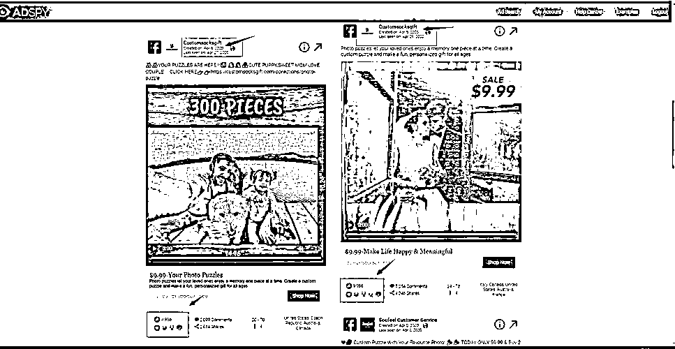

评论区：

 

 

瓜藤 : 星球得来终觉浅，绝知此事要躬行，厉害[强]

清水哥 : 新人，执行力很强，很多观点值得采纳。[强]

Zev : 我也是用tikTok+shopify模式，出了3单，一共244美金。这条路现在还是难走，我也在摸索，得空可以一起交流一下么？

seven : 哇塞哇塞，太好了，私信您了

王明远andy : 感谢楼主分享[玫瑰][玫瑰]

seven : 我在tiktok课程里讲师也提到了您，向您学习。

周Quan : 你这执行力！赞！

慕亦Young : 楼主是全职还是兼职做这个，强大的执行力[强]

# **# ****(**精华帖**)(152**赞**)TikTok **小黄车，作为官方的

# 带货链接

作者：  鱼丸|亦仁助理

日期：2021-03-08

TikTok 小黄车，作为官方的带货链接。到目前为止，全球几亿用户中，拥有小黄车的只有 475 台，其申请的难度以及稀缺度也显而可见。

如何找到合适的打法来制作视频，从而提高粉丝量？

小黄车是什么，如何才能达到申请小黄车的门槛？

申请到小黄车后，该怎样更好地运用它？

今天  嘉宾  ，他将会以自己的经历来作为例子，来为大家解答上述问题。

他在短短的两个月内，用 TikTok 获取流量（新媒体）+产品升级（品牌化）+ Shopify 变现（电商出海）这套相对成熟的打法，从 0 认识到成功申请 TikTok 内测小黄车。

今天的分享会分成三个部分：

**1. ** 第一部分从素材属性、素材文化差异处理、老外的笑点以及背景音乐节奏四个方面，详细拆解了他视频的爆点

**2. ** 第二部分主要是讲述了小黄车的作用、申请小黄车的经历以及小黄车的应用。

 

 

**3. ** 第三部分则是他对自己整段经历的复盘与感悟

来，欢迎  的分享。https://articles.zsxq.com/id_vqun62pkisfn.html评论区：

Ming : 谢谢生财的大航海活动让我接触到了TikTok，然后我们一起赚美金吧  哈哈哈  老佟 : 手动为组长打call[强]

麒麟 : 感谢分享

【问题症结——国内运营商信息残留。】

关键问题求击穿，无论是从0到0.1的从无到有，还是从1.0到2.0的迭代升级，都会面对一些关键性的问题；

所谓的关键问题不是说这件事情难度系数有多大，只是当时的的一层窗户纸，捅破了大彻大悟，捅不破极有可能去凿墙或者换一间屋子另寻出路；

【TikTok 的增长人员找上了我，我由此进入了创作者项目。】

平台永远不缺流量，缺的是优质的内容：平台大多数都是A属性，缺的就是A+B属性，那就做加法；平台的用户不知道啥叫Rio 鸡尾酒，那就翻译成孟买金酒；

【善于盘活资源】

每当和生财好友交换微信后，对方都可以发出长长的一段文字，介绍所能提供的资源，而到了我自己，半天没合计出来一个资源；

看完分享后，觉得自己之前的想法不成熟了，因为每个人都会有一些资源，能不能善于盘活资源很重要，这就需要一双会发现美的眼睛和一颗爱思考的脑子；

我是加入生财第109天的麒麟，有幸一路前行。

meek : 感谢ming大佬对小黄车的分享

阿宽 : 点赞，评论，收藏一键三连给组长打Call

九帆 : 感谢分享

家蒙 : 感谢ming的分享，tk小明真棒

光追20220908 : 视频的爆点‘、挖掘文化差异、的方法，其他的看看思路好了，不玩Shopify ，模式太重了

 

 

# **# ****(**精华帖**)(143**赞**)TikTok **欧美地区直播带货项

# 目，我的操盘与踩坑经验分享

作者： jordan

日期：2022-07-20

一个一直在做运营跟主播的 TikTok创业者到底怎么看这个赛道？

怎么半年内拿到300万的利润？

未来的路该怎么走？

只要你对TikTok感兴趣，不管处于什么岗位，我希望在接下来的分享里或多或少会对你有所帮助。

你好，我是游可卿，之前留美八年学习工作，2020年7月份开始接触并学习 TikTok，现在的项目是去年底立项的，一个人起盘，一路踩坑，一路尝试，现在10个人的团队，变现了300万人民币的利润（不是GMV）。

这里给大家做一个客观的分享，观点无论对错，对你有一点启发就好。

同时也借这篇分享兑现之前自己的一个承诺，就是一直在生财汲取知识跟能量，到了合适的时间就一定要反哺回去。

（下面是我朋友圈之前发的我们其中一个站的数据，发图只是为了说明我是实战出来的）

 

 

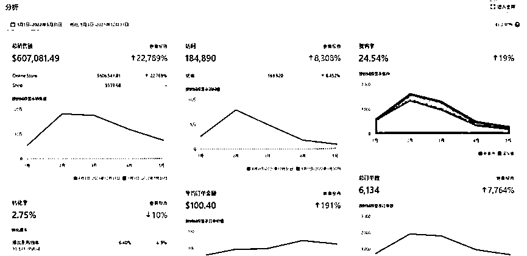

这次分享的内容不会涵盖基础的运营知识，类似的内容全网已经太多，这次更多聊一些会对项目最终结果产生决定性影响的事，大概分为几个核心观点再结合我从创始人，主播，运营不同的角色对自身工作的理解。

先说核心观点：

一、** TikTok**经验分享

**1. **创始人要懂业务

身边失败的大大小小的团队，没有一个是自己很懂业务。身边取得成绩的创始人，没有一个是不懂业务的。一个都没有，抛弃幻想，至于为什么，在创始人篇会详述。

**2. **利润为先，变现不是利润

 

 

显而易见的事情但还是受到很多人的忽视，对于利润为先的小团队，从获取利润的角度去做项目底层设计比为了做GMV要靠谱的多。

所以GMV的组成，客单价，复购率，团队人员能效，固定成本等等这些要综合考量去反推利润。不同的团队也许都可以做到一个月100万的GMV，但结果会有天壤之别。

**3. **少搞供应链，专心搞流量跟转化

TikTok现在远没有到拼供应链的时候。

有身边朋友问，那我爆单了怎么办，我的回答是，你为啥还不会走路就已经开始担心跑步受伤了怎么办。爆单没那么容易，如果真爆了，临时抱佛脚也能过的去。GMV来自于你流量的广度跟转化的深度，缺一不可。

TikTok的标签没有抖音那么精准，做不到很少的场观跟在线也能稳定出单，一定要有个流量的基础保证，要有好的账号。

有了流量，团队转化能力也要能跟上，我们团队在不同阶段出现过在线5000人不出单的，也出现过流量滑铁卢在线100多人但三个小时出了5000多美金（附截图）的情况，流量加上转化，粗暴有效，现在真的是前端为王的时候。

 

 

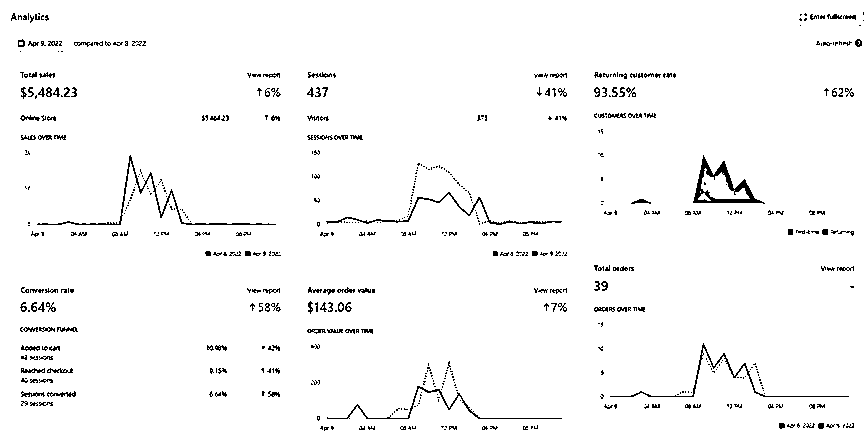

**4. **降低预期，沉住气

TikTok目前对于大部分人不是一个能实现巨额利润的平台，抖音可以但是 TikTok还不行，过高的预期会让创始人策略激进，更容易失去耐心，并最终导致失败。

沉住气，你现在能变现几万美金也许就是以后的几十万几百万美金甚至更多，你要的是这种变现能力，等待后面的借势。

**5. **研究失败案例，不是成功案例

TikTok拿到结果的项目各有各的方式，真的是条条道路通罗马，但是失败的项目原因大致是一样的，先研究失败案例，避开，你就成功了一半。

其中比较重要的一点就是要管控财务风险，公司运作不下去很多时候无非是发不出工资。准备能够在没有收入的情况下团队可以存续10-12个月的资金，没有那么多资金？

那就不应该养那么多人的团队，减人吧。

 

 

二、创始人篇

** **

**1. **作为创始人，我有一个核心的原则就是对项目认知几分，就投入几分，这块要对自己绝对的坦诚。

总分10分，假设你有10块钱，你对项目认知只有3分，你看的并不清晰，那你最多只能拿出3块钱去做这件事。理论上，如果你对项目的认知达到满分甚至超出，你足够的自信了，你借钱也可以上的，虽然我从来不建议大家负债创业。

那现实中是，我看到很多人从开始就做了错误的决定。

2020年刚接触 TikTok的时候，认识一个老板，89年的，以前做过跨境赚了些钱，专门从福建跑到杭州，ALL IN TikTok，非常有热情，租了写字楼，招了20多人的团队，那个时候的 TikTok，大家知道的，啥都没有，没有直播，没有小店，才刚刚有了基金，真的很懵懂的状态，他带着300万，应该也算是他大部分的积蓄，意思是给自己一年的时间时限，钱先花完或者一年时间到了，他如果做不出成绩，就会选择放弃。

我现在还清晰的记得他跟我面对面说，兄弟，现在 TikTok不是按月按天去算的，现在是按秒啊，赶快上车。那个时候的我，其实会被焦虑到，但是也会强烈的质疑这种浮躁的情绪。

他项目一启动，找了专业的律师做了厚厚的一本竞业协议，怕以后的员工乱来。招人这块，只要会点英语就可以多给，是个外国人就可以一万五起，如果在字节的体系做过，哪怕只是做过一些后台视频审查的工作到他这里就可以作为项目负责人，给2万底薪。

 

 

在我看来很多工作本末倒置了， TikTok项目一开始只有一个目标，就是小团队跑通整体变现的闭环，不管是跑通100美金还是1000美金。  先跑通完整的闭环，比什么都重要。

一年后，他回福建，背负着300万的损失。这是典型的认知在1分的层面却投入8，9分的资源去做。这种故事在接下来的两年，在大大小小的团队里不断重演。

有时候想想，也不能怪，毕竟我们都生活在一个每天充满焦虑，各种暴富的故事不断诱惑着你的世界，谁又能独善其身呢？只能时刻警醒自己。

**2. **作为创始人，一定要有利润意识，因为利润是你是否能坚持下去的根本。

最简单也是最本质的公式：  利润=收入-成本。

作为大部分 TikTok团队刚开始启动的时候，创收还没有头绪，那就先从成本开始吧。

别上来租个700平方，把钱省下来， TikTok团队真用不了那么大。

别上来招聘太多人，四五个人不能跑正盈利，四五十个人也是一定跑不出来， TikTok真不是一个劳动密集型的项目。

时间上， TikTok团队，两个月必须盈利，不是说你亏不起后面的钱，而是两个月不盈利的 TikTok团队已经就暴露出了团队的战斗力有重大问题。

作为一个爆发力很强的平台，只要团队在正确的方向上，方法也匹配，就一定会在短期内有收入进账。如果没有，可以反推出来团队的方向跟能力存在问题，这个信息比亏些钱要重要的多。

 

 

最后，及时盈利很重要的原因是，项目并不会因为你多砸钱了，你会有更多的积累以及先发优势。不盈利的团队，你除了积累出一些废号，你啥都积累不了，钱砸不出未来。

**3. **作为创始人，一定要会搭建团队，你要亲自参与把关每一个成员，特别是主播。

这块工作量没那么大，却及其关键。因为行业相对新，其实招不到太多有经验的，所以你需要筛选出对于业务要求有潜质的就可以，这一块往往只有创始人才能把握。

当然，这个情况今年有了很多的改观，你会发现应聘者里很多都做过 TikTok了，那你就要问一下，该应聘人员之前参与的项目是否盈利，如果没有盈利，就且把他当成零经验就好。因为往往在一个没有结果的团队做太久的人，反而会对行业跟业务会有很多误判。

主播这块，语言能力毫无疑问是基础，很多主播应聘都会说自己英文好，但这个标准真的是因人而异。会说英文，跟说好的英文，跟能做一个合格的主播，这是三件完全不同的事。你我都说中文，就一定能在国内抖音上做一个好的主播？我真的面试过很多很多主播，有朋友介绍的ABC，英文自然不是问题，中文也很好，聊了后发现，对业务完全没有理解且有不切实际的需求，基本上后期无法融入团队。

还有现场面试完，婉拒后第二天朋友圈就晒自己新注册公司营业执照的。有来应聘全职主播，问能不能不坐班的，意思每天播完就回家，因为自己经验很丰富什么的。我就问了几个问题，你是不是来应聘全职主播的？答：是的。那你不坐班不是不可以，只要足够优秀，怎么鉴定一个主播是否优秀呢？答：就是要比较有经验。你之前参与的项目盈利了吗？答：没有。你之前每场GMV到底播多少？答：1，200磅。

 

 

在国内大家都认为李佳奇优秀是因为他一场可以几个亿，可以养活一大帮人，所以叫优秀，那你认为全中国有特别优秀的 TikTok主播吗？答：没有。这种情况下还会提出只坐班的要求，其实就是因为行业里各种错误的信息给大家的一个误导。随着行业的成熟，这种情况会越来越少。

**4. **作为创始人，大的决定一定不能错。

比如公司做什么业务去变现，做哪块的市场跟类目？这些是关键决定，不能出错，没有唯一的答案，只有最适合自己的答案。

我们项目立项后，第一个决定是不去做英区市场，我们要主攻北美市场。原因很简单，我太了解自己的团队了，我们拼价格拼不过别人，拼努力绝对也不算是最努力的团队，拼各种资源更拼不过别人，其次我个人就一直不喜欢很卷的方向。

因为英区开通了小店，所以会涌进去大批已经熟悉国内小店玩法的玩家，再加上平台的补贴，一旦卷起来杀红了眼，我们团队没有任何胜算的。做北美市场，我个人对北美了解，同时北美也是最大最具有挑战的市场。

虽然没有小店，要靠其他方式引流落地，主要就是简介挂独立站。是的，购买链路更长了，转化率更低了，没有官方扶持了等等。

但我分析，没有问题，我们团队整体的沟通能力还是偏高的，可以攻克一些问题。这也就出现了我们后面会教很多奶奶级别的客户去一步步的教她们下单，哪怕链路很长，时间很久，但奶奶客户的忠诚度高啊，有的还开玩笑认了我们的主播当孙女。

再比如，之前有个比较主流的逻辑是，英区小店练兵然后等到美区打开后再转移。我们很早就已经做出判断，美区的电商化不会推进过于顺利，与其等待不如主动进攻。

 

 

判断的主要依据在于，字节很难在美国这么多眼睛盯着的情况下过于强硬的去推全闭环，CREATORS不愿意，竞争对手也不愿意，更重要的是大环境不愿意，美国人是freedom nuts,他们热爱自由，这其中也包括自由的引流到独立站。我是坚定的看多  TikTok，看好字节的一方，但是这次字节电商不比当年阿里巴巴去美国上市，当年阿里是TO B，是帮美国人挣钱。

字节电商过去是要TO C，是要去分蛋糕的，加上现在的紧张大环境下，难度可想而知。

在这里，我也希望字节能坚持下去，找到解决问题的方法。

小一点的事情，比如平台不成熟的时候尽量做非标品，选品必须要小，轻，售后简单，供应链在国内有优势的，容易造成冲动消费的，不需要大量囤货的，等等。

业务上尽量复购率做高，一个是说明跟客户有一定黏性，同时也确实省了物流费用。跨境物流占大头，我们按每一单核算的话物流费用占至少25%，那如果让客户多下几个单子打包在一个盒子里，物流费用就可以被分摊掉，整体利润就上去一些。

怎么让让客户多下单，各种promotion结合提炼好的话术，或者小细节把一个最热销的产品放到页面最后一个展示，客户就会为了找热销产品被动的先看到其他的产品从而提高他的购买几率等等。

**5. **作为创始人，要长期主义，格局大一点。

做任何生意，像生财里很多人经常提到的，就是我们尽量去做一些长期并有沉淀的事情，这样雪球会一点点滚起来，否则哪怕赚到钱了也是无限的焦虑。

 

 

我们之前做过一个决定，造成了短期内的损失，但长期看一定是对的。项目启动做了一段时间，但是发现我们其中一个品类的品牌名已经被注册，很多客户已经熟悉了现有的名称，如果改名称，会出现一些客户的流失，还要从新把新的名称植入到用户的心里面去，但如果不改，时间越推移越难改，后面就会有隐患。

我们改了，直接间接的损失至少30万，但是换来长期安全的发展。格局大一点这块，就是真的不要对自己的员工遮遮掩掩，前期把关严一点，进来后就还是要尽最大能力帮助员工成长。

我经常跟团队说，如果大家能力很强，强到可以出去自己做也没关系，一方面证明我们体系的成功，一方面是员工哪怕出去做也是要面临所有创业者都会遇到的问题，他要找资源，找合伙人，那如果彼此信任，为啥不可以联营的方式去做？

**6. **做为创始人，一定要有决心。

人跟人之间智力的差距真的不大，主要就是在于后天的认知、学习能力、韧性、决心。

我个人认为决心是最重要的， TikTok的任何一个细分赛道，都能做出结果，就是看你决心有多大。

因为平台自己的内容推荐体系，风控体系也好，标签等等都不是特别成熟的阶段，就一定会有各种不确定性。因此在业务上需要不断的进行各种测试，跟这种不确定性进行对冲。

如果决心不足，很容易会放弃，测试是一种常态。还有你的决心一定不是嘴上说说，你要有具体的行动。

 

 

我春节期间回老家呆了一天半的时间，当时作为团队的核心主播，年初二赶回杭州直接开播，当天就做了13000多美金（截图附上），不光是为了钱，也为了多圈些客户，多取得一些竞争优势，我当时回杭州路上的内心想法是，我必须要去有所付出，否则我凭什么做的比别人好，我要做一些别人不想去做的事情。  比如跟我们的客户兼MOD各种聊，有点就是三陪，直播间陪聊，WHATSAPP陪聊，电话陪聊，少陪一个都感觉感情不到位。

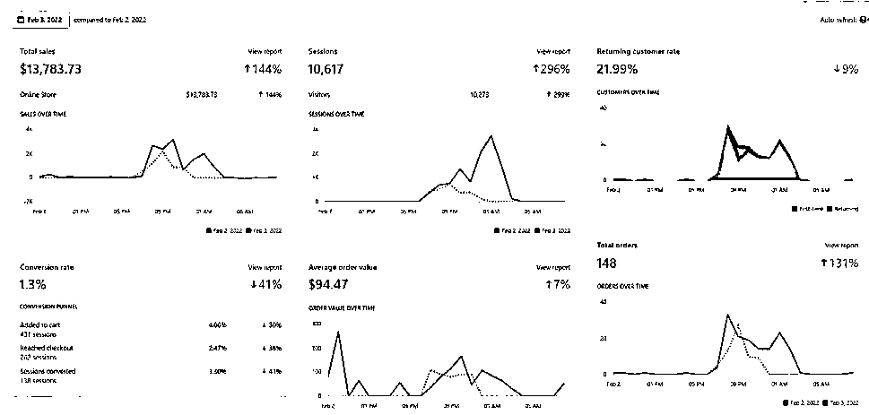

**7. **作为创始人，一定要注重团队管理。

现在圈子内更多的交流还是在纯业务层面，我个人认为做 TikTok业务上一定只是最基础的坎，更多的坎一定来自于团队管理。

对于一些入局 TikTok的老板，他基本上就已经进入了一个无解的局，必输的局。项目失败了，你输，但哪怕项目做起来，你还是会输。

因为你会在管理上面临巨大的挑战，运营跟主播都是不稳定的因素，在一个起跑线差不多又很轻的项目赛道里，面对一个不懂业务管理又很薄弱的老板，跑路或单干基本上是必然的选择。

 

 

所以作为创始人一定要想清楚能给团队的成员带来什么真正的长期价值，让大家能绑在一条船上，共同前进。

我理解的是，一个好的 TikTok团队一定是东西结合的方式。

团队里要有人对国内的短视频跟直播领域有一定认知同时也有人能对海外目标市场的用户消费心理，内容审美这块有一定的认知，大家在一个开放的团队环境下去不断打磨出最优解。

目前 TikTok从业者，大都是从传统跨境，国内抖音或者有一定海外背景的这些创业群体。

传统跨境从业人员面临最大的问题就是怎么从LISTING的图文时代过渡到去中心化推荐的短视频时代，这两个方向对团队能力上有完全不一样的要求。之前做过抖音，认为到  TikTok上是降维打击这一理念，目前基本上大家都已经看到了，并不是事实，甚至做过了抖音，反而会容易带着抖音的包袱去做 TikTok，所以一定要空杯，否则会走更多弯路。

至于海外背景这个群体，就是我所代表的群体，我认为最大的挑战是怎么能够做到趴到地上去做一些苦活累活，做一个接地气的创业者才会有更大的胜算。

最后，做为创始人，没事别选择ALL IN TikTok, 这种听起来背后有太多赌的成分。赌也许可以赢，但不赌也能赢才是更好的选择。

喜欢德州扑克的小伙伴应该都知道，面对一件搏概率的事，你要想尽任何办法把它从一件充满不确定性的事往相对确定的方向去做，长期看，是一定会赢。

 

 

TikTok只是一个工具，一个很牛很牛的工具，我们当然不能完全依靠一个工具，如果要ALL IN,我建议永远ALL IN在自己身上。

三、主播篇

项目粗略计算应该至少有一半的GMV是我自己播的，特别是刚启动的阶段。

我最多的一次播过7个小时，基本不停，场观也有过260万（附截图）。还有次在线做到过3万多人，有点小离谱。

 

 

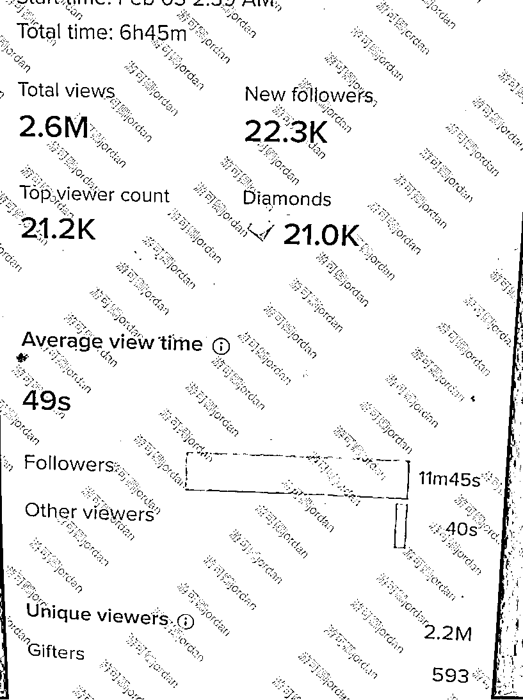

作为公司的第一个开疆破土的主播，我简单的分享几点。

 

 

**1. TikTok**尽量不要做类似国内的叫卖式直播。

这跟海外用户消费的心理有关系。比如国内的大主播可以卖所有的产品，因为大家喜欢热闹，喜欢大主播的极致性价比。但美国用户消费更加偏专业导向，也更加容易受到主播个人的影响。

有一个单子我印象很深刻， “ I just placed an order only because you are a good salesperson.” 从这个层面，观众还是很感性，而且对方还是个男的，并不是因为看上了我的美色。他真的就是认可了你，为了表示支持，仅此而已，客户对产品根本就没有需求。

换一个角度，总体来说北美用户很喜欢知识付费的，很尊重别人的劳动，真的就是不喜欢买盗版的东西哪怕知道可以省更多钱。所以作为主播你要展示出你的努力，你的专业，你能给他们带来的价值特别是情绪价值，一定会有回报的。

**2. **对流量推荐和运营工作有个基础的理解。

对流量推荐有个基础的理解，直播间推流现在就一个核心指标，用户停留，用户停留就是最高的权重，简单粗暴。

对运营工作有个基础的理解，这样可以跟运营有个更好的配合。主播的预热不要放在直播开始后，必须是直播前，一旦开播你要强迫你自己状态调整好，去迎接那第一波急速推流，急速推流的承接会影响到整场直播的结果。

**3. **主播最核心的能力应该就是节奏感，很务虚的能力。

 

 

总体就是，你知道什么时候要慢下来，因为你要多去介绍产品，耐心的积累直播间的购物情绪跟氛围。

什么时候一定要嗨起来，因为感觉到了，就要快马加鞭把情绪释放出来，让大家争先恐后的下单。

就像NBA里的卢卡.东契奇，你不一定是最高最壮最快的那一个，但你可以是最有节奏感的那一个，就依然可以很强。

**4. **没有主播是完美的，找到自己的优势。

我个人就擅长沉淀老客户，但抓newbie的能力就不强，也许是因为我自己之前在德克萨斯的原因，导致我的德克萨斯客户会很多，亦或是德州的客户真的就是有钱豪爽，哈哈。

我会经常跟他们聊一些以前的趣事，甚至会主动聊一些婚姻家庭，情感，八卦等等。最容易互动的话题就是“Ladies, will you ever forgive your partner if he cheated on you???” 评论区里就，“no””never” “f**k no” “I will make him pay” “he will be gone” “only if I can cheat too” ..很多互动这不就来了嘛，只是作为一名男性，越看评论越害怕，广大同胞们，管好自己。

当然我们也有禁忌的话题，就是所有容易引起大的争议的，一律不聊！比如政治，宗教，性取向，男女权力等等，只要你聊了，直播间那么多人，一定会有人被冒犯。

**5. **如果真的状态不好，可以不播。

 

 

让别人上，不要去消耗你的受众跟账号，更不要无理由的去拉时长，如果在线都已经个位数了，为啥要继续播？我一般如果感觉状态一般或者数据下滑幅度比较大，就果断下播，重整旗鼓再来战。

**6. **发自内心的去**CARE**你的受众。

你要知道每一个数字背后都是一个活生生的人，都是一个不一样的故事。你去用心感受，对方自然能够感觉到，注意力放在支持你的观众那里，不要让一些负能量的人影响到自己。

之前看到过一个大佬的说的句话很是认可，他说直播就是陪伴。事实何尝不是如此呢，我们的客户家人去世了会跟我们说，自己跟病魔做斗争会跟我们说，有了开心的事情也会跟我们说。

这些跟产品无关，跟销售无关，只是陪伴而已，生而为人，陪伴也是刚需。没事多翻一翻客户的账号，多了解他们，也会对自己的直播会有帮助。

**7. **关于主播的语言能力。

我是这么理解的，只要是非母语者你确实很难做到特别优秀，这没关系，因为语言只是其中的一个小环节，你要传达的有情绪，说话的内容，展示的产品，你个人的特质等等，这是一个很综合的表达。

但我会要求直播间不要出现中文的交流，我会要求所有的关键词语不允许出错，必须要做足功课。

 

 

不出现中文交流只是因为，对方并不懂中文，这么做其实是一种潜意识的不尊重，也是在细节层面展示出直播间的专业性。  关键词语不能出错，比如产品的卖点一定要提炼出来简单清晰的表达。

日常的话术都是要流利，不能出现低级错误，简单的语法或者措辞错误会让母语者听起来会有距离感。

同样的，如果外国人给中国人直播，赚中国人的钱，理想的状态也是一样，越地道越细节，这种距离感就越少，你就越容易成功。国内抖音上变现做的好的外国博主，中文都是很好，这是基础。

**8. **关于常客的维护。

也许你的regulars不多，但星星之火可以燎原，作为主播一定要跟他们保持很高的黏性，每天见面了招呼跟问候肯定少不了，其次就是要给予关注，人多的时候点她的名，并表示感谢，每个月对于做出突出贡献的可以给一些礼物跟折扣码。

其实没人在乎这点钱，但这是一种态度，很多常客会在你的直播间每天可以花2-3个小时帮你造气氛，回答新人问题，跟主播互动。她们只有一个诉求，就是精神诉求，一定要满足，这也会让你的工作变的更加有趣。

作为一个主播就像任何一种职业一样，一定要做一个靠谱的人，靠谱在哪里都是一个很核心的品质啊。

我们最大的一个客户，很巧也来自德克萨斯，她的第一单是在观察我播了两个月之后才下，感觉靠谱了，她会非常坚定的支持我们，已经累计花费31000多美金。（附截图） 

 

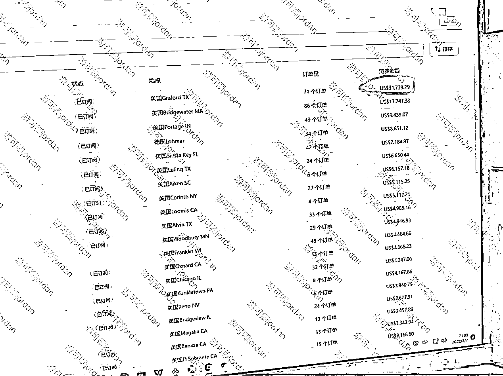

四、运营篇

** **

**1. TikTok**的运营挺苦的，因为他真的不知道明天会发生什么。

所有岗位里，除了老板之外，运营应该是最焦虑的。  真的要给运营加个鸡腿，相比国内的抖音， TikTok有一个痛是抖音兄弟们体会不到的，就是真的硬件跟网络会让你头疼。

没办法，一个中国公司做的海外APP针对国内玩家做出了我个人认为最严格的风控体系之一。一般的网路环境设置分分钟玩个IG，YOUTUBE没问题，  不拔卡不关定位，你看  TikTok试试？你要发视频，那你不得更干净的网络环境才行？  你还要玩直播？  那你要不插卡拉个专线并且保证一机一号一地址试试？

 

 

**2. **运营要注重细节并举一反三。

因 TikTok的变化是实时动态的，一个只能听别人发号施令，自己没有解决问题的运营会很快被淘汰。

比如你完事后，先关WIFI跟先关节点有没有区别？  看上去没区别，其实有的，还比较重要。  突然流量下滑了，到底是自己原因还是平台抽疯？还是你的类目竞争对手更强了？

TikTok跟抖音一样也是有个赛马机制，你哪怕水平保持不变，只要别人更强，你还是会下滑。好的运营需要有能力分析出问题到底出现在那里。

**3. **运营真的要有耐心，愈挫愈勇。

短视频也好，直播也好，每次给你推的那一波测试泛流量会比国内抖音还要不精准，比如你卖LEGGINGS，它给你推一波小孩，那你承接不住，跟你是没关系的，不用太懊恼。

你需要做的是不断尝试，直到好运降临。

运营的细节太多，一个好的 TikTok运营要求蛮高，要懂直播间运营跟账号运营，还有对接到独立站的后台或者小店后台（我们不设中控岗位），确保各个环节都是丝滑的。

运营篇写到这，突然思绪万千，已经不知道该写些啥，这块内容各个渠道都挺多的，大家有机会再交流。

 

 

一不小心，啰嗦了挺多，想加一些题外话，真的要感谢自己的团队小伙伴，大家都鼓励着我走出来做更多的分享跟交流，因为我个人的性格不是一个特别擅长分享的人而且更喜欢静下来钻研业务。

目前 TikTok的情况算是近年来的一个低点，从业者特别是做电商变现的至少90%的人并没有在盈利。我是坚定的看多 TikTok赛道的玩家， TikTok的能量是没有上限的，有太多业务方向可以做，我们也只是在摸索电商变现这块。

所以我希望大家能先生存，这份生存指南分享到你，请一定先苟住，等待光明的那一刻。在牌桌上想赢最重要的一点就是要先留在牌桌上，我们一定要山顶相见。

团队接下来，会去挑战难度更大但长期看更正确的方向，就是攻坚任何一个想出海做品牌的跨境团队最终一定会碰到和两个天花板，视觉设计跟品牌故事。

我们自己有杭州算是顶尖的STUDIO，内容层面也有自己的理解，希望这块可以跟大家有更多的交流。把流量做起来，产品做好，服务做好应该是最本分的事情，真正拉开差距的就是在视觉设计跟品牌故事，这些能真正帮我们抢占用户心智，产生更高溢价的地方。

最后， TikTok里不光有财富的机会，也实实在在有值得大家去感受的内容。

之前刷到过一个在美国做临终关怀护士的账号，她会分享很多病人去世之前的表现。其中有一个老人在安详的去之前说了一句话，让她很触动，老人说“It was all worth it.”。其实翻译过来我认为就是“人间值得”的意思，当你回首，只要你认为值了，没白来，这不就是最好的人生吗？具体的形式根本不重要，就像亦仁做了生财这个社群，当他回首的时候，他做过这么一个帮助普通人赚钱的社群，改变了很人生轨迹的社群，不管他自己赚了多少钱，经历多少坎，他都应该会感觉挺值的。

 

 

所以，感谢生财，祝大家生财有术，人间值得。

评论区：

江苏淮安  邵闯 : 感谢分享

jordan : 就想帮大家避坑

Lio : 感谢，可以

交流下吗

jordan : 大家对TikTok这块自己有哪些问题想要了解探讨的，可以加我WX:sfajordan 何轩 : 学习了，感谢

不仅仅是反向思维，而且是长期思维

jordan : 能做长期  尽量做长期

沐云丰 : 感谢分享，先mark，很有启发。以后遇到问题再来回顾，应该会更有收获[强] jordan : 可以哈

# **# ****(**精华帖**)(120**赞**)**以** TikTok **举例，如何发现海

# 外产品的生财机会** **？

作者：  三林

日期：2022-04-11

本文关键词：Google 流量研究、关键词挖掘、TikTok、SEO；文章 3000 字，读完只需 8 分钟~

你好，我是三林，互联网产品人。上一篇文章聊到一个资源套利的下载站：通过 SEO 获客并导向公众号实现广告变现。其抓住了国内用户需要谷歌浏览器插件但又下载不易的需求。那回归到需求出发，我们该怎么发现类似的创业/生财机会呢？今天围绕此，深入聊聊。

 

 

我选择的研究对象是「TikTok」，出海产品的当红炸子鸡，且不少圈友正在该赛道做点事情。

核心思路是通过基于** TikTok **的关键词研究，以 Google 的搜索量为依据：哪些词搜索量大且稳定，又有哪些产品或服务来满足了这样的需求。  因为用户主动搜索的内容，往往是其真实的需求。从大数据中，发现产品机会、找准需求。

本文目录

** **一、从** TikTok **视频下载工具说起**… **

 

 

首先，从查询到的关键词搜索量数据，很容易发现的产品类型：  **TikTok **视频下载网站（**Web **工具）！  我统计了 TikTok 第三方视频下载工具一系列网站（后附），只取前  10 的站点，其整体的流量超过 8000 万次访问/月！（数据参考的 SimilarWeb），其中有两个网站表现超常，下面会详细说一下。

 

 

这些网站匹配了一系列的  「tiktok video download」关键词，由上图我们可以看到「download video tiktok」这个词，近一年里月均搜索量高达 2490 万次。

**1.1 **月访问量超** 3000 **万的新网站：** Snaptik.app **、**Ssstik.io ****Snaptik.app **

Snaptik 提供了 TikTok 去水印视频下载功能，宣传的核心卖点：无水印、快速、全平台支持。

据 Similarweb 的数据显示，该站点上月访问次数为 3100 万！（PC 网站和手机网页的访问总量），  全球排名 2000 左右。

 

 

**46.7% **的流量来自搜索，等同于每个月超过** 1400 **万次访问是来自搜索引擎的。

**50.5% **的流量来自直接访问。平均访问时长约** 1 **分钟。

**Ssstik.io **

和 Snaptik 一样的产品定位、功能服务。据专业 SEO 网站 ahrefs.com 的数据显示，仅用时一年半的时间，就从 0 做到了每月 3100 万次访问量。而 SEO 方面居功至伟，覆盖了  5.8 万个关键词，自然搜索带来了每个月 2400 万次访问（免费获取的哦，以 ahrefs 的流量估计，该部分直接价值 8.1 万美金/月）。

Ssstik 的第一大市场是印尼，其覆盖了 1.1 万个关键词和覆盖 1300 万次的月访问量。

 

 

**Savett.cc **

还是 Tiktok 视频下载的在线工具，再提到这个后起之秀的独立站。去年 10 月上线的，短短半年时间，从 0 做到了 300 万的月访问量。其搜索流量占比 68.7%，Ahrefs 的数据预估其 90%来自免费的自然搜索流量。

 

 

除了上述三家网站之外，还有超过 10 家网站在专门做这个服务，且流量都不低。整理如下：

（此飞书链接也可以看到）https://py64k0scfh.feishu.cn/sheets/shtcndvM7W7voqAaJVuu06zNPCh 

 

有流量，那么赚钱吗？** **不能小瞧。  以 Snaptik、Ssstik 两个为首的站点，每个月能够做到 3000 万次访问。这种在线工具，单页网站，很简单直接。产品设计及其克制，就挂载了一到两个广告位，按千次展现 2 美金估算，月收入预估在 6 万美金/月，年收入人民币 500 万（非利润），一年一套房的水平。

还不止，还有这两家均推出了去水印视频下载的 APP，在 Google Play 的下载量均超过了 100万，APP 的广告收益并未统计在内。

这是一种背靠大平台的用户需求，提供易用直接的产品功能，借助** SEO **超级凶残的流量增长并直接赚钱的模式。

**1.2 TikTok **生态的更多产品** **

于 Tiktok C 端需求，基于 Google 的搜索数据，去水印下载的需求比「tiktok 18、tiktok pron」等性相关需求强烈的多  ：） —— 当然了，Tiktok 也并不直接等同于 sex 内容平台。

 

 

我们再来看下，其他 TikTok 生态产品，简单概述：

**1. tokcount.com **一个实时观测** tiktok kol **粉丝的网站。每月访客** 180 **万** UV**、平均停留时长** 7 **分钟。就这么一个直观展示一个博主粉丝量（刷新）的网站，居然也有人看？** **这个网站就只瞄准了一个关键词：**Tiktok counter **。这个词，每月在** Google **有** 82.3 **万次搜索。

**2. ** 关键词：tiktok to mp3、mp4，把** TikTok **的视频转成** mp3**、**mp4 **格式的需求，**mp4 **容易理解，**mp3 **呢？都** 2022 **年了，还有人需要** mp3 **格式吗？有，需求大量存在。**YouTube **平台上相关产品的流量更猛。

**3. ** 关键词：TikTok view、followers、likes** **等，对应数个买播放量、买粉、买赞的网站。** **这些站点尽管有自带搜索流量，但竞争之下，也在** Google **投放了相关关键词广告。

**4. ** 关键词：Tiktok fans，对应一个** APP **产品：**TikFans - get tik tock followers + tik ****likes**，做任务互粉的需求，其下载量超过了** 100**万，主要是近** 5 **星好评** **的**11 **万评价数，还是规模不小的。

…… 等等，这些我都是只用了一招发现的产品 —— 关键词流量查询。

二、关键词挖掘的简易方法** **

**2.1 **什么是关键词流量研究？** **

从上述关键词的流量部分，这些工具型的网页产品，你也看到了，极其重视搜索引擎增长、通过 SEO 去获取流量。

我一直记得亦仁在 2017 年写的经典文章《通过 Google 挖掘细分市场的一个案例》，在第一步即是围绕巨头平台去进行搜索发现，探寻其中的商业机会。当我们搜索一个词，搜索输入框的联想推荐和其他人也在搜索的词，能无门槛的发现需求，简单、快速，但缺点在于：去搜什么词往往不知道如何入手，以及搜索的词可能不够全面、不具备代表性。

 

 

在 SEO 的领域，对于「关键词」研究，称之为：关键词挖掘。「关键词挖掘」是个系统性工程，对于一个行业要挖掘出数百万个带搜索量的词，才算合格，而用时往往要一个月左右。

不过，我们可以通过相关工具先简单、快速上手。

**2.2 **简单上手关键词挖掘** **

给圈友分享我的经验。第一步：框定母词。首先我们要基于研究的对象：TikTok ，还是 YouTube，抑或 Tesla 等，确定一系列的母词，比如 tiktok，我会选用：tiktok video、tiktok live、tiktok shop、tiktok fans 等圈定大范围。

接着

第二步：拓词！通『  谷歌关键词规划师』等第三方工具，发现相关搜索词。

第三步：清洗，再度拓词。再度查询关键词流量。

第四步：对搜索结果二次分组，统计具体哪些「关键词」的流量具备代表性。

第五步：筛选有价值的关键词，并定向研究具体的产品/服务承接。收录到自己的「项目库」或「需求池」。充分的调研、评估过后，再决定如何「杀」进去。这里先不展开了。

三、关键词挖掘的具体实操 ** **

**3.1 **拓词工具之：**Google **关键词规划师** **

这是 Google Ads 谷歌广告平台的后台功能，使用前提是一个商业账号，开户是一个小门槛，可以找国内的谷歌广告代理商开户，并不难解决。

 

 

进入「关键词规划师」，两个功能入口：一个偏「拓词」发现新词。一个偏「查词」查询流量的。

在「发现新关键词」栏目，搜索一个「关键词」便可产出更多的相关词，以及每个词的每月搜索量、广告点击出价预估等。（此功能最终还是服务广告投放的，但不妨我们用于需求挖掘的调研），如下图所示：

 

 

这就是「拓词」。初筛后，再次拓词，所谓「二阶拓词」，往往一个母词，可以拓词出一千左右的词，  一两千的核心母词，可以扩展出百万的带搜索量的词也并不少见。

**3.2 **拓词工具之：**Ahrefs **关键词查询** **

Ahrefs 在海外站点的 SEO 方面很专业。Ahrefs 也有关键词发现（keyword explorer）栏目，但不同于 Google 关键词规划师，其更多的是精准匹配的定向研究某个具体的关键词，数据颗粒度很细，比如 tiktok video downloader 这单一关键词的数据概述：

「直接匹配」了哪些相关词：

 

 

其他相关词建议：同样需求的词，可以下载导出作为「关键词」再次拓词。

Ahrefs 很好用很专业，去某淘租一个共享账号玩玩。快速上手体验。

 

 

另外一个 SEO 工具「similarweb」也有关键词分析板块，但我认为其数据量不够多，并不好用，但查一个网站的访问量，similarweb 是比 ahrefs 更准确的。

**3.3 **拓词工具之：光年**-**谷歌关键词分析工具** **

此工具由国内做流量增长的咨询公司「光年实验室」出品，亮点在于：批量查询和多维度数据导出，如果数据量很大，光靠网页版是不够用的，得申请谷歌关键词 API。（同根同源，数据同样是来自谷歌关键词规划师）。

**3.4 **关键词筛选，整理关键词对应的需求列表** **

通过不断的拓词、搜索词的流量，已经得到了一份数据。接下来该如何做？

 

 

往往是这样的一份关键词表：

我们按月均搜索量降序排列，一一查看（逐个看，没有捷径），重点关注月均搜索量大于 10000 的词。

整理类似如下的清单，列举了一些，这些 tiktok 相关词有着对应的网站或产品。（已排除性相关的需求词）

 

 

这样看，是不是一目了然。其实还有很多需求点并没有得到充分满足……此为举例，更深入下去，看到文章的你说不定有新的发现，欢迎交流，我也知无不言言无不尽。

**3.5 **关键词挖掘的技巧补充** **

关于母词，要多且准。母词的数量建议在「四位数」，数千个母词，可以拓词出数十万到百万的词。  而精准很关键，否则容易拓词出不相干的结果，筛选成本变高了。比如「Tiktok」容易拓词出一些大网红的名字，这些词在拓词时要先删掉。

那我们可以从哪里找母词？分享三点：

**1. ** 从目标网站挖掘：比如网站首页、关于我们等页面提取关键词，比如** slogan**、描述、**Metawords**、底部导航菜单命名。** **描述业务的词，越全越好。

**2. ** 找母词的角度：自己所处行业，那就头脑风暴开始。包括不局限于：直接相关词、行业相关词、人均相关词。

**3. ** 从广告投放词来用作关键词母词，也是特别好的。** Ahrefs **上了一个新功能「付费关键词」，即可以查询一个网站所投放的关键词，这个太强了。你想啊，人

 

 

家愿意按点击付费购买的关键词，能不精准吗**~ **下图以** Shein **举例：**Ahrefs **共收录了**7.4 **万个关键词，可过滤导出进一步筛选。

四、总结：** **

通过 Google 的搜索大数据，直接反映用户真正的需求。关键词研究若对一个行业需要更全面、耐心的挖词、选词。我介绍的是通过工具快速上手的方式。围绕 Tiktok 是如此，试试其他产品方向呢？比如据说最新估值 1000 亿美金的 Shein ，又有哪些周边机会可以做呢。

平台在变，可用户的需求具备延续性，若能在新兴平台提前布局相关服务，不失为分到一杯羹。比如 Instagram/YouTube 下载站的经验，在 Tiktok 上再来一遍。

通过 Google 搜索平台关键词研究，发现用户需求/产品机会，我称之为「生财机会」。

关键词研究很有意思，你会发现：居然人们在这样搜索一个词；当你去搜索这些词，惊奇：我靠，居然还能这么做。关键词研究的运用场景很多，不止是用在需求发现和 SEO/SEM，还可以用于内容生产维度参考、信息流投放、舆情监控、KOL挖掘等。

 

 

试试看，期待你的「我靠，绝了！」。当你哪怕找准了一个好的关键词，我想，这一定是个伟大事业的开端。

评论区：

三林 : 我靠，绝了[偷笑]。第一楼归我

闲富（软件定制） : 嗯，最近搞了一个国外tk刷粉的网站

颜周 : 去水印的网站真的直接把国内玩过的搬出去了。

三林 : 说不定是国外先做，这帮站点好几个来自印尼人搞得。还有国内的低调大佬也有做类似网站

三林 : 赞啊，期待后续分享心得

闲富（软件定制） : 目前市场已经起来，做工会的羡招募主播居多。找主播类工具比较好

Sunwei : 先赞后收藏，个别思路思考或实操过，感谢系统分享，私信加个V X好友[握手] 三林 : 文章没法加超链接的，补充亦仁的经典文章  时间快五年过去了，有些事情经得起时间考验https://mp.weixin.qq.com/s/cXa6Rwiet5gN8bSe-h4QNw**# ****(**精华帖**)(89**赞**)TikTok **红人营销需求痛点，通

# 过达人裂变，付费** 7000 **给** APP **产品新增** 15W **

# 用户的经验分享

作者：  董见一

日期：2022-12-05

compose app，在9月份的tiktok上形成了很好的自传播，是因为踩中了小白的制作高端转场的需求，这种转场一般有学习困难、剪辑难度大的门槛，compose大大降低了这个难度，还提供了很高的灵活性。

compose做到了什么？

 

 

用（做饭）类比（做视频）举例子，

一般人做饭（视频），要卖菜、洗菜、煮饭、炒肉、炒菜、加调料、最后吃。

一般人用自热饭（模板），一个套餐是固定的，但是你可以选不同的套餐。

组件式自热饭（compose），随意挑选处理好的食材，自由排列组合，然后组成属于你的自热饭。

在tiktok营销中，我们需要解决的就是如何向有痛点需求的一群人，展示我们的解决方案。

大家好，我是董坚毅，接下来给大家分享我接触tiktok红人营销的具体细节，包括如何寻找和筛选达人、怎么联系达人、和达人建立合作关系等。

我是19年去澳洲打工度假，玩了半年赚了30w，20年因为疫情提前回国；21年创业亚马逊，22年接触tiktok营销。

21年接触tiktok，22年尝试tiktok营销，接触两星期，用7k的的营销成本给app新增15w用户（tiktok的曝光1800w左右），tiktok单标签累计至今8000w播放。

我想如果大家想接触tiktok红人营销，这将会是一篇对新手很友好的文章。

内容将分为以下五个部分：

 

 

1、什么样的产品适合在Tiktok上获取流量？

2、如何和海外达人合作？

3、没尝试过的玩法。（tiktok广告投放、tiktok直播）

4、常见问题和踩坑经验。

5、过程中的一些经验分享。

# 一、什么样的产品适合在**TikTok**上获取

# 流量

# **# ****1.**解决痛点

 

 

目前市场上面大家需求比较大，但是已有的产品，无法满足人们的需求，只要可以满足需求，产品甚至在tiktok可以自传播起来。

举例：参考compose app，在9月份的tiktok上形成了很好的自传播，流量都还不错(图0-1)。

就是因为踩中了小白的制作高端转场的需求，这种转场一般有学习困难、剪辑难度大的门槛，compose大大降低了这个难度，还提供了很高的灵活性。

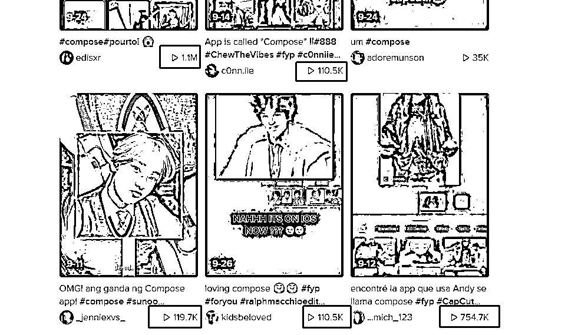

图0-1

compose做到了什么？

用（做饭）类比（做视频）举例子，

 

 

一般人做饭（视频），要买菜、洗菜、煮饭、炒肉、炒菜、加调料、最后吃。

一般人用自热饭（模板），一个套餐是固定的，但是你可以选不同的套餐。

组件式自热饭（compose），随意挑选处理好的食材，自由排列组合，然后组成属于你的自热饭。

下面花里胡哨的视频，就是不同转场自由组合的效果

 

 

 

 

Compose是怎么发现痛点的？

是它的母产品funimate（视频编辑app）在市场中总结出的痛点。

问题又来了，我们如果没有这样的靠山，那我们怎么去挖掘痛点？

# **1.1 **挖掘需求痛点

# **1.1.1 **通过**Google**关键词搜索

 

 

思路：1，*+关键词（*是通用符号） 2，关键词+26个字母（+a去搜或者+b去搜，26个字母都成立）

实操案例：以Ai painting为例子

我们可以在Google直接搜索 *Ai painting

可以看到大家搜索的最多的是google ai painting，其次是dream、mid journey等产品，那么我们就能够顺着这些词挖掘下去。

我们点击mid journey ai painting，发现这边出现了一个用户的使用问题，如何创造mid journey的ai图片。

这个问题就代表了一个用户的需求，他们想知道如何使用mid journey去做出图，但是现在不会，就像我们电脑坏了会用百度搜，如何解决电脑卡顿的问题一样。

 

 

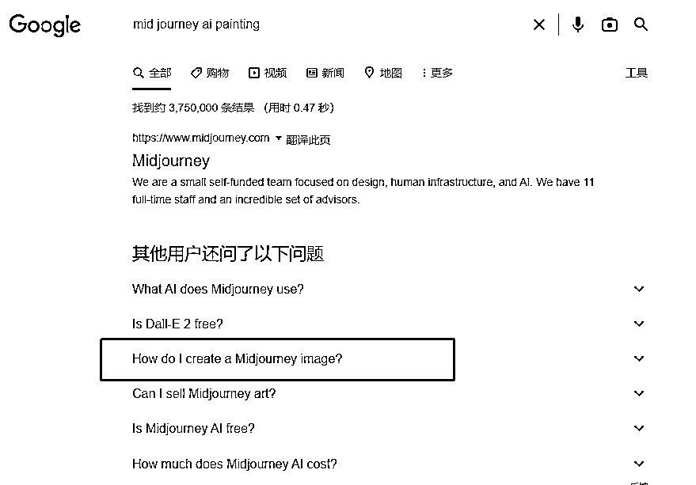

点击过后，我们会发现，AI绘图的流程一般是：

输入prompt提示，然后直接生成图片，或者是根据图片+prompt，生成图片。

 

 

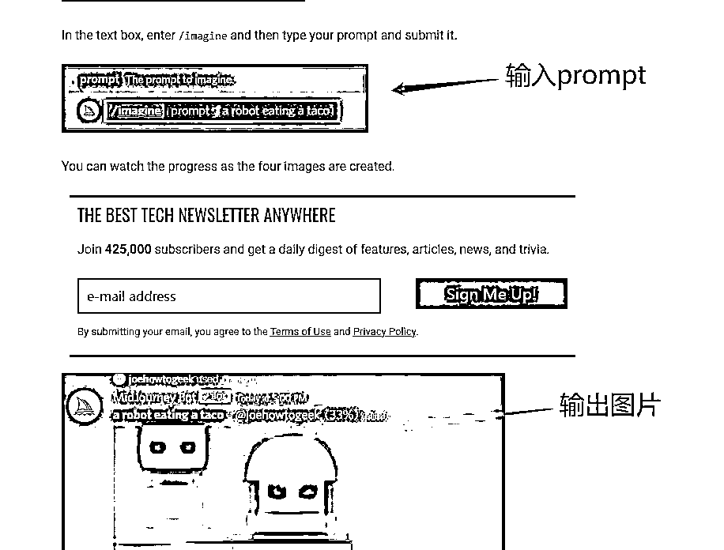

好，我们这边得到了2个要素

要素1 输入：文字prompt 用户输入的图片

要素2 输出：生成的图片

思维扩展一下，

输入端可能需求（文字prompt参考）：是不是可以做一个提供prompt交易的平台？

 

 

输入端可能需求（文字prompt参考）：是不是可以根据不同prompt里面的关键词做一个分类?

输入端可能需求（图片prompt参考）  ：是不是可以做一个AI人物姿势参考的平台？

然后prompt细分又有  关键词+风格+参数  等等

能不能做个风格、参数分类的平台？

# **1.1.2  **通过自身需求挖掘痛点

可以先从自己的需求出发，问问看自己有那些行为能够通过AI绘画完成。

然后作为一个用户，下场体验不同的产品，并把你遇到的问题记下来。

在使用时记录下来遇到的问题，问题包含三类：

1）使用app前，你希望通过这个app完成什么任务？

2）使用app中，有哪些问题让你想卸载或想打差评？

3）app什么地方改善，会让你觉得更好？

 

 

这个从前到后，始终有点问题但如果问题改善，你还是愿意继续使用的那个问题，可能就是合理的痛点。

举个例子：就比如说，作为一个创作者，我使用AI绘画已经有一段时间了，我会发现，AI生成的人物中，比较难去保持脸部的一致和衣服的一致，也很难生成特定分镜的画面。

那么保持面部和服饰的一致性的AI图片还有生成特定分镜的画面，就有可能是我同类创作者的痛点。

内容来源：【9月航海  英语工具站  航海手册】

# **1.2  **验证需求

需求这个点的落点是在用户身上。

# **1.2.1 **用户画像

基本信息：年龄、性别、学历、地域、婚姻状况等；

 

 

动态信息：经常看直播、喜欢打球、遛狗等；

行为心理：白领工作压力大、情感波动、性格宅等。

如果需求年龄在18-34，那么在tiktok会很适合。

# **1.2.2 **使用场景

同样的需求在不同的使用场景下不同人群会有不同的购买决策。

就比如说，ai绘画，

tiktok的创作者拿来做tiktok视频，目的是涨粉或者做一个垂直账号。

游戏公司的设计师用来做人物设计参考，目的是参考人物形象或者找灵感。

面对不同使用场景，营销的点也会不一样。

 

 

# **1.2.3 **行业竞品

如果人群和使用场景都确定了，那么就需要看看在这个需求下面，是否有解决这类人群和场景的已有解决方案，看下其他的竞品是如何解决这个问题的，他的优劣点在哪等。

# **1.2.4 **解决方案

产品提供的这个解决方案，是否能够解决用户的问题？

他们使用我的产品之后，能够给大家带来什么？

在tiktok营销中，我们需要解决的就是如何向这一群人，展示我们的解决方案这一个点。

内容来源：【Google 付费插件  实战手册】

ps：没有做过tiktok营销的产品，第一次做都是存在一定的红利的。

当你第一次出现在大众视野之中，会很容易引起人们的好奇，相对也容易火。

 

 

这一点，是所有想要在tiktok上做营销的产品，第一次入场都具有的共性。

# 二、如何和海外达人达成合作

# **# ****1.**怎么寻找和筛选达人

# **1.1 **寻找达人

(以下操作推荐在手机端完成，除了海外星图推荐在电脑端)

 

 

# **1.1.1 **直接在**tiktok**搜索相关关键词

关键词搜索大概可以分为行业词和竞品词，

以compose这个app举例，本身是视频编辑类的软件，

行业词首先就是 Video editor, video transition, music edit这样的词语，compose的竞品词是capcut、videostar、alightmotion等等，那么我们也能搜索这些词，我们打开tiktok，以video editor举例，

刚输入video 就已经跳出很多相关的词语了（图1-1），这些词都可以去看看， 

 

然后我们还是搜索**video editor**(图1-2)，出来几个结果，首先我们要看视频的更新时间是否是最近的。

其次我们要看关键词是否完整，如果不完整，视频内容有概率不相关。

看完视频，感觉合适就可以点击达人主页进去看了，后续步骤就是筛选达人和联系达人（这个后面会讲到）。

那如果假设我们想看最近关键词达人发布的情况（图1-3），我们可以点击筛选，选择最近一周或者最近几个月的筛选时间，其他选项可以不用选（打开most liked出来的结果大概率不相关）。

同理，如果video editor不理想，就可以搜索video transition, music edit，等等词语，再去找合适的达人。

无论什么搜索，搜索完往下滑都会跳出其他人在搜索什么的选项（图1-4），这里也能括词，

 

 

 

 

图1-1

 

 

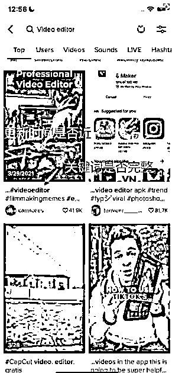

 

 

图1-2

 

 

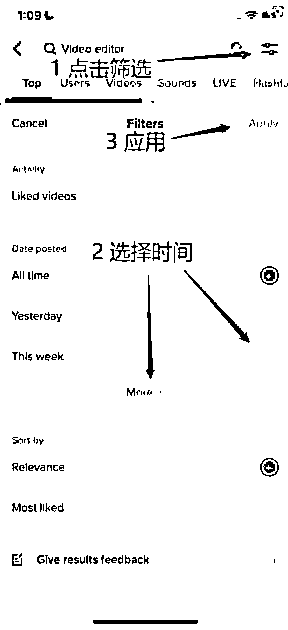

 

 

图1-3

 

 

 

 

图1-4

# **1.1.2 **通过达人裂变

这一步的基础是找到第一个合适的垂直达人了，那么我们怎么更快去找到其他达人。

**①**达人的关注和类似账号

（有部分达人设置了隐私，你看不到他的关注）

达人关注和类似账号的分布和抖音类似（图2-1）

**A **关注列表

 

 

但是假设你能看到他的关注，关注里面一般两种（图2-2）

第一种，相关垂直领域的账号；第二种，很符合达人所在国家审美的账号。

越是优质的账号，关注里面出现其他优质账号的概率也会越大。

那么在（图2-3）这我们就能够点击进去，去看剪辑网红的账号这些账号怎么样（图2-4），然后还可以看他们的关注，就能够无限套娃下去。

那我们的判断一个账号还不错的标准粗浅标准是什么?

最近视频播放在50K-1M，如果再加上粉丝数量低于100k的，恭喜你，这类账号一般能够谈到一个非常友好的价格，并且能带来不错的曝光。

 

 

 

 

图2-1

 

 

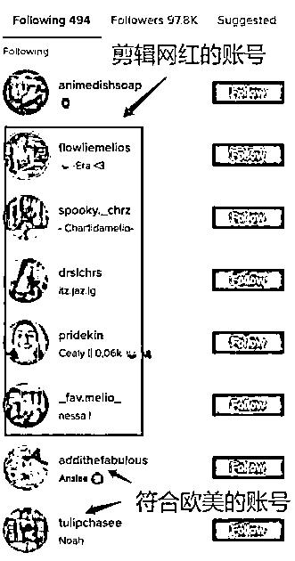

 

 

图2-2

 

 

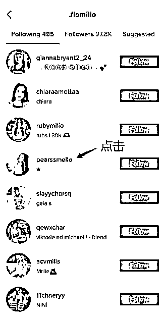

 

 

图2-3

 

 

 

 

图2-4

**B **类似账号

路径如下：

你会发现在类似账号这边的推荐（图3-2）会更加随机，但是也能找到类似的账号，比如图3-3 是一个电影剪辑账号，采用的手法主要是  模糊加上视频卡点，和编辑也挂钩，作为compose可以考虑合作。

 

 

 

 

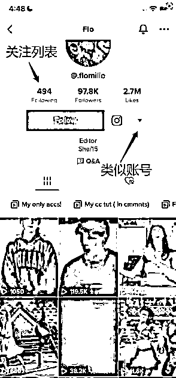

图3-1

 

 

 

 

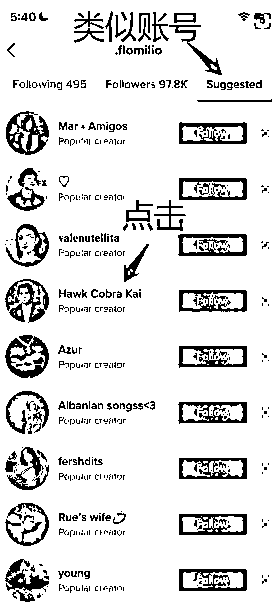

图3-2

 

 

 

 

图3-3

**②**与达人合作后询问是否有推荐对象

（注意：一般要完成一次合作之后，才能甩出这个问题）

因为达人一般都会有圈子，推荐的话一般能够推荐到还不错的（图4-1），而且有朋友合作的背书，后续谈判会很顺利。（一般提前说推荐成功会给5-50的tips，取决于你所聊的达人的粉丝量）

 

 

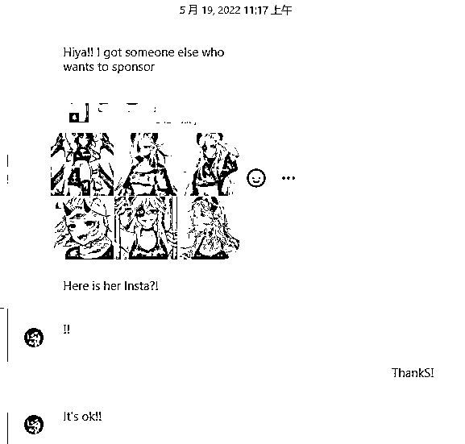

图4-1

# **1.1.3 **通过**#**标签扩展

举个例子（图5-1）  这是一个优秀的垂直领域博主的视频，

他的标签包括了 #capcut #cccreator #capcutvsalightmotion #naruto #narutoedit等等， 

 

其中比较常见的 #capcut #naruto #narutoedit 相对于中文就是 #剪映 #火影 # 火影剪辑，

那么 #cccreator 我们没见过，那么我们就可以点进去看看。

大概浏览了一圈之后（图5-2），发现cccreator大家都是用capcut制作的视频，那么cccreator很有可能是capcut creator的意思，而不是color correction(颜色校正) creator，那么这个词就可以作为挖掘capcut合作达人的标签之一。

和关注同理，标签也可以无限扩展。

 

 

 

 

图5-1

 

 

 

 

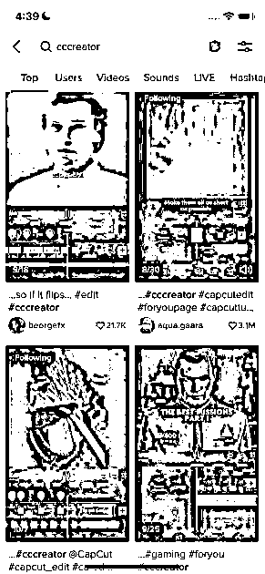

图5-2

# **1.1.4 **通过**tiktok creator marketplace**（推荐电脑端操作）（使用tiktok creator marketplace的前提是，你需要有公司的营业执照，再来注册，然后提交营业执照过程可能会失败很多次，别管，一直提交，几个回合下来就能成功了）Tiktok creator marketplace的确实很方便，但是有很大一部分很优秀的koc达人没有入驻，而且搜索出来结果有时候也不够多，主要还是以tiktok寻找为主。

当然，如果要找大型KOL，预算也充足，这里是一个很好的选择。

 

 

图6-1

**①**搜索

推荐使用竞品关键词（图**7-1**），看到竞品连带app的点进去，能够很直观的看到相关的合作达人

 

 

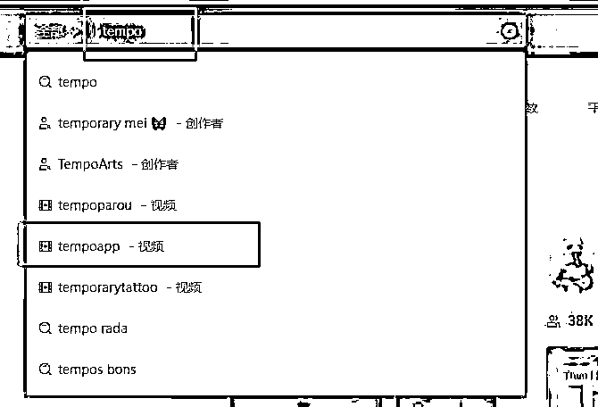

图7-1

搜索出来如下（图7-2）所示，价格、达人作者、数据都有，很舒服

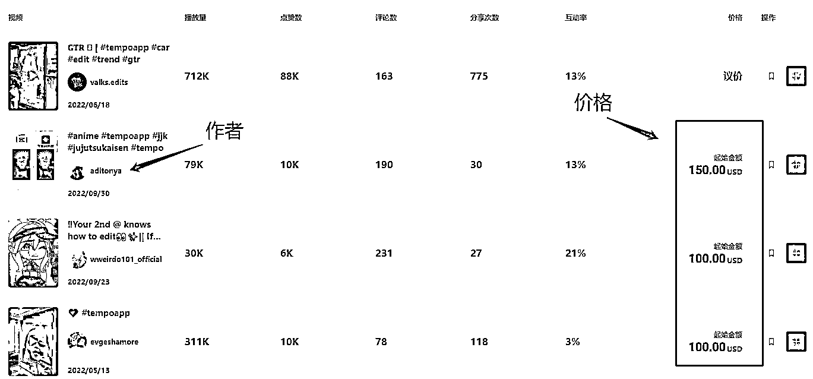

图7-2

 

 

点进达人的主页，主要来看粉丝画像，性别，年龄，和国家，如果这三个指标不符合你的利基市场，那么就不用花时间去谈判了。

一般来说，欧美的变现能力强，巴西菲律宾土耳其等变现都不怎么好。

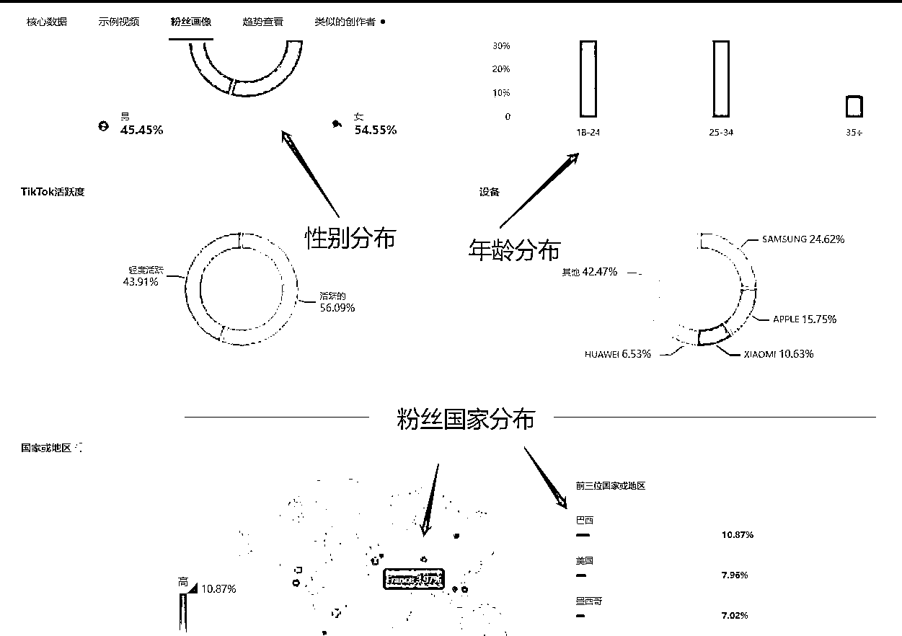

图7-3

**②**筛选器

如下图，一般来说筛选的话，是搭配搜索的，

筛选  粉丝国家**+**平均播放量，

 

 

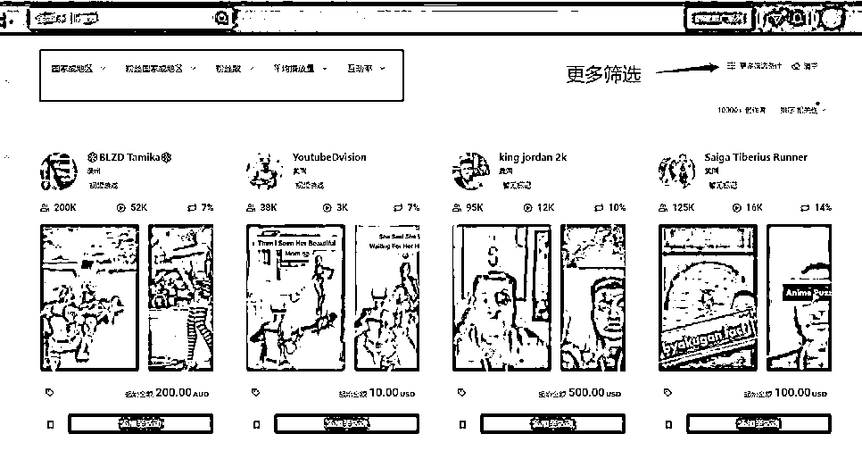

图8-1

点击更多筛选条件，

能够选择达人主题，也就是领域，

Emmm 其实没有那么垂直，有时候达人的分类还会搞错，所以这个主题筛选大家可以试试，说不定随着时间推移会更加优化，

但是受众的年龄性别可以在这里筛选。

 

 

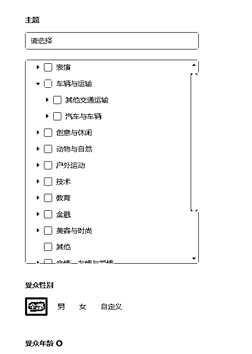

图8-2

 

 

# **1.2 **怎么筛选达人

**1.2.1 **作品是否垂直

**H5**

判断是否垂直的方式很简单，几个作品看下来就很清楚了，

排版清晰，主题一致，这类型就是很典型的垂直账号。

 

 

 

 

图9-1

**1.2.2 **作品发布的时间间隔和流量

**H5**

是两天更新一次还是一周更新一次，最近一个月是否有更新，

假设达人最近一个月没有更新，这种情况下进行合作会有一定的风险。

然后最近流量不行的话，也暂时先别合作，可以先观望一下。

 

 

**1.2.3 **通过作品看达人的利基市场是否符合产品

**H5**

**①**看文案的语言

如果文案或主页BIO是英语或者无法判断（图10-1），那么再看下评论区（图10-2），如果某种小语种在评论区经常出现，并且其他视频也是同种情况。

那么他的利基市场大概率是这个语种的人。

如果不知道是什么语言，直接复制到谷歌翻译里面自动检测一下（图10-3），葡萄牙语，那基本就是巴西、葡萄牙了。

 

 

 

 

图10-1

 

 

图10-2

 

 

 

 

 

 

图10-3

**②**看作品的风格

这点的话，其实还是也是比较直观，不同文化喜欢的歌曲和视频呈现方式都不一样，阿三有阿三的风格，欧美有欧美喜欢的格调。

如果没怎么接触过，推荐大家多刷点，其实一下就能感觉出来了。

**③**最终还是要再确认一下

前面两点主要用来初步筛选，避免浪费精力，最后还是推荐去tiktok creator marketplace搜看看，如果搜不到。

那么在聊合作的过程中，问他要Anlysis of followers regoins Or Video views by region 的截图，一般达人都会给你。

 

 

# **# ****2.**怎么联系达人

一般来说在tiktok上面直接私信是行不通的。

# **2.1 insta**

从主页这两个地方（图11-1），可以看到有一个标志是insta的图标，一个是bio上的其他链接。

点击Insta的标志，就能跳转到（图11-2），点击message就能够交流。

点击其他链接，能跳转到第三方网站，一般这里会有达人的其他平台的信息（图11-3），可以看到这边也有Insta，有时候其他达人也会出现discord的群组邀请，这里也能交流，但是用的相对较少。

 

 

 

 

图11-1

 

 

 

 

图11-2

 

 

 

 

图11-3

Insta的特点：

回复快，但是有时候消息很容易被冲走，特别是如果用电脑端登录Insta，有时候别人发消息过来你是看不到的，手机端就不会有这个问题。

# **2.2 **邮箱

邮箱一般如果有，在主页**bio**上面就有显示（图12-1），如果没有的话，也可以点击bio上面的链接进去看看。

当然，如果有**youtube**的路径（图12-1），点击youtube的图标，进入达人的youtube主页（图12-2）。

 

 

好，我们在about里面没有看到他的邮箱（12-3），但是我们能看到他有一个其他账号，那么我们就去搜索一下，你会发现其他账号里面就写着专门用来谈判ads的邮箱还有Insta（图12-4），而这个insta的信息，在达人的tiktok主页上面是没有显示的。

逻辑是不是比较清晰，假设这个达人在tiktok上没有任何联系方式，但是有其他社交媒体，可以根据其他的社媒再去深挖。

 

 

 

 

图12-1

 

 

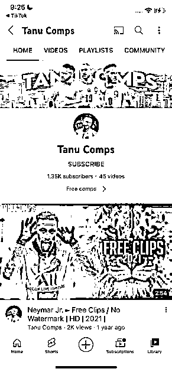

 

 

图12-2

 

 

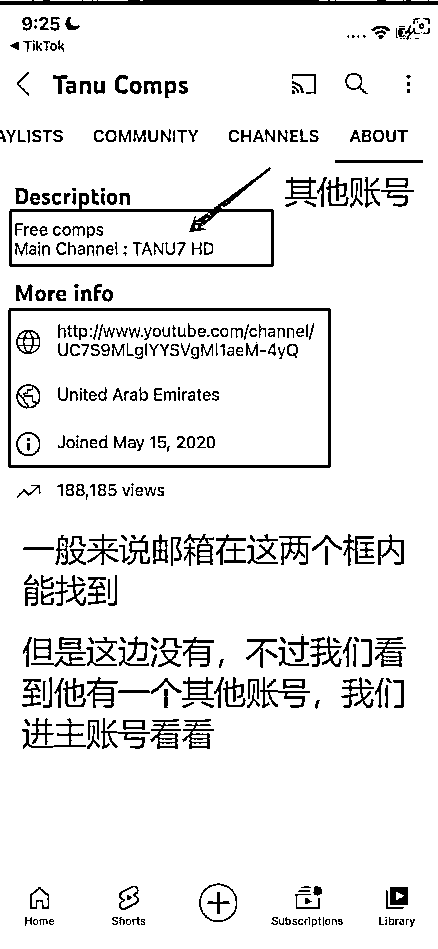

 

 

图12-3

 

 

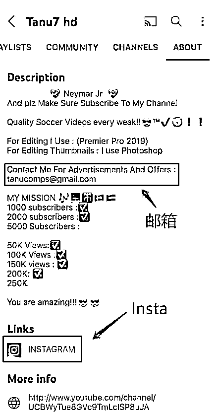

 

 

图12-4

邮箱一般会在什么情况下使用：Insta没有回复，或者达人有团队的时候。

邮箱的特点：回复概率高，但是回复速度相对较慢。

# **2.3 **用星图和对方联系

点击添加活动能够创建tiktok上面的广告邀请，

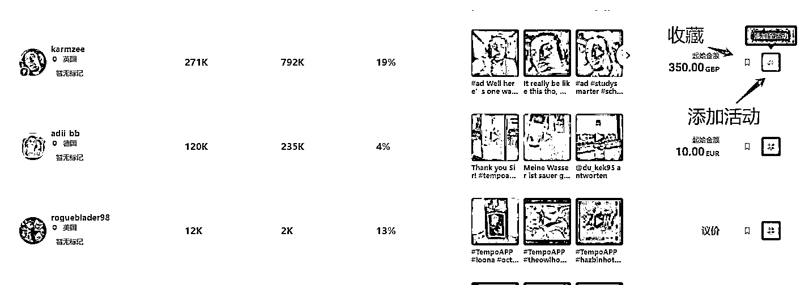

 

 

在详情页面端也可以点击

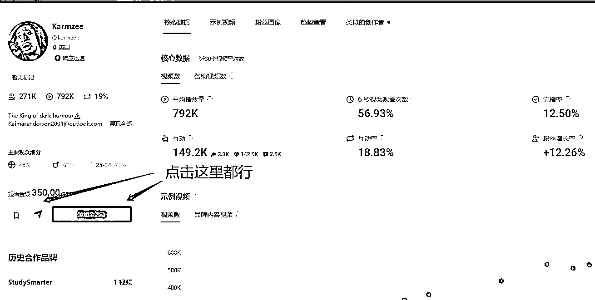

点击之后会显示这个，点击创建推广系列。

（这边显示不符合在线支付条件，一般来说，支付需要自己私下完成，paypal或者payoneer都可以）

 

 

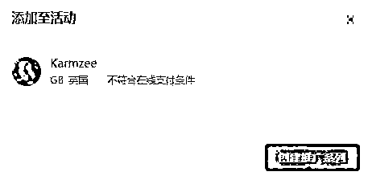

点击之后会出现这个界面，知名度、考虑因素、转化，里面随便选一个。

 

 

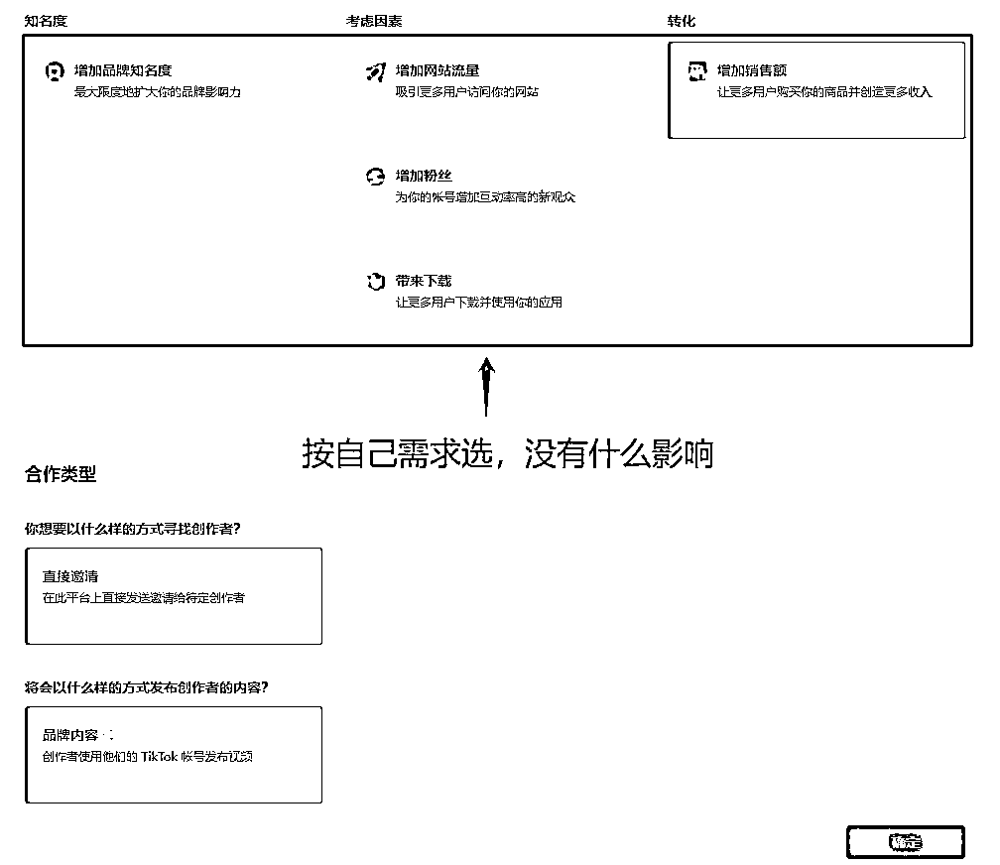

点击之后会进入填品牌、联系方式和要求的界面，也可以在这边添加其他达人。

 

 

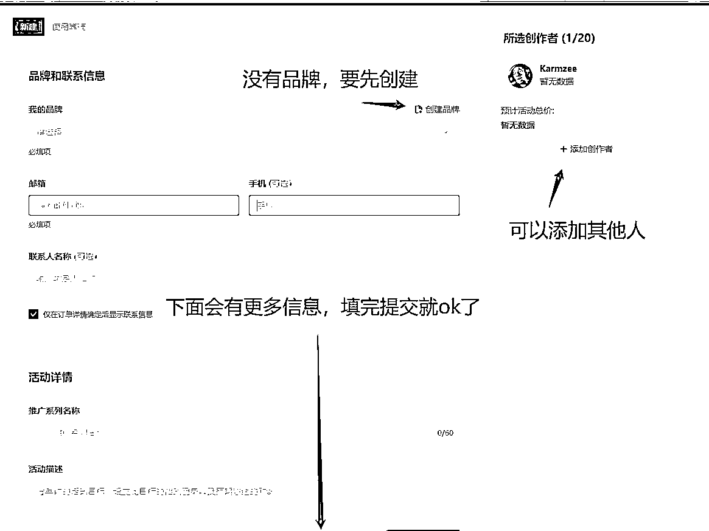

星图creator market place：很多达人没入驻，其次是发布任务达人回复的速度也相对慢点，但是千万级kol我们没有合作过，所以这里只针对大部分腰部kol和koc。

# **2.4 **评论区留言

评论区留言，这属于达人啥玩意都没给，你又觉得他很优质，就去评论区直接留言，请求合作。

一般评论选择最新的视频，越新被回复的概率越大。

 

 

这种情况经常会出现在，一个达人粉丝少，但是刚发视频能就爆几百万播放的情况下。

（这里需要注意甄别，达人是属于优质刚起步的达人，还是纯凭运气起来的，只有一两个视频甄别不了，3-5个视频看下来就差不多了，如果平均播放都还挺高，那直接冲，大概率能拿到很友好的价格）

 

 

 

 

# **2.5 **联系达人的话术

一般开头这句话就够了：

Hi, here is xxx, we wanna collab with you, and we will pay for it, will you be able to collab with us, please let me know if you are interested.XXX里面放你的品牌名。

记得用有背书的账号发送这条消息，至少账号界面和名字要弄的专业些，比如账号内容放一些品牌的内容，或者账号的名字改成 xxx_collab 或者 xxx_business。

后续的话术没有固定，达人感兴趣后就能抛出合作要求和价格了。

# **# ****3.**如何和达人建立合作关系（定价方式）

 

 

# **3.1 **一次性付清

比如我们把合作要求说明之后，达人就开始制作视频，然后视频我们确认后，再进行付款，最后达人发布tiktok。

使用场景：（一次性付清，一般是会使用在流量比较稳定的达人身上，比如说最近4个视频，浏览量都在20w-100w这个区间波动，这种情况可以考虑）

大概的定价参考，150w以下的真人出镜的达人（垂直美国也是）200usd基本都能搞定，50w以下的达人目标定在50usd拿下。

（情况非常多变，而且不同领域的达人价格可能不一样，这边的定价策略只是大概，大家还是需要多去和达人沟通交流）

# **3.2 **部分定金加上点赞奖励

定价也是视频确认后就转帐，点赞奖励一般是7天后结算。

使用场景：流量不稳定的达人，或者确认说长期合作的达人（一个月出几个视频，每条视频都有点赞奖励）

 

 

定价参考：

保底定价xx，加上点赞

1k likes = $10

5k likes = $20

10k likes = $40

50k likes = $60

100k likes = $100

200k likes = $120

300k likes = $140

400k likes = $160

# **3.3 **定金和下载量奖励（很可惜这种我们没有尝试）

# 三、没尝试过的玩法

 

 

# **# ****1.tiktok**广告投放

Tiktok的广告投放也是一种玩法，一般达人视频爆火后，就是说明这个视频很适合投放达人的利基市场，可以用这个视频去投信息流广告。

没尝试的原因：付费和订阅都没做好。

那么这种情况去投信息流广告其实就是烧钱，性价比也不如红人营销高，后续付费订阅做好了，发现我们产品力其实也不够强，用户的需求完全可以通过竞品app得到很好的满足。

# **# ****2.tiktok**直播

tiktok直播相对短视频来说，转化率会更高，但是目前娱乐直播还是占更多，电商直播目前还是一个蓄势待发的状态。

 

 

没尝试的原因：我们的产品属性不是一个很好直播的点。

原因有以下：

第一，操作难度较高，要做教学困难。

第二，英语好的主播不会操作app，会操作app的不会英语。

目前直播还是比较适合能够直观展示的产品，其次对于app类的直播来说，让达人自发批量去直播会更好一点，背后还需要有一个利益闭环（多少直播下载多少提成等）。

# 四、常见问题和踩坑经验

# **# ****1.**常见问题

 

 

# **1.1 **问：给很多达人发消息没回怎么办？

答：没关系，一般回复率有30%就算不错了，如果这个达人你真的很想联系，推荐insta和邮箱同步发送邀请信息，如果再没有就再试试，tiktok评论区、甚至insta和、acebook的评论区、discord，把能用的方法都用上。

# **1.2 **问：应该发什么样的视频？

答：很取决于你的产品，也要结合最近的热度去推，推荐使用热门歌曲然后和产品内容相结合，也可以加上对比的形式（比较容易火）。

# **1.3 **问：流量如果不稳定怎么办？

 

 

答：目前tiktok的红人营销确实是流量爆了只能维持一段时间，但是如果能找到爆火的视频格式，批量去发能维持2周-3周的热度。在视频上如果想要持久的流量，推荐去和youtube的博主合作，联系方式上面有提到，在about里面一般会放邮箱。

# **1.4 **问：通过什么平台付款给达人？

答：我们使用的Paypal比较多。

主要有以下考虑，

第一，paypal注册简单；

第二，受众面广，基本大多数国家都能用；

第三，转账也不繁琐。但是paypal到账时间会比较久，需要48小时后去记录里面确认账单，达人才能收到款（当然大多数时候就让他on hold）。

如果paypal不能用，一般会用payoneer作为替代，让达人注册个payoneer，然后账户之间的转账就好了，不要使用payoneer向对方银行转账，手续信息要填一大堆。

 

 

# **# ****2.**踩坑经验

# **2.1 **产品问题

我们的当天留存率相比同类app低，做收费之后，发现转化只有百分之一，甚至有时候都不到。

总结下来就是，产品没有满足用户的需求，用户体验也没有做上去，所以产品还是要足够硬，最好做个mvp去tiktok先测一下。

# **2.2 **人群问题

之前有推过流量很好的博主，但是对方受众群体判断失误，虽然画像是欧美，但是用户的消费能力太弱，也导致做了很多无用功。

 

 

在tiktok creator marketplace上，年龄显示只有18以上，也就是说18以下的都归类到18以上了，大家判断年龄的时候，最好也去评论区看一下，高赞评论的用户头像点进去看看。

# 五、过程中的一些经验分享

1.通过关键词和自身需求挖掘痛点，利用好第三方工具。

2.验证需求注意四点：用户画像、使用场景、行业竞品、确保产品能够解决需求。

3.寻找达人tiktok上除了搜索，利用好达人的关注和类似账号，再关注#标签。

4.Tiktok creator marketplace用来分析达人数据很好用，但是达人收录不完全。

5.联系达人常见方法是Insta或邮箱，其次是星图和评论区留言，最后是私信。

6.和达人建立合作，大流量的用一次性付清，小流量的用定金+点赞奖励。

 

 

7.流量不高不代表效果不好，要看利基市场。

8.达人粉丝国家垂直度70%以上，能够帮助你在这个国家的推广出大力，不要吝啬，平时多聊天，搞好关系。

9.不要只关注tiktok的爆发流量，Youtube的效果会更持久。

10.之前在一个百万级tiktok达人的discord做过营销，引流效果出乎意料的好希望这篇文章能够帮到大家。

评论区：

亦仁 : 感谢分享，已加精华。

董见一 : 感谢生财🙏

飞扬 : 学习了，感谢大佬

Christina刘* : 大概的定价参考，150w以下的真人出镜的达人（垂直美国也是）200usd基本都能搞定，50w以下的达人目标定在50usd拿下。  你好，请问这里你是指的你的app推广时所付费的标准吗？

董见一 : 很接近，这边是指理想的定价，不是标准，实际情况要看和达人怎么谈判了，也要参考什么领域的达人，以及达人近期视频的曝光数据

# **# ****(58**赞**)**我是如何在** TikTok **小航海的** 30 **天里，

# 成功变现** 3000 **美元的？

作者：  洋葱onion

日期：2021-04-11

 

 

TikTok

我是如何在TikTok小航海的30天里，成功变现3000美元的？

大家好，我是洋葱onion，1月21日参加生财有术组织的TikTok小航海，截止到2月27日靠岸，带货1752美元（图一和图二），fund1467美元（图三），小航海期间营销额第三。

这次来复盘下我的过程和思考。

为了追求更好的视觉阅读体验，请移步石墨文档！

选品

这次航行要求是带货1000美元，所以需要选择具有带货属性的品类。

船长提供了面膜、去黑头、采耳、修脚、多功能插座几个精细化品类，拿到这些品类时，并没有直接下手去做视频，而是做了调查。

首先要有实际需求，或者解决了用户的问题；

其次价格要在易产生冲动型消费的范围内，最好不要超过30美元（30美元的界限来自于以前做FB广告时的的数据，处于界限内的产品转化率会更高一些）；

最后是视频爆点是否能够轻松找到。

面膜

在TikTok上面膜这个产品的相关视频，都有着非常夸张的表现，有点类似于国内广告中的那种一刀999。

一抹变白、一抹祛痘。对于痘痘多的人或者皮肤不怎么好的人很容易就被吸引进去，并产生强烈的购买欲望。毕竟老外也是非常爱美的。

用户有意向后，再来看看价格，是否让用户有进一步的购买意向。

19.98一瓶（图四），价格也比较亲民，在易产生冲动型消费的范围内。

视频爆点是否能够轻松找到，对于我这样一个直板的人来说，大概率是没办法了，所以仅这条就让我把面膜排除在外。

这里不得不佩服小航海的船友@Yuan，能够不断挖掘出面膜的爆点，单日带货1000+美元。（这个产品也是小航海带货最多的品）。

 

 

采耳

再来看看采耳，它带货的是可视化挖耳勺，这个产品有幸在国外众筹网站看到过，当时已经收集了500w美元的众筹金，证明这个品是有相当的需求的。

可惜的是网站找不到了，没法给各位再具体看看这个众筹网站。

然后我又去了google trends（谷歌趋势  图五）上查看这款产品的需求趋势，如下图。

（谷歌趋势会记录产品相关关键词在谷歌搜索中的热度，以图标形式呈现出来，图表中数字越高，代表热度越大）

这个图是我现找的，和当时的数据有些出入。

当时这个关键词是处于一个非常高的位置，和顶峰值仅仅相差了20点左右，进一步从侧面证实了众筹网站的热度。

接下来是产品价格——25.41美元（图六），在范围内。

再去TikTok上查看相关的视频，分析他们是如何制作的。结果找到的视频全部都是在挖耳屎，文案都没写。

也没有更深一步的操作。

这不就是TikTok在向我招手，说快来么！那自然是选择采耳号。

Ps：为了更快获得正反馈，甚至上岸，需将新注册好的账号设置为企业号，并放上选好品类的相关产品链接。

内容

1.视频新奇特。采耳号本身属于一种解压类型的账号，非常容易吸引人来观看，甚至有些观众会感觉身临其境。

但缺点也很明显，通常不会有内容脱颖而出，这时候我们需要插入一些新颖的东西，来引爆视频。比如这个视频，耳朵里进入了一个饰品（图七）。

用户看到后的反应通常有两种，一是再看一遍，弄清楚这是什么，二是找评论，看有没有人告诉他这是什么。

无论是哪种行为，都将拉高完播率，让视频更容易受到系统推荐。

 

 

2.评论区运营，我会在这里用小号诱导他们，（图八）

man had the infinity stone in his ear （这个男人的耳朵里有颗无限宝石）

再用大号回复：

This is a space stone, It traveled through space and came to his ears. （这是空间宝石，它通过空间穿梭来到了他的耳朵）

各位可以想象下自己在抖音上看到段子时的感受。

老外的想象力其实特别丰富，越是一些没有边际的东西，他们越觉得这是正常的现象，然后就会在地下疯狂评论，说出自己的看法。

3.文案刻意误导。比如：

The boy took the earwax out of his nose！

（这个男孩从他的鼻子里掏出了耳屎！）

再配上适当的表情。这时候就会有很多细心的人来评论：

This is the ear, not the nose

（这是耳朵，不是鼻子）图九

到这里我就会说：

This is because the use of the ear scoop can clearly know that this is the ear （这是因为使用挖耳勺可以清楚地知道这是耳朵）

从而引导他们下单。

4.视频中添加导购语引导用户下单

一个好的导购语能增加200%的转化，上文中提到的无限宝石的视频，仅在封面添加了导购信息，结果初期小爆300万播放，没有带来任何转化。

我常用的文案有以下几种：

You can use an earwax camera to clean your ears 你可以使用耳屎相机清理你的耳屎

（告诉他耳屎相机是做什么用的）

For a better ear cleanse, click on my homepage. 想要更好的清洁耳屎，点击我的主页。

（这个是告诉用户在哪里可以获得同款挖耳勺，这个一定要写清楚，视频中没有，可以在评论中写到。

 

 

很多用户其实是非常想买的，但是不知道在哪里买，然后他在评论中写到在哪里可以买到这个产品，结果一群人在地下说你可以在亚马逊上找到这个产品）

再在显眼的位置添加购买折扣信息——50%off打五折

这个折扣信息也是有技巧的，一次偶然让我把50%优惠写成了30%优惠，结果那段时间出单率反而更高了。

原理大概是想要购买的用户看到7折优惠，心动想购买了，但点进去网站详情页，发现折扣是5折。用户会以为是你们网站设置出了纰漏，给自己捡了个大便宜！

音乐

初期作为企业号，尽可能的使用系统推荐的音乐，不然非常容易下架视频。但系统推荐的视频不容易让人上头，也不容易卡好节拍，需要耐心剪辑。

建议先刷一段时间视频，遇到爆款视频就把音乐打开，看能不能收藏，能收藏就代表能用。这样更加方便后期配乐。

为了解除手机黑屏，我在淘宝上购买了一批giffgaff卡（英国sim卡）和knowroaming卡（美国sim卡），也顺便用这些卡做了一批账号。

插卡的账号流量普遍位于东南亚，哪怕你用的是美国或者英国的节点，流量也绝对不会跑偏。

至于这个点有什么用，各位可以大胆猜测一下，我留个悬念。

在做账号的时候，最开始没有经验，每每看到一个新奇特的产品就想着去试试做视频，结果显而易见。

在这个过程中逐渐明白了用最少的时间做出最有效的事，才是我们优先考虑的。而作为优先出海的我们更应明白这个道理。

就拿选品来说，并不是看到一个新奇特的产品就要去冲它，花点时间调研下它的市场热度、实际需求、竞争程度，再花点时间研究它视频的爆点，不仅能够为我们节省一大笔时间，也能更快让我们达到那个目标。

当然，最为重要的还是心态。一个良好的心态会让你在面临账号低权重时、视频限流时、视频无爆点时——把以前全部推翻，重新来过。这份心态才是无可替代的财富。

 

 

最后感谢Sky船长、各位助教、小组长、和后勤的小伙伴，感谢各位船友，感谢生财有术。https://shimo.im/docs/8k9K9cYC9yvwK8gq/

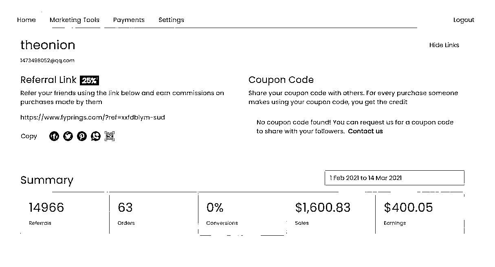 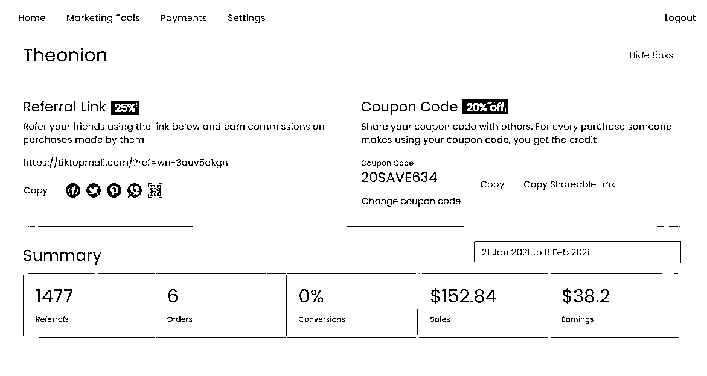

 

 

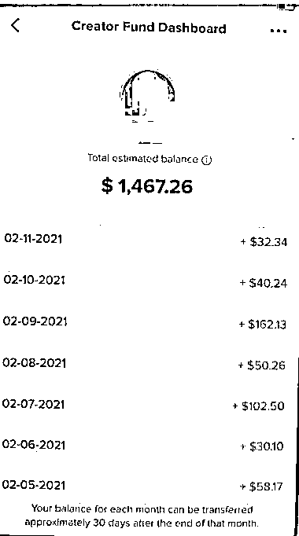

 

 

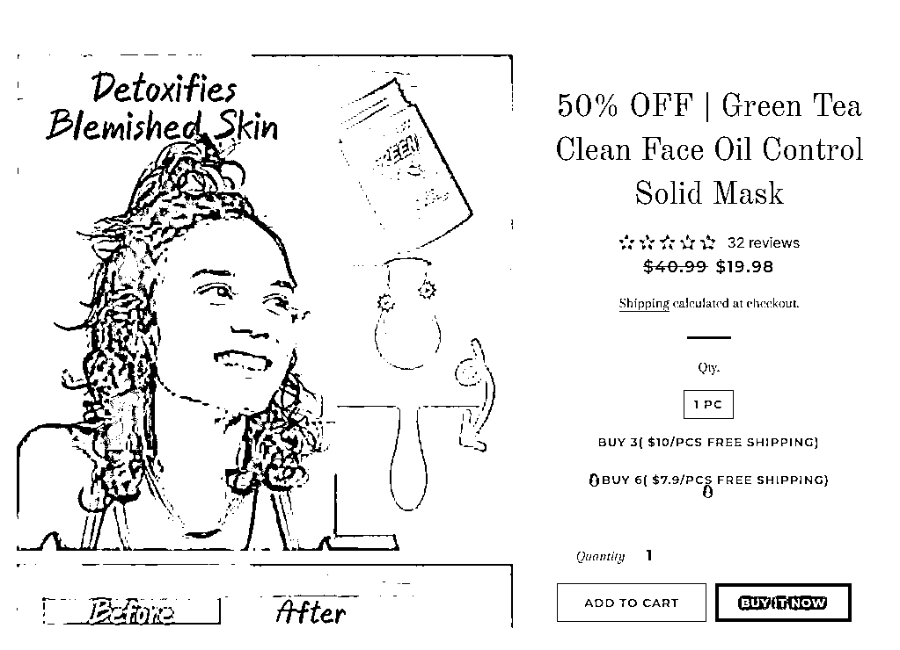 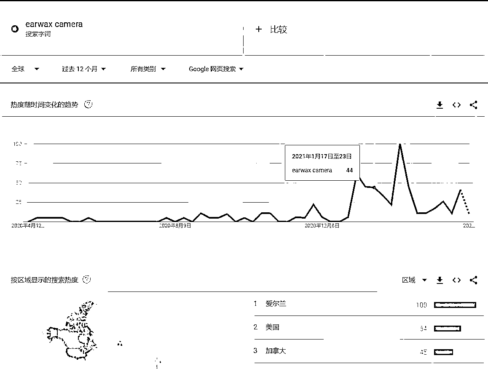

 

 

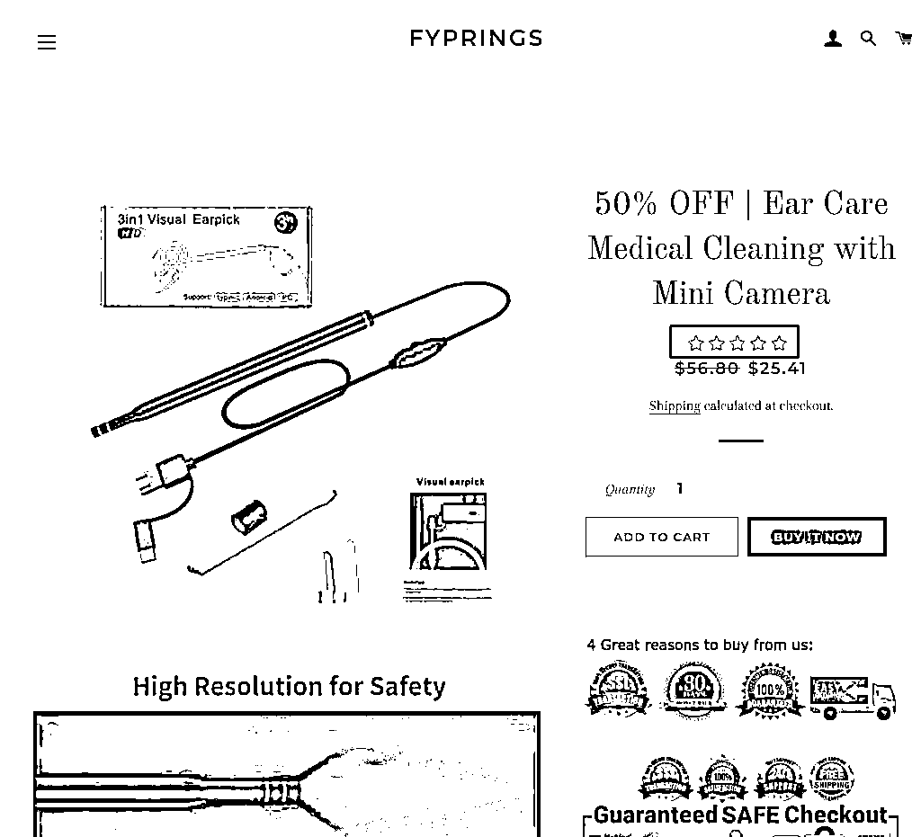

 

 

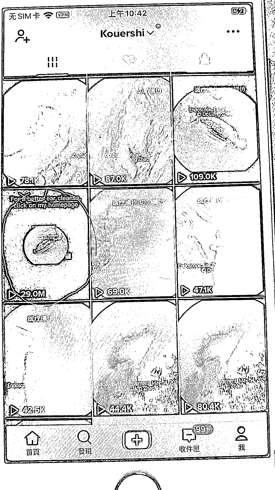

 

 

 

 

 

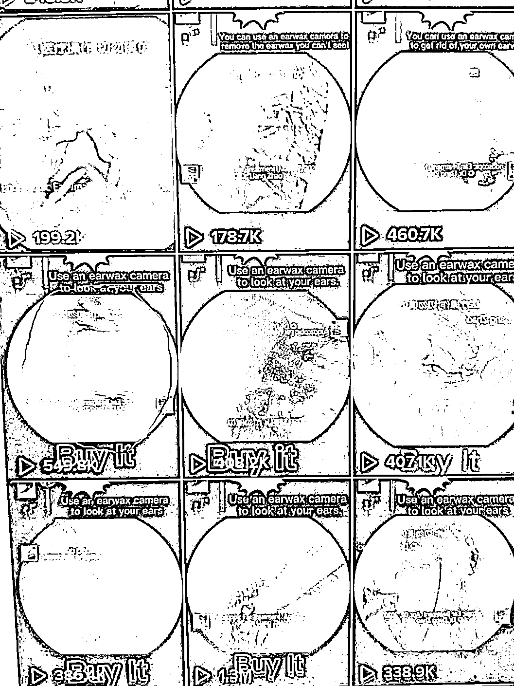

评论区：

 

 

shang.su : 您这边电商成交的是哪个国家？

洋葱onion : 我账号后台数据以美国为主，具体订单成交国家需要问sky船长，我也看不到

Sky老思 : 优秀的洋葱，继续冲[机智][机智][机智]

甜瓜 : 洋葱优秀

一峰 : 显示中国移动不会被封吗? 猜不到那个点有什么用

洋葱onion : TikTok检测的是sim卡的iccid，和显示信号没有关系。再者是国外卡在中国境内都只能显示中国移动或者联通！同理，中国卡在国外也不会显示中国移动！

shang.su : 做东南亚 COD？

小木槿 : 利用美国的节点，开通购物车（假如前期只有美国有购物车设置），也可以卖到东南亚？

# **# ****(53**赞**)TikTok**上卖**Excel**课的案例拆解

作者：  无题

日期：2021-12-20

【Tiktok上面卖知识付费产品的案例】

TikTok上卖Excel课，峰值收入10万美金一天，非常值得深入研究的案例。

哈喽，大家好，我是无题。

我把Tiktok目前已经有的知识付费案例都整理了一遍，发现越整理越多，越整理越梦幻……

温馨提示:

图片比较多，用电脑观看更佳，手机观看图片加载比较慢，请大家移步到石墨文档观看~

《TIKTOK上卖知识付费产品的案例》，可复制链接后用石墨文档 App 或小程序打开https://shimo.im/docs/qDTJ9dGG9tRpgX9H/评论区：

 

 

张静伟@生财有术 : 大概的转化数据有么？

子不语 : 还是魔术这种好，不需要语言翻译。

无题 : 大概的转化率，我找找看

丛政 : 真的用心了  支持！

地铁馒头 : 案例1是在tiktok引流吗

无题 : 是的

嘉应岛主 : 看上去很有意思，里面涉及的搬运后中文怎么转成英文，有软件帮助还是自己一比一做出视频自己说英文？

无题 : 现在有软件了，非常方便

# 【**Facebook**】**3**篇

# **# ****(110**赞**)**自媒体人通过** 40 **分钟视频课程卖出** **

# **170 **多万份

作者：  西昂

日期：2023-07-12

1：40分钟的视频课程，卖了大概170w

图1是作者，图2是销售的产品。作者用了14个月的时间从150粉丝涨到2.4万，然后就开始卖课啦~

卖出13426份，平均每份18美元，合计人民币170多万。

 

 

自媒体人出海，就在此刻。[嘿哈]

 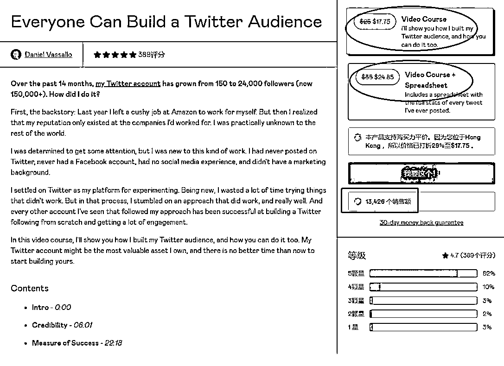

评论区：

亦仁 : 中标，术值+1。

 

 

在上方专栏点击 #中标，可查看所有中标风向标

卓凡 : 我的脸书账号总被封

# **# ****(**精华帖**)(112**赞**)**跨境私域电商的具体操作**-FB**

# 篇

作者： Markberg

日期：2023-07-04

分享个跨境电商的私域玩法，每单利润三位数以上，正常三四天左右可以出单。

移步飞书：跨境私域电商项目玩法

评论区：

北辰 : 大佬可以推荐一下靠谱的号商吗

Markberg : 可以

亦仁 : 感谢分享，已加精华。

北辰 : [呲牙]怎么加你好友

Gossip : 太赞啦

KK : 大佬，怎么链接你呢

追风少年何小新 : 求号商 a7979100

yoyo : 方便留下微信么，想要链接大佬

# **# ****(**精华帖**)(41**赞**)**如何薅**facebook**和**Google**羊毛

作者： TikTok Gia*

日期：2018-04-21

 

 

如何薅facebook和Google羊毛。

除了这篇文章里说的，再补充几个：

1、针对从facebook和Google的media buy，即买量用户弹广告，organic用户不弹广告。

防止审查人员主动搜索下载查到违规广告位。云端控制，前三天开比较缓和的广告位，越激进的广告位，比如充电锁屏，比如挂断位广告，出现得越晚（3-7天后）2、针对facebook过来的用户，优先出facebook audience network的广告。同理Google Adwords过来的用户优先出Google Admob的广告。后面填冲mopub，flurry等平台广告。

3、针对不同的场景，做不同的广告。比如差旅刚下飞机，解锁后出现Uber广告。进入酒店附近出现yelp广告、周围热门景点的广告。上面是分LBS。早中晚时间段也可以精细化运营广告位，而不是一股脑儿都抛给用户。

4、充电锁屏。2015年最猖獗，某数字公司，某动物公司，某＊娘公司，当年出海的产品加上该广告位后，每天多了几十万美金收入（保守）。我16年初去印度出差时，酒店前台小哥，插上USB充电，需要解锁4个App的充电锁屏，4次全屏广告展示。[流汗]中国人的小聪明真是无所不在。

17年Google开发者大会上，谷歌已经禁止非锁屏类APP出锁屏类广告。但魔高一尺道高一丈，还在博弈中。

5、未完待续……

我的微信号：tomxu123

 

 

 

 

 

 

 

 

 

评论区：

 

 

南方以南 : 厉害了Tom哥

TikTok Gia* : 来了个识货的，见笑了

土豆仔 : 我记得2年前有个创业项目就是  这类广告，  听了觉好厉害

TikTok Gia* : 百度还是360，都提供这个标准sdk接口了  南方以南 : 期待后续

Caoz : 这篇作者能不能搬我圈里

TikTok Gia* : 可以，曹老大。

TikTok Gia* : 我自己发吧

# 【**YouTube**】**2**篇

# **# ****(127**赞**)YouTube**名人名言**AI**制作保姆级教程

作者：  翔叔

日期：2023-07-19

《YouTube名人名言AI制作保姆级教程》

大家好，我是翔叔，一名产品狗，目前在二奢赛道搞电商

昨天看到一条风向标，竟然被加了精华，亦仁老板说是百万量级的生意，那果断搞一下  星球链接如下：

讲的是YouTube上有人专门制作名人名言视频，关注110万

实际操作了下，教程丢出来给需要的圈友，详情请移步飞书：

https://wx.zsxq.com/mweb/views/topicdetail/topicdetail.html?topic_id=811511842282282&group_id=1824528822&inviter_id=8424844282 https://yuanpinco.feishu.cn/docx/YMfEdDE6WoqVg3xJL4xcRLjYnge 

 

评论区：

德尔 : 很强👍

文少 : 这执行力太强了

影子 : 想问下2925无限邮是啥意思呢，指批量注册did账号用免费额度吗  翔叔 : 对的

青铜树 : 翔叔，可以链接你一下吗？

翔叔 : 可以的，v：xiangshu-pm

cc : 发现乔布斯的图片无法上传到d-id上，，

翔叔 : 我的可以诶

# **# ****(**精华帖**)(50**赞**)YouTube**生财之术（**20-100**）

作者：  亦仁

日期：2017-07-03

 

 

上次分享了10个YouTube生财之术（见图片），今天接着来。

 

**1. ** Youtube和各品牌高清icon聚合下载平台

示例网站  ，月流量430万，70%流量来自于搜索引擎。该网站收集各大网站的icon，分类整理后结构化出图片大小、类别、风格、是否授权等，提供给需要使用Icon素材的人。变现方式为Adsense，按照1美元/1000次的估算，此网站月收入约为4300美元。

**2. ** Youtube movie trailers 聚合平台

纯电影预告片频道，流量巨大，大多数预告片都是CC(知识共享），无版权纠纷。  如果没有预告片，可以用海报生成小视频，能蹭到很多热点流量。

**3. ** Youtube 年度top视频生成工具或聚合频道

类似于Instagram上年度top9合成一张图片方便分享到社交网络上，类似Instagram工具，Youtube上面可能会也有机会。

**4. ** Youtube trueview海外广告代投放

国内品牌商出海需求，外贸产品Youtube推广。  精益的做法可以通过社交网络宣传或者付费推广接单，然后在fiverr上找到供应商。

**5. ** Youtube粉丝工具

粉丝维护工具、垃圾评论删除工具等

案例，提供的功能包括订阅解锁视频工具，粉丝邮件list收集，youtube着落页建设等，按月收费，从月19刀到月129刀不等；

**6. ** Youtube盈利交流社区

youtube主交流论坛，案例，  月46.8万访客。

**7. ** Youtube+CPS

垂直主题+clickbank or amazon or dropshipping，举一个大疆无人机的例子，因为大疆官方Youtube channel里很多是CC（creative comments)视频，  这些视频允许下载了再创作，  所以我们下载这些视频后重新上传，换缩略图、换标题，然后导购到官方购买链接，

 

 

**8. ** Youtube to gif

视频转换小工具，快手早期就是做gif转换的相关工具。参考案例，月流量540万。

**9. ** Youtube 一键分享分发平台

代发布平台，一键上传到多个视频平台去；

**10. ** Youtube搬砖工

你懂的，不多说，  国内转国外，国外转国内。

http://www.iconarchive.com/tag/youtube https://2016bestnine.com/ https://www.fiverr.com/search/gigs?utf8=%E2%9C%93&source=guest-homepage&locale=en&search_in=everywhere&query=youtube https://www.fanbridge.com/youtube/ http://yttalk.com/ https://www.youtube.com/channel/UCxGoEdLOze3W6E0TTftHBqg/videos?flow=grid&sort=p&view=0 https://makeagif.com/youtube-to-gif

 

 

 

 

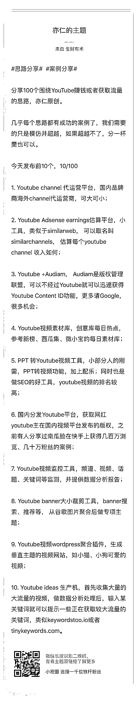

 

 

评论区：

高畅Ann : 有一种错觉，把youtube做明白就足够养活自己了。用了这么多年，居然不知道能赚钱。[流泪]

李春辉 : 时隔4年的回顾吗😊

跃超 : 第五年了，才看到这个文章

# 【选品方法**8**篇】

 

 

# **# ****(**精华帖**)(419**赞**)**跨境龙头创始人教会我价值

# 百万的选品方式

作者： seven

日期：2020-04-19

跨境龙头创始人教会我价值百万的选品方式

产品占7分，运营占3分，这是一篇关于产品为王的文章，核心内容用一句话说就是在细分领域里，竞争极小，需求极大，打磨产品做到单品占有率第一，那完全足以做到年利润百万了。

我之前在大公司是做产品经理，你知道的，大公司，一个萝卜一个坑，除了产品，我啥都不会，而且创业没有足够的资金，没钱投运营，也碾不过一般人的竞争，因此逼着自己只能打磨产品，并且把产品做到市场占有率第一，所以这篇文章，只有产品，没有运营和流量，毕竟我也不会。

19年1月4号，我和合伙人开始了我们的公司（55分成，我占百分之65决策权），一年时间，我和合伙人各自分红百万以上，所以实践了这个方法，真的不是标题党，这个方法给我的价值，远远远远大于100万。

我是14年2月进入跨境龙头企业某谷的，后来做到产品经理，这个公司，每个季度上调百分之30的销售目标（达不到提成会有折扣），加班非常严重（晚上9点后下班对于我来说是常态），收入对不起付出，我感觉是被极致的压榨，就像被榨干的甘蔗，还要被舔一口汁，大型的血汗工厂。

但有个非常大的重磅收获。某谷的老板大邹极少和我们小角色说话，有一次召集了亚马逊产品经理开会，上来就是一顿看不过眼，在座的都是垃圾（不是夸张，真实场景更人身攻击，粗口成章），然后说他重心是独立站，没时间管我们，但是今天，就教我们一个杀手锏的技能，价值百万，他说你们懂这个技能，不管今后在哪里，都足以在亚马逊有自己的天地。

事实确实如此，我纠结了很久，真的非常不舍得放出来，毕竟这是我用7年时间，加班加点经历过没日没夜的日子实践得出来的技能，有可能这个方法会流出去市面，我们都知道，一个好用的方法，无数人知道，这个方法就不好用了，并且，这不是一个有时效性的技能，类似捆绑踢人合并等过时的技能，而是当下最具杀伤力的利器，小白零起点用 

 

小成本就可以高概率轻松切入并获利百万以上的杀手锏技能，足以在亚马逊市场用3年5年甚至更久更久更久。

但为何我还是放出来了，主要有两方面最大的理念，当然，我知道最终看的人，也不会按照我想的那样去走，毕竟，每个人的理念不同。以下是我个人很想去实现的理念，想看选品技能的直接跳到底下的选品教程。

第一方面，我真心希望国内一些企业，可以善待求职者和雇员，而不是把他们当成工具人按在地板上摩擦摩擦。甚至明明盈利，借疫情之口行克扣之实，强制加班还疫情期间不给加班费，企业的目的确实是为了盈利，但嗜血的资本也别吃相太难看。

我真心希望，国内的企业，能在收入，可以达到发达国家的4分一甚至以上，工作时间可以达到发达国家的1.3倍，而不是1.5倍甚至是1.7倍工作时长，他们之所有有更少的工作时长，更高的收入，是因为他们的效率更高，大家都是做亚马逊，差距为何如此之大？

我们现在招了6位同事（我当大家是平级的同事，从未当成是员工），由于我自己长期的加班有点肩颈劳损，于是给每一位同事（4位应届生，2位有工作经验）都配了赫曼aeron人体力学椅，还有降噪bose耳机。上班时间为上午9点半，下午5点半，中午休息2个小时，配发午休床，1点半后强制午休。大小周，小周周六12：00下班，上下午各10分钟断网强制休息时间（学生时期都有课间，工作了反而3小时连坐，这本身就不合理，也不符合健康）。年度体检预算是1200每人的体检项目。

我们公司的盈利支出现在是百分之15大家分红，百分之15管理分红，百分之40-50留存公司发展（用于扩大生产，留存资金抵御风险），百分之20-30用于无息贷款去协助大家成长，实现自己心之所想，理念和需求，无息贷款最低5万，最高30万（随着公司发展后续或许会更高，当然是和公司能力相匹配，我们无法做超出能力范围的事情），还款是2年内不需要还款，2年后分10年慢慢还清）。这项无息贷款的政策，已经帮助了两位同事买房（一位在老家买的，一位是在广州买），如果不是疫情影响，今年应该可以再帮一到两位同事。

我能力真的有限，还有非常多非常多的地方还无法为同事做好，在这个大环境下很乏力，但我还是会尽自己最大努力去实现。这周也睡了两次办公室，爱人哭诉我就知道给钱，给合伙人钱，给钱给员工，给钱给供应链，给钱给物流，凌晨1点走去办公室的时候还觉得已经到大是大非走不下去的地步了，但现在和好了，但大家还是有个梗，只是现在避而不谈。而我知道，要实现心中的理念，必须进一步优化效率，盈利高了，自然很多东西就更容易实现下来。

 

 

第二个理念是，部分中国卖家，真心应该提高自己的出海技能，而不是整天觉得亚马逊很难做，非常难做，甚至是窝里反，内斗，丢差评，变狗，改listing主图等等等等。

在公司就职的职业生涯真的很累，凌晨起来搞跟卖狗，试过listing标题图片被改，试过被丢差评，试过被恶意投诉下架，这些我都深深地经历过，而这一切的背后的本质是什么，中国卖家自己窝里反，跟自己人内斗和竞争。

那么整天觉得亚马逊难做，甚至是窝里反的本质其实已经很明显了，那就是，中国卖家自己跟中国卖家竞争，而中国卖家本来就体量非常庞大且良莠不齐，所以难做甚至是恶性竞争就再正常不过了。文章写到这里，就来到了我们价值百万的选品技能了，我相信懂的人看到这里其实已经抓到本质了，吃透这个原理，带来的年盈利何止百万。总结一句话，那就是和本土卖家竞争，并且聚焦一个细分市场的单品，打磨产品，单品做到市场绝对的领先水平，从而做到单品市场占有率第一，而一个细分市场的单品市场占有率第一，就足以年利润50万甚至百万了。以下是具体可实操的教程。

价值百万的市场分析，流量分析，利润分析和选品教程

a. 市场分析

1\. 可塑性极强

2\. 本土卖家

3\. 竞争小，需求高

4\. 存在市场久（用keepa可以看到），意味我们也可以存在2-3年甚至更久  5\. 我们可以做到细分领域单品第一，单品领先市场，才能做到占有率第一。然后可以开发下去，把一个单品的潜力吃尽。

b. 流量及对手销量分析

1\. 用keepa

2\. 看排名

3\. 用软件 Helium 10看出单

4\. 加购物车看库存变化

c. 利润分析

1\. 我们有7成把握做到市场第一，用利润表格，预估出单量，那就知道一个单品的潜力了  2\. 亚马逊配送费，输入对手asin就可以知道配送费了

 

 

d. 具体可行的选品教程

1\. 锁定一个可塑性极强的单品，探寻细分领域

a. 记录提炼素材(热卖元素=需求)：心理需求，生理需求，衣食住行吃喝玩乐喜怒哀乐  （谷歌，关于衣着的关键字有哪些…）

1 材质/产品 2.对象 3.场景 4.功能等，探寻细分市场及产品设计创意  b. 用最大的词搜索（优先在亚马逊搜索），记录元素（不要先入为主，刻板印象，除非你实践），亚马逊长尾词（长尾推荐，软件）  关联推荐  自己列举关键字组合搜索…3\. 看产品不能只看表面，你必须要对客户的需求有极强的认知

只有你的单品好到处于市场绝对的领先地位，你才有可能做到市场占有率第一，甚至寻求价格上探的可能性（我们最好的单品就是做到了市场绝对的领先地位，并且对原来最好的对手价格更高）

亚马逊平台创业：当你知道自己可以持续输出高质量单品的时候。

其实我们能够更少时间相对更好福利的核心以及和别的公司差异化竞争的原理和机制在于：一套基于本土卖家的开发思维和模式，在一个客户需求大而供应少的市场，收集所有素材，融入素材，以一种本土化的设计和思维切入这个市场，从而做市场细分领域最好的单品，进而做到单品占有率市场第一，这就是本土思维，而跟本土卖家竞争，可以免去你很多烦恼（本土卖家数量少，素质高，质量高，质量高的意思是一个单品的利润很高，这也就是他们为何收入高，工作时长少，也是我们工作时长比一般公司少，而福利相对来说比较好，当然我们还处于初创型，很多东西还是达不到）

如果我们能对他们的需求如数家珍，我们就能融合需求元素，创造一个产品并完全贴合他们的需求，进而做到细分领域单品占有率第一。

看到这里如果看不明白的话，那应该是行业不同导致的，但思维原理我觉得还是相通的，应该有一点点的帮助，那为了照顾行业外的，打破这个行业壁垒，我拿一个具体的产品来举例，注意，我只是拿一个产品举例，并非这个产品一定可行，但是你要get到本土卖家的单品利润，真的竞争小到你无法想象，利润高到你无法想象，年利润200-500万以上的比比皆是，数不胜数。

狗碗，dog bowl, 一搜索，需求巨大，然后我们怎么操作呢。

逮住10美金需求最大的单品，发4000个库存到亚马逊，然后刷单，刷好评，广告站外等全部开起来，把市场的对手变狗，改他们的图片标题，给他们丢差评。

不不不，这是中国卖家的做法，咱不能这样，而且你小白资金又少的情况下更不能这样 

 

做，就算做了，很累，而且成功概率不高啊。

咱都知道，产品占7分，运营占3分，例如狗碗，普通几美金，但是细分领域功能强大的可以去到30美金左右，这个细分市场可以通过组合搜索，长尾等方式挖掘到，于是我们锁定一个细分市场的单品，

带升降功能的狗碗，其实只有寥寥几家在卖而且都是本土卖家，然后用工具得知，这个产品一天的量可以去到80以上，单品利润改进了组合款降低了配送的情况可以去到50以上，那么一天利润去到4000，年利润百万以上。

然后咱就做升降狗碗了吗？不不不，如果你是大资金，懂营运，会流量，那当然你可以做升降就可以年利润50万以上，但我们说了，即时你啥都不会，就只会产品，你也能在本土卖家中脱颖而出，那为了和本土卖家竞争，并且你要做到升降细分市场的单品第一，仅仅是升降功能是远远不够的，必须要把单品打磨到市场绝对的领先地位，  我们会调研狗碗最大的需求有5个功能（防过快进食，升降等5个最大的需求点），调研的方法就是亚马逊，谷歌，独立站等，最大基于亚马逊，把所有有价值的评价提炼出来，这样可以改进产品缺陷，同时又可以将几个需求最大的功能糅合到一个产品中（例如又可以升降同时可以放过快进食又可以同时满足5大需求），那样几个功能都是贴合最大需求的，做货出来就是前所未有的产品，  积累元素，  糅合一起，那客户从前要买到他最大的需求的5个功能的产品，他要付出80美金以上的价格，而我们打磨出来的产品，只需要30美金，那么这时候，你不需要任何的推广运营技巧，只需要一天5美金内的广告预算，让客户看到你，就足以让他们尖叫并选择你的产品了，并且你的产品价格可以上探，毕竟整个市场，能符合客户最大需求的单品，就只有你。

记住，你要做的是细分市场（也就是长尾市场）的占用率第一，你要做的是和本土卖家竞争，这就是本土思维（为什么本土人总能创造出只有他一家卖的单品，因为他对本土需求熟悉，而我们通过调研，去深刻认知本土需求，做只有你有的单品）本土卖家从来不考虑价格战，记住，要培养自己本土思维，价格战，恶性竞争是中国卖家才做的事情。

我已经说的不能再多了，不管是最核心的思维还是最小白的实操，我都把自己仅有的家底都掏出来了，我其实也很怕，庞大的中国卖家群体全部这样做，让我们本来可以轻轻松松赚钱的路子变得异常难走，但其实我更希望大家可以像华为抖音等中国出海企业那样，去和本土卖家竞争，别再做低附加值甚至恶性竞争了，把利润提上去后，可以善待雇员。一个国家要迈入发达国家，例如日本韩国（韩国当初比某鲜还穷）等，早期可以low起家，但是后期，必须得有可以和本土卖家匹敌的产品和技术，衷心希望这个行业， 

 

别这么搞到这个行业这么low并且水深火热，去打磨产品和技术吧。如果看完还是有疑问，我很愿意为大家去解答。

最后，对于同事关于我自己的理念，就是努力让她们在广州市区就近买个小两居老破小（小两居也够一个老人家带小孩了，挤挤嘛），解决最大的通勤问题，因为人一天清醒的时间减去上班睡觉也就3-4个小时，通勤已占用就全没了，而如果自己又保持技能的提升（例如工作是富有成长性的，而非机械性重复性工具性，因为我什么都愿意教，只要个人是上进的，那么工作所带来的成长，你在这个领域的年资就可以引导自己收入提升），而同时业余的学习又是进一步提升价值的，那么未来的收入，叠加通货膨胀，现在买不了，以后也可以买的了（就是第二个小两居），而一切都觉得很难，那就是建立在收入不会涨，或者是对于未来收入涨的预期不高（觉得涨幅大的概率小）。最后，希望我身边的每个人保持学习，提升价值，从而提升收入。

https://sellercentral.amazon.com/fba/profitabilitycalculator/index https://www.amazon.com/gp/product/B00TV1A6IA

 

 

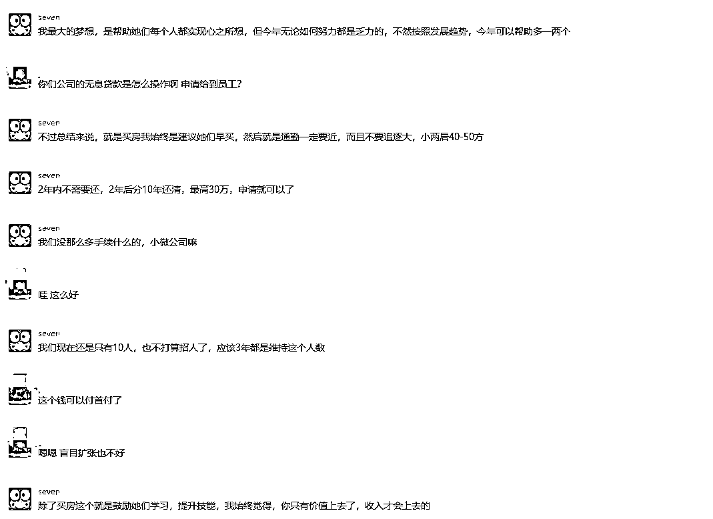 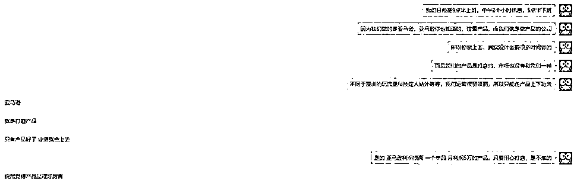

评论区：

果¥郡$王 : 好利害，牛人

王子健 : 优秀

概率 : 冲楼主的价值观关注了

捕风人 : 老板还招人吗[呲牙]

Eric : 大麦，某谷，每年能挣好多钱

allen : 向前辈学习[抱拳]

 

 

目录：

⒈** **疫情对跨境电商行业的冲击

⒉** **从困境中可以发现什么需求（哪些产品能解决痛点）

⒊** **发现需求**/**选好品后，如何开展对应的跨境独立站业务？

Ryan老陈 : 正能量老板，赞！

Jeremy : 小团队可以，要做大，还是得回到大品类，大单品。

# **# ****(**精华帖**)(139**赞**)**在疫情期间找准用户需求，

# 半年打造月销千万的品牌独立站

作者：  鱼丸|亦仁助理

日期：2022-03-30

疫情爆发，跨境物流费用暴涨，利润空间被疯狂蚕食，这是目前跨境卖家普遍遇到的问题。既然没办法节流，开源就十分重要了，如何找到疫情期间的产品需求呢？本期「生财合伙人」专栏，@图帕先生  就来和我们一起聊聊这个话题。

他曾任上市公司市场部组长，组员 6 人，一年把自然流量在每天 200K+ 独立访客的基础上提高了 20%。现任初创公司谷歌推广渠道负责人，20 人团队，高峰达上千万  GMV，擅长从 0-1 搭建稳定盈利的谷歌广告账号和打造垂直品牌独立站。

本篇内容，他也会详细讲讲，自己用谷歌趋势工具进行选品，利用广告有效起量，在半年时间重新打造了一个月销千万的品牌独立站的全过程。

 

 

⒋** **跨境营销主要方式有哪些？我是如何选准优质又稳定的流量入口？

⒌** **网站从** 0 **到一千万的发展

⒍** **如何打造品牌和树立权威，建立能长期发展和盈利的网站？

⒎** **总结

**—Part 1—**

疫情对跨境电商行业的冲击

刚好在疫情前，我从大厂跳到了一家初创企业，负责跨境电商谷歌渠道的流量布局和优化，看上的就是公司的分成比较优厚。在一个 8 人小团队里面，就做到了每月上百万美金的 GMV，一年内公司就组织了 1 次 10 天的欧洲游和 1 次 7 天的日本游。后面也见证着团队发展到 20 多人。

除了这些福利外，更重要的是老板是个长期主义者，并不打算做爆品打游击战那种，而是向品牌网点去发展。这点跟我的价值观是非常吻合的。

不知道是运气好还是运气不好，最后一次日本游刚回国不久，就爆发了 COVID-19 疫情。虽然能安全回国，但是后面等着我们的还有一道道关卡。其中最大的一道就是物流费用。

 

 

而我们也不得不面对这样的事实：受国内外疫情的影响，我们一单的跨境物流费用就要上百元，比疫情前足足多了 4-5 倍，几乎等同于货值了！

简单算一下，我们产品进货价约约 23 美金，售价约 100 美金，疫情前物流费用约 8 美金，我们大概有 70 美金的盈利空间。然后加上广告费，那时候一个 CPA 大概 40-50 美金，所以一单大概能赚个十来二十美金 —— 还不算人工、仓库之类杂七杂八的费用。

那么，疫情后，物流涨到约 20 美金 —— 几乎完全蚕食了我们剩余的利润空间。

在这种情况下，公司也只能靠吃老本维持 —— 这也是品牌做好的优势吧，遇到突发情况，不至于跌得太惨。咱们旧的站点在 instagram 有 80 多万粉丝、品牌词的搜索量也有  1 万多，所以还是能撑一段时间。

**—Part 2—**

从困境中可以发现什么需求？

（哪些产品能解决痛点）

老本迟早会吃完。这样下去不是办法。但有危就有机。

 

 

疫情刚开始的时候，我们国内曾经有一段疯抢口罩的时期，一种客单只有几毛钱、之前大家都几乎不屑一顾的产品，在这段时间竟然成为了热销品。

所以我们就在想：在这个时期是不是还有产品，能够满足在疫情期间人们突然爆发的需求呢？

如果我们能抓住机遇，说不定就能帮公司熬过这段困境，而且困难过后，我们的发展肯定也会更好（当然我们不会去做口罩，因为当时有太多的国内商家去贩卖没有资质的口罩，导致国外的广告平台都特别打击这种防疫产品，卖口罩的广告账号和网站见一个封一个）。

记得很早之前亦仁大大的文章就涉及到这么一个点：在谷歌搜索一个词，看看搜索相关的词里面，还能发现什么机会。比如在谷歌搜索 Instagram Download，就会出现  Instagram Download for PC 等相关搜索词，这些搜索词就更好反映了用户的需求。

 

 

那么我是做谷歌，不就正应该更好地利用谷歌这个工具吗？

我这时候我就动用到另一个谷歌的工具 —— 谷歌趋势 Google Trends：

https://trends.google.com/trends/

这个工具的使用方法也是非常简单：在这个工具输入关键词之后，它就会展示这个关键词在某一时间段的搜索趋势。如果某个词搜索的人多了，就证明它的需求量上升。

如果你完全没有头绪要看哪个词的搜索趋势，没关系，它里面也有一个搜索词的趋势变化追踪：

选择目标国家

选择时间段

选择目标领域

选择网络搜索

然后出来这样一个界面：

 

 

上面的趋势线代表该领域相关的整体需求变化，而重点就在右下角。

右下角就是具体的有搜索上升趋势的关键词，比如推出不久的 Steam deck 游戏机。而右边的百分比数值就是趋势的变化，意思是 Steam deck 游戏机的搜索趋势上涨了  2500%。

也是很简单吧？难点就在于自己要一个一个地再查下具体关键词的搜索趋势，来最终确定需要做什么产品，毕竟某些情况下，选择比努力更重要。

比如，疫情期间很多人都要在家隔离或者减少外出（Lockdown），那我就先从一些居家产品关键词入手 —— 就是说在这个工具里面，我会先选择 home&garden。

然后，我看到 beard trimmer 胡子修剪器（就是我们说的剃须刀）这个关键词的搜索趋势上升了，我就单独把这个关键词放到工具里具体看看它的需求趋势。

 

 

果然，自从全球范围内的美发店服务关闭后，各地对毛发修剪器的需求量大增 —— 因为大家不能出去理发，就干脆自己搞定。

还有 Chair Cushion（椅子靠枕）：

在家工作的政策直接影响到办公设备的需求增长，椅垫就是其中之一。

 

 

本人深有体会，在家办公的椅子有点硬，坐到屁股疼，我立马买了个垫子。

然后就我在 Fitness 健身领域，发现了 Resistant Bad（助力带）：

居家隔离大家都没有忘记健身。老外很多自小就养成了健身的习惯，甚至把车库改装成健身房，所以健身用品真的很火爆。

相关的关键词还有很多，这里就不一一细数。而老板和我都是长期主义者，所以除了产品的需求暴涨之外，我还需要考虑它能不能有长期的发展。

于是我就去搜索产品相关的行业报告，在谷歌搜索：「关键词」+「目标市场」+「Market Report」

拿剃须刀为例，我就找到一份美国市场的报告，里面说 2019-2025 年，这个产品还有  2.5% 的增长率（CARG 全称 Compound Annual Growth Rate，复合年增长率），就说明，这个产品不会是在需求爆发后就停滞不前的。

 

 

OK，在确定了有需求、而且能长期发展的产品后，后面就要找靠谱的供应商了。目标平台：1688。中国被称为世界工厂，我们的制造实力肯定是杠杠滴。

还是拿剃须刀为例，首先我们选综合服务高的供应商：

然后看买家评价，我会选择评价数量不是很多的。

 

 

可能很多人会有疑惑：为什么选评价少的？去某宝买东西我们不也应该选好评多的才靠谱吗？

我的考虑点是：多人买的产品，侧面反映了市场上也有很多人见过这个款式。而我们需要的就是我们品牌我们产品的一个独特性。所以我会选择评价不多，但是评价得分也不会很低的产品。

差异性对新的品牌来说很重要，人们习惯了使用某种产品，是基于它常见的类型、功能、风格，如果这个时候，你带着新的设计、升级的功能、甚至新的服务模式冲进他们的视线，这种新鲜感很容易让用户产生购买意向。当他们用过觉得好了，就会复购，还会自动帮我们种草，扩大影响力。

那遇到一个自己本来不太熟悉的产品，该怎样找出新的设计上、功能上的突破呢？

我有两个屡试不爽的方法：

第一，在亚马逊购物平台里面搜索，看看哪些款卖得好。

 

 

然后记录下它们的颜色、配件种类和数量、主打功能、用户评论（好评是因为什么而给好评，差评是因为哪些地方满足不了他们）等等。磨刀不误砍柴工，这些脏活累活做好了你就会很清晰地发现可以在哪些地方突围而出。

第二，看其他品牌网站的「帮助中心」，这里主要看看他们的「服务内容」。

 

 

比如上面是吉列的帮助中心，里面就列出了他们的运费、退换货条款、物流时效等等。

这样的观察就能知道这个品类里面，用户比较容易接受怎样的服务，再看看自己能不能把服务升级。

当然，光做这些文书工作也不行，还要自己买样品回来测试，检查产品功能和质量是否被供应商夸大了、包装的质量、英文说明书有没有 Chinglish（中式英语）、配件适合齐全等等。

如果产品合适，就要跟供应商沟通。

 

 

第一，看看他们接不接受贴牌和包装的定制，还有起订量。这是打造品牌特色里面必要的一步。

第二，看看他们回复及不及时，不然后面如果想长期合作，而沟通上又拖拖沓沓，很影响效率和销售效果（比如产品如果出问题了，需要供应商去跟进和查验）。

最后，就是物流了。一开始可以用一件代发的方式测试产品是否能得到用户认可。这种方式能节省前期的仓储费用，因为基本不用自己备货，可以使用比如 4px、dhl 等物流平台，把包裹寄到物流方的仓库，然后发到目标国家。但缺点也很明显，就是时效比较长。所以后面就需要布局海外仓了，时效可以缩短到 3 天内，让用户尽快能享受到产品带给他的便利。

**—Part 3—**

发现需求**/**选好品后

如何开展对应的跨境独立站业务？

好了，选好产品和分析过市场后，我们就要准备启动了。

首先我们要选一个销售平台。因为我们一直是做独立站的，对亚马逊的生态熟悉，所以还是先选择独立站。而小团队做独立站，最常见的建站方式就是使用 Wordpress 和  Shopify，而我择优选择了 Shopify。

 

 

因为 Shopify 的操作几乎是傻瓜式，能为我们节省很多时间。Wordpress 的话需要解决域名注册绑定、服务器搭建和维护等，需要的技术和人力成本会高点。而 Shopify 就几乎完美整合了电子商务所需要的功能，比如支付接口、弃购挽回等等，只需要服月费和给他的交易抽成。

Shopify 的插件功能也十分强大，像在线客服、邮件营销、用户评论管理、CRM 工具接入等都有对应的插件，使用十分方便。

平台就这么愉快地决定好了。接下来，就准备好人员配置。

我自己嘛，其实能够处理推广、运营、客服等，几乎是「万金油」，但考虑到效率，还是需要同事帮忙，甚至可能需要外包部分任务给国外的 freelancer（自由职业者）。

首先先确定自己的定位，我要负责整个新网站新项目，而且我在推广和营销方面经验比较多，所以主要负责推广和统筹策划。噢，还有一个：客服。

对，在前期，我会兼任客服的岗位，因为我想第一时间了解客户的疑问、需求和对产品的使用感受。

 

 

然后一个同事负责运营，一个同事负责采购 + 物流，后面还可以兼顾客服，一个同事负责社媒和 PR。

至于设计、文案的本地化优化等，我们就外包给老外去做，一个是为了提高效率，更重要的是他们对于外国人的审美更熟悉，文案撰写的优势就更不用说了。

这样，一个小而精的团结就准备好了。

**—Part 4—**

跨境营销主要方式有哪些？

我是如何选准优质又稳定的流量入口？

作为项目负责人，在推广策略方面我就要下更多功夫，做出最优判断，选择最适合自己产品的流量渠道。

在跨境电商独立站的营销渠道，主要有这几种：谷歌广告、Facebook 广告、联盟、SEO、网红社媒和邮件营销 (EDM)。

 

 

我们做出海营销的，肯定接触最多的是广告平台，也就是谷歌和 Facebook，而且新网站一开始几乎 99% 的人都会投广告，因为见效快（测试素材和产品的质量）、起量也快。

所以一开始，我也是优先选择投广告。

当然，不是说其他渠道都不去用，在后面我会展开讲讲。

那么我该用谷歌广告还是 Facebook 广告呢？我的经验告诉我：不同的产品在不同的广告平台会有不一样的效果。

首先，我要讲讲谷歌广告和** Facebook **广告的根本区别** —— **它们体现的用户需求不同。

⑴**. Facebook**：兴趣主导

 

 

我们在设置 Facebook 广告的时候，需要设置受众类型，有自定义受众、细分的兴趣受众等。

这个也是和谷歌广告的一大区别。

 

 

* 注意，本文只针对 Facebook 广告与谷歌搜索和购物广告的区别；谷歌有展示广告，也是根据用户兴趣设置，但转化远没 Facebook 好（也看产品），所以暂时不针对谷歌展示广告进行比较，我也不推荐不了解谷歌广告的朋友这么快接触展示广告）。

拿我自己做例子，我的 Facebook 小号加了好多关于脸书广告投放的群组，如图中下框的 Facebook Ad Hacks 这个群，所以 Facebook 就知道我是一个很喜欢 Facebook 广告的人，甚至是从业者（我在个人介绍也有填写）。

所以在我的信息里面，就会有上框的关于谷歌广告的服务广告出来！

 

 

但为什么我关注的 Facebook，出来的广告是谷歌的呢？  这就是兴趣主导！

 

 

我不一定使用谷歌广告，但广告主通过兴趣设置，覆盖了像我一样关注 marketing 和广告投放的人士，广告就在我这边展示了（尽管可能我没投谷歌广告的需求）。

⑵**. **谷歌：需求主导

谷歌广告也叫谷歌关键词广告，我们在设置谷歌广告的时候，会有设置关键词的部分（搜索广告直接设置关键词，购物广告的关键词设置在 feed 里面；展示广告也能设置关键词，但暂不讨论）。

同时，投谷歌广告的第一步，也是先收集关键词。

这代表什么？

就是用户一定要在谷歌搜索引擎进行搜索，才会触发我们的广告！

而用户为什么要搜索？就是因为他们有明确的需求。

 

 

比如搜女性包包，就会显示包包的购物广告。

我搜女性包包，可能我是一个对服饰感兴趣的人，但谷歌不会展示女性衣服或裤子的广告给我 —— 因为我没有进行相关搜索！

现在应该很清楚了吧，谷歌广告和 Facebook 广告的根本区别：

⑴**. Facebook **针对兴趣覆盖广告受众，就算用户没有相关购物欲望，也会展示（所以 FB 素材很重要，要马上激起用户的购买欲）。

⑵**. **谷歌主要针对关键词触发广告，用户有明确的需求搜索，才会展示（而谷歌则需要提高自己的专业性和特色，用户想买了，但为何要选你？）

这种不同，也进而体现了适用的产品类型不同。

 

 

⑴. 谷歌广告：适合利基、专业性强、有一定品牌知名度、用户需求的产品明显成效可能较好。因为广告出现时是顾客主动搜索，此时他们对搜寻的内容高度感兴趣、购买意愿较高。因为在顾客主动搜的时候，也是最有购买欲望的时刻。

⑵. Facebook 广告：适合新颖、时尚的产品，一个没人知道的全新产品类别，能以多媒体（图片或视频）展示产品特色，用户不经意间刷 Facebook 就能看到你的广告，他们可以点赞、评论，进而「不知不觉」地下单。

最后，根据我们选好的产品的属性，我优先选择谷歌广告！

因为像上文说的，我是从谷歌的搜索趋势选品，所以产品在「搜索」上有爆发性流量，选择以搜索为基础的谷歌广告是最好的。另外，我的产品有一定专业性，属于利基垂直品类，也符合谷歌广告上适用的产品类型。

**—Part 5—**

网站从** 0 **到一千万的发展

**1. **从** 0 **到** 1**：广告一开始的维护

所谓万事开头难。广告一开始的时期都是比较难过的，因为前期需要把较多的预算用在给广告平台的系统学习上。而且谷歌的见效时间相对 Facebook 会慢些，特别是比较大众的产品，需要测试的时间要更长。

 

 

Facebook 可能 1000 刀就能测出爆品，我们通常会开几个广告组，一天 20 刀地跑，哪个广告组不行就马上停。但谷歌不一样，比如购物广告，谷歌对新上传的产品 Feed 至少有一周的学习期，就是说这段时间内数据都会跑得很烂，量起不来，一天只消耗几刀，所以如果这时候你以为产品做不了，很快就停了广告，你是测不出任何有意义的结果的。

刚开始，我的广告账号一天 10 美金都跑不起来，一天预算是 40 美金，但后面，平均一天能有 2 单。周期大概就是一个月了，ROAS 也有 3.24。你也看到，趋势是慢慢上升的。

在谷歌广告里面，我们优先选择搜索广告和购物广告，因为当用户在谷歌搜索一个关键词，优先展示的就是搜索广告和购物广告，他们都会在自然搜索结果的上方，这样我们就很容易触及到有相关需求的用户，把他们引到我们的网站。而购物广告因为会有图片的展示，所以转化效果会更好。

 

 

因为谷歌广告是靠关键词去触发的，所以我前期需要花很多精力去做关键词调研。我习惯用的一个广告关键词调研工具叫「SEMRush」。这是一个付费工具，谷歌官方有个叫「关键词规划师」的免费工具，有需要的朋友可以去试试，只是我这边习惯了用付费工具，毕竟付费肯定有付费的优势。

在工具里面输入我们的目标关键词，比如 dog bed（狗狗的床）：

 

 

就会出现很多相关的关键词，给我去选择使用。另外还有预估的 CPA（广告每次点击费用），这样我就对需要的预算有个大概的想法了。

另外，还有个很强大很有用的工具：「竞争对手分析」。里面可以看到哪些网站在投你想用的关键词：

而且能够看到竞争对手正在投哪些关键词！这个功能对我的关键词调研效率有很大提高。

确定好关键词后，我就要好好优化广告内容了。

 

 

搜索广告的优化：

广告词：添加关键词和使用能吸引点击的词，比如除了 cheap、sale、low 之外，还能用  unbelievable, amazing、astonishing 等等更好更丰富的形容词。因为谷歌广告的质量得分  quality score，包括了着陆页体验 landing page exp、广告相关性 ad relevance 和预计点击率  exp. ctr。较高的分数不仅有助于降低 CPC，还可以帮你提高广告排名添加广告的附加信息

使用排除功能和添加否定关键字

出价使用最大点击（max clicks），让系统更快地学习

预算给足

调整不要太频繁，至少 7 天时间，不然会影响广告的学习。之前就试过因为太急了，一天内调整几次，让系统紊乱了，导致广告后面几天都跑不出数据，非常浪费时间，所以这点我们会特别留意

然后就是购物广告。

购物广告的学习周期比搜索广告要长，很多时候一开始投放，广告的展示会很低，甚至  0 展示，所以我会注意以下几点：

出价的 Roas 值不要设置得太高

预算给充足，一天 100 美金

产品 feed 的优化（feed 是用来记录网站产品资料的文档），之前做好的关键词调研，可以用在产品标题的优化上，在标题和描述里面添加最相关的关键词

同样地，不要太频繁调整广告

在投放的时候，我还会观察广告的 CPC（每次点击费用）、CTR（点击率）、ROAS（投产比）、展示份额、CPA（每次转化费用）等。

观察 CPC 能监控预算消耗的稳定性、CTR 能反应关键词和广告语的准确性、ROAS 直接反应广告支出带来的销售额，然后展示份额能反应我们的广告在市场上的位置。

 

 

比如现在我们的展示份额仅在 SHEIN（希音）和亚马逊下面，说明我们的展示份额已经比其他竞争对手高很多，在我们前面只有一些顶级头部卖家。

好了，在广告账号慢慢养成的同时，我们也开始去找国外的网红帮我们做一些产品测评，还有找国外的媒体网站去帮我们背书。

一般会把红人根据粉丝数目分为五大类：

入门级  ：5,000-15,000 粉丝

低级  ：20,000-50,000 粉丝

中级  ：60,000-150,000 粉丝

高级  ：200,000-500,000 粉丝

大咖  ：500,000-1,000,000+ 粉丝

粉丝太少，对品牌和产品的宣传力度就没那么大；粉丝太多，价格又太贵。所以我们先选中级和高级的红人。然后开发信方面，我们尽量对每个网红都是有自定义的内容，不会完全发一个相同的模板。这样会显得我们更加真诚，有合作的诚意。

在这么有计划地推广下，我们 3 个月就做到盈亏平衡了。

⒉** **从** 1 **到** 100**：** **广告如何有效起量？

 

 

接下来的重点就是，要怎么把我们的生意扩大一个等级的规模，以准备好迎接黑五旺季（类似于国内的双十一）。但谷歌广告本来就是起量慢的广告形式，应该怎么做才能最有效又快速的扩量呢？

这时候就需要用到营销漏斗的理论了。

用户对我们品牌和产品的认知到购买，大概分成这几个阶段：

发现我们品牌和产品的信息

考虑购买我们的产品

在网站上加入购物车

下单购买

重复购买

在不同的阶段，都有对应的广告形式去触达到最适合的受众。

 

 

像我前面说的，我首先是投放搜索广告和购物广告，就是在漏斗的中间三层。所以接下来我就要重点在漏斗顶部的阶段去触达用户，还有需要让已经购买过的客户再次考虑购买我们的产品。为什么之前我们不使用？

因为之前我们只想尽快做到能回本的状态，所以只针对加入购物车和下单购买两个阶段去布局推广策略和广告模式。那现在我们整个模式都通了，就可以更加深入和全面地布局我们的营销策略。

顶部首先涉及的是展示广告。展示广告是一种以图片为媒介的广告形式，非常接近  Facebook 广告的形式，我只需要设置受众的兴趣爱好，系统就会把广告素材推送到对应的受众群体。

就像大家在浏览网页的时候，看到一些带有广告标志的图片 —— 就是展示广告。

所以图片素材是一个重点，我们的素材要很好的吸引到用户去点击、进我们的网站。

谷歌展示广告素材的尺寸多达十多种，但通常我只用版位最多的几种：300x250；

300x600；250x250。

然后素材里面一定要添加一个 CTA 行动号召按钮。比如说 Shop Now，素材里面一定要加上自己的品牌 logo。让用户看到我们产品的同时，记住我们的品牌标志和名称。

 

 

这种方式的投放，可以让消耗很快上去，因为用户不用搜索特定的关键词。但问题是投产比会非常低，因为刚开始接触到我们产品的用户，不会马上就购买。那么我怎样才能更好地运用这些真金白银买来的流量呢？

答案是：再营销广告。

简单而言，就是我要针对这些进来网上而没有购买的用户，再次推送产品信息给他们。

在投放之前，我就先做好了受众积累。在我的广告后台受众这一栏，我可以把那些跟我网站有过互动的用户单独拿出来。然后去做再营销的推送。

这里就包括了在搜索广告里面，把这批受众加进去，然后针对再营销广告中的广告词，重新优化一下。比如说添加我们有额外的折扣，或者提供包邮服务。这样现在用户看到的优惠信息，比他第 1 次看到我们的时候更大了，购买意向就会提高。

 

 

然后展示广告也是可以这么操作。同样在图片素材里面显示更多的优惠信息，或者说库存就快没了，激发他们的购买积极性。

最后一个就是邮件营销，作为让用户购买的临门一脚。电子邮件在国外也称为 dark social (暗社交)，非常类似我们国内的私域。老外的电子邮件使用率是非常高的。所以我把这些新拉进来的用户，针对他们专门设置一或几封封电子邮件，再让我们的品牌和产品呈现在他们眼前。

里面有个小技巧：我不会硬生生地把产品的折扣推送到用户面前。

我会先介绍一下我们产品的优势、品牌的理念，或者针对用户的痛点提供一些解决的小技巧。这样可以增加我们的专业性。当用户信任了我们之后，他自然而然就会下单购买。发一封电子邮件的成本就几分钱，就算我前面先发 10 封介绍产品的邮件，成本也比光投广告要低很多。所以我并不急着去推销我们的产品。

在经历了艰难的广告账号养成后，还有一小段时期的战略性亏损之后，在黑五当月（11 月份），我们的营业额达到了 1,770,55 美金 —— 约 11,199,291 人民币。

 

 

眼看新项目终于熬出头了，国外疫情反复，去不了旅游，那我们整个团队就去了西藏一趟。也希望在这个纯净的地方，压抑住浮躁的心，让我们有力量继续坚持我们的信念。

**—Part 6—**

如何打造品牌和树立权威，建立能长期发展和盈利的网站？

因为我们整个流程都跑通了，产品已经被验证过是用户乐意接受的，品牌词的搜索量也达到了 1 万多，所以下一步我们就要好好规划我们的品牌建设。

首先讲讲我们为什么这么决心做品牌。

 

 

在 2021 年前，都是属于铺货时代，广告效率极高，但同时也让很多人动了歪脑筋，比如下面一个老外做的收货视频：

 

 

 

简单概概括就是，他在 Facebook 刷到一个很大很好玩的飞机，价格也不贵，最后买到手的，就是一个街边摊的破烂 —— 货不对板（这个视频里边做的商品，是国人做的）。

同期，一些国内大卖家因为卖的东西严重的货不对板，引起了美国政府的注意，于是下令封杀中国卖家的账号。那段时期，很多中国卖家的广告账号或店铺账号都被一篮子打没了。

再加上 Facebook 广告对苹果 ios14 隐私政策的更新，严重影响了广告转化的追踪，宣布了以 Facebook 广告为主的铺货爆品模式的终结。

我们一直在想，中国是制造大国，我们明明是有资源、有条件、有实力的，但为什么不能有更多的优质产品和品牌输出到国外，而是还在输出仿造伪劣的产品，让别人看不起？

我们一直怀着这个信念，去坚持做我们的网站和品牌建设，我们有信心做到就算我们明说自己是中国来的产品，老外也一样乐意购买，一样的信任，而且使用体验也很不错。

 

 

对于品牌的营造，我主要有两个大方向：进攻和防御。

「进攻」的意思是，要把我们的产品和品牌理念推送出去。

「防御」是指要维护好我们的品牌。

⒈** **我们如何进攻？

第一，我们永远把用户的体验放到第一位。

图帕先生个人是一个阿斯汤加瑜伽的练习者，也非常钟爱露露乐蒙（lululemon）这个品牌的瑜伽服。他们家衣服的质量就不需要置疑了，一些细节也是值得我们去学习的。比如我网购几件他们的衣服，在里面就塞了一张小卡片，卡片的封口就写了：You are important（您很重要）；还有小卡片的开头就写了「诚挚感谢您选择 lululemon」，然后就是引导关注公众号的老套路。

 

 

收到货之后，就感觉我跟这个品牌是有一个对话在里面，她跟我说：「我很重要」。这样，我对露露的忠诚度潜移默化地提高了。

所以后面我们也在每个包裹里添加一张小卡片，感谢用户的支持。而且印上一小段手写的感谢文案，里面也再次突出我们的产品理念。

第二，多流量布局。

我们前期主要用广告去引流，那我们也要开始布局更长远的流量策略，比如 SEO。

 

 

SEO 的优点是：

⑴**. **建立长期性流量：虽然要出现在搜索结果页第一页无法一蹴而就，甚至一两周之内都无法发生。但是一旦网站顺利获取好的搜索排名，将可以享受持续性和比较稳定的流量。而且以固定成本来说，SEO 相对于搜索广告有更长的时效期，甚至有更高的投资回报率。

⑵**. **建立权威：我认为建立权威的最佳方式之一，就是学会如何做好 SEO，因为 SEO 不只是操作自然搜索排名，更关乎到使用者体验、内容、网站结构等。而且自然搜索排名对于潜在客户来说往往更具信誉度、霸占心理高地，因为这并不是付费广告。

⑶**. **增加网站价值：网站也是一种虚拟资产，你可以高价出售网站，但就要提高其价值。有许多因素能有助于提高网站价值，包括「流量、排名、设计、安全」等等，而这些都跟 SEO 有所关联。记住，SEO 不只是把某个关键词做到排名第一页或第一名，这只是手段之一，而不是最终目的。

在 SEO 里面，我一直是白帽 SEO 的实践者（专注优质的外链和内容创作），就是说专注最优质的内容。像我其中一个页面，不用一条外链就能够覆盖到 500 多个关键词，而且主关键词还排在第一。

 

 

证明只要提供优质的内容给用户，谷歌就会给你奖励。

第三，品牌溢价。

根据马斯洛需求理论（Maslow’s Hierarchy of Needs），人类有不同层次的需求，从最基本的食物和住房需求开始，一层一层提升，甚至到了人的自尊和自我实现。

 

 

这个理论能如何应用到我们的产品和品牌呢？

每个需求，并不是只能靠单一产品去满足，同一样产品，经过不同的包装或重新设计，能满足不同层级的需求。

以自行车为例，我尝试阐述马斯洛需求的运用：

⑴. 生理需求：如果只是为了满足消费者通勤的需求，可能只能卖 500 元。

⑵. 安全需求：如果能满足了消费者出行安全的需求（比如加强刹车功能），可能可以卖  1000 元。

 

 

⑶. 社交需求：如果可以满足消费者成为某个车款的忠实粉丝或是粉丝俱乐部的归属需求，或者是跟某个 IP 联名，满足「饭圈」的归属感，可能可以卖 2000 元。

⑷. 尊重需求：如果能满足消费者时尚、高贵、富有的需求（比如请某位知名艺术家重新涂装），可能可以卖 5000 元。

⑸. 自我实现需求：如果能满足消费者个性化的需求，体现消费者的个性，可能可以卖  10000 元，像下面店铺能自行组装的自行车，都是 999 美金起步。

所以后面我们就需要升级产品，去满足不同用户的需求，进而让我们的利润空间更大。

而且如果我们完全以流量为导向，全部精力在流量和渠道，不断地靠打折吸引用户，而在产品迭代上没花太多的资源和时间。

流量和渠道一变，网站和品牌就会死亡。

⒉** **简单讲讲我们的防御

要懂得保护自己的品牌。

要避免自己的商标被抢注，而且可以在谷歌广告平台提供自己的商标声明，避免其他竞争对手的侵权或者恶意跟卖。

 

 

谷歌里面提交真实的信息之后，当竞争对手对你抄袭，你就可以向谷歌申诉，让谷歌对竞争对手做出一定的惩罚。

**—Part 7—**

总结

最后，稍微总结下我的经验吧：

第一，找到一个能长期发展的市场和产品。

 

 

第二，要熟悉广告平台的功能和规则，比如出价策略、不同广告形式的功能等，不然在调整广告的时候就会碰钉子，还可能会卡在扩量的瓶颈期。

第三，站在用户的角度去体验自己的产品，只要用户信任你的产品，一切都会水到渠成。

有人说站在风口上，猪都会飞。

一买一卖，其实就是供需的满足。找准用户的需求点，提供能满足需求的优质产品。说起来简单，但做起来还是需要顶着很大的压力的。

我们这只小猪也算趁着机遇，稍微飞起来一点吧。但我们更注重的不是飞起来，而是怎么飞得稳，飞得远。比如我们在非旺季的时候，也能做到月销百万美金。

 

 

就是因为我们不是用一个打爆品收割客户的心态去做生意，而是脚踏实地做一款让客户认可的产品。

另外，我自己也做了一个付费社群「谷歌研讨社」，希望把最正道的谷歌渠道推广方式和品牌打造心得分享给大家，帮助中国产品和品牌打造世界影响力，欢迎大家来交流。

也欢迎大家关注我的同名公众号「图帕先生」  ，关注之后根据提示可以获得 SEO 的工作表格和关于谷歌广告的电子书，我会坚持的更新关于谷歌广告、谷歌 SEO 等海外营销的实操心得。

谢谢大家的阅读。

Peace Out！

P.S. 如果你也想在生财有术专栏分享你的经验和认知，请点击链接

http://form.shengcaiyoushu.com/f/HA1G1g  填写表单，我们会陆续邀请有赚钱相关经验和案例的嘉宾做分享。如已填写表单请忽略。

评论区：

西昂 : [强] 关注博客很久了

鱼丸|亦仁助理 : 感谢  老师的分享，大家如果有什么问题。可以在评论区留言~ 图帕先生 : 大家如果不会上谷歌的，没关系，也可以用百度练练手：百度搜索“百度指数”进入有“官方”标志的百度指数页面，在里面可以输入一个关键词，然后就能看到该关键词的搜索趋势了；而在需求图谱版块，能够看到相关的关键词搜索热度。虽然结果是国内的热度，但可以尝试下这个工具和模式💪

 

 

图帕先生 : 谢谢支持[嘿哈]

子不语 : 于是我就去搜索产品相关的行业报告，在谷歌搜索：「关键词」+「目标市场」+「Market Report」，这个点很棒，受教了

图帕先生 : 希望能给大家一点启发

超越 : 感谢🙏，虽然还在工厂上班，但是看了你的分享，内心莫名坚信我也们从网上赚到钱了！！！

图帕先生 : 谢谢你的支持[嘿哈]坚持下来一切都会好的

# **# ****(**精华帖**)(113**赞**)**聊一聊** Google **关键词挖掘需

# 求的方法

作者：  三林

日期：2022-10-21

分享原创文章《聊一聊Google关键词挖掘需求的方法》。于上周在英文工具站小航海的社群分享。

在产品出海，面对着「做什么」的方向选择时，我们可以通过对特定领域或平台的关键词挖掘和数值验证，洞察出一些产品机会。Make Something People Search For…当然关键词研究只是开始，附上 Ahrefs博客的观点。（图2）

经反馈说还是有不少收获，“学习到通过关键词找需求，感觉就赚翻了！”欢迎交流探讨，一起进步。

具体可以看飞书文档

https://t88igkhvrr.feishu.cn/docx/doxcnrJry2EmhMT562lM9wEob6d

 

 

 

 

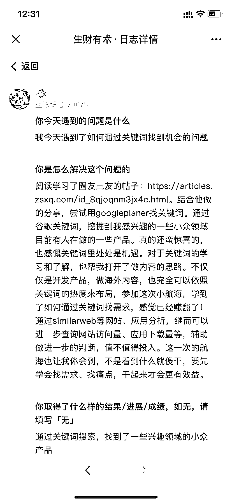 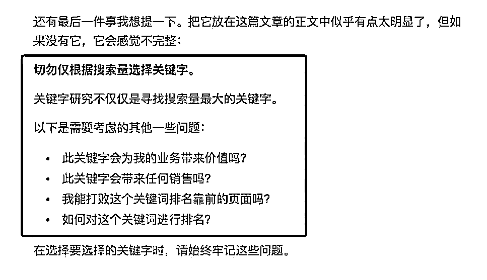

评论区：

do小鱼 : 哎呀  被三林老师翻牌子了！  特别不好意思  还把三林老师的名字打错了  但是作业过了好像不能改了 [囧]

三林 : 哈哈  我懂的[偷笑]

向上的塔皮 : 三林老师速度好快，我今天还在学习你的前面的精华贴：，马上今天又有升级版的，太棒了，学起来~https://t.zsxq.com/07RJqnyJE  三林 : 嗯嗯  希望有所收获哈

林锅 : 亚马逊产品开发表示也是通过关键词来确定开发方向[呲牙]

三林 : 对哦！  亚马逊站内搜索量很有价值

地铁馒头 : 提个问题，关于工具站都是在讲国外，为什么很少提到做国内工具站呢？

三林 : 那国内还是有不是工具产品的，产品形态app为主，网页版在海外更多的受众。海 

 

外的工具产品尤其是web tool/saas 百花齐放，一个细分的领域都能够收益相当，国内追求的是大而全。

# **# ****(**精华帖**)(99**赞**)**从「上帝视角」寻找**Niche**

作者： Perry XU

日期：2020-03-24

在这一期生财有术结束前，写了一篇有关选取Niche的方法和心得的文章，如果能得到亦仁大大最中肯的评价@亦仁，也算有个完美收官，哈哈。

取了个有点装的标题《从「上帝视角」寻找Niche》，如有不足之处，请大家指正。

写这篇文章是因为之前我去选Niche的时候没有方向，找不到抓手。为了克服这个问题，我看了很多有关选品，选Niche的文章，自己做了个思考框架，写成了这篇文章。如果你刚好在看这篇文章，希望能对你有所帮助。

在本文中你将看到：

**1. ** 什么是Niche

**2. ** 从3个维度选择Niche

**3. ** 详细讲解如何利用这3个维度

一、概念

什么是Niche? 我找了一些资料后，偏好以下这两个定义：

1.通过对市场的细分，企业集中力量于某个特定的目标市场，或严格针对一个细分市场，或重点经营一个产品和服务，创造出产品和服务优势。

2.利基市场（niche market）是市场中的一部分，它更窄地确定某些群体，而且这个小群体的需要没有被服务好，有着独特的消费者需求、偏好和特征，同时也能得到消费者的认同。

这两段话里有三个比较重要的点：

 

 

1.独特的消费者，或者群体

2.细分市场

3.发现需求

而这三个点，就是我们在寻找Niche时有力的抓手，也是选Niches时的一个思考框架：怎么找群体，去哪找细分市场，哪里能发现用户的需求。

下面我就详细说下，怎么才能利用这三点找Niche.

二、找到潜在群体

之所以「潜在群体」而不是「目标群体」的意思是，我们在信息不完整，甚至产品雏形都还没有的情况下，确定目标受众是很困难的，我们在这个阶段只需去发现，列出一些可能的潜在群体即可。

顺着这个思路，我们怎么定义出潜在人群呢？为了方便理解，这里举几个例子，比如糖尿病患者（群体够特殊吧），火影忍者迷或者LOL爱好者（特征够明显吧）。这么一说你是不是稍微有点感觉了。

这里推荐一个非常棒的工具（图片#1），叫Empathy mapping（移情图）  ，这个图的应用范围很广，用在这里也非常合适的。在确定了潜在受众后，你可以尝试使用Empathy mapping，也许能帮助你更好地理解用户。

这个工具对使用顺序没有特定要求，有时候你会发现用户所说所想的都差不多，这时候也不要太在意，不用刻意区分。

在这里我找了买电视的案例，大家感受一下：

所说：我想买个多大尺寸？

所想：这么多电视怎么这么难选？

所做：先在淘宝上搜一下，我再去实体店买

所感：哎，这个功能就没有上一个的好，纠结

你们看，列出的信息越多，大家就可以越细致地体察用户的情绪，他们会有什么看法，他们的期望是什么等等。最后建议大家，可以把这个图打出来，头脑风暴后用便利贴打上标签，当你们再看到这个图的时候，可以很快进入用户的角色中去。

这时有人会问，在选品的时候，凭空硬想一个这么特殊的群体出来，真不容易想到，因为很多时候是思维定势了。

这个问题也困扰了我很久，我大概说下自己是怎么解决的吧。

 

 

首先，你一个人瞎想确实很难想到嘛，但是很多人一起想就不一样了，一个人的经历，见识毕竟有限。这时候完全可以让更多不同岗位，不同生活经历，知识背景的人一起来参与讨论。不得不承认，这些人输出的东西可能就是你不曾想到的，就像下面这个图#2一样。

还有一个方法，我先在微博上找了一个涵盖了很多人的日常所需图，你可以先从这个图#3出发--微博上拿的（这只是个例子），去给这些东西打上标签，比如“裙子”你就可以想，有人就喜欢棉麻的，那是不是就发现了比较有特征的人群------喜欢棉麻材质衣服的人？  这样做的好处，你就是可以相对快而全地去设想出很多这样的人群。

最后，记得及时更新这个 [人群] 地图

这时候需要做的就是及时记录，比如上面提到的糖尿病患者这类群体，你就顺手在“身体健康”下开设一个“疾病”分类，把糖尿病患者群体补充进去，后面再继续发散。 “火影忍者”也一样，把“火影忍者” 记录下来放在“动漫”中去发散。

三、寻找细分市场

这个点大家都比较也比较熟悉，也有很多教程，文章，我大概列举几个常用的方法：

**1. ** 亚马逊，速卖通类目

**2. ** 社交媒体类目，如Pin的类目bit.ly/3doJtAu

**3. ** Trustpilot类目

**4. ** Flippa的网站交易平台

**5. ** 谷歌news的行业订阅

**6. ** 书籍分类

7.线上二手交易市场类目

8.Reddit类目，Communities

拿第一点来说，回想我们选产品的时候，常用的方法就是看下大型平台的类目，去看大类下面都有哪些子类目, 子类下什么类型的产品卖的比较好，然后我们就尝试着去Google,Amazon上搜关键词，用一些工具收集，拓展行业相关词后，用EXCEL表格把搜索需求分类，发现细分需求，统计搜索量，再看看趋势，竞争程度等。

这种属于用关键词的思维去挖掘细分市场, 利用信息差，快速试错认证的方法。

这里我需要强调一点，有时候找到细分领域，其实就能解决细分市场和特征群体这两个并行的问题。

 

 

举个我个人比较喜欢的亚马逊书籍的例子:

书籍畅销榜上我发现了老美喜欢用空气炸锅，喜欢做keto （酮食），发现没有,酮食这个Niche既可以发现一些特征人群（为了减肥吃酮食），又可以发现一些细分市场，所以说，找细分市场和特征群体不一定是孤立的，我们可以看情况交叉，灵活使用。

总之，AMZ的书籍分类，畅销榜我觉得是个非常不错的，能带给你灵感的地方。你想想，都愿意花钱去专门买这类书了，不正是代表了一个可能的细分市场么？你自己平时会在什么情况下买书呢？

也是利用这一点，我找到了一个趋势不错的Niche，最近还在研究当中，下图#4是这个Niche的趋势。

四、需求

我先用一个例子来说明下什么是需求：

有一天我在浏览Reddit的热点推荐的时候（非常抱歉，这个帖子当时没有记录下来），说的是一位司机看到前面的人车窗抛物，这位司机别停那辆车后打起来了，我当时就看热闹的心态，觉得很搞笑，后来仔细想想，这里有几个很重要的信息：：

1.前车的人在驾驶着汽车，非静止状态----人+背景

2.前车司机车窗抛物----行动

3.不知道什么情况，手上的东西反正就不想放在车上（可能吃完东西，可能习惯，可能垃圾很难处理，很烦躁，就扔了）----这是诱因，情绪

4.为什么就不想放在车上呢？他不想弄脏自己的车---这是目标，也是他的期望。

那这样子,我们来试着还原看看，怎么解决这个问题。

当然，是有假设的成分在，有时候我们的信息不是很完整的情况下，也是可以把自己带入到这个场景中去体察下用户的 (你看，又回到了移情图)。

首先如果我是用户（我有车，我开过车），我在行驶的车上如果吃完东西后（场景，情境），手上的那种黏黏的，带汁带菜的东西放在车上我就很难受（诱因，情绪），为了不想把车弄脏（我的目的），我还半天找不到能处理这个垃圾的东西，那我就扔车外面吧（我的行为，动作）。

看完这整个模拟的过程，我们就会发现用户可能需要一个能处理手上，湿漉漉的垃圾的容器。

 

 

到这里我们就算是发现了一个Niche: 一个车载的垃圾桶。我们不仅定义了人群，还发现了市场，又解决了用户的问题。

在这里(见图#5)，我们用一个完型填空题来提炼出需求：用户需要通过（解决方案，产品，服务）**__**完成（目标）**_**，因为**__** 。

我这样说，你们应该可以理解了吧，而且这个Niche还挺好发散的，比如车载空气清新剂，车用吸尘器等一些汽车用品。

那如何发现Nihces呢？

方法也有很多，最好的就是从观察自己开始，你有什么兴趣，你今天遇到了困难，情绪如何？----比如，长时间坐着颈椎很不舒服；电脑桌下面的线非常杂乱,绊到我的脚；美工跑来问我，如何下载到shutterstock上的无水印图片。

除了观察自己，就是观察别人，我就举一个例子：

去到用户集中的地方，比如，你对cycling感兴趣，就可以用在Similarweb上选出cycling这行业，然后选择国家，就会出现网站排名，一看 bikeforums.net cyclingnews这些网站就是行业新闻和论坛相关, 里面的大量内容都是和用户息息相关的话题，你相当于拥有了一个需求库。（图#6）。

这样选出来的网站既非常相关，流量又非常大，流量即用户啊，我觉得是一个非常好用的方法。

总之，我认为不管是小白还是大神，在选品选Niche的时候都可以从这三个角度切入，去思考和发散的，这三个角度是我们在选Niche时一个强有力的抓手，一个思考框架。

以上就是我今天的分享，你觉得有帮助的话点个赞吧，顺带关注下我的公众号“小白产品进化论”，后面我还会写“上帝视角”系列的文章，比如，如何评估你的Niche, 在选好产品后，如何给你的网站做好USP定位等等。

另外，4月份开始我还会和一些朋友（有留美的营销专家，也有平时工作认识的朋友）一起制作一系列从选品到网站定位，测试启动的免费微课程，目标是给那些做独立站过程中，对行业，产品拿不准的运营或创业者，让他们获得并掌握从信息收集到最后产品定位，测试启动的一整套方法，以降低后期的运营风险，达到品牌出海的目的。

 

 

有兴趣可以加我的微信610533908实时关注，欢迎大家给我提提建议或意见，互相交流， I want you.

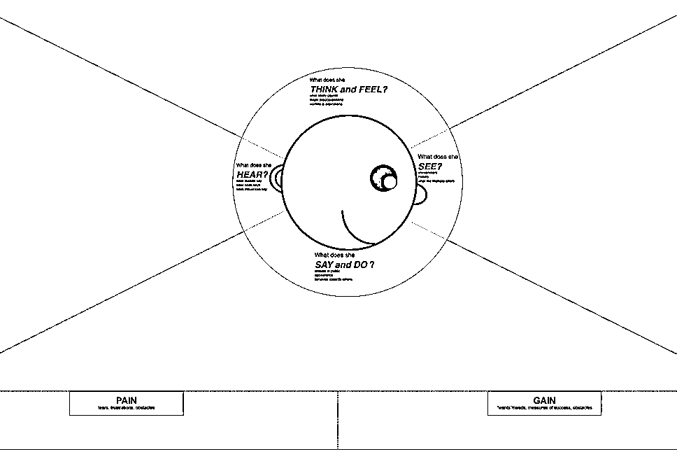 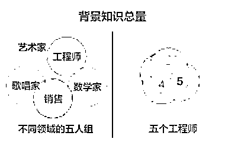

 

 

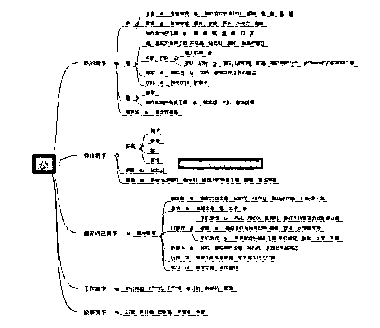 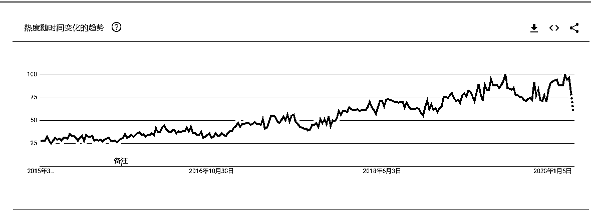 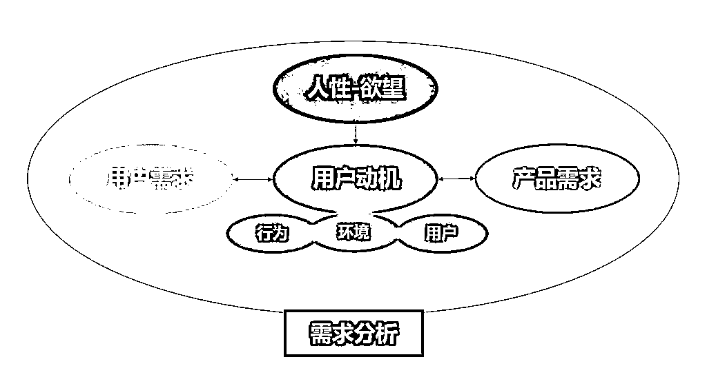

 

 

评论区：

阿思 : “用一个完型填空题来提炼出需求：用户需要通过（解决方案，产品，服务）**__**完成（目标）**_**，因为**__** 。” 写得不错，赞。

郑小焦 : 写得好，有启发。谢谢

Perry XU : 感谢支持

Perry XU : 有启发就好  那就好

亦仁 : 已加精华。

Perry XU : 谢谢认可[呲牙]

威海爱丽丝花冠鲜花 : 大佬一枚

# **# ****(**精华帖**)(94**赞**)**规避难中难，寻找蓝中蓝：蓝

# 海小语种市场（日本）中的蓝海信息差品类的套

# 利机会

作者：  跨境杨少

日期：2021-12-14

跨境电商近几年竞争越来越激烈，尤其近两年，国家两会每年都提到大力发展跨境电商，这个行业已经不再是少数人知道的暴利行业，新人加速进场，竞争不断加剧，行业正在迅速从蓝海走向红海。

很多跨境电商新人来自国内红海电商市场，也带来了很多降维打击的新玩法，比如 9.9 包邮，低价螺旋，「吴三柜」等等，尤其美国亚马逊，可以说已经不再是蓝海市场，蓝海品类也迅速减少，即使有，也迅速会被价格战打到无利可图。一个原本的「蓝中蓝（蓝海市场蓝海品类）」行业，正在向「难中难」发展。

 

 

这个时候，一些小语种市场由于语言门槛以及本地化门槛等原因，仍然还具备一些蓝海市场的特征，也隐藏着一些信息差的蓝海品类，尚有比较大的套利空间，这里我们着重介绍日本市场，以及日本海关壁垒下的一个类目的套利机会，希望可以为大家找到新的「蓝中蓝」市场。

**-01-**

跨境电商的起源和本质是套利

2009 年当我进入跨境电商这个行业的时候，这个行业刚发展没几年。

催生这个行业的一些代表性品类有 3C（当时主要以手机壳、贴膜、挂绳等小商品为主）、婚纱、假发、cosplay、高仿等等，行业的主要平台是 ebay，基本都是不压货，无海外仓，左手倒右手，进价多少人民币就卖多少美元，自发货国际直邮，这个模式干掉了传统国际贸易通路的两国进出口贸易公司及层层代理分销等中间商。

例如：400 人民币的偏高端的婚纱，即使卖 400 美元，当时也只有美国市场原价格体系的一个零头，由于模式先进，价格虽低，却不仅暴利，还对原有体系形成降维打击。

可以说：跨境电商是因发现一个套利模式而兴起，这个行业的本质就是「套利」二字。

最近几年，由于从业人员变多，这个行业已经不再是低成本低投入快速盈利的行业，竞争加剧，很多打法已不再是套利模式，而变成了要先投入先烧钱再图盈利的「盈利模式」，套利模式变盈利模式，一字之差，代表的是门槛的提高与赚钱效应的下降。

 

 

那么，还有什么样的市场和什么样的品类，能继续实现跨境电商最初的样子，比较低门槛低投入的进行套利呢？

套利的三个关键词（特征）：

低成本（低投入）

信息差

确定性

低成本低投入很好理解，无货源，dropshipping 就是典型的低成本低投入，另外，在运营上，不需要大规模压货，不需要亏钱亏货刷单刷评价去拉排名，也是低成本低投入。

信息差也很好理解，蓝海品类就是信息差品类，知道的人少，没什么竞争，但现在蓝海品类越来越少，想要获得信息差，就要把跨境电商原有的追热点、查热卖排行、铺货、跟卖的老思维老方法，升级为找新模式，从赚产品信息差升级为赚模式信息差，比如海关壁垒产品，它的选品思维不是追热点，而是从海关关税清单中找到高壁垒的产品，通过邮政包裹自发货规避关税从而实现套利空间，这是一个行业内没有的选品方式，这就是新的选品模式，这就是「模式信息差」。

确定性是指赚钱的确定性，盈利和转化的确定性，比如绝对的成本优势就是一种盈利确定性，可以做到只有你便宜，别人便宜不了。

另外，别人已经成功的模式，做模式复制，抄作业，也是一种确定性，即 —— 尽量避免花费试错成本，选品和运营上尽量采用被验证过的成功方法，并且这个方法还是只有少数人知道的。

 

 

我们认为，好的选品思维，能赚钱的选品思维，一定是满足上面三个特征的。

**-02-**

日本市场与美国市场的几个大数据

过去两年，我们对接服务了超过 1200 个独立站卖家，绝大多数是做欧美市场的，对比美国市场，我们总结日本市场的几个大数据如下：

人口：美国三亿多，日本一亿多，市场人口规模约** 3**：**1**

人均收入：美国和日本差不多，但是日本的贫富差距远小于美国

卖家分布：**1200 **多个独立站卖家样本中，只有不到** 10 **个在做日本市场网购渗透率：美国大于日本，但由于疫情原因，日本在快速增长

信用卡收单机构数据：从** 2020 **年中开始，日本单单量迅速增长

收入差不多，网购率也开始接近的两个国家，市场规模是三比一，而卖家规模只有  100：1 都不到，仅此一项数据，就显示日本市场的竞争激烈程度远小于美国市场，尤其在一些准入门槛较高的日本电商平台比如日本乐天，即使铺货模式，也尚存在一定的红利期，而这在美国市场早已不存在。

 

 

由以上大数据，我们可以看到日本市场确实存在一定机会，这几年我们实际做下来总结有以下 4 大优势：

低竞争

高客单

快物流

低纠纷

**1**）低竞争：日本主流的亚马逊和乐天两大平台，铺货模式仍有一定的红利期，上架产品不刷单不刷评价，也能通过正常运营手段做到搜索排名靠前，这就避免了今年大量卖家遭遇的封号风险。

日本独立站方面，某些垂直品类长期没有竞品站和竞争对手（长达几年），google 广告的投放成本最多能比投放欧美市场便宜一半，我们 google 广告的 cpc 单价成本大多分布在 17～23 日元，约 0.2 美元的 CPC 这个价格是欧美卖家难以想象的，facebook 如果跑点击量，CPC 也仍然可以控制在 12～18 日元的范围。

**2**）高客单：垂直品类，和一些信息差品类，海关壁垒品类，客单价比较高，毛利空间较大。

**3**）快物流：自发货 2～3 天清关派送，旺季时效也有保证，不会出现欧美自发货商家在旺季物流积压，卖越多亏越多的情况。

**4**）低纠纷：在做好产品性价比和质量过关的前提下，绝大部分交易是静默交易，即使自发货模式，也对客服和售后成本消耗小，独立站几乎没有拒付，而欧美独立站长期被拒付党，撸货党困扰，这部分低素质人群在日本没有。

 

 

**-03-**

信息差：海关壁垒品类的选品方法

与套利机会

海关壁垒是我们的一个选品思维，我们通过货代，统计到所有品类在海关的关税税率，并按从高到低排序，从税率最高的开始选品，并通过邮政渠道单票自发货规避这个关税，把关税转化为利润空间。

这个不仅日本可以这么操作，中美贸易战下，美国的海关壁垒品类也值得调研与一试。

日本市场主要的海关壁垒品类为真皮类，尤其以真皮皮鞋的关税最重。另外食品和糖果类也是高关税品类，税率与真皮制品差不多。

例如真皮皮鞋，每双在日本海关的关税为 4300 日元，约 300 人民币，这个关税费用经常远远超出货值，正常贸易公司进出口无法规避这个关税，大货清关，fba 大货及货柜也无法避开这个税种，只能通过邮政渠道单票自发货，通过私人件清关规避这个关税，这个是合法的。

另外，食品糖果品类除了有海关壁垒，还有市场准入壁垒，平台无法上架，这个为独立站卖家创造了有可能垄断的机会，只要能找到 20 个左右的符合国外买家口味的网红食品，就可以建起一个独立站。具体打法以后有机会我们可以再另行分享。

**-04-**

 

 

真皮材质选品方向及其套利空间

由于真皮制品的高额关税，市场售价普遍较高，基本不会低于 500～600 人民币，而我们通过邮政自发货规避这个关税，可以做到即使以市场价一半的价格售卖，客单净利润也能接近 100 人民币，这在做欧美的跨境电商来说是比较难见到的利润空间。

真皮只是一个材质，不是一个品类，因此有很多品类可以做，选品上的空间是比较大的，并且都支持无货源 dropshipping，这满足我们说的跨境电商底层逻辑的低成本低投入，海关壁垒这个信息差在我们对接过的客户中几乎没有人知道，这满足底层逻辑中的第二点，由于规避关税形成的极大的成本优势，转化确定性模式成功的确定性是有的，这满足套利底层逻辑的第三点，因此这个选品方向是一个非常好的方向。

由于真皮制品品类较多，我们建议选品要分优先级别，先从自己比较专业的，有供应链优势的品类去选，比如我们会选择鞋类，另外可以选择自己感兴趣的、喜欢的或者有一些相关资源的品类去优先做。

**A**）可套利的真皮鞋靴种类

成本越低的真皮鞋类，在日本市场的套利空间就越大，因为不管多贵的真皮鞋子，日本海关都是收 300 人民币的关税。

中国工厂本来就具有比较大的成本优势，真皮皮鞋也不例外，一些凉鞋，包头软木拖鞋，单鞋的出厂价格最低 30-50 就可以做到，所用的皮大多为牛二层皮，牛绒皮，这些低成本的皮也是真皮，在 sku 的标题和详情里面可以直接标明为真皮。

 

 

经过我们多年的售卖经验，我们总结以下几种真皮鞋靴有比较大的套利空间：包头凉拖、凉鞋、户外鞋、登山鞋、马丁靴、工装靴、雪地靴、豆豆鞋、休闲鞋。

**B**）选品成本区间及零售定价策略

以上真皮鞋靴品类我们建议的满足品质和性价比的进货成本区间及零售定价区间如下：

包头软木凉拖：进价** 30**～**60 **建议售价** 1980**～**3980 **日元** **利润空间** 50**～**100rmb**凉鞋（玛丽珍等经典款基本款）：进价** 40**～**70 **建议售价** 2980**～**3980 **日元** **利润空间** 50**～**100rmb**

户外鞋（户外凉鞋和登山鞋）：进价** 55**～**125 **建议售价** 3980**～**7980 **日元** **利润空间** 100**～**200rmb**

马丁靴：进价** 60**～**180 **建议售价** 3980**～**9980 **日元** **利润空间** 100**～**200rmb**工装靴：进价** 90**～**120 **建议售价** 5980 **日元** **利润空间** 100rmb**雪地靴：进价** 50**～**160 **建议售价** 3980**～**8980 **日元** **利润空间** 100**～**200rmb**豆豆鞋：进价** 35**～**55 **建议售价** 2980 **日元** **利润空间** 70**～**100rmb** 

 

补充：有的鞋款同为真皮材质，但具体用料和款型的价格差异较大，有一些成本和利润平衡比较好，利润最大化的单品，比如雪地靴最贵最好的材质是羊皮毛一体，真皮真毛，出厂价一般在 150 之上，但同为真皮真毛，羊剪绒款只有 90、针织羊毛款最低只有 70 不到，套利空间就比羊皮毛一体款要大，而且引流上可以按皮毛一体真皮真毛、兼具保暖与透气的特性去营销，以同样的关键字去获取自然流量和推广，然后以极具性价比的价格获得高转化。

**C**）本地化优化：翻译；用词；文案

对于做欧美市场的卖家，标题、详情、广告文案单词如果用的不准或者不地道，对转化率的影响不是非常大，但是日本市场则不同，对用语是否地道，本地化的要求就比较高，如果客户觉得日语不标准，是外国人店主在卖货，会产生不安不信任感，转化率会有明显下降。因此日本市场的产品的标题详情要翻译准确，推广文案要用商业敬语。

即使在做欧美市场的卖家中，也存在很多本地化不到位，机器翻译的低级错误，比如很多卖家在卖的飞织鞋，大量的标题都用的是 flying weaving shoes，这是个非常低级的错误，甚至是笑话，正确的应当是 upper neat sneaker。

另外一个本地化容易出错的例子是雪地靴，欧美卖家也经常用词不对，大量标题里使用  snow boots，而这个实际上是指滑雪和踩雪的一些靴子，我们通常意义上的皮毛一体雪地靴是不防水的，不适合踩雪，这个对应的英文翻译应当是 mouton boots 或者  sheepskin boots ，在澳洲也可以叫 ugg boots（澳洲豁免 ugg 品牌词侵权，因为在澳洲  ugg boots 是雪地靴统称而不是具体哪个品牌）

对应的日本关键词也是一样的参考以上案例，因为很多日语叫法仅仅是英语的片假名读音外来词。

 

 

如果用错词，会浪费大量的广告费，流量不精准，转化低下，离赚钱就越来越远。这就是本地化和精准文案精准关键词的重要性。

**D**）检品仓与前置仓** fba **与** fbm**

做日本市场，虽然有蓝海空间以及蓝海品类、蓝海模式，但是由于客户对质量和快递时效要求较高，需要在运营能力上做相应提高。

一般来说真皮鞋类我们会选择进货成本在 100 左右的，是质量和性价比以及终端定价 / 净利比较平衡的一个档次。而一些低档的便宜货，在东南亚电商平台和速卖通可以做，却不适合日本市场，这些产品在日本市场的退货率极高，会造成巨额亏损。

为了降低退货率，即使做无货源 dropshipping 模式，我们也必须设置检品仓，把所有货自己检查一遍，比如毛头剪一剪，以及及时发现次品，这些事情交给中国工厂去做，即使叮嘱再到位，也不行，因为 dropshipping 的供应商有很多在品控上是不稳定、不靠谱、不负责的。

比如我们就在南京设置了检品仓，所有 dropshipping 的货先到南京检品一遍，再发货。

一些爆款产品，也统一由我们检品后送往上海前置仓或日本 fba 仓库。

前置仓是一个介于海外仓和国际直邮之间的解决方案。因为日本足够近，一般上海的前置仓可以做到当天发货次日清关，最慢不过 3-4 日。这就节省了海外仓的成本和店铺关停导致的货退不回来全部亏掉的风险，前置仓就相对灵活可控，但是检品也不能完全交给前置仓去做，除非自己安排人去前置仓检品。

 

 

对于真皮制品，由于大货无法规避关税去清关，一般都是自发货，但是通过 ems 的大件，也可以部分的进 fba，并且规避关税，我们一般会把好卖的尺码或者爆款，通过  ems 大件，少量的压 fba，其他的尺码和款式则自发货，这样可以保证好卖的 sku 获得亚马逊 prime 标志，在流量权重上获得提升，同时又兼顾了成本和海关风险。

**-05-**

结语

我们从 2009 年开始做日本市场，从日本雅虎开始，后逐步入驻日本乐天，日本亚马逊，2012 年开始自建独立站，既是日本电商平台中第一代中国卖家，也是独立站玩家中最早布局的一批，我们对日本跨境电商的选品、建站、物流、支付、推广、本地化等全业务链条有资深的经验。

随着国家不断提倡发展跨境电商，我们一边感到市场竞争加剧，一边感到跨境服务市场开始成为新蓝海，2019 年开始我们增加了出海日本这个服务的业务线，对接比较成熟的欧美跨境电商卖家，尤其以独立站卖家为主。

目前，我们是国内唯一的面向跨境电商中小卖家布局日本市场/品牌出海日本的专业且资深的服务商，我们也与服务上市公司级的品牌出海服务商在日本市场板块保持有合作。

今天分享的海关壁垒这个蓝海选品思维，是我们自己多年实操总结的四大选品思维之一，比较适合日本市场，其他的选品思维则不限于日本，也不限于平台或是独立站，都是通用的选品思维，都是具有套利底层逻辑的蓝海选品模式，如果未来有机会，再与大家逐个分享。

评论区：

 

 

游心 : 感谢真诚分享  收获很大 [爱心]

跨境杨少 : 一起生财有术哈哈哈

森烨跨境-天宇 : 留个联系方式，

跨境杨少 : 我不知道咱社群给不给公开留哈，要不我私信你吧

森烨跨境-天宇 : 给吧.没事

wtyyyy123

跨境杨少 : 好像私信功能我也没找到，你可以搜跨境杨少的拼音，dy和v都有哦  亦仁 : 非常干货精彩的分享。说到日本跨境，分享个我听说的，tiktok广告投爆款，唯一赚钱的几家，有一家就是投的日本。

亦仁 : 下面这个思路也有启发。

「从赚产品信息差升级为赚模式信息差，比如海关壁垒产品，它的选品思维不是追热点，而是从海关关税清单中找到高壁垒的产品，通过邮政包裹自发货规避关税从而实现套利空间，这是一个行业内没有的选品方式，这就是新的选品模式，这就是「模式信息差」。」

# **# ****(45**赞**)Chrome **插件开发之旅：从** 0-1 **开发浏

# 览器扩展

作者：  阿帆

日期：2022-07-18

大家好呀，我是帆，本职前端开发，也是本次 Google 插件大航海船员～大航海挺多优秀的圈友都上线插件了（我也上啦），在群里我比较活跃（话痨）一点，这次应阿蓝的邀请，整理分享一下自己在挖掘需求的过程和插件上线后的一些想法。

今天分享的内容，主要围绕在：方向选择和需求挖掘。另外附带一些开发上线的细节，以及插件上线后挖掘新需求的想法。全文大约 5000 字，阅读大约需要 10 分钟。

那这里就开始吧～

 

 

一、确定方向及需求挖掘

这次航海，我学会的最大的一个认知就是：想要做好一件事情，开发其实是最简单的一环。

决定是否能盈利、用户是否买账的核心，是功能是否满足了用户的需求，而不是你的代码写的有多好，功能有多少。在开始一个项目之前，我们最需要做的是反复确认一个需求是否可行。

为什么用户愿意给一个简单的东西付费：

Google 插件有一个要求，也就是：插件应该是单一功能的（Single Purpose）简而言之就是：

这个插件应该只为了做好一件事情，而且要易于理解，过于复杂的功能审核是不会给通过的。

在这个前提下，你要制作的插件就应该是一个用于辅助用户的工具，例如我们挖掘需求会用到的 Keywords Everywhere、亚马逊卖家常用的 Keepa 都是属于这种工具。

工具帮用户节省了时间，用户就愿意支付这样的一笔费用。而且这类工具的用户，大多都是为了赚到更多的钱，那付费就更爽快了。

从零挖掘需求，建议从大平台的周边挖起：

 

 

虽然是明确是要做一个辅助类的工具，但我还是不建议从这种工具类做起。我认为：自己的第一个插件应该要尽可能的简单，让自己能快速的了解开发流程，明确开发的大体内容（如何开发、如何上架、上架需要准备什么、流量怎么来）。

所以我航海时的计划就是：做一个简单的免费插件，跑一遍这些流程，这样在开发付费插件的时候心里才有底，不至于抹黑乱跑。

挖掘需求，建议充分阅读：航海实战｜Google | 付费插件｜实战手册，航海手册里对于常用的方法及各方面的细节，都有非常详细的讲解，有不明确的地方，来回翻阅几遍加上实操基本就清晰了。

一开始建议遵从手册上面的方向挖掘需求，也就是：Facebook、Instagram、Youtube 这些平台。因为这些平台的用户量巨大，再小的一个需求，哪怕能满足 0.001% 的用户，也是最少五位数的体量，而且需求好调研（Google 搜索）、SEO 也方便。

想挑战一下自己，第一个插件就开始盈利，建议从：Amazon、Ebay、Etsy、Shopify 这些电商平台开始。

除了用来熟悉开发，熟悉流程的第一个插件，其他插件在开发之前最好是反复确认，做好调研。

壹树说过一句话：找到一个需求后，不要急着着手开发，一个礼拜后再回来看，如果觉得这个需求还是不错，那就一个月后再来确定。这句话一定要牢记的，因为开发是需要时间投入的，最好在开始前反复确认，这个需求是一个有潜力的需求，不然时间成本太大了（开发的投入、审核上线的时间、Bug的修复和编辑的审核时间、SEO 推广，以及开发完成后的倦怠期）使用工具挖掘需求的市场和竞争强度：

 

 

在航海群里，问一个需求能不能做，最大的可能是收获到壹树哥的一句：问搜索引擎，搜索引擎比我们靠谱多了。

一个需求能不能做，答案全在搜索引擎的数据里，我们通过搜索+工具可以得到：

**1. ** 关键词和相关词的月搜索量、广告费用

**2. ** 需求的竞争对手有多少

**3. ** 相关的长尾词都有哪些

**4. ** 每个月通过这个词进入目标网站的流量，以及网站的月总流量

流量（Traf/mo）是预估的。关键词搜索量、费用、竞争强度等数据，经过调研来源于 Google 关键词规划师（比较准）

这里使用到了 Keywords Everywhere 这个扩展，使用到的功能是：搜索关键词，获取关键词以及相关词的搜索量、通过关键词进入网站的流量。主要用于分析需求量及竞争强度。

使用工具挖掘需求：

 

 

上面提到 Keywords Everywhere 这个工具，可以查询到关键词以及相关词的市场容量、竞争难度。那我们也可以倒推过来，使用它去做需求的挖掘。在航海手册里，有提到一个方法。使用关键词 + a-z 去检索需求：

A-Z 这样走一遍，就能筛选出大多数平台的高流量搜索词。英文好的圈友，大概第一眼就能看得出搜索出来的下拉词是什么，英文不好的，可以点进去看看结果，评估一下内容和搜索量，就可以考虑进一步研究（深挖）啦。

基本上就是按照选定的方向，例如 Facebook、Amazon、Gmail、Ebay 这些词去做 a-z 搜索。

找的方向以后，就去引擎上找长尾词，看看当前的解决方案，例如：how to xxxx in xxxx。一般这种词最能显示出需求量。

 

 

模仿竞品开发插件：

除了通过搜索关键词去挖掘需求，另一个方法就是模仿竞品，这个方式应该是见效最快的方式了。这里需要这一份圈友分享的商店扩展列表：Google 插件市场 15w 条完整数据 | 圈友基于此做的筛选工具

使用这份数据表，可以根据插件评分，用户量进行初步筛选，再人工过滤一遍结果，选择出近一两个月有新评价，但是评分比较低的产品，使用上面提到的 Keywords Everywhere 做长尾词调研。

 

 

这种方式搜索出来的内容，基本都是有需求的（近 1 个月有评价）使用工具去研究长尾词，主要是为了分析需求和市场大小，竞争情况如何。

例如这个插件：Ali Invoice，就是使用这个方法在数据库里挖出来的。

 

 

插件功能很简单，就是获取速卖通的订单信息，生成一份可打印的发票文件（PDF）。功能实现起来不复杂，基础班的价格是 20 美金…目前插件已经很久没有人在维护了，看了一下 Rate 里的大部分的竞品，评论也很多是 not working（说明有需求，但是没法解决，直接对标开发  1 比 1 复制，很容易推广的）。

这个需求属于比较小众吧（问了一下做速卖通的朋友，说是没这个需求），所以这个方向，我没有深入下去调研，感觉这种就挺适合新入手开发插件的圈友练练手。

关于免费插件如何盈利：

在挖掘需求的时候，一定会注意到有很多插件是免费的。不用猜它们怎么盈利，这些插件大部分就是为爱发电的（作者的爱好、炫技或者是看不上这点微薄收入……这也是为什么商店里有很多不再维护的插件……）

当然，也不是说免费插件就没法盈利，只是方式更复杂一些：

**1. ** 带流量给自己的网站，再通过其他产品转化（有一家开发商，专门开发免费的插件，导流给自己的小游戏）。

**2. ** 引流售卖商品（Tabby Cat，一个宠物标签页，通过独立站售卖周边贴纸盈利）**3. ** 增值服务（插件获取到的数据云同步功能）

**4. ** 通过联盟链接赚分佣（挖需求发现有一款免费插件，评论区都在说会自动打开天猫超市……作者大概是淘客吧）

**5. ** 引导点击广告（这种插件一般都会挨骂………………）

做好心理预期：

刚开始做插件的圈友一定要做好心理准备，你的第一个插件可能会：因为各种奇怪的问题审核被拒、开发完发现版本不能上架（MV2 版本不能上架了）、遇到问题在网上搜索到了解决方案却没效果，上线了却没有用户等等。

 

 

这也是为什么我建议先开发一个简单的免费插件，体验一遍完整的流程。不过遇到了也不要气馁，事后做好复盘，争取下一次更好，这种事情就像是亚马逊刷单被抓，Facebook 广告账户被封一样……没有经历过也不算一个真正的插件掘金人吧～

二、摆脱技术依赖、快速开发** MVP **产品

开发插件，主要是为了帮用户解决问题，怎么解决不重要。在需求挖掘的时候，我习惯在确定一个需求可行的时候，先去简单研究一下实现。也就是看有没有可以直接拿来用的库，如果没有的话，评估一下自己去实现复不复杂。

比如这个插件：

看到这个插件的第一反应，就是可以用库（FFMPEG）实现一个一模一样，甚至更好的工具（比如我叫他 Media Converter，音频、视频、图片都能转…………甚至视频抽帧、图片转视频，都很简单），自己只要做一个界面，预置好转码的参数就可以直接上架了……

 

 

开发之前，建议整理一个 todo list，把需要开发的功能一项一项的列出来，然后一行一行的删除掉，只留下最核心的功能，先完成一个 mvp 版本，让自己有个东西去做推广，表现不错再做细致的补充。

补充一点：不用太在意使用什么技术去做插件，插件是最简单的网页程序

（HTML+JS+CSS）。会开发用自己熟悉的技术栈，不会开发可以和圈友一起合作生财。打算自己研究开发，简单学习一下前端三剑客就可以直接上手了。

三、上线扩展

开发完成，上线扩展第一个面临的问题就是开发者账户。

直接注册账户，绑定信用卡，支付费用，你很大可能会遇到支付失败的问题。这个大概是  Google 内部的问题，在绑定支付卡以后，关闭并重新打开页面，这个问题就解决了（当时查了一下，没有查到任何说是银行拒绝了交易，大部分都是重进页面就能解决，我也是按照这个方式，绑好卡以后，关闭重开就能支付了）

实在解决不了，可以在万能的某宝多花点钱解决～

之后可能会遇到的第二个问题就是：插件版本不对。

Google 扩展分为 v2 版本和 v3 版本，目前商店已经是不允许 v2 版本上线了，然后网上有很多教程都是 v2 版本…… 这次航海就有圈友踩到了这个小坑。

因为版本问题被拒绝

 

 

遇到版本错误无法发布不用太紧张。升级版本并不复杂，只要没有使用到被取消的功能（引用外部JS），基本也没有多大的问题。

上线扩展的最后一项就是审核，审核需要描述大致的程序功能（也就是前面提到的单一功能），为什么需要使用到某些权限（每一项权限都要做出单独的说明），如果需要收集用户数据，还需要提供隐私声明。申请了权限没有使用，需要但是没有提供某些内容，都是会被拒绝掉的。

圈友插件因为权限问题被拒绝

插件的审核时间大约是 2-3 天吧，中途不能撤销（插件上新、插件编辑都是这个时长，哪怕是编辑了一个字…………）所以在开发完成以后，一定要检查一遍，是否申请了多余的权限，有没有影响功能的 BUG，免得因为这些问题影响上线，或者上线后收到不必要的差评。

四、扩展推广

插件上线以后，只靠自然流量获取用户还是比较慢的，现在我的插件上线半个月了才 100+ 的用户  🤣

 

 

如果你的扩展是修复了某个失效的竞品，可以在它的 review 里留言，引导用户去自己的扩展页面下载扩展。很多失效插件下面有模版，保存几个随时用就好了。再就是去搜索相关长尾词和关键词，在相关的帖子里留一下自己扩展（或者官网）的地址。

获取免费流量，最后一个就是制作视频发布到 Youtube 上，标题名称用相关长尾词的名称，还是很容易跑到 Google 搜索结果的前面的（可以认为是大站点有加权）。付费流量就是  Facebook 广告、Youtube 广告了，这一块展开又是一个超级大的板块……不过还是建议免费流量开始吧。

插件上线后开始有用户了，可以使用 Vercel 搭一个小站点，用来承接各个渠道带来的流量，顺便赚点广告费，以及做插件优化，提供一份使用指南～

五、做自己喜欢的事情

亦仁有一段话我觉得非常好：如果总开心指数是正的，那就值得做，总开心指数是负的，那就不值得做。也就是做自己喜欢做的事情。

今年应该是我加入生财的第四年了，期间加入过多个航海，尝试过各种副业：视频号、抖音、TK、好物、小红书。这种 UGC 平台，每次内容发布出去，自己都会陷入各种自我怀疑。这次尝试了开发这一个方向，却觉得一切都很自然和舒适。

之前尝试的副业，虽然一些收获，可总是坚持不下去。现在琢磨过来，大概是因为：尝试那些副业，都是为了赚到钱，每次输出却没有结果，都在一点点的消耗行动力。但是做自己喜欢的事情，每天都能保持一个行动力满满的状态。

现在上线的第一个插件目前用户 100+ 啦，每天都有自然增加（计划做 SEO 但是一直没落实😂）。虽然用户不多，但还是很开心。

 

 

最后在补一张壹树大佬最常发的一张图

感谢各位圈友阅读完这篇分享，在这里祝各位圈友在插件出海的路上披巾斩棘，做到人生中的第一个** $10K MRR**

评论区：

金社长 : 厉害

凡灵逸尘 : 大佬，能不能加个微信

向上的塔皮 : 谢谢你的分享，非常接地气，也是我现在在做工具的疑问

 

 

# **# ****(41**赞**)**为什么疫情期间美国比基尼单品超级旺

# 销？出海品牌搞懂海外用户消费场景有多重要？

作者： DEAN鼎健

日期：2020-04-19

一起赚美元  【为什么疫情期间美国比基尼单品超级旺销？出海品牌搞懂海外用户消费场景有多重要？】

疫情期间美国的Costco开市客的户外产品需求非常之大，同时Costco的户外SPA设施非常热销。

很多没在海外社区，尤其是独立屋居住生活过的人是很难理解的。比如，美国人超级热爱在院子里泡澡做SPA浴。这种设备为什么疫情期间美国比基尼销售特别好？这个Jacuzzi（按摩浴缸）通常是摆在后院一角，具备加热功能，和泳池并不冲突。有条件的就在泳池边上搭建一个可以按摩，可以加热的Jacuzzi，没有条件的就直接买一个Jacuzzi（按摩浴缸）放到后院一角。周末下班了男主人或女主人去泡泡，享受一下闲时的度假感觉。

这种热爱很多华人或者亚洲人都很难适应。以洛杉矶为例，天黑后和白天的气温相差特别大，全年晚上基本都在10摄氏度左右，在院子里泡SPA其实外面温度非常低的。但是，白人，黑人，西班牙裔的墨西哥人，食物里的芝士和高蛋白营养充分，身体热量充足，都是非常不怕冷的。在清凉的室外，依然喝着红酒，泡着SPA在院子里享受。

根据近期谷歌疫情期间的一个数据，居然，居然，居然，比基尼产品成为这次疫情下的一个热销产品。而跟我沟通的一家大型的出海品牌也给我反馈了这个销售事实。只是国内的市场，品牌推广人员都以为比基尼当作一种生活的情趣物品了，这是一个对真正用户消费场景的误判。

疫情Stay Home期间，穿比基尼的场景不在海滩，不在泳池，而是在院子里的SPA。其实，直接到后院去泡SPA的应用场景，比起海滩泳池的应用场景更加高频，更加实用。

最后，另外一个消费场景就是美国人不会泡完SPA就跟咱们国人一样，拿着比基尼手洗揉搓一下，找根竹竿凉干它。大部分的城市是不允许在室外晒衣物的，所以他们的做法就是直接扔到洗衣机里放着，洗完后一次性用烘干机烘干全部衣服。一般一个家庭一周左右洗一次衣物，这样他们因为宅家，每周泡多几次的按摩浴池后，就得在线上赶紧下单买多几套比基尼就很正常了。

 

 

选择大于努力，跨境出海，搞懂海外用户的消费场景，是去选品，去设计产品，去推广品牌的重要前提。（我的公众号：出海品牌战略。中间有一段视频可以让没有海外生活经历的产品经理找到一些感觉。）

https://mp.weixin.qq.com/s/4V-ScdgzoVdmM3MzZzMOmg评论区：

黄小鱼🐠 : 不错，不同地区的风土人情，消费习惯差异挺大～

 michael  : 学习了

# **# ****(19**赞**)**难度更低的海外**“**内容工具**“**站或许也是

# 出海一种不错的选择

作者：  比浪

日期：2023-08-18

一直感觉做海外的内容站比较难，难于有持续的内容输出更新能力，所以主要的精力还是在海外工具站。

不过最近一段时间的学习涉猎发现，其实有些内容站也相当于是工具站的，之前的思维可能被狭隘束缚了，感觉内容站只能有点广告收费盈利点，也就是google adsense。但是看的相关网站多了一点后发现，很多内容网站并不是靠这个盈利，广告果然是最低级的收益方式哈哈。

我仅仅代表我自己浅薄的见识哈，一般内容站布满了广告，哪怕内容质量还不错的内容站，另外的收益就是通过联盟佣金，海外的话很多付费的工具、服务、资源都是有联盟分销的，通过内容放对应内容的产品的联盟链接，估计也有不少被动收入，这个看的比较多。

 

 

另外就是我说的不同的，很多网站类似于niche工具站一样，做的niche内容站，非常垂直，我个人感觉这类站长肯定有很多类似的垂类站点，专门针对一个非常垂直又会产生高客单价的需求做一个内容网站，网站会比较详尽的从需求的各个方面来比较详尽的写一些相关的文章，其实只需要从大千世界的互联网做一下整理归纳就好了，比如海外留学、海外租房、海外订酒店、海外旅行团等等，这个需要自己去找有比较靠谱的机构（带联盟分销，客单价也还比较高的）。

只需要做好网站、完善整理归纳好比较详尽方方面面的内容、做好SEO，提升关键词排名，就可以等待自然流量来成交转化了，个人感觉非常适合独立开发者，直接用一些开源或者付费的单页系统或者WordPress模板就可以快速搭建起来，如果收益还可以，还可以考虑矩阵搭建多个独立类似的网站，甚至考虑付费投流。

跟工具站相比的好处就是几乎不用任何复杂的技术开发能力，不用想着如何开发创意的技术功能博取用户的欢心（很多时候是浪费了时间还不讨好），只需要一个基础技术能力的站长就可以做到了，独立开发者，连员工都不需要，因为不需要功能（内容归纳整理），也不需要销售（SEO），更不需要界面设计（直接买现成的很多模板就好），上线速度真的是杠杠的，而且内容有天生的流量吸引，持续的会通过互联网吸引到精准流量，哈哈。另外，内容站比客户还需要了解熟悉使用一个工具站的上手成本低得多。

另外还可以对部分精品内容进行会员制收费阅读，真的是远远比谷歌广告的收入好得多，这是最直接的收费方式，一般精准搜索来的客户，可能是要消费最少几千上万人民币的，付费意愿还是挺强的，比搜索量大但是离钱远的一些关键词其实更好一些。

还有挺多想分享的，今天有点事要办，先这样吧，后续补充，由于是一下子直接写完，没太多思考，文笔也不好，所以大佬们见谅内容中的一些小问题，喜欢一气呵成，不然求完美一直写不出来。

 

 

以上都不是完全凭空想象，是在看到比较多的实例情况下的简单思考，后续实践后可能会分享更完整的内容。

另外注意一点：不一定出海挣钱的网站是纯英文站点的，比如针对国内想出去或者已经出去的潜在高质量客户提供的中文内容站点也是可以的，我看到的很多例子也是这样的。

给技术能力不是非常强，又没有团队的出海小伙伴们多一个参考选择吧。

天天在公众号坚持水文日更，希望慢慢把内容水平提升上去，今天尝试把内容发到生财，希望有对一个小伙伴有启发就好

评论区：

Nommy : 谢谢分享

# 【工具推荐】**5**篇

# **# ****(88**赞**)**非技术背景出海产品必备工具：**AI SQL **

# **Editor**

作者：  胡二虎🐯

日期：2023-08-22

继昨天小排老师说的，非技术背景编程的话题往下说。

 

 

出海产品上传以后，用户行为分析、拆解、优化是出海产品的必经之路；这其中SQL是非技术背景人的拦路虎，今天在PH上看Day Top1的产品挺有意思；AI SQL Editor, 不懂SQL就写SQL，非技术背景但是想冲出海工具的可以看看。一方面学习别人挖掘需求、建立产品的思路；一方面可以利用工具提效

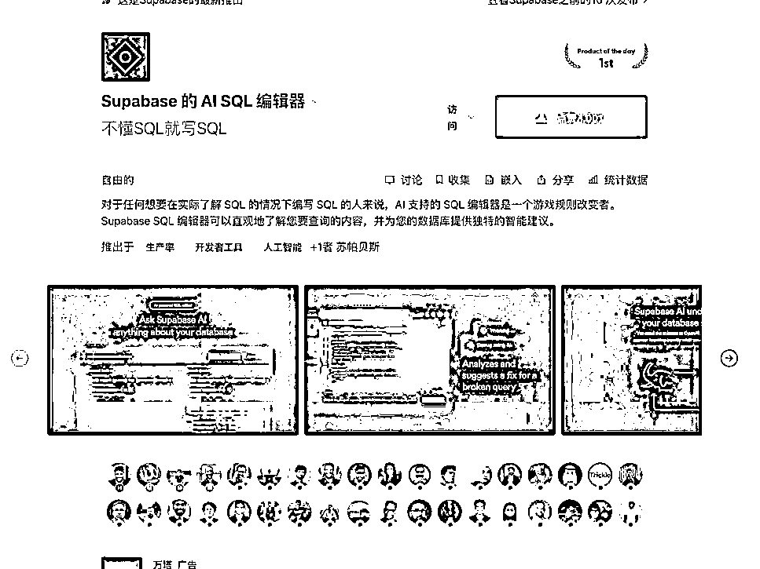

评论区：

苓枫 : 预测要中标了

胡二虎🐯 : 借你吉言

亦仁 : 中标，术值+1。

在上方专栏点击 #中标，可查看所有中标风向标

胡二虎🐯 : 你预测的真准

胖大魔 : 好的，二虎哥

胡二虎🐯 : 出海，冲！

melisa : 请问 PH 是什么

胡二虎🐯 : producthunt，可以Google搜一下，类似一个产品榜单 

 

# **# ****(69**赞**)**一个神器帮你快速查询域名组合取名

作者：  三林

日期：2023-07-06

一个简易查询域名组合取名的神器

在产品出海时，如何取一个信雅达、接地气的产品名字或域名是一个困恼人的点，昨晚体验到了一款域名注册查询的神器，叫 Lean Domain Search该网站 leandomainsearch.com 上个月访问次数 20 万，停留时长四分半。而 70%的用户来自直接访问，间接说明有一定忠实用户了。

▍工具怎么使用？

1）搜索查找：在网站的搜索框，直接输入一个关键词，比如 GPT，比如当下热点  threads；

2）秒出结果：Lean Domain Search 自动帮你组词，5 秒钟内，出5000 千条左右备选域名结果。

3）查询结果：他为你查询好了，是否已注册。默认情况下，排名在前的是可以注册的。

4）筛选域名：可以按流行度、按长度、按字母 ABC 进行排序；也可以筛选关键词是前缀还是后缀。

5）细节来了：这些结果在一个页面里全部返回，你可以直接浏览器搜索 Command 或  Ctrl + F，搜索看看有没有自己喜欢的。

不足之处：比如用户无法维护自己的词表。比如我就喜欢某个单词，这不支持自定义。

还有其他吗？你去体验试试~

▌网站怎么变现？

他目前顺滑的导流给了 WordPress 官方进行域名注册或开启新站。  难道被 WordPress 官方收购了吗？—— 进一步求证，果然是的，AutoMattic 这家公司怎么如此叼。

▍延伸思考

通过这个产品，我很快就搜索到了自己满意的域名。如果让我来做这个产品，我会寻求他的 API+自定义词表，来满足更个性化的需求。

 

 

总之很强！

来吧，域名党同僚们，推荐体验  https://leandomainsearch.com/search/?q=threads

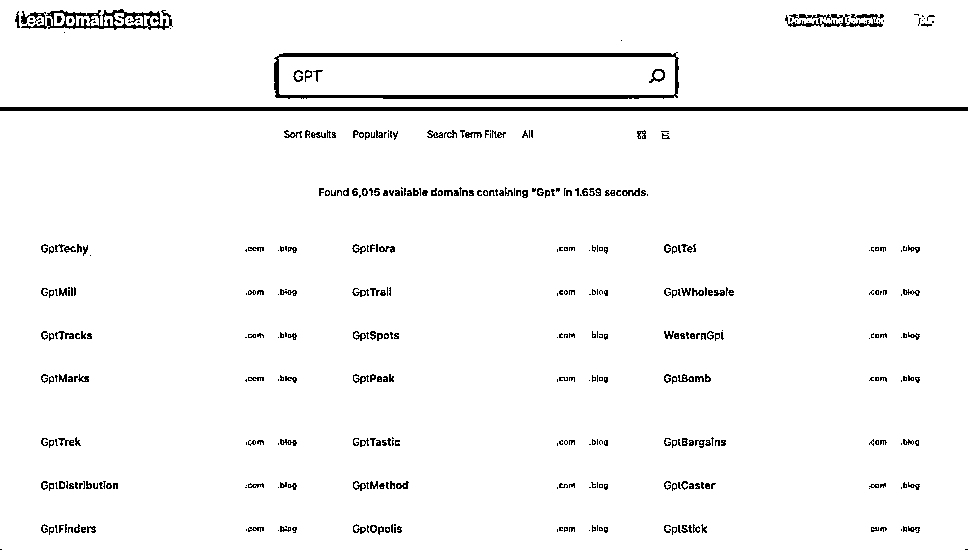

 

 

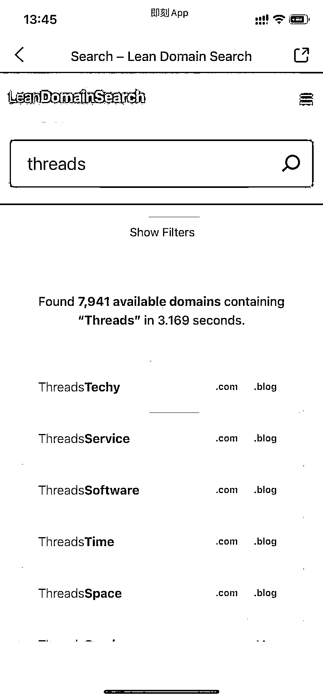

 

 

 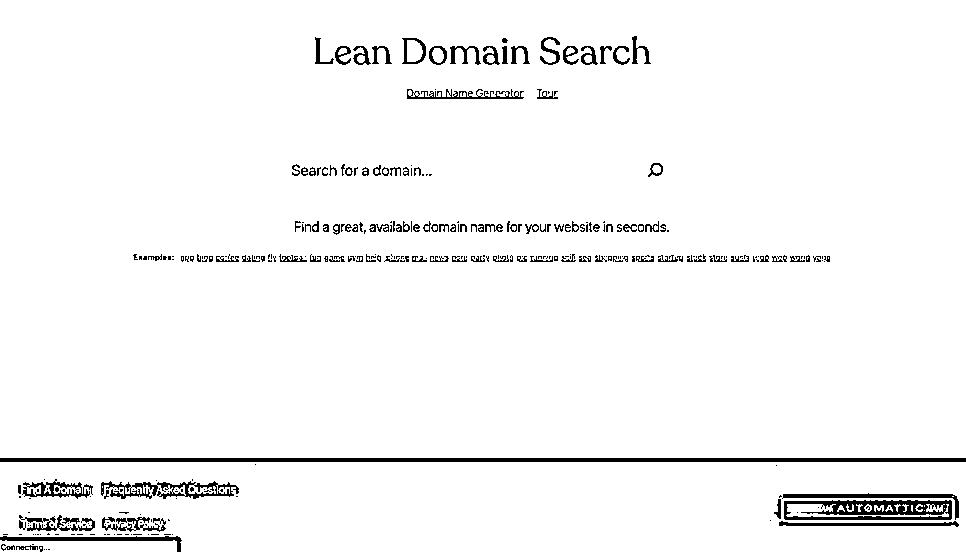

评论区：

木桶伯 : 试试秋玉米

三林 : 不一样的，秋域名的作者赞扬了这个产品：这个好。

三林 : 不止是批量查询，核心是取名、组合

亦仁 : 中标，术值+1。

 

 

在上方专栏点击 #中标，可查看所有中标风向标

胡二虎🐯 : 这个好，之前我都是用脑子想，自己排列组合

胡二虎🐯 : 它是不是在GPT上有插件？怎么看着有点眼熟

三林 : 这个不知道呢  你可以确认一下。  因为现在也有一些工具 ai domain generator 工具

三林 : 识货

# **# ****(67**赞**)ChatGPT **应用生态之浏览器插件观察

作者：  三林

日期：2023-03-24

【ChatGPT 应用生态之浏览器插件观察】

大家好，我是三林，目前在生财有术团队担任产品经理，负责航海产品等。于本周三晚在『英文工具站』航海的群内分享。我来分享一些围绕 ChatGPT 而做的第三方浏览器插件产品，他们是如何做的产品定位和一些体验思考。

为什么说浏览器插件是一个合适的产品形态？  因为 ChatGPT 官方是一个网页版，浏览器插件是对网页的 Enhance，在用户熟悉的场景下做的体验升级，贴合用户习惯，乐于使用。这弥补了原生产品的不足，相当于站在巨人肩膀上做事。

本文提到了十来款浏览器插件，包括两大类：提示语模板类，和效率工具类（附图）  ……

总结，我从这些产品里我学到的认知：

1、从面向 Google 编程，到面向 ChatGPT 编程；相信开发者圈友们感受很深。

2、ChatGPT 是魔法百宝箱，密码就是 Prompts，这是流量密码，也是财富密码。

3、浏览器插件只是一种产品形态，开放了 API ，可能性就太多了。一句 Prompt 等于一个 Mini tool，一套 Prompts 等于一个 Mini SAAS；

4、思考符合自己业务需求的场景，大胆用 ChatGPT 为自己和业务赋能；

 

 

5、最后也是最重要：鉴于原生体验、内容安全，建议创业者们出海，这也是我们做英文工具站的意义。

————

注：这里的「插件」不是今天凌晨 ChatGPT 开放的插件能力 Plugins ，而是指以  Chrome 为主的浏览器插件。  新的插件 Plugins 波澜壮阔，我后续再写下一篇。

https://shengcaiyoushu01.feishu.cn/docx/A27Md68WVox13FxPZFeczOVgnKc

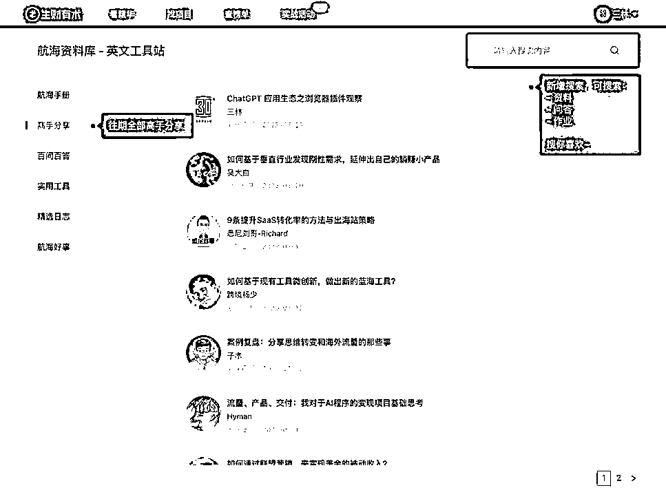 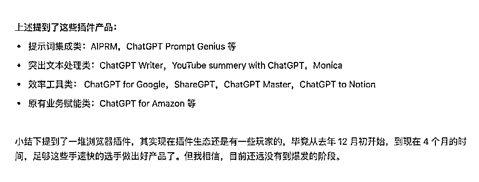

 

 

评论区：

暂无评论

# **# ****(42**赞**)**亚马逊**+Midjourney=**新机遇？

作者： Violet

日期：2023-03-09

亚马逊+Midjourney=新机遇？

哈喽哈，我是小紫，一个产品转化做到79.3%的亚马逊操盘手。

这段时间小紫简直对AI是一整个痴迷的状态。

原本是为了提高效率让助理去研究AI，结果我自己却陷进了Midjourney（AI绘画工具），连玩一周。

可以说，Midjourney给我在图片领域带来的震撼，以及它将对设计领域的颠覆，完全不亚于ChatGPT对文字领域的带来的重塑和解构！

本文主要讲我的一周Midjourney体验过程、感受与总结。

全文链接（全文看完大概5分钟）

————

https://infinitereshaping.feishu.cn/docx/SibhddFTZonIEKxUBs9cMvH9nEf评论区：

wilsion亚马逊 : 亚马逊和midjourney怎么结合一起用呀？生成产品详情页吗？

星海 : 可以图生图吗？

Violet : 可以的，/blend指令就是图生图的

Violet : 是的，Ai是可以调教的，你也可以生成你想要的素材，再把自己产品揉进去就行  wilsion亚马逊 : 有没有调解成功案例参考下，我调教的都不是很适用于亚马逊的详情页[流泪][流泪]

Violet : 哈哈哈~我的建议就是多参考参考频道里大神的关键词，我给你案例生成出来的 

 

也不一定是你需要的

飞奔的白羊古城 : [强]

# **# ****(38**赞**)**结合** AI **绘画和按需印刷开发一些产品

# 出海

作者： MC

日期：2023-02-28

可以结合AI绘画和按需印刷开发一些产品出海，有一家叫指纹科技的公司

提供了个性化印刷供应链，覆盖了非常多的品类还提供了低门槛的独立站方案

https://www.hicustom.com/wap?ad_code=HR8EFHUEB87Q评论区：

亦仁 : 中标，术值+1。

在上方 #星球栏目  专栏中，点击 #中标，可查看所有中标风向标。

秋冬。 : 插眼

暗淡枫叶 : 这是什么意思，不太懂[发呆]

# 【广告投放】**1**篇

# **# ****(**精华帖**)(45**赞**)**高效使用广告聚合** & **优化竞价

# 策略，让海外应用广告收入提升** 30%**

作者： Louisa

 

 

**1. **使用合适的广告聚合

**2. **接入合适的广告平台

**3. **优化竞价策略

日期：2022-02-24

各位生财有术的圈友们，大家好！我今天要分享的主题是，零变现经验，如何通过正确使用变现工具，让海外应用广告收入提升 30%？

首先先简单自我介绍下，我叫 Louisa，有多年海外变现经验，在休闲游戏及非游领域如工具、资讯、社交均有研究；深入了解出海广告变现原理，通过自行总结的广告变现方法论，成功实现数十款产品从 0 到 1。

接着迈入今天正题，每一位开发者都想要获取有价值的用户从而盈利，而有效变现的其中一个方式便是在应用中植入广告。这种方式也非常简单 —— 即设置广告位、嵌入  SDK 等。即便应用中已接入广告，也不表示该广告自身就会带来良好的收入。因此，需要正确使用变现工具。

通常对于变现新手来说，大家获取信息的方式一般都是通过谷歌广告联盟和 Facebook 开发者等知名广告平台、海外优秀开发者经验分享，我相信大家都听说过「利用广告聚合可以最大限度提升广告价值」的说法。这些官方渠道以及游戏开发者经验，当然有一定的借鉴意义，但是总体而言，知识点较为零散，没有形成完整体系，新手难以上手：

这些平台更多是案例介绍、经验分享，都是比较零散的知识，并没有可以直接上手的方法论告诉新手，如何高效使用广告聚合从而获得高收益。

今天我就想结合个人的经验来讲讲，如何正确使用广告变现工具，让海外应用广告收入提升 30%。我会就以下三个关键步骤来展开：

 

 

**—01—**

选择合适的广告聚合

首先，解释一下什么是广告聚合以及为什么要选择使用广告聚合。

在没有广告聚合的时代，开发者如果选择接入多个广告平台，会根据不同广告平台的数据做出判断，有针对性的切分自己的流量，比如先请求广告平台 1，其次广告平台 2、3，使自己的广告填充率大幅提升，从而做到变现效益的增加。

但是这一做法有着不可忽视的短板，它是需要牵扯大量研发精力，多个 SDK 的接入以及流量切割均需要研发去做大量的代码处理；其次，广告平台的数据并不是一成不变的，人为依赖研发的进行流量分配，有一定滞后性。

至此，广告聚合应运而生，大大解决了这一困境，开发者可以同时把广告请求发送给多个广告平台，它们通过各个广告平台进行竞价，从高到低依次排序，解决了广告填充率以及变现效益的根本问题（具体可以参考下图）。

 

 

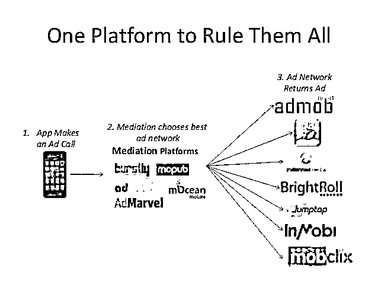

所以这就是为什么我们必须使用广告聚合的原因。

再来说说，广告聚合有哪些？

自建聚合 SDK 技术门槛高，且需要不断实验、更新及优化，需要长期投入时间和精力，不适合中小型开发者，多数开发者还是会选择三方入门。市面上已经有很多相对较为成熟的三方广告聚合，主要分为国内公司提供的广告聚合和海外广告提供的三方广告聚合（具体可参考下图）。

 

 

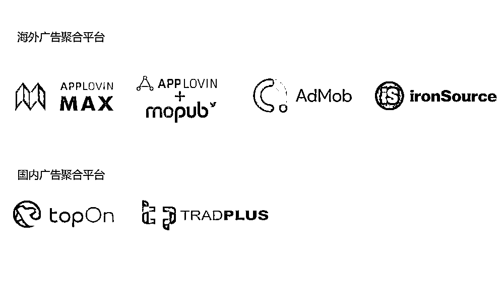

那么面对市面上这么多聚合产品，如何选择合适的聚合平台呢？

我在刚开始选择聚合的时候，也有一样的困惑，所以我尝试过很多聚合，为了比较哪个广告聚合变现效率最高，我做过实验，将同一产品及同一竞价策略配置到不同广告聚合上进行 A/B Test，最终得到的人均广告展示次数及 ARPU（每用户平均收入 = 收入 / 日活跃用户数）是相近的。

所以，这里我觉得不需要纠结哪个聚合变现效率高，更应该考虑以下** 4 **个衡量标准：

**1**）接入及运营成本：是否容易接入？操作是否简单易懂？

**2**）支持的广告平台及广告类型：聚合是否能够支持产品所需的广告类型和尽可能足够多的广告平台？

**3**）平台稳定性：是否有强大的技术团队支撑，能够提供稳定服务？

 

 

**4**）实时竞价：实时竞价相比传统瀑布流，减少人力成本以及减少延时等问题发生，是未来广告竞价的发展趋势（这部分内容会在第三部分重点提到），所以「是否支持实时竞价」应当考虑在其中。

拿自己的故事举例来说，我在今年 6 月入职了一家新公司，由于公司主要是一家以海外工具为主的开发者，所以能支持原生广告且较为成熟的海外聚合只有 Mopub 和  Admob。

公司最开始使用 Mopub 聚合，但由于公司新产品线不断扩张，变现人员不够，Mopub 较为繁琐的瀑布流设置已不适应公司发展需要，我们切换为 Admob 聚合，大幅度人工运营成本，降低了避免未及时调整 eCPM（千次广告展示收入）而造成收入的下降。

所以，我认为各家广告聚合在以上的 4 个衡量标准都有自己的优劣势，最后落实到一个问题，你的产品更在意什么，才能辅佐你的团队更高效进行变现，才是决定使用哪个广告聚合的最终原因。

**—02—**

选择合适的广告平台

接下来，选好了广告聚合，我们需要考虑接入哪些广告平台。那么选择广告平台的衡量标准又是什么呢？我认为主要可以分为以下几个：

**1**、广告样式是否能满足需要？

 

 

常见广告形式包含激励视频、插屏、横幅、原生（如下图）。游戏广告收入的主要组成部分是插屏和激励，因此选择广告平台的时候尽量选择插屏和激励效果较好的广告平台；但工具类应用包含大量原生广告收入，并不是所有平台都支持原生广告样式，所以需要考虑。

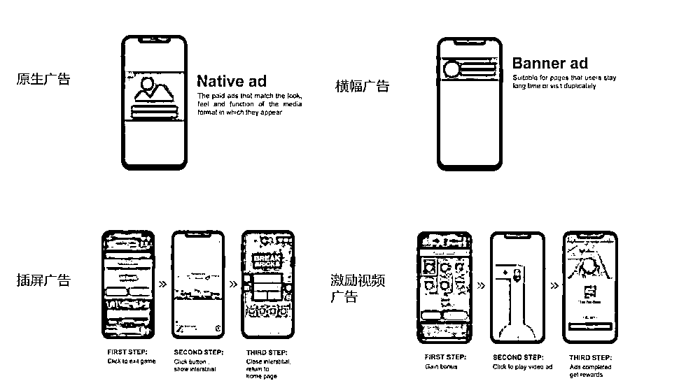

比如 Vungle 广告平台可支持的广告类型如下图，仅包括插屏、激励视频、横幅广告（其中 MERC 及 Banner 均属于横幅广告的一种，只是尺寸不同）。所以 Vungle 并不支持原生广告，工具类应用可能需要考虑其它广告平台来作为原生广告收入的补充。

 

 

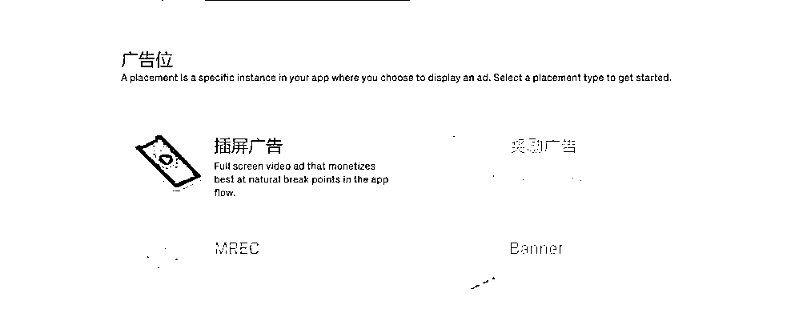

**2**、考虑地区及用户差距

不同广告平台的在不同国家的表现差异是非常大的，开发者要结合自己流量分布的情况选择合适的平台接入。如果对海外广告平台不够了解，可以参考 Appsflyer 等三方平台出具的广告平台综合表现报告，对各个国家的常见广告平台优先接入。

AppsFlyer《广告平台综合表现报告》（第十三版）链接如下：

https://mp.weixin.qq.com/s/oacs2QQ0eVlX7Njv_si9Qw我们可以通过查看对应地区、产品类型、选择对应规模较大的广告平台接入，如下图：

 

 

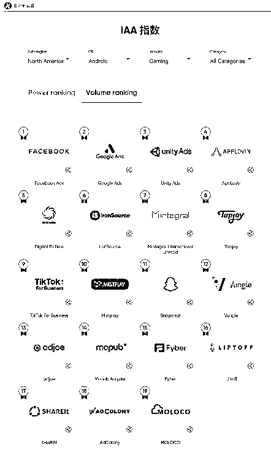

**3**、集成及运营的便捷性

选用的广告聚合是否支持该广告平台？是否支持实时竞价？

 

 

如果必须 SDK 接入，还需要考虑 SDK 的大小，是否会影响应用初始化？

以 Google Admob 中介为例，官网上清晰注明哪些广告平台是支持实时竞价，且是否需要接入第三方 SDK；如果广告平台支持实时竞价且不支持第三方 SDK，那接入及运营成本相对较低，可以优先考虑。

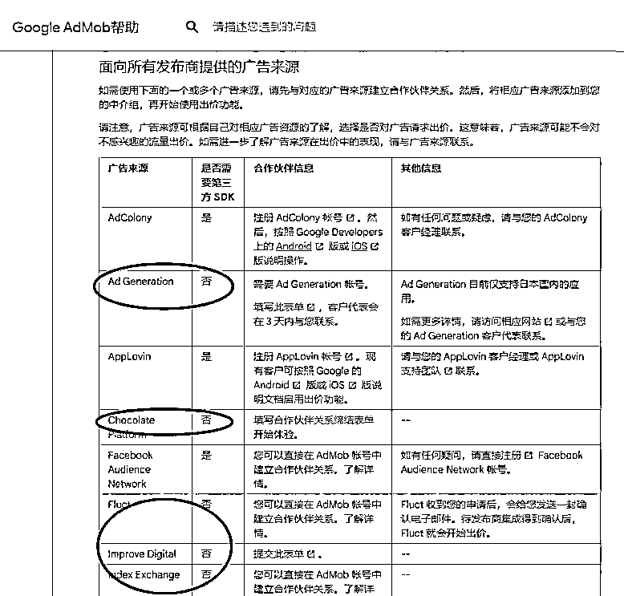

讲讲自己的变现故事：

 

 

我初步接触海外 APP 变现是源于工作岗位变动，转去负责休闲游戏广告变现工作。当时，我们部门的目标是希望通过流量变现，年底前实现收入翻倍。当时海外 APP 变现对我来说，是完全陌生的领域。所以，我通过上网搜索官方资料，建立初步认知，我当时关注的是：谷歌广告联盟和 Facebook 开发者，从中我了解到即便游戏中已接入广告，也不表示该广告自身就会带来良好的收入。提升广告的 eCPM 需要通过使用广告聚合，同时设置瀑布流策略并持续进行优化来实施。

我当时的认知里，了解的广告平台和聚合并不多，所以我当时本着便利的原则，接入了  Admob 聚合，同时在里面增加了 Facebook 广告平台和 Unity 广告平台。最早对瀑布流的设置并没有经验，每天频繁修改价格、看数据，导致前后一个月，广告 eCPM 和广告填充均没有提高，且多数广告收入均来自于 Admob，Facebook 和 Unity 的填充较少。

后来，我和其他变现前辈了解到，光 3 个广告平台是不足以进行充分竞价的，我还添加了 Ironsource、Vungle、Applovin3 个广告平台同时进行竞价，广告收入在两周内提升了 20%。

广告聚合可以让应用同时把广告请求发送给多个广告平台，各个广告平台进行竞价，从而提升每一次广告展示的价值。竞价的核心肯定还是在于有足够多的广告平台进行竞争，尽可能多接入合适的广告平台是提升广告收入的关键。个人建议参考以上标准，前期至少接入 4 家广告平台，后续可拓展至 8 家左右。

**—03—**

调整竞价策略

最后，也是比较关键的一点，需要聊聊如何通过调整竞价策略，提升整体的广告收入。

首先来聊聊市面上的 3 种竞价策略是什么。

 

 

**1**、传统瀑布流（**Waterfall**）

瀑布流模型（Waterfall）是传统用于应用广告的变现模型，开发者预先给各个广告平台设置预期 eCPM（千次展示收入）出价，并进行优先级排序。如下所示，A、B、C、D 四个广告平台分别被设置为 $12、$10、$9、$7。当用户触发广告时，优先给出价最高的广告平台 A（价格设置为 $12）展示机会，如果该平台不填充则会流至出价第二的广告平台 B（价格设置为 $10），通过漏斗的方式，直到有广告被展示。

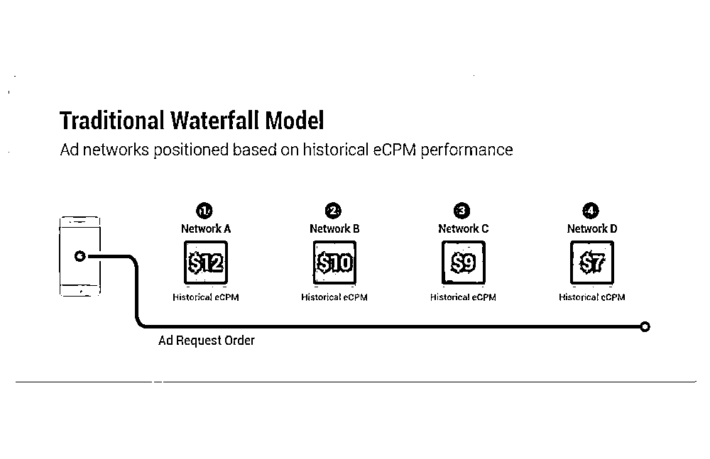

**2**、实时竞价（**Bidding**）

在传统的瀑布流，想要填充一次展示，广告平台需要排队出价，直到广告位得到填充。

广告平台按历史 eCPM 均值顺序排列，这样的竞价机制会造成延迟，同时也会错过许多高出价机会。

 

 

由此，演变出实时竞价这一种模式，该模式下，所有广告平台同一时间进行出价（如下图 1~3 步），3 个广告平台分别出价 $9、$12、$15，1 个广告平台不参与竞价（如下图第 4 步），最后出价最高的广告平台即 $15 获得该广告位的展示机会（如下图第 5~6 步），从而让开发者获得更多收益。

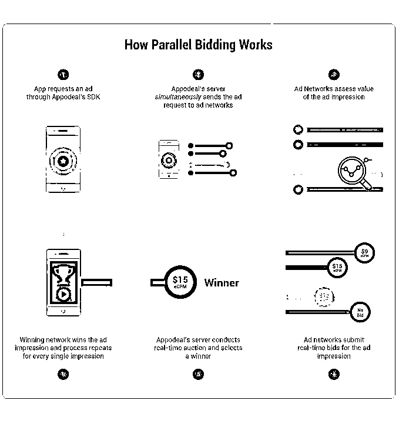

**3**、混合模式（**Bidding+Waterfall**）

 

 

然而，现在最常见的是混合模式，这是由于实时竞价是一个较新的概念和技术，一些广告平台暂不支持实时竞价。目前行业的趋势走向，短期还是会以一种瀑布流加上实时竞价共存竞争的形式存在，但长期则会逐渐转变为实时竞价的这种变现模式。

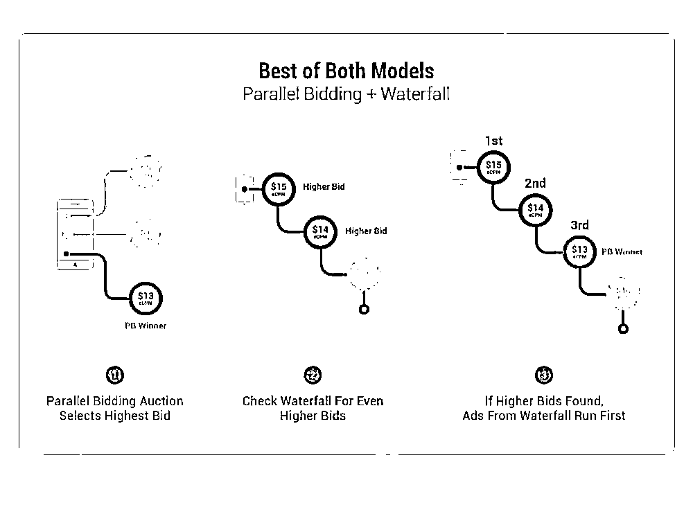

当 APP 发起广告请求后，聚合平台优先请求 Bidding，随后三个广告平台同时出价，价格最高的胜出即 $13（如上图第 1 步），接着 Bidding 胜出者会和传统瀑布流中的各个分层进行比较（第一层 $15，第一层 $14，一直请求到第三层 $13，如上图第 2 步），如果前两层瀑布流 $15 或 $14 的广告平台能够被填充，则会优先展示瀑布流对应层级的广告，如果没有，则展示 Bidding 中胜出的广告平台 $13（如上图第 3 步）。

了解清楚聚合的竞价原理以后，我们再来聊聊混合竞价模式之下，以 IronSource 中介为例，我们该如何进行运营操作，提升整体的广告收入。

 

 

首先，Bidding 层采取实时出价的方式，只需要支持 Biding 的广告平台加入其中（如下图所示），不需要设置价格及顺序。但注意：如果某个广告源在 Bidding 层已经设置，则无需在瀑布流中配置，因为对于同一个广告平台来说，两者只是竞价模式的差别，广告平台一般会默认优先走 Bidding，瀑布流将得到极少的曝光机会。

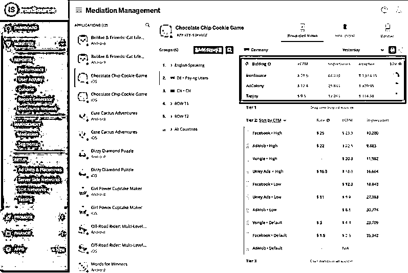

由于 Bidding 是无法控制价格的，所以这里我们唯一需要人工运营是瀑布流层面。如下图 Tier1、Tier2、Tier3 所示，Tier1 为最高优先级的交易，即直客等；T3 为空白流量的填充，即自有广告等。这两个使用的相对较少。

 

 

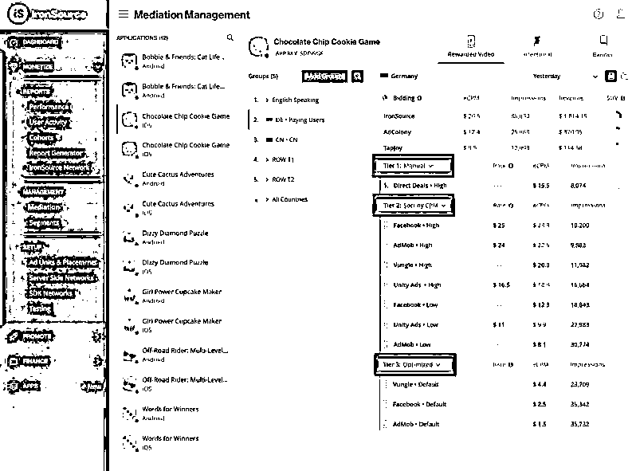

我们一般使用 Tier2 层，把价格分为头部、中部、底部，头部抬高价格（高于 Bidding 整体 eCPM），保证高价卖出；中间部分要保证一定填充和展示（与 Bidding 整体 eCPM 持平）；底部低价或者无底价处理。

瀑布流设置上，我们还需要注意：各个之间有一定落差，分层不至于过密，导致广告请求浪费。广告填充低于 10%、广告展示量低于 1000 的层数可以选择合并；平台之间的分层要交替排序，不交替的话，那意义就不是就不是很大了。因为连续两次请求同个广告平台，广告平台缺乏竞争，容易出低价广告。

最后，对收入贡献大的发达国家、流量占比较大的国家（用户基数较大但 eCPM 不高的发达国家），单独配置价格，从而提升重点国家的收入。

 

 

以 Ironsource 中介为例，它提供了分组功能，比如下图将英语国家列为一个分组，在  Group 中勾选相应国家，则可以设置一套适合英语国家的竞价策略。

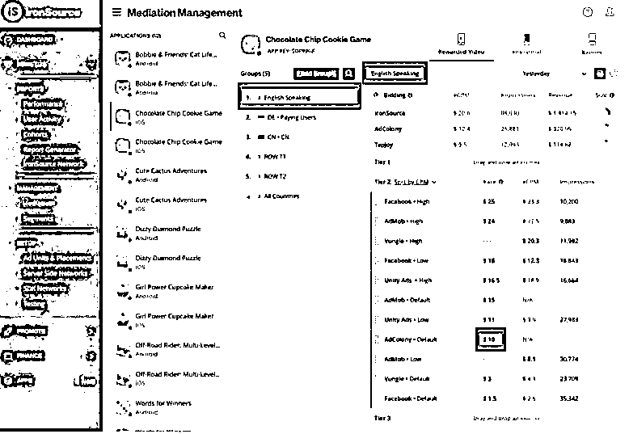

如果针对某一个国家设置竞价策略，比如下图针对澳大利亚进行单独设置，则可以直接选择该国家。

 

 

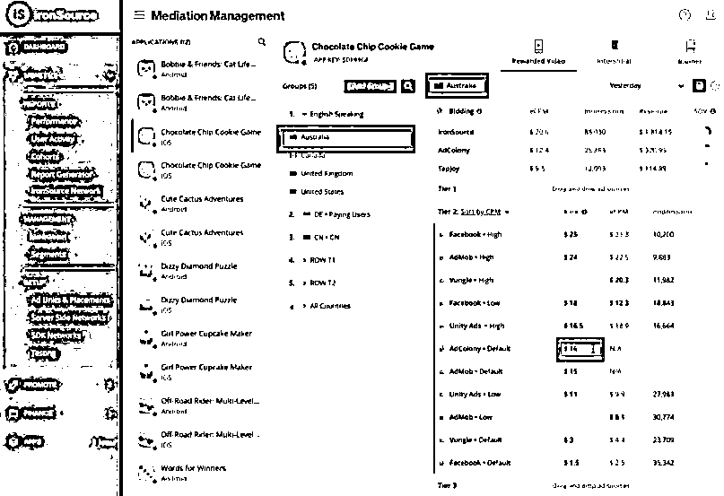

至于调整完以后如何判断好坏，每次调整完以后，我们可以通过 ARPU（ARPU = 广告收入 / 日活跃用户数）是否提升作为判断依据。同时，时间频率不能过于频繁，刚开始可以比较频繁，但是最频繁频率不能低于 3 天（机器需要学习时间）；后面可以延长调整频率，以周为单位修改。

最后，讲了这么多，说说自己的故事吧，配置合理的竞价策略对我们的广告收入有多少提升呢？

接着第二部分的故事来说，首先当时的背景下，FB 仍然是支持瀑布流运营，现已全面改成 Bidding。

 

 

当时，除了增加 3 个广告平台，后来我还发现了一个造成之前 FB、Unity 填充率较低的原因，巴基斯坦、印度等国家广告填充率较低，影响了整体填充率，针对填充率较低的国家我单独设置了价格，FB、Unity 高价区的填充率上升。而且同时，这个时期，我了解到了广告竞价的原理，把握了调整的原则，单次尽量只改动 1 个变量，同时频率不低于 3 天，不会打乱原本的广告算法和做出错误的调整。

最后，当时我主要负责的某款产品在 1 个月内，没有改变广告位设置的情况，现有广告收入提升 30%。

好啦，如果你还不会使用广告聚合这个工具提升自己的广告收入，希望这篇文章能给你一些启发。

评论区：

亮~ : 写的很详细[强][强]，admob确实是海外首选，特别是要上gp，也能避免一些政策问题

亦仁 : 感谢分享，已加精华。

于源 : 开眼

张耘瀚 : 在这里又见面了

# 【赚钱案例】**8**篇

# **# ****(**精华帖**)(508**赞**)**利用** GPT4 **迅速将想法落地，

# 让创意在半天时间内变成** MVP**！

 

 

作者： do小鱼

日期：2023-03-20

上周五在风向标看到一位圈友发布的消息，通过GPT可以完成创业想法的落地执行。

看完以后立即行动，利用GPT4迅速将想法落地，让创意在半天时间内变成MVP！

更多细节，欢迎阅读我的复盘文章  👇

《如何通过风向标发掘机会，靠GPT辅助实现MVP最小可行性产品》

我是如何通过风向标拆解机遇，诞生产品想法

如何利用GPT来执行落地，将想法变成MVP

实操后感受：如何基于GPT，开发更多的能力

图文较多，详情请移步飞书阅读  👉

https://u0ry0qxjdd.feishu.cn/docx/Zl9zdlsffoXMOIxIk9Ac0sIenje评论区：

上杉砍柴… : 优秀啊

茄子 : 沙发

高杰 : 执行力超强[强][强]

A潘典  君和联行 : 非常棒的想法和执行力！

茄子 : 前面的挖掘风向标机遇，拆解风向标，串联风向标跟我目前的操作好像，感谢给出了范例，后面还有利用chatgpt做出产品MVP超精细化落地记录，给力  希声 : 厉害厉害 

芷蓝 : 这等于是帮创业者细化了每一个步骤的执行颗粒度，太牛了

清梦 : 厉害 

# **# ****(**精华帖**)(411**赞**)**失去** 5 **个月销** 700 **万级的大

# 站后，我如何用** 120 **天的时间再造一个月销** **

# **1500 **万级的新站

 

 

作者： 1亿美金站长阿发

日期：2021-05-11

今天就要从第一期的龙珠俱乐部毕业了，这段时间学习和成长了太多，非常感谢生财有术和龙珠俱乐部，写下这篇就当是我的毕业小论文。

先给大家简单介绍下自己，我是阿发，花过1亿刀预算的独立站站长，曾经担任过中国出海50强品牌的独立站负责人以及跨境电商独角兽Fordeal的渠道投放负责人，操盘过多个爆品站，精品站和品牌站，目前已经从公司离职，开始自主创业了。这篇和大家分享下我是怎么在失去5个月销700万级的大站后，用120天的时间再造一个月销1500万级的新站的。

爆品站疯狂起量

2016 - 2018年，独立站Dropshipping（海外版一件代发）的模式刚刚开始爆红，这个时候跑的最多的是爆品站，爆品站就是市面上什么红卖什么，什么可能火就卖什么，基本没有什么垂直细分。这边我先解释下，啥是Dropshipping（海外版一件代发）以及为什么在那个时候这个模式会突然爆发。

Dropshipping呢，简单来说就是卖家自己本身并没有这个产品并没有库存，只是在自己的网站上给这个产品做营销，消费者从卖家这里买了产品之后，卖家会让供应商直接发货给用户。如下图

 

 

这个商业模式的好处是：(1) 没有库存，基本不存在压货，不用付商品的仓库存储的费用，不用处理商品的物流运输 (2) 初始起步，资金压力较小，不用提前备货，可以等确实能起量的时候再大量买货 (3) 不用担心物流发货，可以把所有的精力和资源投入到站点建设，营销，或者客服等方面。新手入门用的最多的供应商其实是速卖通，因为发货足够便捷。那么可能有朋友会问，既然你是从速卖通进货，那用户为啥不能直接从速卖通买呢？

原因很简单，因为卖货这个东西从来不是货在谁手里，谁就能赚钱，很多时候也不是谁便宜谁就能赚钱，而是看谁先接触到用户，先把用户说服，谁就能挣钱。

如果货在谁手里，谁就挣钱这个逻辑成立的话，那中国最大的toC电商网站之一应该是1688.com，不对，按这个逻辑下去可能都不应该是1688.com，全国人民直接从各个工厂直接买货岂不是更便宜？  接触用户，说服用户都是需要花费精力和成本的，不是随随便便就能做成的。

 

 

那又为什么这个模式在那个时间段爆发呢？因为有三个很重要的问题被解决了  （1）货：阿里巴巴的速卖通Aliexpress在那个时间已经相对成熟了，上面找货，发货什么的很方便。

（2）建站：以前建一个能卖货的独立网站对大部分人来说还是有点难度的，毕竟之前的建站工具都不是那么傻瓜好用，直到Shopify出现并把建站这件事情的门槛降低到几乎没有，现在任何一个有网，有电脑的人，要建一个能卖货的站可能只需要1，2个小时（当然你要精心装修的话肯定还是要时间的）。但建一个能卖东西的站，已经几乎是没有门槛的了，即便你不懂任何技术。

（3）流量：Facebook在那段时间在加速自己商业化的进程，卖大量的广告，且那个时候Facebook的广告还不是那么贵，监管相对宽松，但流量的质量很好，转化很OK。所以那个时代最流行的独立站跑法也有人叫 Facebook + Shopify跑法，就是用Shopify建站，然后打Facebook广告引流卖货。

我当时靠做爆品站获得了大量的销量以及利润，最多的时候同时有5个爆品站（其中一个是女装爆品站，其他的都是常规爆品站），每个站每月都能有700万人民币左右的营收。下图是当时几个跑起来的爆品站之一，在起量之后，很长一段时间都有平均每月100多万美金的营收，很可惜后来因为客服，售后，供应链等问题，没能持续做下去，域名也已经被废弃了，现在再输入这个域名会去到别的乱七八糟的网站，大家不要尝试去输入了。但在trustpilot上还能搜到这个网站，有217条评论，做过的人都知道trustpilot上能到217条评论代表着这个站曾经有过很大的流量。

这里跟大家分享一个爆品站找品的小技巧，就是利用社交媒体，以及专门的礼品网站去开发爆品。

 

 

社交媒体的话，推荐一个不太常规的，但是很好用的，https://www.reddit.com/  可以认为是英语世界版的百度贴吧，但是这个贴吧的活跃用户极其多，流量非常巨大，上面很多版块的热度都是很高的，而且很多潮流其实都是先从Reddit开始然后才到Facebook这样的媒体爆起来的，所以直接关注Reddit就相当于直接关注了英语世界潮流的源头。那有朋友可能会问，那么多版块，我要关注哪一个呢？  我觉得

https://www.reddit.com/r/shutupandtakemymoney/  ；

https://www.reddit.com/r/BuyItForLife/；

https://www.reddit.com/r/FindItOnAmazon/  这三个都是直接和人们的购买欲望相关的，大家可以多上去看。

另一块，礼品网站。为啥会推荐礼品网站呢？因为这些网站为了能更好的生存下来，他们一定会去搜罗最新奇特，最有意思的，最流行或者可能流行的产品来卖。我们直接跟在他们后面看他们的研究成果岂不美哉。这边推荐两个

http://www.dudeiwantthat.com/；https://odditymall.com/  都是做的很好的礼品网站，没事可以多去看看的，他们有的时候卖的一些东西我自己都会忍不住想买。

爆品站好的时候，当然赚钱很爽，但任何生意都不可能永远一帆风顺的，爆品站这盘生意也是如此。

变局突起

爆品站的业务跑了快一年，随后碰到了一些问题。首先是女装的站，虽然销售额上升了很多，但是慢慢的公司在服装供应链和设计上的短板开始显现出来，女装业务后面很难获得增长。其次是常规爆品站也受到越来越多的限制，不管是广告平台还是支付平台对售后服务这块的要求越来越高，越来越严，而常规爆品站由于本身特质的原因，很难把物流，供应链，客服做的很完美，即便我们已经很努力去做，最终的结果和平台要求的还是存在差距，此时平台就会对我们的站做出一些限制，导致整体赚起钱来也没有那么舒服了，且爆品站很难有什么积累，对团队长期的建设和积累不是那么有利。

 

 

看着高昂的各种成本以及衍生出来的各种问题，老板决定让团队先暂停，让我们自己去重新思考要做什么业务，我们可以获得新的内部创业的机会，公司会拿资源支持，对这个业务只有一个要求，能赚钱，且有潜力长期去做。

其实我自己也一直想做更加长期的事情，做爆品站做到最后挺空虚的，除了赚钱，其他的也留不下啥。于是我连夜做了20页的ppt好好阐述我想做的事情。这个事情其实说起来没有那么复杂，就是(1) 选定海外一个垂直细分领域  ，并选好品（2）通过Dropshipping（海外版一件代发）的方式先开始卖起来，然后销量稳定之后可以开始自己囤货整仓库，并做贴牌，再往后可以深入供应链端，最后可以真正得把这个站做成一个品牌。

我和老板诚恳的聊了2个小时，说清楚了未来的规划，以及实施的步骤，老板觉得我的想法OK，给我重新安排了几个人加入我的团队，让我先去干起来。

令人头痛欲裂的选垂直细分领域** + **选品

团队有了，马上要开始做业务了，第一个令人头大的问题就是，网站选啥垂直细分领域选啥品？这个几乎是做独立站开头最重要的一件事，如果没有做好，一个站基本就废了，如果做好了这个开头，后面很多都是顺理成章的事情。

我们测试了很多方法，看电商平台的数据(比如ebay和亚马逊)，看各种其他站点的数据，这样能选出一些，但是选出来的最后测试下来效果都一般。正当我们快要绝望的时候，我们想，既然我们前期主要是要通过付费推广的方式去做，那直接看别人的广告不是来的更快么？

说干就干，我们第一个想到的当然是找直接的能监测广告的平台，最后找到

https://adspy.com/，这个我们发现是最好的，最及时的Facebook广告的收集和监测网站，去看最近到底什么样的东西和品类比较好卖收集下来作为备选。

 

 

然后我们又发现一个问题，光靠这个广告监测网站还是不够有效，虽然量很大，能作为一定的参考，但是监测的网站的抓取很多时候还是不够及时，参考意义有限。那怎么样才能拿到最新最热的Facebook的广告呢？我把目光放到了我自己平时上Facebook的时候会出现的信息流广告上。

Facebook的广告推送形式有点类似朋友圈广告，就是你正常刷的话会刷到很多你加的好友的动态，你关注的明星的动态，或者你关注的某些主页的动态，但是在这些动态里面会夹杂这一些广告，比如我下图列出来的这个红框的地方标识着“Sponsored”说明这是一条广告。

我们日常在刷Facebook的时候偶尔会刷出来这种广告，很多人可能就没在意，看一下就算了。但是我发现有时这种信息流里刷出来的广告，很多都是广告监测工具里没有的，很多是一些比较新秀的站点投放的。

我就想怎么能让Facebook给我推更多的，且质量更好的广告呢？我去了解了一下Facebook给用户推送广告的机制。他们的系统里会给每一个人打标签，比如你这个人买过很贵的奢侈品，那系统后面就会给你推更多的奢侈品的广告，你买过很多奢侈品，那系统就会标记你为“常购买奢侈品的高价值人群”，之后如果有新的奢侈品站投放广告的话，系统很容易就会把广告推给你，因为系统觉得你很有可能购买。

 

 

当然Facebook的系统能收集到这个信息，有两个前提，[1] 你的Facebook个人号在浏览器里是开着的，或者你就是直接从你自己的Facebook信息流里去的这个网站购买那就更好。[2] 这个网站本身有安装Facebook的广告追踪代码。这两个前提条件缺一不可。所以想让Facebook的系统给我们推更多质量更好的广告的方法就是我们去我们感兴趣的这些站点去直接购买，买过的越多，我们在系统里的价值就越高，系统就会给我们推越好的广告。

然后就是开始实操环节，我先拿自己的号做实验，首先我在做这个事情的时候都会在浏览器开着自己的Facebook个人号。然后我当然不可能去全部真金白银花钱去买这么多货，我怎么办呢？用Paypal （相当于国外支付宝）去这些站购买产品，然后在产品发货之前要求退款。

为啥特别强调用Paypal呢？因为[1] 国内的visa和master信用卡，有时也能正常购买，但有时不能，效果不稳定。[2] Paypal对买家的保护比较好，基本用Paypal的卖家都会非常害怕买家通过Paypal投诉，因为Paypal接受的投诉多了轻则冻结资金，重则暂停账号，所以基本没有卖家会没事干找Paypal的麻烦。

况且你在商家发货之前(可以尽量早点，退货理由就说是自己买错了，卖家也不容易，也别太为难别人)，就和卖家说，卖家基本都会很痛快得给你退掉。商家不理你的话，很简单，直接去Paypal投诉。个人Paypal申请很简单，我就不说了。

然后就是我怎么找到那些初始的可以去关注的网站去做这个购买动作呢？

https://myip.ms/  登录这个网站，然后输入以下四个ip中的一个<23.227.38.32> <23.227.38.64> <23.227.38.71> <23.227.38.68>然后如下图，点击Other sites on IP,

 

 

你就能找到大量的利用Shopify这个建站工具建的独立站店铺，而且基本是按流量大小顺序给你排好的，直接去看即可（推荐安装一下similar web这个谷歌浏览器插件，可以看到网站的具体流量，也可以安装一个commerce inspector插件，可以看到这个站的热销品）

这个方法的原理是，Shopify是用的加拿大服务器，所以基本所有用Shopify的店家都会在几个固定的ip上。

补充下，需要确定对方的网站上有没有Facebook的广告追踪代码，可以安装谷歌浏览器的插件Facebook Pixel Helper查看。

 

 

OK，现在网站也有了，刷购买的方法也有了，我就开始猛刷，当然保险起见，建议和小伙伴们多整几个Paypal号分开刷，否则你老做购买退款的动作，Paypal也可能反过来查你。

当刷了足够量之后，我发现我和我的小伙伴的Facebook信息流里开始出现了大量的优质的，且新的广告，然后大家把这些广告收集下来，放一块儿分析和测试。这里再顺便推荐一个谷歌浏览器的小插件 My Ad Finder就是能让你的Facebook信息流只展示广告，不展示普通的帖子内容，用来刷广告非常合适。

经过一小段时间的测试，我们找到了可以继续专注的垂直细分领域以及这个细分领域里可以跑的品，第一个难题解决了。

用户来了，不买怎么办？

垂直细分领域确定了，站建好了，品上传好了，第二个问题接踵而来，用户进来了，但转化率很低，只有1%左右。我们花钱买了很多流量，到了网站里转化的却很少，导致整体没法赚钱。

 

 

我们把自己的落地页去大量对比那些卖的好的站的落地页，发现我们差的最远的地方，不在图片，不在用户评论而在产品描述。这是一款功能性的产品，如果你描述完用户没有感觉的话，那转化率自然就会很低。

我们一开始的页面描述是直接用供应商的信息，里面很多都是参数性的东西，比如产品长宽高多少多少，镜头多少多少像素，续航时间多长多长等，而且充满了大量的平铺直叙。

这就像什么呢？像一个自己为是的推销员，在推销自己的产品，上来就说我们产品如何如何如何，完全没考虑消费者的感受和接受程度。我们发现我们那些做的好的竞争对手都是用下面这个公式来写产品描述的：

首先把一个产品的描述分为三个部分：[1] 提出问题，以及强调问题的严重性 [2] 抛出解决方案，以及论证解决方案的合理性和优越性 [3]交易刺激+行动号召

{1} 提出问题，以及强调问题的严重性

比如：  您是否受到脱发困扰，脱发不仅对形象有不良影响，干扰找对象，更会影响XXX方面的健康【只是举个例子，不要问我为什么一上来就说脱发，我眼里的泪看到了么？】

一般这个问题都是你这个产品的目标受众有感知的问题，这里的问题不一定非要是帮他解决一个大困难(比如脱发这种)，也可以是帮他解决一个小问题，比如：是否每天花太多时间切菜？这个工具能让你2分钟之内切完所有菜。

我们一开始的落地页没有说问题，而是一上来就开始做产品介绍，和那种现实里对你不管不顾，就开始直接介绍自己产品的推销员一样讨厌。

 

 

{2} 抛出解决方案，以及论证解决方案的合理性和优越性

这里其实就是开始介绍你自己的产品了，这边有2个点是需要注意的

(1) 多讲这个产品能给用户带来的好处而不是这个产品本身的功能。很多人介绍产品，就是把产品的技术参数，也就是功能全部解释一通，我们一开始的落地页里也是这样，大段大段得讲这个产品的功能如何如何，材质如何如何。

这种效果比较一般，因为实话实说用户不会关心你的产品用了什么好的材料，用了什么好的工艺，他们关心的是，你产品的这些特性，能给他们带来什么好处。而且在你展现这些好处的时候，最好用比较生动的方式去展现，而不只是呆呆傻傻得说一下好处。

我们举个例子，比如你说我这个生发剂的用了XXX名贵的中药成分，用户的反应是"哦，那又怎么样？"。你再往下挖，说我这个生发剂的用了XXX名贵的中药成分之后，生发会比较快（这个是好处但是不够强力，用户大概率也是比较懵的，因为他们也不知道这个快到什么程度啊，没有感觉）。

你再换个说法，我们我这个生发剂的用了XXX名贵的中药成分之后，2个月内就能助你生发多少多少，而一般的生发剂需要半年才能达到同样的效果。这样一说，用户就明白这个的好处在哪里了。

(2) 多用对比图，动图或视频去展现产品的特性

这个就不多说了，一个产品的效果，很多时候用动图或者视频展现会比单纯的文字说明和静态图更有说服力。比如一个生发剂，那你放一个动图，展示很多人用这款生发剂之前和之后的前后对比图，这种肯定更能说服人。

之前我们的落地页在展现产品的有些特性时用的还是静图，冲击力明显没有动图来的大。但是大家也要注意不要整虚假信息，比如明明效果只能达到60%，你非要吹能到90%，那这种虚假的信息可能也会招致Facebook，收款渠道或其他方面的严打。

 

 

具体案例可以看  https://blendjet.com/  一个年营收千万美金级的专卖搅拌机的垂直电商站的产品页设计。

{3} 交易刺激+行动号召

(1) 交易刺激

这个比较好理解，就是在你介绍完上述这些卖点之后，你需要再给去刺激一下用户，让他们下单。这个方法比较多，我列举2个常用的：

**1. **赠品：今天下单就送**xxxx**，前**100**位送**xxxx**，买生发剂送发套，帮你短期和长期的问题都解决。

**2. **限量稀缺**/**紧急：全球限量**100**个，卖完就没了。倒计时**2**小时，时间到就结束。

(2) 行动号召

这个就是页面最后的行动号召了，你刺激完他们要让他们去做你想让他们做的动作，这个行动号召一般都是放在页面按钮上的。常用的有：  加入购物车, 立刻购买  等。这边注意可以用一些插件把这个行动号召的按钮始终固定显示在页面的下方，这样让用户能够更快得按到。

同时我们当然也对图片，网页速度，用户评论等方面进行了优化，转化率也从1%左右，提升到了3.5%，这下可把我们团队的小伙伴高兴坏了，已经纷纷开始畅想日出千单的场景了，我们当时连钉钉群的名字都改成了《日出千单小分队》以激励我们自己，然而，事实证明，世界上的事从没有这么简单的....

不做大就要死

产品转化率上去了，也开始挣钱了，但是我们遇到了下一个瓶颈，销售额扩不上去，每天的单量就在几十个，如果强行多投广告的话，整个站立马就从挣钱的变成不挣钱的了。

 

 

这可把我愁坏了，和老板聊了一下，老板的意思是，就这么点量，搞这么多人没意义，不如去搞其他的项目。当时我的心里就先凉了半截，心想着好不容易有这么一个方向，这么些品，把落地页也优化好了，不能死在扩充销量上。

最后我把Facebook广告系统里所有能调整的地方都列了不同的可以针对这个地方进行的扩充销量的猜想和测试，终于在测了1个月之后，在这件事上有了突破，这个突破点我自己其实都有点惊讶，但是后来想想有很合理。这个突破点就是人为手动竞价。

下面先简单说下Facebook里竞价的一些基础知识。Facebook广告的售卖模式就是竞价，系统自动竞价就是你控制预算，然后让Facebook帮你定你购买广告的出价，这种模式下你的预算几乎每天都可以完全花完。

人为手动竞价的话，你可以控制预算以及出价，你的出价会对你实际的花费有影响，且用人为手动竞价的话可能不一定每次都能把预算全部花完。

手动竞价为的是找到平衡，什么平衡呢？就是帮你花足够的钱，且花了这些钱之后你整体的广告投放还是能挣钱有利润的。这个平衡点是动态变化的，所以你要经常监控你的手动竞价的广告的花费情况，需要常去调整你的广告出价。

我们之前一直使用系统自动竞价，虽然跑的还行，但是不太好往上冲销量，一往上冲广告成本就容易控制不住。我们后面开始尝试人为手动竞价，我们一般会先选出一个表现比较好的广告，这个好的标准是[广告每天花20刀，且单个广告已经超过3天都有利润了]，那么这个时候我们会可以尝试整一个人为手动出价的测试。

测试的流程是：

 

 

（1）看下这个广告之前平均每转化一个订单的成本是多少  （2）复制6个广告，每个广告的预算设置为30刀  （3）每个广告设置最高出价， 1 乘以  每转化一个订单的成本, 1.5 乘以  每转化一个订单的成本, 2 乘以  每转化一个订单的成本, 2.5 乘以  每转化一个订单的成本, 3 乘以  每转化一个订单的成本, 3.5乘以  每转化一个订单的成本。

在跑了差不多18个小时后，按照单个广告每转化一个订单的成本和每产生一个添加购物车的成本去做关闭。如果这个广告的每转化一个订单的成本超过原始目标值，干掉。如果每产生一个添加购物车的成本和每转化一个订单的成本同时超过原始目标值，干掉。

如果每产生一个添加购物车的成本超过原始目标值，但是每转化一个订单的成本低于原始目标值，那就留着再观察1天，如果每产生一个添加购物车的成本低于原始目标值，但是每转化一个订单的成本高于原始目标值，那也可以再留着观察1天。

如果发现所有的广告的每转化一个订单的成本都高于原始目标值，那就先别扩量了。如果只有1个广告的每转化一个订单的成本达标，那么这个广告就赢了。如果多个广告的每转化一个订单的成本达标，那么出最多单的那个赢。如果有多个广告的每转化一个订单的成本达标，且大家出的单都一样多，那么每产生一个添加购物车的成本最低的那个赢。

然后我们会选出那个胜出的广告，复制，并把每日预算调整为$500，设置为账号时间的0点开始跑。第二天早上再检查一下广告的情况，如果每转化一个订单的成本高于预期目标，可以尝试降低出价(降1-3刀)，如果每转化一个订单的成本低于预期目标，且花钱比较少，可以尝试提升出价(提1-2刀)，如果每转化一个订单的成本低于预期目标，且花钱正常，可以考虑先让它这个跑着。

如果复制出来的表现离盈亏平衡太远，还是需要关掉的，关掉之后我们会尝试在的广告账号平时表现比较好的日子再度测试。如果复制出来的$500每天的广告跑的很好，超过2天盈利。我们会在广告账号平时表现比较好的日子再度复制，这次复制日预算$1000的广告出来，然后继续优化。

 

 

最后终于靠着人为手动竞价，以及其他的各种冲量手段，把单量成功推到了每日1000单左右。我们也成为了真正的日出千单小分队。后面产品也慢慢开始做贴牌，我们的产品也终于不再是普通大路货，而是至少带有我们品牌的产品了。

我们团队出去吃了一波日料刺身，庆祝这个项目终于算是第一阶段熬出头了。有了这个单量做底，可以完全养活现有的团队，还可以计划下一步招募新的成员了。

黑五冲刺

接下来就是跨境电商激动人心的黑五了。对于国外市场来说，黑五就相当于国内的双11，是电商一年最重要的节日。我们也想在黑五的时候猛冲一波，上上量。常规的广告投放这些当然能上一波量，但是这还不够，我们还想要的更多。于是我们搜罗各种渠道，各种方法，最后发现除了投放之外，最好用的居然是Gift Guide。

先解释下Gift Guide，这个就像啥呢，就像一些公众号会出的《双11必买指南》《双11必剁手指南》《XXX的双11好物清单》。国外是有很多的杂志，包括电视台，包括各种媒体会出《黑五礼物指南》类似这种https://www.vogue.com/slideshow/black-friday-gifts  。

 

 

这个的主要难点在于怎么去联系到这些Gift Guide的主编，以及如何说服他们能够进入他们的Gift Guide里。我们在多放研究和对比之后，决定找国外专门的代理机构去帮我们做这件事情，因为我们对国外的媒体环境没有那么熟悉，又是超远程沟通，效率各方面会低很多，所以为了保证事情做成，直接找代理机构是最好的选择。

当然我们也很幸运找到了一家非常靠谱的代理机构，最后成功把我们推到了一个很大的媒体的Gift Guide里，那个媒体发文的那一天，我们的销售额直接是平时的20倍，效果非常显著。

贴一下那个站黑五那个月的战绩截图，224万美金约合1500万人民币销售额。

 

 

总结

我这里面比较关键的几个点

选垂直细分领域 + 选品：利用自己的个人Facebook账号 + Paypal去不同的好的站刷购买记录，让Facebook认为你是超顶级优质用户，你后续可以得到更多的好的产品和广告的推荐。

提高页面转化率，优化产品描述：[1] 提出问题，以及强调问题的严重性 [2] 抛出解决方案，以及论证解决方案的合理性和优越性。里面还有两个小点(1) 多讲这个产品能给用户带来的好处而不是这个产品本身的功能  （2）多用对比图，动图或视频去展现产品的特性 [3] 交易刺激+行动号召

Facebook广告扩量：人为手动竞价是一个非常有效的扩量方式

黑五冲刺：除了常规的广告投放，电子邮件，短信之外，Gift Guide是一种非常好的可以作为补充的冲量方式，尤其是如果你有机会上大媒体的Gift Guide的时候。

最后

最后说下我目前在做的事情和需求的资源。我自己目前是和合伙人一起开了一家做独立站的公司，公司主业依然是做站，所以如果你有很好的产品可以来找我们，看有没有机会合作，我的微信<afaalpha>。

再次感谢生财有术和龙珠俱乐部~~

 

 

评论区：

🌈R : 🐂

Alan : 真大佬

高夫人 : 给大佬打call

半糖梦呓 : 膜拜大佬！

张梦才 : 啊，这，挺空虚的，除了挣钱什么也留不下

这就是大佬嘛[捂脸]

Wila 于华🇫🇷🍷 : 介绍的如此详细，超级感激你无保留的分享！收藏了！[微笑] Sherry💎谢无敌 : 膜拜阿发哥！学习了。

陈歪 : 大佬！

# **# ****(281**赞**)**通过** Wise **的推荐项目，每天躺赚一万

# 英镑**+**

作者：  静水流深

日期：2023-05-11

大家好，我是静水流深，英文工具站的教练组成员。

很荣幸应收到生财有术的邀请，以及在杭州线下会我也答应了亦仁  ，以后多提供优质出海内容，让生财有术越办越好。

我之前的分享：《分享3个单人就能做的海外赚钱案例》

大家给我了非常多的好评，这里我再一次感谢大家。

 

 

后来我又拿出了一个新的项目，也是可以一个人单干而且一定可以月入万刀的：

https://tj51bxige8.feishu.cn/docx/M0hMdjWj3o8WtNxZ...然后依然一些人存在疑问，今天我在这里用正在跑的一个项目，分享给大家，当然这个项目我一年前也在我的星球丝绸之路几次提示过会员是可以做的，只是没人玩得有我这么大。

前段时间chatGPT火的时候，我分享了一篇文章独发在生财有术，结果还是过于敏感，被星球官方删除：

https://tj51bxige8.feishu.cn/docx/TSZBdBfynoBINux2htWcefrtnHc讲的是在国内如何合法合规用chatGPT以及基本上不会被封号的内容。今天这里引用是一些人不知道Wise是什么，上文就可以详细告诉你Wise是什么。其实简单的说，Wise就是一个国际版的支付宝，同时在广告联盟里也有他们作为广告主，推广有佣金，如果自带邀请项目，一样有佣金。

 

 

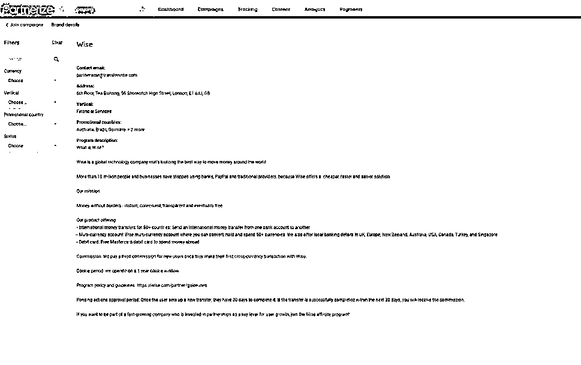

广告联盟里的Wise

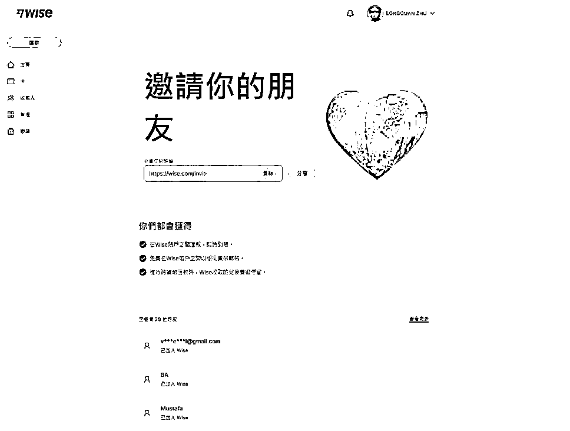

 

 

个人用户推荐可以获得50英镑的佣金

这样我们就可以用Mediabuy的方式，谷歌或者Bing购买相关关键词，赚取利差。

大家可以看看我花了多少钱，广告成本多低：

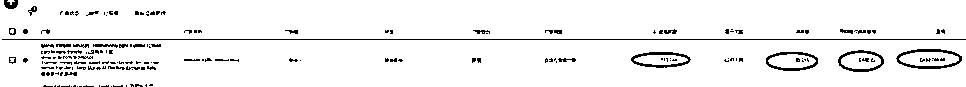

其实一开始只需要出价0.01即可，后面因为我要放天量，成本上升到了0.02。广告成本在这个项目里完全不决定你是否赚钱，因为可以忽略不计。

我之前在广告联盟里测试，一天的数据：

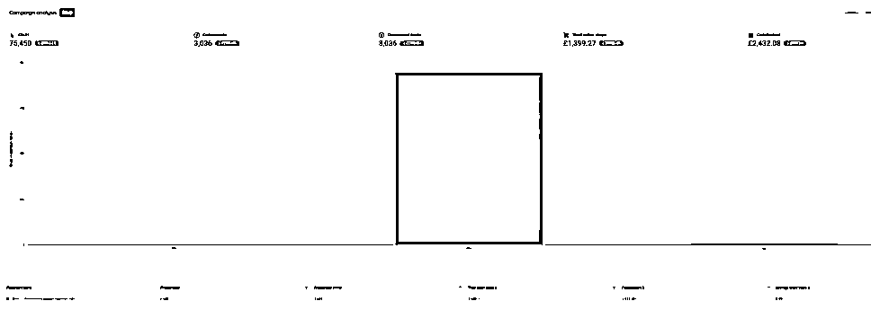

因为很多有争议的说，这种涉嫌违规的投放，可能广告主不给钱，其实我主要觉得账期长了，而且推荐佣金还高一些：

 

 

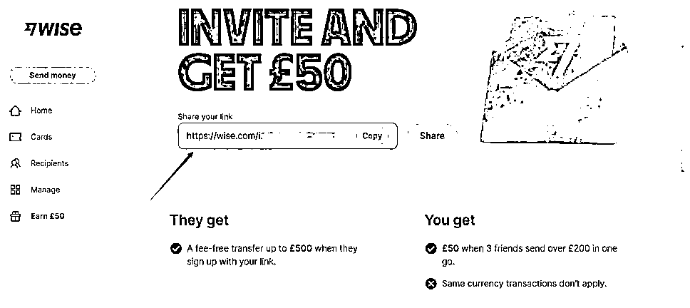

于是我每天邮件是这样的：

然后因为Wise确实信誉好，我每天点50英镑点得手都累了，因为只要三个用户满足条件，这边立即显示可以取现50英镑：

 

 

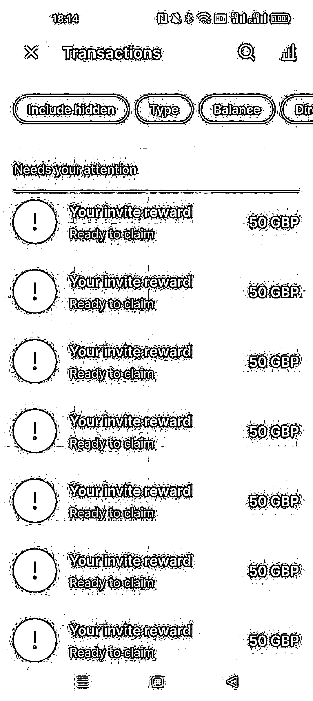

 

 

不知道是否还有同学争议这些项目？一天一万英镑，直接算下我每天跑多少广告费，点击次数，因为是品牌相关词，所以转化率一定不会低。然后基本上每天上去看看报表就结束了，全部是谷歌帮你赚钱。

该写的我都写完了，如果大家有兴趣了解国外赚钱这块，也别跟我私信，要么留言提问，要么直接去我星球去看相关内容，这块基本上只要有毅力深耕一年，至少比一般的上班要强很多，还有一些人怀疑我水平的，这个案例其实大多数人都知道，没人敢像我这样玩，这就是认知的差距。认知就是你可以预判结果，而结果几乎跟你预判一样。

评论区：

静水流深 : 这里有很多用户也是我星球的，可以确认这个项目我去年这个时候就开始发了[偷笑]

刹那清音 : 学到了，先去踩坑了

李怕怕 : 通过广告投放拉新赚佣金，会不会出现竞价情况？

静水流深 : 你还没入门，先看看我之前的文章吧。

fish : 大佬怎么链接

书剑 : 前辈好。请问加入前辈的丝绸之路星球，需要有很强的代码能力吗？

静水流深 : 需要有良好的动手能力跟一定的执行力。

静水流深 : 不打广告，请勿问如何联系。

 

 

怎么通过互联网在海外赚钱？说起这个，大家的第一印象可能是专业的团队，或者说至少也要会外语吧？

但要说起来更多是一人就能完成的项目，比如 iPhone 解锁，海外的服务售价基本要做到 99 美元，而在闲鱼上基本 99 块就解决了......

# **# ****(**精华帖**)(204**赞**)3 **个单人就能做的赚钱案例，

# 告诉你怎么通过互联网在海外淘金？

作者：  静水流深

日期：2022-04-13

大家好，我是静水流深，感谢生财有术邀约，让我来讲下海外互联网赚钱的一些东西。

我从事互联网赚钱也可以说是互联网广告行业是从上个世纪很多人不知道什么是互联网开始的，相关可以参考曹大的星球的文章：

https://articles.zsxq.com/id_uihwltlmxa8g.html我没有必要去用金钱来衡量我的价值，我就这样说一个事，王通是当时我给了他一本我翻译的《Google Cash》这本书，才知道有 SEM 这个东西，当时百度还没有百度竞价。

而且基本上搞国外的 80 后都认识我，我也不是鼓吹我自己，我只是给大家「泼下冷水」：互联网赚钱确实很容易，但是也很难，你如果连真实情况都不明白，那么赚钱的一定不是你。

很多时候，你看见的并不是真相，真相一般只有当事人知道。

 

 

目录：

比如跨境电商搞得风风火火，各种培训层出不穷，其实赚钱的最多不到 10%，而且赚钱的必须供应链或者流量具备至少其一，否则赚钱跟你毫无关系。

包括一些人动不动就吹嘘跨境电商一年赚多少多少钱，刚好现在看看各大做跨境电商的公司，年终给员工发多少钱就知道到底赚不赚钱，至少我知道的情况是大多数在裁员。

再谈谈很多人趋之若鹜的 Mediabuy，其实我这样说下大家就明白了，任何行业都一定有赚钱的头部，而头部可以比一般人多获得 10%-20% 的佣金，以及广告费这边可以多有  5%-10% 的返点，所以你哪怕 100% 复制人家的案例，很可能得到的是这样一个结果：

人家怎么都赚钱，你怎么都不赚钱。

而且现在 Mediabuy 这块比的是谁能够上广告，以及有更多的其他资源，隐性的成本根本不会对外说。

接着是游戏出海，游戏出海不是你做了一款牛逼的游戏，变成其他语言版本在海外发行，而是你去模仿一些国内，好比之前 4399 里面的那些小游戏，源代码很容易获取或者开发那种，只要国外暂时没人上架，就变成英语或者其他语言版本，上架后用刷榜或者其他方式做到排行前面去，接着看数据表现能不能最后赚到钱，不行就下一款。

这种模式大家最熟知的就是「三消」类游戏，比如「消消乐」，一开始确实竞争的人少，很赚钱，后来就是只要谁去做基本上一定不赚钱。

上面讲了一些跟外面不一样的东西，希望各位不要见怪。今天我在这里分享的是一些小项目，能够抛砖引玉足以，我从来不会吹嘘能够赚多少钱，但是我的任何项目足以让任何普通人告别打工。

 

 

**1. **案例一：某** Adsense **项目

**2. **案例二：分享以前做**3798.com **的旅游网站的收入情况

**3. **案例三：手机解锁

**—01—**

案例：某** Adsense **项目

简单介绍下 Adsense，就是谷歌版的百度联盟，但是比百度联盟好 N 倍。主流玩法是流量主（以前可以用站长来表示，现在因为还有 UP 主，甚至 APP 里也可以内置谷歌的广告，所以统称流量主）卖流量给谷歌即可。

谷歌的广告简单到不需要你布置，一段自动广告代码会自动布置到你的媒体最佳位置，广告内容也会根据你的用户画像来生成。当然也有流量套利等玩法，这里不深入阐述，最简单的理解就是谷歌版的百度联盟。

这里我放几个 Adsense 的图：

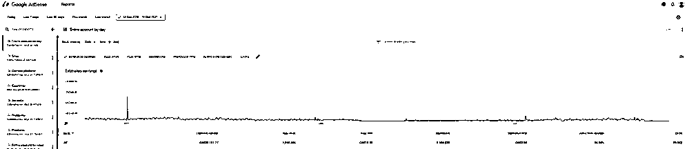

 

 

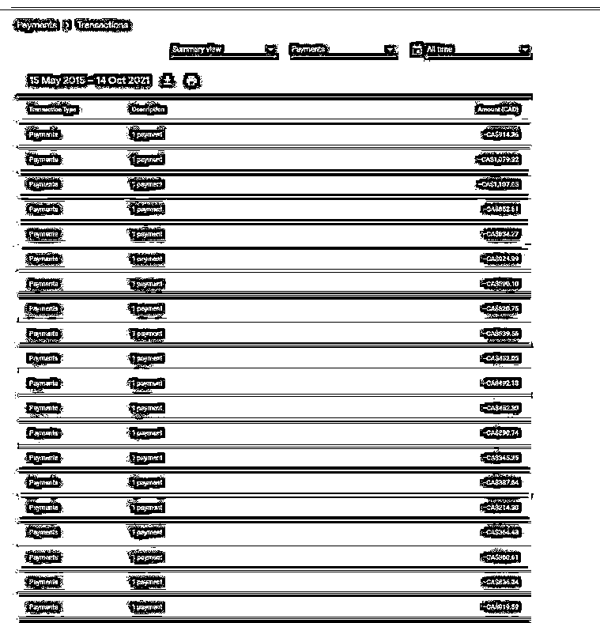

收入不多，每个月平均 $1000 美元左右，可能很多人问，这也太没意思了吧，才 5000 人民币一个月。但是我告诉您这只花了总计两个小时做出来的一个小项目，而且没有去管理，就这样了，不知道您还有没有兴趣？

这个项目每年的成本除了一个域名的费用 $9 美元，服务器费用每个月 $5 美元，就没有其他成本了。

 

 

然后，我只需要用我的信用卡支付上述费用，我的银行付费接受来自谷歌 Adsense 的每个月的付款，设置信用卡自动还款，这就是一台自动赚钱机器，当然上面仅仅列举了  Adsense 的收入，还有一些其他广告联盟的收入，加起来就平均每个月 $1000 美元，持续了几年了，未来也一样。

网站地址：https://hotelcorporatecodes.com中文版：https://xieyidaima.com

为什么有流量？原因在于「hotel corporate codes」这个词在谷歌第一页的前三位，而且搜索的人不少。

**—02—**

案例：**3798.com **旅游网站

这个案例中，我主要是分享以前做 3798.com 旅游网站的收入情况。

现在互联网的流量，都是各种巨头掌握，之前我就在广告中国说过，很多人看着做  Facebook 投放或者谷歌投放赚钱，但是没有人说过做投放的亏损超过 90% 吧？能够花得出去钱是第一步，但是优化还有杂七杂八的一些东西，你如果连一个网站都不会，你觉得哪怕机会同时给了所有人，赚钱的一定不会是你。

做网站往往是最便宜的起步，你可以平时上班，回家之后花个把小时维护下，然后就可以肉眼可见的速度慢慢发现谷歌 Adsense 以及一些广告联盟给的收入超过了你打工的收入，关键还是持续性的、被动的。

 

 

这个圈子里很难找到有人真正做过产品，以及日 PV 过几十万的大站，这个图就是当时做 3798.com，从零收入到光靠 Adsense 就可以过万美元收入的历史图：

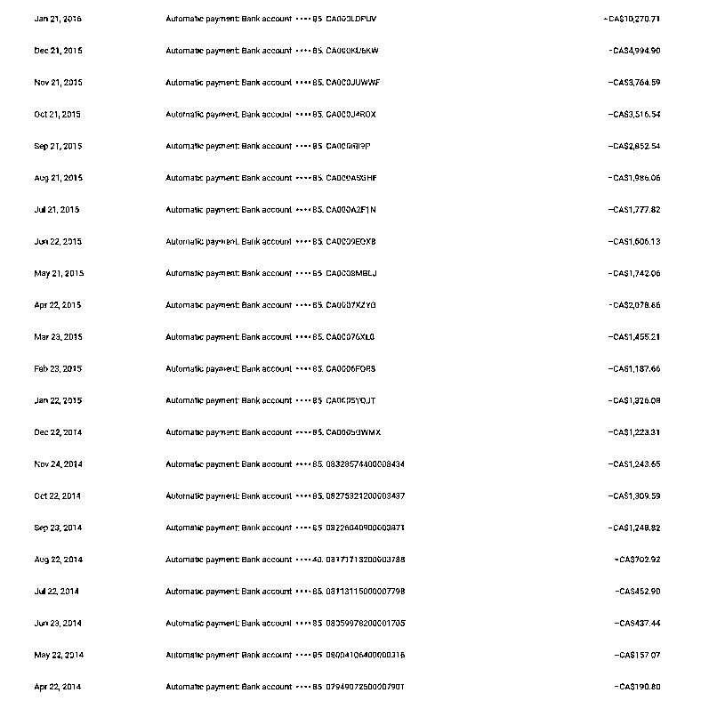

为什么从 4 月才开始有收入？因为到 4 月才够有收入，网站是 2 月开始做的，这些数据都可以从网站历史工具里查得到的。而获得这个收入其实非常简单：

https://loyaltylobby.com/

 

 

这是一个老外的网站，老外很勤奋，天天发布文章，而且量也少，每天一篇，于是我只需要每天用中文翻译他的文章，然后图片保存下来放在自己的网站上即可，要么就自己切个图。这样通常我每天半小时就做完了工作，唯一一点是全年 365 天基本上没有一天不工作。

如果某天这个博主偷懒，没有更新，那么我就跑到另外一个地方：

https://boardingarea.com/

或者这里：https://www.flyertalk.com/

反正每天工作一小时以上都觉得累，后来网站人多了，就用 Discuz 把论坛搭建起来了，以 UGC（User Generated Content）的方式运营。高峰时候抢走了飞客论坛 67% 左右的流量，日发帖区间在 4000-10000 之间。

整个项目成本其实很低：

服务器用 2H4G 的阿里云服务器，后期 OSS 加上 CDN，然后数据库分离为云数据库，当时用阿里云比较早，很多价格比现在便宜得多，但是哪怕放到现在，每个月费用不会超过 2000 元人民币（对标高峰时期的收入，流量越大服务器成本越贵，但是越可以忽略不计）。

同时收入还有来自 CJ 等广告联盟的收入：

 

 

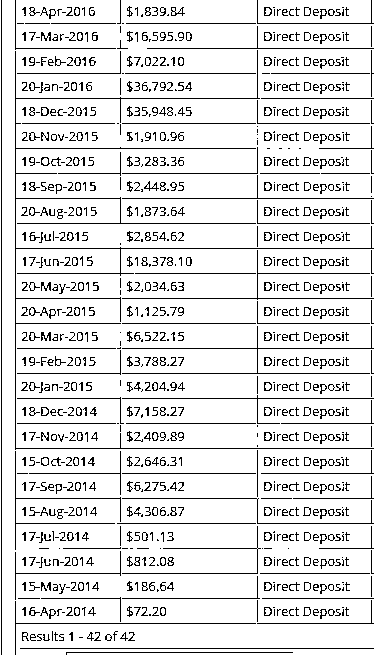

原帖地址：https://ads.org.cn/thread-34407-1-1.html大家有兴趣可以看看以前的老教程，我个人觉得很多东西并未过时：

https://ads.org.cn/forum-101-1.html 

 

自己看，时间都是对应的，没有骗人哟，当然还有一些接的包月的广告或者单独的广告主给的钱没仔细算，一年收入轻松破百万。当然，跟某些人一年几千万上亿的收入不能比，但这个基本上就是单干起来的，时间每天一小时，多一分钟都是浪费，成本上面说了，利润可以说就是我的那一年的薪水。

后来因为成立公司之后，出现了不能同富贵的事情和踩了一些坑，导致最后项目在资本的运作下失败了，并且我也不能再次参与此项目。所以，这篇教程本身就是值钱的教程，如果按价值来估算，远超市面上收费几千上万的教程，你完全现在就可以按这个项目的所有细节模仿，包括讲出行、旅游、常旅客的公众号也不少，但是都没办法做到极致，因为他们没有参加我的培训，所以仅仅停留在靠 points.com 的卖分广告、飞猪的广告来获取收益，如果你不知道从哪里起步，这就是最好的一个起步抄袭案例，连去哪里找素材都全公开了。

同时，这个项目是长期可以赚钱的，并不会因为任何不可抗拒因素导致这个项目不能做了，包括疫情也无非收入变少了一些而已（后续我还有一个项目会公开证明这点）。而且见效时间也不长，自己看我从 2014 年 2 月开始立项，到 4 月就有了收入，而且持续增长，绝对不逊色任何暴利项目，最关键的是只需要你一个人即可。

**—03—**

案例：手机解锁

利用一些国外平台进行无本生意才是新手最需要的方向。

有个东西叫手机解锁，有海外生活经历的朋友应该都明白，国外买手机都可以签合约，当然中国也有。

 

 

两者最大的区别是：中国是返话费，机器你可以插任意只要支持制式的卡使用，国外是直接很低的价格给你用，但是得给我签一般两年的合同，这两年里你每个月的话费得满足最低要求，而且必须只能使用对应签约公司的 SIM 卡，插其他的卡直接变砖机。两年后提交你的 IMEI，官方给你解锁这部手机，你这个时候才可以随便插入任何电信公司的  SIM 卡正常使用，以及你可以把号码转到其他公司去，结束合同或者签约新的合同，换新手机再次延续上面的操作。

大家应该记得一开始 iPhone4 出来的时候，说什么老美只要 99 美元，中国却要五千块纯是断章取义。你要知道当时一般背后的合同都是每个月 50 美元左右的最低消费，24 个月起步，最后算一下谁便宜？

因为这样，所以就催生了一个行业，叫手机解锁 ——simunlock，这个词搜索量很大，并且谷歌上不少商家在投放广告：

 

 

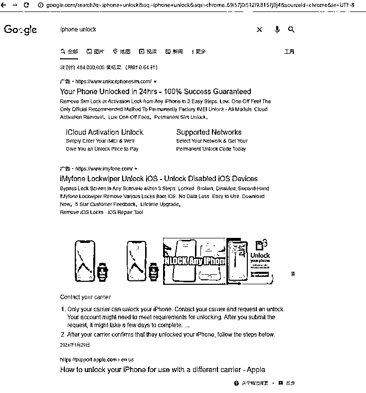

我选择了一家提供 iPhone 解锁服务的商家，这家我以前用过，他们是提供货真价实的解锁服务，这里随便找了一个比较主流的 iPhone12 作为测试，然后他们给了报价：

 

 

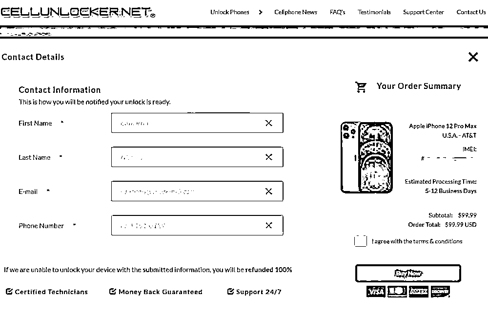

99 美元解锁，而咸鱼还有一些国内的渠道，价格远低很多（咸鱼上的过低标价未必是正确标价价格）：

 

 

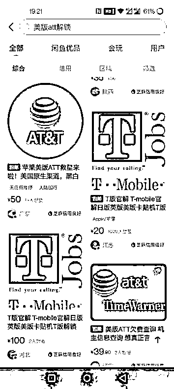

前面我们看见有人投放谷歌的 Adwords 广告做竞价排名，确定这个生意一定是存在并且还是赚钱的，这里我们发现了巨大的差价空间，估计有很多做跨境电商的朋友就看出来了，一个简单的 Shopify 即可实现之前那些解锁网站的功能，完全可以当作一个虚拟物品提供服务的跨境电商来运作。

 

 

我们可以更加简单抽象地做无本生意：

Ebay 上貌似没有人提供解锁服务：

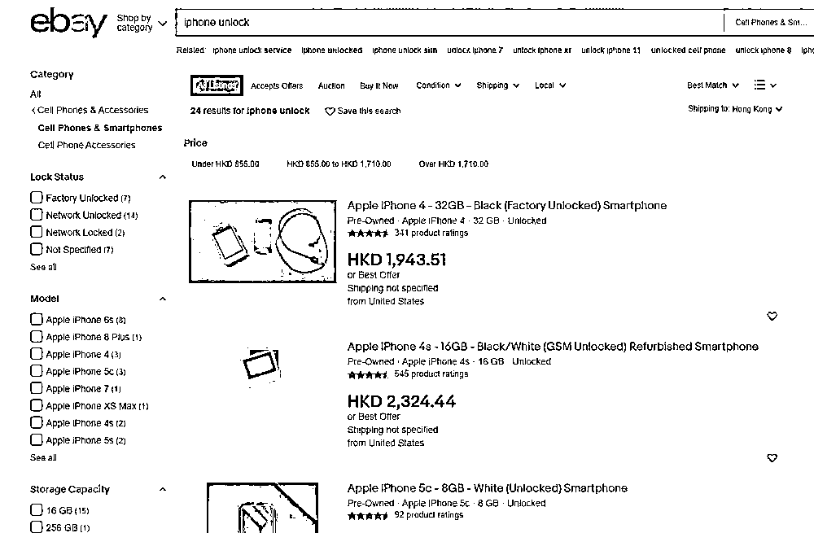

Fiverr 上更离谱，要么没有，要么 150 美元：

 

 

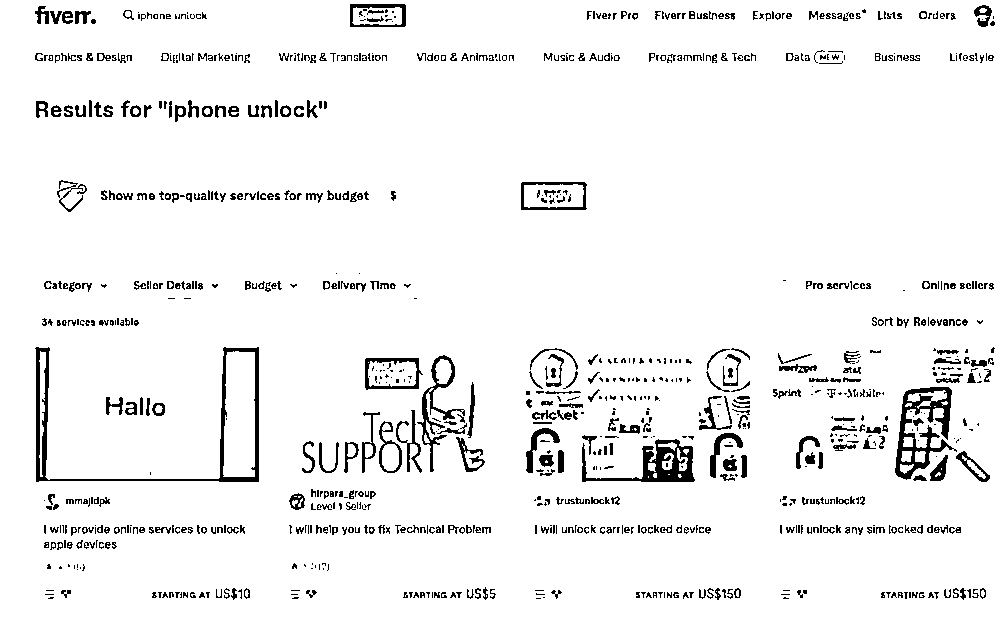

只要你把解锁服务作为商品，并且提供相关关键词作为吸引人的标题发布上去，就可以自然获客了，而你不需要花费一分钱。当这边接到了老外的解锁请求，然后找一个国内提供解锁服务的商家处理，赚取不错的差价。哪怕解锁不了，退钱即可，你也没任何损失。多数时候，你的利润率超过 100%。

具体找哪几家国内提供解锁的服务商比较好？咸鱼、淘宝多看看，包括国内知名的找果科技，前提是你一定要亲手去尝试这个项目。任何项目你不动手就是个零，哪怕项目再好。

讲到了这里只是揭开了水货手机这个行业的冰山一角，真正最赚钱的，是平时我们在淘宝或者威峰论坛别人说的美版 iPhone、日版 iPhone 等，这些机器的真实成本其实超级低。

 

 

一般来说，美版 iPhone 基本上全是合约机，更早的几年，美国根本买不到无锁的  iPhone，全是跟电信公司合作，以签约的形式，用户 2-3 年的合约，低价用手机，高价付手机费。这也催生了很多美国人跑到加拿大的 Apple store 店里，买无锁版的苹果手机，也让 sim unlock、phone unlock、iphone unlock 这些关键词有很大的流量。

这里面又有了一个新的生意，我知道的华人圈子里，不少留学生打算学成归国的时候，就拼命地在各个电信公司里以很低的价格签约手机，然后卖掉手机。然后这些手机就流向了全世界，包括中国。

当然老外也有专业的团队，直接批量化，找一些无视信用分数的人，往往签约手机并不要求多好的信用记录，只要不是破产状态，理论上都可以使用后付费手机。这个就不展开说明了。

**—04—**

最后的话

国外的互联网赚钱，最大的一个特点就是可以 one man 完成，很小的小公司或者个人一年很容易有很高的利润业绩。可能有人问如何发现这些利润空间？其实上面的所有案例都属于不告诉你，你一辈子都不会知道，告诉你，你会觉得恍然大悟。

有人可能会问了，自己如何发现这些东西呢？我个人觉得，首先你不能是一个打工人，因为上班会占用你大量的时间，导致你每天没有任何自己的时间去思考以及学习。所谓的读万本书不如行万里路，意思就是只有多去经历一些生活，多去看看世界，你才会发现商机。

 

 

做国外这块，说难难，说简单也简单，难的地方是你必须有自己的想法才能够赚钱，说简单是没有国内这么多条条框框，往往一个人几个人就可以做一个生意，这就是为什么国外有种生意叫** Small Business**。

如果大家有兴趣，下次我会继续分享一些案例。

评论区：

刘小排 : 有意思

静水流深 : 我无非是把前面一些人说做工具站或者什么站的思路落地应用了而已。现在是互联网出海的最好的时代，是我们用中国的打法搞国外最蓝海的时代。

老横 : 顶下惰总

刘小排 : 根据一些流量工具查询，这个案例的广告收入情况，似乎有比较严重的夸大成分。  其他挺好的。https://hotelcorporatecodes.com  静水流深 : 流量靠工具查询是新手才做的事情，我后台都发出来了，你觉得我有必要夸大吗？然后你谷歌搜索关键词，第一页我不止一个站。[呲牙]

静水流深 : 感谢支持

刘小排 : 是的，我是新手小白。

从小白的角度看，您放出的截图，我有2个问题

**1. ** 看不出来网站访问量情况；仅从您文章里提到的那个网站看，它的流量支撑不起来这个收入。

2.看不出来是否全部收入都来自这同一个网站，从您的截图看，我认为您这个同一个账号，挂着多个网站。

由于您文章里说，仅仅这一个网站，就月入1000美金广告费，并未提及是多个网站加起来1000美金。因此我表示有些疑惑，往不吝赐教。谢谢

三林 : 对于非网站主，的确要靠第三方工具查流量呀

# **# ****(101**赞**)25 **天成交一个海外独立站** B2B **客户，

# 入账**$4551.7**美金，我做对了什么？

 

 

作者：  马钱钱

日期：2023-05-04

25天成交一个海外独立站B2B客户，入账$4551.7美金，我做对了什么？

大家好，我是马钱钱。

一名在外贸行业野蛮生长了8年+的外贸人，目前主业是【海外独立站营销推广操盘手】，擅长谷歌SEO内容营销、独立站运营团队搭建和外贸业务团队搭建。

简单地说，我的主要工作，是通过海外独立站，以 [谷歌SEO内容营销] 为主要推广方式，帮助外贸人和外贸企业，在谷歌搜索引擎上进行推广引流，实现躺拿被动询盘，获取精准的海外客户。

因此，我工作内容主要解决的是外贸获客问题，帮助大家摆脱对平台的过度依附，突破传统获客方式的困境。通过组建属于自己的流量运营团队，打造自有B2B出海品牌，享受自然流量带来持续的精准询盘，从根本解决获客困难的问题。

前几天，我在朋友圈分享了一个独立站订单成交的案例。今天准备把这个成交的过程拎出来，带大家感受一下独立站过来的客户，究竟是怎么样成交的。

25天通过海外独立站成功转化一个法国的B端客户的订单过程，我又做对了哪些事情？

为了更好的阅读体验，请移步飞书文档访问：

外贸  独立站  谷歌SEO内容营销

https://w09ipxgwb2.feishu.cn/docx/VILid7sleoZ6puxkchxcRM9vn6g评论区：

芷蓝 : 钱钱真棒！时刻在努力～

小浩哥 : 钱钱无敌优秀

海里 : 加油加油，很实用

清一 : 钱钱太棒啦！！！

马钱钱 : 必须向芷蓝姐看齐，再靠近一点点，哈哈哈

探戈师兄 : 牛!

马钱钱 : 感谢小浩哥

小女巫忻忻 : 这也太优秀了！

 

 

# **# ****(77**赞**)**个人开发者的成功案例：一个函数的产

# 品带来稳定收入

作者：  张小吉

日期：2023-07-03

这是一个非常值得个人开发者或准备做出海项目的小伙伴研究的案例，他就是刘小排老师说的一个函数的产品。screenshotone 的功能非常简单，就是你提供 URL，我给你把这个 URL 的页面截图通过 API 返回给你，还别说我之前做自动化运营的场景，还真就需要这个功能。

作者分享了他的 MRR（月度经常性收入）， 2.5K 美元，折合人民币 1.8W ，作为自由职业其实可以了，而且可以预见后续会有更多的收入增长。

这个作者还有其他的产品正在开发中，都属于那种一个函数的产品。一个人花一个周末的时间就足够了，比如  这个产品的功能是通过 API 从任何站点提取结构化的数据。当然我敢说绝大部分需要权限验证的站点，它这个函数就实现不了，但影响吗？不影响啊！如果最后发布之后，被市场验证没有多少用户需要这个工具，弃了就是。抓紧时间去研究下一个「一个函数的产品」

另外做海外市场的童鞋，也应该多关注这个开发者的博客和 Twitter。他的做法正好体现了build in public 的特点。他在博客和 twitter 上公开了他做过的产品的心路历程。比如这篇文章

作者提到了上线 product hunt 的整个过程，最后还被他们的头号竞争对手支持。不得不说，海外的氛围是尊的好啊  👏👏👏

生财朋友圈  https://geturldata.com/ https://dmytrokrasun.com/posts/the-product-hunt-launch-for-screenshotone/

 

 

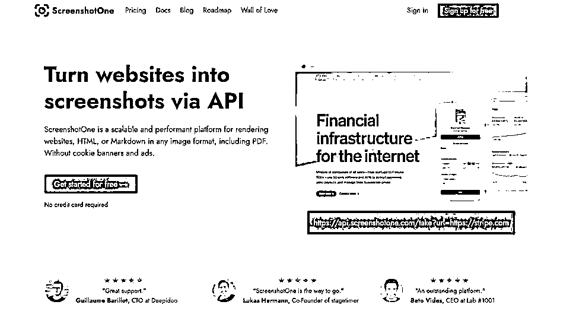

评论区：

伟业 : 解读：细分再细分，越细分越容易变现。我们做自媒体刚刚起号的时候，也要做细分，比如小红书，不讲怎么起号，就讲怎么引流。因为将大而全的东西，没有办法和前人竞争，切细分反而有一席之地。张sir就是一个很好的例子，只教投抖加  亦仁 : 中标，术值+1。

在上方专栏点击 #中标，可查看所有中标风向标

张小吉 : [色][色][色]

周彦充 : 不明觉厉

# **# ****(31**赞**)**如何在**24**小时内让一款超休闲游戏霸榜

# 全球**100+**国家

作者：  土豆

日期：2021-07-20

《如何在24小时内让一款超休闲游戏霸榜全球100+国家》

 

 

大家好，我是土豆。

08年开始接触互联网广告，从PC到移动，从品牌到效果，从国内到海外市场，恰好都经历了一路。19年初作为10多年互联网流量老人转后端做产品，至今还在自研自发的不归路上作死挣扎。

19年下半年我们在经历了半年团队搭建和人员磨合后，在ios&安卓双端上架了一款io类的休闲游戏，名字叫crazy.io（由于涉及一些三方事宜用代名）。产品上线测试找到爆款素材方向到上榜全球100多个国家不到24小时。

星球这个赛道的球友不知道多不多，逼着自己耐着性子断断续续敲了几周的字，发现输出真的太难了，欢迎拍砖。

为了方便阅读正文见石墨文档。https://shimo.im/docs/qqp6xdyJRh6xPCtC评论区：

az :  

杨鬼 : 做游戏还是门槛挺高的，一般人做不来吧

土豆 : 谢谢

土豆 : 每个赛道想做好应该都挺难的😂

柯蓝 : 字字珠玑。此中种种不足为外人道也。

土豆 : 🤣🤣🤣

Net closel* : 每一个追梦的人都应该善始善终

土豆 : ✊

# 【踩坑经验】**5**篇

# **# ****(**精华帖**)(261**赞**)**从做谷歌销售到创业，**10**多

# 年跨境出海，赚到千万级美金

 

 

作者：  亦仁

日期：2020-05-06

“消极的人看到的全是负面，而积极的人看到的更是机遇”。

今天周三，  如约更新。

今天的  ，与前两次的分享不太一样，没有很多方法论总结，只有他 10 多年的创业生活记录，这10年跨境出海，赚到千万级美金，背后是无数天的升级打怪，用他自己的话说，“没有哪一年不是磕磕碰碰”。

确实是这样，赚钱的路从来不平坦。

“看到整个大趋势是向上的，便可安心做好自己的本职工作，尽量少浪费时间在无效的琐碎的事情上，保持好心态、扎实练内功会看到明天的太阳。”

大家很给力，400+ 赞，一起欢迎出今天的跨境创业老兵带来他的10年创业经历分享。

— 10年跨境出海，我是如何挣取千万级美刀

大家好，我是侠客行，很荣幸受亦仁邀约，分享十年来跨境出海的经历，也是给自己这十多年创业的一个总结。

说真心话这些年行业很浮躁，自己也很少沉下心写点东西。一来文笔太次，二来今年国外的疫情对外贸、对跨境行业是个不小的打击。朋友圈不是流行这么一句话么：今年的外贸人太难了，国内打完国外打，外贸人是坐等打全场。

苦笑，咳咳! 跑题了，说正题。

先自我介绍下，虽然入生财的时候也贴过，但是当时比较简约一笔带过，因为知道圈子卧虎藏龙，不敢班门弄斧。

█ 从AdWords投手到跨境电商玩家

我06年在杭毕业，普通院校读的电子商务专业，原以为是高科技，现在想想太傻太天真。课程就是销售+管理的结合版，哪来的电商元素……上学那会某宝还没出现呢，哈哈。

 

 

直到毕业我一直觉得读了个假电商，明明是市场营销么，然后入了第一家和互联网还算相关的企业——Google 在杭州的AD代理服务商，开启了一份算是互联网的销售工作。其实就是那时阿里中供的原版，除了电话Call 就是拜访客户，那时Google 在华还是有不少份额的，无奈最后退出，结果大家看到某度的堕落。

一直以来接触比较多的是海外的咨讯和外贸企业相关的内容，直到08年考出 Google AD 广告优化师的证书，也算是成了一名合格的AdWords投手。在接触了大量海外各类咨讯、以及分析了华东各个行业的数据之后，我对AD还有搜索相关的内容越发感兴趣，每天会花大量的时间研究各种SEO 相关的技术和玩法（主要是黑帽），最后也是付出沉重的代价（后面会补充）。

因为前期资金受限SEM的玩法很容易碰到瓶颈，于是 09年告别网络广告销售的岗位，依靠父母仅有的几万块血汗钱，毅然冲进外贸电商这个行业，那时没有现在跨境这么专业的表述。

█ 从企业职员到合伙创业

09 年算是正式自主创业，约了一位合伙人两人分工，我主要负责技术端和营销，他负责供应链管理和物流，当然更多的是和邮政打交道，哪有现在这么完善的物流渠道。就这么开始没日没夜的折腾，当时小区公寓吃住一起是标配。

第一版上线的是B2C 针对服饰类的平台，因为华东供应链的强项基本在轻纺类，所以选择了服饰这个品类。09年的独立站平台确实比较少，头部也就是兰亭、敦煌、DX、大龙等，那会儿第三方平台只是萌芽期，包括 eBay、易趣这些电商程序比较成熟的平台，在国内 C2C 市场被淘宝打败后才刚刚打算杀回出口界，还处于起步阶段。

而我们起步因为资金受限，基本都是拿来主义系统，也是开源的PHP购物车程序，现在回看当年的作品哪能见人，更没有像现在Shopfiy 等成熟稳定的电商系统。为此我们付出了不少代价，其中有一次被攻击导致数据库丢失了几个小时的量，破于水平有限无法找回，都是泪。

08-09年确实好做，应该说竞争少加上本身自己对 Google AD 投放的优势和高毛利的回报，让我们2位股东各挣了一套房，要知道09-10年的杭州房价不低于北上广一线。算是捕捉到一个风口期，当然后面因为自己的贪心付出了沉痛的代价。

研究SEO各种玩法实践于自己的B2C平台，因为贪心不满足，于11年初 Google 的熊猫算法终结了这一切，一夜回到解放前。那几个月一直活在阴霾中走不出来，就是那种把自己的小孩带大后夭折的感受是一样的，当然现在回想，出来混迟早要还的。

 

 

之后因为太过依赖 Google 流量口子反而错过了 Facebook 的风口期，如果那时转战  Facebook 相信依然会收到不错的收益，所以现在总结：

「人不能太贪否则会迷失方向」

之后又复制母站打算从头再起，而且也反复阅读 Google 站长内容所有文章和指南，说白了就是内容才是王道，但那时的自己心态太浮根本静不下心做内容，所以多次尝试均无效收场，应该说对自己失去信心。

人一但迷失方向，如果没有一个人点醒和拉一把真的会颓废，我的合伙人承担了这个角色，他对技术营销比较薄弱而对市场方向把控比较有信心，在我最底谷的时候，是他带着我们找到又一块新大陆。

█ 从迷失方向到业务破局

10 年我的合伙人在业务受困时不断找出路开启 Aliexpress 、 eBay 销售，因为他知道业务不能停。那时我们已经有 10多人的小团队，不能因为一块业务受堵而退缩，而那时我们确实找到了新的发展方向， Aliexpress 在10 年上线，11年在 eBay 上的经营让我们看到了希望，而且基于过往的独立站运营经验和成熟的供应链体系，我们在 Aliexpress 和  eBay上的经营以每月几倍的速度增长，短短2年时间在这2个平台销售过亿，团队成员也持续扩容至30多人，而且依然保持高速增长。

➢  批量铺货，高毛利促进N倍增长

流量风口期我们采用批量模式，也就是现在很多大卖团队的铺货模式，多产品线多SKU多店铺一发不可收拾，而高毛利也是支撑我们不断投入直到扩容至近百人。

11-13年我们一直采用这种团队作战模式，确实获得不少的收获，而且各平台的玩法我们也是精细化运作，每年保持N倍的增长不是难事。特别在 Aliexpress ，我们从初创到类目前五基本上6个月内完成，当然期间也碰到一些问题运营过于奔放导致客户留存少，但那时根本不在乎，追求高毛利和回报让我们团队实足沦为一个外贸搬运工。

➢  抢占先机，借助 Amanzon 打造良好现金流

直到13年底，我们接触了 Amazon ，发现原来的模式可以更垂直，而且我们在经营上也是国内最早的一批商户，在 Amazon 未开启中国招商之前，我们就通过国外渠道和自身资源复制经营，概括的说之前是搬运白银，而在Amazon 早期实属搬运黄金，高客价高毛利加上快速回款，让团队一直保持良好的现金流。

 

 

那时的我又犯了09-11年做 Google 时的老毛病，完全忘记了之前被熊猫算法一套送回解放前的辛酸，再次去研究平台的政策和漏洞，各种玩法一顿操作猛如虎，快速切入平台市场。好在平台处于早期，早期如果能玩通一个玩法，尽管有风险（平台规则变动带来的业务影响），但这个阶段养活一家公司是完全没问题的，这种状态持续到 15 年。

那几年我们基本通过集群模式的打法再一次获得丰厚的回报，当然后来圈子接触多了，获知更多的圈内人脉之后，发现我们还不算快。华南现在的超级大卖其实玩的更专业和奔放，只是行业相对比较低调，或者说行业不够阳光化，被人获知的少，所以近几年可能才会被定义为跨境。至少我们这10多年的经营也就这几年知道自己是做跨境出口，一直认为就是一名卖货的。

➢  坐失良机，错过 WISH 新风口

15年后同样出现的另一个新平台 WISH ，我们启动不够快，加上 Aliexpress 、 eBay 、  Amazon 三架马车的经营确实精力有限，没有All In 而是小范围测试，错过了平台的风口期。而身边原来不少只有几个人的团队，短短几个月的时间可以让人刮目相看，后来和圈内一些资深外贸人聊起，确实早期一批商户挣得盆满钵满，一年在上海挣一套别墅不过份吧，哈哈，流口水。

随着 Amazon 入华开启全球开店后，近些年大家慢慢对我们这个行业有了更深入的接触，而且大量商户涌入平台，也就是从15年起我们团队发现原来的集群模式不管用了，价格战走起已经闻到某宝的味道，也让我深思这样的搬运还能持续多久，流量的风口还能持续多久。

09-11年的死亡危机再一次让我陷入沉思，如果不做出转变后面的路从何走，近百人的团队、花了多年的心血架构的管理体系又能支撑多久。

➢  趋舍有时，优化线上SKU & 品牌出海

最后和我的合伙人经过几个月的复盘和打磨决定开始做减法，通过 ERP 数据分析我们的SKU 量已破20W ，供商数量破500家，要应付大量的采购和管理线下生产供应链会考验整个团队的承载力，最后供应链团队中出现腐败事件是压死我们被迫改革的最后一根稻草。

15年起，当大量的商户报着一夜暴富的心态杀入 Amazon 时, 我们选择做减法，砍掉长尾供应链，优化线上SKU , 去掉低客值和低毛利的产品，拥抱大件商品销售。接触过跨境电商的都知道早期的商品均是走航空小包的模式，重量控制2KG以内，而我们15年之前就是在这条线深耕不能自拔。

 

 

同时我们启动品牌出海，把优化后的供应链精细运作。截止目前，我们已成功推出2个品牌的产品线，占各平台各类目的前十，并有有多个listing 长期占居BS的位置。

当然现在回顾那时的决策还算明智，但确实受到团队成员的阻力，因为在15年我们依然高速增长，年销售体量上亿级不是刹车能直接刹停。而且我们 Amazon 的增长还在持续，团队资源也是更多的倾斜于它。

现在我们依然保持三架马车，同时通过几年的品牌经营也慢慢让自己沉下心来，原来浮造的心安静很多。看了大量圈里分分合合的故事或者叫事故，一步步走来让自己成熟很多，也考虑更多，更多的责任让自己始终坚信现在走的这条路是对的。

以上基本上能表述出我以及我们团队这几年在跨境行业的处境，其间也有去尝试不同市场和平台的经营，均已失败告终，最惨的是前年All In 做RU 市场的JOOM，一年不到的时间20人的小团队直接解散，损失不少，像这样的案例还有不少。

因为这10年期间我们经营了超过 20个市场的 30个以上平台，有收获更多的是失败的收获，当然不尝试怎么知道结果，所以在我们团队始络保持一颗创业的心态，并且会大量试错。

————————

以下主要分享近三年的经历：

10年跨境出海一直做着搬运工的角色，各种滋味只有自己知道，所以近三年我们一直在品牌经营上下功夫，虽未出好成绩但至少坚信是正确而且长远的道路.

目前我们团队分二大模块：「自营+第三方」

「第三方」即为一直说的三架马车，毕竟这么多年的资源积累而且相对稳定。而「自营」是我们现在重心去打造的这个模块，以品牌为导向向海外用户输出中国制造同时输出服务。

我自己知道这是条正确的路，只是走的会很长。我们又回到09年的独立平台，当然10年后看10年前又是一翻滋味，毕竟10年前更多的是为了生存，而现在更多的是想做点事，哪怕一点点。

想通过海外本地化的服务让品牌更有生命力，也想通过自己的实践给周边的一些工厂，制造业的朋友一个模板，凭什么我们中国制造的产品只能卖几美金，而采购商贴完自己的品牌能N倍溢价，不就是我们不会讲故事吗？

 

 

————————

然后谈下疫情对外贸和跨境的影响吧，希望自己的一些文字对大家有帮助哪怕一点点，好比我平时也会看很多文字，而且会快速筛选出自己认为有价值的内容。

搭过团队的应该能认同好比每天在打怪，而且每次出现的怪兽破坏力更强，而每次打败后自己也会上一个台阶，所以这10多年的创业生活我感觉一直这么度过，没有哪一年是没有任何磕碰的。所以这次疫情我们也是这么正视，消极的人看到的全是负面，而积极的人看到的更是机遇，特别现在是信息碎片化的时代，各种大 V 自媒体更有带路党真的需要擦亮眼去辨别，而且需要把眼光放远未来的3-5年以后。

「看到整个大趋势是向上的，便可安心做好自己的本职工作，尽量少浪费时间在无效的琐碎的事情上，保持好心态、扎实练内功会看到明天的太阳。」

最后也借生财宝地给大家做个推荐——

有工厂，有供应链，有研发的团队和企业可以对接我们，我们可以一起品牌出海。

有海外流量资源的企业和团队可以对接我们，可以一起探讨下，因为我们正需而可能你们正有。

附上WX： Eric-bo88（注明生财）

注：因为平时工作和家庭时间占用比较多，加WX只是问候和刷我朋友圈的财友抱歉让您失望了，本人朋友圈没有任何和工作业务相关信息更没鸡汤。

评论区：

晓川 : 没人？

军哥 : 有

福建  珠宝-Mr游 : wish 很短暂

陈先森 : 韧性！看到大家赚钱的亏钱的，东山再起的，无外乎一股不甘由内而外喷薄而出。

侠客行 : 对滴，快速试错

Benjamin : 来了  来了

Dreamland : 当当当[鼓掌][鼓掌][鼓掌]

seven : 一，初入亚马逊

14年在公司就职做亚马逊，那时候疯狂搬运公司在ebay的listing，描述标题直接照抄， 

 

一天多的时候可以上架100条lisitng。

那时候真的很爽，就是上个再烂，都是上什么出什么，很刺激肾上腺素。

但是弊端也非常明显，跟卖问题非常严重。但是公司自主研发的ERP设置了自动调价功能，由于利润高，倒是可以一路价格战致公司底价。那时候公司产品出单最多的集中在3-9美金，现在无法想象，0.99-2美金的东西，那时候是怎么可以玩得那么开心。

但时间久了心中一直很困惑，为啥公司的底价永远做不过人家，不是说大公司么，价格站怎么就干不过深圳的某树和某拓。

总之公司也是不管不顾各种弊端，一路狂奔，巨多店铺同时运作，野蛮生长，这也埋下了危机的伏笔。

二，疯狂死账号

为了扩大体量，为了和ebay竞争的亚马逊，早期是对中国卖家的各种野蛮手段不管不顾，但情况来到15年的时候发生了巨大的变化，野蛮的中国卖家伤害了亚马逊公司价值，亚马逊开始收紧政策。

由于大家都是投石问路，野蛮生长，一路狂奔，公司多店铺运作的所有账号都是放在实体电脑，而电脑都是放在同个机房，30平方左右的机房，用货架的方式，摆放了上百台电脑。

由于公司在ebay是华南区第一，ebay有大客户经理撑腰，不知道死账号一说，那时候公司什么最好卖，侵权最好卖，什么产品利润最高，侵权产品利润最高。可是来到亚马逊可不是ebay那一套了，15年开始疯狂死账号。一年死上百个账号，跟感染了瘟疫一样，成批成批的死，那时候每天上班就跟上坟一样，第一件事就是看看又死了多少个账号。

其实主要原因是出在了机房，所有店铺都关联了，那时候不知道，天天排查，排查上架姿势是不是有问题，排查各种问题，就是不知道原理核心问题是关联。

由于一路狂奔野蛮生长带来的甜头，公司的决策也是不管疯狂死账号，根本谁愿意停下高速的发展，于是不停下来排查原因，一路狂死账号，一路狂上产品。但终究碾压不过亚马逊封店的速度，很快，公司账号不够用了，出现了一个组十几个人，嗷嗷待哺的等一个账号。

有句话叫不给马儿草，还要马儿跑，公司政策根本不管你没有账号，总之业绩下滑就拼命扣钱，于是不违法劳动法的操作下，亚马逊部门发生了剧烈的震荡，大批员工离职。

 

 

三，长出新芽

经历了剧烈震荡和血洗，清走了老员工，新人新气象，一切都可以不被老员工的思想束缚，16年也排查了原因，用上了高大上的云服务器重新起号。这时候基本账号不死了，但是竞争激烈了，开始走起了品牌路线。

一切都从新的开始，规划了品牌线，走起了FBA，客单价也一路上涨，从过往几美金主流一路上涨30美金并不断提高主流客单价。

一切都往好的方向发展了，但新的问题也同时在暗涌。公司采取组别竞争的方式，让各组跑马圈地，争个你死我活，受益的还是公司。

# **# ****(**精华帖**)(162**赞**)**自学**SEO**副业研究各类玩法，

# 做海外移动互联网广告赚到**500**万美金

作者：  亦仁

日期：2019-08-21

每周三，带你认识一位厉害的生财合伙人。

今天开车太快，1小时预告帖128赞达成，那么有请今日生财合伙人  。

我前段时间说，玩流量，最好想办法去买付费流量，这样可以复制快速规模化。  靠创意裂变引流量，很多时候带有运气成分，不确定性太高，看老天爷是不是赏饭吃。

换个角度来说，Facebook和今日头条目前最大的变现模式就是广告，大家可以想一想，他们的流量都卖给谁了？  为什么会有那么多人去买流量？买流量的ROI怎么样？

圈子里面有很多玩付费流量的高手，今天邀请的  ，他就是靠Facebook付费流量赚到第一桶金—500万，随后又转到国内在今日头条投放，累计消耗也已经过千万。

他是如何入行的？怎么抓住机会的？套利模型是什么？在抖音上怎么玩付费流量？踩过哪些坑？

以上问题，均在今日分享解答。

再次欢迎  生财合伙人分享，enjoy！

 

 

感谢亦仁邀请，很抱歉稿子推迟到现在。公司遇到一些事情广告费被冻结，加上自己私人买的香港某债券踩了大坑，祸不单行，所以就一直耽搁了！

先简单自我介绍下，我是赖才坤Kevin，曾用网名iGoogle/坤爷/Mr. Lai。目前在武汉，公司目前主要是做抖音/微信/快手广告，也帮朋友公司投放广告。

下面我主要从两个方面分享下我的一些经历: 过往做Affiliate Marketing 的经历和这两年国内抖音躺过的坑。

我大概是2011/2012年的时候，在武汉一家移动互联网公司上班，公司主要是做海外Android app，我在公司是做运营。当时移动互联网在欧美已经非常火热，但是国内才刚开始兴起，国内做移动互联网的公司并不是很多，尤其是做海外。虽然在这家公司的工作并不理想，但是却是我第一次接触移动互联网，我完全没有想到的是，在随后的几年，移动互联网在国内爆发式的增长，非常凶猛！

从这家公司离职后，我到了北京，在聚美优品做SEO经理。工作不到一年，看到移动互联网广告，mobile affiliate marketing巨大的机会后，我选择了离职，开始做起了affiliate。

因为之前我在业余时间，也喜欢倒腾网站，跑pc上的offer。移动互联网兴起后，诞生了一批mobile流量平台和网盟。加上之前的积累和yeahmobi的Peter的带领和号召，正式打开了我跑mobile offer的新篇章。

那是还是2012年还是13年，国内做mobile affiliate的并不多，我们应该是非常早期的一批了。记得那时候每天都是挂着vvv，从Google play上下载各种app，刷他们的广告，研究他们的广告语，看他们的landing page和诱导方法，复制下来，自己去流量平台买流量，去测试offer，去做优化。你无法想象的是，那时admob、airpush上的流量是多么便宜。。。那时候手机游戏刚开始兴起，很多公司愿意砸钱去推游戏，去买流量，所以我们拿到的CPA价格很高，利润很客观，我就是抓住了这一波红利，在不到半年时间，赚了几百万美金吧，并不多，期间也错过了很多非常好的机会，现在想想也有后悔和遗憾。

回头想想这一波移互联网红利，就affiliate行业，有几波机会，一是手游爆发那一波，二是工具类app爆发那一波，像国内各种杀毒、电池卫视、应用市场出海，周围很多人靠这个赚8位数得，三是Facebook跑黑五，非常好的机会，靠这个赚千万上亿的，大有人在。

 

 

这段经历，就不细说了，在知乎上有一个问题是怎么赚到第一桶金的，我有详细写到这段经历，链接在文末。

下面重点分享下，这一年多做抖音遇到的各种坑，一把辛酸泪！

因为affiliate行业不好做，加上国内视频流量的爆发，转投国内，入了抖音的坑。首先给大家看看我们半年多时间，在抖音上的广告投入：

截的一个大概时间，主要是去年下半年到今年二三月份花的，最近好几个月都没投了（由于头条的调整，后面会说到）。这也只是一个账户主体，还有另外几个账户，就不截图了。

我们做的就是国内COD，简单说就是：在1688上找货进货，在抖音投广告卖，用户下单后就发货，货到付款。其实这个模式跟之前Facebook跑黑五COD一个意思，国内像百度、腾讯广告、新浪搜狐上，也一直有人在做，坏就坏在，被头条玩坏了，被抖音玩坏了。

COD本来就是卖暴利产品，卖出后就不太管售后的，偏偏头条又要去搞一个鲁班系统，监控着你的产品，鼓励同类一模一样的产品竞价投广告，抬高广告费，同时又要你去处理用户售后，要给用户退货换货！广告费被它赚了，还要商家提供物美价廉的东西，还要去处理售后，最后搞得鲁班商家怨声载道。据我所知，被忽悠头投抖音广告的，90%以上的人是亏进去的！我们也没赚到钱，还压了一堆库存。

在抖音开放广告之前，今日头条的广告我们也在投，那时签收还算ok，广告成本也没现在这么高。一个售价99元的商品，1688拿货10多块，广告成本三四十不等，签收也能到70%以上。抖音开放广告后，我们也是最先尝试的，流量确实大，非常大，签收也很惨，同样的产品，头条当时能到70%以上，抖音只有50%左右。

现在抖音被各种负面曝光被央视点名后，很多品类的广告不让投，除了要缴纳高额的保证金，还被各种限流。如果你问现在做抖音还有机会吗？有，但是你必须得有自己得资源。我结合去年我们在各个环节踩过得坑，跟大家分享抖音的机会在哪里，怎么避免掉坑里。

1）  开广告账户

也就是开一个ad账户，然后开通鲁班店铺，需要缴纳保证金。

 

 

广告账户可以直接找头条和各地头条直营中心/分公司开，也可以找代理商。我建议是找代理商开，找那种有实力，有运营能力的代理商。头条直营的，据我接触到的，都不太懂运营，他们其实就是销售，只想拉着你开户，充值，消耗广告费，完成他的业绩，拿提成。最后大部分都是亏，我们在直营开的户，都亏进去了，没有一个品赚钱，最后果断放弃所以直营账户。央视曝光的忽悠别人投广告，轻松赚大钱的，也就是武汉直营中心干的。

代理商靠谱的也不多，很多也是销售为了完成业绩到处拉客户。代理商开户，他们能给你当前整个大盘什么品类最火，一些基本的数据；可以给你拍视频。

最理想的是，公司自己有运营团队，有人懂投广告懂运营，一半代理商运营，一半自己运营。

2）  货源

最重要的一环，很多人做电商，包括现在的二类电商COD，都是亏在这一环，我们也是。

去年我们的做法是跟爆破，什么火卖什么。抖音上什么东西火，什么产品爆单了，马上去跟，抄视频，找货源，上广告！要快！这一步货源就显得尤为重要了！视频一样，上广告代理商都替你复制好了，谁掌握着货源谁就能赚钱。

抖音厉害的地方是他的算法，是账户的自动优化，广告只需要做一些基本设置，他会自动去探索人群，自动优化广告投放人群。抖音最让商家伤神的也恰恰是他的算法，大家平时刷抖音可能能看的出来，每个时间段甚至每天，都会有某一个类型的视频爆发出来，一阵风，过后就凉凉了。

我们电商卖货也是，一个爆品出来，单量很恐怖的，我记得那时我们卖暖风机，每天轻轻松松3000~5000单，有的时候冲到8000单，这，还是我们压着跑，控制着预算，否则一天给你充到一两万单没问题！  为什么压着呢？因为没货，一个爆品出来，你会发现1688上都难找到货了，而且1688上很多都不是真实的厂家，很多二道贩子在上面倒腾货物，赚差价，抬价格，甚至垄断货源，尤其是江浙一带的小商品，1688上的几乎大部分是二道贩子！

一个品每天几千单，而且会有很多家在跟品，工厂都会产能不足，供不上货，叫定金订货，要耽误几天时间，中途还会很有可能被人劫走了货，因为有的货贩子跟老板关系好比较熟，直接把你定的货拉走了。再加上物流在中间耽误几天，从用户下单到你发货，已经过了很多天。我记得暖风机那会儿，我们最长中间拖了七八天发不出货。

 

 

因为广告视频大多都一样，很多用户会在不同商家下单，这样会导致你的签收率又会下降很多。

等你货备齐后，你会发现热度已经过了，视频曝光不出去了，广告成本大幅上升了，货卖不出去了。随之而来的是，很多用户拒收的退货也回来了。每个爆款的退货都会堆积成山！你可能会说找厂家退货，如果你拿货的是直接厂家，他可能会愿意加价帮你处理少部分，如果你拿货的是二道贩子就很难了。爆款都是一阵风，风过后想消化库存，很困难！

所以，如果你有靠谱的货源渠道，爆量时，供货速度能跟上；退货回来时，有渠道能消化掉，你是可以上抖音广告试试！

3）  物流/快递

不同快递都签收率影响还是挺大的，因为现在很多快递都是不送货上门的，有的直接给仍在菜鸟驿站或者代收点，而货到付款的件，用户不及时签收付款，默认几天后就会被退回，产生双倍运费。

快递首推顺丰和京东，其次是德邦，这三家基本能做到送货上门，最起码能给用户打电话通知到，当然费用也会贵一些。其次还要签最少一家备选快递，四通一达或者邮政，因为顺丰京东有不少地方到不了。

快递资费方面，需要跟快递公司谈，江浙沪和广东一带，快递竞争大，费用可以做到很低，有先天优势。快递资费还跟你的单量有关系。去年我们也吃过快递的亏，跟京东签了一个比较高的价格，也没有做比较，导致多支出了几十万的快递费，残忍！

在每年年底和各个促销节日，一定要监控快递派送情况，及时统计签收率。去年双十一之后，由于京东快递内部调整，快递员薪资考核的调整，导致大批京东快递员，我们发出的很多货到付款件，到了地方站点很多天都没人派送，有的甚至直接给退回，导致签收直线下降，损失也是挺惨重的！而且像双11这种购物旺季，做COD的最好是要避开，签收率一定会受到影响！

4）  拍视频

抖音的硬广视频，跟软广带货视频还是有些不一样的。广告视频是要用户在最短的时间内了解你的产品，视频要有新意，同时跟抖音普通视频一样，也要考虑他的传播效率，视频特征码、完整播放率、点击率、评论转发率等。同样一款产品，有的视频放上去就转化很好，能爆单，有的却连曝光都很少，虽然广告出价很高。

 

 

综上，如果你有靠谱的货源渠道，如果你团队有人懂运营，会广告投放，通过抖音广告卖货还是有机会的。加上最近抖音很多品类限流，准入门槛也提高了，反而是给了部分有资源的人机会。

关于人员基本配置：仓库发货工人  ，广告投放，运营+订单处理，客服。如果你是让代理商帮你拍视频，视频拍摄人员其实可以不用。

这是最基本的人员配置，能保证前期你的广告跑起来。自己一定要善于思考，要及时统计数据做总结，千万不要全信头条销售或者代理商的忽悠，要用数据说话，能赚到钱才是最重要的！

最后，发个私人请求，文章开始说到买香港某债券被强制收割一事，被坑的人数不少，金额不小，不知道圈子里有没有擅长这类金融案件的律师朋友，请私信我，律师诉讼费正常付不会少！我微信iGoogle_love，添加好友请备注生财有术。

附上之前在知乎关于第一桶金的分享，有兴趣的圈友可以看看

2012年，移动互联网开始呈井喷式发展，各种手游涌现，工具类app遍地，加上风投的跟进，为了获得用户，他们疯狂的砸钱，同时由于信息的不对称，很多广告主却不知道怎么获取用户，凭借在传统互联网的经验，我嗅到了商机。低价买进流量，来帮助这些广告主投放广告，帮他们推广App. 很快，在不到两年的时间里，我赚到了人生第一桶金。

说下具体细节吧。首先得说下自己的经历了，因为：机会真的是给有准备的人的！没有以前的这些经历，我也真的抓不住这么个小小的机会的！大学期间由于选择了一个自己不喜欢的专业，没心思上课，自己就在课余时间学习倒腾网站，自学了SEO。自己做网站，自己SEO，搞免费流量，投放google adsense赚点广告费，后来接触了广告联盟，做CPA广告，国内的像成果，一起发，linktech我都搞过，后来开始接触国外的广告联盟，开始折腾英文站，获取英文流量，CJ，CB，amazon affiliate，mundo等等很多cps cpa联盟的广告，我也都倒腾过。大学期间是利用课余时间折腾，工作后是利用业余时间折腾，一个是由于兴趣，另外一个是赚点外快，因为那点可怜的工资，真的不够花啊。。。。这些，都只是给我赚到了点零花钱，却积累了宝贵的经验！

我毕业后的第二份工作，是在某还算知名的移动互联网公司，这里就不提是哪家了，虽然这是一家坑爹的公司，却让我接触到了移动互联网。那时还是2011年吧，国内移动互联网才刚起步，而这公司是做国外移动互联网的，算是国内较早做移动互联网的公司了。

 

 

在公司里，我接触到了移动互联网广告，但是那时我完全没有想到，几年后的中国，移动互联网会发展这么迅猛（是我读书少，没有远见么，>_<||| ）从这公司离职后，我又去了某知名电商上班，但是在业余时间，我就开始研究移动互联网广告了，加上某贵人的指点和帮助，正在的带我走进了移动互联网广告的世界！

那时，国外尤其是欧美的移动互联网已经比较红火，但是远没有现在竞争大，而国内移动互联网开始迅猛发展。看到某款游戏火了，各家纷纷跟进开发游戏，拿到风投后，就砸钱推，但是由于信息不对称，很多厂商却不知道怎么去获取大量移动流量从而来获取用户，而我已经能够娴熟的在各大流量平台上低价买进，或者直接买断他们的流量了。

你无法相像，那时admob上美国地区一个cpc只需要0.002$，还没人跟你竞争，而厂商一个安装量可以轻轻松松给到2~3$, 某些土豪甚至可以给到5$甚至10$以上。那时，google还没有禁止push和通知栏广告，于是乎，你可以用各种call to action广告语，或者诱导性的banner，来轰炸安卓用户的桌面、通知栏。开始也还是亏！而且心里慌慌的。亏了怎么办呢？当然是去学习别人怎么投放广告了！

那时讨论移动广告的论坛或者网站几乎没有，国内外都没有。那怎么学习呢？我记得我当时整天挂着各国的vvv，在google play上下载各种app，看上面的各种广告，学习他们怎么写广告语，怎么做banner，怎么做landing page来诱导。终于，我盈利了，而且发现，一个月盈利10万、20万美金，真的不难，而且可以做的更多，但是我不敢往大了做，因为涉及到一个付款问题，厂商大部分都是月结的，所以中间我最低要垫付一个月广告费。很快，在不到两年时间里，我积累了人生第一桶金！

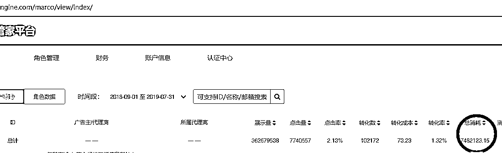

评论区：

 

 

荔枝小一萌 : 沙发。

森淼 : 厉害👍

罗杰 : 去哪儿找支持中国用户的国外cpa广告商呢

王 : 机遇错过就没了

亦仁 : 机遇年年有，就看知不知道抓不抓的住

亦仁 : affplus.com

罗杰 : 谢谢亦仁

Dom : 支持

# **# ****(**精华帖**)(133**赞**)**国人如何抓住商机，在非洲

# 做外贸生意？

作者：  鱼丸|亦仁助理

日期：2021-06-04

对个人背景要求不高，没有欧美市场竞争那么激烈，做非洲的外贸生意是个不错的选择。

不过，非洲的生意对很多人来说比较神秘，有兴趣去掘金的人往往不知道哪些商品好做生意，怎么和当地人打交道，以及和我们比较熟悉的欧美外贸业务有什么不同。

本期「一起赚美元」专栏，我们就邀请了嘉宾外贸人老师，来聊一聊少有人知的非洲生意到底怎么做。

他常驻过非洲多个国家，有丰富的海外贸易资源，操盘过进口肉类、进口快消品、出口机械设备、轮胎、空调、化肥等多个品类，可以说是位“非洲生意通”。

今天，他就会分享他的生意经，重点聊一聊选品。欢迎外贸人老师的分享。

 

 

目录

一、非洲贸易的优势在哪里

二、非洲贸易需要注意哪些问题

三、贸易进口该如何选品

1\. 进口农产品选品

2\. 进口冷冻肉类产品选品

3\. 进口快消类产品选品

四、贸易出口怎样开发客户及选品

五、怎样找到有潜力的代理商或合作方

六、非洲贸易的未来前景是怎样的

---正文---

非常荣幸鱼丸给了我在生财有术和大家分享并学习的机会，我常驻过非洲多个国家，有兴趣并实操过多种产品的国际贸易。希望通过一些分享，抛砖引玉，结识一些对非洲贸易感兴趣的朋友，相互学习、合作共赢。

一、非洲贸易的优势在哪里

 

 

非洲贸易对个人背景没有要求，当地年轻人比例大，乐于接受新事物，只要你勤奋并选好平台、商业模式、适合的商品种类和合适的伙伴，赚钱难度会相对较小。

在非洲开拓客户，如果你采用有针对性的广撒网策略及口口相传的口碑会很有效果。

另外，非洲产品原生态无污染、容易议价，而且现在国家也鼓励进口非洲较好的产品，因此是进口还是出口都有着比较好的贸易优势。

二、非洲贸易需要注意哪些问题

非洲不规范、骗子多，虽然说商机也多，但要注意安全、疾病、汇率、信用、物流包括所在国政治等风险。

如有非常信任的人领路最好，如果是第一次去非洲尽量选择有较大知名度、各方面评价较好、正规的企业作为平台，签证手续也一定要规范，出门随身要备有零钱（为安全起见），护照正本一定要保存好。

另外，尽量要从自己熟悉的领域起步，毕竟专业是获得信任的第一步。

从事实体贸易尽量选择外汇容易兑换且相对安全的国家：如南非大部分地区（约翰内斯堡一些区域除外）、博茨瓦纳、纳米比亚、西非（科特迪瓦、加纳、喀麦隆）、东非（卢旺达、肯尼亚、坦桑尼亚等）等国家，其中电商发展的较好的是南非、肯尼亚和埃及。

 

 

像安哥拉、莫桑比克等葡语系国家外汇兑换难度较大以及像苏丹、津巴布韦等受西方制裁的国家，小规模实体贸易起步要难一些。

西非和中非的乍得、马里、布基纳法索，东非的索马里、埃塞俄比亚的提格雷州，南部非洲的莫桑比克北部目前治安都不好，并且现在也要关注各国疫情防控的状况。

三、贸易进口该如何选品

贸易要时刻关注汇率，考虑到近期汇率走势利于进口，先谈谈进口选品，成规模后进口和出口贸易可以考虑同时做，汇率方面形成对冲。

**1. **进口农产品选品

非洲农产品和水果进口是有时效性的，主要是和国内反季节销售。

比如产自卢旺达、埃塞俄比亚和乌干达等国的咖啡（事实上很多日本品牌咖啡都原产于埃塞俄比亚），卢旺达的辣椒，产自贝宁、埃塞俄比亚和坦桑尼亚的大豆，产自南非的水果（鲜葡萄、苹果、柠檬、葡萄柚、橙、柑橘等），南非的苜蓿草，产自肯尼亚的冷冻牛油果，产自尼日利亚、莫桑比克和坦桑尼亚、苏丹等国的芝麻，马达加斯加的丁香等。

以农产品（非洲大豆）为例。首先在我们海关网站查到该国的农产品商家准入名录（「商家」意味着未必都是厂家，有的也可能是经销商）。

 

 

纳入海关准入名单的商家一般已通过海关（原质量检验检疫总局）审核、有初步的信誉，这个名单上面有商家联系人的邮箱，可以逐一发正式询价邮件，对比之后选择回复专业且正规的商家进一步洽谈。

通过邮箱和厂家名称，也可以查到公司网站（下一段详细描述），最好能先要到一些样品。

如果当地有朋友（尤其是当地可信任的业内/律师朋友），最好实地考察一下，在不熟悉对方的情况下，付款方式首选不可转让的信用证（而尽量不选择电汇），同时一定要注意在合同中约定当地验货标准和包装方式，并把违约条款约定好，请当地朋友帮助监装和发运，同时需要供货商出具权威第三方的验货报告如 SGS 检验报告，并及时提供提单、原产地证等资料。

贸易中报价及时性很重要，如何能第一时间获得外方商家信任呢？

以坦桑尼亚大豆为例，目前坦桑尼亚只有一个大豆商家获得准入，通过准入名单中的外方邮箱，可查到商家网站，发现网站中有很多法文、在法国也有公司，因此第一时间通过在坦桑尼亚的法国朋友联系上这个商家并获得大豆报价，拿到报价后要注意看报价有效期（一般几天到几周不等）、付款方式（信用证）、包装和运输方式（集装箱运输），国内买家要找使用过非洲非转基因大豆的客户，起步期尽量让客户自己负责清关。

**2. **进口冷冻肉类产品选品

冷冻肉类分为牛肉、猪肉、鸡肉。

 

 

非洲目前只有南非和纳米比亚两国有厂家获得冷冻牛肉输华许可，但量不大。冷冻牛肉、鸡肉（主要是冻鸡爪和冻鸡翅）近期主要是来自南美洲（巴西、阿根廷、乌拉圭和玻利维亚）以及俄罗斯等独联体国家。

以冷冻猪肉为例，曾通过在非洲认识的朋友联系到获得准入的欧洲商家，先签署买卖合同，约定好各个时间点和违约责任，买家预付一定比例的定金，外方备货并发运。

发运后外方先将提单及全套清关用文件草本扫描发来，审核无误后，买家付剩余尾款，外方快递文件正本，集装箱到港后客户自行清关，曾先后成功进口数百吨，并建立了稳定的合作关系。

肉类贸易本身难度不大，主要是选好靠谱的合作方，然后根据国内客户需要，拟定好对内和对外的合同，尽量选畅销的部位肉（注意是否带骨带皮）、时刻关注价格波动、仔细审好所有相关单据避免到港清关延误。

现在来自南美洲的冷冻鸡爪和冷冻牛肉具备一定性价比，但肉类价格波动大，另一方面南美国家政策变化频繁（阿根廷最近刚刚禁止出口牛肉一个月），品质、数量参差不齐，还曾出现厂家将同一票货卖给多个买家的情况，现在国内港口也普遍存在冷冻货柜滞港情况和增加消杀环节，因此起步期要先和有经验的买家合作，控制好风险。

等有一定实力后，可以考虑逐步介入存储（如冷库等）、加工环节，逐步拓展自营销售渠道（尤其是在综合保税区内将农产品和肉类进行初加工），也是考虑在商品价格变化的情况下，可以存储或借助供应链金融等待升值时再出售，或直接深加工/分装（大包装变小包装）实现产品增值；猪肉现在也推出了期货，可以考虑和现货对冲。

**3. **进口快消类产品选品

 

 

欧洲、非洲有知名母婴用品、高端服装、家居用品希望寻找国内代理商，这主要看个人对哪些领域销售渠道熟悉。

以母婴用品中的纸尿裤为例，首先要和国外厂家就国内（最好是独家）代理权达成协议。然后要通过专业的进口代理公司弄清楚清关流程和中文标签要求（标签一旦不合规，会很耽误事情）。

如果这个产品之前没有在国内销售过，要让外方先发足够的样品，事先到海关指定的危险品中心实验室获得检验报告，检验合格才能顺利完成进口清关。欧洲产品的规格、相关标准和国内略有不同，需要在标签中明确。

四、贸易出口怎样开发客户及选品

关于出口，选好产品和合作伙伴很重要，收款时要注意货款来源正规清晰。

实体贸易，第一次见面很重要，每次接触之前我都通过朋友或互联网做足功课，会根据每个客户不同的侧重点准备好自己的介绍材料或一些特色随手礼，谈话时注意从对方感兴趣的事情或是对方当下业务的痛点、难点入手，快速地让对方了解到双方互补性及成功可能性，特色随手礼让对方能记住自己。

建立了初步信任后，通过积极快速的反应及一个个小的合作项目累积，逐步建立信任，后来他们一些集成采购业务都委托给我的团队。再一个经验就是已销售产品的后续配件服务，像发电机配件、水泵配件、车辆配件（轮胎等）、矿用机械配件等。

 

 

能解决客户急需的问题利于友谊加深。比如现在很多非洲国家疫情严重，不仅缺少防疫物资、更缺少医用注射器、疫苗冷藏箱、储存药品的冰柜等，同时居家普遍喜欢音响、游戏机等。

非洲农业和安防方面，设置了当地语言的无人机、高清摄像头都有着广阔的市场。日常用品中，除了假发，如煤气罐及配件、蚊帐、驱蚊产品在网上营销会取得不错效果。

此外，盲盒、手机游戏、手机音乐、手机叫车（除了优步，尼日利亚、肯尼亚和安哥拉都有国人在开拓）在非洲应该有不错的前景。

如果要扩大已有外国客户的采购量，首先是要做好售后服务，保证买方出现的问题能够及时解决，树立良好的口碑，这个主要要靠和当地合作伙伴合作；也可以考虑聘请非洲一些本土明星做平面广告（如流动的车辆、机场、公路主干路、大型建筑）。疫情期间出国难度加大，扩大贸易规模就要注意运用好金融工具。

这里主要谈一下通过购买中国出口信用保险公司（国内唯一的一家出口信用保险公司，也是政策性出口信用保险机构，并非商业保险公司）的特险服务扩大出口量。中信保也可以帮助审核外国客户的资信状况。

特险业务实际上是卖方允许外国买方客户 1 - 2 年内分期付款，但通过投保出口信用保险（保费可以）来保障及时收款，因为南部、西部非洲银行的贷款利息普遍高于 15% ，因此外国买方往往愿意承担保费以换取分期付款。

卖方拿到保单后可以凭保单在国内商业银行进行债权买断，等于商业银行提前把后续分期款在货物发运后先行支付给卖方，之后外方分期还款给国内商业银行，一旦发生逾期还款，出口信用保险公司会代为追讨欠款。

 

 

除了出口信用保险公司的保险业务，一些商业银行、保理公司也推出进出口贸易资金池、循环授信等业务模式，这些前提都需要外国买方客户要足够优质（有较好的财务报表、负债率低、有一定的行业知名度），并且积极配合。

但说实话，这种优质客户并不容易找，因此可以考虑与在非洲有业务的欧洲和中东客户合作。

比如在安哥拉、莫桑比克等葡语国家做贸易，可以考虑找葡萄牙人合作；在科特迪瓦、喀麦隆等法语国家做贸易，可以考虑找法国人合作等。再就是要考虑国内和非洲的利息差、汇率差，南部和西部非洲银行利息年化普遍高于 15% ，汇率波动更是非常大。

而目前国内的贷款利息 4 - 6% ，欧元、美元贷款利息都不高于 3% 。这方面可以合作的空间很大。

如果一时无法去非洲，现在电商平台如阿里巴巴国际站、虾皮（重点是东南亚）、京东出海（印尼、泰国站）、阿联酋 NOON 、非洲的 KILIMALL （肯尼亚）、 JUMIA （尼日利亚&肯尼亚）、 Takealot （南非）、 Zando （南非）、 Tospino （加纳）等是很好的入手选择。

非洲的不少电商平台对中国商家实行免费入驻开店政策。

这些我也在学习和摸索中，之前在生财看到通过虾皮电商往东南亚卖小金龟很受启发，利用好时机、选好一个细分领域很重要，希望和大家多交流，抱团发展，做好电商贸易和实体贸易的融合创新会非常有前景！

五、怎样找到有潜力的代理商或合作方

 

 

相比国内的生意模式，在非洲谈生意比较简单直接，但可持续性差，因此要不停地开发新的优质客户，找到潜力股即成长型代理商很重要。

这需要勤奋的广撒网和一些缘分，找准找好、共同发展，将得到长远的收益，其中道理类似于知名的咨询公司更愿意培养有潜质的优秀毕业生加以培养而不是靠猎头挖人。

国内一个知名白电厂家非洲负责人曾经讲其在非洲拓展的经验：初入非洲时，冰箱、电视机等都是日韩和欧美品牌的天下，不认可我们的品牌，只能联络那些不受日韩品牌重视的当地代理商（尤其是有优秀教育背景的年轻代理商），或者是日韩品牌代理商中被边缘化的一些经理人，通过更好的合作态度及更贴近客户的产品改良（当然还有更好的价格和售后服务）赢得这批代理商的支持，辅以合适的广告宣传，逐步扩大知名度，进而合资设立组装厂、发展工业园区，渐渐成长为在非洲知名度名列前茅的白电品牌，海外销售额占集团总销售额的 30% - 50% 。

合作期间也多留意合作伙伴的需求，并提出共赢的建议，比如有合作伙伴参与当地电站/医院建设及设备供货，可以尝试洽商共同参与电站/医院的运营，参与耗材和用品供应。

这方面做的很好的还有手机中的传音。

六、非洲贸易的未来前景是怎样的

在非洲创办企业不难，很多模糊地带可以人情化处理。之前在非洲的传统贸易主要是靠不停地跑客户，客户下单后，就安排发货，到港后跑清关，不厌其烦地交流和解决各种问题，满足客户五花八门的奇怪要求，逐步筛选出互相信任、共同成长的重点客户。

 

 

实际上，在适应了语言、文化习惯差异，并克服安全风险、疾病等问题后，把前期工作做扎实、选好合作对象，剩下的低买高卖，并不复杂。

但目前的非洲疫情态势和科技日新月异的发展，过去的经验已然不适用。未来应该是电商平台和实体贸易相结合，增加产品附加值，打造差异化的非洲品牌。

对于进口，可考虑多个伙伴合作批量采购、分散出货、加工增值；对于出口，利用电商平台开拓新的客户，并运用各种金融工具做大与优质客户的贸易额，在细分领域做出名气。

南非、埃及等经济较好的国家有很多支持创业的基金，在非洲上市更是可望并可及，期待生财有术的非洲创富群！

P.S. 如果你也想在生财有术专栏分享你的经验和认知，请点击链接

http://form.shengcaiyoushu.com/f/HA1G1g  填写表单，我们会陆续邀请有赚钱相关经验和案例的嘉宾做分享。如已填写表单请忽略。

评论区：

鱼丸|亦仁助理 : 感谢  的分享，大家如果有什么问题，可以直接在评论区留言~ 森忆 : 我老家有人收旧鞋子说是卖到非洲的。但具体流程就不清楚了

外贸出奇致胜 : 是的，造就了一代成功者，后来陆续在非洲建厂了，尤其在埃塞，规模非常大

外贸出奇致胜 : 非洲Tiktok自媒体和脸书营销也很有前景

抖音之路 : facebook是投广告吗

外贸出奇致胜 : 对，在一些非洲明星的脸书上投广告或隐形带货广告

子瑜 : 干货满满！

外贸出奇致胜 : 谢谢，互相交流，共同生财

 

 

# **# ****(**精华帖**)(69**赞**)**网红** Tufting **店如何长期盈利

# 及复制开店？

作者：  跨境杨少

日期：2022-08-29

本文提纲

1.如何判断副业/小项目的可行性和成功率

2.网红tufting店的成功案例和失败案例

3.人群画像：情侣、女学生、亲子、95后女性、跟风族

4.选址关键字：商圈、地铁口、小区、院校、写字楼

5.平衡点：以尽量低的开店成本满足基本的客户体验

6.店铺引流：低成本、精准、高确定性流量

7.提升转化：产品线布局、引流款、利润款

8.可复制=商业逻辑闭环：精准、供需平衡、ROI可持续

9.复制开店案例及相关培训

正文

 

 

大家好，我是跨境杨少，一个12年跨境电商老卖家，也是一个连续创业者，从零开始起盘的创业项目有：港/美股程序交易、培训行业SNS、餐饮（高端西餐酒吧）、跨境电商、支付通道服务商、出海日本服务商、抖音知识付费（选品课）、以及**tufting**手工店。作为重症蓝海偏执狂，我大多数的创业项目切入点都是蓝海无竞争的，近十年来除了餐饮项目亏本关停（如果大家感兴趣，可以分享非常干货的失败复盘），做的大部分项目年变现均在百万级别。

今天分享这个跟跨境电商无关的小项目：网红**tufting**店。虽然说与跨境电商无关，但项目运营的底层思维和方法论，有很大部分是一致的，也是我独创的《选品四层方法论》在线下的一次小实践。

# **# ****1.**如何判断副业**/**小项目的可行性和成功率

通过《选品四层方法论》中的最下面两层，即**“**套利**”**层及**“**流量**&**转化**”**层，可以快速判断绝大部分副业及小项目的可行性。

# **       a**）套利三要素

即：信息差、低成本、确定性

 

 

**        **信息差就是蓝海思维，规避竞争，别人不知道就你知道，比如十年前的跨境电商。很多成功的老板其实是蓝海偏执狂。

**        **低成本就是尽量减少初期投入，包括时间成本和资金成本两方面，比如已经臭名昭著的“跨境电商一键铺货代发”就是这样的。跨境电商十年前是可以做到低成本无脑创业的，现在已经不大可能，只有一些专业的打法可以做到类似感觉，这个日后另作分享。

**        **确定性就是1.确定很赚钱利润空间很大，2.确定已经有人跑通了。要尽量避免自创模式，多尝试模式复制。确定性最好满足信息差和低成本两个前提，当信息差足够大，投入足够低的时候，往往也代表着高确定性。

那么网红**tufting**店是否满足方法论里的套利这一层呢，tufting这个项目的信息差最早起源于2021年12月的小红书，当时信息差十分巨大，在2021年底和2022年1月第一批在中大城市抢先开店的几乎都是1-2个月收回所有成本投入（甚至包括预付的半年房租），投入成本方面，房租3000-6000即可启动，设备及软装投入1万左右（前期投入在本文第4小节具体分析），这在线下实体店中是明显属于低成本的。一副tufting的物料消耗成本在10-20元区间，而客单价普遍可以做到200-400元，这就是赚钱确定性，第一批开店成功的店铺模式则为我们提供了模式确定性。

**        **不专业的人选品，专业的人选模式；先变专业，再变有钱。

生意的底层在很多时候是差不多的。

所以，中小创业者请记住：无套利不创业。

 

 

# **       b**）流量就是精准和便宜

流量获取方式千千万，各种玩法讲不完，有的人擅长三天三夜故弄玄虚，我喜欢一针见血。

很多新手/小创业者在创业前甚至没有流量思维，或者把引流想的过于简单，“喊人发发朋友圈”或者“喊朋友来给我好评”不就行了吗，有这种想法的副业创业者极多，很多实体店老板热衷于发传单，这是典型的流量外行，因为不仅没有精准人群的概念，传单的成本也很贵，导致转化成本无法估算。跨境电商界玩铺货的，其流量逻辑本质上是撒大网，守株待兔，幼儿园孩子都知道守株待兔是贬义词，这样能发财世界上就没有穷人了。

很多老板以为自己有精准营销概念，但其实未必，我有个很绝的判断方法：你觉得奔驰新C怎么样？

大部分男性老板对这个30多万竟然全系1.5T的样子货嗤之以鼻。

大部分女性老板对这个30多万的“小S”（新C内饰为S级下放）满心欢喜。

男女对立如此之大，男女之间互相不理解，这些男女都不真正明白精准二字。

大部分善于换位思考和具备共情能力的人会把这个问题回答的很好，渣男就是其中之一，渣男最懂精准，渣男只转化可转化的，此言不虚。

有人流的地方就可以开tufting店吗，显然不是。tufting店不适合开在商场里，因为商场的人群不是精准人群，商场的流量（体现在租金里）也太贵。这还没计算商场店铺更高的软装成本，但开在商场里的tufting店几乎每个大城市都有。同样都是老板。

如何解决这个问题，我们在本文第3-6节讨论。

 

 

# **        c**）转化就是便宜和好

**        **便宜的流量是老板需要的便宜，便宜的转化是客户需要的便宜。

便宜还获得了好东西好体验，就不愁没转化。

有些人很推崇那些把便宜的东西卖出极高价格的营销个案。个案不可复制，个案没有意义。

中小创业者不要言必称Jack和Pony，不要过分关注商业思维类自媒体拆解大生意大人物，个案没有意义。

过分强调个案，从个案引申理论，是典型的思维水平比较low，每天迷信个案分享养生文和怪力乱神的父母们就是这类人群，你千万不要在另外的行业变成你父母的样子。

选品上过分关注新奇特，过分追热点和跟卖的跨境电商卖家有很多，过分关注术，不花时间总结道，人迟早因为困境而焦虑，这个困境就是拿不到红利长的品类。因为新奇特产品的红利期会随着信息差的暴露而快速衰减。

选择开tufting店就是一次选品，也属于追逐新奇特蓝海信息差，这个项目的店家在2022年后半年确实也都慢慢面临竞争加剧，红利变少红利期缩短的困境与焦虑。

tufting店要解决这个问题仍然是通过流量与转化两个方面，如果你的流量成本有优势，你在价格战中就有优势，而如何在转化上建立优势，我们在本文第7节讨论。

 

 

# **# ****2.**网红**tufting**店的成功案例和失败案例

# **       a**）开店前考察到的成功案例（临平）和濒临失败的案例

# （钱江）

在钱江某office里有一家tufting店，老板是两个女生(艺术院校毕业生)，店环境很好空间很大（100多平），店名是西班牙语(背景音乐也是西语歌)，店里有很专业的咖啡机，店里有近一小半的空间放了一套不错的沙发和茶几，tufting的客单价在400+。

店内客户体验很棒，坐在落地窗前，可以一边tufting一边看窗外office高楼林立。

店铺租金一年30万，咖啡机大几万，加上软装，前期投入几十万起步。

这样的店也许是个人情怀的成功，即使满足一部分高端客户体验的需求，客单做到400以上，从商业的角度看，很难快速盈利&回本，浪费了项目红利期，赚钱的不确定性很高，甚至在我看来是濒临失败的，很明显老板不懂生意的底层逻辑。

我们考察的另一个店在临平，地铁口附近某档次一般的写字楼，年租金只有几万，几乎无装潢，简单桌椅，情侣创业，客单虽然只有200左右，但明显上座率高出很多（工作日单日销售额可做到近千），刨去各项成本，估算月净利润至少2-3万。

很明显后者的模式更适合副业/小创业者参考与复制。符合套利底层要素。

 

 

# **       b**）**“**都选**C”**的成功

经过2-3家的考察参考对比，我们更多的参考了上文提到的临平那家tufting店，地址选择在城西银泰商圈的太合中心写字楼开店。具体选址过程和选址参考要素分析详见第4小节。

店名起为“都选C”，这是一个熟词，好记，既能表达relex的感觉，又能在入驻美团大众平台时给客户从众化心理暗示，试营业期间来店客户几乎都能记住“都选C”或者“都选”二字，甚至潜意识认为我们店铺为区域人气第一，我们试图以羊群效应来提升转化，并且我们也真的很快做到了区域第一（在2个月内收回了所有投资，包含半年租金），同时我们也把“都选C”提交了35类商标注册，为品牌授权及加盟做预备。

我们在做跨境电商品牌时，也是要求要么不做，要做必须能蹭到流量或者蹭到转化，比如假洋牌。

“都选C”就是在蹭转化。

从本文第3节开始我们会从精准流量和转化等方面详细分析“都选C”的起店过程。

# **       c**）收购了一家失败**tufting**店的物料和设备

开店3个月左右，有一家失败关店的tufting店联系我们，出设备和物料，我们去他店里洽谈，一眼看出了他的问题，主要是选址不当，他的选址在一个城郊的创业园区，意图覆盖上班族人群，但这个人群平时上班，双休日又不在园区，正常来说双休日是tufting店最忙的时候，一天的销售额接近工作日半周的总销售额，但这个店双休日却没生意，因为人都休息了。

 

 

看着周围人多却抓不到，没有流量，那么转化也无从谈起。

我们以6000元的价格收购了其所有设备和物料。

# **       d**）那些开在商业中心里的**tufting**店

后续我们考察到了杭州某商业中心和南京某商业中心里的两家tufting店，上客和盈利情况都不是很理想，客单400起，在本就没什么精准流量的情况下，高客单还限制了转化率。

符合我们上文对tufting店不适合入驻商场的判断。属于大概率要失败的案例。

# **# ****3.**人群画像：情侣、女学生、亲子、**95**后女

# 性、跟风族

# **       a**）**tufting**项目人群

 

 

综合多家tufting店的考察结果，结合小红书上的推送人群，这个项目的人群非常明确首先是年轻女性，年龄范围在95后（几乎看不到95前的客户），大学在校生，甚至一部分高中生也是常客。

一副tufting的完成时间在1-3小时，很多年轻情侣也以此为新的消磨时间的约会方式，还有一部分网友初次约会和面基也选择在tufting店。在项目风口期，类似的跟风族群是比较多的。

虽然项目主要适合成人娱乐，但在双休日和假期，还有不少的妈妈带着中学生女儿一起来玩，这一部分属于大龄亲子人群。

这个人群的精准引流方式只有一个，就是美团大众的附近搜索。

# **       b**）老文娱受疫情挤压人群

在疫情常态化的大环境下，原本电影院，ktv，剧本杀，酒吧，密室等遭遇关停期间，他们的客群也对tufting产生需求，tufting属于新文娱项目，尚不在政府管控之列，因此只要不遭遇极端疫情，常态化管控下甚至长期利好此项目。tufting娱乐消磨的时间够长，花费也更便宜。而习惯老文娱项目打发时间的年轻人在老文娱关停时，tufting成为为数不多的选择之一。

这个人群的引流方式之一是与老文娱项目结成广告联盟，客户互推。玩法较多，不限于此一种。

# **       c**）小手工项目刚需人群

 

 

在进一步分析和考察别的非tufting类目的手工店后，我们发现了一个确定的需求，也解释了为什么95后00后的女性喜欢手工类项目，因为这个人群小时候已经开始接触奶油胶之类的手工，尤其城里的95后00后，在他们小时候，也就是十年前多一点，城市的商业综合体已经很多很发达，他们幼年时期的亲子活动有大量是父母带着做手工，当他们长大或接近成年的时候，她们仍然对手工娱乐项目有兴趣，这仍是他们记忆中的娱乐方式，他们需要继续找地方玩石膏娃娃、奶油胶做手机壳等手工项目，而很多城市这些项目的店铺风格仍然是只针对幼儿，并没有专门针对刚成年大人的，这些刚成年附近的大孩子，也不好意思去针对幼儿的店里去玩。

在这一点上，市场形成了供需失衡。我们考察发现，甚至在某些大城市的大学

城，竟然没有一家针对大学生的奶油胶类手工店，更不用说tufting这种新潮手工项目。

因此这在某些区域形成市场空白，这就是信息差，是典型的有套利空间的项目。

这也是为什么我们决定在tufting店中增加石膏娃娃、奶油胶手机壳等产品线，我们在本文第7节详细分析如何将这些项目作为引流款，打造相对综合性的手工店，从网红项目店往长期盈利的手工项目店发展，并实现可复制性。

# **       d**）大客户人群

年轻女性员工为主的公司的团建，此人群的引流和开发可作为店铺运营尚有余力时的选择，团队客户的资源因人而已，可结合自身情况规划，本文不多赘述。

 

 

# **# ****4.**选址关键字：商圈、地铁口、小区、院校、

# 写字楼

杭州tufting店里我们看到了很多选址有问题的。前文已经提到一个开在创业园失败的案例。

选址是围绕人群的，不是围绕老板自己拍脑门看重哪里便宜或者人多。

所以第3节咱们分析完，接下来都很简单，势如破竹。

怎么选址？覆盖上一节的人群a b c！尽量方便人群d，当然，忽略d也不是不可以。

因为很多d希望你带设备上门服务。

# **       a**）人群**a b c**必须在你周边

或者说你周边必须有人群a b c。但真的很多店做不到这个。

所以选址周边必须有商圈、小区、院校。这三个东西里面有人群a b c！

引流，营销无非两种模式，人找你，或者你找人。无论哪种，你都得离他们近一点，交通要方便一点。我做了十年多跨境电商的推广投放，广告主要也是这两种，display（展示）广告，search（搜索）广告，前者你找人，后者人找你。生意的底层就是这么相通。

大部分立即能启动成功的生意，都是得益于search广告便宜，然后产品转化率高。

 

 

因为search广告天然就精准啊，跨境电商要做到这个精准也许还需要点专业度。

tufting店不需要。

tufting店启动我们下文会详细说到，靠大众美团附近搜索。你离精准的人近，等他们来搜索你，还有比这更简单的吗。

# **       b**）不要进商场

上文有失败案例，不再赘述。商场流量不精准，流量贵就是转化成本高。这个点很重要，所以单独做标题提醒。

# **       c**）地铁口** **写字楼** **严控租金成本

地铁口的写字楼，50-60平，自带地板，白墙就可以，真的不贵，杭州城西银泰旁边的萍水街地铁C口出来几乎0米就是我们店所在的太合中心，月租金6000，大学生创业还有补贴，这样开店简直稳赚不赔。

# **       d**）周围没人开店

我们选址开店时，城西银泰附近，萍水街地铁站方圆2-3公里内只有我们一家tufting店。目前已经开到3家左右。还有同业者也想开进太合中心写字楼的，但是太合的商管很专业，对竞业有保护，不租给非我们的第二家店。

 

 

最重要的是，太合中心周边有城西最成熟的银泰商圈，有比较多的中高档小区，有院校。

# **# ****5.**平衡点：以尽量低的开店成本满足基本的客

# 户体验

# **       a**）不要选市中心商圈

市中心商圈的tufting店也许客流确实多，但租金成本压力非常大，写字楼也不例外，周围肯定有竞业同行，客单跟非市中心商圈几乎差不多。hard模式不要选。

# **       b**）尽量不要装潢

写字楼里的tufting店，赚不赚钱，跟装潢的好不好真的关系不大。这一块的前期成本可以节省很多。有很多写字楼自带的硬装已经完全够用，比如太合中心就是。

# **       c**）桌子板凳用好闲鱼

 

 

tufting有时候甚至有客户喜欢站着做，我们闲鱼采购的桌子100多一张，凳子20一个，按店铺设计布局放满，才2000块

前台桌闲鱼500，还碰到好心人免费送上门，宽带不装，或者用随身wifi放店里就可以，省去商业宽带较贵的初装费和月费，电脑也闲鱼，会配的人，1000多的整套完全够用。

# **       d**）接受培训** **购买筹备清单

时间就是成本，付费是捷径。筹备期我们看到有先期开店店家自媒体售卖筹备清单和简单教程，果断购买。

**       **从第**4**节写到这里，我们目前的成本支出就是房租**6000**，桌子板凳**2000**，**tufting**设备和物料**10000**左右，房租付**3**压**2**是**3**万，美团入驻**4800**，搜索推广充值**3000**，全部支出**5**万左右。这钱现在够开什么店？而且还是客单毛利**10-20**倍的项目。

# **# ****6.**店铺引流：低成本、精准、高确定性流量

**        **知道人群就不愁没有精准流量，但真的很多老板没有这个概念，或者概念不够完善不够系统。

 

 

# **       a**）自媒体流量没有确定性不适合用来启动店铺

前一段时间生财有上海圈友分享过tufting项目，但他的分享缺乏人群分析和流量分析，他的引流主要靠小红书，这个适合前半年项目风口期没什么竞争的时候。

有竞争的时候，别人看到小红书完全可以就近搜索别家店去玩，另外自媒体引流永远是个案，个案永远难于复制，大多数老板不掌握自媒体引流的确定性，虽然圈友分享的项目月赚10万，但我个人认为可复制的确定性较差。2022年4月份我们也付费请了杭州某小红书红人来店体验并宣传，但我们复盘其对流量和转化的影响几乎没有可量化的改变。就事论事，不针对这位圈友老板。

项目风口还没形成或者刚刚形成的时候，即需要教育和引导需求的时候，需要投display流量，自媒体就是这种，项目火起来了，需求不需要你引发，摘风口的果子，这时靠search流量，也就是上文你找人和人找你的不同，我分析这也是为什么早期启动的项目靠自媒体更好，后期的靠平台搜索更好的原因。但自媒体终究流量确定性还是有问题。

# **       b**）美团**CPC**流量浅尝辄止

能把这个项目启动成功的流量，一定是大众美团附近搜索。也就是覆盖第**3**节中的**“**人群**a”**。这一节我们只详细讲这一点，至于人群b c d的引流，上文已经提到。

 

 

美团入驻成本就是4800+3000的广告余额充值，开店的前一周，我们每天的广告消耗在200-300左右，这一周同时邀请朋友来店试玩，并走美团套餐结算，做了大概8-9个好评，4.5分左右就可以，全部给5分有一定被判刷好评的风险。

美团CPC广告（搜索广告）的问题：

1.不能限定附近范围，要推就是全城推，大部分广告支出是不产生附近转化的，远的人看到也不会来。

2.广告后台大数据分析极其简陋，对于我们跨境电商看惯了google分析后台的，深切感受到美团大众的敷衍和  自说自话，一个非常丑陋的垄断型公司，靠着垄断了互联网基础设施变相征税。

因此我们很快停止美团广告的投放（此时广告账户还有一半多钱没用掉），因为这个ROI最多打平，有时候甚至是负的。在美团如何让附近的人搜索看到你排名靠前，主要还是团购数量，好评数量。当我们在一周多把好评数做到30+之后，我们的店基本不需要任何推广费用，就靠美团的自然流量，就可以做到一个月4万左右的销售额，净利润是3万左右。

# **       c**）靠强选址解决确定性流量

总结：为了引流，前期花费就是7800，其中4800管一年，3000只用了一半，一周后的流量成本基本就是美团成交后的抽点，纯买流量的费用为0，也可以认为实现了几乎无成本的引流。

 

 

当一个生意在流量上不需要花什么钱的时候，并且流量和转化都稳定在一定规模，销售额规模完全可以覆盖租金物料人工，并且有稳定的净利润率的时候，几乎是稳赚不赔的。

店铺前期流量必须依靠美团，因为通过上文复盘，大家都明显看到这是确定性的流量，但取决于选址，选址不好，美团这边很难优化出免费流量来，这个问题我们在开店前是着重解决的。

通过确定性的流量，先做出基本盘，做出稳定利润，然后再缓图自媒体，因为自媒体急不来，只能缓图，而且谁也不敢说一定能做上热搜，自媒体流量与人群b c d的流量慢慢做就可以了，至少店铺启动成功走入正轨，做什么都没什么压力。

在城郊商圈布局区域独家，这就是抓蓝海抓信息差，开店启动资金严控在5万左右，流量上尽量不花钱，这是低成本，成功启动跑出销售额稳定基本盘，这是抓确定性。

**        **满足套利三要素，就是一个成功的生意，一个可复制的生意。

# **# ****7.**提升转化：产品线布局、引流款、利润款

# **       a**）热点嫁接** **人群嫁接

 

 

要想把网红店做成长期项目，必须抓住“人群c”，即小手工刚需人群。

tufting虽然是网红项目，但不代表不会形成长期需求，我们考察了大运河景区内众多的手工店，大多数是老手工项目，曾经也是一时兴起，但都慢慢变成的固定需求，tufting也会这样。

我们只需要把tufting这个项目绑定给小手工刚需人群就可以。

热点嫁接，跨品类嫁接热门元素，这也是跨境电商目前比较资深的玩家的打法。

我们称其为搬运双重确定性，即流量确定性，转化确定性。

# **       b**）新产品新关键词新流量** **同人群

我们的策略是增加奶油胶和石膏娃娃产品线。

奶油胶发夹客单10-20元，手机壳50-80元，石膏娃娃如果作为纯引流项目，客单也可以做到小几十。

在美团上架后，相应项目就会有附近搜索流量，会来店，有时候小女生三五成群来店，大部分做便宜的奶油胶，小部分做比较贵的tufting，还有的是这次做便宜的，下次又来店做tufting，因为没玩过要玩一次。

引流款，入口商品，利润款，这个和电商运营的一些方法是完全类似的。

奶油胶石膏娃娃的利润空间我们甚至可以放弃，换取更多的来店流量，往十倍毛利的tufting上面做转化。

 

 

# **       c**）进一步嫁接热点**IP**

大部分来店做tufting的客户，做的图案都是卡通**IP**形象，或者品牌logo（又以香奈儿居多）。

跨境电商想往标品载体上嫁接这些IP是侵权的，常规打法没办法做，一般放在POD独立站做。

但是tufting店则可以堂而皇之的蹭这些热点IP。

比如迪士尼的林娜贝尔很火，炒到1000多，买不到，完全可以自己来店做一个。

因此美团团购套餐主图，就要布局热点IP案例，引导转化。

**        **热点**ip**嫁接就是搬运高确定性。

# **# ****8.**可复制**=**商业逻辑闭环：精准、供需平衡、

# **ROI**可持续

# **       a**）模式的威力

 

 

第一步，先满足套利三要素（信息差  低成本  确定性）。找蓝海。

第二步，找到流量捷径，转化捷径。走捷径。

第三步，品牌要有转化加成。加光环。

第四步，组合式创新/嫁接。建立护城河。

这四个步骤我们可以启动一个线下店铺，也可以启动一个跨境电商线上爆款。

这就是模式。选模式才是选品的精髓所在。

# **       b**）给网红店续命** **做长期店

很多网红店为啥命不长，无非需求消失了，或者供给过剩了。

供需失衡了，也就是没流量了。

续命就是续流量，就是把供需再次平衡起来。所有商业问题都是流量问题和转化问题。

通过一个网红产品，可以触达一个精准人群，持续挖掘这个精准人群的其他刚需，可以反哺网红产品或者高毛利产品的流量和转化，这也是选品常见的套路之一，即由品到人，再由人到新的品。

抓产品的老板赚不长，抓人的老板抓模式的老板赚的长，给网红店续命的逻辑就在这里。

# **       c**）复制长期店

 

 

解决网红店变长期店之后，就可以不停做复制，一线城市选址机会没了可以去二三线城市。

目前即使tufting店开店已经较多，但布局人群c，抓供给空白，抓刚需的选址机会在准一线城市还有很多。

只要严控启动成本，测算回本期小于3个月，月净利大于2万，ROI投产比是良性的，就可以大胆复制。

# **# ****9.**复制开店案例及相关培训

# **       a**）南京江浦筹备开店案例

目前我们同时在推进南京和西安两地的开店，这里以南京江浦店为案例。

根据我们第4节的选址模型

南京和西安都是院校资源集中，城市容量大，城郊有密集人流和成熟商圈的城市。

我们发现南京江浦这个城郊区域目前有成熟核心商圈江北虹悦城，并且是地铁口，周围人口比较密集，院校有好几家，江北核心区小区也比较多，但整个江浦区域没有tufting/奶油胶/石膏娃娃产品供给。这非常类似杭州临平和下沙第一批开店赚钱的店铺当时的情况。这是典型的满足我们的套利模型。并且可以复制我们的引流模式转化模式。

 

 

租金成本方面，虹悦城附近地铁口上盖写字楼的月租金只有3000多，且为比较实用的LOFT，二楼可以做储藏室，这个成本只有杭州一半。西安同地段的成本也跟南京差不多。

桌椅设备物料成本不变，美团入驻成本不变，租金便宜，人工略便宜（如大学生或自由职业创业，自己一个人就够了，不用请人花费人工成本）。

# **       b**）店长培训

**        **店长建议由**95**后温柔细心女生担任，大龄店长或男性店长会让来店客群紧张不放松。店长要了解大部分动漫IP，可以做1-2句共鸣式沟通，也不要话多烦到客户，年轻客户容易紧张容易烦。一定要夸一次客户做的好，一次就够。hello和拜拜要有朋友式的感觉。能做到这些点的适合做店长，进行如下培训。

1.按筹备清单采购设备物料

2.店内布局优化，工位数量最大化，并兼顾小手工项目空间

3.设备安装调试，学习tufting全流程操作

4.tufting教学，教会客户

5.往来迎送，过程check，及时support客户，方式与分寸

6.闭店整理整顿，统计物料消耗，安排进货

7.美团套餐上新及维护，分析美团数据，维护评价

8.在有余力的情况下做自媒体，做广告联盟互推，做大客户

 

 

评论区：

游心 : 虽然从事的是电商，未曾接触过实体，但也借鉴到许多通用的底层思维。

比如最低成本试错、确定性思维、流量和转化的逻辑等等，都能迁移运用到自己所处的行业中。

感谢用心分享，受益良多[爱心]

跨境杨少 : 同是电商人，确认过眼神，遇见懂的人!

AI训练师小凡 : 好文章，学习了，准备下一步调研我这边当地情况，后面去实践这个项目。另外想咨询一下杨哥，你在文中提到的选品四层方法论，是你自己的理论吗？还是其他老师的？哪里可以学习到？可以简单分享一下吗？谢谢杨哥~[呲牙]

跨境杨少 : 是我的独创的理论  你可以抖音搜索“杨少选品思维”学这个课  也可以加我kuajingyangshao

27 : 请教下这个问题，一个月销售额4W，净利润为什么可以做到3W诶，人工+水电+原材料+房租可以控制在1W吗

跨境杨少 : 房租3000-6000，自己做店长，物料成本2000以内，招店长的话成本算6000起

亦仁 : 感谢分享，已加精华。

跨境杨少 : 感谢亦仁大大哦

# **# ****(**精华帖**)(45**赞**)**靠苹果**AppStore**和**Googleplay**

# 的官方推荐获取流量的案例

作者： TikTok Gia*

日期：2019-05-19

一起赚美元

关于亦仁提到弹出的dialog里“OK”和“Cancel”位置要遵循大平台规范的事情，一下子就勾起了我的伤心又甜蜜的往事。

 

 

先卖个关子，国内有很多小而美的创业团队，抱着创造梦想、改变世界、造福用户、不忘初心的理念，笃定自己产品的品质过硬，酒香不怕巷子深，几乎从来不买量。尝试过花钱去投放，但为了体现自己公司和产品的逼格、调性、品牌，投放的物料（文案，图片，视频，落地页）都是严格遵守广告法。换句话说，就是高大上不接地气，点击转化率做不过利用人性弱点游走在规则边缘的同行，导致投放的获客成本太高，然后抱怨世道不公，劣币驱逐良币。如果不是资本实力足够雄厚，产品刚需/好用/易用足以甩开同行十条街，那最后只能自怨自艾。

针对这部分团队和产品，怎么获取流量呢？靠口碑？量太少了。细水长流，要等几年才能量变到质变，到时候黄花菜都凉了，投资人也撤资了。更何况，大部分品类还不合适口碑传播。所谓的病毒传播，更多是运气+天时地利人和的加持因素。

这时候大杀器就来了：

苹果AppStore和Googleplay的官方推荐

业界俗称被爸爸Featured。

苹果Today位置的威力，做流量的都知道吧。

去年（18年）到北京出差，见了一个创业团队，我问他们流量从哪里来，老板就说了三个词：Featured+换量+ASO，基本是“能不花钱就不花钱”，“能少花钱就少花钱”。

在Tom叔6年前刚出海的时候，那时候应用商店产品少，三天两头就被推荐，开发者自己还不知道。只能事后知葛亮，去查新增用户曲线上升的原因：噢，原来被Featured了。

很早的时候，AppAnnie还不能跟踪被Featured，那更是盲人摸象。

套用今天的流行语，开发者还以为K-factor起来了，用户裂变了。结果自己都不知道真正的原因是被爸爸们宠幸了。

大概从15年开始，Tom叔就默默给自己定了个指标：每个季度争取一次Global Featured（全球推荐）。因为是工具类App，没有文化差异，所以全球推荐很合适。一般工具类App每次被全球推荐，都能拿到几十万到上百万不等的下载量。

16年做海外游戏发行，由于语言和文化的限制，只能申请特定地区的Feature。比如当时发了一款菠菜游戏，在北美地区，拿了一个月美国和加拿大的分类推荐，由于品类限制，也不是特别优质的位置，但一个月也因为推荐免费获取了小几万菠菜用户。如果去facebook或者Google adwords买量，至少需要10-20万美金。

被苹果谷歌两个爸爸钦点的时候，经常会遇到打回来的情况。主要是商务团队和审核团队不是一帮人，商务是亚太区，在北京香港新加坡，审核（Review）团队基本在美国。

 

 

流程一般是：开发者和商店商务团队（BD+AM+CSM）处理好关系，然后提前一个月（一定要提前至少一个月，注意排期）和你的商店客户经理沟通好，申请推荐的主要理由有:

1、接下来会有个重要的版本上线，我们全面翻新了产品，balabala……不建议每个版本都去申请，一定要是2.0，3.0，4.0这种大的version去申请，否则，人家还嫌你烦，拎不清。Bug fixed版本也来申请，就把你打入黑名单。所以，综合下来，3-6个月一次较为合适。

2、每年爸爸们都会发布新的OS系统。这时候，会哭的娃有奶喝，会叫的鸟儿有食吃。

和爸爸们说，我们是先进分子，第一时间适配了iOS12、Android Q等，比如3D Touch，Siri唤醒，统统全面来一套（即使可能是使用率不到1%的鸡肋功能）。爸爸们心情一好，就会给你个推荐，还放到一个category里，美其名曰：适配最新iOS。

3、付费功能，尤其是最近几年很火爆的订阅/连续订阅等功能。你想想，苹果谷歌一看，这开发者下载量不低呀，最近要做收入规模了，我们还能有30%分成，赶紧给他导流看看。如果小的位置推荐后流水大，ROI效果好，恭喜你，上Today不是梦。

4、卖弄情怀，比如独立开发者，讲个地下室头悬梁锥刺股封闭开发3个月的故事，山姆大哥们很容易被此类故事感动。手一松，推荐位就来了。注意，措辞注意分寸感，不能用感动中国的煽情度去感动美国。此类旁门左道，在早期比较合适。现在审美疲劳后，成功率大幅降低。主要还是产品品质说话。

发散太多了，回到最开始说的，大家猜到我要说啥了吧。Bingo！

谈到被美国审核团队打回来，我们最开始经常犯的错误，就是Android和iOS设计规范的差别。比如从苹果拟物化设计，到扁平化设计，再到微软的Metro设计，谷歌的Material Design，每次设计语言的改动，都会把我们的产品+研发+测试团队折腾个1-2天。

以OK和Cancel的位置来说，一般团队会以iOS开发优先，专业的iOS开发工程师会把Action Button（即OK）放右边，Cancel Button放左边。移植到Android和WP平台时，UED设计师给的稿子，也会依葫芦画瓢下。这就埋下了一个大坑。

这种Dialog修改的看上去细枝末节无足轻重的工作，主管经理们基本都会丢给刚毕业的小RD、UED去做。所以，几乎每次被推荐的时候，我都要帮着擦屁股。

 

 

三番五次后，我总结出了经验，自己先钻研一遍各大平台的开发者最新文档。如果下次要申请Feature，我就先把平台最新版本的RD和Design Guideline先发给相关小伙伴，大家先自查一下，有则改之，无则加勉，然后再去申请推荐，审核团队开心，我们也省事。Tom叔后来甚至组织过新入职的研发和产品同学，定期学习谷歌和苹果的培训课程（毕竟能主动拥抱规则变化的人不多）

举个印象最深刻的例子。

几年前，有一次经过各种软磨硬泡（黄金三法则：不要脸，坚持，不要脸）。我们商店客户经理给我们排期到一次全球推荐，然后转到审核团队，直接抛出14个产品里需要修改的点。如果算上我们违反Material Design的各种设计细节，估计超过20个。此外，适配Android不同分辨率也是个大坑，以及物理键和虚拟键的坑（Back位置的设计）。

我当时就一头黑线。

你没看错，需要改14个点。

爸爸要求7天内必须改完。

否则前面的付出就白搭了。

更糟糕的是，Email送达时间：

美国时间周五（北京时间周六）

结果呢？我们周末加班，2天不到，周一下班前（美国时间周日）全部修改优化掉，并测试上线了。

爸爸周一一上班，收到我们邮件，都惊呆了，连连Congratulation我们，表扬我们中国人做事效率就是快。

不过，这种心惊肉跳的事情，其实没啥可吹的。应该从源头就去防微杜渐，需要团队有极高的产品和技术素养，去关注最前沿的技术和美学语言。

泼个冷水，随着App Store和GooglePlay商业化压力的增大，Featured的难度也越来越大，  流量质量也越来越参差不齐。比如17年的几次全球推荐，每次大概带来了30~50w用户，国家分部也比较均匀，比如美国10%，印度20%这种，和全球人口分布比重接近。但到了18年，明明约定是美国、日本、韩国的用户，最后被推荐的绝大多数是印度和印尼的用户，用户留存也掉到冰点。呵呵，咱也不知道，咱也不敢问。

 

 

总结一下，我的职业生涯里，迄今为止被官方正式officially 提名Featured，至少10次以上。后面可以专开一个帖子，再详细讲讲怎么能获得全球流量最大的两个爸爸们的青睐。否则我很可能就忘记了，里面的个中滋味，只有亲历过才知道，几乎全是坑，说多了都是泪。

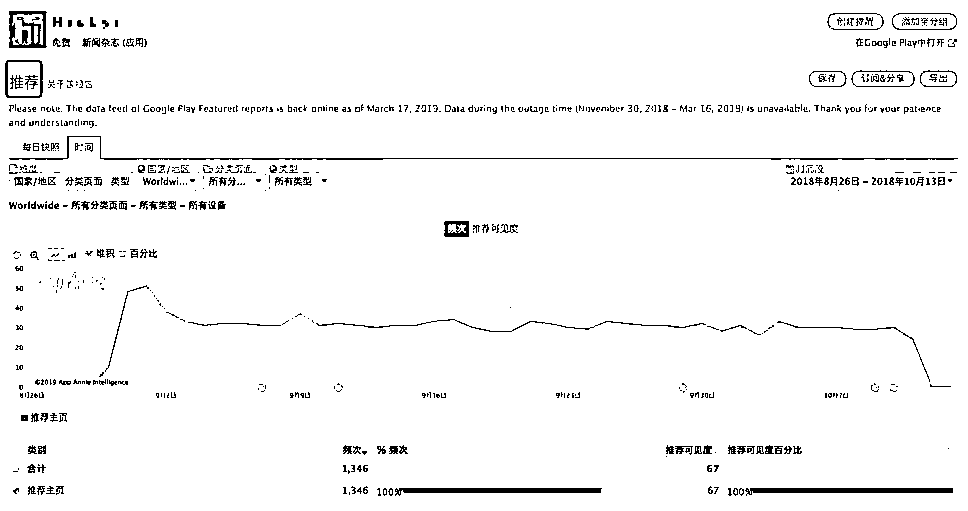 

 

 

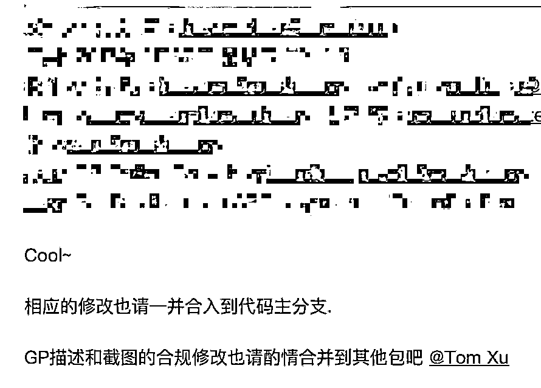

评论区：

田宝【私人号】 : 经历都是财富

黄北钦 : 我们一直被iOS不过审的问题折磨，产品上不了线

TikTok Gia* : 可以多聊聊

亦仁 : 已加精华。

光追20220908 : 专业经验，够不着。但是收获是：各种软磨硬泡（黄金三法则：不要脸，坚持，不要脸），这个可以给自己打气用在很多方面。

 

 