# (精华帖)(102赞)关于出海工具产品营销推广，我的几点经验分享

作者：  非洲水手

日期：2023-03-30

大家好，我是非洲水手，19年加入生财有术，见证了一大批大佬们在生财发现了新机会，挖掘出了第一桶金并不断放大。作为出海8年的老兵，一直深耕工具和游戏产品的买量，目前在一家头部Web3负责海外用户增长。因为一直在移动互联网出海营销圈，接下来的分享会主要以App为主，过程中也希望能给大家带来一些不一样的思维碰撞。

今天我的分享将会分成两大块：第一部分是中国工具出海的时间线及1月非游榜单产品方向发现，第二部分是一个App工具产品投放流程和数据分析方向。

恰逢看过吴晓波的《激荡四十年》有感而发，今天在这里想先和大家复习下中国工具出海的时间线，这激荡二十年也大致可以分为4个时期：萌芽期，起始期，扩张期，转型期。

 

 

首先是萌芽期，1998-2007的中国互联网发展早期，在那个还是Copy to China的时代，在中国工具出海第一人周奕的带领下，以MP3 CD Maker为开始，中国互联网出海迎来第一波曙光。

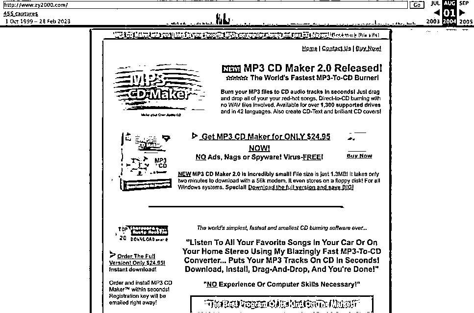

也是在这个时候大家开始意识到，工具出海是可以抹平中西方文化差异的。随着2007年iPhone初代及Apple App Store的发布，移动互联网时代开启，中国工具出海进入了起始期，久邦、百度、360、UC、金山等国内玩家开始在海外“低调地”攻城略地，闷声发大财。

接着到了2011-2016年，移动互联网出海正式进入扩张期，工具出海渐渐形成细分领域：手机管理类，如Clean Master；相机图片类，如美图秀秀；桌面类，如Solo Launcher、Go Launcher；浏览器类，如UC、海豚浏览器等。不到0.01美金的买量成本，动辄数亿数十亿的安装量，迎来了出海资本的明媚春天。

这个时代也催生了众多广告代理公司，如Yeahmobi、Mobvista、Avazu等，或自己开辟了广告代理业务，如猎豹CM。很幸运我也是在这个时代入的行，服务过很多当时的明星产品，有幸见证了出海行业的辉煌时代。

 

 

好巧不巧，时间很快来到2017年，工具出海经过了几年的黄金窗口，增长方式越来越多元，变现方式越来越成（kua）熟（zhang）。与之同时的是海外人口红利越来越少，产品同质化越来越严重，平台规则（主要指Facebook和Google）越来越收紧。

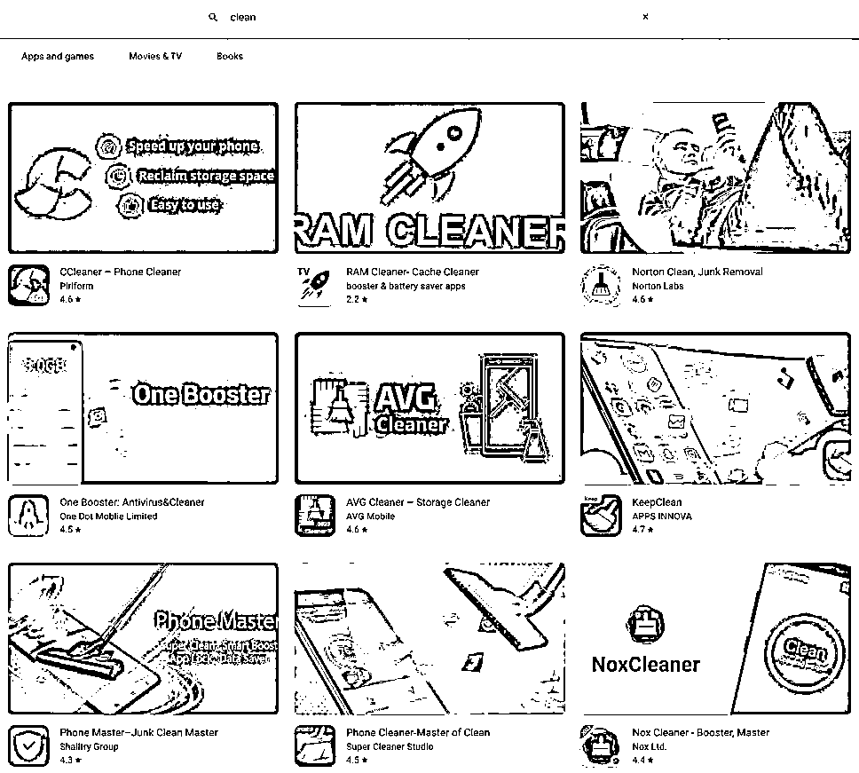

 

 

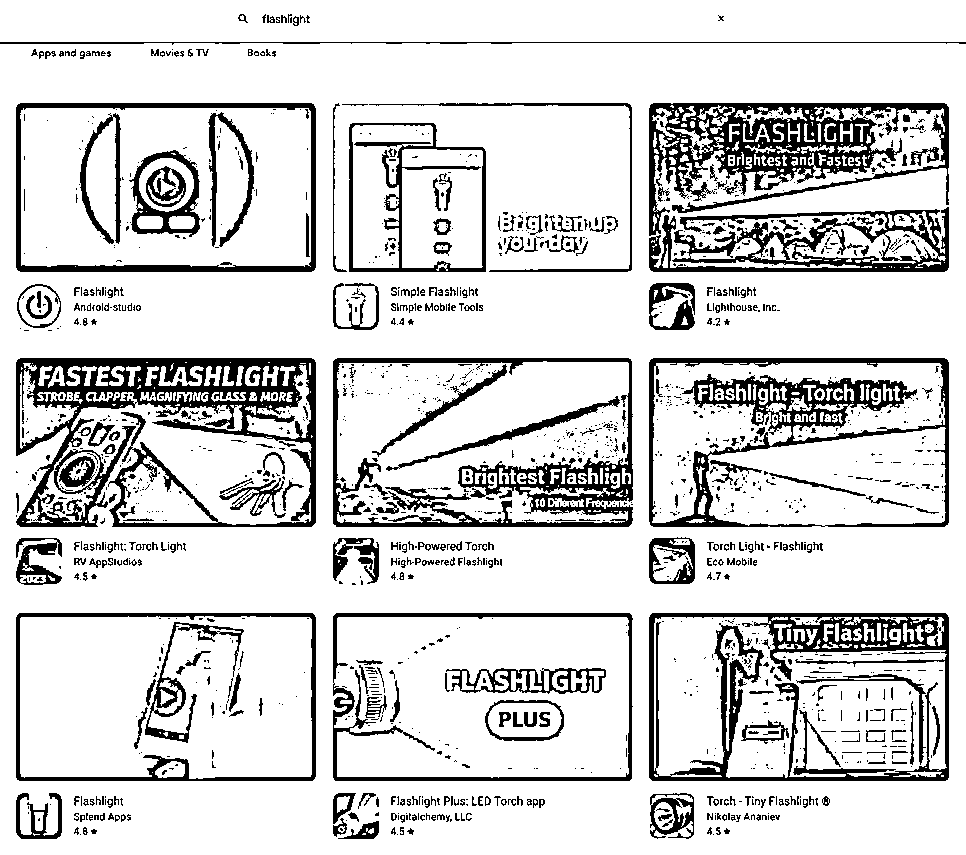

久邦股价腰斩而退市，Google、 Facebook相继禁止锁屏广告，Facebook更是暂停了中国区工具广告主的广告投放，Google相继下架了iHandy、猎豹等开发者的总计几百款工具产品，看空工具出海的声音不绝于耳，利益空间不断被压缩，工具出海行业被迫转型。

难道中国工具出海要止步于此？

时至今日，工具产品受到的冲击仍未停止，抖音快手头条等内容平台开始崛起，挤占了工具用户的大量屏幕时间，部分国家政府出于各种原因封杀中国开发者App，东方力量遭受了不公正的对待。于是经过几年的蛰伏，中国工具出海带着成长的阵痛，开始深挖海外用户硬刚需。

那就让我们通过这份AppAnnie 2023年一月份的非游收入榜，我们来看看有哪些有意思的产品方向发现：

 

 

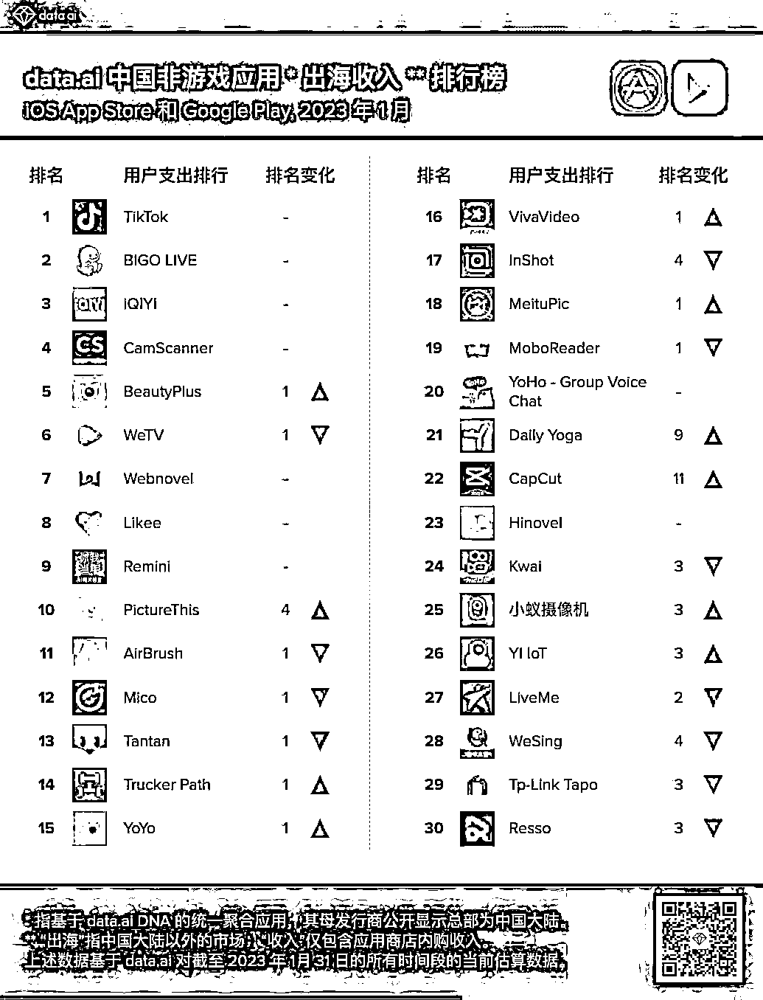

 

 

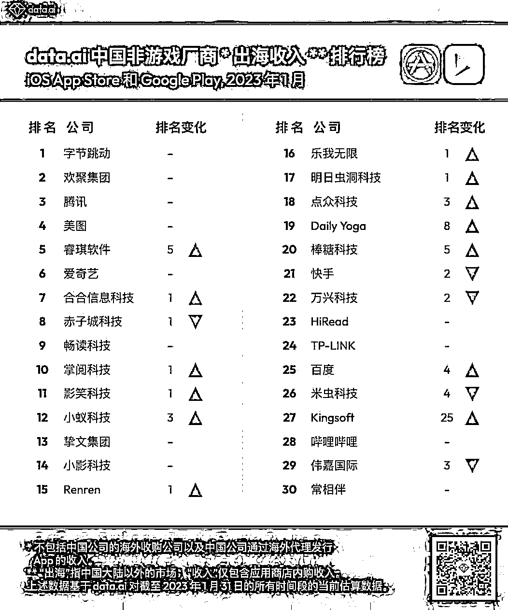

 

 

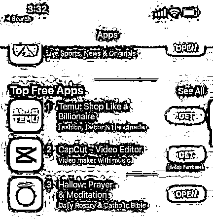

海外主流的数字营销方式包括但不限于以下几种：

当然还有一些更适合Web3产品的营销手段在此就不做列出。营销方式虽然很多，但一定要找到合适自己产品方向的营销手段。

对想要做长期品牌建设的玩家来说，可以多手一起抓，官网SEO和SEM保证关键词流量牢牢把握在自己手里，红人和社群运营加深用户的品牌认知，视情况可以考虑效果广告以获得更多的商品出单，各种组合拳来慢慢磨合出最适合自己的媒体营销矩阵。

但实际上对大部分中小开发者来说，最直接有效的营销途径其实还是打效果广告，主要指SEM和社媒广告，如果商业模式成立，通过买量迅速放大。

 

 

国内常见的渠道有百度系、腾讯系和头条系，咱们做出海的，一般需要接触到的都是一些全球性的流量渠道，大媒体主要指的就是Google 和Meta (Facebook)，现在TikTok 也通常被认为是新的大媒体渠道了，此外还有一些Twitter、Reddit等的海外常用媒体流量渠道，那就需要具体根据你的产品类型来做流量匹配了。

当然你最好可以准备一些广告名词扫盲：

认准了产品方向，又假设你有了一个完成度80%以上的产品，那我们就进入下一个环节——买量：一个App工具产品的投放流程（以Facebook为例）。

首先是开户问题，如果你身处大陆就不要想用个人户跑了，100%只有挫折。

有营业执照的话，Facebook的大陆账户开户是有返点的，能拿百分之几看你的商务能力。

Google大陆户返点现在几乎是没有了，但是海外户还能拿到10～20的返点（FB也有），能找到少部分源头25+也不是没有可能emmm...

TikTok的大陆户返点政策会少一些，但是最近也有海外户开始往外放了，返点比例可以做到全球统一。这部分可以扩展的太多，有机会的下次再聊。

因为Google没有给我们提供一些用户属性之类的选项，更多的是依靠Google的算法来做智能投放（UAC）。而Facebook就给我们提供了很多定位和尝试的可能性，这个教程也会主要分享下Facebook投放的基础流程。

在Facebook投放之前，，如果你是通过代理商开下来的账户而非个人户，那这4个东西你一定已经有了：

提醒一下：现在的新账户切忌挂羊头卖狗肉，即拿A产品开的户去跑B产品，这个是Facebook严厉禁止的，有一些2017年之前的老账户还是没问题的，但是这么宝贵的账户资源就是行业熊猫，用一个少一个。

 

 

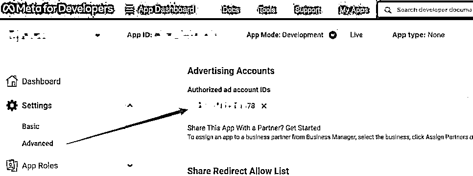 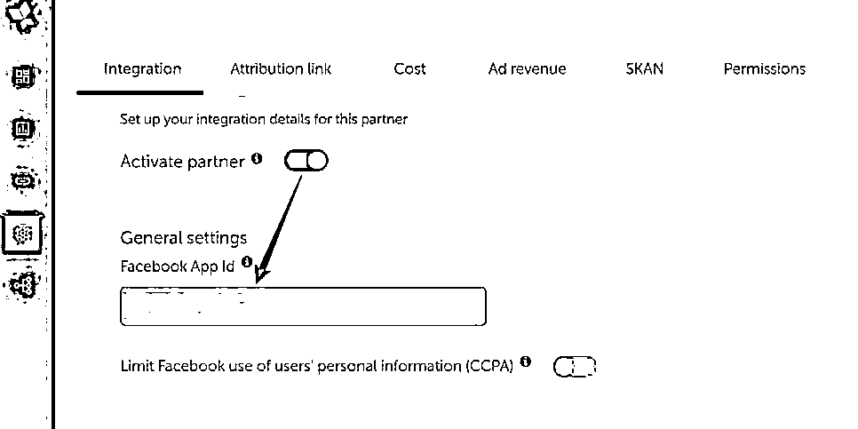

下面就开始正式进入投放流程，一起来傻瓜式操作~

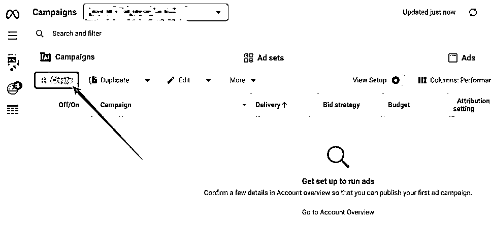

 

 

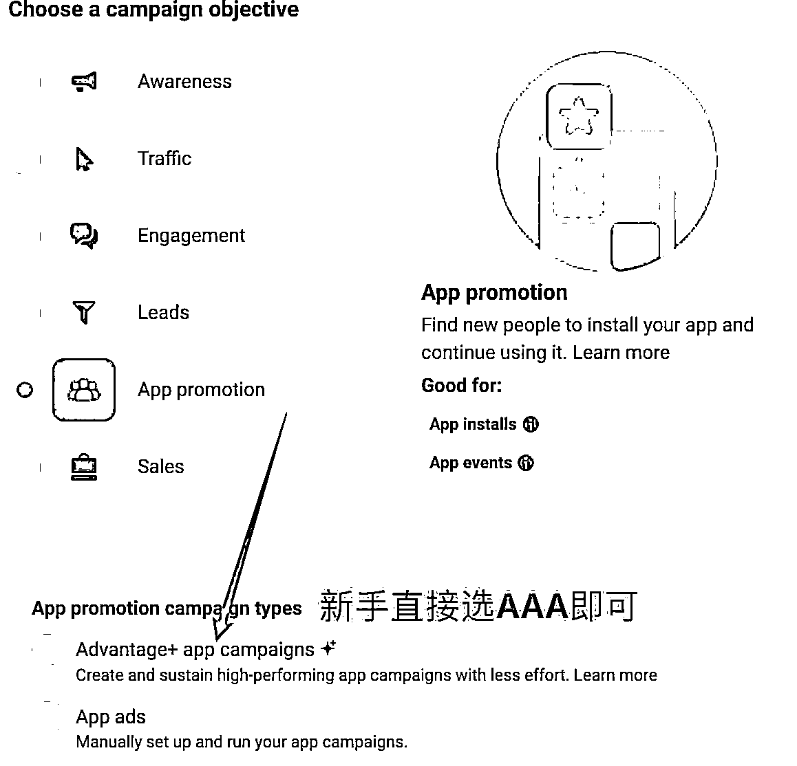 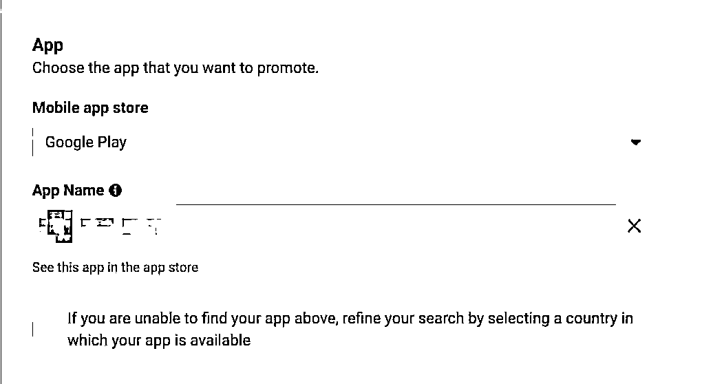

 

 

 

 

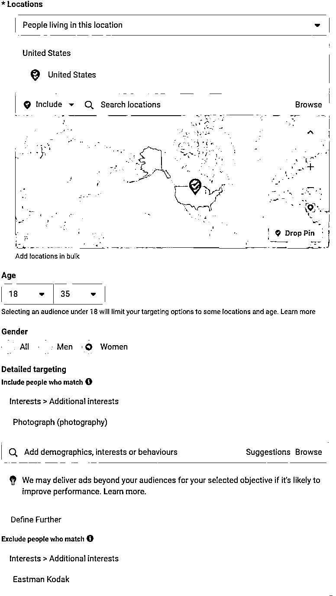 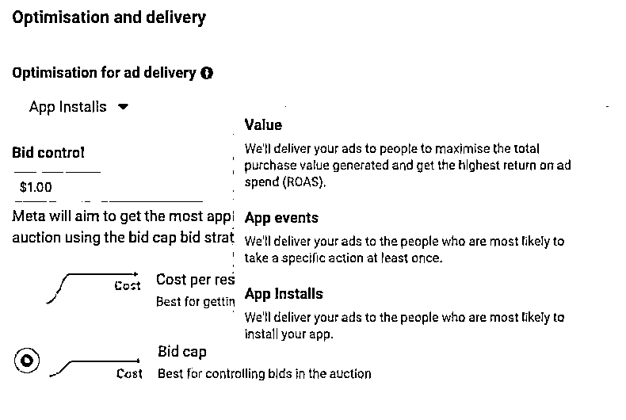 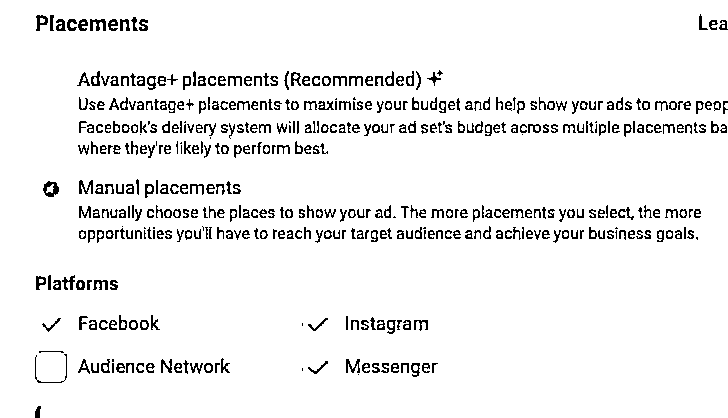

 

 

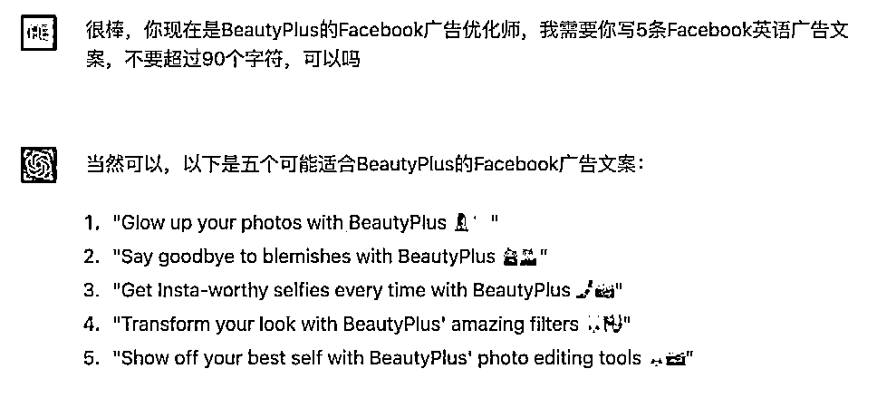

广告投出去之后当然数据也很重要，我主要会看两个部分，一个投放监控，一个竞品分析。

先说下平常不太看但需要关注的几个指标：

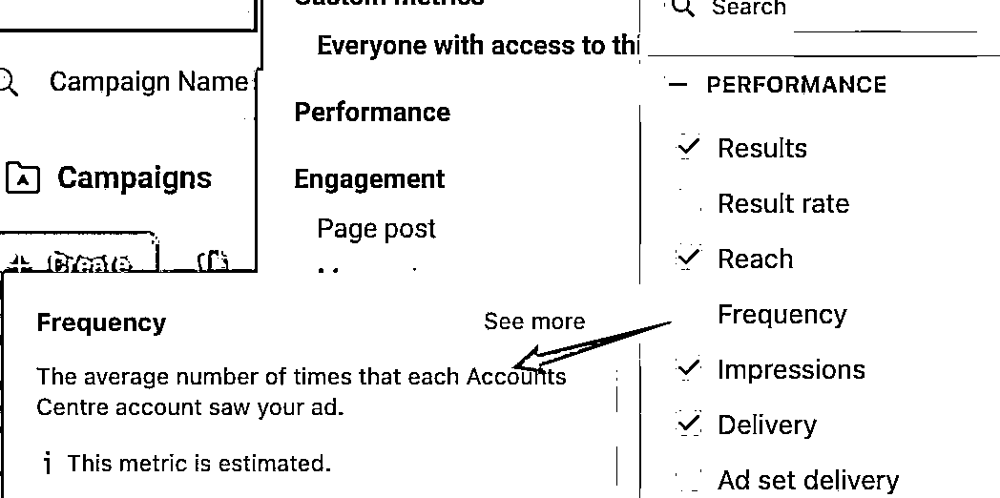

 

 

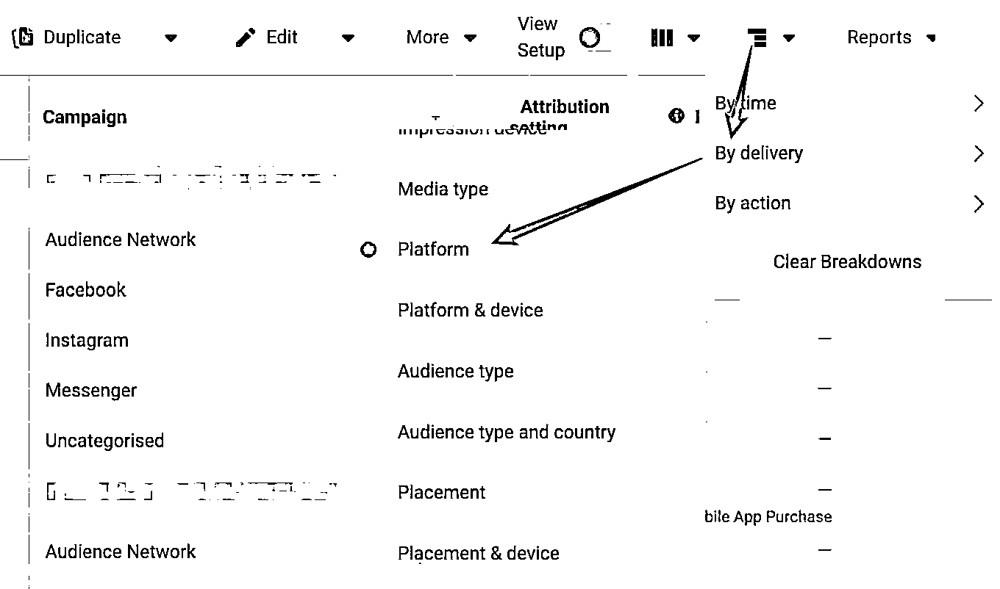 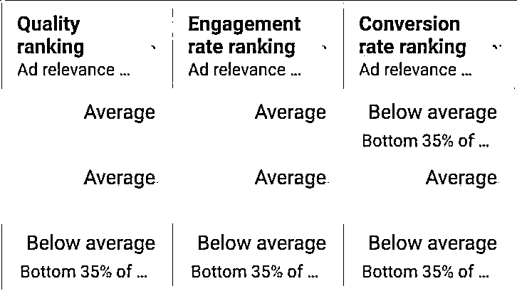

再说下广告日常监控，主要指标是花费Costs、主要App Events以及收入（计算ROAS），可以通过MMP（Appsflyer等）、广告平台直接拉、自己创建BI等方式获取，但收入这东西比较敏感，你可能不放心传给MMP，那就自建个BI来看数据吧（听我的，代码交给ChatGPT，可以吗？）。

 

 

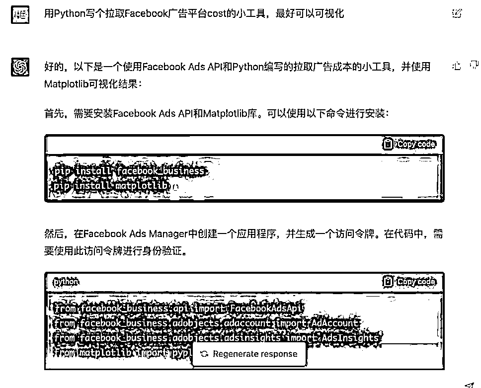

如果还是觉得麻烦也可以直接用Google Data Studio，因为可以自定义数据源，所以这个面板不仅适用于查看广告数据，SEO、产品用户漏斗等都可以通过DS来实现。

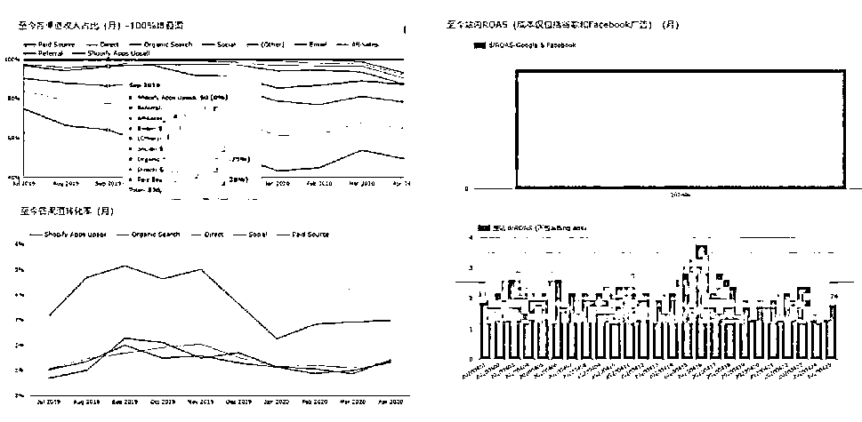

至于如何做竞品分析，其实星球里已经有很多帖子了，我也就不做太多介绍了，我今天还是只想推荐一个最原始但最有效的办法：亲自刷广告。

 

 

不要吐槽刷广告的效率，市面上最贵的广告Spy工具，相信我都没有你手动刷出来的Facebook广告实时，特别是那种多赞多评论的广告，留个心眼，务必一键三连，该赞就赞，该评就评，该收藏就收藏，顺手再加个购物车，下次人家投LAL的时候说不定就把预算花在你身上了呢～

所以从今天开始，准备好一个干净手机，挂好干净节点，装上Facebook、Instagram、TikTok，再GP免费榜上下载几个评论说全是广告劝人不要下载的“垃圾app”，这就是你的最强Spy工具！

最后，感谢各位教练以及各位志愿者的答疑指导和耐心帮助，我这里也简单分享几个小福利给大家：

如果你想要查询你的竞品工具的话，航海期间，我可以帮你免费做代查询（因为账号比较金贵，不能多点登陆），我查询好后会以图片或pdf格式反馈给大家。

以上就是我今天的分享啦，谢谢各位！

评论区：

财神 : 非常好，感谢分享

双平 : 这是真正的大佬，向大佬学习[抱拳]

开发买量澳洲 : 一看到appannie pro，顿时觉得水手大佬好牛逼，求好友位代查，v: arkilis

动次打次🙈🙈 : 您好  请问还可以帮忙代查询吗？

亦仁 : 感谢分享，已加精华。

大龙哥 : tiktok剪辑视频软件有哪几个？AL验证这个怎么解决的呢  非洲水手 : AL 验证您是指什么呢

大龙哥 : 人脸验证啊，二次验证
