# (50赞)2023年东南亚的跨境电商，一个出海的时代序幕正在进行

作者：  夏冰雹

日期：2023-07-25

大家好，我是夏冰雹，一个做东南亚跨境电商的卖家。

作为早期分享东南亚电商创业经历和资讯的一员，在持续深耕东南亚电商行业3年之后，希望通过自己的2篇演讲分享内容，给生财的伙伴，带来出海尤其是东南亚电商出海的一些信息更新。

(因为个人时间的原因，并未将其进行重新整编，还请谅解。)

以下内容我将其更新为2部分：

 

 

在上半部分，《穿越寒冬，东南亚卖家的增长困局与自我跃迁》中，我将为大家分享，在东南亚红利期的电商平台下，我因为选取模式的不同，所遭遇的困境与突破方向。

在下半部分，《拥抱变革：东南亚卖家的持续增长与创新之路》中，  我将通过跨境电商底层的变化和卖家的成长之路，分享【卖货人】需要跨过的几个门槛。

其中，我认为对生财圈友有核心价值的是：

**1.**在国内增速滞缓的情况下，在中国跨越中等规模陷阱的过程中，势必会带来大量就业的不饱和，中国人会越来越多的往外走，东南亚是必争之地， 早出海，早吃肉。

2.在东南亚地区，中国对印度尼西亚、菲律宾、越南，这三个人口过亿且发展落后、具备产业转移潜力的国家，有巨大的时光机效应，仍是未来3-5年的出海热地，要出海，先去这三地。

3.在东南亚地区，虽然电商已经不像前几年拥有大量小白玩家可以入场捞金的机会，但另一种本地化的机遇也在出现。

以下正文。

# 上半部分：《穿越寒冬，东南亚卖家的增长困局与自我跃迁》

 

 

（2022年11月26日）

大家好，作为一个暂时还没有被市场卷死掉的小卖家。

站在这里，是希望跟大家探讨，一个不能够完全称之为寒冬，

却也是陷入在增长困境的泥潭中的我，

为什么会这样，应该怎么办，将来往哪去 的思考。

我们先来看一组媒体的数据：

shopee在2021全年的订单增长是116%，这意味着，只要在2021年初，卖家在shopee上开店，就有机会吃到年增速116%的“平台红利”。

也是在去年，我看到太多“几个人”的团队，在半年到1年的时间，在东南亚的任意一个市场，迅速做起来一个月营几百万的项目，

包括我们自己的团队。

而在2022年，纵观全年，我无法给大家一个确切的数字，但我们自己的团队体感是0-20%。增长很慢甚至没有增长，但却也没有死掉。

所以，不能够称之为寒冬，因为没有发生大范围的卖家死掉，相比于亚马逊2021的大规模封店潮与限制库容，相比于国内的电商卖家几个月都发不出货。东南亚的卖家，只能说是陷入了增长的困境。

增长的困境来源于哪里？

我们先看整体的市场空间，我们首先得承认的是：

 

 

第一个，东南亚相对于欧美、中国，整体的市场空间有限，尤其是单个市场，体量更小。整个东南亚市场前三名（印尼+泰国+菲律宾）的GDP加起来，堪堪够我们一个广东省。

第二名泰国，还没有我们湖南省GDP高。

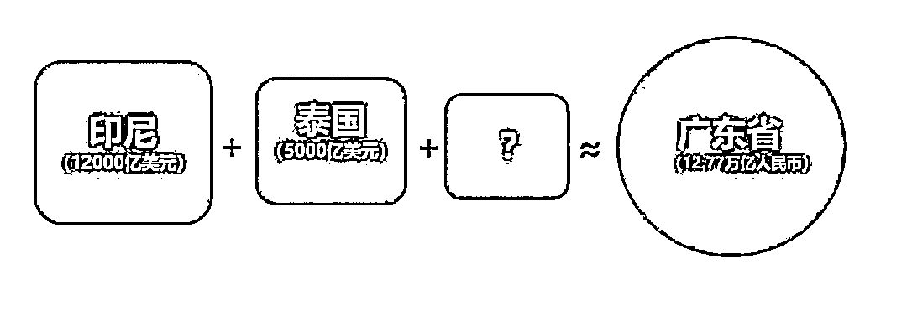

我曾在群里看过这样一则对话：什么？你在做印度尼西亚的电商？

那地方的交易量还没坂田多！

话粗理不糙，其实东南亚尤其是单个市场的天花板，是非常有限的。

在有限的市场空间里，大多数会且只会出现一种结局：

强者越强，弱者越弱。最终，赢家通吃。

我们再看电商市场，2014年、15年，在移动互联网的浪潮下，lazada、shopee在东南亚的市场快速兴起。

 

 

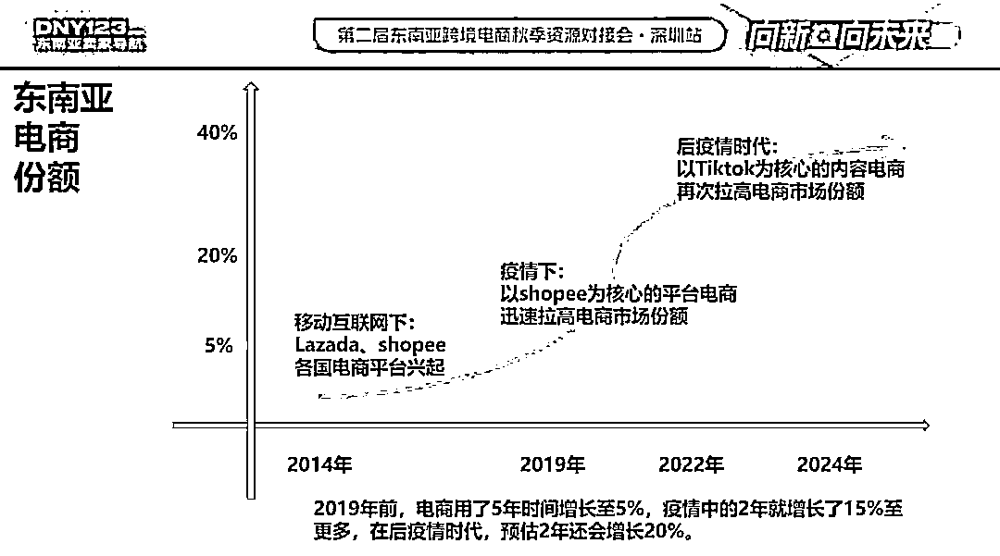

直到疫情开始，线下交易接近冻结，以shopee为核心的平台电商，在疫情下快速发展，提高了东南亚电商市场占零售总市场的份额。

所谓的东南亚的市场红利，其实是线上电商对传统线下零售的侵蚀。

2022年上半年，东南亚多国宣布疫情全面结束，线下零售全面恢复，线上的发展进入相对瓶颈，电商的机会也减缓了。

与此同时，Shopee股价开始大跌，很难以高市值向市场拿钱。

在线下市场恢复，平台电商减少砸钱买量之时，电商份额的增长不再由平台电商驱动，以TIKTOK Shop的内容电商成为新的领头羊。

**“**红利期**”**电商平台的势能开始转变。

第三，Shopee正式进入成熟期，具体的表现是，

在东南亚市场，产品的供给开始大于用户需求，在大多数的**“**关键词**”**下，都有超过几十甚至几百上千的产品。

卖家亦然，从疫情下，卖家可以通过更低价格、更快时效的本土模式（物流省下的成本），享受市场和平台的双重红利。

到疫情后全面放开，市场红利消失，需求红利消失。

 

 

潮水退去，我们在裸泳。这个时候拼的不是谁游的快，而是谁更有肌肉，谁更有性价比。既然大家产品大差不差，只要你价格更低，你就可以获得用户。

东南亚市场，已经全面进入了本土供应链的竞争态势。

在市场空间有限、平台增速有限、市场内卷严重的三重大前提下，

我们卖家怎么办？

必须要正视自己的是：过去的发展，好像也不全是自己的实力，更多就是时代的运气。

潮水褪去之后，发现自己只有：

1.称不上正规军的团队：内部团队并不够专业化，人才稀缺，且运营上也十分粗犷。典型shopee卖家特征是，老板作为一头牛，干全公司40%、50%、60%的业绩，拉着公司一起跑。

**2. **算不上有竞争力的供应链：Shopee的客单价大多在30-50块钱，这个客单的产品，大多数都是1688采购的，能便宜几块钱？很难与竞争对手拉开明显的竞争优势。

3\. 不够性感的投资回报和躺在仓库的一堆死货，除中国台湾外，东南亚卖家的订单利润率其实很高，但是客单价和周转率非常低。

4.以及面对未来增长的深深的无力感。

我们卖家怎么办？

我想讲一个我们自己的故事。

 

 

我是一个本土精铺型卖家。什么叫做精铺，就是在2021年，精选产品，挑一挑，然后本土备货过去。在市场和模式的双重红利下，在shopee的任何一个站点，都有30%利润以上的产品，都卖得好，都好卖。

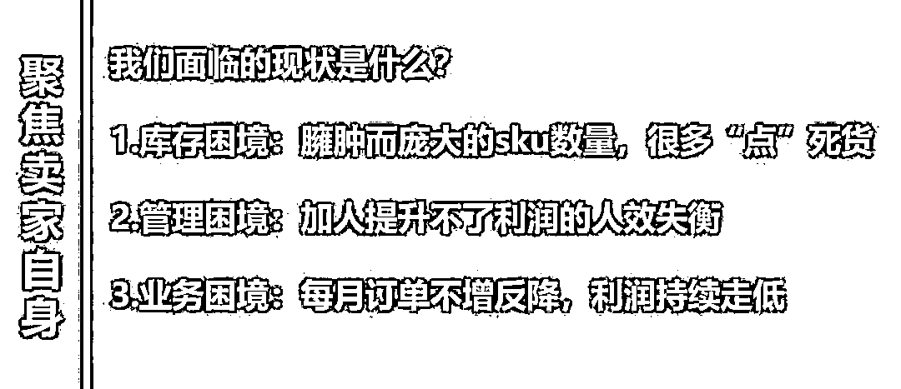

于是，今年上半年，我干shopee一年半，团队选了超过3000个品。

好消息是，陆陆续续淘汰了1000个。

坏消息是，还有1500个不动销，不动销的品，剩几个、十几个、二十几个，不算不知道，一算吓一跳。

感觉自己赚钱了， 结果钱都在货里，货不卖了、成了**“**死货**”**。

不仅如此，随着不断增加的SKU，每周还在产生新的选品，总要人来管吧？于是团队不断加人，利润一算，全发工资了。

人效失衡开始成为严重的问题。平台没有增长，内部管不过来，销量不增反降，利润持续走低。

我在想公司是不是要倒闭了。

**1.**定方向：得转型做精品

 

 

作为卖家，我们不是来东南亚市场扶贫的，如果有朴素的使命，就是赚钱，朴素的愿景，就是在东南亚电商里赚到1个亿，朴素的价值观，只要赚到钱就是好猫。

但实际上，原有的商业模式已经支持不了我们赚钱了。

必须转型，不能只卖货，要做精品，要搞品牌。怎么搞？

目前，shopee80%的卖家都在朴素的抄作业，包括我自己。只有极少数的卖家在搞开发。这些卖家辛辛苦苦搞的开发，自己还没赚几天钱，马上又被跟卖的盯上了。

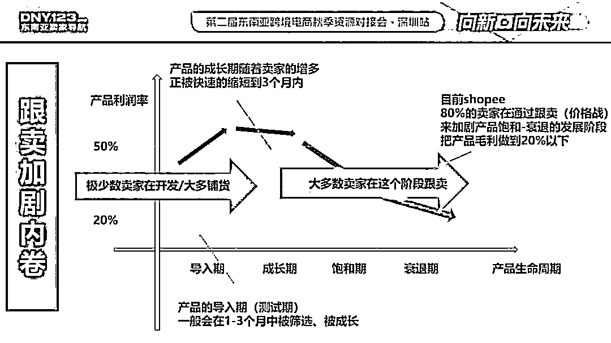

我这里不是在讲开发和跟卖的区别，我是在讲我的做法：

在电商市场的产品，都是有生命周期的，我把所有在衰退期、没有利润的产品全部砍掉，全场7折。（当然，部分有供应链资源的伙伴，可以从工厂端再次降低成本，继续内卷。）

我把所有在饱和期的产品，让我的小伙伴全面开启价格战，你降一块，我就降2块，直到没有利润就砍掉。

 

 

在成长期的产品怎么办呢？他是我们的宝贝，我把他从我剩下的500个sku里找出来，未来1到3个月，70%的利润都是这些宝贝们贡献的。

我尤其重视，在我聚焦的方向上，引入东南亚市场中，还没有的**20%**的产品，把他做起来。他们能支持我们未来6个月甚至1年的利润。

既然，平台上绝大多数的卖家在偷懒，在轻而易举的跟卖，而不是往重了做分析，理解用户，挖掘和打造属于这个市场的产品，我们得做做产品开发了。

这就来到了第二个环节：算账。

**2.**算清帐，把有限的资源集中到最有产出的事情上

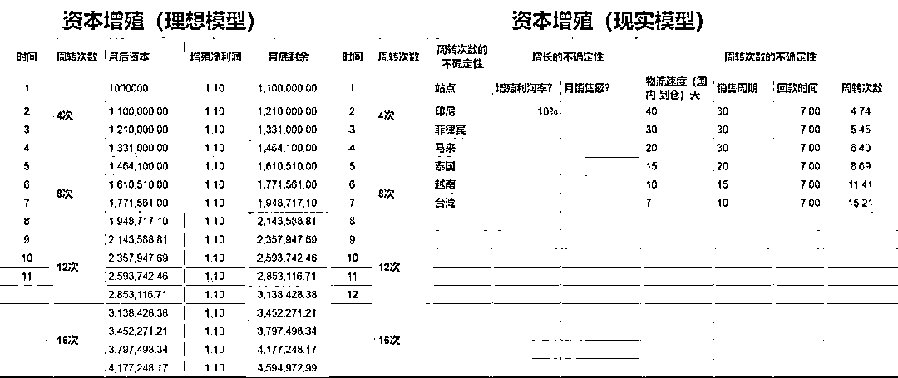

这里的帐，指的不是财务的帐，是业务的帐。

每个企业的资源都是有限的，你的精力是，你的员工的精力是，你的资金也是，包括平台的资源包、你的广告预算也是，

要把最好的资源放到最好的产品上，不能分散。

所以，你看你的项目，投资回报比怎么样？（要不要做东南亚电商？）

你看你的市场，那个市场的资金周转率更高？（选择哪个站点？）

你看你的产品，那个产品比较好，比较有潜力，比较能帮你赚钱？（怎么挑选类目和产品？）

也就是在算完账之后，我暂时性放弃了印尼，全面主攻泰国。

 

 

也是在算完账之后，才能快刀斩乱麻的把那些产品都清掉。

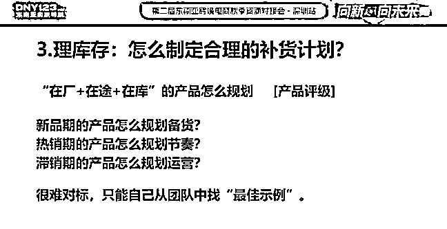

**3.**理库存：进行产品分级，加快库存周转

这里的库存，不是那堆死货的库存，东南亚本身就是全球清货的市场。

我指的是，那些要聚焦的品类，那些很有潜力的新品，应该怎么补货备货呢？

我们团队内部有一个共识：如果这个品，没有把握做起来，就不要做。既然要做，就要做**TOP**。

我们把产品分为ABCD4个等级，重点在2个环节去动态调整产品的评级。第一个是市场调研阶段，这个产品在市场中，处于什么样的周期？这个产品目前的TOP10的月销在多少？目前的销售趋势是持续上升还是已经进入饱和？

在这个阶段，我们会进行第一次产品评级。

按照A、B、C、D四个等级，进行产品的第一次备货，就应该瞄着TOP打，不成功便成仁。

但是，有没有可能分析不够到位，盲目判断了？

 

 

所以我们要在第一次测试的时候，根据我们的干预手段+流量释放，进行第二次的产品评级，点击、加购、转化率有没有达到TOP产品的指标？（调整评级排序，再次分配倾斜资源。）

每个类目每个产品的情况都一样，不可能每个产品都能上TOP的。

只不过在你有限的资源里，给ABCD的产品，不同的备货和运营资源罢了。

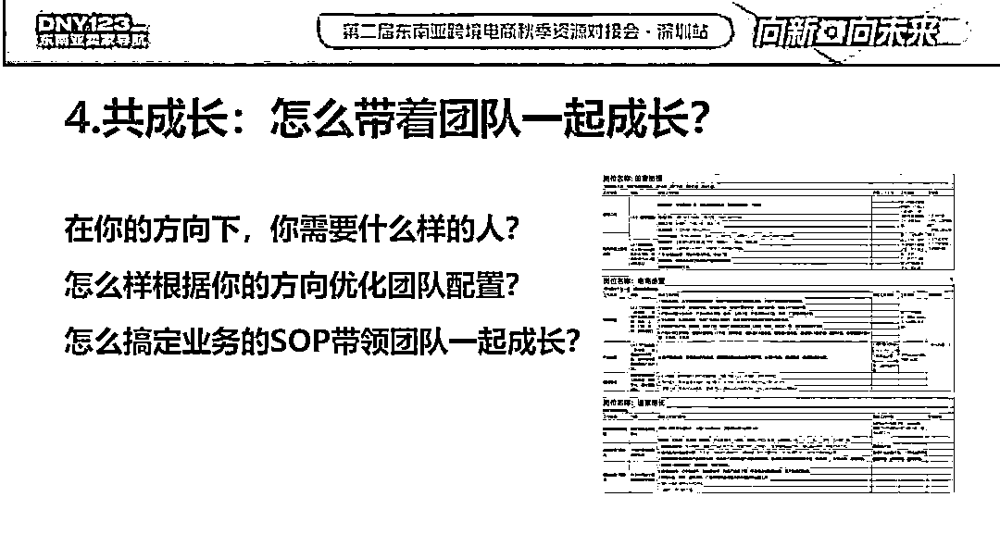

最后一块，是共成长。

你的方向在哪里？你想做一个什么事情？

你想做精品？你就需要往供应链去挖。

你想做品牌？你就需要内容方面的人才。

你想简简单单赚点钱，你就应该把能开掉的人都开掉，能省出来的钱都省出来。

你要想管理省事，你就必须搭建从运营助理到运营到运营组长的SOP。（可以加我微信获取：xiabingbaol）

你想要业务流畅，你就必须搭建从定市场、品类，再到选品及产品运营的精细化运营链路。

也就是在这一系列的动作之后，我们团队实现了连续4个月12-15%的订单与利润双增长。

 

 

2022年，我和很多的卖家交流，因为我有做一个卖家俱乐部，叫做起航俱乐部，大家在一起交流，逐步得到的共识是，

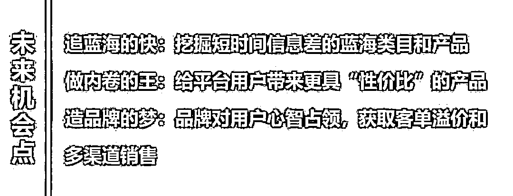

卖家在东南亚的未来机会点有且只有：

追蓝海的快：挖掘短时间信息差的蓝海类目和产品。一些玩蓝海的卖家跟我说，只要shopee不倒台，消费者的需求就是在拓展和迭代，只要我软件扒的够快，蓝海产品永远在！

做内卷的王：给平台用户带来更具**“**性价比**”**的产品，还有一群玩家，拼命搞内卷，我都不爱跟他们玩，局外人会说东南亚市场真的卷啊，卖这么便宜怎么赚钱啊？

造品牌的梦：建立品牌对用户心智占领以带来客单溢价和多渠道销售，最后，也是我最敬佩的一群的人，他们通过

 

 

提前布局，在TIKTOK内容成本低廉的时候，快速的把市场认知打出来，初步的构建了品牌模型。

我放到最后讲。

我们先聊聊精品卖家。

为什么不聊蓝海？shopee的蓝海机会太小了，一个月可以做几万、十几万的利润空间，但是最终，还是得回到内卷的赛道上来。

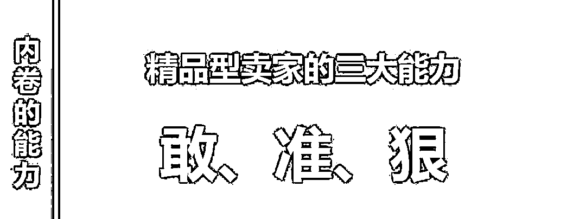

在我们今年举办的广州、深圳、厦门的线下聚会上，我发现了一个很有趣的现象：

今年还能够跑赢大盘，拥有月20%增速的卖家，是精品型卖家。

我仔仔细细分析了他们核心的能力，

一是在于他们敢，在绝大多数人都在跟卖的时候，敢根据用户需求做“东南亚市场上”没有的新产品，去享受完整产品生命周期的产品红利。

二是在于他们准**,**总能抓住市场量大，用户刚需的产品。

三是在于他们狠**,**为了最大化的享受产品红利，去玩命的扩大产品规模效应，降低边际成本。坚信利润是优化出来的，完全抛弃小农的高毛利思维，做TOP Seller，做霸屏式的TOP Seller，挤死对手，赢者通吃。

 

 

跨境电商，80%的卖家都是贸易商，贸易商的核心竞争力，就是性价比。就是让消费者，用更低的价格，买到更好的产品。

**“**敢、准、狠**”**。背后的核心逻辑，性价比的核心逻辑，

就是因为他们洞穿了卖家的增长飞轮：

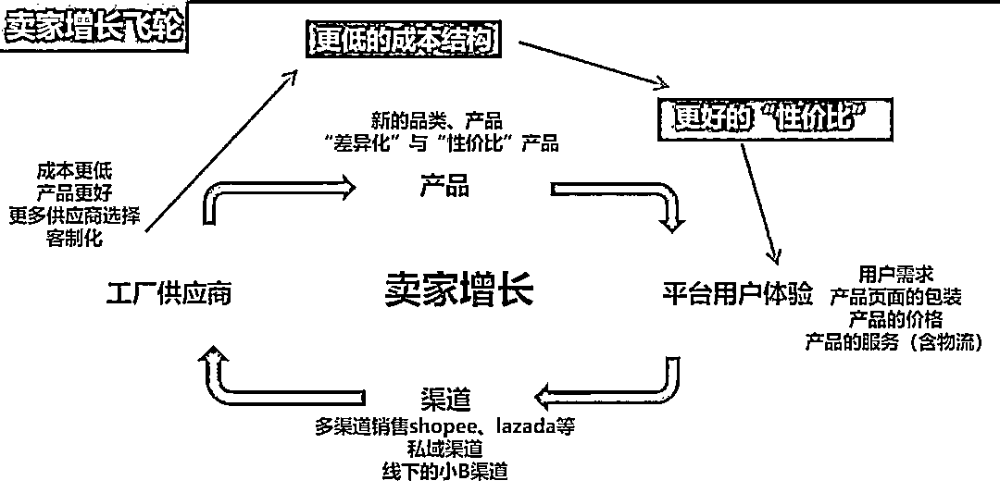

只有通过市场上的新的品类和产品，找到那些更有差异化、更有性价比的产品，才能给平台的消费者带来更好的用户体验，

获得平台更多的流量资源。

只有获得平台TOP的位置，才能有相对稳定且量大的销量，才能优化整个供应链的成本结构。

才能带来更强的**“**性价比**”**产品和市场竞争力。

只有拥有更强的性价比产品，才能通过多平台多渠道的销售，扩大自己的规模效应，获得所有卖家都想拥有的壁垒：

总成本相对优势。

在这其中，要特别重视平台的运营：

 

 

**   1. **整体上拥抱**mall**店；核心原因就是，第一，在shopee的手机端，有专门的Mall店入口，有更好的流量位置，和产品排名。第二，**Mall**拥有专属的经理，意味着更优质活动位置、资源包、以及资源包带来的广告返佣。

**2.**虽然**Shopee**是一个重价格，轻运营的平台，运营技术大家很难拉开明显的差距。

但是，强化自己团队在平台获取流量的能力，把产品运营上TOP的能力，在一些基础细节，如标题的关键词布局、图片视频及评论，把各个环节的细节优化一点，就可以积累差距优势。

**3.**多平台运营的能力，千万不要吊死在一棵树上，比如做shopee的，不应该放过lazada。起航俱乐部从去年年底，就号召做shopee的卖家拓展lazada渠道，目前绝大多数shopee卖家，都获得了**lazada**新渠道带来的**20%-50%**的订单利润增长。

除此之外，在飞轮的增长中：

你可以通过以下四个方面，通过规模效应，放大成本优势，盈余**20%**左右的成本空间** -**卷死大部分对手。

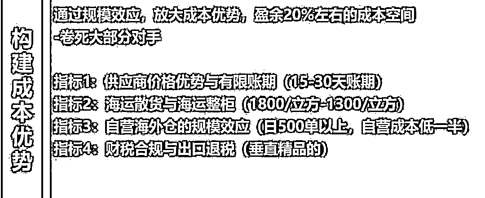

 

 

如果说，这是可以通过团队的努力可以实现的增长飞轮，你抓住品类机会（抓**tiktok**的品类机会），抓住产品生命周期的红利，抓住机会上**TOP**获得销量，放大规模优势，从而稳定库存，形成多渠道销售网**-**提高周转。

你就有可能，在典型的价格敏感、产品差异化小的东南亚市场，构建起自己的初步核心壁垒：成本优势。

再次强调，作为贸易型卖家的核心，

**“**就是不断优化整个（供应链**+**营销链）链条的成本，给消费者创造更低价格、更多选择、更好产品的**[**需求解决方案**]  ”**。

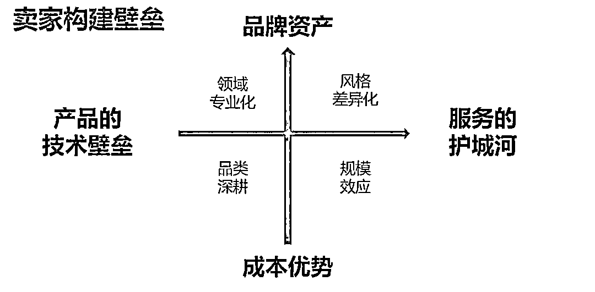

除此之外，我提一个特点：

以更加精准的用户人群为画像的风格店模式，开始成为中小卖家的高客单高转化的新出路。比如luolita、比如大码女装。

在shopee的中国台湾站点，是风格化趋势，表现最为突出的站点。

而东南亚的任何一种风格化模式，都可以在淘宝找到对标。

 

 

何为自我跃迁？跃是一种姿态，迁是一种转移。

大家都玩过跳一跳吧？

作为平台的电商卖家，实际上就是站在跳一跳的台子上：

当你在思考跃迁，你是需要“减负”、需要“助推器”，需要拼全部的力量，并且找准落脚点，才有机会够得着的。

我们先聊聊转移。

跃迁一：从平台电商到内容电商的迁移

在电商的层面上，平台电商和内容电商，获取流量的方式完全不一样。

平台电商的三要素：流量点击转化率。是根据用户的需求，去选品，去做图片价格，去搞评价提升转化率。你是在平台1.0的规则下，满足用户已有的需求。

而内容电商是，是通过视频， 通过所见即所得，通过更真实的人货场，激发、创造用户的需求。

还记得开局的那张图吗？

后疫情时代，以TIKTOK为核心的内容电商，将再次拉高电商的市场份额。

而最核心的，就是内容能力。

 

 

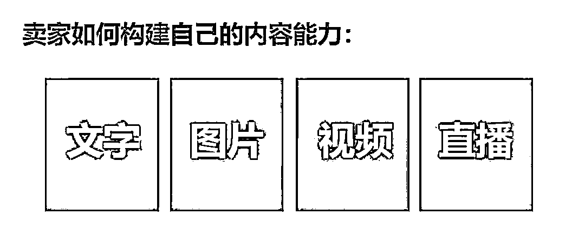

绝大多数的平台卖家，是具备内容能力的。

我们有文字的能力，每个产品的标题，也就是关键词，是我们获取平台能力的密码。我们有图片的能力，为了吸引消费者的注意力，我们恨不得在主图上玩出花来。

但从视频开始，我们就开始失去主动权了。

视频的生产成本更高，从脚本到演员“产品”，再到服化道以及场景，从拍摄到剪辑成品，在专业的MCN机构里，平均一个视频的生产成本都在**500-1000**块钱。

而直播，就更不具备了，除了马来，其他东南亚国家基本上都是自有语种国家。直播的成本更加高昂。国内的一个成熟的直播团队，基本上是需要3-5W的固定人工成本的。

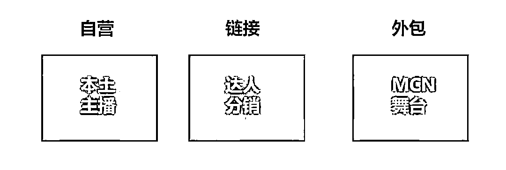

但是，东南亚不用。如果你选择自营电商。

在印度尼西亚，一个主播的成本是1000-1500人民币一个月。也就是，2W人民币你可以请10多个主播，去给你全职直播，创造你的产品的直播内容。与此相似的还有菲律宾市场。

 

 

这也催生很多的市场**“**利润**”**，有些朋友有机会，直接在当地搭建直播基地，获取红利。

目前，起航群内自营Tiktok的月销天花板是近150W人民币/月。还在高速增长。这都是我们俱乐部真实的案例。

如果你在当地拥有比较充足的货源，你也不想自营直播，或者感觉还没到时候，可以考虑达人分销，这个是只要你的产品有竞争力，合适的价格和分佣比例，就可以躺着出单的机会。

因为，东南亚目前不缺MCN，不缺机构和达人，缺的是优质的供应链货盘。

俱乐部的梁总，提了一个很有意思的**“**达人分销**”**玩法，叫做**TK**渣男论：

抛出诱饵，广泛撒网，重点捕捞，长期维护。

（抛出样品的诱饵，有针对性的撒网捞出达人，针对表现力好的达人长期建联，长期合作。）

就可以享受达人分销带来的躺赚。

如果还想更省事一点，就直接外包给MCN吧。目前**Tiktok**已经证明了他的卖货能力。

这是在这场迁移中，卖家不应该错过的机会。

我们在聊聊“跳跃”。

二、卖货到卖品牌的思维之跃

在东南亚，Tiktok正在或已经成为最大的内容平台。

在这样一个东南亚极具影响力的内容平台中，未来的十年，是属于中国卖家根据本土人群的需要，创造品牌的最好机会。

怎么让自己，从卖货的，变成卖品牌的货？怎么跳上这样一个台阶？

首先，我认为此刻**Tiktok**的流量，

 

 

一定是未来十年中最便宜的**“**内容**”**流量。

这一点很多的卖家已经给我们证明了，在中国，做一个消费品牌的投入是3000W或者更多，而在东南亚，在Tiktok，做品牌的投入可能低至300W或者更低。

核心，就是**Tiktok**目前仍然十分低廉的流量成本。

你（或达人）生产的视频，有机会被百万次、千万次传播；

你（或达人）生产的视频，有机会带动新的用户继续模仿；

然后深深的植入消费者心智，完成种草。

未来，品牌的品，是产品，品牌的牌，是内容。

内容需要极具影响力的平台，内容需要被重复的传播和种草。

Tiktok天然具备这样的属性。

我们了解过很多的概念，比如私域，比如品牌，比如兴趣电商，核心都是内容。

从这个阶梯的卖货郎，到下个阶梯的卖货郎，核心就是创造内容。

卖家的自我跃迁，就是把依靠市场的红利，平台的黑科技，供应链的成本优势，抱着**“**自己**”**跳到内容电商的船上。

最后，希望大家，有资本就贪婪，没资本就稳住。

只要公司不做大，你就很难死。

活着，就有机会实现自我跃迁！

# 下半部分：《拥抱变革：东南亚卖家的持续增长与创新之路》

 

 

（2023年6月30日）

过去半年，一个非常核心的问题一直在困扰我，

作为东南亚卖家，在未来的**3-5**年，应该走向一条什么样子的发展道路？

因为起航俱乐部的原因，我有幸和非常多的千万级、亿级卖家学习交流，

在这种深度交流的过程中，我得出了一些思考，在今天分享给大家。

这次的分享，会分为**4**个部分，约**7000**字，阅读时间**10-15min**：

我认为，东南亚电商由开荒的浅海红利已经进入深海搏杀阶段，在这个阶段中，东南亚卖家呈现了典型的K线分野。

一半是海水，一半是火焰。

很大比例的卖家在黯然退场，仍在昂扬前行的是精品型卖家，我会分享他们能够获得持续增长的精品五维模型，以及在未来的东南亚市场中，能够给卖家带来十倍速增长的创新机会点。

每个创业者，都要走自己的路。

 

 

首先，我们先来看看一些个人的论断性见解。

2021年，我从欧美亚马逊，转赛道进入东南亚，是因为我非常确信在未来的10年发展中，东南亚地区的经济发展趋势，一定是一股非常强劲增长力量。

2年前，我认为以中国为核心的周边经济新秩序在建立。

周边最核心的一站，是东南亚。

2年后，我的理解更深一层，在这种经济新秩序在形成的过程中，在未来的10年发展中，中国对东南亚的经济发展趋势，是中国优秀的企业家们，通过资金、人才、技术、管理，把中国的优质产品供应链，带给东南亚。

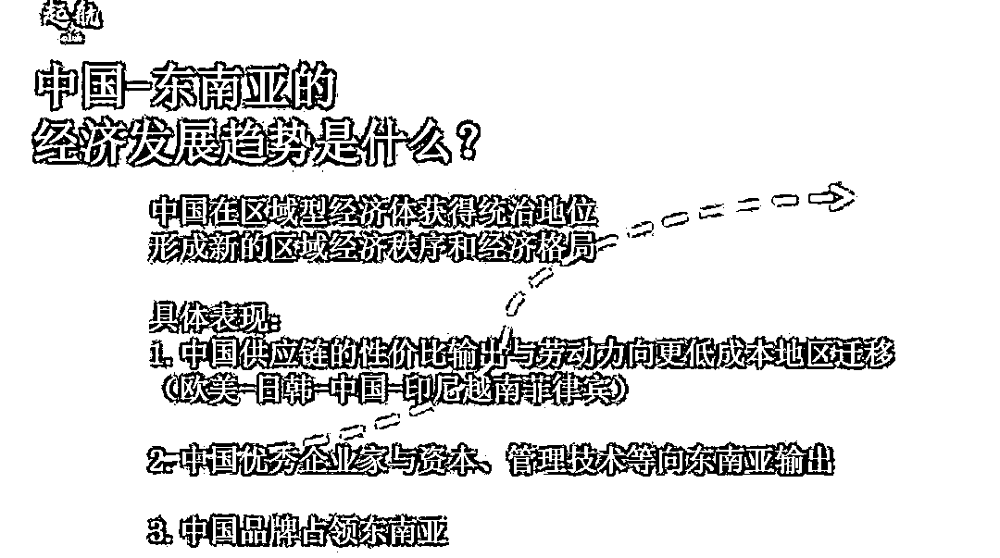

中国在区域型经济体中逐渐获得统治地位，会形成新的区域经济秩序和经济格局，在这个过程中，会有3个具体表现：

**1.  **中国供应链的性价比输出与劳动力，向更低成本地区迁移。

 

 

**2.  **中国优秀的企业家和资本、管理、技术等向东南亚输出。

**3.  **中国品牌占领东南亚。

这个过程不是现在才开始的，早在几十年前，

东南亚的各个国家，都有我们的华侨、华人，去到当地。

而在这个阶段，在当地耕耘沉淀了多年的华侨华人与国人的碰撞合作，国内创业者与东南亚本土的融合，出现了“井喷”式的力量，击穿了那个量变到质变的点。

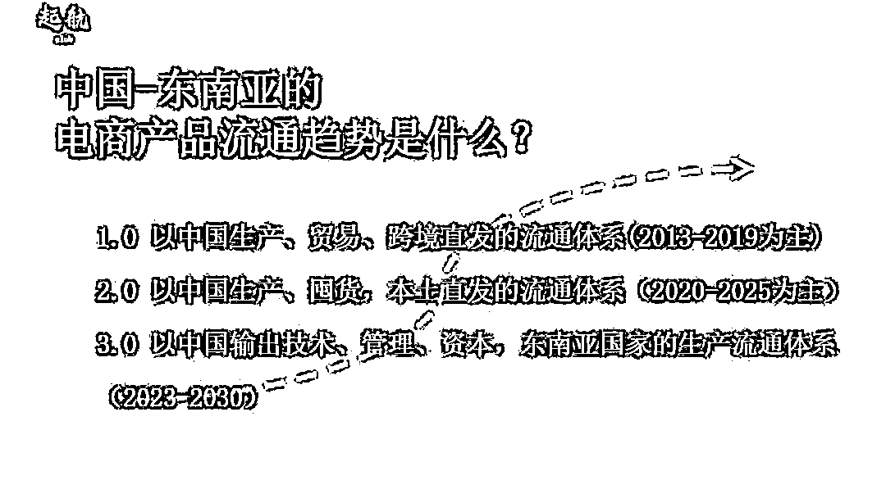

中国加速崛起的浪潮中，很多事情正在自然的发生：

中国供应链正在向劳动力更低成本地区迁移。

在电商市场中，中国的产品由自生产、直发贸易，开始过渡到当地组装流通，并朝着终局走去：

中国输出技术、管理、资本，东南亚国家进行生产流通销售的贸易体系。

 

 

在这个过程中，我们会发现3个劳动力机会市场：

印尼、菲律宾、越南。

他们拥有相对庞大的人口数量，开始获得部分的人口红利，并享受由中国溢出的产品供应链，以加速本国的经济发展和人民的幸福生活的机会。

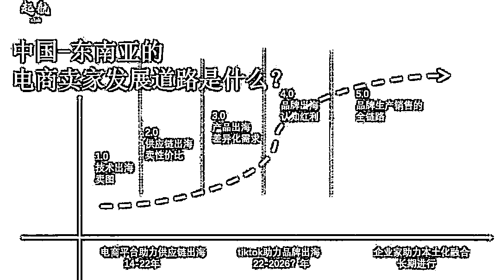

在大势能、大趋势的引领下，我们回归电商，同样大体经历了这么几个发展历程：

**1.0**阶段，供给小于需求，消费者、市场、平台都缺货，只要上架就能出单，造就了店群的盛况。

**2.0**阶段，供需关系开始趋向平衡，产品丰富度极大提升，大量低质低价的产品出现内卷，性价比成为该阶段的关键。

**3.0**阶段，供给大于需求，产品同质化和内卷成为市场的主旋律，差异化的新产品，升级产品、组合产品、本土化产品，成为增长新机会。

**4.0**阶段，品牌从单纯的**“**产品**”**角度杀出，不在局限于平台及线上渠道，而是打造产品，通过产品与达人，不断生产内容，激活用户认知，达成认知-信任-复购的品牌循环。

 

 

（在商业世界中，这都是并行发展交织的，而不是前一个阶段的结束才是下一个阶段的开始。）

最终，走向企业深耕、产品本地、渠道多元的生产**-**销售的全链路。

2023年，Shopee，Lazada，Tokipdia这样的货架电商，都面临同样的问题：

在从100%甚至200%的高速增长增长中陡然失速，进入两位数、个位数甚至负增长的周期。

由平台传导至卖家的，真正的核心问题是：

Shopee、Lazada进入了成熟期之后，卖家如何应对从增量市场向存量市场经营转变。

 

 

我们可以很清晰的看到，Lazada、Tiktok包括Shopee跟进了全托管战略。

平台一样在求变。

本质上，平台推出全托管，是一场平台内部商品生态的，

效率变革，是对经济型供应链的重塑。

经济型供应链，是指那一些在市场需求长期处于易预测的状态，供应稳定性也因此易容易满足，所以供应链以最大限度压低成本为优先的产品。

这一类型的，大量客单集中在5美金左右及以下的产品，

没有比平台自己下场干，更能压缩成本的模式了。

平台没增长，自己还要下场，革经济型供应链的命，平台生态里的卖家会怎样？

我认为，2023年，将成为东南亚电商一个重大的分水岭，

曾经源源不断的新手卖家，构成的电商平台的金字塔基底，正在快速的退场、死亡、消失。

一场底层的，结构型的演化发生了。

 

 

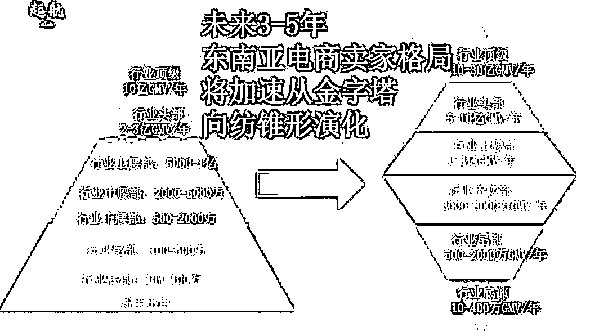

未来的**3-5**年，东南亚卖家格局会呈金字塔向纺锤形的变化。

在这个演化的阶段，会有几个显著的特征：

1**. **行业上腰部分的大卖，将在产品选择（SKU）、产品性价比、供应链渠道等获得长期积累的优势，通过规模效应滚大雪球，逐渐占据市场的主导地位。开启向品牌化、产品力、多元本土渠道发展。

**2. **行业中腰部分的卖家，将面临相对激烈的市场动荡，在中等规模陷阱中，理智派保留利润，缩小团队规模持续赚钱，激进派融钱扩量抓住仍有机会的向上渠道，深耕供应链与多平台运营。

**3. **行业尾部和底部小卖家，将感受商业市场生态中，纯粹的赤裸裸的恶意，在竞争压力和高门槛中，努力求活或者退场。而这一批人是最多的。同时，小白和新手卖家进入数量将大幅减少，成长难度将被快速拉高。

4\. 专业化的工厂型、工贸一体型、品牌型玩家将择机入局，进一步推动生态的完善和升级。

 

 

至此，东南亚卖家市场，在从金字塔走向纺锥形的卖家生态变化中，将呈现典型的卖家**k**型发展战略路线爬坡。

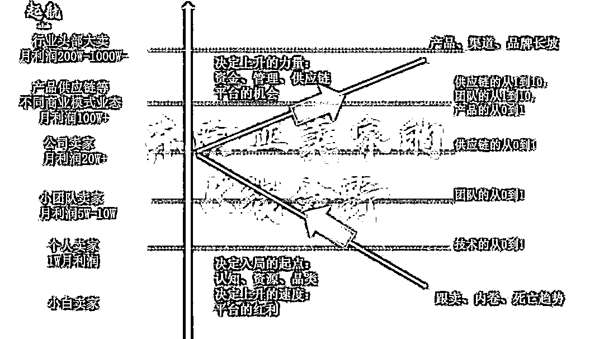

第一层阶梯是技术：从小白到个人卖家，能够收获月5000-1W的利润，核心是运营技术的从0到1，如选品、运营、广告等。

第二层阶梯是团队：从月利润1W到月利润5W到10W的突破，核心是自己的能力能否被团队所复制，更重要的是团队的组建与配合。

第三层阶梯是供应链：在产品上能够根据品类与工厂进行合作，在物流上完成散货到整柜的突破，获得整体供应链的利润优化空间，是决定月利润20W以上乃至更高的可能性。

第四层阶梯是产品：在完成团队1到10的复制，供应链品类的1到10的复制，核心是能否根据东南亚的市场，完成自我精品运营模型的打造。

在卖家的K型发展图中，有两条很重要的曲线。

一条是底部逆向的，没有任何趋势、市场红利助力的，只能逆向爬坡的，成长之路。

 

 

今年在很多的东南亚电商群，看到部分卖家，在清货离场，连着项目以及本土团队，一同打包售卖。

原因多种多样，但本质上是对东南亚市场的了解不够，对东南亚的信心不足，以及错过红利期后，自身商业模式与能力的问题。

非常核心的一点是：

在性价比的竞争里，大部分卖家无法做到产品价格、供应链成本、海外仓成本的压缩。

2023年了，供应链已经是生存的根基，而不再是高纬度的优势。

比如说印尼的物流，散货与整柜仍有300-500每立方的价差，而这样的供应链机会，也仅仅只剩下1年甚至半年的时间。

 

 

时机一过，供应链的优势差就会被全部抹平。

有，你能活，没有，你会被洗出去。

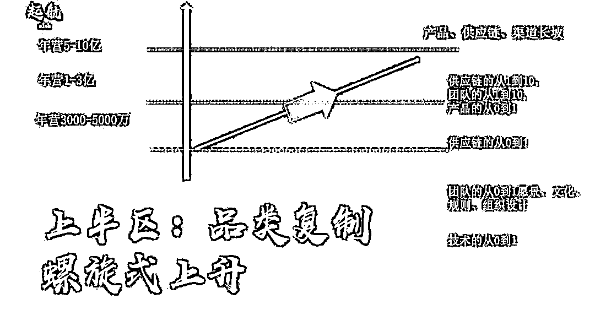

另一条是顶部顺向的，击穿供应链的卖家，

他们在快速的进行，供应链的复制、团队的复制、产品的创新，和下半区截然不同的是，他们反而获得了更加高速的发展。

这也是今年和年营5000万甚至几个亿的卖家，深度交流的体感。

越是头部卖家，增长越是迅猛。

在商业的世界里，大鱼吃小鱼，从来如此。

 

 

为什么，凭什么？

时间线拨回2021年，东南亚电商的发展进程，因疫情这一特殊时刻获得爆发式增长。但是在2021到2023年，这近**3**年的发展过程中，同样的入局者，甚至同样的入场资金，最终却产生了天差地别的发展阶梯。

在我大量的与卖家深入交流，并复盘过去2年，我的抉择的优与劣中，越发感慨，选择大于努力，连续做对选择远远大于努力。

第一个是平台的选择，shopee的机会与成长天花板，远大于lazada，从数据看是4倍。

第二个是模式的选择，一是跨境与本土形成了泾渭分明的鸿沟，二是铺货、精铺、精品的先易后难与先难后易，决定了2023年谁还能活下去。

第三个是市场的选择，不同站点的资金周转率与市场空间，又产生了规模几何倍数的差距。

第四个是品类的选择，竞争度大、更有门槛、更有供应链优化空间、更有产品差异化创新的品类，产生了营业额4-6倍的差别。

第五个是产品的选择，跟卖市场与根据市场开发不同的选品模式，决定了产品是3-6个月的生命周期还是2-3年的生命周期。

多重选择的叠加，在市场增速滞缓的阶段，产生了一条近乎无法逾越的鸿沟。

背后是年营规模的、规模下月营利润的、利润下的团队组织架构的、是否深耕产品供应链的，层层【阶梯】。

 

 

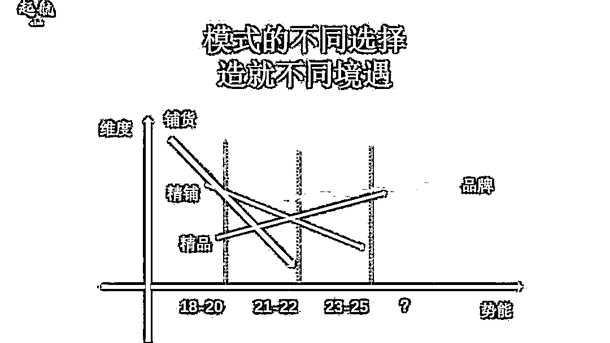

我们先来聊聊模式，2020年前，市场最赚钱的卖家，是铺货店群型卖家，

2021年，本土精铺型卖家快速走向上升期，2022年，本土精铺型卖家陷入增长困境，精品和品牌型卖家开始快速增长。

选择什么样的模式，并是否能够根据市场变化进行模式升级，决定了**2023**年，牌桌上还能剩下谁。

我们再来聊聊市场。

前段时间，有朋友问我，我准备做母婴品类，是先做菲律宾还是先做印尼。

母婴这个品类非常有意思，它和当地国家的人口出生率非常相关。

2022年，新加坡每年新增的人口数约5W左右，而印尼是550W，是新加坡的**100**倍。

看到这个数据，不用思考，一定要去做印尼。

 

 

我们接着聊聊品类赛道。

目前，除美妆外，在东南亚，小家电赛道已经出现了一些品牌。

也是更受资本市场关注的一个赛道之一。

小家电品牌Simplus创始人Jack曾说过：“东南亚市场超6亿人口，其中50%以上都是30岁以下的年轻人，随着在国际供应链中的地位不断提升，整体东南亚市场特别是年轻人的消费市场，也迎来快速增长和消费品质升级的时代。”

背后实际上是JACK对小家电赛道的洞察，用户刚需，增速迅猛，发展空间极其广阔。

小池子养不出大鱼，如果想成为大鱼，

就应该去海里。

 

 

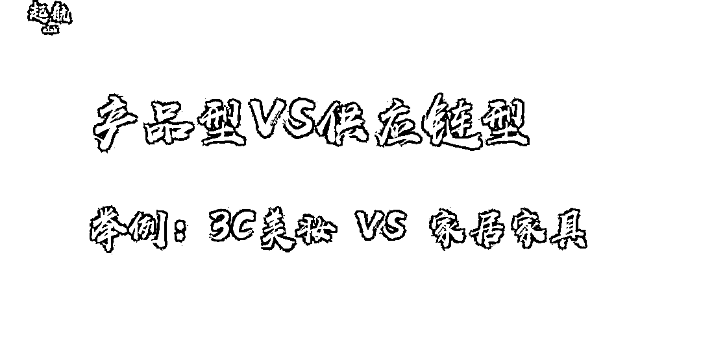

最后，我们聊聊产品型卖家和供应链型卖家。

**3C**美妆本质上是属于产品型的品类，款式迭代速度极快，每年都有非常多的新品出现，也因为产品体积小，没有太大的供应链优化空间，只能专注于产品迭代。

家居尤其是家具产品则恰恰相反，属于款式迭代速度较慢的品类，也因为产品重量体积大，在目前的东南亚市场，仍有较大的供应链优化空间，同时也可以根据市场特性去进行微创新。

以上，让我不得不感慨的是，选择大于努力，选择远远大于努力。

只有连续做对选择的卖家，才能活下来。

 

 

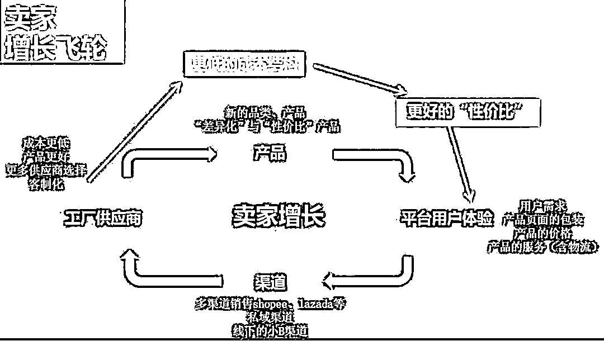

在去年的分享中，我带来了卖家的增长飞轮。

非常核心的点是，卖家需要抓好新的品类、产品的机会，去给市场带来差异化的新品与更具性价比的产品。

只有2条腿走路，同时抓住差异化和性价比，才能加速飞轮转动越来越快。

我们看看精品型卖家，推动飞轮高效增长的五维模型：

产品** X **供应链** X **渠道** X **财务能力** X **组织能力。

 

 

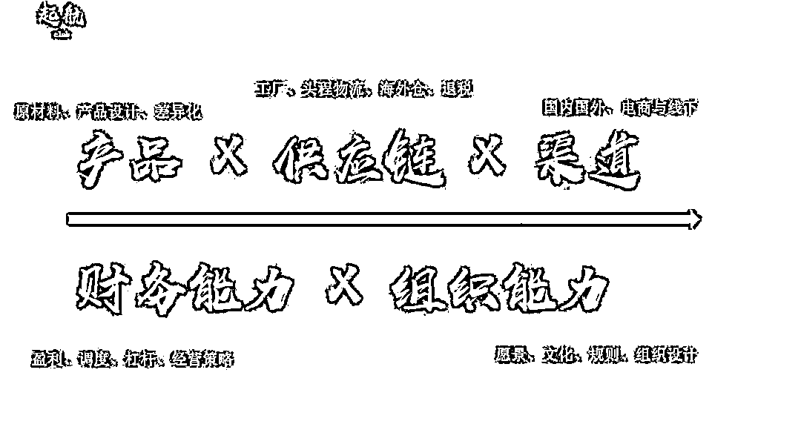

在产品端，基于运营部门的数据和需求反馈，通过爆款逻辑，主动的进行产品开发方向和路径选择，有效挖掘和赋能供应链。

同时与工厂包括上游原材料等进行深度合作，进行产品设计与功能的差异化创新。

在供应链端，基于工厂的深度合作有价格优势，通过整柜运输及自报关获得物流优化，通过自营海外仓或深度第三方合作，获得海外仓效率的提升，通过产品的合规进行出口退税，达成整个链条的成本优化。

在渠道端，一方面在Shopee、Lazada这样的货架电商平台获得TOP链接甚至霸榜式的**TOP**链接矩阵，另一方面也在通过平台的小**B**打通线下的批发渠道，包括自建/合作的线下销售代理等，同时在Tiktok等新渠道获得新增量。

而在产品X供应链X渠道的3维链通背后，是基于企业的财务模型和商业模式，投多少钱能在多少时间赚多少钱的确定性下，可以略微激进的撬动杠杆或多赢合作的资源配称。

 

 

另一方面是组织能力的建设，我有见过精品型卖家，10个人的团队能够干5000-8000W的年销售额。

但在今年1.5亿-2亿的战略目标下，同样需要完成组织架构的调整，一是组织架构从扁平化向层级化转型，二是组织文化从业务中心向使命愿景价值观的变化，三是管理团队的选用育留与业务模型的适配。

2023年，同样是东南亚精品卖家补课的一年，精品的五维模型缺一不可，缺哪补哪。才能去完成【财务支撑】**X**【团队复制】**X**【品类深耕】**X**【供应链优化】**X**【渠道站点多元化】的五维精品运营模型构建。

结硬寨，打呆仗，最后拼的都是综合实力。

最后一part，我们聊聊增长的核心，创新。

机会一：产品创新。

在这里，我想分享一下，跨境一哥安克创新的阳萌，在很多场合讲过的一个故事：

 

 

**2013**年，欧美市场原装电池售价在**80-100**美元之间，在亚马逊上的评分大约是**4.5**星。而出口卖家在亚马逊上销售的电池价格约为**25**美元，但评分只有**3**星或**3.5**星。

我认为这里一定存在机会，即在**40**到**50**美元的价格范围内提供**4**星到**4.5**星的产品。

我相信在场的东南亚卖家，一定会对这段话，有非常强烈的感受。

这是多么beautiful、Amazing的一段话。

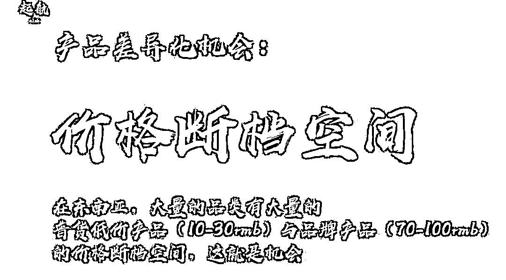

我认为，在东南亚市场，大量的品类有大量的，普货低价产品（**10-30**）**rmb**与品牌产品（**100**）**rmb**之间，存在大量的稀缺性的价格断档空间，这就是机会。（不同品类的价格档不同，请勿套用）

不仅如此，由于大量低价产品同质化，在中高端价位，都有非常多的产品组合+产品升级的款式需求，卖家应该把所有的重点关注在当地市场没有的新品上。去做产品创新。

机会二：供应链的转移与承接

 

 

2022-2023年，随着TikTok Shop的发展，新入场的玩家，会发现一个非常神奇的现象，东南亚居然还在缺货，缺的是好货、高性价比的货、拥有差异化的新奇特货。

本地的生产能力实在太差了，而中国过去，却有超长的海运和清关时效。

在这个过程中，由于卖家买家双旺需求与当地供应链的生产能力不足产生的需求与供给矛盾，结合供应链的转移浪潮，我们会发现这其中有非常多的机会点。

比如说货盘，印尼缺的不是MCN和达人，是优质货盘。

比如说仓库，在东南亚不稳定的市场条件下，是否有稳定的仓库、发货能力。

比如说给投资出海的中国创业者，提供旅游、游学、当地工厂合作、签证及房地产置业等等一系列的需求。

比如说资源整合，中国的创业者的资金、供应链、管理技术与当地创业者的土地、人力、资源的合作。

这中间存在旺盛的，巨大的空间和机会。

机会三、四：**TIKTOK**渠道增量与品牌

在去年的4月份到6月份，我曾写过2篇文章，一是TIKTOK是卖家的渠道增量，而是TIKTOK做为内容的传播工具，将极大催发新品牌的建立。

目前，如果我们单从渠道增量来说，部分月销500万-1000万的卖家，TikTok每月销量占比贡献超过40%，还在快速增加中。

2022-2023，从TTS店群、短视频二剪、无人直播到TTS精品店本土直播，沉淀出来的三大主流卖家派别，本土自播、联盟达人分销、短视频投流。

 

 

我们认为本土直播能力是卖家利用渠道增量，能够带来长期效益的核心能力。

而从另一方面来讲，TIKTOK作为巨大的内容池、流量池和传播工具，目前的流量成本极低，正如我之前所说，当传播工具的费用被降到足够低，很多人都可以试一试拼一拼时，一个旺盛的，品牌爆发东南亚的时代即将来临。

未来的东南亚，一定是中国品牌群星璀璨的时代。

机会五：服务带来的长期私域机会

最后，想聊聊服务。

我在一位在国内做电商的朋友社群里学习。（感兴趣可以关注他的公众号：刘玮冬创业手记）社群发生过一次对话，有人问电商的服务是什么？

他的核心表达是**:**

1\. 我有运费险，你没有，我就比你服务好；

2\. 你7天无理由退货  我们是14天无理由退货，顾客14天来找我们，说不好意思最近出差了，衣服没来得及退，我们也给退；

 

 

3\. 保价，我们30天保价，很多店铺不保价  甚至保价7天、15天，一个月内买贵我们随时退差价；

4\. 所有问题，我们全解决，你洗了，说掉色，说就是不满意，吊盘剪了，说穿了不满意  那我也给退。退完差价  我们会强调一句  ，我们家绝对不会让顾客吃亏。

而这一切，当消费者被其他的商家欺负了，就如同她有一个非常好的男朋友，虽然天天关心她，但很平淡，她感觉不出来，但她有一天被渣男欺负的时候，她就会怀念起这个好男友。

而一切的服务好，并不是凭空来的，都是产品和服务赚出来溢价，来支撑的。

而在东南亚，这一切的一切，在大家卷低质量的价格战的时候，我们卖家关心的是退货率、是怎么少赔点，服务，好像和东南亚的消费者没有关系。

真的没有关系吗？

当你确定了，未来的3年5年还是专注于这个市场，还是这样的一群消费者，服务真的没有关系吗？这些一点一滴积累的优势、好评、消费者心目中的口碑，很大概率上，将成为你**3-5**年后的胜局的有力支撑。

 

 

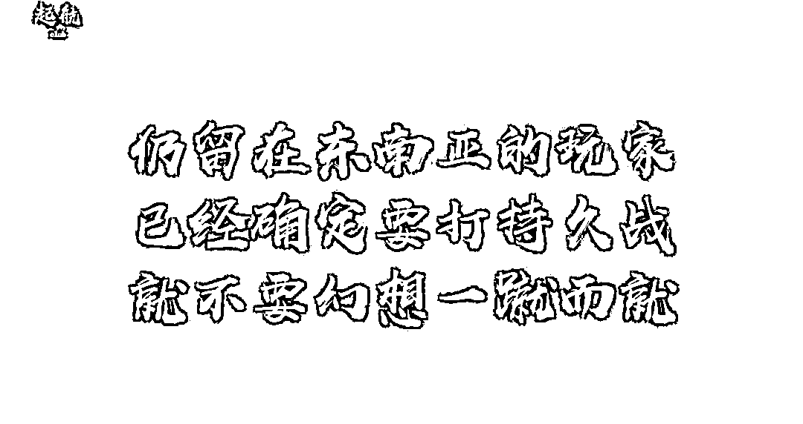

只有扎根下去，深入本土化，深入产品供应链，你才有机会看到更长期的确定性。

从未来5-10年的角度来说，我们都要面对供应链产业转移+中国的资金人才供应链出海的巨大挑战，这个过程几乎是不可逆的。

我们能做的是，你要努力的成为一个跨国企业，并努力成为一个跨国企业集团。

以上。

评论区：

谦墨 : 写的很细[强]

夏冰雹 : 线下大会的演讲稿，然后整理的文字稿，还是比较细的~~谢谢阅读~ edo : 快来我们虾皮，让我们业务好起来，我就不用担心天天被裁员了[呲牙] 夏冰雹 : 哈哈哈哈哈哈哈你快招商

巧巧 : 怎么联系

 

 
