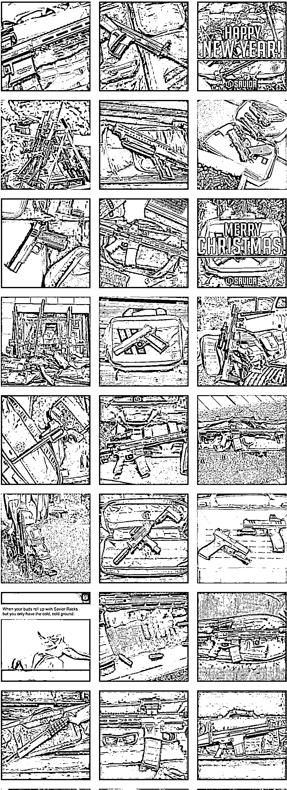
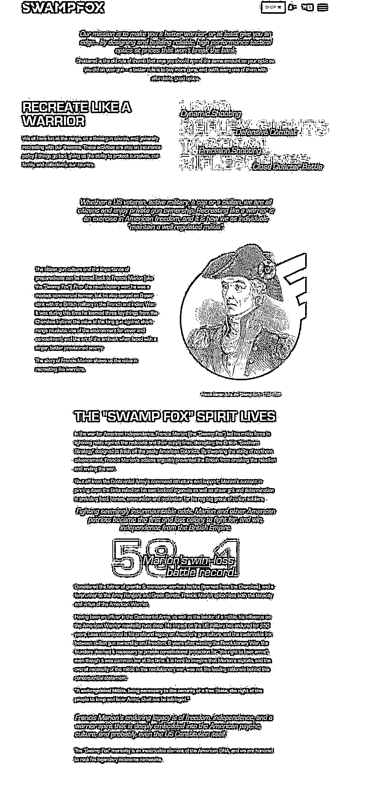
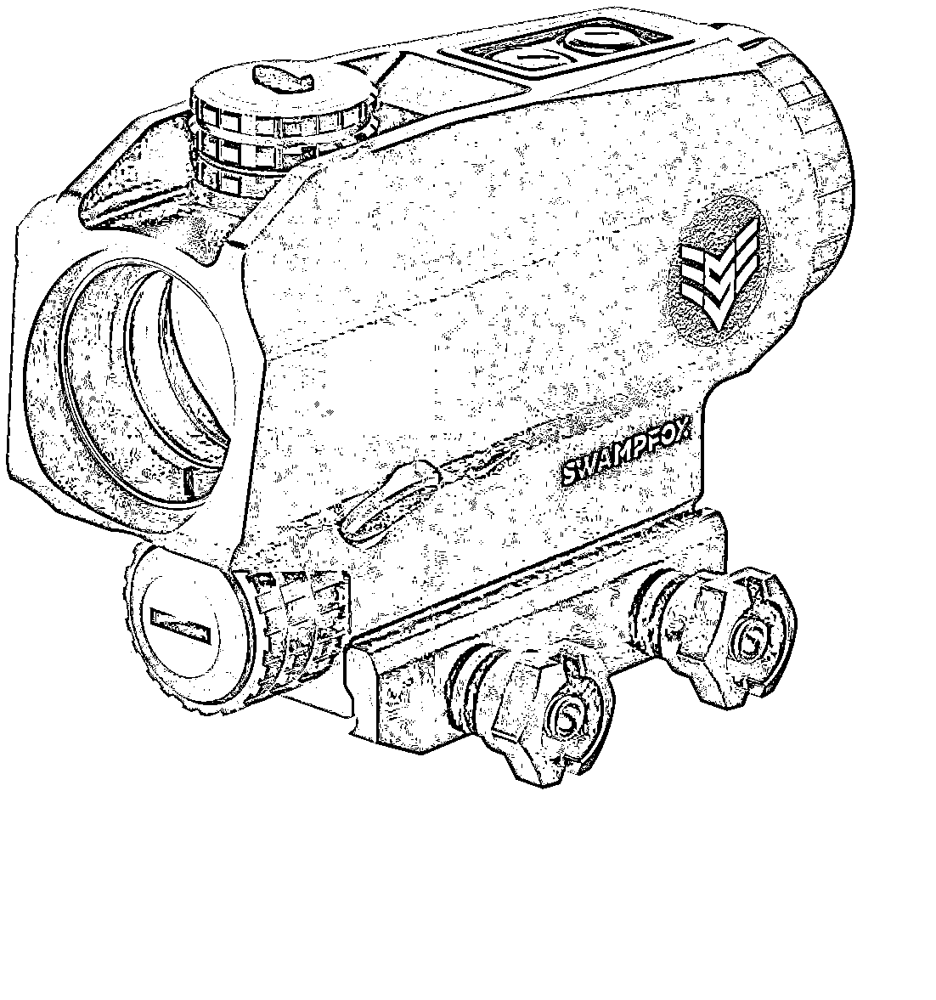
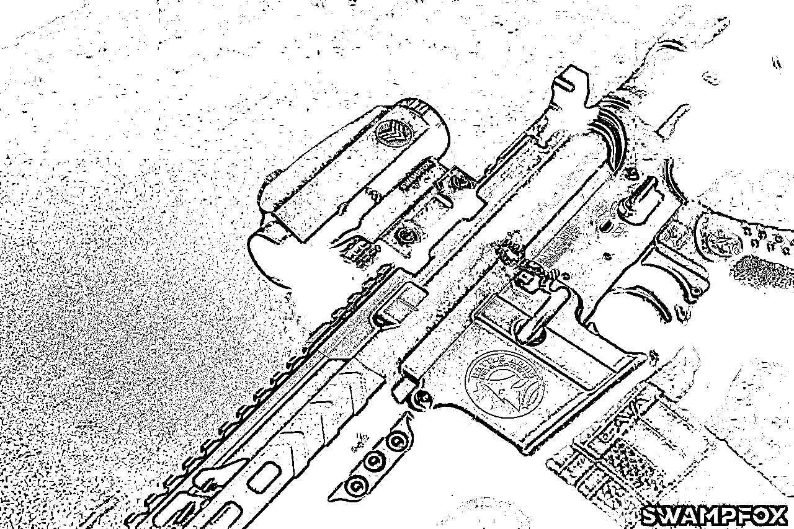
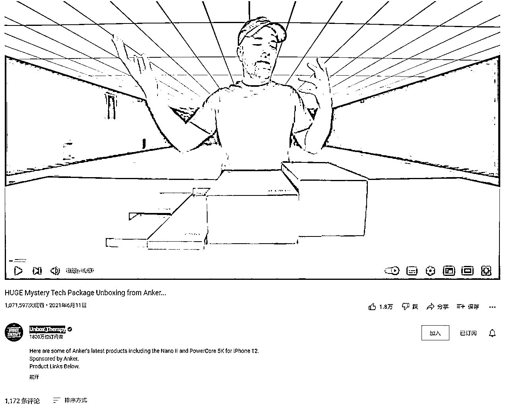
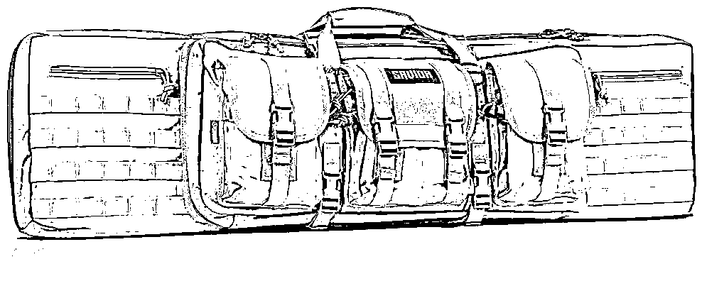
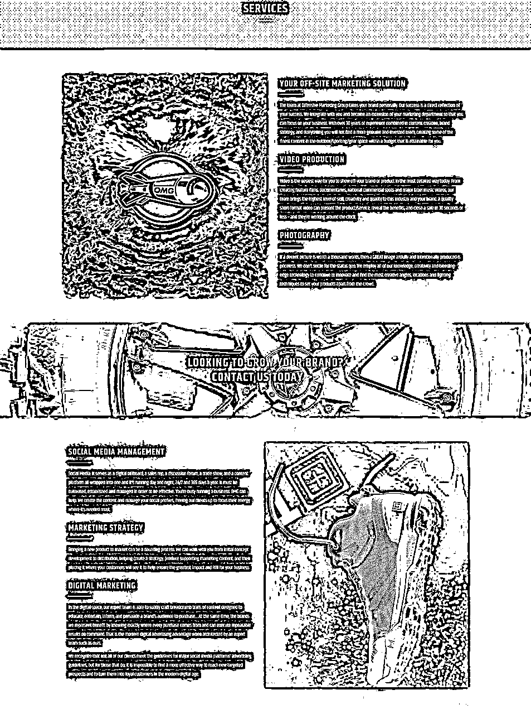

# (精华帖)(152赞)真正的跨境运营和营销绝不是简单的筛选产品上架促销这么简单

作者：  鱼丸|亦仁助理

日期：2022-01-12

大家做跨境，通常的运营手段都是筛选产品上架促销，但这样的方式，很快就会遇到瓶颈。本期「生财合伙人」，@拓跋勇老师，一个出海十年的卖家，就来跟我们分享一下他不同的看法。

本篇内容将以七部分展开叙述：

1\. 精准出海的第一步，是锚定你的用户群体

从十万个普通用户中挖掘需要我们产品的特定用户，还是从五千个特定用户中寻找愿意使用我们产品和服务的三百个用户？

 

 

2\. 正确的产品观念是为了解决特定用户的特定问题，然后悄然发展

机会越大往往意味着竞争越多，一款产品满足了所有的市场需求，看似很美好，但却最容易被快速淘汰。

3\. 没有优质的内容生产能力，找一个靠谱的合作者比埋头苦干更好

一个新的出海企业或者团队其实是不具备内容制作能力的，但是这并不意味着我们要放弃，恰恰这是我们跟其他人能够拉开差距的很好的一点。

4\. 一定要建立属于自己的品牌

品牌的核心在于加深用户的记忆，这样才能发展的更持久。

5\. 先要让尽可能多的目标客户看到我们，然后让有意向的客户进入我们的页面视觉既包括你要销售的产品，同时也包含你的商品页面，网站形象和网店形象设计，这几个缺一不可。但大多数的中国出海企业只完成了第一部分，缺少对第二部分的补充。

6\. 先抓专业用户产生口碑，由专业用户向普通用户做波次扩散

很多人把推广简单的理解为促销或者带货，即使是找渠道带货也是采取促销的方式，但是这样的方式换来的并不是忠诚的用户，甚至不是真实的用户。

7\. 站在中间做腰部企业，保持好的产品质量，做用户能够消费的起的产品

并不是说我们随意创建一个品牌搞一款产品就能够实现成功，真正能够让我们发展的更健康的是我们做这件事儿能够弥补用户的某种需求缺失。

 

 

最后，他还会以 Savior Equipment ，不到 10 人的公司，却创造了一年 4000 万利润的户外品牌为例，验证上述论点的有效性，建议你可以花费 5 分钟快速阅读。

目录

一、用户

二、产品

三、内容

四、品牌

五、视觉

六、传播

七、价值

---正文---

非常感谢生财有术团队的朋友邀请我分享自己对于出海互联网品牌产品营销方面的一点浅见。说实话，作为一个在跨境电商行业十年的老油条，可以说是全程经历了这个行业的变化，看着中国卖家想尽一切努力进入海外平台，到平台张开怀抱接纳这个群体，一起快速发展，又调整规则和风控筛选掉一大批靠灰色手段成长起来的卖家，如今有人依旧热情高涨地涌向亚马逊、Ebay，有人却只能抱憾离场，开始追逐独立网站的新风口，真可谓：有人星夜赴考场，有人辞官归故里，少年不知愁滋味，老来方知行路难。

 

 

事实上绝大多数的出海企业之所以出现失误，在我看来是因为没有抓住问题的核心，用一句话来概况，出海品牌应该做的事儿是寻找有规模的用户群体，用好的品牌和产品视觉把正确的产品传递给精准的用户。如果一定要提关键词的话，我把它整理成了：用户、产品、内容、品牌、视觉、传播、价值。

**-01-**

用户

不管是平台类运营还是品牌的运营，首先要想清楚的一个问题就是我们未来服务的用户是谁。这个问题几乎可以决定我们后续发展的一切可能性，但是中国企业比较奇怪，绝大多数的公司都是先从产品出发，绕了一个弯子之后才想起来去思考用户的问题，我们都知道互联网的流量成本是在飞速提高的，如果你没有确立好要服务的用户群体而贸然开启一门生意，后果就是你后边做的绝大多数的推广工作都是无效的。

有精准的目标用户群体有助于我们向下去挖掘流量和内容的渠道，相比较而言，从十万个普通用户中挖掘需要我们产品的特定用户和从五千个特定用户中寻找愿意使用我们产品和服务的三百个用户，工作量和成果是完全不一样的。

经过这十年的磨练，我的体会就是不管你从事什么行业，确立用户都是第一位的，它会让我们的目标和方向感更为清晰。

拿出海零售行业为例，早几年大家吃的都是流量红利，因为卖家数量少，同类产品少，只要你在产品上稍微下点功夫，很容易能够借助低廉的流量成本快速起来。

 

 

但是到了当下，绝大多数产品背后的流量成本已经可以说是惊人了，如果你还是盲目地去搞，有非常大的概率是会失败的，并且出海行业跟国内零售业最大的不同在于，我们作为货物和商品的所有人，却无法完全自主地处理自己的产品，一旦出现滞销的情况，大概率这些商品库存的价值会直接变零，所以不管你要做什么，请先瞄定你要服务的用户群体。

**-02-**

产品

一般人对于产品的理解都是赶热点，有八九成以上的企业习惯性地把扒数据称之为选品，事实上这只是产品的一个维度，并且还是比较浅显的一个维度，正确的产品观念是为了解决特定用户的特定问题的。

举个例子：2019 年爆发的新冠疫情让很多人不得不放慢节奏，尽量在家，所以居家消费品的销量是在持续增长的，人在室内环境下一长会感觉到非常无聊和焦虑，于是很多行业的产品都可以换一种思维做下改造。

拿我熟悉的北美狩猎射击行业来说，以往大家都是习惯于室外射击场训练或者户外狩猎，疫情一来，都只能乖乖待在家里，所以我们就开发了一款可以居家室内练习射击的产品，并且开发了一套完整的练习教程和测试方案，这样以来不管是重度用户，还是新用户都可以通过我们的产品排解无聊的情绪并且提高自己的技能，这在我看来就是为特定的用户提供特定的产品解决他们的实际问题。

如果你的产品对于用户来说替代性太强或者可有可无，那么很有可能是没有什么发展机会的，最可怕的是一款产品满足了所有的市场需求，这种愿望看起来非常美好，实际的情况却是如果有巨头盯上了你的领域，大概率你是会被快速淘汰的。

 

 

我们都知道手机上即时通讯工具的发明人并不是腾讯，也不是 FB 这样的公司，但是到最后能够收割市场的却是他们，原因就在于此，机会越大往往意味着竞争越多。就算零售行业，也是存在这样的现象。比方说个人护理行业，几乎是每个人都需要的，只有做过的人才知道，你想冲出来有多难，要么是被巨头收购，要么是被巨头弄死，完全没有第三种结局。

所以开发产品一定要针对特定群体，解决特定问题，然后悄然发展，用句电影的台词：

悄悄的进村，打枪的不要。

**-03-**

内容

我一直以来都保持的一个观点就是中国企业是能够做出好的产品的，但是能够做出好的内容的团队确实比较少。

绝大部分的出海企业都面临的一个共同问题就是有产品没内容，事实上一个产品的设计和改造是相对不那么复杂的，这就像一道数学题一样，掌握了正确的算法，得出的答案基本都是一致的。

但是内容就没那么简单了，大家现在都还处在强行启动的阶段，产品推出之后一通推广组合拳下来，要么生，要么死。但是硬广的转化往往比较悲惨，如果没有掌握内容的生产和输出，我们会在推广阶段浪费不少的资源。

去年海外短视频平台上挂起了一阵风，**TIKTok Leggings **在各个电商平台上的销量用疯狂都不足以形容了，其实在我看来，一般的团队和品牌是非常难做到这一点的，这里边的核心就是没有大规模的内容生产和输出导致的。

 

 

一个新的出海企业或者团队其实是不具备内容制作能力的，但是这并不意味着我们要放弃，恰恰这是我们跟其他人能够拉开差距很好的一点。

举个例子：我们所处的行业，有几个美国的公司，背后其实就是海外华人，但是他们利用自己的地域和语言优势，在当地找了一些内容制作公司来帮助他们建立相关的东西，从产品的图片、视频、乃至一些对外发布的博客文章、新闻通稿、网站软文，社交媒体的贴文素材。

有了这些内容的帮助，人家虽然在产品方面并不比我们做的好，但是有优质的内容来吸引目标客户，最终实现的销售成绩明显比我们突出。我在给我们的同行朋友分享时多次提到的一个品牌 Savior Equipment 就是如此，当然了，他们产品本身做了也非常好，但是如果没有优质的内容做铺垫，并不会有太多人关注到这个品牌。

 

 

 

 

这里需要强调的一个点就是，绝大多数的行业都是讲究分工的，一个公司，一个团队并不能解决所有的问题，这就好比你是一个做产品的，但是内容方面可能是个小白，为了能够完成这件事儿，需要的不是建立自己的内容团队或者从零去学习如何生产内容，最有效的方式恰恰是找到一个靠谱的合作者，然后制定合理的方案，循序渐进的实施计划。

 

 

我建议同样在做出海的伙伴，可以在内部设置一个岗位负责协调本土的资源，这会大大地加快我们的工作效率，并且成果一定是要比我们自己埋起头苦干好得多的。

**-04-**

品牌

在拥有了特定的目标群体，有了产品和内容之后，一定要建立属于自己的品牌。事实上，从严格意义上算，品牌要排在内容之前，品牌的核心在于加深用户的记忆。

我们就曾经碰到过这样一个问题，在我们发展过程中曾经开发过一款产品非常受用户的欢迎，几乎没有一个差评，但是当时我们推广的时候只是一味地强调自己的产品有多好，以至于不少客户知道了产品，不知道背后的品牌，因为那个时候我们完全没有品牌概念。

一年以后，市面上出现了一模一样的产品，连包装都模仿我们，价格却连我们的一半都不到，于是尴尬的情况出现了，原本属于我们的客户群体，纷纷转头把钱投给了跟我们销售同样商品的卖家，我们作为这个产品的开发者，只能干瞪眼，如果一早就有品牌的概念，有知识产权的概念，我想这一切都不会发生了。

经过这件事儿之后，我们痛定思痛地决定不论如何都要建立属于自己的品牌，只有这样我们才能发展的更持久。一个品牌绝不仅仅是商标那么简单，背后有大量的工作需要完成，首要的就是品牌故事，要告诉别人我们是做什么的，为什么要做这件事儿以及我们的品牌能够帮助客户解决什么样的问题。

 

 

 

 

这些信息在我们后续跟渠道的合作中非常重要，也是品牌重要的组成部分，不仅仅如此，一个品牌还要有自己的 VI 系统，要有自己的核心卖点，最重要的是要让自己能够被用户记忆。这里边的 VI 系统包括：品牌 LOGO 、品牌色彩、品牌字体、品牌包装、品牌的基础 Banner 以及品牌 Slogan ，还要有自己的品牌官网做形象的展示。

**-05-**

视觉

说到视觉就不得不回头看下内容部分，因为视觉属于内容的一项工作，也是在我看来比较难的一项工作。

我们国内的企业习惯了国内的审美风格，不管是什么网站和平台，尽可能做的就是色彩的堆砌，老外跟我们存在着根本性的差异，大多数的网站和平台都力求简约干净，所以你会发现像亚马逊这种电子商务巨头，他们的产品图片用国内的眼光看简直是 LOW ，但是老外就是认这么一套，他们感觉能够一眼识别产品的本来面貌是件非常重要的事 

 

儿。

但是单纯是在电商平台陈列商品是这样，做推广可就不是这么回事儿了。有相当一部分人存在的一个误区就是懒，懒得为同样一款产品建立多个视觉表现形式，事实上我们看一些优秀的品牌，他们把产品的视觉部分通常分为三个模块：自有渠道、平台要求、宣发渠道。

在自己的官网和电商平台使用的图片存在一定的差异，在一些媒体网站、内容渠道恰恰是另外一套体系，这是因为平台的作用是为了方便用户识别和结算的，但是宣传渠道的作用是为了吸引目标用户的关注形成转化的。在平台你当然可以白底图，但是在渠道里，最佳的方式是融合场景之后的图片，这样更能够打动消费者。

 

 

 

 

如果你是一个内容网站的编辑，你会选择哪个配图，正确的答案恰恰是两个都要，因为场景图可以做 Banner ，也可以描述产品，但是单纯的商品图可以让访客更直观的知道你要介绍的东西，两者缺一不可。而实际的情况是，大多数的中国出海企业只完成了第一部分，缺少对第二部分的补充。

在我看来，视觉既包括你要销售的产品，同时也包含你的商品页面，网站形象和网店形象设计，这几个缺一不可，因为我们捕获客户的过程就如同一个漏斗一样，先要让尽可能多的目标客户看到我们，然后让有意向的客户进入我们的页面，最后让那些有购买意向的客户下定决心购买我们的产品，所以每一个环节应用到的视觉元素是不一样的，不能一概而论。

**-06-**

传播

 

 

像我说的中国企业不擅长做内容、品牌和视觉一样，传播更是几乎九成以上公司的短板。有很多人把推广简单的理解为促销或者带货，即使是找渠道带货也是采取促销的方式，但是这样的方式换来的并不是忠诚的用户，甚至不是真实的用户，不信你可以看看自己的产品，有多少是因为低价或者折扣进来的，真正想要做好营销工作，就要先搞清楚一个信息是如何传播的。

我之前曾经总结过零售行业的一个营销窍门：先抓专业用户产生口碑，由专业用户向普通用户做波次扩散。大多数普通人或者叫普通消费者存在一个羊群效应，他们总是喜欢跟从头羊到一个地方，也就是俗称的跟风。

我们会看到一些有影响力的媒体网站或者网红往往具备着很大的号召力，这种号召力是自上而下的，所以一些聪明的品牌或者企业，非常善于抓住机会，先从这些具备影响力的专业用户入手，让他们先体验我们的产品，然后利用他们的影响力来实现我们的转化目标。拿我们这个行业的领头羊 Anker 为例，他们在去年的年中曾经跟消费电子测评领域的大牛  **nbox Therapy **作的一期视频

 

 

该视频到目前的播放量差不多一百一十万了，这等同于一个什么概念呢，如果按照流量来计算，我们可能在电商平台想要达到这样的流量需要花费的是巨额的资金，按照最低  1美金的成本计算的话也要人民币近 700 万的成本。

当然了，这是视频平台的数据，跟真正的电商平台的流量是有差异的，但是当你的品牌和产品在短期内获得有效用户的有效曝光接触之后，会在不少人的心中留下印象，有部分的浏览者会在看到视频的同时选择下单购买视频中推荐的产品，还有一部分当时没有购买商品但是已经记住了这个品牌和他们大致的商品解决什么样的问题，这就在用户心目中树立了一个正确瞄点，一旦他们某天有相关的需求，一定会相切这个品牌，并且有较大概率选择这个品牌的商品。

 

 

同样的，一些用户特征非常清晰的内容网站，新闻媒体，网红达人，测评机构都是我们做营销过程中非常好的传播渠道，我们只要是做运营，就离不开这些渠道，除非你愿意一辈子只走促销这一条路。

通常越是特征清晰的用户群体，它的传播渠道也会非常有限和清晰，我们需要做的工作就是在你树立正确的目标用户群体之后花费精力把它给梳理出来，然后打通这些环节，我称之为搭建我们和用户之间的桥梁。

而这个工作很重要的一点就是正确识别这些渠道并且用合理的话术开发它们，这里我给大家一个小的建议，一旦你的品牌、产品定下来后，找专业的写手帮你去整理出来不同的话术，比方说邮件模板，电话沟通话术，拿到足够的资源渠道会帮助我们尽可能的减少失败的概率。

**-07-**

价值

很少有朋友会思考价值的问题，但是这个认知层面的东西往往决定了一件事儿能够做多久，一条路能够走多远。

并不是说我们随意创建一个品牌搞一款产品就能够实现成功，真正能够让我们发展的更健康的是我们做这件事儿能够弥补用户的某种需求缺失，就如同我一开始看到我们行业的现状，头部的品牌享受着高溢价，但是对于普通消费者而言完全负担不起，底层的卖家靠着低价收割用户，但是产品并不能达到合格商品的要求，所以我们选择站在中间做腰部企业，保持好的产品质量，做用户能够消费的起的产品。

 

 

如果你所在的行业不存在这样的机会，强烈建议你要慎重，因为没有一个人一个企业能够从现有的秩序中快速成为头部的，如果你做的事儿跟底层竞争者没有任何区别，那么市场可能不那么需要你。

为了能够让大家看到上述论点的有效性，我跟大家拆解一下我在上边提到的一个户外品牌 Savior Equipment 的成长路径。

**Savior Equipment **一个专业从事射击周边产品的品牌，通俗一点说是一个枪包支架的品牌，该品牌诞生自 2017 年的下半年，我们可以简单的看下它的商标注册情况。

 

 

事实上这间公司最初并不是销售该类产品的，并且他们最初的团队规模非常小，之所以知道他们是因为他们公司刚好在我一个美国朋友家的附近，公司是由三个华人小伙儿创建的，他们因为身处美国，发现市面上没有质量非常过硬的步枪枪包，但是美国本身又是一个合法拥枪的国家，拥有庞大的持枪群体，于是这几个小伙一合计，注册了一个商标然后做起了枪包的生意。

 

 

我在谷歌上查询这个品牌的时候发现第一次出现是一个射击论坛里，当时他们自己注册的账号发帖介绍自己的产品，结果下边的评论清一色的都是说产品看着不咋地，是不是垃圾的中国货之类的言论，后边让他们发生巨大转折恰恰是我那位美国朋友，因为他本身是美国步枪协会认证的射击教练，加上距离比较近，于是他们经常一块儿沟通如何改进枪包让它变的更好用，最后搞出来的第一款正式意义上的产品如下图：

这个产品是 2017 年 11 月 17 号正式在电商平台发售的，因为产品的开发阶段有行业的重度用户参与设计和改进，一经发售轰动整个射击圈子。当然，因为有人指导，他们产品发售前基本上是把宣传工作做到了极致，不信你可以往下看。

首先他们找了在射击行业小有名气的一个内容制作公司  **offensivegroup **助他们完成产品拍摄、视频拍摄和社交媒体内容制作和内容托管等等工作，不从事这个行业的人并不清楚这是一家什么公司，所以我连带给大家看下他们的业务。

 

 

这个公司名气并不大，但是他们给不少的户外战术装备公司做内容方面的服务，其中最具代表性的就数5.11这个战术服饰品牌。

 

 

于此同时，这个当初名不经传的小品牌找到了另外一个公司 leviathangroupllc 跟他们合作，这个公司同样也没什么名气，但是他们却是一家在射击领域拥有上百位 Youtube网红合约的公司。

 

 

 

 

于是在好产品+好的制作团队+好的传播团队的强强组合下，该品牌很快就在专业领域内刮起了一阵风，但凡有一点影响力的网红和教练几乎人手一个他们家的枪包，并且更有意思的是，在这样的传播效率下，他们开始对专业领域内的媒体，网站，论坛进行大量的内容铺设，如果你感兴趣的话，可以到谷歌上搜索 avior Equipment forum ，你会发现这样的结果。

 

 

有大量的论坛在持续不断的发酵关于这个品牌的内容，要知道用户的关注度就是品牌的影响力，而这种持续的影响力会转化成源源不断的购买力，结果就是，他们的产品在亚马逊上上架三个月后站到了品类的第一名，并且从 18 年一直保持到现在从来没有其他品牌打破这个记录，他们的产品售价也要比同类型的其他产品高出不少，但是依然架不住用户的热情，理由其实也非常简单：

**1**、产品设计、功能、质量、确实好；

**2**、**savior equipment**有完整的品牌概念；

**3**、在专业领域内的口碑超级好；

**4**、产品信息覆盖的面非常广。

结果是什么呢，一年以后，他们上新了相同系列的不同产品，依然快速卖爆，两年之后他们从步枪枪包拓展到手枪枪包依然卖爆，2019 年他们进一步拓展步枪支架，无一例外的爆，2021 年，他们拓展了手枪支架，还是卖爆了。

与此同时，他们的销售渠道不断地拓宽，从最初的亚马逊平台，到后来自己的品牌官网，再到后来他们在线下超过 30 家经销商销售该品牌的产品，如果你现在去查询，你会发现亚马逊、沃尔玛、eBay、好市多、连新蛋都在销售他们的产品，而这一切恰恰就遵从了我上边分享的理念。

在一个特定行业寻找特定受众，用优质产品+好的品牌形象+优质内容+强有力的传播方式深耕，我们最终都能够找到适合自己长期发展的方向。

 

 

2020 年的时候，我曾经问过我那美国朋友，他说他们这个公司在 19 年的时候也就不到十个人，一年创造 4000 多万的利润。

更有意思的是，去年为了研究好这个品牌，我托朋友帮忙在美国买了他们的产品并且空运了回来，比较搞笑的是，我在深挖他们背后的供应链时发现他们合作的工厂就在广州，当我真正拿到的他们产品的时候，我才切身体会到为什么用户对他们那么狂热了，产品的功能设计非常合理，用料也非常扎实，最关键的是细节的地方他们都做的非常到位，举个例子：他们把产品的包装盒内侧设计成了靶纸的图案，每个客户收到产品之后，包装可以直接拆开当作靶纸来使用，丝毫没有多余的东西。

现在看来不管是偶然还是必然，他们选择了一个中国多数企业都不太了解的领域，但是他们具备天然的优势，并且这个领域的用户群体非常清晰，资源渠道也非常清晰。最关键的是他们深知自己的不足，所以懂得借势，寻求专业领域人士的帮助，这才有了后来的发展，坚持服务好一类用户，坚持做好的产品，坚持做品牌，懂得做传播，这就是他们的成功经验。

事实上有很多行业都值得这么走一遍，比如母婴领域、垂钓设备领域、骑行野营领域、宠物用品领域、甚至是游戏办公领域，因为存在太多特定场景下的特定用户需求了，我们需要做的不过是确定好要服务的用户群体、确定好行业、深挖用户需求、内容制作资源和传播渠道，以品牌的方式完成每个步骤的链接，如果你还是不懂，强烈建议你去认真挖掘一下** BarkBox **这个宠物用品领域的案例，你就会发现真正的运营和营销绝不是简单的筛选产品上架促销这么简单了。

除此之外，品牌出海行业还存在着大量的问题和机会，比如如何保持足够的优势，如何改造自己的产品，如何形成有效的产品线以及如何保持健康的发展态势，介于内容过多，我就不再一一赘述，如果你感兴趣，欢迎点赞评论，如果点赞数量超过 188 ，我再来跟大家分享别的内容~

 

 

最后再次感谢生财团队的盛情邀请，我是拓跋勇，一个在跨境行业混迹十载的电商从业者。

P.S. 如果你也想在生财有术专栏分享你的经验和认知，请点击链接

http://form.shengcaiyoushu.com/f/HA1G1g  填写表单，我们会陆续邀请有赚钱相关经验和案例的嘉宾做分享。如已填写表单请忽略。

评论区：

鱼丸|亦仁助理 : 感谢  老师的分享，大家如果有什么问题。可以在评论区留言~ 拓跋勇 : 感谢生财团队的邀请，大家有什么问题可以评论区互动，不方便公开交流的可以添加微信tuobayong跟我交流

草木青 : 先赞再看

M_Alex : 写的真的是很好，提供了不少新的思考角度。

Act-炼 : 像艺术品一样jing mei q

唐杰(Jason) : 有高度，有洞见

超云 : 打开世界的新视觉，非常感谢分享，收获极大

郑小焦 : 太精彩了，谢谢  老师分享~~ 一直听说老师在推广这一块很强，看来研究非常深刻、透彻。刚入行一年的萌新学习了[抱拳]
