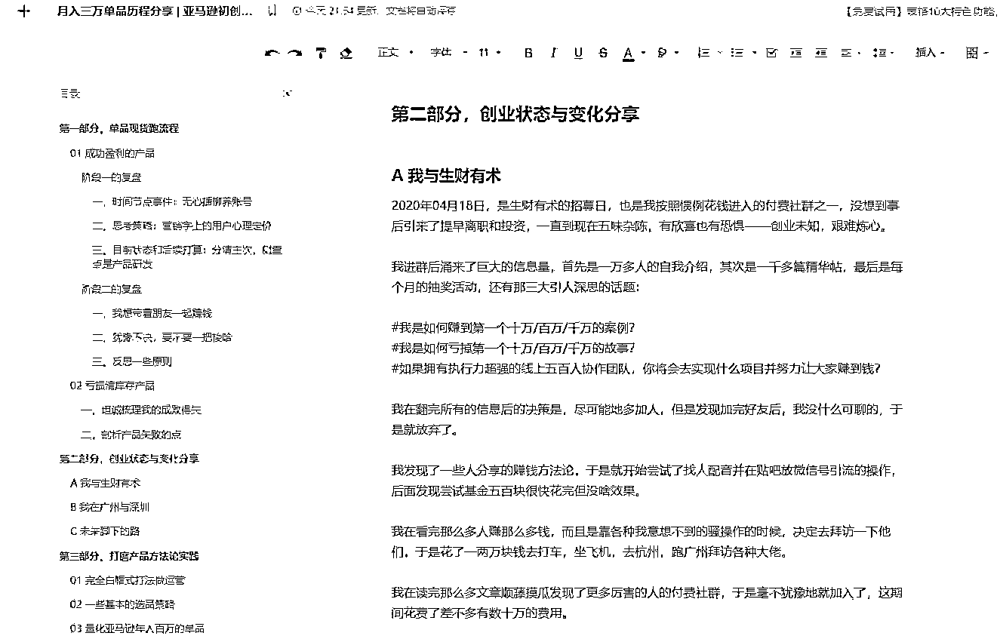
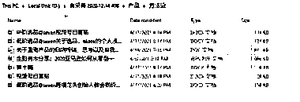
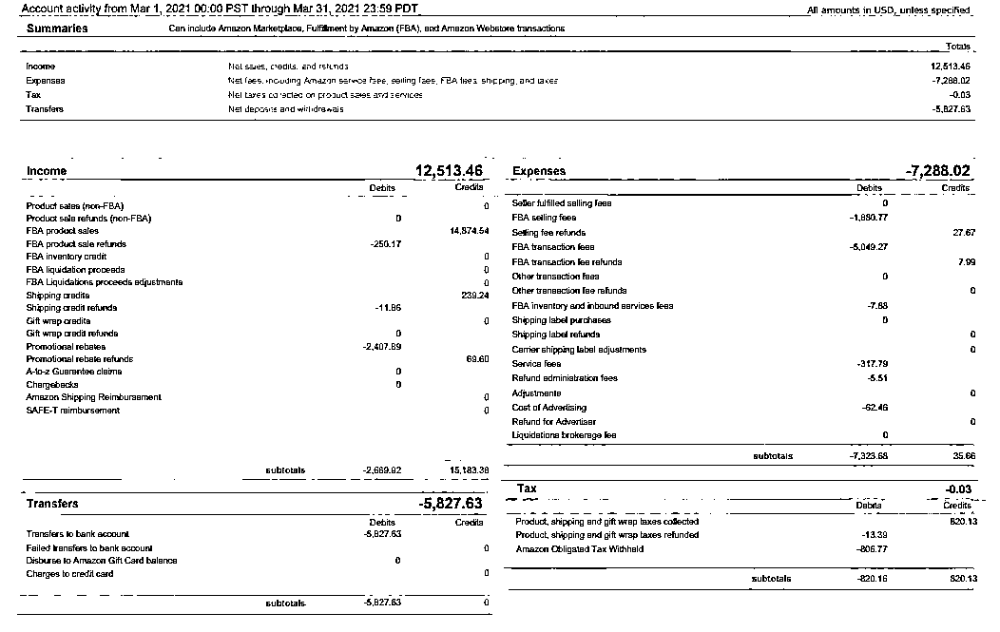
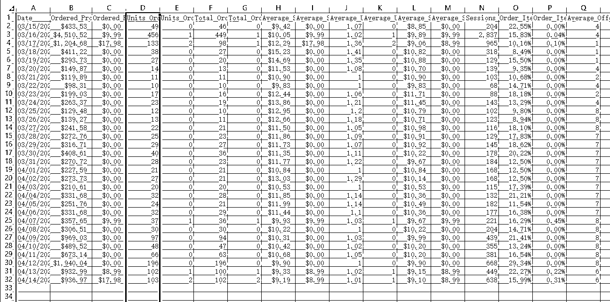
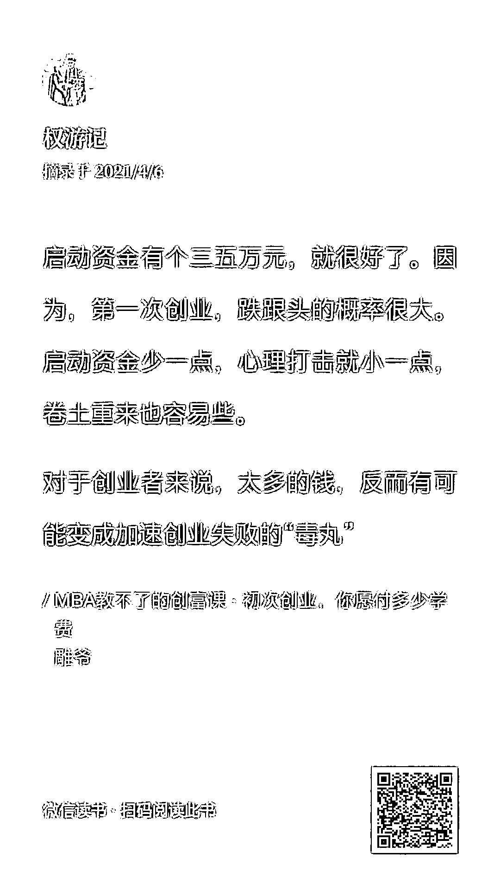
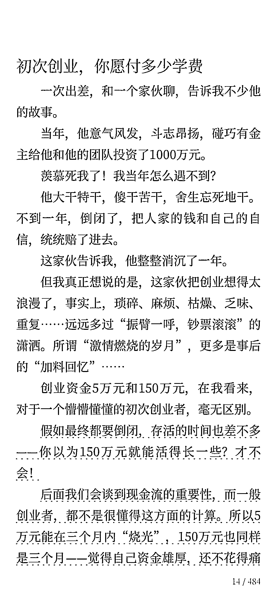

# (92赞)月入三万单品历程分享 亚马逊初创业的成长及我与生财的故事

作者：  良辰美

日期：2021-04-18

#亚马逊#龙珠修行

大家好我是良辰美，梦想是做一个扬帆出海功成名就的中国实体品牌。

活到老写到老是我的终身梦想，公众号日更是我的人生原则，真诚利他是我的为人准则。

有近半年没在生财输出活跃了，在生财即将纳新之际，眼看各位龙珠大佬真诚输出干货，我读完后受益匪浅，遂写了两万字总结这半年的历程，分享一下最近的收获。

文章目录包括：

01 有单品月入三万也有产品亏掉清库存

02 生财一年来带给我的转变

03 学习@seven的选品方法论和实操心得

目前蓝海产品还在陆续出产做货中，做亚马逊是一个很慢的事业，下单发货短择一周长则两个月。

创业炼心，上山修心。

成绩很小，前路漫长。

坚定抱住生财，看多龙珠。

 

 

欢迎圈友拍砖交流，有机会一起在白云山上畅谈，早期健走锻炼身体。

《月入三万单品历程分享 | 亚马逊初创业的成长及我与生财的故事》，可复制链接后用石墨文档 App 或小程序打开

蹭住418最后几个小时，响应亦仁的号召哈哈，

https://shimo.im/docs/KWXpHPVvKrhK3hy3/

 

 

 

   

 

 

 

 

 

 

 

 

评论区：

Gemini : 一如既往的🐂🍺

宋大刀 : 美哥  优秀

707 : 太强了，自愧不如

天行 : 心之向往

罗杰 : 优秀

王红星 : NB！

caozhao : 拜读完分享，必须收藏着

一盘唐僧肉 : 我与生财的那段，wc，你是不是在我身边安装监控
