# (精华帖)(120 赞)以 TikTok 举例，如何发现海外产品的生财机会 ？

作者：  三林

日期：2022-04-11

本文关键词：Google 流量研究、关键词挖掘、TikTok、SEO；文章 3000 字，读完只需 8 分钟~

你好，我是三林，互联网产品人。上一篇文章聊到一个资源套利的下载站：通过 SEO 获客并导向公众号实现广告变现。其抓住了国内用户需要谷歌浏览器插件但又下载不易的需求。那回归到需求出发，我们该怎么发现类似的创业/生财机会呢？今天围绕此，深入聊聊。

 

 

我选择的研究对象是「TikTok」，出海产品的当红炸子鸡，且不少圈友正在该赛道做点事情。

核心思路是通过基于** TikTok **的关键词研究，以 Google 的搜索量为依据：哪些词搜索量大且稳定，又有哪些产品或服务来满足了这样的需求。  因为用户主动搜索的内容，往往是其真实的需求。从大数据中，发现产品机会、找准需求。

本文目录

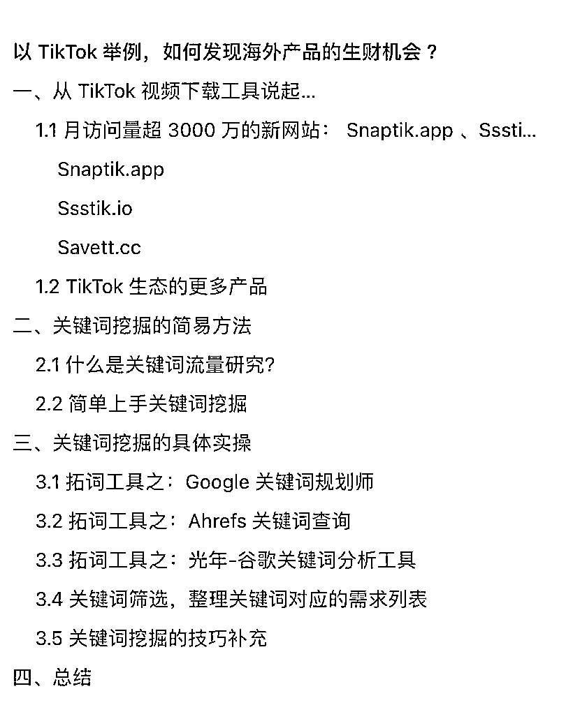

** **一、从** TikTok **视频下载工具说起**… **

 

 

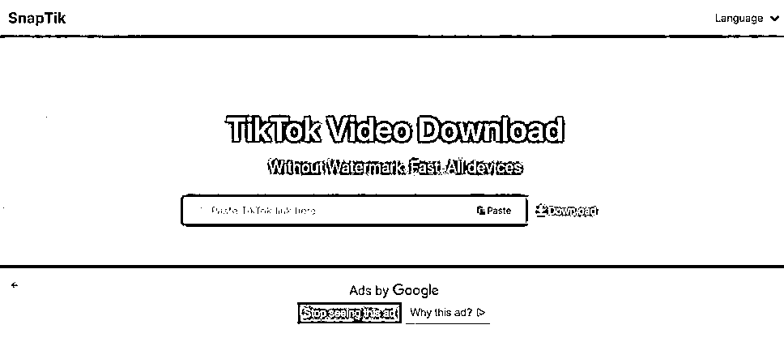

首先，从查询到的关键词搜索量数据，很容易发现的产品类型：  **TikTok **视频下载网站（**Web **工具）！  我统计了 TikTok 第三方视频下载工具一系列网站（后附），只取前  10 的站点，其整体的流量超过 8000 万次访问/月！（数据参考的 SimilarWeb），其中有两个网站表现超常，下面会详细说一下。

 

 

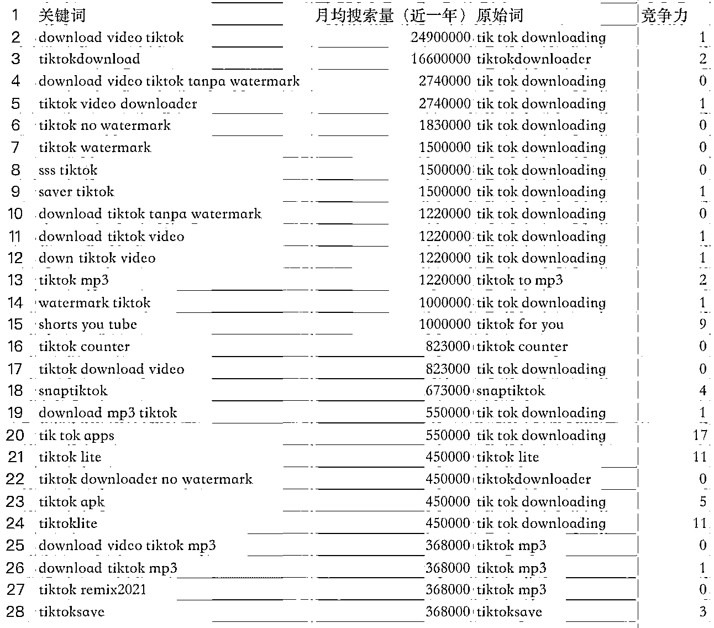

这些网站匹配了一系列的  「tiktok video download」关键词，由上图我们可以看到「download video tiktok」这个词，近一年里月均搜索量高达 2490 万次。

**1.1 **月访问量超** 3000 **万的新网站：** Snaptik.app **、**Ssstik.io ****Snaptik.app **

Snaptik 提供了 TikTok 去水印视频下载功能，宣传的核心卖点：无水印、快速、全平台支持。

据 Similarweb 的数据显示，该站点上月访问次数为 3100 万！（PC 网站和手机网页的访问总量），  全球排名 2000 左右。

 

 

**46.7% **的流量来自搜索，等同于每个月超过** 1400 **万次访问是来自搜索引擎的。

**50.5% **的流量来自直接访问。平均访问时长约** 1 **分钟。

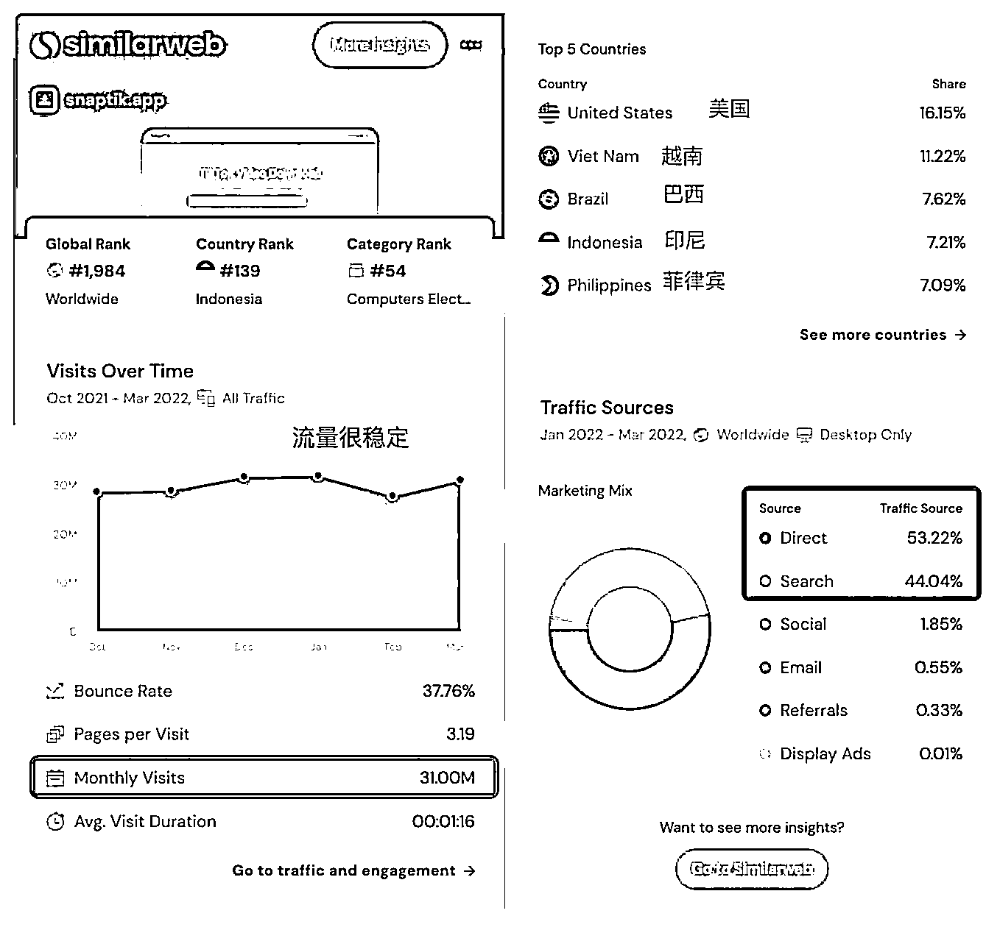

**Ssstik.io **

和 Snaptik 一样的产品定位、功能服务。据专业 SEO 网站 ahrefs.com 的数据显示，仅用时一年半的时间，就从 0 做到了每月 3100 万次访问量。而 SEO 方面居功至伟，覆盖了  5.8 万个关键词，自然搜索带来了每个月 2400 万次访问（免费获取的哦，以 ahrefs 的流量估计，该部分直接价值 8.1 万美金/月）。

Ssstik 的第一大市场是印尼，其覆盖了 1.1 万个关键词和覆盖 1300 万次的月访问量。

 

 

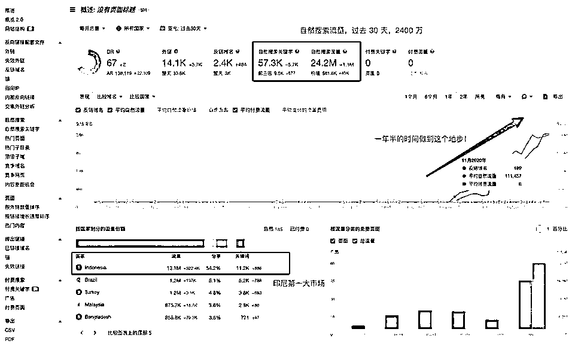

**Savett.cc **

还是 Tiktok 视频下载的在线工具，再提到这个后起之秀的独立站。去年 10 月上线的，短短半年时间，从 0 做到了 300 万的月访问量。其搜索流量占比 68.7%，Ahrefs 的数据预估其 90%来自免费的自然搜索流量。

 

 

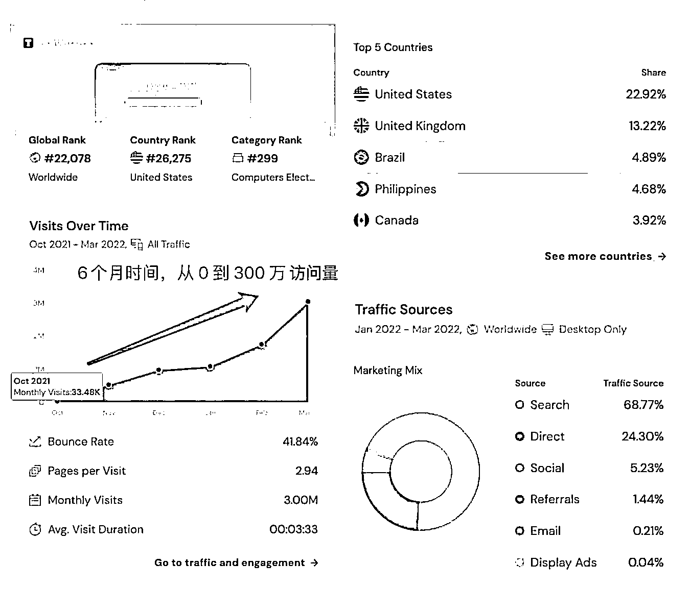

除了上述三家网站之外，还有超过 10 家网站在专门做这个服务，且流量都不低。整理如下：

（此飞书链接也可以看到）https://py64k0scfh.feishu.cn/sheets/shtcndvM7W7voqAaJVuu06zNPCh 

 

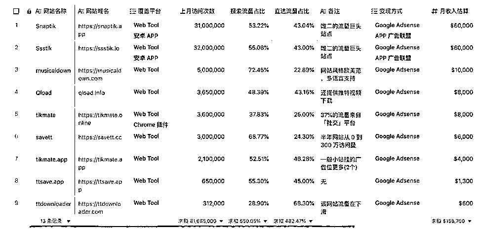

有流量，那么赚钱吗？** **不能小瞧。  以 Snaptik、Ssstik 两个为首的站点，每个月能够做到 3000 万次访问。这种在线工具，单页网站，很简单直接。产品设计及其克制，就挂载了一到两个广告位，按千次展现 2 美金估算，月收入预估在 6 万美金/月，年收入人民币 500 万（非利润），一年一套房的水平。

还不止，还有这两家均推出了去水印视频下载的 APP，在 Google Play 的下载量均超过了 100 万，APP 的广告收益并未统计在内。

这是一种背靠大平台的用户需求，提供易用直接的产品功能，借助** SEO **超级凶残的流量增长并直接赚钱的模式。

**1.2 TikTok **生态的更多产品** **

于 Tiktok C 端需求，基于 Google 的搜索数据，去水印下载的需求比「tiktok 18、tiktok pron」等性相关需求强烈的多  ：） —— 当然了，Tiktok 也并不直接等同于 sex 内容平台。

 

 

我们再来看下，其他 TikTok 生态产品，简单概述：

**1. tokcount.com **一个实时观测** tiktok kol **粉丝的网站。每月访客** 180 **万** UV**、平均停留时长** 7 **分钟。就这么一个直观展示一个博主粉丝量（刷新）的网站，居然也有人看？** **这个网站就只瞄准了一个关键词：**Tiktok counter **。这个词，每月在** Google **有** 82.3 **万次搜索。

**2. ** 关键词：tiktok to mp3、mp4，把** TikTok **的视频转成** mp3**、**mp4 **格式的需求，**mp4 **容易理解，**mp3 **呢？都** 2022 **年了，还有人需要** mp3 **格式吗？有，需求大量存在。**YouTube **平台上相关产品的流量更猛。

**3. ** 关键词：TikTok view、followers、likes** **等，对应数个买播放量、买粉、买赞的网站。** **这些站点尽管有自带搜索流量，但竞争之下，也在** Google **投放了相关关键词广告。

**4. ** 关键词：Tiktok fans，对应一个** APP **产品：**TikFans - get tik tock followers + tik ****likes**，做任务互粉的需求，其下载量超过了** 100**万，主要是近** 5 **星好评** **的**11 **万评价数，还是规模不小的。

…… 等等，这些我都是只用了一招发现的产品 —— 关键词流量查询。

二、关键词挖掘的简易方法** **

**2.1 **什么是关键词流量研究？** **

从上述关键词的流量部分，这些工具型的网页产品，你也看到了，极其重视搜索引擎增长、通过 SEO 去获取流量。

我一直记得亦仁在 2017 年写的经典文章《通过 Google 挖掘细分市场的一个案例》，在第一步即是围绕巨头平台去进行搜索发现，探寻其中的商业机会。当我们搜索一个词，搜索输入框的联想推荐和其他人也在搜索的词，能无门槛的发现需求，简单、快速，但缺点在于：去搜什么词往往不知道如何入手，以及搜索的词可能不够全面、不具备代表性。

 

 

在 SEO 的领域，对于「关键词」研究，称之为：关键词挖掘。「关键词挖掘」是个系统性工程，对于一个行业要挖掘出数百万个带搜索量的词，才算合格，而用时往往要一个月左右。

不过，我们可以通过相关工具先简单、快速上手。

**2.2 **简单上手关键词挖掘** **

给圈友分享我的经验。第一步：框定母词。首先我们要基于研究的对象：TikTok ，还是 YouTube，抑或 Tesla 等，确定一系列的母词，比如 tiktok，我会选用：tiktok video、tiktok live、tiktok shop、tiktok fans 等圈定大范围。

接着

第二步：拓词！通『  谷歌关键词规划师』等第三方工具，发现相关搜索词。

第三步：清洗，再度拓词。再度查询关键词流量。

第四步：对搜索结果二次分组，统计具体哪些「关键词」的流量具备代表性。

第五步：筛选有价值的关键词，并定向研究具体的产品/服务承接。收录到自己的「项目库」或「需求池」。充分的调研、评估过后，再决定如何「杀」进去。这里先不展开了。

三、关键词挖掘的具体实操 ** **

**3.1 **拓词工具之：**Google **关键词规划师** **

这是 Google Ads 谷歌广告平台的后台功能，使用前提是一个商业账号，开户是一个小门槛，可以找国内的谷歌广告代理商开户，并不难解决。

 

 

进入「关键词规划师」，两个功能入口：一个偏「拓词」发现新词。一个偏「查词」查询流量的。

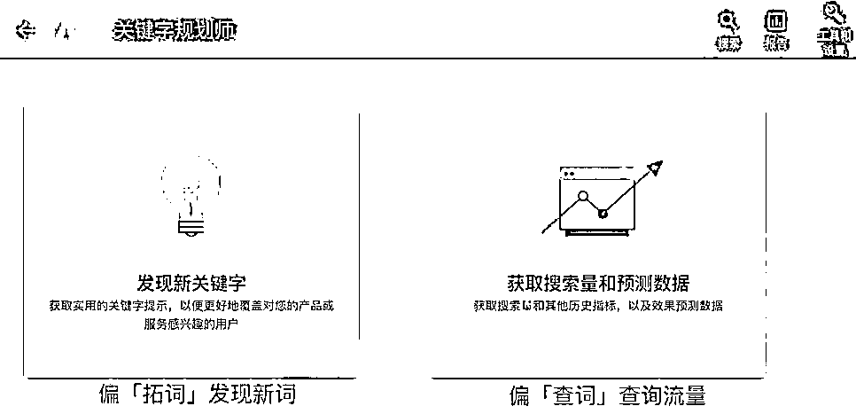

在「发现新关键词」栏目，搜索一个「关键词」便可产出更多的相关词，以及每个词的每月搜索量、广告点击出价预估等。（此功能最终还是服务广告投放的，但不妨我们用于需求挖掘的调研），如下图所示：

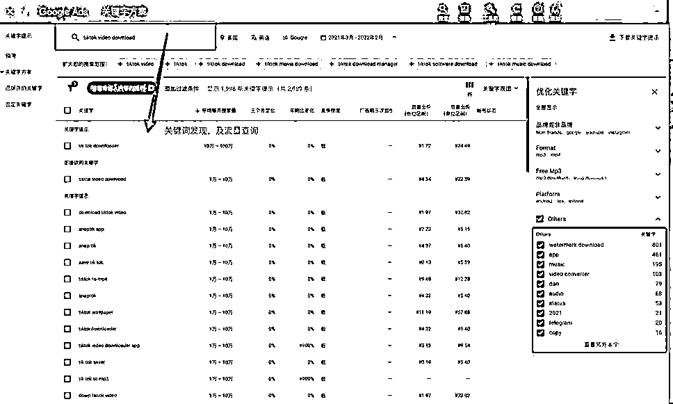

 

 

这就是「拓词」。初筛后，再次拓词，所谓「二阶拓词」，往往一个母词，可以拓词出一千左右的词，  一两千的核心母词，可以扩展出百万的带搜索量的词也并不少见。

**3.2 **拓词工具之：**Ahrefs **关键词查询** **

Ahrefs 在海外站点的 SEO 方面很专业。Ahrefs 也有关键词发现（keyword explorer）栏目，但不同于 Google 关键词规划师，其更多的是精准匹配的定向研究某个具体的关键词，数据颗粒度很细，比如 tiktok video downloader 这单一关键词的数据概述：

「直接匹配」了哪些相关词：

 

 

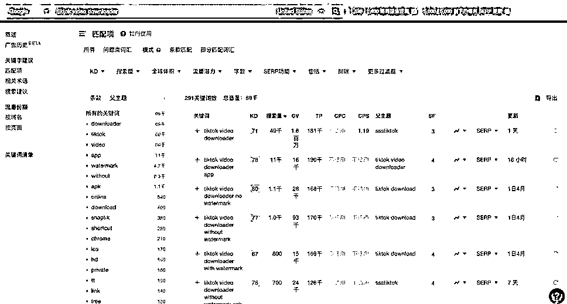

其他相关词建议：同样需求的词，可以下载导出作为「关键词」再次拓词。

Ahrefs 很好用很专业，去某淘租一个共享账号玩玩。快速上手体验。

 

 

另外一个 SEO 工具「similarweb」也有关键词分析板块，但我认为其数据量不够多，并不好用，但查一个网站的访问量，similarweb 是比 ahrefs 更准确的。

**3.3 **拓词工具之：光年**-**谷歌关键词分析工具** **

此工具由国内做流量增长的咨询公司「光年实验室」出品，亮点在于：批量查询和多维度数据导出，如果数据量很大，光靠网页版是不够用的，得申请谷歌关键词 API。（同根同源，数据同样是来自谷歌关键词规划师）。

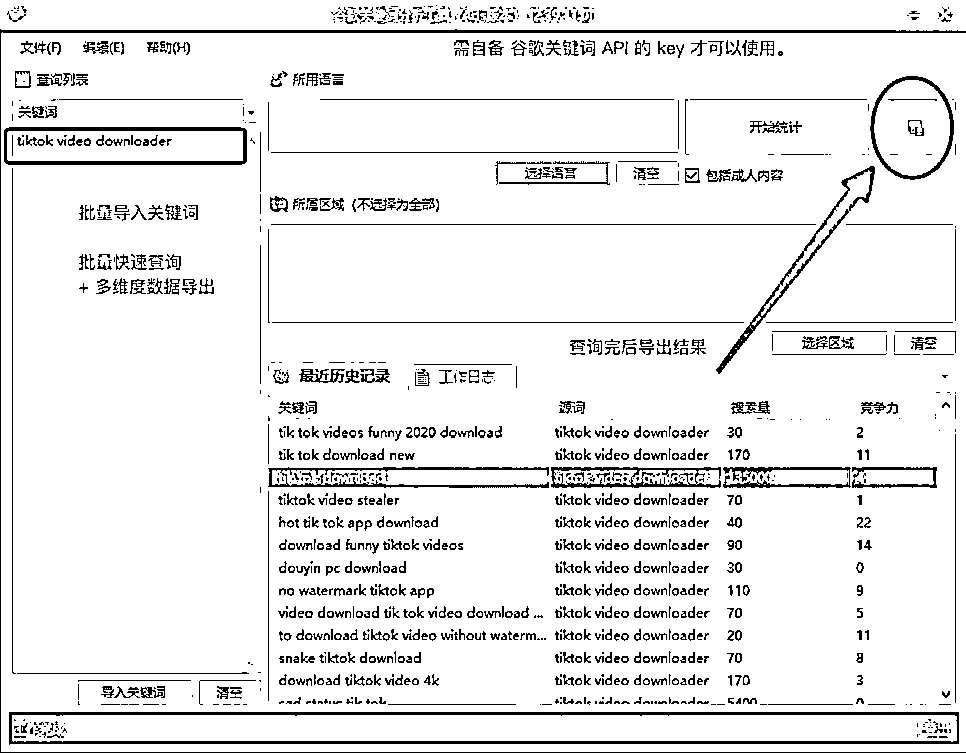

**3.4 **关键词筛选，整理关键词对应的需求列表** **

通过不断的拓词、搜索词的流量，已经得到了一份数据。接下来该如何做？

 

 

往往是这样的一份关键词表：

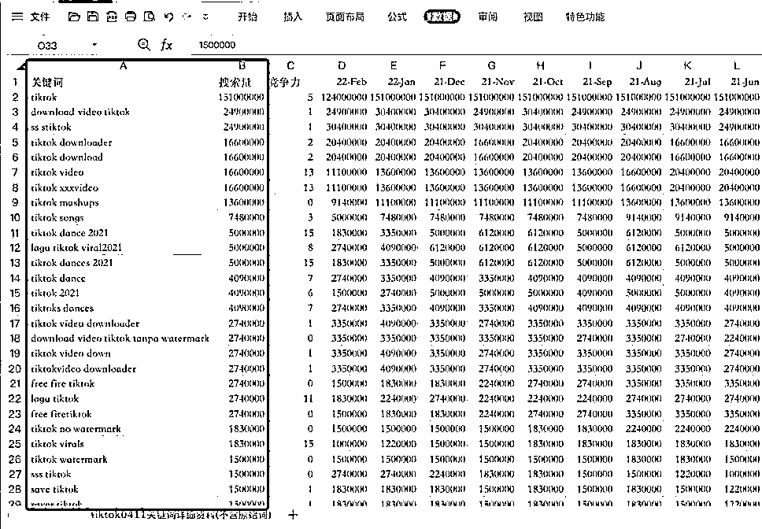

我们按月均搜索量降序排列，一一查看（逐个看，没有捷径），重点关注月均搜索量大于 10000 的词。

整理类似如下的清单，列举了一些，这些 tiktok 相关词有着对应的网站或产品。（已排除性相关的需求词）

 

 

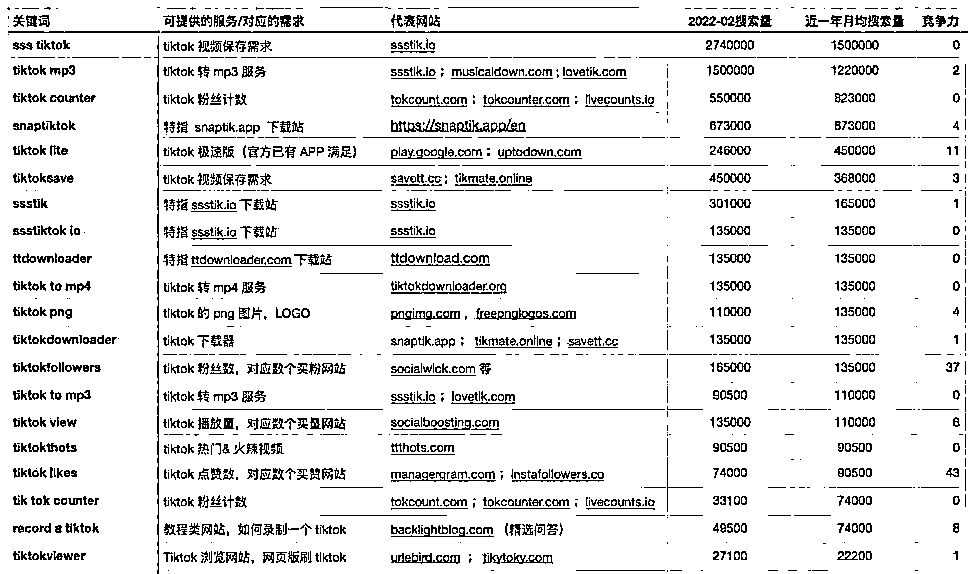

这样看，是不是一目了然。其实还有很多需求点并没有得到充分满足……此为举例，更深入下去，看到文章的你说不定有新的发现，欢迎交流，我也知无不言言无不尽。

**3.5 **关键词挖掘的技巧补充** **

关于母词，要多且准。母词的数量建议在「四位数」，数千个母词，可以拓词出数十万到百万的词。  而精准很关键，否则容易拓词出不相干的结果，筛选成本变高了。比如「Tiktok」容易拓词出一些大网红的名字，这些词在拓词时要先删掉。

那我们可以从哪里找母词？分享三点：

**1. ** 从目标网站挖掘：比如网站首页、关于我们等页面提取关键词，比如** slogan**、描述、**Metawords**、底部导航菜单命名。** **描述业务的词，越全越好。

**2. ** 找母词的角度：自己所处行业，那就头脑风暴开始。包括不局限于：直接相关词、行业相关词、人均相关词。

**3. ** 从广告投放词来用作关键词母词，也是特别好的。** Ahrefs **上了一个新功能「付费关键词」，即可以查询一个网站所投放的关键词，这个太强了。你想啊，人

 

 

家愿意按点击付费购买的关键词，能不精准吗**~ **下图以** Shein **举例：**Ahrefs **共收录了**7.4 **万个关键词，可过滤导出进一步筛选。

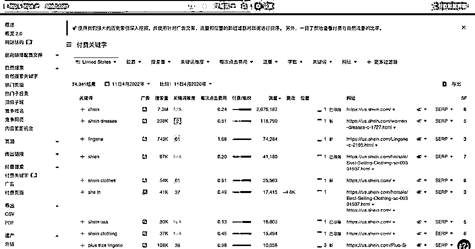

四、总结：** **

通过 Google 的搜索大数据，直接反映用户真正的需求。关键词研究若对一个行业需要更全面、耐心的挖词、选词。我介绍的是通过工具快速上手的方式。围绕 Tiktok 是如此，试试其他产品方向呢？比如据说最新估值 1000 亿美金的 Shein ，又有哪些周边机会可以做呢。

平台在变，可用户的需求具备延续性，若能在新兴平台提前布局相关服务，不失为分到一杯羹。比如 Instagram/YouTube 下载站的经验，在 Tiktok 上再来一遍。

通过 Google 搜索平台关键词研究，发现用户需求/产品机会，我称之为「生财机会」。

关键词研究很有意思，你会发现：居然人们在这样搜索一个词；当你去搜索这些词，惊奇：我靠，居然还能这么做。关键词研究的运用场景很多，不止是用在需求发现和 SEO/SEM，还可以用于内容生产维度参考、信息流投放、舆情监控、KOL 挖掘等。

 

 

试试看，期待你的「我靠，绝了！」。当你哪怕找准了一个好的关键词，我想，这一定是个伟大事业的开端。

评论区：

三林 : 我靠，绝了[偷笑]。第一楼归我

闲富（软件定制） : 嗯，最近搞了一个国外 tk 刷粉的网站

颜周 : 去水印的网站真的直接把国内玩过的搬出去了。

三林 : 说不定是国外先做，这帮站点好几个来自印尼人搞得。还有国内的低调大佬也有做类似网站

三林 : 赞啊，期待后续分享心得

闲富（软件定制） : 目前市场已经起来，做工会的羡招募主播居多。找主播类工具比较好

Sunwei : 先赞后收藏，个别思路思考或实操过，感谢系统分享，私信加个 V X 好友[握手] 三林 : 文章没法加超链接的，补充亦仁的经典文章  时间快五年过去了，有些事情经得起时间考验 https://mp.weixin.qq.com/s/cXa6Rwiet5gN8bSe-h4QNw

