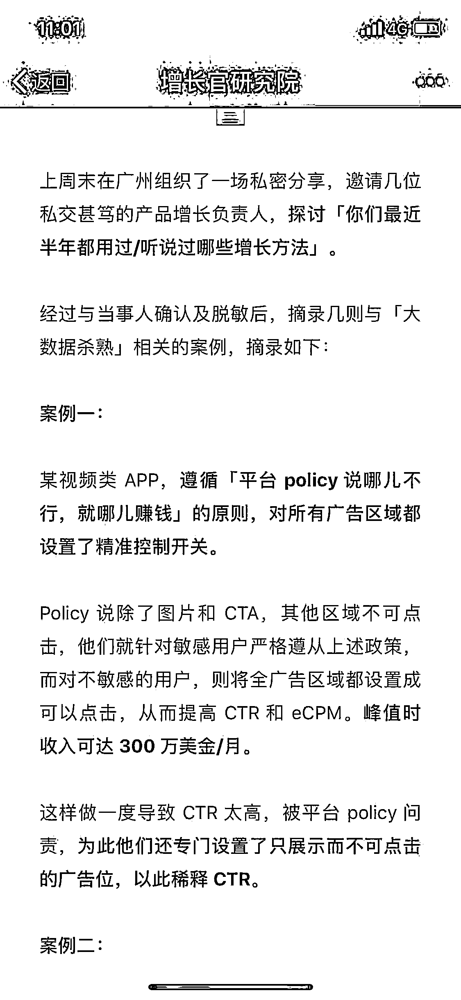
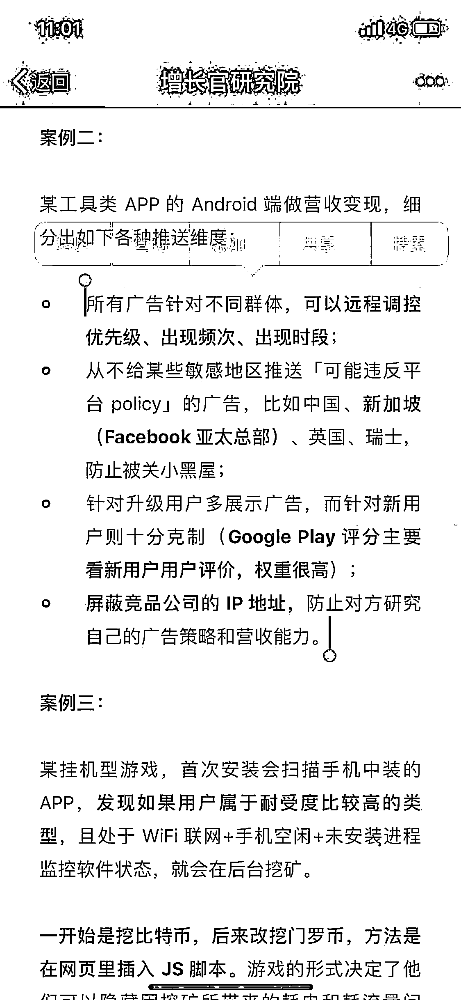
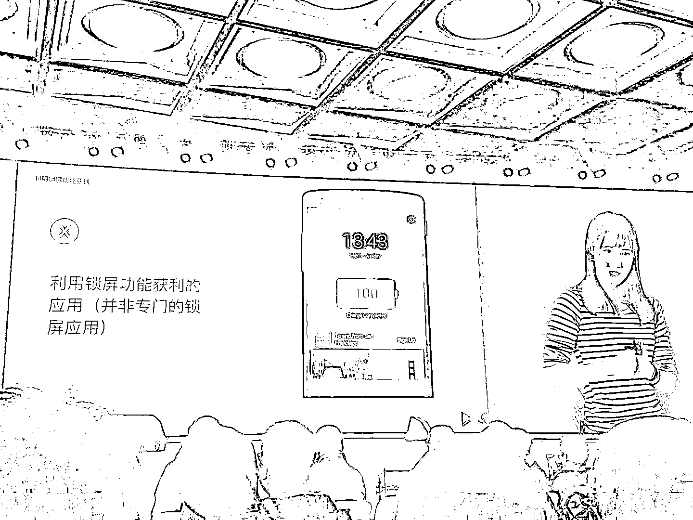

# (精华帖)(41赞)如何薅facebook和Google羊毛

作者： TikTok Gia*

日期：2018-04-21

 

 

如何薅facebook和Google羊毛。

除了这篇文章里说的，再补充几个：

1、针对从facebook和Google的media buy，即买量用户弹广告，organic用户不弹广告。

防止审查人员主动搜索下载查到违规广告位。云端控制，前三天开比较缓和的广告位，越激进的广告位，比如充电锁屏，比如挂断位广告，出现得越晚（3-7天后）2、针对facebook过来的用户，优先出facebook audience network的广告。同理Google Adwords过来的用户优先出Google Admob的广告。后面填冲mopub，flurry等平台广告。

3、针对不同的场景，做不同的广告。比如差旅刚下飞机，解锁后出现Uber广告。进入酒店附近出现yelp广告、周围热门景点的广告。上面是分LBS。早中晚时间段也可以精细化运营广告位，而不是一股脑儿都抛给用户。

4、充电锁屏。2015年最猖獗，某数字公司，某动物公司，某＊娘公司，当年出海的产品加上该广告位后，每天多了几十万美金收入（保守）。我16年初去印度出差时，酒店前台小哥，插上USB充电，需要解锁4个App的充电锁屏，4次全屏广告展示。[流汗]中国人的小聪明真是无所不在。

17年Google开发者大会上，谷歌已经禁止非锁屏类APP出锁屏类广告。但魔高一尺道高一丈，还在博弈中。

5、未完待续……

我的微信号：tomxu123

 

 

 

 

 

 

 

 

 

评论区：

 

 

南方以南 : 厉害了Tom哥

TikTok Gia* : 来了个识货的，见笑了

土豆仔 : 我记得2年前有个创业项目就是  这类广告，  听了觉好厉害

TikTok Gia* : 百度还是360，都提供这个标准sdk接口了  南方以南 : 期待后续

Caoz : 这篇作者能不能搬我圈里

TikTok Gia* : 可以，曹老大。

TikTok Gia* : 我自己发吧
