# (精华帖)(139 赞)在疫情期间找准用户需求，半年打造月销千万的品牌独立站

作者：  鱼丸|亦仁助理

日期：2022-03-30

疫情爆发，跨境物流费用暴涨，利润空间被疯狂蚕食，这是目前跨境卖家普遍遇到的问题。既然没办法节流，开源就十分重要了，如何找到疫情期间的产品需求呢？本期「生财合伙人」专栏，@图帕先生  就来和我们一起聊聊这个话题。

他曾任上市公司市场部组长，组员 6 人，一年把自然流量在每天 200K+ 独立访客的基础上提高了 20%。现任初创公司谷歌推广渠道负责人，20 人团队，高峰达上千万  GMV，擅长从 0-1 搭建稳定盈利的谷歌广告账号和打造垂直品牌独立站。

本篇内容，他也会详细讲讲，自己用谷歌趋势工具进行选品，利用广告有效起量，在半年时间重新打造了一个月销千万的品牌独立站的全过程。

 

 

⒋** **跨境营销主要方式有哪些？我是如何选准优质又稳定的流量入口？

⒌** **网站从** 0 **到一千万的发展

⒍** **如何打造品牌和树立权威，建立能长期发展和盈利的网站？

⒎** **总结

**—Part 1—**

疫情对跨境电商行业的冲击

刚好在疫情前，我从大厂跳到了一家初创企业，负责跨境电商谷歌渠道的流量布局和优化，看上的就是公司的分成比较优厚。在一个 8 人小团队里面，就做到了每月上百万美金的 GMV，一年内公司就组织了 1 次 10 天的欧洲游和 1 次 7 天的日本游。后面也见证着团队发展到 20 多人。

除了这些福利外，更重要的是老板是个长期主义者，并不打算做爆品打游击战那种，而是向品牌网点去发展。这点跟我的价值观是非常吻合的。

不知道是运气好还是运气不好，最后一次日本游刚回国不久，就爆发了 COVID-19 疫情。虽然能安全回国，但是后面等着我们的还有一道道关卡。其中最大的一道就是物流费用。

 

 

而我们也不得不面对这样的事实：受国内外疫情的影响，我们一单的跨境物流费用就要上百元，比疫情前足足多了 4-5 倍，几乎等同于货值了！

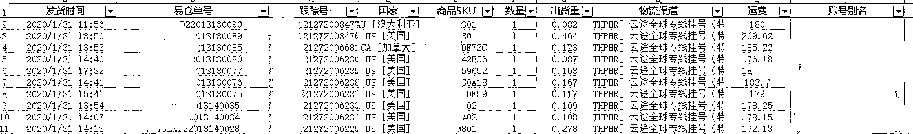

简单算一下，我们产品进货价约约 23 美金，售价约 100 美金，疫情前物流费用约 8 美金，我们大概有 70 美金的盈利空间。然后加上广告费，那时候一个 CPA 大概 40-50 美金，所以一单大概能赚个十来二十美金 —— 还不算人工、仓库之类杂七杂八的费用。

那么，疫情后，物流涨到约 20 美金 —— 几乎完全蚕食了我们剩余的利润空间。

在这种情况下，公司也只能靠吃老本维持 —— 这也是品牌做好的优势吧，遇到突发情况，不至于跌得太惨。咱们旧的站点在 instagram 有 80 多万粉丝、品牌词的搜索量也有  1 万多，所以还是能撑一段时间。

**—Part 2—**

从困境中可以发现什么需求？

（哪些产品能解决痛点）

老本迟早会吃完。这样下去不是办法。但有危就有机。

 

 

疫情刚开始的时候，我们国内曾经有一段疯抢口罩的时期，一种客单只有几毛钱、之前大家都几乎不屑一顾的产品，在这段时间竟然成为了热销品。

所以我们就在想：在这个时期是不是还有产品，能够满足在疫情期间人们突然爆发的需求呢？

如果我们能抓住机遇，说不定就能帮公司熬过这段困境，而且困难过后，我们的发展肯定也会更好（当然我们不会去做口罩，因为当时有太多的国内商家去贩卖没有资质的口罩，导致国外的广告平台都特别打击这种防疫产品，卖口罩的广告账号和网站见一个封一个）。

记得很早之前亦仁大大的文章就涉及到这么一个点：在谷歌搜索一个词，看看搜索相关的词里面，还能发现什么机会。比如在谷歌搜索 Instagram Download，就会出现  Instagram Download for PC 等相关搜索词，这些搜索词就更好反映了用户的需求。

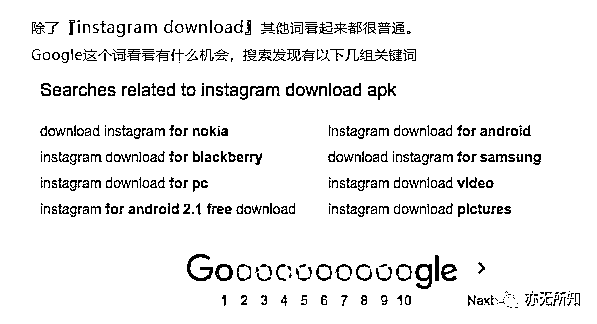

 

 

那么我是做谷歌，不就正应该更好地利用谷歌这个工具吗？

我这时候我就动用到另一个谷歌的工具 —— 谷歌趋势 Google Trends：

https://trends.google.com/trends/

这个工具的使用方法也是非常简单：在这个工具输入关键词之后，它就会展示这个关键词在某一时间段的搜索趋势。如果某个词搜索的人多了，就证明它的需求量上升。

如果你完全没有头绪要看哪个词的搜索趋势，没关系，它里面也有一个搜索词的趋势变化追踪：

选择目标国家

选择时间段

选择目标领域

选择网络搜索

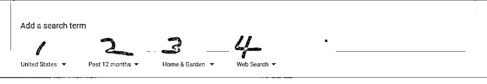

然后出来这样一个界面：

 

 

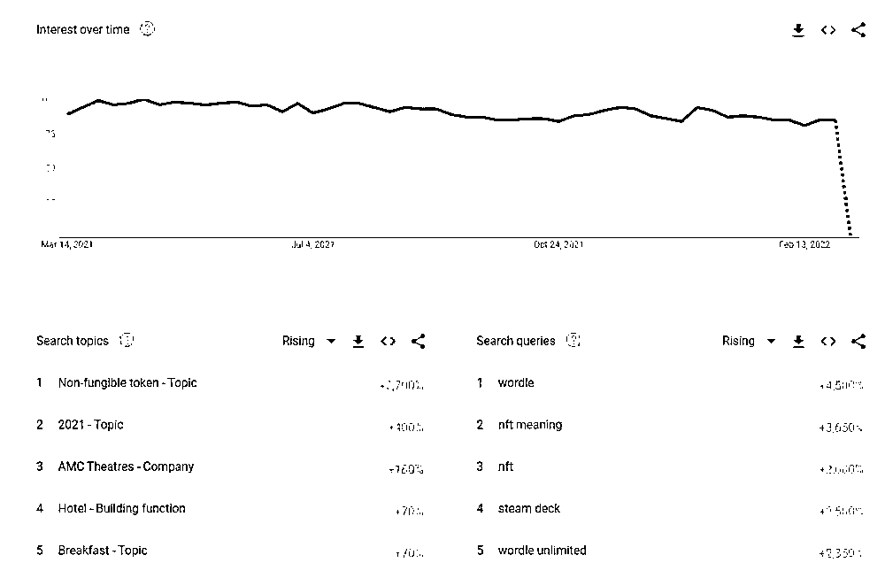

上面的趋势线代表该领域相关的整体需求变化，而重点就在右下角。

右下角就是具体的有搜索上升趋势的关键词，比如推出不久的 Steam deck 游戏机。而右边的百分比数值就是趋势的变化，意思是 Steam deck 游戏机的搜索趋势上涨了  2500%。

也是很简单吧？难点就在于自己要一个一个地再查下具体关键词的搜索趋势，来最终确定需要做什么产品，毕竟某些情况下，选择比努力更重要。

比如，疫情期间很多人都要在家隔离或者减少外出（Lockdown），那我就先从一些居家产品关键词入手 —— 就是说在这个工具里面，我会先选择 home&garden。

然后，我看到 beard trimmer 胡子修剪器（就是我们说的剃须刀）这个关键词的搜索趋势上升了，我就单独把这个关键词放到工具里具体看看它的需求趋势。

 

 

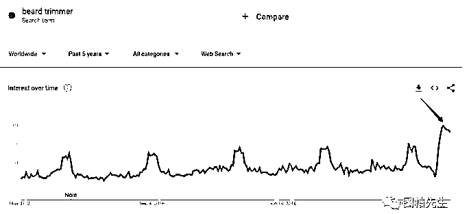

果然，自从全球范围内的美发店服务关闭后，各地对毛发修剪器的需求量大增 —— 因为大家不能出去理发，就干脆自己搞定。

还有 Chair Cushion（椅子靠枕）：

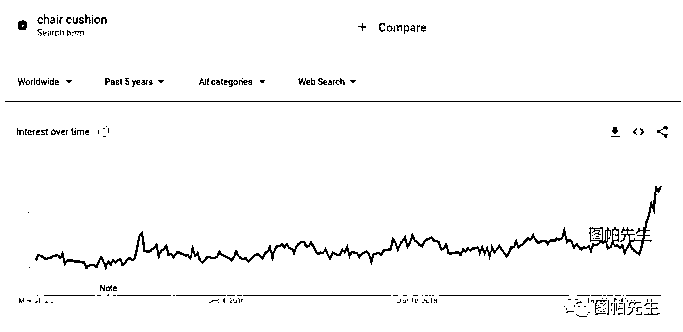

在家工作的政策直接影响到办公设备的需求增长，椅垫就是其中之一。

 

 

本人深有体会，在家办公的椅子有点硬，坐到屁股疼，我立马买了个垫子。

然后就我在 Fitness 健身领域，发现了 Resistant Bad（助力带）：

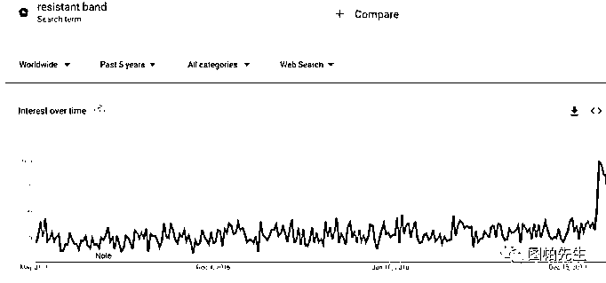

居家隔离大家都没有忘记健身。老外很多自小就养成了健身的习惯，甚至把车库改装成健身房，所以健身用品真的很火爆。

相关的关键词还有很多，这里就不一一细数。而老板和我都是长期主义者，所以除了产品的需求暴涨之外，我还需要考虑它能不能有长期的发展。

于是我就去搜索产品相关的行业报告，在谷歌搜索：「关键词」+「目标市场」+「Market Report」

拿剃须刀为例，我就找到一份美国市场的报告，里面说 2019-2025 年，这个产品还有  2.5% 的增长率（CARG 全称 Compound Annual Growth Rate，复合年增长率），就说明，这个产品不会是在需求爆发后就停滞不前的。

 

 

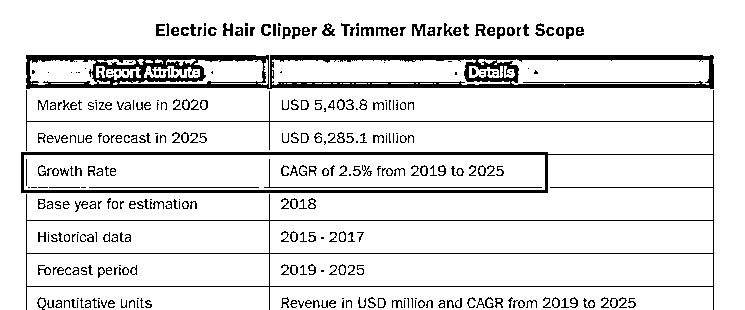

OK，在确定了有需求、而且能长期发展的产品后，后面就要找靠谱的供应商了。目标平台：1688。中国被称为世界工厂，我们的制造实力肯定是杠杠滴。

还是拿剃须刀为例，首先我们选综合服务高的供应商：

然后看买家评价，我会选择评价数量不是很多的。

 

 

可能很多人会有疑惑：为什么选评价少的？去某宝买东西我们不也应该选好评多的才靠谱吗？

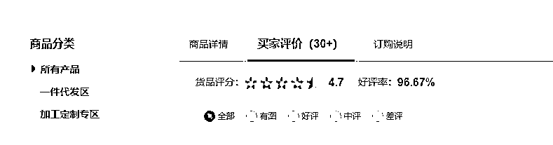

我的考虑点是：多人买的产品，侧面反映了市场上也有很多人见过这个款式。而我们需要的就是我们品牌我们产品的一个独特性。所以我会选择评价不多，但是评价得分也不会很低的产品。

差异性对新的品牌来说很重要，人们习惯了使用某种产品，是基于它常见的类型、功能、风格，如果这个时候，你带着新的设计、升级的功能、甚至新的服务模式冲进他们的视线，这种新鲜感很容易让用户产生购买意向。当他们用过觉得好了，就会复购，还会自动帮我们种草，扩大影响力。

那遇到一个自己本来不太熟悉的产品，该怎样找出新的设计上、功能上的突破呢？

我有两个屡试不爽的方法：

第一，在亚马逊购物平台里面搜索，看看哪些款卖得好。

 

 

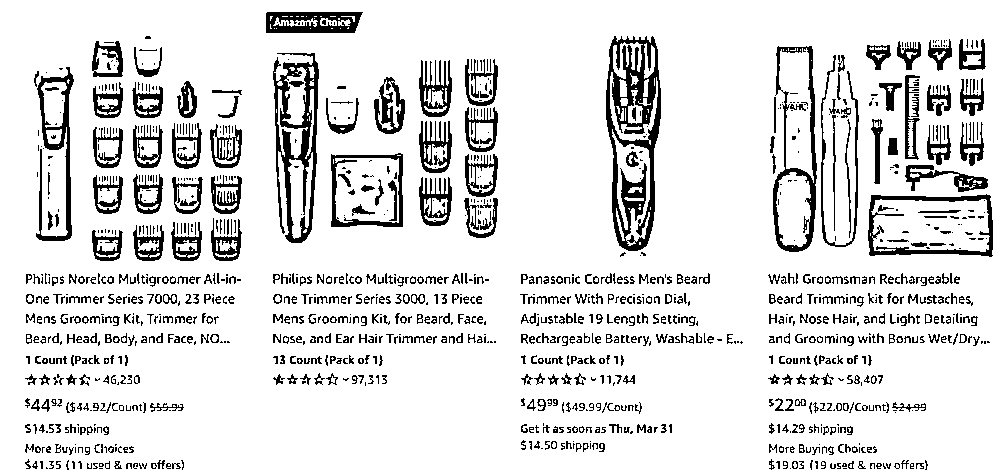

然后记录下它们的颜色、配件种类和数量、主打功能、用户评论（好评是因为什么而给好评，差评是因为哪些地方满足不了他们）等等。磨刀不误砍柴工，这些脏活累活做好了你就会很清晰地发现可以在哪些地方突围而出。

第二，看其他品牌网站的「帮助中心」，这里主要看看他们的「服务内容」。

 

 

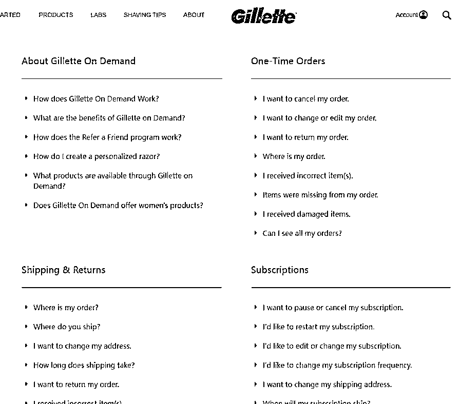

比如上面是吉列的帮助中心，里面就列出了他们的运费、退换货条款、物流时效等等。

这样的观察就能知道这个品类里面，用户比较容易接受怎样的服务，再看看自己能不能把服务升级。

当然，光做这些文书工作也不行，还要自己买样品回来测试，检查产品功能和质量是否被供应商夸大了、包装的质量、英文说明书有没有 Chinglish（中式英语）、配件适合齐全等等。

如果产品合适，就要跟供应商沟通。

 

 

第一，看看他们接不接受贴牌和包装的定制，还有起订量。这是打造品牌特色里面必要的一步。

第二，看看他们回复及不及时，不然后面如果想长期合作，而沟通上又拖拖沓沓，很影响效率和销售效果（比如产品如果出问题了，需要供应商去跟进和查验）。

最后，就是物流了。一开始可以用一件代发的方式测试产品是否能得到用户认可。这种方式能节省前期的仓储费用，因为基本不用自己备货，可以使用比如 4px、dhl 等物流平台，把包裹寄到物流方的仓库，然后发到目标国家。但缺点也很明显，就是时效比较长。所以后面就需要布局海外仓了，时效可以缩短到 3 天内，让用户尽快能享受到产品带给他的便利。

**—Part 3—**

发现需求**/**选好品后

如何开展对应的跨境独立站业务？

好了，选好产品和分析过市场后，我们就要准备启动了。

首先我们要选一个销售平台。因为我们一直是做独立站的，对亚马逊的生态熟悉，所以还是先选择独立站。而小团队做独立站，最常见的建站方式就是使用 Wordpress 和  Shopify，而我择优选择了 Shopify。

 

 

因为 Shopify 的操作几乎是傻瓜式，能为我们节省很多时间。Wordpress 的话需要解决域名注册绑定、服务器搭建和维护等，需要的技术和人力成本会高点。而 Shopify 就几乎完美整合了电子商务所需要的功能，比如支付接口、弃购挽回等等，只需要服月费和给他的交易抽成。

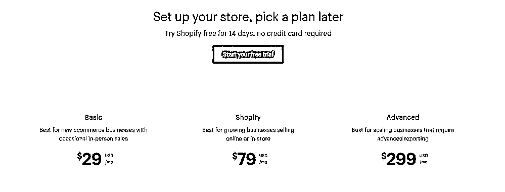

Shopify 的插件功能也十分强大，像在线客服、邮件营销、用户评论管理、CRM 工具接入等都有对应的插件，使用十分方便。

平台就这么愉快地决定好了。接下来，就准备好人员配置。

我自己嘛，其实能够处理推广、运营、客服等，几乎是「万金油」，但考虑到效率，还是需要同事帮忙，甚至可能需要外包部分任务给国外的 freelancer（自由职业者）。

首先先确定自己的定位，我要负责整个新网站新项目，而且我在推广和营销方面经验比较多，所以主要负责推广和统筹策划。噢，还有一个：客服。

对，在前期，我会兼任客服的岗位，因为我想第一时间了解客户的疑问、需求和对产品的使用感受。

 

 

然后一个同事负责运营，一个同事负责采购 + 物流，后面还可以兼顾客服，一个同事负责社媒和 PR。

至于设计、文案的本地化优化等，我们就外包给老外去做，一个是为了提高效率，更重要的是他们对于外国人的审美更熟悉，文案撰写的优势就更不用说了。

这样，一个小而精的团结就准备好了。

**—Part 4—**

跨境营销主要方式有哪些？

我是如何选准优质又稳定的流量入口？

作为项目负责人，在推广策略方面我就要下更多功夫，做出最优判断，选择最适合自己产品的流量渠道。

在跨境电商独立站的营销渠道，主要有这几种：谷歌广告、Facebook 广告、联盟、SEO、网红社媒和邮件营销 (EDM)。

 

 

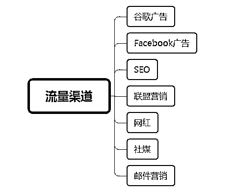

我们做出海营销的，肯定接触最多的是广告平台，也就是谷歌和 Facebook，而且新网站一开始几乎 99% 的人都会投广告，因为见效快（测试素材和产品的质量）、起量也快。

所以一开始，我也是优先选择投广告。

当然，不是说其他渠道都不去用，在后面我会展开讲讲。

那么我该用谷歌广告还是 Facebook 广告呢？我的经验告诉我：不同的产品在不同的广告平台会有不一样的效果。

首先，我要讲讲谷歌广告和** Facebook **广告的根本区别** —— **它们体现的用户需求不同。

⑴**. Facebook**：兴趣主导

 

 

我们在设置 Facebook 广告的时候，需要设置受众类型，有自定义受众、细分的兴趣受众等。

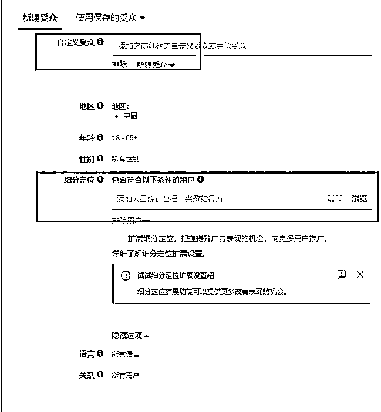

这个也是和谷歌广告的一大区别。

 

 

* 注意，本文只针对 Facebook 广告与谷歌搜索和购物广告的区别；谷歌有展示广告，也是根据用户兴趣设置，但转化远没 Facebook 好（也看产品），所以暂时不针对谷歌展示广告进行比较，我也不推荐不了解谷歌广告的朋友这么快接触展示广告）。

拿我自己做例子，我的 Facebook 小号加了好多关于脸书广告投放的群组，如图中下框的 Facebook Ad Hacks 这个群，所以 Facebook 就知道我是一个很喜欢 Facebook 广告的人，甚至是从业者（我在个人介绍也有填写）。

所以在我的信息里面，就会有上框的关于谷歌广告的服务广告出来！

 

 

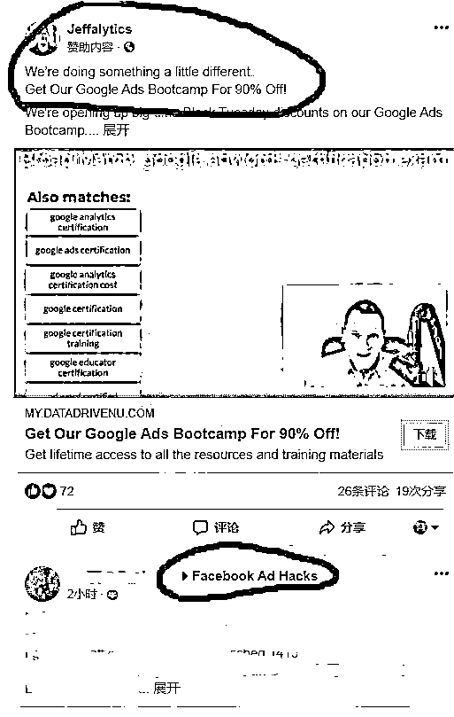

但为什么我关注的 Facebook，出来的广告是谷歌的呢？  这就是兴趣主导！

 

 

我不一定使用谷歌广告，但广告主通过兴趣设置，覆盖了像我一样关注 marketing 和广告投放的人士，广告就在我这边展示了（尽管可能我没投谷歌广告的需求）。

⑵**. **谷歌：需求主导

谷歌广告也叫谷歌关键词广告，我们在设置谷歌广告的时候，会有设置关键词的部分（搜索广告直接设置关键词，购物广告的关键词设置在 feed 里面；展示广告也能设置关键词，但暂不讨论）。

同时，投谷歌广告的第一步，也是先收集关键词。

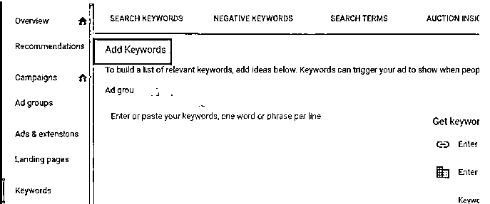

这代表什么？

就是用户一定要在谷歌搜索引擎进行搜索，才会触发我们的广告！

而用户为什么要搜索？就是因为他们有明确的需求。

 

 

比如搜女性包包，就会显示包包的购物广告。

我搜女性包包，可能我是一个对服饰感兴趣的人，但谷歌不会展示女性衣服或裤子的广告给我 —— 因为我没有进行相关搜索！

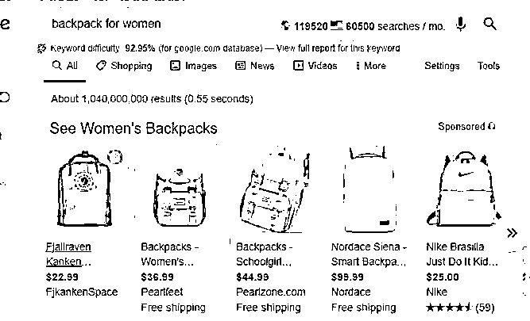

现在应该很清楚了吧，谷歌广告和 Facebook 广告的根本区别：

⑴**. Facebook **针对兴趣覆盖广告受众，就算用户没有相关购物欲望，也会展示（所以 FB 素材很重要，要马上激起用户的购买欲）。

⑵**. **谷歌主要针对关键词触发广告，用户有明确的需求搜索，才会展示（而谷歌则需要提高自己的专业性和特色，用户想买了，但为何要选你？）

这种不同，也进而体现了适用的产品类型不同。

 

 

⑴. 谷歌广告：适合利基、专业性强、有一定品牌知名度、用户需求的产品明显成效可能较好。因为广告出现时是顾客主动搜索，此时他们对搜寻的内容高度感兴趣、购买意愿较高。因为在顾客主动搜的时候，也是最有购买欲望的时刻。

⑵. Facebook 广告：适合新颖、时尚的产品，一个没人知道的全新产品类别，能以多媒体（图片或视频）展示产品特色，用户不经意间刷 Facebook 就能看到你的广告，他们可以点赞、评论，进而「不知不觉」地下单。

最后，根据我们选好的产品的属性，我优先选择谷歌广告！

因为像上文说的，我是从谷歌的搜索趋势选品，所以产品在「搜索」上有爆发性流量，选择以搜索为基础的谷歌广告是最好的。另外，我的产品有一定专业性，属于利基垂直品类，也符合谷歌广告上适用的产品类型。

**—Part 5—**

网站从** 0 **到一千万的发展

**1. **从** 0 **到** 1**：广告一开始的维护

所谓万事开头难。广告一开始的时期都是比较难过的，因为前期需要把较多的预算用在给广告平台的系统学习上。而且谷歌的见效时间相对 Facebook 会慢些，特别是比较大众的产品，需要测试的时间要更长。

 

 

Facebook 可能 1000 刀就能测出爆品，我们通常会开几个广告组，一天 20 刀地跑，哪个广告组不行就马上停。但谷歌不一样，比如购物广告，谷歌对新上传的产品 Feed 至少有一周的学习期，就是说这段时间内数据都会跑得很烂，量起不来，一天只消耗几刀，所以如果这时候你以为产品做不了，很快就停了广告，你是测不出任何有意义的结果的。

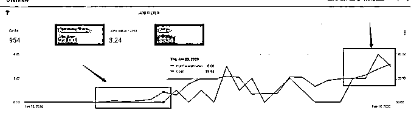

刚开始，我的广告账号一天 10 美金都跑不起来，一天预算是 40 美金，但后面，平均一天能有 2 单。周期大概就是一个月了，ROAS 也有 3.24。你也看到，趋势是慢慢上升的。

在谷歌广告里面，我们优先选择搜索广告和购物广告，因为当用户在谷歌搜索一个关键词，优先展示的就是搜索广告和购物广告，他们都会在自然搜索结果的上方，这样我们就很容易触及到有相关需求的用户，把他们引到我们的网站。而购物广告因为会有图片的展示，所以转化效果会更好。

 

 

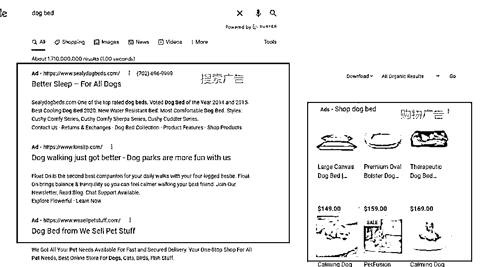

因为谷歌广告是靠关键词去触发的，所以我前期需要花很多精力去做关键词调研。我习惯用的一个广告关键词调研工具叫「SEMRush」。这是一个付费工具，谷歌官方有个叫「关键词规划师」的免费工具，有需要的朋友可以去试试，只是我这边习惯了用付费工具，毕竟付费肯定有付费的优势。

在工具里面输入我们的目标关键词，比如 dog bed（狗狗的床）：

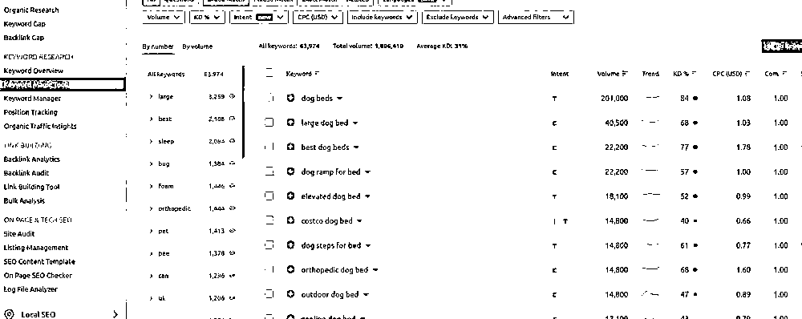

 

 

就会出现很多相关的关键词，给我去选择使用。另外还有预估的 CPA（广告每次点击费用），这样我就对需要的预算有个大概的想法了。

另外，还有个很强大很有用的工具：「竞争对手分析」。里面可以看到哪些网站在投你想用的关键词：

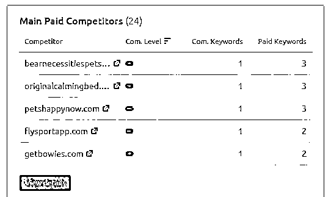

而且能够看到竞争对手正在投哪些关键词！这个功能对我的关键词调研效率有很大提高。

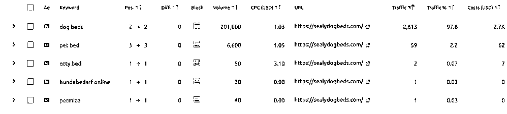

确定好关键词后，我就要好好优化广告内容了。

 

 

搜索广告的优化：

广告词：添加关键词和使用能吸引点击的词，比如除了 cheap、sale、low 之外，还能用  unbelievable, amazing、astonishing 等等更好更丰富的形容词。因为谷歌广告的质量得分  quality score，包括了着陆页体验 landing page exp、广告相关性 ad relevance 和预计点击率  exp. ctr。较高的分数不仅有助于降低 CPC，还可以帮你提高广告排名添加广告的附加信息

使用排除功能和添加否定关键字

出价使用最大点击（max clicks），让系统更快地学习

预算给足

调整不要太频繁，至少 7 天时间，不然会影响广告的学习。之前就试过因为太急了，一天内调整几次，让系统紊乱了，导致广告后面几天都跑不出数据，非常浪费时间，所以这点我们会特别留意

然后就是购物广告。

购物广告的学习周期比搜索广告要长，很多时候一开始投放，广告的展示会很低，甚至  0 展示，所以我会注意以下几点：

出价的 Roas 值不要设置得太高

预算给充足，一天 100 美金

产品 feed 的优化（feed 是用来记录网站产品资料的文档），之前做好的关键词调研，可以用在产品标题的优化上，在标题和描述里面添加最相关的关键词

同样地，不要太频繁调整广告

在投放的时候，我还会观察广告的 CPC（每次点击费用）、CTR（点击率）、ROAS（投产比）、展示份额、CPA（每次转化费用）等。

观察 CPC 能监控预算消耗的稳定性、CTR 能反应关键词和广告语的准确性、ROAS 直接反应广告支出带来的销售额，然后展示份额能反应我们的广告在市场上的位置。

 

 

比如现在我们的展示份额仅在 SHEIN（希音）和亚马逊下面，说明我们的展示份额已经比其他竞争对手高很多，在我们前面只有一些顶级头部卖家。

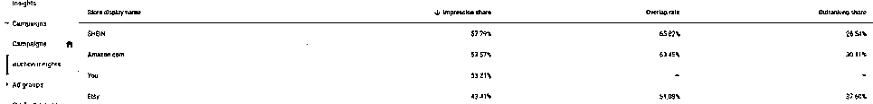

好了，在广告账号慢慢养成的同时，我们也开始去找国外的网红帮我们做一些产品测评，还有找国外的媒体网站去帮我们背书。

一般会把红人根据粉丝数目分为五大类：

入门级  ：5,000-15,000 粉丝

低级  ：20,000-50,000 粉丝

中级  ：60,000-150,000 粉丝

高级  ：200,000-500,000 粉丝

大咖  ：500,000-1,000,000+ 粉丝

粉丝太少，对品牌和产品的宣传力度就没那么大；粉丝太多，价格又太贵。所以我们先选中级和高级的红人。然后开发信方面，我们尽量对每个网红都是有自定义的内容，不会完全发一个相同的模板。这样会显得我们更加真诚，有合作的诚意。

在这么有计划地推广下，我们 3 个月就做到盈亏平衡了。

⒉** **从** 1 **到** 100**：** **广告如何有效起量？

 

 

接下来的重点就是，要怎么把我们的生意扩大一个等级的规模，以准备好迎接黑五旺季（类似于国内的双十一）。但谷歌广告本来就是起量慢的广告形式，应该怎么做才能最有效又快速的扩量呢？

这时候就需要用到营销漏斗的理论了。

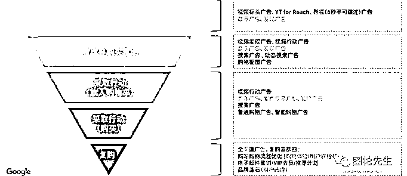

用户对我们品牌和产品的认知到购买，大概分成这几个阶段：

发现我们品牌和产品的信息

考虑购买我们的产品

在网站上加入购物车

下单购买

重复购买

在不同的阶段，都有对应的广告形式去触达到最适合的受众。

 

 

像我前面说的，我首先是投放搜索广告和购物广告，就是在漏斗的中间三层。所以接下来我就要重点在漏斗顶部的阶段去触达用户，还有需要让已经购买过的客户再次考虑购买我们的产品。为什么之前我们不使用？

因为之前我们只想尽快做到能回本的状态，所以只针对加入购物车和下单购买两个阶段去布局推广策略和广告模式。那现在我们整个模式都通了，就可以更加深入和全面地布局我们的营销策略。

顶部首先涉及的是展示广告。展示广告是一种以图片为媒介的广告形式，非常接近  Facebook 广告的形式，我只需要设置受众的兴趣爱好，系统就会把广告素材推送到对应的受众群体。

就像大家在浏览网页的时候，看到一些带有广告标志的图片 —— 就是展示广告。

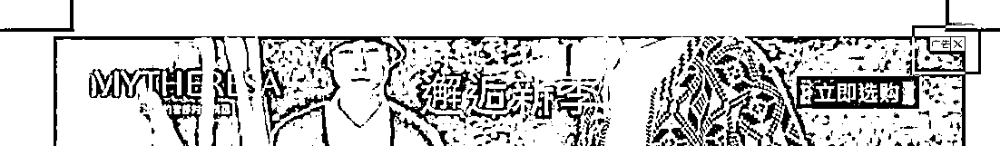

所以图片素材是一个重点，我们的素材要很好的吸引到用户去点击、进我们的网站。

谷歌展示广告素材的尺寸多达十多种，但通常我只用版位最多的几种：300x250；

300x600；250x250。

然后素材里面一定要添加一个 CTA 行动号召按钮。比如说 Shop Now，素材里面一定要加上自己的品牌 logo。让用户看到我们产品的同时，记住我们的品牌标志和名称。

 

 

这种方式的投放，可以让消耗很快上去，因为用户不用搜索特定的关键词。但问题是投产比会非常低，因为刚开始接触到我们产品的用户，不会马上就购买。那么我怎样才能更好地运用这些真金白银买来的流量呢？

答案是：再营销广告。

简单而言，就是我要针对这些进来网上而没有购买的用户，再次推送产品信息给他们。

在投放之前，我就先做好了受众积累。在我的广告后台受众这一栏，我可以把那些跟我网站有过互动的用户单独拿出来。然后去做再营销的推送。

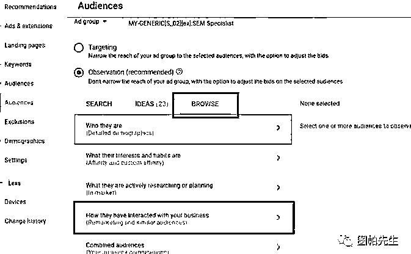

这里就包括了在搜索广告里面，把这批受众加进去，然后针对再营销广告中的广告词，重新优化一下。比如说添加我们有额外的折扣，或者提供包邮服务。这样现在用户看到的优惠信息，比他第 1 次看到我们的时候更大了，购买意向就会提高。

 

 

然后展示广告也是可以这么操作。同样在图片素材里面显示更多的优惠信息，或者说库存就快没了，激发他们的购买积极性。

最后一个就是邮件营销，作为让用户购买的临门一脚。电子邮件在国外也称为 dark social (暗社交)，非常类似我们国内的私域。老外的电子邮件使用率是非常高的。所以我把这些新拉进来的用户，针对他们专门设置一或几封封电子邮件，再让我们的品牌和产品呈现在他们眼前。

里面有个小技巧：我不会硬生生地把产品的折扣推送到用户面前。

我会先介绍一下我们产品的优势、品牌的理念，或者针对用户的痛点提供一些解决的小技巧。这样可以增加我们的专业性。当用户信任了我们之后，他自然而然就会下单购买。发一封电子邮件的成本就几分钱，就算我前面先发 10 封介绍产品的邮件，成本也比光投广告要低很多。所以我并不急着去推销我们的产品。

在经历了艰难的广告账号养成后，还有一小段时期的战略性亏损之后，在黑五当月（11 月份），我们的营业额达到了 1,770,55 美金 —— 约 11,199,291 人民币。

 

 

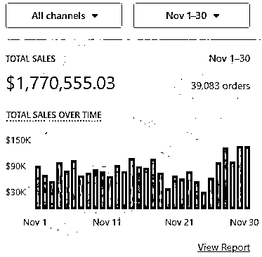

眼看新项目终于熬出头了，国外疫情反复，去不了旅游，那我们整个团队就去了西藏一趟。也希望在这个纯净的地方，压抑住浮躁的心，让我们有力量继续坚持我们的信念。

**—Part 6—**

如何打造品牌和树立权威，建立能长期发展和盈利的网站？

因为我们整个流程都跑通了，产品已经被验证过是用户乐意接受的，品牌词的搜索量也达到了 1 万多，所以下一步我们就要好好规划我们的品牌建设。

首先讲讲我们为什么这么决心做品牌。

 

 

在 2021 年前，都是属于铺货时代，广告效率极高，但同时也让很多人动了歪脑筋，比如下面一个老外做的收货视频：

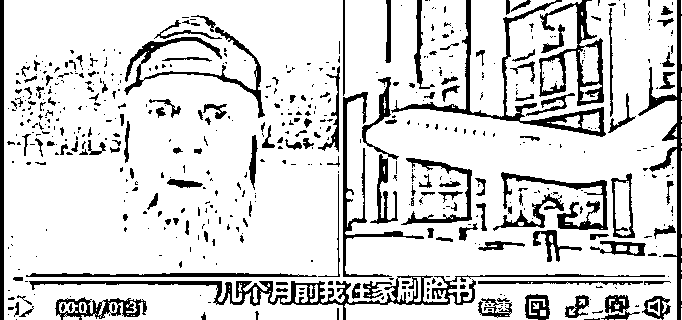 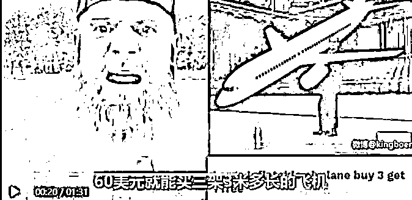

 

 

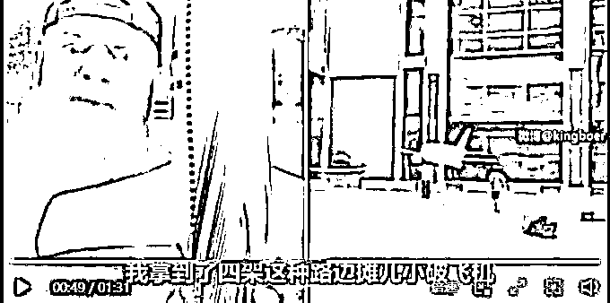

简单概概括就是，他在 Facebook 刷到一个很大很好玩的飞机，价格也不贵，最后买到手的，就是一个街边摊的破烂 —— 货不对板（这个视频里边做的商品，是国人做的）。

同期，一些国内大卖家因为卖的东西严重的货不对板，引起了美国政府的注意，于是下令封杀中国卖家的账号。那段时期，很多中国卖家的广告账号或店铺账号都被一篮子打没了。

再加上 Facebook 广告对苹果 ios14 隐私政策的更新，严重影响了广告转化的追踪，宣布了以 Facebook 广告为主的铺货爆品模式的终结。

我们一直在想，中国是制造大国，我们明明是有资源、有条件、有实力的，但为什么不能有更多的优质产品和品牌输出到国外，而是还在输出仿造伪劣的产品，让别人看不起？

我们一直怀着这个信念，去坚持做我们的网站和品牌建设，我们有信心做到就算我们明说自己是中国来的产品，老外也一样乐意购买，一样的信任，而且使用体验也很不错。

 

 

对于品牌的营造，我主要有两个大方向：进攻和防御。

「进攻」的意思是，要把我们的产品和品牌理念推送出去。

「防御」是指要维护好我们的品牌。

⒈** **我们如何进攻？

第一，我们永远把用户的体验放到第一位。

图帕先生个人是一个阿斯汤加瑜伽的练习者，也非常钟爱露露乐蒙（lululemon）这个品牌的瑜伽服。他们家衣服的质量就不需要置疑了，一些细节也是值得我们去学习的。比如我网购几件他们的衣服，在里面就塞了一张小卡片，卡片的封口就写了：You are important（您很重要）；还有小卡片的开头就写了「诚挚感谢您选择 lululemon」，然后就是引导关注公众号的老套路。

 

 

收到货之后，就感觉我跟这个品牌是有一个对话在里面，她跟我说：「我很重要」。这样，我对露露的忠诚度潜移默化地提高了。

所以后面我们也在每个包裹里添加一张小卡片，感谢用户的支持。而且印上一小段手写的感谢文案，里面也再次突出我们的产品理念。

第二，多流量布局。

我们前期主要用广告去引流，那我们也要开始布局更长远的流量策略，比如 SEO。

 

 

SEO 的优点是：

⑴**. **建立长期性流量：虽然要出现在搜索结果页第一页无法一蹴而就，甚至一两周之内都无法发生。但是一旦网站顺利获取好的搜索排名，将可以享受持续性和比较稳定的流量。而且以固定成本来说，SEO 相对于搜索广告有更长的时效期，甚至有更高的投资回报率。

⑵**. **建立权威：我认为建立权威的最佳方式之一，就是学会如何做好 SEO，因为 SEO 不只是操作自然搜索排名，更关乎到使用者体验、内容、网站结构等。而且自然搜索排名对于潜在客户来说往往更具信誉度、霸占心理高地，因为这并不是付费广告。

⑶**. **增加网站价值：网站也是一种虚拟资产，你可以高价出售网站，但就要提高其价值。有许多因素能有助于提高网站价值，包括「流量、排名、设计、安全」等等，而这些都跟 SEO 有所关联。记住，SEO 不只是把某个关键词做到排名第一页或第一名，这只是手段之一，而不是最终目的。

在 SEO 里面，我一直是白帽 SEO 的实践者（专注优质的外链和内容创作），就是说专注最优质的内容。像我其中一个页面，不用一条外链就能够覆盖到 500 多个关键词，而且主关键词还排在第一。

 

 

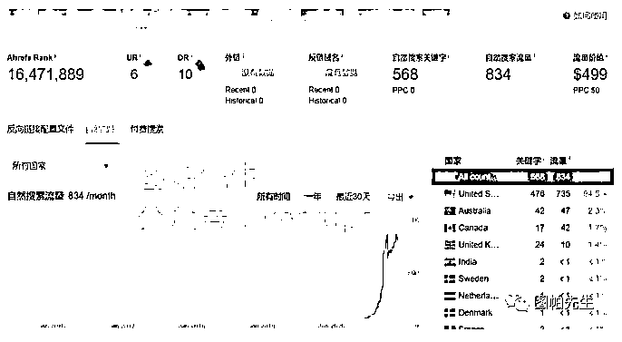

证明只要提供优质的内容给用户，谷歌就会给你奖励。

第三，品牌溢价。

根据马斯洛需求理论（Maslow’s Hierarchy of Needs），人类有不同层次的需求，从最基本的食物和住房需求开始，一层一层提升，甚至到了人的自尊和自我实现。

 

 

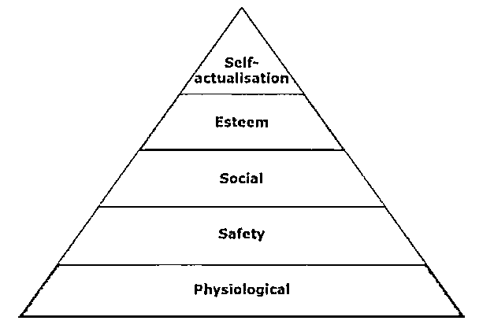

这个理论能如何应用到我们的产品和品牌呢？

每个需求，并不是只能靠单一产品去满足，同一样产品，经过不同的包装或重新设计，能满足不同层级的需求。

以自行车为例，我尝试阐述马斯洛需求的运用：

⑴. 生理需求：如果只是为了满足消费者通勤的需求，可能只能卖 500 元。

⑵. 安全需求：如果能满足了消费者出行安全的需求（比如加强刹车功能），可能可以卖  1000 元。

 

 

⑶. 社交需求：如果可以满足消费者成为某个车款的忠实粉丝或是粉丝俱乐部的归属需求，或者是跟某个 IP 联名，满足「饭圈」的归属感，可能可以卖 2000 元。

⑷. 尊重需求：如果能满足消费者时尚、高贵、富有的需求（比如请某位知名艺术家重新涂装），可能可以卖 5000 元。

⑸. 自我实现需求：如果能满足消费者个性化的需求，体现消费者的个性，可能可以卖  10000 元，像下面店铺能自行组装的自行车，都是 999 美金起步。

所以后面我们就需要升级产品，去满足不同用户的需求，进而让我们的利润空间更大。

而且如果我们完全以流量为导向，全部精力在流量和渠道，不断地靠打折吸引用户，而在产品迭代上没花太多的资源和时间。

流量和渠道一变，网站和品牌就会死亡。

⒉** **简单讲讲我们的防御

要懂得保护自己的品牌。

要避免自己的商标被抢注，而且可以在谷歌广告平台提供自己的商标声明，避免其他竞争对手的侵权或者恶意跟卖。

 

 

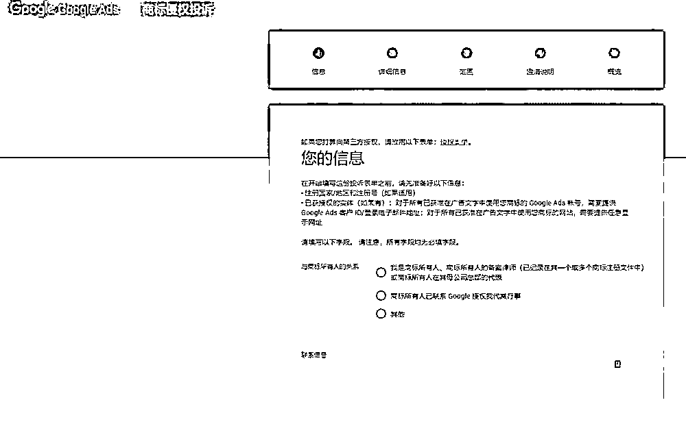

谷歌里面提交真实的信息之后，当竞争对手对你抄袭，你就可以向谷歌申诉，让谷歌对竞争对手做出一定的惩罚。

**—Part 7—**

总结

最后，稍微总结下我的经验吧：

第一，找到一个能长期发展的市场和产品。

 

 

第二，要熟悉广告平台的功能和规则，比如出价策略、不同广告形式的功能等，不然在调整广告的时候就会碰钉子，还可能会卡在扩量的瓶颈期。

第三，站在用户的角度去体验自己的产品，只要用户信任你的产品，一切都会水到渠成。

有人说站在风口上，猪都会飞。

一买一卖，其实就是供需的满足。找准用户的需求点，提供能满足需求的优质产品。说起来简单，但做起来还是需要顶着很大的压力的。

我们这只小猪也算趁着机遇，稍微飞起来一点吧。但我们更注重的不是飞起来，而是怎么飞得稳，飞得远。比如我们在非旺季的时候，也能做到月销百万美金。

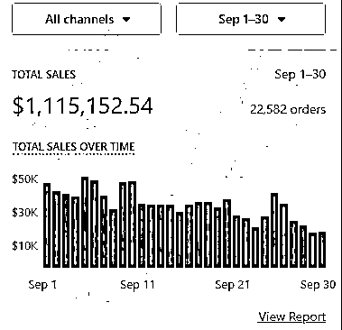

 

 

就是因为我们不是用一个打爆品收割客户的心态去做生意，而是脚踏实地做一款让客户认可的产品。

另外，我自己也做了一个付费社群「谷歌研讨社」，希望把最正道的谷歌渠道推广方式和品牌打造心得分享给大家，帮助中国产品和品牌打造世界影响力，欢迎大家来交流。

也欢迎大家关注我的同名公众号「图帕先生」  ，关注之后根据提示可以获得 SEO 的工作表格和关于谷歌广告的电子书，我会坚持的更新关于谷歌广告、谷歌 SEO 等海外营销的实操心得。

谢谢大家的阅读。

Peace Out！

P.S. 如果你也想在生财有术专栏分享你的经验和认知，请点击链接

http://form.shengcaiyoushu.com/f/HA1G1g  填写表单，我们会陆续邀请有赚钱相关经验和案例的嘉宾做分享。如已填写表单请忽略。

评论区：

西昂 : [强] 关注博客很久了

鱼丸|亦仁助理 : 感谢  老师的分享，大家如果有什么问题。可以在评论区留言~ 图帕先生 : 大家如果不会上谷歌的，没关系，也可以用百度练练手：百度搜索“百度指数”进入有“官方”标志的百度指数页面，在里面可以输入一个关键词，然后就能看到该关键词的搜索趋势了；而在需求图谱版块，能够看到相关的关键词搜索热度。虽然结果是国内的热度，但可以尝试下这个工具和模式💪

 

 

图帕先生 : 谢谢支持[嘿哈]

子不语 : 于是我就去搜索产品相关的行业报告，在谷歌搜索：「关键词」+「目标市场」+「Market Report」，这个点很棒，受教了

图帕先生 : 希望能给大家一点启发

超越 : 感谢🙏，虽然还在工厂上班，但是看了你的分享，内心莫名坚信我也们从网上赚到钱了！！！

图帕先生 : 谢谢你的支持[嘿哈]坚持下来一切都会好的
