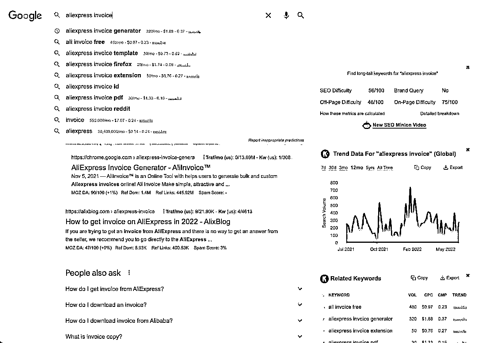
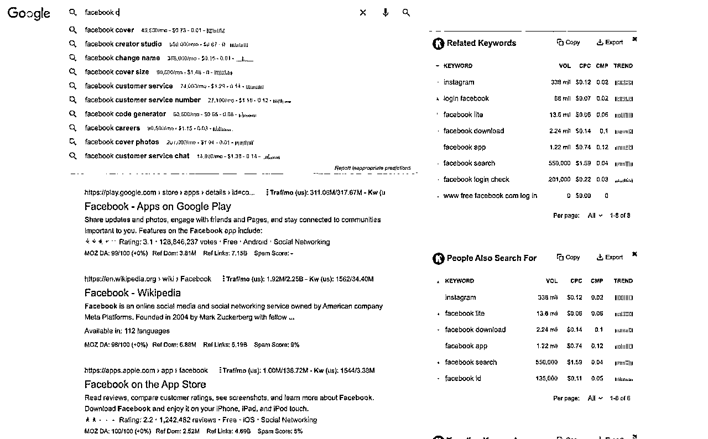
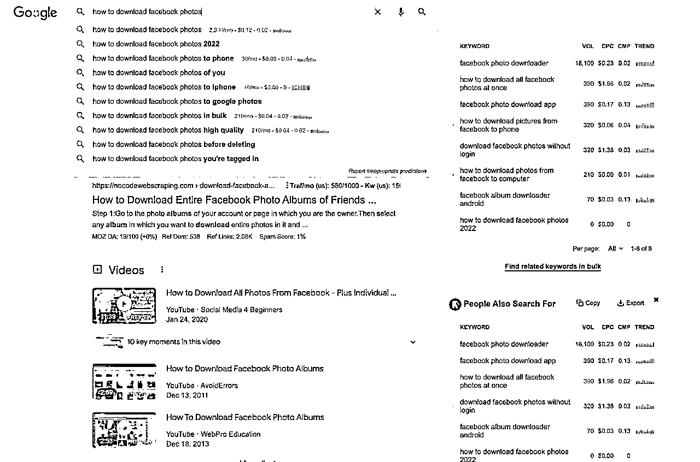
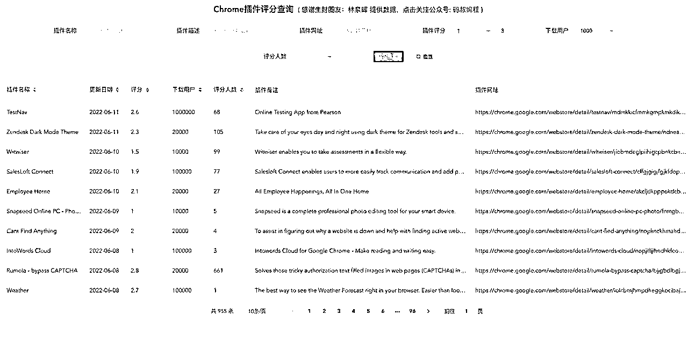
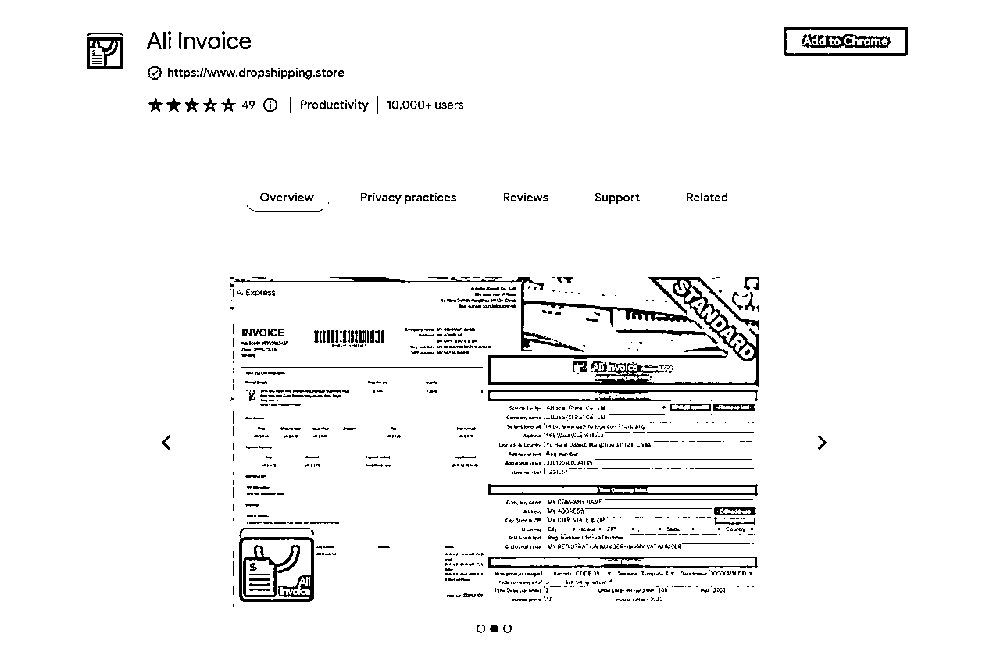
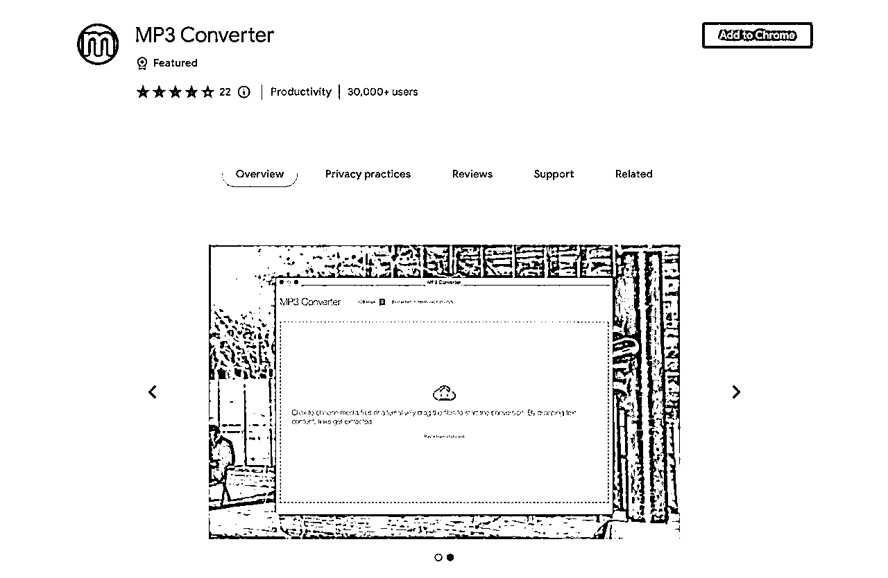
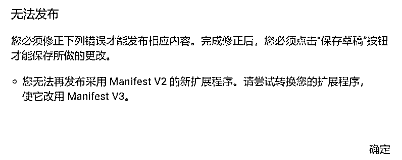
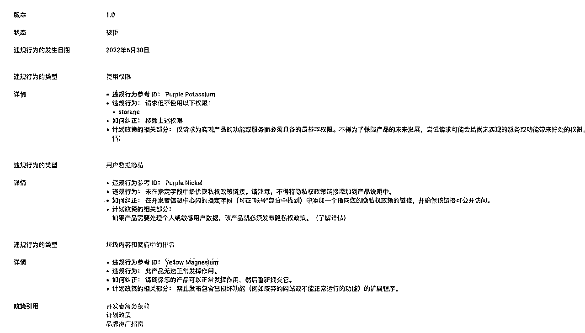

# (45赞)Chrome 插件开发之旅：从 0-1 开发浏览器扩展

作者：  阿帆

日期：2022-07-18

大家好呀，我是帆，本职前端开发，也是本次 Google 插件大航海船员～大航海挺多优秀的圈友都上线插件了（我也上啦），在群里我比较活跃（话痨）一点，这次应阿蓝的邀请，整理分享一下自己在挖掘需求的过程和插件上线后的一些想法。

今天分享的内容，主要围绕在：方向选择和需求挖掘。另外附带一些开发上线的细节，以及插件上线后挖掘新需求的想法。全文大约 5000 字，阅读大约需要 10 分钟。

那这里就开始吧～

 

 

一、确定方向及需求挖掘

这次航海，我学会的最大的一个认知就是：想要做好一件事情，开发其实是最简单的一环。

决定是否能盈利、用户是否买账的核心，是功能是否满足了用户的需求，而不是你的代码写的有多好，功能有多少。在开始一个项目之前，我们最需要做的是反复确认一个需求是否可行。

为什么用户愿意给一个简单的东西付费：

Google 插件有一个要求，也就是：插件应该是单一功能的（Single Purpose）简而言之就是：

这个插件应该只为了做好一件事情，而且要易于理解，过于复杂的功能审核是不会给通过的。

在这个前提下，你要制作的插件就应该是一个用于辅助用户的工具，例如我们挖掘需求会用到的 Keywords Everywhere、亚马逊卖家常用的 Keepa 都是属于这种工具。

工具帮用户节省了时间，用户就愿意支付这样的一笔费用。而且这类工具的用户，大多都是为了赚到更多的钱，那付费就更爽快了。

从零挖掘需求，建议从大平台的周边挖起：

 

 

虽然是明确是要做一个辅助类的工具，但我还是不建议从这种工具类做起。我认为：自己的第一个插件应该要尽可能的简单，让自己能快速的了解开发流程，明确开发的大体内容（如何开发、如何上架、上架需要准备什么、流量怎么来）。

所以我航海时的计划就是：做一个简单的免费插件，跑一遍这些流程，这样在开发付费插件的时候心里才有底，不至于抹黑乱跑。

挖掘需求，建议充分阅读：航海实战｜Google | 付费插件｜实战手册，航海手册里对于常用的方法及各方面的细节，都有非常详细的讲解，有不明确的地方，来回翻阅几遍加上实操基本就清晰了。

一开始建议遵从手册上面的方向挖掘需求，也就是：Facebook、Instagram、Youtube 这些平台。因为这些平台的用户量巨大，再小的一个需求，哪怕能满足 0.001% 的用户，也是最少五位数的体量，而且需求好调研（Google 搜索）、SEO 也方便。

想挑战一下自己，第一个插件就开始盈利，建议从：Amazon、Ebay、Etsy、Shopify 这些电商平台开始。

除了用来熟悉开发，熟悉流程的第一个插件，其他插件在开发之前最好是反复确认，做好调研。

壹树说过一句话：找到一个需求后，不要急着着手开发，一个礼拜后再回来看，如果觉得这个需求还是不错，那就一个月后再来确定。这句话一定要牢记的，因为开发是需要时间投入的，最好在开始前反复确认，这个需求是一个有潜力的需求，不然时间成本太大了（开发的投入、审核上线的时间、Bug的修复和编辑的审核时间、SEO 推广，以及开发完成后的倦怠期）使用工具挖掘需求的市场和竞争强度：

 

 

在航海群里，问一个需求能不能做，最大的可能是收获到壹树哥的一句：问搜索引擎，搜索引擎比我们靠谱多了。

一个需求能不能做，答案全在搜索引擎的数据里，我们通过搜索+工具可以得到：

**1. ** 关键词和相关词的月搜索量、广告费用

**2. ** 需求的竞争对手有多少

**3. ** 相关的长尾词都有哪些

**4. ** 每个月通过这个词进入目标网站的流量，以及网站的月总流量

流量（Traf/mo）是预估的。关键词搜索量、费用、竞争强度等数据，经过调研来源于 Google 关键词规划师（比较准）

这里使用到了 Keywords Everywhere 这个扩展，使用到的功能是：搜索关键词，获取关键词以及相关词的搜索量、通过关键词进入网站的流量。主要用于分析需求量及竞争强度。

使用工具挖掘需求：

 

 

上面提到 Keywords Everywhere 这个工具，可以查询到关键词以及相关词的市场容量、竞争难度。那我们也可以倒推过来，使用它去做需求的挖掘。在航海手册里，有提到一个方法。使用关键词 + a-z 去检索需求：

A-Z 这样走一遍，就能筛选出大多数平台的高流量搜索词。英文好的圈友，大概第一眼就能看得出搜索出来的下拉词是什么，英文不好的，可以点进去看看结果，评估一下内容和搜索量，就可以考虑进一步研究（深挖）啦。

基本上就是按照选定的方向，例如 Facebook、Amazon、Gmail、Ebay 这些词去做 a-z 搜索。

找的方向以后，就去引擎上找长尾词，看看当前的解决方案，例如：how to xxxx in xxxx。一般这种词最能显示出需求量。

 

 

模仿竞品开发插件：

除了通过搜索关键词去挖掘需求，另一个方法就是模仿竞品，这个方式应该是见效最快的方式了。这里需要这一份圈友分享的商店扩展列表：Google 插件市场 15w 条完整数据 | 圈友基于此做的筛选工具

使用这份数据表，可以根据插件评分，用户量进行初步筛选，再人工过滤一遍结果，选择出近一两个月有新评价，但是评分比较低的产品，使用上面提到的 Keywords Everywhere 做长尾词调研。

 

 

这种方式搜索出来的内容，基本都是有需求的（近 1 个月有评价）使用工具去研究长尾词，主要是为了分析需求和市场大小，竞争情况如何。

例如这个插件：Ali Invoice，就是使用这个方法在数据库里挖出来的。

 

 

插件功能很简单，就是获取速卖通的订单信息，生成一份可打印的发票文件（PDF）。功能实现起来不复杂，基础班的价格是 20 美金…目前插件已经很久没有人在维护了，看了一下 Rate 里的大部分的竞品，评论也很多是 not working（说明有需求，但是没法解决，直接对标开发  1 比 1 复制，很容易推广的）。

这个需求属于比较小众吧（问了一下做速卖通的朋友，说是没这个需求），所以这个方向，我没有深入下去调研，感觉这种就挺适合新入手开发插件的圈友练练手。

关于免费插件如何盈利：

在挖掘需求的时候，一定会注意到有很多插件是免费的。不用猜它们怎么盈利，这些插件大部分就是为爱发电的（作者的爱好、炫技或者是看不上这点微薄收入……这也是为什么商店里有很多不再维护的插件……）

当然，也不是说免费插件就没法盈利，只是方式更复杂一些：

**1. ** 带流量给自己的网站，再通过其他产品转化（有一家开发商，专门开发免费的插件，导流给自己的小游戏）。

**2. ** 引流售卖商品（Tabby Cat，一个宠物标签页，通过独立站售卖周边贴纸盈利）**3. ** 增值服务（插件获取到的数据云同步功能）

**4. ** 通过联盟链接赚分佣（挖需求发现有一款免费插件，评论区都在说会自动打开天猫超市……作者大概是淘客吧）

**5. ** 引导点击广告（这种插件一般都会挨骂………………）

做好心理预期：

刚开始做插件的圈友一定要做好心理准备，你的第一个插件可能会：因为各种奇怪的问题审核被拒、开发完发现版本不能上架（MV2 版本不能上架了）、遇到问题在网上搜索到了解决方案却没效果，上线了却没有用户等等。

 

 

这也是为什么我建议先开发一个简单的免费插件，体验一遍完整的流程。不过遇到了也不要气馁，事后做好复盘，争取下一次更好，这种事情就像是亚马逊刷单被抓，Facebook 广告账户被封一样……没有经历过也不算一个真正的插件掘金人吧～

二、摆脱技术依赖、快速开发** MVP **产品

开发插件，主要是为了帮用户解决问题，怎么解决不重要。在需求挖掘的时候，我习惯在确定一个需求可行的时候，先去简单研究一下实现。也就是看有没有可以直接拿来用的库，如果没有的话，评估一下自己去实现复不复杂。

比如这个插件：

看到这个插件的第一反应，就是可以用库（FFMPEG）实现一个一模一样，甚至更好的工具（比如我叫他 Media Converter，音频、视频、图片都能转…………甚至视频抽帧、图片转视频，都很简单），自己只要做一个界面，预置好转码的参数就可以直接上架了……

 

 

开发之前，建议整理一个 todo list，把需要开发的功能一项一项的列出来，然后一行一行的删除掉，只留下最核心的功能，先完成一个 mvp 版本，让自己有个东西去做推广，表现不错再做细致的补充。

补充一点：不用太在意使用什么技术去做插件，插件是最简单的网页程序

（HTML+JS+CSS）。会开发用自己熟悉的技术栈，不会开发可以和圈友一起合作生财。打算自己研究开发，简单学习一下前端三剑客就可以直接上手了。

三、上线扩展

开发完成，上线扩展第一个面临的问题就是开发者账户。

直接注册账户，绑定信用卡，支付费用，你很大可能会遇到支付失败的问题。这个大概是  Google 内部的问题，在绑定支付卡以后，关闭并重新打开页面，这个问题就解决了（当时查了一下，没有查到任何说是银行拒绝了交易，大部分都是重进页面就能解决，我也是按照这个方式，绑好卡以后，关闭重开就能支付了）

实在解决不了，可以在万能的某宝多花点钱解决～

之后可能会遇到的第二个问题就是：插件版本不对。

Google 扩展分为 v2 版本和 v3 版本，目前商店已经是不允许 v2 版本上线了，然后网上有很多教程都是 v2 版本…… 这次航海就有圈友踩到了这个小坑。

因为版本问题被拒绝

 

 

遇到版本错误无法发布不用太紧张。升级版本并不复杂，只要没有使用到被取消的功能（引用外部JS），基本也没有多大的问题。

上线扩展的最后一项就是审核，审核需要描述大致的程序功能（也就是前面提到的单一功能），为什么需要使用到某些权限（每一项权限都要做出单独的说明），如果需要收集用户数据，还需要提供隐私声明。申请了权限没有使用，需要但是没有提供某些内容，都是会被拒绝掉的。

圈友插件因为权限问题被拒绝

插件的审核时间大约是 2-3 天吧，中途不能撤销（插件上新、插件编辑都是这个时长，哪怕是编辑了一个字…………）所以在开发完成以后，一定要检查一遍，是否申请了多余的权限，有没有影响功能的 BUG，免得因为这些问题影响上线，或者上线后收到不必要的差评。

四、扩展推广

插件上线以后，只靠自然流量获取用户还是比较慢的，现在我的插件上线半个月了才 100+ 的用户  🤣

 

 

如果你的扩展是修复了某个失效的竞品，可以在它的 review 里留言，引导用户去自己的扩展页面下载扩展。很多失效插件下面有模版，保存几个随时用就好了。再就是去搜索相关长尾词和关键词，在相关的帖子里留一下自己扩展（或者官网）的地址。

获取免费流量，最后一个就是制作视频发布到 Youtube 上，标题名称用相关长尾词的名称，还是很容易跑到 Google 搜索结果的前面的（可以认为是大站点有加权）。付费流量就是  Facebook 广告、Youtube 广告了，这一块展开又是一个超级大的板块……不过还是建议免费流量开始吧。

插件上线后开始有用户了，可以使用 Vercel 搭一个小站点，用来承接各个渠道带来的流量，顺便赚点广告费，以及做插件优化，提供一份使用指南～

五、做自己喜欢的事情

亦仁有一段话我觉得非常好：如果总开心指数是正的，那就值得做，总开心指数是负的，那就不值得做。也就是做自己喜欢做的事情。

今年应该是我加入生财的第四年了，期间加入过多个航海，尝试过各种副业：视频号、抖音、TK、好物、小红书。这种 UGC 平台，每次内容发布出去，自己都会陷入各种自我怀疑。这次尝试了开发这一个方向，却觉得一切都很自然和舒适。

之前尝试的副业，虽然一些收获，可总是坚持不下去。现在琢磨过来，大概是因为：尝试那些副业，都是为了赚到钱，每次输出却没有结果，都在一点点的消耗行动力。但是做自己喜欢的事情，每天都能保持一个行动力满满的状态。

现在上线的第一个插件目前用户 100+ 啦，每天都有自然增加（计划做 SEO 但是一直没落实😂）。虽然用户不多，但还是很开心。

 

 

最后在补一张壹树大佬最常发的一张图

感谢各位圈友阅读完这篇分享，在这里祝各位圈友在插件出海的路上披巾斩棘，做到人生中的第一个** $10K MRR**

评论区：

金社长 : 厉害

凡灵逸尘 : 大佬，能不能加个微信

向上的塔皮 : 谢谢你的分享，非常接地气，也是我现在在做工具的疑问

 

 
