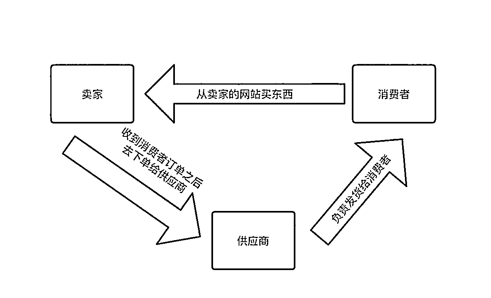
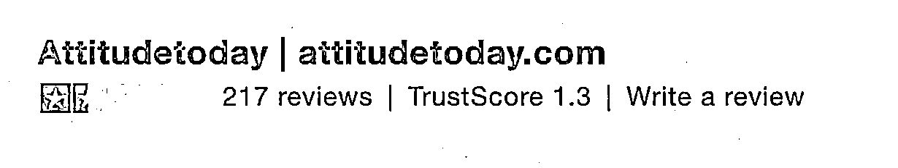
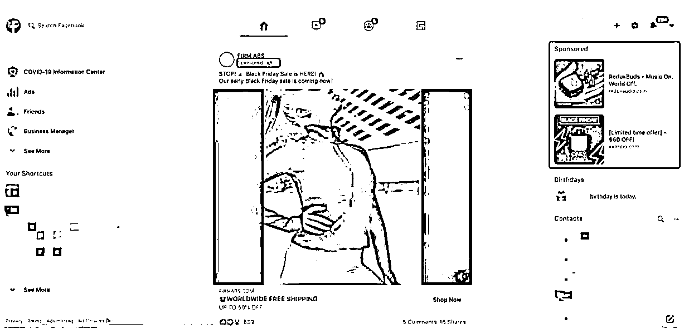
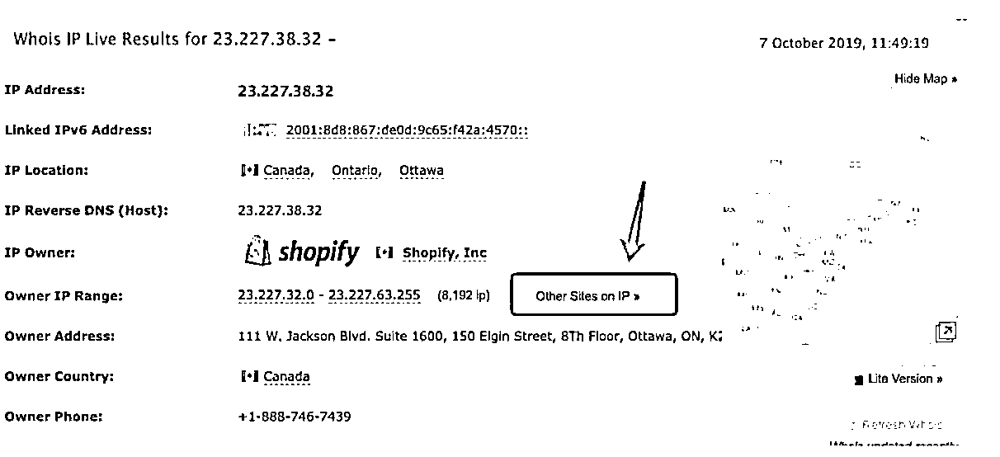
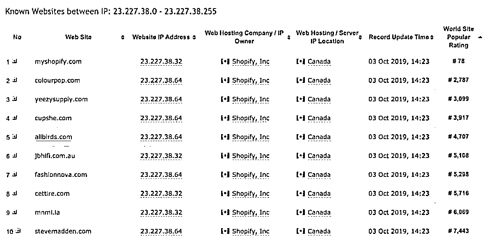
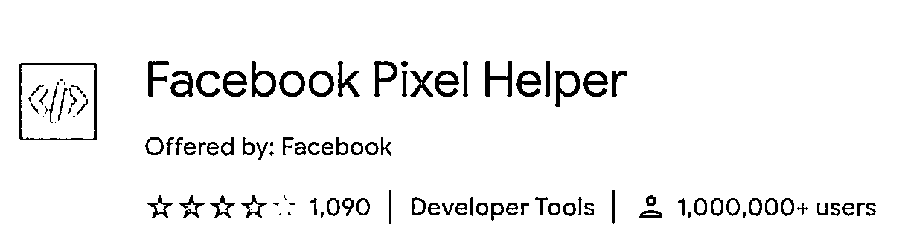
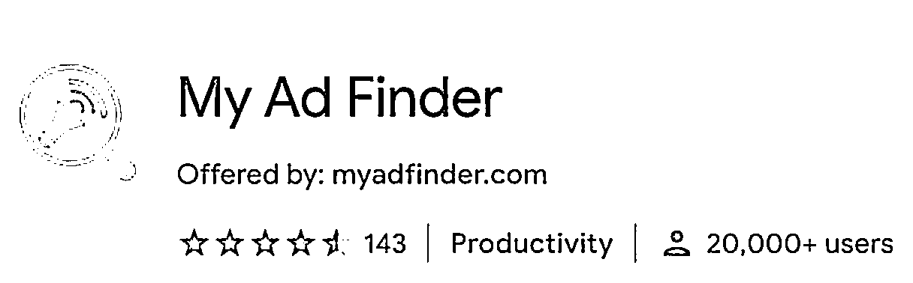
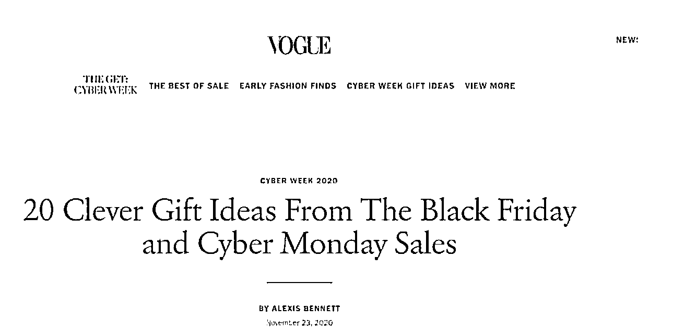
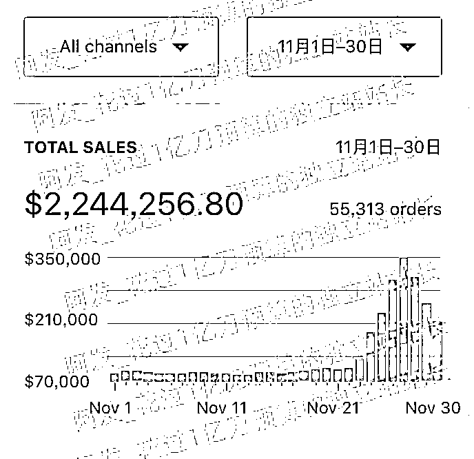

# (精华帖)(411赞)失去 5 个月销 700 万级的大站后，我如何用 120 天的时间再造一个月销 1500 万级的新站

 

 

作者： 1亿美金站长阿发

日期：2021-05-11

今天就要从第一期的龙珠俱乐部毕业了，这段时间学习和成长了太多，非常感谢生财有术和龙珠俱乐部，写下这篇就当是我的毕业小论文。

先给大家简单介绍下自己，我是阿发，花过1亿刀预算的独立站站长，曾经担任过中国出海50强品牌的独立站负责人以及跨境电商独角兽Fordeal的渠道投放负责人，操盘过多个爆品站，精品站和品牌站，目前已经从公司离职，开始自主创业了。这篇和大家分享下我是怎么在失去5个月销700万级的大站后，用120天的时间再造一个月销1500万级的新站的。

爆品站疯狂起量

2016 - 2018年，独立站Dropshipping（海外版一件代发）的模式刚刚开始爆红，这个时候跑的最多的是爆品站，爆品站就是市面上什么红卖什么，什么可能火就卖什么，基本没有什么垂直细分。这边我先解释下，啥是Dropshipping（海外版一件代发）以及为什么在那个时候这个模式会突然爆发。

Dropshipping呢，简单来说就是卖家自己本身并没有这个产品并没有库存，只是在自己的网站上给这个产品做营销，消费者从卖家这里买了产品之后，卖家会让供应商直接发货给用户。如下图

 

 

这个商业模式的好处是：(1) 没有库存，基本不存在压货，不用付商品的仓库存储的费用，不用处理商品的物流运输 (2) 初始起步，资金压力较小，不用提前备货，可以等确实能起量的时候再大量买货 (3) 不用担心物流发货，可以把所有的精力和资源投入到站点建设，营销，或者客服等方面。新手入门用的最多的供应商其实是速卖通，因为发货足够便捷。那么可能有朋友会问，既然你是从速卖通进货，那用户为啥不能直接从速卖通买呢？

原因很简单，因为卖货这个东西从来不是货在谁手里，谁就能赚钱，很多时候也不是谁便宜谁就能赚钱，而是看谁先接触到用户，先把用户说服，谁就能挣钱。

如果货在谁手里，谁就挣钱这个逻辑成立的话，那中国最大的toC电商网站之一应该是1688.com，不对，按这个逻辑下去可能都不应该是1688.com，全国人民直接从各个工厂直接买货岂不是更便宜？  接触用户，说服用户都是需要花费精力和成本的，不是随随便便就能做成的。

 

 

那又为什么这个模式在那个时间段爆发呢？因为有三个很重要的问题被解决了  （1）货：阿里巴巴的速卖通Aliexpress在那个时间已经相对成熟了，上面找货，发货什么的很方便。

（2）建站：以前建一个能卖货的独立网站对大部分人来说还是有点难度的，毕竟之前的建站工具都不是那么傻瓜好用，直到Shopify出现并把建站这件事情的门槛降低到几乎没有，现在任何一个有网，有电脑的人，要建一个能卖货的站可能只需要1，2个小时（当然你要精心装修的话肯定还是要时间的）。但建一个能卖东西的站，已经几乎是没有门槛的了，即便你不懂任何技术。

（3）流量：Facebook在那段时间在加速自己商业化的进程，卖大量的广告，且那个时候Facebook的广告还不是那么贵，监管相对宽松，但流量的质量很好，转化很OK。所以那个时代最流行的独立站跑法也有人叫 Facebook + Shopify跑法，就是用Shopify建站，然后打Facebook广告引流卖货。

我当时靠做爆品站获得了大量的销量以及利润，最多的时候同时有5个爆品站（其中一个是女装爆品站，其他的都是常规爆品站），每个站每月都能有700万人民币左右的营收。下图是当时几个跑起来的爆品站之一，在起量之后，很长一段时间都有平均每月100多万美金的营收，很可惜后来因为客服，售后，供应链等问题，没能持续做下去，域名也已经被废弃了，现在再输入这个域名会去到别的乱七八糟的网站，大家不要尝试去输入了。但在trustpilot上还能搜到这个网站，有217条评论，做过的人都知道trustpilot上能到217条评论代表着这个站曾经有过很大的流量。

这里跟大家分享一个爆品站找品的小技巧，就是利用社交媒体，以及专门的礼品网站去开发爆品。

 

 

社交媒体的话，推荐一个不太常规的，但是很好用的，https://www.reddit.com/  可以认为是英语世界版的百度贴吧，但是这个贴吧的活跃用户极其多，流量非常巨大，上面很多版块的热度都是很高的，而且很多潮流其实都是先从Reddit开始然后才到Facebook这样的媒体爆起来的，所以直接关注Reddit就相当于直接关注了英语世界潮流的源头。那有朋友可能会问，那么多版块，我要关注哪一个呢？  我觉得

https://www.reddit.com/r/shutupandtakemymoney/  ；

https://www.reddit.com/r/BuyItForLife/；

https://www.reddit.com/r/FindItOnAmazon/  这三个都是直接和人们的购买欲望相关的，大家可以多上去看。

另一块，礼品网站。为啥会推荐礼品网站呢？因为这些网站为了能更好的生存下来，他们一定会去搜罗最新奇特，最有意思的，最流行或者可能流行的产品来卖。我们直接跟在他们后面看他们的研究成果岂不美哉。这边推荐两个

http://www.dudeiwantthat.com/；https://odditymall.com/  都是做的很好的礼品网站，没事可以多去看看的，他们有的时候卖的一些东西我自己都会忍不住想买。

爆品站好的时候，当然赚钱很爽，但任何生意都不可能永远一帆风顺的，爆品站这盘生意也是如此。

变局突起

爆品站的业务跑了快一年，随后碰到了一些问题。首先是女装的站，虽然销售额上升了很多，但是慢慢的公司在服装供应链和设计上的短板开始显现出来，女装业务后面很难获得增长。其次是常规爆品站也受到越来越多的限制，不管是广告平台还是支付平台对售后服务这块的要求越来越高，越来越严，而常规爆品站由于本身特质的原因，很难把物流，供应链，客服做的很完美，即便我们已经很努力去做，最终的结果和平台要求的还是存在差距，此时平台就会对我们的站做出一些限制，导致整体赚起钱来也没有那么舒服了，且爆品站很难有什么积累，对团队长期的建设和积累不是那么有利。

 

 

看着高昂的各种成本以及衍生出来的各种问题，老板决定让团队先暂停，让我们自己去重新思考要做什么业务，我们可以获得新的内部创业的机会，公司会拿资源支持，对这个业务只有一个要求，能赚钱，且有潜力长期去做。

其实我自己也一直想做更加长期的事情，做爆品站做到最后挺空虚的，除了赚钱，其他的也留不下啥。于是我连夜做了20页的ppt好好阐述我想做的事情。这个事情其实说起来没有那么复杂，就是(1) 选定海外一个垂直细分领域  ，并选好品（2）通过Dropshipping（海外版一件代发）的方式先开始卖起来，然后销量稳定之后可以开始自己囤货整仓库，并做贴牌，再往后可以深入供应链端，最后可以真正得把这个站做成一个品牌。

我和老板诚恳的聊了2个小时，说清楚了未来的规划，以及实施的步骤，老板觉得我的想法OK，给我重新安排了几个人加入我的团队，让我先去干起来。

令人头痛欲裂的选垂直细分领域** + **选品

团队有了，马上要开始做业务了，第一个令人头大的问题就是，网站选啥垂直细分领域选啥品？这个几乎是做独立站开头最重要的一件事，如果没有做好，一个站基本就废了，如果做好了这个开头，后面很多都是顺理成章的事情。

我们测试了很多方法，看电商平台的数据(比如ebay和亚马逊)，看各种其他站点的数据，这样能选出一些，但是选出来的最后测试下来效果都一般。正当我们快要绝望的时候，我们想，既然我们前期主要是要通过付费推广的方式去做，那直接看别人的广告不是来的更快么？

说干就干，我们第一个想到的当然是找直接的能监测广告的平台，最后找到

https://adspy.com/，这个我们发现是最好的，最及时的Facebook广告的收集和监测网站，去看最近到底什么样的东西和品类比较好卖收集下来作为备选。

 

 

然后我们又发现一个问题，光靠这个广告监测网站还是不够有效，虽然量很大，能作为一定的参考，但是监测的网站的抓取很多时候还是不够及时，参考意义有限。那怎么样才能拿到最新最热的Facebook的广告呢？我把目光放到了我自己平时上Facebook的时候会出现的信息流广告上。

Facebook的广告推送形式有点类似朋友圈广告，就是你正常刷的话会刷到很多你加的好友的动态，你关注的明星的动态，或者你关注的某些主页的动态，但是在这些动态里面会夹杂这一些广告，比如我下图列出来的这个红框的地方标识着“Sponsored”说明这是一条广告。

我们日常在刷Facebook的时候偶尔会刷出来这种广告，很多人可能就没在意，看一下就算了。但是我发现有时这种信息流里刷出来的广告，很多都是广告监测工具里没有的，很多是一些比较新秀的站点投放的。

我就想怎么能让Facebook给我推更多的，且质量更好的广告呢？我去了解了一下Facebook给用户推送广告的机制。他们的系统里会给每一个人打标签，比如你这个人买过很贵的奢侈品，那系统后面就会给你推更多的奢侈品的广告，你买过很多奢侈品，那系统就会标记你为“常购买奢侈品的高价值人群”，之后如果有新的奢侈品站投放广告的话，系统很容易就会把广告推给你，因为系统觉得你很有可能购买。

 

 

当然Facebook的系统能收集到这个信息，有两个前提，[1] 你的Facebook个人号在浏览器里是开着的，或者你就是直接从你自己的Facebook信息流里去的这个网站购买那就更好。[2] 这个网站本身有安装Facebook的广告追踪代码。这两个前提条件缺一不可。所以想让Facebook的系统给我们推更多质量更好的广告的方法就是我们去我们感兴趣的这些站点去直接购买，买过的越多，我们在系统里的价值就越高，系统就会给我们推越好的广告。

然后就是开始实操环节，我先拿自己的号做实验，首先我在做这个事情的时候都会在浏览器开着自己的Facebook个人号。然后我当然不可能去全部真金白银花钱去买这么多货，我怎么办呢？用Paypal （相当于国外支付宝）去这些站购买产品，然后在产品发货之前要求退款。

为啥特别强调用Paypal呢？因为[1] 国内的visa和master信用卡，有时也能正常购买，但有时不能，效果不稳定。[2] Paypal对买家的保护比较好，基本用Paypal的卖家都会非常害怕买家通过Paypal投诉，因为Paypal接受的投诉多了轻则冻结资金，重则暂停账号，所以基本没有卖家会没事干找Paypal的麻烦。

况且你在商家发货之前(可以尽量早点，退货理由就说是自己买错了，卖家也不容易，也别太为难别人)，就和卖家说，卖家基本都会很痛快得给你退掉。商家不理你的话，很简单，直接去Paypal投诉。个人Paypal申请很简单，我就不说了。

然后就是我怎么找到那些初始的可以去关注的网站去做这个购买动作呢？

https://myip.ms/  登录这个网站，然后输入以下四个ip中的一个<23.227.38.32> <23.227.38.64> <23.227.38.71> <23.227.38.68>然后如下图，点击Other sites on IP,

 

 

你就能找到大量的利用Shopify这个建站工具建的独立站店铺，而且基本是按流量大小顺序给你排好的，直接去看即可（推荐安装一下similar web这个谷歌浏览器插件，可以看到网站的具体流量，也可以安装一个commerce inspector插件，可以看到这个站的热销品）

这个方法的原理是，Shopify是用的加拿大服务器，所以基本所有用Shopify的店家都会在几个固定的ip上。

补充下，需要确定对方的网站上有没有Facebook的广告追踪代码，可以安装谷歌浏览器的插件Facebook Pixel Helper查看。

 

 

OK，现在网站也有了，刷购买的方法也有了，我就开始猛刷，当然保险起见，建议和小伙伴们多整几个Paypal号分开刷，否则你老做购买退款的动作，Paypal也可能反过来查你。

当刷了足够量之后，我发现我和我的小伙伴的Facebook信息流里开始出现了大量的优质的，且新的广告，然后大家把这些广告收集下来，放一块儿分析和测试。这里再顺便推荐一个谷歌浏览器的小插件 My Ad Finder就是能让你的Facebook信息流只展示广告，不展示普通的帖子内容，用来刷广告非常合适。

经过一小段时间的测试，我们找到了可以继续专注的垂直细分领域以及这个细分领域里可以跑的品，第一个难题解决了。

用户来了，不买怎么办？

垂直细分领域确定了，站建好了，品上传好了，第二个问题接踵而来，用户进来了，但转化率很低，只有1%左右。我们花钱买了很多流量，到了网站里转化的却很少，导致整体没法赚钱。

 

 

我们把自己的落地页去大量对比那些卖的好的站的落地页，发现我们差的最远的地方，不在图片，不在用户评论而在产品描述。这是一款功能性的产品，如果你描述完用户没有感觉的话，那转化率自然就会很低。

我们一开始的页面描述是直接用供应商的信息，里面很多都是参数性的东西，比如产品长宽高多少多少，镜头多少多少像素，续航时间多长多长等，而且充满了大量的平铺直叙。

这就像什么呢？像一个自己为是的推销员，在推销自己的产品，上来就说我们产品如何如何如何，完全没考虑消费者的感受和接受程度。我们发现我们那些做的好的竞争对手都是用下面这个公式来写产品描述的：

首先把一个产品的描述分为三个部分：[1] 提出问题，以及强调问题的严重性 [2] 抛出解决方案，以及论证解决方案的合理性和优越性 [3]交易刺激+行动号召

{1} 提出问题，以及强调问题的严重性

比如：  您是否受到脱发困扰，脱发不仅对形象有不良影响，干扰找对象，更会影响XXX方面的健康【只是举个例子，不要问我为什么一上来就说脱发，我眼里的泪看到了么？】

一般这个问题都是你这个产品的目标受众有感知的问题，这里的问题不一定非要是帮他解决一个大困难(比如脱发这种)，也可以是帮他解决一个小问题，比如：是否每天花太多时间切菜？这个工具能让你2分钟之内切完所有菜。

我们一开始的落地页没有说问题，而是一上来就开始做产品介绍，和那种现实里对你不管不顾，就开始直接介绍自己产品的推销员一样讨厌。

 

 

{2} 抛出解决方案，以及论证解决方案的合理性和优越性

这里其实就是开始介绍你自己的产品了，这边有2个点是需要注意的

(1) 多讲这个产品能给用户带来的好处而不是这个产品本身的功能。很多人介绍产品，就是把产品的技术参数，也就是功能全部解释一通，我们一开始的落地页里也是这样，大段大段得讲这个产品的功能如何如何，材质如何如何。

这种效果比较一般，因为实话实说用户不会关心你的产品用了什么好的材料，用了什么好的工艺，他们关心的是，你产品的这些特性，能给他们带来什么好处。而且在你展现这些好处的时候，最好用比较生动的方式去展现，而不只是呆呆傻傻得说一下好处。

我们举个例子，比如你说我这个生发剂的用了XXX名贵的中药成分，用户的反应是"哦，那又怎么样？"。你再往下挖，说我这个生发剂的用了XXX名贵的中药成分之后，生发会比较快（这个是好处但是不够强力，用户大概率也是比较懵的，因为他们也不知道这个快到什么程度啊，没有感觉）。

你再换个说法，我们我这个生发剂的用了XXX名贵的中药成分之后，2个月内就能助你生发多少多少，而一般的生发剂需要半年才能达到同样的效果。这样一说，用户就明白这个的好处在哪里了。

(2) 多用对比图，动图或视频去展现产品的特性

这个就不多说了，一个产品的效果，很多时候用动图或者视频展现会比单纯的文字说明和静态图更有说服力。比如一个生发剂，那你放一个动图，展示很多人用这款生发剂之前和之后的前后对比图，这种肯定更能说服人。

之前我们的落地页在展现产品的有些特性时用的还是静图，冲击力明显没有动图来的大。但是大家也要注意不要整虚假信息，比如明明效果只能达到60%，你非要吹能到90%，那这种虚假的信息可能也会招致Facebook，收款渠道或其他方面的严打。

 

 

具体案例可以看  https://blendjet.com/  一个年营收千万美金级的专卖搅拌机的垂直电商站的产品页设计。

{3} 交易刺激+行动号召

(1) 交易刺激

这个比较好理解，就是在你介绍完上述这些卖点之后，你需要再给去刺激一下用户，让他们下单。这个方法比较多，我列举2个常用的：

**1. **赠品：今天下单就送**xxxx**，前**100**位送**xxxx**，买生发剂送发套，帮你短期和长期的问题都解决。

**2. **限量稀缺**/**紧急：全球限量**100**个，卖完就没了。倒计时**2**小时，时间到就结束。

(2) 行动号召

这个就是页面最后的行动号召了，你刺激完他们要让他们去做你想让他们做的动作，这个行动号召一般都是放在页面按钮上的。常用的有：  加入购物车, 立刻购买  等。这边注意可以用一些插件把这个行动号召的按钮始终固定显示在页面的下方，这样让用户能够更快得按到。

同时我们当然也对图片，网页速度，用户评论等方面进行了优化，转化率也从1%左右，提升到了3.5%，这下可把我们团队的小伙伴高兴坏了，已经纷纷开始畅想日出千单的场景了，我们当时连钉钉群的名字都改成了《日出千单小分队》以激励我们自己，然而，事实证明，世界上的事从没有这么简单的....

不做大就要死

产品转化率上去了，也开始挣钱了，但是我们遇到了下一个瓶颈，销售额扩不上去，每天的单量就在几十个，如果强行多投广告的话，整个站立马就从挣钱的变成不挣钱的了。

 

 

这可把我愁坏了，和老板聊了一下，老板的意思是，就这么点量，搞这么多人没意义，不如去搞其他的项目。当时我的心里就先凉了半截，心想着好不容易有这么一个方向，这么些品，把落地页也优化好了，不能死在扩充销量上。

最后我把Facebook广告系统里所有能调整的地方都列了不同的可以针对这个地方进行的扩充销量的猜想和测试，终于在测了1个月之后，在这件事上有了突破，这个突破点我自己其实都有点惊讶，但是后来想想有很合理。这个突破点就是人为手动竞价。

下面先简单说下Facebook里竞价的一些基础知识。Facebook广告的售卖模式就是竞价，系统自动竞价就是你控制预算，然后让Facebook帮你定你购买广告的出价，这种模式下你的预算几乎每天都可以完全花完。

人为手动竞价的话，你可以控制预算以及出价，你的出价会对你实际的花费有影响，且用人为手动竞价的话可能不一定每次都能把预算全部花完。

手动竞价为的是找到平衡，什么平衡呢？就是帮你花足够的钱，且花了这些钱之后你整体的广告投放还是能挣钱有利润的。这个平衡点是动态变化的，所以你要经常监控你的手动竞价的广告的花费情况，需要常去调整你的广告出价。

我们之前一直使用系统自动竞价，虽然跑的还行，但是不太好往上冲销量，一往上冲广告成本就容易控制不住。我们后面开始尝试人为手动竞价，我们一般会先选出一个表现比较好的广告，这个好的标准是[广告每天花20刀，且单个广告已经超过3天都有利润了]，那么这个时候我们会可以尝试整一个人为手动出价的测试。

测试的流程是：

 

 

（1）看下这个广告之前平均每转化一个订单的成本是多少  （2）复制6个广告，每个广告的预算设置为30刀  （3）每个广告设置最高出价， 1 乘以  每转化一个订单的成本, 1.5 乘以  每转化一个订单的成本, 2 乘以  每转化一个订单的成本, 2.5 乘以  每转化一个订单的成本, 3 乘以  每转化一个订单的成本, 3.5乘以  每转化一个订单的成本。

在跑了差不多18个小时后，按照单个广告每转化一个订单的成本和每产生一个添加购物车的成本去做关闭。如果这个广告的每转化一个订单的成本超过原始目标值，干掉。如果每产生一个添加购物车的成本和每转化一个订单的成本同时超过原始目标值，干掉。

如果每产生一个添加购物车的成本超过原始目标值，但是每转化一个订单的成本低于原始目标值，那就留着再观察1天，如果每产生一个添加购物车的成本低于原始目标值，但是每转化一个订单的成本高于原始目标值，那也可以再留着观察1天。

如果发现所有的广告的每转化一个订单的成本都高于原始目标值，那就先别扩量了。如果只有1个广告的每转化一个订单的成本达标，那么这个广告就赢了。如果多个广告的每转化一个订单的成本达标，那么出最多单的那个赢。如果有多个广告的每转化一个订单的成本达标，且大家出的单都一样多，那么每产生一个添加购物车的成本最低的那个赢。

然后我们会选出那个胜出的广告，复制，并把每日预算调整为$500，设置为账号时间的0点开始跑。第二天早上再检查一下广告的情况，如果每转化一个订单的成本高于预期目标，可以尝试降低出价(降1-3刀)，如果每转化一个订单的成本低于预期目标，且花钱比较少，可以尝试提升出价(提1-2刀)，如果每转化一个订单的成本低于预期目标，且花钱正常，可以考虑先让它这个跑着。

如果复制出来的表现离盈亏平衡太远，还是需要关掉的，关掉之后我们会尝试在的广告账号平时表现比较好的日子再度测试。如果复制出来的$500每天的广告跑的很好，超过2天盈利。我们会在广告账号平时表现比较好的日子再度复制，这次复制日预算$1000的广告出来，然后继续优化。

 

 

最后终于靠着人为手动竞价，以及其他的各种冲量手段，把单量成功推到了每日1000单左右。我们也成为了真正的日出千单小分队。后面产品也慢慢开始做贴牌，我们的产品也终于不再是普通大路货，而是至少带有我们品牌的产品了。

我们团队出去吃了一波日料刺身，庆祝这个项目终于算是第一阶段熬出头了。有了这个单量做底，可以完全养活现有的团队，还可以计划下一步招募新的成员了。

黑五冲刺

接下来就是跨境电商激动人心的黑五了。对于国外市场来说，黑五就相当于国内的双11，是电商一年最重要的节日。我们也想在黑五的时候猛冲一波，上上量。常规的广告投放这些当然能上一波量，但是这还不够，我们还想要的更多。于是我们搜罗各种渠道，各种方法，最后发现除了投放之外，最好用的居然是Gift Guide。

先解释下Gift Guide，这个就像啥呢，就像一些公众号会出的《双11必买指南》《双11必剁手指南》《XXX的双11好物清单》。国外是有很多的杂志，包括电视台，包括各种媒体会出《黑五礼物指南》类似这种https://www.vogue.com/slideshow/black-friday-gifts  。

 

 

这个的主要难点在于怎么去联系到这些Gift Guide的主编，以及如何说服他们能够进入他们的Gift Guide里。我们在多放研究和对比之后，决定找国外专门的代理机构去帮我们做这件事情，因为我们对国外的媒体环境没有那么熟悉，又是超远程沟通，效率各方面会低很多，所以为了保证事情做成，直接找代理机构是最好的选择。

当然我们也很幸运找到了一家非常靠谱的代理机构，最后成功把我们推到了一个很大的媒体的Gift Guide里，那个媒体发文的那一天，我们的销售额直接是平时的20倍，效果非常显著。

贴一下那个站黑五那个月的战绩截图，224万美金约合1500万人民币销售额。

 

 

总结

我这里面比较关键的几个点

选垂直细分领域 + 选品：利用自己的个人Facebook账号 + Paypal去不同的好的站刷购买记录，让Facebook认为你是超顶级优质用户，你后续可以得到更多的好的产品和广告的推荐。

提高页面转化率，优化产品描述：[1] 提出问题，以及强调问题的严重性 [2] 抛出解决方案，以及论证解决方案的合理性和优越性。里面还有两个小点(1) 多讲这个产品能给用户带来的好处而不是这个产品本身的功能  （2）多用对比图，动图或视频去展现产品的特性 [3] 交易刺激+行动号召

Facebook广告扩量：人为手动竞价是一个非常有效的扩量方式

黑五冲刺：除了常规的广告投放，电子邮件，短信之外，Gift Guide是一种非常好的可以作为补充的冲量方式，尤其是如果你有机会上大媒体的Gift Guide的时候。

最后

最后说下我目前在做的事情和需求的资源。我自己目前是和合伙人一起开了一家做独立站的公司，公司主业依然是做站，所以如果你有很好的产品可以来找我们，看有没有机会合作，我的微信<afaalpha>。

再次感谢生财有术和龙珠俱乐部~~

 

 

评论区：

🌈R : 🐂

Alan : 真大佬

高夫人 : 给大佬打call

半糖梦呓 : 膜拜大佬！

张梦才 : 啊，这，挺空虚的，除了挣钱什么也留不下

这就是大佬嘛[捂脸]

Wila 于华🇫🇷🍷 : 介绍的如此详细，超级感激你无保留的分享！收藏了！[微笑] Sherry💎谢无敌 : 膜拜阿发哥！学习了。

陈歪 : 大佬！
