# 宠物赛道** **合集

宠物经济升级，普通人做宠物赛道都有哪些项目？

整理日期：**230720**

懒人专属群的群友大家好。小懒继续给大家带来一份宠物赛道  合集

本文档为懒人专属群内部分享，懒人手动整理。

生财风向标系列单独用在线文档分享，地址见专属群q群消息。

往期的生财周报合集（含在线版和离线版），见专属群Q群文件和群公告。

希望大家有收获~

标题加了(精华)的表示精华贴，前面为截至今日的点赞数。

以下是目录，内容有些多。大家可以挑兴趣的内容阅读。

懒人专属群更新记录（点此跳转）

 

 

# **# **目录

宠物赛道** **合集

目录

【最新风向标】**6**篇

(95赞)小区居民申请流浪猫猫屋，引发养宠物社群热议

(78赞)宠物类一直是闲鱼上的大热门领域，猫咪、狗狗等都卖得相当不错

(57赞)小红书的人群养宠物，做好的鲜食塑封等需求量很大

(44赞)宠物经济崛起，通过摆摊的方式获取用户

(36赞)宠物市场前景不错，尤其是宠物零食等小而美的类型

(14赞)专门给宠物制作烘焙食品的宠物烘培

【赛道机会】**5**篇

(96赞)2023 消费行业趋势：老龄化、少子化和小户型化成为关键指标(34赞)宠物行业今年同比去年一季度实现 300% 增长，宠物零食是个大机会(18赞)赚钱思路，宠物和老年人一次性用品

(17赞)宠物赛道的几个细分方向

(10赞)宠物初抗老概念

【线上猫舍】**7**篇

(精华帖)(388赞)实操项目复盘，小红书卖猫月入10W+

(精华帖)(336赞)养猫2年赚35万，介绍一个少有人知但性价比超高的副业(178赞)从猫舍思维进化到平台思维，我是如何赚到人生的第一个100万的(精华帖)(136赞)猫舍一窝猫赚30万是什么体验——深度拆解猫繁育行业多种盈利模式

(精华帖)(112赞)全平台做宠物号获取精准粉，宠物交易 1 个月赚到 10 万(84赞)从业 3 年的老“闲鱼”见到的闲鱼赚钱模式

(15赞)闲鱼宠物导购-引流「CPS」

【宠物自媒体】**3**篇

(精华帖)(112赞)职场小白裸辞做小红书宠物博主，一个月收入顶一年工资(8赞)萌宠号起号作弊技巧

(3赞)几万粉丝宠物号，无法变现的真相！

【宠物**AIGC**】**2**篇

(90赞)如何借用 AI 绘画工具批量出图蹭上意间 AI 绘画的热点

(73赞)小红书上宠物粉群体，AI 绘画宠物赛道可以吸引精准的宠物粉

 

 

【宠物电商】**7**篇

(141赞)视频号最新实战经验—如何破零播放、选品新思路、测品技巧、去重技巧以及视频号小游戏

(136赞)抖音差异化直播间，  利用特定场景和特定道具去卖适合产品

(135赞)小红书电商-宠物服装，成本较低，客单价定价可高可低，利润高(119赞)使用 AI 做宠物用品的工业设计，可以提高出图的效率

(79赞)小红书用摄像头直播自己在家的猴子直播，引流卖一些宠物用品

(精华帖)(75赞)小红书产出素材，抖音上投，天猫成交，单品单月销售额破 300W(53赞)我是如何通过4个产品做年销售额500万的？

【宠物淘客】**2**篇

(精华帖)(167赞)从 0 到 20 万私域宠物粉丝：背后的引流、运营和思考(精华帖)(46赞)我是如何通过重组选品团队，拯救断崖式下滑的百万猫车群产出的？

【宠物医疗】**5**篇

(82赞)2023年小微经济八大新亮点

(39赞)新风口：宠物医疗器械

(30赞)场景应用 ChatGPT 赚钱细分玩法：宠物在线问诊+ChatGPT(29赞)ChatGPT的赚钱机会挖掘：从什么角度思考，并且封装成项目(20赞)关注一下宠物医疗险，小红书有不少这样的笔记

【宠物定制化】**6**篇

(精华帖)(129赞)TikTok 也能做私域？分享一下 TikTok 的私域玩法(39赞)抖音用宠物头像做印章的爆款，转化率不错

(21赞)给宠物画像

(19赞)关注生产即营销的赛道——如宠物毛毡

(18赞)宠物头像定制，头像 + 手机壁纸 + 卫衣头像项目

(17赞)给宠物定制日常用品

【宠物友好服务】**5**篇

(74赞)宠物友好项目越来越受欢迎，月子中心可带宠物入住引发热议

(61赞)旅游业慢慢的复苏，出差异化的产品才是王道

(52赞)小红书推携宠出游，流量精准意向高，可以矩阵放大

(39赞)滴滴推出宠物专车,以后随着人口老龄化的加剧宠物市场很有可能迎来爆发期(33赞)忠犬八公上映，小红书发布组团携宠观影笔记引流

【宠物托运服务】**2**篇

(29赞)宠物托运业务

 

 

(25赞)宠物运输服务类空白

【宠物殡葬服务】**6**篇

(精华帖)(211赞)宠物殡葬行业起盘和模式揭秘

(94赞)宠物殡葬服务直播项目加盟

(56赞)视频号做宠物殡葬，高客单价生意

(51赞)抖音手作账号展示的是首饰盒，宠物殡葬也挺有市场的

(44赞)抖音给去世的宠物画画-羊毛毡画

(12赞)小红书宠物殡葬服务

【线下服务】**7**篇

(57赞)宠物做服务的时候，主人可以喝咖啡看书闲坐聊天社交，可以延伸到家长(30赞)线下宠物用品店，通过美团外卖销售

(24赞)宠物用品外卖店，投入成本低，起步也容易

(23赞)帮忙喂猫业务，6 单 5000 元

(22赞)开在大商超里的猫澡堂，第一次见

(17赞)宠物相亲可延申其他项目

(11赞)赚钱小思路：上门喂养

总结

# 【最新风向标】**6**篇

# **# ****(95**赞**)**小区居民申请流浪猫猫屋，引发养宠物

# 社群热议

作者：  韭神

日期：2023-06-29

 

 

小区最近有人申请了这个流浪猫猫屋，最近很多养宠物社群也在聊，这真是有价值的事业！

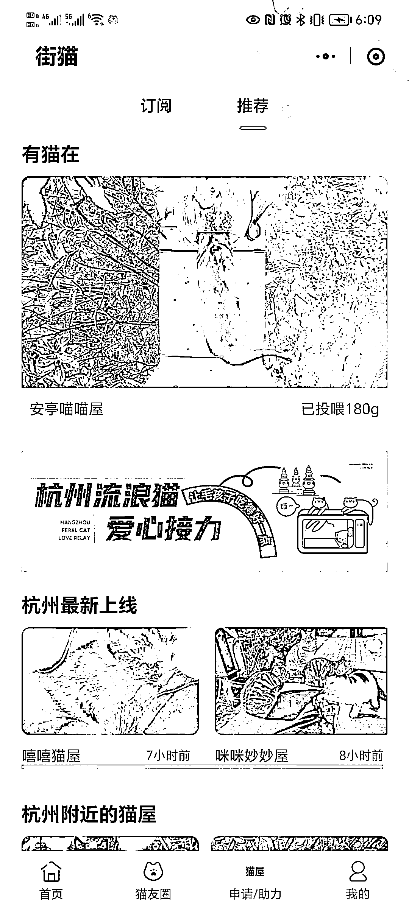

 

 

 

 

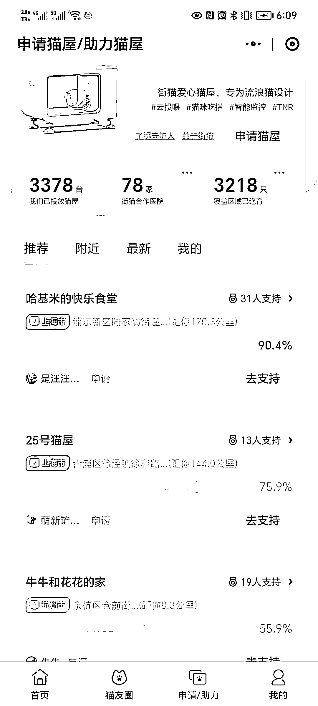

 

 

 

 

 

 

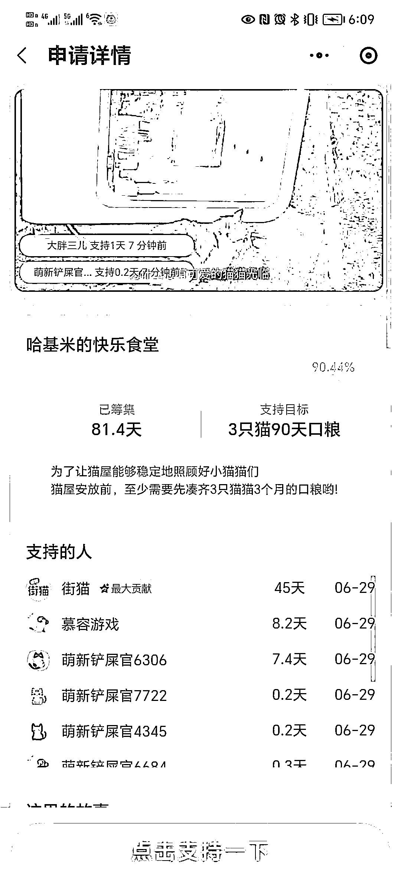

 

 

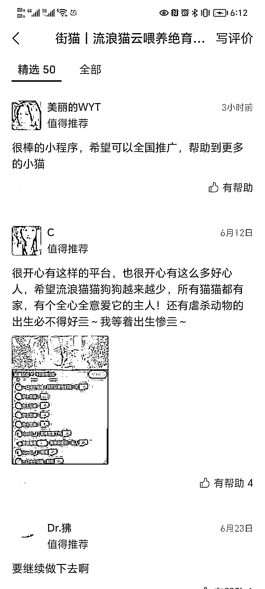

 

 

 

 

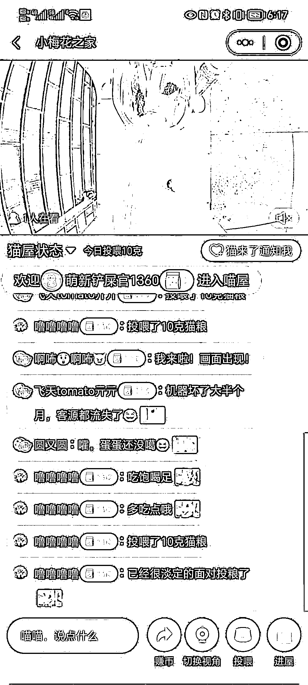

 

 

评论区：

安然小姐 : 太棒啦，每次看见流浪猫都很心酸，也不知道自己能做多少，一般也就给点猫粮。希望更多帮助给到它们

亦仁 : 中标，术值+1。

在上方专栏点击 #中标，可查看所有中标风向标

韭神 : 每人伤害的话，流浪猫也享受着绝对的自由

韭神 : [拥抱]

我的名字叫蓝 : 个人理解：最后的最后不知道会发展成怎么的形态。

目前情况下，我们可以通过提供相关服务去赚钱。

# **# ****(78**赞**)**宠物类一直是闲鱼上的大热门领域，猫

# 咪、狗狗等都卖得相当不错

作者：  浮沉

 

 

日期：2023-05-05

宠物类一直是闲鱼上的大热门领域，猫咪、狗狗、乌龟、兔子、仓鼠等都卖得相当不错的，这个类目可以做长久的生意，属于做得越久越吃香的类型，新手小白都可以操作。

操作方法：一张好看的宠物实拍图片➕不同风格的文案➕低价引导咨询

下面这个账号上仓鼠垂直小类目，卖了将近一万单，闷声发大财~

拓展思路：可以倒流到微信做二次变现，售卖宠物类笼子、主食、零食和周边用品，打持久战，你会发现客户积累越来越多，钱也赚得越来越多。

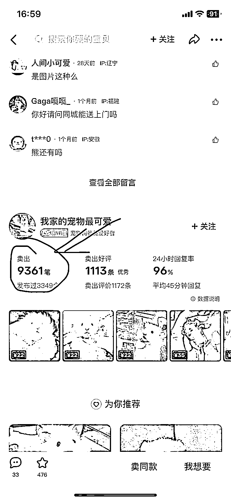

 

 

 

 

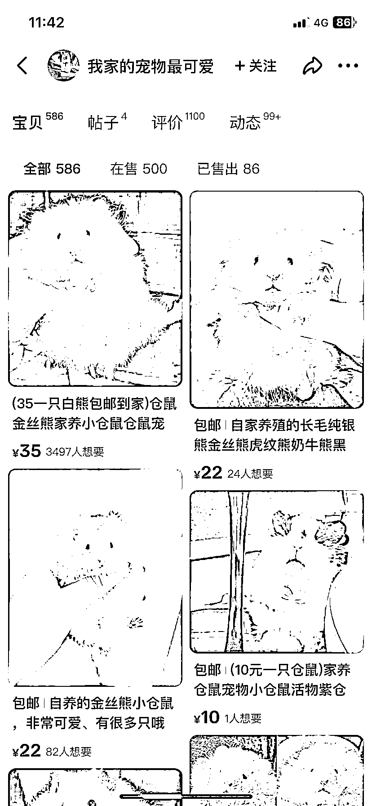

 

 

 

 

 

 

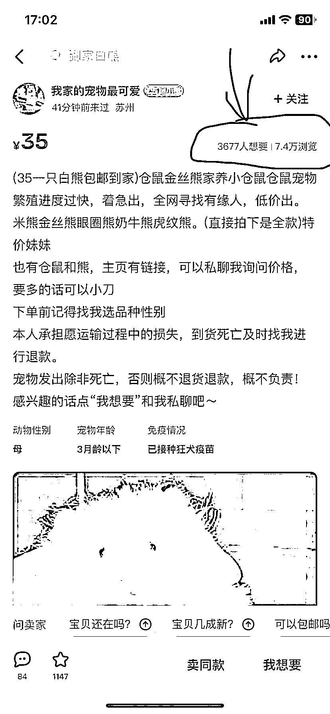

 

 

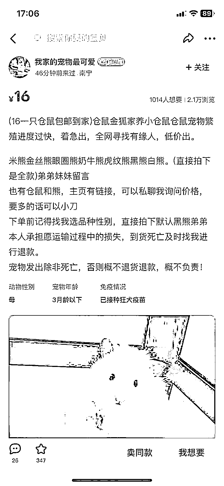

 

 

 

 

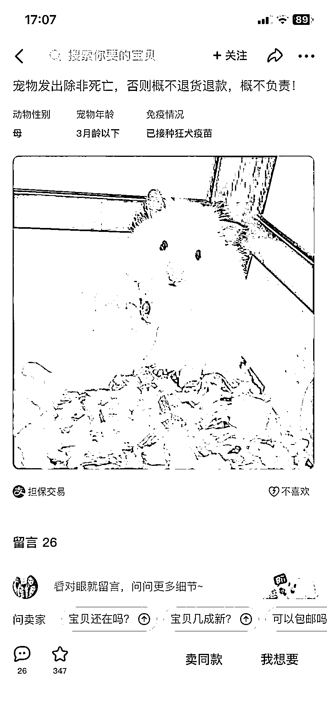

 

 

评论区：

meteora钟先森 : [强]

臣序圆 : 引导咨询，但如何能转化销售呢？

亦仁 : 中标，术值+1。

在上方专栏点击 #中标，可查看所有中标风向标。

浮沉 : 通过图片和话术去转化，如果不懂同行就是最好的老师，用买家的心态去找几个同行聊聊，话术图片都出来了。

Mr.汉松 : 圈友真牛，在这里任何项目都体无完肤😂

Luke王子 : 有没有货源介绍~

一小小撮阳光 : 加一

浮沉 : 后续会持续输出，关注锁定[呲牙]

# **# ****(57**赞**)**小红书的人群养宠物，做好的鲜食塑封

# 等需求量很大

 

 

作者： Jay

日期：2023-03-23

小红书的人群养宠物都很精致，宠物餐包，做好的鲜食塑封，不同搭配，需求量很大，直接引流到微信成交，人群十分精准复购率高，而且有一些想要学习，或者代理合作的  甚至还有问人能不能吃的，这个营养搭配确实适合减脂人群了

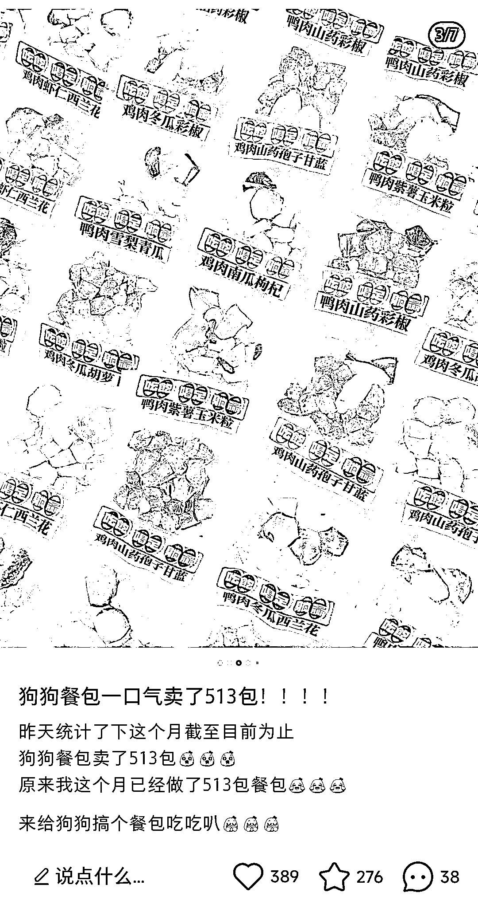

 

 

 

 

 

 

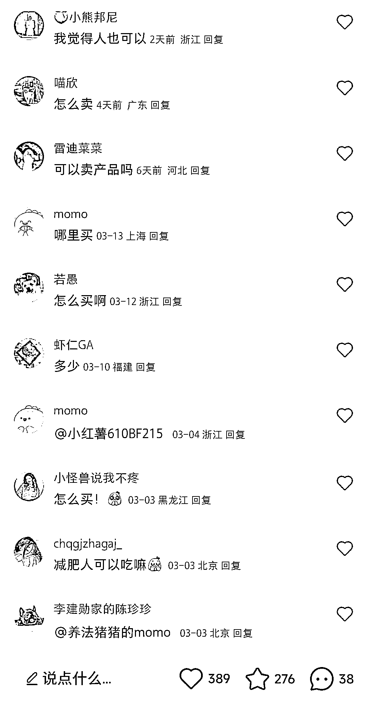

 

 

 

 

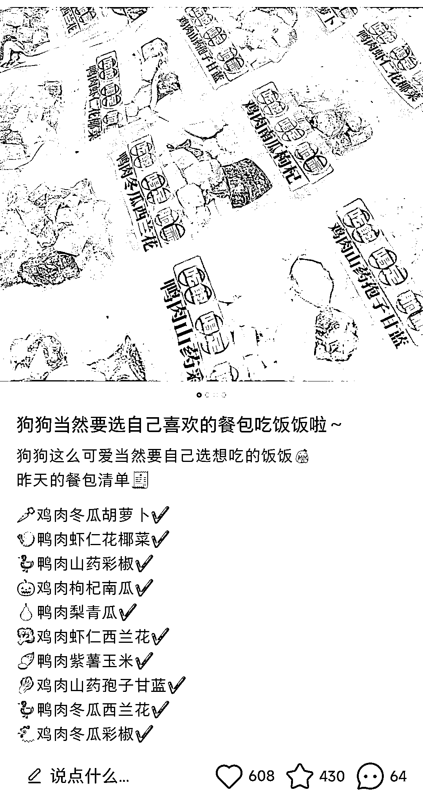

 

 

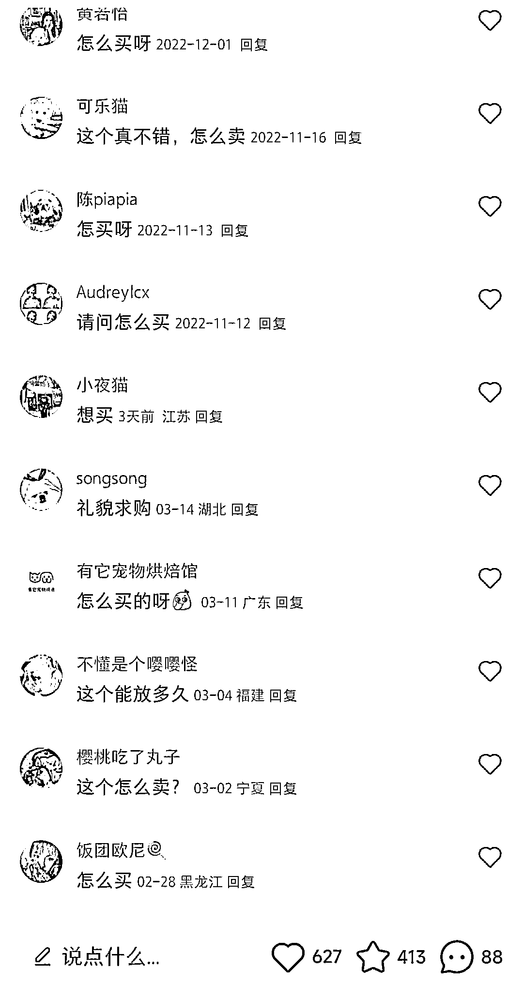

 

 

评论区：

少儿探索科学实验室 : 宠物烘焙，搞起

陈真 : 嗯～上门给猫做饭

二帮主 : 好精致，卖多少钱

明哥 : 这产品怎么找呢

北斗 : 想到了快餐店的速食包

Jay : 确实不错

Jay : 哈哈哈哈

古朴 : 进货有渠道么

# **# ****(44**赞**)**宠物经济崛起，通过摆摊的方式获取用

# 户

作者：  王泇贻

日期：2023-03-16

宠物经济崛起

关于宠物的烘培行业，食品等

一般小区附近都会有一个遛狗聚集地，简单点可以通过摆摊的方式获取用户，聚集后发布相关宠物类活动提升活跃。

再逐步可以通过宠物集市发展合作伙伴。

 

 

评论区：

亦仁 : 中标，术值+1。

在上方 #星球栏目  专栏中，点击 #中标，可查看所有中标风向标。

阿黎 : 宠物的烘培行业，食品，欧美有类似的，很香

# **# ****(36**赞**)**宠物市场前景不错，尤其是宠物零食等

# 小而美的类型

作者：  超级玛丽

日期：2023-04-10

我记得之前星球发过一个国外案例就是一位女士做宠物饼干，并且在自己的网站上卖配方，制作流程等等，非常赚。

刷ins又看到广告推送，某韩的宠物零食制作证书

宠物市场不错啊，尤其是小而美的那种社区类型的

 

 

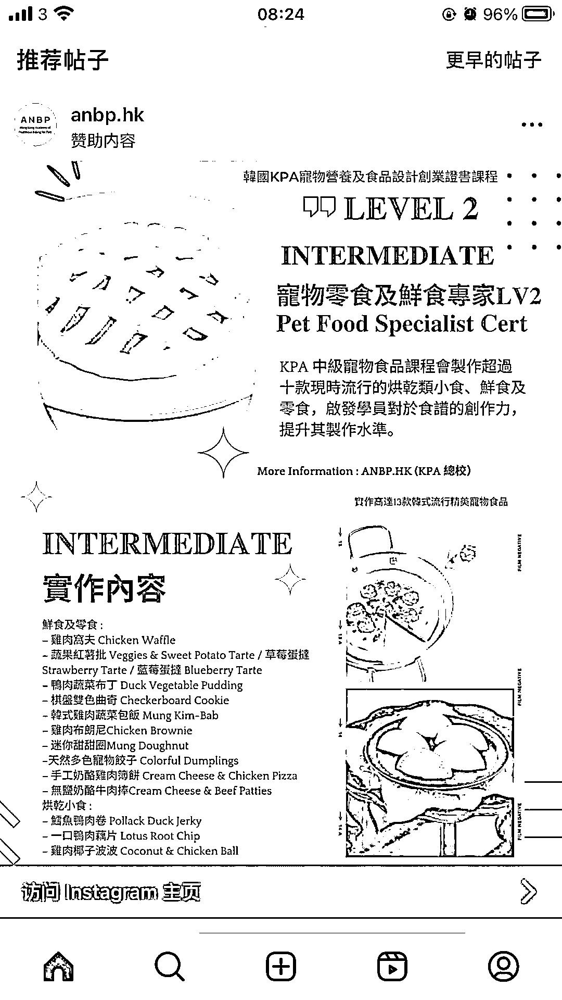

评论区：

君顾 : 在外国的网站上卖中国食谱也可以，食谱就直接上淘宝买翻译成英文就好了[耶] 超级玛丽 : 牛！又学到了！

亦仁 : 中标，术值 +1。

点击最上方 #中标  专栏，可查看所有中标风向标。

# **# ****(14**赞**)**专门给宠物制作烘焙食品的宠物烘培

 

 

作者：  米笠

日期：2022-12-27

专门给宠物制作烘焙食品的宠物烘培，就是用宠物能吃的食材，如：肉类、奶制品、蔬果等，制作宠物蛋糕、宠物粽子、宠物月饼、宠物手工零食等。此外，还可以开班授课，教宠物营养搭配、宠物烘焙食品制作等课程。

宠物烘焙目前是个冷门生意，仅在一、二线城市盛行，利润比普通烘焙店高不少，还可以延伸出一堆后端宠物生意。

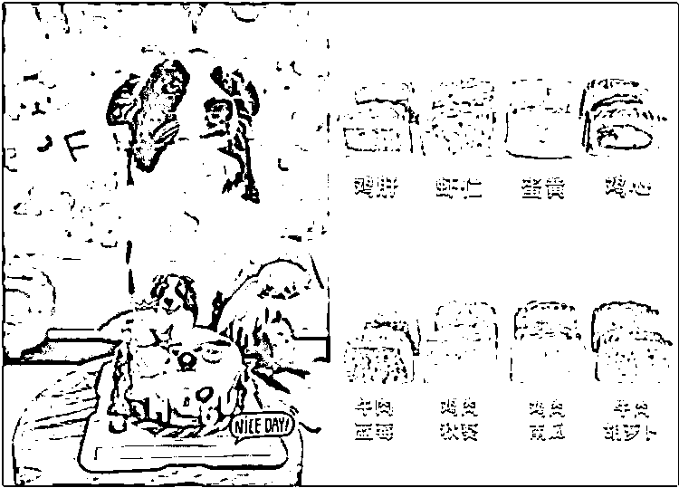

评论区：

灯火阑珊 : 可以延伸到宠物培训班，宠物游乐园，宠物按摩店……只要人有的都可以在宠物上重新做一遍，因为现在有好多人已经把宠物溺爱的超过她自己

亦仁 : 中标，术值+1。

在上方 #星球栏目  专栏中，点击 #中标，可查看所有中标风向标。

 

 

# 【赛道机会】**5**篇

# **# ****(96**赞**)2023 **消费行业趋势：老龄化、少子化

# 和小户型化成为关键指标

作者：  阿Lok beta版

日期：2023-06-21

2023消费行业趋势，大家可以结合自己的业务从这三个指标里思考一下如何顺势而为。

老龄化：银发经济、抗老年轻化

少子化：缺少陪伴，宠物拟人化

小户型化：空间利用率、家居用品小型化

更多详情可看👇这份趋势报告

评论区：

胖大魔 : 妙啊

亦仁 : 中标，术值+1。

在上方专栏点击 #中标，可查看所有中标风向标。

# **# ****(34**赞**)**宠物行业今年同比去年一季度实现** **

# **300% **增长，宠物零食是个大机会

作者：  一只微微笑

日期：2023-03-28

今天和宠物行业从业者的朋友聊，今年同比去年一季度实现300%增长，宠物零食是个大机会

 

 

评论区：

亦仁 : 中标，术值+1。

在上方 #星球栏目  专栏中，点击 #中标，可查看所有中标风向标。

老彭 : 有进货渠道吗

# **# ****(18**赞**)**赚钱思路，宠物和老年人一次性用品

作者：  大钟

日期：2023-02-01

B站：程前的朋友圈 1月15号的视频中提到未来赚钱的方向——一次性用品：

宠物赛道和老年人赛道（成年人纸尿裤）

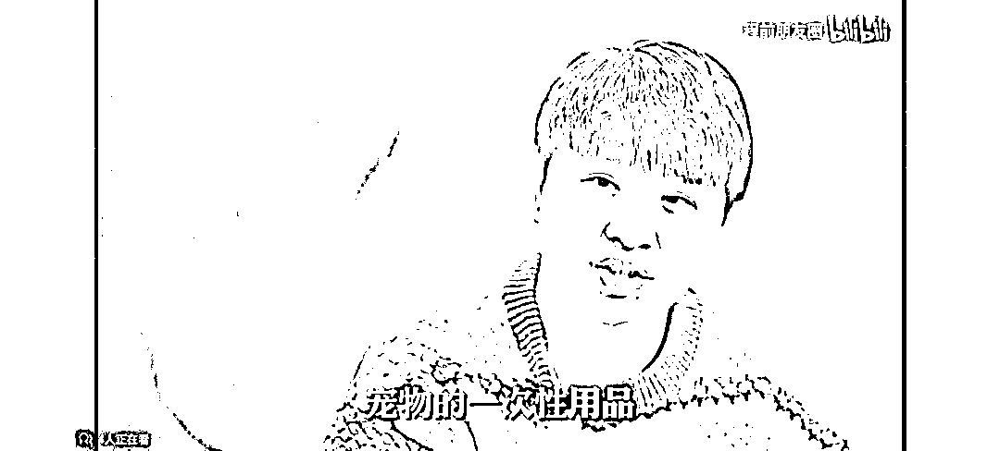

 

 

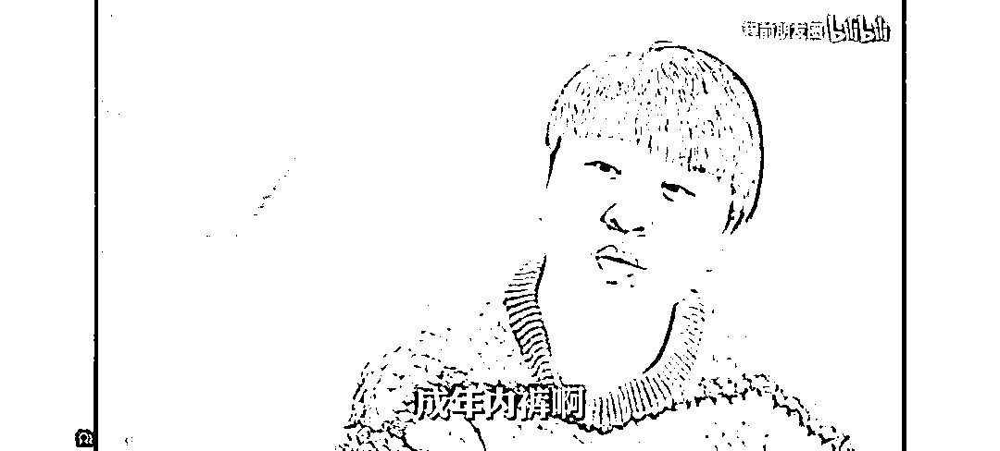

 

 

 

 

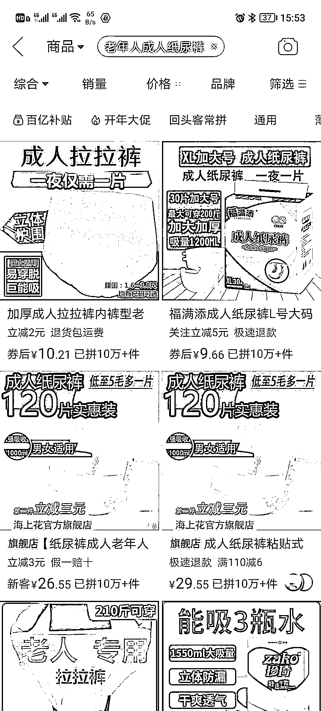

 

 

 

 

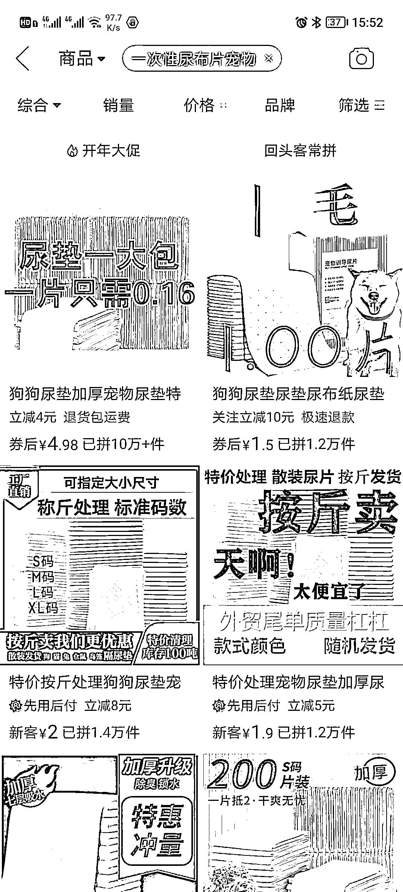

评论区：

亦仁 : 中标，术值+1。

在上方 #星球栏目  专栏中，点击 #中标，可查看所有中标风向标。

# **# ****(17**赞**)**宠物赛道的几个细分方向

作者：  何轩

日期：2023-02-01

接上一条圈友的风向标

宠物赛道还有很多细分值得挖

宠物蛋糕

宠物起名

宠物保险

宠物占星

 

 

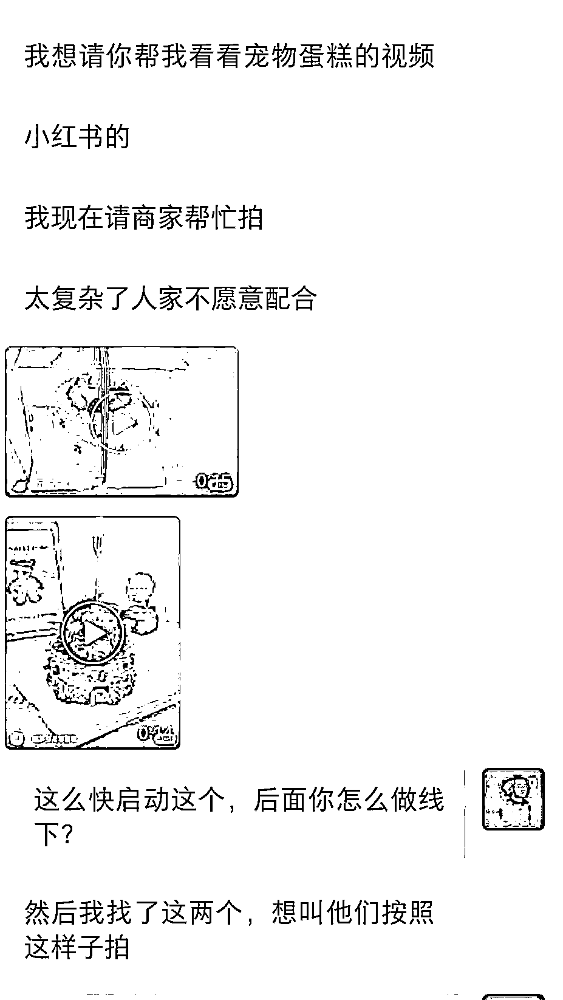

 

 

 

 

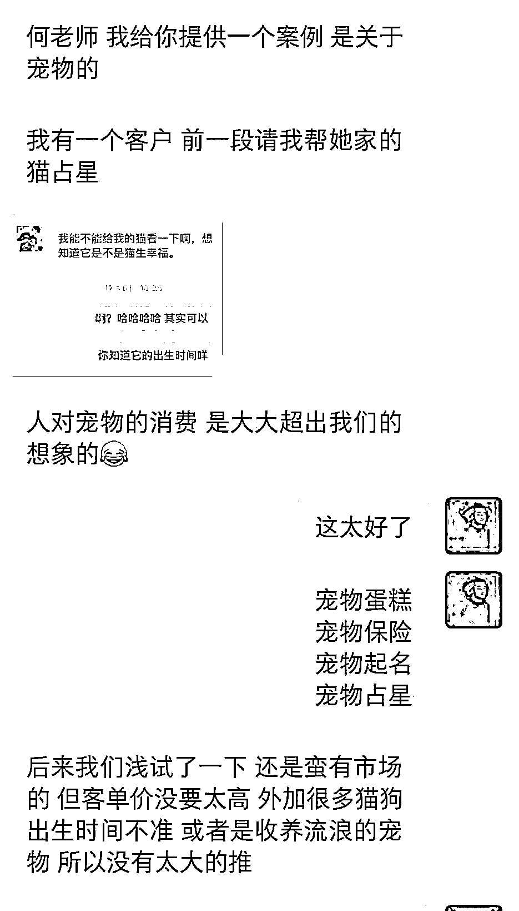

 

 

评论区：

亦仁 : 中标，术值+1。

在上方 #星球栏目  专栏中，点击 #中标，可查看所有中标风向标。

# **# ****(10**赞**)**宠物初抗老概念

作者：  丁Ding

日期：2022-11-03

以前好像只有女人怕老，印象中抗老产品都是卖给有消费能力的熟女居多，所以抗老产品虽然卖的很贵，还是卖的很好。

后来只做熟女生意满足不了各位老板了，提出了轻熟女概念，之后紧接着提出了相应的初抗老概念，再接着就是初抗老的各种产品和服务。

现在宠物要抗老啦，所以也推出了抗老产品，不仅吃的产品里面有抗老，还有各种抗老的营养品，甚至还有体检套餐。

相应的，只做7岁之后宠物的抗老生意也已经满足不了各位老板了，所以宠物也提出了初抗老概念，以及推出了大量与之相对应的初抗老产品和服务。

感觉宠物市场的潜力巨大～

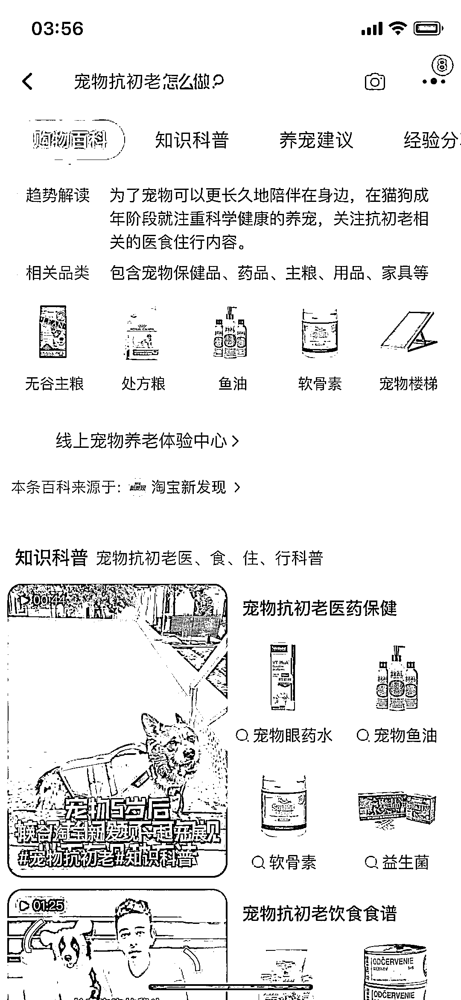

 

 

 

 

评论区：

向前飞奔 : 请问这是那个APP的截图？

丁Ding : 手淘[呲牙]

亦仁 : 中标，术值+1。

在上方 #星球栏目  专栏中，点击 #中标，可查看所有中标风向标。

# 【线上猫舍】**7**篇

# **# ****(**精华帖**)(388**赞**)**实操项目复盘，小红书卖猫

# 月入**10W+**

作者：  盗坤

日期：2023-06-23

继上次发文之后，已经过去四天了，估计有些小伙伴的热乎劲还没过，今天，盗坤的一篇新文又来了。

 

 

前因后果，人物背景这些就不提了，反正和你们也无关。还是一如既往的单刀直入，直奔主题的风格，只聊和你们相关的，直叙项目本身。各位圈友，收拾好心情，静下心来，慢慢看。

这是我投资的团队，我们自己亲自做过，且实现盈利，且已经放弃的项目。如果目标是月利润百万，数百万级别的圈友们直接忽略本文，这也是我否决该项目的原因。但如果是目标单月挣个几万十几万的，可以认真看看本文。

先简单介绍一下项目，产品是活体宠物猫，流量渠道是小红书，销售端在私域，货源是一件代发。如下图所示，就是我们当初经营的账号，虽然两千粉丝不到，单日可以往私域导流100+的超级精准粉。

 

 

 

 

接下来，我先说项目的术，再说背后的道，最后再来复盘总结项目的优劣。

【项目运作之术】

第一步：寻找对标，筛选对标

在小红书平台搜索“缅因猫”这个关键词，找到那些在做付费投放的账号全都记录下来。

如下图所示，右下角有“赞助”二字的都是投了广告的。

 

 

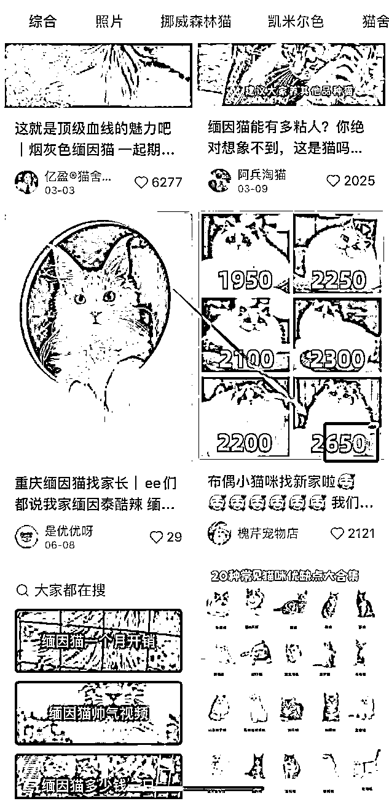

 

 

将对标账号记录下来之后，去进行一个筛选，发现那些点赞高，评论区互动高并且都是想要加微信买猫的账号筛选出来，这一点很重要，要的就是精准流量。

 

 

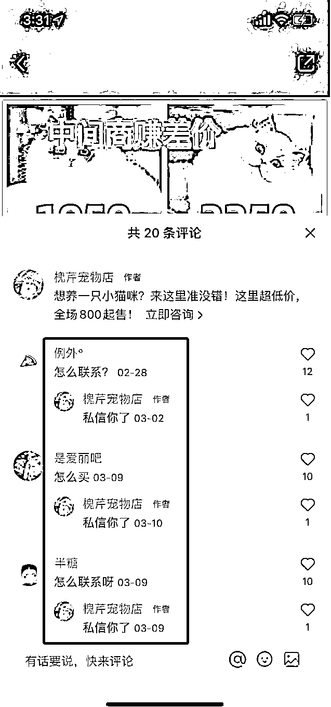

 

 

第二步：拆解对标，模仿对标

筛选出这种对标账号以后，把对标账号从账号昵称，简介背景，置顶笔记，笔记合集，引流路径等等细节进行1:1拆解，然后像素级模仿。

 

 

 

 

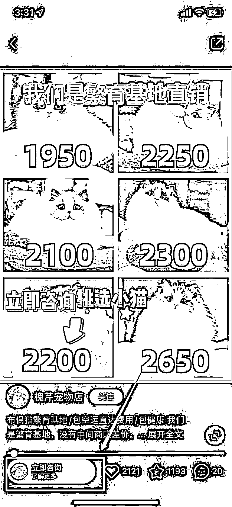

第三步：筛选素材，通投拉满

再设置好昵称，简介，群聊等基础要素以后，然后就是开通投放账户聚光平台（类似字节的巨量引擎，巨量千川，有返点，我们之前返点是15%，最近好像降低了）。接下来就是大量撰写笔记，测试素材。

我们没有对运营人员去培训什么如何起标题，做封面，写笔记等动作。我们就是让运营人员去将优秀的对标笔记的要素1:1模仿，然后拼凑在一起。

在模仿，抄袭这个动作都还没做好的前提下，我们不提倡创新。

 

 

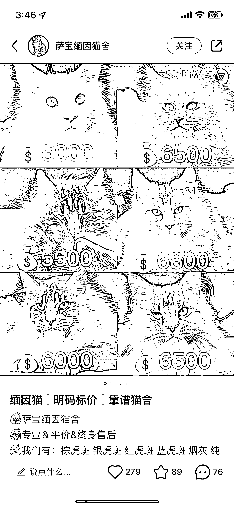

 

 

 

 

 

 

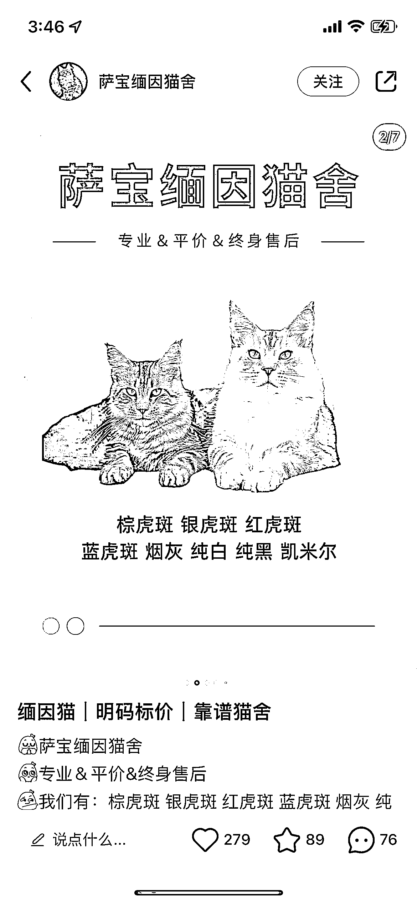

接下来，我们会对每一个笔记花几十块到一百块去测试投放，一旦发现一个转粉率高，引流成本低的笔记，就对那个笔记通投拉满，不设预算。一直到引流成本超过我们设置的成本线之上，才会停止投放。

所以大家可以去看一下我们的账号，笔记都是简单粗暴的营销笔记，那么吸引过来的都是精准的流量。而且，我们的笔记大部分都是几个点赞，而只有少数几个笔记点赞几百的，那都是筛选出来引流成本低的笔记付费投放的。

基本上，只要测试出一个好的投放素材，那个笔记给我们挣几万十几万是一点问题都没有的。

 

 

 

 

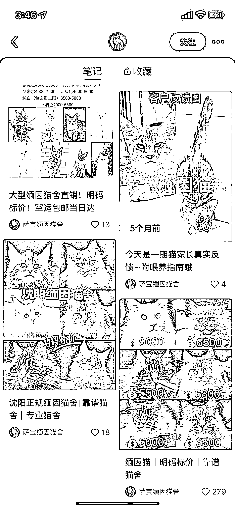

 

 

 

 

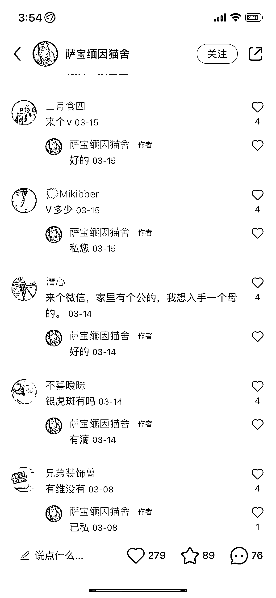

我们仅仅只是做了一个这样的账号，单日微信加粉数量就达到了100+，单个粉丝成本30以内。就这，还是因为我们的销售接待不过来，产品承接不过来，要是不限量，我觉得单日加几百人问题不大。

第四步：导流私域，销售产品

销售和产品都是我们非常薄弱的一个环节。销售的逻辑也很简单，三个关键词，第一是分钱，第二是模仿，第三是筛选。

首先，给销售一个超高的销售提成（营业额的5个点，等同于利润的10%，因为我们每只猫的利润都是50%以上）。其次，整个销售流程就是找到众多同行，把他们好的东西借鉴过来，然后不断模仿完善。最后就是筛选，以结果为导向，筛选销售人员。

在筛选了三四个人以后，我们筛选出来一个比较靠谱的，能做到2-5个点的转化率。

 

 

产品是我们最弱的一个环节，货源全都是一件代发，有在闲鱼上找供货商，也专门飞了一趟沈阳去找供货商。销售朋友圈的素材全都是直接扒的供货商的朋友圈素材，有不懂的问题也去问供货商。

在这样的操作之下，我们第一个星期就卖了四只猫，毛利润两万多，投流成本才三千多。

【背后思考之道】

第一：选择，大于一切

为什么要做付费流量？简单粗暴，最容易复制。

能做免费流量，当然要做免费流量，但是除了IP等极少数的内容形式，想要稳定的获取免费流量太难了。而没有稳定的流量获取，你就没法搭建稳定的销售团队和供应链体系。

但，并不是所有的产品都适用我们这套逻辑。

我们选择的是猫咪，而且是猫咪里的缅因猫，便宜的五六千，七八千，一般来讲都是一万多，一只猫的利润几千起步，所以我们容错率极大。即使运营差点，销售差点，依然给了我们很大时间周期来优化。你要是卖个啥几十块的T恤之类的，那对你的内容，销售，供应链要求都极高极高，哪个环节没做好，都是功亏一篑。

所以，我一直强调，学一切的营销技术之前，先学选品 。

 

 

你和我在那逼逼怎么写标题，做封面，写笔记，不好意思，我们根本不在一个思考的维度。在更高维度的认知面前，运营技术不值一钱。

类似的类目其实还蛮多，赚不了大钱，但是用我们这套逻辑，一个月赚个几万十万还是比较容易的。比如小朋友的夏令营游学，国内国外的都可以，比如本地室内装修设计，本地月子中心业务。都很难做大，但是客单价都比较高，类目相对蓝海，赚点小钱还是有很大机会的。

当然，我们选择做活体宠物猫，也有一些思考上不完善的地方，所以我们后面才会放弃，这个我后面复盘那一节再来详细描述。

第二：踩在巨人的肩膀上前进

最好的学习，不在培训讲堂，在一线战场，最好的老师，不是讲师，是你的对手。

我佩服创新，但是在商业路径上，我们更提倡“先抄后超”。先遵循着前人已经成功的道路，去做好学生，去做好模仿，只要你还不是第一名之前，你就应该先模仿第一名做好。等你要做到第一名了，再去做创新。

这是我现在最大的一个感悟，这么多年来，我们能成功，能赚钱的项目，大都是找到对标去模仿。而那些我天马行空的想法，大概率都没能做起来。

有对标，你至少有个赶超的标准，没做到还可以继续优化，继续努力。没有对标，完全创新，你甚至都不知道自己做的对不对，有没有达到合格的标准。

 

 

第三，用财务逻辑去看待问题

选品思维排在运营思维之上，财务逻辑也大于运营思维之上。

我们的笔记内容，引流路径，销售话术肯定都还有优化的空间。不过这不是我关心的问题，是我们负责人关心的事情，是我们一线运营人员去思考的问题，我看的是数据指标。

 

 

 

 

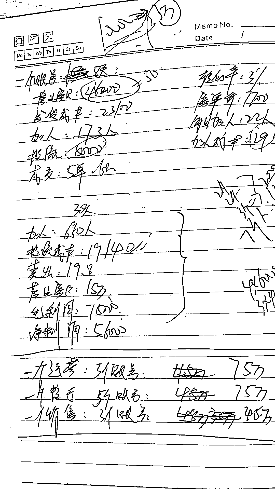

转化率是3%，引流成本29一个人，平均客单价7700元，平均毛利率65%，而这还是在我们运营、销售、供应链优化空间极大的情况下。由此推断得出结论，盈亏平衡线在单个加微成本150元。所以我设定的引流成本线是，单个加微成本在**50**元以内，通投拉满！

第四，筛选逻辑大于培养逻辑

成事在人，人，是做成这个项目的第一要素，也是最稀缺要素。

要聚人，第一是利益价值给够，在此基础上才是情绪价值。所以，我们的逻辑是分好钱，把钱给给够，我们要达到的效果就是让小红书运营和销售的薪资能够达到重庆行业平均的1.5倍以上。这之后，筛选逻辑大于培养逻辑。

我们是用运营淘宝的思维去运营boss直聘的，先把重庆小红书运营招聘岗位都做一个调查，得出一个行业平均薪资水平，然后根据根据这个薪资水平来倒推我们的薪资设计。

如果你把boss直聘上的每一个公司都看成淘宝的一个店铺，把每一个招聘广告都看成淘宝的链接，把每一个求职者都看成淘宝的客户，你就懂我说的意思了。

真的找到那种有自驱力，有学习力，有复盘能力的人，你只要把钱给够了，他会自动点燃自己的光芒。

 

 

你辛辛苦苦去指导标题怎么写，封面怎么设计，你其他事就可以不用做了。

【项目优劣复盘】

就一句话，承接的是刚才“选择，大于一切”这句话。决策能力是人这一辈子最重要的能力，你要读哪个学校，选什么专业，在哪个城市，做什么行业，选什么岗位，找什么样的伴侣...

你人生做这些决策，比你的努力，智商要重要很多倍。

为什么我后面放弃了这个项目呢？

因为，回归到商业的本质，最终比拼的还是产品的品质、价格、服务以及背后的成本、效率。互联网只是披了一个流量渠道创新的外衣，其商业内核没有实质改变。

做活体宠物这个事，说一千道一万，最后的落脚点还是产品本身。产品是整个链路的起点和终点，产品解决不了，整个路径就无法复制放大。

流量都是一时的，流量红利的本质就是信息不对称，当这个信息不对称消失之后，流量成本必然提高。到那一天，要比拼的还是产品本身品质沉淀下来私域复购，以及品牌溢价。我们原本的想法也是通过高单价的活体宠物，在第一个环节就实现盈利，通过活体宠物获得信任之后，继而在私域销售其他周边，把一个流量反复使用多次。

 

 

然而，然而猫咪是一个非标品，每一只猫都是与众不同的，猫咪本身的品相极大影响我们的转化率，猫咪的品质也极大影响我们的售后。

你要找到那种把猫咪拍照拍得很好看的素材都已经很难了。而真正品相好的猫咪，养户根本就不愁卖，圈子里的人都是先自己内部消化了。而能够在市场上流转出来的猫咪，质量参差不齐，我们根本就无法把控质量。我们售出去的猫咪，老是会有一部分品质的问题。

这不是单单依靠我们拓宽供应商数量，养户数量就可以解决的事情。即使增加再多的供应商，我们对这些养户依然没有把控力，口头上的承诺没有意义。这些养户都不大，好的猫咪不愁销路，我们对其的约束就像空中楼阁一样，显得很幼稚。

我做这个项目也不是单单为了一个月挣几万，十几万。如果真正能解决产品问题，需要下重注，花钱去解决，我也是愿意的。就比如说，我们自己做猫舍，自己做繁育。然而这么多养户都做不大是有原因的，猫咪的繁育是一个非常非常精细的活，他需要非常专业的人才，专业的设备，专业的管理才行，一旦一两只猫出现了疾病没有处理好，那可能就是整个猫舍的灾难。

这已经不是我们愿意砸钱就可以解决的事情了，所以这也是为什么大多数的养户都只是维持一个很小的状态。因为如果猫咪数量不大，猫舍主人自己用心呵护好，管理好，是能做照顾好这些猫咪的。一旦量变大了，也会超出他们的管理能力。

我前面有讲到“踩在巨人的肩膀上前进”，这就是生动一课。为什么全中国就没有一家做得很大的活体宠物猫机构？不是因为没有人想到这个生意，是这个生意确实有很大的问题很难去解决。

 

 

当然，基于此，我为什么还要把这个项目分享给大家。因为我虽然没有看到那种年入千万，几千万的案例。但是，一个普通人要想一个月赚几万，十万还是不难的。而如果深耕这个赛道，一年赚个几百万也还是有机会的。

我们的项目已经停止了，那个账号送给了当时项目负责人的老婆。靠着小红书的长尾流量，她上个月都还卖出去六只猫，赚了几万块。

我做这个项目，是需要搭建一个稳定的流量渠道，一个稳定的销售团队，这是有成本的。而如果没有稳定的产品，庞大的团队反而成了我的累赘。

但是她总共就一个人，真要放大也放大不了，每天接待十个人都已经是她的极限了。事实上，她要带小孩，要做家务，每天大概也就接待两三个人，就这她都挣了几万块。而在量不大的情况下，靠我们筛选的那几个供应商，一个月卖个十几只猫，并且要保证品质售后，完全是没问题的。

除此之外，我也知道一些人全身心投入此项目，甚至自己自建猫舍+同行合作，产品品质绝对过关，价格都是一两万，几万的猫咪，一年也可以做到几百万利润。

当然，如果回到几年前，这个盈利也让我非常心动了。可是我是以投资占小比例股份的情况，还需要找到一个对这个行业特别了解，有行业沉淀的优秀团队，还只是有机会做到几百万的利润，这就和我的预期相去甚远了。

以上，就是项目的完整分享。我没有这个项目的培训，所以大家也不用想着要找我啥学习、请教、合作又或者帮忙链接资源啥的。就是很单纯地给大家分享一个我们实际跑通了的项目，以及给一些在做小红书的圈友一些启发。

评论区：

 

 

y青青青青青 : [呲牙]马上来学习

李百万 : 坤哥🐮

六和 : 大佬发文，虽然在路上，但也要马住

李百万 : 核心还是后端[呲牙]

盗坤 : 顺便说一下，小红书对导流私域查得很严，严重直接封号。而开了聚光平台，导流路径很丝滑，并且可以光明正大导流，我们账号没有因为导流私域受过任何处罚，这也是我直接选择做付费的原因。同时，该文章复盘的是卖猫的事情，但整个逻辑同样可以运用到小红书其他产品上。

大飛 : 谢谢大佬分享

艾小飞 : 我很喜欢这句：

最好的学习，不在培训讲堂，在一线战场

最好的老师，不是讲师，是你的对手

谢谢分享[玫瑰]

孙永华 : 坤坤  我想你了

# **# ****(**精华帖**)(336**赞**)**养猫**2**年赚**35**万，介绍一个少

# 有人知但性价比超高的副业

作者： CC

日期：2020-08-07

【生财CP分享】养猫2年赚35万，介绍一个少有人知但性价比超高的副业。

大家好，我是Cecilia。相信生财的伙伴们也有不少养猫的，但是宠物猫繁育这个行业对于大多数人比较陌生。虽然不像做互联网的大佬们随随便便就百万起，但它可以一边躺着一边撸（猫）就把钱钱赚到手。希望今天的分享能够为大家打开一个新的维度吧。

0）课前思考

先请大家思考一个看似不搭边的问题：为什么欧洲人整天懒洋洋的，比如法国，一年到头罢工和休假的时间比工作时间还多，但是大部分欧洲国家人民的日子过得还不错，工作时间那么短居然还有全民高福利？

 

 

反观中日韩，哪怕是美国，普遍都是假期少，工作强度高，大部分人都在忙忙碌碌的讨生活，但大部分人日子过得还不如欧洲人？

原因就在“产业选择上”。欧洲国家的优势产业往往是“高附加值、低发展度”的产业，这两个词怎么解释呢？比如机械制造、精密仪器、奢侈品、畜牧业等等，这些行业百年品牌很多，就是因为这些产业的优势是需要实打实的时间积累的，每一年踩的坑都算数，新兴国家很难只凭资本的投入就弯道超车，这就是“低发展度”。对应的“高附加值”就是长期的优势积累下产生的品牌效应，比如说丹麦的牛奶，瑞士的钟表，意大利的奢侈品。。。。所以欧洲人就可以每天工作5小时还能享受高福利，反正别人想追平咱们没有几代人搞不定，我们领跑的着什么急呢？

所以中日韩，哪怕是美国，相对于欧洲都是后发国家，在欧洲的优势产业上落后几百年根本没法追，所以就只能选择IT、互联网这种大家差不多同一时间起跑的“高附加值、高发展度”的行业，这样还有弯道超车的可能。你看芬兰的诺基亚就是这样被干翻的。然而这样的代价就是产业里的所有人和公司都出于激烈的竞争中，你不996的话就会被新入局者超车。

现在我从西半球把话题扯回来：养猫这个行业，就属于“高附加值、低发展度”的行业，实打实要耗时间，但是产品却可以有高溢价。下面毫无保留地给大家分享我在这个行业的全部收获。

1）从单纯养宠到赚35万建立猫舍

2018年的时候，我买了第一只猫，最开始我只是单纯地想买只猫做宠物，但是在选猫的过程中，发现市场上的宠物猫价格差距极大，有几百块的，有十几万的，同样是猫妈妈生的，为啥价格能相差几百倍呢？

于是我10年战略市场的职业病发作，开始进行行业调研，挖掘市场机会。我看了很多数据，加了很多猫贩，撩了很多猫舍，把宠物猫的市场详细调研了一番，得出了一个结论：这个行业有钱景！于是我的目标从养宠变成了繁育。当时我已经交了2000定了一只幼猫，但是考虑到幼猫还要等至少10个月之后才能够怀孕，我果断舍弃了定金，换了个卖家，又花4000买了一只成年矮脚母猫“尿尿”。

事实证明我用金钱换时间的决策是正确的，我在闲鱼上找了公猫给尿尿借配，2个月后“尿尿”第一窝生了4只成活3只，一只矮脚长毛卖了22000，一只长腿长毛卖了3500，最后一只矮脚短毛母猫自留。这第一笔投资成本4000，收益25500+一只种母，猫粮猫砂成本可以忽略不计，两个月的时间，ROI超过了600%。

 

 

当然，这么高的收益主要是由于我预测准了当时的流行花色“银白”和流行品种“矮脚”，这只猫也是一只”英雄母亲“，1年多产生了超过10万的收入。但这个不代表我繁育的平均水平，我也有买到“废柴公猫（不会配）”和“蛇蝎母猫（吃掉孩子）”的经历。

随着我的繁育知识的精进和花色规律的研究深入，我养猫的收益渐渐变得稳定。大概统计了一下，养猫第一年我只有2只母猫1只公猫，生了大约20只小猫，根据花色和品种，贵的可以卖到2W+，便宜的也可以2000+出手，总体收入大概在12万左右。第二年，我扩大了规模，有5只母猫，2只公猫，其中有自己繁育出来的也有外购的，因为像尿尿这种高产又高质的“英雄母亲”可遇不可求，所以第二年我的收益在20多万左右。

2年35万这个数字比起那些“百万副业”并不吸引人，但是养猫的成本比起收益来说，可算是非常省心省钱了：

吃喝拉撒方面，我家目前9只成年猫（还有十几只奶猫在吃奶可忽略不计）每年预计消耗大约8000RMB的猫粮（我们用的中端粮，如果想省成本可以更低），猫砂每年2500RMB（我们用的比较贵的豆腐砂，如果用膨润土的话会更便宜）。

空间方面，做猫舍就不用像养宠物猫那样无微不至地“伺候”猫主子了，我们把猫分笼分层养，一个8平米左右的次卧可以养下20只猫问题不大，每天白天散养放风，晚上就回笼过夜。这一行不需要通勤，所以猫圈里甚至有在远郊区县租下便宜别墅全职养猫的，我认识的一个小帅gay在杭州租了400平的别墅养猫，做了四五年，现在稳定一年200-300w的收入，今年在特斯拉的基础上又买了保时捷（而他居然是一个大学刚毕业没多久且原生家庭狗血得要替父还债的孩子）...

在精力方面，猫少的时候还是要自己来伺候，每天花10分钟加水加粮铲屎就可以。猫多了之后我们就让保洁阿姨帮忙了，反正都要打扫屋子，顺带手再铲个屎喂个粮，多不了多少钱，一年下来人工成本折合就按4000元算好了。当然如果足够勤奋的话也可以省掉这笔钱，不过我们还是宁愿用这个时间躺在沙发上多Timi几局。

今年我的计划是，不但要进一步扩大规模，而且要对母猫进行优胜劣汰，培养或外购更多“英雄母亲”，目标是“10母2公”，目标是稳定收入达到70万，努力踮脚够百万。

赚钱的行业看起来都挺简单，但是做起来肯定磕磕绊绊，为了给大家省掉尽可能多的“入行学费”，下面进入干货部分：怎样才能做好养猫这个副业？

2）以猫生财的5大要素

a. 善于运用数据思维发现行业趋势

 

 

要不要进入一个新行业主要取决于这个行业是否处于上升趋势，有上升趋势的行业才会给新入局者留足空间。

我在买猫之前做市场调研的时候查找了很多行业研究报告，发现宠物猫的市场总容量虽然没有宠物狗的市场大，但是猫市场的增长速度比狗市场要快很多。再加上都市养狗门槛越来越高，年轻人单身独居比例越来越大，养猫所花费的精力远低于养狗的精力等等这些佐证，我认为宠物猫市场趋势的上升绝非偶然，而且是一个长期趋势。

b. 预测品种，花色

猫有上百个品种，处于流行周期的品种动辄几万，不在流行周期的品种可能三百块都没人买。我是怎样在第一只猫就选到了“英雄母亲”尿尿呢？还是有赖于我的线上调研。当时我在微博上发现了一个成名已久的宠物网红博主“郭斯特”，他有两只猫，一只银白矮脚“馒头”，和一只布偶。微博上的流行趋势往往会对应市场热点，于是我瞄上了矮脚和布偶两种猫。

又因为当时布偶已经处于大流行的风口，动辄三五万十几万，盛极必衰，我预测离下坡路不远了；但是矮脚刚刚借助郭斯特的力量进入大众视野，虽然“馒头”一炮而红，但是当时大多数人依然不知道这个品种，更没有多少人繁育，于是这个“已经经过市场验证会红，但还没有大规模爆发”的品种——矮脚，被我锁定了。而且我有意去繁育和“馒头”一样的银白花色，于是拿下了银色的“尿尿”。

在用矮脚顺利赚到回报之后，我又调研发现了下一个可能的流行趋势：赛尔凯克羊毛猫和德文猫，因为羊毛猫几乎不掉毛，长得像洋娃娃，而且可以和现有的矮脚配种，所以我选择了羊毛猫。目前看来，羊毛猫和德文猫确实流行起来了，价格趋势一直在上行。

3）做好定位：2C还是2B？高端还是低端？

虽然猫繁育这个行业现在还不大，但是生态已经很丰富了。

首先从渠道上来说，有直接卖给终端客户的2C的，还有直接对接猫贩子2B的，（解释一下猫贩子，相对于猫圈的中介，一手对接猫繁育人，一手对接终端客户，中间倒一手赚差价），一般来说终端价比渠道价翻倍的样子。再从档次上来说，有做协会认证的血线猫繁育的，所有种猫都是五代祖宗可查，甚至获过奖的，一只卖十几万几十万的都有；

也有在自己家里繁育，不带证书但保证品相，一只卖几千上万的中端猫舍（我）；也有在农村租一个大厂房养上百只种猫，等猫贩上门整窝收购的，平均一只一二百。还有我刚才提到的猫贩子，我的合作伙伴，一个没读过书的东北大哥，光靠在微信上做猫贩子一年收入200W+（他算是猫贩子里面的头部玩家）。

 

 

所以在进入行业之前，先得根据自己的情况确定自己的”生态位“。我考虑到2C需要大量前期沟通和售后服务牵扯精力，所以副业，我选择以做2B渠道为主，卖了就完事儿，又考虑到我在这个行业是个新人，没有太多高端的人脉圈子，所以做高端猫恐怕找不到人买账，而我又身处北京寸土寸金的地方，附近不可能找到面积大又便宜的场地进行“工业化生产”，所以我选择做中端猫舍。

4）繁育和医疗知识技能累积。

要想赚的多，除了选对品种花色外，最要保证的是“成活率”，我经历过一窝6只全死的惨痛经历，还经历过养到40多天忽然拉血豆腐迅速断气的奇葩场面，也曾看到猫砂盆里流产的几个小肉球吓得直哭。不过经过这两年的历练，不吹牛的说，我现在已经是半个兽医了。家里吸氧机，雾化机，保温箱，各种药品一应俱全，我也已经可以熟练地给猫打针，“望闻问切”诊断一些小病。

同时，我也花了很多时间研究猫的繁育知识，比如说，每个品种的猫不同协会认可的优秀品相标准，比如说，我想要得到某个花色的猫，应该找什么样的猫来配等等。这些知识看似专业，但是只要认真学习，勤于实践，大部分还是可以攻克的。

给大家举两个例子：

如果让母猫自然生产，有的母猫会遇到难产，一尸数命，或者母猫经验不足不知道如何护理新生儿，很可能死掉一半甚至全军覆没。没有技能经验的人只能站在边上看着惨剧发生。但是有经验的就知道如何给难产母猫打催产针，如何接生小猫，如何给小猫剥掉胎衣，甩出羊水，如何用负压球清理口鼻，如何摩擦保温，如何做母猪啊不母猫的产后护理等等。

有了繁育和医疗知识技能，当别人只能用赌博的心态繁育一般几百，偶尔上千的猫的时候，你可以把你的猫控制在每窝都能出产几只上万的猫的水平。当别人生一窝挂一半，并且需要长期接受“团灭”的可能性的时候，你可以以最大可能性让小猫活下来长大。这不但可以数倍的提升利润率，而且也是对于生命的尊重和敬畏。

5）做好运营和销售

最后一点就是“运营”了，这个和互联网运营一个原理，分为引流、转化、复购&转介绍三个阶段。生财的朋友应该看这一段最轻松无障碍。

a. 引流。这个环节无非是通过微博、闲鱼、朋友圈、微信群来做，一般来说要抓住各种机会加大量的同行和猫贩，因为这一行不是标品，所以大家之间的竞争有限，同行之间都愿意互相建立联系扩充采购和销售渠道。

 

 

不过这个行业完全是“颜值经济”，引流效果的好坏96.78%取决于你照片和视频的拍摄质量，所以在拍摄技巧和拍摄设备上是不能偷懒的。

b. 转化。就是销售的过程，这里面无论2B还是2C，最关键的一点是你的“温度”和“专业度”。猫是活物，现在虐猫的新闻层出不穷，包括很多猫舍对待猫非常粗暴残忍，只有一个对小动物充满爱心的人才会让别人觉得买你的猫很安心，不会背负良心债，这是“温度”。而“专业度”就是你能解答客户关于养猫的各种疑问，并且有能力确保猫的健康，交到客户手上不会出问题。

在这里，朋友圈就是转化的最大利器了，养猫日常，养猫小知识，猫粮档次，以及家长返的视频等等都可以让朋友圈显得专业且有温度。成交就是信任的累积，别人看了你的朋友圈，也许没有当时就找到你成交，但是你在他心目中的信任值是一定增加了的。

c. 复购&转介绍。这里要分C端和B端来介绍。如果卖给了C端，复购和转介绍主要来自于我专业的售后指导和医疗指导，别人觉得我的猫没问题，人也专业，才会放心复购或者介绍想买猫的朋友给我。如果卖给了B端，那么售后是不需要的，主要看你的猫的质量，是否健康，花色是否和照片一致，这也是信任的累积，当你成为B端眼中最靠谱的猫舍，那么采购需求就会源源不断。

6）养猫带给我的收获

做猫舍的2年，我从0开始了解并参与一个陌生的行业，并且卖出了行业内前10%的价格（90%的繁育人都卖不到万元以上）我收获的认知提升主要有以下3点：

1、在低门槛的行业赚钱还挺容易的，因为从业者大多都是“也不会别的所以只能干这个”的群体，所以但凡动点脑子就很容易做到前列。这大概叫“降维打击”吧。

2、低发展度高附加值的行业还挺适合做副业的，因为这种行业不会占据人们太多的精力，主要是靠生产资料在时间轴上自动生产，竞争也不激烈。很多现在网上流行的副业，实际上需要人投入大量的精力才能够做好，很可能主业也被耽误了。

3、无论看上去多么简单的行业，不一定要付出多大精力，但一定要有主动学习和积累经验的意识，因为这种行业全靠细节之处解决问题的能力，才能够在利润率和成功率上远胜他人。

最后，给后入坑者的建议

如果你也打算选择猫舍作为副业之一的话，我作为过来人有以下3点建议：

1、从最小MVP开始尝试。

 

 

我有一些猫友，上来就打高端局，一出手就花几十万买一堆带证得奖的种猫，可往往协会的比赛标准和大众审美是有差距的，如果上家不去指导那就会被坑很惨（实际上这样的上家很多）。在这里我建议大家先调查好流行趋势，从小规模开始买，完成一轮最小MVP模型看看可行性再说。

2、找有专业度的卖家带路。

与其前期蒙眼趟坑，不如找一个人品靠谱的有专业度，有市场判断力的上家，因为你的上家要给你大量的技术支持甚至培训，所以你的第一个上家决定了你的起点。比如你找到水平前50%的上家，那么你的起点就是70%；如果你找到水平前10%的上家，你的起点可能就在20%。这一行业主要靠的就是时间经验的积累，一个好老师会让你的这个积累过程至少缩短一半。

3、主动学习繁育知识，兽医知识。

医生为什么那么难培养，动辄要学习十几年？因为人命关天，实战的机会太稀缺了。但是猫就不一样了，只要有心学习，勤于练习，给猫打针配药接生都会学得很快。我可以给你一些我验证过得比较好的学习渠道。

补充说明：加我好友的小伙伴好汹涌，很多都是看了这篇文章觉得养猫能赚钱头脑一热要立马撸起袖子开搞的～受宠若惊但是，我要给大家画个休止符！

1，繁育都是在“玩命”，猫猫生孩子真的不是像大家想象的那么简单，一配就能自己生了，为了护理早产儿我四天四夜几乎没合眼，呛羊水的宝宝需要持续雾化每两小时下一次胃管，得了乳腺炎的妈妈需要不停热敷消炎等等等等，这些都是文中没有提到的“贼挨打”，可能是我文章描述的吃肉太简单太美好了给大家造成了误导。所以请大家谨慎看待繁育这件事，倘若只是一时冲动，没有足够的心理准备和学习的耐心，真的不要盲目跟风。也不要觉得自己看一看百度抖音就是猫界华佗了，所有行业都一样：能拿出来讲的东西都是皮毛，核心竞争力是不会外传的，只能你自己付出代价和学费去摸索去学，（跟对上家他可能会教你）

2，我在文中提到了入行第一大坑就是遇到不负责任的上家（卖你猫的人），据我两年来的观察，豪不夸张地说，国内的猫繁育人（包括闲鱼上随处可见的家里两只猫随便生一生的那种）90%不懂猫毛色遗传规律，不懂医疗知识，甚至连颜色斑纹都分不清，刚才不少小伙伴加我之后跟我说  我准备在闲鱼/微信/58上买xxx猫  很便宜  准备试试繁育，我问他们“品相怎么样”就问懵了，再问个是猫贩子还是猫舍还是家庭繁殖，又懵了。这种情况的客户，卖猫的见了会很开心的，因为这就是一颗茁壮的大韭菜啊！再者，你如果 

 

遇到文中提到的那90%上家，你真的要靠自己趟所有坑，多看看文中最后的避坑指南先。

3，猫好不好，虽然和价格没有绝对性关系，但是单纯看价格买猫，百分之一万会下场惨烈。矮脚从300-300000都有，你不做好前期调研，不多聊几个猫舍猫贩子，不多看看协会的品相标准，不多划拉划拉贴吧被坑掉裤衩的帖子，就真敢下手啊？文章里我也写了我买第一只猫之前做的事情，大家不要只看成果，最重要的其实是之前那些铺垫啊。

bb赖赖的又讲了这么多，就是非常非常不希望大家因为我的一篇帖子就冲动得不加思索地买了很多猫，只看到文中写的赚钱了，忽略了文中提到的那些前期调研和繁育过程中的坎坷，以为完全躺赚，到头来发现，一堆幺蛾子不说，活下来的还只能送亲戚....虽然我可以忽悠你们养猫很赚钱都来买我猫吧，但是那样违背了我的价值观，我还是一万遍提醒大家要谨慎。

最后的最后，猫圈里也是有行规的，核心技术只传下家，这个做生意的大家应该都能理解，并且所有问大而泛的问题一律不回，比如“如何做猫舍”“如何选种猫”“如何卖猫”，这种类似于“如何赚钱”一样的废问题统统忽略。技术类问题不教外人只教下家。

最后谢谢大家能读到这里，感谢生财有术。养猫副业交流 VX：celiagissing912

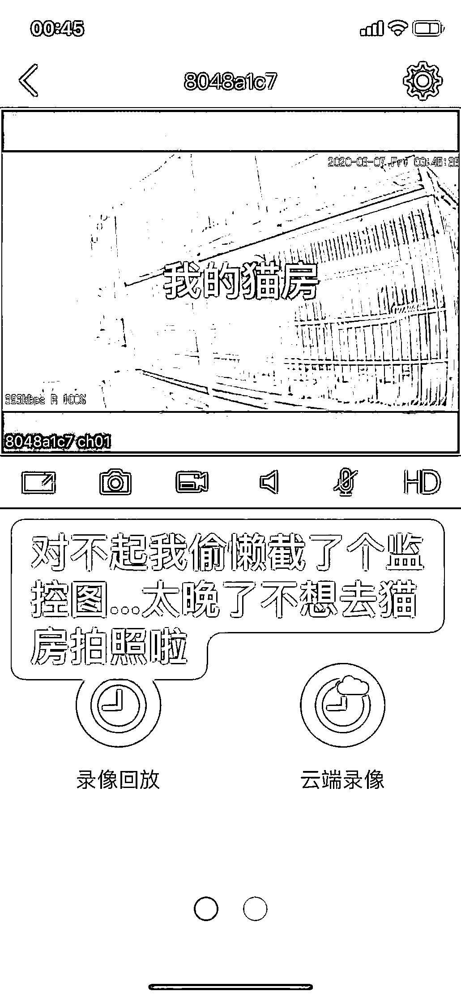

 

 

 

 

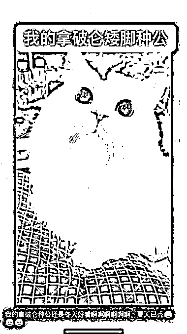

 

 

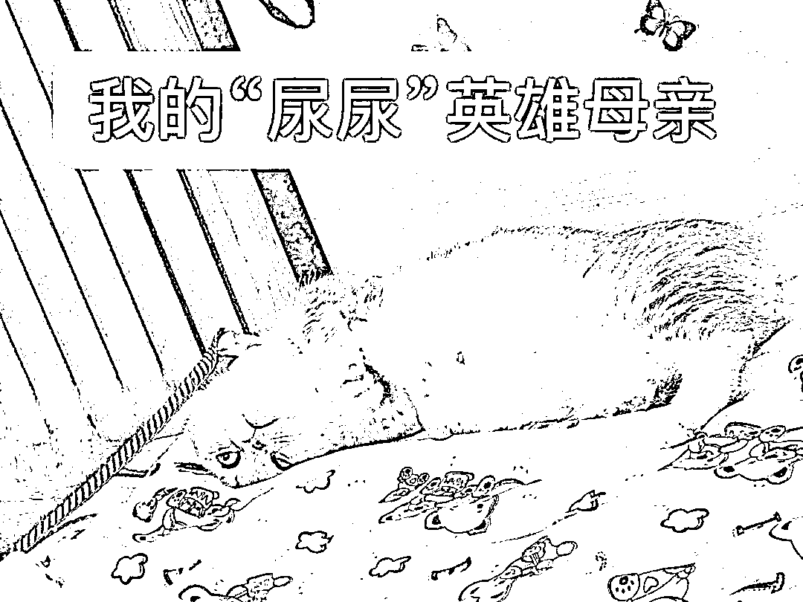

 

 

 

 

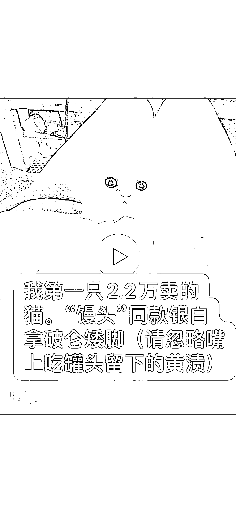

 

 

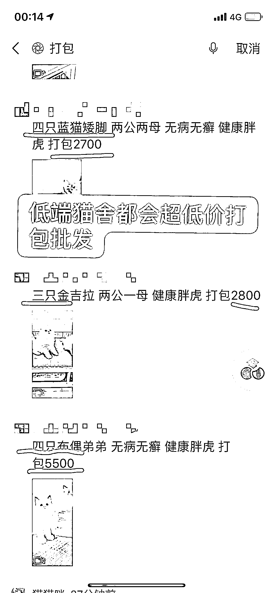

 

 

 

 

 

 

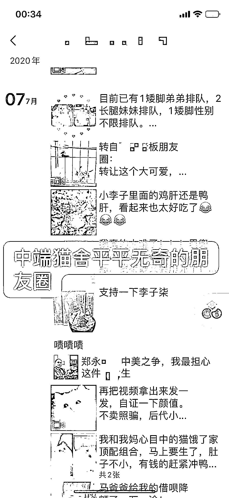

 

 

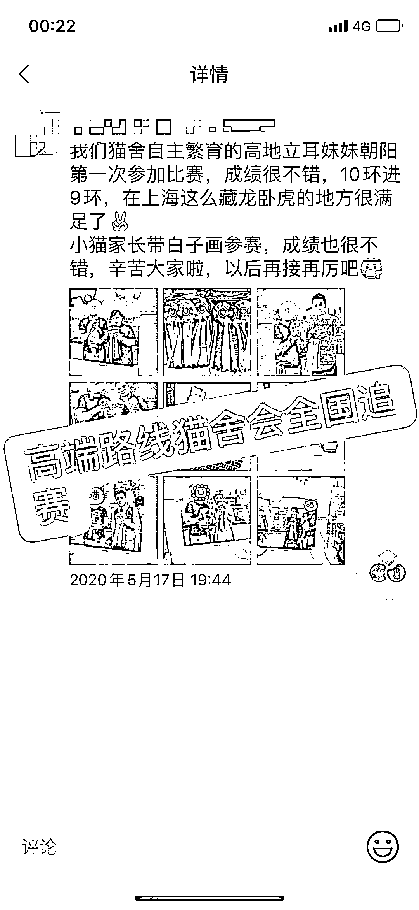

 

 

 

 

 

 

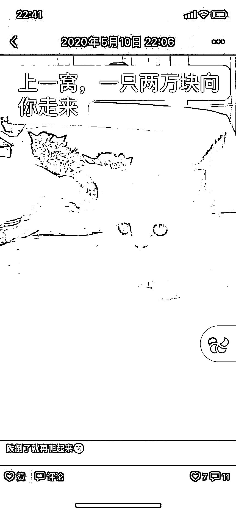

 

 

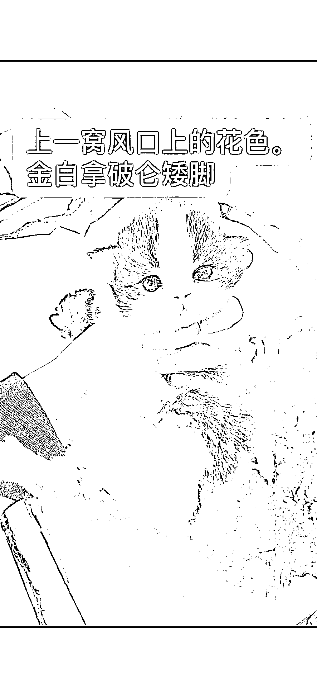

 

 

评论区：

闫寒13286294 : 首赞必须是我[得意]

jiupeak : 偷偷问下是不是B站的up！感觉在哪里看过！

CC : 不是噢，我只在抖音发过我的猫😂

jiupeak : 小姐姐，棒棒哒

🌈盆蜀🌈 : 厉害！！！

亦然 : 超喜欢猫咪，加您微信啦～

西瓜味洋葱 : 我也加啦

Grand Tsan* : 好可爱，可是家里有小孩[流泪]

# **# ****(178**赞**)**从猫舍思维进化到平台思维，我是如

# 何赚到人生的第一个**100**万的

作者：  魔音 morin

日期：2020-12-06

 

 

今天我想跟各位分享「我是如何赚到人生的第一个100万的？」

Hello~

我是魔音，非常高兴在生财有术里认识大家！

本文是一个详细的百万猫舍生意复盘分析——从开始的宠物思维到猫舍思维，然后一步步自己做微信营销、开阔销售渠道、雇佣员工，扩张猫舍的过程，由讲述了如何从猫舍思维进化到平台思维。希望大家阅读！

先跟大家自我介绍一下：

一个99年澳洲留学少女，一个连续创业者，不靠家里一分钱，凭自己的认知和努力创业，19岁2年赚到人生将近七位数的第一桶金，用亲身经历打破社会对年龄和性别的偏见。

世界Top50大学生、澳洲留学生、自媒体人、个人发展/创业咨询、活动主持人、演讲家、珠宝设计师、珠宝买手、专业铲屎官（拥有自己一家猫舍）、澳洲境外房产投资顾问、内容撰稿者、小红书、B站up主。

https://hryiojbt2m.feishu.cn/docs/doccntTN5bz6P816vjSnqjstU6f评论区：

唐葫芦 : 果然是毫无水分，太干了，思维逻辑和执行力都很强悍

魔音 morin : 脱水干货[害羞]

钱南 : 太干了，要配点老干妈[捂脸]

魔音 morin : 可以配点水，小心噎到[奸笑]

wenser2010 : 很精彩，很详细，注意点很好，可复制性也很强   魔音 morin : 感谢认可

wenser2010 : 有考虑在国内做吗？竞争相对来说会激烈些，但也是有市场空间的，另外，是否有做猫咖类似的线下门店的打算？

魔音 morin : 这不是刚回国嘛

# **# ****(**精华帖**)(136**赞**)**猫舍一窝猫赚**30**万是什么体

# 验**——**深度拆解猫繁育行业多种盈利模式

 

 

作者： CC

日期：2020-12-24

（CP全部文章请点左边标签）

最近猫舍作为一个低门槛副业赚钱模式  在生财好像忽然火起来了，这篇文章尽可能的为大家详细拆解了整个猫咪繁育链条的各个赚钱环节，有0门槛的，有技术流的，还有氪金玩法；介绍了很多可以年入数百万的模式和案例，还列举了各种新手坑，让大家少走一些弯路。其中很多逻辑可以迁移到其他行业。万字长文，当作送给大家的圣诞礼物。更希望能获得一颗龙珠当作我的圣诞礼物啊哈哈哈哈哈。

https://shimo.im/docs/6AAqCKl6m3Uxdv3L/

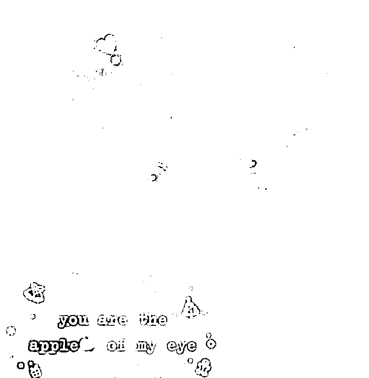

 

 

评论区：

闫寒13286294 : 终于出来了，看着你天天搞这篇，各种熬夜翻记录找素材查资料，再不出来头发都要抓没了😷

红桃六 : 感谢分享，最近在玩知乎，逻辑链条跟你说的都是相同，学到了很多，再次感谢

Locked : 活体水很深是个费心费神的活

热爱搬砖的陈玩玩 : 好家伙，快加精吧！

CC : 养着倒是不费心  养之前比较费脑子  如果养之前不动脑子  到卖的时候就要加倍费心费脑子[捂脸]

CC : CC拍了拍半佛山人

CC : 知乎也是鱼龙混杂，不可全信，作者的不同身份决定了他的立场倾向  百度贴吧几乎都不要信

Locked : 我是猫科动物重度体验用户，之前想过做高端猫舍，后面感觉有好多不懂，想做好必须全职做，而且不见得赚钱。我感觉做繁育人必须是非常热爱这一行，而不是把它当成赚钱的工具

# **# ****(**精华帖**)(112**赞**)**全平台做宠物号获取精准

# 粉，宠物交易** 1 **个月赚到** 10 **万

作者：  缅因猫爸阿岳

日期：2021-04-26

我是如何通过自媒体0-10000粉，1个月赚到10万的

简单介绍：

大家好，我是缅因猫爸阿岳，纯种缅因猫咪繁育人（俗称：职业铲屎官）。在生财一直是个小透明，但在杭州见面会生财夜话@孙策  老板的一句话刺激到我：一定要多分享，龙珠没有那么难！  决定分享这篇3月份复盘《我是如何通过自媒体0-10000粉，1个月赚到10万》。文笔欠佳，多多包涵

先上结果：

自媒体粉丝量：1万（全网合计只有粉丝1万，还在缓慢增长）

 

 

收益：9.45万（2月收益0元，3月收益9.45万，标题四舍五入10万凑整哈）  带货：猫咪活体销售

作品用时：2个月（2月+3月）

...

https://shimo.im/docs/JjDkWgKR3KryCPYy评论区：

驴叔 : 大哥，没权限观看，开一下

小根唲～ : 没法看[撇嘴]

空想错视 : 权限没打开～

缅因猫爸阿岳 : 不好意思，现在可以了吗

驴叔 : 可以了，祝得龙珠

龙马 : 温馨提示:手机里不装石磨文档，官方会直接跳下载页😂，下载石磨文档并登录，手机上星球和网页都能看石磨了

七星小鱼 : 很喜欢毛孩子，家里一直有一只毛孩子陪着，小时候陪自己，现在陪父母[呲牙]

黄浩在观察 : 从定位到包装、制作，事无巨细的分享，化身客户向高段位的卖家学习也是很不错的技巧，学习了[强]

# **# ****(84**赞**)**从业** 3 **年的老**“**闲鱼**”**见到的闲鱼赚钱模

# 式

作者：  杨小六

日期：2023-01-28

大家好我是杨小六，一个做三年“闲鱼”的男人。今天分享下我入行3年看到的闲鱼模式。

 

 

先说下我为什么选择闲鱼赛道，并且坚守了这么久，18年我开始做闲鱼，但是由于刚毕业想去外面的浪浪山看看，就先放下了闲鱼。去杭州从事天猫运营，19年年初从杭州回来，想着要去做电商创业。当时知道的少，在杭州运营的都是top级别店铺，直通车推广花费都是月花费上百万的，一想自己没钱，十多万也肯定砸不出来水花，果断放弃。在家找项目期间也尝试过抖音书单，直接一张图配音乐，涨了有2000个粉丝左右，但是一想在小镇上，愿意回来的年轻人比较少，抖音可能偏人才类型，自己又不懂，没办法做放大招人，就这样又从新拾起了和电商有关的闲鱼。

总结来说就是

第一点：闲鱼门槛低，不需要特别高的投入，甚至保证金都没有（目前部分类目需要200保证金，仅限鱼小铺）

第二点：就是闲鱼挺适合兼职去做，因为在杭州消费水平高点，自己又不是特别节约的人，所以一直把闲鱼当成副业。一月多个2000左右，够房租。

第三点：闲鱼属于人力密集型工作，不建议不适合大城市搞。如果非要定标准的话，不建议工资+五险超过5000的地区搞，如果非要搞，可以按照合伙人模式走，具体可以看我之前分享。也可以评论交流。

接下来正文开始。本文分享我创立闲鱼工作室3年以来，见过的闲鱼运营模式。主要分为三大类，兼职副业运营卖货，团队化运营卖货，闲鱼引流。

还有一个版块就是闲鱼培训，因为涉及比较多，还不是特别清楚，暂不描述。

第一、兼职运营

这个是比较常见的运营类型，很多宝妈，大学生，在岗的年轻人，这个也是闲鱼商家大部分的群体。18年年初的时候还没有出现大规模的商家卖货。闲鱼监管也是非常松散，甚至可以直接在发布里面留下微信号，19年下半年的时候，培训机构开始割韭菜了，很多想要找副业的人纷纷报名，里面很多个人ip，甚至把闲鱼的学员，套用淘客返利又拉了一波下线。

 

 

这部分群体来的快，走的快，很多可能尝试了一周两周，发现没有想象的那样赚钱，一天赚个几十块钱，感觉麻烦，耽误时间，还不如刷个抖音看看快手。

只有在前期赚到钱的可能坚持下来，下一个难点就是在不赚钱的时候，因为闲鱼卖货，像个人账户少的情况下，具有周期性，可能赚了3个月的钱，不管后面两个月怎么做，都不赚钱，就这样又劝退为数不多还在坚持的人。

坚持下来的人有什么样的品质呢。

知足

就是通过闲鱼我每天多了30块钱，一月多了1000元左右，我上着班，还能赚这么多钱，孩子的奶粉钱有了，我的烟钱有了。很开心，这样的人能坚持很长时间。

宝妈群体要比副业兼职的人坚持的时间长，因为自己基本没有任何收入来源，每天多30，她可能会更加用心去上品，去回复，然后赚的更多，越来越有干劲。

副业兼职是有收入的群体，大家出去上班一月5000打底，可能上到几万都有可能，在前期赚钱赚的少的情况下，有收入的群体容易放弃。

所有的事情都是从0到100的，我最开始一天赚30到100，也用了接近1个月的时间，三年才入行，选定个项目不妨先干他3个月再说行不行。

第二种，团队运营

当你已经团队化运营了之后，想搞定货源的基本都搞定了，剩下的就是和无货源死磕的。

我先说下团队架构

简单版：客服，运营

中级版：客服，运营，财务兼进货，售后

高级版：客服，运营，财务，进货，售后，主管

 

 

起步环节基本就是自己一个人全职干，即是运营，也是客服，还能进货和处理售后，一人全能。

后面你去租了个场地，找到了第一个员工，你怕他学会了自己干，所以你干运营，她干客服，你感觉自己的时间相比之前又多了，于是多开了几个账户，你继续负责运营，她负责客服，她有售后问题来问你，因为都是自己的账单，所以你自己进货也从来没记过账，赚了多少钱，只能大概心理有数。

你从最开始的自己干赚8000，找了一个人，收入有所增加，房租水电也不少，一月到手勉勉强强到了一万出头。

你不满足了，感觉我要是在找几个人就好了，我就可以甩手掌柜了，于是你又找了两个客服，你忙不过来了，选品选的脑子疼，没有时间处理售后和进货了，客服开始抱怨顾客老是催发货，骂人不处理售后，你亲戚的孩子正好找工作，你一想自己人，不会偷我钱什么的，于是她来，你把售后和进货交给了她。你可以安心选品了，你的货量也多了，货源厂家也愿意给你降价了。

这个月多了几个人，不过还好，除去员工工资你有2万多收益了，

就这样又维持了几个月，稳步发展到团队8个人了，你感觉你的天花板也到了，团队稳定产出个3-5万了，你感觉我不想干运营了，我能不能换个更赚钱的项目，或者在把闲鱼扩大几倍，就这样，你把你认为最优秀的员工提拔到主管了，你开始交给他运营知识了，员工很聪明，不到一个月就学会了，你大部分的时间空出来了，开始看看生财有术，学习管理层面知识了。

学以致用，团队开始要招人了，你把亲戚负责的进货和售后分开了，售后又专门找了个人处理。

进货的亲戚也开始满平台对比价格，想着给公司多创造利润了。

现在又能多开账户了，企业支付宝又能跳对公了，你趁着机会回老家七大姑八大姨都开支付宝了，拿过来100个号，按照你之前的模式扩大了3倍，人数也多了起来。就这样你的模式为

 

 

a小组3个客服配一个运营

b小组3个客服配一个运营

ab小组共用一个进货，售后

c小组3个客服配一个运营

d小组3个客服配一个运营

cd小组共用一个进货，售后

abcd小组共用一个财务进行账单汇总，对账，共用一个主管，负责请假，员工管理，员工招聘。

就这样你完成了闲鱼团队的搭建，每天处理处理运营的事情，找主管，财务聊聊天，听他们汇报下工作，月入接近10万了

走向了年入百万的青年人行列，赚够了第一桶金，可能离开了让你起步的小县城，去做了更赚钱的项目，去见识到了更大的浪浪山。

团队运营基本分为两种，第一种是费运营的，第二种是费客服的

比如说无货源模式，需要运营每天的选品，写文案，找图片，发布宝贝。运营比较累，但是卖的都是一些标品，价格可能不是特别高，功能顾客都清楚。所以客服的压力就比较小，运营就是比较累。

第二点，有货源模式，产品就那几种，运营只需要每天找找图片发布产品就可以了，客服就是比较累了，类似高客单价的东西，我们现在做的出行工具，基本上运营事情很简单，客服每天要回复接近500多个咨询，上千条消息。

第一种和第二种，无非就是看下客服和运营的人数配比，运营累，就多运营少客服。

客服累就是多客服，少运营。合理分配。

 

 

第三、引流卖货

常见的有莆田系，fk表，但是今天不说这两个，拿一个卖宠物的举例，他在我这拿群控大概有400个号稳定在用。收益他给我说的大概月入12w，卖狗，少量卖猫。

服务大城市  ，客单价800-3000左右，适合平民玩家的那种泰迪、博美之类。

闲鱼用来引流，封号的几率大概一月牺牲百分之10-20左右。

引流的渠道号：首先先找自己人开一些，然后上架产品，发布帖子，会有顾客咨询，因为上架的价格偏低，所以咨询量肯定很大，但是不是所有顾客都会购买，所以第二点来了，不买的顾客，我租用他们的闲鱼账户，记住，只是闲鱼，不产生任何交易，不需要支付宝，不需要密码，只要能发布宝贝即可，一月30-70元，这个数字我听到也挺吃惊，是因为太便宜了，想不到。根本就想不到。但是确实很多人愿意把号租给他们。可能自己留着也没什么用。

收到号直接上群控，一个人就能看接近100个账户！

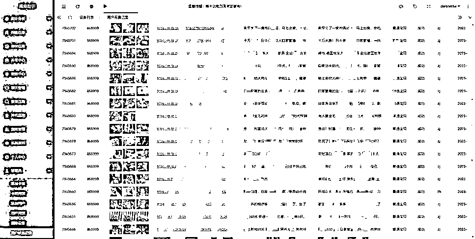

 

 

成交模式：闲鱼引流过来，引导加了微信，微信号会发很多宠物什么样子的多少钱，配合着图片，是集合全国各地的狗舍，猫舍进行合作，主要还是针对北上广深等一线城市和新一线城市，人多，年轻人多。主要的还是有钱养猫养狗。

 

 

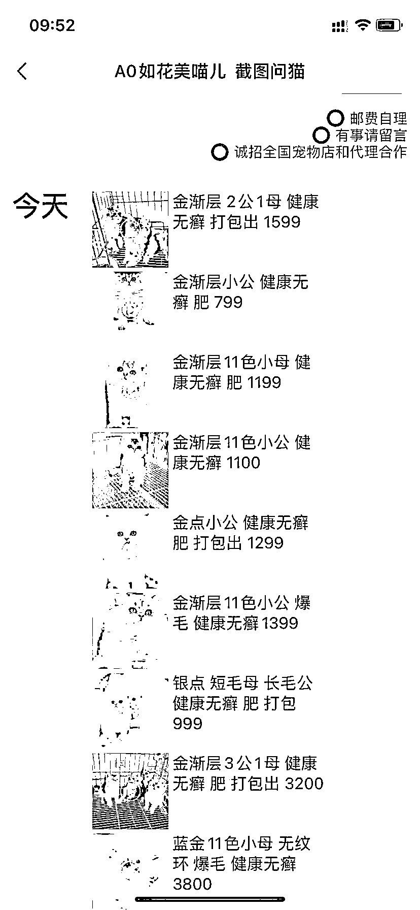

后面的活宠物运输，两种模式，离得近，就在当地城市，基本上都可以上门自提，猫舍留够自己的，收钱之后分到他手里。

第二个就是运输，空运和陆运，大型猫舍狗舍基本都可以发货，先收顾客定金，然后视频看狗，收尾款，打包发货。

还有一个点就是无良卖家，实际顾客视频看的狗和发货的是两个狗，但是相貌基本一样。视频看着很精神，发过去的可能没有这么精神，毛发也有差异，价格差是有的，顾客基本不深究。以发货路途狗晕车没精神推脱责任。

以宠物为例，当你手握流量渠道，稳定流量来源。剩下的就是不停地找猫舍，找狗舍，来源可以58，抖音，百度地图，只要你电话打过去，很多都愿意合作的，还有全国当地的猫舍狗舍交流群，里面的交易很多。

莆田系和fk表，也提一句，首先闲鱼封号已经很严重了，透漏一个fk表的玩法，标价为实价，就是真表价格，卖的话说真表没了，还有一个fk的，价格xx元，你要就拍，不要就拉到。封号几率小。

但是光明正大赚钱的生意很多，强烈不建议上啊~

 

 

讲到这里就分享就结束了，希望对大家有所启发，不足之处也请大家指正，我很久之前也发过几篇关于闲鱼的文章，大家可以回头看看，有问题随时可以私聊我~也可以在下方评论。

祝大家新年愉快，2023发财！

评论区：

洪智「突围一只鹰」 : 感谢分享

国强，坐标日本 : 还得是国强

杨小六 : 还得是国强[呲牙]

杨小六 : [握手]有帮助就好

济南张亮（手机卡） : 诚意满满的干货

骏马 : 国强就是强！

杜小盼 : 厉害[强]

时光 : 才知道可以租号[撇嘴]群控软件哪里买的

# **# ****(15**赞**)**闲鱼宠物导购**-**引流「**CPS**」

作者：  空想错视

日期：2022-11-24

闲鱼宠物导购/引流「cps」

这个是我前段时间买宠物猫的时候发现的一个行业。在闲鱼和淘宝上找当地的猫舍，找了好多家都是加微信，让看朋友圈/发一些（快包浆了的）视频让看猫，催促去线下选猫。看似很正常对不对，我专门挑了一天时间打算这几家店一起逛一下，联系当初「猫舍」的员工，统一全是：我今天没在店里，给我你的电话我让店里面联系你。

 

 

其实到这里我也没有觉得有啥，直到看了三家之后选到心仪的小猫，在讲价的过程中我提到你们的在线销售说xxxxx，店员直接来了一句：以我们现场的为准，他们说白了也就是网上的串串（方言，意思类似于拉客的黄牛）

然后我才反应过来他们的操作逻辑：在闲鱼等平台发布大量精美的宠物图片引流到微信，事先准备大量各个品种猫狗视频发布朋友圈，让卖家线下选猫引导至线下猫舍成交，获取提成。

甚至某个微信号上还在发布租闲鱼号的广告，证明此流程有利可图。宠物相关行业可参考。这应该也算是某种「泛CPS」吧。

评论区：

重楼 : 我经历过一个，他们的模式是找兼职粉，用闲鱼发内容。引流一个咨询给1块钱奖励

进哥哥@美呗医美合伙* : 线上引流线下成交，他就不怕猫舍店黑单啊[呲牙] 亦仁 : 中标，术值+1。

在上方 #星球栏目  专栏中，点击 #中标，可查看所有中标风向标。

Googoo : 那这个成本真的很低

九歌 : 我加到一个这种兼职群，顾客留下联系方式4元一个。

# 【宠物自媒体】**3**篇

# **# ****(**精华帖**)(112**赞**)**职场小白裸辞做小红书宠物

# 博主，一个月收入顶一年工资

作者：  虾饼

日期：2023-06-21

 

 

宠物赛道越来越卷了，那除了头部大 V 外，素人还能做起来吗？

不知道大家有没有发现，很多的红海赛道细分之后，就又是一个新的蓝海。我在小红书做宠物科普博主之前，就是一个毫无基础的新人，在小红书做宠物赛道也只是因为热爱分享。

所以在刚开始起号时，仅仅是利用闲暇时间去蹭爆款标题，发笔记试试水，没想到一个月就积累了近千粉。慢慢的我就开始专职做宠物科普博主，接广告推广变现了。现在，我单月的收入比我之前一年的收入还高，这也是我当时不敢想的。

而对于素人来说，宠物科普就是一个机会比较大的蓝海类目。相比萌宠、吃播赛道，宠物科普难度比较低，适合小白入局，而且起号成功之后不仅仅可以只做科普，也可以做同类型的矩阵号去引流卖货。

今天，和大家分享我做小红书宠物科普博主的一些经验和实操，希望对大家有帮助。

一、自我介绍

哈喽大家好，我是虾饼，3 年生财圈友，2 年谢无敌的红书宝宝友。我在 21 年底裸辞后开始做小红书，选择了宠物赛道里的细分赛道——宠物科普，单月收入最高抵我之前上班一年的收入。

 

 

小红书可以说是各个自媒体平台里对素人最容易上手、推荐机制最友好的，分分钟从苦逼打工人转型为全职博主！

宠物行业近年来发展趋势向好。比起生娃，现代年轻人更偏爱养育成本低而精神陪伴价值高的宠物，将它们看做是家庭成员的一部分，愿意为它们付出精力和金钱。

但实际上我选择这个赛道偶然性是比较多的，我没有像其他人一样用很科学的方式去调研去分析，仅仅是从我个人长处出发。我是一名铲屎官，特别特别爱我的毛孩子，有事没事就要逛论坛取经，学习科学养育的知识，淘车价好物，我还很热衷于把我所知道的安利给身边的朋友。

那么我的优势就是：有知识储备（量多量少不要紧）+热爱分享。所以我决定大类上选择宠物，细分赛道上选择做科普。

误打误撞，这个赛道恰恰是最适合新人入场的赛道之一。

先说一下我起号的情况：2021.10 开始利用通勤时间发简单科普笔记+萌宠日常，但发现科普笔记流量更好，通过蹭爆款标题一个月积累了近千粉丝。

零零碎碎地接广，一个品报价小几百。2022.2 用了一个爆款模板一周时间涨粉 3W，广告邀约不断，报价四位数。

 

 

二、宠物赛道情况

宠物赛道大致可以细分为：萌宠、吃播、科普。

（**1**）萌宠** **难度：**5 **星

**1. ** 必备条件：宠物有特色或号主有较强的包装能力

**2. ** 其他条件：会讲故事、会拍摄剪辑

**3. ** 优点：流量大，出大** V **概率高

**4. ** 缺点：泛粉多，用户画像不够精准，报价较低，无法批量复制

 

 

 

 

（**2**）吃播** **难度：**3 **星

**1. ** 必备条件：宠物干饭能干得很香或号主场景布置能力较高

**2. ** 其他条件：简单的拍摄剪辑

**3. ** 优点：流量中等，出片比萌宠难度低，可以复制

**4. ** 缺点：同萌宠

 

 

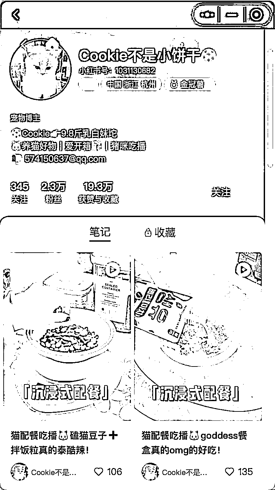

 

 

 

 

 

 

（**3**）科普** **难度：**2 **星

**1. ** 必备条件：宠物知识储备

**2. ** 其他条件：简单的拍摄剪辑或文案排版

**3. ** 优点：制作简单几乎无成本，用户画像精准，报价较高，可批量复制

**4. ** 缺点：流量较少，较难出大** V**

 

 

 

 

 

 

 

 

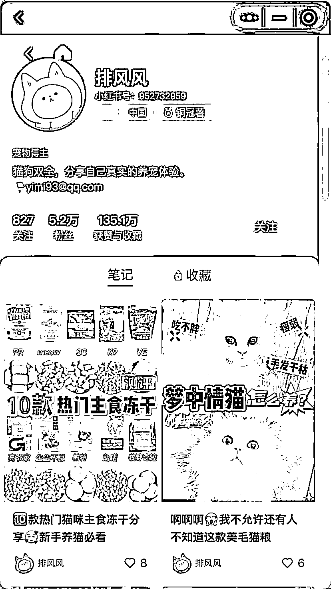

因为科普类可量产的特点，成为了许多机构和品牌做号的切入点。团队来做这类号的优势是人力充足，能量产，只要一批号里有那么几个做起来了，收益就很可观了。

**1**、品牌

**H5**

品牌起号只需要组建一个非常小的团队，成本远比每月找博主投放低。

例子：诚实一口

**H5**

品牌矩阵号&作用：

 

 

 

 

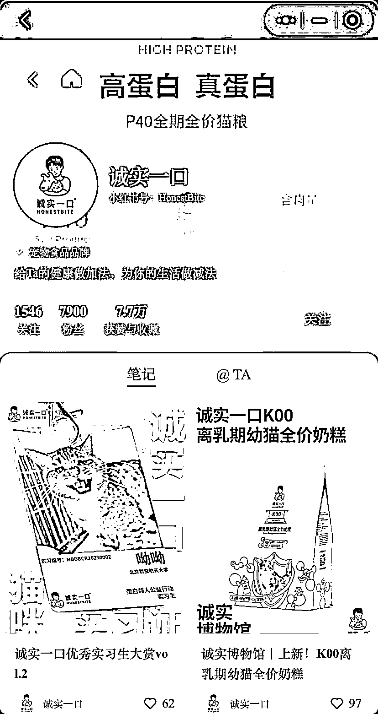

专业号大号 1 个

品牌宣传、活动发布用

 

 

 

 

专业号小号 1 个

品牌宣传、引流用

 

 

 

 

个人号猫号 N 个

给品牌打软广用

 

 

 

 

个人号狗号 N 个

给品牌打软广用

诚实一口的专业号小号做得很好，通过发布一系列有趣但没什么意义的内容，打造品牌有意思、亲近用户的形象，博得用户好感，打开品牌知名度。

该品牌前期的个人号也是图文类型，使用爆款模板大量起号，后来又做了视频类型的，成本高了一些，但传播度和影响力也更大。

视频内容的打造跟图文爆款也是一样的，猫号的某条内容火了，选题不变，台词稍微改一下，套到狗号上面，能再爆一次。

**2**、机构

**H5**

量产一批号，选题、封面设计、剪辑套路共用，只要做起来了，就可以找品牌合作推广。而且由于机构手上号多，什么量级的号都有，价位不同，给了品牌较大的选择空间。

 

 

例子：方片新媒体

**H5**

矩阵号：

 

 

 

 

 

 

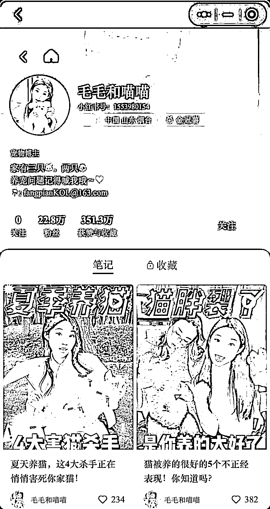

 

 

 

 

 

 

他们做的号太多了，但是基本上只要看到就能认出来，因为风格差不多。毛毛和喵喵这个号还是换过演员的，谁都可以是猫猫，视频里露的脸长什么样，对他们来说并不重要。

当然批量批号对机构来说不过是常规操作，只是做宠物号的机构没有很多。我认为可能是能批量做的类型比较少，目前看来主要都是科普类，此外就是宠物品牌预算较低，远不如美妆类的利润高。

**3**、素人入场分析

**H5**

去年小红书对宠物赛道十分友好，经常给予流量扶持，还拉了作者群进行运营。

今年起来砍掉了宠物赛道大部分的流量扶持，活动减少，类目仅限于萌宠和异宠，大部分作者群也直接解散了。现在整体环境对新号比较友好，新号能获得较多自然流量，但老号基本只能靠推流。

此外品牌和机构入场会挤压到素人的生存空间，质量不够高，或自然流量不够好的素人接广概率相比之前有所降低。

 

 

但对素人来说宠物科普仍是一个机会比较大的蓝海类目。所以我会建议小白多考虑宠物科普赛道，先套爆款模板起号，再看是要做同类型矩阵号去引流卖货，还是要精耕内容转型更有深度的科普博主。

三、实操流程

（**1**）账号装修

**1. ** 账号定位：科普类使用真人的** IP **价值更高，用宠物做** IP **需要结合萌宠内容一起做效果才好

**2. ** 昵称：最好带上关键词方便被搜到，如：**XX **养猫、铲屎官** XX**、**XX **说宠物**3. ** 头像：用真人照更容易拉近和用户之间的距离，形象更丰满

（**2**）内容来源

**1. ** 豆瓣、贴吧、知乎：找选题相关资料用，这几个网站拥有较多高质量的经验贴**2.  PetMD**、**ASPCA**、**icatcare**：在谷歌里用英文搜关键词，能找到很多同类网站。

找选题相关资料用，需自行翻译，内容有专家把控，比中文论坛的素人发帖专

业严谨

**3. ** 谷歌学术：找文献用，宠物相关的研究国外更先进且资料更丰富

**4. ** 小红书：内容质量参差不齐，主要用来模仿内容的呈现方式，内容的呈现方式，如标题、封面、排版等

 

 

（**3**）创作流程

**1**、找选题

**H5**

**1. ** 不要局限于自己的类目，其他类目的爆款也是可以参考的，比如：

 

 

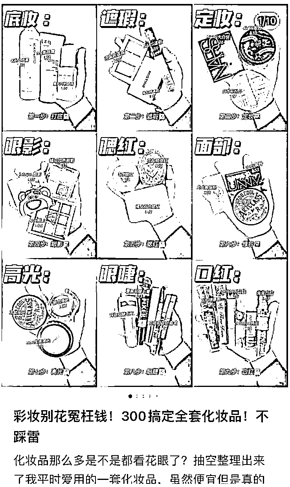

 

 

 

 

 

好会养猫一女的 200 元搞定日常消耗品

（同时参考了选题、标题、封面）

**1. ** 笔记要注意内容分配，一开始可以设定** 30%**引流内容（蹭热点、蹭爆款模板）**+70%**体现账号价值的内容。这个** 70%**里面留有产品植入位置，为后续接广打基础，同时也要注意账号调性，如果只发** PDD **平价养猫这种选题的笔记，接到高端产品的几率会较低。

**2**、定封面

**H5**

小红书瀑布流的推送形式让封面变得极为重要，用户第一眼看到的就是封面，想要笔记脱颖而出，封面就得足够吸睛。

但是不建议所有笔记封面都复刻爆款的，这样很累，而且没有明显的个人标识，还是得定下一个足够有个人特点的封面模板。

 

 

 

 

统一的花字，封面均为人像

 

 

 

 

统一花字、封面、视频特效，但这位博主也是经历了很长时间的蛰伏才找到自己的爆款方向

 

 

 

 

统一花字，封面均为多物品摆拍

**3**、定图片内容

**H5**

内容跟封面有共通之处，但是没有封面要求那么严格，只需琢磨出你自己一套模板即可，不用模仿爆款。

但也还是要注意可读性。

 

 

 

 

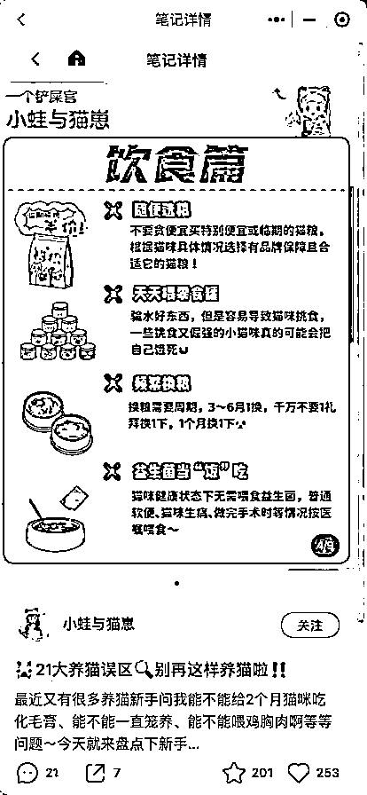

笔记科普部分

模板可拆解为：底图、标题、段落、配图，这些都是可以用固定的字体配色和排版的 

 

 

 

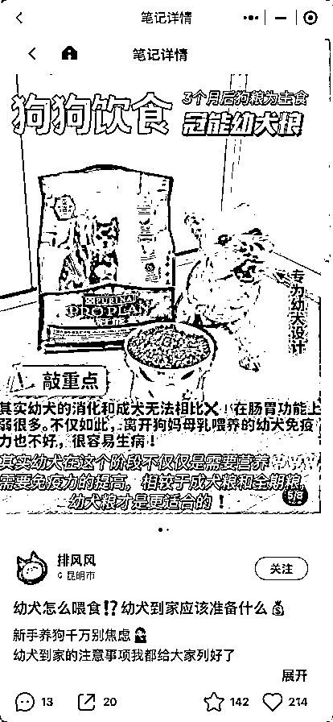

笔记推广部分（宠物与产品的合影）

拍摄模板可拆解为：宠物与产品的合影、产品细节图、宠物试吃图；

推广部分的文案模板：大标题、小标题、卖点详解等的字体配色和排版

 

 

 

 

笔记推广部分（产品细节图）

 

 

 

 


笔记推广部分（宠物试吃图）

**4**、定文案

**H5**

这部分其他朋友分享过，无非是分好段落，开头固定打招呼，中间抛问题埋关键词，结尾自我介绍和引导互动。此处不赘述。

四、变现方向

对于小白来说最简单方便的变现方法就是接推广

 

 

（**1**）如何提高接广率

**1. ** 前面强调的，笔记内留出产品植入空间，比如你在科普猫咪软便怎么办时，留一部分出来讲平时吃什么猫粮**/**保健品可以解决这个问题。

**1. ** 简介里留联系方式，方便** PR **联系你。不过现在不能留邮箱了，建议使用特殊字符，工具： https://exotictext.com/zh-cn/** ** 

 


**1. ** 到达千粉后马上去开通报备合作权限，你的账号可能被品牌在蒲公英平台上看到并选中：

 

 

 

 


小红书-我-左上角三条杠-创作中心

 

 


 

 

创作中心下滑-内容合作-进去后有开通指引

**1. ** 使用第三方通告平台（注意甄别），如螃蟹通告、布偶通告（均为小程序），这些平台里会有新媒体群入群引导，多加，也多跟其他人互换群资源，能接触

到很多通告信息

**1. ** 遇到心仪的品牌也可以去私信求合作

（**2**）推广合作流程

**① **合作形式

合作的形式分为报备笔记和非报备笔记。报备笔记就是前面提到过的官方认可的品牌合作，是要被收取“保护费”的；非报备就是咱们私底下合作，悄咪咪打暗广。

 

 

非报备又可以分为单品跟合集，单品就是一篇笔记里只能含这个品的广告；合集就是同时有好多个品给你广告费来出现在你这篇笔记中。

单品里面还有个概念叫做伪合集，就是一篇笔记里看似出现了很多个产品，但真正给广告费的只有一家，这种就是在最大程度上避免被判定为私自推广。

跟 PR 聊的时候还得聊清楚以下几个问题：

**1. ** 档期：就是你出初稿、终稿、以及最后发布的日期。

**1. ** 授权转发：能否授权给品牌方在电商**/**内容平台上发布，是否免费，授权周期多长。尾部博主一般是免费授权，周期一般在三个月到半年。

**1. ** 授权投流：能否授权给品牌方在小红书里投流，是否免费，授权周期多长。虽然投流能帮博主涨数据，但如果品牌爆出丑闻，还继续拿我们的笔记去投流，

对我们账号形象会有影响，所以最好定一个周期，比如一年内免费授权投流，

一年后看情况是否继续授权，是否加费用。

**1. ** 笔记发布后的保留周期：一般是一年或永久。

**1. ** 排竞：在你发布这篇笔记的前几天到后几天，不能再发布该品牌方的竞品的相关笔记。

**1. ** 活动出席：美妆和穿搭类的品牌可能会邀请达人出席他们的产品发布会之类的。

**② **如何报价

 

 

推广分为两大类，无费和有费。

无费推广就是置换，把东西送给你你帮忙出一篇笔记，跟小红书的好物体验是差不多的；

有费就是会给你一定数额的报酬，大原则上报价一般是按粉丝量的 10%～20%，具体可以看你账号的情况，如果这段时间流量很好，账号定位又跟品牌契合度很高，那就可以再往上报。

还有就是看你是否注重长期合作。一种情况是你笔记报价相对较高，但是出来的效果不好，人家可能就不会考虑二次合作了；

另一种情况是比如原价是 2000 一篇，按他们的预算可能一个月只够找你合作一次，如果能谈到 1500 一篇  ，或许他们一个月内就会找你合作两次。

再者你要看是跟品牌直接对接，还是跟机构对接。机构的话一般会找你要返点。返点就是你收了推广费之后返一部分给机构。

返点在 20% 左右比较合理，那种 35% 以上我觉得有点离谱。

图文报价一般会低一些，大概是视频报价的 60%～70%。但如果你本身就偏向于图文类的博主，那么你的图文报价是和可以视频报价相当的。

报备笔记报价，要高于非报备，因为你不仅要被品牌收取服务费，还要接受品牌更严格的审核，可能需要你更高度的配合，如果到手比非报备低的话就太亏了。

 

 

有一点很重要，一定要记得跟 PR 讲！就是你现在给的这个价格是几月份的价格，是不是一定要在当月发布稿子，如果延迟到下一个月份发布，你是不是要涨价。（保价的概念）

然后就是修改次数啦，特别是视频的，脚本接受几次修改，后期接受几次修改，大改的话是否要加钱。

有一些合作不是按固定价格来结算的，可能是按周期内的互动量阶梯式付费，比如 7 天内到达 100 赞就多少钱，到达 1000 赞就多少钱。

也有的是按带货佣金给的，给你的一个基础费用之后，你能帮忙带多少货就额外给你多少钱，或者没有基础费用，按纯佣计算。

在寄样品上面有两个概念需要了解：寄拍和送拍。寄拍主要用于单价较高的产品，你拍完照片后是要寄回去还给品牌的；送拍就是东西完全送给你了。

**③ **结款

最后就是结款了，要问清楚是否需要发票。跟机构对接他们会帮你开票，不用担心。

跟品牌对接可能要你提供替票或者是上诺诺网代开发票，替票就是你去外面消费，然后要求开发票，用的是合作公司的抬头，再把发票给他们拿去报销；

代开发票可以上某宝搜发票管家  里面有个代开的选项，是诺诺网提供的服务，选择一个税点低的城市，开票给品牌方。

 

 

还要问清楚的是结款周期，是发布后就打款，还是要等多久才能打款。

结款方式是直接打到你私人账户上，还是要注册类似人力家这种第三方平台，这种平台是会帮你交税和解决品牌的发票问题的，很省心。

现在也不止接推广的变现方式，发笔记带商品链接也是可以挣佣金的，类似抖音的小黄车，>1000 粉后可开通。

此外还可以开个小红书店铺，自己给自己带货，无粉丝要求，找得到货源即可。

评论区：

虾饼 : 加入生财的第三年啦！没想到居然会被生财约稿哈哈哈！感谢生财团队的认可和运营编辑小伙伴的工作支持🎉

周彦充 : 厉害，[强]，至今还没被谁约过稿[色]

虾饼 : [抱拳]仁兄过奖！还得感谢无敌老师给的曝光哈哈哈，让小白在圈子里也有露脸的机会

Sherry💎谢无敌 : 一直都是棒棒的虾饼[得意]

虾饼 : 呜呜感谢无敌姐团队的指导和支持

胖大魔 : 我最喜欢的宠物博主是抖音的二狗[呲牙]还有郑义的大黄[呲牙] 周周Mia : 赶来给锤妈点赞[呲牙][呲牙]

虾饼 : [亲亲][亲亲]

# **# ****(8**赞**)**萌宠号起号作弊技巧

作者： time

日期：2021-10-26

生财茶馆 B站萌宠领域快速起号的另外一个作弊技巧，买网红猫舍的网红猫。

 

 

首图为网红猫舍。

后面为购买了他在各个渠道大力营销的猫的粉丝，结果就是直接把喜欢对应的猫咪的人群给截流了过去。

对卖方，通过营销提升溢价。

买方则直接购买猫舍火爆的猫来接住大量粉丝，一个几万粉的B站账号基本上就能cover掉不少买猫的成本。

直接就形成了一个正向循环，这个案例真的值得细品


 

 

 

 

 

 


 

 

 

 


 

 


 

 

评论区：

亦仁 : 中标，术值+1。

点击最上方 #中标  专栏，可查看所有中标风向标。

朋友叫我阿锋 : 有意思

# **# ****(3**赞**)**几万粉丝宠物号，无法变现的真相！

作者： Dreamland

日期：2022-09-19

【几万粉丝宠物号，无法变现的真相！】

为何粉丝几万的宠物号，却迟迟无法变现，今天我想来和大家聊聊关于账号定位以及宠物起号的相关内容，都是本人的亲生经历和实操结果！首先还是得感谢一下生财有术的龙珠见面会，以及盗坤老师，那天聊了很多，然后和在场的一个小伙伴准备一起做个宠物号，因为他本身就是自己养宠物的！故事就是从这里开始了！

 

 

全部内容：https://shimo.im/docs/16q8M18JmdhplRk7/


 

 

 

 

 


评论区：

Dreamland : [快哭了]特难受，做了挺久的，变现为零，只会搞流量，变现真的废[凋谢] 小花 : 卖狗粮猫粮呢

一一 : ①确实，变现优先，从第一个粉丝开始赚钱。

②流量直接导给朋友，却0收入。这让我想起以前做教育，哪有什么不精准的流量，人家看了你的视频，愿意加你微信，有这个动作也不泛了，可能没有挖掘对需求。

③一开始有参考同行，那就看同行卖什么，跟着卖，实在不行导流给他也可以变现。[捂脸]

Dreamland : 流量倒朋友了，但是定位不符

Dreamland : 一开始想的就是导流变现，奈何定位不符，如果是万元之下估计也都变现了

小花 : 现在也可以继续导，导给猫狗粮店铺，原来导的流量可以继续转卖猫狗粮  Dreamland : 好的

 

 

# 【宠物**AIGC**】**2**篇

# **# ****(90**赞**)**如何借用** AI **绘画工具批量出图蹭上意

# 间** AI **绘画的热点

作者：  明月

日期：2022-11-21

如何借用AI绘画工具批量出图蹭上意间ai绘画的热点？

我是明月，98年男生，喜欢研究各种好玩的赚钱工具。

大家都知道，最近AI绘画有多火。

无论是抖音，B站还是小红书等其他平台，随便刷一刷就能刷到很多关于AI绘画的帖子。

其中90%的内容都是重在展示AI绘画出来的图像，还有10%的内容是教程和引流。

如果你留点意，你会发现以上这些AI绘画借助的并不是主流的AI绘画工具。

而是一个微信小程序，叫做意间AI绘画。

为什么火的是意间AI绘画，而不是那些主流的功能强大的AI绘画工具呢？

我想原因有二，一是简单易用，门槛低。二是可以图生图，跟用户自身建立链接，能激发用户的分享欲。

这跟前一段时间爆火的羊了个羊有着异曲同工之妙。

那么我们能不能想办法蹭上这个热点，吃上这波红利呢？

说白了就是怎么通过AI绘画搞流量？

今天我就跟大家分享一下我用一周时间研究出来的成果。

如何利用Stable Diffusion（后面简称SD）AI绘画工具批量出图。

（请移步飞书来获得更好的阅读体验）

https://hdjmn9shgs.feishu.cn/docx/YOI1dmDLVoefxfxl2iqc4HN8nzc评论区：

 

 

漫漫 : 刚报名ai绘画就看到这个帖子！真是太幸运了👍感谢分享！请问到时候如果实操有什么不懂的可以再来请教不😂

明月 : 可以，欢迎链接

成克帅 : 比喻很到位，容易理解

活不明白 : 使用sd批量出图是怎么蹭意间的热点的能否展开讲讲[呲牙] 明月 : 意间ai出图效率低，可以用sd模仿意间ai的风格批量作图，多账号发作品  非常柠檬119 : 简直太牛了

活不明白 : 理解了  感谢[抱拳]

桔灯 : 微信小程序搜索ai绘画，搜不到任何小程序？

# **# ****(73**赞**)**小红书上宠物粉群体，**AI **绘画宠物赛道

# 可以吸引精准的宠物粉

作者：  筑梦

日期：2023-03-21

小红书上宠物粉群体非常大，所以流量一直不错

Ai绘画宠物赛道可以吸引精准的宠物粉

可通过多种方式引流变现：

1.将想要取图的用户引至公众号，可以为公众号快速涨粉，配合宠物知识类等转化  2.夸克网盘拉新、迅雷拉新等，想要免费取图就要下载（适合各种头像类宠物类账号）  3.定制宠物头像壁纸等（宠物头像的单价要比人像高很多，宠物头像一般200+，人像一 

 

般50左右）


 

 

 

 

评论区：

筑梦 : 这个也适合宠物赛道的商家矩阵化运营，再配合后端产品或知识的转化，吸取流量的速度很快且精准。

亦仁 : 中标，术值+1。

在上方专栏点击 #中标，可查看所有中标风向标。

# 【宠物电商】**7**篇

# **# ****(141**赞**)**视频号最新实战经验**—**如何破零播

# 放、选品新思路、测品技巧、去重技巧以及视频

# 号小游戏

作者：  拱卒

日期：2022-07-11

非常荣幸成为了这次视频号小航海的教练之一

在小航海圆满结束之际，针对最近遇见的各种问题以及结合我团队最新的实战技巧经验分享下大家最关注的**0**播放怎么解决、选品的新思路、测品新技巧以及去重新技巧和新出的视频号小游戏

 

 

一、注册账号设置及**0**播放问题

**1**、视频**0**播问题

新号会有扶持期，新号指的是视频号，与微信是新号还是老号没联系。

我们尽可能抓住新号的扶持期实现变现，对于搬运账号而言，30条视频后会大概率进入0播的状态，账号被识别为搬运，营销类账号。

**2**、如何判断被识别搬运号

发布一个画面优质的随手拍视频，几小时后依旧没播放，就可以断定。

**3**、**0**播后处理办法

我们没必要采用注销的方式来释放账号，因为其有一定的周期占用实名，并且有佣金为结算的情况下无法注销，我们可以通过更换管理员的方式来释放原视频号。

这个是可以立刻让自己的视频号变成新号，节省时间。

**4**、如何更换管理员

这里如果找不到合适人选来替换，可以添加些刷单群，砍价群类似这种群体的群。

 

 

发消息称有偿更换，总会有人帮你处理。

**5**、实名认证相关

一个人的身份证可以实名五个微信，视频号实名要和微信实名对应，实名是可以顶替的。

具体步骤：设置——帮助与反馈-微信的相关支付问题——实名问题——查询名下账户。

**6**、注册问题

注册账号不要用虚拟号，如果多账号进行注册，不要使用同一个基站注册。

**7**、如何避免识别搬运营销类账号

去其他平台搬运原创实拍类个人ip账号，积累粉丝量，涨粉与带货结合，涨粉视频占比前期大点。（也就是说把视频中人物当作自己来做）

**8**、人群选择

虽然说视频号30—50年龄段人群居多，但不一定爆款仅出现在这个人群里面，可以去更加年轻人群去选择方向，就比如现在的小游戏方向在视频号反响都不错，更何况20—30的年轻群体。

 

 

**9**、主页的完善

昵称和头像在你确定好方向之后，直接找对标同行超即可，昵称没必要存在所在方向，这并不会提高你被搜去概率。

即便有，搜出来时首先呈现的也是该领域大号，我们只要保证昵称符合你定位人群即可。

重点放在简介，由于我们是以带货为主，且一般情况下我们并不具备小黄车功能，因此主页商品的引导至关重要。

我们主页简介满足两个条件就好，第一行引导关注/说明作品方向，第二行引导下面的商品去进行购买。

**10**、如何获取小黄车资格

发布“原创”内容，积累粉丝，等待官方邀请，也就是说让官方通过你的视频发现你是一个优质原创作者。

接受官方邀请有一定的概率。

**11**、主页商品添加方式

视频号——创作者服务中心——带货中心——去选品。若视频号未进行实名，则无法添加商品。

 

 

二、选品方式梳理

首先强调一点：判断一个产品的好坏，作为我们带货的话就是这个产品好不好卖。

有没有卖点，如果有，通过视频好去进行呈现吗，或者通过声音文案呈现是否可行。

决定出单，第一个条件是要有播放，有一定爆点。产品好坏再理解的直接一点就是【视频留人能力】。

通过产品大类去挖掘细分领域。

比如我们大家很熟悉的绿植，其可以分为：植物防虫类似相关、植物本身相关、植物种植配套产品等。

比如我们都熟悉的母婴，其可以分为：孕妇所需、孩子所需、育儿所需等。

以上两大类，我们大多数人可能仅靠空想只能想到植物本身相关的种子，以及孩子所需对吧。

所以说我们可以通过某些软件进行深入的挖掘，这里拿我们常用的考古加举例子。

比如我想做一个宠物账号方向。

 

 

打开考古加界面后，我们通过找商品，宠物类进行搜索。


这里所呈现出来的分类有猫狗通用食品/猫狗美容清洁用品/爬虫鸣虫及其用品/散装粮/犬主粮/猫狗玩具/猫狗日用品/狗零食/猫主粮/水族世界/鸟类及用品/兔类及用品/宠物智能设备/宠物生活服务猫零食/马类及用品/宠物服饰及配饰/畜牧用品等等。

一个宠物大类可以分成这么多小类，并且这些小类中又不是局限于单一产品是吧，由此可以发现，能做的方向真的有很多。

我们平时常看到的是猫粮，狗粮类居多，宠物玩具可能也会有所涉及，但其他方向我相信是很少见的。

对于加红的类目对于我而言可能会着重考虑，因为对于猫狗鸟而言，受众群体可能会比较多，对于鸟类，刚好符合视频号主要人群画像。

另外就是前面所提到的，产品的好坏可以理解为“视频留人能力”。

 

 

狗猫美容清洁用品：可以呈现出便捷，前后宠物对比做呈现，有一定视觉冲击，可留人。

猫狗玩具：虽说做的人多，但同样的玩具种类也多，但凡对宠物感兴趣的人群，看到宠物玩具这类有笑点视频都会去做停留，可留人。

鸟类及用品：如笼子，笼子功能及可观性是吸引中老年群体的因素，可留人。

宠物服饰及配饰：笑点，新奇，同时可结合热点时间段去蹭流，比如春节类似节点，可留人。

等等等。

我们再借助考古加细分下去，比如我们拿猫狗玩具举例子。


我们确定好相对应的选项，即可进行筛选，说下带货类型及时间选择原因。

 

 

因为对于我们未发布视频的情况下而言，直接去参考直播为主的带货视频意义不大。

因为我们决定开不开播的决定因素是有没有爆视频，视频爆了之后我们就果断开播了。

当然如果你决定做某个产品，可以在发视频之前，通过直播为主筛选一次，找到其账号，学习一下对方的直播方式做好准备。

时间的选择是选择近期爆品为主，基本很多的产品都具备周期性，所以说我们时间的选择一般是昨天或者近七天新兴起的产品。


比如我觉得这个产品不错，那我就打开看下，注意，一定要多看。

因为我们可以通过某个产品挖掘出账号，挖掘出的账号大概率是宠物定位，通过其主页产品及作品数据，我们可以挖到其他宠物的产品。

 

 


由此，对标账号及相对应的带货视频我们就可以获取。

说下两点注意事项。

对标账号不要选择太大的号，几千粉丝～**2w**之间最好，爆作品不太依靠粉丝量而是作品质量。

通过关联视频找的视频不要只看数据，还要看视频内容，到底有没有吸引人的

地方，有没有留下种子，让用户有购买理由及欲望。画面和产品是不是相互关

联，视频是不是足够精简，声音有没有提到产品，叙述产品的语言能不能让人

接受。

【别人数据好就是视频好，看内容有必要吗？】

有必要，首先我们发视频当然是为了爆而发，原视频一个爆点，我们通过剪辑拼凑出两个爆点岂不更好。

原视频没有引导购买，我们引导了，转化岂不更好，另外对于抖音这类好物视频而言，随心推的概率很大。

 

 

内容质量大于一切。


【注】确定好品类之后，可以去快手**/**小红书直接通过搜索产品名的方式去获取素材，这是我们往往忽略的一点。大家都去抖音搬，发视频号碰素材的概率就很大。

三、测品技巧及发布方式

【同一个品类在不同账号会有不同的表现，同样，同一个视频在不同账号发布也会有不同的表现】

新号一天发布**10**条左右，早上**6**点到晚上十点。

电脑端可以定时发布，间隔要在一小时以上。

发布标题没那么重要，**@**微信时刻，另外一个**#**定位，即可。

视小龙，蚂小二，小火花可以实现批量上传。

测品：垂直测品、好物测品。

 

 

垂直测品：同一类产品找对应的三条视频来发布，看具体哪一个产品数据先跑出来。

比如我们大定位为宠物，我们可以去通过上面讲的方法，找一个宠物玩具类爆款，宠物清洁工具类爆款，宠物服饰及配饰类爆款去发布。

好物测品：去抖音爆款好物找对标账号来搬运，同样看哪一款视频数据先跑出来。


尽可能选择不常见的蓝海产品，比如垃圾袋这类去规避掉，在商品分类部分也

可以对你所做大类进行一个热销产品的筛选。

发布时间可以借鉴同款产品视频发布时间，考古加可查看其视频发布时间。

四、剪辑思路及去重

 

 

其实想一下，我们做视频号是为了赚钱，赚钱就要发视频带货，而能不能出货取决于我们的视频质量，你可能还会说选品，可即便选的品再好，还是需要视频来呈现是吧。

另外今天的视频号带货不是四月份的视频号带货，今天平台管控更加严格，那必然是对视频审核更加严格。

所以好的剪辑手法既可以帮助你视频过审核也可以提高商品出单量。

【剪辑的主要思路】我拿「好物类」账号举例子

精彩前置：不论原素材有没有把精彩的部分放在视频前面，我们都要放在前面，类似的有夸张画面，搞笑画面，离谱画面等等，，这个画面最好与产品之间有联系。

视频拼接：同一类产品，不同视频展现形式不同，比如我们看到两个视频，都在卖花洒，小明账号卖的花洒A，小强账号卖的花洒B。既然是卖这款产品，他们视频必然出现没用这个花洒之前的样子，然后再用了这个花洒之后的样子，来去做对比是吧。

那我们可以把小明视频里没用花洒的部分去和小强视频里用花洒的部分做拼接，形成两个新的视频。

其实可以推广下这个思路的应用，就比如之前的中医账号，包括现在的直播切片，这个思路都可以得到很好的应用。

中医账号：做这类账号最头疼的是起号，这个千粉会卡很多人。我们都知道抖音决定进入下一个流量池的关键指标是完播率，同时呢很多老师说前期尽可能压缩时长。

 

 

我觉得一个长期做视频的人来讲，短视频和长视频没啥区别，因为对内容把控能力会更好些。

我们作品发出去既然是和同领域相同时长内容pk的话，那同样一分钟时长的内容，视频老手可能在视频里埋下了3个爆点，而你只有1个，那你说谁的完播率更高，谁的数据会更好是吧？

我们把视频尽可能缩短，我们爆点都一样，或者说我们做的比他多，这样完播率打过的概率就大了。

回过来，就是我们剪辑一个中医人物视频时，没必要只通过一个原素材剪，我们可以拿两个，三个，只把视频中争议句拿出来拼接，相同时长下，这样你爆的概率就是只剪辑那一个原视频的三倍。

直播切片：特别是开头，像小杨哥的带货视频，开头很多都是“看品不看人...”那一段，或者是由于生日，下面产品给足了优惠力度，再或者谁谁谁刷了什么很大的礼物，加大了优惠力度。这样的一切操作都是为了留人。

当然，拼接能够做到很好的去重。

其他去重手段：放缩、倍速、画中画、背景、镜像、滤镜、抽帧、抠像、配音、扫光等等。

五、视频号小游戏

我们团队在6月份入局的视频号小游戏。做到比较早，也算是平台第一批内测玩家。

 

 

目前视频号小游戏还是处于小规模内测阶段，没有把资格全部放开

不过收益还是挺香的

 

 


 

 

所以针对最近一些圈友的问题，做一下总结答疑

**1**、视频号小游戏是什么？

 

 


如图所示，视频最下方的链接，小游戏：房东模拟器，一键开玩！

就是我们开通任务之后，可以制作与任务游戏相关游戏视频，在官方任务台去发布作品，就可以带上链接。

 

 

有观众点击这个链接进入到游戏中玩游戏，我们就有收益，可以理解成视频推广的广告费分成。

现在视频号的单价是在1.5到15块不等。相比抖音的游戏发行人、快手游戏合伙人，这个单价高很多。

**2**、视频号小游戏任务资格怎么开通？

第一步：进机构，现在机构账号才有权限向官方提交账号资格开白权限。

第二步：发作品涨粉，100粉丝之后可以填写报名表。

机构每周都会给官方提交名单，再由官方筛选账号开白，现在开白的比例每周都在40%左右，所以当周没有拿到资格同学，稳定更新优质作品，下周继续提报就行了。

如果在这个等待的过程中心态就崩了，那说明你不适合做小游戏。

第三步：拿到资格之后去发作品带链接开始变现。

**3**、如何起号

这个其实很简单，视频号的新号是有7天左右的保护期的。

利用好这几天可以快速的起号，抖音上游戏类爆款很多，在视频号上没有发过的作品，可以直接去水印发到视频号，大概率还是会爆。

 

 

快速的涨到100粉丝之后可以申报内测资格开白。用这个方法快的一天，慢的一个星期就能达到100粉丝。然后就可以找机构进行提报。

**4**、每天几个作品？

我建议大家每天2-3个作品合适，新号一个作品都可以。

那些教你直接怼量的，都是在扯淡。

一个正常的作者一天能发15个以上的作品吗？不要和平台规则对抗，我们干了什么事情，平台一清二楚。

**5**、发布作品的时间？

现在是暑假，任何时间发布都有量，正常来说还是尽量按照早中晚之前来发布。

早7中11晚4、5。

**6**、新号好还是老号好？

我觉得老号更好一些，新号过了七天保护期容易流量下滑，针对这个问题的解决办法还在测试中。

 

 

**7**、抖音的作品如何做**“**毫无保留的借鉴**”**？

这个其实很简单，去水印-换背景-加贴纸-换字幕-加音效-滤镜-特效-实拍画中画滤色处理后透明度3左右-加边框。

去水印的软件可以直接微信小程序搜。

这些如果看不懂的话就是剪映的基础操作不过关，建议打开剪映里面很多基础教程。

做好短视频拍剪是基本要求，必须要会。

**8**、过了百粉丝，申报失败怎么办？

稳定更新，每周都会提报的，下周还有机会，资格其实不是最重要的，最重要的是掌握在这个赛道赚钱的能力。、

所以资格早开晚开其实都无所谓，特别是新手应该先扎实基础，能看到这篇分享的朋友，更是占尽先机。

起码是知道“视频号小游戏”这个信息差的最早的1%的人。

**9**、现在是二次制作，以后怎么办？

现阶段是可以进行二次制作，但是同个视频，还可能被别人也盯上了，所以需要各显神通，把去重做好。

 

 

后期肯定还是要做原创的。对于新手来说整体的流程应该是：先“搬运涨粉开资格”--二剪-二创-原创。什么意思呢？搬运很容易理解，可以按照前面分享的方法，二剪就是增加更多的新元素进去，以防查重。

二创就是根据原作品的音频自己找素材剪辑，真正的原创就是根据别人的文案抓取里面的核心点，用自己的方式表达出来，只要有这些爆点存在还是会爆。

这才是在小游戏赛道能够赚到钱的核心，一定是原创。所以现在我们就要有这样的准备。

剪辑过关的朋友，一定要尝试开始原创，打磨出一个适合自己的有特色、有差异化、有特点的原创账号。

每次只需要去追上爆点就可以，用自己的形式加以表达。现如今抖音游戏发行人能够长期赚钱的账号都是这样的账号。任何行业都有二八法则，所以我们要提前做好准备，争取在视频号小游戏发展的过程中做最后的那个贰。

**10**、是否必须要一机一卡一号？

最好是一机一卡一号，因为同一个作者做出来的作品都会差不多，怕平台找后账，但是现阶段经过测试安卓手机自带的双开微信，开通视频号任务发作品不受影响

**11**、是否需要独立的网络？一个**wifi**之下能够多账号同**ip**？

 

 

上面一点已经讲过，关键就是多账号是多少个账号的问题，一般2-3个号且一机一卡一号是没有问题，如果又是双开，还是多账号操作的话，那就最好是网络独立更好。如果平台打压直接就是一刀切，辛苦培育起来的账号就白费了，随便一个账号的价值都够买多台手机了。

**12**、设备要求？

市面上6G+128G的手机都能够通用的。二手机也就是500左右一台。

**13**、一个人能运营几个账号？

看个人能力，如果是正经的原创，一般是2-3个号，且每个账号保持每天2-3更，就已经很不错了。

**14**、最想对新人说的话**!**

想要做好游戏推广短视频（也适用于任何赛道），最重要心态，设计好变现路径之后稳定心态；

再是坚持，坚持学习，坚持输出。短视频是进化非常快的。我们需要保持时刻学习的状态，不断是实操验证可行性，才能不掉队。

做到这两点深挖三个月任何一个赛道一定能赚到钱。

**15**、关于发布作品的相关问题。

 

 

拿到资格前，可以直接点击发布视频，最好都是游戏类的视频，带上话题#游戏#小学生#学生党#微信小游戏#视频号小游戏#游戏名字@微信时刻，地址添加与否都随意，活动不用参加。

也可以在电脑端登录视频号助手定时发布作品，这个就很省力一些，可以一天做好好多天的视频定时发布就行了。

拿到资格之后，也可以用上面的方法，有所不同的是，必须要参与活动。

在活动一栏添加要参加的某一个游戏的活动，才能挂上链接。记得必须要添加游戏名字的话题才行。也可以在编辑标题之前先参与活动，会自动带上相关的话题。

**16**、收益是如何计算的？

视频号的小游戏都是内置的小程序，点击链接就直接跳转，每次点击都会有不同的单价，一般是1.5-10几块不等。

每次活动都有周期一般是7-15天，活动周期内发布作品，第二天会在自己的后台看到该作品产生的收益，数据是每天刷新的。

活动周期结束之后开始结算，这个结算是指：官方开始核查以及复查，会把本周期产生的所有收益汇总到创作收益当中，这时候可以申请提现到微信零钱，提现到账时间现阶段比较长，通常是7-15天。

没有到账就会显示打款中，到账时间长的问题已经在给官方沟通，希望能够缩短让提现的体验更好一些。

 

 

**17**，如何查看作品的收益？

作品发布之后只要不违规，第二天可以查看到，所以同学们要养成每天早上起来就看收益的习惯，很有可能能刺激你一整天，你也能快速的抓到榜单上的爆点，立马追上爆点。

方法很简单，在自己发布作品的里面去点击活动的小黄旗，点顶上文字可以看到参与详情，就可以找到最新的榜单收益以及自己的作品产生的收益。

评论区：

一盘唐僧肉 : 谢谢拱卒教练分享

1、站在平台的角度去发视频，而不是我赚了这一波钱就跑，不利于平台发展的，平台不会给推流

2、我是一个活生生的人，而不是卖货的机器，这样信任感会更强

3、看看那些持续爆的品和账号，找同类，找特点

拱卒 : [强][强][强]

扑克脸的兔 : 好棒呀[强]，谢谢教练答疑解惑的总结，其实平台规则在变，思路不变，所以以往的方法论可能是需要微调的，大家应该都有感受6、7月的平台风控算法是升级了的

另外，关于第3条更换管理员，也是需要佣金结算完后才能更换的

拱卒 : 嗯嗯是的，谢谢认可，加油

拱卒 : [抱拳]

叶小小 : 请问下更换管理员有什么注意事项吗，不认识的人也可以吗，对于后续提佣等没有影响吧

壮志 : 先赞后看

 

 

# **# ****(136**赞**)**抖音差异化直播间，** **利用特定场景和

# 特定道具去卖适合产品

作者：  小振哥

日期：2023-05-11

打造差异化直播间，  利用特定的场景，和特定的道具，去卖适合产品。

从画面上这个已经具备了人货场三个点，只不过这个时候狗来代替了人，利用道具也就是A4的文案去吸引大家做一个停留，产品主要是卖狗粮以及跟狗相关的产品。能进到这种直播间的人大多数都是喜欢狗和已经养狗的人了，这个时候只需要后台不断的弹窗做好商品的曝光，爆单是很容易的。

我这边也是做直播带货的，以我对这个直播间的判断，这个直播间单场销售额会在5-20w之间。

想要带货的朋友们，可以尝试一下这个模式，比如动物可以换成猫，或者其他的宠物，场景布局个品，自己这个动物一定要做有关联的，这样的流量就会比较精准，后面成交就是一件很容易的事情

 

 


评论区：

 

 

亦仁 : 中标，术值+1。

在上方专栏点击 #中标，可查看所有中标风向标。

万能神 : 秒

施公子 : 哈哈哈😄

陈真 : 右下角是连线的嘉宾吗？

小振哥 : 不是哦，那个是人家的商品弹窗

乌龙茶 : 半年之前看到过类似的，他们还做了一个机器，观众送礼会由机器投喂狗粮  北辰 : 完美的狗货场[偷笑]

+龙 : 这叫无人直播吗[呲牙]

# **# ****(135**赞**)**小红书电商**-**宠物服装，成本较低，客

# 单价定价可高可低，利润高

作者：  米提提

日期：2023-05-24

小红书电商-宠物服装

相对小众的电商领域，但目前较为蓝海

宠物衣服成本较低，客单价定价可高可低，利润高！

引流私域还可以卖相关产品，回购率和粉丝黏性非常高！

这个店主甚至没有在小红书开店，全部引流到私域卖的。

需要有宠物衣服设计、代工的圈友链接！🙋

 

 


 

 

 

 

 

 


 

 


 

 

 

 

 

 


评论区：

亦仁 : 中标，术值+1。

在上方专栏点击 #中标，可查看所有中标风向标。

米提提 : 哈哈感谢，第二次发就中标了[愉快]

鞭炮 : 宠物市场的潜力真大，感谢分享

米提提 : 是呀，不知道有没有同做宠物行业的朋友，建个生财宠物群n

洋葱 : 打开了新思路

爱笑的眼睛 : 有需要

热爱 : 有

Sino : 有

# **# ****(119**赞**)**使用** AI **做宠物用品的工业设计，可以

# 提高出图的效率

作者：  冯冯FOX

 

 

日期：2023-03-03

使用AI做宠物用品的工业设计，这个是一个设计师的小红书，就提到了用MJ去做这些猫爬架，然后让网友去评判哪个好，这不就是在做数据分析吗？

以前是设计团队内部筛选设计稿，最终决定生产哪一款，现在是通过大众评审点赞评论高的生产哪一款。

感觉以后公司的设计师使用AI绘画是基本功了，因为AI绘画完全可以提高出图的效率，然后就可以裁掉效率慢的设计师了，达到了真正的降本增效。


评论区：

三农玲花 : AI 做工业设计，让网友来投票生产，这个路子很赞啊！

宠物赛道是个刚需增长的赛道，很多是把宠物当孩子养，家人对待的。

同时我联想到我所在的体外诊断行业，居家自测的检测产品是否也可以通过AI设计，网友投票的模式，加快生产设计效率和市场穿透力？

冯冯FOX : 个人理解您提到的居家自测的检测产品，还是在“好用”的功能性上做区分，更快更方便的有检测结果是更关心的；而宠物产品已经卷到“好看”的颜值攀比上，放家里更好看更能搭配其他的家居。假设要是细分到儿童检测产品，能用AI画出更可爱颜值更高的产品外观，个人理解会相对蓝海一些。

三农玲花 : 对对👍区分三条线 1  没想到宠物用品已经这么卷了！2  居家自测比如抗原，HIV自检等，确实还在功能性完善阶段 3  儿童的自测产品，用AI来画，颜值好看，孩子喜欢的，这个赛道要匹配的话，可以从前端自媒体内容开始，后端工厂定制。

一时 : 这是用那个ai生成的？

冯冯FOX : Midjourney

亦仁 : 中标，术值+1。

 

 

在上方 #星球栏目  专栏中，点击 #中标，可查看所有中标风向标。

# **# ****(79**赞**)**小红书用摄像头直播自己在家的猴子直

# 播，引流卖一些宠物用品

作者：  程序员言午

日期：2023-05-10

刷到一个小红书直播，用摄像头直播自己在家的猴子，博主本身是宠物博主，通过这种方式引流卖一些宠物用品，不用真人出境。宠物类账号可以这么试试


 

 

评论区：

速影 : 这能变现嘛？变现的路径是什么方式

墨鱼 : 第一眼看成了自己在家的猴子[奸笑]

晨冬 : 第二眼也是猴子啊[捂脸]

刘文强 : 第三眼也是猴子啊

辛禾 : 今天同样刷到了[偷笑]

 

 

周宇 : 我有同款狗子，可借圈友直播，会一定技能，工资一天两顿狗粮就好[呲牙] 亦仁 : 中标，术值+1。

在上方专栏点击 #中标，可查看所有中标风向标。

程序员言午 : 看起来就卖宠物周边，靠狗子吸引流量呗

# **# ****(**精华帖**)(75**赞**)**小红书产出素材，抖音上投，

# 天猫成交，单品单月销售额破** 300W**

作者：  鱼丸|亦仁助理

日期：2022-03-09

如果你也在做淘宝，你是否有这样的困惑？花了大预算、大功夫在淘宝里推广，直通车像烧钱一样地开，却只能带来短暂的流量。一旦没有了费用支撑，流量就会逐渐萎缩。

在淘宝流量日渐枯竭的今天，「增长难」这种情况应该如何解决？

本期「生财合伙人」专栏，@起醉  老师将会以自己实操的宠物品牌为例，跟我们详细分享他通过小红书、知乎等内容分享渠道做种草和口碑宣传， KOL 和大 V 的评测宣传做信任背书，再与达人明星合作产出优质视频素材，将这部分视频通过剪辑在抖音上做信息流投放，最后在天猫渠道落地成交，实现单品单月破 300W 的全过程。

他目前是宠物行业一家品牌电商部门的运营经理，负责的宠物线上模块业务大概在 2.3 亿规模左右。测试的品牌从五六月份启动，原先单月 300W 销售额，到 11 月单月销售额增长到 1200W 左右。

虽然行业不同，但很多内容都是以电商商家的角度来分享的，或许能给做电商的你一些启发。

 

 

目录：

**1. **宠物行业发展总结：**3 **个阶段

**2. **新宠物品牌案例分享：改变的** 3 **个步骤

**3. **最后总结及建议

大家好，加入生财社区也快一年了，都在默默看大家的发帖分享，自己也做了一些小项目，收获还是蛮大的。生财里面应该有不少做宠物相关行业的圈友，前几天鱼丸找到我，希望我分享下宠物内容，想了半天，结合自己经历写了这篇文章，希望对大家有所帮助。

先介绍下我自己，我目前是宠物行业一家品牌电商部门的运营经理，负责的宠物线上模块业务大概在 2.3 亿规模左右。从宠物行业高速发展到目前行业遇到瓶颈，一路上见证了很多，最近算是摸清楚了一点新的发展方向。

今天主要分享两块：

**1. **对宠物行业发展的认识总结和未来发展方向的判断；

**2. **结合传统电商平台用全域营销的方式打造新的宠物品牌的案例。

 

 

**—Part 1—**

宠物行业发展总结

从我自身感悟而言，宠物行业有 3 个阶段：最早的流量阶段，现阶段的产品阶段，以及最近摸索出来的内容阶段。这 3 个阶段其实不是单独割裂的，而是并存的。

当然也有部分商家开始注重产品，深挖客户需求，洞察市场风向，开发优质的独家产品吸引顾客。

第一阶段：流量阶段

线上购物平台飞速发展的时间节点，其实正好跟宠物行业飞速增长的节点重合。线上发展叠加宠物行业发展，那时候行业年复合增速最高可以到 100%。截止到 2015 年，宠物行业复合增长率大概有 50%，当时市场份额大概在 700 亿左右，但到了去年，整个宠物行业应该已经到了 3000 亿级别左右（感兴趣的可以查询下宠物行业白皮书，新版应该刚刚发布）。

在这种大背景下，宠物行业其实就是「风口上的猪」。跟宠物行业的朋友交流时，对方回忆说，当时真的是上架产品就能卖。

可惜一去不复返了！即使到今天，很多商家的思维还停留在流量阶段，线上用传统的「直钻品超万」等几个付费工具方式打造爆款，驱动品牌，比较有代表的就是凯 * 思等几家了。

 

 

第二阶段：产品阶段

宠物市场规模逐渐提升，但是 50% 以上的复合增长时代已经过去了。疫情这几年，这种现象更加明显！宠物行业发展降速了，这时候行业虽说还在增长，但其实已经提前进入了存量博弈时代。

在流量有限的情况下，为了获得竞争优势，很多宠物商家开始回过头来注重产品品质，最明显的改变就是如果你留心观察，就会发现现在国产宠物食品正在慢慢崛起。

宠物圈里有个著名的笑话，就是说很多河北粮在主粮里面掺土卖！其实这也侧面反映了宠物野蛮生长的年代，国内宠物食品在品质方面有待提升。这一阶段诞生了一些相对优秀的宠物品牌。目前宠物整体大环境在我看来还处于第一二阶段。

第三阶段：内容阶段

产品品质在不断提升，但是销量其实没有想象中的那么美好。在流量日渐枯竭的今天，很多头部品牌陷入了增长难题，尤其是疫情以来的今年，我们也在逐步下滑中。

总结行业内部分成功品牌的经验，我们大胆做了初步的测试（不得不做），终于有了部分未来发展的心得以及方向。也就是我今天重点分享的内容——**All in **内容板块，借助抖音小红书等全域渠道助力品牌增长。这部分会结合第二部分案例来给大家重点分享！

 

 

**—Part 2—**

案例分享

先给大家说下目前的成果：

测试的品牌从五六月份启动，原先单月 300W 销售额，到 11 月单月销售额 1200W 左右。单品月销达到 300W 量级。大家可以看下下面的截图（做了部分脱敏处理）。

品牌数据：


单品数据：

 

 


因为涉及的环节比较多，包含市场调研、产品研发测试、全域营销推广等方面，所以今天主要做整体的思路以及方法分享，其中小环节的细节落地操作，大家可以在圈里找下小伙伴们分享的精华（生财精华帖都是宝藏，大家多看看，即使不适合自己做副业兼职，也许在以后的日常工作中也会用到）。

分享前先给大家说下这个宠物品牌以前的状况：这个品牌有一定基础，但一直不温不火，一直属于亏钱投入的项目。这种情况大概持续了 3 年。直到今年，集团痛定思痛，开始转换思路，对品牌进行重新定位升级，才有了这个案例。

改变的第一步：切换赛道

做过电商的应该都知道的功能：通过市场行情当中的市场大盘，可以看各个类目的成交流量情况，通过特定工具转化指数，可以精准地算出各个类目的大盘复合增长率以及整体市场销售变动。我用的工具是小旺神：xiaowangshen.com/  

 


结合各方面行业的分析报告，猫粮的增速远远大于狗粮市场，所以我们打算以猫粮作为新的切入口（虽然以前也知道，但是没法下定决心转型，毕竟这个品牌的狗粮业务一年也有上千万）。

举个例子：

我用工具记录了历年年中 6 月淘系平台的猫粮狗粮的成交数据，汇总成表如下所示，狗粮增长率逐渐降低，快低到 10% 增长了，而猫粮增长率还在 40% 左右（2021 年的猫粮成交数据量太大，超过了工具转化上线，数据只能猜测），结果一目了然。所以，如果你是宠物行业成业者，还在死守犬品类，那你应该好好换下思路了！

 

 


大家可以用同样的方式看下市场增长情况，也可以根据月度销售情况，确定营销节奏。

改变的第二步：打磨产品

其实这一步是最需要关注的，国内宠物行业还处于群雄并起的时代。个人起订 5 吨左右就可以定制自己的品牌，原料配方都可以由代工厂提供，可能每天都有新的品牌上线，所以你会发现，其实所有品牌的主粮都差不多，无非就是内容物成分比例有变动。

比如今天你品牌 20% 的蛋白含量，明天就会有其他品牌 21% 的蛋白含量，不胜枚举。

其他方面也大同小异，根本不像成熟类目一样，切实的关注顾客痛点进行针对的开发产品。

这一步我们提前做了缜密的调研以便切实发现客户需求痛点。

主要做了以下几个方向的调研：

 

 

**1. **电话调研。我们拉选了过往在我们品牌消费过的顾客，分配给主管级别以上的同事每人 20 个电话的调研任务。其中包含运营、产品、市场等多个部门。

我们从各自岗位的角度出发，根据行业特性设计了每个岗位的专属问题（主要围绕产品价格、营销、适口性、耐口性，以及宠物主购粮最关注的点等多个维度），让处在一线的同事切实明白顾客的需求。

**2. **线上问卷。我们设计了一整套调查问卷，通过委派第三方的方式进行数据收集。

**3. **邀请真实顾客共创。电话联系了大概一百名真实消费者，为每个消费者准备大概百元宠物食品玩具礼包，邀请到我们公司举行座谈会，深入探讨真实的顾客需求。

**4. **竞品评价分析。这一步最简单，我们抓取了所有竞品在天猫京东等消费渠道的评价，从评价提炼关键需求。

大概经过了一个月，最终确定了现有的产品。下一步就是定价了，这一步需要缜密的测算，每个公司的实际情况不同，所以计算方式不同，但是逻辑基本相通！

传统宠物行业主粮类目的毛利率大概在 40-55% 之间，扣除成交平台扣点和中后台人工物流等成本，产品综合毛利率至少要保证在 65% 以上，才有机会成功。不然你会发现，没有足够的利润支撑你来做这件事情。

电商从业者可能对这块感触比较深，平台扣点和活动综合费用在 6% 左右，推广费用在  12% 左右，仓储物流成本大概在 15% 左右，再加上人工等办公成本，其实 50% 毛利是挣不了多少钱的。

 

 

走完以上两步，市场和产品都确定了。

改变的第三步：营销推广引流获客

这块也是我们重点做出改变的地方。因为我们属于淘品牌，所以更侧重于淘内营销。黑车的年代玩得飞起，即使是现在，我们在直钻品超万等渠道的费用占比也在 12% 以上。

可是我们发现，最近两年我们花了大功夫、大预算在淘内，都做了无用功，一旦没有费用支撑，流量就会逐渐萎缩。直到知道了一组数据，我们才发现问题所在。

目前的淘宝日活在 2000W 左右，而抖音的日活却在 6 亿级别！虽然我们每天都在刷抖音，经常看到抖音上宠物相关的内容，却忽视了这么一大块市场！

其实我们以前有关注到，但是因为抖音投产比太低，ROI 普遍在 0.5 以下，作为传统电商公司，ROI 太低公司不会考虑，所以 2019 年投放测试过后就直接放弃掉了！现在想来，我们差点也犯了当年线下被线上商家革命的错误：看不上、看不起、看不懂、来不及！幸好醒悟得不是太晚！

明白了问题所在，我们对宠物行业的新打法有了些许想法。借鉴了美妆等成熟行业的案例，开始了我们全域营销的尝试。其中我们犯了不少错误，幸好方向是对的：

通过小红书、知乎等内容分享渠道做种草和口碑宣传，** KOL **和大** V **的评测宣传做信任背书，再与达人明星合作产出优质视频素材，将这部分视频通过剪辑在抖音上做信息流投放，最后在天猫渠道落地成交。

结果大家都知道了，单品单月破 300W！

 

 

我复盘了我们的几个关键动作，希望对大家有所帮助。

**1. **私域做部分基础销量评价

我们有自己的私域池子，通过前期产品开发调研，很多真实顾客已经知道了我们的产品。我们通过邀请顾客下单，然后全额返现的形式，做了产品前期的基础单量以及评价！做得精细的话，可以让顾客从搜索入口进，前提是直接搜索标题或者半标题。这块属于传统电商领域的形式（黑搜螺旋什么，感兴趣的可以社群搜下淘宝运营方面的知识）。

**2. **小红书知乎做内容分享

我们预先筛选出 400 个左右做小红书的博主（越多越好）进行合作。主要通过 3 种途径找到合作的达人：官方平台小红书蒲公英、专业的媒体机构、直接私信对接。

再跟达人团队渠道联系后确定合作意向，达成合作（价格还有推广方式） → 商家寄送产品样品，达人输出框架大体内容给到我们 → 沟通确认完毕 → 达人进行内容创作 → 商家审核以及二次调整等 → 安排内容发布。

当然我们公司内部员工在其他博主分享的内容下面也做了部分广告，侧面凸显我们自己的产品。尽量保证小红书、知乎等渠道关于我们品牌的产品评价都是正面的，而且让每个真实养宠用户了解我们核心卖点以及竞争力。

 

 

内容这块并不一定非要找头部的 KOL, 一方面他们收费较高；另一方面，这部分主要任务是做口碑营销，很多粉丝并不多的新博主也是可以选择合作的。其中我们也发动了素人分享（发推荐文章，免费领取宠物主粮，主要也是在我们自有顾客里面，通过 1 带 1 裂变而来）。

当然合作的前提是选好达人！研究达人的粉丝画像是否属于品牌的目标用户，这块外部有很多专业的分析平台大家可以借用，比如新红：https://xh.newrank.cn/  ；cc：

https://ccsight.cn/）

**3. **大** V **的评测

不知道大家上不上 B 站等网站，B 站等渠道上其实有很多做产品评测的。宠物行业目前意见领袖的观点非常重要，宠物行业内有比较知名的大 V (老阳和狗哥等)！

我们联系了大** V **对我们的产品进行评测，输出优质的评测视频内容，做我们品牌产品的信任背书。根据行业和品牌不同，他们评测收费标准可能不同，宠物行业的话一般  10W 左右可以拿下（整体合作流程跟小红书达人流程一致）。

**4. **核心引流部分：抖音投放

前面的几步都属于前期基础部分，抖音投放才是最关键的一环。

这部分主要有两方面内容：投放素材产出和落地优化投放。

**1. **投放素材产出

 

 

投放素材产出主要来自 3 方面：直播切片、达人推广视频、头部带货主播或者明星合作。

⑴**. **直播切片

指通过截取主播在直播过程中表现不错的时间段，结合文案等进行二次创作出来的视频。

这种方式效率比较高，视频出得比较快，可以迅速大批量产出。这部分我们和专业的团队进行了合作，进一步提升了效率。

⑵**. **达人推广视频

这部分跟小红书环节一样，达成合作（价格还有推广方式） → 商家寄送产品样品，达人输出框架大体内容给到我们 → 沟通确认完毕 → 达人进行内容创作 → 商家审核以及二次调整等 → 安排内容发布。

这部分视频既可以触达到达人现存的庞大粉丝，也可以帮助我们品牌产出相对来说优质的视频。优缺点十分明显，视频内容优质，但是费用较高。

⑶**. **头部带货主播或者明星合作

现在明星下场带货真的是越来越多，虽然产出基本都无法保障，但是天然的背书不是一般达人可以比拟的。通过他们产出的视频再做投放效果会更好一些。头部主播李佳奇老罗等，明星有金星等，不过价格也都不便宜（以金星举例，直播的坑位费在 6W 左右，额外获得授权可以用直播切片进行抖音等渠道投放的话，单月费用在 3W 左右）。这一 

 

部分就需要具体品牌产品具体分析了，而且听说还在涨价中.......

**2. **落地优化投放

上面 3 种方式已经产出了很多视频，接下来就是落地投放了。

互联网企业运用大数据已经是很普遍的现象了，抖音的推荐算法就是其中的佼佼者。根据你的浏览记录偏好，定向给你推广，所以大家会发现，你越喜欢看什么，抖音就给你推送什么，你看到这方面的内容就会越来越多。

在我们跟抖音交互的过程中，抖音会给每个人打上成千上万那个标签，比如我的标签可能是：单身狗、25-30 岁、男性、江苏、小米手机用户、小镇青年等等！而抖音信息流的投放主要也是针对这些标签进行的投放。

信息流抖音投放部分主要依靠 UD 和 AD。UD 主要借助天猫系统的陶积木作为落地成交页，AD 则不需要，但是整体投放的逻辑思路是一模一样的，只有工具的区别！在抖音上小伙伴经常会刷到的带购物车的广告视频，其实就是这么来的！

我们主要运用的方式是人群标签的组合投放。

投放中有很多标签可以选择，每个类目产品不同，选择的投放标签也不相同。我们根据地域、城市、省份、性别、年龄、消费层级、兴趣偏好、宠物等标签，进行组合投放。

举下例子：

前期可以先投放二级的组合标签组合：年龄 + 性别。

 

 

18-25 岁女性

18-25 岁男性

25-30 岁女性

25-30 岁男性

30 岁以上女性

30 岁以上男性

……

对这些标签进行投放测试，测试出收藏加购和投入产出比较优秀的人群，例如 18-25 岁女性、25-30 岁男性等。

在测试表现优秀的标签基础上再进行三级标签组合，年龄 + 性别 + 地域的三级组合标签。

18-25 岁杭州女性

25-30 岁杭州男性

18-25 岁上海女性

25-30 岁上海男性

....

依次类推，根据各个人群标签，可以说近乎能组成成千上万个标签，这些标签有好有坏，有的有流量，有的没流量，这些都需要我们根据自身品牌产品的人群去不断地测试调整。

一般来说，人群标签越精准，转化越高，但是流量越小。想要放大，必然要放开人群，这也造成了人群不精准，从而使得整体投入产出变低，这个需要商家自行衡量。

 

 

投放过程中也会碰到问题，希望大家可以避开：

1\. 计划中有预算，却一直消耗不出去。这种主要是账户或者计划的问题，最简单的方法就是多建立计划，直接复制。计划相同，有的计划可以消耗，有的计划无论怎样都花不出去费用，这种问题还是比较常见的！

2\. 计划以前很好，突然变差了，投产点击下降。我们当时反复检查，没发现一点问题，最后才恍然大悟，是素材问题。抖音上投放素材是有「保质期」的！投放的视频素材过时很快，这就要求我们需要不断的优化投放素材，迭代优化！

3\. 投放的客户群体成交很差。当时投放 18-25 岁左右的人群，发现效果很差，反而 40 岁以上人群效果很好，是因为我们投放素材的问题，投放推广的剪辑视频素材偏向于促销降价的话，客户群体明显的中年化，投放素材偏向于场景化情景化剧情化的话，则年轻人会多一些。每个品牌可能都有所不同，需要大家根据实际情况具体分析。

投放过程中会碰到其他形形色色各种各样的问题，我们选择了几家专业的投放机构帮忙投放，他们拥有丰富的投放经验，帮助我们避免了很多问题！

给大家看下部分投放计划的部分数据截图，看逻辑而非数据，数据做了部分脱敏处理。

 

 


**—Part 3—**

最后总结以及建议

**1. **定价是关键。确保毛利，算清利润再开始实行计划。

2\. 此方法需要投入大量费用。我们大概投放了 1000W 左右，产出 1500W，即使目前也处于刚刚收支平衡阶段！相对于亏损，我们更在乎整体品牌的增长以及未来发展。

3\. 投放过程压力山大。开始的几个月投放极度绝望，综合投入产出刚开始只有 0.2-0.3，稍微好些有 0.4 左右，但是远远入不敷出，每个月亏损几十上百万！更关键是不知道是否会成功。

 

 

4\. 整个过程属于团队协作。整个流程中需要大量人手，从前端到后端，从产品到营销等都需要全方位配合，只有完善的团队建议尝试。

**5. **小商家可以借鉴思路，不要照本宣科。抖音是未来发展的大趋势，建议都去开抖店。不要犯下「看不上、看不起、看不懂、来不及」的错误。

6\. 今天的分享内容偏向于大方向，详细的操作大家可以根据每个环节重点在生财社群里面搜索，基本都能搜到，有小伙伴们关于细节操作的分享可以借鉴。

P.S. 如果你也想在生财有术专栏分享你的经验和认知，请点击链接

http://form.shengcaiyoushu.com/f/HA1G1g  填写表单，我们会陆续邀请有赚钱相关经验和案例的嘉宾做分享。如已填写表单请忽略。

评论区：

鱼丸|亦仁助理 : 感谢  老师的分享，大家如果有什么问题。可以在评论区留言~ 汜水临风 : 宠物行业前期比较依托平台，全域营销的这种方法，从行业竞品，到我们自身实践，都是非常有效的，希望对大家有所启发

alicia : 请教～最终成交还是在阿里平台是吗？

汜水临风 : 前期落地阿里，后期直接在抖音，阿里毕竟是目前最大的电商平台，可以带来其他精准的购买顾客！当然两者也可以同步，看自己需求

alicia : 明白！多谢解答～很专业欧！

Tyler : 感觉所有的营销手段都运用上了

时光不待。 : 投放千次展示成本有点高啊🤔，估计还能优化不少

于源 : 很棒，有启发

 

 

# **# ****(53**赞**)**我是如何通过**4**个产品做年销售额**500**

# 万的？

作者：  乡村摄影师 Uncl*

日期：2022-08-17

有人说选品定生死，真的是这样，我们做了4年宠物用品，占销售额比重比较高的其实就4款，今天我把自己的4个选品思路和2个运营方法总结出来，希望可以对大家有所帮助。

大家好，我叫惊涛，6年电商卖家，主要做的平台是天猫和淘宝，18年以前与团队主营生日礼物，年销售额千万左右。

18年后脱离原始团队，目前主要做宠物用品，生日礼物类目，年销售额500万左右。

今年下滑了~估计得下滑30%。不知其他淘系卖家可好？

这是我第一次分享，也希望越分享越幸运！

一、如何选品？

**1. **我会选择第一名月销为**1000**单的产品

 

 

为什么我会这么选择，因为1000的销量，是我努努力就能够得着的销量，我这样计算下，一天补10单，直通车付费推广10单，自然搜索再卖10单，一个月1000单的品就出来了。

如何落地：

**1**）人工干预我们是找主持放单，一般淘宝一单10元左右，按照转化率去补单，和行业平均差不多就行，不要太高。


前几天产品刚上架由于没有权重，可以直接全标题搜索进入，一般一周左右开始有权重了，就可以半标题进入。再到后面产品权重完全起来，可以补有自然成交的关键词和搜索量比较大的关键词。

查词路径在生意参谋——品类——商品360——流量来源。

 

 


**2**）直通车付费如何操作，直通车推广我一般是选择精准的关键词和蓝海词。

譬如我卖的是狗窝，狗窝的词太大，把狗窝这个大词放到生意参谋—市场行情—搜索分析，按照30天排序，找到了一些精准的关键词，譬如狗窝可拆洗相对来说精准些，就可以放进直通车推广。

另外一个就是蓝海词，把我们的关键词狗窝输入进去，勾选这几个选项，按照30天排序。

 

 


然后把数据复制到表格里面，搜索人气**/**在线商品数**=**蓝海值，把蓝海值按照降序排序。

 

 


可以看到超大号拖鞋狗窝、巨型大拖鞋狗窝、洞洞鞋狗窝等一些词搜索人气高，但是在线商品数很少，这种词就非常的好，无论是放在标里还是直通车里都是很优质的。

总之找到符合你的产品蓝海词。

然后把这些关键词放到直通车里面推广，以7天或者14天为基础，测试转化好的词留下，不好的词删除即可。

主图也是要测试最起码得达到行业平均，要不然质量分上不去。前期建议只要不亏本就不限额去推，把销量怼上去。

 

 

当量冲上去以后，后期可以考虑以投产比为核心去优化，降低投产比差的关键词出价，提高优质的出价，慢慢测试。


有几个比较坑的地方，第一前期不要用大词，因为你的产品销量以及评价刚开始都没有对手多，这个时候去推广大词转化不好，还比较浪费钱。

第二如果点击率达不到行业平均，质量得分会涨不上去，点击单价就无法降低下来，所以一单发现点击率达不到行业平均，及时更换直通车图。

**2. **产品利润**30%-50%**区间

为什么：因为我们后期需要靠付费推广拉动免费流量，如果利润率低于30%，付费推广做起来可能会比较吃力。保证了利润空间，做电商不是做慈善，不挣钱是可耻的！而且人工，水电房租都是成本。

如何落地：

 

 

**1**）直接拿着样品找附近有没有能生产的厂家，最好是小点的作坊之类的，小批量也可以做，问下我一次要1000什么价格。

**2**）就是在阿里巴巴上找能生产的厂家，先问他我一次要1000个什么价格，记得多说点，少了给不到低价，多问几家。

按照上面2个方法，基本上可以知道大概利润是多少了。


 

 


拼多多上也可以问问，甚至有的产品拼多多上跟淘宝上差价已经有30%了，那么可以拿点样品回来看下，质量可以直接拼多多进货也可以。

**3. **产品找到工厂生产，或者可以二次加工。

什么是二次加工：譬如说我们前几年做生日礼物的一个产品木刻画就是二次加工的产品，我们只需要把木板木框等材料买回来，然后自己设计雕刻下就行，这个就是二次加工。

 

 

为什么：二次加工或者是找到工厂生产的，一个核心的点是为了提升竞争门槛，因为这个产品需要二次加工，或者对手找不到工厂生产，这样我就可以甩开大部分竞争对手了。

如何落地：找你附近的生产厂家，记得要画饼，我们店铺一年500万销售额，现在准备主推这款产品，巴拉巴拉~~牛吹到位，然后跟他说我们以第一批先做个最少的生产量，测试看小效果，后面好的话一年可能在1W件左右。

总之核心就是，体现出自己的价值，以一个最低的价格，最少的生产量，先拿一批产品测试！阿里巴巴拼多多的操作手法跟上面是一样的，不再重复赘述。

**4. **竞品视觉做的比较差产品

为什么：柿子要找软的捏，找产品也是，优先选择视觉做的比较差对手，就是主图详情页之类的做的比较烂，这种的店铺和产品一般运营拍摄都比较差，我们后期自己拍摄产品主图以及视频，提升自己产品竞争力！

如何落地：举个例子，1和2就是那种视觉做的比较差的，如果是我们，我们肯定会往图3方向去做。

 

 


在样品出来后我会拿产品自己拍照设计详情页以及视频，保证视觉这块超越对手！我因为以前一直从事摄影和设计，所以全部自己制作。

你如果不会，有2个办法，要么自己去学下美工拍摄。自学比较慢，3个月估计能简单制作。

要么等后期看产品数据比好，直接叫人拍摄制作详情页，淘宝上面有很多帮设计详情页主图的，大概500左右一个产品。

总之办法是很多的！

 

 


二、如何运营？

**1. **在上架产品后，我会适当降价，比对手便宜个**5-10**元左右。

为什么：前期我们的产品没有对手销量高，也没有对手评价多，那么需要给消费者一个购买我们的理由，最好的理由就是比对手便宜一点！

不建议便宜太多，便宜太多容易扰乱市场，导致后面市场做乱掉，大家都挣不到钱~这样价格方面会有一定优势，然后通过通过直通车以及人工干预，超越对手单量和坑产，拿到排名。

如何落地：上架的时候直接把价格设置便宜点，或者通过打折软件打折均可。

**2. **不断优化产品主图，详情页，直通车。

 

 

为什么：一次性达成月销量目标可能性不大，刚做一个产品，由于对于产品市场和对手的了解都不会特别充分，这个时候则需要不断的优化产品。

如何落地：在详情页改动一般不大，主要是主图，做了这么多产品我发现一件事情，有些产品天生主图点击率高，你随便做做主图点击率就很高了，但是有些产品天生点击率低，怎么做主图都低。

一般主图的优化思路尽量符合产品的场景，然后突出卖点。

譬如下面2个美容院毛巾，第一个毛巾就是简单放在一起，缺乏场景带入，第二个则让一个女生躺床上，让人一眼就能知道这个是女士美容院用的，要给美容院用的人肯定会优先点击这个图。

 

 

 

 

其次突出卖点，有的是突出夏天专用，有的是四季通用。看你产品希望突出的卖点是什么！

最后一个办法就是模仿对手，对手卖的比较好的，点击率一般不会差，照着对手的场景摆设产品模仿，效果最快！

三、过程中的经验分享

 

 

一定要重视选品，我们这几年上架了有40款左右的产品，但是真正能够带来利润就那4款，理论上我能多做出些这样的小爆款产品，收入会翻很多倍！

这大概就是我的分享，我今年30岁，人说30而立，今年刚好加入生财有术，看到了很多厉害的圈友，年纪轻轻就能做出很好的战绩，希望跟各位圈友多多沟通链接，今年是我人生新的开始。

评论区：

乡村摄影师 Uncl* : 来抢个沙发🛋

贝影 : 请教一下，当下拼多多打压无货源，拼多多上拿货还方便吗，原先找阿里巴巴的厂家生产，是自己发货呢，还是厂家生产后代发。

乡村摄影师 Uncl* : 拼多多目前退款比较严重，你如果拼多多号多就一件代发。没多少号建议把卖的比较好的款备货10天左右，自己发。或者找阿里巴巴的货源。

聪聪8.0@益生菌 : 哈喽~方便加个v吗，目前做宠物的私域，宠物用品代发寻求。我的V 15007547199.谢谢~

# 【宠物淘客】**2**篇

# **# ****(**精华帖**)(167**赞**)**从** 0 **到** 20 **万私域宠物粉丝：

# 背后的引流、运营和思考

作者：  阿豪

日期：2022-11-14

《从0到20万私域宠物粉丝：背后的引流、运营和思考》

 

 

我是阿豪，一个97年从业互联网多年的创业者

本篇文章我将带你了解我如何从0到20万宠物粉丝，背后的引流、运营和思考目前宠物粉年佣金400万，如果你对淘客、社群、私域有兴趣、或者已经在做的同行，接下来的内容都会对你有帮助。

详情移步飞书

https://dl3446n2rd.feishu.cn/docx/ErbedfQuio7q25x2bC8cW5XdnIe评论区：

祥哥 : 该说不说，流量侧做的挺好的[强]

亦仁 : 感谢分享，已加精华。

三林 : 强的！抖音引流到公众号  再到私域，这个复盘细节下又是一篇精华文。

话说亦仁精选文章的速度越来越快了，更快感谢分享圈友[抱拳]

三林 : 非常赞同选品细分  精细化运营高净值品类的社交淘客玩法

Believer : 你好大佬，能不能交流一下，纯小白，线下做宠物用品，想接触一下，可付费  阿豪 : 感谢认可[抱拳]

^_^ : 豪哥你好，我是做同城流量的，手上养宠物的年轻人资源比较多。希望跟您请教一下，可以吗

阿豪 : 您好，可以的

# **# ****(**精华帖**)(46**赞**)**我是如何通过重组选品团队，

# 拯救断崖式下滑的百万猫车群产出的？

作者：  阿豪

日期：2022-08-15

《百万猫车群产出断崖式下滑，通过这个方法拯救回来》

大家好，我是阿豪，来自广东揭阳，一个97年从业互联网多年的创业者

什么是猫车群？

 

 

猫车群主要是围绕养猫精准人群，主要销售猫粮、猫砂、猫罐头、驱虫药、猫玩具等一切淘宝客的相关活动

通过抖音短视频投豆荚引流到私域，最高单个短视频达到了5000万的播放量，通过这个视频在猫车赛道内一战成名。累计通过抖音引流20多万粉丝~

本篇文章将记载了我复盘工作的全过程，猫车群产出是如何下滑的，我又如何重新拯救回来~

转移飞书浏览全文：

https://dl3446n2rd.feishu.cn/docx/doxcnYRDCx9o6PjX51UoOFOqE7g

 

 


 

 


评论区：

快印老司机唐应群 : 采集群可以适合不同行业么？

阿豪 : 淘客圈内每种粉都有采集群

Believer : 上个月刚发现这个需求，想入行，可以请教吗

阿豪 : 微信5435154，可以交流一下

苏生 : 感谢分享

叶晓宇 : 刷到过视频哈

亦仁 : 感谢分享，已加精华。

# 【宠物医疗】**5**篇

# **# ****(82**赞**)2023**年小微经济八大新亮点

 

 

作者：  奶爸超人

日期：2023-06-29

2023年小微经济八大新亮点

近日召开的2023年度小微观察论坛发布了2023年小微经济八大新亮点，趋势亮点来自多家平台的数据洞察与调研，全景呈现小微经营活力，记者进行了梳理。

亮点一是“城市夜经济：夜间消费能顶半边天。”2022年，中国夜经济市场规模同比增长超16.7%，在长沙这样的城市，夜间消费甚至占全天消费额的6成以上。最新调研显示，一半以上的餐饮小商家计划将营业时间延迟至晚上9点以后，拥抱夜经济。

亮点二是“县域直播：直播很火，县域直播更火。”一根网线、一部手机，就能抹平“数字鸿沟”。因为“原产地”优势，在县域做直播成为很多小微创业的选择。2022年，主流直播电商平台县域商家增长超过150%，增速是直播电商大盘的3倍。

亮点三是“微型出海企业：跨境电商五年翻番，小微企业占7成以上。”速卖通、Temu、Shopee等中国跨境电商平台兴起，降低了小微出海的门槛。三五个人组成的“微型出海企业”，成为中国制造出海的重要力量，逆势增长。速卖通平台今年以来服务的小微商家数比疫情前增长80%。

亮点四是“专精特新：小微占比超一半，小微也有高科技。”立产业、兴科创，在国家政策鼓励下，工信部认定的专精特新企业三年翻了三倍。其中，56%是中小微企业。科创小微的营收增速和利润率比普通中小微企业高一倍，平均拥有专利15.7个。

亮点五是“轻旅行经济：火的不止淄博，轻旅行正当红。”最新调研显示，旅行类小微商家接待的游客中，省内游客占比80%，近距离、预算少的轻旅行成为热门选择：例如，三天两夜的“淄博赶烤”、“鹤岗躺平”等。飞猪的数据也显示，今年成交额增速排行前20的目的地中，有13个是鄂州、海北这样的新兴目的地。

亮点六是“宠物经济：猫猫狗狗看病才是宠物经济‘新蓝海’。”成为“家庭成员”的宠物，正在催生出更多新需求。“它”经济年复合增长率超过18%，宠物食品之外，医疗美容服务崛起，占据近4成市场，线下小微门店消费金额增速超过60%，创业机会大。

亮点七是“新银发经济：人口老龄化，银发经济在升级。”数据显示，老年人消费能力增长迅猛，近三年复合增长率达到20.9%，高于80后90后。淘宝美容护肤市场，银发族增速是大盘的3倍，同时，银发旅游和智能设备市场也增速迅猛。为老年人定制服务和产品，成为小微的一门好生意。

 

 

新亮点八是“男颜经济：增速超200% 医美男性客单价超女性。”为悦己者容不再是女性的专属，淘宝平台，男士专研品牌和店铺，成交额增速达到60%，不仅如此，男士也开始尝试医美，客单价是女士的2.75倍。

评论区：

亦仁 : 中标，术值+1。

在上方专栏点击 #中标，可查看所有中标风向标

奶爸超人 : 多谢老大，中标零突破，激动

周宇 : 这数据信息量很大，眼光不仅要看全国，更要看全世界

# **# ****(39**赞**)**新风口：宠物医疗器械

作者：  国强，坐标日本

日期：2022-12-07

宠物医疗器械，进出口/国内代理商业务。

目前国内宠物医疗器械相关的领域是空白领域，有资源的可以做国外在国内的代理商做第一批吃螃蟹的人。

评论区：

国强，坐标日本 : 玩法有很多，欢迎在宠物相关领域深耕的圈友们+V

国强，坐标日本 : 哇！  🙏亦仁大大。中标了。打算之后深耕这个领域，目前在走日本的公司注册和资质注册流程（宠物医疗器械相关的东西日本有明文的法律法规，国内暂无），希望会圈友们🈶  深度合作的机会[色]

晨曦 : 有没有次类医疗器械企业要投资的？[偷笑]

扬 : 你好  想链接一下

国强，坐标日本 : v gangzi0729

国强，坐标日本 : 此类是啥啊？  求科普

亦仁 : 中标，术值+1。

 

 

在上方 #星球栏目  专栏中，点击 #中标，可查看所有中标风向标。

苏生 : 加个微信哈

# **# ****(30**赞**)**场景应用** ChatGPT **赚钱细分玩法：宠

# 物在线问诊**+ChatGPT**

作者：  少儿探索科学实验室

日期：2023-02-27

 

 

ChatGPT赚钱小众蓝海玩法：宠物在线问诊+ChatGPT，可以建群，可以代问，还可以做一个单独的小程序，收会员费的形式，也可以招代理，无人直播……，还有什么好玩法，欢迎大家补充


评论区：

 

 

亦仁 : 中标，术值+1。

在上方 #星球栏目  专栏中，点击 #中标，可查看所有中标风向标。

# **# ****(29**赞**)ChatGPT**的赚钱机会挖掘：从什么角度

# 思考，并且封装成项目

作者：  临西

日期：2023-02-27

ChatGPT的赚钱机会挖掘：从什么角度思考，并且封装成项目

ChatGPT出生后，热度就一直没有降过。

目前看来，它将掀起更大的风浪，给web3.0、元宇宙这两位曾经风靡却又降火的大哥带来不一样的变化。

这个婴儿，一出生就是来改变世界的。

现在特别期待它稍微长大一点的样子，比如4.0发布。

回归到主题：既然ChatGPT注定了是来改变世界的，那机会就一定不会少。从普通创业者的角度，没有太多资本，没有什么技术背景，该如何在这波浪潮中扑捉到哪怕一丁点机会呢？

我们不是王慧文，5000万美金只是吃个ChatGPT的早餐。我们更不是文心一言，有百度这样国内AI智能领域的技术沉淀。但是这么庞大的机会来了，吃不到肉，喝不到汤，闻一下味道总可以吧。

所以，我从这个角度出发，也是思考一件事情：每一次类似热点出现的时候，我们该如何抓住机会。

既然是围绕ChatGPT的赚钱机会，那就一定要了解它的特点和功能。

ChatGPT是一种基于人工智能技术的自然语言生成工具，它可以帮助人们自动生成高质量的文章、广告文案、短信、邮件等文本内容。

我们从他的功能出发，来挖掘一下ChatGPT的赚钱机会。

 

 

内容创作：使用ChatGPT来生成文章、广告文案、短信、邮件等内容，以提高创作效率和质量。

翻译服务：利用ChatGPT的翻译功能，为客户提供自动化的翻译服务。

工具和插件开发：开发与ChatGPT相关的工具和插件，以提高工作效率和质量。

技术支持和咨询：为客户提供ChatGPT的技术支持和咨询服务，以帮助他们更好地使用该工具。

这里只列举了4项，它还有非常多强大的功能，就不一一列举了。

从这四个功能在进行衍生，会有那些机会呢？

先来看内容创作，谁是内容创作的需求者呢？

这个角度就多了：新媒体创作者、独立站创作者、文案策划创作者……

这样经过细分，能够挖掘出非常多的群体。

我举个自己的列子。

我在做工业品外贸，平常会撰写一些文章发布在独立站上，用优质内容去做谷歌seo，从而获取到精准搜索流量。

所以，我就是一个内容创作需求者，而且必须要满足2个条件

1、必须懂工业品。

2、英语写作能力强。

懂工业品，又会英语写作的员工，本来就不太好找。哪怕是能找到，工资也不低。

所以，当ChatGPT出现的时候，我就知道它能给我带来什么价值。

我有这方面的需求，其他做工业品的老板，大部分也有这个需求。谁会拒绝一位24小时工作，不休息不闹情绪不拿工资，不仅英语写作能力强，还会不停学习工业品知识，关键小语种也懂很多。

这就是需求。所有的生意，都是围绕着解决需求而生的。

当然，你也会说，工厂老板可以自己搞一个啊。这个自然没毛病，恐怕已经有一部分老板已经用在自己的生意上了。但中国的工业品老板是非常庞大的一个群体，先不说他们什么时候开始用，会用，用好，其实中间隔了很大的信息鸿沟。

每一个信息鸿沟，都代表着机会。

 

 

况且，老板需要懂谷歌seo的原理，懂长尾关键词是什么，如果还能开发自动生成文章，自动在网站发布的工具……

所以你看，这些条件又拦截了很多想亲自上阵的老板吧。我现在就已经在研发自动生成文章，自动在网站发布的工具了，也是围绕着ChatGPT的创作能力，结合了自己的痛点，才想着来解决这个需求的。

我们可以围绕着ChatGPT的功能和特点出发，然后与自己的行业去结合，挖掘自己行业存在那些痛点需求，能够被ChatGPT很好的解决。

如果你发现了这样的痛点，恭喜你，这就是一个生意机会！

除了产品本身的机会意外，我们从信息差的角度来挖掘一下，有什么普通人可以介入的机会。

使用ChatGPT，本书就有很多痛点。

1、难注册，其实就是个信息差。但就是因为这个信息差，卖账号的，代注册账号的，代充值的都在第一波热度中赚了不少钱。

2、不懂怎么使用。因为不懂，就要付费！所以，各种付费社区、培训课程纷纷出现，就是教大家怎么使用ChatGPT的。

3、不懂怎么提问。是的，不说ChatGPT了，现实生活中很多人都不会提问，这是非常非常大的痛点。在ChatGPT上，如果你不会提问，没有很好的提问方式，就得不到高质量的回答。

围绕着不懂提问，有个美国小哥在Notion上发布了一本电子书，叫《ChatGPT终极聊天课程》，就这本电子书想要下载的话，需要给他打赏1-50美金不等。（附图为电子书）我没有查阅到具体的下载量，但应该下载量不少，这小哥到处在推广了。

附上他的网站：

他就是在解决如何提问的痛点。

你看，看似很小的一个需求，也是一个赚钱的机会。

未来，应该还会细分到各行业，会出现ChatGPT训练师，提问师等新兴岗位。而我更是觉得，每一家公司面试新员工的时候，一定要加上一条：会用ChatGPT。

会用的概念一定是懂得如何提问，高效获取到信息。

 

 

ChatGPT是一个非常大的生态，从使用，到解决行业痛点，到带来的变革，每一个环节里面都能够挖掘出一些不错的机会。而这些机会，一定有一小部分，是普通人可以参与的。

我有个做宠物的朋友，就打算开一家线上宠物门诊，接入ChatGPT强大的咨询和信息整合能力，能够高效的解决宠物生病后的各种问题解答。

今天探讨的仅仅是从需求角度挖掘赚钱机会，所有的生意本质上都在解决一件事：人的各种需求。

那围绕着ChatGPT产生的各种需求，如果我们恰好能够解决，那就是一个机会。如果我们的产品能够很好的解决这个需求，恰好这个需求的受众又比较大，那就有可能因此赚到钱。

解决需求，是我围绕着ChatGPT挖掘机会的第一出发点。

找到需求，在分析能不能做，市场有多大，如何组装成可复制可放大的产品，如何把产品卖给需要人，搞定流量，搞定成交转化与售后。当然，这是另外一个维度的事情了。

仅仅从需求角度出发，ChatGPT就有非常多的机会可以做。

希望，大家都能抓住这一波机会！https://hasantoxr.gumroad.com

 

 


 

 

评论区：

九京 : 很有收获

临西 : [社会社会]

道简 : 厉害了

# **# ****(20**赞**)**关注一下宠物医疗险，小红书有不少这

# 样的笔记

作者：  橙Sir

日期：2022-11-23

有销售保险的朋友，可以关注一下宠物医疗险，最近小红书有不少这样的笔记

 

 


 

 


 

 

 

 

 

 


 

 

 

 


 

 

 

 


评论区：

亦仁 : 中标，术值+1。

在上方 #星球栏目  专栏中，点击 #中标，可查看所有中标风向标。

# 【宠物定制化】**6**篇

# **# ****(**精华帖**)(129**赞**)TikTok **也能做私域？分享一

# 下** TikTok **的私域玩法

作者：  饼

日期：2022-09-19

 

 

什么是TikTok的私域玩法？

简单来说，就是我们利用短视频或直播流量的曝光，把用户引流到自己搭建好的Line、WhatsApp、Facebook、Instagram等社群工具中，就可以拥有可重复、低成本甚至免费接触到的用户，通过私域经营与用户形成长期关系，通过一系列的产品介绍、话术引导最终达成交易。

大家好，我是饼，从去年毕业开始扎根TK，主要做TikTok引流独立站、私域带货。

通过短视频做过几个爆品，也是通过TikTok私域聊单，挣到了我在TikTok上的第一桶金，这次给大家分享一下我在TikTok引流私域上的一些经验。

本文框架：

一、什么是**TikTok**私域流量、为什么要做私域？

二、什么样的产品适合在**TikTok**私域上卖？

三、如何从**TikTok**上源源不断的获取客源？** **

四、客户来了如何转化？

五、如何解决信任问题？

六、私域如何运营提升复购？

 

 

七、有哪些需要注意的地方

希望看完以后能对你有所收获。

一、什么是**TikTok**私域流量，为什么要做私域？


可能有些同学还不太了解公域流量和私域流量的区别，举一个例子，像亚马逊、TikTok、Google这些是属于平台流量，是公共的。

甚至公域流量是要付费的，比如百度，google，FB，如果你去搜索某个关键词，展示在你面前的是围绕这个关键词的自然排名展示和竞价排名展示。

 

 

而私域流量相反，他是属于一个相对封闭的用户池，是我们自己的资源，可以自己支配反复利用。

大家都知道TikTok是巨额流量平台，在过去的一到两年内，TikTok成为了火爆全球的社交平台，月活用户破10亿，甚至超越了Facebook和Instagram等传统社媒巨头。

在巨额的免费流量面前，私域的玩法就应运而生：


TikTok中的私域玩法，就是我们利用短视频或直播流量的曝光，把用户引流到自己搭建好的Line、WhatsApp、Facebook、Instagram等社群工具中，直接拥有可重复、低成本甚至免费接触到的用户，通过私域经营与用户形成长期关系，通过一系列的产品介绍、话术引导最终达成交易。

 

 

目前Tk里的主流玩法，还是独立站或者小店等传统的带货形式，但是随着Tk逐渐闭环以及跨境店刚推出的高额保证金，部分类目的保证金高达4000英镑（折合人民币32000）。

在英国小店的消费习惯尚未完全养成，东南亚小店的客单价较低、独立站视频转化、复购低的情况下，私域玩法的优势就体现出来了：

1\. 池塘竞争小，用户不好比价。

2\. 利润空间大，赚多少钱自己说了算。

3\. 复购性强，长期收益。

4\. 发展代理，躺着收单。

私域相当于我们从大海里抓鱼往自己的池塘里放，养到一定程度就可以把鱼卖了，或者大鱼生小鱼产生价值。

独立站和小店大部分就是一锤子买卖，很难把用户沉淀下来，复购率也较低。但是私域不一样，只要产品、服务质量够硬，那复购是杠杠的。比如我们卖一个手表，成本400元，通过私域卖出去就是400刀甚至更高。

 

 


 

 

二、什么样的产品适合在**TikTok**私域上卖？

因为流量引进私域后，我们需要与用户建立信任，这个过程通常是需要花大量时间，尤其是当询盘用户多的时候。

所以我们的产品利润需要足够高才能覆盖掉人工成本，通常这类产品的特点就是信息差、资源差、高溢价、高复购。

举几个例子：

1\. 高客单产品：3C、奢侈品（包包、鞋子、手表）

2\. 高复购产品：成瘾性产品（电子烟、情趣用品）

3\. 定制类产品：涂鸦鞋

4\. 信仰类产品：塔罗牌、佛珠手串、转运水晶

三、如何从**TikTok**上源源不断的获取客源？

大家都知道TikTok流量很大，那么我们应该怎么从TikTok中获取客源呢？

 

 

**1. **短视频内容

TikTok是个短视频平台，最主要的流量来源就是视频流量，这里就要决定好你视频的表现方式。

例如：你想包装成工厂，那你的内容就可以是工厂流水线，突出你的专业和你产品的多样性、独特性，这样吸引过来的B端用户就会较多；如果希望吸引到更多C端用户，就更多的展示产品细节方面，多运用一些夸张、搞怪的方式吸引用户眼球。

 

 


 

 

 

 

 

 


**2. **评论区截流

大家在抖音上应该经常有刷到，在一些大V评论下经常有热评，我们可以在这些热评下面进行留言，这样也能获取到一定的曝光量。

 

 


 

 

**3. **互关私信

目前TikTok的私信功能，要求必须两个人互关才能私信。

我们可以跑去一些相关视频下方，寻找一些有意愿购买的人群关注他，或是关注同类对标账号的粉丝。老外一般是有回关的习惯，大概十个人里面能有两三个回关。

等用户回关之后，我们就可以把自己的自我介绍以及联系方式发送给对方。

 

 


 

 

**4. **直播引流

直播间可以和用户高互动，我最早做私域的时候就是主页挂上链接，直播间介绍产品，通过背景板和直播间贴纸引导用户联系主页客服下单。

每天播两三个小时，WhatsApp能进几十上百人询单。

 

 

 

 

 

 

 

 


**5. **标签推荐

在发布视频的过程中，我们可以自行添加视频标签，这样用户在搜索框里搜索的时候，我们的视频就会比其他没有添加标签的同行视频排名靠前。

 

 


 

 

 

 


 

 

以上的方式都是TikTok的流量入口，这些渠道流量大小排序大概是短视频＞直播＞互关私信＞评论区截流＞标签推荐。

因为短视频在你破流量圈以后面向的是全球的用户，所以短视频也是绝大部分人接触私域最快的途径。

真人直播需要对产品有一定的认知，以及直播环境搭建才能达到一个较为专业的程度，无人直播如果能找好素材源的话也是一个不错的选择。

 

 

 

 


具体情况要看短视频与直播的内容如何，是否能精准的吸引到用户。内容也需要根据产品，以及平台生态进行改变，如果只是简单的展示产品，其实是很难吸引到用户的。

下面给大家展示几个短视频内容案例：

**a**，直击痛点

做过短视频的小伙伴们都知道，短视频有黄金三秒原则。在短视频前几秒就抓住用户的眼球和脑子，直接告诉用户，我的产品就是为了解决你的XX问题而生的，只要用了我的产品，你的问题迎刃而解。

TK短视频带货讲究的就是新、奇、特，我们最早做泡泡枪和玩具枪的时候，就是靠新奇特爆单的。

做奢侈品私域引流的时候，我们是把很多包包放在一个大箱子里，说这是“邻居”托我给他买的包包盲盒，观众会因为好奇而引发停留，后续在视频里留下钩子“如果你也想要的话可以找我”。

隔天这个视频涨了百万的浏览，WhatsApp客服回了一天都没回复完询单。

 

 


 

 

**b**，颠覆认知

颠覆认知就是一样产品的质量、价格、使用方法等特征，与用户脑子里已有的概念完全相反，就像张小泉的刀不能拍蒜一样。

举个例子：一样产品在老外眼中本身是很贵的或是平时负担不起的，但是你的价格却远低于他们认知中的价格，用户的求知欲就很容易驱使他们来了解你的产品。

 

 


 

 

**c**，强烈反差

产品使用前后差异，就像在TikTok上很火的一抹白，减肥药这些产品，他的一个产品公式就是“使用前状态+展示介绍产品+怎么使用+使用后效果”，强烈的反差能让用户产生好奇。

如果刚好用户也有这种困扰，他们就会在评论区寻找是否有用过的人，这时候我们只要做好钩子和控评，当用户产生一定信任感的时候就会主动加你。

 

 


 

 


**d**，讲故事立人设

很多老外都很爱听故事，很多老外在TK上卖的好的，并不是他的产品有多好，而是他的故事讲得好。

比如@woofpalace和@Investmentjoy这两个账号，他们两个简直就是tk届讲故事变现天花板。

前者主要做的是宠物定制项链，通过短视频讲述自己如何在TikTok上经营她“Small Bussiness“ ，把日常接到的订单和顾客与爱宠之间的故事制作感人短视频，以及因为受到亚马逊等同类产品竞争导致自己的生意受到了冲击快破产了（卖惨），成功在TK上收获了50多万粉丝以及数不清的订单；

 

 


后者是通过教人赚钱的课程方式，往自己私域引流推销自助饮料机、洗衣机项目，可以看到他的作品和作品封面全都离不开钱，视频内容都是讲述自己如何赚钱以及每次收钱的，他的简介里也说自己是从poor kid（穷小孩）成长起来的，贴近大众的同时无形中又立了个人设。


 

 


**e**，衍生内容

例如我们做佛珠手串的时候，其实主打的是宗教信仰。

我们平时发布的，就可以是关于佛教文化的起源与传播过程，可以打着信仰的名义，将用户引导进我们的圈子慢慢转化，在圈子中我们平时发布的手串可以与佛教的典故结合，再附上一张开光证，信仰值直接拉满。

 

 

当然以上都只是列举了一些典型案例，每种方法都是可以叠加的，例如直击痛点+强烈反差+颠覆认知，这也是目前大部分带货产品所采用的公式。

四、客户来了如何转化？** **

 

 

**1. **通过视频、直播、评论等方式，引导用户关注或点进主页。** **

 

 

 

 


**2. **观众点击主页链接，跳转聊天软件或回关用户后，私信联系方式。

 

 


 

 

 

 


 

 

**3. **用户询盘、话术引导、介绍产品、成交。

a，用户询盘

 

 


b，介绍支付

 

 


c，介绍运费及时效

 

 


 

 

d，用户支付后询问地址

 

 

 

 


e，承诺发货时间以及表达感谢

 

 


 

 

五、如何解决信任问题？

很多人都会说，就几句话人家就愿意转钱给你？他就不怕被骗吗？其实不是的哈。

1\. 我们大部分订单走的是paypal平台，顾客在转账的时候可以选择，是购买还是家人之间转账。

如果用户选择的是购买，并且你的Paypal账号不是秒提账户的话，这笔钱会在平台里扣留21天或是在用户确认收货后这笔钱才能到账，这个收款方式在很大程度上保证了消费者的安全。

2\. 设置好一个引流产品，这个产品一定要是你卖的最便宜的、拿得出手的产品。很多用户在没有交易过的时候一般都比较谨慎，这时候我们可以给用户介绍引流款，价格不高、质量又好。

很多用户都会先选择拍这款，等产品收货后我们再询问用户使用体验，维护好关系，复购就来了。

3\. 我们在聊单以及视频或直播的时候，最好是有个人设。比如是工厂的老板或是一个特定的卡通人物，我们之前直播的时候，是准备了一个熊猫的套装，穿在身上直播取名panda。这样既能引发用户的好奇停留，又能给顾客留下一个好印象。

4\. 鱼塘圈子的运营，要常在圈子里进行晒单，很多顾客在还没交易过的情况下都会比较谨慎，会去看你的圈子里有没有成交记录与用户评价。

 

 

这个东西一般慢慢运营就会有，刚开始运营没有的话就自己整几个号留言评论，弄几张成交截图。记得如果是社交平台水军号，也要好好包装（随便搜索几个人名，把他们的头像、发的帖子照搬一遍），最好是可以自己再整几个买家秀。

5\. 聊单过程中不用太死板，可以多用bro、sis、dear之类的称呼拉近关系。但是语气要注意，单纯只是靠翻译软件翻译出来，有时候还是词不达意。

可以多用一些英文缩写，例如ASAP（as soon as possible）尽快、TKS,THX（Thanks）谢谢、COD（cash on delivery）货到付款等。

6\. 遇到一些很小心的顾客时，我们可以让顾客先付部分定金（一般这部分定金就已经能cover掉货物成本和运费），然后跟顾客承诺剩余的部分可以等货物发出后，我们将货物打包视频以及运单信息发给顾客后再付剩余的部分。

不用担心货发出去了顾客不给钱怎么办，货物在没出关前都是可以拦截的。

如果上述方法都试过了，用户还是不信任你，那就不要再浪费时间在这个顾客身上了，运营好你的圈子，如果他真的有意愿购买的话，会回来找你的。

六、私域如何运营提升复购** **

1\. 不断提升产品质量和服务，好的质量是影响复购最重要的因素。

2\. 计算好复购周期，周期快到时联系用户，询问使用反馈，是否需要新品。

 

 

3\. 节日、换季、固定周期推出优惠活动，反正利润高，搞点溢价高的小赠品能很大提高成交率。

4\. 用户的第一印象很重要，营造人设。比如你是一个在做兼职赚学费的大学生，亦或是工厂的老板滞销求帮助，要让顾客对你的人设或产品产生记忆点，这样就算是他现在不找你买，但是以后想起来了也会找到你。

5\. 利用社群功能，例如Line的VOOM或者Ins的帖子功能，发布一些新品、折扣信息或是抽奖活动等提高用户的粘性。

（WhatsApp的朋友圈功能，需要对方把你添加到通讯录后才能看到，所以我们一般配合INS来做，只要用户关注我们的Ins就可以便宜10美刀）。圈子里也可以经常做一些秒杀产品来刺激那些想消费但是又犹豫的用户。

6\. 用户裂变，可以在用户砍价时让他拉人给予优惠，比如拉1个人便宜10美刀，或是拉五个人送一个精美戒指之类的，让大鱼生小鱼。

案例展示详解

**1. **前期准备：

1）根据自身资源或擅长领域选定产品。

2）根据目标国选定聊天软件并注册：

 

 


3）准备自我介绍：我是谁、我是做什么的、我能给你提供什么、产品相册或是独立站、如何下单支付、物流时间、退换货政策。

4）收款方式：Paypal、Westunion（西联）、transferwise、Alipay、MoneyGram、银行卡转账（Paypal基本就够用）。

5）物流渠道：特殊产品需要找货代，不然海关过不去，普货走DHL、联邦、UPS这些，基本7-15天之内都能到。

**2. TikTok**准备：

 

 

1）做好账号包装


2）寻找对标账号拍摄或是找好素材源二次创作

对标可以直接在TK或是国内抖音小红书上寻找。

3）发布垂直内容

作品的垂直程度，也代表了你对这个产品的专业度。

 

 


 

 


 

 

4）视频、标题、评论区引导

千粉可以直接主页挂链接。

未千粉可以拿一个千粉账号或者刷一个千粉账号，在视频中利用贴纸功能、标题中、评论区中@这个账号，这样用户只要点击就会跳转到相应的账号主页，只需做好这个千粉号的包装即可。

 

 

 

 


 

 

 

 


七、有哪些需要注意的地方

**1. **每个国家有每个国家的消费习惯和信仰，如果打算做的产品是信仰类或者高端定制类，最好先调研一下当地的消费能力和宗教信仰情况。

**2. **支付：做私域卖东西不难，难的是怎么把钱收回来，像台湾省需要当地居民的银行卡才能转账，所以想做台湾省市场的同学需要先解决收款渠道问题噢。

其他区域，用PP收款的时候，要注意是我们发账单给用户，不能用户直接转账给我们这样，直接转账是有风险的，如果产品比较敏感，用户还备注买了什么产品，这个Paypal就容易凉凉。

物流：物流这块不用担心，货肯定都能发出去，只是价格高低时效快慢的问题。寻找货代的时候，要注意货代是否有双清关能力，有的货代只负责出关，当地海关一检查被扣了，这票基本就拿不回来了。

**3. **当流量进来之后，虽然大部分都是精准粉丝，但还是需要像漏斗一样不断筛选用户的。第一层就是自动回复筛选，第二层就是询盘筛选，当用户询问怎么发货与怎么支付时，这个用户下单的几率就很大了。

 

 

我们就可以给用户打上标签，方便后续跟进，在第一层被筛选掉的用户，我们也可以适当给一些优惠来刺激用户的消费欲望。很多老外都喜欢贪小便宜。

**4. **软件使用小技巧

下载WA的时候，要注意下载商业版也就是WhatsApp Bussiness，在这个版本的商业工具中有一些很有用的功能：

**a**，**WhatsApp Bussiness **自动回复

 

 


 

 

**b**，快捷键

一些高频消息可以通过这个功能提前输入，回复起来就不用重新输入了。

 

 

 

 


 

 

 

 


**c**，标签

可以通过标签功能对用户进行分类管理，如已发货、未发货、已付定金、老顾客等。

 

 


**d**，链接

 

 

如果是从WA后台复制出来的链接又长又难看：https://wa.me/message/XXXXXXXXXX  我们只需要将注册WA的号码前加上Wa.me/电话号码即可，简洁又美观

Wa.me/XXXXXXXX

**e**，翻译

打开输入法的翻译功能，实时翻译，搜狗、百度输入法都有这个功能。

 

 


 

 


**f**，聊单常见问题

1）东西是否正品

2）多久发货

3）多久能收到

 

 

4）  怎么支付

5）有没有折扣

以上这些问题，根据实际情况整理好话术即可。

**5. 1**个套路

因为有些特殊产品通过Paypal收款容易被封，信用卡渠道不敢收，这种情况下就有大佬研究出了AB站的玩法。

用户看到的是A站，也就是我们所卖的特殊产品，但是用户在支付的时候会跳转到B站支付，B站上的都是一些普货，用户除了支付的时候会跳转到B站，其他时候是无法接触到B站的。

这样Paypal里的收款记录，也只会显示用户购买的是B站的产品，一般1个A站对应50或者100个B站，再加上几个Paypal或者信用卡收单渠道轮流收款，把收款风险降到最低。

评论区：

Sky老思 : 优秀[强][强][强]

饼 : 谢谢sky大佬！  我还是通过您进入生财的[玫瑰]

A 😇路途 : 棒[玫瑰][玫瑰][玫瑰]

先赞后看

饼 : 感谢路总指导[玫瑰]

忽然 : 优秀[玫瑰][玫瑰]

唐瑞 : 太优秀

小罗老师 : 太棒了，很多细节，实操性很强

Sky老思 : 传承下去，哈哈

 

 

# **# ****(39**赞**)**抖音用宠物头像做印章的爆款，转化率

# 不错

作者：  老彭

日期：2023-03-24

发现一个很有趣的产品，把宠物的头像做成仿真印象，简单的音乐加上印章使用过程，就能造就一条条爆款，而且转化率估计不低，我都想买一个了😂

 

 


 

 

 

 


 

 

 

 


 

 


 

 

评论区：

Luke王子 : 好创意

亦仁 : 中标，术值+1。

在上方专栏点击 #中标，可查看所有中标风向标。

# **# ****(21**赞**)**给宠物画像

作者：  阿仁

日期：2022-12-23

给宠物画像

 

 

 

 


 

 


 

 

 

 

 

 


评论区：

亦仁 : 中标，术值+1。

在上方 #星球栏目  专栏中，点击 #中标，可查看所有中标风向标。

# **# ****(19**赞**)**关注生产即营销的赛道**——**如宠物毛毡

作者： Lihz

日期：2023-01-30

关注生产即营销的赛道——如宠物毛毡

逼真的宠物毛毡，制作过程和交付  就是流量本身，不需要花太多心思就能获取到很多流量，咨询和订单接都接不过来。

成本30，客单价1000-2000，熟练工3天制作2个，零基础学会成为一般的熟手1-2个月。

一方面收订单钱，一方面收培训教学钱，并通过生产即营销的获流方式，在小红书和抖音大量获取订单分发给学员完成，实现完美闭环。

 

 

非常小而美，又异常赚钱的赛道。

而这种赛道还有很多~

 

 


评论区：

亦仁 : 中标，术值+1。

在上方 #星球栏目  专栏中，点击 #中标，可查看所有中标风向标。

九京 : 研究一早上，这个好，感谢分享🙏

# **# ****(18**赞**)**宠物头像定制，头像** + **手机壁纸** + **卫衣

# 头像项目

作者：  留住昨天

日期：2023-01-30

 

 

会手绘的群友可以弄一下。宠物头像定制，头像+手机壁纸+卫衣头像  基本上留言的都是有需求的。


 

 


 

 

 

 


 

 

 

 


 

 

 

 


评论区：

亦仁 : 中标，术值+1。

在上方 #星球栏目  专栏中，点击 #中标，可查看所有中标风向标。

# **# ****(17**赞**)**给宠物定制日常用品

作者：  兰卡

日期：2023-02-09

给宠物定制日常用品的产业越来越火，宠物定制碗，一年能赚3000万


 

 

 

 

 

 

 

 


评论区：

不老什人 : 哈哈哈哈，我特地去翻了原账号，三千万指“千万要开心，千万要健康，千万要幸福”

兰卡 : 哈哈哈这样吗，我没细看

亦仁 : 中标，术值+1。

在上方 #星球栏目  专栏中，点击 #中标，可查看所有中标风向标。

# 【宠物友好服务】**5**篇

# **# ****(74**赞**)**宠物友好项目越来越受欢迎，月子中心

# 可带宠物入住引发热议

 

 

作者：  阿黎

日期：2023-06-25

宠物友好+项目，越来越受欢迎。图1-3，可带宠物入住的月子中心，评论区很多询单。

同理可得，

宠物友好商场、饭馆

宠物友好民宿、露营地

宠物友好书店，

宠物友好美甲店，

宠物友好瑜伽馆、健身房、冥想疗愈室。。。

凡是想让顾客停留下来消费的地方，都可以安排上宠物

图3-6，小红书随便搜索了一些，

图7我们这万象城APP里客户服务，有宠物推车和背包租赁


 

 

 

 

 

 


 

 

 

 


 

 


 

 

 

 

 

 


 

 


 

 

 

 

 

 


评论区：

亦仁 : 中标，术值+1。

在上方专栏点击 #中标，可查看所有中标风向标。

# **# ****(61**赞**)**旅游业慢慢的复苏，出差异化的产品才

# 是王道

作者：  丁Ding

日期：2023-05-22

旅游业慢慢的复苏，意味着竞争会越来越激烈，出差异化的产品才是王道。

这个账号推出了宠物包机游，主打让宠物主和宠物能一起坐飞机出游，让刷到这个账号的宠物主忍不住要报名参加这样的旅游团（比如我）。

 

 

有了一同出游的经历，如果各位宠物主体验感好的话，那么之后这个账号在私域推各种宠物相关的产品，宠物主一定会积极的买单，转化变现率超高。

 

 


 

 


 

 

评论区：

亦仁 : 中标，术值+1。

在上方专栏点击 #中标，可查看所有中标风向标。

朱朱侠 : 这个好，中国是跑步进入老龄化、少子化社会，但是养宠物的数量却在增加，原来好几个家庭平均一只小狗，现在是一个家庭平均2只小狗，未来这种陪伴经济还会继续扩大。

丁Ding : 谢谢亦仁大大～

丁Ding : 是啊，现在就是这样的，所以宠物赛道大有可为～

西区大表姐 : 巧了，我自己是做包机业务的，最近也在观察了解宠物包机这块业务，你看的这家的确是国内做的比较早的

# **# ****(52**赞**)**小红书推携宠出游，流量精准意向高，

# 可以矩阵放大

作者：  老孙说经济

 

 

日期：2023-04-12

小红书平台  利用狗狗在城市玩不开，爱狗的心态，推携宠出游，流量精准且意向高携宠周边游，游艇游客单价一人一宠500左右

养宠人花在宠物上的钱不是钱，对宠物花费不敏感，

图文内容创作要点

1.出行时间

2.优惠信息

3.具体活动

4.划重点

可以矩阵放大！以及推出携宠的高客单包机出游

 

 

 

 


 

 

评论区：

盛小七 : 这个主题好，以狗会友[偷笑]

小鲁 : 好

喇叭渔 : 这是个小红书平台的宠物周边游项目，五一是出游节点，宠物旅游这个是个亚文化，目前竞争不激烈，不过市场有待开发。没养过宠物，之前身边有朋友做过宠物生意的，专门生产阿拉斯加的，去厂房看到一堆狗子也是好玩哦

首先要找到当地提供游艇服务的商家，谈好介绍佣金，然后引流这边小红书测试一轮，要做大需要去相关社群人群中进行针对性引流

产品游艇游，飞机游，还可以在平台上换到抖音视频号，直播游玩过程当素材

君顾 : 好有意思哈哈哈

听雷 : 当初花爷那边讲宠物时候我还搜过，刚好那时候有个做这个的公司暴雷了，服务没跟上，租了个破渔船就带着人去岛屿，又遇上暴雨，小红书一堆吐槽的

亦仁 : 中标，术值+1。

在上方 #星球栏目  专栏中，点击 #中标，可查看所有中标风向标。

 

 

# **# ****(39**赞**)**滴滴推出宠物专车**,**以后随着人口老龄化

# 的加剧宠物市场很有可能迎来爆发期

作者：  太波

日期：2023-03-24

滴滴推出宠物专车，围绕宠物的衣食住行，现在宠物的行，终于有了突破，以后随着人口老龄化的加剧宠物市场很有可能迎来爆发期，宠物出行是未来的刚需，目前滴滴宠物专车还是必须有主人陪同，


 

 

评论区：

阿黎 : 小红书上，很多人晒，让宠物自己坐车去洗澡

太波 : 我是才刷到，看来这个业务是真的火

蛋蛋。 : 宠物行业也是一个金库哎

lili : 那跑腿可以带宠物洗澡吗

太波 : 是啊，以后这个行业会更好

太波 : 有需求就有生意

 

 

Luke王子 : 深入挖掘了需求

亦仁 : 中标，术值+1。

在上方专栏点击 #中标，可查看所有中标风向标。

# **# ****(33**赞**)**忠犬八公上映，小红书发布组团携宠观

# 影笔记引流

作者：  老孙说经济

日期：2023-04-03

忠犬八公上映。小红书发布组团携宠观影笔记  ，流量巨大

各个城市都可以组织，并且可以拉到赞助商，减低成本，提供摄影服务，加微信领照片，自己收费，一场电影100人，88元/人，一场营收8800元，之后在沉淀私域微信，都是精准本地宠物粉丝，加公众号，进行持续转化

 

 

 

 


 

 

 

 


 

 

 

 

 

 


评论区：

李盼达 : 抓到痛点了，很精准。

# 【宠物托运服务】**2**篇

# **# ****(29**赞**)**宠物托运业务

作者：  君途-👾

日期：2023-01-31

 

 

今天托运我的猫，花了将近700元，发现是个闷声发财的行业。

宠物托运本身0门槛，规则公开透明、流程复杂、注意事项多。一般人不会自己去研究，而是直接花钱找人搞定，同时对宠物的爱会带来溢价。

典型的“免费的工作收费干”，费用还不低。具体形式包括：寄送、航班托运办理、高铁搬运办理、顺风车代送等等。

评论区：

封伟-自动化变现 :

君途-👾 : 是有人做，在闷声发财呢

封伟-自动化变现 : 我看了微信，支付宝都有对应的服务搜索，百度还没有  亦仁 : 中标，术值+1。

在上方 #星球栏目  专栏中，点击 #中标，可查看所有中标风向标。

general : 还有宠物火化

老彭 : 准备入职这样的公司学习一下😂

老彭 : 你从哪托运到哪

君途-👾 : 深圳到杭州

# **# ****(25**赞**)**宠物运输服务类空白

作者：  微雨

日期：2022-11-15

国内外宠物运输

有个朋友需要把宠物异地运输，

上网一查，还真的有，专业的。

现在还很少，淘宝查  宠物托运  宠物运输  还都是物品，没有服务类出现。

 

 

  

 

 

 

 

 

 

 

 

评论区：

蔡一鸣 : 这块目前还是比较混乱，各家口碑不一

亦仁 : 中标，术值+1。

在上方 #星球栏目  专栏中，点击 #中标，可查看所有中标风向标。

老彭 : 多谢分享，打算深入了解一下这行

# 【宠物殡葬服务】**6**篇

# **# ****(**精华帖**)(211**赞**)**宠物殡葬行业起盘和模式揭

# 秘

作者：  老钱

日期：2022-04-11

大家好，我是老钱，熟悉我的朋友知道我在做美团店群、互联网洗衣，也有个老业务做美团代运营，这几年持续接触了很多本地生活各行业商家，最近聊到了一个商家朋友，他最早在上海做宠物殡葬店，美团单店月利润15-20万左右，现在陆续在做江浙其他城市了，我把沟通的精华部分整理成本文，和大家拆解下做宠物殡葬起盘的流程、最新玩法、易踩的坑等。

**1**、行业前景：** **

目前中国宠物行业进入有序增长的稳定成熟期，2020年市场规模接近3000亿元，受政策、经济、社会和技术因素驱动，以及疫情带来的更多潜在养宠人群及情感消费，未来三年宠物行业将继续保持平稳增长，复合增速预计14.2%，根据艾瑞咨询19日发布《2021年中国宠物消费趋势白皮书》(以下简称《白皮书》)预测，到2023年行业规模将达到4456亿元。

 

 

《白皮书》预测，随着中国宠物行业进一步发展，宠物消费将出现六大趋势：一是城市化进程推动“猫经济”崛起，二是宠物国产品牌将获得更多发展机会，三是低线城市家庭养宠渗透率增长，宠物消费渗透进一步提升，四是宠物医疗线上化，五是宠物服务的精细化和多样化，六是线上线下全渠道运营模式将成为品牌商未来发展扩大的战略通道。

宠物本身就是孤独经济的产物，是家庭成员的一部分，有情感属性。给自己的宠物一个体面的告别是很多人愿意接受的选择。而且在一线、新一线城市接受度越来越高了。

**2**、获客渠道

现在宠物殡葬店获客渠道主要靠美团大众点评，其次百度抖音。新兴小众本地生活服务基本都最先在上海发展起来，目前上海的美团里相关店数最多。

**3**、宠物殡葬的产品服务

我翻了全国一线新一线里运营不错的宠物殡葬店，总结了下现在的主流产品体系：

1）引流品、销量最多的品：火化/埋葬服务（基本都能提供上门托运服务。）2）利润品：

这个往往在团购里不展示出来，即使展示出来的大概率是示意价，用户先咨询火化/埋葬时，卖家再推荐附加利润服务，能找殡葬店的主人其实不在意多少费用了，附加服务非常容易销售。

主流的有：

不同价位的骨灰盒；

独藏、合藏、单独火化、集体火化价位不同

爪印、毛发留念保存；

告别仪式、哭丧、超度（这行参考了人类丧礼的各套仪式，基本都有对应的宠物版本，中式、西式均可，这块是超级利润点）；

埋葬的地方可以做很多文章、不同价位的套餐，贵的可以持续多年做花果拜祭、专属纪念铭牌（挂树上）、种一颗专属树下（树结的果子还能寄给主人）。也是超级利润点。

羽化前洗澡清洁服务

祭奠专用食品

 

 

骨灰寄存服务等


 

 


 

 

（专属小树+祭奠服务）

 

 


（西式祭奠仪式，全程拍照+录像）

** **

**4**、客单价

别看美团点评团购引流品就几百元，但是这行加项很多，最后的支付大部分都在支付宝微信完成，所以团购显示销量完全不能体现商家真实销量水平。

这行客单价在5000-8000居多。我这个朋友基本能保持一个店每天1-2单的水平。

**5**、起盘拆解

这个事搭建起来还是比较简单的，一般**2**个人就够启动，一个人负责前端接单销售，另一个人做后端处理。

 

 

首先，找一个便宜的大的场地作为殡葬服务中心，客户不过去，最好在郊区，减少被邻居投诉的概率。服务中心可以单独有个骨灰存放区域。

第二，淘宝买个**“**动物焚化炉**”**，几千到几万不等。买各种仪式需要的材料，骨灰盒，宠物食品，铭牌等。

如果要埋树下，最好附近有一些野林子。

第三，我觉得有必要把仪式感打磨到位，疏导安慰能力练好，可以多找一些人类仪式场景学习借鉴，多设计一些能定制化做利润的服务细节，学习下录像拍摄技巧。

第四，弄个小面包车用来托运宠物，这行一般**24**小时上门取，车里也要布置得整洁专业，很多顾客不会跟着去殡葬地了，但是会把宠物送上车，车环境、司机仪表、司机话术、见面时的销售流程都需要打磨好。重点是，当场通过话术和行动马上给客户安全感，这样销售附加服务的结果才能拉到极致。

第五：获客渠道方面，美团大众点评最重要，一定要把评价内容、卖点包装到位，美团现在做这个还是流量红利期，竞争不激烈，同行运营水平都很一般。即使客户货比三家，好好打磨销售能力、简介资料包装、案例包装就能把成交率拉起来。

有富余时间就做抖音、百度，以及和宠物医院、宠物社群长期合作。

我朋友调查过，杭州一天的宠物死亡数量300只左右（不确定真实性、可能以猫狗为主），他现在目标杭州每天做到1-3单。

**6**、要注意的坑、风险

我俩讨论下来，这行的风险还是很小的，主要有以下3个方面：

1）有关部门对这块现在没有明朗政策、准入门槛要求。

2）防疫问题、环保问题，这点在选址的时候注意搞好，后期问题不大。建议老板要对宠物致死疾病有点知识储备，找个兽医朋友很有必要哈哈，接单时要问清楚死因，做好自身卫生防护。

3）司机、运力、人力成本注意算好账控制好。

 

 

这个行业我认为省会、发达城市及其以上区域现在都能做得起来，美团点评的流量够用，有兴趣做的或者有资源的朋友，可以联系我，我拉个群，有空帮大家勾兑资源。

评论区：

亦仁 : 感谢分享，已加精华。

亦仁 : 思路清晰，一个可以清晰可落地且利润空间可以的项目。

亦仁 : 在一二线的可以重点考察下这个项目，赢在引流，而引流不正是生财有术圈友降维打击的事情

老钱 : 感谢亦仁老师支持哇，好开心

老钱 : 这两天好几个朋友交流下来，我们有了个初步想法，统一成一个品牌，全国所有美团门店的销量共享，也就是单店的显示的团购销量其实是全国所有门店销量总和，极大增加销售转化率，让客户感知我们是连锁品牌。我这边可做美团运营，保障美团流量，多店规模有了之后可以进一步变现。有朋友是兽医背景、宠物医院资源等，有兴趣私信。一群人跑得更快，跑出更多可能性。

画说 : 厉害厉害，[强]

86号 : 朋友在小区领养的流浪猫，十几年过去到了生命末期，这些年来手术等治疗为猫咪花费十几万。猫咪已是家庭一份子，他之前说要为猫咪做善后工作。大城市有市场，可以做。

笛子 : 怎么联系呀[奸笑]

# **# ****(94**赞**)**宠物殡葬服务直播项目加盟

作者：  技术老baby

日期：2023-06-24

宠物殡葬服务，直播项目加盟

 

 

 

 


 

 

 

 


评论区：

周彦充 : 真小众，简直想象不出这也能做生意[呲牙]

鞭炮 : 对很多年轻人来说，宠物都是重要的家庭成员了。城市里也不像乡下，可以找个地方挖个洞土葬。宠物火化、宠物殡葬成为了大家可以接受的方式。

甚至还有宠物标本。

胖大魔 : 宠物钻石/ ai宠物呢

亦仁 : 中标，术值+1。

在上方专栏点击 #中标，可查看所有中标风向标。

安然小姐 : 相较于日常用品，比如猫粮，可培养长期复购的客户；这类是类似一次性但是高客单价价格咯？

万简 : 一次几百吧

安然小姐 : 这么便宜吗，我看到网上有定制宠物骨灰盒的，貌似都不是这么低的价位了  贝壳 : 不忍

# **# ****(56**赞**)**视频号做宠物殡葬，高客单价生意

 

 

作者：  离心之巅

日期：2023-03-31

视频号做宠物殡葬，高客单价生意，将每一单服务都拍成视频发出来。本人也有在做宠物账号，视频号的养宠人群大多都比较有同情心，所以每条视频点赞祈祷评论都比较多，互动率也不错！

 

 


评论区：

亦仁 : 中标，术值+1。

在上方 #星球栏目  专栏中，点击 #中标，可查看所有中标风向标。

# **# ****(51**赞**)**抖音手作账号展示的是首饰盒，宠物殡

# 葬也挺有市场的

作者：  梁潆月

 

 

日期：2023-05-05

刷抖音刷到这个手作账号，视频展示的是首饰盒（挺好看的），大家评论发的都是想用来做骨灰盒，给自己订或者是给自己的宠物订。

我想到做宠物赛道的可以关注这个品，宠物殡葬也挺有市场的


 

 

 

 

 

 


 

 

 

 


评论区：

亦仁 : 中标，术值+1。

在上方专栏点击 #中标，可查看所有中标风向标。

张睿韬Rt12 : 感谢分享  宠物赛道确实是个大盘子

# **# ****(44**赞**)**抖音给去世的宠物画画**-**羊毛毡画

作者：  张义维

日期：2023-02-02

给去世的宠物画画/羊毛毡画

业务火爆  挺挣钱！抖音我也刷到有博主也做这个业务！而且单子排到六月份了都

 

 

 

 

 

 

 

 

 

 

 

 

 

 

 

 

 

 

 

 

 

 

评论区：

亦仁 : 中标，术值+1。

在上方 #星球栏目  专栏中，点击 #中标，可查看所有中标风向标。

明月几时有 : 有没有办法做一个中间商的二道贩子，只做引流，有客户了，把成品交给上游去做就好了，做好了再发给客户啊，拿中间的抽成

秋冬。 : 我觉得整合技术人员，做培训，平台做引流接单，派单。

明月几时有 : 投入因该不小

# **# ****(12**赞**)**小红书宠物殡葬服务

作者：  阿黎

日期：2023-02-01

宠物赛道很卷，但宠物生老病死，除了宠物殡葬，还有很多值得挖掘的蓝海，比如毛发产品订制，骨灰产品订制，类似于婴儿胎毛订制的反向产品；比如高龄宠物护养的服务，等。看到小红书这家，很专业了。宠物赛道可以挖掘下更细分的赛道。


 

 

 

 

 

 

 

 


 

 


 

 

评论区：

亦仁 : 中标，术值+1。

在上方 #星球栏目  专栏中，点击 #中标，可查看所有中标风向标。

# 【线下服务】**7**篇

# **# ****(57**赞**)**宠物做服务的时候，主人可以喝咖啡看

# 书闲坐聊天社交，可以延伸到家长

作者：  感恩学习相信-小陶

日期：2023-03-31

 

 

这个想法很好，宠物做服务的时候，主人可以喝咖啡看书闲坐聊天社交。

延伸一下，

我想到一个场景，很多带娃的家长，都会被拦在那种只能小孩子进的玩的地方，无聊的刷手机。

是不是也可以给家长准备咖啡看书闲坐聊天社交的地方。

 

 


评论区：

少儿探索科学实验室 : 特别是现在很多培训机构，都是爷爷奶奶姥爷姥姥负责接送孩子，给老人提供一个下棋，写字的地方，肯定火……

感恩学习相信-小陶 : 是的呀！

亦仁 : 中标，术值+1。

在上方 #星球栏目  专栏中，点击 #中标，可查看所有中标风向标。

麦子哥 : 小孩能进，大人不能进的地方最适合带娃大人放松了，能刷手机已经很满足了  王小七 : 并且也不能一直不关注娃，还是要不定式关注一下

姬小光 : 重点是商场里场地费很贵，这部分空间要看能不能赚出来

# **# ****(30**赞**)**线下宠物用品店，通过美团外卖销售

作者：  奔腾

日期：2023-02-20

 

 

美团外卖宠物用品，偏僻小巷看到的，里面就是几个货架，一位阿姨在。


评论区：

 

 

老彭 : 挖槽…这个好，比情趣用品还好

奔腾 : 一般的店里没有宠物用品，之前有个快递点兼职在卖宠物用品

亦仁 : 中标，术值+1。

在上方 #星球栏目  专栏中，点击 #中标，可查看所有中标风向标。

奔腾 : 来来回回删了几次，我都不知道咋回复为好

# **# ****(24**赞**)**宠物用品外卖店，投入成本低，起步也

# 容易

作者：  王泇贻

日期：2023-03-24

宠物用品外卖店

前段时间了解了宠物行业的连锁门店加盟，一家门店五十平左右的租房➕洗护设备➕宠物周边➕员工，一年下来投入大约也得20万左右，如果不会洗护还需要进行逐步的培训与学习。投入的金钱和时间成本都非常高。

今天看到一个宠物外卖店，投入成本低，主要卖宠物周边，起步比较容易，也解决了一些快递时效性的问题，可以先小步慢跑，在做的同时再进行深入的学习。


 

 

 

 

评论区：

亦仁 : 中标，术值+1。

在上方专栏点击 #中标，可查看所有中标风向标。

# **# ****(23**赞**)**帮忙喂猫业务，**6 **单** 5000 **元

作者：  队长

日期：2023-01-17

春节在北上广深的小副业

前两天和一个朋友聊天，她在帮忙喂猫，我好奇的说，你怎么还接这活儿了？

她来一句：6单，5000

瞬间我觉得我也能干😂

但这里有个信息差，很多人想做，但是不知道在哪儿接单x估计是养猫人士才知道的软件，猫巷


 

 

 

 

评论区：

扬 : 确实有需求  每年过年节假日的时候最多，但是这个平台现在新注册开通需要到2.1日才行

格格【天财会】 : 有下载链接吗，我有猫

Aimmon : 我找到了，原来是个小程序

#小程序://猫巷/dRK4IPS1pv5zH2o

亦仁 : 中标，术值+1。

在上方 #星球栏目  专栏中，点击 #中标，可查看所有中标风向标。

# **# ****(22**赞**)**开在大商超里的猫澡堂，第一次见

作者：  曾丽@丽丽曾

日期：2023-01-09

开在大商超里的猫澡堂，第一次见，惊讶于一个给猫洗澡的澡堂，竟然能在月租金5位数甚至6位数的商场活下去？

透过玻璃可以很好地看到里面的细节。这家店是从狗澡堂转型的，目前洗澡客单价150左右，还有售卖活体、产品、课程等其他服务。

 

 

它现在较稀缺，相比一般宠物店更专业、垂直，做猫舍、猫淘客群等有本地粉丝的圈友，可以给它精准导流。

未来随着宠物经济越来越火，预计此类需求会更强。


 

 

 

 

 


 

 

 

 


 

 


 

 

 

 

 

 


 

 

 

 


 

 

 

 

评论区：

亦仁 : 中标，术值+1。

在上方 #星球栏目  专栏中，点击 #中标，可查看所有中标风向标。

白猫｜今天是虎斑猫 : 您好姐姐，高端洗美虽然客单价高但是用的时间也会高吧，毕竟地方就那么大，会不会来一堆客人最后都在排队，承接不了太多的客户？

曾丽@丽丽曾 : 这块细节我不太了解。我看到现场没排队呢

# **# ****(17**赞**)**宠物相亲可延申其他项目

作者： Mr. Lucky

日期：2023-03-20

宠物相亲，周末线下聚会有小伙伴提到类似想法，昨天查了下小红书，以宠物相亲或宠物聚会为名义的活动，可吸引大量小宠物主人加群，博主本身是做宠物摄影的，宠物线下相亲活动增强彼此信任和粘性，还有其他宠物相关的变现途径：宠物美容、宠物医疗、宠物粮食、宠物玩具等，甚至宠物殡葬和宠物标本等都可以延伸。

 

 


 

 

 

 


 

 

 

 


 

 

 

 


 

 

 

 


 

 

 

 


 

 

评论区：

亦仁 : 中标，术值+1。

在上方专栏点击 #中标，可查看所有中标风向标。

# **# ****(11**赞**)**赚钱小思路：上门喂养

作者：  进步🧬

日期：2022-12-13

由于放开，今年大家过年回家或者出门旅游的人数会多不少。

猫猫狗狗的问题就会涌现出来。

虽然这个项目赚不了多少，也赚不了多久，但过年没事儿体验一下自己赚钱的完整链路也是不错的。

 

 


 

 

 

 


 

 

 

 

 

 


评论区：

亦仁 : 中标，术值+1。

在上方 #星球栏目  专栏中，点击 #中标，可查看所有中标风向标。

# 总结

大家可以根据目录里点击直达跳转。

风向标小懒也都如数整理给大家了，到咱们专属群的消息就可以看到。

希望大家从中找到商机，赚到钱~

本周生财周报除了离线版，小懒也会整理到在线版合集里，方便大家检索和手机上查看。

 

 

更多内容，见咱们懒人专属群的群文件和群公告！

懒人专属群介绍：https://lazybook.fun/#/blog/group专属群更新记录：https://lazybook.fun/#/blog/record2懒人通才计划：https://lazybook.fun/#/data/13_course懒人手册：https://lazybook.fun/#/

 

 