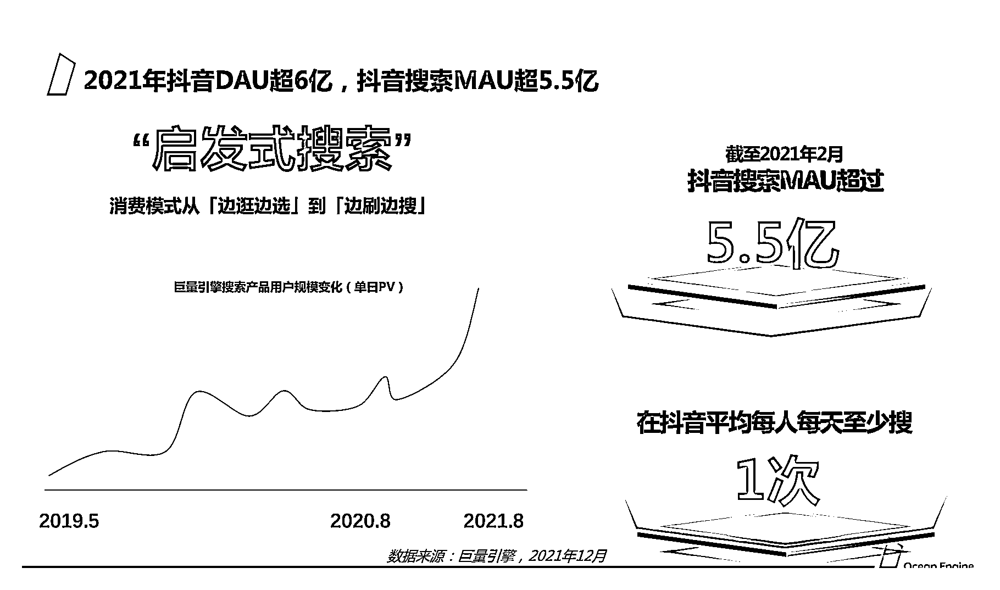
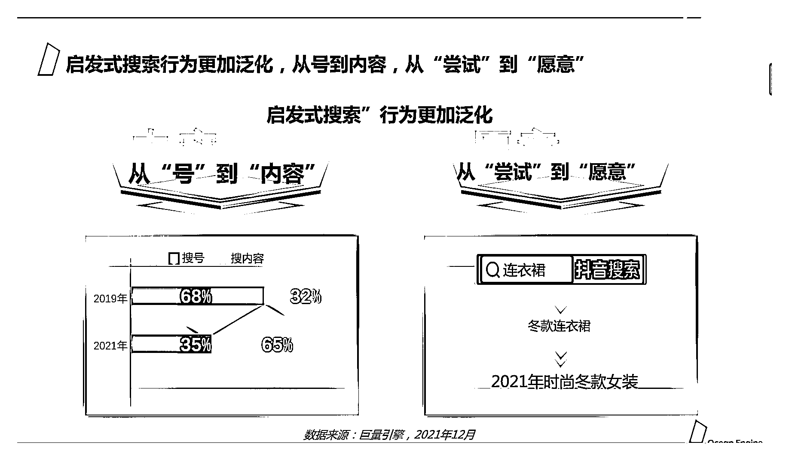
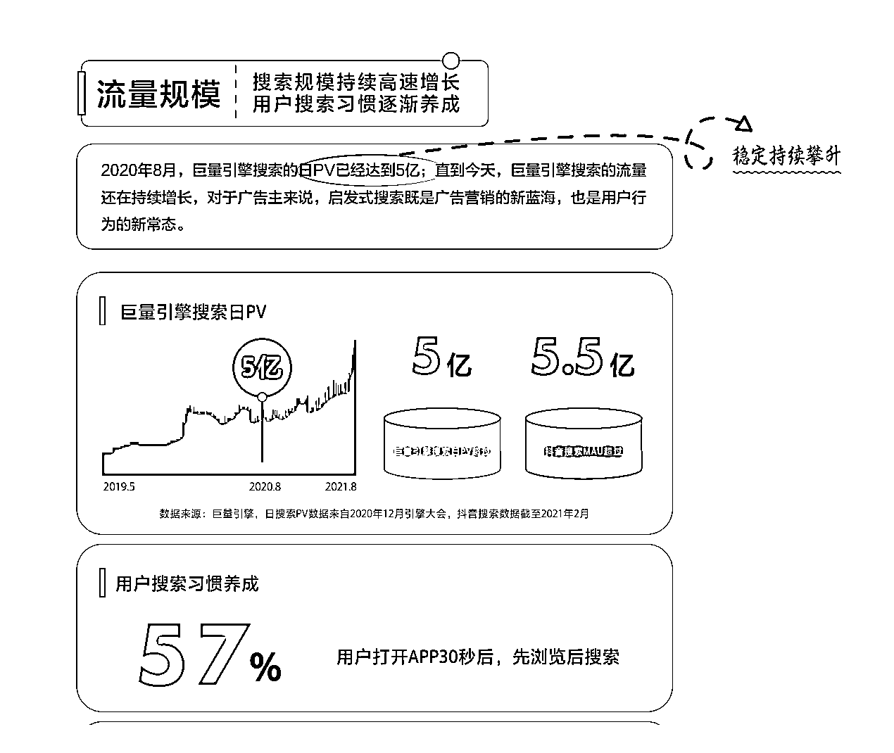
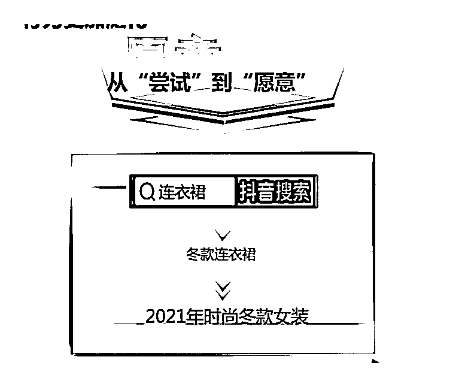
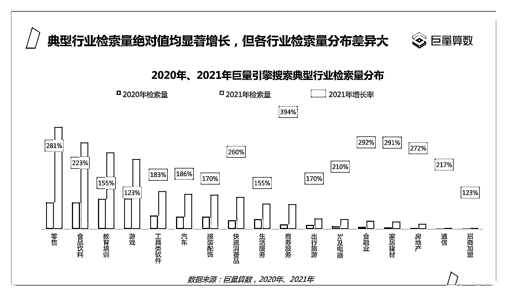
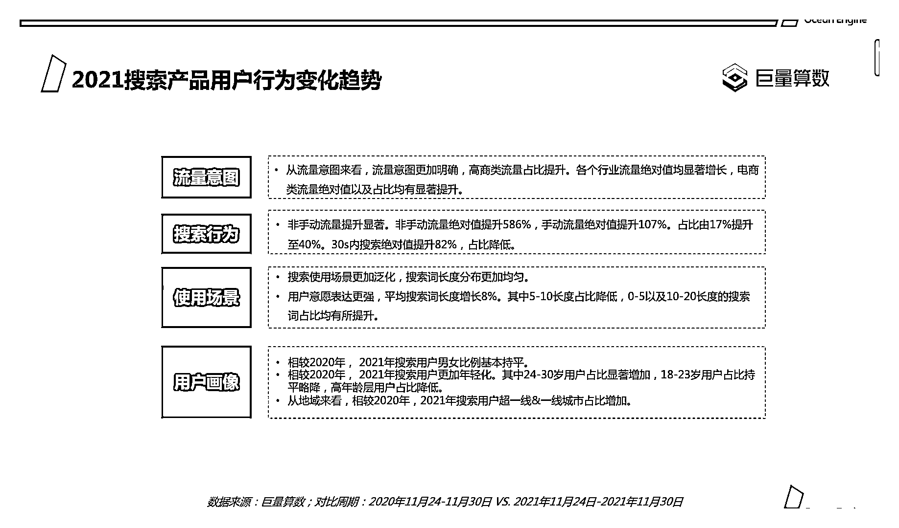
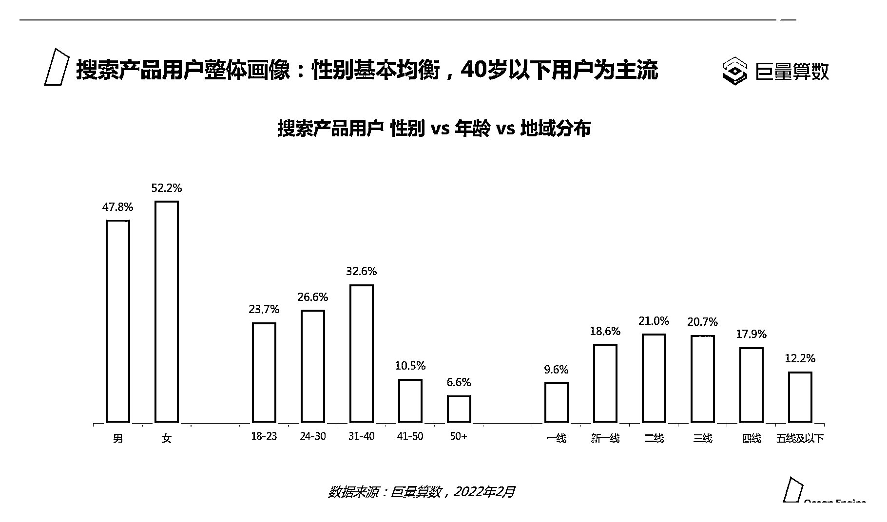
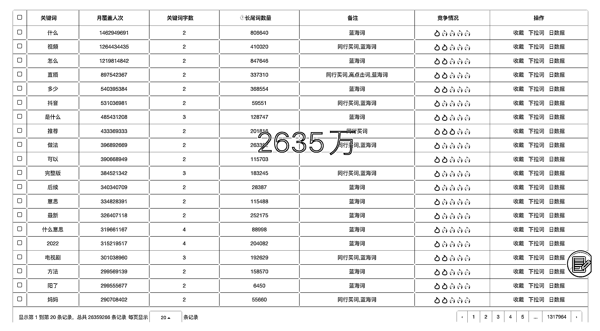
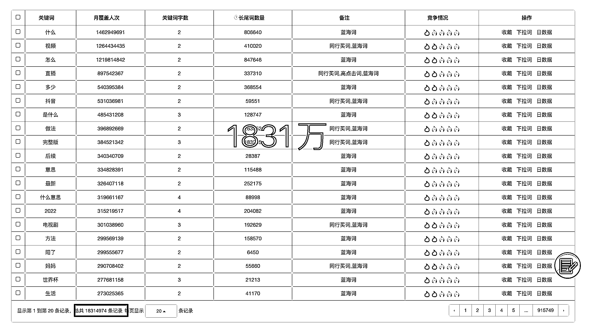
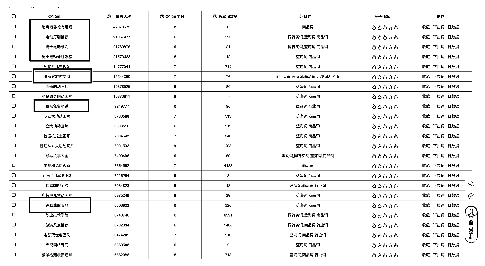

# 1.2 为什么要做抖音 SEO

因为抖音和小红书的流量正在崛起，而百度、淘宝的流量正在减少。

搜索流量被称为精准的流量入口，因为用户是有明确的问题需要去解决才会去搜索，所以需求是相对比较强烈的，这部分人流量很精准。

互联网早期流量入口是搜索，百度一时风头无两，力压腾讯和阿里，成为 BAT 之首。虽然现在百度没落了，并不代表搜索这个行为没落了。

以前百度和淘宝是主流的搜索渠道，一家代表着信息，一家代表着电商。但百度成立于 2000 年，淘宝成立于 2003 年，已经存在 20+ 年了，竞争对手早把市场给瓜分的差不多了，已经是红海中的红海了。

而如今，抖音和小红书作为新崛起的渠道（抖音成立于 2016 年，坐拥 7 亿日活；小红书成立于 2013 年，也有 1 亿日活），并且 60% 以上的用户都有搜索行为，因此搜索流量是无比恐怖的。

大家可以回顾一下，日常的搜索行为是不是越来越倾向于在抖音或者小红书等平台了。

1、抖音搜索数据梳理

抖音平台的发展阶段梳理：

31

根据 2021 年 12 月底抖音公开的数据（ 2022 年数据未公开），可以得到三点启发：

1）搜索习惯正在逐渐养成

根据官方公布，截止到 2021 年 12 月底，抖音搜索月活超过 5.5 亿，在抖音平均每人每天至少搜索一次，也就是说日搜索人次超过 6 亿次。

搜索行为正在从「找号」过渡到越来越多「找内容」，具体说明为搜索内容占比从 2019 年的 32% ，正在变到现在 65% ，大幅提升。盲猜到 2022 年年底可能会占据 90% ，而且需要说明的是，现在搜索流量还处于早期阶段，未来有不可想象的发展空间。

2）商业价值越来越强

用户的搜索意图越来越明确，购买欲望也越来越强，从连衣裙 -> 冬款连衣裙 -> 2021 年时尚冬款女装。

电商类的搜索流量增长率显著提升，比如：零售提升 281% 、食品饮料 223% 、教育培训 155% 。

多个行业的搜索量上升幅度明显增大（超过 200%） ，说明增长势头强劲，流量红利明显。

搜索用户的女性占比 52% ，大于男性的 48% ，24～30 岁的用户占比显著增加，一线和超一线城市占比增加，消费能力明显增强。

2、抖音搜索是蓝海市场

红海是需求大竞争大的市场， 蓝海相对来说是需求大竞争小的市场。

抖音目前有 2 个比较大的流量入口，分别是「推荐流量」和「搜索流量」，目前「推荐流量」的竞争度正在越来越卷，比如考核指标有 5 秒完播率、 2 秒跳出率、互动数据等等。但是从上面官方的数据增长率中可以看出，目前抖音的「搜索流量」竞争还较为蓝海，至少大部分的关键词都是蓝海词。

接下来我们分别从「词」的竞争度和「人」的竞争度 2 个维度进行查看。

1）词的竞争维度

根据我们自己研发的「极客增长」工具中的数据统计显示，在 2600 万关键词中，其中搜索量大而竞争小的数据有 1831 万条，1831 / 2635 = 69.4%，接近 70% 的蓝海词。

2）人的竞争维度

再从「人」的角度看，在我们统计的 5000 万条抖音 kol & koc 中，通过对 2000 万博主视频的数据进行采样数据发现，99% 的抖音博主都不懂 SEO ，他们作品中的标题和话题均较为简短或者无意义。

总体而言，我们可以从搜索上发现很多蓝海机会，比如下图：

通过工具，一下子就发现了很多有价值的蓝海机会，如“男士电动牙刷推荐”这个词，月覆盖人次 2157 万，竞争度为 2 ；比如“番茄免费小说”这个词，月覆盖人次 924 万，在系统竞争度也是 2。还有大量有商业价值的词可以挖掘。

举个例子来说，去年我们专门做了一个基于抖音 SEO 的旅游账号，虽然一年没有更新了，每天还有 1000 的搜索曝光，并且 93% 的播放都是来自搜索。

点击蓝字可直接进入主页：[涵涵在杭州的主页 - 抖音](https://www.douyin.com/user/MS4wLjABAAAAu7pVcXoW8WD9UtQYBu_T1ioTZkW-tRNuS_d9SfUE852vKCzU6WUdL0aLRlF_bFgN)

[1662106409518540.mp4](https://search01.shengcaiyoushu.com/upload/doc/XEb4d9F4WogubixyOM9cMVeen0d/KRIcbE66ho7KNtx8seBcUbyFnfc)[1662106588939932.mp4](https://search01.shengcaiyoushu.com/upload/doc/XEb4d9F4WogubixyOM9cMVeen0d/W3bcb8lOuoUpjNxcYD2cFOwVnWh)

相比较自然流量需要每日维护更新内容、付费流量成本高，抖音搜索流量的优势在于：

•竞争小：目前还属于流量蓝海洼地蓝海，提升排名还比较容易；

•见效快：小词正常 1～5 天即可见效，快速出效果，大词 1 个月可以见效；

•成本低：不需要每日更新视频，只需要每个月更新视频，围绕一个词每个月更新一个视频；

•更精准：用户意图明确，成交概率更高；

•不违规：都是正常的操作手法，无需违规。