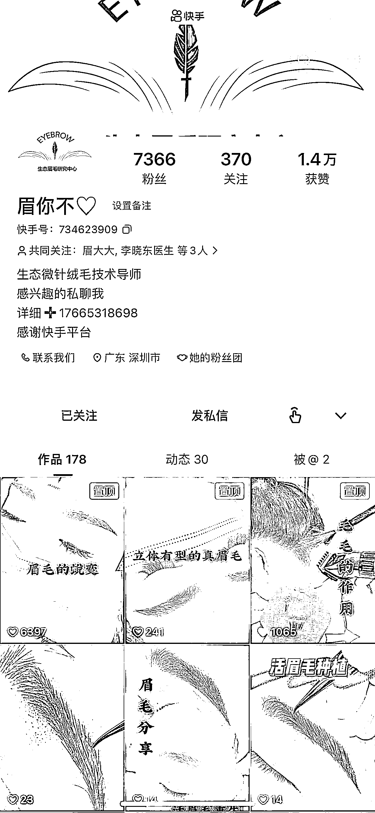
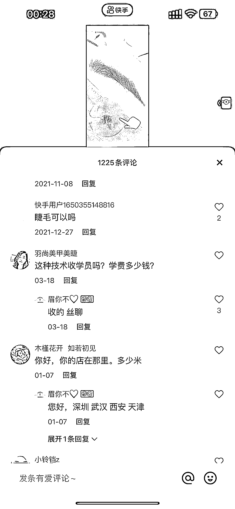
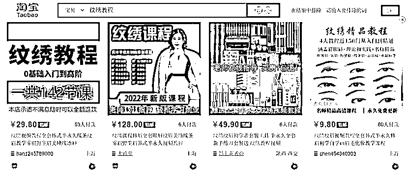
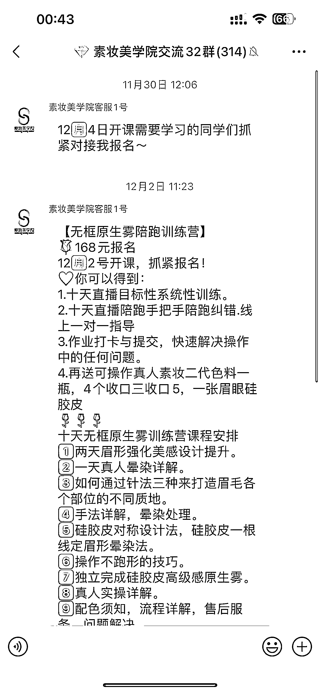

# 2.2 思路二：通过已有项目延伸

我有 7、8 个的抖音、快手、小红书账号，有男账号，有女账号，有老人年，有年轻人的，为的就是让平台按人群给打上标签，去看看这些人群都喜欢看什么，我基本上所有的项目都是刷出来的，就是一个看， 从自己身边开始发掘。

比如：种植眉毛，取你自己的后脑勺的细发种植到你自己的眉毛上。这个也是我自己调研的一个私域项目，变现分为两部分，第 1 种是直接客户的种植服务，客单价在 1 - 3w 。第 2 种就是相关的技能培训服务，客单价在 2w ，这种服务都是需要去动手实际操作练习的，只是看线上课程仅仅也只能掌握一个操作流程，可是手法依然很陌生。

这里面可以切入的点，就是卖线索和线上课，其实这个东西，很多的美容机构都有在做，比如雍禾，但是他们主要业务还是是植发，不是专门做这个，我透个底，这个事情和很多机构合作起来不复杂，感兴趣的小伙伴可以了解一下。

传统的纹绣大家并不陌生吧，我之前做过这个，在淘宝店铺引流，然后卖线索给线下机构，他们在微信群里销售高客单（ 3000 到 1w 多不等）技能培训。

我自己一方面淘宝单店卖教程每个月收入大概有个 4 - 5w，同行都是卖的十几元、几十元的，而我当时卖的客单价是最贵的 199 元的，就是把市面上所有的课程买来后整理、筛选、分类。二就是卖给机构的一个线索几十元。

这个项目的背后其实就是切的一个细分的人群，她们是一群想创业的女性，而纹绣已经到了甚至不需要门店，只需要一套设备就可以上门做了，这些群体只要做好同城的线上引流就行了，但是单纯的线上视频你是根本学不会的，视频里你也只能掌握需要投入多少成本、什么设备，大概的操作流程和手法，还是必须去机构。

你看，是不是植眉就是类似纹绣的升级版，纹绣都是半永久的，一般需要过个一年半载就需要去重新纹一次，而纹绣本身就是一种轻微的创伤，而且也没有自然毛发的自然，大城市做一次它的价格也在大几千甚至上万，而种植是即可效果，永久性的，虽然贵了一点，但是人群都是高净值的，很容易转化。

