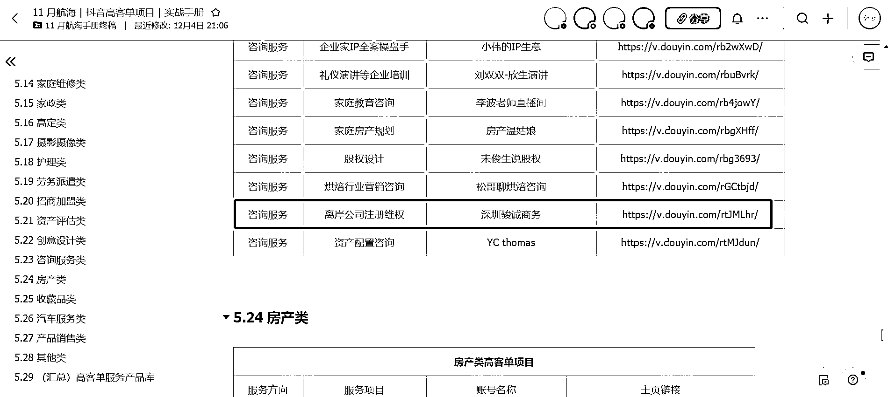
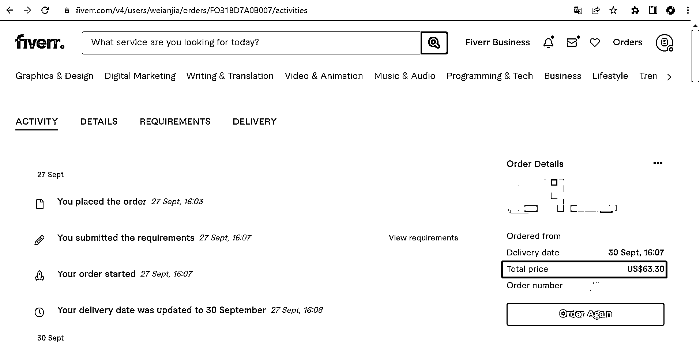
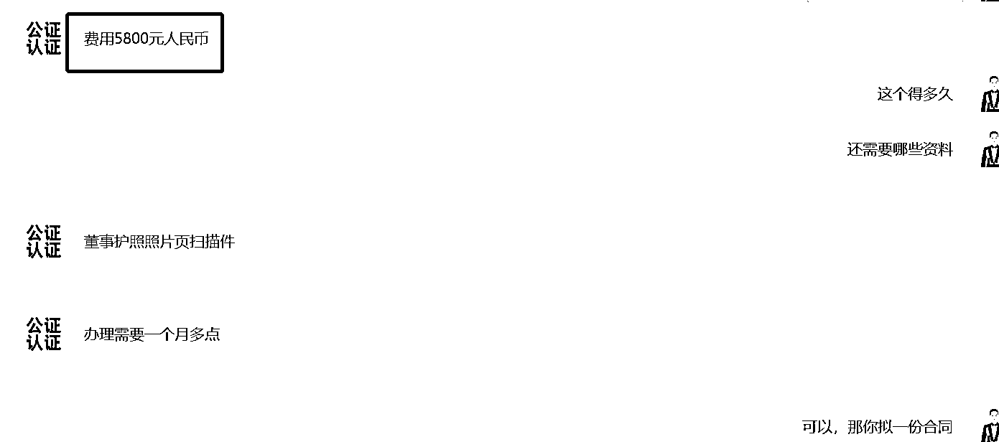
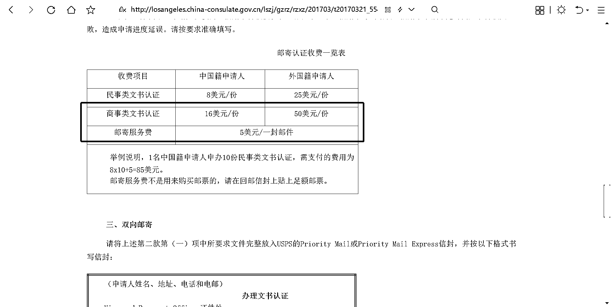
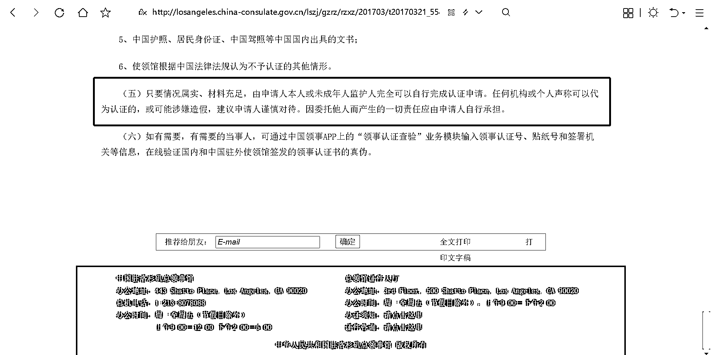

# 2.3 思路三：做高客单项目中介

其实早在生财手册里分享的案例库之前，我就早早注意到了这个做离案公司注册、维护公司（类似国内的年审、代记账服务）的账号。这个账号大部分是分享的香港公司，因为很多做跨境的都是需要注册香港公司的，而我因为在淘宝做虚拟服务项目，也注册了美国、英国、香港、新加坡等国外的公司。

比如，你通过猪八戒注册一家英国公司的费用在 3900 元，每年的维护费用在 3500 元，可以是你知道吗，我在 fiverr 找一个本地的代办注册的英国公司，也就是 60 美元就可以了。

专业的事情，交给专业的人去做。你不用去研究，他是怎么搞定注册地址、电话之类的，其实就和我们国内注册个体工商户、食品许可、二类医疗器械许可一样的代办服务，相关部门对地址可能根本不去实际核实的，除非你开银行对公账户。

你只要利用好引来流量 + 这个信息差就足以了。何况还有每年几千的维护费，只要这些公司还在运作。

那我通过这个再延伸一个项目给大家，也是我自己调研的哦。一单的利润在 4000+，就是国外公司文件在国内使用时是需要做领事认证的，领事馆是没有任何的第三方代理机构的，费用也不过几十美元。

但是因为这个事情自己去办理又比较生疏，所以就有了这个需求。而国内的很多这种所谓的代办，价格之间相差 1000 多元，本身就已经是一个信息差了，知乎上很多引流的都是倒爷。

国外的文件在国内使用需要认证或者公证，而国内的文件在国外使用同理。具体还有哪些可以做的，大家去这里细品吧，希望能找到贴合自己的：[`losangeles.china-consulate.gov.cn/lszj/`](http://losangeles.china-consulate.gov.cn/lszj/)

内容来源：《如何挖掘蓝海高客单项目》