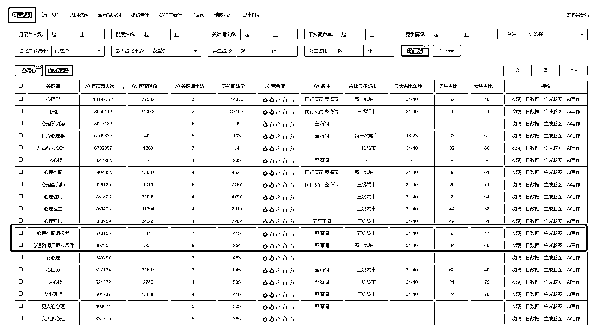
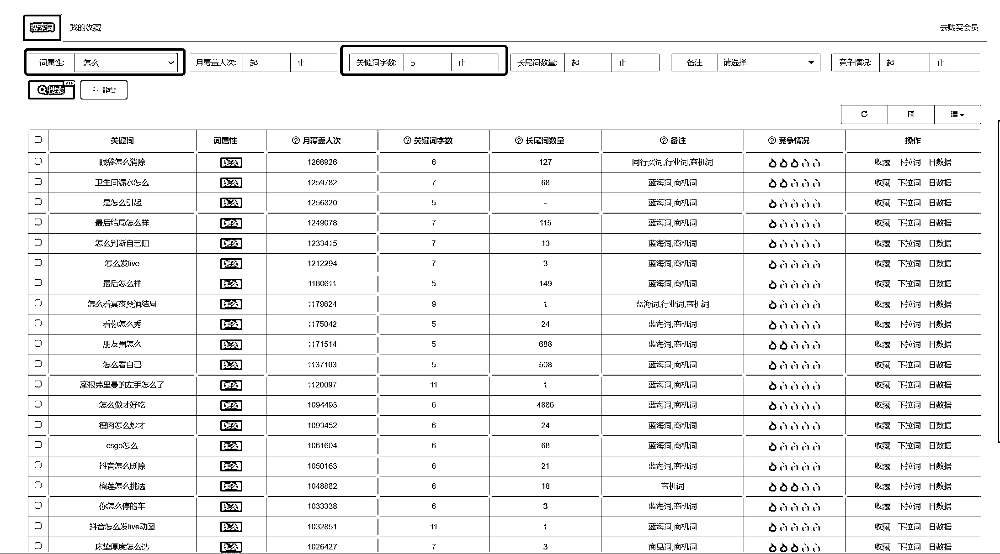

# 2.4 思路四：通过选词工具找项目

其实高客单价的项目，小部分靠挖掘，大部分已经存在，于是我们可以通过特定的领域关键词，去挖掘高客单价的需求，从而更好地找到细化的方向。

极客增长大数据选词工具，为大家提供了商机挖掘模块。接下来演示一下如何通过这个模块挖掘高客单需求。

1、根据已有行业词根挖掘商机

我们以心理学为例，直接打开极客增长个人版选词工具，搜索词根“心理”，会看到以下词库。

然后根据月覆盖人次排序，我们就能看到搜索心理相关最火的关键词，这个时候我们浏览一遍词汇，发现了一系列商机，比如心理咨询，心理测试，都是比较常见的，然后我们还发现了一个跟高客单价相关的词，就是心理咨询师报考。

如果对心理学有点了解的人会知道，心理咨询客单价基本上 300～800 元/小时，但是大部分咨询师年收入不超过 5 万，说明这目前不算是个很优质的项目，其中的坑只有踩过的才知道。

但是，心理咨询师报考就不太一样了，有心理咨询的需求的人，能去做心理咨询的不算多，但是能去学习心理学，报考心理咨询师的人却一大堆，目前这个市场已经没有国家认可的咨询师证可以报考，那么对于想赚心理咨询培训的人来说是个机会。大部分心理咨询培训的客单价在 3000～100000 左右，确实是个不错的商机。

以此类推，不仅是心理行业，类似的行业也可以通过关键词去挖掘。

2、根据需求词挖掘商机

我们以极客选词工具中的商机挖掘模块为例，词属性筛选“怎么”，关键词字数筛选“5”，然后看看出来的相关需求。

我们可以很清楚地看到，眼袋怎么消除、卫生间漏水怎么办、床垫厚度怎么选，都可以是高客单价的生意，背后代表的是美容人群、装修家居人群等等，都可以挖掘出相对应的高客单价项目。

传送门：[`dyinseo.com/DouyinKeywordBusiness/index.html`](https://dyinseo.com/DouyinKeywordBusiness/index.html)