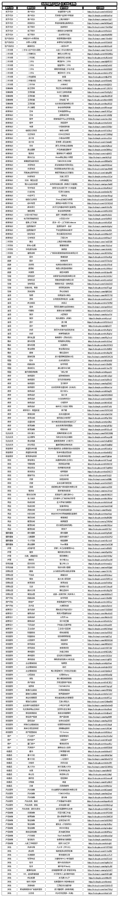

# 2.5 高客单项目案例库（含 230+ 案例）

我们结合了解到的高客单项目方向，为大家整理出了一批可执行的项目方向，并在抖音上找到了从事该项目的抖音账号，供大家参考。

为什么要这么做呢？因为行业千千万，我们无法给出每个行业、每个项目的执行细节，只能在前文中给出常规的方法总结。而落地到具体项目上，还需要你自己填充细节。

例如，落户代办需要准备哪些资料？你需要提前了解哪些信息？可办理的时间是什么时候？ 再例如，二手拖拉机租赁服务如何找合作商？如何商谈上端与下游价格？租赁协议如何填写？……

诸如此类的资料，希望你在找到方向后自己寻找并学习。而我们能做的，就是为大家提供一些可选的方向建议，也就是这份案例库。

•服务方向：即这个项目属于哪个大类别，例如线下代办、二手贸易、教育培训等

•服务项目：即具体可执行的项目，也是这个项目的关键词。你可以根据这个词去寻找各类资料，组建起你的服务体系

•账号名称：对应项目在抖音上的案例账号

•主页链接：案例账号在抖音的主页链接，可以跳转学习

我们将各个高客单类别的产品汇总为一个表格，为手册方便阅读，这里仅做图片展示。完整的产品库表格，你可以点击链接进行查看：抖音航海｜实战工具包

所以开始选择你的方向吧——

内容来源：2 月航海｜抖音高客单项目｜实战手册

