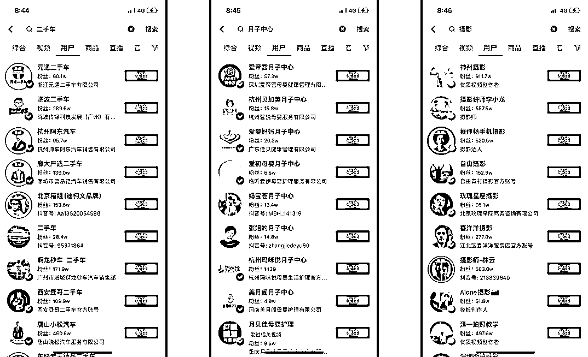

# 3.1 认证账号

问题：账号是否认证对排名会有影响，哪种账号的排名优先级会更高？

选项 A：蓝 V 号和黄 V 号（蓝 V 号是公司认证，黄 V 号是个人认证）选项 B：普通个人号

正确答案：A

搜索关键词后，选择用户列表，可以看到一些常见的、有价值的搜索词，排在前面的大多都是蓝 V 或者黄 V ，没有加 V 的用户相对较少：

搜索一些竞争度高、可以变现的关键词，基本上也都是蓝 V 或者黄 V ：

为什么都是蓝 V 或黄 V 呢？因为蓝 V 和黄 V 的权重比较高。

我们知道，在某些领域没有黄 V 是讲不了相关内容的，比如医疗行业，有大量的话题是要有医生资质才能讲。黄 V 代表专业，有门槛，能降低平台的风险。而蓝 V 是企业专属，背后有公司做背书，安全性更高，也降低了平台的风险。因此平台会把账号是否认证作为一个参考因素。

