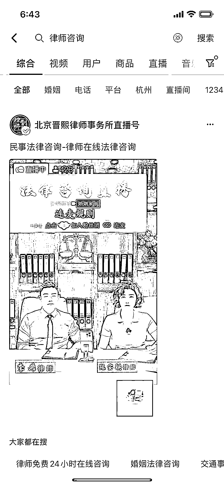
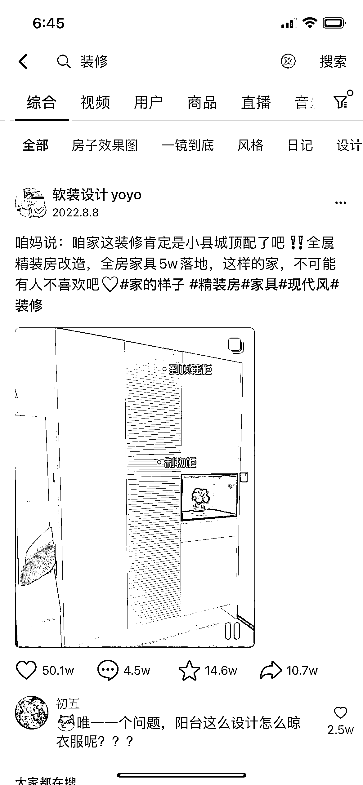
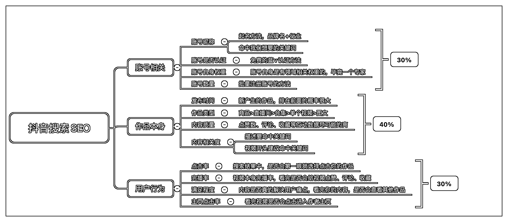

# 3.2 核心关键词

问题：其他条件都不变，内容也一样的情况下，哪种号的排名优先级会更高？

选项 A：账号名称带上想要优化的关键词选项 B：账号名称不带想要优化的关键词

正确答案：A

带关键词的内容，更能够帮助平台识别和精准推荐。尤其是做直播间抢占搜索流量的时候，名称会起到比较大的作用。

下面这几张图中，前二张图中，名称是包含关系或者同义词关系

你可能会好奇第三张，针对「心理咨询证书」这个关键词，账号并没有带对应的优化关键词，排名为什么也在前面？

因为权重元素并不是唯一的，一共有 12 种排名因素，所以并不绝对，只能说这个词竞争还不够激烈：

12 个优化排名细节：

