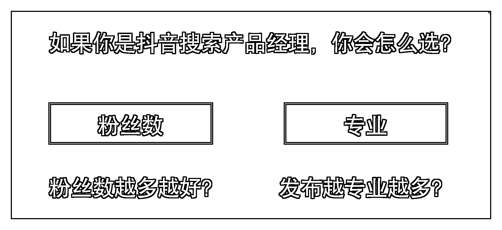

# 3.3 粉丝和话题权重

题目：账号粉丝和话题权重哪个更重要？

选项 A ：粉丝数优先选项 B ：话题权重优先

正确答案：B

话题权重优先、然后才是粉丝数。

因为粉丝数多了，领域就会泛，略懂和专业的区别是一个在珠穆拉玛峰的腰部，一个是顶峰。这也就是说：你在一个话题下面的获得的赞同数越高，你在该话题下面的排名就越高。

但是粉丝数也很重要，粉丝数的高低也代表用户对博主的喜欢程度。只能说话题权重高于粉丝数，看到别人的粉丝数高也不用害怕，在垂直领域内多发内容，别人是干不过你的。

如果你的产品是泛流量，比如鞋子、衣服这种消费品，并且喜欢直播间转化。可以考虑买一个几十万粉丝的号，也是性价比比较高的一件事情。

