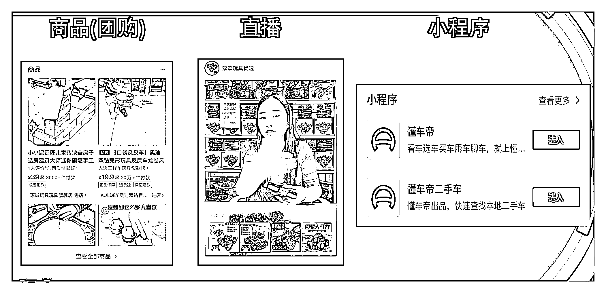
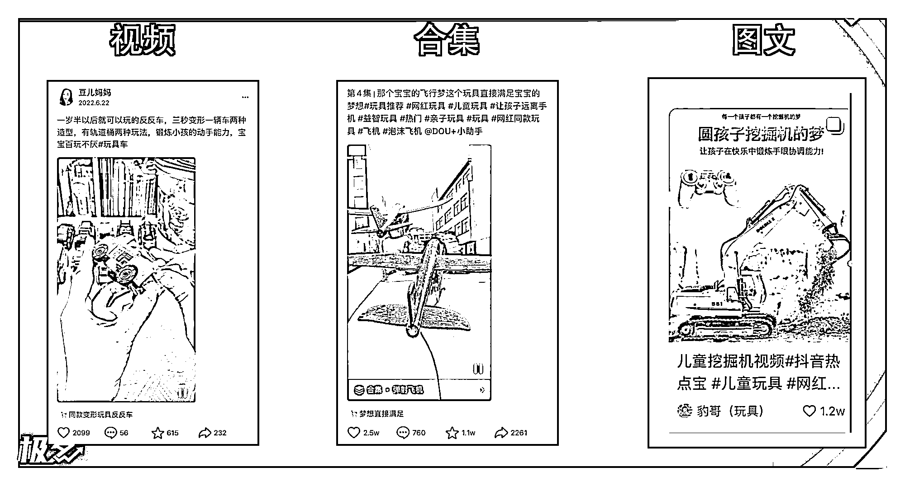
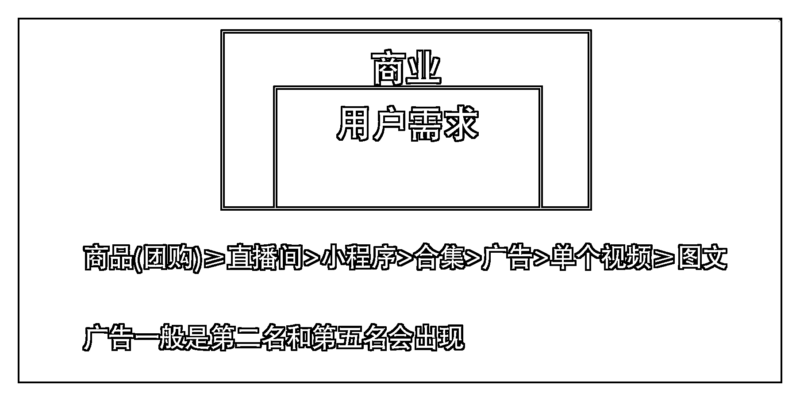

# 3.5 作品类型

问题：下面六个类型，在不考虑内容质量的情况下，权重分别是怎么样的？

1）商品（团购）2）直播间 3）小程序 4）视频合集 5）单个视频 6）图文

正确答案：1 ＞ 2 > 3 ＞ 4 ＞ 5 ≥6 商品（团购） > 直播间 >小程序> 视频合集 > 单个视频 ≥ 图文

理由是什么？

在不影响用户体验的前提下，尽可能的去商业化。

电商是抖音的核心，并且能给商家以及自己带来利润，能赚钱并且能推荐词的卖货词只占一小部分，能卖货就尽量卖货；直播间也是能卖货的，并且能够完美的实现人货场，可以实时互动，解答用户的问题，直播间转化率也非常高；视频合集是算合集下面所有视频的点赞、播放、评论、收藏等数据；视频的优先级比图文高，这个不用讲，大家应该都了解。

