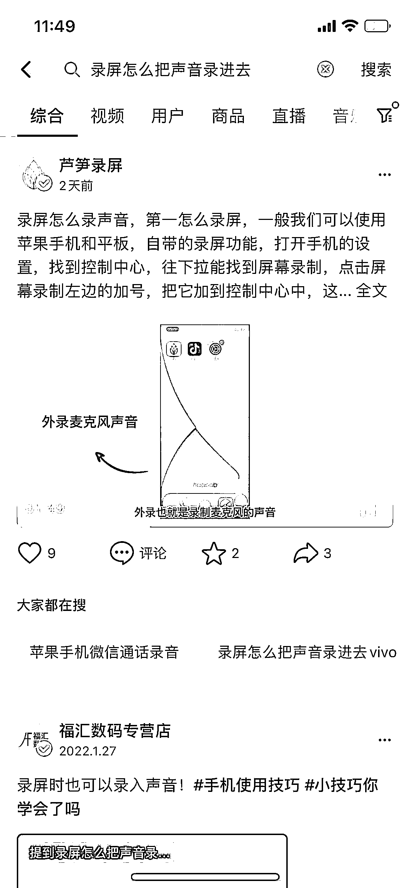
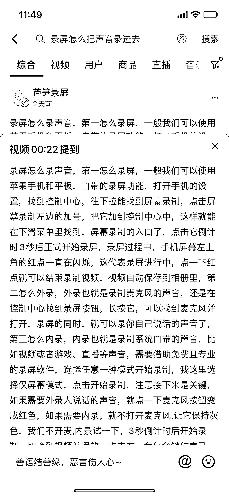
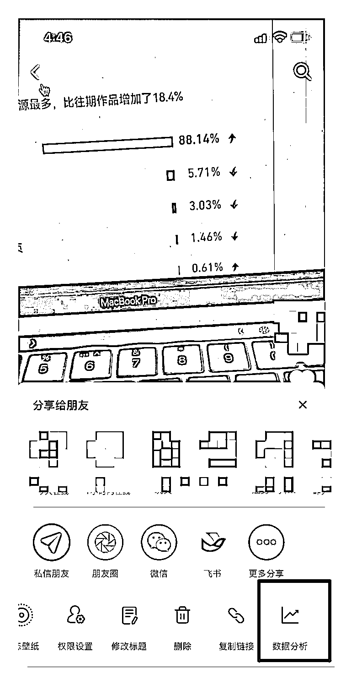

# 3.6 标题内容

问题：标题一定要命中关键词么？

正确答案：是（关键词的同义词也可以，但最好是关键词本身）

你想做哪些词的 SEO ，比如想做「录屏软件」这个关键词，就一定要在合集的标题、视频描述、话题、视频中命中这个关键词。这样对抖音的算法很友好，算法不用揣摩你视频到底在解决什么样的问题，一来对用户很友好，二来可以看到自己的搜索词。

关键词要出现在这 几 个地方出现超过一次：

•作品描述是否包含关键词

•作品内容是否提到关键词

•作品合集是否包含关键词，合集的描述

•作品话题是否包含关键词

•作品封面是否包含关键词

你可能有疑惑，视频中也要讲关键词么？

抖音为了增加识别的准确性，可以识别视频中的语音，所以我们要在视频的内容里，也说到这个关键词：

在描述中加话题有那些好处？

•你会累计这个话题的权重，做排名更容易；

•有了话题，排名会更加好；

•同时可能可以蹭到对应话题合集下的一些流量；

•话题最多添加 5 个，并且不要添加与内容无关的话题，会影响推荐流量。

注明：如果是学课程之前发布的视频，没有注意 SEO 的事项，可以选择图 1 中的修改标题，进行优化，搜索流量就会涨起来。

30 天内发布的作品，在手机端还可以修改自己发布的标题、话题、封面等内容。

如果超过 30 天，则需要到抖音创作者中心，电脑端进行修改：[`creator.douyin.com/creator-micro/home`](https://creator.douyin.com/creator-micro/home)

