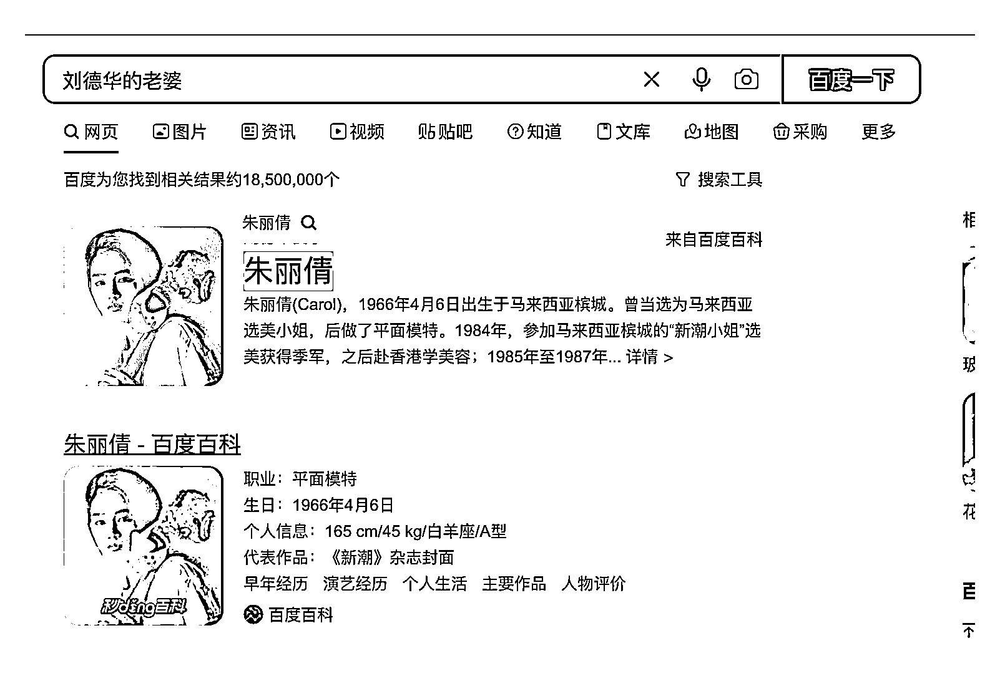
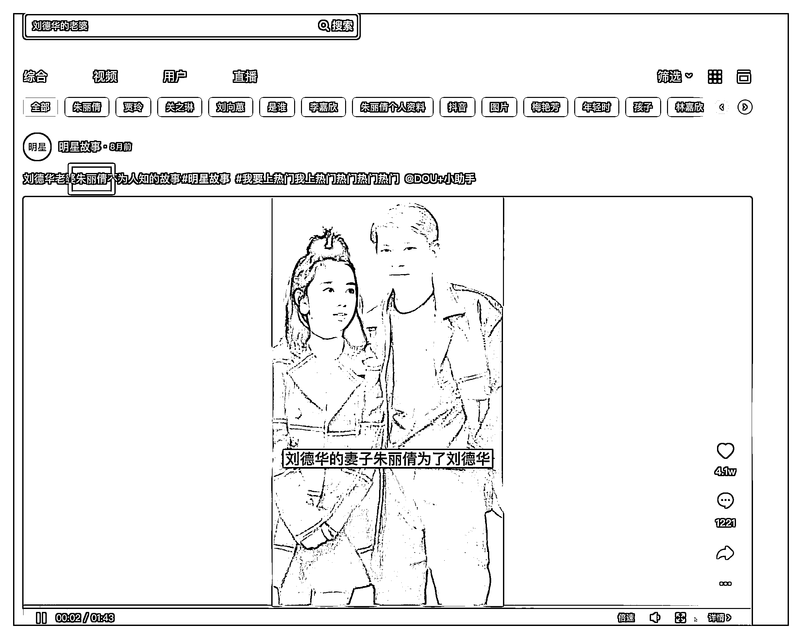

# 3.7 内容收录

问题：发布的内容如何被收录到关键词的搜索结果？

正确答案：相关性算法和用户喜欢程度

1）相关性算法

在百度的算法中，有一条相关性算法，判断文本的内容是否与搜索词相关，比如在你在百度中搜索刘德华的老婆，搜索结果必须是「朱丽倩」，不然答案是不正确的。这个就叫内容相关性的算法。

抖音搜索的逻辑也是一样，会根据内容的相关度，进行关键词排名，因此视频内容尤为关键。

如何保证我们的内容既被用户喜欢，又被算法喜欢，最终做出可以获得高排名的内容呢？

方法一：你对这个行业足够了解，可以写出优质的干货内容。这个对部分同学的要求可能会比较高。

方法二：整合抖音搜索的前 5 条内容，取长补短。抖音搜索的前 5 条内容，已经获得了抖音算法和用户的喜欢，那么我们只要把多条视频的内容进行整合一条，就获得抖音算法的认可。

2）用户喜欢程度

参与收录的结果，不仅仅要从算法的层面去满足，还有考量用户对你的作品打分。

用户是如何对你的作品打分？最低检测的标准是：

•用户是否看完前 2 和前 5 秒，2 秒跳出率、5 秒完播率，目前抖音用户已经耐心已经很小，不喜欢的视频可能 2 秒内就会跳出；目前我们测试下来的建议数值：2 秒跳出率要低于 40% ，5 秒完播率大于 50%，整体完播率大于 8% 。

•其次检测标准是点赞率，点赞播放比是能否达到 3% 。

达到以上数值的作品，才能更好的参与排名，否则也可能不被收录到搜索结果

3）禁止堆彻关键词

有的用户为了做 SEO，喜欢堆彻关键词，正常我们建议的是，一个关键词，在标题和话题中尽量不要出现超过 3 次。否则可能会被判断为堆彻数据。

