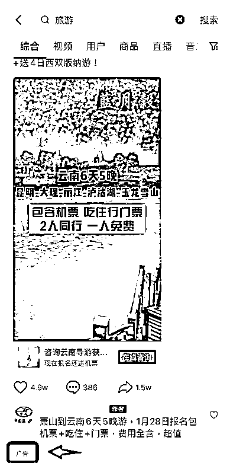
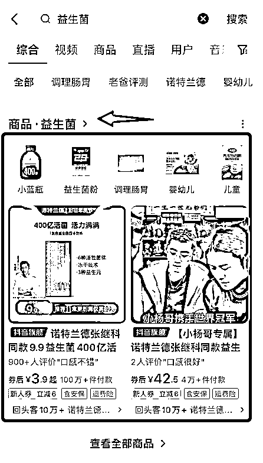
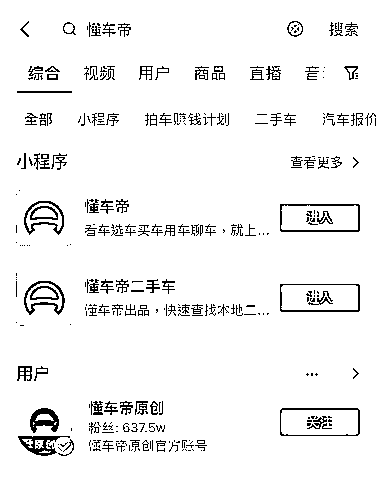
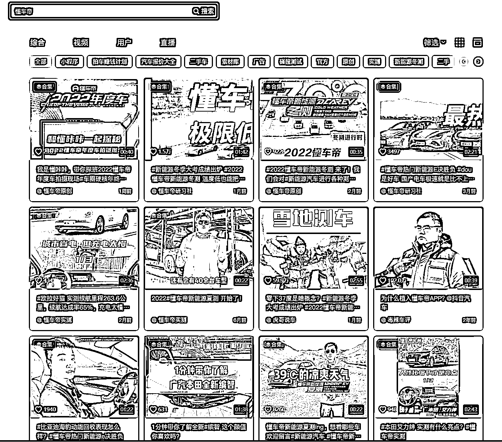

# 3.11 PC 端和手机端区别

问题：抖音的 PC 端和手机端搜索结果都是一样的么？

抖音电脑端和手机端的排名搜索结果是不一样的，手机端会出现商品、广告等内容，但 PC 端不会出现。

我们举 2 个例子，比如“旅游”，会发现手机端会出现广告，但 PC 端不会：

比如搜索“益生菌”，在手机端会出现商品，而 PC 端不会：

比如说搜“懂车帝”，手机端会出现小程序，而 PC 端不会：

