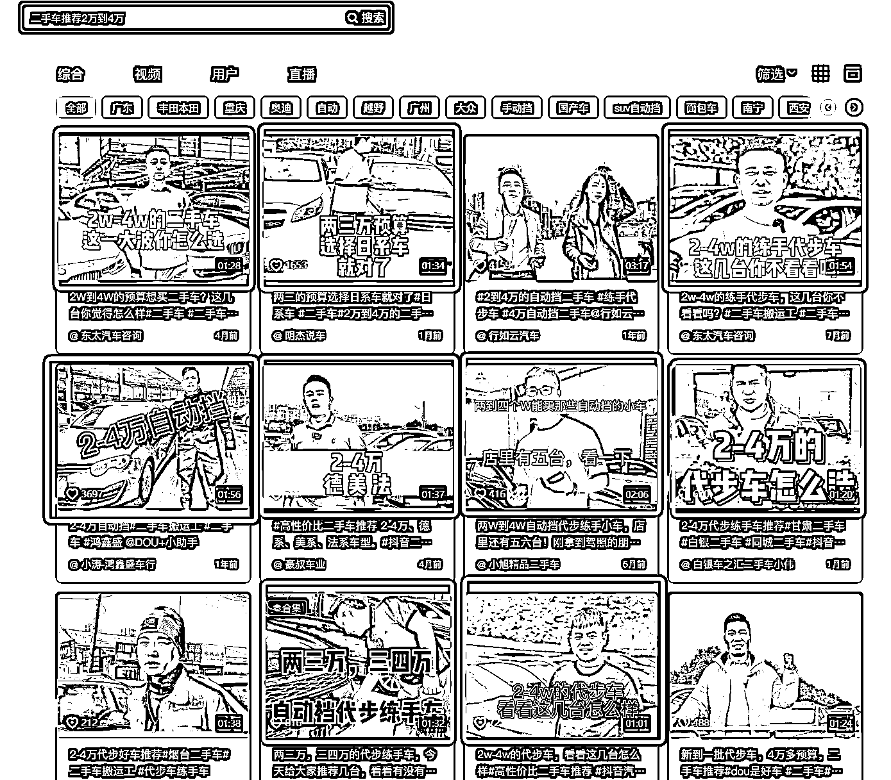

# 3.12 作品封面

问题：作品封面（含开头前 3 秒）对排名 SEO 有影响么？

用户在搜索过程中，会优先点击封面吸引人的作品，会提高搜索结果中“点击率”这个参数。至于什么样的封面吸引人，和行业有关，具体方法就是多搜索多看，多收集。

比如能抢占到“二手车推荐 2 万到 4 万”这个关键词排名靠前的视频，基本上封面都会命中关键词，因为搜索词与展现结果直接对应，所以看封面就很想点击视频：

为什么封面会如此重要？

不仅仅设计吸引用户点击，也会涉及到抖音的内容识别算法。

抖音不仅仅会从文字中理解视频的含义，也会识别视频中的文字。具体的操作逻辑就是，视频抽帧检测：会在整段的视频中抽取一定的帧数的画面，来识别文字。

如果你没有提交的封面，那么抖音就会随机取一些截图进行识别。如果你提交了封面，就会识别到你提交封面，封面最好包含 SEO 的关键词。

