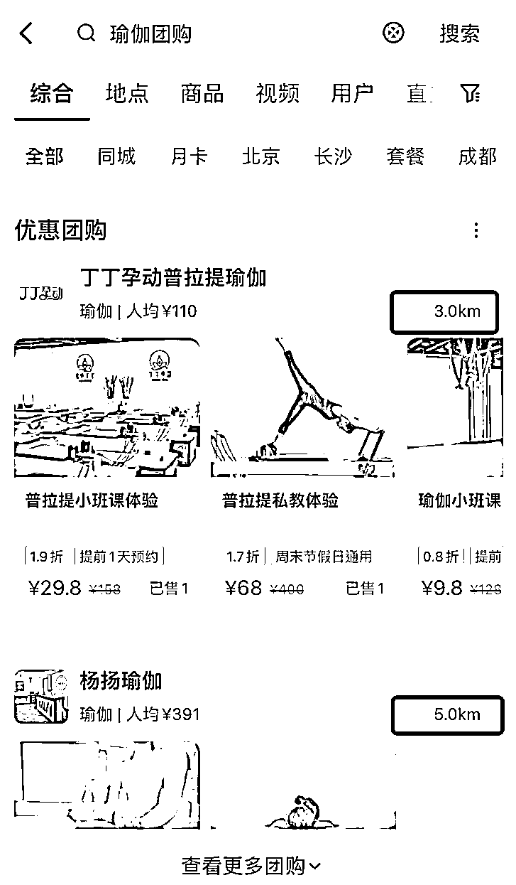
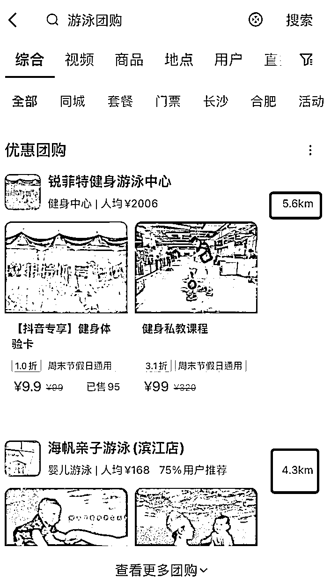

# 3.14 千人千面

抖音的算法是千人千面的，对于竞争激烈的词，尤其是本地生活类的词，不同人的搜索看到的结果可能是不一样，用来测试数据结果。

千人千面具体指的是什么意思？不同的人看到的搜索结果不一样，但是整体一致。

比如说有的人看这条视频的排名是第一名，有的人看则是第五名，不同人看到的展现顺序有可能变。整体搜索结果一致是什么意思？

搜索结果中，展现视频的顺序会发生变化，展现的内容主要还是那些视频，只是排序发生变化。

为什么会有千人千面？

1）有的人看搜索结果是第一，有的人看搜索结果是第十。这是因为抖音有灰测环节，先给你的作品第一名看看数据情况，数据展现不好的话，排名就会下降，数据好的就提升，直至稳定。

2）个性化。每个抖音账号都会有自己的标签，比如地域、兴趣、年龄、性别等，当用户搜索关键词时，抖音会基于内容的排名情况，再结合用户的标签和行为数据，推荐最匹配用户的搜索内容。

比如我们搜团购类型的关键词，会优先推荐离用户近的结果：

总之：抖音的手机端变化很多，不同的人看到的结果不一样，并且抖音会出现轮流展示索结果的前几条内容，来判断那些内容更能够满足用户的需求。

