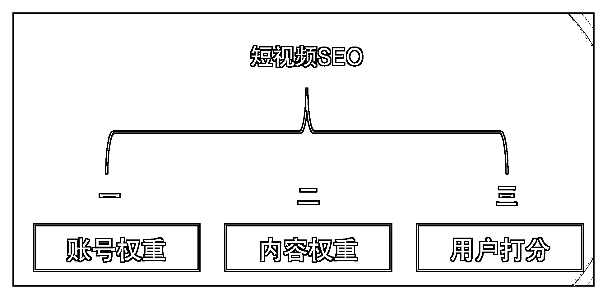
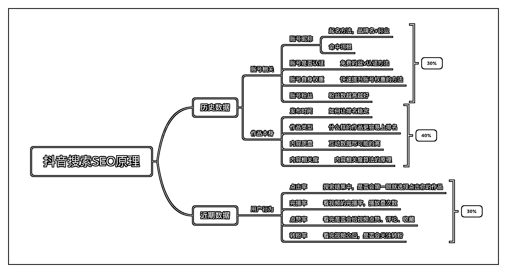
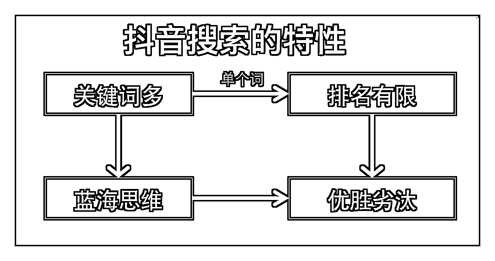

# 3.15 抖音 SEO 原理总结

抖音搜索 SEO 的排名算法，竞争逻辑是“优胜劣汰”和“蓝海思维”。我总结了一张脑图，将抖音 SEO 分为 3 个部分：账号属性、作品本身、用户行为。

12 个优化排名细节的脑图：

注意蓝海思维，我们要从大量的关键词中，找出自己的蓝海关键词。

因为单个关键词的搜索结果有限，所以我们必须保证自己的作品得分能够战胜竞争对手。

最终才能获得较好的排名。

